# 第十二章 颜色

表示和处理颜色是像 GIMP 这样的图像处理程序的基本任务之一。因此，我们在本书的多个章节中都涉及到这个话题。在这一章中，我们介绍了主要的概念和工具。在附录 A 中，我们讨论了颜色感知的基础知识，如果需要复习相关知识，可以参考该附录。颜色和视觉的理论构成了 GIMP 中颜色处理的基础，全面理解该附录将帮助您完全理解本章内容。

此外，第十九章包含有关 16 位色深和处理数码相机原始格式照片的信息。第二十章描述了 GIMP 处理的所有图像格式，重点讲解了色板的定义和使用。而在第二十二章中，我们解释了如何设置颜色管理的参数。

# 12.1 概念

颜色的概念是非常复杂的，许多书籍已经对这一主题进行了详细探讨。像亚里士多德、惠更斯、牛顿、歌德等伟大的思想家们都曾提出过关于颜色的理论。这些理论涉及了生理学、哲学、心理学，甚至物理学和高级数学。现代计算机技术、显示屏和打印机现在依赖于一套成熟的理论，您可以在任何关于颜色理论的文本中阅读到这些内容。

在本节中，我们首先简要回顾一下颜色模型，更多细节将在 A.3 颜色表示中介绍。然后，我们将讨论 GIMP 在工作过程中用来存储图像信息的三种内部表示方式。用于存储图像的外部格式，通常存储在硬盘或网络上的格式，将在第二十章中讨论。

## 颜色模型

GIMP 处理的是由*像素*组成的栅格图像。像素是最小的图像组成部分，表示单一颜色（及其相关的透明度）。每种颜色都是由独特的组成部分混合而成，这些组成部分取决于所选的颜色模型。存在多种颜色模型，GIMP 使用其中的三种。在所有这些模型中，给定的颜色都通过某些维度的坐标表示，通常是三维坐标。坐标范围的大小表示可能的颜色数量。由于文件大小的限制，坐标通常是整数，至少在存储在外部介质上时是如此。浮动数字需要 32 位甚至 64 位，而所有图像文件中的颜色表示最多使用每个颜色 8 位。

RGB 模型是加法模型，意味着每个分量值为零的颜色是黑色，而每个分量值为最大值的颜色是白色。三种基础颜色是红色、绿色和蓝色，两个基础颜色的组合是互补色：红+绿=黄，红+蓝=品红，绿+蓝=青色。这个模型可以表现为一个立方体，其内容定义了可以表示的颜色的色域（或范围）（见图 A-37）。

CMY 模型是减法模型，因此每个分量值为零的像素是白色，而每个分量值为最大值的像素是黑色。三种基础颜色是青色、品红色和黄色。它们被组合起来生成 CMY 模型的互补色，这些互补色也是 RGB 模型的基础颜色：青+品红=蓝色，青+黄=绿色，品红+黄=红色。CMY 立方体（见图 A-40）是 RGB 立方体的对立面，但定义了相同的色域。

HSV 模型既不是加法的，也不是减法的。色相（hue）分量表示的是一个圆圈上的角度，范围从红色到紫色，最后又回到红色。饱和度（saturation）分量是颜色的百分比，从 0%（白色，完全没有颜色）到 100%（完全饱和）。亮度（value）分量也是百分比，从 0%（黑色，完全没有光）到 100%（完全亮度，最大光亮度）。这个模型可以用一个圆锥或圆柱来表示。

显示设备通过组合不同颜色的光来生成颜色，通常使用 RGB 模型。这个模型也对应计算机内部的主要表示方式，正如本章稍后所展示的。打印设备通过叠加墨水来生成颜色，使用的是 CMY 模型。为了降低墨水成本，通常会增加一个第四个分量——黑色，从而形成 CMYK 模型。在该模型中，黑色可以通过多种方式表示。例如，100% C、M 和 Y 与 0% K，或者 100% K 与 0% C、M 和 Y 都可以表示黑色，但前者看起来较浑浊，并且需要更多的墨水和更长的干燥时间。因此，CMY 和 CMYK 模型的色域是相同的，选择哪种模型取决于打印机。HSV 模型的设计旨在对人类直观易懂。它提供了一个视觉界面，用户可以选择色相（H）分量，然后设置饱和度（S）和亮度（V）分量，而不是输入由三个数值坐标组成的颜色。

## 存储表示

在 GIMP 的内存中，一个像素始终使用 RGB 模型表示。在 GIMP 2.8 中，每个 RGB 组件由 1 字节表示，这意味着其范围是 [0 到 255]。因此，不同颜色的数量是 256³ = 16,777,216。这看起来颜色很多，但在某些情况下，这还不够，稍后你会看到。如果没有透明度，一个像素需要 3 字节。如果有用于透明度的 Alpha 通道，那么该组件由额外的 1 字节表示。

当图像以 GIMP 原生的 XCF 格式存储时，只会存储三个或四个必要的字节。存储和检索不需要任何转换，但图像文件仍然可能非常大。例如，一个带有 Alpha 通道的 1000 万像素图像占用 40MB 的空间。

图像的*模式*，位于 **图像: 图像 > 模式**，并不决定图像在内存中的表示方式。相反，它决定了图像的处理方式。*RGB 模式*是最强大的，因为它对应于图像的存储表示，并允许存储大量不同的颜色。

对于灰度图像，RGB 表示过于复杂。在*灰度模式*下，每个像素只包含一个组件（假设没有 Alpha 通道）；这个组件表示光的强度，从 0 代表黑色，到最大值代表白色。在 GIMP 2.8 中，一个灰度像素使用 1 字节，因此值的范围是 [0 到 255]。这个范围不算大，而且非常大的灰度渐变——例如，风景照片中的天空——可能会显得有条纹。灰度图像最好在 GIMP 中以这种模式存储，但请记住，除非你将图像模式更改为 RGB，否则任何与颜色相关的操作都无法进行。

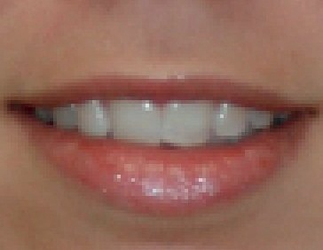

图 12-1. 初始图像

第三个也是最后一个内部模式是*索引模式*。在这种模式下，一个像素不是通过其颜色组件的直接值表示，而是通过一个预定义颜色表中的索引表示，该表称为*颜色映射表*。此表的大小可以达到 256 个条目，因此索引模式中的图像最多包含 256 种不同的颜色。这有几个优点和缺点：

+   如果颜色映射表的条目少于 256 个，则一个像素只占用 1 字节或更少。

+   只需更改颜色映射表中的条目，就可以轻松高效地进行完整的图像转换。

+   如果你正在创建挂毯或马赛克，这种模式是理想的，因为这种设计只包含有限数量的颜色。

+   许多图像操作无法实现，因为必要的颜色无法表示。

+   这种模式下可以达到的图像质量仅在非常特定或简单的情况下可接受，例如图像很小或是草图时。

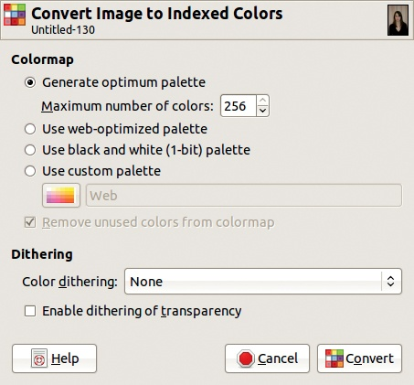

图 12-2. 索引颜色转换对话框

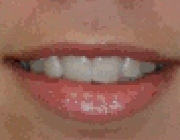

图 12-3. 256 色的最佳调色板

现在，让我们更详细地考虑索引模式。

## 索引模式

图 12-1 展示了 RGB 模式下的图像部分，已放大显示单独的像素。要将其转换为索引模式，选择**图像：图像 > 模式 > 索引**，这会打开图 12-2 中显示的对话框。以下是可用的调色板选择：

+   生成最佳调色板允许你选择最大颜色数，GIMP 会尝试生成适合该图像的最佳调色板。即使是最多 256 种颜色，图 12-3 显示，转换后图像质量明显下降。

+   使用 Web 优化调色板使用一种特定的调色板，旨在不同的屏幕上具有一致的显示效果。不幸的是，这种效果始终不理想，现在这种模式已经被认为过时。

    

    图 12-4. 抖动后的黑白图像

    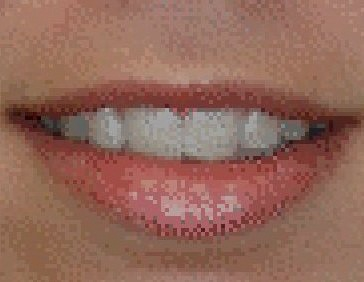

    图 12-5. 使用 Floyd-Steinberg（正常）抖动

+   使用黑白（1 位）调色板将图像转换为黑白，就像**图像：颜色 > 阈值**工具一样，除非使用颜色抖动。通过颜色抖动，可以创建一副可用的黑白图像，如图 12-4 所示。

+   使用自定义调色板允许你从可用的调色板中进行选择，通常这些调色板的效果不如 GIMP 生成的最佳调色板。

删除调色板中未使用的颜色复选框仅在选择使用自定义调色板时才有用。

如图 12-3 所示，索引模式可能会导致图像质量下降。通过使用抖动技术，可以获得更好的效果，它通过在可用颜色中扩散像素，来近似无法显示的颜色。在索引颜色转换对话框中提供了四种抖动算法，图 12-5 展示了第一种算法的效果。启用透明度抖动可以帮助平滑包含透明区域的 GIF 图像的边界。

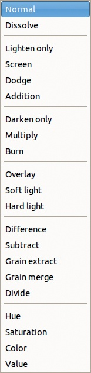

图 12-6. 可用的图层混合模式

# 12.2 混合模式

混合模式会在图像上应用一个额外的颜色平面，无论是作为一层还是通过绘图工具创建的设计。图 12-6 显示了 23 种混合模式中 21 种可供绘图工具使用的模式。在图层中，“Behind”和“Color erase”模式不可用。

混合模式在菜单中按效果排列。前四种模式（正常、溶解、Behind 和 Color erase，或仅图层的前两种模式）保持像素不变，只改变显示哪些像素。接下来的四种模式（仅提亮、屏幕、减淡和加法）会提亮图像，并按影响力从小到大排列。接下来的三种模式（仅加深、正片叠底和烧焦）会使图像变暗，它们也按影响力从小到大排列。接下来的三种模式（叠加、柔光和强光）改变图像的亮度。接下来的五种模式（差异、减去、颗粒提取、颗粒合并和除法）扭曲图像的色调，而不仅仅是饱和度和明度。最后四种模式（色相、饱和度、颜色和值）使用 HSV 模型组件作为混合图层的基础。

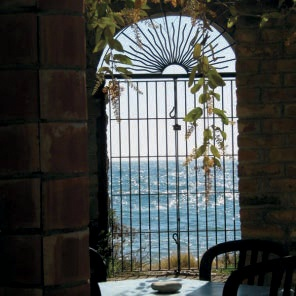

图 12-7. 顶层

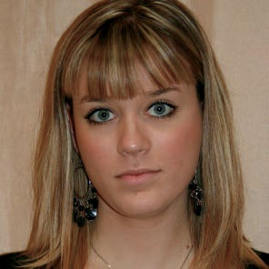

图 12-8. 底层

为了演示混合模式，我们将创建一个包含两层的图像。图 12-7 是顶层，图 12-8 是底层。我们将为仅在绘图工具中存在的两种模式提供具体示例。

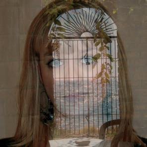

图 12-9. 正常模式，50% 不透明度

我们还需要一种符号来解释混合模式背后的数学原理。回想一下，一个像素由三个值组成——R、G 和 B 通道——因此可以将其视为一个向量。我们将使用*U*表示上层像素的向量，*L*表示下层像素的向量，*R*表示结果像素的向量。

## 保持像素不变的模式

这一类别中的四种模式有一个重要的共同特点：它们通过精确地从*U*或*L*中获取值来为*R*赋值。

在*正常*模式下，始终选择上层像素（即*R* = *U*）。但是，如果*U*不是完全不透明的，那么*R*的值是*U*和*L*的组合。如果*U*的不透明度设置为百分比*x*，那么

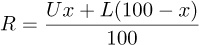

图 12-9 显示了当顶层不透明度为 50% 时的结果。不透明度在所有混合模式中都以相同的方式工作。

在*溶解*模式中，上下像素的选择是随机的，但与不透明度成比例。给定一个函数 *f*(*r*)，它产生一个 0 到 1 之间的随机结果，公式为 *R* = [如果 100 × *f*(*r*) *< x*] 则为 *U,* 否则为 *L*。图 12-10 显示了 50% 不透明度的结果，而 图 12-11 放大了该图像的一部分。

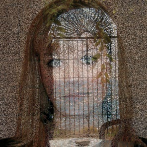

图 12-10. 溶解模式，50% 不透明度

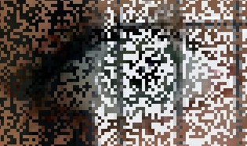

图 12-11. 放大 图 12-10 的一部分

为了演示*后景*模式，我们将使用 图 12-12。我们首先移除了人像的背景，替换为透明度。人像图层下方可见一个白色底层。如果我们在此图像上使用后景模式绘画，只有透明像素会受到影响，如 图 12-13 所示。如果使用的是半透明而非完全透明，则我们将看到绿色和半透明背景颜色的组合。

*颜色擦除*模式会将你正在绘制的颜色从图像中移除，并将其替换为部分透明度。在 图 12-14 中，我们使用了一个大圆刷，并通过右键单击女孩的左脸颊，选择了脸部的色调作为前景色。白色背景层通过半透明层可见。

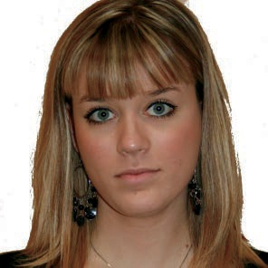

图 12-12. 带透明度的图像

图 12-13. 后景模式绘画

## 亮化模式

当你使用亮化模式时，图像会比正常模式更亮。

在*仅亮化*模式中，结果像素与两种像素中较亮的那个相同。在 图 12-15 中，明亮的海景取自上层，其余部分取自下层。公式非常简单，*R* = max(*U, L*)。

*屏幕*模式通过更复杂的公式产生更亮的结果：

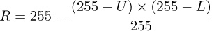

上下像素被反转，这通过从 255 中减去它们的值（在 8 位深度下）来完成。然后将结果相乘，再通过除以 255 并再次反转来将乘积归一化到子范围 [0 到 255]。正如你在图 12-16 中看到的，顶部图层的暗区消失，亮区看起来褪色，图像似乎更透明。

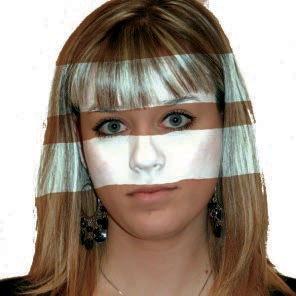

图 12-14. 在颜色擦除模式下绘画

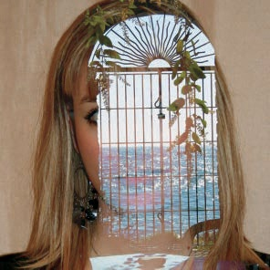

图 12-15. 仅变亮模式

*闪避*模式夸大了光照效果。此模式的公式为：

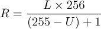

下层像素值与 256 相乘，然后除以上层像素的反向值。为了防止除以 0，除数加上 1。图 12-17 展示了结果。此模式最适合与绘画工具一起使用，以模拟暗房中的闪避过程，在特定区域减少曝光。此模式可用于突出图像最暗区域的细节。

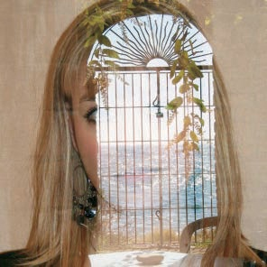

图 12-16. 屏幕模式

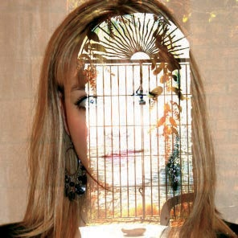

图 12-17. 闪避模式

*加法*模式在不进行颜色反转的情况下，进一步夸大了光照效果。一些区域可能会变成完全白色，如图 12-18 所示。为了达到这种效果，像素值会相加，然后结果会被截断为 255，因为 RGB 立方体无法表示更大的值。公式是 *R* = min(*U* + *L*, 255)。

## 变暗模式

使用这些模式，生成的图像比原始图像更暗。

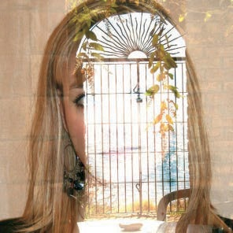

图 12-18. 加法模式

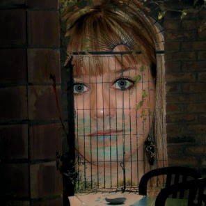

图 12-19. 仅变暗模式

*仅变暗*模式与*仅变亮*模式相反：生成的像素是两者中较暗的一个。正如图 12-19 所示，生成的图像包含上层较暗的部分，以及下层其他部分。公式是 *R* = min(*U,L*)。

在*乘法*模式中，像素值相乘，然后通过除以 255 来进行归一化：*R* = (*U* × *L*) / 255。如图 12-20 所示，结果比两层的合成更暗。

*加深*模式模拟了一种暗房过程，类似于“减淡”模式，也最适合与绘画工具一起使用。该模式会减少图像的曝光度，可能会导致暗部细节丧失。该模式的公式为：

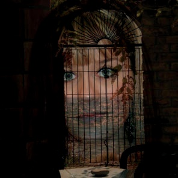

图 12-20. 乘法模式

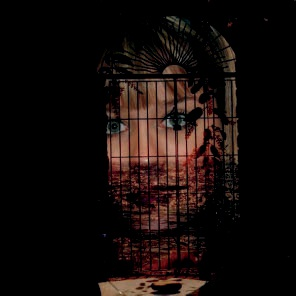

图 12-21. 加深模式

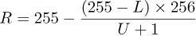

较低的像素值被反转并除以较高的像素值。然后，这个数值通过乘以 256 进行归一化，结果被反转。再次强调，为防止除以 0，除数上加了 1。在图 12-21 中，唯一未完全烧毁的部分是那些在两个图层中都较亮的部分。

## 亮度模式

本节中的三个模式非常相似，以至于前两个当前具有相同的效果。

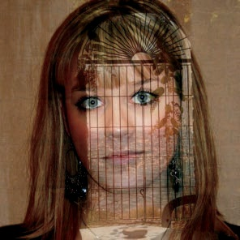

图 12-22. 覆盖或软光模式

这些模式处理的是图像的亮度，而不是其颜色。

*覆盖*模式结合了“乘法”和“滤色”模式，它使图像变暗的程度略低于“乘法”模式。它的复杂公式理论上是这样的：

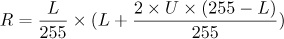

但在 GIMP 2.8 中，该模式实际上使用的是软光模式的公式。这个 bug 故意没有修正，因为修复它会导致现有使用“覆盖”模式的图像出现意外的变化。开发人员目前正在努力寻找一种修复该 bug 而不改变现有图像的策略。

*软光*模式的公式包含了“滤色”模式计算的结果，这里称为 *R**[S]*：

如图 12-22 所示，生成的图像比原始图像更暗，颜色昏暗，边缘柔和。

*强光*模式使用了所有模式中最复杂的公式。它对暗色和亮色的处理方式不同。强光是“乘法”和“滤色”模式的另一种组合，它使颜色变得更亮，边缘更锋利（即与“软光”模式完全相反）。上层与下层的处理方式不同，这与我们之前讨论的大多数模式不同。图 12-23 和图 12-24 展示了两个示例，第二个示例中的图层顺序被反转。公式如下：

如果 *U* > 128:

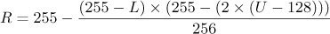

如果 *U* ≤ 128: *R* = (2 × *U* × *L*)/256

图 12-23. 强光模式

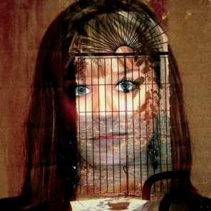

图 12-24. 反转图层的强光模式

## 颜色扭曲模式

这些模式以不同的方式扭曲颜色。

在*差异*模式中，结果像素是上层和下层像素差的绝对值：*R* = *|**U* – *L**|*。例如，如果*U* = 50 且*L* = 200，那么*R*将是-150 的绝对值，即 150。当这种情况发生时，颜色会呈现出反转的效果，如图 12-25 所示。

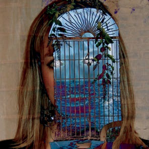

图 12-25. 差异模式

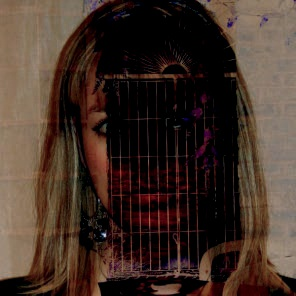

图 12-26. 减去模式

*减去*模式基于与差异模式相同的原理，但在减法后不取绝对值。这意味着图层的顺序会影响结果，如图 12-26 和图 12-27 所示。减去模式通过将负值设置为 0 来处理负值，公式如下：*R* = max(*U* – *L*, 0)。任何 0 值对应黑色区域。

根据其名称，*颗粒提取*模式应该从图层中提取胶片颗粒，但是否真的这样做仍有争议。有些人认为它给图像带来了浮雕效果。图 12-28 和图 12-29 展示了颗粒提取模式对示例图像的影响。官方公式是*R* = *L* – *U* + 128，但负值或大于 255 的值会被截断。负值会被替换为 0，超出 255 的值会被替换为 255。

图 12-27. 图层反转后的减去模式

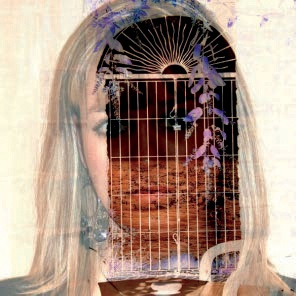

图 12-28. 颗粒提取模式

而*颗粒合并*模式将颗粒层合并到当前图层中。该模式是对称的，因此图层的顺序并不重要。我们的结果显示在图 12-30 中。该模式的公式是*R* = *U* + *L* – 128，同样，负值或大于 255 的值会被截断。

*除法*模式是另一种非对称模式，其中下层像素的值被上层像素的值（加 1）除以。结果乘以 256 以归一化该值。结果如图 12-31 所示，比原始图像更亮，在某些地方完全变白。公式为：

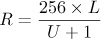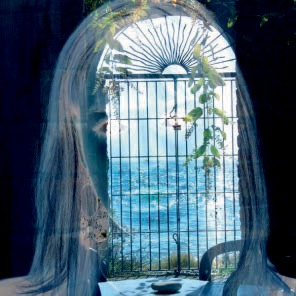

图 12-29. 颗粒提取模式，图层反转

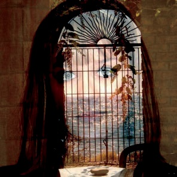

图 12-30. 颗粒合并模式

## HSV 模式

最后四种模式在 HSV 空间中工作。它们通过将上层中的一个分量（色相、饱和度或值）替换为下层中对应的分量来实现。

在*色相*模式下，结果像素具有上层像素的色相和下层像素的饱和度与值。如果上层像素的饱和度为 0，则色相也取自下层像素。这解释了为什么在图 12-32 中，位于上层的黑色区域的像素完全被下层的像素替代。

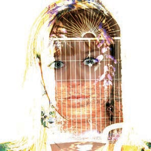

图 12-31. 除法模式

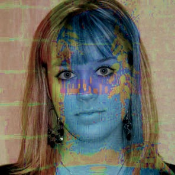

图 12-32. 色相模式

在*饱和度*模式下，饱和度仅取自上层。由于上层的饱和度在图像的大部分区域都很低，因此结果如图 12-33 所示，几乎完全无饱和度。

在*色彩*模式下，色相和饱和度取自上层，而值取自下层。如图 12-34 所示，效果是下层使用上层的颜色进行绘制。

在*值*模式下，值取自上层，而饱和度和色相取自下层。如图 12-35 所示，该模式的结果是色彩模式的反向：上层使用下层的颜色进行绘制。

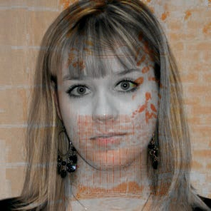

图 12-33. 饱和度模式

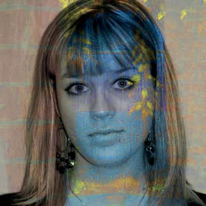

图 12-34. 色彩模式

# 12.3 色彩管理

色彩感知是图像处理中最复杂的方面之一。我们在现实世界中看到图像，用相机拍摄它们或可能扫描它们，然后我们在屏幕上查看它们，甚至可能打印出来。这些阶段都会改变图像，导致可见的颜色和数值发生变化。色彩管理的目的是控制这些变化，使得别人看到的屏幕或打印图像和我们原本想要他们看到的图像一致。

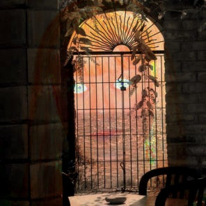

图 12-35. 值模式

## 色彩管理工作流

设备的色域（即这些设备能够表示的颜色集合）不可避免地比正常人类视力的色域要小。（有关图像表示的深入讨论，请参见数字化）。此外，数字相机或扫描仪对图像的数字化、显示图像的显示器以及打印出副本的打印机都使用不同的色彩空间，这些色彩空间通过它们的色域和一些可调参数来特征化。图 12-36 展示了一个使用设备无关的*工作色彩空间*（通常是 RGB）的计算机示意图。工作色彩空间包括最常用设备的色彩空间。它应包括扫描仪和相机的色彩空间，以及标准屏幕和大多数打印机的色彩空间。工作色彩空间应仅包含可以在所使用设备上表示的颜色。当从扫描仪或数字相机加载图像文件时，它必须首先从其初始色彩空间转换到工作色彩空间，当在显示器上显示图像或打印图像时，也需要进行类似的转换。

如果我们拥有必要的信息，这一转换过程是自动的，这些信息存储在一个*色彩配置文件*中。色彩配置文件提供了从一个色彩空间转换到另一个色彩空间所需的信息。一个配置文件描述了相机的色彩空间，并附加到数字照片的图像文件上。其他配置文件则指定扫描仪、打印机和显示器的色彩空间。

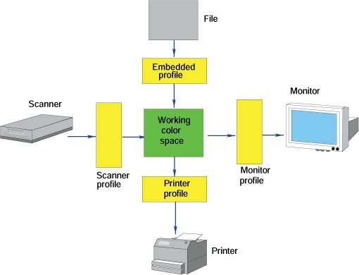

图 12-36. 色彩管理的工作流

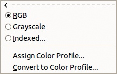

图 12-37. 图像：图像 > 模式菜单

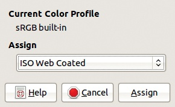

图 12-38. 分配色彩配置文件

如果图像没有色彩配置文件，或者你想更改现有的配置文件，你可以为图像指定一个色彩配置文件。**图像：图像 > 模式** 菜单 (图 12-37) 包含两个条目，允许你编辑色彩配置文件。选择“分配色彩配置文件”条目，打开如 图 12-38 所示的对话框。在“分配”字段中，你可以选择一个以前使用过的配置文件，或在计算机上搜索配置文件。在 GNU/Linux 平台上，配置文件通常位于 `/usr/share/color/icc/` 文件夹中。

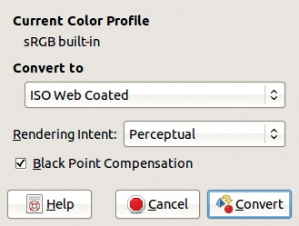

图 12-39. 转换为色彩配置文件

**图像：图像 > 模式 > 转换为色彩配置文件** 打开如 图 12-39 所示的对话框。除了配置文件名称之外，这个对话框还允许你选择渲染意图和黑点补偿，我们将在 使用色彩管理 中讨论这些内容。

色彩管理也可以用来模拟将图像转换为另一台设备色彩空间的效果。打印机的色域通常小于显示器的色域。打印机在渲染饱和色彩时特别差，尤其是蓝色和绿色的阴影。如果转换没有得到妥善管理，我们在 GIMP 中精心制作的图像打印出来可能效果很差。如果你打算打印图像，最好是将图像显示成接近最终打印效果的样子，而不是创建一个利用显示器能力的图像，这些能力是打印机所不具备的。这种技术被称为 *软校样*。

色彩配置文件通常被称为 *ICC 配置文件*，因为它们是由国际色彩联盟（International Color Consortium）定义的。最常用的两个配置文件在 图 12-40 中展示。尽管使用色域最广的配置文件（即 Adobe RGB）似乎是最好的选择，但通常并非如此，因为在将图像转换为更有限的打印机色域时，可能会发生色彩失真。因此，默认的色彩空间通常是 sRGB。

事实上，如果我们将一张没有嵌入色彩配置文件的图像加载到 GIMP 中，GIMP 会默认假设它是 sRGB，尽管我们可以指定其他配置文件。如果图像中包含嵌入的配置文件，GIMP 会询问是否使用它，通常你应该选择“是”。

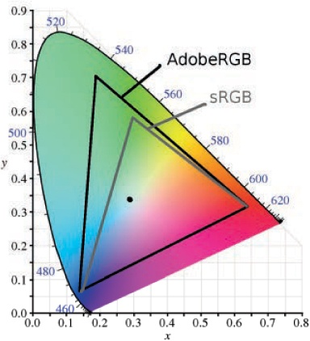

图 12-40. Adobe RGB 和 sRGB 色域

获取设备的颜色配置文件并不总是容易的。尤其是对于显示器，通常需要购买显示校准设备。颜色配置文件的获取超出了本书的范围，但如果你想了解更多信息，我们推荐诺曼·科伦（Norman Koren）的网站（*[`www.normankoren.com/color_management.html`](http://www.normankoren.com/color_management.html)*）。

## 使用颜色管理

你可以在 GIMP 中的两个地方设置颜色管理参数。一个是在**图像：编辑 > 偏好设置**对话框中，详细描述见颜色管理。另一个是在**图像：查看 > 显示过滤器**工具中，详细描述见显示过滤器。

通过**图像：编辑 > 偏好设置**对话框应用*渲染意图*。渲染意图可用于生成你希望打印的图像的软打样（softproof）。它指定了颜色如何从一个色域转换到另一个色域。如果没有进行转换，原色域中无法在目标色域中表示的颜色将被剪裁，导致难看的失真。通过使用更复杂的转换技术，通常可以获得更令人满意的结果。两种主要技术，感知和色度技术，显示在图 12-41 中。

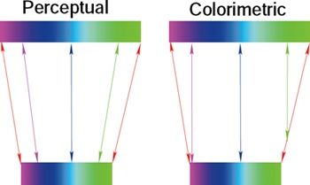

图 12-41. 感知与色度色域映射

使用*感知意图*时，色域被压缩，因此颜色之间的差异得以保持。这个过程对完全饱和的颜色影响较大，而对低饱和度的颜色影响较小。如果采用足够大的色深进行处理，这个过程大多数情况下是可逆的，因此如果你需要在多个色彩空间之间转换图像，这是一个不错的选择。如果图像包含饱和的颜色，这也是一个不错的选择。

*色度意图* 保留了两个色域都能表示的颜色不变，并将其他颜色剪裁到最接近的颜色。这个过程是不可逆的，虽然它保留了白色，但对于饱和颜色的图像来说，效果往往较差。

# 12.4 主要颜色工具

在本章的其余部分，我们将讨论你可以用来调整图像颜色的工具。这里我们深入探讨颜色选择器、色阶和曲线工具。

## 颜色选择器

颜色选择器是选择任何绘图工具颜色的主要工具。要从工具箱中打开颜色选择器，请点击显示当前前景色和背景色的矩形，如(图 12-42)所示。

图 12-42. 打开颜色选择器对话框

如图 12-43 所示，颜色选择器对话框展示了许多功能，因此我们将把讨论分成几个部分分别查看。

对话框的右上象限包含六个滑块，分别对应 HSV 和 RGB 模型中的通道。滑块右侧是计数器，可以用来精确调整数值。左侧的单选按钮与左上角第一个标签页相关，该标签页上显示着 Wilber 的头像。如果选择了其他标签，这些按钮将无法使用。

各个滑块之间是有关联的，因此如果我们移动其中一个，其他几个滑块也会受到影响。例如，移动 S 滑块也会改变所有的 RGB 滑块。调整任何一个 RGB 滑块会改变 H 滑块的值，且根据初始值的不同，也可能会影响 S 和 V 滑块。滑块的颜色谱会根据当前的选择显示相应的效果，只有 H 滑块始终显示相同的彩虹颜色。

对话框的右下象限包含多个控件。HTML 符号字段显示当前颜色的十六进制表示法（HTML 代码）。此代码由三组两位十六进制数字组成，表示三个 RGB 通道的值。如果我们在对话框中的其他位置选择颜色，代码将自动更改以匹配所选颜色，但我们也可以直接在字段中输入数字并查看结果，或者直接输入颜色名称。如果我们输入名称的开头字母，所有以这些字母开头的可用名称将会显示出来，如图 12-44 所示。

字段右侧的小按钮用于从图像或屏幕上的任何位置选择颜色。如果我们点击这个按钮，鼠标指针图标将变为吸管。当我们点击屏幕上的某个位置（即使是在 GIMP 窗口外），该位置对应的像素颜色将被选中作为颜色选择器的颜色，并且该颜色将决定六个滑块和 HTML 符号字段的值。

在此字段下方是 12 个彩色按钮，表示*颜色历史记录*。左侧带有`>`符号的按钮用于将当前颜色添加到历史记录中，并移除最旧的颜色（右下角的颜色）。如果我们点击这些按钮中的任何一个，它的颜色将成为当前颜色。

对话框右下角的三个按钮大多数都是不言自明的。RESET 按钮将当前颜色更改为黑色，但不会影响历史记录。

对话框的左下角只包含三个控件。CURRENT 和 OLD 分别表示当前颜色（在颜色选择器对话框中定义的颜色）和之前定义的颜色。点击并拖动这两个按钮中的任何一个颜色到图像上，以填充当前选择的颜色。HELP 按钮会执行你预期的操作。

左上角的区域包含一个矩形显示框和五个标签，这些标签提供了五种不同的方式来精细调整所需的颜色。图 12-43 显示了 Wilber 标签，这是唯一一个使用 HSV 和 RGB 滑块左侧的六个单选按钮的标签。在这里，选中的单选按钮是 H，这意味着大矩形区域右侧的色谱显示了色调（Hue）刻度。显示中的指针表示当前的色调，而左侧的矩形表示选择此色调时饱和度和亮度的可能变化。如果我们点击这个矩形，就会选择一个特定的值（在水平方向上）和一个特定的饱和度（在垂直方向上）。两条垂直线在选定的点交叉，且对话框右侧的滑块会随之变化，以反映新的饱和度和亮度。

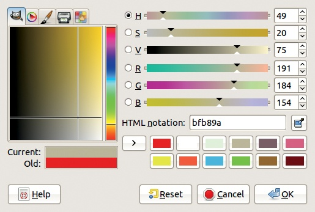

图 12-43. 颜色选择器

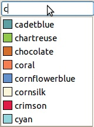

图 12-44. 在 HTML 表示法字段中输入颜色名称

选择不同的单选按钮会改变左侧的矩形显示。例如，图 12-45 显示了选中 B（蓝色）单选按钮时的显示。细长的垂直矩形让我们选择蓝色的量，而大矩形让我们调整红色和绿色的量。有时，选中 B 单选按钮时激活的组合更方便，但通常默认的（H）设置效果最佳。

Triangle 标签有一个图标，显示该标签显示框的缩略图(图 12-46)。这个标签提供了另一种基于 HSV 模型选择颜色的图形方式。点击色调圆圈选择 H 分量。点击三角形则会改变 S 和 V 分量的值。在三角形的一个点，S 为 0；在另一个点，V 为 0；在最后一个点，S 和 V 都是最大值（100）。一些人觉得这个标签比 Wilber 标签更直观。

图 12-45. Wilber 标签，蓝色选择

带有画笔图标的选项卡表现得像是水彩画的模拟（图 12-47）。点击矩形的任何位置都会将少量该颜色添加到当前颜色中。垂直滑块设置添加颜色的数量，从底部的 0 到顶部的最大值。由于颜色是添加到现有颜色中的，因此此选项卡使用 CMY 模型，且颜色越强烈，我们点击的次数越多。如果点击矩形的一侧，饱和度会增加。如果点击矩形的中心，值会减少。这个选项卡特别适合用来构建浅色，如从完全白色开始的粉彩色。

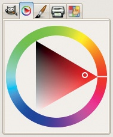

图 12-46. 三角形选项卡

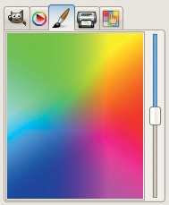

图 12-47. 水彩选项卡

标有打印机图标的选项卡包含基于 CMYK 颜色模型的选项（图 12-48）。此选项卡主要用于收集有关打印时颜色如何混合的信息，而不是用来调整颜色，特别是因为在更改 K 通道时，无法自动更改 CMY 通道，这在打印调整中很常见。

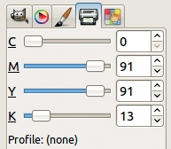

图 12-48. 打印选项卡

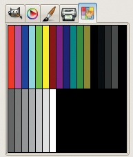

图 12-49. 调色板选项卡

剩下的选项卡有一个图标，显示了一只手指指向调色板（图 12-49）。中心的方块显示当前调色板的内容，这是 22.7 创建新调色板中解释的一个概念。你只能从这个调色板中选择颜色，但你可以通过**图像：窗口 > 可停靠对话框 > 调色板**来更改调色板。

通过选择**图像：窗口 > 可停靠对话框 > 颜色**来访问简化的颜色选择对话框，如图 12-50 所示。颜色对话框是颜色选择器左侧部分的修改版。Wilber 选项卡包含右侧的六个按钮，用于选择颜色模型和主通道。三角形、水彩、打印机和调色板选项卡与颜色选择器中的完全相同。最后一个选项卡是颜色选择器对话框右侧部分的稍微修改版（图 12-51）。

图 12-50. 颜色对话框，Wilber 选项卡

图 12-51. Colors 对话框，滑块标签

Colors 对话框的底部包含几个有用的按钮。左侧是设置前景色和背景色的按钮。右侧是应用吸管工具的按钮和显示当前颜色 HTML 表示法的字段。

## Levels

通过选择 **图像: 颜色 > Levels** 或 **图像: 工具 > 颜色工具 > Levels** 打开的 Levels 工具，是 GIMP 中用于照片处理的最有用工具之一。简而言之，使用 Levels 工具（以及下节将讨论的 Curves 工具）调整初始像素值（输入）与新图像中的像素值（输出）之间的关系。图 12-52 显示了 Levels 工具对话框。

图 12-52. Levels 对话框

图 12-53. 预设设置

Levels 对话框顶部的 **PRESETS** 字段打开了一个包含之前保存的设置的菜单。设置的标识采用 ISO 格式，显示它们保存的日期和时间（见 图 12-53）。右侧的加号按钮保存当前设置。这比记住使用特定设置时的 ISO 日期和时间更为方便。命名的设置列在保存的设置末尾。其他颜色工具也具备相同的功能。最右侧的小三角形打开 图 12-54 中显示的菜单。使用前两项条目可将设置导入或导出到文件。最后一项打开 图 12-55 中显示的对话框，其中列出了保存的设置，并包含三个按钮，用于导入设置、导出设置和删除选定的设置。

图 12-54. Levels 对话框菜单

图 12-55. 设置管理

Levels 对话框的下一行包含一个菜单，用于选择将受影响的通道。可选的通道有：Value（值）、Red（红色）、Green（绿色）、Blue（蓝色）和 Alpha（如果有 Alpha 通道的话）。当选择 Value 通道时，所有三个颜色通道都会发生变化。对于灰度图像，唯一可用的通道是 Value 通道。**RESET CHANNEL** 按钮将所选通道重置为其初始值，而不会影响对话框中其他部分的更改。

右侧的两个按钮设置下方直方图的特征。直方图是一种显示所选通道中不同值频率的方式。在 8 位深度表示中，共有 256 个不同的值，从左侧的 0 到右侧的 255。图中条形的高度与图像中具有该值的像素数量成正比。如果按下最左侧的按钮，峰值表示像素的数量，而在使用最右侧按钮选择的对数直方图中，值是通过对数计算得出的。如图 12-56 所示，对数直方图更好地显示了低值的变化，而线性直方图（见图 12-52）则夸大了峰值。

图 12-56。对数直方图

Levels 工具的目的是通过为某些像素分配新值来改变直方图。通常，当像素分布在整个范围内时，图像效果最好。如您所见，在我们使用的示例中，大于 200 的值根本没有被表示。

在直方图下方有三个可移动的三角形。左侧的黑色三角形对应于*黑色点*：所有像素值小于或等于该三角形位置的像素会被设置为 0（即，颜色通道为黑色，或 Alpha 通道为完全透明）。当这个点向右移动时，更多的像素变为黑色，通常只有在直方图的左侧为空时才有利。右侧的白色三角形对应于*白色点*：所有像素值大于或等于该三角形位置的像素会被设置为 255（即最大值）。我们的示例图像需要进行此调整，因为大于 200 的值完全没有表示。如果我们将白色三角形移动到 200，图像中将表示可用值的完整范围，从而提高对比度。结果如图 12-57 所示，您可以与原始图像进行对比，原始图像见图 12-8。

图 12-57。图 12-8 将白色三角形移动到 200 后的图像

中间的灰色三角形对应于*中点*。将其向左移动会使图像在亮度通道中变亮，在颜色通道中更加饱和，或在 Alpha 通道中更加不透明。将其向右移动则会产生相反的效果。这个滑块改变的是*Gamma 因子*的值，或称为 Gamma 校正，它指定了*响应曲线*的形状。响应曲线表示输入（初始像素）和输出（新像素）值之间的关系。如果 Gamma = 1，则曲线是一条直线。增加 Gamma 会使曲线变为凸形，而减少 Gamma 则会使曲线变为凹形。

我们不仅可以手动移动其中一个三角形，还可以更改相应的数值字段。此外，提供了两个吸管工具，一个用于黑色点，一个用于白色点。点击其中一个吸管工具，然后在图像中点击对应阴影的像素，我们可以调整三角形，以便它们括住图像中表示的值。

到目前为止，所有的设置都涉及到输入级别（INPUT LEVELS），它们通过扩大图像中像素值的范围来构建新图像。紧接着这些控制项下方是两个可以改变输出级别（OUTPUT LEVELS）的三角形。将输出级别的三角形向彼此靠近会限制可能值的范围。例如，在亮度通道（Value channel）中，这样做会减少图像的对比度，使图像看起来更暗淡，如图 12-58 所示。

![将输出级别限制为[100 到 200]后](httpatomoreillycomsourcenostarchimages1455570.png.jpg)

图 12-58。图 12-8 在将输出级别限制为[100 到 200]之后

图 12-59。图 12-8 在反转输出级别之后

如果我们将白色三角形移动到左侧，将黑色三角形移动到右侧，那么我们就会反转图像，如图 12-59 所示。这样做的效果和应用**图像：颜色 > 反转**相同，唯一的不同是，在使用“级别”工具时，我们可以分别反转每个 RGB 颜色通道。

到目前为止，我们讨论的是手动设置，只会改变选定通道的内容。级别工具还包括一些自动设置，这些设置会同时作用于所有通道。其中最简单且最有用的是“自动”按钮，它会尽可能扩展三个颜色通道的输入范围。图 12-60 展示了我们图像的结果。通常这会改善图像，但在这个例子中，变化过于剧烈。

图 12-60. 使用自动按钮后的图 12-8 效果

图 12-61. 级别工具选项

右侧的三个吸管工具，与直方图吸管类似，可用于选择图像中的黑白点以及一个中间点。但与直方图吸管不同，这些吸管会更改所有通道，这可能导致奇怪和不自然的效果。请注意，选择这些点的顺序很重要，并且并非所有点都必须选择。通常，中间点是最难准确选择的。

尽管级别工具默认情况下无法通过工具箱访问（可以在**图像：编辑 > 偏好设置**对话框中的工具箱条目中更改此设置），它确实有工具箱选项，在选择该工具时会显示。这些选项如图 12-61 所示。直方图比例单选按钮的功能与级别对话框右上角的按钮相同。勾选“样本平均值”选项时，设置用于从图像中选择颜色的区域半径。当选择吸管工具并点击图像时，如果按下鼠标按钮，则会出现此方块。

图 12-62. 曲线对话框

使用曲线工具可以进行与级别工具相同的调整，但曲线工具提供了更多的控制。级别对话框中三个吸管下方有一个“将这些设置作为曲线编辑”按钮，它会保留在级别对话框中所做的任何更改，并应用曲线工具。预览按钮允许你查看更改的效果，应该始终勾选。级别对话框底部的四个按钮自解释。

## 曲线

曲线工具可以通过**图像：颜色 > 曲线**或**图像：工具 > 颜色工具 > 曲线**找到，并打开如图 12-62 所示的对话框。曲线工具的效果类似于级别工具，但它提供的自动化选项较少，控制更精细。

曲线对话框的顶部和底部与级别对话框相同。在曲线对话框中央的矩形区域内，你会看到直方图的图像。这个矩形的对角线表示响应曲线。输入值水平变化，输出值垂直变化。最初，输入值和输出值是相等的。当鼠标指针位于矩形区域时，其坐标会显示在左上角。

图 12-63. 平滑曲线

图 12-64. 自由手绘曲线

通过点击并拖动响应曲线，我们可以改变其形状。如果 CURVE TYPE 按钮显示为平滑（SMOOTH），如默认设置，曲线将保持平滑，并且调整为通过添加的点，如图 12-63 所示。这些点称为*锚点*，每次点击直方图时会自动添加。当前的锚点是黑色圆点。通过点击并拖动或使用键盘上的上下箭头键来移动锚点。按住可让箭头键一次移动 15 像素，而非默认的 1 像素。左右箭头键选择相应方向上的下一个锚点。如果你点击现有锚点附近的区域，可以将其拖动到另一个位置，从而改变曲线。要删除锚点，只需将其拖入其他锚点。

当工具在使用时，当鼠标指针悬停在图像上时，它会变成吸管形状。如果点击图像，则在曲线对话框中会出现一条垂直线，指示点击像素的值。点击会在所选通道中创建一个锚点，而点击会在所有通道中创建一个锚点。锚点仅在松开鼠标按钮时插入，因此我们可以拖动该点在图像上找到目标值。

图 12-65. 自由手绘曲线的结果

如果将曲线类型设置为自由手绘（FREEHAND），则曲线通过在矩形内点击并拖动来构建，通常会呈现出锯齿状，如图 12-64 所示。结果也更难以控制，如图 12-65 所示。但如果我们随后选择平滑（SMOOTH）作为曲线类型，曲线会自动平滑，且会添加必要的锚点。

曲线工具的选项与级别工具的选项相同（参见图 12-61）。

曲线工具没有任何自动控制，相比于 Levels 工具，它更难掌握，但它允许更精确的颜色处理。如果我们保持曲线平直，仅水平移动它的端点锚点，那么效果与在 Levels 工具下移动输入级别（INPUT LEVELS）下的端点三角形相同。垂直移动它们的效果与在输出级别（OUTPUT LEVELS）下移动三角形相同。在曲线中间添加一个锚点并垂直移动它，效果与在 Levels 工具中移动中间三角形相同，并且它是对 Gamma 值更直观的可视化。

图 12-66. 反转曲线

通过将左侧（下方）锚点放置在左上角，右侧（上方）锚点放置在右下角，可以反转曲线，从而得到负片效果，如图 12-66 所示。我们也可以仅在一个通道中进行此操作，得到奇异且多彩的结果。如果我们改变单独的颜色通道曲线，它们将在直方图上以各自的颜色显示，而当前曲线始终是黑色的。当选择值通道（Value）时，这些彩色曲线不会显示。调整曲线的形状可能会很棘手，过度变形曲线很容易导致夸张且不自然的颜色。

# 12.5 额外的颜色工具

**图像：颜色**菜单包含了许多条目（见图 12-67）。菜单的第一部分包含更基础的工具，包括我们刚才讨论的 Levels 和 Curves。现在，我们将使用图 12-68 中显示的照片演示菜单中其他工具。（提示：你可以将这些条目放入工具箱或通过 **图像：工具 > 颜色工具** 访问。）

## 颜色平衡

使用颜色平衡工具进行的调整，也可以通过 Levels 或 Curves 工具完成，但一些人发现颜色平衡工具更直观。它的对话框如图 12-69 所示。此对话框的顶部包含与 Levels 和 Curves 工具相同的设置，这些设置也与菜单中接下来的四个工具共享：色相-饱和度（Hue-Saturation）、着色（Colorize）、亮度-对比度（Brightness-Contrast）和阈值（Threshold）。

图 12-67. 图像：颜色菜单

使用三个滑块调整颜色平衡 [–100 到 +100]，每个滑块对应 RGB 和 CMY 模型中一个基础颜色和互补颜色的组合。请记住，这两个模型中的配对相同，但基础颜色与互补颜色的指定不同。

颜色平衡工具用于在三个不同的范围内进行调整：阴影、中间调和高光。这些范围是重叠的，因此在图像中准确区分它们是很难的。由于滑块非常敏感，要获得自然的效果非常困难，正如在图 12-70 中所示。每个范围都可以单独重置（通过将值设置为 0），这使得通过反复试验调整图像变得更容易。保持对话框底部的两个框被选中，以预览调整的效果。

图 12-68. 示例图像

图 12-69. 颜色平衡对话框

## 色相-饱和度

这个工具提供了另一种调整方式，虽然你也可以使用曲线工具进行调整。色相-饱和度的优势在于它的控制基于三种颜色模型：RGB、CMY 和 HSV。另一个重要的区别是，色相-饱和度处理的是颜色范围，而不是颜色通道。例如，如何使用曲线工具改变黄色像素的饱和度？使用色相-饱和度，操作就很简单。

图 12-70. 使用颜色平衡工具后的效果

图 12-71. 色相-饱和度对话框

如图 12-71 所示，色相-饱和度对话框首先是预设设置的常规行。

图 12-72. 使用色相-饱和度工具后的效果

图 12-73. 颜色化对话框

对话框的下一部分让我们选择要更改的颜色范围。中间的按钮，称为“MASTER”，允许我们同时更改所有颜色。六个彩色按钮指定颜色范围，每个按钮代表色相圆的一六分之一。OVERLAP 滑块[0 到 100]将所选范围扩展到两个相邻的范围。

接下来的三个滑块基于 HSV 模型。（此处，Value 称为亮度）。调整这三个滑块中的任何一个的效果不仅可以在图像中看到，还可以在对话框上部的颜色按钮中看到。调整任意六种颜色的色相、饱和度或亮度，或者选择主控“Master”。多种不同的组合使得这个工具很难掌握。色相-饱和度工具的一个可能效果在图 12-72 中展示。

图 12-74. 使用上色工具创建褐色照片

图 12-75. 亮度-对比度对话框

## 上色

上色工具首先将图像去饱和，然后在 RGB 模式下为灰度版本添加颜色。其对话框（图 12-73）首先是标准颜色工具的预设选项。下面是滑块，用于指定应用于图像的 HSV 组件。其效果类似于通过彩色玻璃查看灰度图像。图 12-73 中显示的参数产生了图 12-74 中的褐色照片效果。

## 亮度-对比度

亮度-对比度工具非常简单，从其对话框（图 12-75）中可以看到。顾名思义，您可以使用它来调整图像的两个特性：亮度和对比度。

图 12-76. 调整亮度和对比度

由于该工具的功能较为有限，包含了一个按钮（编辑这些设置为“级别”），该按钮打开“级别”工具，您可以使用它更灵活地编辑亮度和对比度。亮度-对比度工具中的滑块按常规方式工作，但当该工具处于活动状态时，您还可以在图像本身上点击并拖动：垂直滑动改变亮度，水平滑动改变对比度。图 12-76 展示了在图 12-75 中设置的效果。

## 阈值

阈值工具将当前图层转换为黑白图像。像素值在设定范围内的为白色，范围外的为黑色。通过移动直方图下方的两个三角形来设置范围。通常，手动设置阈值比使用自动按钮获得更好的效果。图 12-77 中的设置生成了图 12-78 中的结果。

使用阈值工具生成一个*自然蒙版*，具体操作请参见构建自然蒙版。

图 12-77. 阈值对话框

图 12-78. 应用阈值工具后

## 海报化

海报化工具减少图像中的颜色数量。唯一的滑块范围是 [2 到 256]，用于设置每个 RGB 通道中的颜色数量。将级别设置为 8 会生成如 图 12-79 所示的结果。

## 去饱和

去饱和工具会移除当前图层中的所有颜色，但图像仍保持在 RGB 模式下，因此可以稍后添加颜色。该对话框包括三种计算像素灰度值的方式。

图 12-79. 应用海报化后

图 12-80. 去饱和后

+   LIGHTNESS 是三个 RGB 值的最大值与最小值之间的平均值。

+   LUMINOSITY 是三个 RGB 值的加权平均值。所使用的系数与色度学中的*亮度*对应，公式为：0.21 × *R* + 0.71 × *G* + 0.07 × *B*。

+   AVERAGE 是三个 RGB 值的平均值。

图 12-80 显示了应用 LUMINOSITY 的结果。

图 12-81. 反转后

图 12-82. 数值反转后

## 反转

这两个反转工具会立即作用于当前图层。**图像：颜色 > 反转** 生成的结果如 图 12-81. 颜色被反转（即，它们被其互补色替代，如同照片负片效果）。**图像：颜色 > 数值反转** 生成的结果如 图 12-82. 使用此工具时，只有 HSV 模型中的数值分量会根据公式 *V* = 100 – *V* 进行反转，其中 *V* 是像素值。四舍五入误差可能会导致强烈的颜色失真。

图 12-83. 自动子菜单

图 12-84. 初始图像及其直方图

# 12.6 颜色子菜单

**图像：颜色** 菜单的下一部分包含四个子菜单：自动、组件、映射和信息。我们将依次讨论它们。

## 自动子菜单

Auto 子菜单在 图 12-83 中展示。它包含一些没有对应对话框的工具。选中后，这些工具会立即调整图像，使用自动设置，正如其名称所示。因为无法自定义这些工具的设置，它们的效用取决于处理的图像。为了演示它们的效果，我们在每个演示图像及初始图像中都包含了直方图对话框，初始图像展示在 图 12-84 中。

图 12-85. 应用 Equalize 后

### Equalize

Equalize 工具会自动调整所有颜色的亮度，使得每个可能的亮度值在图像中出现的次数大致相同。图 12-85 中的直方图显示，最常出现的颜色值，在本例中是 [0 到 80]，被拉伸得最多：请看直方图中间的平坦部分。在这个例子中，结果显得有些奇怪，并没有改进。在其他情况下，结果可能看起来更好。

### White Balance

White Balance 工具分别对每个 RGB 通道进行操作。它会从直方图的两端去除使用最少的像素值，然后拉伸剩余的像素值，使其扩展到整个范围。图 12-86 中，最亮的像素消失了，剩余的像素被拉伸到整个范围。图片变得更亮，这次的结果可以认为是有所改进的。

### Color Enhance

Color Enhance 工具使用 HSV 模型进行调整：它增加饱和度，而不改变色相或亮度。图 12-87 中的效果相当不愉快。Color Enhance 工具使直方图变平，且未扩展颜色范围。我们首先应用 White Balance 工具后，结果稍微好一些，但像这样的自动工具显然有其局限性。

图 12-86. 应用 White Balance 后

图 12-87. 应用 Color Enhance 后

图 12-88. 应用 Normalize 前

图 12-89. 应用 Normalize 后

### Normalize

归一化工具拉伸图像的亮度，使最暗的点变为黑色，最亮的点在当前色调下尽可能明亮。为了最佳演示这一点，我们将使用图 12-88 中显示的图像，我们通过“色阶”工具进行了修改：我们将 INPUT LEVELS 下的右三角形移至位置 212，以去除亮度高于该值的少数像素，将 OUTPUT LEVELS 下的右三角形移至同一位置，以保持图像的整体亮度。当应用于这个修改后的图像时，归一化工具产生了明显的效果（图 12-89），只有在直方图两侧没有像素时才会产生这种效果。

图 12-90. 应用拉伸对比度后的效果

### 拉伸对比度

拉伸对比度工具的工作原理与归一化工具相同，但它不是拉伸亮度通道，而是分别拉伸 RGB 通道。这两种工具只有在 RGB 通道范围差异显著时才会产生明显不同的效果，当拉伸对比度工具确实产生独特结果时，它可能会导致色彩失真。为了创建图 12-90，我们从与归一化工具相同的修改过的示例开始，结果非常相似。

### 拉伸 HSV

拉伸 HSV 工具的工作原理与拉伸对比度工具相同，但它作用于 HSV 模型的三个通道，而不是 RGB 模型的三个通道。根据图像的不同，这种方法可能产生更好或更差的效果。我们的结果，如图 12-91 所示，与初始图像几乎相同。

图 12-91. 应用拉伸 HSV 后的效果

图 12-92. 组件菜单

## 组件子菜单

组件菜单如图 12-92 所示。它的四个工具操作于 RGB 通道。

### 通道混合器

这个工具使用所有三个 RGB 通道的值来计算它们各自的新值。最初，每个输出通道仅接收对应的输入通道。图 12-93 显示了红色通道对话框。

在通道混合器对话框的顶部是图像的预览，启用了缩放和平移。下方是输出通道选择菜单。接下来的三个滑块，范围为[–200 到+200]，允许你设置将分配给当前输出通道的相应通道的百分比。如果我们更改输出通道，则可以定义另一组百分比。

图 12-93。通道混合器对话框，红色通道

如果我们勾选 MONOCHROME 框，图像将变为灰度图像，我们可以使用滑块设置用于构建单色图像的各个 RGB 通道的比例。例如，当我们选择**图像：图像 > 模式 > 灰度**时，会使用 21、72 和 7 这三个 RGB 通道的值（从上到下）创建一幅灰度图像。

PRESERVE LUMINOSITY 复选框保持每个像素的初始亮度，防止生成的图像过亮。

对话框底部的一组按钮允许我们保存当前设置、重新加载先前保存的设置，并将所有内容重置为初始值。

使用这个工具，你可以对图像的颜色进行非常精细的调整，但掌握它是有难度的。

### 分解

分解工具根据所选择的颜色模型将图像的通道分离为独立的灰度图像或图层。其对话框，如图 12-94 所示，非常简单。顶部是颜色模型菜单，下面是两个复选框。勾选第一个框将图像分解为图层；否则，分解结果为独立的图像。第二个框是为了 CMYK 打印而设计的。当勾选时，当前前景色的每个像素将在分解后的图像或图层中变为黑色。这通常用于显示所有通道的裁剪标记，以帮助对齐。

图 12-94。分解对话框

图 12-95。颜色模型

可用的颜色模型，如图 12-95 所示，接下来将进行解释。

+   RGB：这种分解方法使我们能够分别处理各个通道，然后重新合成图像。某个通道还可以用作蒙版。

    

    图 12-96。色调通道

    

    图 12-97。饱和度通道

+   RGBA：与 RGB 模型类似，不同之处在于这个模型还为图像创建了 Alpha 通道或图像。

+   HSV：图层或图像表示 HSV 模型的组件。色相（Hue）通道相对压缩，结果没有自然含义，如图 12-96 所示。饱和度（Saturation）通道也不太有意义（图 12-97）。相比之下，明度（Value）通道返回图像的准确灰度表示。

+   HSL：与 HSV 模型类似，但明度（Value）通道被亮度（Lightness）替代，虽然概念上相似，但计算方式有所不同。饱和度（Saturation）通道的计算方式也有所不同。

    

    图 12-98. Alpha 通道

+   CMY 和 CMYK：这些模型通常用于分解图像，以便将其传递给需要分解的打印软件。

+   ALPHA：从图像的 Alpha 通道创建新图像。例如，图 12-98 就是通过使用 **图像：颜色 > 颜色转 Alpha** 并选择白色作为颜色来生成的 Alpha 通道。

+   LAB：Lab（或 L*a*b*）颜色空间包含几种模型，旨在比其他颜色模型更能代表人类视觉。L 通道表示亮度，A 和 B 通道表示色彩，采用*对立色轴*的形式。Lab 颜色空间基于*对立过程理论*设计，该理论认为，视网膜的感光细胞处理信号时是对立的：红色与绿色信号（A 通道）、黄色与蓝色信号（B 通道）以及黑色与白色信号（L 通道）。

+   YCBCR：最后四个颜色模型基于这个颜色空间，颜色空间包含亮度（Luminance）、蓝色和红色通道。该颜色空间用于数字视频，不同的分解方式对应国际电信联盟（ITU）提出的不同推荐。

图 12-99. 合成对话框

通常，你只会使用 RGB、CMY 和 HSV 颜色模型来调整图像。其他模型主要用于将图像信息传输到应用程序中。

### 重新合成

你只能在使用分解工具分解后的图像上使用重新合成工具。当应用此工具时，原始图像将使用组件图像或图层重建，使你能够分解图像、分别操作图层或图像，然后重新合成图像。

### 合成

合成工具比重新合成工具更强大，因为任何灰度图像都可以用来表示通道。如图 12-99 所示，首先要求我们选择颜色模型。可用的选项与分解工具相同。

接下来，选择通道表示。如果当前图像有多个图层，可以使用连续的图层作为通道。如果图像是灰度图并且只有一个图层，则该图层最初用于所有通道。对于每个通道，我们可以选择一个可用的灰度图像或图层，或者一个掩码值。如果选择了掩码值，右侧的滑块会变得可操作，我们可以选择一个范围在[0 到 255]之间的值，替代所有像素的通道。但至少有一个通道必须是图像或图层。

图 12-100。将 RGB 通道解释为 HSL 通道

图 12-101。地图子菜单

Compose 工具让你可以在不改变颜色模型的情况下交换通道，使用一个颜色模型中的通道并用另一个模型来解释，添加从其他图像中提取的 Alpha 通道（如果已选择具有 Alpha 通道的模型，例如 RGBA），或者用常量值替换某个通道。如你所见，此工具非常强大。图 12-100 是通过在 RGB 模型中分解并在 HSL 模型中合成层得到的。

图 12-102。色彩映射前的示例图像

图 12-103。调整色彩映射表

## 地图子菜单

如图 12-101 所示，地图子菜单分为两个部分。第一部分的工具仅适用于索引模式下的图像。第二部分的工具仅适用于 RGB 模式下的图像，或者对于某些条目，适用于灰度模式下的图像。我们将使用图 12-102 中的图像作为示例，并将其复制转换为索引模式，使用 256 色的最佳调色板和 Floyd-Steinberg 抖动算法来演示前两个工具（有关索引的更多信息，请参见索引模式）。

图 12-104。选择色彩映射表

### 调整色彩映射表

此工具不会改变图像，它仅仅改变色彩映射表中条目的编号。如图 12-103 所示（实际窗口的四分之一可见），我们可以通过拖放来移动条目。在窗口的任意位置右键单击，可以根据 HSV 组件之一对色彩映射表进行排序，或者反转或重置顺序。

### 设置色彩映射表

Set Colormap 工具打开一个对话框，在其中我们只能从可用的色彩映射中选择一个新的色彩映射（图 12-104）。某些色彩映射会产生奇怪的效果，正如在图 12-105 中看到的那样。

### 外星地图

外星地图工具通过对像素值应用三角函数，改变图像的 RGB 或 HSL 模型中的颜色。

如图 12-106 所示的对话框，开始时显示一个预览。然后我们选择颜色模型，这个对话框中称为*模式*。右侧的复选框控制哪些通道将被影响。

图 12-105. 设置色彩映射为蓝色后

图 12-106. 外星地图对话框

每个通道有两个滑块：频率[0 到 20]和相位移[0 到 360]。频率小于 0.7 的结果类似于原始图像。较高的值则会产生越来越“外星”的效果。图 12-107 是使用频率 6.00 在三个 RGB 通道中和在三个 HSV 通道中使用相位移 0.00 的结果。

图 12-107. 应用外星地图后的效果

### 色彩交换

如其名称所示，该工具将图像中的某种颜色替换为另一种颜色。

对话框，如图 12-108 所示，包含一个预览，你可以通过中键点击来定义 FROM COLOR。这个颜色也可以通过点击相应的按钮来定义，按钮会打开颜色选择器，或者通过设置 RGB 通道的三个滑块来定义。每个通道还有阈值滑块[0 到 1]，你可以调整它们以设置替换该通道的颜色量。

图像中与选定的 FROM COLOR 相似的像素，在阈值限制范围内，将被你使用按钮或三个滑块选择的 TO COLOR 替换。

### 渐变映射

渐变映射工具没有对话框。它使用当前的渐变，你可以在渐变对话框中更改，通常是多对话框窗口下方的可停靠对话框中的一部分。映射发生在图像中的颜色强度（例如在 Levels 工具中的 Value 通道表示）和渐变中的颜色之间。渐变的左端映射到最暗的像素，右端映射到最亮的像素。图 12-109 展示了使用`Greens`渐变的结果。

图 12-108。颜色交换对话框

图 12-109。应用渐变映射后的效果

### 调色板映射

调色板映射工具与渐变映射工具类似，只是它使用当前调色板而不是当前渐变。通过调色板对话框可以更改当前调色板。此对话框可以通过点击任何可停靠对话框右侧的小按钮，或者通过**图像：窗口 > 可停靠对话框**菜单打开。图 12-110 展示了使用`金色`调色板的结果。

图 12-110。应用调色板映射后的效果

图 12-111。旋转颜色对话框

图 12-112。应用旋转颜色后的效果

### 旋转颜色

旋转颜色工具使用色相圆盘来改变图像的颜色。在**FROM**圆盘上定义了一个色相子范围，作为一个扇形，另一个扇形则定义在**TO**圆盘上。输入范围中的颜色会映射到输出范围中的颜色，其他颜色不受影响。

图 12-113。灰色选项标签页

该对话框如图 12-111 所示。您可以通过多种方式调整两个颜色范围。左侧的预览图展示了原始图像和当前结果。为了得到图 12-112 所示的剧烈变化，我们点击了**CHANGE ORDER OF ARROWS**按钮。

图 12-114。样本上色对话框

该对话框包含第二个标签页，如图 12-113 所示。在此标签页中，我们指定图像中的某种颜色，用灰色替换，只要选中**CHANGE TO THIS**单选按钮。中间圆圈是**灰度阈值**饱和度的可视化表示：当阈值饱和度增加时，圆圈会扩展。小圆圈的位置定义了将被转换为灰色的颜色的色调和饱和度。如果选中**TREAT AS THIS**单选按钮，则将根据主选项标签页中指定的旋转角度定义转换为灰色的色调。

### 样本上色

样本上色工具使用采样图像为目标图像上色。

目标图像必须处于 RGB 模式，但可以是灰度图像或彩色图像。其颜色将被丢弃；最终图像中只会使用亮度（Value）通道。图 12-114 展示了此工具的对话框。我们通过将线性渐变应用到一个空白画布上，使用混合工具和`Incandescent`渐变创建了一个示例图像。对话框顶部的下拉菜单包含当前在 GIMP 中打开的所有图像；可以用它们来选择一个示例图像，或使用当前的渐变作为示例，可以选择原始或反转的渐变。我们可以使用下方图像预览中三角形或数字来限制输出范围。我们还可以使用下方目标图像预览中的三角形或数字，调整暗调、中间调和亮调的突出程度。

各种复选框用于设置参数。HOLD INTENSITY 将源图像的平均光强度应用到目标图像。ORIGINAL INTENSITY 使输入级别的光强度设置失效。USE SUBCOLORS 使输出像素的颜色成为源图像和目标图像值的混合；否则，只会使用最强的颜色（具有最大值的颜色）。SMOOTH SAMPLES 在点击获取样本颜色按钮后改善颜色过渡。

## 信息子菜单

信息子菜单如图 12-115 所示。这些条目不会改变图像，而是提供一种方法来收集图像属性的信息，从而让你通过其他工具做出明智的调整。

图 12-115. 信息子菜单

图 12-116. 亮度直方图

### 直方图

直方图工具会打开一个可停靠的对话框，可以通过**图像：窗口 > 可停靠对话框 > 直方图**来选择并停靠在多个对话框窗口中的一个。

保持此对话框在屏幕上是很有帮助的，因为当当前图像变化时，它会自动更新，并提供一种跟踪各种调整效果的方法。你可以调整它的大小，要么缩小直方图以节省屏幕空间，要么扩展直方图以显示更精确的信息。在图 12-116 中，仅显示了线性模式下的亮度通道。图像像素的数值数据会显示在对话框的底部：均值、标准差、中位数以及像素数量。

图 12-117. 减小范围的红色直方图

图 12-118. 对数模式下的 RGB 直方图

在图 12-117 中，我们显示了红色通道，并通过移动直方图下方的白色三角形来定义了一个子范围。因为这是一个信息对话框，图像本身不会改变，但数据会发生变化：像素计数不同于总数，百分位数小于 100。

在图 12-118 中，我们同时显示了三个 RGB 通道，且直方图是对数形式的。在对数模式下，低值更加突出，这通常更好，因为在低值中小的差异比在高值中小的差异更容易被察觉。

图 12-119。边界平均对话框

### 边界平均

边界平均工具对于在网页上为图像找出合适的背景色非常有用。它通过确定当前图层边界上最常出现的颜色并将其设置为前景色。由于这不会改变图像本身，因此该工具没有撤销功能。

边界平均对话框，如图 12-119 所示，仅包含两个设置项。BORDER SIZE（边界大小）指定了在计算中使用当前图层的多少部分。NUMBER OF COLORS（颜色数量）由桶大小指定，方法如下：在边界找到的颜色根据相似度被放入不同的桶中。包含最多颜色的桶将用于设置前景色。较小的桶大小会导致大量的桶，并且通常会产生意外的结果。例如，当我们为图 12-102 中的图像应用该工具时，桶大小为 16 产生了黑色，因为该模型的黑色衬衫占据了图像底部的大部分边界，且色调相当一致。桶大小为 64 时产生了灰色，这种灰色是背景中的米色和女人衬衫上的黑色混合而成。

### 色立方分析

这个工具自 GIMP 2.4 以来或多或少已经过时：它的对话框（图 12-120）仅显示 RGB 对数直方图、图像尺寸以及独特颜色的数量。

图 12-120。色立方分析对话框

图 12-121。生成的调色板

图 12-122。平滑调色板对话框

### 平滑调色板

这个工具使用当前图层中的各种颜色来生成一组色带形式的调色板，如图 12-121 所示。我们主要将它与火焰滤镜一起使用（见火焰）。

在图 12-122 中显示的对话框中，前两个参数设置新图像的尺寸。搜索深度[1 到 1024]可以通过增大数值来生成更多的颜色。

## 剩余的颜色工具

颜色菜单的最后部分包含六个工具，这些工具并没有直接关系，但被分组在一起。我们将使用图 12-123 中显示的示例图像来演示每个工具的效果。

图 12-123. 示例图像

图 12-124. 颜色到透明对话框

### 颜色到透明

颜色到透明工具将某些选定的颜色替换为透明。其对话框显示在图 12-124 中，包含一个预览和一个选择颜色的按钮，点击后会打开一个简化版的颜色选择器。我们通过吸管工具从图像中选择了一种颜色，结果显示在图 12-125 中。

### 上色

上色工具将图像去饱和后再进行上色，仿佛它是通过有色玻璃看到的灰度图像。上色工具实际上与色彩化工具做的是相同的事情，只是用户界面不同。其对话框显示在图 12-126 中，包含一个预览、一个小型的完全饱和的颜色调色板，以及一个用于定义自定义颜色的按钮，点击后会打开简化版的颜色选择器。选择浅色最为合适，因为深色会降低图像的对比度，如图 12-127 所示。

图 12-125. 应用“颜色到透明”后的效果

图 12-126. 上色对话框

### 滤镜包

顾名思义，这一条目实际上是一个工具集，称为*滤镜*，尽管它们与**图像：滤镜**菜单中找到的工具集并没有直接的联系。

图 12-127. 应用“上色”后的效果

图 12-128. 滤镜包对话框

它的对话框，如图 12-128 所示，包含以下选项：

+   两个预览，滤镜前后的效果。这些预览非常小，您不能放大，因此我们通常发现首先在图像中选择一个小区域，处理该区域，然后反转选择，再使用相同的参数再次应用工具是很有用的。

    

    图 12-129. 色相变化

+   显示（SHOW）允许您更改预览中显示的内容。为了使用刚才提到的技巧，可以选择只显示选区而不是整个图像。

+   滤镜包对话框中的四个复选框打开相应的窗口，接下来会对这些窗口进行说明。

+   受影响的范围（AFFECTED RANGE）与色彩平衡工具中的工作方式相同（参见色彩平衡）。

+   通过进一步确定哪些子范围会受到更改的影响，SELECT PIXELS BY 进行操作。

+   粗糙度滑块（ROUGHNESS）[0 到 1]设置在点击窗口时所做更改的强度。

当滤镜包对话框中的相应框被勾选时，打开的窗口中每个都包含一个滤镜，它与主对话框关联，但提供了一种独特的图像编辑方式。这四个窗口是：

+   色相：它的对话框，如图 12-129 所示，包含七个预览。中间的预览显示图像的当前状态。其他的对应三个 RGB 颜色及其互补颜色。点击其中一个预览会将相应的颜色添加到已选子范围（在滤镜包对话框中设置）中，并使用当前的粗糙度。点击互补色则可减去该颜色。

    

    图 12-130. 饱和度变化

    

    图 12-131. 亮度变化

    

    图 12-132. 高级滤镜包选项对话框

+   饱和度：它的对话框，如图 12-130 所示，仅包含三个预览，允许您在当前子范围内增加或减少饱和度。

+   亮度：它的对话框，如图 12-131 所示，也包含三个预览，允许您在图像中增加或减少亮度。

+   高级：此复选框打开在图 12-132 中显示的对话框。预览大小滑块[50 到 125]允许您稍微调整预览的大小。受影响范围指定阴影、中间调和高光的含义。蓝色三角形允许您从受影响的子范围中移除最暗的像素。您可以使用其他两个三角形来定义三个子范围的限制。曲线的形状取决于主窗口中选择的范围、粗糙度和底部滑块的位置[0 到 1]。此形状表示将对图像进行的变化强度。

图 12-133. 热对话框

### 热

热工具选择可能在 NTSC 或 PAL 视频中显示时引发问题的像素。在其对话框中，如图 12-133 所示，您可以选择视频模式以及用于减轻潜在问题的处理方式。您可以降低亮度或饱和度，或将像素变黑。默认情况下，使用此工具所做的更改会应用于一个附加的透明图层。

### 最大 RGB

最大 RGB 工具仅保留最大（或最小）值的 RGB 组件。这解释了为什么在其对话框中，如图 12-134 所示，预览图像主要是红色的，除了眼睛是蓝色的。如果选择最小的通道，结果则主要是蓝色，除了眼睛，现在变成了红色。

### Retinex

Retinex 算法旨在模拟人类视觉的动态，使在屏幕上查看的图像看起来更逼真。人眼即使在光线较差或带有颜色的光照下，也能分辨颜色。Retinex 工具使用 MSRCR 算法，这一算法广泛应用于数字摄影、天文摄影和医学照片处理。

图 12-134. 最大 RGB 对话框

它在图 12-135 中的选项假设用户具备一些 Retinex MSRCR 算法的数学知识。那些没有相关知识的用户可以简单地调整选项和滑块，直到得到令人满意的效果。一个示例如图 12-136 所示。

图 12-135. Retinex 对话框

图 12-136. 应用 Retinex 后的效果
