# 第十三章 选择

选择允许你对当前图像的特定部分进行更改。你可以将选中的区域复制并粘贴到其他位置，或调整其颜色平衡，或在其上绘画，或应用变换。事实上，选择机制是 GIMP 中许多常见用途的核心。

# 13.1 什么是选择？

如果没有选择，GIMP 就不会是一个非常有用的程序。由于选择非常重要，我们首先要澄清它们的概念。

## 作为轮廓的选择

选择的最简单定义是，它是图像中一个区域的轮廓，将被选中。实际上，在 GIMP 的术语中，*选择*一词既用于指代轮廓本身，也用于指代轮廓内的内容（即被选中的部分）。在本章中，我们将轮廓称为*选择*，而轮廓内的图像区域称为*选中像素*。

在 GIMP 中进行选择时，选择的轮廓由*行进的蚂蚁*表示。这是指围绕所选像素的移动虚线的名称。在图 13-1 中，我们在雕像周围做了一个矩形选择框。矩形内的所有像素都被选中；外部的像素则没有。

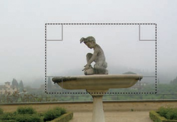

图 13-1. 行进的蚂蚁限定选择区域。

如果对图像进行某些调整，只有选中的像素会受到影响。在图 13-2 中，你可以看到我们调用色阶工具并调整了三个颜色通道中的伽马三角形后的结果。

你也可以复制选择内容并将其粘贴到其他地方，如图 13-3 所示。执行此操作，请按照以下步骤进行：

1.  使用**图像：编辑 > 复制**或 复制选择内容。复制的内容被放入一个名为*剪贴板*的缓冲区中，剪贴板一次只能存放一张图像。

    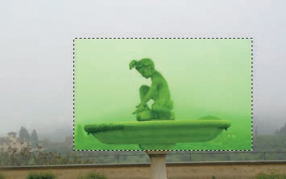

    图 13-2. 在选中的像素上使用“色阶”工具

    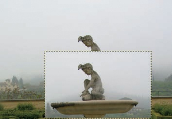

    图 13-3. 复制并粘贴选择

1.  使用**图像：编辑 > 粘贴**或按 将缓冲区的内容粘贴到同一图像中。

1.  因为这会创建一个*浮动选区*，所以需要创建一个新图层来放置该选区。这可以通过选择**图像: 图层 > 新建图层**，在图层对话框中右键点击并选择**新建图层**，按下，或者点击图层对话框底部行的第一个按钮来完成。你也可以*锚定*这个副本到当前图层，这将用复制的像素替换底层的像素。操作方法是选择**图像: 图层 > 锚定图层**，在图层对话框中右键点击，按下，或者按下图层对话框底部行的第二个按钮。

1.  我们的新图层被精确地粘贴在其原始位置，因此为了确保操作成功，选择移动工具（），并将新图层移到图像的底部。

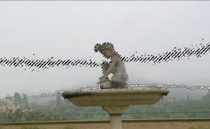

图 13-4. 使用模糊选择工具扩展选区

## 作为灰度图像的选区

使用矩形选择工具创建的选区有明显的轮廓。使用模糊选择工具（）创建的选区轮廓则不太清晰。当你用模糊选择工具点击图像时，所有与初始点击点相邻的像素，以及与其在工具选项中定义的某个阈值下相似的像素，都会被选中。根据图像和阈值的不同，计算哪些像素被选中和哪些没有被选中是很容易的，但轮廓通常复杂且难以跟踪。如果你在点击后拖动鼠标指针，可以调整阈值，从而增加或减少选中的像素数量。图 13-4 展示了这一过程。目前的选区轮廓呈现为一条厚而模糊的线，而新的轮廓（出现在图 13-4 底部）仍然相当不均匀。

通过将鼠标指针移动到尽可能远的位置，你可以选择到所有的天空和背景中部分模糊的树林。虽然新的选区从远处看似沿着地平线和雕像上方有一条晃动的线，但选区中的某些部分过于复杂，无法被视为轮廓。图 13-5 是该选区左侧部分的放大图，显示了像素是以看似随机的方式被选择的。

选择区域比看起来更加复杂。图像中的像素不仅仅是被选中或未被选中；像素可以在从 0%到 100%的连续范围内部分选中。点击图像窗口左下角的切换快速蒙版按钮（或按 ）可以轻松显示这一点。图 13-6 展示了类似选择的快速蒙版，这个选择也是通过模糊选择工具建立的。

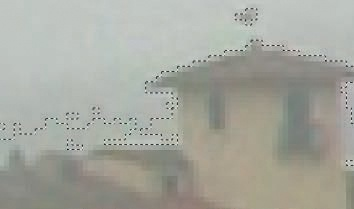

图 13-5. 图 13-4 中的选择区域细节

图 13-6. 使用切换快速蒙版按钮

如你所见，选择区域类似于已经作为当前图像一层添加的灰度图像，只是新层显示为红色（默认情况下）。在这个新层中，完全白色的像素表示当前图像中被 100%选中的部分。完全红色的像素则完全未被选中。粉红色像素（即部分红色的像素）被选中的程度与它们的红色程度成反比——蒙版的粉红色越浅，图像中的选择百分比越大。在我们的示例中，天空中部的像素被 100%选中，但在天空的上部，它们仅部分被选中。尽管我们基于默认的红色描述了选择区域，但你可以通过右键点击快速蒙版按钮，改变设置以显示任何你想要的颜色来表示选择蒙版。

图 13-7. 对选择区域应用渐变填充

相比之下，使用矩形选择工具创建的选择区域在激活快速蒙版时会显示为完全红白相间的图像。这是因为当前图像中的像素要么被选中，要么未被选中。

围绕选择区域的“行进的蚂蚁”仅仅是包含部分选中像素的选择区域的视觉近似。蚂蚁沿着选择区域的平均边界行进。如果对模糊选择应用操作，对当前图像中像素的效果与其选择率成正比。图 13-7 展示了这一点。

我们将在第十四章更详细地探讨部分选择的机制。

# 13.2 七种选择工具

工具箱中的前七个工具（如果是默认顺序）是选择工具，如图 13-8 所示。

## 常见选项

像工具箱中最初提供的大多数工具一样，选择工具也有选项，因此请保持选项对话框处于打开状态，并将其停靠在工具箱的底部。

如果你不小心关闭了它，只需选择**图像：窗口 > 可停靠对话框 > 工具选项**，双击工具图标，然后将出现的对话框拖到工具箱底部。

在接下来的部分，我们将逐一介绍每个选择工具的所有选项。但其中一些选项是所有工具共有的，我们将在这里—刚开始时—描述这些选项。图 13-9 显示了当自由选择工具处于活动状态时的常见选择选项。

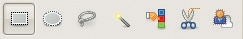

图 13-8. 七种选择工具

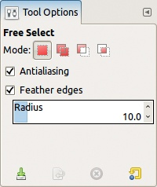

图 13-9. 常见选择工具选项

MODE 选项包含四种将新选择与现有选择合并的方法：

+   用新选择替换现有选择。这是默认模式。当做出新的选择时，之前的选择将被丢弃。

+   将新选择添加到当前选择中。在使用选择工具之前按住  即使未勾选此选项也会激活此模式。新选择的像素将被添加到已选择的像素中。在选择构建过程中，鼠标指针旁会出现一个加号 (+) 标志。

+   从当前选择中减去新选择。在使用选择工具之前按住  会激活此模式。新选择的像素将从当前选择中移除（如果它们是其中的一部分）；否则，它们将被忽略。在选择构建过程中，鼠标指针旁会出现一个减号 (–) 标志。

+   选择旧选择和新选择的交集。在使用选择工具之前按住  和  会激活此模式。只有同时包含在旧选择和新选择中的像素会被选中。在选择构建过程中，鼠标指针旁会出现一个交集 (∩) 标志。

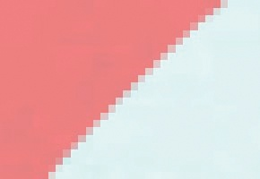

图 13-10. 带抗锯齿的选择边界

图 13-11. 不带抗锯齿的选择边界

按住键盘快捷键切换模式通常比点击模式图标更方便；尤其容易忘记已经勾选了其他模式。而且，当通过图标更改模式时，模式只会改变当前工具的设置；如果你切换选择工具，该工具的默认模式或之前选择的模式将会生效。

如果勾选了抗锯齿（ANTIALIASING）选项，选择的边界将变得平滑。图 13-10 和图 13-11 分别显示了启用和禁用抗锯齿时的选择边界。这个选项显然很有用，通常应该勾选。

当勾选羽化边缘（FEATHER EDGES）选项时，会模糊选区和非选区之间的边界。半径（RADIUS）指定模糊边界的宽度。图 13-12 显示了半径为 10 像素时的效果。

请注意，抗锯齿和羽化（feathering）都使用相同的技术，即对选择边界处的像素进行部分选择。

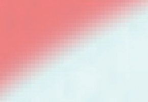

图 13-12. 羽化边缘选项的效果

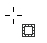

图 13-13. 矩形选择工具指针

选项对话框的底部包含四个按钮，这些按钮对于所有选择工具都是相同的。最左侧的按钮用于保存当前设置。你可以为这些设置选择一个名称，并且可以保存任意数量的组合。下一个按钮允许你恢复先前保存的设置。第三个按钮允许你删除之前保存的设置。最后，第四个按钮可以将所有设置恢复到默认值。如果在点击此按钮时按下，所有工具将被重置为默认设置。请注意，如果你没有保存任何设置，只有第一个和第四个按钮是可用的。

## 矩形选择工具

矩形选择工具可以通过工具箱访问（在图 13-8 中的最左侧图标），或者通过**图像：工具 > 选择工具**菜单，或者按  快捷键。当矩形选择工具处于激活状态时，鼠标指针变成带有矩形图标的十字线（见图 13-13）。当所有选项设置为默认值时，你可以通过点击矩形的一个角落，拖动鼠标指针到对角的另一个角落，然后松开鼠标按钮来创建一个简单的矩形选区。

简单的矩形选区在照片编辑中不常用，但在创建纹理或几何形状时可能会有用。在 13.4 使用选区一节中，我们将向你展示如何修改已有的选区，例如，如何改变其形状或旋转它，这些技巧将使矩形选择工具变得更加多功能。

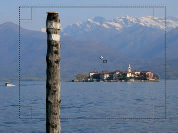

图 13-14. 移动选区

尽管选区在你松开鼠标按钮的瞬间就被创建，但你仍然可以移动和修改它。如果光标位于选区内部，它的图标将变成你在激活“移动”工具时看到的交叉箭头，如图 13-14 所示。你可以通过点击并拖动鼠标来移动选区本身（而不是选中的像素），这对于大幅调整选区在图像中的位置特别有用。对于微调，使用键盘的箭头键，每次可以移动选区 1 像素。如果你按住  键并使用箭头键，选区将每次移动 25 像素。

如果你将鼠标指针放置在选区矩形的角落或边缘附近，它的图标会发生变化，如图 13-15 所示。这个图标表示工具现在将移动选区的边缘或角落，使你可以改变矩形的尺寸。你可以使用鼠标指针或箭头键来完成这个操作。当你按住  键时，箭头键会以 25 像素为单位移动选区的边框。否则，它们每次移动选区边框 1 像素，使你能够非常精确地调整矩形的尺寸。

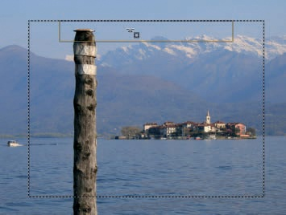

图 13-15. 改变选区

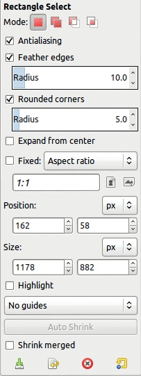

图 13-16. 矩形选择工具选项

在选区矩形之外时，鼠标指针图标看起来与开始构建选区之前完全相同。如果模式设置为默认值，当您点击并拖动当前选区之外的区域时，现有选区将被丢弃并重新创建一个新选区。

图 13-17. 高亮选区

要完成选择，请点击矩形，按下  键，或选择其他工具。

矩形选择工具有多个选项，如图 13-16 所示。

如果勾选，**圆角**框将显示四分之一圆角的半径选项，用来替代矩形的角落。请参见图 13-17 以获取示例。

如果勾选**从中心扩展**框，您点击的初始位置将是矩形选区的中心。否则，它将是矩形的一个角落。您也可以通过在初次点击开始选择后按住  键来激活此模式。请注意，如果在开始选择之前按住  键，则会激活减去模式，选中的矩形将从当前选区中减去。如果勾选了**从中心扩展**按钮，在构建选区的过程中按住  键将切换此选项。

如果工具选项中的**固定**框被勾选，您可以约束矩形的形状。右侧的菜单包含以下选择项：

+   宽高比：选择此项后，下方的框指定宽度与高度的比例，初始值为 1:1，对应正方形。您可以将其更改为 1:2 或 4:3 等。例如，右侧的小图标允许您反转比例。

    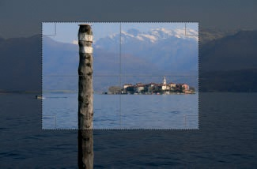

    图 13-18. 使用中心线

+   宽度：选择此项后，您可以通过在下方的框中输入数字来固定选区的宽度。右侧的下拉菜单允许您更改单位，甚至使用百分比。

+   高度的设置方式相同。

+   尺寸：选择此项后，您可以精确指定矩形的像素尺寸。您也可以输入类似 257 × 7 或 85% 的数值表达式。

在开始构建选区后，按住  键可以切换到**固定**按钮。

接下来的四个字段用于调整选区的位置和大小，可以使用像素或其他多种单位。随着你使用鼠标指针或箭头键构建或移动选区，显示的值会发生变化。你还可以通过直接输入框中的数值或点击每个框右侧出现的箭头来设置大小和位置。

如果选中高亮框（HIGHLIGHT）选项，选区会被高亮显示，如图 13-17 所示。当选区完成时，突出显示会消失。

接下来的选项允许在创建选区时显示引导线。引导线可以帮助你在裁剪照片时应用常见的构图规则，例如。

+   无引导线（NO GUIDES）仅显示正在创建的矩形的外部边界。

    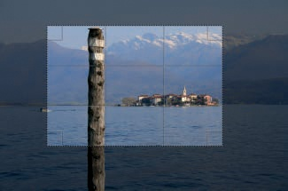

    图 13-19. 使用三分法

    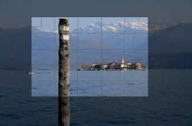

    图 13-20. 使用五分法

+   中心线（CENTER LINES）在矩形的中间放置两条垂直和两条水平线，如图 13-18 所示。

+   三分法（RULE OF THIRDS）在矩形中放置两条垂直线和两条水平线，将矩形分为九个相等的部分。参见图 13-19。

+   五分法（RULE OF FIFTHS）在矩形中放置四条垂直线和四条水平线，将矩形分为 25 个相等的部分。参见图 13-20。

+   黄金分割（GOLDEN SECTIONS）类似于三分法（RULE OF THIRDS），但引导线是基于黄金比例对齐的。

+   对角线（DIAGONAL LINES）从每个角落绘制一条 45°的线，只有在正方形的情况下，这条线才能将选区一分为二。

请注意，如果在创建选区时更改引导线，新的引导线会立即显示。

接下来的两个条目涉及自动缩小（AUTO SHRINK）机制，这在某些情况下非常有用。为了演示此机制，我们在白色背景上绘制了一个简单的黑色形状，如图 13-21 所示。然后，我们大致围绕这个形状做了一个矩形选区，如图 13-22 所示。当我们点击自动缩小按钮时，选区会缩小为包含我们绘制的物体的最小矩形，如图 13-23 所示。

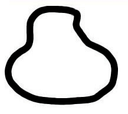

图 13-21. 原始图像

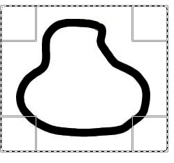

图 13-22. 第一个选区

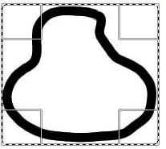

图 13-23. 缩小选区

不幸的是，此选项仅在背景为纯色时有效，因此在照片或复杂插图中并不十分有用。

当勾选“收缩合并”框时，将考虑所有可见图层，而不仅仅是当前图层。

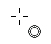

图 13-24. 椭圆形选择工具指针

图 13-25. 减去椭圆形选择区域

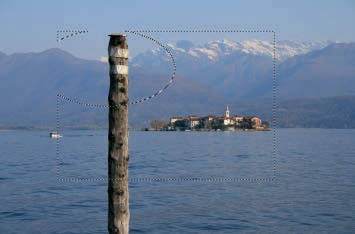

图 13-26. 结果选择区域

## 椭圆形选择工具

可以通过工具箱访问椭圆形选择工具（在图 13-8 中从左数第二个图标），通过**图像：工具 > 选择工具**菜单，或者按下 。当此工具激活时，鼠标指针会变成带有圆形图标的十字准线（见图 13-24）。其工作方式与矩形选择工具相同，默认选项也相同，不同之处在于“抗锯齿”选项默认是勾选并启用的。

图 13-25 显示了从矩形选择区域中减去椭圆形选择区域的过程。图 13-26 显示了完成选择后的结果。

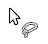

图 13-27. 自由选择工具指针

图 13-28. 使用自由绘制方法

## 自由选择工具

可以通过工具箱访问自由选择工具（在图 13-8 中从左数第三个图标），通过**图像：工具 > 选择工具**菜单，或者按下 。选择此工具时，鼠标指针会显示如图 13-27 所示。自由选择工具仅具有所有选择工具通用的选项。你可以通过两种方式使用此工具。

第一个方法如图 13-28 所示，最好使用图形板的触控笔进行操作。要构建选择区域，从预定选择区域的轮廓起始点点击，并沿着轮廓绘制，直到返回初始点。当白点出现在开放圆圈的位置时，轮廓已完成，并且在释放鼠标按钮时会自动闭合。如果提前释放鼠标按钮，鼠标释放的位置会出现一个空心圆圈。如果你将鼠标悬停在该圆圈上，它会填充，且鼠标指针会变为移动图标。如果你移动选择曲线的某个端点，曲线的方向和大小会改变，但形状保持不变，如图 13-29 所示。

自由选择工具还可以通过点击连续的顶点来构建多边形，如图 13-30 所示。每次点击后，你刚刚点击的点会被圈住，指针会显示移动图标，表示你可以移动这个最后的点。当鼠标指针接近起始点时，该点会出现一个闭合圆圈，点击后路径闭合，选择区域完成。一旦发生这种情况，选择区域的形状就无法再改变，至少不能使用自由选择工具本身来改变。

图 13-29. 移动曲线

图 13-30. 使用多边形方法

你还可以结合两种自由选择方法。在构建选择区域时，你可以通过点击或点击并拖动来添加点，从某个点绘制曲线段。按下  可完成选择，无论最后一个点与起始点的距离有多远，都会用直线段连接第一个和最后一个点。

该工具非常适合围绕复杂形状进行粗略选择，之后你可以使用快速蒙版进行细化，详细内容请参见第十四章。

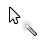

图 13-31. 模糊选择工具指针

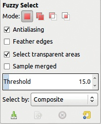

图 13-32. 模糊选择工具选项

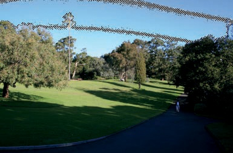

图 13-33. 构建第一个选择区域

## 模糊选择工具

从工具箱中访问模糊选择工具（在图 13-8 中从左数第四个图标），从**图像：工具 > 选择工具**菜单，或按下 。当此工具激活时，鼠标指针会显示图 13-31 中所示的图标。模糊选择工具选择具有相似颜色的连续像素。它的选项如图 13-32 所示。

当我们在图 13-33 中点击并按住鼠标按钮在图像的天空部分时，会出现选区的轮廓。当我们松开鼠标时，我们得到的选择区域如图 13-34 所示，选区确实是模糊的。我们通过一个非常厚的边框选择了天空的一部分，但我们的目标是选择整个天空。你可以通过几种方式扩展选区：

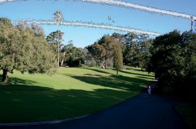

图 13-34. 结果选择区域

+   按住  键的同时在未选择的区域点击，以将其他区域添加到第一个选区中。在这种情况下，点击选区的模糊边界内是最好的选择。 -点击草地来选择整个草地。当然，你也可以通过按住  键并点击那些不属于选区的区域来移除它们。

+   使用滑块增加工具选项中的 THRESHOLD。默认值为 15.0，可以设置为 0 到 255 之间的任何值。你选择的数字是初始像素与被选像素之间的最大差异。

+   更改选择像素的方式。SELECT BY 选项会显示图 13-35 所示的菜单。默认选择 COMPOSITE，使用 RGB 像素的所有组成部分。但你也可以只使用这些组件中的一个，或者使用 HSV 模型中的一个组件。例如，在图 13-36 中，我们使用了蓝色组件，一次点击足以选择整个天空——而且只选择了天空。

+   在构建选择时，按住鼠标按钮并沿对角线从左上角到右下角移动指针。当你向上移动指针时，阈值会降低，向下移动时，阈值会增加。阈值的变化会在工具选项对话框中显示。

    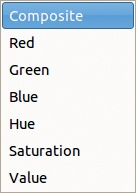

    图 13-35. 选择像素的方法

    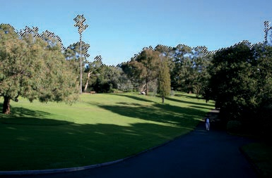

    图 13-36. 仅使用蓝色组件

模糊选择工具还有两个选项，如果图像有透明度和多层，十分方便：

+   勾选**选择透明区域**时，允许你将透明区域作为选择的一部分。

    在图 13-37 中，我们添加了新的天空，这来自另一张照片。为此，我们使用模糊选择工具，仅选择了蓝色组件，来选中天空。我们为图层添加了 Alpha 通道，并使用  剪切选择。最后，我们将另一张照片作为新图层插入，使用**图像：作为图层打开**（ 也有效），并将该新图层放置在第一个图层下方。

    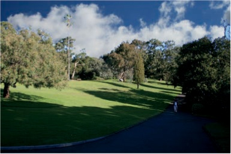

    图 13-37. 具有两层的图像

    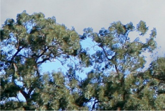

    图 13-38. 放大图 13-37 的一部分

    现在我们的图像有多层，并且在旧天空所在的位置有一个透明区域，所以**选择透明区域**复选框的状态很重要。图 13-38 展示了该图像一部分的放大。多云的天空位于底层，而顶部层的相应部分是透明的。但是在树木之间，旧的蓝天部分仍然存在。如果**选择透明区域**按钮未勾选，你将无法选择新天空中的任何像素。如果勾选了它，你可以同时选择旧天空和新天空的部分，从而对图像中的所有蓝色天空区域应用变换。

+   **样本合并**允许你进行选择，包含图像的所有可见部分，而不仅仅是当前图层中的内容。如果相关区域完全透明或不透明，勾选此框不会产生任何效果。如果区域是半透明的，可以看到来自不同图层的元素，那么此选项的状态就非常重要。

    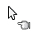

    图 13-39. 通过颜色选择工具指针

    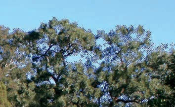

    图 13-40. 在蓝色通道中选择

## 按颜色选择工具

从工具箱中访问“按颜色选择”工具（图 13-8 中从右往左数的第三个图标），也可以通过**图像：工具 > 选择工具**菜单，或按快捷键 。当选择此工具时，鼠标指针如图 13-39 所示。按颜色选择工具的工作方式与模糊选择工具相同（只是选择的像素不必是相邻的），并且具有相同的选项。如果我们在图 13-33 所示的图像中选择蓝色通道，现在我们的选择包括了树下的蓝色区域，如图 13-40 所示。

根据给出的示例，这个工具似乎比模糊选择工具更有用。实际上，最好的工具取决于图像和目标。在这个案例中，使用按颜色选择工具仅需一次点击就能选择整个天空。然而，遗憾的是，这个工具还选择了照片中其他两个部分的蓝色区域。图 13-41 展示了其中一个，即在小路上行走的男人的衬衫。为了使这个选择有效，在对天空进行调整之前，你必须取消选择这些其他的蓝色区域。

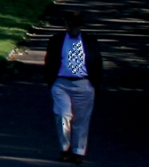

图 13-41. 选择的蓝色区域远离初始点

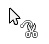

图 13-42. 剪刀选择工具指针

## 剪刀选择工具

从工具箱中访问剪刀选择工具（如图 13-8 中从右侧第二个图标），或通过**图像：工具 > 选择工具**菜单，或按下 （因为这个工具有时被称为*智能剪刀*）。当工具激活时，鼠标指针如图 13-42 所示。这款工具适用于选择复杂的形状，前提是它们的轮廓与背景对比鲜明。使用此工具时，需要沿着要选择的对象轮廓放置控制点。如果这些控制点选择得当，两点之间的线条将勾勒出对象的轮廓。图 13-43 展示了一个正在进行中的工作。鼠标指针旁边的+号表示点击时会添加另一个点。

如果点之间放置得太远，且它们之间的轮廓不够清晰，工具可能无法正确勾画轮廓。不幸的是，这个工具没有撤销机制。但只要你添加的点在轮廓上，可以通过点击线条添加另一个点，然后按住鼠标按钮拖动该点进行调整。如果不小心添加了一个不在对象边界上的点，可以在边界上更远的位置添加另一个点，再点击并拖动错误的点到正确位置。如果部分选择无法修复，可以切换到其他工具，返回剪刀工具，重新开始。

图 13-43. 放置第一个控制点

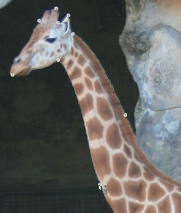

图 13-44. 完成对象轮廓

当鼠标指针接近起点时，它会发生变化，如图 13-44 所示。点击后，鼠标指针会再次变化，如图 13-45 所示。如果点击轮廓内部，它会转换成选择区域，如图 13-46 所示。

图 13-45. 完成的轮廓

图 13-46. 完成的选择区域

这个图说明了剪刀工具并不完美。长颈鹿的下颚没有被选中，因为它的轮廓与背景的对比度不够。这类错误很常见。你几乎总是需要使用其他工具（如快速蒙版）来细化剪刀工具选择的结果，快速蒙版在第十四章中有详细介绍。

剪刀工具除了标准的选择选项外，还有一个选项：**交互式边界**。勾选该选项后，会显示当前控制点与即将放置的控制点之间的轮廓。只要点击新的控制点，轮廓就会出现，并且如果你在拖动鼠标指针时不松开，轮廓会实时变化。这可以帮助你看到在轮廓检测停止正常工作之前，能将新的控制点移动多远，从而帮助你使用更少的控制点准确地描绘对象。图 13-47 展示了一个示例，我们成功地选择了下颚部分。

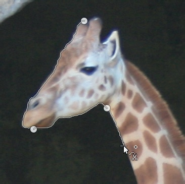

图 13-47. 看到轮廓构建的过程

图 13-48. 描绘猫的轮廓

## 前景选择工具

从工具箱中访问前景选择工具（在图 13-8 中最右侧的图标）或**图像：工具 > 选择工具**菜单。这个工具比较复杂，最好通过演示来解释。

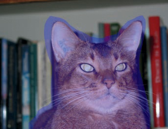

图 13-49. 创建轮廓后

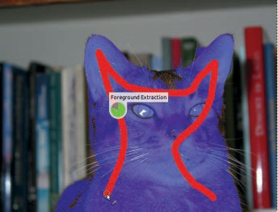

图 13-50. 将猫标记为前景对象

这个工具旨在选择图像前景中的复杂对象。当工具处于活动状态时，指针看起来像是自由选择工具的指针。图像窗口的模式栏中会显示“粗略勾画要提取的对象”字样。首先按照使用自由选择工具时的方式勾画对象，正如图 13-48 所示。更精确的轮廓会带来更好的结果，因此在这一步要格外小心。

当释放鼠标按钮时，轮廓会被确定，选择区域会以蓝色显示（默认情况下），如图 13-49 所示。图像窗口的模式栏中会显示“通过在物体上涂抹来标记前景以提取”的信息，鼠标指针变为画笔工具。接下来，粗略地在猫身上连续涂抹以选择它，如图 13-50 所示。当你完成第一次涂抹并释放鼠标指针时，图像窗口中的信息会显示“添加更多涂抹或按 Enter 键接受选择。”此时我们的结果显示在图 13-51 中。如果你还没有完全选择猫，继续涂抹未选择的区域。如果你不小心选择了一部分背景，按  键切换到取消选择模式，并涂抹掉那些不小心选择的区域。当你满意时，按  来最终确定选择。我们的最终选择显示在图 13-52 中。

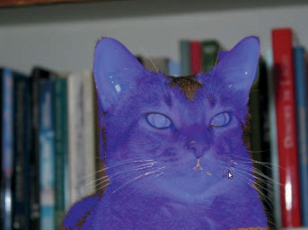

图 13-51. 新选择

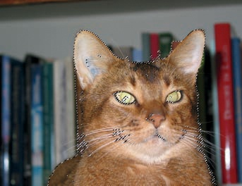

图 13-52. 最终选择

我们的最终选择仍然需要进行大量修改。前景选择工具通过选择你在所勾画区域内涂抹的颜色来工作。如果物体的颜色（在这个例子中是猫）与背景中的颜色相似，那么选择的结果将不太准确，尤其是当轮廓包括了大量背景时。

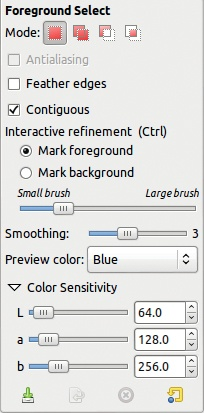

图 13-53. 前景选择工具选项

前景选择工具有许多选项，这些选项显示在图 13-53 中。当选中时，连续性选项指定所选区域为单一、连接的部分。否则，工具可以选择轮廓内的相似颜色的不连续区域。

以下两个单选按钮与  键等效，它们允许你在选择和取消选择颜色时切换。每次释放鼠标按钮时，工具都会创建一个新的草图选择。一个滑块可以让你选择画笔的大小。

使用平滑滑块来调整选择的精度。数值越小，精度越高，但也可能导致选择中出现小孔。

预览颜色菜单允许你在蓝色、绿色或红色之间选择，最佳选择是与图像对比最强烈的颜色。

最后，颜色敏感度选项允许你使用 LAB 色彩模型，通过调整三个滑块来增加或减少工具对图像中颜色的敏感度。在这个色彩模型中，L 与 HSV 模型中的值通道相同，A 是红色与绿色的差异，B 是蓝色与黄色的差异。

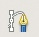

图 13-54. 路径工具图标

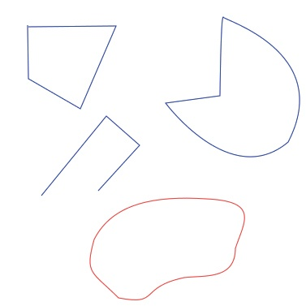

图 13-55. 四个示例路径

# 13.3 路径工具

路径工具不完全是选区工具，但它确实提供了一种强大的方式来构建复杂的选区。你可以从工具箱中访问它（参见图 13-54），从**图像：工具 > 路径**，或者按下 。快捷键来自于*贝塞尔曲线*，这是路径的另一种名称。

贝塞尔曲线是描述复杂曲线的强大数学工具。虽然数学非常复杂，但使用少量的*锚点*和这些点的相应*控制柄*来创建曲线或路径相对容易。通过移动、添加或删除锚点，或改变控制柄的方向和长度来修改曲线也很简单。图 13-55 显示了四条不同的路径。如你所见，路径可以是封闭的或开放的，可能包含直线段或曲线段，或者两者都有。在构建路径时，你可以撤销任何操作，这是大多数选区工具，包括剪刀选择工具和前景选择工具，所不具备的功能。你构建的每条路径都会保存在当前图像中，并可以在路径对话框中恢复，该对话框最初是多重对话框窗口的一部分。如果对话框不再打开，你可以从**图像：窗口 > 可停靠对话框**菜单中打开该对话框。路径标签出现在图层和通道标签之后。当路径对话框可见时，它会显示当前图像中存在的路径。默认情况下，路径是不可见的，但点击路径左侧的线条会显示眼睛图标，这表示该路径现在是可见的。

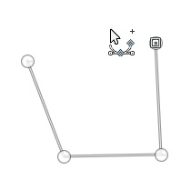

图 13-56. 构建路径

在创建路径后，你可以将其转换为选区或进行*描边*，这样就可以在图像上进行绘制。你甚至可以将选区转换为 SVG 格式，用于矢量图形（参见第二十章）。

## 构建路径

当你选择路径工具时，鼠标指针旁边会显示图 13-56 中显示的复杂图标。小的+号表示点击会将锚点添加到路径中。你已经放置的点会显示为实心圆，除非是最新放置的点，它会显示为空心圆。直线将这些点连接起来。

如果将指针移到现有的锚点或段落附近，+号将变成移动标志（交叉箭头）。在图 13-57 中，我们点击并拖动了现有的锚点，它便成为了当前的点。

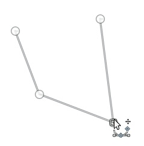

图 13-57。移动锚点

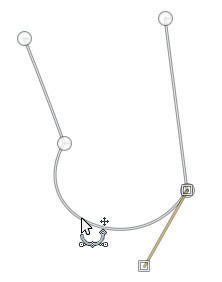

图 13-58。非多边形模式下移动段落

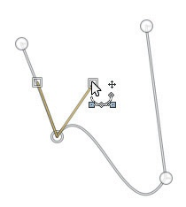

图 13-59。移动把手

如果点击并拖动一个段落，结果的效果取决于工具选项中“多边形”复选框的状态。如果未勾选该框，段落会发生变形，如图 13-58 所示。该弧形的两端会延伸出把手。如果移动把手，弧形将变形，如图 13-59 所示。

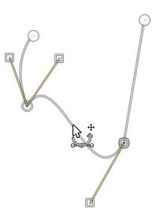

图 13-60。一个在多边形模式下移动段落的示例

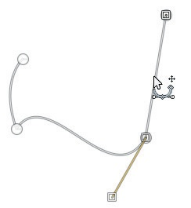

图 13-61。另一个在多边形模式下移动段落的示例

如果在勾选了“多边形”框时点击并拖动段落，该段落会被移动但不会变形。为了在不分离段落的情况下实现这一点，相邻的段落必须被变形。 在图 13-60 中，我们将弯曲的段落向下移动，并且两个直线段被拉长。在图 13-61 中，我们将右侧的直线段向右移动，弯曲段落被变形。

## 修改路径

路径工具选项显示在图 13-62 中。我们已经讨论过了 POLYGONAL 复选框。EDIT MODE 选项允许你在三种选择之间进行选择。默认情况下，DESIGN 按钮是选中的；在此模式下，点击路径外部会添加一个新点。当你添加新点时，会在新点和前一个点之间插入一条线段。如果你切换到另一个工具，然后再切回路径工具，你可以继续现有路径，也可以构建一个*不相连的路径*，即看起来像两个独立路径的单一路径(图 13-63)。要继续现有路径，点击现有的锚点，然后添加新点。要构建不相连的路径，点击现有路径两次，激活设计模式，然后开始添加点，而无需先点击现有点。

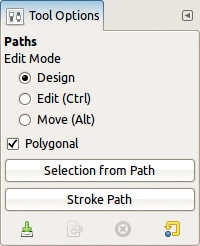

图 13-62. 路径工具选项

图 13-63. 向现有路径添加线段

图 13-64. 编辑模式下的鼠标指针

如果你点击 EDIT 单选按钮（或按下  键），你可以改变工具的行为。当指针位于锚点或线段之外时，鼠标指针不可操作，如图 13-64 中所示的圆圈内有一条横线。

图 13-65. 在编辑模式下添加新点

图 13-66. 移动点的手柄

如果指针接近一条线段，鼠标指针旁边会出现一个小的+符号，这意味着你可以在此位置添加一个新的锚点，如图 13-65 所示。

如果指针接近一个锚点，鼠标指针通常会变成移动图标，这意味着你可以移动该点。但是，移动点的效果取决于 POLYGONAL 选项的状态。当选中此选项时，锚点会移动；否则，手柄会移动，曲线会发生形变。

根据移动的方向，出现不同的手柄；每个手柄对应于附加到锚点的一个曲线。在图 13-66 中，两个手柄都是可见的。

最后，如果当前点（用空心圆表示）位于开放路径的末端，并且鼠标指针接近另一个端点，指针将变为链接图标，如图 13-67 所示，点击即可在两个端点之间绘制一段路径，从而关闭路径。

图 13-67. 准备在现有点之间添加一段

图 13-68. 移动路径组件

如果你点击工具选项中的**移动**单选按钮（或按下  键），鼠标指针将始终伴随有移动符号。如果你点击路径组件的一个段落或锚点，你可以移动它，如图 13-68 所示。如果你点击并拖动路径外部，你将移动整个活动路径。

你还可以在不改变路径本身的情况下移动一个完成的路径。要做到这一点，选择**移动工具**并点击其选项对话框中的最右侧按钮。你还可以使用变换工具对路径进行透视或旋转等操作。

## 使用路径

通常，完成的路径要么被转换为选区，要么用于在图像上绘制。可以通过点击选项对话框中的**从路径选择**按钮将路径转换为选区。

图 13-69 显示了我们对图 13-68 中的路径进行此操作后的结果。未选中的部分呈粉红色，因为我们启用了快速蒙版（）。

图 13-69. 从路径创建选区

图 13-70. 选择描边样式对话框

如预期的那样，蚂蚁线沿路径移动，选区的轮廓非常清晰。

对路径进行描边相当于沿路径在图像上绘制。点击**描边路径**按钮会打开如图 13-70 所示的对话框。在这个对话框中，你可以指定沿路径绘制的描边特性。首先，你需要选择是描边线条还是使用绘画工具进行描边。

图 13-71. 虚线预设菜单

如果你选择描边线条，你可以指定线条的宽度、是否使用实心颜色（前景色）或图案，以及选择线条样式。线条样式的选项包括以下内容：

+   CAP STYLE 影响段落的两端。

+   JOIN STYLE 影响两段之间的角度。

+   MITER LIMIT 还会改变连接处的外观。零级设置会导致连接处在两个段交叉点处急剧结束，而更高的级别则会使连接处逐渐变尖。

+   DASH PATTERN 从 DASH PRESET 菜单中选择（如图 13-71 所示），该菜单包含多个预设模式，以及创建自定义虚线模式的选项。通过点击并拖动出现在虚线预设菜单上方的线条来调整自定义模式。末端的箭头按钮可以将模式沿线向前或向后移动，从而改变虚线的起始和结束位置。请注意，第三个 CAP STYLE 会掩盖虚线之间的间隔，尤其是当间隔太短时。这个效果在预览中不会显示，但一旦你完成更改，它将会显现（见图 13-72）。路径仍然在描边下可见，但它本身并不是图像的一部分。如果你打印这张图片，例如，左侧的控件将不会出现。

+   ANTIALIASING 选项通常最好保持选中。

图 13-72. 描边路径

图 13-73. 画笔工具菜单

图 13-74. 使用画笔工具描边

图 13-75. 使用墨水工具描边

如果你选择使用绘画工具描边选项，你可以从图 13-73 中展示的画笔工具中选择。图 13-74 展示了使用画笔工具描边的结果，使用的是`Hardness 075`画刷，缩放到大小 20。对于图 13-75，我们使用了墨水工具，并勾选了模拟画笔动态的复选框。有关画笔动态的更多细节，请参见第十五章，特别是画笔动态。

图 13-76. 使用图案描边

你还可以通过选择 STROKE LINE（描边线）然后选择 PATTERN（图案），用图案描边路径。在打开选择描边样式对话框并在“图案”对话框中选择图案后，才能选择图案。图案对话框最初位于多对话框窗口中。图 13-76 中的路径就是使用`Pine`图案描边的。

## 路径对话框

路径与选择的不同之处在于：

+   尽管一次只能选择一个路径，但一个图像可以包含多个路径。例如，如果你将图像保存为 XCF 格式，路径会与图像一起保存，下一次打开时可以使用。注意，如果你将图像导出为 TIFF 格式，这一点同样适用。

+   在构建路径时，你可以撤销任何操作。

+   已有的路径可以在路径对话框中使用，该对话框是一个可停靠的对话框，通常会在多对话框窗口中打开。

图 13-77. 路径对话框

图 13-77 展示了一个包含三条路径的路径对话框。最上面的路径，其行被强调显示，是当前路径。其他两条路径在图像窗口中可见，因为眼睛图标显示了。当路径在图像窗口中可见时，选择路径工具并点击该路径即可将其设为当前路径。在路径对话框中点击该行也能达到相同的效果。如果锁定功能已启用，它将防止对当前路径的任何更改。

与图层或通道对话框类似，路径对话框中的每一行都有一个链接位置。有关详细说明，请参见第十一章。路径可以链接到一个或多个图层和通道，然后可以使用任何变换工具对其进行变形—就像其他已链接组件一样。

在“路径”对话框中右键单击会弹出路径菜单，如图 13-78 所示。这个菜单也可以通过对话框右上角的配置按钮访问。菜单中最常用的八个条目在对话框底部也有相应的按钮。

EDIT PATH ATTRIBUTES（编辑路径属性）只允许你更改路径名称，这也可以通过双击相应的行来完成。

NEW PATH（新建路径）会创建一个新的空路径。另一种创建新路径的方式是，在选中路径工具后，直接点击图像，而不必先点击一个可见的路径。

RAISE PATH（提升路径）和 LOWER PATH（降低路径）会将路径在对话框中上下移动，但这对路径的功能没有影响，你也可以通过点击并拖动它们在对话框中的行来重新排列它们。

图 13-78. 路径菜单

DUPLICATE PATH（复制路径）和 DELETE PATH（删除路径）含义显而易见。点击并拖动一行到删除图标也会删除该路径。

MERGE VISIBLE PATHS 是将多个路径合并成一个路径的方法，但所有被合并的路径必须是可见的。在使用此菜单项之前，确保将路径设置为可见（通过点击眼睛图标）。

接下来的四个菜单项相当于选项对话框中的 SELECTION FROM PATH 按钮。不同之处在于，在选项对话框中，你需要做出额外选择，以控制新选择如何与现有选择结合，而在路径菜单中，四个不同的条目对应不同的合并方法。请注意，默认方法（替换现有选择）也可以通过应用**图像：选择 > 从路径**或按下 来实现。

SELECTION TO PATH 使用现有选择的行进蚂蚁（marching ants）来构建新路径。或者你也可以通过应用**图像：选择 > 到路径**来做到这一点。

STROKE PATH 与选项对话框中的对应按钮执行相同的操作。

COPY PATH 和 PASTE PATH 允许你将路径从一个图像复制到另一个图像。你也可以通过从路径对话框点击并拖动路径到图像窗口来完成此操作。

EXPORT PATH 将路径转换为 SVG 格式。在弹出的对话框中，你可以选择是否只导出当前路径或图像中的所有路径。

IMPORT PATH 将现有的 SVG 文件转换为路径。这在创建极其复杂的路径时非常有用，而这些路径可能超出了路径工具的能力范围。请注意，GIMP 也可以将 SVG 文件作为图像加载。

路径也可以与文本工具结合使用。文本可以转换为路径，或者可以沿路径输入。更多细节请参见 15.8 文本工具。

# 13.4 使用选择

一旦你建立了选择区域，你可以将其用于多种目的。这里，我们讨论如何使用你刚刚建立的选择。如果你希望将选择保存以供日后使用，我们将在下一章深入讨论蒙版。

当选择处于活动状态时，它会被行进蚂蚁轮廓标出。如果轮廓太分散注意力，你可以通过按下  或选择**图像：视图 > 显示选择**来隐藏这个轮廓。但请明智地使用这个切换功能。新手 GIMP 用户常遇到的主要问题之一是忘记了隐藏的选择区域。当存在隐藏选择时，图像的变换看起来会异常，或者根本不起作用。如果变换没有按预期工作，始终切换行进蚂蚁的可见性，检查是否隐藏选择区域导致了问题。

对图像的更改，无论是通过绘图、绘画、色彩校正工具还是滤镜，都会仅应用于当前选择区域。这让你能够精确地界定操作影响图像的部分。我们在全书中提供了许多这方面的例子。

图 13-79. 浮动选择

假设你选择了照片中的某些建筑物，并希望用相应的变换工具来修正它的透视（见 第十六章）。一旦你应用变换工具，一个新的图层——称为 *浮动选择*——会出现在图像中。图 13-79 显示了图层对话框中的浮动选择。

这个新图层是临时的，但在它存在期间，你不能改变图像中的其他部分，也不能更改当前图层。GIMP 提供了三种方法来去除这个临时的异常并重新控制其他图层：

+   如果你不再需要浮动选择，可以删除它。

+   创建一个新图层来包含浮动选择。

+   *固定* 浮动选择到当前图层。也就是说，将它添加到该图层，实际上会替换所有将被选择隐藏的像素。

任何这些操作都可以通过右键点击图层对话框或从 **图像: 图层** 菜单中进行。按下  将浮动选择固定到一个图层。请注意，这个快捷键并不总是作用于图层，它也可以作用于图层蒙版或通道，具体取决于之前的操作。

图 13-80。选择菜单

当对一个选择应用变换时，选择的初始内容会被替换。例如，如果你旋转一个选择，原来被选择的图像部分将不再处于原先的位置。如果图层没有 Alpha 通道，选择区域被移动出去的地方会填充当前的背景色。如果存在 Alpha 通道，空白区域将变为透明。如果你想保留选择的原始副本，必须在变换选择之前复制该图层。

## 选择菜单

**图像: 选择** 菜单显示在 图 13-80 中。它的条目影响的是选择，而不是整个图像。我们将逐一讨论每个条目。

**ALL** 或者  会创建一个覆盖整个画布的选择。如果你想操作整个画布，并不总是需要按下 。例如，如果没有任何选择并且你选择 **图像: 编辑 > 复制**，整个画布都会被复制。然而，如果你希望移动画布，必须先选择它。

图 13-81。选择编辑器对话框

**NONE** 或  会取消当前的选择，清除所有选择。

INVERT 或  会反转选择区域，因此之前完全选中的像素将不再被选中，反之亦然。部分选中的像素仍然被选中，但选择的范围会被反转。例如，如果一个像素被选中了 80%，反转后，剩下的 20% 将被选中。如果将选择区域看作灰度图像，反转选择意味着黑色像素变成白色，白色像素变成黑色，而灰色像素的 60% 会变成 40%。

FLOAT 或  会将选中的像素变为浮动选择。此选项很少使用，特别是因为它会从初始图层中剪切像素。通常认为这个命令是一个过时的功能。

BY COLOR 只是另一种访问“按颜色选择”工具的方式（见 按颜色选择工具）。

FROM PATH 或  会从当前路径构建一个新的选择，如果路径存在的话。之前的选择会被丢弃。

SELECTION EDITOR 会打开 图 13-81 所示的可停靠对话框。该对话框通过底部的六个按钮，便于访问一些常见的选择相关任务。当前的选择区域会显示在窗口中。

图 13-82. 点击显示窗口后

图 13-83. 羽化选择区域

如果你点击对话框的显示窗口，选择按颜色工具的方法将自动用于构建选择，如 图 13-82 所示。按下 、 和  键可像往常一样更改选择模式。

FEATHER 会打开 图 13-83 所示的对话框。如果你忘记在使用选择工具时勾选“羽化边缘”复选框，选择了太小的值，或者使用一个没有此选项的工具来构建选择，这个选项非常有用。

SHARPEN 会去除选择区域的羽化效果，只有在选择的轮廓是由羽化效果产生时，效果才会非常明显。例如，如果你在使用模糊选择工具时使用该选项，效果几乎不明显，选择的边界仍然是复杂的，如 图 13-84 所示。

SHRINK 打开的是如图 13-85 所示的对话框。所选区域的大小按指定的像素数减少。这意味着，无论选区的形状如何，选中的像素数都比之前少。只有当选区大于画布时，SHRINK FROM IMAGE BORDER 复选框才有意义。如果是这种情况，并且选中该选项，初始选区将被处理为仅延伸到画布边缘。

图 13-84. 锐化模糊选区

图 13-85. 缩小对话框

图 13-86. 边框对话框

GROW 具有相反的效果，并引发类似的对话框。

BORDER 打开的是如图 13-86 所示的对话框。边框可以用于创建一个新的选区，该选区沿当前选区的轮廓扩展。图 13-87 展示了当初始选区为椭圆形时的结果。你可以选择边框的宽度，边框会对称地应用到选区上。一个复选框允许你对边框进行羽化处理，但你无法控制羽化的宽度。另一个复选框，LOCK SELECTION TO IMAGE EDGES，会将新选区限制在画布边缘内。

图 13-87. 边框选区

图 13-88. 扭曲对话框

图 13-89. 使用默认参数进行扭曲

DISTORT 打开的是如图 13-88 所示的对话框。这个工具用于随机扭曲选区轮廓。通过调整参数，你可以获得不同的效果，但结果很难预测。从一个简单的椭圆开始，使用默认参数，我们得到了图 13-89。如果我们将三个参数——SPREAD、GRANULARITY 和 SMOOTH——的值加倍，我们就得到了图 13-90。

图 13-90. 使用双倍参数进行扭曲

图 13-91. 圆角矩形对话框

图 13-92. 凹角矩形

**圆角矩形**（ROUNDED RECTANGLE）打开图 13-91 中的对话框。此工具会在当前选区周围构建一个具有指定半径的圆角矩形选区。如果选中**凹角**选项，选区将呈现图 13-92 中的样式。

**选择**菜单中的下两个条目，**切换快速蒙版**（TOGGLE QUICK MASK）和**保存到通道**（SAVE TO CHANNEL），将在下一章中讨论。最后一个条目，**转路径**（TO PATH），使用现有选区的行进蚂蚁来创建路径。

## **编辑菜单**

**编辑**菜单如图 13-93 所示。在这一部分中，我们仅讨论适用于选区的条目。

**剪切**（CUT）或  会删除当前图层中选定的像素，并将其复制到剪贴板。剪贴板的内容可以通过粘贴命令恢复，而且它们也可以作为刷子对话框和图案对话框中的第一个条目找到。这为创建有趣的临时刷子或图案提供了便捷的方式。

图 13-93. 编辑菜单

如果当前图层没有透明度（没有 Alpha 通道），那么所有删除的像素将被当前背景颜色替代。如果图层有 Alpha 通道，删除的像素将变为透明。如果没有当前选区，则当前图层的所有像素都会被删除。

**复制**（COPY）或  功能类似于**剪切**命令，但不会删除任何内容。请注意，每次将内容放入剪贴板时，之前的内容会被丢弃。

**复制可见区域**（COPY VISIBLE）或  的功能类似于复制，但它会复制所有选定的可见像素，不论它们是否属于当前图层。它的效果就像是图像被压平一样。

**粘贴**（PASTE）或  会将剪贴板中的当前内容作为浮动选区粘贴到当前图像中，如本节开始时所讨论的那样。请注意，如果你选择的画布部分大于剪贴板中的内容，浮动选区将在按下  后，居中于该选区内。

图 13-94. 模糊选区

图 13-95. 将一个选区粘贴到另一个白色画布中

**PASTE INTO** 的功能与粘贴相同，区别在于剪贴板的内容仅粘贴到目标图像的当前选区内。图 13-94 显示了使用模糊选择工具创建的选区。图 13-95 显示了将该选区粘贴到白色画布上的椭圆形选区中的结果。

**PASTE AS** 打开显示在 图 13-96 中的菜单。剪贴板的内容可以用来创建一个新图像（也可以 ）、在当前图像中创建一个新图层（相当于直接粘贴并为浮动选择创建一个新图层）、创建一个新画笔或一个新图案。最后两个选项使得从剪贴板内容派生出的临时画笔或图案变得更加永久。

图 13-96. 粘贴为菜单

图 13-97. 缓冲区菜单

图 13-98. 缓冲区对话框

**BUFFER** 打开显示在 图 13-97 中的菜单。这四个命令作用于 *命名缓冲区*。你可以有任意数量的这样的缓冲区，并且可以随意命名它们。你可以在缓冲区可停靠对话框中查看任何现有的缓冲区，如果该对话框尚未打开，可以通过 **图像：窗口 > 可停靠对话框 > 缓冲区** 打开。图 13-98 显示了我们创建了两个缓冲区后的对话框。剪贴板的内容显示在顶部（命名为 `Global Buffer`）。对话框底部的前三个按钮允许你将选定的缓冲区粘贴到选区中或作为新图像粘贴。

**CLEAR**（或  键）删除选区的内容，但不影响剪贴板。

**图像：编辑** 菜单中的下三个命令提供了一种方便的方式，在不更换当前工具的情况下用前景色、背景色或当前图案填充选区。它们的键盘快捷键——、 和 —非常实用，我们建议将它们记住。

**STROKE SELECTION** 的工作方式与 **STROKE PATH** 完全相同（**STROKE PATH** 在菜单中紧随其后）。此选项相当于将选择更改为路径，然后对路径进行描边。

## 修改选择边框

一旦使用本章中讨论的任何技术构建了选区，你可以修改选区的边界，以包括或排除选区区域中的像素。我们已经在这里和前面的章节中介绍了许多可以做到这一点的工具，现在我们为快速参考提供一个简短的总结：

+   如果选区是通过矩形选择工具或椭圆选择工具构建的，你可以在工具激活时随时更改其大小或移动它。

+   所有在第十六章中讨论过的变换工具都可以应用于选区。使用时，只需在其选项对话框的转换（TRANSFORM）选项中选择第二个选项。这将修改选区，而不是图像内容（即，选区变化，但图像保持不变）。请注意，这些工具也可以变换当前路径，如果你选择第三个选项。

+   移动工具的工作方式相同：它可以移动当前的选区（或路径）。

+   在构建新选区时，通过按下  或通过在工具选项中更改模式来将其与现有选区合并。

+   正如我们在选择菜单中讨论的那样，使用**图像：选择**菜单中间部分的条目来更改选区的边界。

+   快速蒙版工具，我们在第十四章中讨论过，是一个用于精细调整复杂选区的优秀工具。它直观且简单，但又能让你对选区进行极其精确的调整。

+   选区编辑器是一个方便的工具，用于对当前选区进行各种更改，例如反转选区、保存选区以及从选区创建路径。更多细节请参见选择菜单。

+   使用通道，在第十四章中我们有提到，你可以像操作灰度图像一样操作选区，使用任何 GIMP 工具。你还可以在这个灰度图像中创建选区，允许你在选区内进行二次选择。可能性是无限的。
