# 第十四章. 蒙版

*蒙版* 是一种灰度图像，用于表示图像中的选择（称为 *选择蒙版*）或图层的透明度（称为 *图层蒙版*）。

你可以使用选择蒙版来保存特定的选择。通过这种方式，你可以保持一系列已创建的选择，随时准备使用它们。在选择蒙版中，图像中完全被选择的像素以白色表示，完全未被选择的像素以黑色表示，部分选择的像素则显示为中间色调。

尽管选择蒙版是一个独立的对象，但图层蒙版是特定图层的一部分，用于指定图层像素的透明度。像素本身并不会改变——换句话说，它们的 RGB 组件保持不变。通过图层蒙版，你可以独立于颜色操作图层的透明度。

图 14-1. 使用“按颜色选择”工具所做的选择

你可以在蒙版上使用所有 GIMP 工具：绘图工具、变换工具，甚至选择工具。这使得在蒙版上进行非常精确的操作成为可能——并且能够创建比 第十三章 中所见更复杂的选择。

# 14.1 选择蒙版

图 14-1 显示了我们使用“按颜色选择”工具所做的选择（）。在工具选项中，我们将阈值设置为 20.0，以选择整个天空。然后我们应用了**图像：选择 > 保存到通道**。

## 通道对话框

图 14-2 显示了通道对话框，这是一个可停靠的对话框，最初位于多对话框窗口中。前三行对应图像的红色、绿色和蓝色通道。这些通道是灰度图像；每个像素的值对应图像中该颜色分量的值。这就是为什么缩略图显示为灰度图像的原因。点击并按住缩略图，可以查看一个稍大的彩色缩略图（见 图 14-3）。

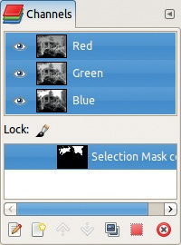

图 14-2. 通道对话框

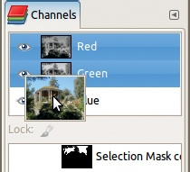

图 14-3. 查看缩略图

点击并拖动红色通道的缩略图到工具箱中，以创建一个新的灰度图像，如 图 14-4 所示。或者将缩略图拖动到图像窗口，将该通道作为图像的新图层添加。

点击通道图标可以切换其激活状态。如果一个通道被停用，对图像所做的更改将不会影响该通道。你可以利用这一点，例如在去除照片中的红眼时只选择红色通道。如果没有通道被激活，你将无法更改图像，导致困惑和沮丧。我们建议始终保持通道对话框打开，并在所做的调整没有得到预期结果时检查它。

点击通道旁边的眼睛图标可以切换该通道的可见性。例如，图 14-5 展示了隐藏绿色通道后的结果。注意，可见性和激活通道是两回事：你可以在不可见的通道上盲目更改，或者在可见但未激活的通道上徒劳地尝试编辑。

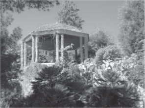

图 14-4. 提取红色通道

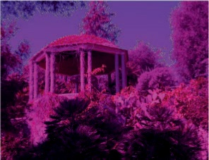

图 14-5. 隐藏绿色通道

一旦你向图像添加了 Alpha 通道或第二个图层，表示整个图像透明度的全局 Alpha 通道就会出现在通道对话框中。

在三个或四个实际通道的行下方，一条水平条带将对话框分为两部分。你可以在这条带子中找到图层像素锁定图标（你在第十一章中见过）。激活锁定会防止对蒙版的更改。对话框的下半部分包含选择蒙版。图 14-2 只有一个蒙版，它的名称是由 GIMP 选择的。你可以像操作图层一样更改这个名称：通过双击名称本身，选择**通道：右键点击 > 编辑通道属性**，或者点击通道对话框底部最左侧的图标，这会弹出图 14-6 中显示的对话框。在这里，你可以更改通道名称并调整其不透明度和颜色，使其在图像中暂时可见。

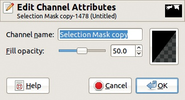

图 14-6. 编辑通道属性

图 14-7. 使蒙版可见

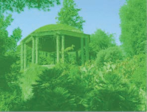

图 14-8. 更改通道属性后

这两个属性在点击红色、绿色或蓝色通道的眼睛图标时使用。如果使用图 14-6 中显示的设置，得到的结果如图 14-7 所示：遮罩是 50%不透明，并以黑色显示。在图 14-8 中，可以看到当不透明度设置为 37%且颜色设置为亮绿色时的效果。请注意，点击“编辑通道属性”对话框右侧的框时弹出的颜色选择器对话框，比平常包含更多的组件。如图 14-9 所示，你可以通过使用底部的滑块来调整 Alpha 值。

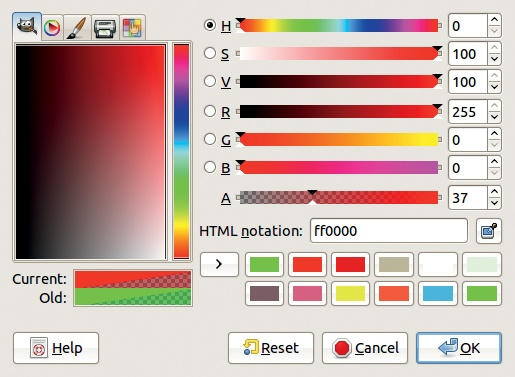

图 14-9. 编辑通道颜色

每个通道的眼睛图标和缩略图之间，注意有空位可以放置一个额外的图标：链条。链条将选择遮罩连接在一起。如果你有多个选择通道，并通过选择链条图标将它们连接起来，对其中一个通道的任何更改也会影响其他通道。

要访问“通道”菜单，可以点击“通道”对话框右上角的配置按钮，或右键点击其中一行。此菜单与对话框底部一排的七个按钮选项相同（见图 14-2）。这些按钮允许你执行以下操作：

+   编辑通道属性。

+   创建一个新通道。此选项会弹出一个与图 14-10 中显示的对话框相同的对话框，唯一不同的是增加了一个“从选择初始化”复选框。勾选此框会将当前选择保存到通道中。在点击“创建新通道”时，按住以使用上次的参数值。

+   将当前通道上下移动。此选项对图像本身没有影响。

+   复制当前通道。

+   使用当前通道创建一个选择区域。和键的作用与使用选择工具时相同。

    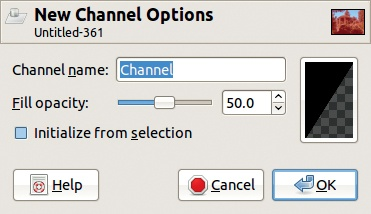

    图 14-10. 创建新通道

    在“通道”对话框菜单中，有四个条目可以从通道中创建选择，每个条目对应不同的选择模式。

+   删除当前通道。

除了新建通道选项外，所有这些菜单选项只有在选区蒙版处于激活状态时才可用。

每次只能激活一个选区蒙版，当蒙版处于激活状态时，GIMP 的各种绘图和变换工具作用于蒙版，而不是图像本身。事实上，如果你切换到图层对话框，你会看到没有图层处于激活状态。相反，如果你在图层对话框中激活一个图层，选区蒙版就会被取消激活。如果你正在尝试修改当前图像而没有任何变化，请确保在图层对话框中确实选中了一个图层。你可能在不经意间修改了蒙版！

## 创建选区蒙版

你可以通过两种方法创建选区蒙版，每种方法都有若干潜在的陷阱。第一种方法是使用选区工具（在第十三章中介绍）然后将选区保存到通道中。完成此操作后，没有图层处于激活状态，图像蒙版处于激活状态，但可能在图像中不可见，且用于创建蒙版的选区依然处于激活状态。

结果是，如果你试图在图像上绘制，你实际上是在蒙版上绘制。当你创建蒙版时，通道对话框会出现，即使它之前是隐藏的。这应该提醒你蒙版已激活。但选区依然保持激活状态——即使它是隐藏的——所以如果你尝试在蒙版上绘制，你只能修改位于选区内的区域。

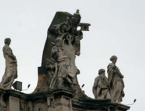

图 14-11. 另一张照片

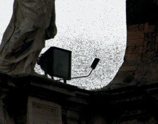

图 14-12. 需要清理的蒙版

创建选区蒙版的第二种方法是直接使用通道对话框。通过点击相应按钮创建一个新通道，它会立即出现在图像中。然后使用绘图工具进行编辑。在蒙版上涂白色以选择像素，涂黑色则取消选择像素。使用渐变工具，并用不同的灰度值进行涂绘，以部分选择像素。你也可以使用除灰色外的颜色，尽管只有颜色的值组件会被使用。

例如，我们拍摄了图 14-11 中的照片，并使用按颜色选择工具进行了选区。但我们将阈值游标设置为 15.0，这对于干净的选区来说太低了。图 14-12 展示了将选区保存到通道并使该通道可见后的图像部分。

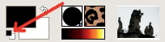

图 14-13. 重置前景和背景颜色

图 14-14. 快速蒙版按钮

蒙版需要清理，你可以使用画笔工具来完成此操作。首先，将前景色和背景色设置为默认值——黑色和白色。最简单的方法是点击工具箱左下角的小按钮（参见图 14-13），或按下 。然后选择画笔工具 (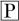) 和适当的画笔。将不需要被选中的部分涂成黑色，应该被选中的部分涂成白色。按 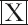 来在前景色和背景色之间切换。

如果你想要完全选中或完全不选中，所以如果你使用的是平板笔，请设置画笔动态，使得压力变化影响画笔大小，而不是透明度。这个动态可以让你按下去快速填充大面积，或者放大后轻轻按压来修饰蒙版的细节。

## 快速蒙版工具

如果你想创建一个复杂的选区，但不需要保存它以供以后使用，使用快速蒙版工具。通过**图像：选择 > 切换快速蒙版**来切换，或者点击图像窗口左下角的按钮（参见图 14-14），或者按下 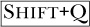。

当快速蒙版处于激活状态时，它会在通道对话框中作为一个活动且可见的红色选区蒙版显示。图 14-15 展示了我们在使用颜色选择工具并设置阈值为 20.0 后，选区的一部分。要编辑选区，可以用黑色或白色绘制蒙版。满意后，再次切换快速蒙版，效果如下：

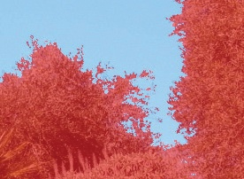

图 14-15. 快速蒙版的一部分

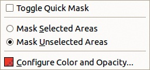

图 14-16. 快速蒙版菜单

+   蒙版被转换为选区。

+   选区蒙版从通道对话框中移除。

+   当前图层被重新激活。

这是一种非常简单且便捷的方法，可以对选区进行更改，而无需正式创建选区蒙版。还要注意，使用快速蒙版并不会阻止将最终选区保存到通道中。

右键点击快速蒙版按钮会弹出图 14-16 中所示的菜单。这个菜单允许我们切换蒙版、改变其颜色和不透明度，并反转颜色，如图 14-17 所示。颜色反转显示出照片左上角有很多蓝天未被选中。用黑色画笔仍然会往蒙版中添加红色像素，但现在这些红色像素被选中了。如果你关闭快速蒙版，你会看到选择没有被反转，天空依然被选中。

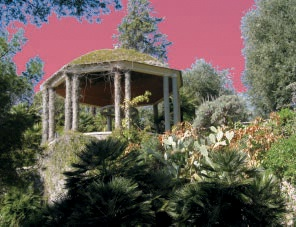

图 14-17. 反转蒙版的颜色

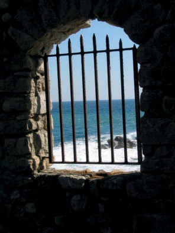

图 14-18. 初始图像

# 14.2 图层蒙版

图层蒙版是附加到特定图层的灰度图像；它与该图层的大小相同。蒙版的像素决定图层中对应像素的透明度。蒙版中的白色像素指定图像中对应像素完全不透明，黑色像素指定完全透明。灰色像素指定部分不透明。像素的颜色分量保持不变，因此一个像素可以同时是强烈着色和完全透明的。这意味着在带有图层蒙版的图层中，每个像素需要 4 字节。

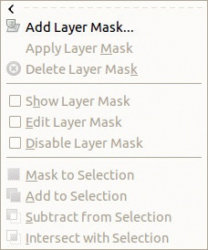

图 14-19. 蒙版菜单

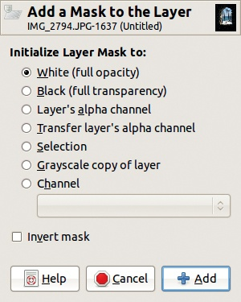

图 14-20. 向图层添加蒙版

## 构建图层蒙版

从图 14-18 所示的图像开始。选择**图像：图层 > 蒙版**，会出现图 14-19 中所示的菜单。通过**图层：右键点击**也可以选择同样的菜单，除了最后三个选项。

选择“添加图层蒙版”，将出现图 14-20 中所示的对话框。可以选择几种图层蒙版初始内容的选项：

+   白色（完全不透明）：蒙版在图层对话框中以白色缩略图的形式显示，位于图层缩略图旁边。由于它的所有像素都是白色的，图层完全不透明，图像看起来没有变化。注意，这并不会阻止我们在图层对话框中操作不透明度滑块，滑块与蒙版无关。这个滑块与图层的模式一起工作，指定如何将其像素与底层图层的像素合并。此不透明度是图层的特性，而不是单独像素的特性。

    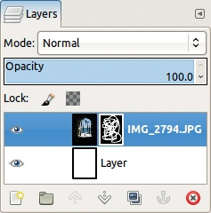

    图 14-21. 两个图层和一个图层蒙版

    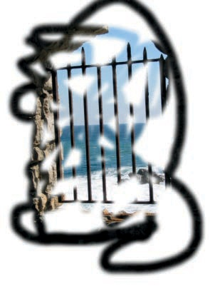

    图 14-22. 在图层蒙版上绘制白色

+   黑色（完全透明）：蒙版显示为黑色缩略图，图层变为完全透明。现在无论你在蒙版上用白色绘画，图层的区域都会重新出现。图 14-21 展示了我们为演示这一点而创建的图像的图层对话框。我们加载了一张照片，添加了一个新的白色图层，将其移到图层堆栈的下方，并给顶部图层添加了一个黑色图层蒙版。然后，我们使用画笔工具，在蒙版上用`Hardness 075`的刷子大尺寸涂抹了白色。在结果图像中，如图 14-22 所示，顶部图层的透明区域由于白色背景层的存在显示为白色，而我们在图层蒙版上绘制的区域则填充了顶部图层的内容。

+   图层的 Alpha 通道：如果图层已经具有 Alpha 通道，它的内容将被复制到图层蒙版中。注意，Alpha 通道保持不变。

+   转移图层的 Alpha 通道：这与前一项相同，但 Alpha 通道被重置为完全不透明。

+   选择：如前所述，选择是一个灰度图像。该图像被复制到图层蒙版中。被选中的像素是不透明的；未被选中的像素是透明的。

+   图层的灰度副本：将图层的当前内容转换为灰度图像，并用它来初始化图层蒙版。图像中的大多数像素被部分选中，选中的程度与像素的值成比例。白色像素完全选中，而较暗的像素选中的程度较低。

+   通道：如果至少存在一个通道，则使用它来初始化图层蒙版。从出现的菜单中选择一个通道。

反转蒙版：反转蒙版。透明部分变为不透明，反之亦然。

## 操作图层蒙版

当创建图层蒙版时，图层对话框会发生变化，如图 14-23 所示。蒙版的缩略图出现在图层缩略图的右侧，并被一个白色框框住，表示它处于活动状态，而图层缩略图则被黑色框住。

在此，选择图层的灰度副本作为蒙版并进行反转。结果如图 14-24 所示，图像中非常暗的部分现在变得更加可见，因为它们被高度选中，因此变得不透明。但海景部分现在变得苍白和沉闷，因为图层的亮像素几乎是透明的，显示了下面的白色图层。

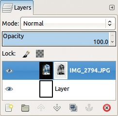

图 14-23. 已添加图层蒙版。

图 14-24. 使用图层蒙版后的效果

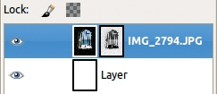

图 14-25. 激活图层本身

当图层蒙版处于激活状态时，所有工具只会对它进行操作，而不会作用于图层本身。要在蒙版和图层之间切换，请单击图层对话框中的相应缩略图。白色框架始终显示当前激活的是图层还是蒙版。如图 14-25 所示，此时图层处于激活状态。

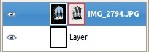

图 14-26. 非活动的图层蒙版

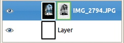

图 14-27. 仅显示图层蒙版时的图层对话框

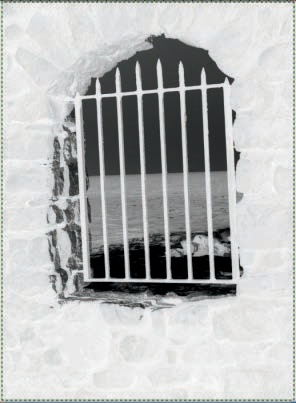

图 14-28. 仅显示图层蒙版时的图像窗口

要隐藏图层蒙版的效果而不删除它，单击蒙版缩略图。此时，框架变为红色，如图 14-26 所示，蒙版效果被暂时取消。如果再次单击，蒙版将被激活。

要查看蒙版本身，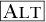单击蒙版缩略图。此时，框架变为绿色，如图 14-27 所示，图像窗口将以灰度图像显示蒙版，如图 14-28 所示。请注意绿色虚线框住了图像，这表明图层蒙版处于激活状态。如果再次单击，图层将重新显示。

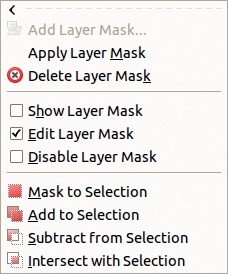

图 14-29. 创建图层蒙版后的蒙版菜单

你还可以通过**图像：图层 > 蒙版**菜单创建、编辑或激活图层蒙版，如图 14-29 所示。复选框提供了简单的工具来显示和操作图层蒙版，菜单中其余的条目（以及**图层：右键单击**菜单）涉及到使用图层蒙版的方式：

+   APPLY LAYER MASK: 将图层蒙版的效果保存到图层的 Alpha 通道，并删除图层蒙版。此更改应为您对图层所做的最后一次修改。在应用蒙版之前，图层本身不会发生变化——无论您对蒙版做什么操作。

+   DELETE LAYER MASK: 丢弃图层蒙版；这不会影响图层本身。

+   MASK TO SELECTION: 将图层蒙版转换为当前选择区域。蒙版中像素为白色时，相关图层的像素被选中；为黑色时，图层的像素被取消选择。但蒙版中有中间值的像素会导致相关图层中的部分像素被选择。因此，选择区域被初始化，但图层和蒙版本身保持不变。

+   ADD TO SELECTION, SUBTRACT FROM SELECTION, 和 INTERSECT WITH SELECTION 也会将蒙版转换为选择区域。与“蒙版转换为选择”不同，这三项操作允许您以不同的方式将新选择与之前的选择组合。这些选项不会出现在**图层: 右键点击**菜单中。

    

    图 14-30. 最终图像

## 使用图层蒙版

以下示例使用两个带有图层蒙版的图层和两个普通图层来创建图 14-30 中显示的合成图像。请按以下步骤操作以转换图像：

1.  打开图 14-18 中显示的照片，选择“按颜色选择”工具。点击天空，然后按住  键点击海洋和泡沫，选择窗户后面的所有景物——除了右下角的岩石。要选择这些岩石，请使用快速蒙版，这次用铅笔工具将岩石涂成白色。铅笔工具的作用类似于画笔工具，但没有羽化或抗锯齿效果。

1.  完成选择后，将图层蒙版添加到背景图层，并使用反向选择进行初始化。现在，整个窗口开口变为透明（见图 14-31）。

    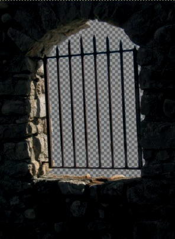

    图 14-31. 使开口透明

    

    图 14-32. 添加到图像中的肖像

1.  使用图 14-32 中显示的照片为图像添加一个新图层。由于该图像比之前的图像大得多，因此使用**图像: 图层 > 缩放图层**将此新图层缩放到画布大小。

1.  使用模糊选择工具，按住  多次点击以选择肖像的背景。然后为此图层添加图层蒙版，并用选择内容初始化它（不反转）。结果如图 14-33 所示。

    

    图 14-33. 移除背景

    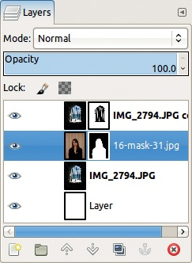

    图 14-34. 图像完成后的图层对话框

1.  复制包含窗口的图层，并删除其图层蒙版。你可以看到主题背后的景物被保留下来。按照图 14-34 中所示重新排序图层，并丢弃白色背景图层。

图 14-35. 初始照片

图 14-36. 新通道

# 14.3 使用蒙版和通道

在本节中，我们展示了蒙版和通道的两种特定用法，是其他方法无法实现的。

## 构建自然蒙版

图像的*自然蒙版*是一种快速生成选择图像主题的蒙版的方法。这个特殊的蒙版并不总是准确，但在许多情况下，它会产生良好的结果。这个概念是**Carey Bunks**的创意，他是一本早期关于 GIMP 的优秀书籍《Grokking the GIMP》（New Riders, 2000）的作者。

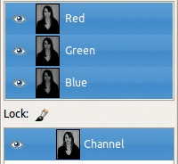

图 14-37. 通道对话框

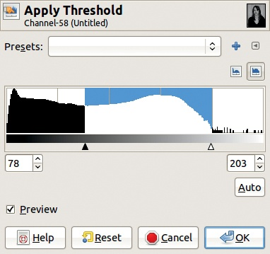

图 14-38. 阈值工具对话框

从图 14-35 所示的照片开始。你想要仅选择女孩。首先，选择整张图像 (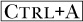) 并复制它 (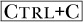)。然后转到通道对话框，点击适当的按钮（通道对话框底部从左数第二个图标）创建一个新通道。

粘贴复制的数据 (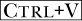)，并将浮动图层锚定到新的通道中 ()。如果你在新通道中开启可见性并关闭图层中的可见性，你将看到图像的灰度版本，如图 14-36 所示。此图像的通道对话框如图 14-37 所示。

该图像中的像素值用于构建选择区域。为此，选择**图像：颜色 > 阈值**工具。将显示图 14-38 所示的对话框，图像将变为黑白。阈值对话框中小三角形的位置决定了哪些像素为白色，哪些为黑色。

图 14-39. 阈值工具转换后的选择蒙版

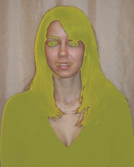

图 14-40. 使蒙版更可见

调整三角形，如图 14-38 所示，得到图 14-39 所示的图像。该蒙版仅选择图像中最亮的部分。

若要查看蒙版实际选择的内容，点击图像图层的眼睛图标，但小心不要激活图层。如图所示，蒙版是黑色的，且与图像对比不明显。使用编辑通道按钮更改其颜色，选择黄色并设置 50%的不透明度。结果如图 14-40 所示。

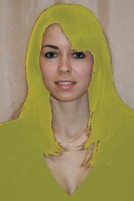

图 14-41. 改善蒙版

在下巴、嘴角、鼻孔和眼睛处修整蒙版。你可以通过直接在蒙版上涂抹来轻松完成此操作。选择画笔工具并使用大号画笔，涂抹选中的面部特征为白色。图 14-41 展示了改进后的蒙版。然后将蒙版转换为选择区域，并移除蒙版的可见性。结果是图 14-42 所示的选择区域。

## 透明度与 Alpha 通道

当图像包含透明度时，需要使用 Alpha 通道。当图像包含多个图层时，它总是有一个全局 Alpha 通道。单个图层可能有或没有 Alpha 通道，但如果没有 Alpha 通道，你可以看到底层图层的像素，除非使用某些混合模式或将图层不透明度设置为小于 100%的值。但是，如果某个图层没有 Alpha 通道，它的名称将在图层对话框中以粗体显示。

单层图像也可以使用透明度。例如，显示在网站上的图像通常具有透明背景，这样可以与页面上的其他设计元素自然融合。

图 14-42. 结果选择

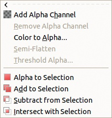

图 14-43. 不带 Alpha 通道的透明度菜单

图 14-43 展示了当相应图层没有 Alpha 通道时的**图像：图层 > 透明度**菜单，而图 14-44 展示了当有 Alpha 通道时相同的菜单。其中一些条目也出现在**图层：右键单击**菜单中。

让我们讨论一下这些菜单条目的作用。

前两个条目，添加 Alpha 通道和移除 Alpha 通道，分别添加和移除 Alpha 通道。

颜色到透明度也出现在**图像：颜色**菜单中。选择它，会出现如图 14-45 所示的对话框。勾选预览，选择要变为透明的颜色。最初这个颜色是白色，正如图所示。

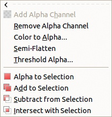

图 14-44. 带有 Alpha 通道的透明度菜单

图 14-45. 颜色到透明度对话框

点击“来自：”按钮会弹出一个简化版本的颜色选择器，如图 14-46 所示。如果您点击 HTML 表示字段右侧的小按钮，您可以选择要使之透明的图像中的确切颜色，并在预览窗口中看到结果效果。

图 14-47 展示了一张摄影肖像。要获得图 14-49 中显示的图像，选择**图像：图层 > 透明度 > 颜色到透明度**，并选择女士项链附近的肤色像素。因为所有相似的像素都会变为透明，所以在图像图层下添加一个白色图层。请注意，因为所选颜色出现在女士的头发中，部分头发也会被改变。如果您首先选择了脸部，然后使用颜色到透明度，就可以避免这种情况。

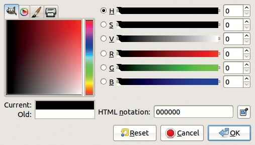

图 14-46. 颜色到透明度颜色选择器

图 14-47. 初始图像

如果你在将透明化的颜色上涂抹底层，图像看起来与原始肖像完全相同。这使得在活动图层中改变特定颜色变得非常简单。例如，图 14-48 展示了当我们通过降低色相并在 HSV 色彩模型中增加亮度时，轻微更改底层颜色后的结果。

SEMI-FLATTEN 也可以在 **图像: 滤镜 > Web** 菜单中找到。我们在第十七章中深入讨论了它，但简而言之，它将部分透明度替换为当前背景颜色。如果你将其应用到 图 14-49 中显示的图像层，并选择肤色作为背景颜色，你将得到 图 14-48 中显示的结果。

图 14-48. 更改肤色

图 14-49. 使肤色透明

阈值 Alpha 应用一个阈值滤镜到 Alpha 通道。点击此选项会弹出在 图 14-50 中显示的对话框。如果你选择显示的阈值并应用它，再在原始图层下方添加另一个填充初始肤色的图层，你将得到 图 14-51 中显示的结果。

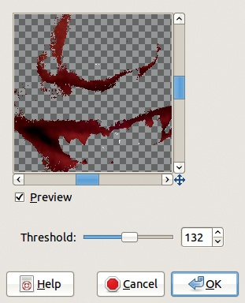

图 14-50. 阈值 Alpha 对话框

图 14-51. 阈值化 Alpha 通道后

Alpha 到选区将图层的 Alpha 通道转化为选区。由于两者都以灰度图像表示，这个转换非常简单，新的选区会替代任何已有的选区。

透明度菜单中的最后三个选项允许你在从 Alpha 通道创建选区时选择不同的选区模式。然后，你可以将选区转换为通道，但不能直接将 Alpha 通道转换为通道。

## 转换遮罩、选区和通道

如你所见，选区、通道、遮罩和图层透明度密切相关。让我们回顾一下如何在这些之间相互转换。

要将选区转换为

+   选区遮罩（通道）：**图像: 选择 > 保存到通道**。

+   图层遮罩：**图层: 右键 > 添加图层遮罩**，然后选择 选区。

+   一个 。作为副作用，选区的内容会被放置到剪贴板中。

将选择蒙版转换为

+   选择：**通道：右键点击 > 通道到选择**。

+   图层蒙版：**图层：右键点击 > 添加图层蒙版**，然后选择 CHANNEL。

+   Alpha 通道：**通道：右键点击 > 通道到选择**，然后按 。作为副作用，选择的内容会被放入剪贴板。

将图层蒙版转换为

+   选择：**图层：右键点击 > 蒙版到选择**。

+   选择蒙版：**图层：右键点击 > 蒙版到选择**，然后 **图像：选择 > 保存到通道**。

+   Alpha 通道：**图层：右键点击 > 应用图层蒙版**。

将 Alpha 通道转换为

+   选择：**图层：右键点击 > Alpha 到选择**。

+   选择蒙版：**图层：右键点击 > Alpha 到选择**，然后 **图像：选择 > 保存到通道**。

+   图层蒙版：**图层：右键点击 > 添加图层蒙版**，然后选择图层的 Alpha 通道。
