# 第十五章 绘图工具

绘画是一门艺术，许多人认为必须天生就有绘画才能才能画得好。虽然有些人绘画天赋较好，但通过练习，任何人都能学会绘画，并且可以发展出独特的风格。

# 15.1 数字艺术

你可能认为数字艺术比传统艺术更容易，因为计算机替你画画，但实际上数字艺术同样需要练习，就像传统艺术一样。如果你已经有素描和绘画的练习经验，你会比从未接触过铅笔的人更容易上手数字艺术。

数字艺术确实提供了一些传统媒介无法实现的技巧和捷径。撤销是数字艺术带来的最强大工具之一。如果你在绘画时犯了错误，你可以试着掩饰错误，或者你可以尝试利用错误，这可能会带来意想不到的效果。然而，如果是数字绘画，你可以简单地撤销错误并重新尝试，这非常方便，但也让挑战减少了，并且失去了与错误共处的可能性。

数字艺术中的另一个有价值的工具是叠加图层。你可以将每个绘画元素存储为一个新图层，并且可以通过点击按钮隐藏图层或锁定图层。

数字艺术工具的一个主要优点是它们可以加速一些繁琐的过程，比如用颜色、图案或渐变填充区域。但一些不完美的地方（例如，水彩画中看到的纸纹理，或者油画中的可见笔触）能提升艺术作品的美感。事实上，许多数字工具都设计成能够模拟这些传统的不完美之处。

想了解数字艺术可以用来创作什么，可以查看* [`www.cgsociety.org/`](http://www.cgsociety.org/)* 和 *[`mattepainting.org/`](http://mattepainting.org/)*。

你练习得越多，绘画技巧就会越好，使用 GIMP 的频率越高，使用其工具的能力也会越强。即使你只对数字艺术感兴趣，也可以随身携带一本小素描本和铅笔，这样在有空闲时间时就能练习绘画。不要因最初的草图比较粗糙而气馁——只要继续练习，你的草图（以及数字艺术）会越来越好。

# 15.2 绘图工具概述

*绘图工具* 用于修改图像中的颜色——可以是整个图像、选定区域，或者一笔一笔地调整。默认情况下，绘图工具位于工具箱的底部，如图 15-1 所示。

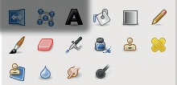

图 15-1. 工具箱中的绘图工具

当*画笔工具*沿着笔触改变像素时，*填充工具*则影响整个图像或选定区域：

+   *桶形填充* 用纯色或图案填充区域。

+   *Blend* 用渐变填充区域。

其他绘图工具是画笔工具。它们通过手动画笔笔触使用当前画笔，或沿选区或路径修改图像，详见路径对话框。

画笔工具分为三类：绘画工具、克隆工具和修改工具。我们将在讨论所有绘图工具共有的属性后，详细讨论这些类别。

*绘画工具* 添加（或移除）颜色笔画：

+   *铅笔* 创建一个硬边笔画。

+   *画笔* 创建一个软边笔画。

+   *橡皮擦* 沿着笔画去除颜色。

+   *气刷* 创建一个软笔画。

+   *墨水* 创建一个实心但抗锯齿的笔画。

*克隆工具* 复制某物并以画笔笔触渲染：

+   *克隆* 从图像或图案中复制。

+   *修复* 从图像中复制并与周围环境混合。

+   *透视克隆* 从图像中复制并沿透视线渲染。

*修改工具* 沿画笔笔触转换像素：

+   *卷积* 模糊或锐化像素。

+   *涂抹* 涂抹像素。

+   *加深/减淡* 使像素变亮或变暗。

本章还将介绍文本工具、颜色选择工具和测量工具。尽管它们严格来说不是绘图工具，但它们在创作原创艺术作品时非常有用。

# 15.3 共享特性

在本节中，我们将描述所有或大多数绘图工具共有的特性和特点。

## 绘图工具选项

所有绘图工具都有选项，这些选项通常显示在附加到工具箱的可停靠对话框中。如果不小心关闭了选项对话框，可以通过选择 **图像：窗口 > 可停靠对话框 > 工具选项** 或双击工具箱中的工具图标重新打开它。没有两个绘图工具的选项完全相同，但大多数选项都被多个工具共享。在本节中，我们将涵盖至少两种绘图工具共有的所有选项。

图 15-2 显示了所有画笔工具的选项，画笔工具具有最多的选项集。

点击对话框右上角的小三角形图标，打开菜单，如图 15-3 所示。这个菜单对于所有可停靠的对话框都很相似，但有些对话框可能有额外的条目。该图还显示了工具选项菜单中的可用选择。我们将在 15.10 结合工具预设、画笔和绘画动态中详细描述它们。

三角形图标下方是工具的名称（在本例中为画笔），其下方是以下选项：

+   MODE 是 12.2 混合模式中解释的 23 种混合模式的选择。

+   透明度（OPACITY）改变了透明度。透明度百分比与混合模式结合决定工具的具体效果。透明度还会受到绘画动态的影响。

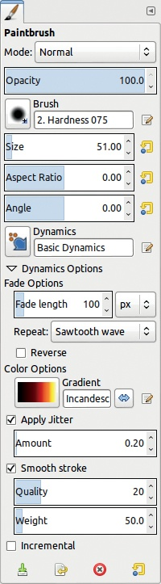

图 15-2. 画笔工具选项

在 2.8 版本中，滑块更新了几个有趣的新功能。如果鼠标指针位于滑块的上半部分，其图标会变成垂直箭头，如图 15-4（顶部）所示。点击滑块的任意部分可以大致获得透明度因子。

如果鼠标指针位于滑块的下半部分，其图标会变成双水平箭头，如图 15-4（中间）所示。点击并水平拖动，可以更精确地调整透明度因子。

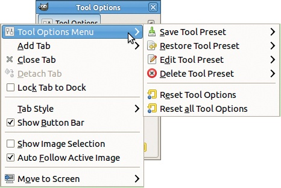

图 15-3. 选项对话框的菜单

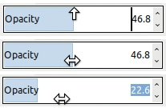

图 15-4. 使用透明度滑块

你可以使用鼠标滚轮按一个百分点的增量来改变因子，或者你也可以使用右侧的小箭头来做相同的操作。

你还可以直接在右侧的数字框中输入一个值。点击滑块的上半部分会将光标放置在数字框的前面。你可以通过按下  键来删除该值，或者在值前面添加数字。点击滑块的下半部分会选中整个数字框，如图 15-4（底部）所示，然后你可以输入一个新值。

有两个方便的快捷键： 可以减小透明度， 可以增加透明度。每次的步长为 1，但你可以按住键来更快地增减透明度。这样，你可以用一只手改变透明度，另一只手进行绘画。

+   画笔（BRUSH）改变画笔类型。此选项以及接下来的六个选项仅适用于画笔工具。点击画笔图标查看所有可用画笔的网格。你还可以在右侧的框中输入画笔名称。一旦开始输入，匹配你输入的画笔会出现在下方。

    每个物理设备都有其独立的设置，因此，如果您为手写笔选择了一个画笔，它不会影响鼠标或橡皮擦使用的画笔。相反，如果将特定画笔分配给手写笔，无论手写笔是使用画笔工具、涂抹工具还是其他任何画笔工具，画笔都保持不变。您还可以通过更改**图像：编辑 > 首选项**对话框中的设置，为这些工具中的每一个关联不同的画笔（参见第二十二章）。

+   SIZE 改变画笔的大小，尽管范围显示为[1 到 1000]，但如果将光标移到滑块的最右端，您可以选择任意大小。此选项也会受到当前画笔动态的影响。右侧的弯曲箭头会将画笔大小重置为当前画笔的默认值。鼠标滚轮每次增减一百分之一。

    有两个快捷键方便更改画笔的大小：可以减小画笔大小，可以增大画笔大小。与不透明度变化一样，步骤始终为 1，并且可以按住快捷键。

+   ASPECT RATIO 更改画笔的比例，范围为[–20 到+20]。此选项是 GIMP 2.8 中的新增功能。如果值为正，画笔会被垂直拉伸；如果值为负，画笔会被水平拉伸。画笔动态可以控制此选项。

+   ANGLE 旋转画笔，因此如果画笔是完全圆形的，它不会产生任何效果。同样，画笔动态可以控制此选项。

+   DYNAMICS 是您可以更改当前画笔动态的地方（在画笔动态中有详细解释）。点击按钮会打开如图 15-5 所示的菜单，您可以选择特定的动态。底部按钮允许您缩小或放大预览，选择以列表或网格方式显示，或打开画笔动态对话框。您还可以在右侧字段开始输入，GIMP 会自动完成名称。右侧按钮打开画笔动态编辑器。

    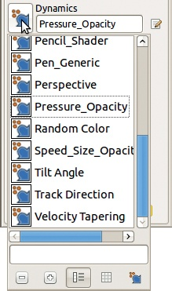

    图 15-5。工具选项对话框中的画笔动态菜单

+   如果您点击 DYNAMICS OPTIONS 左侧的小三角形，菜单会展开，您将看到以下选项：

    +   FADE LENGTH 影响参数在笔触长度上的变化方式。任何参数都可以设置为渐变，画笔会沿渐变长度逐渐消失或出现。当 REPEAT 设置为 NONE 时，笔触在达到渐变长度后停止变化。当设置为 SAWTOOTH WAVE 或 TRIANGULAR WAVE 时，效果会以不同的模式重复。如果勾选 REVERSE，画笔的变化方向将被反转。此选项也可以通过画笔动态分配给指针移动。

    +   COLOR OPTIONS 不使用前景色进行绘画；它从指定的渐变中获取颜色。即使在使用颜色画笔时也是如此。但是这个选项会受到当前画笔动态的影响，所以效果取决于在当前画笔动态的映射矩阵中，颜色行的至少一个框是否被选中。

+   APPLY JITTER 会使画笔笔触在范围 [0 到 50] 内左右抖动。如果当前画笔动态的抖动行没有勾选任何框，抖动将与压力成反比。如果当前画笔动态的抖动行勾选了至少一个框，以上描述的行为将被抑制。

+   SMOOTH STROKE 使用两个设置使笔触更加均匀。QUALITY [1 到 100] 指定笔触的一致性。WEIGHT [3 到 1000] 限制笔触的最小直径。

请注意，最后两个选项适用于所有绘图工具。

另一个所有画笔工具共有的行为是按住  和  时的效果：

+   如果你在使用画笔工具时按下 ，你可以画出一条直线。

+   如果你在使用铅笔、画笔、橡皮擦或喷枪工具时按下 ，指针将变为吸管，下一个你点击的颜色将成为前景色（或橡皮擦的背景色）。

+   如果你按下  然后按下 ，直线将被限制在最近的 15° 内，这对于绘制平行线或垂直线非常有帮助。

## 画笔动态

每个画笔工具都使用一个通用功能叫做 *画笔动态*，这在你有图形平板时尤其有用。通过画笔动态，你可以根据鼠标或平板触控笔的移动方式改变画笔工具的参数。这是 GIMP 中的一部分，版本 2.8 中已经大大改进了这一功能。可以检测到七种指针运动特性，尽管其中一些只在平板和专用触控笔的情况下有效：

+   PRESSURE 是绘制笔触时施加的力量大小，且只能通过触控笔和平板进行控制。

+   VELOCITY 是你移动指针的相对速度。

+   DIRECTION 是运动的方向。

+   TILT 是触控笔的倾斜角度。你只能在使用平板时启用此动态，甚至有些平板无法检测到倾斜角度。

+   WHEEL 控制使用带有滚轮的平板触控笔的滚轮旋转效果，比如 Wacom 的 Airbrush Pen。当与 Intuos Art Pen 一起使用时，这个动态控制笔旋转的效果。

+   RANDOM 在你绘画时随机改变一个参数（在你设定的范围内）。

+   FADE 决定在绘制过程中笔触如何变化。达到褪色长度后，参数停止变化。它会返回初始值并在褪色长度内反复变化（像锯齿波），或者可以朝相反方向变化（像三角波）。例如，如果画笔大小增大，达到褪色长度后，它可能会再次减小。

这 7 个运动特性有 11 个可能的工具选项：

+   OPACITY 根据工具的 OPACITY 设置，改变笔触的透明度。

+   SIZE 根据画笔大小和工具的 SIZE 设置，调节画笔的大小。

+   ANGLE 根据工具的 ANGLE 选项中设置的初始角度旋转画笔。

+   COLOR 沿着工具选项对话框中“DYNAMICS OPTIONS”部分指定的渐变来改变画笔颜色。COLOR 适用于铅笔、画笔和气刷工具。

+   HARDNESS 在画笔类型设置的范围内改变笔触的边缘。

+   FORCE 适用于除铅笔工具外的所有画笔工具。它的效果特定于每个工具，旨在模拟该工具的物理等效效果。例如，当力与压力相关联时，画笔在用力按压时会画出更厚、更暗的笔触，而气刷则会增加更多的涂料。

+   ASPECT RATIO 根据画笔类型和工具的 ASPECT RATIO 选项设定的范围，改变画笔的高度和宽度。

+   SPACING 根据画笔对话框中的“Spacing”滑块设定的范围，调节画笔间距的大小。

+   RATE 在工具的 RATE 选项设定的范围内，调节气刷、卷积或涂抹工具的速度。

+   FLOW 在工具的 FLOW 选项设定的范围内改变画笔的流量。它仅影响气刷工具。

+   JITTER 使画笔间距在“Amount”工具选项设定的范围内更加均匀或不均匀，前提是勾选了工具的“APPLY JITTER”选项。

这些运动特性根据当前的*画笔动态*分配给工具选项，画笔动态可以在绘画工具选项的 Dynamics Options 部分或在可停靠的画笔动态对话框中找到，后者如图 15-6 所示。像所有资源可停靠对话框一样，此对话框包含一个标签字段，并且底部有五个按钮，你可以点击这些按钮来编辑、创建或删除画笔动态。你还会找到一个按钮用于刷新列表。

GIMP 提供 17 种预定义的画笔动态。默认的`Dynamics Off`会关闭指针移动和工具选项之间的所有连接。其他画笔动态将在 15.10 组合工具预设、画笔和画笔动态中讨论。

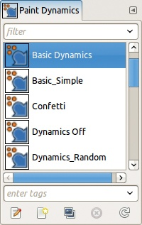

图 15-6. 可停靠的画笔动态对话框

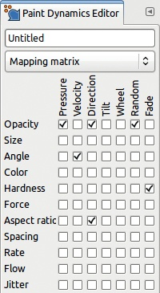

图 15-7. 绘画动态编辑器，映射矩阵标签

你无法更改预定义的绘画动态。如果你在绘画动态对话框中双击其中一个，或者点击“编辑动态”按钮，图 15-7 所示的绘画动态编辑器将打开。尽管你不能更改预定义的动态，你仍然可以查看哪些框被选中。如果你创建了一个新的动态，你可以勾选框来链接对应的行和列。在对话框顶部的框中输入名称。

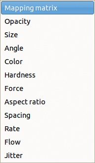

图 15-8. 绘画动态编辑器，下拉菜单

在名称字段下方是一个下拉菜单（图 15-8），列出了工具特性标签。每个选项都会打开一个类似于曲线工具对话框的标签，显示相应特性的答案曲线。标签的下部（图 15-9）包含与映射矩阵列对应的列表。当你选择其中一个（通过高亮显示表示），你可以更改它的曲线。

你可以更改每个工具特性的 7 个答案曲线中的任何一个。这意味着 GIMP 有 77 条不同的可调曲线，但请注意，只有那些通过矩阵映射中的复选框实际链接到某个操作的曲线才会产生效果。

## 使用可停靠的对话框与绘图工具

一些可停靠的对话框在所有绘图工具中都非常有用。这些对话框是全局性的，这意味着它们的设置会影响任何绘图工具，除非在**图像：编辑 > 偏好设置 > 工具选项**对话框中取消选中“工具之间共享绘画选项”选项。一个例子是“绘画动态”对话框。其他的还有“画笔”、“图案”、“渐变”和“调色板”。

### 对话框菜单

所有可停靠的对话框都有一个*对话框菜单*，如图 15-10 所示。要打开这个菜单，请点击对话框右上角的小三角按钮。在本节中，我们将介绍一些与绘图工具特别有用的菜单项。我们会在停靠窗口和可停靠的对话框中涵盖一些更常见的条目。

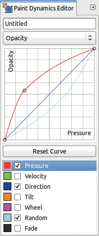

图 15-9. 绘画动态编辑器，透明度标签

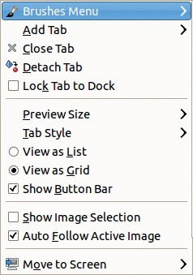

图 15-10. 可停靠的对话框菜单

可停靠的对话框可以将选项列表（如可用的画笔或渐变）显示为列表或网格，你可以使用对话框菜单在这两种视图之间切换。网格视图更紧凑，但列表视图会显示每个可见条目的名称和一些信息。在网格视图中，你可以通过点击条目看到对话框顶部的相同信息。

你可以使用对话框菜单中的“预览大小”选项来改变图标的大小。提供从 TINY 到 GIGANTIC 的八种大小选择。较大的图标在某些可停靠的对话框中很有用，比如图像对话框。

对话框菜单中的第一个条目是特定于对话框的，也可以通过右键点击对话框主体进行选择。

### 使用标签

版本 2.8 中引入的另一个新特性是*标签*。如图 15-6 所示，现在大多数可停靠的对话框在对话框的顶部附近都有一个过滤器字段，而在底部附近有一个标签分配字段。键入标签并按，即使你退出并重新启动程序，GIMP 也会保存该标签。如果你有很多选择（例如画笔、图案或渐变），标签特别有用。例如，如果你下载了几百个画笔集，滚动浏览画笔对话框以寻找可以画星星的画笔会变得很麻烦，但如果所有这些画笔都标记为*stars*，你就可以直接在过滤器字段中搜索。

标签可以是简单的词或复合词，用逗号分隔。如果你高亮显示一个标签并按，该标签将被删除。

画笔、绘画动态和工具预设已经有一些标签。这些标签存储在相应系统文件夹的子文件夹中（参见第二十二章），并且自动采用子文件夹的名称作为标签。例如，`Brushes` 系统文件夹包含名为 `Basic`、`Legacy`、`Media`、`Sketch`、`Splatters` 和 `Texture` 的子文件夹，这些标签会自动应用到相应的画笔。

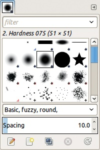

图 15-11. 使用标签（画笔对话框）

图 15-11 显示了 `Hardness 075` 画笔位于 `Basic` 子文件夹中，并已被用户标记为 `round` 和 `fuzzy`。

如果将对话框设置为“以列表查看”，那么你可以通过按住-点击来选择（或取消选择）多个对象（这对于标记多个条目非常方便）。或者，如果你点击一个条目并按住-点击另一个条目，那么你将选择两个条目之间的所有内容。

点击字段右侧的向下箭头会弹出现有标签的菜单。点击一个或多个标签，然后按键盘上的任意键将标签输入到过滤器或标签字段中。在标签字段中时，可以通过简单地点击标签来删除当前对象的标签。如果你右键点击标签字段并点击左右箭头，标签将从右到左进行选择。点击按钮删除所有已选择的标签。如果你没有在标签列表中选择标签，点击按钮选择左边的标签，点击按钮则选择右边的标签。如果某个标签不再用于任何对象，它将从下拉菜单中消失。

当过滤器字段中有一个标签时，只有带有该标签的对象会显示。当列出两个或多个标签时，只有同时具备所有标签的对象会显示。要返回到完整列表，请删除过滤器字段中的所有标签。

## 六个有用的可停靠对话框

本节我们将介绍六个特别适用于数字绘图和绘画的可停靠对话框。

### 刷子对话框

刷子对话框如图 15-11 所示。由于用户定义的刷子会出现在该对话框中，因此它在你的屏幕上可能看起来不同。

刷子分为四大类：

+   *普通*刷子是画在白色背景上的灰度图像。它使用前景色进行绘画（如果启用了颜色绘画动态，则使用渐变中的颜色），除了擦除工具外，擦除工具使用背景色进行绘制。

+   *颜色*刷子是一个带有 Alpha 通道的 RGB 图像，刷子的掩码是一个灰度图像。颜色刷子使用其自身的颜色，而不是前景色，除非在当前画笔动态的颜色行中勾选了框。如果勾选了框，则仅使用颜色刷子的掩码——其中的颜色来自当前的渐变。

+   *动画*刷子可以是普通刷子或颜色刷子。它实际上是刷子的一系列变化，因此根据当前的绘画动态，刷子会发生变化。

+   *参数化*刷子是通过刷子编辑器创建的可调整大小的刷子，详细内容参见 22.4 创建新刷子。参数化刷子是灰度图像，使用前景色，就像普通刷子一样。

当刷子图像比其图标大时，你会看到图标右下角有一个小的`+`符号。点击并按住图标可以查看实际大小。

动画刷子右下角有一个小红色三角形，如果你点击并按住它们的图标，可以查看动画效果。

画笔通过定期重复印刷来绘制，SPACING 滑块指定两次连续印刷之间的距离。其初始值在每个画笔的文件中指定。如果你下载或创建了一个画笔，你可以删除它；对话框底部的删除按钮将处于激活状态。

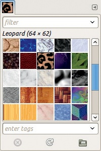

图 15-12。图案对话框

### 图案对话框

图案对话框如图 15-12 所示。GIMP 的图案集相对较小，但你可以按照 22.5 创建新图案中解释的方法创建自己的图案。通过 Google 搜索“GIMP patterns”也能找到大量图案，你可以将它们保存到 `patterns` 文件夹中，添加到 GIMP。对话框底部的三个按钮允许你删除当前图案、刷新列表和将当前图案作为图像打开。

### 渐变对话框

与图案和画笔对话框不同，渐变对话框默认以列表形式显示，如图 15-13 所示。GIMP 的渐变集相当庞大。其中一些渐变是专为特定滤镜设计的；例如，以 `Flare` 开头的渐变是为 Gradient Flare 滤镜设计的，详细信息见“Gradient Flare”。

Gradients 菜单的唯一独特功能是将渐变保存为 POV-Ray 格式的选项，该格式用于光线追踪软件。同样，你可以下载更多渐变，或者按照 22.6 创建新渐变中解释的方法自行创建。

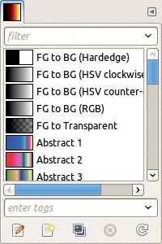

图 15-13。渐变对话框

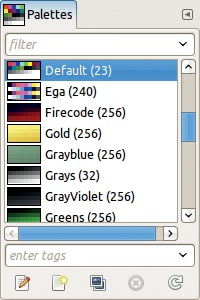

图 15-14。调色板对话框

### 调色板对话框

调色板对话框默认也以列表形式显示，如图 15-14 所示。GIMP 附带了一大套预定义的调色板。

在调色板菜单中，你可以从渐变或图像导入调色板。你还可以按照 22.7 创建新调色板中讨论的方法创建新的调色板，或者从网上下载调色板。

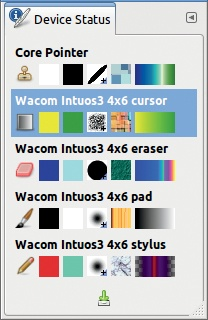

图 15-15。设备状态对话框

### 设备状态对话框

设备状态可停靠对话框（**图像：窗口 > 设备状态**）如图 15-15 所示。此对话框显示关于输入设备的信息。在该图中，你会看到五个当前设备：普通鼠标（核心指针）、平板鼠标（称为光标）、平板橡皮擦、平板垫和平板触控笔。只需选择带有设备的工具，就能为设备分配工具和选项。然后，该工具及其当前设置将应用于该设备。在图中，平板鼠标使用的是混合工具，平板触控笔使用的是铅笔工具，前景色为深红色，背景色为绿色。请注意，你无法直接在对话框中更改设置——该对话框仅供参考。但你可以使用对话框底部的按钮保存当前设备状态。

### 工具预设对话框

工具预设对话框（**图像：窗口 > 工具预设**）如图 15-16 所示。*工具预设*是为特定工具保存的一组设置，类似于设备状态对话框中的设置，但工具预设包含了额外的设置——当前的绘画动态和字体。它们不同于颜色工具如“色阶”或“曲线”使用的预设设置（参见第十二章）。

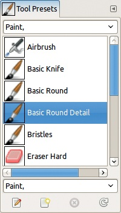

图 15-16. 工具预设对话框

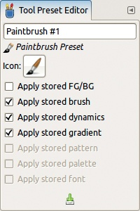

图 15-17. 工具预设编辑器

你可以通过选择**工具预设：右键点击 > 新建工具预设**，或者点击工具预设对话框底部从左数第二个按钮，打开如图 15-17 所示的对话框来创建新的工具预设。请注意，使用预设时，你可以选择保存某些设置，同时保留其他设置不变。

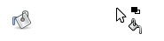

图 15-18. 水桶填充工具图标和指针

工具预设功能强大，具体内容将在 15.10 结合工具预设、画笔和绘画动态中详细说明。

# 15.4 填充工具

GIMP 有一些工具可以填充整个图层、选区或图像。它们与其他绘画工具共享的唯一选项是模式（MODE）和不透明度（OPACITY）。

## 水桶填充工具

油漆桶填充工具 () 可以填充图层、选区或图层或选区中所有相似颜色的像素。其图标和指针如 图 15-18 所示，选项如 图 15-19 所示。使用时，单击要填充的区域。

以下是此工具特定的选项：

+   FILL TYPE 决定区域是填充前景色、背景色还是图案。按下  键可以在前景色和背景色之间切换。

    如果选择使用图案填充，则会使用当前图案，但您可以在对话框中更改图案。您也可以在工具箱或图案对话框中更改当前图案。

+   AFFECTED AREA 让您选择是否填充整个选区（或在没有选区时填充整个图层），或者仅填充相似颜色的区域。按下  键可以在这些选项之间切换。

+   FINDING SIMILAR COLORS 在选择 FILL SIMILAR COLORS 时处于激活状态。此选项允许您选择如何确定相似颜色。

    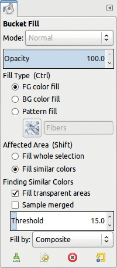

    图 15-19. 油漆桶填充工具选项

    +   FILL TRANSPARENT AREAS 允许填充透明像素，除非在图层对话框中选中了锁定 alpha 通道按钮。

    +   SAMPLE MERGED 决定 GIMP 是否使用其他图层的像素。当选中此选项时，所有可见图层都会参与区域定义。

    +   THRESHOLD 选项 [0 到 255] 决定像素颜色必须有多相似才会被包含在填充中。阈值为 0 表示仅填充完全相同颜色的像素。填充区域必须是连续的。

    +   FILL BY 更改在根据阈值计算填充内容时像素数据的使用方式。选项如 图 15-20 所示。COMPOSITE 表示考虑所有像素组件。其他选项只使用 RGB 或 HSV 模型中的一个组件。例如，假设我们想要向 图 15-21 中的图像添加石砖图案填充。我们在图层中填充相似的颜色，首先使用复合模式（图 15-22），然后仅使用像素的蓝色值（图 15-23）。在这种情况下，使用蓝色值填充意味着填充的区域更多，但对每张图像的效果不同。

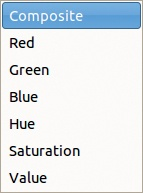

图 15-20. 通过下拉菜单填充

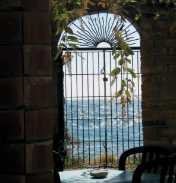

图 15-21. 原始图像

漏斗填充工具有一些有用的快捷键：

+    用当前前景色填充整个选区或图层。

+    用当前背景色填充。

+    用当前图案填充。

## 混合工具

混合工具 () 用渐变填充图层或选区。其图标和指针如图 15-24 所示，其选项如图 15-25 所示。

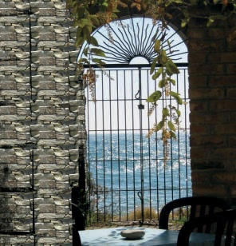

图 15-22. 通过合成填充

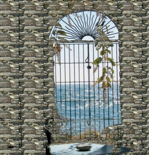

图 15-23. 通过蓝色填充

要使用它，点击并拖动以绘制一段线段。渐变将在这段线段上跨越，但无论线段长度如何，整个选区或图像都会被填充。

以下是此工具的特定选项：

+   GRADIENT 用于选择渐变。你也可以在工具箱或渐变对话框中更改渐变。

+   右侧的小按钮可反转渐变方向。

+   SHAPE 是用于选择渐变形状的下拉列表。我们稍后会详细解释。

    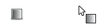

    图 15-24. 混合工具图标和指针

    

    图 15-25. 混合工具选项

+   REPEAT 有三个选项：无重复（none）、锯齿波或三角波。然而，这些选项仅在前四种形状中有效。为了演示重复效果，我们用`Abstract 3`渐变和线性 SHAPE 填充了一个空白图像。红色箭头指示绘制的地方。在无重复情况下，结束颜色从笔画延伸到图层或选区的边缘（如图 15-26）。使用锯齿波重复时，渐变会简单地重复（如图 15-27）。使用三角波重复时，渐变的方向会在每个重复之间反转（如图 15-28）。

+   OFFSET 滑块 [0 到 100] 通过移动起点有效地缩短渐变段。同样，它仅适用于前四种形状。

+   DITHERING 旨在平滑渐变中不同颜色之间的过渡。

+   ADAPTIVE SUPERSAMPLING 平滑渐变的边缘，使用螺旋形状时你可能会发现它很有用。

图 15-26. 一个无重复的线性渐变图案

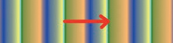

图 15-27. 一个带有锯齿波重复的线性渐变图案

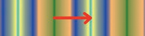

图 15-28. 一个带有三角波重复的线性渐变图案

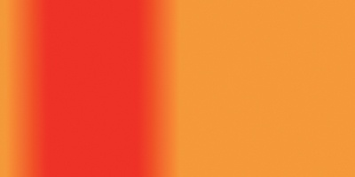

图 15-29. 一个双线性渐变图案

图 15-30. 一个辐射渐变图案

现在我们将详细描述 SHAPE 选项。这些是可用的渐变形状：

+   LINEAR 将渐变放置在你绘制的段中，并用第一种和最后一种颜色或相同的渐变（锯齿波或三角波重复）填充外部区域。

+   BI-LINEAR 在起始点处镜像渐变，如图 15-29 所示。我们为这个图形使用了一个短的渐变段。（我们在图 15-30 到图 15-38 使用相同的段。）

    

    图 15-31. 一个方形渐变图案

    

    图 15-32. 一个圆锥形渐变图案，对称

    

    图 15-33. 一个圆锥形渐变图案，不对称

+   RADIAL 创建一个以起始点为中心的圆，半径等于绘制的段的长度，如图 15-30 所示。

+   SQUARE 创建一个以起始点为中心的方形。方形的宽度是你绘制的段的两倍（图 15-31）。

+   CONICAL 绘制一个以起始点为尖端的圆锥。对称形状和非对称形状的效果分别显示在图 15-32 和图 15-33 中。

+   SHAPED 沿图像或选择边界绘制。你通常绘制的段落用于添加渐变，但在这种情况下不起作用。相反，使用三种不同的算法在形状内应用渐变，如图 15-34、图 15-35 和图 15-36 所示。这里，我们将渐变应用于一个花形选择区域。

    

    图 15-34. 沿形状的渐变，角度算法

    

    图 15-35. 沿形状的渐变，球形算法

    

    图 15-36. 沿形状的渐变，凹陷算法

+   SPIRAL 绘制一个以起始点为中心的螺旋，顺时针或逆时针旋转。段长度设置两个螺旋之间的距离。顺时针螺旋见于图 15-37。图 15-38 展示了使用非常短段的有趣效果。

图 15-37. 顺时针螺旋渐变形状

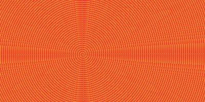

图 15-38. 非常短的螺旋渐变形状

# 15.5 绘画工具

绘画工具具有直观性，因为它们的表现方式类似于传统的绘图媒介。

我们已经讨论了绘画工具所共有的特点（绘图工具选项）。在本节中，我们将逐一讨论每个工具，重点介绍每个工具独特的选项和功能。

## 铅笔工具

铅笔工具（）绘制硬边笔触。其图标和指针如图 15-39 所示。使铅笔工具独特的特点是笔触边缘没有抗锯齿处理。请参见铅笔工具。

铅笔工具选项如图 15-40 所示。FADE 选项仅在“画笔动态映射”矩阵的“褪色”列中有勾选项时才有效，而 COLOR 选项仅在“颜色”行中有勾选项时才有效。

图 15-41（上图）展示了使用基本动态绘画的结果。因为在映射矩阵的颜色行中没有勾选项，所以工具使用前景色。大小和速度是相关的，因此，当移动更快时，笔触会更窄。透明度与压力和褪色相关，因此在压力较低时，笔触的透明度较低。由于选择了锯齿波重复模式，透明度会褪色，然后在 100 像素的距离后重新开始（褪色长度）。

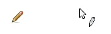

图 15-39. 铅笔工具图标和指针

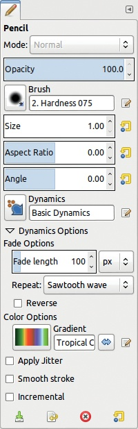

图 15-40. 铅笔工具选项

在图 15-41 的第二个笔触中，我们定义了一个新的画笔动态，仅链接颜色和褪色。颜色沿当前渐变路径使用，经过 100 像素后重新开始。

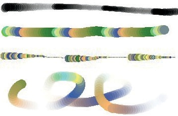

图 15-41. 不同动态选项的一些示例

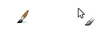

图 15-42. 画笔工具图标和指针

在图 15-41 的第三个笔触中，颜色与随机相关，因此颜色从渐变中随机选择，而大小与褪色相关，因此它沿着 100 像素的路径逐渐减小，然后重新开始。

在图 15-41 中的最后一个例子中，颜色与方向相关联，因此颜色沿着渐变根据运动的方向变化，而不透明度与褪色相关联。请注意，我们将 REPEAT 选项更改为 TRIANGULAR WAVE（梯形波）以进行此示例，因此不透明度先减少，然后再次增加。

## 画笔工具

画笔工具 () 绘制柔和边缘的笔触，但与铅笔工具类似。其图标和指针如图 15-42 所示。

画笔是 GIMP 中最通用的数字插图工具。画笔选项与铅笔选项相同，因此我们不会再次显示对话框。相反，我们将演示一些我们尚未探索的选项，当前画笔动态的褪色列或颜色行没有勾选框。在图 15-43 中，我们使用选中 APPLY JITTER 并设置值为 0.20 的选项绘制顶部笔触，底部笔触则没有抖动。

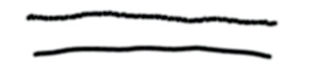

图 15-43. 带有和不带抖动的绘制

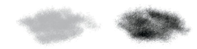

图 15-44. 使用丙烯刷进行增量绘制

在图 15-44 中，我们将不透明度设置为 43%，并使用动态`Acrylic 02`画笔涂鸦。我们在左侧进行不使用增量选项的涂鸦，在右侧进行使用增量选项的涂鸦。

在图 15-45（顶部），我们使用平板电脑触控笔绘制笔触，并在笔触过程中增加压力。画笔动态将大小与压力相关联。我们使用默认的直线答案曲线绘制顶部笔触。对于底部笔触，我们通过将曲线的中心向右下角移动，使曲线强烈向内凹，因此画笔大小在笔触开始时保持恒定，末尾时增大。

在图 15-45（中部），我们使用与褪色相关联的画笔动态绘制水平笔触。对于顶部笔触，答案曲线是平的。对于底部笔触，答案曲线是强烈凸起的，中间点已被移动到左上角。

为了演示 Wheel 参数，我们使用具有矩形笔尖的艺术笔。如果笔尖平放在平板上，最大面积与平板接触；如果笔旋转 180°，最小面积与平板接触。将这一点转化为绘画动态的最佳方法是反转与大小相关的 Wheel 答案曲线。使用艺术笔的这种方式变得非常自然。但在图 15-45（下方），我们将 Wheel 与方向关联，并使用设置为 –10 的 `Hardness 100` 画笔。旋转笔时，画笔也会旋转。

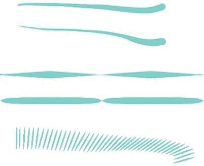

图 15-45. 尺寸和角度的变化

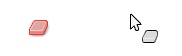

图 15-46. 橡皮擦工具图标和指针

## 橡皮擦工具

橡皮擦工具（）通过绘制透明度来从当前图层中移除颜色，如果该图层具有 Alpha 通道；如果没有，则使用背景颜色。其图标和指针出现在图 15-46 中。

如图 15-47 所示，橡皮擦工具的选项比铅笔和画笔工具少，因为它没有模式或颜色选项。不过，出现了两个新选项，这两个选项是橡皮擦独有的：HARD EDGE（硬边）和 ANTI ERASE（反擦除）。

为了说明此工具，我们创建了一幅填充绿色的简单图像。我们添加第二个透明层（因此具有 Alpha 通道），并使用画笔工具和大小为 40 的 `Hardness 050` 画笔绘制一个紫色的斑点。在图 15-48 中，我们使用相同的画笔工具进行擦除。我们用未选中 HARD EDGE 的方式在左侧做了两笔。因为使用的是 `Hardness 050` 画笔，边缘模糊。在右侧，勾选了 HARD EDGE 选项，因此画笔的完整直径擦除像素，使得笔触看起来更宽。

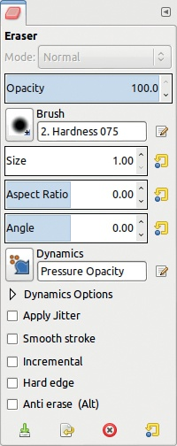

图 15-47. 橡皮擦工具选项

图 15-48. 有硬边或无硬边的擦除

图 15-49. 反擦除

当选中 ANTI ERASE 时，已擦除的颜色会再次出现，如图 15-49 所示。此功能仅在具有 Alpha 通道的图层上有效。当像素变得透明时，颜色信息会被保留。反擦除切换透明度，显示曾经不可见的颜色。按下  可暂时切换此选项。

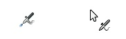

图 15-50. 气刷工具图标和指针

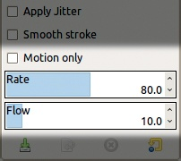

图 15-51. 气刷专用选项

许多平板电脑配有双头手写笔，笔头一端像是绘图尖端，另一端像是橡皮擦。GIMP 能够记住每个笔头所连接的工具，所以你可以将绘图尖端与画笔工具关联，然后翻转手写笔使用橡皮擦工具。要创建此关联，点击橡皮擦工具图标并使用正确的笔头，且只要不使用它点击其他工具图标，它就会保持与橡皮擦工具的关联。

## 气刷工具

与气刷工具相关的图标和指针 () 如图 15-50 所示。气刷工具类似于画笔工具，但在画布上留下的颜料量更加变化。如果在同一位置涂抹多次，气刷会添加更多颜料；如果以更快的速度涂抹，气刷则添加较少颜料。如果你点击并保持鼠标在同一位置（或按住手写笔在一个位置），它会继续添加颜料，除非选中 MOTION ONLY（此选项也会受到当前涂料动态的影响）。

气刷工具的选项与画笔工具相同，只是此工具的 INCREMENTAL 始终处于激活状态。

有三个选项是专门针对气刷工具的，如在图 15-51 中所示。当选中 MOTION ONLY 时，只有在刷子移动时才会添加颜料。RATE 滑块[0 到 150]改变颜料从气刷中喷出的速度。FLOW 滑块[0 到 100]设置颜料流的强度，因此也会影响画布上最终涂抹的颜料量。如果你将 Rate 与涂料动力学中的压力进行关联，请将 Rate 设置为最大值，因为在较低设置下，效果过于微妙。

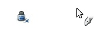

图 15-52. 墨水工具图标和指针

## 墨水工具

Ink 工具（）模拟了一个带有可调笔尖的书法笔。其图标和指针显示在图 15-52 中。Ink 工具使用笔尖设置而不是当前画笔绘制抗锯齿的笔触，并且它有自己的绘画动态设置，因此当前的画笔和绘画动态不会影响此工具。

如图 15-53 所示，Ink 工具的模式和不透明度选项与其他绘画工具类似。但它的其他选项是独特的。让我们来看看这些选项。我们从底部开始，看看笔尖的 SHAPE。你可以选择圆形、方形或菱形笔尖。如果你点击并拖动 SHAPE 窗口中的小白方块，你可以自定义笔尖的形状。这样，你就可以模拟出像毡尖笔、羽毛笔、画笔或其他任何类型的笔。

SENSITIVITY 选项控制触控笔的运动效果（例如绘画动态）。SIZE 设置笔尖的最大尺寸，取决于你按压触控笔的力度。由于最小尺寸已在 ADJUSTMENT 字段中设置，值越大，尺寸变化范围越大。TILT 使用触控笔的倾斜度来改变笔尖的形状。SPEED 控制笔尖的大小：你绘制得越快，笔触就越细。要得到较宽的笔触，你需要较低的速度值。这三个选项的值范围是[0 到 1]。当然，所有这些效果的表现还取决于你的平板电脑的能力。

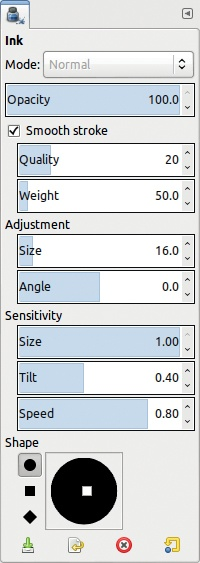

图 15-53. Ink 工具选项

ADJUSTMENT 设置初始的笔触参数。SIZE [0 到 200]是笔尖的大小，ANGLE [–90 到+90]是笔尖相对于水平面的角度。

图 15-54 到图 15-56 展示了 Wilber（GIMP 吉祥物）的三个签名示例。我们使用所有默认设置慢慢绘制了第一个签名，除了使用了一个窄的菱形笔尖。在第二个签名中，我们施加压力以改变笔触宽度，并将 TILT 设置为 1.0。在第三个签名中，我们将调整尺寸减小到 2.9，并且签名速度较快。

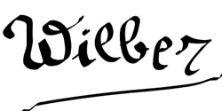

图 15-54. 第一个 Wilber 签名

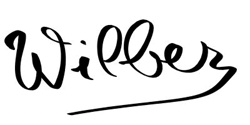

图 15-55. 第二个 Wilber 签名

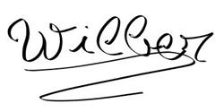

图 15-56. 第三个 Wilber 签名

# 15.6 克隆工具

三种克隆工具（克隆、修复和透视克隆）允许你将图像中的克隆内容涂抹到另一张图像上或同一张图像的其他区域。像其他画笔工具一样，这些工具使用当前的绘画动态。以下是这三种工具共同拥有的功能：

+   键用于设置图像中开始克隆的位置。 -单击你想要克隆的区域。然后，使用当前的画笔工具将你单击的位置的像素“绘制”到目标区域。

+   键用于沿直线进行克隆。

+   模式（MODE）、不透明度（OPACITY）、画笔（BRUSH）、缩放（SCALE）、纵横比（ASPECT RATIO）、角度（ANGLE）、渐变（FADE OUT）和应用抖动（APPLY JITTER）与所有其他画笔工具的作用相同。

    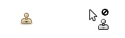

    图 15-57。克隆工具图标和指针

    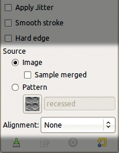

    图 15-58。克隆工具的特定选项

+   HARD EDGE 的工作方式与橡皮擦工具相同：选中时，画笔的模糊度会被忽略。

+   ALIGNMENT 选项将在后面描述。

## 克隆工具

克隆工具 () 是最简单、最广泛适用的克隆工具。其图标和指针如图 15-57 所示。首先，通过 -单击选择要克隆的源图像，然后涂抹目标区域。一个细小的十字标记显示从源图层克隆的位置。

克隆工具的特定选项如图 15-58 所示。它们包括 SOURCE 和 ALIGNMENT。

SOURCE 有两个单选按钮：

+   图像从 GIMP 中打开的图层进行克隆。源图像可以来自不同的图像或同一图像中的不同图层，甚至是同一图层。 -单击选择源图像的初始位置。选中“SAMPLE MERGED”时，所有可见的像素都作为源。当没有选中“SAMPLE MERGED”时，仅使用活动图层作为源，并且透明像素将被绘制为透明（因此不会产生效果）。

    

    图 15-59。对齐下拉菜单

    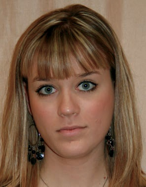

    图 15-60。源图像

+   PATTERN 从图案而非图像进行克隆，因此它用该图案进行绘制。你可以通过点击相应字段或图案对话框来更改图案。无需进行初始的 -单击操作。

对齐方式（ALIGNMENT）决定了在移动画笔时，源图像是如何被涂抹到目标图像上的。你有四种选择，详见图 15-59。为了演示，我们将使用一张肖像画（图 15-60）作为源图像，白色画布作为目标图像。我们将应用图 15-58 中所示的工具选项。首先，我们点击左眼，并在目标图像的左侧涂抹，然后我们在图像的右侧画另一个眼睛形状，而不改变源图像。

在图 15-61 中，对齐方式设置为无（NONE），因此每次我们将指针移动到目标图像中的不同位置时，复制将从我们最后在源图像中单击的位置开始。在这个例子中，这意味着我们复制了左眼两次。

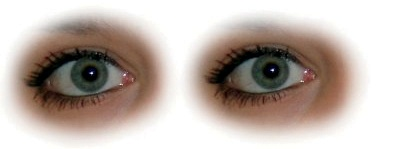

图 15-61. 对齐方式设置为无

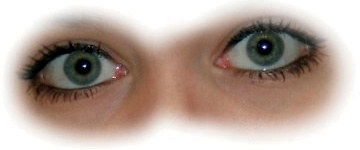

图 15-62. 对齐方式设置为对齐

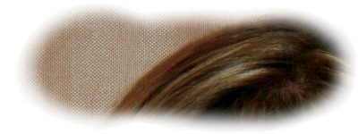

图 15-63. 对齐方式设置为注册

图 15-64. 对齐方式设置为固定

在图 15-62 中，对齐方式设置为对齐（ALIGNED）。使用此选项时，当我们移动指针时，源图像中被复制的区域也会随之移动。这次当我们在右侧涂抹时，我们复制的是右眼，而不是再次复制左眼。

在图 15-63 中，对齐方式设置为注册（REGISTERED）。在这种设置下，鼠标单击不再相关。克隆的像素在源图像中的位置与指针在目标图像中的位置一致，因此即使我们再次点击左眼，最终克隆的却是她的头顶。

在图 15-64 中，对齐方式设置为固定（FIXED），因此源区域是由单击鼠标固定的。由于我们点击了眼睛，它会像刷子一样不断被复制。

图 15-65. 修复工具图标和指针

图 15-66. 使用修复工具

如果源是一个图案，ALIGNED 和 REGISTERED 都会用图案填充绘制区域。FIXED 对齐使用图案，就像它是一个颜色画笔一样。NONE（或无对齐）类似于 ALIGNED 或 REGISTERED 对齐，唯一不同的是，如果你移动指针，图案会重新开始，而在其他两种模式下，图案会无缝继续。

## 修复工具

修复工具（）类似于克隆工具，但它不是替换像素，而是将像素合并。这个工具的设计目的是平滑图像中的瑕疵。其图标和指针如图 15-65 所示。

修复工具的选项与克隆工具相同，但你不能用图案进行修复。一个例子如图 15-66 所示。我们选择了一个皮肤光滑的源点，然后在瑕疵上进行绘制，以便将它们融合消除。我们将面部右侧的瑕疵保留下来进行对比。这个工具需要相当大的处理器性能，因此根据你计算机的性能，可能会出现延迟。

图 15-67. 透视克隆工具图标和指针

图 15-68. 透视克隆工具特定选项

## 透视克隆工具

透视克隆工具没有分配键盘快捷键。其图标和指针如图 15-67 所示。这个工具基本上结合了克隆工具和透视工具（见第十六章）。它具有与克隆工具相同的选项，只是多了一些附加的单选按钮（图 15-68）：

+   MODIFY PERSPECTIVE 用于建立透视：点击图像后，移动矩形的角以设置透视。

+   PERSPECTIVE CLONE 实际上是在你使用 MODIFY PERSPECTIVE 模式后，按照透视来克隆物体。

图 15-69 展示了法国格拉斯的一座房子。我们想将最右侧的封闭窗户替换为左侧的开放窗户。我们按照图中的方式设置透视，接着对最左侧的窗户进行右键单击。然后，我们切换到透视克隆模式，并在最右侧的窗户上进行绘制，如图 15-70 所示。

图 15-69. 设置透视效果

图 15-70. 克隆窗口后

如果你克隆简单的几何形状并创建微妙的透视效果，这个工具将产生最佳效果。

# 15.7 修改工具

这三种修改工具通常用于照片修饰，它们是刷子工具，可以改变图像，而不是添加或去除颜色。它们拥有所有刷子工具的共享选项，除了模式（MODE），并且会受到当前绘画动态的影响。与其他刷子不同的是，它们以独特的方式使用  键，并且有一些额外的选项。

图 15-71. Convolve 工具图标和指针

图 15-72. 与 Convolve 工具相关的选项

Convolve 和涂抹是*定时工具*，这意味着如果同一区域被多次覆盖，它们的效果是累积的。你可以通过 RATE 滑块和当前绘画动态中的速率特性来控制这种效果。

## Convolve 工具

Convolve 工具 ()，也叫模糊/锐化工具，用于模糊或锐化图像。其图标和指针显示在图 15-71 中。

Convolve 的独特选项显示在图 15-72 中。根据 CONVOLVE 类型，此工具可以使用当前的刷子、不透明度、速率值和绘画动态来模糊或锐化图像。  键切换 CONVOLVE 类型。

RATE 滑块[0 到 100]设置变换的速度。该工具是累积的，因此在相同区域涂抹两次会增强模糊或锐化效果。虽然可以使用大刷子和较高的速率，但此工具并不适合变换大面积区域。它最适用于修饰和细节。对于大面积区域，建议使用滤镜。

图 15-73 显示了如何使用设置为模糊模式且刷子硬度为`Hardness 075`的 Convolve 工具，帮助花朵在明亮的叶子背景中脱颖而出。左半部分保持不变，右半部分显示效果。

图 15-73. 使用 Convolve 工具

## 涂抹工具

涂抹工具 () 就是按照你的预期进行涂抹。图 15-74 显示了其图标和指针。此工具可以用来混合图画中的阴影，微妙地处理照片，甚至在数字插画中绘制头发、毛发或草地，正如 3.5 数字绘画过程中所展示的。

我们将在图 15-75 中展示两种涂抹工具的使用方法。为了创建刘海，我们选择一个`硬度 050`的画笔，设置为较大尺寸（大约是女性头部的一半大小），并沿着她的头部从左到右涂抹。然后我们将画笔大小缩小到大约眼睛的一半大小，并扩展她嘴巴的边缘。结果见于图 15-76。

如果你在图层的副本上进行更改，那么如果犯了错误，你可以使用克隆工具通过从原始图层复制恢复图像。

## Dodge/Burn 工具

Dodge/Burn 工具 () 模拟了两种传统的摄影技术。其图标和指针见于图 15-77。Dodge 效果会使颜色变亮，而 Burn 效果则使颜色变暗。由于这是一个画笔工具，因此非常适合在图像或物体的特定部分添加光线或阴影。

图 15-74. 涂抹工具图标和指针

图 15-75. 涂抹前的初始图像

图 15-76. 使用两种不同画笔大小进行涂抹

该工具的独特选项显示在图 15-78 中。TYPE 单选按钮用于切换 Dodge 和 Burn，按下  键可以切换这些选项。RANGE 单选按钮根据光照的不同，改变影响图像的部分区域。

图 15-77. Dodge/Burn 工具图标和指针

图 15-78. 针对 Dodge/Burn 工具的特定选项

图 15-79. 躲避面部并烧焦头发

我们将在图 15-75 中展示该工具。我们在中间调(MIDTONES)躲避面部，在中间调和高光(HIGHLIGHTS)烧焦头发。结果如图 15-79 所示。此工具不能改变色调，因此即使阴影被增强，头发依然是金色的。

图 15-80. 文本工具图标和指针

如果你是传统摄影师，请注意，照片纸的动态范围比数字摄影要高得多，因此你在躲避操作中提取的细节不会像暗房操作中那样多。

# 15.8 文本工具

文本工具()显然是用于设置文本的。其图标和指针在图 15-80 中显示。使用时，点击图像中你希望放置文本左上角的位置，然后输入文本。每次点击并添加文本时，都会创建一个新图层。

## 文本工具选项

文本工具选项显示在图 15-81 中。它们从上到下如下：

+   字体(FONT)决定文本的显示效果。`Aa`按钮打开一个下拉菜单，显示可用的字体（图 15-82）。该菜单底部的按钮从左到右执行以下操作：

    +   缩小字体预览

    +   放大字体预览

    +   以列表形式显示字体预览（当前选择）

    +   以网格形式显示字体预览

    +   打开字体对话框（图 15-83）

你可以使用鼠标滚轮浏览字体。当你开始在对话框顶部的字段中输入字体名称时，会出现一个匹配字体的下拉菜单。

图 15-81. 文本工具选项

图 15-82. 字体下拉菜单

图 15-83. 字体对话框

+   大小(SIZE)是字体的像素大小，默认情况下使用像素单位，但你可以切换到依赖于分辨率的单位，如毫米或英寸。

+   使用编辑器(USE EDITOR)切换为使用文本编辑器，而不是直接在图像中编辑文本，具体说明见使用文本工具。

+   抗锯齿（ANTIALIASING）平滑字体的边缘，但在索引模式下的图像上无法使用。

+   HINTING 设置 *提示指令* 的级别，这些指令可以在小尺寸下改善渲染效果。点击按钮会打开一个下拉菜单，提供四个选项——从 NONE 到 FULL。

+   COLOR 打开颜色选择器，具体说明见 颜色选择器。

+   JUSTIFY 设置文本对齐方式，使用四个小图标，类似于单选按钮。对齐方式可以是左对齐、右对齐、居中或两端对齐。这些选项仅在 BOX 选项的值为 FIXED 时可用。

    接下来的三个选项使用与 SIZE 相同的单位，并且可以设置为负值：

    +   缩进首行

    +   行间距

    +   字母间距

    

    图 15-84. 文本选项：语言 > 右键菜单

    

    图 15-85. 字体对话框，网格视图

+   BOX 更改文本框的工作方式。您可以选择 FIXED 或 DYNAMIC。使用固定文本时，您可以更改框和文本的尺寸，且对齐、缩进和间距参数会自动调整。使用动态文本时，文本框会在输入时自动扩展，您需要按  才能开始新的一行。

+   LANGUAGE 更改语言，这可能会影响文本的呈现方式。如果您在此字段中输入内容，将出现可用语言的下拉列表。右键单击以打开 图 15-84 中显示的菜单。最后两个选项分别打开输入法菜单和插入 Unicode 控制字符的菜单。

图 15-86. 字体菜单

图 15-87. 字体渲染映射对话框

## 选择字体

如您所学，您可以在文本工具选项对话框中更改字体。您还可以使用可停靠的字体对话框。图 15-83 显示其默认外观，且 图 15-85 显示网格中的字体；您可以在对话框菜单中选择显示格式。要更改字体，只需点击所需的字体。如果您在文本工具选项中更改字体，这一变化会反映在字体对话框中。如果您点击并按住字体对话框中的 `Aa` 按钮，会弹出一个临时窗口，显示包含所有 26 个字母的句子。

字体菜单可以通过右键单击字体对话框打开，其中包含图 15-86 中显示的两个条目。RESCAN FONT LIST 刷新列表；安装新字体后，你会发现这个功能非常有用。RENDER FONT MAP 打开一个对话框（图 15-87），你可以在其中搜索合适的字体。它会显示可用字体的示例文本。默认的 TEXT 包含所有 26 个字母，但你可以更改此内容。你还可以选择将字体名称显示为文本。勾选后，LABELS 会在示例文本下显示字体名称。FILTER 减少显示的字体数量。你还可以选择示例文本的大小和配色方案。我们的部分结果出现在图 15-88 中。虽然这个工具很有用，但请记住，它并没有显示所有可用的字体。

图 15-88. 渲染字体

在 Windows 和 GNU/Linux 系统上，GIMP 使用一个通用工具叫做 Fontconfig 来管理字体。要添加字体，只需将其放置到适当的目录中，Fontconfig 会自动处理剩下的部分。Mac OS X，如在 GIMP 网站上所述（*[`docs.gimp.org/en/gimp-using-fonts.html`](http://docs.gimp.org/en/gimp-using-fonts.html)*），稍有不同。

## 使用文本工具

要使用文本工具，点击图像，如果框是动态的，嵌入框会根据你输入的文本自动调整。你还可以点击并拖动框的角和边来调整到你想要的尺寸，但这样做时，框就会变为固定的。当框固定时，换行会自动进行。

文本框上方有一个选项框（图 15-89），其中包含多个字段和按钮，你可以用来编辑文本中的选定部分。左上角的字段用于更改字体。右上角的字段是字体的像素大小。

左下角的按钮（扫帚图标）清除文本框中的所有样式设置。接下来的四个按钮分别切换粗体、斜体、下划线和删除线。接下来的两个字段分别用于垂直移动选定文本和更改字符间距。

图 15-89. 输入文本

图 15-90. 文本编辑器

如果你在文本工具选项对话框中勾选了“使用编辑器”选项，文本编辑器（如图 15-90 所示）将会打开。顶部按钮可以让你从文件中加载文本、删除文本，并将文本对齐到左侧或右侧。接下来的两行设置与文本框选项中的设置相同。当你勾选底部的“使用选择的字体”框时，上方的文本应该会显示为你选择的字体。

你可以在文本编辑器或图像中添加或编辑文本，但如果你直接在图像中编辑文本，几个键盘快捷键的功能会暂时发生变化。例如，会选择所有文本，而不是整个层，则会向文本中添加字母`p`，而不是打开画笔工具。任何单个字母快捷键都会有相同的效果。

图 15-91. 文本层：右键菜单

图 15-92. 警告对话框

文本会作为一个新层创建，大小与文本框相同。该层具有文本层的特殊属性，并以文本内容的开头命名。

如果你右键点击文本框，将会打开图 15-91 所示的菜单。部分选项也可以在文本编辑器中找到，其他的则是标准的编辑命令（复制、剪切等）。在菜单底部，你将看到一个输入法子菜单，你也可以通过文本工具选项中的语言字段访问该子菜单。两个命令，“从文本路径”和“沿路径文本”，将在下一节讨论。

只要文本在文本层中，你就可以编辑它。只需选择文本工具并单击文本中的某个位置。如果层的属性发生变化——例如，在使用变换工具编辑后——将会打开图 15-92 所示的警告对话框。如果你选择编辑文本，所做的变换将会被移除。或者，你也可以选择在变换后的文本层上方创建一个新的文本层。

图 15-93. 更改一些文本特性

图 15-94. 更改全局特性

## 编辑你的文本

文本工具并不是一个文字处理软件，因此其功能有限。这个工具适用于创建文本效果（参见第四章）或在较大的图像中添加少量文本。

如前所述，你可以编辑文本中选区的外观。在图 15-93 中，我们选择了单词 `text`（因此是黄色框选），并将其字体更改为 `Bitstream Charter` 并设置为斜体，字体大小设置为 24 像素，向下移动了 5 像素，并将字符间距增加了 4 像素。

如果你在工具选项中更改了参数，图层中的所有文本都会受到影响。在图 15-94 中，我们更改了字体、文本颜色、行间距和字符间距。

在 GIMP 界面中，有一些与文本相关的操作是隐藏的。如前所述，你可以通过右键点击文本图层、其选项框或工具选项中的 LANGUAGE 字段来打开菜单。右键点击图层对话框中的文本行会打开如图 15-95 所示的菜单。这个菜单也可以通过图层对话框右上角的三角按钮访问。

图 15-95. 文本图层菜单

该菜单有三个新增选项：

+   DISCARD TEXT INFORMATION（丢弃文本信息）：此选项将文本图层转换为普通图层，字符将以像素形式表示，因此你将无法将其作为文本进行编辑。

+   TEXT TO PATH（文本转路径）：此选项在右键点击文本框时显示为 PATH FROM TEXT。使用此选项可以改变字符的形状。例如，图 15-96 显示了从文本生成的路径，图 15-97 显示了通过移动一些锚点、将路径转换为选区并填充该选区后的结果。

    

    图 15-96. 从文本生成的路径

    

    图 15-97. 修改并填充第一个字符的路径

    

    图 15-98. 建立新路径

+   TEXT ALONG PATH（路径上的文本）：为了使此转换生效，路径必须在路径对话框中处于活动状态。创建路径后（见图 15-98），选择文本图层，然后选择 TEXT ALONG PATH。

    GIMP 从沿路径弯曲的文本中构建一个新路径（图 15-99）。如前所述，我们将路径转换为选择区域并用黑色填充（图 15-100）。原始的水平文本依然保留。

# 15.9 颜色选择器工具和测量工具

另外两个在数字艺术和绘图中有用的工具是颜色选择器工具和测量工具。

图 15-99。将文本转换为路径

图 15-100。沿路径弯曲的文本

## 颜色选择器工具

颜色选择器工具 () 用于从 GIMP 中打开的图像中选择颜色。它的图标和指针见于图 15-101。选择工具后，点击打开图像中的一个颜色，它将成为前景色或背景色。当你在使用绘画工具时按下  键，指针会暂时作为颜色选择器，但你只能在当前图层中选择一个像素，并且只能设置前景色。当你释放  键时，绘画工具会恢复。图 15-102 显示了工具的选项。

+   SAMPLE AVERAGE，勾选时，会计算点击像素中心的方形区域内的像素平均值。使用滑块设置此方形区域的半径，点击图片时，区域会被轮廓显示。否则，只使用点击的像素。

+   SAMPLE MERGED，勾选时，会使用图像中所有可见的图层；否则，只使用当前图层。

    

    图 15-101。颜色选择器工具图标和指针

    

    图 15-102。颜色选择器工具选项

    

    图 15-103。颜色选择器信息对话框

+   PICK MODE 有四个选项：

    +   PICK ONLY 只在信息对话框中显示你点击的像素信息（图 15-103），但它不会更改前景色或背景色。

    +   SET FOREGROUND COLOR 和 SET BACKGROUND COLOR 让你选择设置的颜色，并且你可以通过  在这两种选项之间切换。

    +   ADD TO PALETTE（添加到调色板）将选定的颜色发送到活动调色板，使用在 22.7 构建新调色板中描述的调色板编辑器。

    

    图 15-104. 指针对话框

+   USE INFO WINDOW（使用信息窗口）选项勾选时，会打开颜色选择器信息对话框（图 15-103），你也可以通过点击！打开此对话框。此对话框包含以下信息：

    +   一个包含所选颜色的大矩形。

    +   此颜色的十六进制值。

    +   两组更详细的信息。默认情况下，显示的信息使用 RGB 通道值作为百分比。你可以将模型更改为 HSV、CMY 或 CMYK。

你还可以从指针可停靠对话框获取像素信息。图 15-104 展示了一个示例。此对话框显示关于指针当前定位的详细信息。没有提供样本平均选项，且默认选中 SAMPLE MERGED 选项。此对话框还显示当前图层和选区的尺寸。

## 测量工具

测量工具（）用于测量图像中的距离和角度。其图标和指针如图 15-105 所示。点击一个起始点进行测量，然后拖动到最终点。

图 15-105. 测量工具图标和指针

图 15-106. 使用测量工具

图 15-107. 测量工具选项

结果显示在图像窗口底部的状态栏中，如图 15-106 所示。你可以看到两个点之间的像素距离、线条与水平线的夹角，以及使用线条端点绘制的矩形的像素尺寸。你可以将点移动到新的位置，结果会反映新的数值。

该工具只有一个选项，如图 15-107 所示。如果选中该选项，工具会打开一个对话框，如图 15-108 所示，该对话框显示与图像窗口状态栏中相同的信息，但带有标签。

图 15-108. 测量对话框

# 15.10 组合工具预设、画笔和绘画动态

我们在本章稍早时候简要讨论了工具预设，但现在让我们更详细地看一下它们。工具预设是 2.8 版本的新特性，当与画笔和绘画动态结合使用时，它们特别强大。

## 了解涉及的对话框

图 15-109（由 Ramón Miranda 提供灵感）展示了工具预设、画笔和绘画动态如何互动。在画笔工具的选项对话框（1）中，点击 DYNAMICS 按钮（2）以打开可用绘画动态的临时菜单。在这个菜单中，你可以选择你想要的动态，或者点击右下角的按钮打开绘画动态对话框（3）。在这个对话框中，你只能使用标签字段选择某个类别的动态，这里是`FX`。你不能编辑像`Confetti`这样的预定义动态的设置，但你可以通过按下画笔工具选项对话框中标有（4）按钮的按钮来编辑它的副本。这样就会打开绘画动态编辑器（5）。

在图 15-109 中，绘画动态编辑器对话框出现了两次。顶部的副本（5）显示了所选动态的映射矩阵（6）。在这个例子中，你会看到 SIZE 行和 RANDOM 列交汇处有一个勾选框。当你在绘画动态编辑器（7）中显示 SIZE 参数时，你会看到对应的答案曲线根本不是线性的。

如果你对当前的画笔工具设置感到满意并希望保存它们，点击画笔工具选项对话框左下角的按钮打开工具预设编辑器（8）。在这里，你可以选择新工具预设的名称和图标。如果你点击建议的图标，你会看到一个包含许多可用图标的列表，与图 9-54 相同。更重要的是，你可以选择要保存的设置。在这个例子中，当前的前景色和背景色不会被保存，因为这些颜色是根据所选渐变随机选择的。当前的画笔、动态和渐变会被保存，因为它们是`FX Confetti`预设的核心。最后，当前的图案、调色板和字体与画笔工具无关。

工具预设对话框（9）可以通过选择**图像：窗口 > 可停靠对话框 > 工具预设**打开。你也可以通过点击工具预设对话框底部行的第一个按钮打开工具预设编辑器。

## 预定义绘画动态

正如你所看到的，GIMP 自带 17 个预定义的绘画动态。基本类别包含七个动态：

+   `Basic Simple`将不透明度与压力关联，并将角度与映射矩阵中的随机性关联，这意味着对于圆形画笔，只有不透明度发生变化。角度-随机答案曲线从正方形的中心开始，因此即使随机性为零，角度也会发生变化。

+   `Dynamics Random` 将大小与随机性关联。

+   `Negative Size Pressure` 的设置与 `Basic Simple` 相同，另外还将大小与压力关联，且使用反向线性回答曲线，这使得在笔尖压力更大时，绘图更为透明。

+   `Pencil Generic` 是一个复杂的动态，将不透明度与压力和速度（陡峭回答曲线）关联，将大小与压力（凹形回答曲线）关联，将角度与方向关联，将力度与压力关联，将抖动与压力和速度（凹形回答曲线）关联。

    

    图 15-109. 涉及的对话框

+   `Pencil Shader` 的设置与 `Basic Simple` 相同。不同之处在于回答曲线：不透明度-压力曲线在中间更陡峭，角度-随机性则是线性的。

+   `Pen Generic` 将不透明度与压力、速度和褪色关联；大小与压力和速度关联；角度与随机性关联。大小-压力曲线在中间几乎是线性的，然后在最大压力时减小到零。大小-速度曲线是凹形的。

+   `Pressure Opacity` 将不透明度与压力关联，首先是凹形曲线，然后是凸形曲线。

FX 类别包含三种画笔动态：

+   `Confetti` 是一个复杂的动态，将大小、角度和颜色与随机性关联，将硬度和纵横比与压力关联。角度-随机性曲线是线性的，并且从中间开始。

+   `Perspective` 将不透明度和纵横比与压力关联，将角度与方向关联。所有的曲线都是线性的。

+   `Speed Size Opacity` 将不透明度与压力关联，将大小与压力和速度关联，将角度与方向关联。

最后，七种动态没有类别。除非另有说明，它们的回答曲线都是线性的：

+   `Basic Dynamics` 将不透明度与压力和褪色关联，将大小与速度关联，将角度与倾斜关联。这个动态最适合简单的绘画。

+   `Dynamics Off` 具有空的映射矩阵。选择这个动态时表示没有任何效果。

+   `Fade Tapering` 将不透明度和大小与褪色关联。

+   `Random Color` 将颜色与随机性关联。

+   `Tilt Angle` 将角度与倾斜关联，仅在使用能够记录笔尖倾斜的平板时有用。

+   `Track Direction` 将角度与方向关联。

+   `Velocity Tapering` 将不透明度和大小与速度关联。

你可以根据需要扩展这组画笔动态。使用预定义的动态作为模型。避免定义映射矩阵中勾选过多框的动态，因为其行为将很难预测。

结合一些预定义工具预设，几个预定义的画笔动态尤其方便，正如你将在预定义工具预设中看到的那样。

图 15-110. 基础画笔

图 15-111. 媒体画笔

图 15-112. 草图画笔

## 预定义画笔

如前所述，GIMP 的 54 个预定义画笔按标签分类：`基础`、`媒介`、`素描`、`飞溅`、`纹理`和`遗留`（图 15-110 到图 15-115）。

你可以定义自己的画笔，详细信息请参见 22.4 创建新画笔。你创建的任何画笔都会首先列在画笔对话框中，接着是按字母顺序列出的预定义画笔。画笔在列表中的显示取决于对话框顶部的标签过滤器。记住，当没有指定标签时，对话框中的第一个画笔是剪贴板的内容，裁剪后的最大尺寸为 512 × 512。

图 15-113. 飞溅画笔

图 15-114. 纹理画笔

图 15-115. 遗留画笔

在网上可以找到各种各样的画笔，例如* [`www.noupe.com/how-tos/1000-free-high-resolution-gimp-brushes.html`](http://www.noupe.com/how-tos/1000-free-high-resolution-gimp-brushes.html) * 和 * [`www.pgd-design.com/gimp/br.php`](http://www.pgd-design.com/gimp/br.php) *。Gimp Paint Studio（* [`code.google.com/p/gps-gimp-paint-studio/`](http://code.google.com/p/gps-gimp-paint-studio/) *）提供了一大批专为 GIMP 设计的画笔。

为 Photoshop 设计的画笔也可以在 GIMP 中使用。只需将下载的画笔放入 GIMP 的画笔文件夹中，然后通过点击底部的按钮刷新画笔对话框。

图 15-116. 预定义工具预设

## 预定义工具预设

GIMP 现在包含 29 个预定义的工具预设，分为 4 个类别。

FX 包含八个预设（见图 15-116 左上方）：

+   `裁剪 16:9`按 16:9 比例裁剪。

+   `裁剪构图`应用裁剪工具，除了高光和三分法之外不设置任何其他参数。

+   `填充纸张（叠加！选择模式）`以叠加模式打开油漆桶工具，选择`纸张`图案（见图 15-117），透明度为 50%。

+   `FX 彩带`打开画笔工具，使用`1.像素`画笔、`彩带`绘画动态、`热带色彩`渐变和显著的抖动（见图 15-118）。

    

    图 15-117. 使用填充纸张工具预设

    

    图 15-118. 使用 FX Confetti 工具预设

+   `FX Radial Softlight` 应用混合工具，使用 `FG to Transparent` 渐变，处于柔光模式，并采用径向形状。你可以选择前景色。从 图 15-119，我们通过选择明亮的绿色作为前景色，并将渐变中心放置在太阳上，得到了 图 15-120。

+   `Glow Lights (Addition!)` 打开画笔工具，透明度为 40%，并处于加法模式，使用 `Hardness 050` 画笔和 `Pressure Opacity` 画笔动力学。画笔大小设置为 400，并勾选递增框。例如，如果我们从 图 15-121 开始，我们可以通过选择明亮的绿色并通过施加增加的压力在图像上绘制，得到 图 15-122。

+   `Smooth Clone (按 Ctrl)` 打开克隆工具，除默认选项外，大小设置为 150，`Dynamics Off` 画笔动力学，勾选了 SAMPLE MERGED 框。选择画笔，最好是 `Hardness 075` 或 `Hardness 050`，然后开始克隆。

    

    图 15-119. 原始照片

    

    图 15-120. 使用 FX 径向柔光工具预设

+   `Vignette` 打开混合工具，处于叠加模式，透明度为 75%，使用 `FG to BG (RGB)` 渐变，径向形状，偏移量为 25，并勾选抖动框。它模拟了老旧低价值相机产生的所谓晕影效果。

图 15-121. 原始照片

图 15-122. 使用 Glow Lights 工具预设

Paint 包含 13 个预设。这些预设中，除了最后两个之外，所有预设都使用 `Pressure Opacity` 画笔动力学。 这些工具预设在工具和画笔应用以及接下来提到的各种工具选项设置上有所不同。它们构成了一套精心挑选的、适合画家的日常工具。

+   `Airbrush` 使用 `Hardness 050` 画笔，大小为 500，并将速率设置为 30，流量设置为 10。

+   `Basic Knife` 应用画笔工具（与接下来的三个预设相同），使用 `Block 03` 画笔，大小为 180。

+   `Basic Round` 使用 `Hardness 100` 画笔，大小为 80。

+   `Basic Round Detail` 使用 `Hardness 075` 画笔，大小为 20。

+   `Bristles` 使用 `Bristles 01` 画笔，大小为 60。此工具模拟使用旧牙刷进行绘画的效果。

+   `硬橡皮擦`使用`方块 01`画笔，大小为 80，用强力的方形橡皮擦进行擦除。

+   `噪点`使用画笔工具，选择`海绵 01`画笔，大小为 450，角度为 90，这只有在更改纵横比时才有意义。

+   `粗糙模糊`使用`丙烯 01`画笔，透明度为 50，大小为 100，速率设置为 60。

+   `柔化模糊`与`粗糙模糊`相同，唯一的区别是它使用`硬度 050`画笔。

+   `软油画刷`和接下来的三个预设使用画笔工具。`软油画刷`应用`油画 02`画笔，大小为 80。它模拟使用油画颜料进行绘画的效果。

+   `飞溅`应用`飞溅 01`动态画笔，大小为 200。它模拟了在画布上方晃动画笔的效果。

+   `透视`应用`结构`画笔，大小为 283.55，使用`透视`画笔动态。使用此预设来绘制与画布上形状相符合的笔触。

+   `植被`应用`植被 02`动态画笔，大小为 250，并使用`压力透明度`画笔动态（图 15-123）。

选择包含两个预设，适用于两种常见情况。使用这些预设来生成你自己的定义预设的创意：

+   `圆形 200px`创建一个直径为 200 像素的圆形选择。勾选抗锯齿框。

    

    图 15-123。使用植被工具预设

    

    版权：拉蒙·米兰达

    图 15-124。使用蓝色钢笔工具预设

+   `羽化选择`打开矩形选择工具，并勾选抗锯齿、羽化边缘（半径设置为 25）和圆角（半径设置为 50）框。导向线设置为中心线。

素描包含六个预设，类似于绘画预设：

+   `蓝色钢笔（叠加模式）`以叠加模式应用画笔工具，透明度设置为 75%，使用`硬度 075`画笔，大小为 15，采用`钢笔通用`画笔动态。前景颜色设置为（26, 47, 152）RGB，即深蓝色。结果模拟使用蓝色圆珠笔的素描效果（图 15-124）。

+   `软橡皮擦`与`硬橡皮擦`相同，但它使用`硬度 050`画笔。

+   `墨水平滑`应用墨水工具，勾选平滑笔触，质量设置为 75，重量为 300，调整大小为 10，倾斜为 0，速度为 0.9。笔尖为圆形，变形为右倾的窄椭圆。此设置非常适合书法。

    

    版权：拉蒙·米兰达

    图 15-125。黑白肖像片段

+   `Ink Thin` 应用了墨水工具，角度（ANGLE）设置为 0.5，速度（SPEED）设置为 1\。笔尖形状为简单的圆形大小。此预设适合模拟手写效果。

+   `Pencil` 打开画笔工具，透明度（OPACITY）设置为 50%，`Pencil 01` 画笔的大小（SIZE）设置为 50，并应用 `Pencil Generic` 绘画动态。勾选了应用抖动（APPLY JITTER）（抖动量设置为 0.2）和递增（INCREMENTAL）。此预设模拟了在画纸上使用软铅笔的效果。

+   `Pencil Soft` 具有相同的设置，唯一不同的是 `Charcoal 02` 画笔的大小（SIZE）设置为 200\。它模拟了使用木炭铅笔的效果。

通过尝试这组预定义的工具预设，你会获得定义自己工具预设的灵感。不要忘了给它们打标签，这样你可以轻松地调用它们。你可以使用现有标签，也可以创造新的标签，并且可以为同一个对象应用多个标签。定义一个新的工具预设比定义一个新的画笔要容易得多。当然，如果你缺少某个特定的绘画动态，你也可以轻松地将其定义为工具预设。图 15-125 到图 15-127 展示了几个结合了自定义预定义画笔、绘画动态和工具预设的作品示例，感谢 GIMP Paint Studio 的主要作者 Ramón Miranda（参见 *[`code.google.com/p/gps-gimp-paint-studio/`](http://code.google.com/p/gps-gimp-paint-studio/)*）。GIMP Paint Studio 提供了大量的画笔和预设，旨在通过减少更换工具时手动重置工具选项的需求，从而加速重复性任务。它的主要目标是支持绘画任务，正如它的名字所暗示的那样。

作者： Ramón Miranda

图 15-126. 彩色肖像的片段

作者： Ramón Miranda

图 15-127. 彩色画作的片段
