# 第十六章. 变换工具

变换工具改变了图像或图像部分的位置或几何形状。这些工具不会改变像素的颜色或透明度，尽管在某些情况下，图像区域会变为空白，需要确定新的像素值。例如，如果图像的某个部分被旋转，空白区域将被创建，这些区域会自动填充当前的背景颜色。此外，当像素被重新排列时，它们通常不会完全处于相同的相对位置，因此一些像素会丢失，另一些像素必须重新计算。

# 16.1 全局变换

*全局变换*是作用于整个图像或图层的变换，而不是作用于某个对象或区域，并且通过重新排列像素而非计算新值来执行。或许出乎意料的是，全局变换所需的计算能力相对较小，因为它们只是改变像素的位置，而不会在图像中产生空白区域或需要插值。（插值像素是通过使用相邻像素的值来计算新像素。）例如，使用旋转工具旋转图像时，图像层中的所有像素必须进行插值。旋转并不是一种全局变换。而 Flip 工具则执行全局变换，它仅仅改变像素的位置，因此不需要插值。

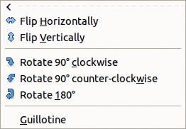

图 16-1. 图像：图像 > 变换菜单

## 变换图像

图 16-1 显示了**图像：图像 > 变换**菜单。菜单中的所有项都作用于整个图像，这意味着变换应用于图像中的所有图层。我们通过在图 16-2 中显示的图像上应用菜单中的每个变换，演示这些变换是如何应用于原始图像的。

+   FLIP HORIZONTALLY（水平方向翻转）产生的结果如图 16-3 所示。变换后，花卉呈现出原图像的镜像效果。此变换会在中央垂直轴周围对像素进行对称交换。

    

    图 16-2. 原始图像

    

    图 16-3. 水平翻转

    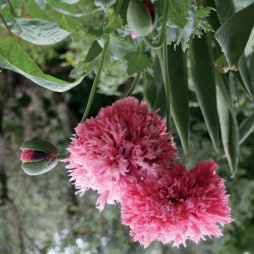

    图 16-4. 垂直翻转

+   FLIP VERTICALLY（垂直翻转）会在中央水平轴周围对像素进行对称交换。结果如图 16-4 所示。

+   顺时针旋转 90°并*不*涉及沿主对角线的对称性。结果图像不是镜像的，而只是简单地旋转了 90°。见图 16-5。

    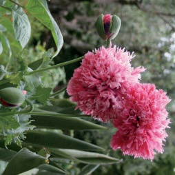

    图 16-5。顺时针旋转 90°

    

    图 16-6。逆时针旋转 90°

+   逆时针旋转 90°并*不*是前述旋转的水平翻转；花卉是从原始位置逆时针旋转的。见图 16-6。

+   旋转 180°并不会产生与垂直翻转相同的结果；花卉没有发生变化，只是旋转了。见图 16-7。

+   GUILLOTINE 实际上是以过时的法国执行设备命名的。GIMP 的这一功能相当实用——并且安全得多。

    在使用 GUILLOTINE 之前，请放置指南来限定图像的区域，如图 16-8 所示。

    当选择 GUILLOTINE 时，GIMP 会为每个由指南限定的矩形创建一个单独的图像窗口。在此示例中，创建了九个窗口，如图 16-9 所示。图 16-10 显示了包含花卉的中央矩形。这个工具有时用于网页开发中，将大图像切割成多个组件，每个组件都与不同的链接相关联。另见 Slice。

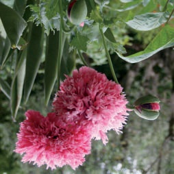

图 16-7。旋转 180°

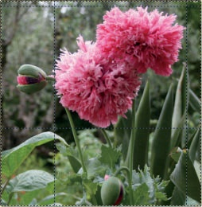

图 16-8。原始图像与指南

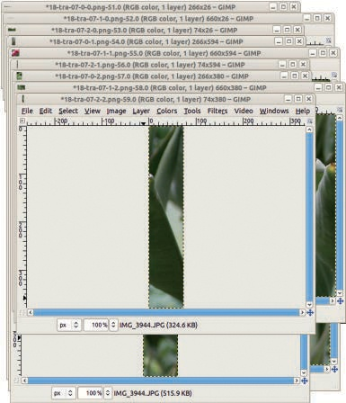

图 16-9。应用 Guillotine 后的结果

图 16-10。中央矩形

## 调整图像大小

图像的*画布*是完整的可见区域，这个区域可能会超出图像窗口可见的部分，尤其是在缩放因子较高时。相反，窗口可能会显示画布外的区域，这些区域通常表现为中性色。图层通常与画布大小相同，但不一定；图层可以小于画布，或者图层的部分区域可以超出画布。当图层大于画布时，超出画布的区域不可见，但它们仍然存在并且可以被移入视图中。

选择**图像: 图像 > 画布大小**会弹出如图 16-11 所示的对话框。我们打破了链接宽度和高度字段的链，并将这两个值减少，因此新的画布比原始画布小，并且比例不同。在预览中，我们移动了图像，使花朵占主导地位。新画布的边界在预览中清晰可见。你也可以增加画布大小，并按下**居中**按钮将图像放置在新画布的中心。

如果图像包含多个图层，你可以通过**设置图像画布大小**对话框底部的**重新调整图层**下拉菜单指定如何处理这些图层，具体如图 16-12 所示。可选项如下：

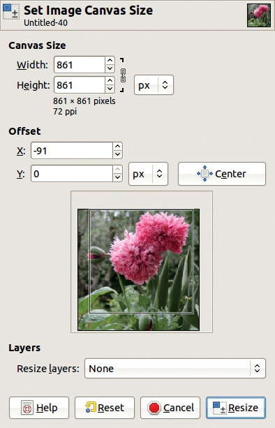

图 16-11. 设置图像画布大小对话框

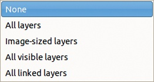

图 16-12. 调整图层大小

+   **无**：保持图层不变。

+   **所有图层**：将所有图层调整为画布大小。

+   **图像大小图层**：仅调整与原始画布大小相同的图层。

+   **所有可见图层**：仅调整那些可见性眼睛图标被勾选的图层。

+   **所有链接图层**：仅调整那些链接图标被勾选的图层。

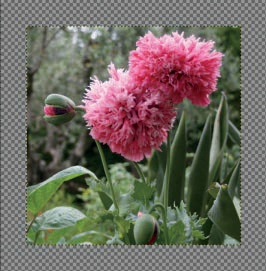

图 16-13. 画布大小已增加。

如果你增加了画布大小，但没有调整任何图层的大小，则会创建一个或多个没有数据的区域。这些区域会显示为透明，如图 16-13 所示。空白区域无法使用任何 GIMP 工具进行编辑，因为该区域没有图层。要使空白区域可用，必须将至少一个图层的大小调整为画布大小，或者在**调整图层**菜单中选择除**无**外的其他选项。

选择**图像: 图像 > 适应画布到图层**以使画布适应所有现有图层。边缘由扩展最远的图层决定。若所有图层都小于画布，则画布大小也可以缩小。

**图像: 图像 > 适应画布到选择**的演示如图 16-14 所示，我们在一些建筑物周围进行了松散选择，结果如图 16-15 所示。

选择**图像: 图像 > 打印尺寸**，会弹出如图 16-16 所示的对话框。此命令不会改变图像或计算任何新的像素值。打印尺寸只会影响图像的打印方式；它仅在某些打印机软件中有效；即使有效，它的参数也会被打印机软件的设置覆盖。此命令对于计算打印尺寸很有用，但不适合用于指定打印尺寸。

在设置图像打印分辨率对话框中，数值是相互关联的：如果更改宽度，X 分辨率会按比例更改，反之亦然。同样，如果更改高度，Y 分辨率也会变化。此外，如果分辨率旁边的链条没有被断开，那么当其中一个值更改时，所有值都会随之变化。提供了几种不同的单位来表示尺寸（英寸、毫米、点和派卡，甚至英尺、码、厘米和米）以及分辨率（每英寸像素、每毫米像素、每点像素、每派卡像素等）。

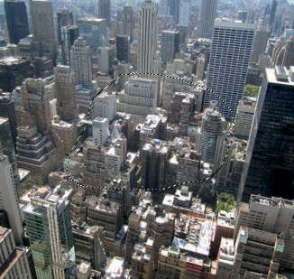

图 16-14. 定义选择区域

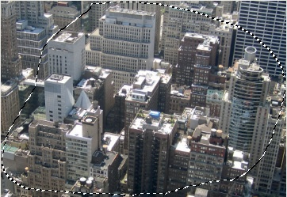

图 16-15. 将画布调整为选择区域

选择**图像: 图像 > 缩放图像**，则会改变整个图像，有时变化非常剧烈。其对话框，如图 16-17 所示，几乎与之前的对话框相同。不过，现在在宽度和高度字段旁边出现了一个链条，这使你可以调整图像比例（见图 16-18）。还需要注意的是，尺寸可以表示为原始大小的百分比。实际的像素大小始终显示在下方。而且新增了一个字段——质量，提供了几个选项。除非你在处理非常大的图像或使用非常旧的计算机，否则始终选择最佳的插值质量，也就是 SINC（LANCZOS3）算法。在调整图像大小时，所有像素必须使用插值算法重新计算。差的算法会导致图像质量显著下降。

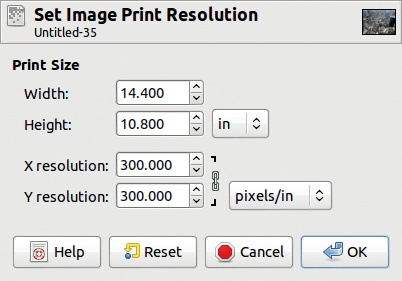

图 16-16. 设置图像打印分辨率对话框

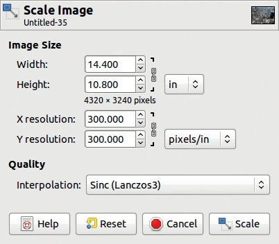

图 16-17. 缩放图像对话框

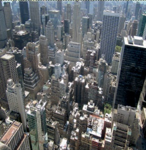

图 16-18. 具有改变比例的缩小图像

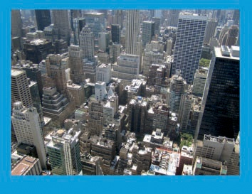

图 16-19. 给图像添加边框

一个好的经验法则是，在处理图像时使用尽可能大的尺寸，并且只有在准备好使用它时才缩小图像。

## 裁剪图像

当图像被调整大小时，其所有内容都被保留，尽管可能会出现质量丧失的情况。而当图像被裁剪时，部分内容会被移除。

**图像：图像 > 裁剪到选择区域**似乎与“调整画布大小以适应选择区域”完全相同。实际上，FIT CANVAS TO SELECTION 不会从图像中移除任何信息，它只是隐藏了某些区域，您可以通过移动图层来显示这些区域，从而改变哪些区域被隐藏。另一方面，CROP TO SELECTION 会移除图像的一部分，因为图层被裁剪到新的画布大小。使用 CROP TO SELECTION 后，图像大小会减小。您可以在图像窗口的状态栏中查看当前的图像大小。

为了演示**图像：图像 > 自动裁剪图像**，我们在示例照片中添加了一个边框，如图 16-19 所示。为此，我们添加了一个透明图层，围绕照片建立了一个矩形选择区域，反转了选择区域，并用亮蓝色填充。图 16-20 显示了图层对话框。AUTOCROP IMAGE 基于当前图层中的框架裁剪图像的所有图层。框架必须是均匀的颜色。我们示例的结果出现在图 16-21 中。

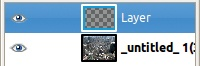

图 16-20。图 16-19 的图层对话框

图 16-21。自动裁剪的图像

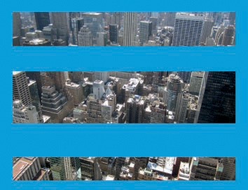

图 16-22。为 Zealous 裁剪准备图像

**图像：图像 > Zealous 裁剪**的工作原理与 AUTOCROP IMAGE 相同，但它可以移除图像的中心区域，以及外部框架。图 16-22 显示了为 ZEALOUS CROP 准备的图像，而图 16-23 显示了结果。

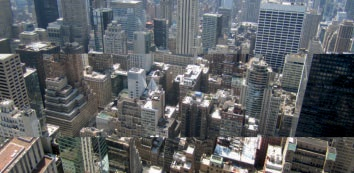

图 16-23。Zealous 裁剪后的效果

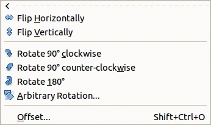

图 16-24。图像：图层 > 变换菜单

图 16-25。包含两层的初始图像

## 变换图层

图 16-24 展示了**图像：图层 > 变换**菜单。我们在图 16-25 中展示了该菜单中每个工具的使用。该图像的上层只包含玫瑰花，下层包含城市背景。

图 16-26. 水平翻转

图 16-27. 垂直翻转

**图像：图层 > 变换**菜单中的前五个条目与**图像：图像 > 变换**菜单中的条目相同，但它们作用于当前图层，而非整个图像。相关条目在图 16-26 到图 16-30 中展示。

任意旋转（ARBITRARY ROTATION）条目应用旋转工具，具体描述请参见旋转工具。

图 16-28. 顺时针旋转 90°

图 16-29. 逆时针旋转 90°

偏移（OFFSET）条目（也可以通过 访问）会弹出图 16-31 所示的对话框。此命令会在不移动图层相对于其他图层的位置的情况下，移动图层中的内容。X 和 Y 偏移可以单独设置，单位为像素或其他多种单位，包括百分比。按下 X/2, Y/2 按钮会自动将这两个字段设置为图层宽度和高度的一半，但在按下按钮后，你可以手动调整这些值。边缘行为（EDGE BEHAVIOR）是一组单选按钮，包含以下三个选项：

图 16-30. 旋转 180°

图 16-31. 偏移图层对话框

+   包裹（WRAP AROUND）：所有从图层一侧移出的像素将从另一侧重新进入图层。图 16-32 展示了按下 X/2, Y/2 按钮并选择此选项后的效果。

+   填充背景色（FILL WITH BACKGROUND COLOR）：图层的空白区域将被填充为当前的背景色。此选项在透明背景的图层上效果不佳，因此未显示。

    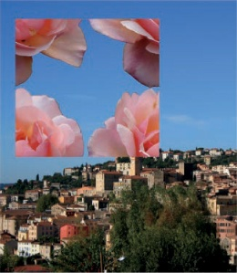

    图 16-32. 通过 x/2, y/2 偏移并使用环绕

    

    图 16-33. 通过 y/2 偏移并使透明

+   使透明：图层空出的部分填充为透明。图 16-33 展示了垂直偏移 y/2 且没有水平偏移的结果。

# 16.2 局部变换

工具箱包含九个局部变换工具，如图 16-34 所示。你也可以在**图像: 工具 > 变换工具**菜单中找到这些工具，该菜单在图 16-35 中展示。*局部变换*仅对图像或图层中的对象或区域起作用。还有这些工具的键盘快捷键——以及工具箱中几乎所有其他工具的快捷键。我们在介绍每个工具时，会展示工具箱图标、键盘快捷键和工具指针。

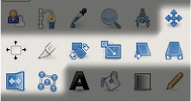

图 16-34. 工具箱中的变换工具

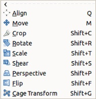

图 16-35. 图像: 工具 > 变换工具菜单

## 共享属性

**图像: 工具 > 变换工具**菜单中的所有工具（除了对齐和裁剪工具）作用于当前图层、当前选择或当前路径，但不能同时作用于多个图层。图 16-36 展示了移动工具的选项。顶部一排按钮让你决定工具是作用于当前图层、当前选择（而不是选择的图层内容），还是当前路径。实际上，这些按钮是使用**图像: 工具 > 变换工具**菜单中的工具时，切换图层、选择和路径的唯一方式。你在每个工具的单独选项中做出选择，并且这个选择不会传播到其他变换工具。但对于特定工具，参数的更改会保持不变，直到你重新启动 GIMP。因此，如果你长时间使用 GIMP 并更改了某个变换工具的设置，请在再次使用该工具之前检查设置。图 16-37 展示了移动当前选择的结果（该选择是通过**图像: 图层 > 透明度 > 选择到 Alpha**创建的）。移动的是选择区域，而不是其内容。

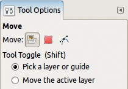

图 16-36. 移动工具选项

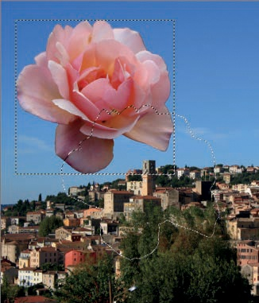

图 16-37. 移动选择区域

旋转、缩放、剪切和透视工具共享同一组选项。虽然图 16-38 中显示的是旋转工具的选项，但唯一的区别是对话框顶部显示的名称是粗体，并且在某些情况下，底部会有一个复选框，稍后将讨论。在本节中，我们将依次查看这些选项。

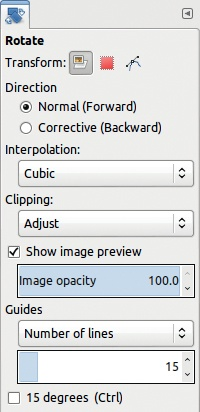

图 16-38. 旋转工具选项

DIRECTION 可以是 NORMAL（正向），此时图像相对于画布移动，或者是 CORRECTIVE（反向），这会导致网格相对于图像移动。CORRECTIVE（反向）选项对于修正图像中的物体变形效果非常有效，例如扭曲的透视。使用此选项时，将网格与扭曲的物体对齐，就像我们在透视工具中所做的那样。

INTERPOLATION 菜单包含四种可能的算法，用于从旧像素计算新像素。虽然 NONE 是最快的，但结果非常差，如图 16-39 所示。其他三种方法表现得相当好，但最耗费处理器的 SINC（LANCZOS3）产生的效果最佳。除非你的电脑极其慢或处理的图像非常大，否则请选择 SINC（LANCZOS3）。

CLIPPING 菜单（图 16-40）指定如果图层在变换后变大，应该怎么处理。

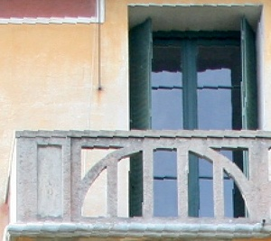

图 16-39. 使用 None 作为插值算法

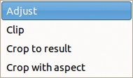

图 16-40. 裁剪菜单

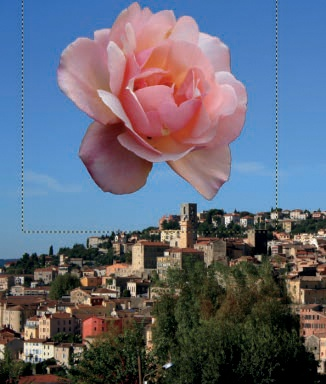

图 16-41. 使用 Adjust 裁剪

+   ADJUST 会将图层扩大至其新内容的大小，如图 16-41 所示。如果图层不再适合画布，请使用**图像：图像 > 适应画布到图层**来扩大画布。

    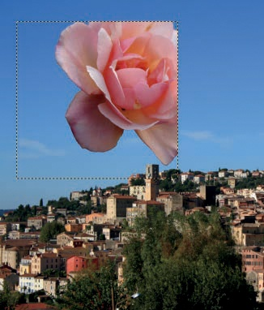

    图 16-42. 使用 Clip 裁剪

    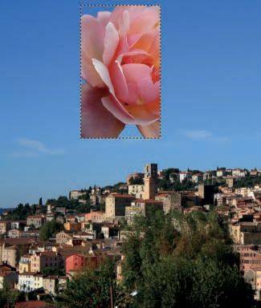

    图 16-43. 裁剪到结果

+   CLIP 会将图层的内容裁剪至图层的边界，如图 16-42 所示。

+   另外两个选项，CROP TO RESULT 和 CROP WITH ASPECT，分别类似于 CLIP 和 ADJUST，但它们会去除任何无内容的边框，这种情况可能会在变换后出现。图 16-43 展示了 CROP TO RESULT 的情况。

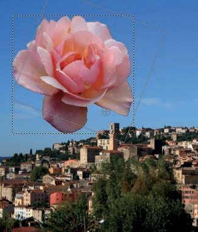

图 16-44. 通过轮廓进行预览

图 16-45. 通过图像本身进行预览

如果取消勾选 SHOW IMAGE PREVIEW 按钮，当你点击并拖动图像进行变换时，变换后的部分图像将不会显示，屏幕上只会看到轮廓或一些引导线。图 16-44 中，按钮未勾选，且没有引导线。

如果勾选了 SHOW IMAGE PREVIEW 按钮，你可以选择图像预览的透明度，这对于需要非常精确的变换时非常有帮助。例如，在图 16-45 中，预览的透明度设置为 50%。

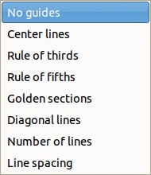

图 16-46. 引导菜单

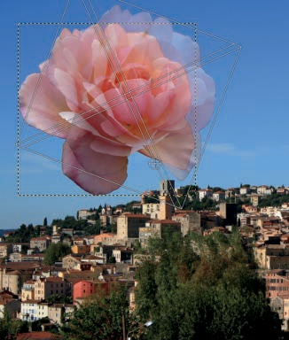

图 16-47. 通过图像和对角线进行预览

GUIDES 菜单(图 16-46)提供了多个选项：

+   当选择了 NO GUIDES 时，在变换进行时只会显示图层的轮廓。图像保持不变，直到你接受变换。请参见图 16-44 和图 16-45。

+   接下来的五个选项与矩形选择工具相同，详见矩形选择工具。例如，图 16-47 展示了带有图像预览的对角线情况。

    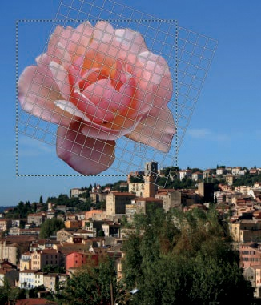

    图 16-48. 通过网格进行预览，但没有图像

    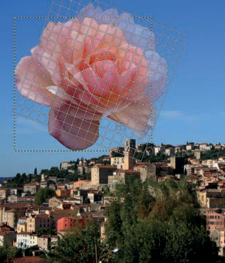

    图 16-49. 通过图像和网格进行预览

+   当选择了行距（LINE SPACING）时，图层上会显示一个网格，如图 16-48 所示。你可以通过使用选项对话框底部的字段来更改网格线的间距，如图 16-38 所示。

你可以将辅助线和可视图像预览结合使用，如图 16-49 所示。

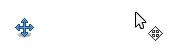

图 16-50. 移动工具的图标和指针

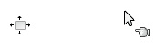

图 16-51. 对齐工具的图标和指针

## 移动工具

移动工具是最简单的变换工具。通过按下  或点击工具箱中的图标来选择它。其图标和指针如图 16-50 所示。选择移动工具后，点击并拖动图层、选择区域或路径进行移动。在工具选项中（见图 16-36），你可以选择移动当前激活的图层、选择区域或路径，或者通过点击对象来选择要移动的对象。在本例中，我们想要移动玫瑰，因此我们特别小心地点击了一个不透明的像素，以避免意外移动到底层图层。如果图像有辅助线，可以通过点击靠近它的地方来移动它（辅助线会变红）。通过按下  键，可以在这两种选项之间切换。

如果存在选择区域，但处于图层移动模式（LAYER MOVE），则可以通过按下  临时切换到选择移动模式（SELECTION MOVE），然后再进行移动。

使用键盘上的箭头键可以移动当前激活的图层或路径。每次按下箭头键，图层或路径会在相应方向上移动 1 个像素。如果按住 ，每次按键会将图层或路径移动 50 个像素。

## 对齐工具

通过按下  或点击工具箱中的图标来选择对齐工具。其图标和指针如图 16-51 所示，其选项对话框如图 16-52 所示。在这种情况下，选项对话框中的按钮实际上用于操作该工具。

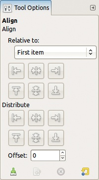

图 16-52. 对齐工具选项

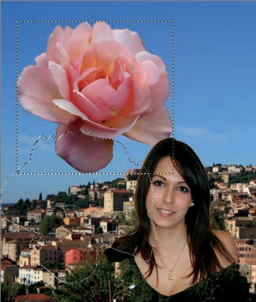

图 16-53. 一个包含三层和选择的图像

我们使用了图 16-53 中的图像来演示对齐工具。该图像的图层对话框见图 16-54。中间层的轮廓（包含玫瑰花）在图 16-53 中可见。我们使用剪刀选择工具选择了顶层中的肖像，然后将其剪切并粘贴为具有透明背景的新图层。图像中围绕玫瑰并向下移动的选择区域也存在。

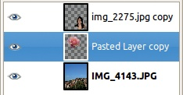

图 16-54. 图 16-53 的图层对话框

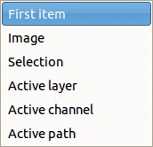

图 16-55. 相对对齐菜单

当你选择对齐工具时，鼠标指针会变成手形。点击图像选择你要移动的对象（即图层），称为*源对象*。若要选择多个对象，可以点击第一个对象后，按住 Shift 键再点击其他对象，或点击并拖动以围住所有对象。所选对象会在包围矩形的角落显示小方块。

当你至少选择一个对象时，选项对话框中的按钮将变为可用。选择对齐的*目标*，这是所选对象将对齐的对象。六个选项位于“相对对齐”菜单中，详见图 16-55：

+   第一个项目：目标是第一个选中的对象。如果只选中一个对象，或者如果选择的是矩形，则此选项与 IMAGE 相同。

+   IMAGE：目标是图像本身。在图 16-56 中，我们选择了肖像层，并点击了下排的中间按钮。

+   选择：目标是围绕你的选择的一个不可见矩形，其高度和宽度完全与选择区域匹配。例如，在图 16-57 中，我们点击了两行按钮中的中间按钮，将肖像居中对齐到我们选择的区域——玫瑰的轮廓，这在图 16-53 中可以看到。

    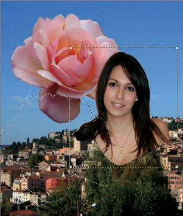

    图 16-56. 将源对齐到图像的中间

    

    图 16-57. 将源对齐至选择区域的中间和中心

+   活跃图层：这个概念很简单，如图 16-58 所示。我们再次点击了两中间按钮，将肖像定位在玫瑰的中心。

    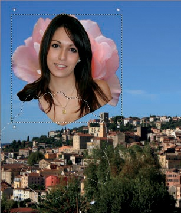

    图 16-58. 将源对齐至活跃图层的中间和中心

    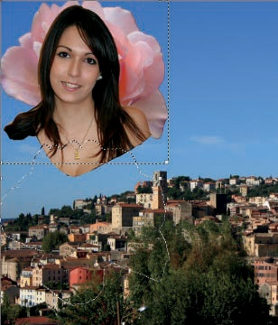

    图 16-59. 将两层图像对齐至图像的左边和上边缘

+   活跃通道：此选项允许你对齐到之前在通道中保存的选择。

+   活跃路径：此选项允许你对齐到一个路径。

第二组按钮，标记为分布（DISTRIBUTE），根据偏移（OFFSET）字段设置进行操作。在图 16-59 中，我们选择了两层上层作为源，并将它们沿着图像的左边和上边缘对齐。在图 16-60 中，我们做了相同的操作，但使用了分布按钮，并设置了 100 像素的偏移量。

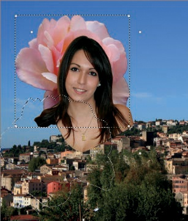

图 16-60. 使用与图 16-59 相同的选项，但偏移量为 100 像素

## 裁剪工具

要选择裁剪工具，按  或点击工具箱中的图标。其图标和指针如图 16-61 所示，选项如图 16-62 所示。此工具删除选定矩形外的图像部分。创建矩形的方式与矩形选择工具相同。通常，所选区域会被高亮显示，如图 16-63 所示。当你对选择区域满意时，点击区域内部或按  来裁剪图像。

裁剪工具有几个选项。

+   **仅当前图层**复选框允许你仅裁剪当前图层，而不是整个图像。选择区域会自动停留在图层边界上，如图 16-64 所示。

+   **允许增长**复选框允许选择区域超出图像或图层的边界。例如，在图 16-65 中，**允许增长**和**仅当前图层**复选框都被选中。图 16-66 显示了结果。注意，花朵图层的边界根据选择区域被扩展。

    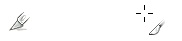

    图 16-61. 裁剪工具的图标和指针

    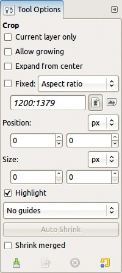

    图 16-62. 裁剪工具选项

+   **从中心扩展**复选框与选择工具的行为类似：第一次点击会成为选择区域的中心，而不是角落。但请注意，你无法像选择工具那样使用  键来切换此选项。

+   所有其他字段—**固定**、**位置**、**大小**、**高亮**、**自动缩小**、**缩小合并**以及使用引导线—与矩形选择工具中的操作相同，详细说明见矩形选择工具。

图 16-63. 选择裁剪矩形

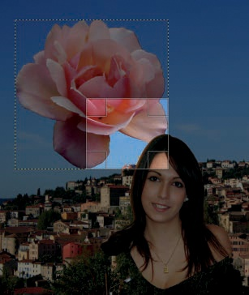

图 16-64. 仅裁剪当前图层

## 旋转工具

要选择旋转工具，按下 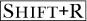 或点击工具箱中的图标。其图标和指针出现在图 16-67 中。请注意，你也可以通过**图像：图层 > 变换 > 任意旋转**访问旋转工具。几乎所有选项都在之前讨论过（参见图 16-38）。只有一个选项是特定于此工具的：15 度复选框，你可以通过按下  来切换此选项。激活时，该选项会强制旋转角度为 15°的倍数。

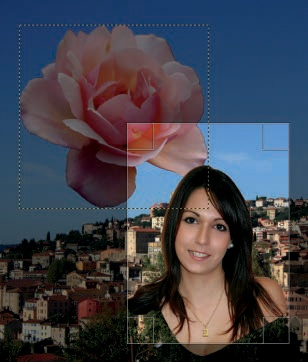

图 16-65. 使用“允许活动图层扩展”裁剪当前图层

图 16-66. 图 16-65 的结果

选择工具后，点击图像。图 16-68 中所示的对话框弹出。旋转中心最初是被旋转物体的中心，但你可以通过点击并拖动来更改它。你可以通过三种方式来改变角度：拖动图像窗口中的物体；移动对话框中的滑块；或者通过输入数字、使用鼠标滚轮或点击小箭头来调整角度字段中的数字。点击“旋转”按钮来完成旋转。

图 16-67. 旋转工具的图标和指针

图 16-68. 旋转对话框

图 16-69. 正在进行中的旋转

如果有选区处于活动状态，则只有选区内的内容会受到变换工具的影响。图 16-69 显示了一个正在进行的旋转：只有选区内的肖像图层区域被旋转。结果显示在图 16-70 中。肖像图层中的选中像素现在成为浮动选区。

图 16-70. 旋转的结果

图 16-71. 缩放工具的图标和指针

## 缩放工具

按下或点击工具箱中的图标来选择缩放工具。其图标和指针如图 16-71 所示。虽然缩放工具看起来与**图像：图层 > 缩放图层**功能相同，但它实际上有很大的不同。**图像：图层 > 缩放图层**作用于整个图像，而不是选区或路径，而且没有预览或纠正模式选项。

图 16-72 展示了使用此工具进行缩放的过程。当前图层是肖像图层，已激活选区。预览是图像，正在缩放的区域的透明度设置为 60%。缩放区域的中心标有一个圆圈和一个十字，并且你可以通过点击并拖动来移动它。按下键来缩放选区，缩放后的选区将变成浮动选区。

图 16-72. 缩放选区

图 16-73. 剪切工具图标和指针

缩放工具非常多功能。试试以下操作：

+   点击并拖动正在缩放区域中心的圆圈，将其在图像中移动，类似于移动工具的操作。

+   点击并拖动选区或图层的其他部分以调整缩放量。

+   通过在工具选项中勾选复选框，或在工具对话框中点击链条，或者按下键来保持当前的长宽比。如果拖动边缘的控制点，只会改变一个维度，且保持长宽比不变。

## 剪切工具

按下或点击工具箱中的图标来选择剪切工具。其图标和指针如图 16-73 所示。它的选项与图 16-38 中的选项相同。无法同时进行垂直和水平方向的剪切。工具根据第一次点击后拖动鼠标的方向来确定剪切的方向。要剪切，点击并拖动选区。图 16-74 展示了正在进行的变换。预览是完全不透明的，但在图中，被剪切图层的透明度降低到了 50%。该工具作用于的选区会成为当前选区，之前的任何选区都会被取消。

图 16-74. 剪切图层

图 16-75. 透视工具的图标和指针

## 透视工具

要选择透视工具，按下  或点击工具箱中的图标。其图标和指针如图 16-75 所示。其选项与图 16-38 中展示的相同。

图 16-76 显示了透视工具应用于稍微倾斜的透视图像。在这种类型的调整中，矫正方向模式效果最佳，因为你可以将网格的垂直和水平方向与建筑物的线条对齐。

图 16-76. 对图像应用透视

图 16-77. 转换结果如图 16-76 所示

结果如图 16-77 所示。虽然调整有所帮助，但图像不再是矩形，并且相机的镜头畸变可见。

## 翻转工具

你可以通过按下  或点击工具箱中的图标来选择翻转工具。其图标和指针如图 16-78 所示。你可以选择水平或垂直翻转（ 在这两者之间切换），以及是否翻转当前层、选区或路径。与以前的工具一样，如果当前层中存在选区，翻转图层时只会翻转选区中的部分。图 16-79 显示了翻转后的玫瑰图层部分图像。与其他转换工具一样，一个浮动选区被创建，以包含翻转后的像素。

图 16-78. 翻转工具的图标和指针

图 16-79. 水平翻转图层的选中部分

Flip 工具与**图像：图层 > 变换**中的工具唯一的区别是，这个工具允许你翻转选择区域或路径，而不仅仅是图层或图层的一部分。

## Cage Transform 工具

Cage Transform 工具在 GIMP 2.8 版本中加入。它的图标和指针如图 16-80 所示，选项如图 16-81 所示。

使用 Cage Transform 工具来扭曲对象。一个*围栏*是围绕图像中目标部分构建的多边形。通过移动围栏的角点来扭曲其中的对象。我们的示例图有两个图层，一个包含城市，另一个包含玫瑰。选择玫瑰图层，并使用**图像：图层 > 图层大小与图像一致**将其放大到与图像相同的大小。

图 16-80. Cage Transform 工具的图标和指针

图 16-81. Cage Transform 工具选项

图 16-82. 构建围栏

选择 Cage Transform 工具，并确保第一个选项“创建或调整围栏”已被选中。通过围绕玫瑰点击来构建围栏。你可以在放置每个点后移动它，但不能删除点，而且只能移动最近放置的点。但一旦围栏关闭并且 GIMP 运行了一会儿，你可以返回并添加点或移动现有点。此工具没有撤销功能，所以如果犯错，你必须通过临时切换到另一个工具来重新开始。当你满意时，通过点击第一个点来完成围栏。图 16-82 显示了围栏的构建过程。

图 16-83. 变形围栏

一旦围栏完成，两个连续的画布内消息会短暂出现，表示 GIMP 正在处理。然后，选项对话框会发生变化，默认选择了“变形围栏以变形图像”。不过，你可以将其更改回“创建或调整围栏”。这允许你通过点击并拖动在一个段落中添加一个点，或者通过点击该点并按下来删除一个点。之后，你可以点击“变形围栏以变形图像”进入下一步。

现在你可以移动笼子的点来变形玫瑰。但涉及的计算需要一些时间，你必须等待变换完成后才能移动下一个点。图 16-83 显示了移动笼子底部点后的结果。要完成变换，请按下！。要取消变换，请切换到另一个工具。

当正确使用时，这个工具可以生成平滑、自然的变换。它在多层图像上效果最佳，尤其是包含物体和透明背景像素的图层，就像我们刚才变换的玫瑰一样。但这个工具在处理图像中的物体时表现较差，因为笼子的边界非常尖锐且可见，而笼子变换仅限于笼子内部。图 16-84（左）显示了在图像中央建立一个矩形笼子并放大它的结果。缩小笼子会导致空的几何空间。如果勾选“用纯色填充笼子的原始位置”选项，这些空白区域会被第一个点的颜色填充，如图 16-84（右）所示。如果取消勾选该选项，这些空白区域则会显示图像中相应区域的原始内容。

图 16-84. 笼子变换工具的错误使用（左）；从第一个点开始填充（右）
