# 第十七章 滤镜

*滤镜* 是 GIMP 中用来描述各种工具的名称：GIMP 自带超过 120 种滤镜。有些滤镜对当前图层应用简单的转换，而另一些则对整个图像进行处理密集型的修改，有时甚至会生成一张新图像。请注意，*滤镜* 这个词在第七章中以更具体的方式使用。本章中描述的某些滤镜符合这种含义，例如“锐化蒙版”和“卷积矩阵”。其他滤镜则仅仅因为它们可以通过 **图像：滤镜** 菜单访问，所以被称为滤镜。

在本章中，我们将介绍几乎所有在 **图像：滤镜** 菜单中找到的条目。它们除了在同一个菜单中之外，几乎没有什么共同点。在努力寻找一种逻辑方式组织本章内容未果后，我们决定直接按照菜单的顺序来讲解。GIMP 开发者采用了他们自己的逻辑来设计这个顺序，我们认为他们的顺序和我们想出来的任何一种都差不多。不过，我们会省略以下条目：

+   WEB 部分在第八章中介绍。

+   动画部分在第十八章中介绍，同时也会涉及 GAP 插件集所添加的其他滤镜。

+   PYTHON-FU 和 SCRIPT-FU 处理脚本，并在第二十一章中介绍。

+   ALPHA TO LOGO 包含了在 **图像：文件 > 创建 > 标志** 菜单中出现的部分标志创建工具。它们使用当前图像的 Alpha 通道作为标志的来源，而 LOGOS 子菜单中的工具则作用于文本。如第四章所述，本书不会介绍这些工具，因为它们是自解释的。

我们还会省略以下 10 个滤镜，因为我们认为它们已经不再对任何人有用：Erase Every Other Row、Video、Xach-Effect、Blinds、Predator、Slide、Filmstrip、Stencil Carve、Stencil Chrome 和 Fog。如果你真的需要其中之一，你可以在本书的配套网站上找到它们的描述。

# 17.1 常见属性

在本节中，我们介绍所有滤镜的共同属性，以避免在各个单独描述中重复内容。

滤镜菜单以四个通用条目开始。前两个条目允许你快速重复或重新显示上次使用的滤镜。

第一个条目（）会使用完全相同的参数重复上一个滤镜。如果你正在做一些重复性的工作，需要多次应用同一个滤镜，这个功能非常方便。然而，重要的是要注意，这个命令也会重复上次使用的插件，这个插件可能并非来自“滤镜”菜单。例如，按下  会重复 **图像：颜色 > 着色**，但不会重复 **图像：颜色 > 去饱和**。着色是一个插件，而去饱和是 GIMP 自带的功能。

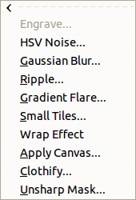

图 17-1. 图像：滤镜 > 最近使用的菜单

**图像：滤镜**菜单中的第二个条目 (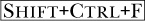) 允许你重新显示之前滤镜的对话框，并使用不同的参数重复应用该滤镜。要查看使用相同滤镜但不同参数的效果，先应用滤镜，然后按  撤销更改，再按  选择新参数。

第三个条目，最近使用的，提供了一种方便的方式来访问最近使用的 10 个滤镜。如图 17-1 所示，如果某些滤镜无法应用于当前图像，它们可能会被灰色显示。

第四个条目，重置所有滤镜，允许你将所有滤镜恢复到初始状态。大多数滤镜至少有一个，通常有多个参数，每个参数都有默认（初始）值。如果你更改了这些参数中的任何一个，变化将保持，直到你退出 GIMP 或再次更改该参数。这通常是方便的，但在某些情况下，你可能希望将所有滤镜的参数恢复为默认值。重新启动 GIMP 也会将参数恢复到默认值。

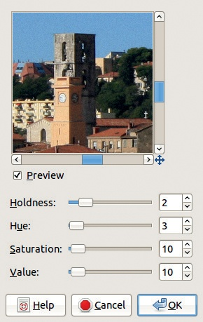

图 17-2. 滤镜对话框示例

图 17-2 显示了 HSV 噪声滤镜的对话框，里面包含三个按钮，这些按钮在所有滤镜对话框中都可以看到：

+   帮助会弹出 GIMP 帮助文档，提供滤镜的帮助信息，如 9.6 GIMP 帮助系统所述。

+   取消关闭滤镜对话框而不应用任何更改，但滤镜菜单中的前三个条目仍会指向该滤镜，即使它被取消了。

+   确定应用当前参数值的滤镜。一些滤镜应用速度较快，而其他滤镜则会进行许多复杂的更改，处理时间较长。按  可以撤销任何滤镜。

许多滤镜对话框还包含一个预览，默认情况下预览通常较小。有些对话框允许放大，但即使在最大放大时，预览仍然较小。幸运的是，当你放大对话框窗口时，预览也会被放大。预览是方形的，或与图像保持相同的比例，并且在调整窗口大小时，预览的比例始终保持不变。要放大预览，点击并拖动对话框的一个角。如果你扩展对话框的某一边，对话框的比例会发生变化，但预览会保持不变。

接下来的大部分滤镜描述都伴随至少一个示例。大多数示例是使用关联对话框图中的设置创建的，因此我们通常直接展示示例，而不提及设置，以防这本冗长的章节变成另一本书。

# 17.2 模糊滤镜

模糊菜单有六个选项。除了第一个选项外，其他选项都以省略号结尾，这表示这些滤镜会弹出一个对话框以设置参数，然后才会作用于图像。

## 模糊

模糊滤镜没有参数并且立即生效。它通过计算每个像素及其相邻像素的平均值来工作。在大图像上，它的效果几乎不可察觉。图 17-3 只显示了照片的一小部分，经过放大以使效果可见。图 17-4 显示了在使用模糊滤镜三次后的同一图像。这是一种相当笨拙的调整图像模糊量的方式，但它非常快速。

图 17-3. 初始图像

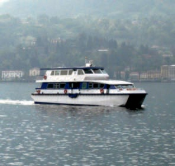

图 17-4. 使用模糊三次后的效果

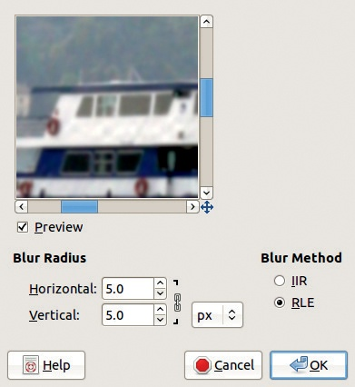

图 17-5. 高斯模糊对话框

## 高斯模糊

高斯模糊是最有用的模糊滤镜。像许多滤镜对话框一样，它的对话框（见图 17-5）包含预览和一个按钮，用于切换预览的开启与关闭，默认情况下是选中的。预览的图像比实际图像小，但你可以滚动或放大它。

调整模糊半径决定了效果的强度。模糊半径是包含用于计算新像素值的像素的圆的半径（见第七章）。你可以更改单位（像素或实际距离），但结果取决于图像的大小，因此在选择模糊半径时请参考预览。对于一个 600 × 400 的图像，半径为 10 会导致可见的模糊，但在 3000 × 4000 的图像上几乎没有可察觉的效果。

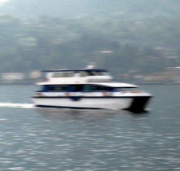

图 17-6. 图 17-3 经过高斯模糊后的效果

你可以打破水平和垂直半径之间的联系，选择不同的值。效果类似于运动模糊，如图 17-6 所示，在该图中我们选择了 30 像素的水平半径和 0 像素的垂直半径。

有两种模糊方法，可以通过对话框右侧的单选按钮进行选择：

+   IIR（无限脉冲响应）最适用于照片和大半径值。

+   RLE（行程长度编码）最适合计算机生成的图像或具有大面积相同强度的图像。

通常，这些之间的差异很小，你可以安全地选择其中任何一个。

## 运动模糊

运动模糊滤镜实际上是三个不同的滤镜，具有不同的属性。我们演示的照片如图 17-7 所示。运动模糊滤镜对话框（参见图 17-8）包含以下内容：

+   类似于高斯模糊滤镜对话框的预览。

    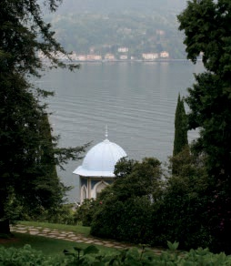

    图 17-7. 初始图像

    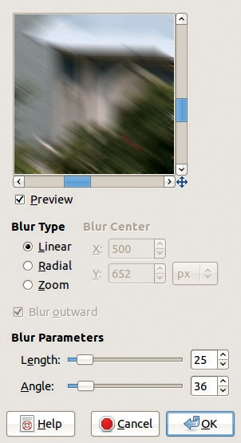

    图 17-8. 运动模糊对话框

+   三种模糊类型：**线性**、**径向**和**缩放**。

+   根据模糊类型，可能会有以下参数：对于线性类型，可用**长度**和**角度**；对于径向类型，可用**模糊中心**和**角度**；对于缩放类型，可用**模糊中心**！和**长度**。

模糊中心是通过数字设置的，这并不直观。默认值为图像的中心。选择特定位置作为新中心的最简单方法是将鼠标悬停在新中心上，并注意指针坐标，这些坐标会出现在图像窗口的底部栏中。然后，你可以将相关坐标输入到对话框中的字段。

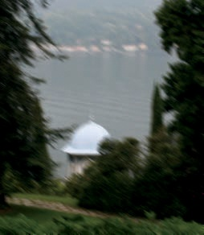

图 17-9. 线性运动模糊

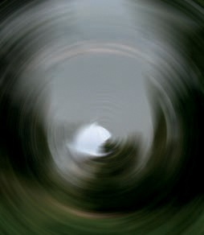

图 17-10. 径向运动模糊

线性运动模糊看起来是将像素沿由角度和长度参数确定的方向移动。这模拟了照片中的运动效果（参见图 17-9）。

径向运动模糊模拟围绕给定中心和给定角度的旋转运动（参见图 17-10）。该效果对处理器的要求较高，因此运行时间较长。

当应用缩放运动模糊时，主体看起来是向相机移动（如果勾选了**BLUR OUTWARD**）或远离相机（如果未勾选**BLUR OUTWARD**）。模糊中心决定了图像清晰的位置，长度决定了模拟运动的强度。此种模糊类型也需要较长时间，但比径向运动模糊要短（参见图 17-11）。

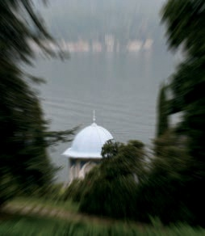

图 17-11. 缩放运动模糊

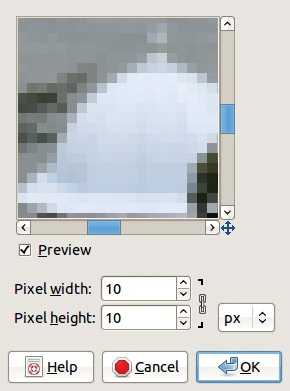

图 17-12. Pixelize 对话框

## Pixelize

Pixelize 滤镜产生的效果通常用于模糊未授权摄影师使用其肖像的人的面部。这种滤镜将图像划分为相等的矩形，每个矩形填充了它所替代的所有像素的平均值。在对话框中，参见图 17-12，你可以选择矩形的大小。默认情况下，它们是正方形的，但你可以断开链条使它们成为矩形。图 17-13 显示了使用 30 × 30 像素正方形应用此滤镜的结果。

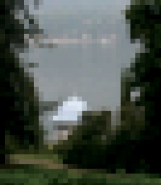

图 17-13. 应用 Pixelize 后

图 17-14. 初始图片

## 选择性高斯模糊

选择性高斯模糊按需选择性地应用高斯模糊（正如你可能已经猜到的那样）。它不是对所有像素应用模糊，而是仅在像素与其邻近像素之间的值差异小于 MAX.DELTA 值时才对像素应用模糊。

我们演示了图 17-14 中显示的照片，之前我们在第二章中也使用过。选择性高斯模糊滤镜的设计目的是使背景比前景模糊更多。我们选择了图 17-15 中显示的参数值，以夸大效果，使其更容易观察。在结果中，参见图 17-16，猫咪显得过于模糊，但它确实从背景中脱颖而出。

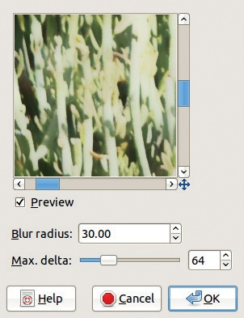

图 17-15. 选择性高斯模糊对话框

图 17-16. 应用选择性高斯模糊后

## Tileable Blur

Tileable Blur 对于从单张图像构建可拼接的设计非常有用，方法是使用**图像：滤镜 > 映射 > 小图块**。这个滤镜模糊图像，使得左侧渐变到右侧，顶部渐变到底部。

在可平铺模糊对话框中，如图 17-17 所示，您可以选择模糊的半径和算法。我们选择了一个较大的半径来夸大效果。结果，如图 17-18 所示，效果具有一定的可平铺性，如图 17-19 所示。

可平铺模糊影响整个图像。为避免这种情况，您可以从图像中复制一个中心矩形，并将其放置在一个新的上层中，然后将可平铺模糊滤镜应用于背景层。合并图层后，应用小瓦片滤镜。结果如图 17-20 所示。如果我们羽化顶部层外缘的边缘，模糊边界会显得更加自然。

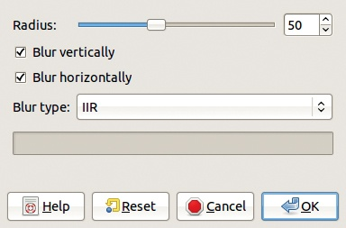

图 17-17。可平铺模糊对话框

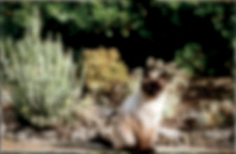

图 17-18。应用可平铺模糊后的效果

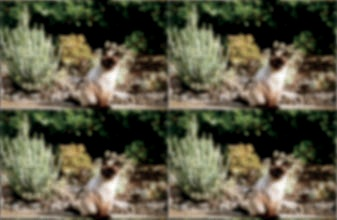

图 17-19。应用图像：滤镜 > 映射 > 小瓦片后的效果

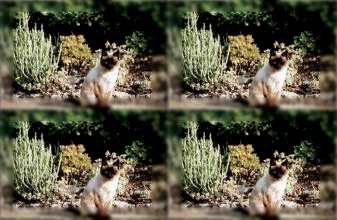

图 17-20。添加未模糊的原始图像矩形副本后的效果

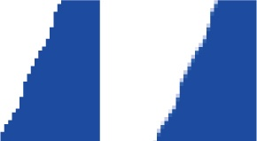

图 17-21。初始图像与应用抗锯齿后的效果

# 17.3 增强滤镜

增强菜单中有八个选项。与模糊菜单类似，第一个选项没有对话框。

## 抗锯齿

抗锯齿滤镜可以用来为图像中的边缘添加抗锯齿效果。

图 17-21（左）显示了用铅笔工具绘制的一条线，已放大到 800%。图 17-21（右）显示了应用抗锯齿后的同一条线。滤镜立即生效，无需任何对话框。

## 去交错

视频摄像机通过捕捉大量的图像来模拟运动，通常是每秒 25 或 30 帧。更准确地说，视频摄像机每秒捕捉 50 或 60 个半帧。这些半帧称为*场*，由水平线组成，线与线之间的间距等于它们的高度。一个帧是通过*交错*两个场从上到下构建的。首先取自第一个场的一行，然后取自第二个场的一行，依此类推。

在一帧中交错的两个场并不是在完全相同的时刻捕捉到的，如果主体快速移动，这可能会导致一种奇怪的效果。此效果在图 17-22 中显示。

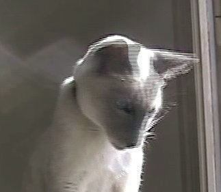

图 17-22. 初始图像

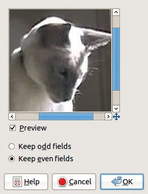

图 17-23. 去交错对话框

去交错滤镜移除一半扫描线，无论是奇数线还是偶数线，并通过邻近行之间的插值来替代每一行。其对话框（见图 17-23）只包含选择奇数场和偶数场的选项。

如果你对比图 17-24 和图 17-25，你可以清楚地看到猫头的运动。

## 去斑

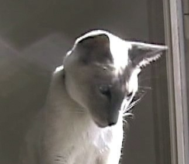

图 17-24. 去交错，只使用奇数场

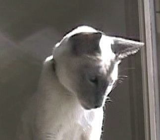

图 17-25. 去交错，只使用偶数场

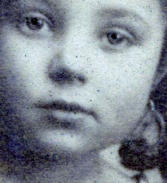

图 17-26. 初始图像

去斑滤镜移除图像中的点或划痕，可以纠正扫描的杂志页面上的斑点状外观。然而，它是自动工作的，可能会意外去除图像中的细节，因此使用时需要小心。

图 17-26 中显示的照片因时间久远而布满小黑点。去斑滤镜对话框（见图 17-27）包含预览和以下参数：

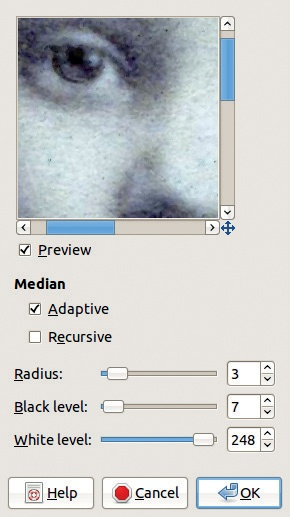

图 17-27. 去斑对话框

+   ADAPTIVE（自适应）模式根据直方图计算半径。如果未勾选，则使用相应的滑块手动设置半径（见下文的 RADIUS）。

+   RECURSIVE（递归）模式使滤镜在图像上反复作用，从而增强效果。

+   RADIUS（半径）仅在非自适应模式下相关。它指定每个像素周围区域的大小，从 1（对应 3 × 3）到 20（对应 41 × 41）。较大的半径会混合周围的颜色，并增加滤镜的处理时间。

+   BLACK LEVEL（黑色级别）设置黑暗像素被去除的阈值。

+   WHITE LEVEL（白色级别）设置光亮像素被去除的阈值。

图 17-28 显示了在 图 17-26 上应用 Despeckle（去噪）自适应模式的结果。图 17-29 和 图 17-30 显示了非自适应模式的结果，第一张图使用半径为 2，第二张图使用半径为 7。

图 17-28. 应用 Despeckle（去噪）后，使用自适应模式

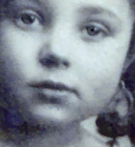

图 17-29. 应用 Despeckle（去噪）后，未使用自适应模式

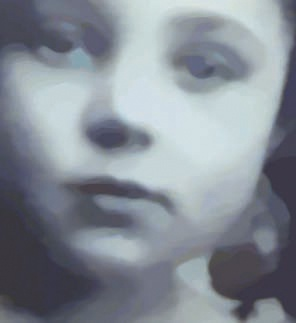

图 17-30. 应用 Despeckle（去噪）后，使用大半径

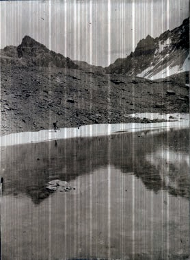

图 17-31. 初始图像

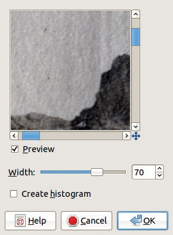

图 17-32. Destripe 对话框

## Destripe

Destripe 用于去除由低质量扫描仪产生的垂直条纹。该滤镜创建一个垂直条纹模式，用以抵消扫描仪产生的条纹。虽然此滤镜可以有效，但选择最佳设置可能具有挑战性。

图 17-31 显示了初始的带条纹图像，图 17-32 显示了滤镜对话框，图 17-33 显示了滤镜效果。唯一的设置是 WIDTH，它指定滤镜的强度。通常不建议使用高值，因为它们往往没有效果，或者更糟糕的是，实际上会产生更多的条纹。选中 CREATE HISTOGRAM 可以将图像替换为用于去除条纹的模式，这个模式可用于创建有趣的纹理。

图 17-33. 应用 Destripe 后

## NL 滤镜

NL（非线性）滤镜具有多种功能。它需要一个没有 Alpha 通道的图层，并且使用一个六边形的像素块来围绕目标像素，而不是大多数滤镜使用的方形像素块。根据模式设置，NL 滤镜可以应用三种变换（见 图 17-34）：

+   ALPHA 裁剪均值在 ALPHA 值较低时平滑图像，而在 ALPHA 值最大时去除噪声。RADIUS 指定效果的强度。

+   OPTIMAL ESTIMATION 使用一种自适应方法来平滑图像，这对于去除彩色图像中的抖动噪声非常有效。ALPHA 指定噪声阈值，超过该阈值时过滤器不起作用，RADIUS 则指定效果的强度。

    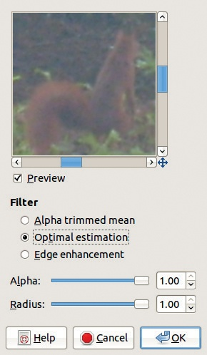

    图 17-34。NL 过滤器对话框

+   EDGE ENHANCEMENT 锐化图像，ALPHA 设置效果的强度，而 RADIUS 控制边缘的宽度。

## 红眼去除

红眼去除是一个自动化工具，用于修正闪光摄影对人眼瞳孔的影响。根据图像的不同，这个过滤器可能效果很好，也可能效果较差。

首先，尝试在图 2-77 中显示的照片上应用这个过滤器。女孩眼睛中的红色并不非常饱和或明亮。当选择该过滤器时，会显示图 17-35 所示的对话框。预览显示，如果使用默认参数，嘴唇和左脸颊会变色。对话框告知我们，“手动选择眼睛可能会改善效果。”

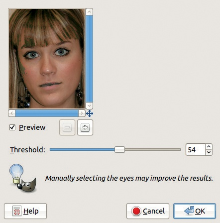

图 17-35。第一次尝试使用红眼去除过滤器

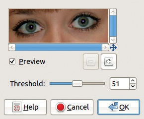

图 17-36。第二次尝试使用红眼去除

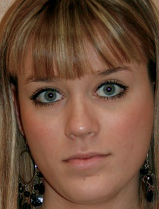

图 17-37。应用红眼去除后的效果

使用自由选择工具大致勾画出眼睛的轮廓，然后再次选择该过滤器。这时，在使用 THRESHOLD 滑块调整后，效果看起来很好。对话框显示在图 17-36 中，效果显示在图 17-37 中。

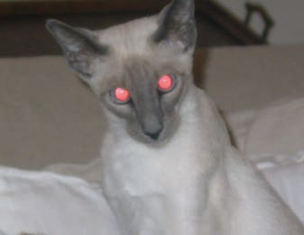

图 17-38。另一个红眼示例

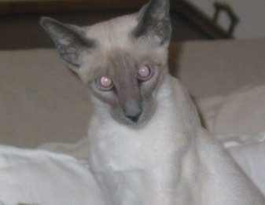

图 17-39。效果相当差

在第二个示例中（见图 17-38），红色非常亮，但不太饱和。在 HSV 模型中，S 值为 48，V 值为 100。由于这些条件，过滤器的效果并不好，如图 17-39 所示。最终图像中，眼睛显得暗淡，鼻梁有红色的色调。

有关去除红眼的更多技巧，请参见更多红眼修正方法。

## 锐化

锐化是锐化蒙版的简化版本，后者是菜单中的下一个滤镜。锐化适用于一些简单任务，例如增强因数码相机或扫描仪中的插值过程导致模糊的照片，或者由于图像被放大或缩小而导致的模糊。在数码照片中，边缘几乎总是略微模糊的，而 GIMP 中的简单锐化滤镜比当前数码相机的内置修正功能效果更好。此滤镜的对话框只有一个参数：清晰度（SHARPNESS）。

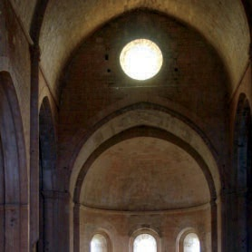

图 17-40. 初始图像

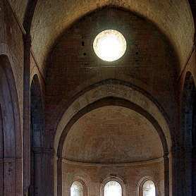

图 17-41. 应用锐化后的效果

图 17-40 是一个需要锐化的照片的好例子。颜色和大小的调整导致了插值，造成了图像非常模糊。图 17-41 展示了使用锐化滤镜，锐化度为 77 时的效果。

## 锐化蒙版

尽管名字有些矛盾，锐化蒙版滤镜实际上是一个非常优秀的锐化工具，提供比锐化滤镜更多的控制。

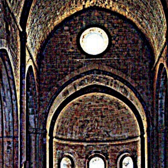

图 17-42. 锐化蒙版的强烈应用

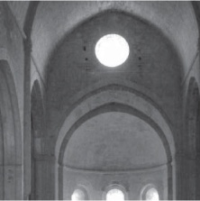

图 17-43. 分解后的值层

该参数允许你调整锐化的程度。请注意，如果锐化程度过高，可能会导致颜色失真。一个极端的例子见于图 17-42。为了在没有颜色失真的情况下显著锐化图像，首先将初始图像分解为 HSV 层。选择 **图像：颜色 > 组件 > 分解**，然后选择 HSV 模型并选择 “分解为层”。

隐藏色相和饱和度层，然后在值层（图 17-43）中，选择锐化蒙版滤镜，并设置参数，如图 17-44 所示。

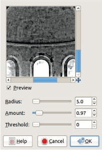

图 17-44. 锐化蒙版对话框

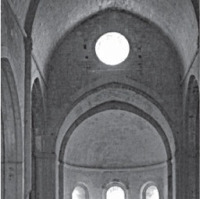

图 17-45. 锐化后的值层

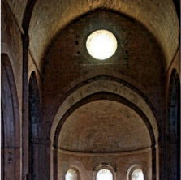

图 17-46. 应用去锐化掩模后经过分解

在锐化了值图层后，如图 17-45 所示，选择**图像：颜色 > 组件 > 重新组合**。结果如图 17-46 所示。通过仔细调整参数，有可能获得比锐化滤镜更好的效果。请注意，最好在图像缩放到最终大小和分辨率后再进行锐化处理。

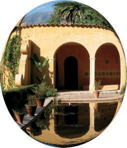

图 17-47. 应用镜头后的效果

去锐化掩模的三个参数如下：

+   RADIUS 指定掩模的宽度，从而决定锐化效果的可见度。最佳值取决于图像的分辨率和其中细节的大小。

+   AMOUNT 指定将创建多少边缘对比度。较大的值通过在边缘添加轮廓来夸大边缘效果（参见图 17-42）。

+   THRESHOLD 指定像素值之间表示边缘的最小差异。实际上，它将信号与噪声分离。较高的值可以防止错误检测边缘，但也会减少滤镜的效果。

# 17.4 失真滤镜

失真菜单包含 18 个松散相关的滤镜。这 18 个滤镜都有一个对话框，但雕刻滤镜需要 Alpha 通道，如果没有，则会被禁用。我们省略了三个滤镜，因为它们很少用到：百叶窗、删除每隔一行、视频。

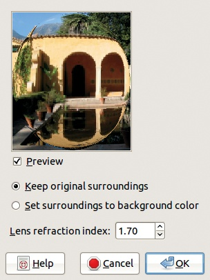

图 17-48. 应用镜头对话框

## 应用镜头

应用镜头模拟通过球面镜头观察图像的失真效果，如图 17-47 所示。

对话框，如图 17-48 所示，包含镜头的折射率设置[1 至 100]以及图像周围的处理方式，可以选择保留、透明化（需要 Alpha 通道），或填充背景颜色。

## 曲线弯曲

曲线弯曲根据你在滤镜对话框中操作的曲线，变形图像的内容。

当选择了滤镜（此例中应用于图 17-49 中的图像）时，会弹出如图 17-50 所示的对话框。默认情况下，AUTOMATIC PREVIEW 按钮未选中，因为它会占用大量处理资源，一般建议使用 PREVIEW ONCE。右侧显示的是曲线。你可以选择变形上侧或下侧曲线。如果曲线类型是 SMOOTH，可以向曲线上添加点并移动这些点以进一步变形。如果曲线类型是 FREE，则可以在网格中使用鼠标绘制曲线。

你可以将上侧曲线复制到下侧，反之亦然，或者对其进行镜像或交换。你还可以重置当前曲线。曲线的设置可以保存到文件中，稍后加载。

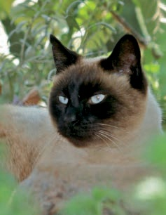

图 17-49. 初始图片

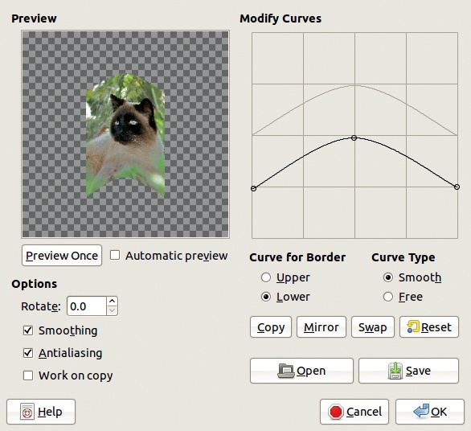

图 17-50. 曲线弯曲对话框

左侧的 SMOOTHING 和 ANTIALIASING 按钮通常应保持选中状态。当选中 WORK ON COPY 时，转换会应用到新图层，而原图层不会改变。最后，你可以使用 ROTATE 字段来旋转图层上的曲线。如果旋转角度为 90°，曲线将垂直对齐，且上侧的曲线位于左侧。

图 17-51 显示了我们的结果。当前的背景颜色填充了图像中的空白区域。

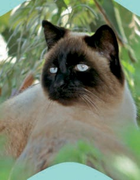

图 17-51. 应用曲线弯曲后的效果

## 浮雕

浮雕效果仅适用于 RGB 图像。它使用图像像素的值来创建浮雕效果。亮的区域被抬高，暗的区域则被压低。

如图 17-52 所示的对话框包含三个参数：

+   AZIMUTH 是光源的方向。当设置为 0° 时，光源看起来来自右侧；当设置为 90° 时，光源看起来来自上方。

+   ELEVATION 是光源在地平线上的角度。

+   DEPTH 参数指定浮雕的强度。当值非常低时，浮雕效果几乎是平的；当值较高时，图像将变得昏暗且阴影重重。

结果如图 17-53 所示，是一张 RGB 模式的灰度图像。如果选中 BUMPMAP，则结果将是彩色的，且浮雕效果更加平滑（参见图 17-54）。

## 雕刻效果

雕刻效果需要使用 Alpha 通道。它模拟了旧书中的雕刻效果，其中宽度变化的水平条纹给人一种浮雕的印象。

在雕刻对话框中，HEIGHT 是线条的宽度，较小的值对应较细的线条。如果勾选了 LIMIT LINE WIDTH，确保平行线不会接触。

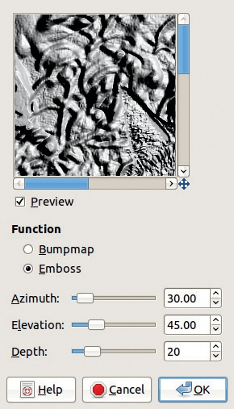

图 17-52。浮雕对话框

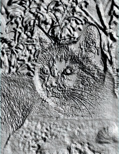

图 17-53。应用了浮雕效果后

此滤镜的结果是 RGB 模式下的黑白图像（图 17-55）。

## IWarp

由于该滤镜可以用于动画，因此在第十八章中有详细介绍。它可以用于创建滑稽的漫画画面或对照片进行细微的更改。

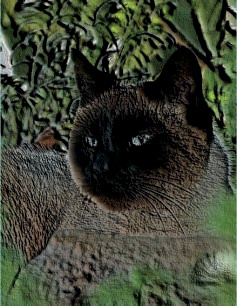

图 17-54。应用了带有 Bumpmap 模式的浮雕效果后

图 17-55。应用雕刻效果后

我们在本书的作者之一的照片上进行演示，他肯定不会因为我们对他的处理而起诉我们（见图 17-56）。使用 20 的变形半径，我们将鼻子下移，放大了双眼，双向旋转了嘴巴，并缩小了下巴。使用 72 的半径，我们将额头上的头发向下移动。最终结果显示在图 17-57。

## 镜头畸变

镜头畸变模拟了由于相机镜头缺陷可能发生的各种畸变。由于反向畸变可以抵消现有的畸变，因此该滤镜也可以用于修正真实的相机畸变。

图 17-56。初始图像

图 17-57。应用 IWarp 后

图 17-58 显示了应用于图 17-59 所示照片时的滤镜对话框。预览中有两个缩放按钮，且有六个设置滑块，所有滑块的范围为[*–*100 到 +100]：

+   MAIN 是球面畸变的强度。如果值为正，效果是凸的；如果值为负，效果是凹的。

+   EDGE 的作用类似于 MAIN，但它作用于图像的边缘。

+   ZOOM 放大或缩小图像。

+   BRIGHTEN 设置所谓的 *晕影* 效果：如果值为正，图像的边缘会变暗；如果值为负，边缘会变亮。

    

    图 17-58。镜头畸变对话框

    

    图 17-59. 初始图像

+   XSHIFT 指定由于镜头对齐不良而导致的图像水平偏移。

+   YSHIFT 进行相同的操作，但为垂直方向。

如果 MAIN 和 EDGE 的值都较低，改变其他滑块的效果可能无法察觉。

结果显示在 图 17-60 中。为了找到正确的设置来校正数码相机的结果，可以拍摄一张大矩形纸板的照片，纸板上有直线。由于图案简单且粗体，可以调整参数，直到校正任何畸变，然后记录下这些参数值。

图 17-60. 应用镜头畸变后的效果

## 马赛克

马赛克效果通过将图像分解成小瓦片来模拟马赛克。其对话框显示在 图 17-61 中，包含许多设置：

+   TILING PRIMITIVES 允许你选择瓦片的形状。

+   TILE SIZE [5 到 100] 是瓦片最大边的尺寸。

+   TILE HEIGHT [1 到 50] 控制浮雕效果的强度。如果这个值相对于瓦片大小较大，瓦片会变得呈球形。

+   TILE SPACING [1 到 50] 是瓦片之间黑色通道的宽度。

+   TILE NEATNESS 范围从 0（完全随机的瓦片形状）到 1（完全规则的瓦片形状）。

+   LIGHT DIRECTION 确定瓦片的光照方向。通常最好保持默认值 135°（从左上方照亮）。

+   COLOR VARIATION 范围从 0（均匀的瓦片块）到 1（相邻瓦片之间的颜色差异较大）。

+   ANTIALIASING 平滑瓦片轮廓。

+   COLOR AVERAGING 使每个瓦片成为单一颜色，即其包含像素的平均值。

    

    图 17-61. 马赛克对话框

+   ALLOW TILE SPLITTING 允许非常小的瓦片，使得瓦片图案沿图像中的物体边缘排列。

+   PITTED SURFACES 赋予瓦片粗糙的表面纹理。

+   FG/BGLIGHTING 使用前景颜色表示亮区，使用背景颜色表示阴影区。

    结果显示在 图 17-62 中。

## 新闻纸

新闻纸模拟了用于将图像转换为胶印的抖动效果，例如用于报纸印刷。

对话框显示在 图 17-63 中。（我们省略了预览以节省空间。）参数分为三组：

+   RESOLUTION 指定将组成图像的彩色斑点的大小。

    +   INPUT SPI 是输入分辨率，以每英寸样本为单位。它会自动设置为图像分辨率。

        

        图 17-62. 应用马赛克后的效果

        

        图 17-63. Newsprint 对话框

    +   OUTPUT LPI 是所需的输出分辨率，单位为每英寸的线数。

    +   CELL SIZE 更改斑点的大小，与输出 LPI 相关。

+   SCREEN 控制抖动参数。

    +   SEPARATE TO 有三个单选按钮，确定分解所用的颜色空间。在 RGB 模式下，不进行转换；在 CMYK 模式下，图像会先进行内部转换，再进行抖动处理，然后再转换回 RGB；在 INTENSITY 模式下，图像先转换为灰度图像，最终结果作为图像的 Alpha 通道。

        

        图 17-64. 应用 Newsprint 后的效果

    +   BLACK PULLOUT 决定了将 RGB 转换为 CMYK 时使用的黑色百分比。

    +   LOCK CHANNELS 将下面的设置从一个通道复制到其他通道。

    +   FACTORY DEFAULTS 将通道参数重置为默认值。

    +   对于每个通道，可以设置网格的角度和斑点功能。

+   抗锯齿在打印时无效，但如果此滤镜用于特效时，它是有用的。

    图 17-64 显示了结果。

## Pagecurl

Pagecurl 模拟纸张的卷曲效果。对话框（图 17-65）具有以下参数：

+   CURL LOCATION：四个单选按钮允许你选择将要卷曲的角落，中央的图标显示当前选择。

    

    图 17-65. Pagecurl 对话框

+   CURL ORIENTATION：折叠可以是水平或垂直的，且对话框中的图标也会反映这一选择。

+   SHADE UNDER CURL：选中此框会在卷曲效果下方添加阴影。

+   用于页面底部的颜色是当前的前景色和背景色、当前的渐变色，或当前的反转渐变色。

+   折叠效果作为一个新图层创建，其不透明度可以在滤镜对话框中设置，也可以在图层对话框中设置。

    图 17-66 显示了 Pagecurl 滤镜的结果。

## 极坐标

极坐标通过包裹和拉伸图像，将矩形图像转换为圆形图像。

在极坐标对话框中，CIRCLE DEPTH IN PERCENT 决定了结果的圆形程度。100%时，结果是完美的圆形；0%时，是正方形。中间值将得到一个带有圆角的正方形。OFFSET ANGLE 旋转图像到指定角度。

图 17-66. 应用 Pagecurl 后的效果

图 17-67. 应用极坐标后的效果

这三个复选框的功能如下：

+   MAP BACKWARDS 将像素从右到左映射，而不是从左到右。

+   MAP FROM TOP 将图像的顶部映射到圆形的中心。默认情况下，底部映射到圆心。

+   TO POLAR 将图像映射到圆形，沿顶部和垂直半径切割，然后扩展图像形成矩形。

极坐标的结果显示在图 17-67 中。背景颜色为白色，且“MAP FROM TOP”按钮已被选中。

使用图 17-68 中的照片，并取消勾选“MAP FROM TOP”按钮，我们在图 17-69 中得到了一个新行星，背景颜色提供了黑色的天空。

图 17-68. 初始图像

图 17-69. 使用极坐标创建的新奇行星

## 波纹（Ripple）

波纹模拟图像在波纹水面上的反射效果。

其对话框，如图 17-70 所示，提供以下参数设置：

+   ANTIALIASING 可以软化图像的边界，建议勾选此选项。

+   RETAIN TILABILITY 如果要创建可平铺的图案，应勾选此项。

+   ORIENTATION 允许选择水平或垂直波纹。

+   EDGES 指定应该如何处理图像边缘的空白区域：

    +   WRAP：图像中从一边移出的像素将在另一边重新进入。

        

        图 17-70. 波纹对话框

    +   SMEAR：邻近像素被扩展以填补空洞。

    +   BLACK：黑色像素填补空洞。

+   WAVE TYPE 可以选择 SINE（平滑波纹）或 SAWTOOTH（尖锐波纹）。

+   PERIOD [1 到 200]指定两个连续波纹之间的距离。

+   AMPLITUDE [0 到 200]指定波纹的高度。

+   PHASE SHIFT [0 到 360]调整第一个波纹的起始点与图像边缘之间的距离。

    图 17-71 展示了波纹效果的结果。

## 偏移（Shift）

偏移（Shift）将图像中的所有像素垂直或水平方向随机偏移一定量，偏移量在设定的范围内。

图 17-71. 应用波纹后

图 17-72. 应用偏移后

对话框只包含几个设置：

+   移动的方向，可以是垂直的或水平方向的。

+   最大偏移量（单位为像素或其他单位）

    图 17-72 展示了 Shift 应用于我们花园照片后的结果。

## 值传播

值传播在图像的颜色边界处扩展像素。

我们在图 17-73 中展示的图像上进行演示。由于有许多可调参数，我们展示了一些有趣的替代结果。

图 17-73. 初始图像

图 17-74. 值传播对话框

许多参数在图 17-74 中展示。首先，查看 PROPAGATE 部分。在底部，有四个复选框用于四个方向；大多数情况下，最好勾选全部。三个滑块指定了转换的强度。如果一个像素与邻居的值差异小于 LOWER THRESHOLD 或大于 UPPER THRESHOLD，它将不会被传播。传播量由 PROPAGATING RATE 指定。

图 17-75. 值传播至更多白色模式

图 17-76. 值传播至更多黑色模式

模式决定了哪些像素将被传播。可用的模式有：

+   MORE WHITE 将亮色像素传播到暗色像素。图 17-75 展示了三次应用后的结果。

+   MORE BLACK 将黑色像素传播到亮色像素。 图 17-76 展示了三次应用后的结果。

+   MIDDLE VALUE TO PEAKS 在边缘添加一条细边框，并计算其颜色为邻近像素的平均值。图 17-77 展示了其效果的放大图。

+   FOREGROUND TO PEAKS 将传播的像素填充为前景色。在图 17-78 中，前景色为亮绿色。

    

    图 17-77. 值传播至中间值到峰值模式

    

    图 17-78. 值传播至前景至峰值模式

+   ONLY FOREGROUND/BACKGROUND 仅传播前景或背景颜色的像素。

+   MORE OPAQUE/TRANSPARENT 传播不透明或透明的像素。

如果当前图层有 Alpha 通道，对话框中会出现两个额外的复选框。如果未勾选 PROPAGATING ALPHA CHANNEL，则传播的像素将使用邻近像素的 Alpha，而不是其自身的 Alpha。如果未勾选 PROPAGATING VALUE CHANNEL，则滤镜仅对 Alpha 通道进行操作。

图 17-79. Waves 对话框

图 17-80. 应用 Waves 后

## Waves

Waves 滤镜模拟石头投入水中时产生的同心波纹。

在对话框中，如图 17-79 所示，参数与 Ripple 滤镜非常相似。唯一的新参数是 REFLECTIVE：如果勾选此项，波浪会从图像边缘反弹并相互干扰。

图 17-80 显示了 Waves 的效果。

图 17-81. Whirl 和 Pinch 对话框

## Whirl 和 Pinch

Whirl 和 Pinch 对图像应用了两种不同的扭曲效果。Whirl 会使图像呈现类似水流下水道的漩涡效果，而 Pinch 则像是将图像拉伸成橡胶片一样进行扭曲。

在图 17-81 所示的对话框中，只有三个滑块：

+   WHIRL ANGLE [*–*720° 到 +720°] 是旋转扭曲的角度。

+   PINCH AMOUNT [*–*1 到 +1] 是挤压的强度和方向。负值会从中心扩展，而正值则会将图像向内挤压。

+   RADIUS 指定图像的扭曲程度，从 0（无扭曲）到 2（整个图像扭曲）。

    查看图 17-82 中的结果。

## Wind

Wind 滤镜会向图像添加细小的水平线条，从而创造强风的错觉。

在图 17-83 所示的对话框中，提供了以下参数：

+   STYLE 是 WIND（非常细的线条）或 BLAST（较粗的线条）。

+   DIRECTION 是从 LEFT 或 RIGHT。

    

    图 17-82. 应用 Whirl 和 Pinch 后

+   EDGE AFFECTED 是前沿、尾部还是两者。

+   THRESHOLD [0 到 50] 用于检测边缘。

+   STRENGTH [1 到 100] 是效果的强度。

    图 17-84 显示了结果。

# 17.5 光与影滤镜

这是另一个包含一系列不相干条目的菜单。前五个与光相关，接下来的三个与阴影相关，最后两个是玻璃效果。我们省略了 Xach-Effect 滤镜，因为我们认为它不太有用。

## 梯度光晕

梯度光晕模拟了强光源对相机镜头的影响。光晕由三部分组成：光晕的中央圆圈（Glow）；从光晕延伸出的光线（Rays）；以及有时呈线性排列、从光晕延伸出的较小圆圈（Second Flares）。

我们在图 17-85 中展示的图像上进行演示。梯度光晕对话框有两个标签页，如图 17-86 所示。在“设置”标签页中，你可以通过输入坐标来设置主光晕的位置，或者点击预览来指定位置。其他参数如下：

图 17-83. 风对话框

图 17-84. 应用风效果后

+   半径 [0 到 248] 指定眩光的半径。滑块停在一个相对较低的值，但你可以在右侧的字段中输入一个更大的值。

+   旋转 [*–*180 到 +180] 改变光晕的旋转角度。

    

    图 17-85. 初始图像

    

    图 17-86. 梯度光晕对话框，设置标签页

+   色调旋转 [*–*180 到 +180] 改变光晕的颜色。

+   向量角度 [0 到 359] 改变第二光晕的方向。

+   向量长度 [1 到 1000] 改变第二光晕的长度。

+   自适应超采样包含抗锯齿的参数。

梯度光晕滤镜的选择器标签页，如图 17-87 所示，提供了七个预定义的光晕，你可以通过点击它们来选择。选择 DISTANT_SUN 的结果请参见图 17-88。

图 17-87. 梯度光晕对话框，选择器标签页

图 17-88. 应用梯度光晕后

在选择器标签页（图 17-87）中，底部的四个按钮允许你复制现有的光晕、编辑它、删除它或创建一个新的。点击 EDIT 按钮会弹出如图 17-89 所示的对话框，里面包含四个标签页。General 标签页让你设置不透明度（OPACITY）和绘制模式（PAINT MODE）。绘制模式包含四个选项：NORMAL、ADDITION、OVERLAY 和 SCREEN。

在渐变光晕编辑器的 Glow 标签页中（图 17-90），你可以选择三个定义 Glow 组件的渐变元素。任何预定义的渐变，如 `Flare ...`，通常都会产生不错的效果。径向渐变（RADIAL GRADIENT）决定了光晕的主要色彩方案。角度渐变（ANGULAR GRADIENT）决定了光晕渐变的包裹模式。角度渐变从下面指定的旋转角度开始，然后将径向渐变包裹成圆形或螺旋形。角度渐变的颜色与径向渐变在“叠加”混合模式下结合。第三个渐变，角度大小渐变（ANGULAR SIZE GRADIENT），用于改变光晕的半径。渐变的亮度用于改变光晕的形状。白色会将光晕放大到最大半径，而黑色则会将光晕缩小到中心点。例如，从黑色到白色的渐变会产生螺旋形的光晕效果。

图 17-89. 渐变光晕编辑器，General 标签页

图 17-90. 渐变光晕编辑器，Glow 标签页

此标签页中的最后三个参数分别指定光晕的大小、角度渐变的旋转角度，以及根据色相环指定的光晕颜色。

光线的数量和模式可以通过 Rays 标签页进行调整（图 17-91）。与 Glow 标签页一样，径向、角度和角度大小渐变分别决定了光线的颜色、包裹模式和半径。下面的参数也与 Glow 标签页中的参数效果相同。还可以调整尖刺的数量和粗细。尝试调整尖刺的数量：较多的尖刺会产生有趣的摩尔纹效果。

图 17-91. 渐变光晕编辑器，Rays 标签页

图 17-92. 渐变光晕编辑器，Second Flares 标签页

次级光晕的参数可以通过“次级光晕”选项卡来指定（见图 17-92）。下面的三个渐变和三个参数的意义与“辉光”选项卡和“光线”选项卡中的相同，唯一的不同是，概率渐变指定的是次级光晕的位置，而不是半径。次级光晕的形状可以是圆形、三角形或更多边的多边形，也可以是直线，如果边数设置为 1。随机化按钮会使用随机数对所有内容进行随机化。但是，如果输入随机种子，效果是可复现的（相同的种子总会产生相同的效果）。新种子按钮会生成一个新的种子。

图 17-93. 自定义渐变光晕

图 17-94. 应用镜头光晕后的效果

图 17-93 展示了一个自定义渐变光晕的示例。

## 镜头光晕

镜头光晕模拟的是阳光照射到相机镜头上的效果。

在对话框中，只有一个参数可以更改：光晕效果的位置。位置可以通过点击预览图或更改坐标来设置。如果需要，您还可以隐藏显示位置的十字标记，尽管这对结果没有影响。目前无法更改镜头光晕的大小、形状或色调。

图 17-94 展示了镜头光晕滤镜的结果。

图 17-95. 光照效果对话框，选项卡

## 光照效果

光照效果是一个复杂的滤镜。顾名思义，它可以用来在图像中生成光照效果，比如灯光效果。此外，它还可以用来凸起图像以创建浮雕效果，并且可以通过使用环境图来模拟复杂的反射。因此，这个滤镜也可以归类到地图子菜单中。我们在图 17-85 中展示了这个复杂的滤镜效果。

Lighting Effects 滤镜对话框有五个标签页。图 17-95 显示了第一个标签页：选项标签页。如果选中 INTERACTIVE 按钮，可以通过拖动左侧预览图中的蓝点来改变光源位置。DISTANCE 滑块设置光源相对于图像中心的高度。位置和距离都会影响光效，如你依次调整这两个参数时所见。对话框中还包含一个复选框，允许你创建一张带有效果的新图像，而不是修改原始图像。图 17-96 展示了一个示例，我们只在选项标签页调整了参数。

光源标签页（图 17-97）包含六个不同光源的参数。这些参数设置可以保存在文件中，以便以后使用。每个光源都有以下选项：

+   TYPE 可以设置为 POINT、DIRECTIONAL 或 NONE。NONE 会关闭所选的光源，减少光源数量。最多可以同时有零到六个活动光源。

    

    图 17-96。应用 Lighting Effects 后，没有映射

    

    图 17-97。Lighting Effects 对话框，光源标签页

+   COLOR 使用标准颜色选择器设置。

+   INTENSITY 改变光源的亮度，并可以设置为 [0 到 100] 之间的数值。

+   POSITION 相对于图像中心设置，可以在 X、Y 和 Z 方向上调整，范围为 [*–*2 到 +2]。当选择 POINT 类型时，POSITION 才会生效。

+   DIRECTION 与 POSITION 相同，但它影响光源的方向，且仅在选择 DIRECTIONAL 类型时有效。

    

    图 17-98。Lighting Effects 对话框，材质标签页

    

    图 17-99。Lighting Effects 对话框，凹凸贴图标签页

+   如果勾选 ISOLATE，预览图仅显示正在设置的光源。

材质标签页（图 17-98）包含图像表面五个特性的设置。每个特性可以设置为任何正值或零，但通常前三个特性设置小于 1 的值效果最好：

+   GLOWING 设置未直接照亮区域的光强度。

+   BRIGHT 设置直接受光区域的强度。

+   SHINY 设置高光强度。

+   POLISHED 设置高光聚焦：对于低值，高光较宽；对于高值，高光则更为集中。

+   METALLIC 如果选中，则模拟金属表面的效果。

Bump Map 标签 (图 17-99) 可以用来添加基于不同图片的凹凸贴图。另一张图片必须与正在转换的图像大小相同，并且在调用滤镜时必须在 GIMP 中打开。只有其数值通道被用于创建凹凸贴图，因此无论是灰度图像还是彩色图像都没有关系。如果选中 ENABLE BUMP MAPPING 选项框，可以选择一个凹凸贴图图像。响应曲线可以是线性、对数、正弦或球形，且通过调整 MAXIMUM HEIGHT 字段可以控制浮雕的效果。

图 17-100. 应用光照效果后，凹凸贴图

图 17-101. 光照效果对话框，环境映射标签

图 17-102. 环境图像

图 17-100 显示了启用了凹凸贴图的光照效果滤镜结果，并且显示了 图 17-99 中的参数。凹凸贴图图像来自 图 5-44。

在环境映射标签 (图 17-101) 中，可以选择环境图像，该图像必须是已经在 GIMP 中打开的 RGB 图像。没有其他参数。在我们的示例中，我们使用了 图 17-102。 图 17-103 显示了结果。

图 17-103. 应用光照效果后，环境映射

图 17-104. Sparkle 对话框

## Sparkle

Sparkle 会在图像中最亮的点添加类似星星的闪光，基于设定的阈值。

该对话框如 图 17-104 所示。有几个参数滑块：

+   亮度阈值 [0 到 0.1]：较小的值会导致闪光数量较少，而较大的值会导致闪光数量增多。

+   光晕强度 [0 到 1] 指定中央光斑的宽度。

+   尖刺长度 [1 到 100] 改变闪光尖刺的长度。

+   尖刺点数 [0 到 16] 决定每个闪光上的尖刺数量。

+   尖刺角度 [*–*1 到 360] 指定第一个大尖刺的角度相对于水平轴的生成方式。如果值为 –1，则角度是随机的。

+   尖刺密度 [0 到 1] 是可见闪光的百分比。滤镜的算法会生成一定数量的闪光，但只有一部分会真正出现在图像上，这取决于密度设置。

+   透明度 [0 到 1] 决定闪光的透明度。

+   随机色调 [0 到 1] 会改变色调，除非颜色设置为自然色（即闪光所在位置的图像颜色）。

+   随机饱和度 [0 到 1] 的操作方式与随机色调相同，不同之处在于它会改变饱和度。

    还有三个复选框：

+   保持亮度将图像中最亮像素的亮度应用于闪光的中心，这使得闪光几乎不可见，除非在图像的最亮区域。

+   反向模式会在图像的最暗部分生成深色的闪光。

+   添加边框会生成一个闪光的图像边框。尝试将尖刺角度设置为 *–*1 来创建一个图像边框。

最后有一组三个单选按钮，用于选择闪光的颜色：前景色、背景色或自然色（即，闪光绘制的最亮（或如果选择了反向，则最暗）点的颜色）。

图 17-105 显示了结果。

图 17-105. 应用闪光后

## 超新星

超新星添加一个大而尖的星形，看起来有些像超新星。在对话框中，显示在图 17-106 中，你可以通过设置坐标或点击预览来移动超新星的中心。如果选中了“显示位置”框，还会显示十字准线。以下是其他参数：

+   颜色是基础颜色，点击该框可以调出颜色选择器。

+   半径 [1 到 100] 指定超新星中心圆的大小。

+   辐射数 [1 到 1024] 是从超新星中心延伸出的 1 像素宽的尖刺数量。

+   随机色调 [0 到 360] 会随机化尖刺的颜色。

超新星的结果显示在图 17-107 中。

## 投影阴影

投影阴影为图像或选择区域添加投影阴影，而不会改变图像内容或生成背景图层。如果投影阴影应用于整个图像，你可以选择添加一个背景图层。

图 17-106. 超新星对话框

图 17-107. 应用超新星效果后

图 17-108. 初始图像和选择区域

图 17-109. 投影效果对话框

图 17-110. 应用投影效果后

我们构建了一个简单的绿色椭圆，见图 17-108，用来演示此滤镜。

对话框如图 17-109 所示。前三个参数设置投影的位置和宽度（称为模糊半径）。下方是颜色，点击后会弹出颜色选择器，接着是不透明度，设置由滤镜创建的新图层的不透明度。如果勾选了允许调整大小框，添加投影后，滤镜可以根据需要放大图像。

图 17-110 显示了结果。

## 透视效果

透视效果为图像或选择区域添加透视投影。

在对话框中，如图 17-111 所示，你可以设置光源和目标之间的角度[0 到 180]。如果小于 90°，投影在右侧；否则在左侧。相对地平线距离[0.1 到 24.1]改变地平线线相对于选择区域高度的距离。相对阴影长度也是如此，但阴影不能超过地平线。模糊半径[0 到 1024]应用于阴影的边缘。不透明度是新创建图层的透明度。最后，你可以设置插值算法并允许或禁止图像调整大小。

图 17-111. 透视效果对话框

图 17-112. 应用透视效果后

结果如图 17-112 所示。

# 17.6 噪声滤镜

六个噪声滤镜会向图像添加噪声，因此它们的作用与增强滤镜正好相反。

## HSV 噪声

HSV 噪声使用 HSV 模型添加噪声，因此你可以调整 H、S 和 V 分量的动态。

在对话框中，如图 17-113 所示，你可以调整三个 HSV 组件的随机变化强度。HUE 的范围是[0 到 180]，SATURATION 和 VALUE 的范围是[0 到 255]。HOLDNESS 的范围是[1 到 8]，它与色相变化成反比：2 的结果比 8 强烈。

图 17-113. HSV 噪声对话框

图 17-114. 初始图像

初始图像如图 17-114 所示，结果如图 17-115 所示。

## Hurl

Hurl 会将随机化应用于每个像素的所有通道，包括 Alpha 通道（如果存在），因此图像将呈半透明状态。

图 17-115. 应用 HSV 噪声后

图 17-116. Hurl 对话框

如图 17-116 所示的对话框中，包含以下参数：

+   在第一行，你可以通过输入种子值、点击 NEW SEED 或选择完全随机化来设置随机化过程。

+   RANDOMIZATION 是改变的像素的百分比。如果设置为 100%，图像将变得无法识别。

+   REPEAT [1 到 100]设置滤镜应用的次数；这会加重效果。

    Hurl 的效果如图 17-117 所示。

图 17-117. 应用 Hurl 后

图 17-118. 应用 Pick 后

## Pick

Pick 将每个像素替换为其周围 3 × 3 像素方块中随机选择的一个像素。

该对话框与 Hurl 滤镜的对话框非常相似。然而，由于滤镜的工作方式，重复应用时效果非常温和。

结果显示在图 17-118 中。

## RGB 噪声

RGB 噪声的工作方式类似于 HSV 噪声滤镜，但其随机化经过归一化处理，这意味着剧烈变化的可能性比轻微变化要小得多。此外，RGB 噪声允许你对 Alpha 通道进行更改。

图 17-119. RGB 噪声对话框

图 17-120. 应用 RGB 噪声后

在对话框中，如 图 17-119 所示，红色、绿色和蓝色滑块的范围是 [0 到 1]。如果未勾选 INDEPENDENT RGB，三个滑块的值将相同，结果为灰色噪声。如果勾选了 CORRELATED NOISE 框，则启用乘法噪声；否则噪声为加性噪声。在相关模式下，噪声与像素中的通道值相关，因此对于亮像素，噪声被放大，而对于暗像素则被抑制。

图 17-121. 应用 Slur 后

结果如 图 17-120 所示。

## Slur

Slur 模拟熔化效果，仿佛像素正在下滴。一部分像素会被随机选择进行模糊处理，且有 80% 的概率这些选中的像素会被替换为上方的像素；否则剩下的 20% 会被替换为左侧或右侧的像素。

该对话框与 Hurl 和 Pick 滤镜的对话框非常相似。RANDOMIZATION 设置变化的像素比例。此滤镜在将 REPEAT 设置为较高值时效果最佳。另一方面，过高的随机化比例可能会降低效果。

结果如 图 17-121 所示。

## Spread

Spread 在给定的距离范围内随机交换像素，且对单一平坦颜色区域没有影响。

对话框非常简洁，仅包含两个用于设置交换像素之间最大距离的字段。您可以打破链条输入不相关的值，并选择替代单位。

结果如 图 17-122 所示。

图 17-122. 应用 Spread 后

图 17-123. 初始图像

# 17.7 边缘检测滤镜

Edge-Detect 菜单中的五个滤镜都用于检测图像中的边缘并突出显示它们。它们寻找颜色强度发生剧烈变化的地方，这通常表示物体的边缘。结果通常是图像的轮廓，颜色被减少或移除，并设置在黑色或白色的背景上。通常，通过首先对图像添加模糊效果，平滑小的瑕疵并避免错误的边缘，可以获得更好的结果。我们对 图 17-123 中显示的图像进行了轻微模糊处理，以便演示 Edge-Detect 滤镜。

图 17-124. 高斯差异对话框

## 高斯差异

高斯差分通过对图像应用两种不同半径的高斯模糊，然后使用减法方法混合生成的图像来工作。

在对话框中，如图 17-124 所示，最重要的参数是两个半径。它们必须不同，通常 RADIUS 1 大于 RADIUS 2。理想的设置取决于正在处理的图像。选中 NORMALIZE 复选框时，会拉伸结果的对比度，选中 INVERT 复选框时，会反转结果，生成白色背景上的黑色线条。

选中 INVERT 复选框后的结果，如图 17-125 所示。

## Edge

Edge 实际上是六种不同的边缘检测滤镜，每一种滤镜都应用了独特的算法。

在对话框中，ALGORITHM 包含六种不同的算法。AMOUNT [1 到 10]设置用于确定什么是边缘的阈值。较低的值会产生黑色背景上的细线；较高的值会产生彩色背景上的粗线。三个单选按钮决定算法在阈值上找到缺失像素的位置，但效果非常微妙。

图 17-125. 应用高斯差分后的效果

图 17-126. 应用 Edge, Sobel 算法后的效果

六种算法的一些结果显示在图 17-126 到图 17-129 之间。在所有这些情况下，结果的颜色被反转（**图像：颜色 > 反转**），并且使用了 Levels 工具的 AUTO 按钮来使结果更易于查看。

## 拉普拉斯

Laplace 滤镜与 Edge 滤镜中的 Laplace 相同，但没有任何参数。由于它生成非常细的边缘，可以通过拉伸对比度（**图像：颜色 > 自动 > 拉伸对比度**）并反转颜色（**图像：颜色 > 反转**）来创建更明显的效果。我们的结果显示在图 17-130 中，与图 17-129 的区别在于 Laplace 滤镜的隐式参数。

图 17-127. 应用 Edge, Gradient 算法后的效果

图 17-128. 应用边缘检测，微分算法后

图 17-129. 应用边缘检测，拉普拉斯算法后

图 17-130. 应用拉普拉斯后

图 17-131. Neon 对话框

## Neon

Neon 为边缘添加明亮的颜色，就像荧光一样。

在对话框中，如图 17-131 所示，RADIUS 设置边缘的厚度，AMOUNT 则改变滤镜效果的强度。查看图 17-132 中的结果。

## Sobel

Sobel 分别检测水平边缘和垂直边缘。对话框如图 17-133 所示，没有数字参数。复选框允许你渲染水平或垂直边缘，或两者都渲染。如果只激活一个方向，勾选“保留结果符号”复选框时，将会基于发现的边缘生成一个浮雕表面。一个示例如图 17-134 所示，通过使用“自动”按钮在“级别”工具中进行改进。

图 17-132. 应用 Neon 后

图 17-133. Sobel 对话框

图 17-134. 应用 Sobel 后

# 17.8 通用滤镜

在通用菜单中只有三个滤镜，且只有第一个滤镜有对话框。该部分的滤镜之间关系模糊；它们都使用矩阵来计算新的像素值，这是滤镜的共同特性。事实上，这三个滤镜之所以出现在这个菜单中，是因为它们没有合适的位置可以归类。

## 卷积矩阵

卷积矩阵可以被称为通用滤镜，因为它用于生成自定义滤镜，如模糊、锐化、浮雕、反转等多种效果。

对话框的主要部分，如图 17-135 所示，是矩阵（MATRIX），一个 5 × 5 数字阵列。中间的框对应当前像素，其他框对应邻近像素。滤镜的工作原理是将当前像素及其附近的每个像素与矩阵中的对应系数相乘，然后将这些数值相加，再将总和除以除数。这个过程类似于取平均值。如果包括偏移量，该数值将被加到计算结果中。最终结果就是当前像素的新值。

计算分别针对三个 RGB 通道和 Alpha 通道（如果有的话）进行。对话框右侧的复选框允许你选择哪些通道进行滤波。如果选中“归一化”框，除数将自动设置为矩阵框中值的总和，如果总和为零，则设为 1，并偏移 128；如果总和为负数，则使用 255 的偏移量。

当当前像素位于图像的边缘时，可以通过两种方式填充缺失的像素：EXTEND 复制边界上的像素来填充空白区域；或者 WRAP 从相对的边界取像素值，就像图像被包裹在一个圆柱体上一样。

图 17-135. 卷积矩阵对话框

图 17-136. 应用卷积矩阵后的效果

如果选中 ALPHA-加权框，则在计算新像素值时会包含当前像素的 Alpha 通道。

由于这是一个非常灵活的滤镜，展示所有可能有趣的应用至少需要一个章节。为了节省空间，我们选择了一个例子：边缘检测类型的滤镜，如图 17-136 所示。我们还使用了“级别”工具来改善结果。

图 17-137. 应用膨胀后的效果

图 17-138. 应用侵蚀后的效果

## 膨胀

膨胀使用一个简单的预设 3 × 3 矩阵。中央像素的值被更改为八个邻近像素中的最大值。图 17-137 展示了滤镜应用三次后的效果。

## 侵蚀

侵蚀与膨胀的工作原理相同，不同之处在于它取邻近像素中的最小值作为新像素值。图 17-138 展示了滤镜应用三次后的效果。

图 17-139. 第一张图片

图 17-140. 第二张图片

# 17.9 合并滤镜

在“合并”菜单中的滤镜用于将两张或更多图片合成。我们省略了“胶片条”，因为现在很少使用胶片。

## 深度合并

深度合并滤镜使用两个图像图作为引导合并两张图像。它需要四张图像，并且它们必须都具有相同的尺寸。图像图必须是灰度图。暗区对应于关联图像中将可见的区域，而图像图中的亮区将成为关联图像中的透明区域。换句话说，图像图充当了蒙版。

在图 17-139 和图 17-140 中显示的图像被用来演示此滤镜。首先，它们被裁剪并缩放，直到它们的大小相同。为了构建图 17-141 和图 17-142 中所示的图像图，我们执行了以下操作：

图 17-141. 第一张图像的图像图

1.  选择了按颜色选择工具。

1.  点击图像的一个亮区，按住 ，然后点击其他亮区，直到图像中的所有亮区都被选中。

1.  创建了一个新的白色图层。

1.  反转选择并填充为黑色。

1.  将新图层拖动到工具箱中，创建一个新图像。

1.  从图像中删除了蒙版层。

选择深度合并滤镜时，显示图 17-143 中所示的对话框。右侧的菜单用于设置源图像和深度图像图。其余的参数如下：

+   OVERLAP [0 到 2] 通过半透明效果平滑图像之间的过渡。

+   OFFSET [*–*1 到 +1] 调整源图像在结果图像中的可见性。

+   SCALE [*–*1 到 +1] 与 OFFSET 执行相同的操作，但对每张图像单独进行，通过降低缩放值来加深其图像图。

    请参阅图 17-144 中的结果。

图 17-142. 第二张图像的图像图

图 17-143. 深度合并对话框

# 17.10 艺术滤镜

艺术菜单很长，包含许多复杂的滤镜。该菜单中的滤镜创建艺术效果，从模拟画布到模仿立体主义或印象派画作。我们省略了 1987 年科幻电影《终结者》中的“掠食者”滤镜。

图 17-144. 应用深度合并后

图 17-145. 应用画布对话框

## 应用画布

应用画布效果模拟了画布质感。画布的粗糙度无法更改，且该滤镜选项较少。

如图 17-145 所示，包含控制光照方向和画布凹凸效果的选项。该滤镜的效果如图 17-146 所示。

## 卡通效果

卡通效果模拟了用黑色墨水绘制的图像，并随后进行了着色。该滤镜通过加深图像中最暗的区域来工作。卡通滤镜的效果展示在图 17-147 中。滤镜对话框如图 17-148 所示。只有两个参数：

图 17-146. 应用画布效果后的效果

图 17-147. 初始图像

+   MASK RADIUS [1 到 50]控制卡通画的粗糙度，最佳值取决于图像的大小。作为起点，尝试设置为图像边长（像素）的 1*/*100。

+   PERCENT BLACK [0 到 1]控制通过改变图像中添加的黑色量来调节效果的强度。

    请参见图 17-149 中的结果。

图 17-148. 卡通对话框

图 17-149. 应用卡通效果后的效果

## Clothify

Clothify 的效果类似于应用画布（Apply Canvas），但布料质感更加丰富，不像拉伸的画布那样平坦。

如图 17-150 所示，包含两组参数。两组模糊（BLUR）参数控制布料质感的外观，最后三个参数控制光照效果：光照方向、光照高度和凹凸效果的深度。

结果如图 17-151 所示。

图 17-150. Clothify 对话框

图 17-151. 应用 Clothify 后的效果

## 立体主义效果

立体主义模拟了立体派画风。它通过从图像中提取半透明颜色并将这些颜色构建成小方块，随机散布这些方块，将它们放置在颜色来源附近。

如图 17-152 所示，包含以下参数：

+   瓦片大小 [0 到 100] 设置方块的大小。

+   瓦片饱和度 [0 到 10] 设置方块的透明度，但它也会影响方块的大小。在低值下，图像较暗且部分透明，只有少量的小方块，处理速度非常快。高值时，图像颜色鲜艳，方块较大，处理时间较长。

+   使用背景颜色，当选中时，会将背景颜色替代黑色，显示在半透明的方块下方。

    我们的结果显示在图 17-153 中。

图 17-152. 立体主义对话框

图 17-153. 应用立体主义后

## GIMPressionist

GIMPressionist 是 GIMP 中最复杂、最强大的艺术滤镜，有时被称为艺术滤镜之王。其基本思想是将图像显示在具有特定属性的模拟纸张上，用具有自己属性的画笔进行绘制。还有许多其他可以调整的参数。

它的对话框显示在图 17-154 中。共有八个标签，每个标签包含大量的参数设置，导致可能的组合数量非常庞大。由于该滤镜的处理过程非常复杂，必须通过点击更新按钮来手动更新预览。此外，重置按钮将预览恢复为初始图像。

该滤镜提供了许多预定义的参数组合，并且可以将新的组合添加到列表中。要创建一个预设，调整各个标签中的参数值，在预设标签顶部的字段中输入新组合的名称，然后点击保存当前设置。

选择一个预设组合后，必须点击应用按钮，才能在其他七个标签中更改参数值。只有当选中的预设不是预定义的时，删除按钮才会启用。最后，刷新按钮将加载所有在 GIMP 之外添加到 GIMPressionist 的新预设组合。

预览只是可能结果的一个指示，并不是滤镜实际效果的预览。实际效果取决于图像的大小，这会影响画笔笔触的显示大小，正如在现实中一样。如果图像的大小与预览相同，预览将是准确的。

纸张标签（图 17-155）可用于调整图像看起来被绘制的纸张纹理。共有九种纹理可供选择。该标签中的预览只是一个大致的近似，因为图像大小会影响效果，并且只显示纹理的通用预览。SCALE 滑块[3 到 150]会改变纹理相对于图像的大小，RELIEF 滑块[0 到 100]会改变图案浮雕的深度。选中 INVERT 框时，会反转纹理，GIMP 中将其表示为灰度图像。选中 OVERLAY 框时，纹理会作为新图层创建，图层的透明度由 RELIEF 百分比设置。

画笔标签（图 17-156）的工作方式类似。存在一长串现有的画笔，这些画笔是小的灰度图像。如果在选择滤镜之前已经在 GIMP 中打开了其他图像或图层，它们将出现在 SELECT 菜单中，并可以保存为画笔。GAMMA 滑块设置画笔的亮度。ASPECT RATIO [*–*1 到 +1] 会改变画笔的比例：负值会减小高度，正值会减小宽度。画笔大小可以在大小标签中更改。RELIEF [0 到 100] 指定每次笔画使用的虚拟颜料量。

图 17-154. GIMPressionist 对话框，预设标签

图 17-155. GIMPressionist 对话框，纸张标签

方向标签（图 17-157）设置画笔笔画的方向。DIRECTIONS 滑块指定笔画中的像素数[1 到 30]（即笔画的宽度）。START ANGLE [0 到 360]设置第一笔的方向，ANGLE SPAN [0 到 360]设置后续笔画的可能范围。图像有八个方面可以控制笔画的 ORIENTATION：

图 17-156. GIMPressionist 对话框，画笔标签

图 17-157. GIMPressionist 对话框，方向标签

+   VALUE：亮度决定笔画的方向。

+   RADIUS：笔画方向基于从图像中心的距离。

+   RANDOM：笔画方向为随机。

+   RADIAL：笔画方向基于指向图像中心的方向。

    

    图 17-158. 定向地图编辑器

+   FLOWING：生成一个流动模式，与图像属性无关。

+   HUE：色相决定笔画的方向。

+   ADAPTIVE：方向遵循原始图像的轮廓。

+   MANUAL：点击 EDIT 按钮打开定向地图编辑器。

定向地图编辑器窗口（图 17-158）可以用来根据向量定义连续笔画的定向，这些向量在左侧的图像预览中显示（称为 VECTORS）。一个垂直滑块可以改变预览的亮度，使向量更加明显。中键点击预览可以在点击的位置添加一个新向量。当前向量以红色显示，其他向量为灰色。左键点击可以移动当前向量，右键点击可以旋转它。预览下方的两个箭头按钮可以切换当前的向量，ADD 按钮会在预览的中心添加一个新向量。KILL 按钮删除当前向量。右侧的预览，称为 PREVIEW，展示了向量对笔画方向的影响。

预览下方的第一个和第三个滑块修改当前向量的参数：ANGLE 与右键单击的效果相同，STRENGTH [0.1 到 5] 改变向量的长度，代表每个向量的效果范围。其他两个滑块影响所有向量：ANGLE OFFSET 改变所有向量的角度，STRENGTH EXP 改变所有向量的长度。*Exp* 代表指数，可能与用于计算结果的数学算法相关。

图 17-159. GIMPressionist 对话框，大小选项卡

在左侧，TYPE 设置笔画的排列方式，显示在右侧的预览中。勾选 VORONOI 框后，只有最近的向量会影响给定的点。

无法保存通过编辑器构建的定向地图，因此你必须重新创建想要再次使用的地图。不过，APPLY 按钮允许你在 GIMPressionist 预览窗口中查看定向地图的效果。请注意，应用效果后你需要更新预览。

大小选项卡（图 17-159）设置笔画的大小，操作方式与定向选项卡非常相似。你可以设置变化量、最小和最大尺寸，并选择八种可能的图像特征中哪些影响笔刷的大小。当选择手动方法时，点击 EDIT 按钮可以打开大小映射编辑器。

大小映射编辑器窗口（图 17-160）与定向地图编辑器相似，唯一不同的是没有类型选择，角度设置被大小设置取代。

“放置”标签（图 17-161）用于指定笔画在图像中的分布方式：随机或均匀分布，若勾选“居中”（CENTERED），则笔画围绕中心分布，且笔画密度（STROKE DENSITY）范围为[1 到 50]。

图 17-160。尺寸图编辑器

图 17-161。GIMPressionist 对话框，放置标签

图 17-162。GIMPressionist 对话框，颜色标签

“颜色”标签（图 17-162）用于指定每个笔画将使用的颜色。笔画可以是其覆盖像素的平均颜色，也可以是中心像素的相同颜色。还可以添加“颜色噪声”（COLOR NOISE）[0 到 100]（随机颜色变化）。

“常规”标签（图 17-163）设置背景颜色和笔画的浮雕效果。背景颜色（笔画之间的颜色）可以取自初始图像或所选纸张，或者选择一个纯色，通过颜色选择器进行选取。如果图像有 Alpha 通道，背景也可以是透明的。

这三个复选框的功能如下：

+   “绘制边缘”（PAINT EDGES）在所有笔画周围创建一个细边框。

    

    图 17-163。GIMPressionist 对话框，常规标签

    

    图 17-164。GIMPressionist 的一个示例

+   “可平铺”（TILEABLE）使图像可平铺。

+   “投影阴影”（DROP SHADOW）在每个笔画下方添加轻微的阴影。

右侧的五个滑块为笔画增加浮雕效果：

+   “边缘加深”（EDGE DARKEN）[0 到 1]设置浮雕的深度。

+   “阴影加深”（SHADOW DARKEN）[0 到 99]设置阴影的暗度。

+   “阴影深度”（SHADOW DEPTH）[0 到 99]设置笔画与阴影之间的距离。

+   “阴影模糊”（SHADOW BLUR）[0 到 99]模糊阴影。

+   “偏差阈值”（DEVIATION THRESHOLD）[0 到 1]相当神秘，可以保持默认值。

图 17-165。GIMPressionist 的第二种可能结果

图 17-166。GIMPressionist 的第三个示例

GIMPressionist 拥有丰富的参数设置，因此有大量可能的结果。需要注意的是，一些设置可能导致计算时间过长。由于 GIMPressionist 滤镜的多样性，它实际上可以复制许多其他艺术滤镜效果，如应用画布或立体主义。图 17-164 到图 17-166 展示了在图 17-147 中应用 GIMPressionist 的不同效果。

图 17-167. 应用玻璃砖瓦后的效果

## 玻璃砖瓦

玻璃砖瓦效果模拟通过玻璃砖墙观看图像的效果。对话框仅包含瓦片的宽度和高度设置。结果如图 17-167 所示。

## 油画化

油画化滤镜旨在模拟具有大笔触的油画效果。虽然也可以使用 GIMPressionist 滤镜获得相同的效果，但这个滤镜使过程更加快速和简便。

如图 17-168 所示，油画化对话框的参数设置与深度合并滤镜类似。MASK SIZE [3 到 50]指定了笔触的大小。mask-size 图像选项要求打开另一张与正在编辑的图像大小相同的图像，最好是灰度图像。图像地图的亮度决定目标图像中笔触的大小。EXPONENT [1 到 20]设置笔触之间的变化程度，这也可以通过图像地图来指定。最后，勾选 USE INTENSITY ALGORITHM 框时，会保留初始图像的细节和颜色。此滤镜通常在处理过程中需要较长时间才能产生结果。图 17-169 显示了油画化的可能效果。

图 17-168. 油画化对话框

图 17-169. 应用油画化后的效果

## 照片复制

照片复制效果会模拟黑白复印件。结果类似于灰度边缘检测图像。

照片复制滤镜会加深图像中比邻近像素平均值更暗的区域，同时会提亮其他区域。除了可以模拟复印效果外，你还可以用这个滤镜锐化图像：将其应用到位于图层堆栈中原始图像上方的图层副本，然后将该图层设置为“叠加”模式。

图 17-170. 照片复制对话框

如图 17-170 所示，该对话框有以下参数：

+   MASK RADIUS [3 到 50] 设置将被平均处理的邻域区域大小，从而改变效果的粗糙度。

+   SHARPNESS [0 到 1] 设置结果的锐度。

+   PERCENT BLACK [0 到 1] 控制添加到图像中的纯黑色量。该效果通常比较微妙。

+   PERCENT WHITE [0 到 1] 设置图像中白色像素的比例。如果 PERCENT WHITE 设置为零，滤镜效果将非常类似于去饱和处理。

    图 17-171 显示了结果。

图 17-171. 应用 Photocopy 后的效果

图 17-172. Softglow 对话框

## Softglow

Softglow 通过进一步加亮已经最亮的区域，使图像发光。

对话框中的设置，如图 17-172 所示，简单明了。GLOW RADIUS [1 到 50] 影响结果图像的锐度。BRIGHTNESS [0 到 1] 设置效果的强度。SHARPNESS [0 到 1] 决定光照的强度。请参见图 17-173。

图 17-173. 应用 Softglow 后的效果

图 17-174. 梵高（LIC）对话框

## 梵高

梵高滤镜的正式名称为梵高（LIC），其中 LIC 代表线积分卷积（Line Integral Convolution）。此滤镜通过两种方式之一为图像添加模糊：基于图像地图中的梯度，或基于白噪声。图 17-174 中的对话框不包括预览。该对话框有三组单选按钮：

+   EFFECT CHANNEL 指定使用的 HSV 通道。

+   EFFECT OPERATOR 允许你在图像中的梯度或梯度的导数（反向）之间进行选择。

    

    图 17-175. 效果图像

    

    图 17-176. 应用梵高效果后，以目标图像作为效果图像

+   CONVOLVE 改变与目标图像结合的内容：可以是白噪声（在所有频率中幅度相同的噪声）、效果图像或目标图像本身。

效果图像必须与处理的图像大小相同，且滤镜只会使用其渐变。图像在调用滤镜时必须在 GIMP 中打开。我们使用了图 17-175 中所示的图像，该图像是通过混合工具创建的。

滑块很难解释，你可能通过尝试它们来学得最好。FILTER LENGTH [0.1 到 64]是处理源图像时唯一真正有用的参数。它控制模糊的程度或纹理的粗糙度。

图 17-177. 使用白噪声应用费曼效果后的结果

图 17-178. 编织对话框

图 17-176 显示了当目标图像也是效果图像，并且 CONVOLVE 设置为 WITH SOURCE IMAGE 时的效果。图 17-177 则显示了选择白噪声时的结果。

## 编织

编织模拟了将图像绘制在带子或可能是稻草编织物上的效果。这些带子有条纹，使它们看起来像是由某种纤维材料制成的。这些条纹被称为*线程*。

对话框，如图 17-178 所示，不包含预览。该滤镜会构建一个额外的图层，包含编织图案，并以“叠加”模式将其与原图结合。该图案显示在图 17-179 中。参数指定了带子的宽度和间距；阴影的深浅；以及线条的长度、密度和强度。

图 17-179. 应用编织效果后

# 17.11 装饰滤镜

装饰菜单包含九个选项，但如果图像处于灰度模式，则第一个和第三个选项会被灰显；如果图像处于彩色模式，则最后两个选项会被灰显。这些滤镜被称为装饰滤镜，因为它们会为图像添加一些装饰，例如边框。我们省略了最后三个滤镜（滑动、模板雕刻和模板铬），因为它们并不太有用。

## 添加倒角

添加倒角通过从选区创建新图层，给图像选区添加轻微的倒角。对话框包含一个参数，允许你设置倒角的厚度[0 到 30]。该滤镜可以生成新图像，而不是更改源图像，且用于倒角的凸起图层可以保存为底层图层。

我们将加外 bevel 滤镜应用于图 17-180 中显示的图像，并选择了中间的方形区域。结果见图 17-181。

图 17-180。初始图像

图 17-181。应用加外 bevel 后的效果

图 17-182。应用加边框后的效果

## 添加边框

添加边框会在图像周围添加一个带有浮雕效果的边框。对话框简单，允许您设置 X 和 Y 方向的边框大小；通过颜色选择器设置颜色；以及增量值[0 到 255]，用于指定上下左右边框的亮度差值。增量值被加到顶部边框的 HSV 值中，并从底部边框的 HSV 值中减去，一半的增量值被加到左边框中，从右边框中减去。见图 17-182。

图 17-183。初始图像

图 17-184。应用咖啡渍后的效果

## 咖啡渍

咖啡渍模拟了咖啡渍效果。

对话框只有两个参数：污渍的数量[1 到 10]，以及一个复选框，允许您在仅暗化模式下创建污渍层。默认情况下，层为普通模式。每个污渍都会在自己的层中创建，并且每一层都可以在之后移动或删除。

初始图像见图 17-183，应用咖啡渍后的结果见图 17-184。

## 模糊边框

模糊边框添加了一种新型的边框，它在图像和边框之间的过渡处看起来像是碎裂成片。

图 17-185 中显示的对话框包含了设置边框颜色和大小的选项。第一个复选框用于模糊图像和边框的交界处。粒度设置通过滑块[1 到 16]调整，改变边框碎裂块的大小。较低的值会导致更小的碎片。下一个复选框添加阴影，阴影权重滑块[1 到 100]设置阴影的不透明度。对话框底部有两个复选框，用于创建新图像（而不是修改原始图像）或将结果合并（而不是将边框作为新图层创建）。

模糊边框的结果见图 17-186。

图 17-185。模糊边界对话框

图 17-186。应用模糊边界后的效果

## 旧照片

旧照片效果通过对图像进行若干变换，使其看起来像一张老照片。

在图 17-187 中显示的对话框中，你可以选择是否对照片进行模糊处理，添加指定大小的模糊边框，将颜色转换为褐色调，或加入一些瑕疵。一旦选择了设置，可以生成图片的副本或直接对原始图片进行处理。

结果显示在图 17-188 中。

图 17-187。旧照片对话框

图 17-188。应用旧照片后的效果

图 17-189。圆角对话框

## 圆角

圆角效果模拟了一张带有圆角的照片，放置在某个背景上，并且背景有阴影。

在对话框顶部（图 17-189）有一个字段，用来设置圆角的半径。其下是一个复选框，用于开启或关闭阴影，并且有字段可以设置阴影在 X 和 Y 方向的偏移量，以及阴影模糊的半径。在对话框底部，有复选框可选择添加背景（使用当前背景色）以及生成新图像。

图 17-190。应用圆角后的效果

圆角效果的结果显示在图 17-190 中。

# 17.12 地图滤镜

地图菜单中的 10 个滤镜将图像映射到物体上，从而变形图像；例如，通过添加浮雕效果、弯曲图像或使其无缝。地图滤镜常常产生非常戏剧性的效果。

## 浮雕贴图

浮雕贴图使用另一张图像作为地图来浮雕处理图像。如果地图比图像小，那么图像的某些区域将保持不变。

在图 17-191 中显示的对话框中，BUMP MAP 菜单列出了所有在 GIMP 中打开的图像以及在同一会话中之前打开的图像。MAP TYPE 可以设置为三种模式之一，这决定了凸起高度与映射图像亮度的关系：线性、球形或正弦形。

通常建议保留“补偿暗化”选项框以避免过于暗淡的结果。默认情况下，亮像素会生成凸起，暗像素会生成凹陷；如果勾选“反转高程图”框，亮像素将变为凹陷，暗像素将变为凸起。当勾选“平铺高程图”时，生成的图像将成为可平铺的高程效果，例如可以用作网页背景。

图 17-191. 高程图对话框

图 17-192. 一个高程图示例

方位角 [0 到 360] 设置光源的方向。仰角 [0.5 到 90] 设置光源在地平线上的位置（90 表示垂直方向）。深度 [1 到 65] 设置凹凸不平的高度差。X 偏移 [*–*1000 到 +1000] 将地图在水平方向上与图像进行偏移，而 Y 偏移则在垂直方向上进行偏移。水位 [0 到 255] 仅在图像包含透明度时有效：透明区域会被视为较暗，并变为凹陷（如果高程图没有被反转）。如果水位增高，这些凹陷会逐渐消失。环境光 [0 到 255] 是环境光的强度，当其值很高时，会减弱高程的效果。

图 17-193. 另一个高程图示例

我们的结果展示在图 17-192 中。图像本身作为地图使用。图 17-193 展示了对相同图像应用滤镜的效果，使用图 5-44 中的肖像作为地图，并略微增加了深度和仰角。

## 位移

位移使用两张图像作为*位移图*，一张用于 X 轴，另一张用于 Y 轴。这两张图像必须与原始图像大小相同，即正在被修改的图像。在选择滤镜时，必须确保所有三张图像都在 GIMP 中打开。只有地图图像的数值部分被使用，因此图像是彩色还是灰度图像并无区别。

对话框中的大部分选项，如图 17-194 所示，涉及位移。当位移模式为笛卡尔模式时，目标图像中的位移通过将选定的位移值（X 或 Y）乘以位移图中像素的值分量来计算。可以取消选择某一维度，只对目标图像进行单一方向的位移。当位移模式为极坐标模式时，X 是径向距离（称为 Pinch），Y 是切向距离（称为 Whirl）。边缘行为（EDGE BEHAVIOR）指定如何处理图像边缘：如果模式是 WRAP，缺失的像素将从对面获取；如果是 SMEAR，相邻的像素将在缺失像素的区域内重复；如果选择了 BLACK，缺失的像素将填充为黑色。

图 17-194. 位移对话框

图 17-195. 我们的位移图

计算实际的位移是相当复杂的。在 X 和 Y 维度中，位移图中像素值小于 127 时，位移向左；像素值大于 127 时，位移向右。在极坐标位移中，像素值大于 127 时，像素向外位移；像素值小于 127 时，像素向图像中心移动。

图 17-196. 在笛卡尔模式下应用位移后的结果

图 17-197. 在极坐标模式下应用位移后的结果

为了演示位移效果，我们通过创建一个与待处理图像大小相同的新图像，并用螺旋渐变填充，构建了图 17-195 所示的地图。在笛卡尔模式下应用位移后的结果如图 17-196 所示。图 17-197 显示的是相同过滤器和参数在极坐标模式下的结果。

图 17-198. 分形追踪对话框

## 分形追踪

分形追踪将图像映射到曼德博分形。

“分形追踪”对话框显示在图 17-198 中。OUTSIDE TYPE 选项决定了原始图像周围区域的显示内容。只有 WRAP 会生成一种类似分形的图案，其中包含图像的小副本。其他三个选项：TRANSPARENT、BLACK 和 WHITE，会将背景替换为透明、黑色或白色。MANDELBROT PARAMETERS 滑块非常敏感，应该小心设置，尤其是 DEPTH：在较高的值下（最大值为 50），初始图像会变得无法辨识。

“分形追踪”结果显示在图 17-199 中。

## Illusion

Illusion 不使用第二张图像作为地图。相反，它使用图像本身的多个副本，分别在不同的大小、方向和亮度下，来构建类似万花筒的图像。

图 17-199。应用“分形追踪”后

图 17-200。应用“Illusion”后

对话框中只有两个可调整的参数：图像副本的数量[*–*32 到 +64]（负值会反转旋转方向）和模式。

结果显示在图 17-200 中。

## 制作无缝效果

“制作无缝效果”没有对话框和选项。它通过转换图像使其可平铺。为此，它将图像的一部分切割成四份，将每一份放到原始位置的对角线上，并与原始图像创建平滑过渡。

我们的结果显示在图 17-201 中。

图 17-201。应用“制作无缝效果”后

## Map Object

Map Object 将一张或多张图像映射到平面、球面、盒子或圆柱体上。可以调整光源、材质属性和物体的方向。

过滤器的对话框包含四到五个不同的标签，具体取决于所选择的对象。Options 标签出现在图 17-202 中，并附有预览图。此处有缩放按钮，以及一个 PREVIEW! 按钮，尽管在 Options 标签中没有用，但在其他标签中是有用的。勾选 SHOW WIREFRAME 复选框时，会在预览图中添加物体的线框图。

方向选项卡中的 MAP TO 选项允许你在四个不同的对象之间进行选择。还有复选框可以替换背景为透明，或创建新的图像。另一个只适用于平面：TILE SOURCE IMAGE 将图像中剩余的空白区域填充为被推到对面一侧的内容。

图 17-202. 地图对象对话框，选项卡

图 17-203. 地图对象对话框，光照选项卡

一般情况下，应保持启用抗锯齿（ENABLE ANTIALIASING）选项，并且相应的滑块和计数器也可以保持原样。

在光照选项卡（图 17-203）中，LIGHT-SOURCE TYPE 可以设置为点光源、方向光源或没有光源。三个坐标决定光源的位置或方向光的方向向量。LIGHTSOURCE COLOR 弹出颜色选择器。

在材质选项卡（图 17-204）中，强度级别（INTENSITY LEVELS）改变间接（AMBIENT）或直接（DIFFUSE）光的属性。在默认设置下，没有直接照明的区域会非常暗。对象的反射率由三个参数指定：DIFFUSE 设置反射部分的亮度，SPECULAR 设置高光的强度，HIGHLIGHT 改变高光的精度。这些参数可能很难正确设置，而 PREVIEW!按钮非常有用。

图 17-204. 地图对象对话框，材质选项卡

图 17-205. 地图对象对话框，方向选项卡

方向选项卡（图 17-205）包含几个三维坐标滑块，用于设置对象的位置和旋转。原点（0,0）始终是对象的左上角。位置坐标的范围是[*–*1 到+2]，旋转坐标的范围是[*–*180 到+180]。应定期使用 PREVIEW!按钮检查新对象的位置，因为很难准确预测这些滑块的效果。

盒子选项卡（图 17-206）仅在对象是盒子时显示。该选项卡主要用于选择将映射到盒子六个面上的图像。选择滤镜时，图像必须已在 GIMP 中打开，并会自动缩放以适应盒子。三个滑块[0 到 5]用于改变盒子边缘的大小。

圆柱体选项卡（图 17-207）仅在对象是圆柱体时显示。它允许您选择将映射到圆柱体帽面上的图像。圆柱体的弯曲面上的图像始终是当前图像。两个尺寸滑块[0 到 2]可用于改变圆柱体的尺寸。

图 17-206. 地图对象对话框，盒子选项卡

图 17-207. 地图对象对话框，圆柱体选项卡

图 17-208 到图 17-211 展示了 Map Object 滤镜如何将一些示例图像分别映射到盒子、圆柱体、球体和平面。

## 纸块

纸块将图像切割成许多大小相同的正方形，并随机移动它们，留下些许间隙或重叠的部分。

在对话框中，如图 17-212 所示，您可以设置正方形的大小以及横向和纵向的正方形数量。这些参数是相互关联的：设置 X 和 Y 参数会自动改变宽度（WIDTH）和高度（HEIGHT），反之亦然。MOVEMENT 是在尺寸的百分比限制内随机计算的。如果像素超出图像边界，可以直接裁切，或者将其包裹到图像的另一侧。FRACTIONAL PIXELS 是没有被任何纸块覆盖的像素。它们可以根据所选的背景类型（BACKGROUND）填充，保持原样（IGNORE），或被裁剪掉（FORCE）。背景类型（BACKGROUND TYPE）指定在纸块移动后，纸块之间的空间如何处理。空间可以是透明的；可以包含原始图像（正片或反转）；也可以包含前景色或背景色，或通过颜色选择器选择的其他颜色。如果选中 CENTERING 框，纸块将被集中到图像的中心。

图 17-208. 映射到盒子

图 17-209. 映射到圆柱体

图 17-210. 映射到球面

图 17-211. 映射到平面

图 17-212. Paper Tile 对话框

图 17-213. 应用 Paper Tile 后

图 17-214. Small Tiles 对话框

我们的结果如 图 17-213 所示。

## Small Tiles

Small Tiles 创建图像的小副本，以网格形式显示。

在 图 17-214 所示的对话框中，最重要的设置是 SEGMENT 数量（即结果图像中小图像的行数和列数）。例如，值为 3 时，结果为 9 个副本。副本可以翻转，水平或垂直翻转，或同时翻转。翻转可以应用于所有瓷砖、每隔一个瓷砖，或某个明确指定的瓷砖，你可以通过其列和行来指定。最后，如果图像图层有 Alpha 通道，结果的透明度可以设置为小于 100%。

图 17-215. 应用 Small Tiles 后

图 17-216. Tile 对话框

参见 图 17-215 查看结果。

## Tile

Tile 构建一个包含足够多个原始图像副本的图像，以适应新尺寸。

如 图 17-216 所示，对话框非常简单。可以通过链接的字段设置图像的新尺寸，且该更改可以应用于当前图像或新图像。如果新尺寸小于当前图像，结果中图像会被裁剪。如果新尺寸较大，原始图像会以多次复制的形式铺满新图像。

图 17-217. 应用 Tile 后

我们的结果如 图 17-217 所示。初始图像尺寸为 768 × 1024。

## Warp

Warp 是一个复杂的滤镜，结果难以预测，因为没有预览。反复试验的方法通常不可行，因为滤镜的处理时间相当长。Warp 根据灰度位移图的梯度坡度来位移图像的像素。

对话框如图 17-218 所示。为了演示滤镜，我们通过创建一个新的图像构建了一个位移图，该图像与原图大小相同（图 17-139），并填充了纯噪声（**图像：滤镜 > 渲染 > 云彩 > 纯噪声**）。该位移图包含随机方向的梯度。**步长**默认设置为 10，这样图像像素的位移仅为 1 个像素。在本例中，我们将步长增加到 100。滤镜效果将重复**迭代**次数。**边缘启用**单选按钮无需解释。图 17-219 显示了结果。

对话框的第二部分，**高级选项**，包括以下选项：

+   **抖动大小**可用于创建抖动效果，如图 17-220 所示。步长设置为零，因此会有抖动效果，但没有位移。

    

    图 17-218. Warp 对话框

    

    图 17-219. 应用位移图后

+   **幅度图**根据图像的亮度而非梯度来改变目标图像，并与位移图一起使用以创建最终效果。幅度图的黑色区域取消滤镜效果，而白色区域则产生最强的效果。在图 17-221 中，使用的幅度图是一个简单的垂直渐变，从顶部的黑色到底部的白色，因此位移图的效果在图像底部最强。更改次数由**子步骤**指定。

    

    图 17-220. 应用抖动但无位移的 Warp

    

    图 17-221. 应用幅度图后

+   **旋转角度**是位移与梯度之间的角度。在图 17-221 中，旋转角度设置为 90。

对话框的第三部分，**更多高级选项**，允许使用两个额外的图像。这些图像仅在相应系数大于零时才会产生效果。

图 17-222。初始图像

# 17.13 渲染滤镜

渲染菜单包含三个子菜单和七个常规条目。渲染菜单中的所有滤镜都会用图案替换当前图层或选区，通常用于空白图像或空白图层。

## 云滤镜

云子菜单包含四个生成云效果的滤镜，但第一个滤镜与第四个几乎完全相同。我们省略了雾霾滤镜，因为它似乎不太有用。

### 差异云

差异云首先生成固体噪声，稍后将讨论这一点。该滤镜作用于一个新图层，然后将该新图层置于差异模式，并与原图层合并。我们在图像中使用了此滤镜，见图 17-222，并得到了图 17-223 中显示的结果。

### 等离子

等离子生成一个五颜六色的不透明云层，填充当前图层或选区。它可以用来生成纹理或为去饱和的图层添加狂野的颜色。

如图 17-224 所示，对话框包含类似于其他滤镜的随机化参数。NEW SEED 按钮允许你生成随机图案，直到找到有趣的图案。TURBULENCE [0.1 到 7] 控制图案的平滑度和复杂度。

图 17-223。应用差异云后

图 17-224。等离子对话框

### 固体噪声

固体噪声与等离子非常相似，但它生成的是灰度图像，并且有更多的设置。它通常用于生成位移图或浮雕图。 

如图 17-225 所示，对话框以随机化设置开始。其余参数可用于修改生成的图案。TURBULENT 使图案更粗糙。TILABLE 使图案可平铺。DETAIL [1 到 15]将图案从云状改变为砂砾状。XSIZE 和 YSIZE [0.1 到 16]设置每个维度的细节级别。

图 17-225。固体噪声对话框

图 17-226。应用固体噪声后

示例见图 17-226。

## 自然滤镜

自然子菜单仅包含两个条目，但它们对应的是强大而复杂的滤镜。

### 火焰

Flame 可用于生成无限种类的图案，包括一些非凡的分形图案。几乎每一次尝试都会产生引人注目的计算机生成艺术，但很难预测结果，这可能会让人感到沮丧。Flame 在当前图层上绘制，这意味着它可以多次使用，生成连续图案的组合。如果图层具有 Alpha 通道，滤镜会使图层在应用 Flame 图案之前变为透明，这样当前图层就会消失，火焰图案会出现在下方的图层上。

图 17-227. Flame 对话框，渲染标签页

如 图 17-227 所示，对话框包含两个标签页和一个预览窗口。预览窗口旁边是三个重要按钮。SAVE 和 OPEN 允许你保存和恢复以前生成有趣图案的参数集。

EDIT 打开一个新窗口（图 17-228），在该窗口中显示当前图案的九个变体。当前的图案位于中心。点击任意图案会将其设置为当前图案，并在其周围生成一组新的图案。SPEED 以只有滤镜作者完全理解的方式改变图案。VARIATION 提供 32 种分形主题。RANDOMIZE 使用相同的参数生成一组新的图案。

现在切换回渲染标签页。前三个设置会在预览中显现效果，并改变图案的整体颜色属性。COLORMAP 菜单改变图案的色彩方案。共有六种预定义的色彩图可供选择。当前的渐变是默认选中的，名为 CUSTOM GRADIENT。其他选项基于本次 GIMP 会话中先前打开的所有图像。其余三个设置在预览中没有可见效果，要有意使用它们，你需要理解滤镜背后的数学原理（见 *[`flam3.com/`](http://flam3.com/)*）。

图 17-228. 编辑 Flame 窗口

图 17-229. Flame 对话框，摄像机标签页

摄像机标签页（图 17-229）仅包含三个设置，这些设置只改变预览。最有用的是 ZOOM [*–*4 到 +4]，它可以让你从不同的距离查看图案。X 和 Y 设置 [*–*2 到 +2] 会在工作区中移动图案。

图 17-230. Flame 滤镜的一个示例

图 17-231. 火焰滤镜的第二个示例

图 17-232. 火焰滤镜的第三个示例

图 17-230 到 图 17-234 展示了可以通过火焰滤镜实现的五个不同结果示例。第二和第三个示例（图 17-231 和 图 17-232）展示了火焰滤镜应用于本章前面提到的图像，而第四和第五个示例（图 17-233 和 图 17-234）则是多次应用滤镜的结果。

图 17-233. 火焰滤镜的第四个示例

图 17-234. 火焰滤镜的第五个示例

### IFS 分形

IFS 分形（IFS 代表迭代函数系统）比火焰滤镜更加复杂，且更难掌握。然而，通过一些练习，能够以某个目标为导向使用该滤镜，并产生与预期结果相似的效果。

过滤器的对话框（图 17-235）包含两个顶部区域和两个底部标签。左上角的窗口显示用于生成分形的几何图形，右上角的窗口显示结果。最初，左窗口中有三个三角形，排列成一个较大的三角形，右窗口则显示所谓的谢尔宾斯基三角形。在左侧，所选的几何物体（从一个三角形开始）以**粗体**突出显示。点击物体可以选择它。

图 17-235. IFS 分形对话框，空间变换标签

对话框顶部一排的 10 个按钮具有以下功能：

+   移动所选物体。当任何一个物体移动时，其他物体也会一起移动并发生变形，右侧的分形图案也会发生变化。

+   旋转和缩放。与移动不同，这只对选定的对象起作用。要旋转一个对象，选择它并围绕该对象以圆形移动鼠标。要改变对象的大小，移动鼠标垂直于对象的中心。较大的对象对分形图案的影响更大。

+   扩展和变形。此操作的效果可能难以控制，尤其是当鼠标指针过于靠近对象中心时。最好点击对象的边缘附近。虽然对象可以呈现多种形状，但其周边在此操作过程中保持不变。

+   创建一个新对象。此操作将在左侧窗口的中心添加一个新对象。一旦该对象被移动，所有对象，包括右侧预览中的对象，将会增加边。若它们是三角形，便会变成变形的矩形。因此，如果有五个对象，它们都会是不规则的五边形。请注意，如果在添加上一个对象后立即添加新对象，则只有最后添加的对象在移动时会使所有对象增加边。例如，你可能会得到五个不规则的矩形。

+   删除选定的对象。

+   撤销上一步操作。

+   重做上一步操作。

    

    图 17-236. IFS 分形对话框，渲染选项

+   选择所有对象。此操作可在进行任何变换之前使用，例如移动或旋转，以便一次性移动或旋转所有对象。

+   重新计算中心。

顶行的最后一个按钮会弹出**IFS 分形渲染选项**对话框（图 17-236），其中包含四个选项。**最大内存**可以加速渲染时间，这在使用较大的点半径或大量迭代时尤为重要。较高的**最大内存**值可以使计算更快。**迭代次数**是分形重复的次数。**细分**也会影响细节级别，较高的值可能导致更长的计算时间。**点半径**类似于画笔大小：较大的半径对应较大的画笔，而较小的半径则会导致一个由小点组成的分形图案。

**空间变换**选项卡以数字形式显示当前对象的参数（最初是一个三角形），这些数字可以直接调整，或者通过按每个数字右侧的上下按钮进行调整。

对话框底部的**相对概率**滑块设置选定对象对整个图案的影响程度。

颜色转换标签（图 17-237）可用于为分形图案添加颜色。默认情况下，图案使用当前的前景色生成。在颜色转换标签中所做的更改会应用于选定的对象。SIMPLE 将对象的颜色更改为选定的颜色，并可以设置色调和值的比例。FULL 允许你为 RGB 三个分量以及 Alpha 通道选择特定颜色，Alpha 通道以黑色显示。

图 17-237。IFS 分形对话框，颜色转换标签

图 17-238。两个叠加的 IFS 分形示例

学习使用 IFS 分形滤镜的最佳方法是通过移动和变形三个初始对象进行实验。鼠标移动应非常精确，因为即便是微小的移动也会产生较大的影响。使用平板和手写笔会更为理想。一旦你找到了喜欢的图案，可以添加新的对象来使图案更加丰富。通常，添加过多的对象并不明智，但很难说究竟多少个对象才算太多。图案完成后，再添加颜色。图 17-238 是一个简单的 IFS 分形图案示例。该滤镜在同一图层上使用了两次。

## 图案滤镜

图案子菜单包含八个构建图案的条目，部分是完全预定义的，其他则是通过大量参数组合和随机化生成的。

图 17-239。棋盘格对话框

图 17-240。当选中 Psychobilly 框时

### 棋盘格

棋盘格是一个非常简单的滤镜。根据设置，它会用规则的棋盘格或扭曲的棋盘格填充当前图层。

图 17-239 展示了滤镜的对话框。可以用多种不同的单位设置方格的大小。图 17-240 展示了当选中 PSYCHOBILLY 框时棋盘格的扭曲效果。

图 17-241。CML Explorer 对话框

### CML Explorer

CML（耦合映射格）Explorer，所有图案滤镜中的王者，是一个非常复杂的工具，难以理解和掌握。它依赖于一种称为“元胞自动机”的数学模型。

在对话框的左上角（图 17-241）是一个长方形的滤镜结果预览，显示的内容并不反映当前图层的形状。下方是一些按钮，用于更改随机化设置：请求一个新的种子，并在固定种子和随机种子之间切换。再往下是保存当前参数配置和打开先前保存配置的按钮。滤镜对话框还包含六个选项卡，接下来会简要介绍。

该滤镜在 HSV 空间中工作，色相、饱和度和亮度选项卡包含相同的参数集，但更改仅会应用于指定的组件。接下来我们将介绍所有三个选项卡中共同的组件。

功能类型包括在图 17-242 中显示的选项和功能列表。对应的参数（亮度、饱和度或色相）可以从图像中获取；可以是标准的青色；或者通过某个函数计算得出，这些函数可能使用对话框中指定的参数*k*，或下文指定的功率因子*p*。

图 17-242. 功能类型菜单

图 17-243. 组合菜单

可以从图 17-243 中选择组合函数。这些函数背后的理论和效果可以写成一本书，但这不是那本书，因此我们建议你通过实验不同的函数来理解其作用。

图 17-244. 杂项排列菜单

图 17-245. 设置图表

杂项排列也包含一个函数列表，显示在图 17-244 中。与组合函数类似，这些函数的效果很难解释。杂项排列下方，选项卡包含一个复选框和许多滑块。了解它们用途的最好方式是亲自尝试。

"绘制设置图表"按钮显示图 17-245 中的图表。该图表提供了设置的可视化显示，可能帮助你更好地理解不同函数的影响。

Advanced 标签如图 17-246 所示。它包含三个滑块，每个滑块对应 HSV 模型的一个分量。MUTATION RATE 影响相对于邻近像素的像素变化。实验仍然是了解更改效果的最佳方式。

图 17-246. CML Explorer 对话框，Advanced 标签

图 17-247. CML Explorer 对话框，Others 标签

Others 标签如图 17-247 所示。INITIAL VALUE 字段包含图 17-248 所示的菜单，允许您选择初始值，并提供了除黑色或白色等固定值外，还可以选择随机来源的几种方法。随机种子可以通过下方的滑块进行更改。ZOOM SCALE 滑块让您更仔细地查看模式，但过度放大可能会导致强烈的像素化效果。

Misc Ops.标签(图 17-249)允许您将一个 HSV 通道的参数复制到另一个通道。底部的两个参数会改变对话框左侧 OPEN 按钮的效果。它们允许您仅从源文件加载一个通道，并将一个通道的参数值放入另一个通道。

图 17-248. 初始值菜单

图 17-249. CML Explorer 对话框，Misc Ops. 标签

CML Explorer 中不同功能的可能组合数量非常庞大，并且随着参数的增加，可能的结果数量极为广泛。滤镜的名称 CML *Explorer* 反映了这样一个事实：使用这个工具的最佳方式是探索 CML 算法的无数功能。图 17-250 到图 17-253 展示了它能产生的一些随机结果。强烈建议读者自己探索这个滤镜。

图 17-250. 一个 CML Explorer 示例

图 17-251. CML Explorer 的第二个示例

图 17-252. CML Explorer 的第三个例子

图 17-253. CML Explorer 的第四个例子

### 衍射图样

衍射图样根据图像创建波干涉图样。这个滤镜的作者从未写过参数的功能说明，因此了解它们的作用唯一的方法就是进行实验。预览图相当小，并且不会自动更新。要更新预览图，请点击 PREVIEW!按钮。

如图 17-254 所示的对话框包含四个标签页，前三个是相同的。每个标签页都包含三个滑块[0 到 20]，用于 RGB 模型的三个分量。标签页改变频率、轮廓和锐利边缘。最后一个标签页包含亮度[0 到 1]、散射[0 到 100]和偏振[*–*1 到 1]的选项。

图 17-254. 衍射图样对话框

图 17-255. 衍射图样的一个例子

图 17-256. 衍射图样的第二个例子

衍射图样不可避免地会产生有趣的结果，但很难预测任何一个参数的变化会导致什么结果。图 17-255 到图 17-257 展示了三个例子。

### 网格

网格只是在当前图层上绘制一个网格。图 17-258 中显示的对话框允许你分别设置水平线、垂直线和交点的参数。

图 17-257. 衍射图样的第三个例子

图 17-258. 网格对话框

生成的交点可能比线条本身更细或更粗，这些交点看起来像加号。你可以设置以下参数：

+   线条的宽度，包括交点处加号的臂宽。

+   线条的间距。对于交点，这会清除交叉线和加号臂之间的空间。如果这让你感到困惑，可以试试看效果。

    

    图 17-259. 拼图对话框

+   线条相对于左上角的偏移量。对于交点，这就是加号的臂长。

+   线条或交点的颜色。

### Jigsaw

Jigsaw 在当前层绘制一个非常均匀的拼图碎片。

如图 17-259 所示的对话框允许你指定水平和垂直方向上的瓷砖数量。通过调整 BEVEL WIDTH [0 到 10] 和 HIGHLIGHT [0 到 1] 可以调整浮雕效果。最后，瓷砖的边缘可以是锐利的或略微弯曲的。结果如图 17-260 所示。

### Maze

Maze 滤镜生成一个填充当前层的迷宫。墙壁是黑色的，路径是白色的。

图 17-260. 应用 Jigsaw 后

图 17-261. Maze 对话框

如图 17-261 所示的对话框允许你选择路径的宽度和路径数量，水平和垂直方向上的数量。迷宫通常在宽度和高度相等时效果最好。路径的数量（称为碎片数量）与宽度和高度相关联。迷宫可以完全随机化，或者你可以设置一个种子或使用相应的按钮生成一个种子。有两种算法可以用来生成迷宫，结果可以使迷宫可拼接，这样迷宫就会延伸到图层的边界，否则会有一个白色框架。

我们的结果如图 17-262 所示。

图 17-262. 应用 Maze 后

图 17-263. Qbist 对话框

### Qbist

Qbist 是一个随机纹理生成器。

如图 17-263 所示的对话框非常简单。九个图案同时生成。中央的图案是当前选择，周围的八个图案是该选定图案的随机变化。如果点击任何一个图案，该图案将成为新的中心图案，生成八个新的衍生图案。点击中心图案不会改变它，但会生成新的衍生图案。无法控制生成过程，因为出现的图案完全是随机的。尽管不能故意再次生成某个图案，但可以保存一个有趣的图案并稍后重新加载。也可以撤销生成过程，回到之前的图案集。

图 17-264. 一个 Qbist 示例

图 17-265. 另一个 Qbist 示例

图 17-266. 第三个 Qbist 示例

图 17-264 到图 17-266 展示了三种 Qbist 生成的随机图案示例。

### Sinus

Sinus 是另一种纹理生成器。它使用两种颜色，利用数学函数正弦生成波浪状图案。纹理填充当前图层。

图 17-267. Sinus 对话框，设置标签

图 17-268. Sinus 对话框，颜色标签

如图 17-267 所示的对话框包含三个标签。在设置标签中，XSCALE 和 Y SCALE [0.0001 到 100] 设置 *X* 和 *Y* 方向上的曲线数量。数值越高，曲线越压缩。COMPLEXITY 控制两种颜色的结合方式。随机化与其他滤镜类似。FORCE TILING? 复选框允许你使纹理可以平铺。最后，IDEAL 纹理比 DISTORTED 纹理更对称。

颜色标签（图 17-268）允许你选择两种颜色，可以设置为黑白或当前的前景色和背景色，或者可以通过颜色选择器选择。如果图层有 Alpha 通道，可以使用两个滑块将这些颜色设置为半透明。

混合标签（图 17-269）包含三种功能类型的选择，决定波形的形状。EXPONENT 滑块设置两种颜色的权重。

图 17-269. Sinus 对话框，混合标签

图 17-270. 一个 Sinus 示例

图 17-271. 另一个 Sinus 示例

通过 Sinus 生成的两种图案示例显示在图 17-270 和图 17-271 中。

## 电路

电路构建了一个迷宫，看起来像是弯曲道路的杂乱或一盘意大利面。它也隐约像电路图，因此得名。

对话框包含的参数不多。该滤镜生成一个迷宫，然后进行油画化处理。设置项包括油画滤镜的蒙版大小和随机化种子，后者可以让滤镜每次生成一个独特的迷宫。路径的宽度和墙壁的数量无法设置。当勾选 SEPARATE LAYER 复选框时，电路将被创建在新图层上。如果有选择区域，电路将在该区域内生成，并且有一个复选框允许你在滤镜操作后保持选择区域处于活动状态。最后，如果勾选 NO BACKGROUND 复选框，路径之间的间隔将是透明的，剩余的选择区域将排除这些透明部分。

图 17-272. 应用电路后的结果

电路的结果显示在图 17-272 中。

## 分形探索器

分形探索器是一种比 IFS 分形滤镜更简单的分形生成器。它最有趣的特点是提供了大量预定义的分形列表。

该对话框异常宽，因此只有所有选项卡共有的左侧部分显示在图 17-273 中，而三个选项卡中的第一个选项卡，参数选项卡，显示在图 17-274 中。

对话框的左侧包含一个大预览图、一个切换自动更新的复选框以及一个可以手动更新预览的按钮。在这些按钮下方，还有用于缩放的按钮和用于撤销或重做缩放更改的按钮。ZOOM IN 和 ZOOM OUT 会按照预定的增量进行缩放。你可以在预览窗口中点击并拖动，创建一个新的查看矩形，从而聚焦于分形的特定部分。

图 17-273. 分形探索器对话框的左侧

图 17-274. 分形探索器对话框，参数选项卡

在参数选项卡中，向下滚动到底部，首先选择一个 FRACTAL TYPE。（如果你之前使用过这个滤镜，首先点击 RESET 按钮。）分形的外观很大程度上取决于使用相应滑块设置的 ITERATIONS（1 到 1000）的数量。除非你缩小，否则 BARNSLEY 1 分形是不可见的。BARNSLEY 2、SPIDER、MAN’O’WAR 和 SIERPINSKI 在迭代次数大于 50 时变得不可见。另一方面，非常大的迭代次数可以增强 MANDELBROT 分形，使其具有丰富的细节，你可以进一步放大查看。

图 17-275. 分形探索器对话框，颜色标签

其他参数会改变分形的外观和形式。CX 和 CY 滑块对外观有显著影响，除了 MANDELBROT 和 SIERPINSKI 之外。四个方向参数模拟了旋转绘制分形的平面。

SAVE 和 OPEN 按钮允许你保存有趣的参数组合，以便以后使用。

颜色标签（图 17-275）允许你调整分形的外观。标签底部的渐变显示可用的颜色，随着 NUMBER OF COLORS 滑块的变化而变化。COLOR DENSITY 滑块不会改变可用颜色，但会改变颜色在分形中的应用方式。COLOR FUNCTION 单选按钮与 INVERSION 复选框一起，也会改变可用颜色的应用方式。颜色渐变（即改变可用颜色）可以通过 COLOR MODE 单选按钮以及大的渐变选择按钮来替换。

图 17-276. 分形探索器对话框，分形标签

分形标签（图 17-276）只是 33 个预定义分形的列表。当你选择其中一个并点击 APPLY 按钮时，另外两个标签会相应变化以反映对应的参数。之后，你可以更改一些参数来个性化分形。

与其他渲染滤镜一样，该滤镜是无尽实验的源泉。三个示例分形展示在图 17-277 到图 17-279 之间。

## Gfig

Gfig 是 GIMP 框架中的一种特殊工具。它并不是真正的滤镜，而是一个用于创建几何图形的工具。尽管 GIMP 是用于创建光栅图像或像素化图像的，但 Gfig 像矢量图形工具一样工作，但它创建的图形是像素化的。这些图形会在一个新图层中创建，覆盖在源图像之上。

图 17-277. 分形探索器的一个示例

图 17-278. 分形探索器的第二个示例

图 17-279. 分形探索器的第三个示例

对话框中显示了初始图像，如图 17-280 所示。我们选择了深蓝色作为描边颜色，明亮的黄色作为填充颜色，并使用从对话框顶部的工具栏中选择的星形工具绘制了一个规则的七边形。

预览显示整个初始图像，并缩小以适应对话框的大小。预览大小无法更改。顶部栏包含 21 个工具的按钮，其中只有前 14 个在此显示。剩余的 7 个可以通过右侧的下拉菜单访问。大多数工具没有选项。然而，星形工具确实有一个滑块，用于调整多边形的边数。

图 17-280. Gfig 对话框

使用工具栏中前九个工具（从左到右）创建的几何图形可以进行描边和填充。描边使用所选颜色和画笔完成，可以通过点击相关按钮更改颜色和画笔。填充可以使用颜色、图案、形状渐变、垂直渐变或水平渐变。颜色、图案或渐变可以通过下面字段出现的按钮进行更改。

请注意，没有办法改变画笔的缩放，因此要调整画笔，必须有一组不同尺寸的画笔。画笔文件夹中有一组，在名为 `gimp-obsolete-files` 的子文件夹中。由于此子文件夹在画笔对话框中不可见，你必须将其中的所有画笔复制到你自己的画笔文件夹中。将它们放入名为 `Obsolete` 的子文件夹中，这样它们就会自动带上相应的标签。有关画笔文件夹位置的更多详细信息，请参见第二十二章。

图 17-281. 网格功能对话框

可以使用三个复选框来执行以下操作：

+   显示常规网格。

+   吸附到这个网格上。

+   显示图像（即预览滤镜的结果）。

该滤镜有自己的菜单，替代了通用的 GIMP 图像菜单，这使得该滤镜与其他滤镜非常不同。文件菜单包含三个条目：

+   OPEN () 重新加载先前保存的几何图形。

+   SAVE () 将当前的几何图形保存到文件中。

+   CLOSE ()，相当于对话框右下角的关闭按钮，应用更改并关闭对话框。

编辑菜单包含四个条目：

+   UNDO () 撤销上一步操作。然而，没有重做功能。

+   CLEAR 删除当前的图形。这可以撤销。

+   网格功能 () 打开如图 17-281 所示的对话框，在此可以设置网格的特性：

    +   间距[10 到 50]

    +   类型：矩形、极坐标或等距

    +   颜色：正常、黑色、白色、灰色、较暗、较亮或非常暗

        

        图 17-282. 首选项功能对话框

    +   在极坐标网格的情况下，网格扇区的数量[5 到 360]和网格半径间隔[5 到 50]

+   首选项功能 () 打开如图 17-282 所示的对话框。此对话框包含三个复选框，分别用于显示鼠标位置（在对象详情中），显示图像中的控制点，以及启用抗锯齿功能。你还可以设置最大撤销次数[1 到 10]，并可以选择背景是否透明、前景或背景色、白色或图像的副本。一个复选框可以用于羽化绘图，羽化半径通过滑块[0 到 100]设置。

你可以在图形中创建多个几何形状，但当你添加一个新形状时，应先构建它，然后再修改其描边和填充参数，否则修改将影响到之前的形状。

对应于顶部工具栏按钮的对象创建工具如下：

+   直线：点击起点并拖动至终点，这样可以创建一条直线。

+   矩形：点击一个角并拖动至对角。

+   圆形：点击中心并拖动至半径。

+   椭圆：点击中心并拖动至嵌入矩形的角落。

+   弧线：点击定义弧线的三个点。

+   正多边形：设置边数[3 到 200]，点击中心，并拖动至一个顶点。

+   星形：像正多边形工具一样工作。

+   螺旋线：设置旋转次数[1 到 20]，方向（右或左），然后像使用圆形工具一样点击并拖动。

+   贝塞尔曲线：点击连续的控制点并 点击最后一个。选项允许你关闭曲线并显示*线框*，该框由最后一个控制点的切线组成。

接下来的五个按钮可以用来调整你绘制的形状。首先通过点击其中一个控制点来选择该形状。然后，根据你选择的按钮，你可以移动整个形状，移动某个控制点，复制该形状，或删除它。

形状按照构建顺序叠加。顶部工具栏右侧的附加工具可以将选中的形状上移或下移一层，将其置于堆叠的最上层或最下层，显示单一对象或显示所有对象。

Gfig 提供了一套操作，允许你创建复杂的几何图形。一个示例如图 17-283 所示，通过大的图像尺寸（2304 × 3456），可以绘制非常精确的形状。

## Lava

Lava 滤镜模拟了火山 crater 中熔岩的效果。

对话框，如图 17-284 所示，没有预览功能。你可以设置随机种子、波浪的大小[0 到 100]，以及波浪的粗糙度[3 到 50]。渐变决定了波浪中使用的颜色，可以是漂亮的熔岩红，或者完全不现实的颜色。如果当前图层中有选择区域，你可以选择是否保留它。你可以在新图层上创建熔岩，并选择使用当前渐变来为熔岩上色。

图 17-283. 应用 Gfig 后

图 17-284. Lava 对话框

图 17-285. 应用 Lava 后

使用 Lava 滤镜制作的示例，如图 17-285 所示。

图 17-286. Line Nova 对话框

图 17-287. 应用 Line Nova 后

## Line Nova

Line Nova 在当前图层上绘制一个多尖星，使用前景色。

在对话框中，如图 17-286 所示，只能设置四个参数：尖刺的数量（至少 40 个）、尖刺的锐度[0 到 10]、偏移半径（中央圆的半径）和尖刺长度的随机性。

使用 Line Nova 创建的星形，如图 17-287 所示。

## Sphere Designer

Sphere Designer 在当前图层上创建一个 3D 球体，覆盖大部分图层内容。

对话框，如图 17-288 所示，包含一个会自动更新的预览。球体图像由多个纹理层构建（这些层在生成球体时会合并）。这些层列在对话框的右上角。对话框还有按钮用于创建新图层、复制当前图层或删除图层。OPEN 和 SAVE 按钮允许你将当前设置保存到文件中，或者恢复之前保存的设置。

图 17-288. Sphere Designer 对话框

选择图层后，可以设置其 PROPERTIES。图层的 TYPE 可以是 TEXTURE、BUMP 或 LIGHT，其 TEXTURE 可以从图 17-289 中选择。两个颜色按钮可以用来为 TEXTURE 类型的图层选择颜色。LIGHT 类型的图层只使用第一个颜色，而 BUMP 类型的图层是无色的。

四个滑块设置纹理的特性。SCALE 和 TURBULENCE [1 到 10] 是通用设置，其效果依赖于图层类型。AMOUNT [0 到 1] 设置图层对球体的影响程度。EXP [0 到 1] 设置图案的强度，仅影响纹理类型 MARBLE、LIZARD、NOISE 和 SPIRAL。

对话框的 TRANSFORMATIONS 部分包含三组滑块，每组都有一个用于调整 *X*、*Y* 和 *Z* 坐标的滑块。SCALE [0 到 10] 用于在相应方向上拉伸或压缩图案。ROTATE [0 到 360] 旋转图案，但不旋转球体本身。POSITION [*–*20 到 +20] 设置纹理在球体上的位置，或在层类型为 LIGHT 时设置光源的位置。

图 17-289. 球体的可能纹理

图 17-290. 球体示例

请参见图 17-290，这是使用 Sphere Designer 生成的球体示例。

## Spyrogimp

Spyrogimp 在当前图层上模拟一个旋转图（几何绘图玩具）。尽管这个概念相当简单，但结果可能多种多样，因此这个滤镜可以成为无尽实验的又一来源。

在对话框中，如图 17-291 所示，第一个选项是曲线类型。图 17-292 到图 17-294 展示了三种可用的类型。参数模拟了旋转图的特性，旋转图是通过不同齿数的齿轮（1 到 120）和不同形状（见图 17-295）来创建设计的。每个设计都是通过两个齿轮完成的，设计的复杂性取决于齿数的最大公倍数。120 和 60 的组合会产生一个非常简单的曲线，而 120 和 61 则会产生一个非常复杂的曲线，带有莫尔效应。在给定范围内，最复杂的设计发生在使用 120 和 119 齿轮时。更复杂的设计需要更长的渲染时间。

图 17-291.  Spyrogimp 对话框

图 17-292.  一个简单的 Spyrograph 设计

图 17-293.  一个简单的 Epitrochoid 设计

图 17-294.  一个简单的 Lissajous 设计

图 17-295.  Spyrogimp 可用的形状

图 17-296.  一个 Spyrogimp 示例

图 17-297.  另一个 Spyrogimp 示例

MARGIN 设置图像边框的宽度，设计区域之外不绘制任何内容。它可以是负值，这会导致设计扩展到图像边缘之外。HOLE RATIO 设置中心孔的直径。START ANGLE 设置绘制的第一条线的角度，这个角度不是很重要，因为设计是圆形的并且是封闭的。改变 START ANGLE 只会旋转设计。

TOOL 选项可用于选择铅笔、画笔或喷枪。使用非常小的直径时，画笔效果最佳。有关调整画笔大小的更多信息，请参见 Gfig。COLOR METHOD 可以选择纯色或带有重复锯齿或三角形图案的渐变色。可以使用 COLOR METHOD 菜单下方的按钮更改颜色或渐变。

请参见图 17-296 和图 17-297，了解使用 Spyrogimp 制作的设计示例。
