# 第十八章 动画工具

许多强大的工具专为数字动画设计。例如，Blender 是一款免费的专业 3D 动画制作软件（参见 *[`www.blender.org/`](http://www.blender.org/)*）。与 Blender 相比，GIMP 提供的动画工具有限。但如果你只想制作一个简单的动画，GIMP 可以完成这项工作。正如你在第六章看到的那样，你可以使用 GIMP 为网页制作动画 GIF，正如你在本章中看到的，你也可以使用 GIMP 编辑短小的数字视频。

本章我们从动画的基本原理开始，然后讨论特定于动画的文件格式。我们还介绍了 GIMP 的各种动画构建工具，包括 GAP（GIMP 动画插件，需单独安装）。

# 18.1 动画原理

为了有效使用 GIMP 和 GAP 插件中提供的动画构建工具，你首先需要理解动画的基本原理。首先，我们介绍观看动画的生理学以及其内部和外部的数字表示方式，然后讨论这些原理如何在 GIMP 中应用。

## 帧频与视觉

动画是由一系列图像组成的，称为*帧*。图像在眼睛的视网膜上会保持一定时间，尤其是在光与暗之间有强烈对比时（如电影院中），因此当图像快速连续展示时，它们看起来像是连续的动画。

目前，标准帧频为每秒 24 帧。手绘动画通常以每秒 12 帧拍摄，每一帧拍摄两次。但是在最早的电影中，帧频只有每秒 20 帧，这就是为什么在非常老的电影中，演员的动作看起来太快的原因。

电视与在影院投影的电影有所不同。由于屏幕与周围环境的对比度通常低于电影院，图像的持续时间较短，因此必须以更高的频率显示画面。通常，每次屏幕刷新时只绘制每隔一行的图像，因此在每秒 60 次刷新的情况下，完整的图像每秒仅重绘 30 次。

对于在显示器上观看的数字动画，由于屏幕和计算机本身的能力，刷新频率可能更高。由于人们在明亮的办公室或户外使用计算机，环境与屏幕的对比度通常较弱，因此动画的最小帧数通常需要每秒 60 帧。

如果单独查看这些帧，你会看到快速移动物体上的运动模糊，但观看视频时，所有东西看起来都很清晰，因为大脑中的视觉中心会将模糊的帧处理为一个移动的物体。从模糊帧创建清晰图像的能力取决于图像的持续性。如果持续性过短（因为房间与屏幕之间的对比度过低），则运动模糊可能会变得可见。因此，快速移动的电脑游戏通常需要比每秒 60 帧更高的帧频。

## 帧和图层

根据使用的工具，GIMP 中的帧可以是单一图像中的图层，也可以是单独的图像文件。当存储为图层时，帧不能包含多个图层，但当存储为多个图像时，则可以。

要将图层用作帧，你必须为每个图层指定*持续时间*和*替换模式*。你可以通过编辑图层名称来完成这一操作，方法是在图层对话框中双击图层，选择**图层：右键 > 编辑图层属性**，或当鼠标指针在图层对话框中时按下 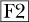。帧的持续时间以毫秒为单位，并在括号中指定，例如 `(200ms)`，而替换模式也在括号中指定，例如 `(replace)`。图层在屏幕上的显示顺序是*从下到上*。

当帧是独立图像时，它们都存储在一个文件夹中，并按顺序命名。名称类似于*name*`_00001.xcf`、*name*`_00002.xcf`，依此类推（其中 *name* 是你指定的名称）。这些帧的持续时间无法更改，因此要放慢动画的部分速度，必须复制帧；要加快速度，则需要删除帧。由于帧是图像而不是图层，因此没有替换模式可用。每一帧都会替换前一帧。

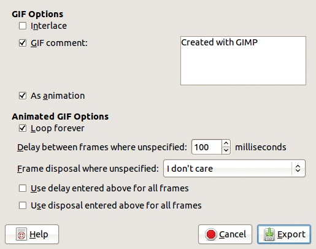

图 18-1. GIF 导出文件对话框

## 输出格式

简单的动画通过 GIF 编码表示，GIF 导出文件对话框（如图 18-1 所示）可以设置为将帧保存为动画，而不是设置为将图像合并。当选择导出为动画 GIF 时，还可以选择

+   动画是只运行一次还是永远循环

+   帧的持续时间

+   替换模式（称为*帧处理*）

+   是否对所有帧使用指定的持续时间

+   是否对所有帧使用指定的替换模式

每帧默认的延迟时间是 100 毫秒，这意味着每秒只有 10 帧。这个延迟对于慢速动画是足够的，但如果动画有快速动作，帧频应该更高，否则动画会显得卡顿。要增加帧频，减少每帧的持续时间，例如，设为 40 毫秒，就能获得每秒 25 帧的频率。

使用 GIF 进行动画制作有这种编码的所有缺点，其中最大的缺点是索引表示法，在第二十章中有更详细的解释。基本上，GIF 最多只能表示 256 种不同的颜色，这对于卡通或标志来说足够，但不适合家庭录像。

GIF 动画可以在任何图形化网页浏览器中查看，因此它们在网页上非常流行。你可以使用 `` HTML 标签在页面中显示图像。它必须在动画开始之前完全加载，因此请将动画大小保持在几百 KB 以内，并避免在页面上使用多个动画。

JPEG 编码不能用于动画，但相应的 MPEG 编码可以。根据官方 MPEG 网站 (*[`mpeg.chiariglione.org/`](http://mpeg.chiariglione.org/)*)，MPEG-1 于 1988 年确立，是视频 CD 和 MP3 的标准。DVD 是基于 MPEG-2 的，而 MPEG-4 是多媒体标准。其他版本，如 MPEG-7 和 MPEG-21，也有现代应用。

MPEG 是由 JPEG 帧组成的视频。当连续帧之间的差异较小时（例如只有一个人的嘴巴在动），你不需要再次表示整个帧，从而减小视频文件的大小并提高可行的帧频率和清晰度。

所以，MPEG 视频由几种帧类型组成：完整的 JPEG 图像，当前帧与前一帧之间的差异帧，以及当前帧与下一帧之间的差异帧。视频录制器必须同时保存三种不同的帧，包括定期间隔的完整 JPEG 帧。

MPEG 格式也会对音频进行编码，正如大多数视频格式所做的那样。GAP 插件集生成 MPEG-1 和 MPEG-2 格式。

类似于 JPEG，PNG 也有一个对应的动画编码格式，叫做 MNG。不幸的是，某些网页浏览器不支持此格式，因此它不是一个可行的替代 GIF 动画的格式。由于这个原因，我们不会详细介绍它，但 GIMP 可以处理 MNG 动画。

虽然它们可以使用索引表示法，PNG 和 MNG 通常使用 RGB，而 GIF 始终使用索引表示法。转换为索引表示法不可避免地会导致质量损失，而在处理动画时，这种损失更为严重。如果 MNG 格式能被更多浏览器支持，它将比 GIF 更适合用于网页动画。

一些专有格式也可以通过 GIMP 与 GAP 插件支持，但我们不会涉及这些内容，除了说明 GAP 可以生成 Apple QuickTime 格式并读取其他专有格式，如 Microsoft AVI。

由于动画可以表示为图层或图像，使用几种不同的格式，你会发现转换工具非常有用。GAP 提供了相应的工具来进行转换。

+   将多图层图像转换为多图像动画，反之亦然。

+   将 MPEG 或 AVI 动画转换为多图像动画，反之亦然。

## 优化动画

动画通常是一个非常大的文件。例如，如果一个 JPEG 文件是 33KB，而你用 21 帧（大约 2 秒钟！）的图像制作动画，最终得到的动画文件会是 1.8MB。你可以推算出，如果使用类似的照片制作一分钟的动画，文件大小会超过 54MB，这对于网页来说太大了。

幸运的是，动画文件的大小可以通过优化来减少。例如，GIMP 提供了一个优化动画 GIF 的工具。如果动画中只有一个小区域发生变化（比如手的移动、一个人的微笑），那么图像中不随帧变化的部分只会在背景图层中出现一次。后续图层保持透明，除非某些地方发生变化，这样可以大大减小文件的大小。

当我们将这个工具应用于 1.8MB 的动画时，我们将其大小减少到 337KB（为原始大小的五分之一）。这个减小幅度很大，但 54MB 的一分钟动画仍然太大，不适合网页，因为它的大小仅能减少到大约 10MB，而网页上的非流媒体视频的大小最好控制在 2MB 以内。MPEG 格式能比 GIF 优化更有效地压缩视频大小，因此它成为了网页视频的标准。

# 18.2 构建多层动画的工具

在这一节中，我们介绍了一些用于构建动画的工具，这些动画将作为单个图像存储，每个图层作为一帧。一些工具在第六章中已经使用过，在那里我们演示了简单的动画技巧。

## 手工制作动画

假设你想在固定背景上移动一个物体，就像 50 年前的卡通动画师一样。例如，你可能想让一架老式双翼飞机在一个田野上着陆。你可能会尝试 6.1 教程：动画文本中展示的方法，将飞机在不同位置的图像放置在不同的图层中。但是你会遇到一个问题：每个你定位的飞机都会添加到图像中，而不是替换之前的飞机，所以最终的动画会充满飞机。而如果你在图层中选择替换模式，背景会在飞机出现的瞬间消失。

要让这个动画正常工作，你可以按以下方式操作：

1.  为每个平面图层复制背景。

1.  将背景图层放在每个飞机图层下方。

1.  将每个飞机图层与下面的背景图层合并。

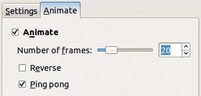

图 18-2. IWarp 对话框，动画选项卡

现在动画可以正常工作了，但即使是制作一个短动画，手动操作也需要很长时间。有没有可能拥有一些自动化工具来简化动画制作过程？使用 GIMP，我们可以。

## IWarp 工具

IWarp 工具，可以通过**图像：滤镜 > 扭曲 > IWarp**访问，在交互式变形中进行了演示，其对话框如图 6-32 所示。

要使用 IWarp 进行动画，将图像像处理静态照片一样进行变形，然后点击 ANIMATE 标签并选择生成动画。在图 18-2 中，我们选择了在第一张和最后一张图像之间创建 20 帧，并选择了 PING PONG 模式，该模式会反向重复动画。这些设置会生成 40 层（20 层正向和 20 层反向），编号从 0 到 39。由于帧数决定了动画的平滑度，除非最终文件大小至关重要，否则不要减少帧数。如果你打算将动画导出为 GIF 文件，你可以在稍后优化它以减小文件大小。

## Morph 工具

Morph 工具是 GAP 的一部分。它通过逐步将一张图像转变为另一张图像，生成多层次动画。你可以用它在人物图像之间进行变形，如第六章所示。你也可以用它将一个单词变形为另一个单词，接下来我们将演示这一过程。

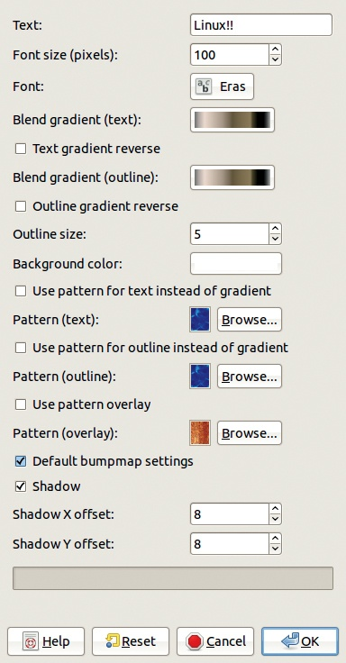

图 18-3。构建其中一个标志

### 变形文本

在这个例子中，单词“Windows”将通过几次点击逐步变形为单词“Linux!!”。

首先，使用**图像：文件 > 创建 > 标志 > 光泽**来构建标志，采用默认参数，如图 18-3 所示。在文本框中输入*Windows*来创建第一个标志（图 18-4），然后输入*Linux!!*来创建第二个标志（图 18-5）。将两个标志都压平（**图层：右键 > 压平图像**），使它们各自只包含一个图层。通过将 Linux 图层缩略图拖到 Windows 图像上，作为新图层将其复制到 Windows 图像中。

由于 Linux 图层比 Windows 图层窄，你必须通过**图像：图层 > 图层调整为图像大小**来增加其大小以匹配 Windows 图层。同时为两个图层添加 Alpha 通道。

现在通过选择**图像：视频 > 变形 > Morph**来应用 Morph 工具，这会打开图 18-6 中的对话框。

图 18-4。初始标志

图 18-5。最终标志

如何放置*形状点*决定了第一张图像中的一个点是如何变形为第二张图像中的一个点的。对于更复杂的项目，应该谨慎选择点，但在这个例子中，只需点击 SHAPE 按钮，工具会自动在两张图像的边缘创建并放置点。

STEPS 的数量是动画中的帧数。选择 20，点击确定，就完成了！动画会循环播放，但你可以通过增加上层的持续时间来在每次迭代之间暂停它。优化动画并将其保存为 GIF。

### 变形工具对话框

让我们逐个部分探索这个对话框。在左上部分，SOURCE 菜单允许你选择在 GIMP 中打开的图像中的源图层。X 和 Y 框显示源图层中当前形状点的坐标。你可以通过点击图层图像来设置这些点，也可以使用右侧的垂直箭头调整坐标。点击 FIT ZOOM 可以重置缩放，以显示整个源图层。

右上方部分类似于左上方部分，只不过它处理的是目标图层而非源图层。此部分还包括 POINT，显示当前的形状点。你可以选择任何形状点，然后通过 X 和 Y 框来更改或查看其位置。

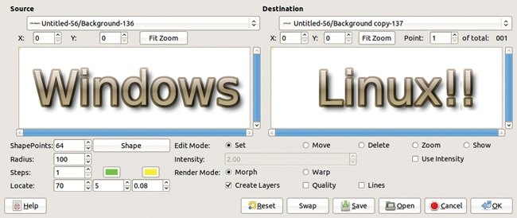

图 18-6. 变形工具对话框

对话框的左下部分包括以下选项：

+   SHAPEPOINTS 和 SHAPE 用于设置自动放置的形状点的数量并进行放置。你使用的形状点越多，变形的精度就越高。但当你使用更多形状点时，也会消耗更多的计算能力。通常，应该在变化发生的地方放置形状点：如果图像中这两个点之间没有重要的变化，就不需要放置两个靠得很近的点。

    自动形状点沿源图层的轮廓放置。透明像素不包括在轮廓内。

    如果你  - 单击 SHAPE 按钮，指定的点数会被*添加*到现有的点数中。否则，指定的点会替换现有的点。

+   RADIUS 设置每个形状点所影响的区域大小。

+   STEPS 设置要在源图层（底部）和目标图层（顶部）之间添加或修改的图层数量。任何现有的中间图层都会被修改。

+   位于 STEPS 框右侧的两个颜色按钮设置源和目标形状点的颜色。

+   LOCATE 对于自动定位源图层和目标图层中的特征非常有用，但由于涉及计算，可能会耗费较长时间。它通过点击形状点触发。源形状点会自动放置到离特征最近的位置，目标点则放置到与源点最匹配的特征上。对话框中的第一个字段设置源图层的半径，第二个字段设置目标图层中要搜索区域的半径，最后一个字段是用于检测特征的边缘检测阈值。你可以调整这些参数，但它们的默认值已经非常合适。

最后，Morph 工具对话框的右下部分包含以下设置：

+   EDIT MODE 有五个选项。SET 是最通用的。它允许你通过点击源图层添加一个新的形状点。点击可以在现有点附近创建一个新点。右键点击可以删除现有的点。此模式还允许你将现有点拖动到新位置。MOVE 模式类似于 SET，但点击不会创建新点。

    DELETE 模式仅用于删除一个点。ZOOM 模式允许你放大特定的点。点击会缩小视图。SHOW 模式应该只是显示你点击的点的坐标，但在本书印刷时，此模式无法使用。

+   如果选择 USE INTENSITY，INTENSITY 会激活。选中此框时，形状点的影响随着距离变形半径的增加而几何级数下降。未选中 USE INTENSITY 框时，影响则线性下降。

+   RENDER MODE 可以设置为 Morph 或 Warp。MORPH 是正常模式。在此模式下，源图层通过*正向变形*（将源图层变形为目标图层）、*反向变形*（将目标图层变形为源图层）和*交叉渐变*逐步转变为目标图层。WARP 模式仅使用正向变形进行过渡，但每次尝试时，结果都很奇怪且不太有用。

+   选中时（默认选中），CREATE LAYERS 会创建 STEPS 框中指示数量的新图层。未选中时，现有图层会被修改，但不会创建新图层。

+   选中时，QUALITY 使用更好的变换算法，但这个算法需要更多的处理器资源，并且可能会导致工具崩溃。

+   选中时，LINES 框会显示小向量，展示特定形状点将如何被移动。

+   RESET 按钮会移除所有现有的形状点。

+   SWAP 按钮会交换源图层和目标图层，但不会移动图像中的图层。

+   SAVE 和 OPEN 按钮的功能与预期一致：SAVE 将所有形状点坐标保存在文件中，而 OPEN 加载先前保存的坐标。打开功能允许你将相同的形状点用于不同的图像，或者保存一个部分完成的项目，以便稍后返回继续，比如尝试不同的选项值。

## 过滤所有图层

这个工具可以通过**图像：过滤器 > 过滤所有图层**访问，它也是 GAP 的一部分，但用于多层动画。其概念很简单：

1.  构建一堆图层，例如，通过重复复制一个图层。

1.  使用 GIMP 的众多过滤器之一，对所有图层应用转换。

你可以使用相同的参数应用此过滤器到所有图层，或者你可以逐层更改参数值。

图 18-7 展示了所有图层过滤器对话框。左侧菜单列出了众多可用的过滤器，命名为`plug-in-`*filter-name*。这些名称按字母顺序排列。你可以使用对话框右下角的按钮来搜索特定的过滤器：

+   按名称搜索（SEARCH BY NAME）将搜索框中输入的字符与可用过滤器的名称进行比较。

+   搜索描述（SEARCH BY BLURB）会在过滤器描述中进行搜索，描述位于对话框右上方的参数（PARAMETERS）上方。

+   按菜单路径搜索（SEARCH BY MENU PATH）会在菜单路径中进行搜索，该路径位于描述上方。

在前两种情况下，输入在搜索框中的字符串会被当作*正则表达式*处理。使用表达式进行搜索是一个复杂的概念，因此我们只提供你进行高效搜索所需的基本解释。简而言之，普通字符（如字母或数字）与其本身匹配。点（`.`）可以代表任何字符，因此`c.l.r`可以匹配`color`和`celar`。星号（`*`）可以匹配前一个字符的任何出现次数，包括零次，因此`sear*ching`可以匹配`seaching`、`searching`和`searrrching`。点和星号符号也可以组合使用，因此`color.*hance`可以匹配`color-enhance`、`colorhance`和`colorabcdhance`。

当你在左侧菜单中选择一个过滤器时，它的描述会出现在右侧的对话框中。大多数描述是为 GIMP 开发者编写的，而不是普通用户，但你仍然可以从中学习。这些描述让你大致了解过滤器的作用，参数描述则帮助你了解可以在过滤器对话框中修改的内容。

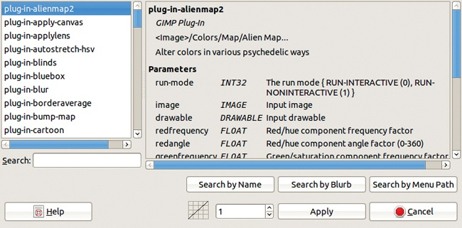

图 18-7。所有图层过滤器对话框

一旦选择了插件，对话框底部的前两个选项可能会激活。如果选择的插件没有任何参数（如`plug-in-blur`），这些选项则会被禁用。如果这些选项被激活，它们允许你选择*加速特性*：

+   0 意味着滤镜将以相同的参数值应用于所有层级。在这种情况下，左侧的框是空的。

+   1 意味着参数会从第一个值变化到最后一个值，并且速度保持恒定。左侧的框显示一个上升的对角线。

+   负值意味着变化速度将减慢（减速）。左侧的框显示一个凸形曲线。

+   正数值（除 1 外）意味着变化速度将加快（加速）。左侧的框显示一个凹形曲线。

+   你可以通过数值输入、右侧的小箭头或拖动曲线来设置加速值。

做出选择后，点击“应用”。如果滤镜有参数，其对话框将打开，显示预览和变量参数。如果加速为 0，则此对话框只出现一次，因为所有层级的参数相同。如果加速不为 0，滤镜对话框将出现两次，第一次是针对底部层，第二次是针对顶部层。记住，动画是从底部到顶部播放的。在第二个滤镜对话框之前，会出现一个小的警告对话框。在这个第二个滤镜对话框中，你可以选择滤镜参数的最终值。接着会弹出一个新对话框，要求输入一个备份文件的名称，用于构建中间层。这个文件的大小和最终动画差不多，但你不需要保存它，因此文件名不重要，可以将其存储在临时文件夹中。

点击“继续”，滤镜会应用到所有层级，并根据加速因子在第一个和最后一个值之间插值。

你还会看到一个跳过帧的按钮。它显示要跳过的帧的编号，点击后会再次弹出对话框，询问文件名。你可以选择继续或者跳过下一个帧。不过，第一帧是不能跳过的。使用跳过功能的一种方法是将初始参数设置为滤镜无效，然后跳过几帧再开始应用滤镜。这样做相当于将加速设置为一个较大的正数。

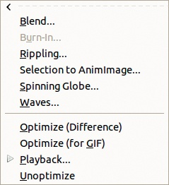

图 18-8. 动画菜单

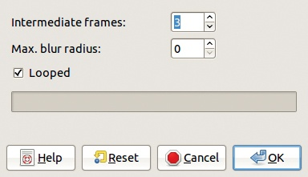

图 18-9. 混合对话框

滤镜所有层级没有撤销功能，但你可以反复使用正常的撤销功能（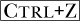），或者打开撤销历史对话框。当然，如果有很多层级，逐一撤销每一层会很麻烦，所以在对所有层级应用滤镜之前，最好先保存原始图像。

# 18.3 动画菜单

我们已经涵盖了大部分用于创建多层动画的工具，但还需要讨论一些**图像：滤镜 > 动画**菜单中的小工具，如图 18-8 所示。

## 混合

混合工具至少需要两层加上一个背景层。

在工具对话框中选择中间帧的数量 *n*（图 18-9）。中间帧是前一帧和后一帧的合成。新图像是由 (*n* + 1) × *f* 层组成，其中 *f* 是原始图像中的总层数（不包括背景层）。如果只有两层，新图像将有 2(*n* + 1) 层。第一层逐渐消失，然后下一层出现，然后第一层再次渐显。如果有更多层，层会从底层到顶层逐渐消失和出现，然后再从顶层到底层。

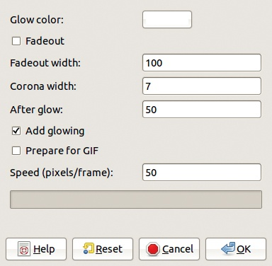

图 18-10. 烧录对话框

这个工具生成的动画非常具体，因此应用场景有限。

## 烧录

烧录工具生成一个动画，其中一张图片逐渐褪去并过渡到另一张图片。此工具需要一个具有两层的起始图像。上层*必须*具有 Alpha 通道，并且该层必须被选择，否则该工具在菜单中将变灰。图 18-10 显示了工具对话框。对话框的上部指定了层之间过渡的方式。

当勾选了 FADEOUT 时，上层会从左到右逐渐褪色，显示下面的层。图 18-11 显示了动画的中间层，FADEOUT 宽度设置为 200 像素。

如果勾选了 ADD GLOWING，则在 GLOW COLOR 框中指定的颜色将为过渡添加“发光”效果。图 18-12 显示了动画的中间层，淡出宽度设置为 250 像素，以考虑到发光的宽度（50 像素）。

当未勾选 FADEOUT 时，上层完全消失。图 18-13 显示了使用发光效果时的动画中间层。动画速度由上层每帧变透明的像素数来指定。帧数会自动根据这个数值计算。

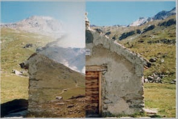

图 18-11. 褪色但不发光

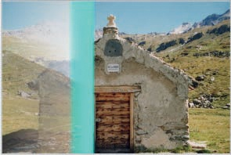

图 18-12. 褪色并带有发光

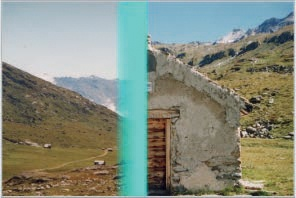

图 18-13. 发光但不褪色

## 波纹效果

这个工具接收一个单层图像，并构建一个动画，模拟图像在水面上的反射，波纹看起来仿佛是风吹动造成的。图 18-14 展示了波纹工具对话框，图 18-15 展示了一个波纹动画的单层。RIPPLING STRENGTH 设置风的力度。NUMBER OF FRAMES 是创建的层数。

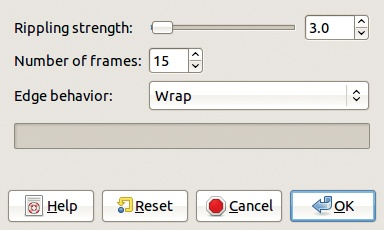

图 18-14. 波纹对话框

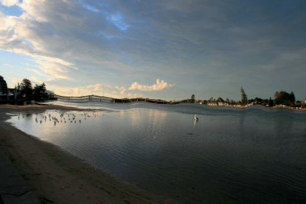

图 18-15. 一个波纹动画的单层

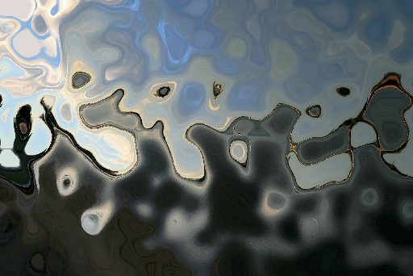

图 18-16. 波纹强度的效果

EDGE BEHAVIOR 指定了图层边缘的处理方式。BLACK 保持图像边框直线，另外两种模式（WRAP 和 SMEAR）以不同方式扭曲边框。

只有当波纹强度大于默认值 3.0 时，边缘行为效果才会显现。较高的波纹强度会导致图像严重扭曲，如图 18-16 所示，其中强度设置为 80。

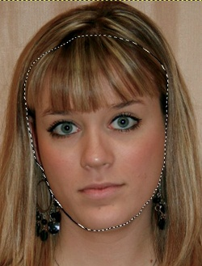

图 18-17. 选中面部的肖像

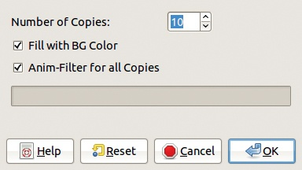

图 18-18. 选择到动画图像对话框

## 选择到动画图像

选择到动画图像工具与过滤所有图层中讨论的过滤所有图层工具非常相似。在本节中，我们重点讨论它们之间的区别。

图 18-17 显示了一个单层图像，并且使用自由选择工具进行了选择，并通过快速蒙版进行了修正。

选择到动画图像工具对话框，通过**图像：滤镜 > 动画 > 选择到动画图像**访问，如图 18-18 所示。你可以选择生成的图层数量。这个插件会自动创建图层，不同于过滤所有图层工具。你还可以选择用于填充选择外部新图像的颜色，并选择是否将滤镜应用于所有新图层。如果滤镜没有应用于所有新图层，工具将生成图层但不应用滤镜……所以它只是复制了该图层！

当你应用滤镜时，两个新窗口会替换掉对话框：

+   一个新图像，包含初始图像中选定部分的副本，并且背景层的副本数量在前面的对话框中指定

+   一个与 图 18-18 完全相同的对话框，允许你选择一个滤镜

你可以选择卡通滤镜，例如，选择 APPLY VARYING 打开卡通滤镜对话框（见 图 17-148）作为第一层。将 PERCENT BLACK 设置为 0，然后点击 OK。在下一个对话框中，将 PERCENT BLACK 设置为 1.000 作为最终层。

结果是一个逐步将肖像转化为卡通的动画。

## Spinning Globe

Spinning Globe 工具会自动将图像映射到地球仪上，并使其旋转。只需选择一张图像，打开工具，设置两个参数，决定是否选中三个复选框，然后计算机就会完成剩下的工作。

你使用的图像决定了地球仪的形状。如果图像是正方形的，地球仪是一个球体。否则，它是一个椭球体。

为了演示，我们使用了之前相同的肖像。当我们选择 Spinning Globe 工具（**图像：滤镜 > 动画 > Spinning Globe**）时，出现如 图 18-19 所示的对话框。在这里，我们选择帧数。对于照片，10 帧太少，会导致动画卡顿。然而，对于简单的图形，10 帧可能足够。你还可以选择旋转方向，默认是从右到左，并选择动画的背景是否透明（你可以稍后添加背景）或使用背景色。动画还可以使用指定数量的颜色进行索引，如果你计划将动画导出为 GIF，这种做法是明智的。最后，你可以选择在图像的副本上进行工作。

图 18-19. Spinning Globe 对话框

图 18-20. 最终动画

在这里，我们将 FRAMES 设置为 30，并取消勾选 TRANSPARENT BACKGROUND。图 18-20 显示了在帧 2 停止的动画。

## Waves

Waves 工具比 Spinning Globe 更加易于使用，结果也不差。Waves 工具生成的动画看起来像是投石入湖时产生的波纹。

图 18-21. Waves 对话框

当你选择 Waves 工具时，出现如 图 18-21 所示的对话框。石头总是落在图像的中央，波纹的比例由图像本身决定。但你可以选择以下选项：

+   帧的数量。通常六帧就足够了。

+   波浪的振幅和波长。默认值通常就可以了。

+   移动的方向。如果你点击“反转方向”，波浪将朝向动画中心移动并消失，这种效果很奇怪，因为它违背了已知的物理规律。

单击“确定”以生成帧。图 18-22 显示了初始图像和动画的效果。

## 优化和播放动画

动画菜单有四个附加选项，允许你优化和播放动画：

+   OPTIMIZE (FOR GIF) 可能是你最常使用的选项。它将多层图像保存为 GIF 动画。此工具没有对话框，会生成一个与原始图像具有相同层的新的图像，但（希望）大小有所减少。

+   PLAYBACK 测试作为多层图像生成的动画。在此工具的对话框中，图像显示为原始大小，没有任何缩放，这可能会带来问题，如果图像大于屏幕，因为工具栏可能会显示在屏幕外面。如果发生这种情况，只需使用来关闭对话框。

    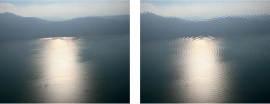

    图 18-22. 波浪动画，前（左）和后（右）

    工具栏按钮应该是自解释的，除了 DETACH 按钮，它会移除图像动画并允许你移动框架。如果你想使用来关闭框架，确保先选择的是框架窗口（而不是完整的动画）。

+   OPTIMIZE (DIFFERENCE) 与 OPTIMIZE (FOR GIF)的效果几乎相同。主要区别在于，OPTIMIZE (DIFFERENCE) 保持所有层与图像相同的大小，而 OPTIMIZE (FOR GIF)则尽量将每一层做得尽可能小。生成的文件大小可能会略有不同，但很难预测哪个过滤器会生成最小的文件。

+   UNOPTIMIZE 在你编辑一个已经优化的动画时非常有用。如果你想添加或删除帧，首先需要撤销优化，然后进行更改，最后重新优化动画。

# 18.4 移动路径工具

本章的其余部分将重点讨论多图像动画。如 方法三：沿路径移动 中所述，多图像动画通常存储在一个特定的文件夹中，每一帧都是一个单独的文件，命名有规律（例如 *name*`-0001.xcf`）。数字的位数决定了帧的最大数量，在这个示例中为 9999。数字会变化，但 *name* 对所有帧都是相同的。该文件可以是 GIMP 处理的任何类型，但 XCF 是最佳选择，因为它是唯一支持图层和选区的格式。

在本节中，我们将探索 GAP 的主要工具，通过 **图像：视频 > 移动路径** 访问。

此工具将图层从源图像复制到目标动画。在复制过程中，这些图层可以以各种方式进行变换。源图像可以是单层或多层图像，或者是多帧动画。目标动画必须是多帧的，因为移动路径工具不生成帧。

在使用移动路径工具之前，请在 GIMP 中打开目标动画的第一帧以及源图像或动画。源图像和目标图像必须是相同类型：RGB、索引色或灰度图像，但它们不能是相同的文件。如果你想在动画中复制某个内容，必须先复制动画，因此源文件和目标文件必须是不同的。

为了演示移动路径工具，我们选择了一个多层动画作为源，并选择了 图 6-43 中的多帧动画作为目标。工具的大型复杂对话框如 图 18-23 所示。为了让事情更清晰，我们将在接下来的图示中突出显示对话框的某些部分。

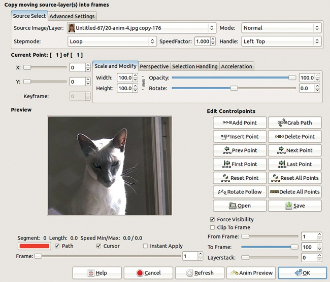

图 18-23. 移动路径对话框

## 选择源图层

由于该工具的目的是将图层复制到帧，因此你需要决定将哪些图层复制到哪些帧。每一帧目标图像中都会加入源图像中选定图层的一个副本。

你可以在对话框的左上角选择源图层（图 18-23）。菜单 SOURCE IMAGE/LAYER 显示源图像的所有图层或源动画的所有帧。如果源是一个多帧动画，并且每一帧有多个图层，这些图层会在复制之前被合并。我们从一个 41 层的图像中选择了 1 层作为源。

STEPMODE 菜单让你选择在源图像是多层图像或多帧图像时如何选择图层或帧。当源图像是单层图像时，选择 NONE。当源图像是多层图像时，如我们的示例所示，你可以从五种不同的步进模式中进行选择：

+   LOOP 按顺序选择层，每个连续的目标帧选择一个（具体取决于稍后讨论的 SPEEDFACTOR）。当最后一层是源层时，循环从此层开始，接着是第一层，然后按顺序选择剩余的层。

+   LOOP REVERSE 与 LOOP 相同，不同之处在于源层按逆序选择。

+   ONCE 与 LOOP 相同，不同之处在于复制在最后一层后停止，而不是循环回到第一层。

    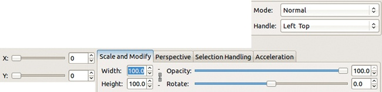

    图 18-24. 选择选定层的变换参数

+   ONCE REVERSE 与 ONCE 相同，不同之处在于源层是按逆序选择的。

+   PING PONG 按顺序首先选择层，一旦选择完最后一层，便反转顺序。

当源动画是多帧时，STEPMODE 提供六种等效模式，它们的名称都以 FRAME 开头。当一帧中有多个层时，选择的层在某一帧中并不重要，因为该帧中所有可见的层都会被压平，而步进模式是选择帧而不是层。

处理层选择的最后一个参数是 SPEEDFACTOR，它改变源层的步进速度。当其值为 1.0 时，源步进和目标步进是同步的。当其值为 0.5 时，源步进速度减慢至一半，因此每个层会被复制到两个连续的帧中，然后才步进到下一个层。当其值为 2.0 时，源步进速度加快至两倍，因此每隔一层才会复制一个。

如果 STEPMODE 为 NONE 或 FRAME NONE，则速度因子无关紧要。

## 选择目标帧

你可以在对话框的右下角选择目标动画（图 18-23）。FROM FRAME 和 TO FRAME 光标限定了目标帧的范围。默认情况下，它们设置为目标的完整范围，因此更改将应用于整个动画，但你也可以选择仅针对动画的某一部分进行操作。

FORCE VISIBILITY 会使所有源层都可见，即使它们在源中不可见。CLIP TO FRAME 会将复制的层裁剪到目标帧的图像边界。LAYERSTACK 指定复制的层应该插入到目标帧的层堆栈中的位置。默认值为 0，表示堆栈的顶部，因为现有层是从顶部到底部编号的，起始编号为 0。

## 应用变换

图 18-24 显示了“移动路径”对话框中的部分内容，您可以选择在其中应用变换。您可以使用 X 和 Y 坐标来决定变换应用的位置。HANDLE 菜单指定了这些坐标原点在所选图层中的位置。可选项有 LEFT TOP、LEFT BOTTOM、RIGHT TOP、RIGHT BOTTOM 和 CENTER。通常，CENTER 是最佳选择，特别是当图层应用旋转或缩放时。

可以通过模式菜单（MODE）将混合模式应用于目标帧中的图层。

您可以通过设置 WIDTH 和 HEIGHT 来缩放源图像。这些值是百分比。如果右侧的链条被断开，值可以独立更改。

OPACITY 以百分比指定。ROTATE 以度数指定，负值会导致逆时针旋转。旋转中心是图像的句柄。

还有两个选项卡处理图层变换。图 18-25 显示了用于转换透视的 PERSPECTIVE 选项卡。八个计数器指定了图层四个角的 *x* 和 *y* 坐标的变换因子。如果所有因子的值为 1.0，则不进行变换。使用因子 0 进行缩放会将点移向中间。使用因子 2.0 进行缩放会将点向外移动，距离图层原始尺寸的一半。图 18-26 显示了图层的四个角，用红色标出，黑色数字表示因子，虚线显示了像素的最终位置。

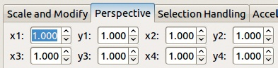

图 18-25. 透视选项卡，用于转换透视

图 18-26. 透视变形

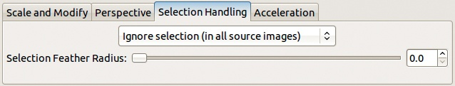

图 18-27. 选择处理选项卡

如果源图像有选择区域，您可以在图 18-27 所示的“选择处理”选项卡中控制如何处理它。选项卡顶部的菜单有三个选项：

+   IGNORE SELECTION (IN ALL SOURCE IMAGES) 忽略选择。

+   USE SELECTION (FROM INITIAL SOURCE IMAGE) 将初始源图像中的选择应用到所有复制的图层。未选择的像素是透明的。

    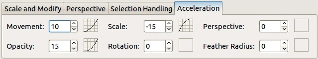

    图 18-28. 加速处理

+   USE SELECTIONS (FROM ALL SOURCE IMAGES) 如果源图像是多层动画，则与之前的选择相同。如果源图像是多帧的，则每个帧内的选择会被使用，如果某个帧没有选择，则该帧会被完整复制。

当使用选择处理时，你可以通过选择羽化半径光标来调整羽化，该光标会改变羽化边界内应用的像素数。

所有前述参数（移动、缩放、透视、透明度、旋转和羽化）在加速选项卡上进行控制（图 18-28）。每个参数都与一个数值字段[–100 到 100]以及一个小方框相关联。如果字段值为零，表示移动速度是恒定的（即没有加速）。如果字段值为正，表示移动加速，小方框显示一条曲线，表示加速的陡峭程度。如果字段值为负，表示移动减速。你可以通过键入值、点击小的上下箭头，或拖动小方框来更改字段值。

## 控制点

*控制点* 是一组应用于图层的变换参数。你可以为所有通过移动路径工具处理的帧定义一个单一的控制点，或者你可以定义一系列控制点，这些控制点共同构成一个*控制路径*。

当你只有一个控制点时，变换参数会以相同的值应用于所有图层副本，直到目标帧。如果你有多个控制点，这些控制点将分布在目标帧中。第一个和最后一个控制点始终对应第一个和最后一个帧。其他控制点通常均匀地分布在其余目标帧之间。

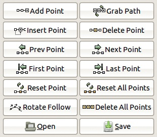

图 18-29. 指定控制点

图 18-29 显示了对话框中聚焦于控制点的部分。当前控制点的编号显示在对话框的顶部，位于 X 和 Y 光标上方。对变换参数的任何更改仅应用于当前控制点。请注意，在接下来的讨论中，当我们提到变换参数时，我们并不指*x*和*y*坐标。该对话框有 14 个按钮与控制点相关联。

+   ADD POINT 在最后一个控制点之后添加一个控制点，且该控制点的变换参数与最后一个控制点相同。

+   GRAB PATH 删除所有控制点，并用路径的锚点替换它们（参见 13.3 路径工具），这些锚点来自于打开移动路径工具的图像。这些点会被初始化为与当前设置相同的变换值。

    如果按下  并点击 GRAB PATH，将为所有目标帧创建控制点，并通过贝塞尔曲线定义的中间点连接锚点。

+   INSERT POINT 复制当前的控制点，新的副本成为当前控制点。

+   DELETE POINT 删除当前的控制点。请注意，无法撤销此操作。

+   PREV POINT 将前一个控制点设置为当前控制点。当你定义关键帧（详见关键帧）并按下  时，前一个关键帧的控制点将变为当前控制点。

+   NEXT POINT 对下一个控制点或关键帧执行相同的操作。

+   FIRST POINT 对第一个控制点执行相同的操作（当按下  时，对第一个关键帧执行相同的操作）。

+   LAST POINT 对最后一个控制点或关键帧执行相同的操作。

+   RESET POINT 将当前控制点的变换参数重置为默认值：宽度、高度和透明度为 100.0；旋转为 0.0；所有透视坐标为 1.0。

+   RESET ALL POINTS 将所有控制点重置为默认值。如果按下 ，该按钮会将所有控制点重置为第一个点的值。如果按下 ，则将所有控制点参数设置为从第一个和最后一个控制点插值计算出的值。

+   ROTATE FOLLOW 根据定义的路径和 *x*、*y* 坐标计算所有控制点的旋转值。如果一个物体从左到右水平移动，其旋转设置为 0°；如果从右到左移动，旋转设置为 180°；如果从上到下垂直移动，旋转设置为 90°。按下  时，将从第一个点的旋转角度中获取旋转偏移量，并将其加到所有其他点的旋转上，从而使物体可以从右到左移动而不被翻转。

+   DELETE ALL POINTS 删除所有控制点，但保留第一个控制点，并将其重置为默认值。

+   OPEN 从文件中加载控制点参数。

+   SAVE 将控制点参数保存到文件中。

## 关键帧

你将始终拥有比目标帧数少的控制点，并且默认情况下，控制点在各个帧之间均匀分布。你可以使用*关键帧*来改变这一点。

KEYFRAME 计数器位于对话框的顶部，X 和 Y 坐标下方。如果其值为零，则当前控制点未附加到任何关键帧；否则，当前控制点附加到该数字指定的目标帧上，这意味着控制点不需要均匀地分配到各个帧上。因此，你可以应用变换，使动画播放时速度加快或减慢。

## 预览窗口

对话框中央的预览窗口最初只显示第一个目标帧。几个按钮和一个光标帮助你控制此预览（图 18-30）。

FRAME 光标决定点击刷新时显示哪一帧。当选中即时应用（INSTANT APPLY）时，计数器值一旦更改，变更会立即应用。如果你正在处理大型目标动画，这可能会消耗较多的处理器资源。

当选中 CURSOR 时，预览窗口中会显示交叉的线条，表示*x*和*y*坐标的位置。当选中 PATH 时，预览窗口中还会显示连续控制点之间的路径。

PATH 按钮左侧的小框可以通过颜色选择器改变路径颜色。

## 测试移动路径工具

当你点击移动路径对话框右下角的 OK 时，会执行由控制点指定的转换。并非所有转换都可以撤销，因此在进行任何操作之前，务必先点击 ANIM PREVIEW，确保所有控制点和参数设置正确。

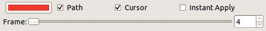

图 18-30. 控制预览

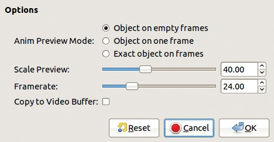

图 18-31. 动画预览对话框

当你点击 OK 或 ANIM PREVIEW 时，移动路径工具会首先检查控制点的数量是否大于目标帧的数量，以及关键帧是否按升序或降序排列（如果使用了关键帧）。

如果工具发现控制点数量大于目标帧数量，或者关键帧没有按相同方式排序，你会看到错误信息，并且不会执行任何转换。

如果没有出现错误信息，点击 ANIM PREVIEW 会打开图 18-31 中显示的对话框。动画预览是一个缩小版的多层文件，并且回放工具（通常通过**图像：滤镜 > 动画 > 回放**选择）会自动打开。

ANIM PREVIEW MODE 可以有三种值：

+   OBJECT ON EMPTY FRAMES 在空白帧（而非目标帧）上显示复制的图层，并填充背景颜色。

+   OBJECT ON ONE FRAME 在工具对话框的预览窗口中显示复制的图层在所显示的帧上的内容。

    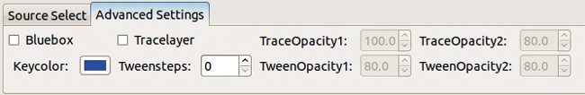

    图 18-32. 高级设置选项卡

+   EXACT OBJECT ON FRAMES 显示最终动画的缩小版。

第三个选项生成所需的时间较长，但预览更接近最终结果。

SCALE PREVIEW 改变预览的缩放比例。如果设置为 100.0，预览将不缩放，处理时间较长。通常，20 到 40 之间的值最为理想。FRAMERATE 设置动画的帧速率（每秒帧数）。勾选 COPY TO VIDEO BUFFER 时，可能会生成更平滑的动画。

预览生成一个新的多层动画，观看后你可以删除它。

## 高级设置

Move Path 对话框有一个高级设置标签，如图 18-32 所示。

当勾选时，BLUEBOX 会将蓝框滤镜应用到选定的图层，如 Bluebox 中所解释的那样。KEYCOLOR 与蓝框滤镜一起使用，并打开蓝框对话框。

勾选 TRACELAYER 框时，会在所有目标帧中创建一个附加图层。该图层显示从动画开始到上一个帧的所有移动图层位置。TRACEOPACITY1 指定此附加图层的透明度。TRACEOPACITY2 指定此透明度的渐变程度。

TWEENSTEPS 指定两个连续帧之间计算的虚拟帧数量，这些帧称为*tweens*，并包含在目标帧下方插入图层堆叠位置的*tween layer*中。这个过渡图层显示了移动物体在所有虚拟帧中的位置。该图层的透明度由 TWEENOPACITY1 计数器指定，并根据 TWEENOPACITY2 计数器的值在较旧的位置上逐渐消失。

当你同时有追踪层和过渡层时，过渡层是不可见的，因此运动对象的透明度不会增加。这些附加图层有助于模拟快速运动物体的运动模糊。

# 18.5 视频菜单

我们已经在**图像：视频**菜单中介绍了两个工具——Morph 工具和 Move Path 工具。在本节中，我们将讨论其余的工具。该菜单按字母顺序组织，但我们将按照逻辑顺序来讨论这些工具。

## 操作帧

视频菜单中的许多条目涉及帧操作，但也有相当多的条目执行非常简单的操作。

**图像：视频 > 跳转到**菜单包含五个条目，这些条目改变多帧动画中的当前帧。FIRST FRAME、LAST FRAME、NEXT FRAME 和 PREVIOUS FRAME 的功能显而易见。ANY FRAME 打开一个对话框，你可以通过数字选择一个帧。

DELETE FRAMES 允许你删除一段帧，从当前帧开始，到选定的帧为止。

DUPLICATE FRAMES 打开图 18-33 中的对话框。你可以选择开始帧和结束帧的编号，并设置复制该范围的次数。

EXCHANGE FRAME 打开一个对话框，你可以选择与当前帧交换的帧编号。

图 18-33. 重复帧对话框

图 18-34. 帧序列偏移对话框

图 18-35. 帧密度对话框

FRAME SEQUENCE REVERSE 打开一个对话框，其中有两个滑块，一个用于设置 FROM FRAME 的帧号，另一个用于设置 TO FRAME 的帧号。该工具会反转序列，使得 3-4-5-6-7 变为 7-6-5-4-3。

FRAME SEQUENCE SHIFT 打开如图 18-34 所示的对话框。前两个滑块定义了帧的子范围，最后一个滑块 N-SHIFT 指定将应用于该子范围的循环偏移量。序列的第一帧将在范围内向后偏移*N*个位置，依此类推，直到最后一帧，它的位置比第一帧多*N* - 1 个位置。

FRAMES RENUMBER 打开一个对话框，其中有两个滑块。第一个滑块指定第一个帧的新编号，第二个滑块指定帧编号的位数。所有帧都会重新编号。

图 18-36. 帧转换对话框

选择 FRAMES DENSITY 将打开如图 18-35 所示的对话框。此对话框允许您在密度增加时复制帧，或在密度减少时删除帧。

前两个滑块用于选择动画的子范围。DENSITY 的值可以从 1.0 到 100.0。选中 INCREASE DENSITY 时，密度会乘以该因子。否则，密度将被该因子除以。

使用帧密度工具将两种帧率不同的动画合并而不改变播放速度。例如，您可以将每秒 8 帧的动画转换为每秒 24 帧，方法是选择密度为 3.0，这将为每一帧添加两份副本。如果在增加密度后动画出现卡顿，请尝试创建*洋葱皮*层（请参见洋葱皮）。

由于帧密度工具没有撤销功能，因此在使用时请确保在动画副本上操作，这样如果出现错误，您可以返回到原始文件。

## 文件格式转换

FRAMES CONVERT 将多帧动画的子范围转换为不同的格式。帧转换对话框如图 18-36 所示。FROM FRAME 和 TO FRAME 设置子范围。BASENAME 指定新帧的存储位置。右侧的小框打开文件管理器对话框，您可以用它选择存储位置。

图 18-37. Frames Crop 对话框

使用 EXTENSION 字段选择你希望将动画转换成的格式。IMAGETYPE 菜单允许你将动画转换为 RGB、索引色或灰度。若选择 GIF 作为输出格式，务必转换为索引色。

勾选时，FLATTEN 会将输出文件中的图层合并，这对于大多数输出格式是必要的。此工具可以用来同时转换多个文件，只要这些文件具有统一的命名规则，并且支持多种可能的输入和输出格式。

FRAMES CROP 用于将多帧动画的*所有*帧裁剪到新的宽度和高度。其对话框如 图 18-37 所示。此工具作用于动画（而非其副本），裁剪区域外的帧区域将被丢弃。

你可以通过 NEW WIDTH 和 NEW HEIGHT 字段来改变裁剪的宽度和高度。X RATIO 和 Y RATIO 字段也会修改裁剪。如果这些字段右侧的链条断开，X 和 Y 尺寸可以独立修改。

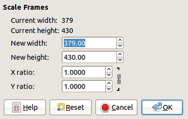

图 18-38. Frames Scale 对话框

一旦你改变了尺寸，你可以使用 X 和 Y 字段，或使用 CENTER HORIZONTAL 和 CENTER VERTICAL 按钮来定义裁剪后源图像中保留的部分。你也可以点击并拖动对话框底部的小矩形区域。

使用 FRAMES RESIZE 来改变多帧动画所有帧的画布大小。它会打开与 Frames Crop 工具相同的对话框。如果新的画布小于原始画布，结果与裁剪相同。

FRAMES SCALE 改变多帧动画中所有帧的缩放。其对话框，如 图 18-38 所示，包含与 Frames Crop 和 Frames Resize 对话框上半部分相同的字段。用于缩放帧的算法可以在 GIMP 偏好设置中更改（**图像：编辑 > 偏好设置**，工具选项条目，DEFAULT INTERPOLATION 字段）。

## 修改帧

FRAMES MODIFY 是一个非常强大的工具，你可以用它在当前多帧动画的子范围内修改选定的图层。其对话框如 图 18-39 所示。图层是根据它们的名称或在图层堆栈中的编号（最上层为 0）来选择的。在 LAYER SELECTION 标题下，有七个单选按钮，前六个使用下面的 LAYER PATTERN 字段。大部分单选按钮不言自明。

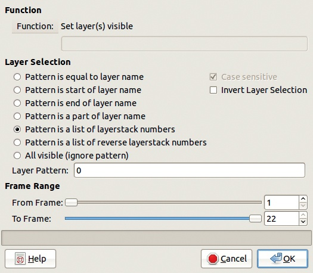

图 18-39. Frames Modify 对话框

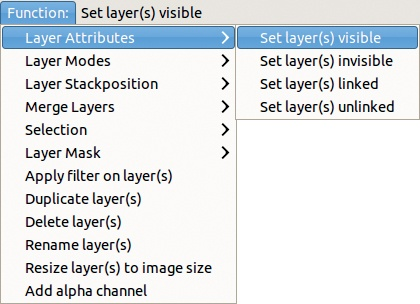

图 18-40. 选择功能

前四个按钮将字符串模式与图层的精确名称或其部分名称进行匹配。接下来的两个选项使用图层堆叠编号列表作为模式。例如，列表“0, 4–6, 8”会选择图层 0、4、5、6 和 8。最后一个选项选择所有可见图层。

当你使用字符串模式时，CASE SENSITIVE 复选框允许你区分 `Background` 和 `background`。在所有情况下，勾选 INVERT LAYER SELECTION 复选框将选择所有不符合你标准的图层。

和往常一样，通过使用 FROM FRAME 和 TO FRAME 滑块选择帧子范围。

使用 Frames Modify 工具时最复杂的部分是选择应用于选定图层和帧的功能。

图 18-40 显示了功能按钮菜单，位于对话框顶部。

+   LAYER ATTRIBUTES 让你在图层中执行简单的操作，你也可以通过右键单击图层名称在图层对话框中执行这些操作。

+   LAYER MODES 包含了 22 种混合模式，这些模式也可以通过在图层对话框中的 MODE 菜单进行选择。

+   LAYER STACKPOSITION 可以在图层堆叠中上下移动图层。

+   MERGE LAYERS 将选中的图层合并为一个。合并后的图层可以剪切到画布或背景图层，或扩展到画布。

+   SELECTION 有多个功能。前四个功能（REPLACE、ADD、SUBTRACT 和 INTERSECT）从用来打开工具的帧中获取选择，并将其与子范围内所有帧的现有选择合并。其余的功能以与 **图像：选择** 菜单中的条目相同的方式更改选择。

+   LAYER MASK 包含了多个功能。前七个功能可以通过选择 **图像：图层 > 蒙版 > 添加图层蒙版** 对话框或右键单击图层名称在图层对话框中找到。接下来的三个功能也可以在 **图像：图层 > 蒙版** 菜单中找到。剩下的两个功能可以从上下图层复制图层蒙版，并将该蒙版应用于所有选中的图层。菜单中其他条目的含义应该从它们的名称中可以清楚地理解。

请注意，某些功能要求你在工具对话框中功能名称下方的字段中输入一个名称。

APPLY FILTER ON LAYER(S) 功能会在你点击 OK 时打开一个对话框。这个对话框与 图 18-18 中显示的对话框相同，并且作用方式也相同。但该工具可以在多个图层上同时操作，且操作范围限定于某些帧的子范围内。

功能 APPLY FILTER ON LAYER MASK（在 LAYER MASK 子菜单中）将选定的滤镜应用于图层蒙版，而不是图层本身。如果子范围中第一帧的第一个选定图层没有图层蒙版，你将收到错误提示。如果所选滤镜应用了不同的值，则子范围中最后一帧的第一个选定图层也必须有图层蒙版。如果中间帧中的中间图层没有图层蒙版，它们将在 GIMP 处理帧子范围时被跳过。

为了正确使用这个强大的工具，你应该在所有帧中使用相同的图层堆叠结构。我们还建议使用有意义的图层名称，并且要在所有帧中系统地做到这一点。

## 修改图层

视频菜单中的几个工具，例如 FRAMES MODIFY（在上一节中讨论过），处理动画帧的图层。在这一节中，我们讨论视频菜单中其他修改图层的工具。

FILENAME TO LAYER 会在子范围内的所有帧中创建一个包含文件名的新图层。其对话框如图 18-41 所示。在 MODE 菜单中，你可以选择仅使用文件名中的数字、完整名称，或路径和名称的组合。在 FONTNAME 字段中指定字体，并通过 FONT BROWSER 按钮选择字体。

你还可以选择字体大小和名称左上角的坐标。保持 ANTIALIAS 框选中。如果未选中 CREATE LAYER 框，名称将写在活动图层上。

要使用该工具为动画的子范围中的所有帧编号，你必须从**图像：视频 > 修改帧**菜单中选择文件名到图层工具，并使用 APPLY FILTER ON LAYER(S)功能（叫做`plug_in_gap_renumber`）。

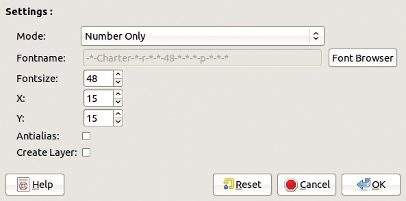

图 18-41. 文件名到图层对话框

FRAMES FLATTEN 会将指定子范围内的所有帧（合并所有图层）进行平坦化。它有一个对话框，里面有两个滑块，类似于图 18-33 的上部分。

FRAMES LAYER DELETE 删除子范围内所有帧的一个特定图层。它会打开一个对话框，里面有三个滑块，类似于图 18-33。

**图像：视频 > 图层**菜单有几个条目，可以直接访问，但从**图像：滤镜 > 滤镜所有图层**工具或**图像：视频 > 修改帧**工具中访问会更加有用。

## 在多图层和多帧之间转换

有两个工具可以将多图层动画转换为多帧动画，反之亦然。

SPLIT IMAGE TO FRAMES 必须从多层图像中打开。其对话框如图 18-42 所示。你不能选择新框架的名称或它们在文件夹层次中的位置。要将新框架保存到特定文件夹，请在将图像拆分为框架之前，将源图像放入该文件夹中。

默认情况下，扩展名是 XCF，这是最安全的扩展名，但你也可以选择任何 GIMP 支持的格式。对话框中有四个复选框，选中时执行以下操作：

+   INVERSE ORDER 从第一个框架（顶层图层）开始，而不是从底部框架开始。

    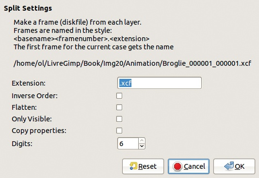

    图 18-42. 将图像拆分为框架对话框

+   FLATTEN 将新框架合并为一个图层，任何透明区域将填充为背景色。

+   ONLY VISIBLE 忽略不可见的图层。当未选中时，所有图层都会生成一个框架，无论它们是否可见。

+   COPY PROPERTIES 会将图像中现有的通道、路径和引导线复制到所有框架。当未选中时，这些属性会被忽略。

最后，DIGITS 计数器指定框架名称中数字部分的位数。

FRAMES TO IMAGE 从框架创建多层图像，因此必须从多框架动画中打开。其对话框如图 18-43 所示。

前两个滑块指定用于构建多层图像的框架子范围。LAYER BASENAME 字段允许你为图层命名。默认情况下，所有图层名称以 `frame_` 开头，但你可以将其更改为任何字符串。方括号中的数字符号将被框架号替换，但你可以更改数字的位数。每个图层的默认持续时间是每秒 24 帧，但你也可以更改它。

新图层是通过合并源框架中的图层来创建的（除非选择了 FLATTENED IMAGE）。LAYER MERGEMODE 让你选择如何确定图像大小。

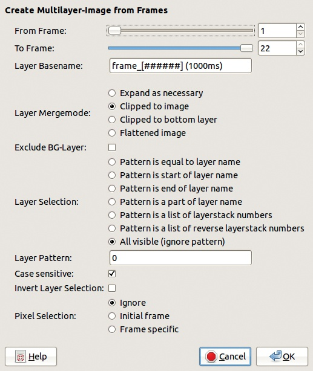

图 18-43. 框架到图像对话框

+   EXPAND AS NECESSARY 会扩展图像大小，以适应所有图层。

+   CLIPPED TO IMAGE 将图层裁剪到图像大小。

+   CLIPPED TO BOTTOM LAYER 将图像裁剪到源图层的底部图层大小。

+   FLATTENED IMAGE 通过将源图层压缩而不是合并来创建新图层，因此生成的图层与图像大小相同，没有透明部分。

选中时，EXCLUDE BG-LAYER 会从所有源框架中排除背景图层。当未选中时，这个图层与其他图层一样被处理。

LAYER SELECTION 决定如何选择源层。前四个选项中，LAYER PATTERN 字段是一个字符串，应该至少匹配你想选择的层名称的一部分。接下来的两个选项需要一个层号的列表（例如，“1, 3–5, 9”）。层的编号从零开始，从顶部层（或如果选择第三个选项，则从底部层）开始。最后一个选项选择所有可见层。如果勾选了 CASE SENSITIVE，则字符串的大小写必须匹配才能选择该层。勾选 INVERT LAYER SELECTION 可以反转所有这些选项。

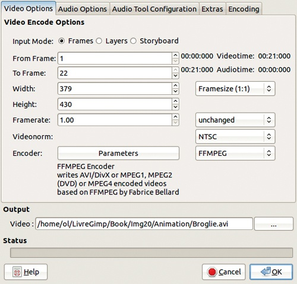

图 18-44. Master Videoencoder 对话框的第一个标签

PIXEL SELECTION 指定如何处理现有的选区。IGNORE 忽略源帧中的所有选区。INITIAL FRAME 使用子范围内第一帧的选区，并将其应用到所有帧。未选中的区域将变为透明，层的形状由选区决定。FRAME SPECIFIC 使用每个选定帧中的选区。

## 编码

MASTER VIDEOENCODER 将多帧或多层动画转换为特定的视频文件编码。其对话框如图 18-44 所示。你还可以使用带有此选项的故事板，详细内容请见 Storyboard。

OUTPUT 允许你命名输出文件。扩展名由 GIMP 根据所选编码器自动添加。右侧的按钮打开本地文件管理器。STATUS 字段显示转换进度。

此对话框中的第一个标签是 VIDEO ENCODE OPTIONS。你可以选择 INPUT MODE；不过，工具会根据源文件自动选择。接下来的两个字段定义了用作源的帧或层的子范围。

WIDTH 和 HEIGHT 指定结果视频帧的大小，单位为像素。右侧菜单列出了常用的标准尺寸。

FRAMERATE 指定每秒帧数。右侧菜单有一组标准帧率。

VIDEONORM 菜单包含常见的视频标准（NTSC、PAL、SECAM），这些标准通常取决于视频播放的国家。

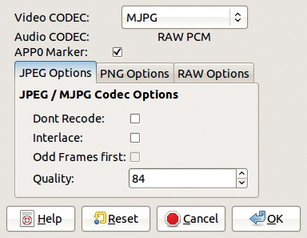

图 18-45. AVI1 编码器的参数对话框

ENCODER 仅在你选择一个编码器插件后才能使用，插件选择框位于右侧。例如，图 18-45 展示了 AVI1 编码器的参数。

Master Videoencoder 对话框中的其余标签处理的是音频选项和音频工具配置，这超出了本书的范围。

## 播放和导航

使用 PLAYBACK 可以预览多帧动画（但不能预览多层动画）。它无法播放 MPEG 或 AVI 文件。你可以通过**图像：视频 > 播放**打开播放功能，但也可以从 VCR 导航器（下文将讨论）或从故事板对话框（见故事板）打开。

播放对话框的下部分(图 18-46)包含标准的播放正向、暂停和播放反向按钮。  点击其中一个播放按钮会创建一个“快照”图像，这是一个小型多层动画，包含到目前为止播放过的所有帧。当动画正在播放时，你可以通过点击暂停按钮并使用左、中或右鼠标按钮，分别跳转到第一帧、中间帧或最后一帧。

播放对话框的顶部包含一组 50 个矩形，这些矩形是*GO 数组*，即 50 个当前帧的数组。将指针移动到数组上可以实时显示这些帧。你可以在动画的某个特定点暂停，或以不同的速度播放动画。点击其中一个矩形会在源动画窗口中显示该帧。如果动画的帧数超过 50 帧，GO 数组则是帧的子范围，通过将指针移到一侧，你可以更改数组中包含的子范围。鼠标滚轮也可以移动动画帧。

对话框右侧的按钮和计数器可以显示当前帧的信息，并设置要播放的动画子范围。当前帧计数器下方的两个计数器，或者计数器右侧的两个按钮用于选择范围。  点击这些按钮中的一个，将对应的帧设为当前图像。

你还可以设置帧速率和预览窗口的大小（以像素为单位），当你调整对话框大小时，预览窗口也会发生变化。

对话框右下角的五个框控件用于控制播放，大部分功能不言自明。查看动画后勾选 THUMBNAILS，因为它可以让你重复使用已生成的小图像。使用 EXACT TIMING 可以跳过帧并节省动画播放的时间。

VCR 导航器允许你对动画进行简单编辑或回放。VCR 导航器对话框如图 18-47 所示。中间是一个可滚动的帧缩略图列表。你可以看到帧的编号，以及从动画开始到当前帧的时间。FRAMERATE 和 TIMEZOOM 让你控制帧的频率和时间，结果会立即在缩略图区域显示出来。

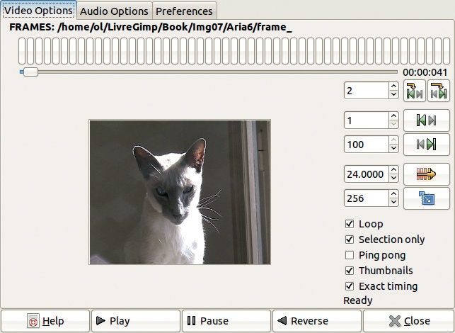

图 18-46. 播放对话框

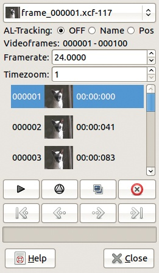

图 18-47。VCR 导航对话框

在 VCR 导航器顶部是动画选择器。接下来是 AL-TRACKING（活动图层跟踪）。活动图层跟踪会在新加载的帧中找到与前一帧的活动图层匹配的图层，并将该图层设置为活动图层。提供三种选项：

+   OFF 禁用活动图层跟踪。

+   NAME 比较从左到右的图层名称，并选择最匹配的图层。

+   POS 使用图层的堆叠位置；洋葱皮图层不计算在内。

在缩略图区域，你可以选择帧：单击选择一帧； - 点击添加（或移除）该帧到选中的帧； - 点击选择从前一图层到当前图层之间的所有图层。右键点击打开一个简单的编辑菜单（复制、剪切、粘贴等）。

缩略图下方有两排按钮。播放按钮打开播放工具。 - 点击它以使用所选帧构建一个临时多层动画，然后打开播放工具。

下一个按钮（三角形圈内）仅更新那些过时的缩略图；按下可以更新所有缩略图。下一个按钮会复制所选帧，最后一个按钮则会删除它们。下排按钮让你在动画的帧之间导航。

## 将视频分割成帧

菜单**图像：视频 > 将视频分割成帧**包含两个选项。

基于 MPLAYER 的提取工具是将视频文件转换为多帧动画的最佳工具，但仅在你安装了 MPlayer 的情况下才能使用。MPlayer 是免费软件，适用于所有平台。有关更多信息，请参见 *[`www.mplayerhq.hu/`](http://www.mplayerhq.hu/)*

基于 MPlayer 的提取工具，如图 18-48 所示，支持多种输入格式。最常用的字段如下：

+   输入视频是你可以输入视频文件名的地方，或者点击右侧的按钮浏览文件。

+   开始时间是你希望开始提取的时间点，格式为*小时：分钟：秒*。

+   帧数设置要提取的帧数。

+   视频轨道和音频轨道如果输入视频文件是多轨道的则很有用，但这种情况不常见。输入 0 则忽略音频或视频轨道。

+   FRAMENAMES 设置新帧的基础名称。要使用文件浏览器，点击右侧的按钮。

+   格式让你选择 JPEG、PNG 或 XCF（通常是最佳选择）。在此下方，你可以根据输出格式调整压缩或优化设置。

    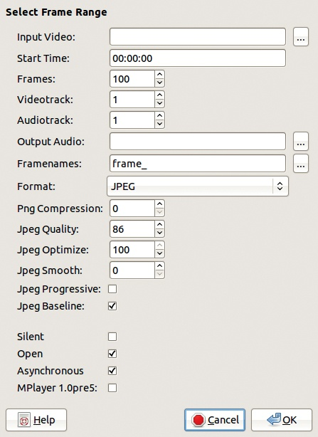

    图 18-48. 基于 MPlayer 的提取对话框

+   SILENT 如果勾选，则忽略任何音频轨道。

+   OPEN 在提取完成后打开第一帧。

+   ASYNCHRONOUS 如果勾选，设置 MPlayer 以异步方式运行，这样它不会阻塞计算机上其他正在运行的进程。

输入视频的帧首先被转换为 PNG 格式，然后转换为选择的输出格式，通常是 XCF。由于每一帧都被处理两次，而一分钟的视频序列包含 1440 帧，因此这些转换可能需要半小时或更长时间。

**图像：视频 > 将视频拆分为帧**菜单中的另一个选项是 EXTRACT VIDEORANGE。当没有安装其他视频软件时，这个工具只能处理 MPEG 输入文件。其对话框显示在图 18-49 中。在对话框的顶部，选择输入文件和范围，可以使用 FROM FRAME 和 TO FRAME 计数器，或者点击 VIDEO RANGE 打开扩展对话框，如图 18-49 右侧所示。

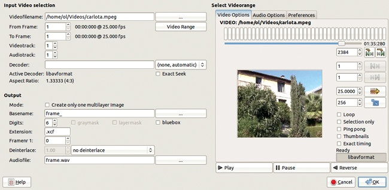

图 18-49. 扩展的提取视频范围对话框

你通常可以将提取视频范围对话框中的输入部分的其余字段保持为默认值。在输出部分，你可以选择是否生成多层或多帧动画。你还可以选择帧的基本名称、数字位数、扩展名（和格式）以及第一帧的编号。音频轨道会被提取为 WAV 文件。

## Bluebox

**Bluebox** 使用一种在电影摄影中常称为*蓝幕*的技术。它也被称为*色键*、*颜色键控*或*颜色分离叠加*。基本上，一个场景是在演员们站在蓝色（或绿色）屏幕前拍摄的。视频画面中的蓝色（或绿色）部分然后被替换成不同的背景。这种技术也可以用来让演员在同一场景中出现多次。

Bluebox 对话框显示在图 18-50 中。Bluebox 实际上是一个滤镜，最佳的使用方式是通过移动路径工具打开它，因为它仅对单个图层操作。你也可以通过图层滤镜应用功能中的帧修改工具来打开它。

KEYCOLOR 选择要去除的背景颜色。你可以通过颜色选择器选择任何颜色。与该颜色相似的像素会根据阈值设置变为透明。

THRESHOLD MODE 可以是 RGB（三个值）、HSV（三个值）、VALUE（一个值）或 ALL（结合 HSV 和 RGB，六个值）。这些阈值范围从 0.0 到 1.0，其中 0.0 仅针对精确颜色，1.0 使最宽范围的颜色透明。ALPHA TOLERANCE 还会改变背景变得透明的程度。

SOURCE ALPHA 设置最大 Alpha 值，以防止透明像素成为选区的一部分。TARGET ALPHA 指定变换后的选区透明度。你可以羽化（平滑）选区的边缘，或缩小或扩大选区。

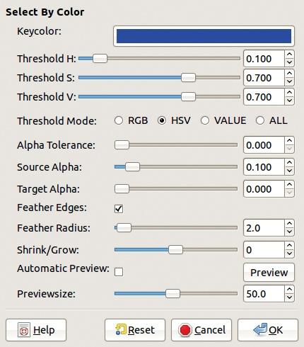

图 18-50. 蓝框对话框

你还可以调整预览窗口的大小，这非常有用，因为此滤镜没有撤销功能。

## 洋葱皮

洋葱皮层用于在当前帧中显示动画的上一帧（或下一帧）。例如，当绘制运动中的角色时，这非常有用。洋葱皮会在你转到下一帧时自动删除。

洋葱皮层还可以用来平滑非常快速的运动，模拟运动模糊，正如我们在操作帧中讨论的那样。洋葱皮层大部分时间像普通图层一样工作，但提供了一些特殊工具来执行例如切换可见性之类的操作。

默认情况下，洋葱皮层是通过合并上一帧的可见图层（不包括背景或其他洋葱皮层）构建的。它们通常放置在当前帧的背景图层之上。

**图像：视频**菜单下有一个名为 ONIONSKIN 的子菜单。主入口 CONFIGURATION 打开显示在图 18-51 中的对话框。

LAYER SELECTION 让你选择要选择的图层，类似于帧修改工具（参见修改帧）。一个额外的字段让你忽略一定数量的背景图层。

显示当前多帧动画名称的大字段实际上是一个按钮，用于设置视频的参数。下面的两个框用于在你从 VCR 导航工具选择工具时，或使用**文件：视频 > 转到 > 下一帧**时自动创建或删除洋葱皮。当两个框都被选中时，加载帧时会自动添加洋葱皮，保存帧时会自动删除洋葱皮。

对话框顶部的“洋葱皮设置”指定如何复制前一帧的层。帧参考（FRAME REFERENCE）指的是从哪个源帧号复制洋葱皮层。如果帧参考是 -1，表示第一个洋葱皮层将从前一帧复制，第二个从前一帧的前一帧复制，依此类推。正数的帧参考表示洋葱皮由当前帧之后的帧组成。

参考模式（REFERENCE MODE）指定如何使用相邻的帧。在普通模式下，帧参考提供的增量只在一个方向上使用。这个增量值决定了当前帧中构建和复制哪些洋葱皮层。在双向（单）模式下，增量交替用于两个方向，但给定的偏移量只使用一次，如序列 -1，+2，-3，+4，…等。在双向（双）模式下，每个增量都使用两次，如序列 -1，+1，-2，+2，-3，+3，…等。

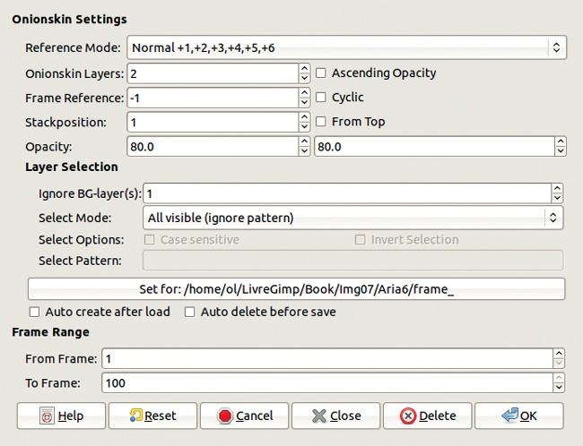

图 18-51. 洋葱皮配置对话框

你还可以指定生成洋葱皮层的数量、它们的堆叠位置以及不透明度。

点击“确定”将添加洋葱皮层，而点击“删除”则移除它们。点击“关闭”则根据当前动画的设置定义参数，但不会生成洋葱皮层。

一旦设置完成，**图像：视频 > 洋葱皮**菜单中的其余条目允许你对所选帧进行全局更改。你可以创建洋葱皮层，或者替换之前创建的层。你还可以删除指定的洋葱皮层或切换它们的可见性。

洋葱皮工具旨在与 VCR 导航器或**图像：视频 > 跳转到**操作配合使用。当你在帧之间移动时，若“自动”框被勾选，指定的操作将自动执行。当两个“自动”框都被勾选时，删除洋葱皮后会保存当前帧，并根据**图像：视频 > 洋葱皮 > 配置**对话框中保存的参数，在下一个帧中创建新的洋葱皮。

## 分镜头脚本

*分镜头脚本*是一个文本文件，描述了如何将视频片段、图像和音频文件组合成一个输出视频文件。分镜头脚本对于创建和剪辑长视频序列非常有用。事实上，分镜头编辑器及其附带的工具提供了一种编辑视频序列的方式，可以通过组合视频片段、多帧动画和单个图像来编辑视频。它没有像更专业的视频编辑工具（例如 Kden-live，* [`www.kdenlive.org/`](http://www.kdenlive.org/)* 或 Cinelerra，* [`cinelerra.org/`](http://cinelerra.org/)*）那样多的功能和能力，但它确实允许你使用 GIMP 的图像编辑功能来处理单个帧。

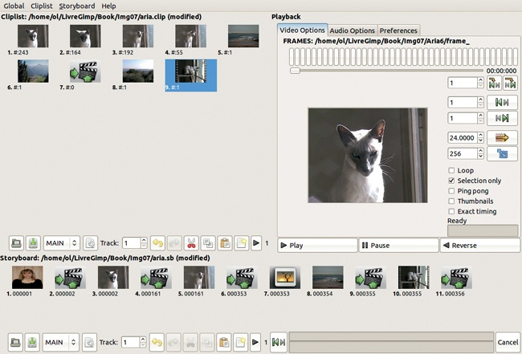

图 18-52. 故事板编辑器对话框

选择**图像：视频 > 故事板**会打开图 18-52 中的对话框。该对话框的右侧类似于播放对话框，并且相当直观。左侧分为片段列表和故事板本身。窗口顶部的菜单栏包含两个相同的菜单（片段列表和故事板），分别对应两个部分。在全局菜单中，勾选视频缩略图按钮以查看片段列表和故事板的缩略图。属性条目会打开一个对话框，您可以在其中选择片段列表和故事板部分的布局，包括缩略图的大小。

要使用片段列表或故事板，您首先必须选择一个视频或动画文件。要开始一个新项目，选择**故事板 > 新建**。在出现的对话框中，选择您计划制作的视频动画的特征，并输入故事板文件的名称。还需要选择**片段列表 > 新建**。其对话框相同，但您必须为文件选择不同的名称。两个菜单中都包含了其他自解释的条目。

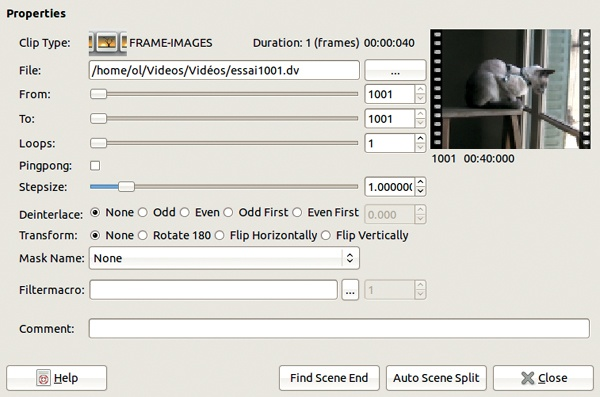

图 18-53. 片段属性

要添加片段，选择**片段列表 > 创建片段**，这会打开图 18-53 中显示的对话框。您可以加载来自其他动画的帧或图层，并为此新片段设置多个参数。请注意，如果新片段与其所添加的视频有显著差异，则帧可能会变形。

单个图像也可以作为新片段使用。您甚至可以从文件管理器中拖放图像。

选择片段后，它会作为缩略图显示在故事板编辑器对话框的播放区域中。然后选择要用作片段的帧范围，并通过点击右侧的第一个按钮将其添加到片段列表中。第二个按钮则添加反向范围。

一旦片段出现在片段列表中，通过以下方式将其添加到故事板中：

+   -点击和 -点击以选择片段

+   使用片段列表底部的剪切、复制和粘贴按钮按顺序排列片段

+   使用故事板中的剪切、复制和粘贴按钮来复制和排列片段

+   点击片段列表右下角的播放按钮以播放片段序列或仅播放选定的片段

+   双击片段缩略图以播放它

+   右键单击片段缩略图以更改其属性（图 18-53）

播放片段或片段序列在选择帧的子范围并定义新片段时非常有用。粘贴的片段会添加到最后一个选定的片段之后或序列的末尾。

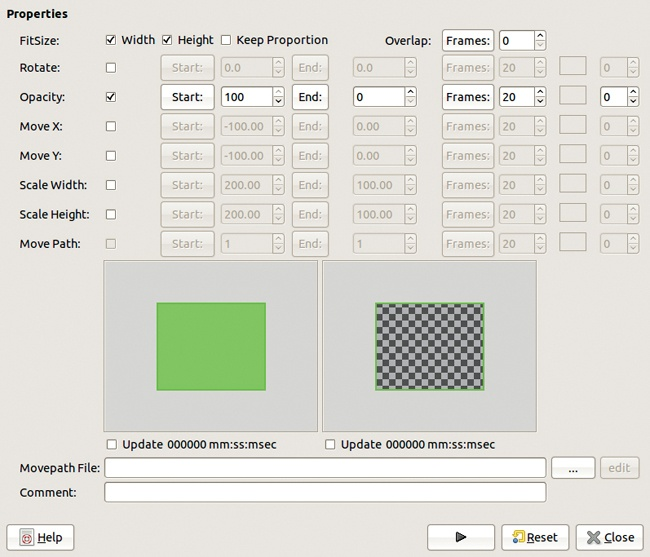

图 18-54. 过渡属性

**剪辑列表**和**故事板**菜单也允许你创建过渡效果。这个菜单项会打开在图 18-54 中显示的对话框。通过改变帧的不透明度、滚动帧或缩放，可以创建过渡效果。你还可以将这些效果结合起来使用。

完成故事板的构建后，你可以将其保存为文本文件。这些文件使用了明确的语法，如果你了解语法，可以通过文本编辑器进行修改。
