# 第十九章. 获取和打印图像

你可以通过几种方法将图像导入 GIMP，但实际上输出图像到纸上（换句话说，打印图像）只有一种方式。你可以通过**图像：文件**菜单来获取或打印图像。本章我们将从探索**图像：文件 > 创建**子菜单开始，如图 19-1 所示。

# 19.1 截取截图

图 19-2 显示的是当你选择**图像：文件 > 创建 > 截图**时打开的对话框。你可以通过三种方式创建截图：

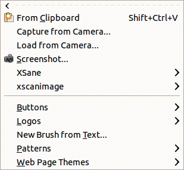

图 19-1. 图像：文件 > 创建子菜单

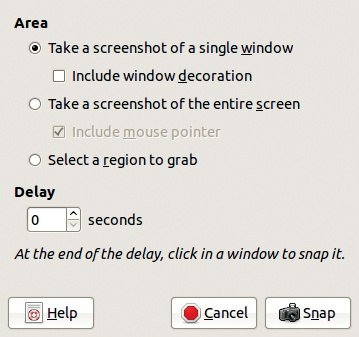

图 19-2. 截图对话框

+   截取单一窗口的截图：在这种情况下，复选框切换窗口装饰的可见性，窗口装饰是由窗口管理器添加的，而不是由 GIMP 添加的。书中的大多数插图都不包含窗口装饰，以节省空间并避免干扰。一旦在对话框中做出选择，按下“拍摄”按钮。鼠标指针会变成十字架形状，你可以点击你想要截取的窗口。

    但是，这使得截取临时窗口的截图变得困难，例如右键点击时出现的窗口。你可以通过设置延迟时间来解决这个问题，然后右键点击打开所需的窗口。如果这样不行（例如，对于 GIMP 菜单），可以尝试先右键点击打开菜单，然后点击对话框顶部的虚线，这会将对话框作为窗口打开。此方法会生成你在本书中看到的分离菜单截图。

+   截取整个屏幕的截图：选择此选项时，可以勾选或取消勾选复选框来决定是否在截图中包含鼠标指针；如果你想展示一个应用程序，显示鼠标指针会很有用。通常，设置一个延迟时间是最好的，这样你可以在截图前准备好屏幕（例如，打开或关闭菜单或对话框）。截图开始和结束时会有一声哔声。鼠标指针会出现在最终图像的单独图层中，因此你可以移动它。

+   选择要捕捉的区域：在可选的延迟时间后，鼠标指针会变成十字架形状，你可以点击并拖动来勾画你想要捕捉的区域。选择一个比实际需要更大的区域，之后再裁剪它。

截图与保存当前图像的状态不同。截图使用屏幕的分辨率，只有在你想要包含图像本身没有的特性时才更为合适，比如选择轮廓、图层轮廓、辅助线或快速蒙版。保存图像则保存的是照片的真实分辨率，但无法存储图像外的特性，如前面提到的那些。

在三种截图类型之间选择相当简单：

+   如果你想捕捉鼠标指针，可以拍摄整个屏幕。

+   如果你在拍摄截图时想按下鼠标按钮（例如，显示右键菜单），请拍摄整个屏幕。

+   如果你只想捕捉菜单，可以拍摄单个窗口的截图。

+   如果你只需要一个较大窗口的一部分（例如，工具箱而不是选项对话框，或者单窗口模式下的窗口某部分），或者如果你需要捕捉多个窗口而不是整个屏幕，选择区域截图会很有用。

+   拍摄干净、框架完整的单窗口截图是最优选择，因此尽可能选择此选项。

大多数操作系统都有捕捉全屏或单窗口的功能。例如，GNU/Linux 下的 GNOME 桌面环境包括了 `GNOME-screenshot` 工具，它提供与 GIMP 相同的屏幕捕捉功能，除了没有选择区域的选项。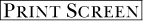 键通常会截取整个屏幕的截图，你可以将其保存到你选择的位置。

在 Windows 下， 键会将屏幕复制到剪贴板上而不提供任何反馈，因此，虽然看起来似乎什么也没发生，但你可以通过 **图像：编辑 > 粘贴为 > 新图像** 或  在 GIMP 中打开截图。

通常来说，如果你计划在 GIMP 中编辑图像，使用 GIMP 的截图工具会更方便，它提供的选项与操作系统的屏幕捕捉工具一样多，甚至更多。

# 19.2 扫描

*扫描*是将图像转换为数字表示的过程，使用一种叫做*扫描仪*的专用设备。这一过程也叫做*数字化*或*数字化处理*。

## 扫描仪和驱动程序

图像扫描仪是一种独立的设备，通过 USB 或 IEEE 1394（Firewire）连接到计算机。本书仅介绍平板扫描仪类型，在这种类型中，文件被放置在玻璃上，电荷耦合器件（CCD）传感器在文件被照亮时沿着玻璃移动。制造打印机的公司（如佳能和爱普生）通常也制造扫描仪。它们的价格在相似范围内，扫描仪和打印机合二为一的多功能设备越来越常见，包括低成本型号。

大多数人购买扫描仪是为了将照片或草图数字化，因此对于大多数人来说，自动进纸器并不是必需的，信纸大小（或 A4）玻璃面足够使用。如果你需要扫描大量文档，可以考虑购买带有自动进纸器的扫描仪，如果你是从事大幅面创作的艺术家，可能需要更大的玻璃面。许多人想要扫描照片负片或幻灯片，这需要一个从背面照明的特定设备；在扫描仪的规格中查找此功能。

扫描速度通常不太重要，只要扫描一张普通尺寸的照片不超过一分钟。扫描分辨率更为重要，但请注意，像往常一样，分辨率常被用作营销卖点——更大的数字不一定更好。扫描仪有一个固有的最大分辨率，这取决于组成传感器阵列的 CCD 单元数量。较大的分辨率可以通过插值获得，这意味着它们是更高分辨率的数字模拟，这在 GIMP 中也可以完成。扫描仪的物理真实分辨率被称为*光学分辨率*，在比较不同型号时，应该只考虑光学分辨率。

实际上，通常不需要过高的分辨率。如果你打算以相同尺寸打印扫描图像，300 ppi（每英寸像素数）就足够了。如果你打算大幅放大图像——例如，原始图像是 35 毫米幻灯片，你想将其打印为信纸大小格式——1200 ppi 可能已经足够。所以，扫描仪上常见的 4800 或 9600 ppi 分辨率，不仅是人为夸大的，而且对于大多数人来说是无用的。

购买扫描仪时最重要的因素是它在呈现图像像素的精确度和色彩的保真度。查看比较各种扫描仪型号的能力、性能和价格的网站。

如果你是 GNU/Linux 用户，我们建议访问 Scanner Access Now Easy，或称 SANE，网站 (*[`www.sane-project.org/`](http://www.sane-project.org/))*，以确保你的扫描仪型号在该平台上能够被识别。如果你不能购买最新款功能齐全的扫描仪也不必担心：这些附加功能通常是无用的，当 SANE 正确处理时，标准型号足以满足你所有的需求。

SANE 到底是什么？扫描仪制造商往往在设计设备时忽视了自由和开源软件的兼容性。他们只为 Windows 和 Mac 操作系统提供驱动程序和应用程序。SANE 项目的目标是为尽可能多的扫描仪型号提供免费的驱动程序版本。它构成了扫描仪的前端，还需要一个后端来处理数字化图像。GNU/Linux 和 Mac OS 都有多个后端可用，但 Windows 则没有。Windows 用户可以使用随扫描仪附带的应用程序，或者使用客户端后端，从运行 SANE 的 GNU/Linux 服务器获取信息，或者使用 SANE 到 TWAIN 的转换应用程序。

扫描仪通常会附带 CD 上的软件。有些软件包括商业图像处理应用程序的试用版或功能受限版本，但由于我们使用的是 GIMP，因此不需要这些软件。扫描仪还附带了自己的专用应用程序，可以让你使用其独特的前面板按钮。即使没有这些按钮，你仍然可以正常使用扫描仪；这些按钮旨在使扫描仪使用更快或更便捷，但并不是唯一的操作方式。本书的目的是将图像数字化，使其尽可能保持不变，然后在 GIMP 中进行处理。

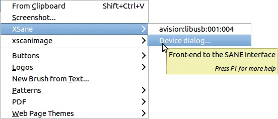

图 19-3. 打开 XSane

## XSane 和 GIMP

如果 GIMP 安装时没有任何额外的插件，它无法与扫描仪通信。虽然有多个扫描仪插件可用于 GIMP，但 XSane 是最为完善和维护的工具。XSane 软件包适用于大多数 GNU/Linux 发行版，安装它也会自动安装 GIMP 的 XSane 插件。我们将在本章中使用 XSane 插件进行扫描。如果你使用的是不同的软件，界面会有所不同，但应该会有类似的选项。

安装插件并重新启动 GIMP 后，你会在**图像：文件 > 创建**菜单中找到 XSane，如图 19-3 所示。第一个选项是大多数用户所需要的，但如果你有两个扫描仪，或者一个扫描仪和一个摄像头，你会看到额外的选项，可以让你选择哪个设备作为图像来源。首先会出现一个临时窗口，告诉你工具正在扫描设备。如果没有扫描仪可用，则会弹出错误窗口。请注意，XSane 也可以使用摄像头作为输入设备，但我们在这里不讨论这个功能。

当你从**图像：文件 > 创建**菜单中选择 XSane 时，通常会看到两个不同的对话框。图 19-4 显示的是主要对话框，里面包含了大多数控制项和参数。因此，我们称其为控制窗口。图 19-5 显示的是预览窗口，特别适用于选择图像的一个子区域进行扫描。

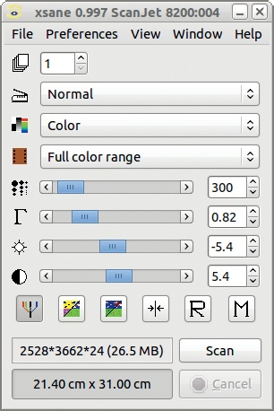

图 19-4. XSane 控制窗口

其他 SANE 后端有类似的对话框和控制项。

## 选择扫描区域

首先，将一张照片或图画放置在扫描仪玻璃板上。如果图片是薄纸上的，特别是如果纸的背面有任何东西，请在上面放一张黑纸。

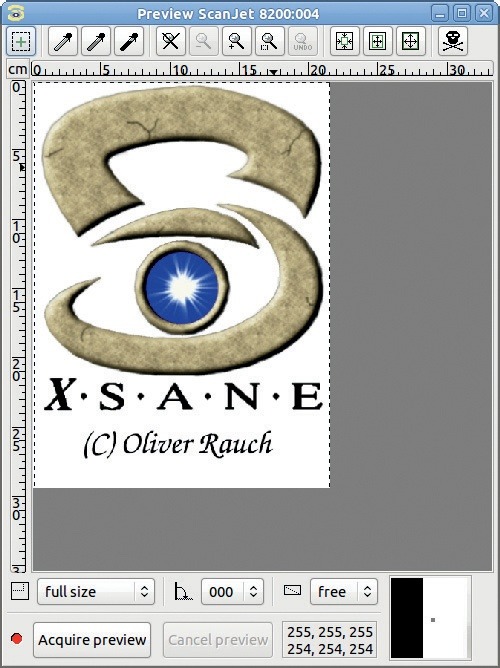

图 19-5. XSane 预览窗口

如果需要，可以调整 XSane 控制窗口中的控件，然后通过点击预览窗口中的相应按钮来获取预览。

图 19-6 显示了我们的初始图像预览。预览窗口是方形的，以适应你选择的任何扫描方向。使用底部第二排按钮中的中间按钮来更改方向。大虚线矩形表示扫描仪认为图像的大小。幸运的是，我们可以通过点击并拖动这个矩形的边或角来调整它。最好划定一个稍大于图像的矩形，因为扫描仪并不总是精确地捕捉矩形中的内容。图 19-7 显示了一个更好的预览。为了得到这个预览，我们拖动矩形使其勾画出照片的轮廓，然后点击“放大到选定区域”（带有放大镜和加号的按钮）。

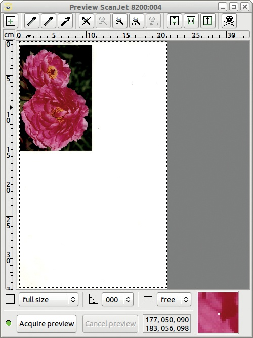

图 19-6. 初始预览

让我们看看预览窗口顶部的其他按钮。最左侧带加号的按钮用于批处理。三个吸管按钮用于调整图像的色阶，就像在 GIMP 中一样。接下来的五个按钮控制缩放。按从左到右的顺序，它们分别是：使用完整扫描区域（不缩放）、缩小 20%、点击位置进行缩放、放大选定区域，以及撤销上次缩放。接下来的三个矩形按钮分别是：自动选择扫描区域、自动提升扫描区域、选择可见区域。最右侧的按钮，看起来像骷髅和交叉骨，删除所有存储在预览缓存中的内容。每次开始新扫描时按下它，确保所有之前扫描的图像预览已被清除。

预览下方有两排按钮。上排按钮控制要扫描的区域。每个按钮都会打开一个菜单：

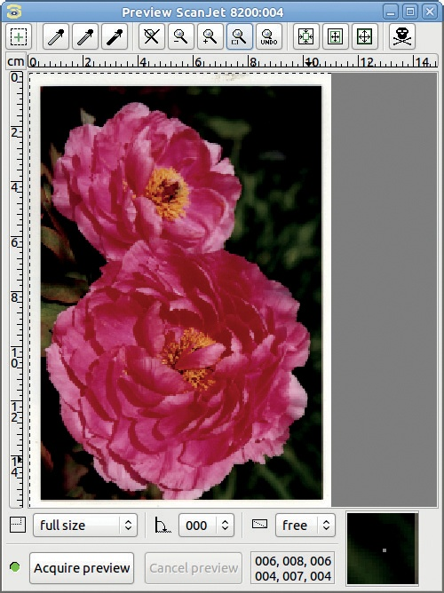

图 19-7. 改进的预览

+   预设区域如图 19-8（左图）所示。这些预设允许你自动选择一些标准尺寸。

+   旋转角度如图 19-8（中图）所示。它们都是 90° 的倍数，有三种变体。负号表示图像会水平镜像，竖线表示图像会垂直镜像。

+   长宽比如图 19-8（右图）所示。使用长宽比设置宽高比，从而控制你选择扫描区域的形状。

虽然你可以使用 XSane 调整图像，但我们建议按原样扫描图像，然后在 GIMP 中进行必要的调整。

## 设置扫描参数

控制窗口，如图 19-4 所示，根据图 19-9 中显示的两个复选框的状态变化，且还可能受到对话框底部某些按钮的影响。菜单栏中的 PREFERENCES 项会弹出图 19-9 中所示的菜单。高亮的 SETUP 选项会打开一个有九个选项卡的大对话框。其中许多选项卡仅在 XSane 独立于 GIMP 启动时才有用，用于存储、复制、传真、发送邮件或仅仅显示文件。

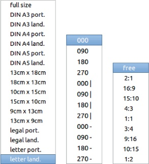

图 19-8. 扫描区域、旋转角度和纵横比设置

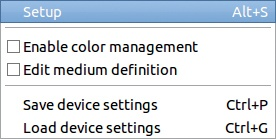

图 19-9. 偏好设置菜单

如果在偏好设置菜单中勾选了启用颜色管理，控制窗口将变为图 19-10 所示的样式。此对话框中的字段从上到下依次为：

+   扫描页面数量：如果扫描仪有自动进纸功能，你可以设置要扫描的页面数量，但如果你想进行批量扫描，建议使用 XSane 独立程序，而不是在 GIMP 中使用。一旦所有图像都已数字化，你可以在准备编辑时将它们打开到 GIMP 中。

    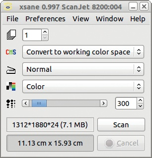

    图 19-10. 启用颜色管理的 XSane 控制窗口

    

    图 19-11. 扫描模式

+   颜色管理功能：这允许你选择如何在获取的文件中管理颜色。如果这些选项对你来说没有意义，请参考 12.3 颜色管理。

+   扫描方法：当手动将图像放置在玻璃上时，选择 NORMAL，但如果使用自动进纸器，选择 ADF FRONT。在使用 GIMP 时，应该始终选择 NORMAL。

+   扫描模式：可用的扫描模式如图 19-11 所示，并将在以下章节中讨论。

+   扫描分辨率：如果在“查看”菜单中勾选了“显示分辨率列表”框，则可以手动或从菜单中设置此项。有关如何选择最适合你需求的扫描分辨率，请参阅扫描分辨率。

    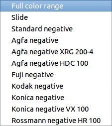

    图 19-12. 源介质类型

+   扫描图像的大小，以像素和 MB 为单位。

+   扫描图像的大小，以多种度量单位表示（显示的是厘米）。

如果在偏好设置菜单中未启用颜色管理，控制窗口将包含图 19-4 中显示的所有条目。扫描模式下方的条目允许你选择源介质类型。选择项如图 19-12 所示。正如你所看到的，许多负片类型有特定的设置。对于正片，唯一的选择是全色域（FULL COLOR RANGE）。

控制窗口的其余部分，从源介质类型到图像大小，已在颜色处理中讨论过。

## 扫描模式

如图 19-11 所示，XSane 控制窗口中提供了六种扫描模式。最后四种对于 GIMP 用户来说最为实用。你可以选择彩色或灰度图像，以及 8 位或 16 位深度。选择的扫描模式会影响结果文件的大小，并影响你在 GIMP 中对文件的操作。

使用 8 位深度时，你有 256 种灰度值或 256³种颜色。XSane 可以扫描 16 位深度，这样可以得到 65,536 种灰度值或 65,536³种颜色。目前 GIMP 无法处理 16 位深度，但计划在 2.10 或 3.0 版本中改进。对于大多数用户而言，8 位深度已经足够。人眼无法分辨 65,536 种灰度，而大多数显示器和打印机只能处理最多 8 位深度的图像。

图 19-13。初始渐变

图 19-14。减少输出范围后的结果

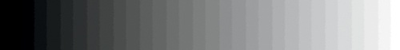

图 19-15。放大输入范围后的结果

图 19-16。原始图像

这并不是说 16 位深度完全没有意义。如果你在使用“级别”工具时，将渐变的输出级别范围（见图 19-13）大幅度缩小，你将得到几乎均匀的灰色（见图 19-14）。然后，如果你将结果中狭窄的直方图扩展到整个范围，8 位深度的图像会显示条纹（见图 19-15），而 16 位图像则会再次呈现平滑的渐变。

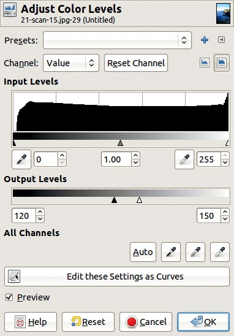

图 19-17。缩小输出范围

图 19-18。减少输出范围的结果

严重缩小输出范围会极大限制不同值的数量。我们在图 19-16 中展示了此效果。首先，打开“级别”对话框。如图 19-17 所示，将输出范围缩小到 120 到 150 之间的 31 个值。结果如图 19-18 所示。

然后再次打开“等级”对话框，这次通过使用 120 到 150 之间的值来放大输入范围（见图 19-19）。图像中剩余的 31 个值均匀分布在 256 个可能的值上，如图 19-20 所示。结果相当难看，因为图像的值太少。效果在天空部分尤为明显。如果这张图像有 16 位的值范围，效果则不会那么明显。

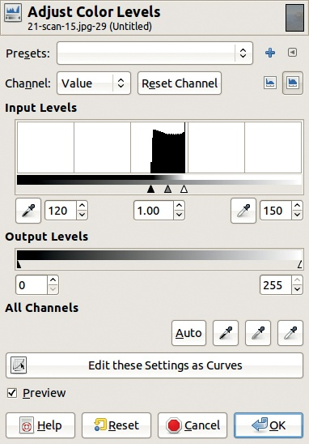

图 19-19. 放大输入范围

你可能会想，为什么要减少然后再放大图像的值范围。实际上，你可能永远不会这样做，但这确实证明了 16 位深度能带来不同的效果。对于高级照片处理用户来说，这种影响非常重要，这类用户正在迫切等待 GIMP 加入 16 位深度支持。

LINEART 扫描模式应用了一种效果，这是 GIMP 也可以做到的，而且可能做得更好。图像以灰度模式扫描，然后应用阈值来生成线条艺术。在 GIMP 中，你可以通过**图像：颜色 > 阈值**工具来实现这一点，该工具在第十二章中介绍。

抖动扫描模式会生成一个抖动灰度图像，这在许多年前是报纸印刷的必需格式（参见图 19-21）。

图 19-20. 放大输入范围的结果

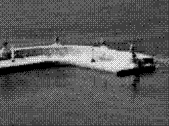

图 19-21. 从抖动扫描中放大

## 扫描分辨率

你选择的扫描分辨率取决于扫描图像的大小、计算机的性能以及你打算如何使用生成的图像。

可用的分辨率取决于你的扫描仪，并且可能与图 19-22 中显示的不同。最低的分辨率适用于每个扫描仪，但对于低成本的扫描仪型号（例如一体机中的扫描仪），最高分辨率可能为 2400 像素每英寸或更低。有关扫描分辨率和硬件的更多讨论，请参见扫描仪和驱动程序。

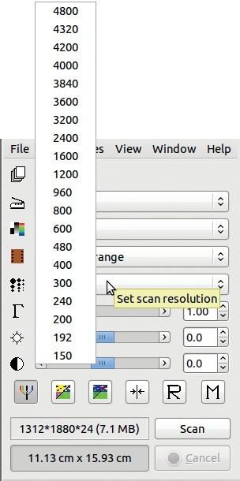

图 19-22. 从列表中选择分辨率

Olivier 的扫描仪扫描床是法定大小（8.5 英寸*×*14 英寸）。如果分辨率设置为 300 ppi，生成的图像为 2552 × 4205 像素，或在色深为 8 位的情况下为 31.4MB。如果分辨率为 4800 ppi，色深为 16 位，生成的图像为 40,818 × 67,276 像素，或为 16,090MB，或 16GB。显然，16GB 对于今天的个人计算机来说太大了，而且对于绝大多数用户来说，这个分辨率也过高。

让我们以另一种方式考虑图像分辨率。如果你想将图像放到网页上，最终的分辨率应为 96 ppi。如果你想打印它，分辨率应该为 300 ppi 以进行普通质量打印，或者 1200 ppi 或更高以进行高质量照片打印。由于最终分辨率取决于图像的用途，因此在选择扫描分辨率时应该有一个明确的目标。选择一个稍微高于你所需的分辨率。你可以在最后的步骤中将其缩小。

例如，假设我们有一张 4 × 6 英寸的照片，想要在网站上发布，最大尺寸为 1024 × 768 像素。在 XSane 控制窗口中，当扫描分辨率改变时，图像的像素大小会更新。通过反复试探，我们确定 192 ppi 就足够了。但如果我们将分辨率调到 300 ppi，就有一些余地。如果照片是最近打印的，它可能是以 300 ppi 打印的，所以这是我们实际能够得到的最高分辨率。如果照片是用传统方式打印的（在暗房里），则可以获得更好的分辨率。但对于这个例子来说，300 ppi 已经足够了。

这是第二个例子：假设我们有一张 24 × 36 毫米的胶片负片，想要制作一张高质量的照片打印—在 4*×*6 英寸的格式下，分辨率为 1200 ppi。扫描的图像需要大约 4700 × 7000 像素。在控制窗口中，我们看到我们扫描仪的最佳分辨率 4800 ppi，稍微不够。

如果发生这种情况，不用担心。只要不做得过头，使用插值放大图像可以获得良好的结果。

## 色彩处理

在控制窗口的下一部分，在扫描分辨率设置下方，你会看到一系列用于色彩处理的参数。默认情况下，窗口中有三个滑块：一个用于伽马值，一个用于亮度，一个用于对比度。

基本上，*伽马值*衡量图像中间值的亮度。如果伽马值设置为 1，图像保持原始状态。如果伽马值大于 1，图像变亮。如果伽马值小于 1，图像变暗。当我们在“级别”工具对话框中移动伽马三角形时（见级别）也是如此。

*亮度*衡量每个像素的光强。直观地说，增加亮度会让图像变亮，而减少亮度则会让图像变暗。

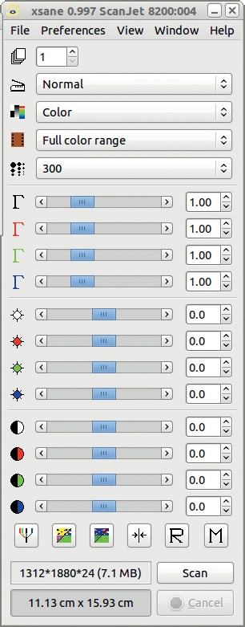

图 19-23. 扩展的 XSane 控制窗口

*对比度* 可以大致定义为图像中最亮像素与最暗像素亮度的比率。当对比度增加时，图像的最亮部分变得更亮且更饱和，而最暗部分则变得更暗更黑。尽管你在扫描时可以在 XSane 中调整亮度和对比度，但你在 GIMP 中通过 **图像：颜色 > 亮度-对比度** 工具（见 第十二章）或更好的方法是使用 Levels 工具，能更好地控制这些参数。

如果你点击 XSane 控制窗口底部一行按钮中的最左边按钮（见 图 19-4），窗口将会展开，如 图 19-23 所示。扩展后的窗口包含四个通道（亮度、红色、绿色和蓝色）中的伽玛、亮度和对比度设置。使用这些控件进行调整可能会比较困难和繁琐，因此我们建议忽略这些设置，转而使用 GIMP 中的等效工具。此外，在控制窗口中进行的所有亮度和对比度调整将自动应用于所有扫描，直到你再次更改这些参数。此外，如果你在 XSane 中进行调整，你将无法看到扫描仪所创建的原始结果。你只能在扫描被调整后看到扫描结果。

总结来说，我们建议仅将 XSane 用作扫描图像的工具。亮度或对比度等变换应在 GIMP 中进行，而不是在 XSane 中进行。请注意，在获取预览后，控制窗口会自动设置自动调整参数。如果你希望仅使用 GIMP 进行这些调整，可以通过点击控制窗口底部一行中的第四个按钮来选择“设置默认增强值”。

以下按钮也出现在底部一行（从左到右）：

+   RGB 默认 (): 切换控制窗口的大小，你可以使用该窗口调整亮度、伽玛和对比度值，包括亮度通道、红色通道、绿色通道和蓝色通道。

+   负片 (): 反转所有的颜色值。

+   自动调整 (): 自动调整伽玛、亮度和对比度值。

+   设置默认增强值 (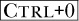): 将伽玛设置为 1.0，亮度和对比度设置为 0。

+   恢复 (): 恢复为偏好设置中设置的增强值。

+   存储 (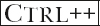): 将当前的增强值存储在偏好设置中。

# 19.3 数码相机

现在几乎每个人都有一台数码相机，可以拍摄无数张照片，而不必担心胶卷或冲洗的费用。数码照片可能是 GIMP 中最常见的编辑图像类型。如今市场上有多种数码相机，价格从不到十美元到数万美元不等。CCD 传感器的像素数从 1 百万像素到最贵的型号超过 50 百万像素不等。反光相机的光学系统占总成本的很大比例，许多可能的功能和配件对成本的贡献较小。

市面上有很多种型号的相机，用户的需求也各不相同，因此我们不会提供任何购买相机的建议。如果你需要帮助选择相机，可以在网上找到详细的评测。从现在开始，我们假设你已经拥有了一台相机。

## 将照片导入到 GIMP

如你在**图像：文件 > 创建**菜单中看到的那样，在图 19-1 中，涉及到相机的有两个选项，前提是已经安装了`gtkam-gimp`插件。（如果没有安装，按照附录 E 中的说明安装`gtkam-gimp`软件包即可。）“从相机捕获”允许你通过控制相机在 GIMP 内部拍摄照片。“从相机加载”则允许你访问存储在相机内存卡上的照片。

你不必使用 GIMP 来从相机检索照片，因为有多种应用程序可以完成这项工作。然而，如果你计划在 GIMP 中编辑照片，通过 GIMP 来检索它们比使用复杂的照片管理应用程序更简单。

请注意，如果你有读卡器，就不需要将相机连接到计算机。当相机的卡插入读卡器时，计算机会将其视为一个新的存储磁盘。

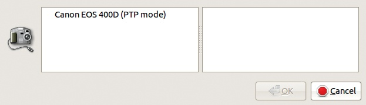

图 19-24. 从相机加载的初始对话框

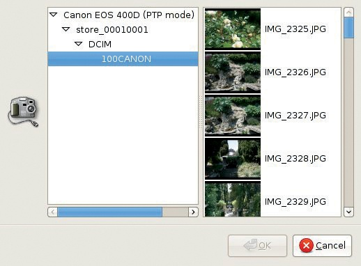

图 19-25. 打开照片文件夹

你应该会看到一个文件夹的层次结构，其中所有的照片都作为文件存放在一个或多个文件夹中。这些文件的命名遵循相机特有的模式。你可以像打开任何已保存文件一样在 GIMP 中打开其中的一个文件。

“从相机加载”在你只想从相机加载一张照片，而不是一次加载很多张照片时非常有用。当你选择“从相机加载”时，你会看到如图 19-24 所示的对话框。相机的名称显然取决于你使用的型号。

选择好相机并在对话框左侧的文件夹层级中进行浏览后，您将看到如图 19-25 所示的窗口，右侧框架中会显示可用照片的缩略图。现在，您可以选择一个缩略图并点击“确定”将相应的照片加载到 GIMP 中。然后，对话框会关闭，如果您想加载另一张照片，则需要重新选择它。

## 选择格式

最简单的相机仅存储 JPEG 格式的照片，因为该格式具有压缩功能。例如，如果相机的 CCD 传感器生成 1000 万像素，那么假设每个像素占用 3 字节，一个完整的照片将占用 30MB。即使使用较大的内存卡，这也会大大限制您能够存储的照片数量。此外，将大型图像文件保存到卡上需要时间，因此您无法快速连续拍摄多张照片。

高质量的相机应提供多种分辨率和多种压缩因子的选择。通常，图像文件的大小范围从最低分辨率和最高压缩因子的 30KB 到最高分辨率和最低压缩因子的 4MB。当然，内存卡能够存储的图像数量与图片文件的大小成反比。除非您需要在短时间内拍摄大量照片，否则应选择最佳的照片质量：在 GIMP 中编辑图像时，您能获得的结果受限于原始图像的质量。虽然 JPEG 是标准格式，但有些人更喜欢 TIFF，因为他们认为 TIFF 使用的是无损压缩算法。实际上，TIFF 并不使用任何压缩算法，但 TIFF 图像可能会指定一种算法，且该算法可能是无损的。它也可以使用 JPEG 压缩算法，该算法是有损的。TIFF 文件通常比等效的 JPEG 文件要大，并且不是所有软件应用程序都能读取 TIFF 文件。TIFF 格式实际上是一个容器，包含多种格式，因此无法保证所有图像中指定的特性都能被应用程序正确处理。对于大多数用户来说，JPEG 是更好的选择，如果绝对需要无损格式，PNG 比 TIFF 更合适。

JPEG 使用的压缩算法有时会生成伪影。如果质量因子足够大，这些伪影在图像大幅放大时也不会明显可见。但您应该避免反复将图像导出为 JPEG 格式，因为压缩质量的下降是累积的。此外，注意将质量因子设置得比加载图像时更高是没有意义的。这样做只会增加文件大小，而不会真正提高图像质量。

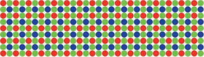

图 19-26. 贝叶尔模式

大多数高质量的相机也允许你以*原始格式*保存照片，而这种格式并不是一种特定格式。存在的原始格式种类和相机制造商一样多，而同一制造商常常为不同的相机型号定义不同的原始格式。此外，所有这些原始格式之间并不兼容，因此用于解码某一种格式的专有软件与同一制造商新型号相机附带的软件并不兼容。

任何原始格式的主要缺点是你无法保证几年后仍然能够打开特定原始格式的文件。因此，原始格式并不是存储照片的好选择。选择一种国际标准化的格式；对于照片，具有高质量设置（85 或更高）的 JPEG 是最佳解决方案。

原始格式通常被称为*数字负片*，但这个术语具有误导性，因为原始格式是图像的数学近似，而真正的负片是投影在相机背部的实际图像。负片的定义取决于组成它的晶体的大小，但它总是比最佳 CCD 矩阵的定义好得多。

原始格式之所以被称为数字负片，是因为它代表了 CCD 传感器发出的数据。这些数据通常会被采样以创建 4096 个不同的值，相当于每个传感器 12 位。传感器是按*贝叶尔模式*排列的，如图 19-26 所示。请注意，绿色单元格的数量是红色和蓝色单元格的两倍。这是因为人眼对绿色波长的敏感度远高于对红色和蓝色的敏感度。

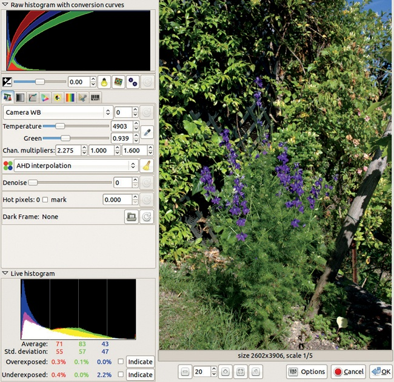

图 19-27. UFRaw 插件对话框

色彩像素是通过*贝叶尔插值*从单元格生成的信息中进行插值的，这是对数据进行的第一次转换。之后，相机会执行多个连续的处理过程：白平衡、对比度和饱和度进行调整，锐度得到增强，等等。

最后，生成的数据被压缩到 8 位，然后压缩为 JPEG 格式。从 12 位到 8 位的压缩不会导致太大的信息丢失，因为该压缩是对数式的，这样可以在最需要的地方保持精度：即低值部分。但在高值部分，只保留了少数几种亮度级别。压缩到 JPEG 格式过程中丢失的信息可能从名义上的（在高质量设置下）到严重的。

原始格式的唯一优势在于，它是唯一允许你手动对图像进行所有变换的格式。人们通常提倡使用原始格式，因为它允许纠正极端曝光错误。这种假设部分正确，因为自动变换后会有较少的数据。但如果你知道如何正确使用相机，你可能不会犯那些相机无法处理的极端错误。

如果你不介意使用复杂的软件应用程序并调试众多参数，并且希望完全控制传感器测量到的光线之后发生的情况，那么原始格式可能适合你。此外，如果你绝对需要 16 位深度，并且每张照片都愿意花费大量时间处理，那么原始格式是一个不错的选择。但只要使用高质量设置，JPEG 并不逊色于原始格式，尽管一些自认为是专业人士的人可能会持不同意见。即使原始格式对你来说理想，我们建议生成原始和 JPEG 图像，只要你不需要非常快速地拍摄大量照片。而且，你应该始终选择其他格式（如 JPEG 或 XCF）进行长期存储。

## 处理原始照片

如果你选择使用原始图像，可以使用名为 UFRaw 的通用免费软件工具（见 *[`ufraw.sourceforge.net/`](http://ufraw.sourceforge.net/)*），它可以读取大多数原始格式，定期更新，完全免费，并且可以在所有 GNU/Linux 发行版、Mac OS X 和各种版本的 Windows 上使用。你可以将其作为独立应用程序使用，或者作为 GIMP 插件使用。

Darktable（见 *[`www.darktable.org/`](http://www.darktable.org/)*）是一个功能更强大的工具，也是通用的免费软件。但它不适用于任何版本的 Windows，并且没有与 GIMP 进行接口。因此，在本节中，我们假设你已经安装了 UFRaw 及其对应的 GIMP 插件。

当你在 GIMP 中打开一张原始图像时，它会自动调用 UFRaw 插件，并显示如 图 19-27 所示的对话框。在右侧是图像的预览，带有放大或缩小的按钮。在左侧，你会看到一些信息窗口、选项卡、按钮、滑块和其他控件。这些控件展示了 UFRaw 对图像所做的变换过程，这些变换替代了相机通常进行的变换。

顶部的直方图显示了来自传感器单元的原始数据和表示数据如何被转换的曲线。直方图集中在左侧，这意味着大多数像素的亮度较低。通过右键单击直方图，你可以在对数视图（如图 19-28）和线性视图之间切换。在同一图中，我们可以看到图像中任何我们点击的点的 RGB 值，以及亮度和 Adams 区域。^([1])

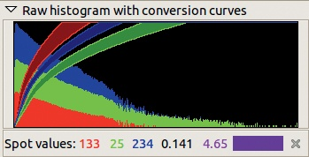

图 19-28. 对数直方图和亮度值

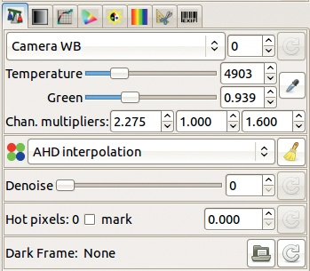

图 19-29. 白平衡选项卡

原始直方图下方的行包含一个用于调整曝光的滑块，两个按钮用于恢复高光和控制如何应用修正，以及一个用于自动调整曝光的按钮。

接下来是八个选项卡，你可以用它们设置将应用于数据的连续变换：

+   白平衡（图 19-29, 顶部）：初始值是在相机上选择的，但并未应用于原始数据。温度滑块可以改变暖色和冷色的相对比例。下方的滑块用于调整绿色通道，颜色温度不影响该通道。有多种预设的白平衡设置可供选择。

    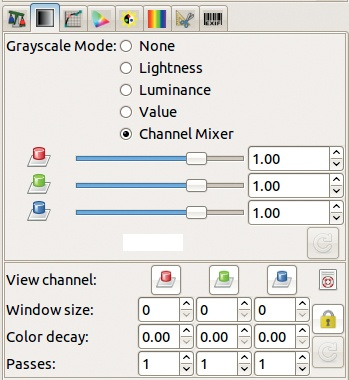

    图 19-30. 灰度选项卡

    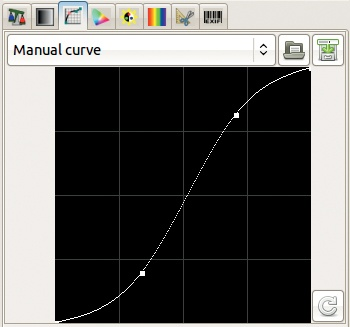

    图 19-31. 基准曲线选项卡

+   插值（图 19-29, 中部）：此选项允许你选择几种不同的 Bayer 插值算法。

+   灰度（图 19-30）：此选项卡包含几种将彩色图像转换为灰度图像的方法。

+   基准曲线（图 19-31）：此选项卡的功能类似于**图像：颜色 > 曲线**工具，但仅操作值通道。

+   颜色管理（图 19-32）：此选项卡包含各种颜色参数的设置和 ICC 配置文件。

    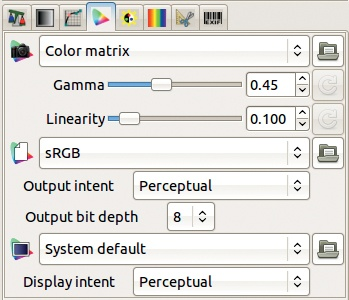

    图 19-32. 颜色管理选项卡

    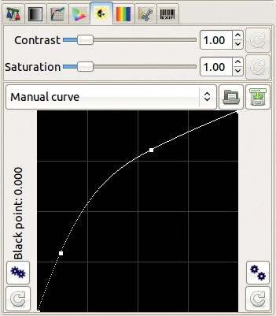

    图 19-33. 饱和度选项卡

    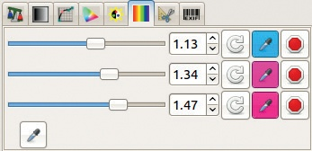

    图 19-34. 亮度调整选项卡

+   饱和度（图 19-33）：此标签有一个修正曲线，其作用类似于值通道的修正曲线。

+   亮度调整（图 19-34）：此标签允许你从图像中选择最多三种颜色，并将其亮度调整为[0 到 2]的范围。

    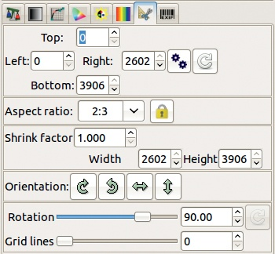

    图 19-35. 裁剪和旋转标签

    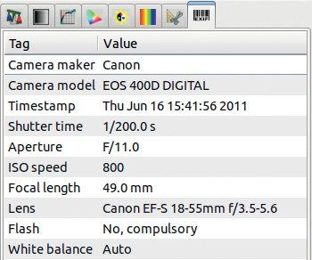

    图 19-36. EXIF 数据标签

+   亮度调整（图 19-34）：此标签允许你从图像中选择最多三种颜色，然后调整其亮度范围为[0 到 2]。

+   裁剪和旋转（图 19-35）：此标签包含一些简单的控制选项，用于裁剪和旋转图像，但 GIMP 提供了更强大、更方便的工具。

+   EXIF 数据（图 19-36）：此标签列出了相机生成的信息，并描述了照片的拍摄方式。这些信息无法更改。

最终直方图（图 19-37）显示了当所有选定的变换应用于图像时，图像的最终属性。你可以通过右键单击选择不同的显示选项。各种复选框和按钮可以显示任何曝光过度或曝光不足的区域。

当你点击确定时，所选的变换将应用于图像，并将其加载到 GIMP 中。

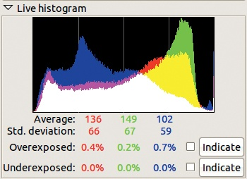

图 19-37. 最终直方图

* * *

^([1]) 安塞尔·亚当斯是著名的摄影师，他定义了*区间系统*，以解决由于光度计假设所有场景的平均亮度是中灰色所导致的曝光问题。有关更详细的解释，请参见*[`www.normankoren.com/zonesystem.html`](http://www.normankoren.com/zonesystem.html)*。

# 19.4 打印

打印图像很容易，只要你有打印机和正确的驱动程序，但打印出屏幕上所看到的真实图像可能会有挑战性。

## 打印原理

购买打印机是打印图像的第一步。市场上有许多打印机制造商和品牌，还有数不清的不同型号。价格区间也非常大，从不到 50 美元的最小、最慢的打印机，到 15000 美元甚至更贵的专业型号，可以打印三英尺宽的纸张。还有多种打印技术和大量额外功能可供选择。由于本书面向一般用户，因此我们只考虑适用于非专业用途的打印机。

最常见的打印技术是喷墨打印和激光打印。最便宜的彩色激光打印机的价格是最便宜的喷墨打印机的三到五倍，但它们的打印速度要快得多。另一方面，低成本的喷墨打印机通常比同价位的激光打印机打印出更漂亮的图像。你还可以在喷墨打印机上使用更光滑和更厚重的纸张。

如果你主要打印文本或简单插图，并且打印量较大（例如每天平均打印几页），那么激光打印机可能是最佳选择。如果你主要打印照片并且想要更高质量的输出，那么你应该购买喷墨打印机。

打印的主要成本不是打印机或纸张，而是墨水。替换一套打印机所使用的所有墨水的费用可能与打印机本身的价格相当，甚至更多。这种成本模式是一个相当隐蔽的商业模式的结果。打印机制造商以低于生产成本的价格销售打印机，但却以远高于实际成本的价格销售墨盒。实际上，它们使用的墨水生产成本非常低，在一些国家，一升墨水的价格与其他国家的 5 毫升墨盒的价格相当。此外，制造商还设计了巧妙的装置和手段，防止客户使用那些便宜 5 到 10 倍的通用墨盒。

然而，值得注意的是，激光墨盒通常比喷墨墨盒打印更多页数。这里使用的商业模式更加值得尊敬。

打印机通常使用 CMYK 色彩模式，详细解释见第十二章。由于颜色是叠加在白纸上的，使用减色模型是有道理的。仅仅使用 CMY 模型不足以生成良好的黑色，因为通过混合三种基本颜色几乎不可能得到理想的黑色。因此，标准的激光或喷墨打印机至少使用四种不同的墨盒：青色（Cyan）、品红色（Magenta）、黄色（Yellow）和黑色（Black）。

专为高质量照片打印设计的喷墨打印机通常使用超过四种不同的墨水。除了 CMYK 外，它们通常还包括浅青色（light Cyan）和浅品红色（light Magenta）。更昂贵的打印机可能还会加入哑光黑（matte Black）和浅灰色（light Gray），以复制模拟黑白摄影中黑色和灰色的特性。

输出纸张的质量也很重要。你在光面相纸上打印的结果会好得多（这与模拟摄影过程无关），但是打印在光面纸上需要更多的墨水，并且耗时更长。如果你在较大尺寸的纸张上进行多次测试打印，墨盒很快就会用光。

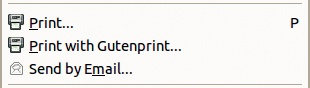

图 19-38. 打印条目在“图像：文件”菜单中

在计划购买打印机时，问问自己以下几个问题：

+   我打算打印什么？

+   我每周会打印多少页？

+   我需要什么打印质量？

+   我可以为打印分配多少每月或每年的预算？

当你考虑所有因素时，最便宜的打印机可能并不是最划算的选择。尽管初期投资较低，便宜的型号通常容易坏，打印效果质量较差，并且墨盒的费用可能比打印机本身还要贵。还要考虑到，看着一台低成本的打印机花几分钟慢慢地输出一张照片将会是多么无聊的体验。

要创建高质量的照片打印，你应该寻找一台至少具有六种不同墨水颜色的喷墨打印机。具有独立墨盒的打印机更为理想，因为它们允许你仅更换已经空的墨盒，这可以节省一些费用。此外，一些打印机墨盒内含打印头，而另一些打印机则是打印头和打印机本体是分开的。尽管前者的成本稍高，但我们更倾向于选择它，原因有两个：

+   如果打印头损坏，替换它是非常简单的。

+   如果几周内没有打印任何东西，墨水通常会在打印头中干涸，导致微小孔洞堵塞。如果打印头固定在打印机上，唯一的解决办法是运行清洁程序，这会消耗大量墨水，并且并不总是有效。

一些打印机具有可更换的打印头，独立于墨盒，这也是一个比固定打印头更好的选择。

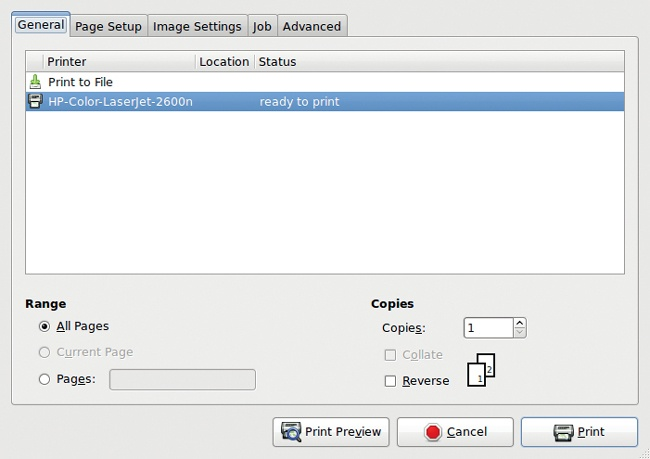

图 19-39. 打印对话框

如果你是 GNU/Linux 用户，在购买打印机之前，查看 Linux 基金会的 Open Printing 页面（*[`www.linuxfoundation.org/collaborate/workgroups/openprinting`](http://www.linuxfoundation.org/collaborate/workgroups/openprinting)*），以确保有适用的驱动程序。

## 使用 GTK 界面进行打印

图 19-38 显示的是**图像：文件**菜单中的一部分，其中包含与打印或通过电子邮件数字输出图像相关的条目。

最后的条目，**图像：文件 > 通过电子邮件发送**，允许你直接从 GIMP 发送文件的数字副本。请注意，这个工具仅在计算机上安装了邮件传输代理时有效，这在个人计算机上不常见，因此你在尝试发送图像时可能会收到错误信息。如果出现这种情况，只需保存图像并像平常一样将其作为附件发送邮件。

在图 19-38 中显示的第一个条目始终存在，但第二个条目只有在安装了 Gutenprint 时才会出现。打印命令使用特定于操作系统的打印机制。我们正在使用 GTK 界面，它可以在 GNU/Linux 环境中使用。如果你使用的是其他操作系统，界面会有所不同，但概念和功能应该相似。

**图像：文件 > 打印**打开在图 19-39 中显示的对话框。在 GENERAL 标签中，你会看到本地打印机的列表。PRINT TO FILE 允许你将图像转换为 PDF 或 PostScript，并保存到指定的文件夹中。这是将图像转换为这两种格式的最简单方法。RANGE 和 COPIES 条目仅在你一次打印多个图像时相关。PRINT PREVIEW 按钮将图像转换为 PDF 并使用默认的 PDF 阅读器显示它。如果你准备打印一张大图像，并且想要检查打印参数，这个选项可能会很有用。

PAGE SETUP 标签在图 19-40 中显示。在 GIMP 的早期版本中，这些选项出现在单独的对话框中，通过**图像：文件 > 页面设置**访问。现在所有内容都集中在同一个对话框中。正如大多数打印对话框标签一样，该标签的内容会根据在 GENERAL 标签上选择的打印机的功能进行变化。PAPER SIZE 提供了预定义的格式选择，显示在图 19-41 中。你还可以通过 MANAGE CUSTOM SIZES 添加新格式，这将打开在图 19-42 中显示的对话框。在这里，你可以创建、命名并指定新大小，或者更改或删除现有的大小。ORIENTATION 提供了四种可能性，显示在图 19-43 中。

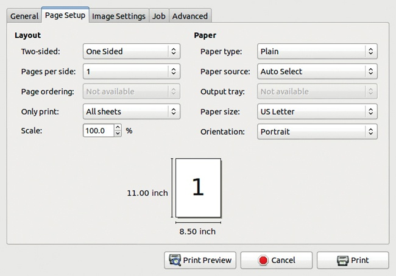

图 19-40. 打印对话框，页面设置标签

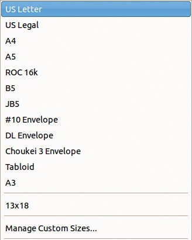

图 19-41. 可用的纸张大小

IMAGE SETTINGS 标签（图 19-44）可用于通过调整边距和分辨率来改变打印图像的大小。请注意，纸张大小是在 PAGE SETUP 标签中设置的。你还可以添加裁剪标记，这在你计划物理裁剪打印图像时非常有用。

其他标签并不总是存在，这取决于所选的打印机。图 19-45 显示了激光打印机的 ADVANCED 标签。该标签的设置涉及打印质量、颜色控制和微调。对于喷墨打印机，ADVANCED 标签提供了更多控制，并且可能会有两个附加标签出现在 ADVANCED 标签之前（图像质量和颜色）。

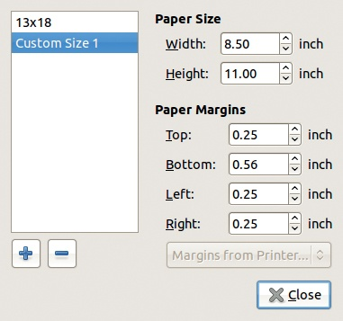

图 19-42. 管理自定义纸张大小

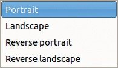

图 19-43. 可用的方向

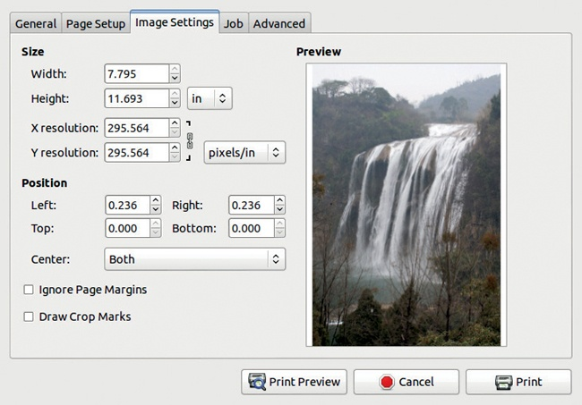

图 19-44. 打印对话框，图像设置标签

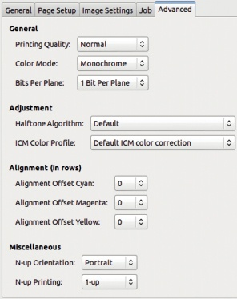

图 19-45. 打印对话框，高级标签

对于单色打印机，没有额外的标签。

## 使用 Gutenprint 打印

Gutenprint 不是 GIMP 的组件，尽管它最初是为 GIMP 开发的，以提供比 GTK 界面更多的选项。你可以轻松地在任何 GNU/Linux 发行版以及 Mac OS X 上安装它，但在 Windows 上安装会更困难。要在 GIMP 中运行它，你还必须安装插件（有关安装插件的更多信息，请参见第二十一章）。**图像：文件 > 使用 Gutenprint 打印**，然后选择该选项，会打开图 19-46 中显示的对话框。

当前图像的预览出现在左侧。如果你将指针悬停在此预览上，详细的工具提示会解释如何定位图像。如果图像远小于纸张，这些说明尤其重要。对话框底部的 IMAGE POSITION（图像位置）和 IMAGE SIZE（图像大小）框显示你在预览中看到的数值等效。SIZE UNITS（单位设置）标签提供英寸、点、pica、厘米和毫米的选择。

右上角的两个框根据打印机的不同而有所变化。特别是，PAPER SIZE（纸张大小）框中的可选纸张大小对于传统的激光打印机和多功能喷墨打印机是不同的。同样，在图 19-46 中显示的 PRINTER SETTINGS（打印机设置）标签页内，SET PRINTER OPTION DEFAULTS（设置打印机选项默认值）上方的矩形框可能包含按钮或滑块，具体取决于所选的打印机。

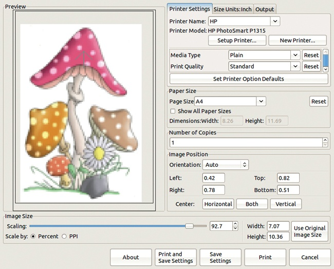

图 19-46. 使用 Gutenprint 的打印对话框

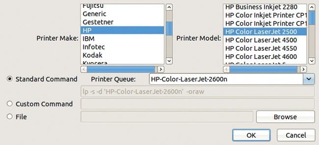

图 19-47. 使用 Gutenprint 设置打印机

PRINTER SETTINGS（打印机设置）标签页允许你选择一个预定义的打印机，添加一个新打印机，或设置当前打印机。SETUP PRINTER（设置打印机）按钮打开图 19-47 中显示的对话框。你可以选择打印机品牌（PRINTER MAKE），然后选择打印机型号（PRINTER MODEL）。可选的打印机型号数量庞大且不断增加；尽管 Gutenprint 开发者努力保持最新，但某些新型号可能还不兼容。

图 19-46 显示了选择了 HP PhotoSmart P1315 打印机的使用 Gutenprint 打印对话框。这里只有几个可用的设置。做个比较，图 19-48 显示了选择 Epson Stylus Photo P50 打印机的使用 Gutenprint 打印对话框。正如您所见，它有不同的打印质量、介质类型、源等选项。使用 Gutenprint 打印对话框始终包含比 GTK 打印界面更多的选项，后者显示在 图 19-39 到 图 19-44。

图 19-49 中显示的对话框仅显示了 Epson 打印机可用的众多参数和设置中的一部分。可以通过点击 OUTPUT 选项卡，然后点击中央的大型 ADJUST OUTPUT 按钮访问此对话框。这些参数旨在专门针对每个图像进行调整。许多滑块默认处于非激活状态，但如果您勾选左侧的框，它们可以被激活。

由于有许多参数可用，您可能希望保存有效的设置。您可以通过使用主窗口底部的按钮（参见 图 19-46）来保存设置并继续调整，或保存设置后立即打印。

如果您想在尚未支持的打印机上使用 Gutenprint，您可以选择将打印机设置为 Adobe，从而生成 PostScript 或 PDF 文件，并使用系统工具打印此文件。但这样做会大大降低 Gutenprint 的灵活性和功能。如果您打算使用 Gutenprint 并正在选购打印机，检查您考虑的打印机是否属于支持的 1400 多种打印机之一。

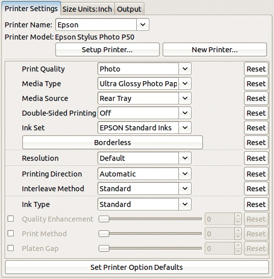

图 19-48。打印机设置选项卡上显示的选项取决于您的打印机。

# 19.5 在 Windows 上扫描和打印

Gutenprint 应该已经移植到 Windows，但安装并正确运行它并不容易。XSane 更为复杂，因为 SANE 本身目前在 Windows 上运行并不顺畅。Windows 用户可以通过 SANE GNU/Linux 服务器访问 SANE，但这样做至少需要两台局域网中的计算机，其中一台必须是运行 SANE 的 GNU/Linux 服务器。如果您有一台运行 SANE 的 Linux 服务器，您不妨直接绕过 Windows 机器，从服务器进行打印。

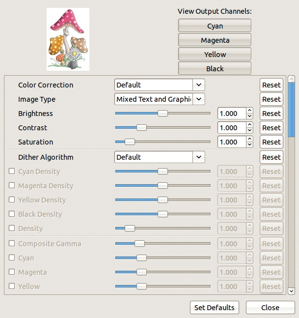

图 19-49。Epson 打印机的调整输出对话框

如果你使用的是 Windows 机器，通常需要使用随设备提供的扫描软件。其功能类似于 XSane 对话框——只是组织方式不同。专有的扫描软件可能不太直观，并且使得连续扫描多张图像变得过于复杂。例如，扫描分辨率可能隐藏在一个菜单中，主菜单中无法立即看到。

由于 Gutenprint 在 Windows 上不容易获得，GIMP 在 Windows 机器上的默认打印功能略有不同。当你选择**图像：文件 > 打印**时，会打开一个只有两个标签的对话框。在第一个标签中，你以类似于 GNU/Linux 的方式选择打印机。第二个标签是图像设置标签，与图 19-44 相同。

为了精细调整打印参数，请点击第一个标签页中的**首选项**。你将会看到一个对话框，里面有多个标签，针对你的打印机。这种对话框主要用于文本文件，并不具备太多针对图像的功能。
