# 第二十章. 图像格式

GIMP 可以管理超过 40 种用于表示图像的文件格式。它可以读取 35 种输入格式并生成 39 种输出格式。此外，它支持以压缩形式接受这些格式，使用 Gzip 或 Bzip2 压缩技术。

如果我们详细讲解所有这些格式，本章将非常庞大。相反，我们只讨论对许多 GIMP 用户来说流行的，或者至少有用的格式。我们还讨论了支配各种图像格式的基本原理。

# 20.1 文件格式概述

计算机屏幕上的图像由一个像素矩阵组成。这在所有当前的显示设备上都是适用的：阴极射线管、等离子、液晶显示器等。这对激光和喷墨打印机也适用。甚至眼睛也将图像分解为一系列的视杆和视锥，正如附录 A 中所描述的那样。

*文件格式*是指文件在内存中的存储方式，独立于图像的捕捉方式和最终的显示方式。因此，无论图像是存储在磁盘上还是在线下载，它作为文件的表现不一定等同于最终的像素矩阵。而且由于像素密度在手机显示屏、计算机显示器、低成本喷墨打印机和专业激光打印机之间差异很大，任何表现都需要从内部表示转换为外部表示。你制作的图像也必须进行转换——无论是从手机摄像头、扫描仪还是专业数码相机。

## 光栅和矢量格式

图像格式可以分为两大类：光栅格式和矢量格式。

+   在*光栅格式*中，图像作为其包含的像素的表示存储。*位图*图像只能表示黑白（没有灰度级别），每个像素包含 1 位，而*像素图*图像可以表示灰度级别和颜色，每个像素包含多个位。

+   在*矢量格式*中，图像以几何描述的方式存储其内容。

每种格式都有其优缺点。矢量格式的图像文件通常比光栅格式的文件要小得多，并且矢量图像可以在任何尺寸下显示，保持相同的清晰度，因为每次缩放因子变化时，像素都会重新计算。图 20-1 展示了一个以矢量图形格式生成的 48 × 48 图标。该文件在 SVG 格式下为 63KB（它是 XML 约定中的文本格式）。由于图像非常小，在 JPEG 格式下它只有 1.3KB。

图 20-1. 一个图标

图 20-2. 将图标放大为矢量图像

图 20-3. 将图标放大为光栅图像

图 20-2 显示了相同的图标，放大到 480 × 480，作为 300 dpi 的矢量图像。SVG 文件与之前的大小相同，但 JPEG 文件现在是 30KB。图 20-3 显示了相同的图标，放大为栅格图像。JPEG 文件是 19KB，但图像严重像素化。

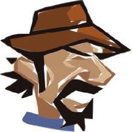

图 20-4. 一幅典型的矢量图像

尽管矢量图形显然有其优势，但它们的主要缺点是无法准确表示像照片这样的复杂图像。例如，用数学公式描述人脸的立体感和阴影是不切实际的。图 20-4 就是一幅用矢量图形制作的人物画像的典型例子。虽然有工具可以将图像从栅格格式转换为矢量图像，但转换结果往往不理想。

GIMP 处理图像的栅格表示，因此它适合用于照片和插图。然而，位图无法无限放大，因此在处理栅格图像时，尽量使用尽可能高的分辨率。你可以在发送文件给他人或在线发布之前随时缩小尺寸。

## 无损压缩与有损压缩

栅格图像通常很大，随着数码相机的进步，它们的尺寸不断增大。单个像素的数据大小也会随着能够表示的颜色数量的增加而增加。图像的像素数量随着图像的大小和分辨率的提升而增多。现在，数码相机能够拍摄达到 1000 万（甚至 1200 万）像素的图像，这通常意味着每个颜色通道有 256 种颜色时，图像的文件大小至少为 30MB。

30MB 的文件相当大，即使是对于当前的硬盘来说，尤其是如果你存储很多照片时。对于大多数存储卡来说，这个文件大小也很大，发送电子邮件或在线发布时也会很困难。一种解决方案是压缩文件，以减小其大小。有许多算法可用于压缩文件，特别是图像文件。这些算法可以是无损的，也可以是有损的。

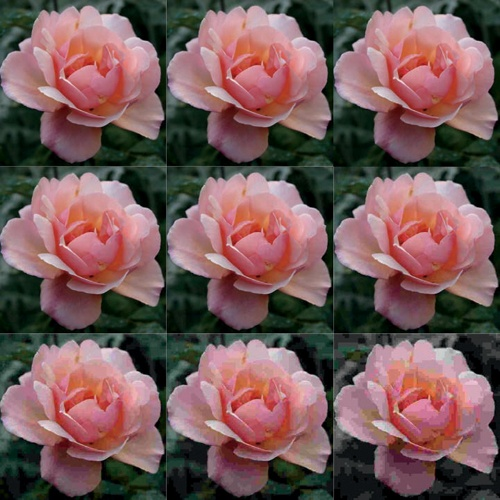

图 20-5. 一张玫瑰花的照片，图像质量逐渐下降

+   *无损*压缩算法能够在不丢失任何信息的情况下重建原始数据。图像质量保持稳定，但有时原始图像会以有损的方式进行转换。如果图像没有首先进行转换，那么应用无损压缩不会大幅减少文件大小。

+   *有损*压缩算法会导致一些信息损失，但这些差异可能对肉眼不可见。通常，有损压缩会显著减少文件大小，但你无法完全重建原始图像，如果多次应用有损压缩，损失会是累积的。最终，你会看到差异。

如果你想要最大图像质量且不在乎文件大小，可以仅使用无损压缩。如果你能接受一定的图像质量损失来换取显著的文件大小减小，可以选择有损算法。

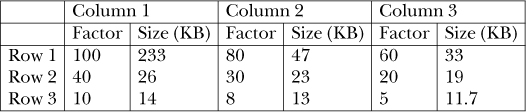

图 20-6. 所示图像的大小和质量因子，如图 20-5 所示

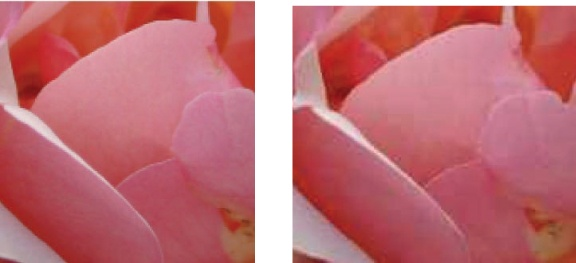

图 20-7. 玫瑰的初始照片（左）；多次保存和重新加载后的相同图像（右）

图 20-5 显示了相同的图像九次。

每次图像的质量因子和大小减少，如图 20-6 所示。

你不会看到明显的质量损失，直到质量因子降到 60 以下。然而，当质量因子降到 10 或更低时，损失会非常明显。

有损压缩的另一个问题是，如果多次保存图像，缺陷会逐渐积累。图 20-7（左）展示了玫瑰照片的放大部分，图 20-7（右）展示了经过多次保存和重新加载后（使用较低质量因子，小于 60）相同的照片。压缩伪影在中间花瓣的边缘清晰可见。

## 布局引擎与浏览器

如今，许多人通过浏览器（如 Firefox 或 Internet Explorer）查看图像。不幸的是，并非所有浏览器都支持所有图像格式。事实上，下一节讨论的三种常见格式是所有现有浏览器都能显示的唯一格式，有时即使是这些格式也不能完美显示。

存在许多不同的浏览器，并且根据操作系统的不同，某些浏览器有所不同。浏览器使用*布局引擎*在屏幕上显示图像。目前有不到 10 个布局引擎可供使用，其中只有少数是广泛使用的。使用相同布局引擎的不同浏览器处理图像的方式相同。下表列出了流行的布局引擎及其使用的浏览器：

| 布局引擎 | 浏览器 |
| --- | --- |
| Gecko | 所有 Mozilla 软件：Firefox, Galeon, Seamonkey 等 |
| KHTML | Konqueror |
| Presto | Opera |
| Trident | Internet Explorer 4 至 9 |
| Webkit | Safari, Epiphany, Google Chrome |

由于仍有许多人使用 Internet Explorer，因此有许多人使用 Trident。没有哪个布局引擎是完美的，但不幸的是，Trident 是最差的之一。就图像显示而言，它的主要问题是无法很好地处理 PNG 格式。其他免费软件浏览器处理 PNG 图像的效果要好得多。

# 20.2 JPEG, GIF 和 PNG

在这一部分，我们讨论所有布局引擎处理的常见格式（尽管并不总是处理得很好）以及通常最有用的格式。

## JPEG

令人惊讶的是，JPEG 不是格式的名称，格式被称为 JFIF，而是定义该格式的工作组——联合图像专家组（Joint Photographic Experts Group）的名字。这个委员会定义了成为 1994 年 ISO 标准的格式。他们设计的格式是大多数数字相机的常用输出格式，如果不是全部的话。JFIF 代表*JPEG 文件交换格式*。

JPEG 使用有损压缩算法，这意味着一些信息会丢失，但文件大小大幅减少，同时保持相当高的图像质量。JPEG 是拍摄照片和数字插图时的首选格式，因为它能够将复杂的图像转换为足够小的文件，以便通过电子邮件发送或在网页上发布。

如 图 20-7 所示，反复导出 JPEG 并不是一个好主意，因为质量损失会逐渐积累。每次加载图片时，您都是从上次导出时所处的状态开始，而该状态已经在导出时丧失了一些质量。始终在 GIMP 中以 XCF 格式编辑图像，并将其从 XCF 导出以保存为 JPEG。这个问题是自 2.8 版本以来，GIMP 仅将图像导出为 JPEG，并且在您将图像保存为 XCF 文件之前，不会将其视为已保存的原因之一。

JPEG 格式不适合包含线条图、文本或相邻像素之间有明显对比度的图像。在这种情况下，需要使用无损压缩算法，因为这意味着只有初始图像中的某些像素被保存，缺失的像素会在加载图像时进行插值。如果线条图中的尖锐边界处的像素没有保存，插值会根据周围像素赋予它们一个平均值，从而使边界变得平滑，可能导致图像看起来模糊。

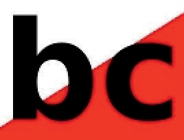

图 20-8. 与有损压缩算法的鲜明对比

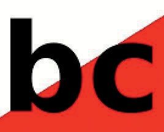

图 20-9. 与无损压缩算法的鲜明对比

图 20-8 和 图 20-9 显示了在高对比度图像上使用有损和无损压缩算法的区别。在第一幅图中，字符轮廓被有损压缩算法模糊了，而在第二幅图中，由于使用了无损压缩算法，轮廓保持清晰。

JPEG 格式的另一个缺点是它无法处理透明度。虽然对于照片通常没有问题，但如果你想在网页上显示一个非矩形的图形（例如），而且它是 JPEG 格式，你必须用颜色或图案填充背景。

JPEG 文件可以包含 ICC 颜色配置文件，用于定义所使用的颜色空间（参见 第十二章）。如果是这种情况，当你加载该文件时，GIMP 会询问是否使用嵌入的配置文件。通常，你应该选择“是”。许多简单的图像应用程序会忽略该配置文件。

### 导出为 JPEG

当你将图像导出为 JPEG（`.jpeg` 或 `.jpg`）格式时，GIMP 会打开一个对话框，在最简单的形式下，它只允许你设置压缩质量 [0 到 100]。

QUALITY 滑块决定了为了减小文件大小而需要降低的图像质量。质量值大于 85 的图像通常看起来差不多，质量损失在这些值下几乎无法察觉。通常只有当值小于 50 时，图像的退化才会变得明显。在导出图像之前，勾选“在图像窗口中显示预览”（SHOW PREVIEW IN IMAGE WINDOW）来查看当前设置的效果。

如果你点击“高级选项”（ADVANCED OPTIONS），你将看到扩展的对话框，显示在 图 20-10 中。这里是最有用的“高级选项”：

+   渐进式：文件在网页中逐步加载。首先会显示一个粗略版本，随后图像会越来越精细。此设置对于加载时间较长的大文件非常有用，但它会稍微增加文件大小。

+   保存 EXIF 数据：EXIF 数据通常由数码相机添加到文件中，包含有关照片的信息，包括照片拍摄的日期和时间、相机品牌与型号以及使用的相机设置。

+   保存缩略图：此选项将图像的缩略图保存到文件中。

+   使用原始图像的质量设置：这些设置决定了压缩算法的工作方式。原始图像可能有一组不寻常的值；在这种情况下，勾选此框可确保如果对图像进行微小修改，结果将与原始图像保持相同的质量。

+   平滑：此滑块平滑由于高压缩比而产生的不完美之处。平滑还会模糊图像。

其他高级选项仅在非常特定的情况下才有用，因此除非你知道需要更改它们，否则可以忽略它们。请注意，注释字段（用于向文件中添加文本）不会在图像本身中显示，但你可以在 GIMP 中通过**图像：图像 > 图像属性**的第三个标签页查看它。注释字段可以方便地用于添加版权声明等信息。

除了透明度，JPEG 无法保存多个图层。尽管它有一些流行的应用，但 JPEG 无法存储与 XCF 一样多的信息，这也是为什么将文件保存为 XCF 并导出为 JPEG 总比仅以 JPEG 存储文件要更好的另一个原因。

## GIF

图形交换格式（GIF）有着悠久而波澜壮阔的历史。尽管这种格式有许多主要的缺点，但它依然广受欢迎，部分原因是它是制作小型动画的最简单格式（第十八章），以及人们对它较为熟悉。

该格式由 CompuServe（现在是 AOL 的子公司）于 1987 年定义。当时，图像压缩被认为比颜色数量更为重要，因为大多数现有显示屏限制了颜色数量。因此，GIF 格式凭借其高效的压缩算法和有限的调色板，在最早的浏览器和图形工具中得到了广泛应用。

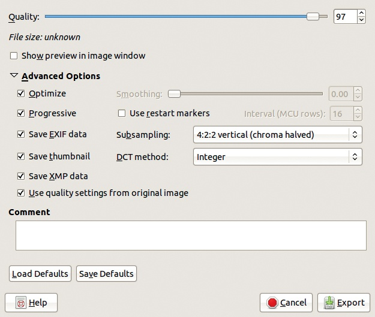

图 20-10. 将图像导出为 JPEG 对话框

GIF 使用的压缩算法被称为 LZW。它是在 1970 年代末由 Jacob Ziv 和 Abraham Lempel 设计的，1983 年由 Terry Welch 改进。Welch 立即为他的算法申请了美国专利，并后来将该专利扩展到其他国家。

当 GIF 格式发布时，作者并未意识到专利问题，直到 1993 年，当前的专利持有者 Unisys 才尝试行使对该算法的权利。他们试图在格式被使用时收取版权费，至少在商业产品中是这样。这引起了互联网界的广泛愤慨，也成为 PNG 格式发展的主要原因之一（见 PNG）。该专利在 2003 年在美国到期，一年后在其他国家也到期，因此现在你可以自由使用该格式，但它的声誉尚未完全恢复。

GIF 格式在发布时实际上相当不错，但今天 PNG 在各个方面都优于它，除了一个方面：动画。然而，Internet Explorer 对 PNG 的支持不佳，仍然是这一格式广泛采用的主要障碍。

GIF 的主要特点是图像必须处于*索引模式*。索引图像使用颜色表进行编码，正如我们在第十二章中解释的那样。像素通过颜色表中的索引来表示，每个像素的大小取决于表的大小：一个包含 4 种颜色的表需要 2 位，一个包含 64 种颜色的表需要 6 位，一个包含 256 种颜色的表需要 8 位（1 字节），这是 GIF 的最大值。

索引模式节省空间，因为每个像素最多只需 1 个字节，而不是 3 个字节（使用 8 位深度的 RGB 编码）。但通过增加相邻像素相同的概率，可以节省更多的空间。压缩算法可以不存储每个像素的值，而是存储一个区域的形状和大小，这个区域内的所有像素值都是相同的，并且存储该区域的像素值。

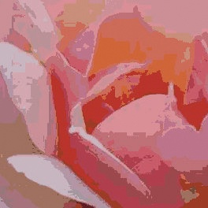

图 20-11. 图 20-7 中的玫瑰使用 32 种颜色进行了索引

LZW 压缩算法并不像那样工作，但如果相邻像素值相同，压缩率仍然会更好。如果像素的可能值比图像中的像素还要多，LZW 就无法工作，这在 RGB 编码中经常出现。对于 8 位 RGB，你有 2²⁴种可能的像素值（超过 1600 万），但是一个 4000 × 4000 的像素图像异常巨大。GIF 对于照片的表现也不佳，因为相邻像素值相同的概率较低。

LZW 算法在图像包含大片相同颜色区域时效果最佳，这意味着 GIF 格式最适合用于简单的图形、线条绘图和卡通图像。由于调色板中的颜色不够，平滑的色调或亮度变化很难呈现。被称为*抖动*的技术可以在一定程度上平滑过渡。当应用抖动时，两个不同的颜色会在相邻像素中使用，因为像素非常小，眼睛会将这两种颜色混合在一起。抖动可能导致细节丢失，结果不一定看起来很好。另一个后果是相邻像素不再完全相同，因此 LZW 算法无法有效压缩图像。

图 20-11 展示了在图 20-7 中，玫瑰的索引效果。图像使用 32 种颜色进行了索引，颜色看起来块状。

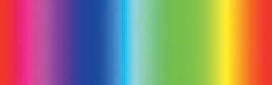

图 20-12. 颜色渐变

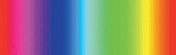

图 20-13. 颜色渐变的索引和抖动

图 20-12 展示了一个使用 Blend 工具和`全饱和光谱 CW`渐变构建的简单图像。图 20-13 展示了在我们使用 256 种不同颜色进行索引后的同一图像。尽管我们使用了最大数量的颜色，但图像看起来不对，所以我们添加了抖动来平滑过渡。然而，它仍然看起来不对。

在 GIF 格式支持的 256 种颜色中，其中一种可以用作透明色。当图像在网页上显示时，透明像素可以让背景透过。虽然 JPEG 格式不支持透明，但 GIF 也不支持渐进透明。

### 导出为 GIF

当你将图像导出为 GIF 格式（`.gif`）时，GIMP 会打开图 20-14 所示的对话框。

如果你保存的是静态图像，该对话框仅允许你添加评论并勾选“交错”框。交错构建的图像会逐渐显示，这对于通过慢速互联网连接传输的大图像可能会有帮助。

如果图像有多个图层，可以选择将其保存为动画。勾选“作为动画”将展开对话框，并且你可以设置输出格式中解释的动画参数。

如果图像处于 RGB 模式，在你将其导出为 GIF 时，它会自动转换为索引模式，并使用默认的颜色映射。

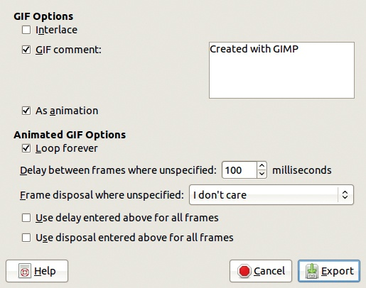

图 20-14. 导出图像为 GIF 对话框

首先将其转换为索引模式（**图像：图像 > 模式 > 索引**）是更安全的做法；这样你可以选择颜色映射并决定是否使用抖动。

## PNG

便携式网络图形（PNG）格式最初在 GIF 的专利 LZW 压缩算法争夺战中被定义为一种免费的替代格式。PNG 使用无损、无专利的压缩算法，并且设计上避免了 GIF 的大多数缺点，包括限制为索引表示。

PNG 格式在 2003 年成为 ISO 标准，并在一年后进行了修订。尽管 PNG 明显优于 GIF，但由于两个原因，它并未完全取代 GIF：它不支持动画以及微软在 Internet Explorer 中不愿正确实现它。然而，Internet Explorer 的后续版本（7 及以上）对 PNG 的支持有所改善，IE 9 似乎完美无缺，因此我们依然充满希望。

PNG 支持 RGB、灰度和索引图像，但不支持 CMYK 等其他色彩空间。它还支持渐进透明度，可以在图像处于 RGB 或灰度模式时通过附加通道来实现，或者通过向索引模式中的调色板条目添加 Alpha 值来实现。

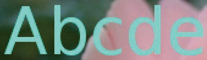

图 20-15. PNG 图像中的一些文字

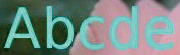

图 20-16. JPEG 图像中的相同文字

由于 PNG 使用无损压缩，它生成的文件比 JPEG 大，但在文本打印在照片上的情况下，PNG 格式明显优于 JPEG。JPEG 使用的有损算法会模糊字符的轮廓，如图 20-15 和图 20-16 所示。然而，JPEG 使用的有损压缩确实能生成更小的文件，并且只要选择一个大于 50 的质量因子，照片的图像质量也同样优秀。

与 GIF 相比，如果条件相同（即图像处于索引模式），PNG 实际上会生成更小的文件。如果你将 RGB 图像导出为 PNG，它将保持 RGB 模式，因此占用更多空间，因为它包含更多的颜色。如果你先将图像转换为索引模式，然后将其分别导出为 GIF 和 PNG，那么 PNG 文件的大小大约是 GIF 文件的一半。

PNG 格式适用于所有类型的图像——除动画外。（但对于没有文字的照片，JPEG 更合适，因为文件大小较小。）在存储简单插图（如只有少量颜色的卡通）时，记得在导出之前将图像转换为索引模式。由于压缩算法是无损的，你可以反复将图像导出为 PNG，而不会出现 JPEG 中常见的累积退化问题。

### 导出为 PNG

当你将图像导出为 PNG（`.png`）时，图 20-17 中的对话框会打开。以下是对话框中最有用的条目：

+   交错：此选项创建一个逐步加载的图像。

+   保存背景颜色：此选项用于不支持渐进透明度的过时浏览器。使用此选项，你可以选择在透明像素处显示的颜色。不幸的是，Internet Explorer 无法识别这些设置。

+   保存分辨率：此选项仅在打开图像的程序能够读取保存的分辨率时才有用。

+   保存创建时间：此选项保存图像最后一次保存的时间和日期。

+   保存评论：通过**图像：图像 > 图像属性**在评论选项卡中添加的任何评论都会被保存。

+   保存透明像素的颜色值：完全透明的像素可能仍然具有颜色值，若后来减少或移除透明度，这些颜色值将会显示出来。

图 20-17. 导出图像为 PNG 的对话框

# 20.3 GIMP 的原生格式

在 GIMP 中，正在进行的工作通常包含多个图层、透明度和一个活动选择。它还可能包含图层蒙版、包含已保存选择的通道和路径。它可能还包括撤销历史。你在 GIMP 中所做的任何操作都可以通过*原生格式*XCF 来表示。原生格式是专为某个软件设计的文件结构。

GIMP 还提供定义新画笔、图案、调色板和渐变的工具。每一种工具也都有一个在 GIMP 中的原生格式。你可以从网上下载自定义画笔、图案、调色板和渐变，甚至可以创建自己的并发布供其他用户下载。第二十二章将向你展示如何操作。

## XCF

XCF 是 GIMP 最重要的原生格式。当你以 XCF 格式保存图像时，你保存了所有的组件、图层、图层组、蒙版、通道、路径、辅助线等。唯一未保存的是撤销历史，因为这会显著增加文件大小。

XCF 是唯一能够保证存储你在 GIMP 中正在处理的图像所有信息的格式，它是进行中工作的最佳格式。如果你想将文件保存为其他格式，但希望以后做进一步修改，始终保存一份 XCF 格式的副本。

由于 XCF 存储了大量信息，XCF 文件可能会相当大，但 GIMP 允许你使用两种无损外部压缩算法之一来压缩它：Gzip 使用的算法和 Bzip2 使用的算法。Bzip2 的效果比 Gzip 好，但最多只能提高 30%或 40%。Bzip2 也要慢得多。GIMP 可以加载和保存使用这些算法压缩的文件，而无需先解压文件。压缩由第二个扩展名指示，它可以是`.gz`或`.bz2`。在 GNU/Linux 操作系统上，后缀并不确定文件格式，文件格式由文件的前几个字节指定，但对用户来说可能有所帮助。

尽管 XCF 可以被包括 ImageMagick、Krita 和 Inkscape 在内的其他几个应用程序读取，但它并不是一个通用格式。

当你使用**图像：文件 > 另存为**或保存图像时，GIMP 会自动假定文件格式为 XCF，并将相应的扩展名添加到文件名中。对于所有其他输出格式，你必须使用**图像：文件 > 另存为**或导出图像。导出命令无法生成 XCF。如果图像被修改然后导出，GIMP 不会认为图像已保存，并在你尝试关闭时打开警告窗口。

## 其他本机格式

除了图片外，其自然格式为 XCF，GIMP 中还有四种其他对象具有自己的本机格式。这些是画笔、图案、渐变和调色板。每个对象都有一个专门的可停靠对话框：画笔对话框、图案对话框和渐变对话框默认情况下出现在多对话框窗口中；而调色板对话框可以通过**图像：窗口 > 可停靠对话框**或从对话框菜单中打开，你可以通过点击所有可停靠对话框顶部找到的小三角形来打开对话框菜单。

这些对象存储在计算机上的特殊文件夹中，你可以在 Folders 条目中使用**图像：编辑 > 首选项**来定义这些文件夹。每个类别都有一个系统范围的文件夹，在安装或更新 GIMP 时存储对象，以及一个个人文件夹，你可以在其中存储你创建的对象。

你可以通过使用相应对话框底部的按钮来创建、编辑或删除画笔、图案和调色板。这些按钮让你可以做以下事情：

+   编辑当前对象。只有当对象在个人文件夹中时，编辑才有效。否则，你只能查看对象的特性。

+   创建一个新对象。

+   复制当前对象。

+   删除当前对象（如果它在你的个人文件夹中）。

+   刷新对话框中的对象列表。

你也可以通过对话框菜单或右键单击画笔、调色板或图案来访问这些选项。图案不是使用特定工具构建的，因此图案对话框只包含用于删除、刷新和将当前图案打开为图像的按钮。

构建和保存新的画笔、图案、对话框和调色板的过程可以在第二十二章中找到描述。

# 20.4 其他有用的格式

本节介绍的图像格式，在使用 GIMP 时虽然有用，但使用频率较低。

## PostScript 和 PDF

PostScript 并不是一种图像格式；它实际上是一种编程语言，设计于 1982 年，用于文档页面描述。早期的激光打印机，甚至许多现在的打印机，都使用 PostScript 来描述正在打印的页面。这些打印机包含该语言的解释器，执行该解释器指示打印机如何在页面上放置点。

PostScript 是一种专有语言，属于 Adobe 公司，但其描述是公开的。Ghostscript 解释器是一个免费软件，遵循 GPL 协议，可以让你在不使用 PostScript 的打印机上打印 PostScript 文件（例如，大多数喷墨打印机）。

PostScript 是一种矢量图形语言。它会在接收到打印机定义后，在最后一刻将图像光栅化。字符字体可以通过矢量几何定义，并且可以放大或缩小而不会出现像素化。

当你将图像导出为 PostScript（`.ps`）时，GIMP 会打开如图 20-18 所示的对话框。图像的尺寸以毫米或英寸为单位预设。你可以更改它们，但如果这样做，你会固定附加到图像上的打印机定义。最好将图像到 PostScript 的转换留给你用于将其添加到文档的应用程序。

封装 PostScript（EPS）是带有额外信息的 PostScript，该信息位于封装图像的框中。这些信息告诉导入文件的应用程序图像的精确尺寸，并且在将图像插入文档时，通常比普通 PostScript 更加顺畅。

GIMP 也可以使用图 20-19 中的对话框导入 PostScript 文件。你选择的分辨率非常重要。导入时，图像会立即被光栅化，输入文件中的矢量信息会丢失。

可移植文档格式，通常称为 PDF，是 PostScript 的简化版。PDF 同样属于 Adobe 公司，但在 2008 年被接受为 ISO 标准。PDF 正在慢慢取代 PostScript，并提供了多个优势。GIMP 能够导入和导出 PDF 文件。

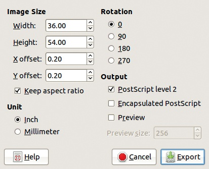

图 20-18. 导出为 PostScript 图像对话框

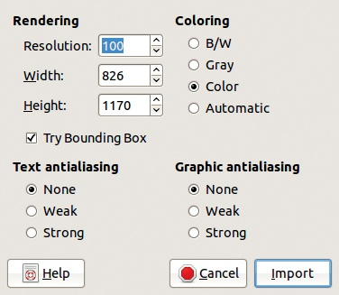

图 20-19. 从 PostScript 导入对话框

当你将 PDF 文件导入 GIMP 时，它会打开 图 20-20 中显示的对话框。你可以选择输入文件的分辨率、要导入的页面，并决定是将它们作为单个图像的图层导入，还是作为多个图像导入。

当你将图像导出为 PDF 时，GIMP 会打开 图 20-21 中显示的对话框。你可以选择减少生成的 PDF 文件大小的选项。

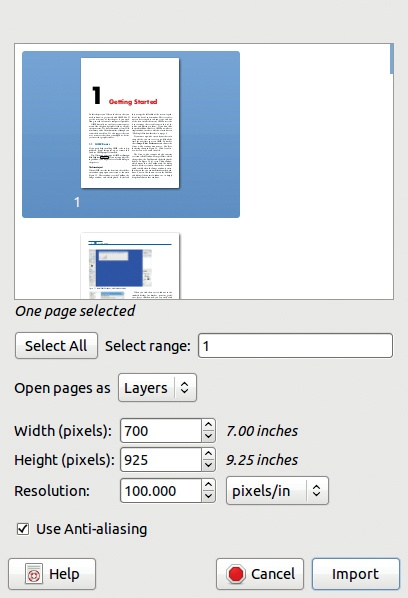

图 20-20. 从 PDF 导入对话框

## TIFF

标记图像文件格式，也称为 TIFF，并不是国际标准。它也属于 Adobe，于 1980 年代中期定义，自 1992 年以来没有更新。

TIFF 是一种复杂且灵活的格式，可以使用多种不同的压缩算法——有损或无损。它还可以使用不同的每颜色位数、不同的色彩空间等。但是，大多数应用程序无法处理所有 TIFF 特性，这意味着在从一个应用程序向另一个应用程序传输图像时，可能会丢失一些信息。

然而，TIFF 格式是科学影像领域的首选格式，并在印刷行业得到广泛接受。

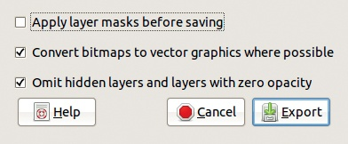

图 20-21. 将图像导出为 PDF 对话框

图 20-22. 将图像导出为 TIFF 对话框

当你将图像导出为 TIFF 格式（`.tiff`）时，GIMP 会打开 图 20-22 中显示的对话框。单选按钮允许你选择压缩算法。LZW、Pack Bits 和 Deflate 是无损的；JPEG 是有损的。两种 CCITT 压缩算法仅适用于黑白图像（没有灰度）。如果图像包含路径，它们也会被保存。

## Netpbm 格式

Netpbm 是一个公共领域的可移植程序集，用于将一种图形格式转换为另一种格式。这些程序可以处理一大批图形格式，并定义了 GIMP 支持的四种新格式：

+   可移植位图（PBM）适用于位图（黑白图像）。

+   可移植灰度图（PGM）适用于灰度图像。

+   可移植像素图（PPM）适用于彩色像素图。

+   PNM 一词指的是这三种格式的总和。

Netpbm 提供了一种名为 PAM 的附加格式，但 GIMP 不支持它。所有这些格式都使用文本表示方式，导致文件非常大。例如，图 20-5 中的玫瑰有以下大小（TIFF 文件是使用 Deflate 压缩保存的）：

| 格式 | 大小（KB） |
| --- | --- |
| GIF | 109 |
| JPEG | 26 |
| TIFF | 300 |
| PPM | 3600 |

尽管它们的体积较大，但这些格式非常方便，因为你可以将它们转换为几乎所有现有的图像格式，或者从这些格式转换出来。

## SVG

可缩放矢量图形（SVG）是矢量图形的首选格式。它是一个由万维网联盟（W3C）定义的开放标准，依赖于 XML 的文本性质。越来越多的应用程序在其输入文件中接受这种格式，包括 GIMP。

SVG 是一些矢量图形程序（如 Inkscape（免费软件））的原生格式。其他程序，如 Adobe Illustrator、CorelDRAW、Blender 或 Xara Xtreme（后两者为免费软件），也可以导入和导出 SVG 文件。请注意，Adobe Photoshop 不支持 SVG。

大多数浏览器都可以显示 SVG 图像。唯一的例外是 Internet Explorer，但有插件可以让 Internet Explorer 显示 SVG。

GIMP 可以导入像图 20-2 中所示的 SVG 图像，但将栅格图像导出为 SVG 是不可能的，而且结果可能也不会很好看。不过，GIMP 路径可以导出为 SVG。

## GIMP 支持的其他格式

GIMP 可以导入 Photoshop 图像文件，这对于那些希望放弃专有软件而转向免费软件的人来说非常有用。

BMP 格式是一个非常简单的微软格式，缺乏压缩功能。在图 20-5 中保存为 BMP 时，图像占用 1100KB。该格式主要用于 Microsoft Windows 系统中的图标以及 OS/2。GIMP 可以导入和导出 BMP 文件。导出时，你可以选择颜色空间的位数以及 Alpha 通道的表示形式（如果存在的话）。

X 窗口系统（所有类 Unix 操作系统中的窗口系统）使用 XPM 和 XBM 图形格式作为图标等。第一个是用于像素图的，第二个是用于位图的。两者都是完全文本格式，因此不适用于大图像。导出为 XPM 时，图 20-5 的图像占用 2400KB。

专业摄影师常用的一种图像格式是 *raw 格式*。我们在选择格式和处理原始照片中将更详细地讨论这种格式。
