# 第二十一章 脚本和插件

GIMP 不是一个单一的程序。它由许多插件组成，这些插件并不是系统核心的一部分。事实上，**图像：滤镜**菜单中的大部分工具都是插件，**图像：颜色**菜单中的许多工具也是插件。除了这些内置插件外，还有许多第三方插件可供使用；其中一些插件体积较大，比如 GIMP 动画包（GAP；在第十八章中讨论）。其他一些插件体积较小，用于执行简单任务。

脚本和插件非常相似。一个区别是它们存储的位置不同。当你打开 **图像：编辑 > 偏好设置** 对话框中的 FOLDER 条目时，你会看到 `Plug-Ins` 和 `Scripts` 文件夹。

# 21.1 脚本和插件简介

在本章中，我们将解释 GIMP 脚本和插件的基本概念，并教你如何找到和安装新的插件。接下来，我们简要介绍一些值得安装的重要插件。最后，我们展示用 Python 和 C 编写的插件示例，以及一个用 Scheme 编写的脚本示例。

脚本和插件的另一个区别是它们编写的编程语言。脚本是用 Scheme（在 GIMP 中称为 Script-Fu）编写的，存储在 `Scripts` 文件夹中。插件是用 Python 或 C 编写的，存储在 `Plug-Ins` 文件夹中。

## Scheme、Python 和 C

*Scheme* 是一种非常简单且相对古老的语言，直接解释执行，无需任何翻译。GIMP 包含一个 Scheme 子集的解释器，因此 Scheme 脚本始终可以运行。实际上，你至今使用的许多预定义插件（例如在第十二章或第十七章中）实际上是用 Scheme 编写的脚本。Scheme 是一种函数式语言，语法上只使用圆括号和空格进行标点。

*Python* 语言也是一种直接解释的语言，它比 Scheme 更强大。近几年它逐渐流行，并且很可能逐步取代另一个脚本语言 Perl，因为它的语法更加简洁易懂，功能范围也更广。Python 的解释器不是 GIMP 的一部分，需要在 Windows 上单独安装。（它与 Linux 和 Mac 操作系统一起捆绑提供。）

*C* 是编写 GIMP 核心部分的语言，也是大多数 GNU/Linux 操作系统的编程语言。C 是一种古老的语言，得到了极好的支持，因为它允许程序高效地利用计算机的所有能力。用 C 编写的程序不能直接执行，必须先被翻译成机器语言然后加载。你需要通过 *编译器* 来完成这一过程。为了编写 C 插件，你必须在计算机上安装 C 编译器和开发环境。在 GNU/Linux 和 Mac OS 上设置编译器很容易，但在 Windows 上稍微复杂一些。

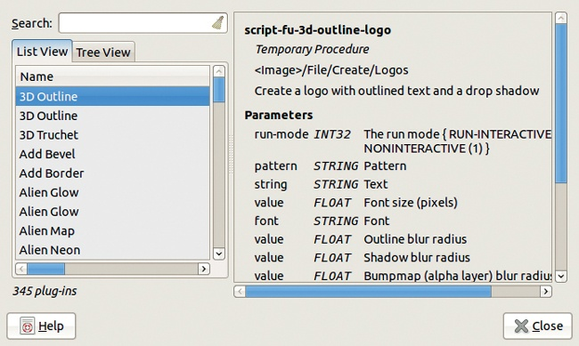

图 21-1. 插件浏览器，列表视图

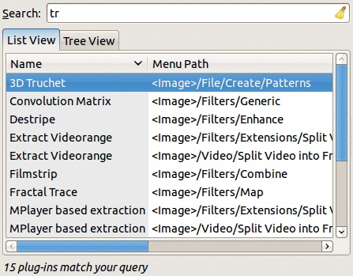

图 21-2. 查找特定插件

GIMP 插件可以用其他编程语言编写，特别是如果该语言是编译型的。Perl 曾是编写 GIMP 插件的首选语言，但今天使用得较少。因此，我们只考虑 Scheme、Python 和 C。要编写自己的插件，你需要掌握至少其中一种语言；每种语言的编程完整介绍超出了本书的范围。

## 已安装插件

要查找哪些插件已经是你 GIMP 安装的一部分，可以使用插件浏览器（**图像：帮助 > 插件浏览器**），如图 21-1 所示。如你所见，此安装有 345 个插件。左侧的第一个标签按字母顺序列出它们。

当你在插件浏览器左上角的搜索框中开始输入时，插件列表会自动筛选出包含此子字符串的插件名称，如图 21-2 所示。点击右上角的扫帚图标可以清除筛选。

第二个标签提供所有插件的树状视图，这对于按类别搜索插件非常有用。在图 21-3 中，我们通过点击并拖动其右边界放大了此视图。如你所见，该视图显示了每个插件接受的图像类型，以及安装日期。在图像类型中，字母 *A* 表示存在 Alpha 通道，星号是通配符。例如，*RGB* 表示 Alpha 通道可能存在，也可能不存在。

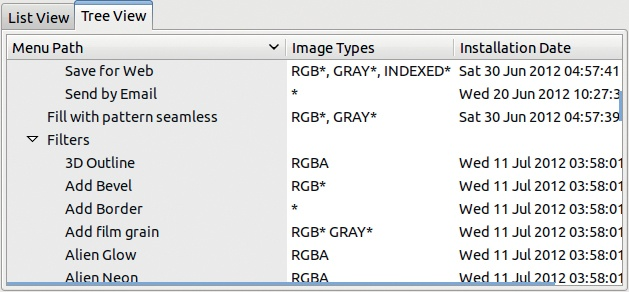

图 21-3. 插件浏览器，树状视图

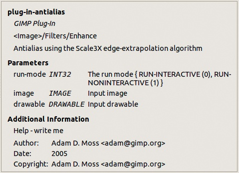

图 21-4. 插件浏览器，插件描述

对话框右侧描述了左侧所选插件的内容。例如，在图 21-4 中，你可以看到反锯齿工具的描述，该工具位于 **图像：滤镜 > 增强**。

## 查找新插件

现有 GIMP 插件的主要来源是 GIMP 插件注册表，网址是 *[`registry.gimp.org/`](http://registry.gimp.org/)*。在这里，你可以找到插件描述、插件本身或其主页的链接，以及有助于搜索的标签。点击标签即可查看所有匹配的插件。

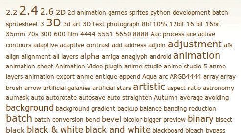

图 21-5。标签云的开始

一种便捷的浏览注册表的方式是*按标签查看内容视图*（也叫*标签云视图*），它显示了所有标签的列表，字体大小与标签的频率成正比，如图 21-5 所示。标签是可点击的，因此浏览与给定标签相关的所有插件非常容易。

大多数插件都有非常详细和完整的主页，解释了它们的工作原理以及如何安装。

# 21.2 值得注意的插件

以下章节介绍了一些在 GIMP 插件注册表中可用的有趣插件。这个选择显然是主观的，我们排除了一些已经讨论过的插件，如在第十八章中介绍的 GAP，以及在处理 RAW 照片中介绍的 UFRaw。

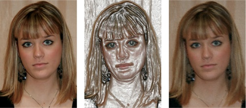

图 21-6。初始图像（左）；应用 Wrap Effect 工具后（中）；应用 ev_crayon_full 预设后

## Photo Effects

Photo Effects 是一组插件，你可以用它为照片添加艺术效果。你可以通过在*[`registry.gimp.org/`](http://registry.gimp.org/)* 搜索 `photo effects` 来找到它。安装后，你会在 **图像：滤镜 > 装饰** 菜单中看到名为 PHOTO EFFECTS 的菜单。我们以图 21-6（左）为例。当我们应用 **图像：滤镜 > 装饰 > Photo effects > 艺术家** 中找到的 Wrap Effect 工具时，我们得到了图 21-6（中）所示的结果。

Photo Effects 还提供了 22 个为 GIMPressionist 滤镜预设的预定义设置（见 GIMPressionist）。图 21-6（右）展示了应用 `ev_crayon_full` 预设的结果。

## G’MIC

G’MIC (*[`gmic.sourceforge.net/gimp.shtml`](http://gmic.sourceforge.net/gimp.shtml)*) 是一个庞大的滤镜（本书出版时为 229 个）和效果集合。它作为 **图像：滤镜** 菜单中的单一条目操作，打开如图 21-7 所示的对话框。

G'MIC 的预览会在你选择滤镜后立即更新。当你点击应用按钮时，滤镜会立即应用到图像上，使你能够按顺序使用多个滤镜进行转换。由于我们无法展示所有这些滤镜，这里选取了一个随机样本，并将使用默认设置展示它们。

图 21-8（左）显示了应用位于“颜色”子菜单中的局部归一化滤镜后的效果。图 21-8（中）显示了应用位于“艺术”子菜单中的黑白铅笔滤镜后的效果。图 21-8（右）显示了应用位于“增强”子菜单中的各向异性平滑滤镜后的同一张照片。

G'MIC 是一个复杂的插件，这些示例只是展示了其功能的一部分。

## Liquid Rescale

Liquid Rescale (*[`liquidrescale.wikidot.com/`](http://liquidrescale.wikidot.com/)*) 是一个强大的工具，可以在不改变物体形状的情况下拉伸或压缩图像。你可以在**图像：图层**菜单中找到这个工具。在图 21-9 中，预览窗口显示了一张 2000 × 1333 的照片。我们将通过水平拉伸它，使其变得更具全景效果。

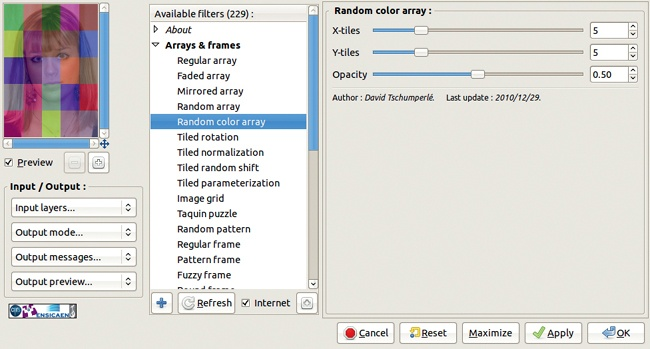

图 21-7. G'MIC 对话框

图 21-8. 应用局部归一化滤镜（左）、黑白铅笔滤镜（中）、各向异性平滑滤镜（右）

如果我们仅使用液体缩放将画布宽度更改为 3000 像素，那么结果（如图 21-10 所示）是不令人满意的，因为人物的头部变形。为了解决这个问题，勾选工具对话框右侧 FEATURE PRESERVATION MASK 部分中的 NEW 按钮，以激活 PRESERVE FEATURES 按钮。这样就会创建一个新图层，透明度为 50%，并临时将前景色更改为鲜艳的绿色。现在我们可以绘制人物，如图 21-11 所示，我们不需要特别精确。

绘制完主题后，将宽度恢复到 3000 像素，得到图 21-12 中所示的结果。诚然，船只看起来有点拉伸过度，但如果我们也绘制了船只，就可以保留其长宽比了。

你还可以使用液体缩放来丢弃图像中的某些特征。例如，假设在图 21-13 中，我们想丢弃孔雀两侧的花盆。为此，我们点击 FEATURE DISCARD MASK 工具对话框中的 NEW 按钮。DISCARD FEATURES 按钮会自动勾选，创建一个新图层，前景色变为鲜艳的红色。

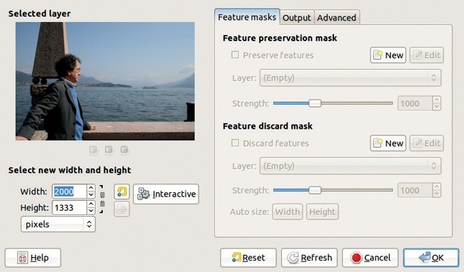

图 21-9. 液体缩放对话框

图 21-10. 重新调整大小而不进行保留的结果

接下来，我们绘制图 21-14 中显示的掩码，这比之前的操作更具挑战性，因为孔雀尾巴非常靠近左侧的花盆。然后，我们点击位于自动大小右侧的宽度按钮，将宽度设置为 1103 像素。最终结果，如图 21-15 所示，仍然需要一些修饰，但你应该能理解大致思路。

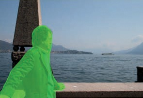

图 21-11. 定义保留掩码

图 21-12. 使用保留功能调整大小的结果

如其主页所述，液态重缩放工具提供了许多其他功能，包括交互模式、输出接缝图的能力（显示图像是如何调整大小的）等。例如，图 21-16 展示了将肖像缩小（80% 原始宽度）时的接缝图，图 21-17 展示了将其放大（120% 原始宽度）时的接缝图。在“输出”选项卡上，我们勾选了“在新图层中输出”、“输出接缝”以及“按原始尺寸缩放”。在这两种情况下，重缩放保持了眼睛和大部分嘴巴的完整，但改变了面部的其他部分，使其看起来不自然且不悦目。

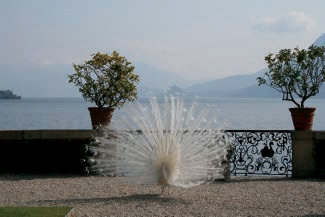

图 21-13。初始图像

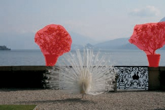

图 21-14。定义丢弃掩码

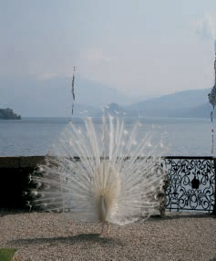

图 21-15。使用丢弃功能进行调整大小

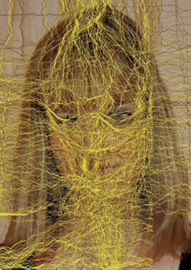

图 21-16。缩小肖像时的接缝图

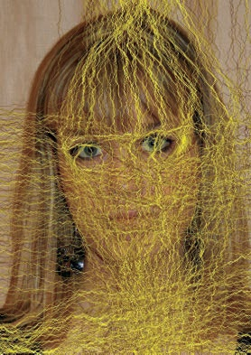

图 21-17。放大肖像时的接缝图

## Elsamuko 脚本集

Elsamuko 脚本集提供了多种方法来转换或改善图像。该脚本集可以在*[`sites.google.com/site/elsamuko/gimp/`](http://sites.google.com/site/elsamuko/gimp/)*找到，并且是 `gimp-plugin-registry` Debian 包的一部分（可以在 Debian 和 Ubuntu 上使用）。该站点还包含许多其他插件和脚本。

图 21-18。应用国家地理滤镜（左）、奥巴马希望滤镜（中）、Lomo 滤镜（右）后的效果

我们将仅展示三种 Elsamuko 脚本，使用之前相同的照片。这些脚本通常需要大量计算能力，且大多数会使用多个图层和图层蒙版来构建图像。

图 21-18（左）显示了应用**图像：滤镜 > 通用 > 国家地理**滤镜的效果，该滤镜旨在生成类似于著名杂志中的高质量肖像。

图 21-18（中）展示了应用**图像：滤镜 > 艺术 > 奥巴马希望**滤镜后的效果，该滤镜灵感来自著名的奥巴马“HOPE”海报。

图 21-18（右）展示了应用**图像：滤镜 > 光与影 > Lomo**滤镜后的效果，该滤镜设计用于模拟使用 Lomo 相机的效果，这是一款来自 1990 年代初期的便宜俄罗斯相机。

# 21.3 编写插件

使用预定义的插件非常方便，但你并不总是能找到完全符合需求的插件，而且如果你有一点编程经验，自己编写插件也许更有趣。在你编写了前三四个插件后，你会发现编写插件变得非常简单。在本节中，我们展示了用三种主要编程语言编写的插件：Scheme、Python 和 C。

## Scheme

用 Scheme 编写的脚本称为 Script-Fu。例如，**图像：颜色 > 映射 > 色彩图**的脚本。这个脚本包括了函数`script-fu-makecmap-array`，它返回一个包含指定调色板颜色的数组。这个函数可以在其他需要色板信息的脚本中使用。

该函数是用 Scheme 编写的，代码展示在图 21-19 中。Scheme 是通过一系列嵌套在括号中的表达式来编写的。简而言之，Scheme 函数的定义形式为`(define (name parameters) (expr) (expr) ...)`。这段代码定义了函数`name`，其值为最后一个表达式的值。一个表达式调用一个函数，函数的名称或符号出现在表达式的第一个元素中，后面跟着任何参数。一个参数本身也可以是调用函数的表达式。

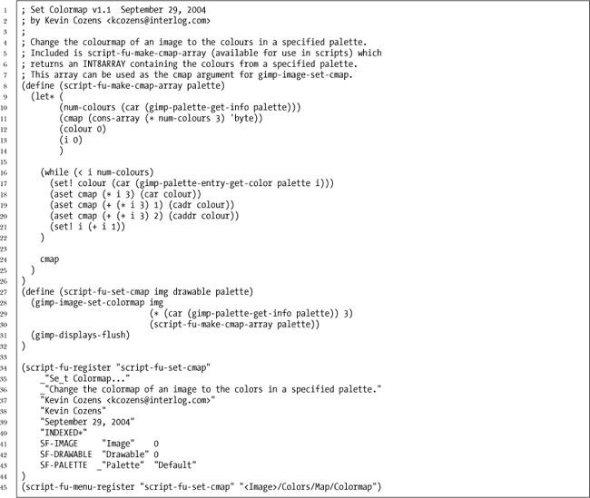

图 21-19. 一个 Script-Fu 示例：来自 Set Colormap 脚本的 cmap 数组函数

例如，在图 21-19 的第 29 行，函数 `*`（乘法）被调用，传入了两个参数。第一个参数是一个调用 `car` 函数的表达式，第二个参数是数字 `3`。调用函数 `*` 实际上是对上一行的 `gimp-image-set-colormap` 函数的第二个参数。第一个参数是第一个函数参数，第三个参数是 `script-fu-make-cmap-array` 函数的结果，第三个函数参数作为参数传递。

选择**图像：帮助 > 过程浏览器**以了解函数的参数及其作用。例如，在图 21-20 中，我们在搜索框中输入 `colormap`，然后从列表中选择一个函数。在对话框右侧，我们可以看到所选函数的参数类型和含义，以及详细的注释。

图 21-19 的第 9 至 14 行包含了函数 `script-fu-make-cmap-array` 的局部变量的声明和初始化。我们可以在函数体内使用这些变量。

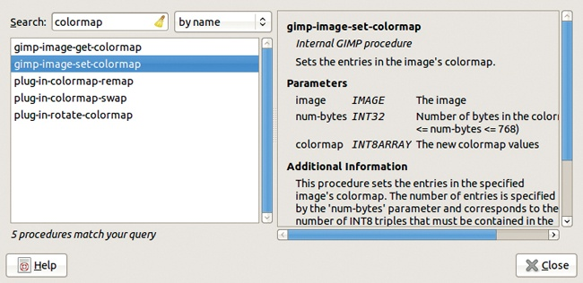

图 21-20. 过程浏览器对话框

任何 Script-Fu 中最重要的部分之一是脚本注册，如图 21-19 第 34 至 44 行所示。脚本注册为 GIMP 提供了它所需的所有信息，以将脚本集成到 GIMP 中。`script-fu-register` 的各种参数按以下顺序提供这些信息。

+   菜单中的条目，在字符前加下划线（`_`）表示作为缩写的字符

+   工具提示的内容

+   作者姓名

+   版权声明

+   版权日期

+   要处理的图像类型

+   类型、名称和初始值参数的描述

最后，调用 `script-fu-menu-register` 将 Script-Fu 放入 GIMP 菜单中。

测试 Script-Fu 非常简单，得益于**图像：滤镜 > Script-Fu > 控制台**，它会打开在图 21-21 中显示的对话框。你需要做的就是在底部字段中输入 Scheme 表达式并按下 。表达式会立即被评估，结果会显示在主对话框窗口中。

BROWSE 按钮会打开过程浏览器对话框。当你选择一个特定的过程并点击应用时，这个过程的调用会插入到 Script-Fu 控制台字段中，然后你只需要输入你的参数。

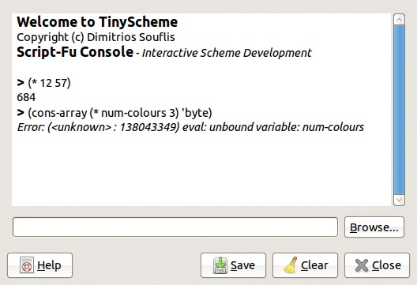

图 21-21。Script-Fu 控制台

你可以在网上找到许多 Script-Fu。有些在 GIMP 插件注册表中做了很好的广告，而其他则可以在独立网站和博客上找到。例如，查看 *[`gimpfx-foundry.sourceforge.net/`](http://gimpfx-foundry.sourceforge.net/)* 或 *[`gimpscripts.com/`](http://gimpscripts.com/)*。

## Python

就像为 Scheme 脚本创造的名称 *Script-Fu* 一样，*Python-Fu* 是 Python 插件的名称。图 21-22 显示了一个 Python 程序示例，**图像：滤镜 > 渲染 > 云彩 > 雾** 滤镜。在第 4 到第 6 行中，`gimpfu` 模块被导入，`time` 模块被导入，并且 `gettext` 函数用于国际化程序中的所有文本。

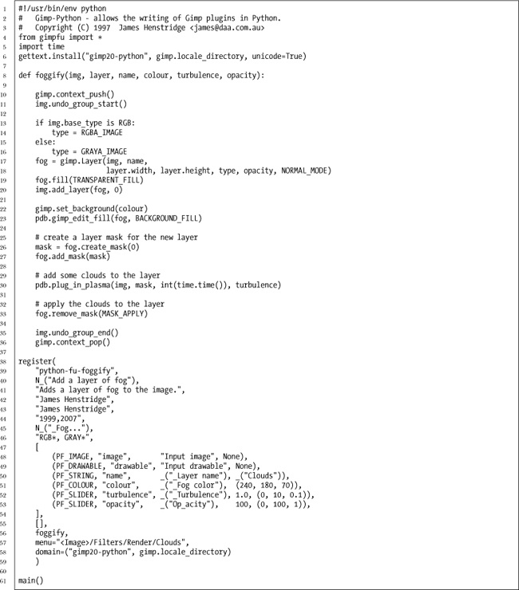

图 21-22。一个 Python-Fu 示例：雾渲染滤镜

渲染云彩插件的 Python-Fu 代码体（第 8 到 36 行）是一个很好的 Python 程序示例。语句在行末结束，除非它们在括号内，如第 17 行所示。嵌套通过缩进来表示，如第 13 到 17 行所示。某些 Python 语法受到 C 语言的启发，使用 `=` 进行赋值，使用 `==` 进行比较。一旦你理解了 GIMP 预定义函数的含义，这个特定函数的工作原理就很容易理解。

Python-Fu 在 GIMP 中的注册方式与 Script-Fu 相同（第 38 到 59 行），唯一的不同是 `register` 函数的参数，特别是在 Python-Fu 参数的描述上。

选择**图像：滤镜 > Python-Fu > 控制台**将打开一个类似于 Script-Fu 控制台的对话框。你可以使用此对话框直接输入 Python 语句并测试其效果。过程浏览器的使用方式类似，它允许你将输入的代码插入到正确的函数调用中。

## C

从本质上讲，C 程序比其等效的 Scheme 或 Python 程序要长，因为它是在低级语言中编写的。你可以在*[`developer.gimp.org/plug-ins.html`](http://developer.gimp.org/plug-ins.html)*上找到一个关于为 GIMP 构建 C 插件的很好的三部分教程。

最简短的 C 插件是 Semi-Flatten 插件，可以在 **图像：滤镜 > 网络** 菜单中找到。我们尽可能去除了多余的空行，但仍然不得不将其分为两部分（图 21-23 和 图 21-24）以展示完整的程序。文件的头部显示在第 1 到第 20 行，包含了三个可见函数的声明、一些静态变量和一个常量。

这个 C 插件包含四个函数定义。由于这些函数都没有返回结果，它们的类型始终是 `static void`。`query` 函数（第 23 到第 48 行）没有参数，并在第一次使用插件时被调用。它调用 `gimp_install_procedure` 来注册插件（类似于 Python 插件）。请注意，`semiflatten` 插件同时在 **图像：滤镜 > 网络** 和 **图像：图层 > 透明度** 菜单中安装。

`semiflatten_func` 函数（第 50 到第 60 行）是一个简单的辅助函数，通过 `semiflatten`（第 61 到第 69 行）间接调用，`semiflatten` 本身也是一个辅助函数。`run` 函数（第 71 到第 111 行）在我们调用插件时被调用，进行实际的更改。请注意，Semi-Flatten 插件不会打开对话框。

插件定义中最关键的点是 `GimpPlugInInfo PLUG_IN_INFO` 结构体，它在头部进行了声明。该定义声明了 `query` 和 `run` 函数。第 21 行显示的对 `MAIN()` 的调用是一个 C 宏，它初始化参数并调用 `PLUG_IN_INFO`。所有 C 插件都需要这些类型的定义。

尽管具有良好 GIMP 知识的普通程序员应该能够编写一个简单的 Script-Fu 或 Python-Fu 插件，并使用过程浏览器在 GIMP 的过程数据库中进行搜索，但很可能只有一个经验丰富的 C 程序员才能构建一个即使是简单的 C 插件。

此外，安装 C 插件并非简单任务，需要一个 C 编译环境。必须在计算机上安装 `libgimp` 头文件，以提供所需的所有声明，并且还需要一个名为 `gimptool` 的工具来编译和安装插件（有关更多信息，请参见 *[`developer.gimp.org/plug-ins.html`](http://developer.gimp.org/plug-ins.html)*）。

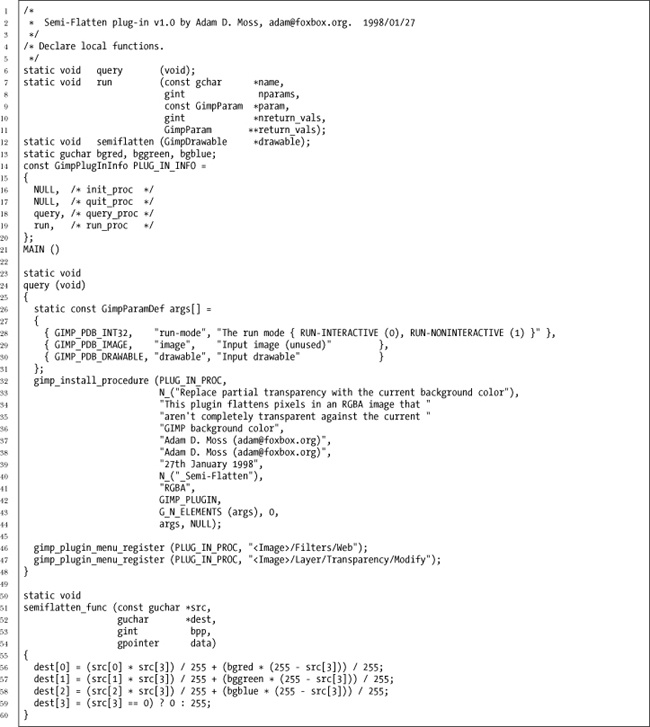

图 21-23. 一个 C 插件示例：Semi-Flatten（第一部分）

图 21-24. 一个 C 插件示例：Semi-Flatten（第二部分）
