# 第二十二章。定制 GIMP

根据自由软件的传统，GIMP 是高度可配置的，许多特性都可以更改。虽然 GIMP 只有一个特定的首选项对话框，但你会发现其他更改参数的工具分散在各个地方。在本章中，我们将向你展示如何定制 GIMP 以使其更好地为你服务。

# 22.1 首选项对话框

通过 **图像：编辑** 菜单打开首选项对话框。它是一个大而复杂的对话框，如图 22-1（左）所示。对话框左侧的菜单显示了首选项选项卡的列表；我们将依次考虑每一个。每当你在 GIMP 中更改参数时，你的工作会保存到一个名为 `gimprc` 的文件，并存储在你的机器上，通常是在主 GIMP 目录中。这些更改通常会立即生效，除非程序另有说明。

## 环境

首选项对话框的第一个选项卡涉及环境设置。你可以设置以下参数，如图 22-1（左）所示。

+   RESOURCE CONSUMPTION 决定 GIMP 如何使用系统资源。

    +   MINIMAL NUMBER OF UNDO LEVELS 设置每个图像的撤销历史记录级别数。由于撤销需要一定的内存，你将受到 GIMP 能够保持的历史记录数量的限制，但此参数确保始终有至少设定数量的撤销级别可用。

    +   MAXIMUM UNDO MEMORY 告诉 GIMP，当撤销内存超出此值时删除最旧的保存。如果你的机器有很多内存，可以增加默认值。

    +   TILE CACHE SIZE 可以影响 GIMP 和你电脑的性能。如果你打算认真使用 GIMP 并处理大图像，建议将此参数设置为大约安装内存的一半。尝试不同的值。值设置得太小会导致 GIMP 经常换入磁盘，从而减慢速度。另一方面，值设置得太大可能会阻止其他应用程序启动，或者可能导致进程失败。

    +   MAXIMUM NEW IMAGE SIZE 设置新图像的最大允许尺寸。如果新图像大于此最大值，GIMP 会要求确认，但不会阻止其创建。

    +   NUMBER OF PROCESSORS TO USE 会自动设置为你的机器上的核心数，因多核处理器的普及。如果需要将额外的处理器用于其他应用程序，请减少此值。

    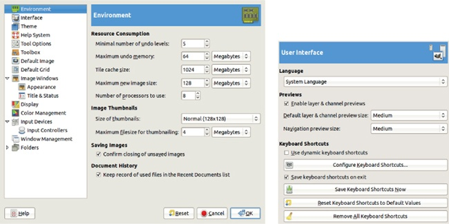

    图 22-1。首选项对话框，环境选项卡（左）和用户界面选项卡（右）

+   在“打开图片”、“保存图片”和“导出图片”对话框中会显示**图片缩略图**。你可以选择两种尺寸或不显示缩略图。如果文件大小超过最大限制，GIMP 不会自动生成缩略图，但你可以点击文件名来生成缩略图。

+   保存图片选项应该保持勾选，否则在你尝试关闭未保存的图片时不会收到警告。

+   文档历史记录会在文档历史记录对话框中保留所有打开文件的记录（通常是个好主意）。你可以通过**图像：文件 > 打开最近文件**子菜单或通过**图像：窗口 > 可停靠对话框 > 文档历史记录**来访问文档历史记录对话框。

## 用户界面

图 22-1（右）显示了处理系统语言、在图层和通道对话框中显示的小型缩略图以及键盘快捷键的用户界面设置。

+   语言选项允许你设置语言。像大多数自由软件一样，GIMP 是完全国际化的。默认情况下使用主机操作系统的基本语言，但你可以选择 71 种不同的语言，尽管其中一些翻译不完整。更改将在 GIMP 重新启动后生效。

+   预览是图层或通道的缩略图，默认情况下是启用的。你可以从九种预定义尺寸中选择，范围从 TINY 到 GIGANTIC。前者仅在非常小的屏幕上有用，后者则只有在视力严重问题时才会用到。

+   键盘快捷键可以帮助你更高效地使用 GIMP。GIMP 有一套相对较小的预定义键盘快捷键，在本书中有提到，但你可以根据需要添加更多或修改它们。这个对话框允许你通过多个复选框和按钮来更改、添加或删除键盘快捷键：

    +   动态键盘快捷键选项默认未勾选，因为它有些危险。当勾选时，你可以通过在菜单项高亮时按下一个键组合来定义一个新的键盘命令。这个功能对于定义新命令非常方便，但也使得意外重新定义现有快捷键变得太容易了。

    +   配置键盘快捷键的详细说明请参考键盘快捷键。

    +   立即保存键盘快捷键选项仅在未指定自动保存时有用。

    +   将键盘快捷键重置为默认值选项对于想要将 GIMP 恢复为默认设置的人非常有用。

    +   移除所有键盘快捷键选项适用于那些不想要任何快捷键的人。

## 主题

如图 22-2 所示，主题选项卡很简单。你可以选择两种主题：默认和小型（如图 22-3 所示）。其他主题可以在像* [`art.gnome.org/`](http://art.gnome.org/)* 这样的网站上找到。

## 帮助系统

GIMP 有许多帮助功能，如在 9.6 GIMP 帮助系统中所讨论的那样。对话框中显示的内容（见图 22-4）允许您设置控制在使用 GIMP 时所接收帮助类型的某些参数：

+   显示工具提示通常是勾选的。

+   显示帮助按钮通常也是勾选的，勾选时，帮助按钮会被添加到大多数对话框中。点击此按钮后，它会将您带到帮助文档。

    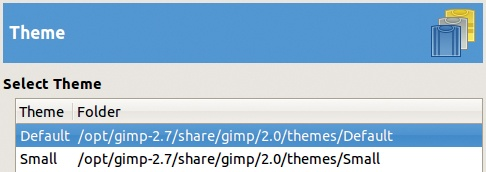

    图 22-2。首选项对话框，主题选项卡

    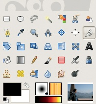

    图 22-3。使用小主题

    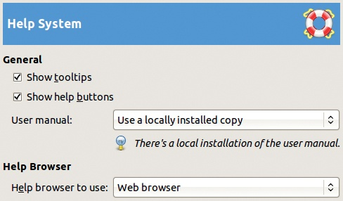

    图 22-4。首选项对话框，帮助系统选项卡

+   用户手册让您选择使用本地安装的手册或在线用户手册。

+   帮助浏览器让您使用默认浏览器或 GIMP 帮助浏览器。GIMP 帮助浏览器速度更快，并且在多桌面环境中始终在当前桌面打开。

## 工具选项

工具选项选项卡如图 22-5 所示。第一个复选框和前两个按钮允许您保存或恢复工具选项设置。其他选项如下所述。

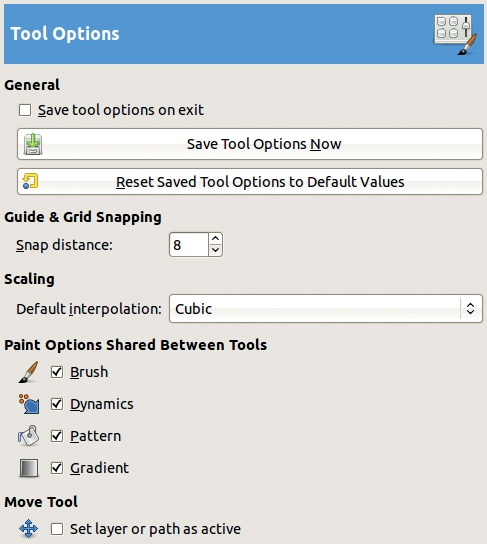

图 22-5。首选项对话框，工具选项选项卡

+   指南和网格吸附设置指针与图像窗口中最接近的指南或网格之间的最小吸附距离。此参数设置距离，但吸附本身由**图像：视图**菜单中的相应参数决定（参见填充颜色和吸附）。

+   缩放允许您从各种插值算法中进行选择，从 NONE 到 SINC（LANCZOS3）。您在此处做出的选择将成为所有使用缩放的工具的默认值，尽管您仍然可以在每个工具的选项对话框中更改特定的缩放方法。

+   画笔选项在工具之间共享有四个复选框，允许您指定某些选项由绘图工具（如铅笔、画笔、橡皮擦、喷枪等）共享。默认情况下，所有复选框都已选中。因此，改变画笔时，例如改变画笔工具使用的画笔，也会改变模糊工具或克隆工具使用的画笔。但如果取消勾选画笔选项，那么每个工具会记住它自己的画笔设置。

+   移动工具设置活动图层或路径。如果勾选此项，使用移动工具移动图层或路径时，会使其成为活动图层。

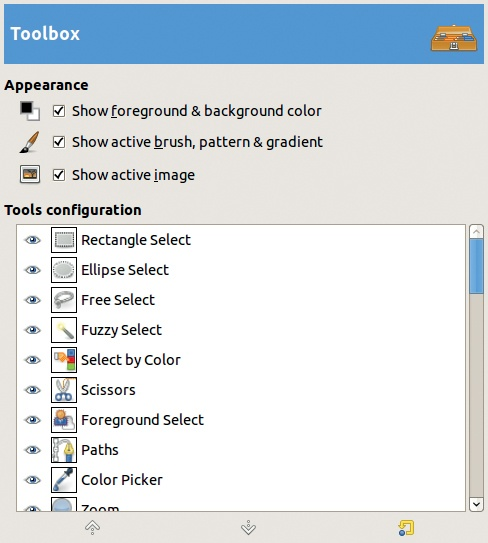

图 22-6. 偏好设置对话框，工具箱选项卡

## 工具箱

在图 22-6 中显示的选项卡，您可以选择在工具箱底部显示三种不同的对象：

+   前景色和背景色，以及用于切换或重置它们的小按钮

+   当前活动的画笔、图案和渐变

+   当前活动的图像

TOOLS CONFIGURATION 列表允许您选择在工具箱中显示哪些工具图标。前 32 个图标默认显示，但您可以通过点击可见性眼睛图标添加最多 10 个工具图标或删除现有的工具。当选择某个工具时，您可以使用对话框底部的箭头来更改其在工具箱中的位置。

## 默认新图像

在图 22-7 中显示的默认新图像选项卡指定了当您选择**图像：文件 > 新建**或时创建的图像的默认特性。该对话框与图 9-32 几乎相同，并在 9.4 创建、加载、保存和导出文件中详细描述。但它还包含一个用于更改默认快速遮罩颜色的按钮。

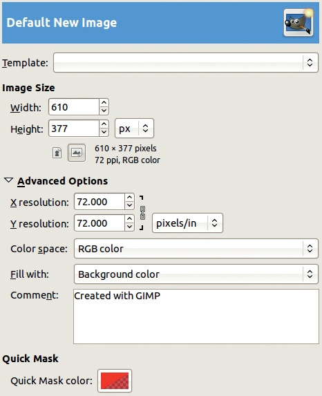

图 22-7. 偏好设置对话框，默认新图像选项卡

## 默认图像网格

在图 22-8 中显示的选项卡是您定制当选择**图像：视图 > 显示网格**时显示的网格初始特征的位置。该选项卡与**图像：图像 > 配置图像网格**相同。有关更多信息，请参见 10.3 网格。

## 图像窗口

您在三个选项卡中设置图像窗口参数。在第一个选项卡中，显示在图 22-9 中的选项卡，您可以指定以下内容：

+   默认使用“点对点”：此框通常是选中的，如果缩放因子为 100％，则显示的图像像素与屏幕像素大小相同。未选中时，显示图像的大小由其内部分辨率决定。（有关更多详细信息，请参见 10.1 尺寸标尺和单位。）

+   MARCHING ANTS 速度：设置虚线围绕选择区域移动的时间，单位为毫秒。

+   缩放时调整窗口大小：勾选此选项时，当缩放因子发生变化时，GIMP 会尝试调整图像窗口的大小。选择此选项基本上与勾选图像窗口右上角的调整大小按钮相反，后者允许你通过放大窗口来放大图像，或者通过缩小窗口来缩小图像。

    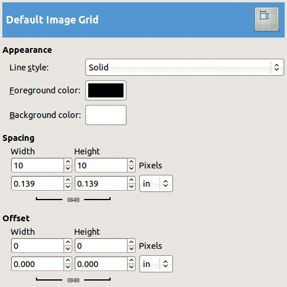

    图 22-8. 偏好设置对话框，默认图像网格标签

    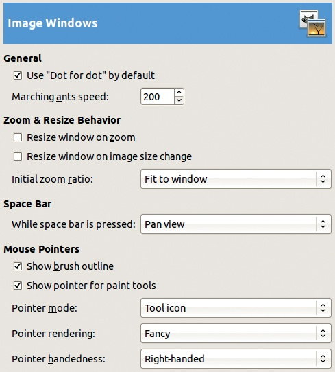

    图 22-9. 偏好设置对话框，图像窗口标签

+   图像大小变化时调整窗口大小：勾选此选项时，当你裁剪或调整图像大小时（**图像：图像 > 调整图像大小**），图像窗口会随着图像大小的变化而调整大小。

+   初始缩放比例：你有两个选择：适应窗口或 1:1。如果你打算打开比屏幕尺寸大的图像，那么第二个选择可能不适合此缩放因子。

+   按住空格键时：此列表中的一个选项特别有用：“平移视图”允许你通过移动指针在图像窗口内移动图像。或者，你可以将其设置为不执行任何操作，或暂时切换到移动工具。

+   显示画笔轮廓：默认勾选，但如果你使用的是非常大的画笔，或者你的计算机较慢，可以考虑取消勾选此选项。

+   显示画笔工具指针：勾选此选项（默认设置）时，使用中的画笔工具的小图标会伴随鼠标指针一起显示。当此框和前一个框都未勾选时，鼠标不会跟随指针或轮廓移动，这意味着你在绘画时看不见自己绘制的位置。

+   指针模式：此选项提供三种显示指针的方式：如果前面的框被勾选，则以带尖箭头的工具图标显示指针；如果不勾选，则以十字准线指针代替箭头；或者只显示十字准线。

+   指针渲染：此选项指定是否以黑白或灰度图像（精美模式）显示指针。如果没有遇到严重的性能问题，请选择精美模式。

图 22-10 中显示的标签指定了最初显示在图像窗口中的部分内容，并包括**图像：视图**菜单中出现的各个复选框的初始状态。你可以为图像窗口的常规模式和全屏模式指定不同的组件（**图像：视图 > 全屏** 或 ）。

你还可以设置画布填充的颜色，画布窗口中不属于画布部分的区域。如果图像在至少一个维度上小于窗口，则会显示部分填充区域。可以从以下选项中选择：

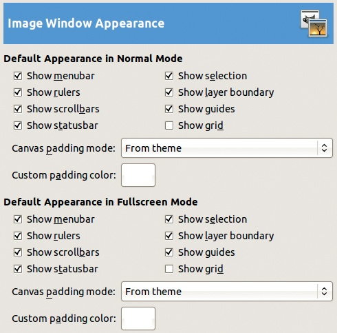

图 22-10. 首选项对话框，图像窗口外观选项卡

+   来自主题：假设您已加载了其他主题，一组主题可以定义自定义颜色。

+   亮度检查颜色：此选项指的是代表透明度的棋盘格图案中的浅色。此图案在下一节中讨论的显示选项卡中指定。

+   暗度检查颜色：设置透明度的棋盘格图案中的较暗颜色。

+   自定义颜色：使用颜色选择器选择自定义颜色。

在图 22-11 中显示的选项卡允许您指定出现在图像窗口标题栏和状态栏中的文本。（请注意，标题栏由操作系统的窗口管理器控制，因此可能不会完全按照 GIMP 指定的方式显示。）预定义的格式适用于标题栏和状态栏。您还可以通过编辑包含程序员熟悉的格式字符串的适当字段来定义新格式。

格式字符串包含普通字符和以`%`符号开头的变量。GIMP 提供了超过 20 个变量；这里只描述最重要的几个：

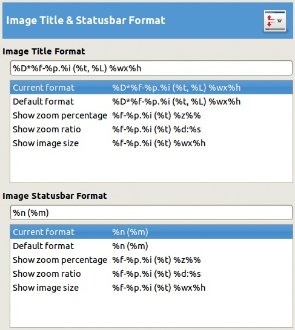

图 22-11. 首选项对话框，图像标题和状态栏格式选项卡

+   `D*`：自上次更改以来未保存的图像（显示星号）

+   `f`：图像文件名

+   `p`：唯一的图像标识号

+   `i`：视图编号（如果图像被查看多次，则很有用）

+   `t`：图像类型

+   `L`：图层数量

+   `w`：图像宽度（以像素为单位）

+   `h`：图像高度（以像素为单位）

+   `m`：图像使用的内存量

+   `n`：当前图层的名称

这些字符串选项让您选择在标题栏或状态栏中显示什么内容。根据您自己的偏好和需求，您可以选择显示或隐藏有关图像的不同类型信息。

## 显示

在图 22-12 中显示的选项卡允许您指定透明度的表示。正如您在此图中所看到的，您可以从六种不同的表示中选择。前三种使用棋盘格图案，而另外三种使用连续的颜色。如果使用棋盘格图案，您可以选择三种方块大小中的一种。

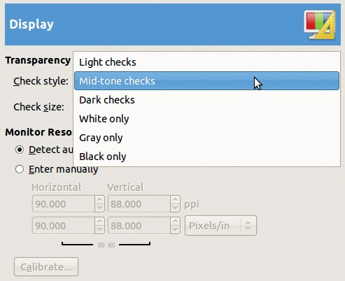

图 22-12. 首选项对话框，显示选项卡

此选项卡还允许您手动指定显示器的分辨率。显示器分辨率会自动检测，但如果需要手动输入，请选中相应的单选按钮以定义显示器的横向和纵向分辨率，并在不同的度量单位之间选择。如果您不知道与屏幕对应的确切值，请点击 CALIBRATE 按钮打开一个窗口，窗口中会显示以您选择的单位为标准的测量值。仔细测量屏幕上显示的垂直和水平标尺，并将您的测量值输入窗口中的相应字段。然后，GIMP 会计算出实际的分辨率。

## 色彩管理

色彩管理在 12.3 色彩管理中有描述。图 22-13 中的选项卡展示了您可以设置的各种参数。

+   操作模式：从三种模式中选择：

    +   无色彩管理：跳过 GIMP 的色彩管理功能，这通常不是一个好主意。

        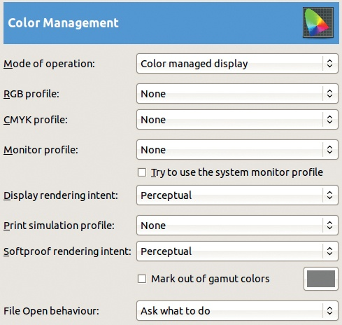

        图 22-13. 首选项对话框，色彩管理选项卡

    +   色彩管理显示：使用显示器的色彩配置文件尽可能准确地显示颜色。

    +   打印仿真：选中此选项后，GIMP 会使用您提供的打印机配置文件，以便预览使用该配置文件后得到的颜色效果。请注意，此选项与实际打印无关，如 19.4 打印中所讨论的。

    接下来的三个选项需要一个 ICC 配置文件：一个文件名以`.icc`结尾。此类文件的位置取决于您的操作系统。在 GNU/Linux 中，请查看*/usr/share/color/icc/*；在 Mac OS X 中，请查看*/Library/ColorSync/Profiles/*；在 Windows 中，请查看*\Windows\system32\spool\drivers\color*。您还可以在类似欧洲色彩倡议组织（* [`www.eci.org/`](http://www.eci.org/) *）等网站上找到配置文件。

+   RGB 配置文件定义了 GIMP 的内部色彩空间。除非您有非常具体的要求，否则建议使用 Adobe RGB 色彩空间，它的色域比显示器或四色打印机的色域要大，但也不至于过大。许多人倾向于使用 sRGB 色彩空间，因为它更接近打印机的色彩空间。

+   GIMP 不使用 CMYK 配置文件，因为它不内部处理 CMYK。这一情况可能会在未来的版本中发生变化。

+   显示器配置文件可能使用 sRGB 色彩空间。如果勾选下面的框，GIMP 将使用操作系统提供的色彩配置文件，并在其自己的色彩管理中使用该配置文件。

+   **显示渲染意图**选项允许你在四种方式中选择一种，将一种色彩空间转换为另一种。不同的转换方法在最初的色彩空间中呈现颜色的方式不同，但在最终的色彩空间中没有差异。默认的**感知意图**使用一种几乎可以逆向的插值系统（不会丢失重要信息），且不会裁剪最饱和的颜色。它非常适合用于处理照片。**饱和度意图**将饱和的输入颜色转换为饱和的输出颜色，适用于着色或类似工作。你可以放心忽略另外两个意图：**相对色度学**和**绝对色度学**。（参见使用色彩管理。）

+   **打印模拟配置文件**用于打印预览，如果你选择了打印模拟模式。使用一个常见的 CMYK 配置文件，如 `Fogra27L CMYK Coated Press` 或你打印机的特定配置文件。

+   **软校正渲染意图**用于打印预览。选择项与**显示渲染意图**相同，但你也可以勾选**标记超出色域的颜色**，然后在右侧的小框中选择超出色域的颜色以进行替代显示。

+   FILE OPEN BEHAVIOUR 选项指定了 GIMP 在加载具有嵌入色彩配置文件且与内部 sRGB 空间不同的图像时的处理方式。GIMP 可以**保留嵌入的配置文件**，从而不进行图像转换，图像将通过该配置文件正确显示。**转换到 RGB 工作空间**使用嵌入的配置文件，但之后会丢弃该配置文件。**询问该如何做**可能是最安全的选择。

## 输入设备

INPUT DEVICES 标签页上的选项，如图 22-14 所示，主要用于配置图形平板。该标签页只有三个按钮和一个复选框，除了第一个外，其它都不言自明。

点击**配置扩展输入设备**会打开图 1-41 中所示的对话框。左侧的菜单列出了所有已知的设备，但无法使用的设备会显示为灰色。

Wacom 平板被视为四种不同的设备：触控笔、橡皮擦、鼠标（称为光标）和触摸板（某些平板上的小型触摸板）。

选择设备后，你可以从三种模式中选择：**禁用**、**屏幕**和**窗口**。通常最佳选择是**屏幕**，它允许你在整个屏幕上使用触控笔或平板鼠标。选择**禁用**会让设备仅作为普通鼠标使用，没有压力或倾斜感应。你可以放心忽略**键**和大多数**轴**，只有**压力**可能在调节未能正常响应的平板时有所帮助。它提供类似绘画动态的响应曲线。

**附加输入控制器**标签，如图 22-15 所示，是偏好设置对话框中“输入设备”标签的一部分。它在左侧显示可用的控制器，在右侧显示活动的控制器。点击其中一个列表中的项目，可以通过箭头按钮将其移动到另一个列表。

当你在右列选择一个项目后，可以通过双击或点击右列底部的小图标来编辑它的参数。图 22-16 显示了当你选择“主鼠标滚轮”时出现的对话框的一部分。将控制器从可用列表移动到活动列表时，也会弹出类似的对话框。

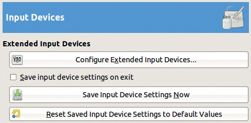

图 22-14. 偏好设置对话框，输入设备标签

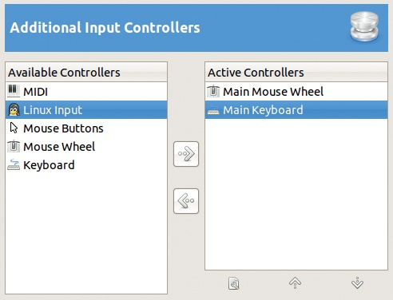

图 22-15. 偏好设置对话框，附加输入控制器标签

在图 22-16 所示的对话框中，你可以指定使用鼠标滚轮时触发的操作。几个预定义的操作涉及选择画笔、图案、渐变、字体以及当前绘画工具的透明度。要添加一个新操作，选择事件后，点击底部的**编辑**按钮，打开一个类似于图 22-17 的对话框。

图 22-18 显示了当活动控制器是主键盘时出现的对话框。请注意，几个预定义事件是可用的，但默认情况下没有使用，你还可以根据自己的习惯重新定义这些快捷键。

## 窗口管理

**窗口管理**标签，如图 22-19 所示，控制当你不处于单窗口模式时，GIMP 如何管理屏幕上众多的窗口。

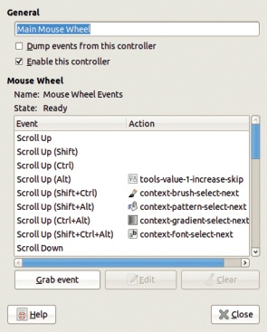

图 22-16. 配置主鼠标滚轮

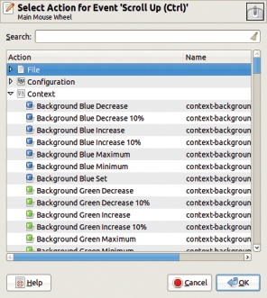

图 22-17. 选择事件的操作

**窗口管理器提示**告诉窗口管理器如何处理工具箱和其他停靠窗口。你可以从三种选项中进行选择：

+   UTILITY WINDOW 是默认选项。当选择此选项时，一旦你激活任何 GIMP 窗口，工具箱和浮动窗口会被提升到所有其他窗口之上，并保持在顶部，直到你将另一个窗口提升到它们之上。

+   NORMAL WINDOW 使得工具箱和浮动窗口像普通窗口一样操作。

    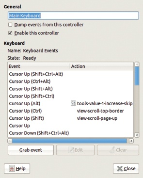

    图 22-18. 配置主键盘

    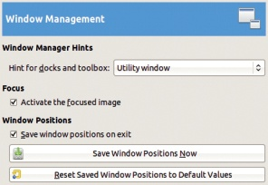

    图 22-19. 偏好设置对话框，窗口管理选项卡

+   KEEP ABOVE 使得工具箱和浮动窗口始终保持在任何其他窗口之上。

你的行为选择是个人口味的问题，但请注意，某些窗口管理器（例如 Windows 操作系统）可能无法正确处理这些选项，因此你的实际结果可能会有所不同。在这种情况下，键可能会有所帮助。你在这里所做的更改只有在重启 GIMP 后才会生效。

ACTIVATE THE FOCUSED IMAGE 按钮，如果未勾选，会将窗口是否*聚焦*（就窗口管理器而言是活动的）与 GIMP 中窗口是否活跃的状态分开。当你设置窗口管理器使得指针下的窗口自动获得焦点时，这个选项可以很有帮助，但你仍然希望确定哪个图像窗口是活动的。

WINDOW POSITIONS 下的复选框和两个按钮应该是显而易见的。你可以保存你定义的屏幕布局，或者将其重置为默认设置。

## 文件夹

FOLDERS 选项卡，如图 22-20 所示，列出了一个可能的文件夹列表，如图 22-21 所示。GIMP 在文件夹中找到它所需的信息和数据，其中一些是系统范围的，而另一些属于用户。在文件夹选项卡中，你可以指定 TEMPORARY FOLDER 的位置，该文件夹用于存储将在 GIMP 关闭时自动删除的文件。通常这个文件夹属于用户，但你可以将其更改为系统范围的临时文件夹，该文件夹将在每次操作系统启动时被清理。

SWAP FOLDER 用于临时存储无法装入内存的内部数据。默认文件夹位于你的个人空间，但考虑选择另一个磁盘上的文件夹来提高性能。

其他文件夹选项卡至少提到两个文件夹：一个是个人文件夹，另一个是系统范围的文件夹。你可以写入你的个人文件夹，即添加新对象或删除或编辑现有对象。通常，你无法写入系统范围的文件夹，但如果你打算安装新的画笔、绘画动态、图案、调色板或渐变，使得相应的系统范围文件夹可写（对于其他类型的对象，这是不可能的）可能会很有用。

当你点击某个文件夹名称时，顶部行的按钮会变得可用，如图 22-22 所示。在这里，你可以将文件夹上下移动，这将改变该文件夹的搜索顺序。你还可以从列表中移除文件夹、添加新文件夹或更改现有文件夹的名称。文件夹名称左侧的圆形按钮如果该文件夹已存在则为绿色；否则为红色。

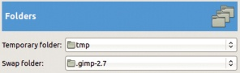

图 22-20. 首选项对话框，文件夹选项卡

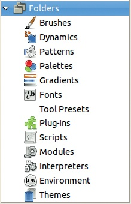

图 22-21. 可能的文件夹

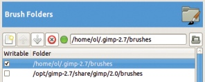

图 22-22. 画笔文件夹

# 22.2 编辑菜单中的其他首选项

你可以从 **图片：编辑** 菜单访问更多首选项对话框。**图片：编辑 > 输入设备** 打开与输入设备章节中相同的对话框。我们在这里讨论其他对话框。

## 键盘快捷键

我们在用户界面章节中讨论了键盘快捷键首选项。在这里，我们讨论如何定义、编辑和删除快捷键。

**图片：编辑 > 键盘快捷键** 打开如图 22-23 所示的对话框，内容与从首选项对话框访问的内容相同。在这里，你可以定义任意数量的快捷键，只要你有足够的想象力去发明它们！

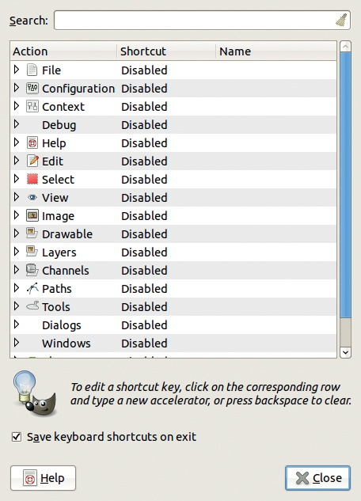

图 22-23. 配置键盘快捷键对话框

操作列表被划分为子菜单。图 22-24 展示了编辑操作，包括现有的快捷键和操作的内部名称，这对编写脚本很有用（参见 21.3 编写插件）。

要定义新的快捷键，选择相应的操作，点击快捷键字段，然后输入快捷键。如果该快捷键已经分配给另一个操作，将会弹出一个对话框，允许你重新分配快捷键或取消定义。

你也可以在此处删除现有的快捷键。如果对话框底部的复选框已勾选，所有新的命令将被保存在`gimprc`文件中，并在以后会话中可用。

由于现有命令数量庞大，搜索框允许你根据命令的名称部分内容来查找特定命令。紧接着 CONTEXT 条目的是一长串操作，允许你通过键盘控制工具的参数，如图 22-17 所示。你可以浏览图 22-23 中显示的各种操作列表，它们能让你一窥 GIMP 的内部工作。

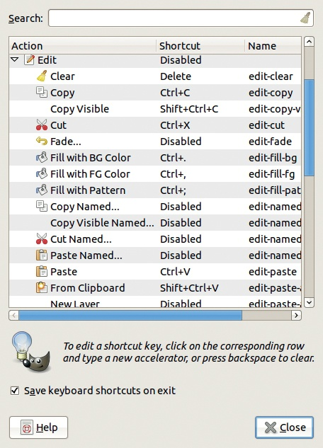

图 22-24. 配置编辑操作

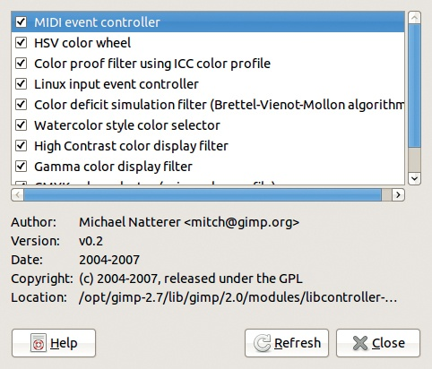

图 22-25. 模块管理器

## 模块

**图像：编辑 > 模块**打开如图 22-25 所示的对话框，该对话框列出了各种扩展模块。使用此对话框来控制是否加载某个模块。你所做的任何更改仅在重新启动 GIMP 后生效。

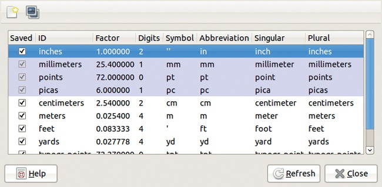

图 22-26. 单位编辑器

当你在对话框中选择一个模块时，你应该能看到关于它的一些信息。许多模块涉及色彩配置文件和颜色选择，而其他一些模块则与事件控制器相关。如果一个模块没有加载，它的功能就不会包含在 GIMP 中。

## 单位

**图像：编辑 > 单位**打开如图 22-26 所示的对话框。此单位编辑器显示有关 GIMP 中定义和使用的各种单位的信息，并允许你创建新的单位。你可以创建一个全新的单位，也可以复制并编辑现有单位。在图 22-27 中，我们添加了一个海法单位。单位编辑器中最重要的字段是 FACTOR，它表示你选择的单位中有多少个组成一英寸。DIGITS 字段指定输入字段必须具有多少个小数位，以提供与 1/100 英寸大致相同的精度。

返回到单位编辑器中，当勾选 SAVED 复选框时，表示该单位将在 GIMP 终止时保存。前四个单位被高亮显示，表明它们始终会被保存。

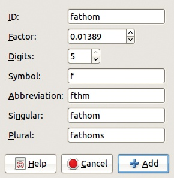

图 22-27. 添加新单位

# 22.3 自定义图像视图

图 22-28 显示了完整的**图像：查看**菜单，允许你控制图像视图。我们这里只介绍第十章中未涉及的条目。

## 显示过滤器

**图像：视图 > 显示滤镜** 打开如图 22-29 所示的对话框。在这里，你可以选择在显示图像时应用哪些滤镜。可用的滤镜显示在左侧，活动滤镜显示在右侧。如果你在左列中选择一个滤镜，可以通过相应的箭头将其复制到右列。

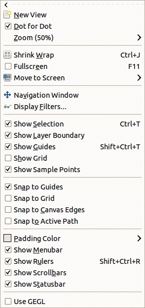

图 22-28. 图像：视图菜单

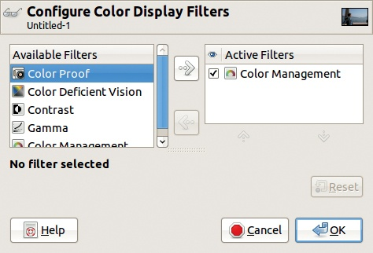

图 22-29. 配置色彩显示滤镜对话框

取消选中活动滤镜旁边的复选框，可以停用滤镜而不删除它。最初，只有 COLOR MANAGEMENT 滤镜是激活的，假设你在首选项对话框中激活了它。请记住，这些滤镜仅影响图像的显示方式；它们不会改变图像本身。

在图 22-30 中，我们选择了左列中的 COLOR DEFICIENT VISION 滤镜，并将其复制到右列并选中。此时会出现一个新字段，允许我们选择缺陷视力的类型：原色盲、绿色盲或蓝色盲（如色盲中所述）。图 22-31 展示了应用红绿色盲滤镜后的结果。目标是让我们看到该类型色盲患者眼中的图像。当设计网站时，你可能会发现这个工具特别有用。

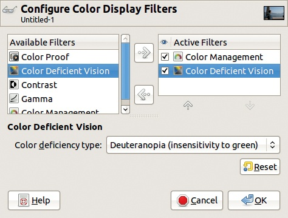

图 22-30. 配置色盲滤镜

图 22-31. 应用红绿色盲滤镜

CONTRAST 滤镜展示了图像在白内障或视网膜疾病患者眼中呈现的样子。它让你能够调整图像，使其能被正确地看到。如图 22-32 所示，默认的对比度循环次数为 1.0，这个值过高，会产生无用的伪影。将值设置为 0.3 可以得到一个可用的结果。

GAMMA 滤镜允许你对所有显示图像应用系统的伽马校正。当需要补偿损坏屏幕的失真时，这个工具非常有用。该滤镜展示了在这些条件下的图像效果。

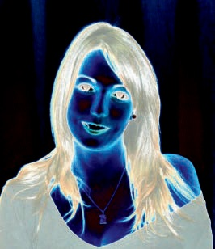

图 22-32. 应用对比度滤镜

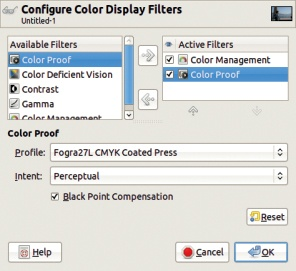

图 22-33. 配置色彩校对滤镜

COLOR PROOF 滤镜，其配置对话框显示在图 22-33 中，控制打印机预览。打印机预览显示图像，以模拟其打印时的外观。你应该只在准备打印图像时使用色彩校对，因为打印机会对图像应用一个色彩滤镜，这个滤镜的形式是 ICC 配置文件。在这里，你可以选择在打印图像时使用的配置文件和意图。图 22-34 展示了使用图 22-33 中显示的参数值后的结果。如果选中 BLACK POINT COMPENSATION 按钮，它会改善深色，特别是黑色的表现。（更多信息，参见色彩管理。）

图 22-34. 应用色彩校对滤镜

## 隐藏或显示图像窗口的部分内容

**图像：视图**菜单的其余部分包含了许多复选框。我们将在此和下一节中进行回顾：

+   SHOW SELECTION () 切换显示当前选择区域轮廓的“行进蚂蚁”效果。记住，这个轮廓位于选择区域的模糊中间；隐藏它可能会导致一些意外，当你发现自己在图像中涂画时没有意识到你正在涂画超出当前选择区域。

+   SHOW LAYER BOUNDARY 在当前图层的边界与画布的边界不同的时候非常有用。虚线以黄色和黑色显示。

+   SHOW GUIDES () 很方便用来临时隐藏你想保留的参考线。虚线为蓝色和黑色。

+   SHOW GRID 显示或隐藏网格。

+   SHOW SAMPLE POINTS 控制可停靠的示例点对话框，该对话框通过**图像：窗口 > 可停靠对话框**子菜单创建。要创建一个示例点，点击任意一个刻度尺，并将指针拖到你想要采样的像素位置。你可以创建任意数量的示例点，但只有前四个在对话框中描述，并与点本身一起显示在图 22-35 中。如你所见，你可以通过拖动来移动一个点，也可以通过拖动它回到刻度尺来删除它。注意，只有在选择了颜色选择工具时，才可以移动这些示例点 (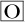)。

    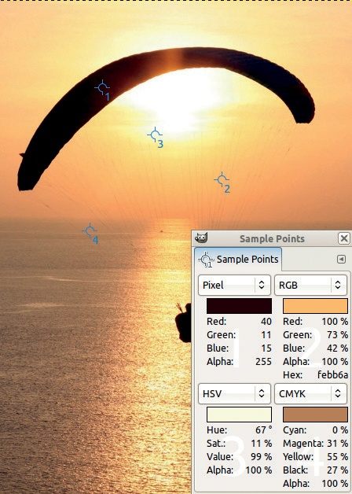

    图 22-35. 示例点

    当结合使用“层次”工具或“曲线”工具时，这个功能尤其有用。如果你试图修正图像中的色彩平衡，可以将采样点放在你知道颜色应该是什么的区域——比如绿色的树叶或蓝色的天空。然后，在使用上述工具调整所有颜色时，你可以同时比较采样点中的值，确保关键物体的颜色仍然准确。

+   **图像：视图**菜单中的最后四个复选框让你切换图像窗口部分的可见性，包括菜单栏、标尺、滚动条和状态栏。这些选项在屏幕空间不足时非常有用。（记住，你可以通过右键单击图像或点击图像菜单按钮来访问菜单，该按钮位于标尺的左上角。）如果你隐藏了滚动条，快速蒙版切换按钮将消失，但你始终可以通过**图像：选择**菜单或按下 来访问它。

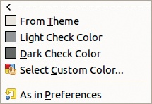

图 22-36. 填充颜色

## 填充颜色和对齐

我们还有一些选项需要在**图像：视图**菜单中查看。

**图像：视图 > 填充颜色**打开的菜单如图 22-36 所示，选项与首选项对话框中的“图像窗口外观”标签类似（如图 22-10 所示）。其中一个区别是，这里我们只能为活动的图像窗口选择填充颜色。

**图像：视图**菜单中提供的其他自定义选项都与*对齐*有关：对齐描述了鼠标指针如何被吸引到图像窗口中的某个特征。默认情况下，对齐是针对引导线启用的。选择**对齐到网格**可以精确绘制模式。选择**对齐到画布边缘**时，可以确保在边缘上开始选择。选择**对齐到活动路径**时，则用于路径操作。

# 22.4 创建新画笔

GIMP 有四种画笔：

+   *普通画笔*没有特定的名称。在画笔对话框中，它们作为小的灰度图像显示，称为*像素图*。使用普通画笔时，当前的前景色将被使用，颜色的强度通过像素图中黑色的强度来表示。

    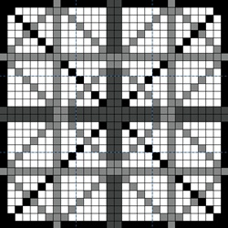

    图 22-37. 构建普通画笔

+   *颜色画笔*在画笔对话框中由颜色位图表示。从内部来看，它们由该位图以及该位图的灰度副本表示，后者作为遮罩使用。当与画笔动态一起使用，且在颜色行中没有勾选任何框（参见绘图工具选项）时，颜色画笔使用位图的颜色并忽略前景色。如果在当前画笔动态的颜色行中勾选了至少一个框，则会使用遮罩，画笔会以渐变方式进行绘制。

+   *动画画笔*（也叫*图像软管*）将一系列灰度或颜色位图应用到图像上。（在画笔对话框中的位图旁边会出现一个小红三角形。）动画画笔会根据指针的移动使用几个不同的位图。例如，在使用图形平板时，动画画笔可能会根据平板笔的压力、倾斜度以及当前的画笔动态设置改变其行为。

+   *参数画笔*是通过一个简单的图形界面创建的。

## 定义普通画笔

要定义普通画笔，首先构建一个灰度图像，如图 22-37 所示。当你对画笔满意后，将其导出为 GIMP 画笔 `.gbr` 文件格式，然后将打开图 22-38 中显示的对话框。在该对话框中，你可以添加画笔的简短描述并定义其默认间距。将画笔导出到你的个人画笔文件夹，并通过点击右下角的双箭头刷新画笔对话框，你应该能够像使用其他画笔一样使用新的画笔。

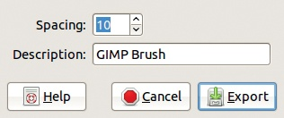

图 22-38. 导出普通画笔

## 定义颜色画笔

要定义颜色画笔，首先创建一个 RGB 模式的图像，绘制一个新画笔，并添加 Alpha 通道。或者，你可以创建一个透明图像，然后绘制画笔。画笔以颜色绘制，新画笔使用自己的颜色进行绘制。

请注意，一旦你复制或剪切了一个选区，它会出现在画笔对话框中作为第一个画笔。你可以根据从中选取的图像的颜色模式，将该选区用作普通画笔或颜色画笔。你还可以选择**图像：编辑 > 粘贴为 > 新画笔**，立即导出新的画笔。

## 定义动画画笔

要构建一个动画画笔，首先需要构建一个包含画笔所有组件的图像。你可以使用第十八章中描述的相同技术来构建一个多层图像（类似于动画），使每一层包含画笔的一个组件。你也可以构建一个只有一层的图像，所有组件按行列排列。最后，你还可以混合这两种方法，构建一个既有多层又在每层中包含多个画笔图像的图像。

当你使用带动画的画笔工具时，画笔图像会根据笔画方向、平板上施加的压力或单纯的移动距离发生变化。动画画笔的效果会根据工具（例如铅笔）及其固有属性而有所不同。你可以将这些条件结合起来，使动画画笔的效果在多个维度上变化。

然而，请注意，这个机制与涂鸦动态不同，并且不兼容：使用动画画笔时，当前的涂鸦动态设置会被忽略。

例如，假设我们想要构建一个三维画笔，且它会根据三个条件变化：

+   画笔的形状（一支小箭头）会随笔画方向变化。箭头从笔画方向顺时针旋转 90 度，因此如果我们顺时针画一个圆，箭头会指向圆心。

+   画笔的大小取决于触控笔在图形平板上的压力：压力越大，箭头越小。

+   画笔的颜色是随机变化的。

我们首先定义箭头的八个方向。第一个方向指向垂直方向，其余的方向每次顺时针旋转 45°。

然后我们定义四种尺寸和四种颜色，共生成 8 × 4 × 4 种不同的画笔。我们将画笔组织成四个不同颜色的层，每层包含四排八个形状。

首先，我们在一个新的 200 × 200 图像中绘制一个箭头，如图 22-39 所示。然后我们将该图像缩放为 40 × 40（即我们的画笔大小），通过不断旋转它，构建出一排箭头，放入一个新的 320 × 40 图像中。为了精确定位箭头层，我们设置了相隔 80 像素的垂直参考线，如图 22-40 所示。

现在，我们再构建三排箭头，画笔图像的尺寸逐渐减小。我们分别缩放每一层，使其保持在同一位置；换句话说，我们不会一次性缩放整排箭头。除了第一排 40 × 40 的画笔外，我们再构建三排，尺寸分别为 35 × 35、30 × 30 和 25 × 25。对于每一排，我们删除背景层并合并其他层，生成一个单层图像。我们还将该层扩展到除第一排外的所有图像大小。

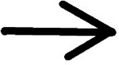

图 22-39. 模型画笔

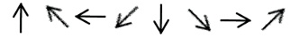

图 22-40. 构建一排形状

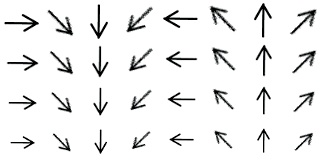

图 22-41. 一组逐渐减小的四排

每一层的多层图像必须包含我们刚刚定义的四排的副本。因此，我们创建一个新的 320 × 160 图像，并将四排作为新图层复制到此图像中。（水平导线帮助我们正确放置这些排，如图 22-41 所示。）现在，我们在四种不同的颜色中构建四个不同的图层：

1.  删除图像的背景层。

1.  合并四个图层。

1.  使用高阈值的“按颜色选择”工具，选择黑色箭头。

1.  选择 100%的红色（色相=0，饱和度=值=100），并填充选区（）。

1.  保存图像。

现在，我们对剩下的三种颜色重复最后两个步骤；例如，选择色相值 90、180 和 270 来生成绿色、蓝色和紫色。然后，我们构建最终的 320 × 160 图像，包含之前定义的四个图层。此图像没有背景图层，图层按从上到下的顺序分别是红色、蓝色、绿色和紫色。

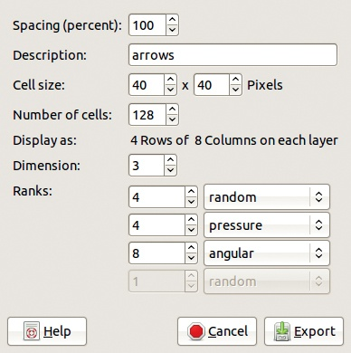

图 22-42. 导出动态画笔

要导出画笔，选择你的个人画笔文件夹并使用`.gih`后缀。将显示图 22-42 中所示的对话框。更改所有字段如下：

1.  将 SPACING 推到 100%，以清晰分隔画笔图像。用户在使用画笔时可以更改此设置。

1.  在 DESCRIPTION 字段中添加描述。画笔在画笔对话框中按描述字母顺序列出。

1.  将 CELL SIZE 设置为 40 × 40。

1.  将 NUMBER OF CELLS 改为 128。GIMP 会显示每个图层的组织方式，方便你检查工作。

1.  随机变化第一维度。（此画笔有三个 DIMENSIONS。）四个图层是第一维度，代表画笔的颜色。

1.  通过触控笔压力来变化第二维度。每一层的四排是第二维度，代表画笔的大小。

    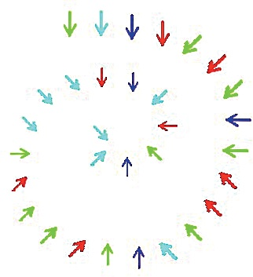

    图 22-43. 测试新的动态画笔

1.  最后，通过笔画的角度来变化第三维度。每一排中的八个画笔图像是第三维度，代表画笔的方向。你也可以通过速度或倾斜来变化这个第三维度。尽情尝试你的新动态画笔吧！

完成后，点击导出（EXPORT）。画笔现在已经在你的个人画笔文件夹中。通过点击右下角的双箭头刷新画笔对话框，查看列表中的新画笔。

为了测试这个新画笔，从列表中选择它，创建一个新的 400 × 400 的白色图像，然后用平板电脑笔在图像上画一个顺时针螺旋，随着向中心移动，增加压力。结果如图 22-43 所示。

请注意，你可以在不改变画笔本身的情况下轻松更改导出参数——前提是画笔已保存为 XCF 文件。例如，你可以去掉颜色变化，或根据笔尖的倾斜逐步调整这些变化。

## 定义一个参数化画笔

要定义一个参数化画笔，请使用画笔编辑器，当你创建新画笔、复制画笔或编辑画笔时，画笔编辑器将会出现。画笔编辑器对话框如图 22-44 所示。

在对话框菜单下方，你会看到一个文本框用于命名新画笔。大框中显示的是画笔的预览图。然而，预览图与画笔的实际大小不成比例，因为你可以创建半径从 0.1 像素到 1000 像素的画笔。

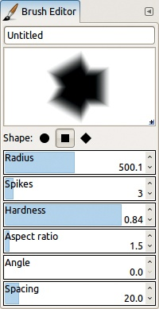

图 22-44. 画笔编辑器

创建新画笔时，你可以从三种形状中选择：圆形、方形或菱形。半径（RADIUS）是指从画笔中心到边缘的距离，因此它是画笔大小的一半。尖刺从中心向外伸展，像花瓣一样；花瓣的尖端是选定的形状（圆形、方形或尖形）。圆形上不会出现尖刺，除非长宽比（ASPECT RATIO）大于 1，但角形的图形在任何长宽比下都会出现尖刺。长宽比[1 到 20]控制高度和宽度之间的关系，并与尖刺数量以有趣的方式互动，决定画笔的最终形状。尖刺的最小数量是两个。如果你有两个以上的尖刺，当形状是菱形时，你会得到一个星形多边形。如果长宽比为 1 且形状是方形，那么如果你有超过三个尖刺，你会得到一个与尖刺数量相等的边数的形状。例如，八个尖刺会得到一个八边形。三个尖刺会得到一个奇特的多边形，如图 22-44 所示。如果长宽比大于 1 且形状是方形，你将得到一个带有方形尖端的星形。图 22-45 显示了一个圆形形状，长宽比为 4.5，且有六个尖刺。

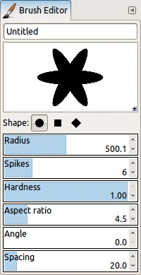

图 22-45。一个具有圆形形状、宽高比大于 1 且带有六个尖刺的画笔

硬度范围从 0.0（完全模糊）到 1.0（完全清晰）。角度[0 到 180]允许你围绕画笔中心旋转画笔。最后，与其他画笔一样，**间距**选项是你使用画笔绘制时两个画笔实例之间的距离。

一旦你对画笔满意，关闭对话框，你的新画笔将以你选择的名称和`.vbr`后缀保存在个人画笔文件夹中。

# 22.5 创建新图案

在第四章中，你学会了如何定义新的纹理。如果你将纹理（或其一部分）导出到个人的图案文件夹中，并刷新图案对话框，图案将立即可用。你可以将图案导出为`.pat`后缀（特定的图案格式），或者在 GIMP 2.2 或更高版本中，你也可以将图像文件保存到图案文件夹中，格式可以是 PNG、JPEG、BMP、GIF 或 TIFF。

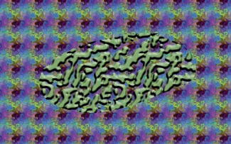

图 22-46。使用半透明图案

一旦你复制或剪切一个选区，复制的图案将作为图案对话框中的第一个图案可用。如果你之后进行另一次复制或关闭 GIMP，则此临时图案会丢失。你可以选择**图像：编辑 > 粘贴为 > 新图案**来保存这个临时图案。

图案不一定是完全不透明的。例如，如果你保存纹理的顶部层图 4-69，从中复制一个 200×200 像素的正方形，并将其保存为图案，那么新的图案将是半透明的。图 22-46 展示了将该新图案应用于一个选区，并将该选区填充上另一个图案后的效果。

# 22.6 创建新的渐变

尽管画笔和图案基本上是图像，但渐变则有所不同。创建新的渐变的唯一方法是使用渐变编辑器（**渐变：渐变菜单 > 编辑渐变**）或点击渐变对话框左下角的图标。与画笔一样，你不能编辑不属于你的渐变。要编辑一个现有的渐变，你首先需要复制该渐变，然后才能编辑副本。

所有的渐变编辑操作都可以通过渐变对话框底部的按钮进行访问。或者，你可以选择**渐变：渐变菜单**，或者右键点击一个渐变来打开渐变对话框菜单（见图 22-47）。你可以复制渐变路径到剪贴板并粘贴到文本文件中。选择自定义渐变来创建仅包含当前渐变的图像。你可以设置该图像的高度和宽度，这对测试复杂渐变非常有用。如果你使用的是 Persistence of Vision Raytracer，还可以将渐变导出为 POV-Ray 格式。

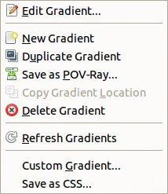

图 22-47。渐变对话框菜单

你构建的渐变将以`.ggr`后缀导出（GIMP 渐变格式），这是 GIMP 专用的格式。

## 渐变编辑器

要尝试渐变编辑器，打开渐变对话框，选择渐变`Caribbean Blues`，并点击“复制渐变”（或选择**渐变：渐变菜单 > 复制渐变**）。如图 22-48 所示的对话框会打开。如果你点击渐变中的一个颜色，窗口底部会显示以下选项：

+   位置：渐变中的水平位置（0.0 = 最左边，0.5 = 中心，1.0 = 最右边）

+   RGB：红色、绿色和蓝色通道的值（范围为[0 到 1]）

+   HSV：色相（以度为单位的角度）以及饱和度和值（均为百分比）

+   亮度和不透明度百分比

小矩形显示渐变的颜色。对话框底部的四个按钮让你保存渐变、放大或缩小，或者返回到某个设定的缩放因子，如适应窗口。

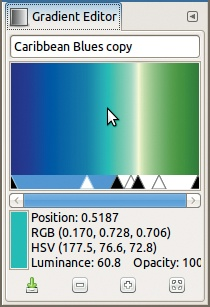

图 22-48。渐变编辑器

点击渐变图像来设置前景色，或者右键点击设置背景色。你可以点击并拖动工具箱中的颜色样本到渐变编辑器中，实时更改其颜色，但对话框中只显示 RGB 值。

在渐变编辑器对话框的顶部，你可以更改渐变的名称。渐变由一系列段组成。每个段都是从左侧颜色（由黑色三角形标记）到右侧颜色（由下一个黑色三角形标记）的平滑过渡。白色三角形类似于在“色阶”工具中的伽马三角形：它们不会改变第一个和最后一个颜色，但会改变过渡的方式。换句话说，白色三角形改变了答案曲线的形状。

要对正在编辑的渐变进行简单的变换，首先需要放宽窗口。接下来，双击两个黑色三角形之间的段落，将其选中并变为蓝色。（要选择一系列段落，点击最后一个段落即可。）

选中一个段落后，你可以移动黑色三角形来扩展、缩小或移动该段落。你还可以移动白色三角形来改变段落中的曲线形状，或者通过同时调整两个黑色三角形来移动整个选中的段落，从而压缩或扩展相邻的段落，如图 22-49 所示。当你勾选即时更新按钮时，效果会立即显示；否则，当你松开鼠标按钮时效果才会出现。

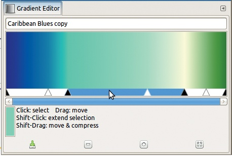

图 22-49. 移动和变形段落

## 渐变编辑器菜单

你可以通过对话框菜单或在对话框中的渐变区域右键点击打开渐变编辑器菜单（图 22-50）。此菜单允许你更改定义渐变段的两种颜色。图 22-51 显示了选择左侧颜色类型时（右侧颜色类型菜单相同）打开的菜单。默认模式为“固定模式”，你可以通过渐变编辑器菜单中的两个选项来选择端点颜色。或者，你可以选择将一个端点的颜色附加到前景色或背景色。你正在构建的渐变将依赖于这些颜色——就像 GIMP 自带的前四种（从前景到背景）渐变一样。

端点颜色可以包含 Alpha 通道。如果勾选了包含“(透明)”的选项，那么第一个端点的 Alpha 通道值为 0，随着向另一个端点移动，Alpha 通道值会增加。或者，你可以点击渐变编辑器菜单中的“左端点颜色”（或“右端点颜色”），使用颜色选择器根据需要更改 Alpha 通道的值。

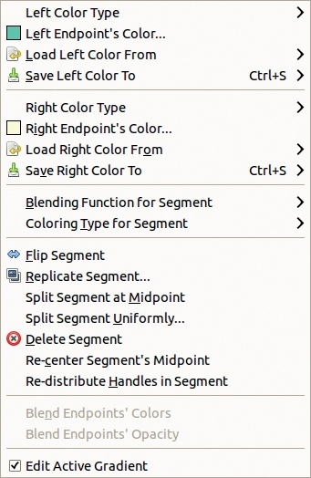

图 22-50. 渐变编辑器菜单

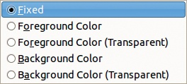

图 22-51. 左侧（或右侧）颜色类型子菜单

在渐变编辑器菜单中选择“从左侧加载颜色”（或“从右侧加载颜色”）会打开图 22-52 所示的菜单。在这里，你可以选择渐变中的邻近颜色，或者从一组可以自定义的 10 种颜色的预设调色板中选择颜色。要更改为预设调色板中的某个颜色，选择“将左侧颜色保存到”（或“将右侧颜色保存到”）并从这些 10 种颜色中选择一个。

或者，你可以将渐变颜色更改为图像中的颜色：

1.  选择颜色选择工具（）。

1.  点击图像中的一个颜色。

    

    图 22-52. 从左侧（或右侧）加载颜色子菜单

    

    图 22-53. 细分子菜单的混合功能

1.  拖动前景色中的颜色，并将其放入渐变编辑器中，放置到你想要的位置。

渐变编辑器菜单中的下一个条目，“细分的混合功能”，会打开图 22-53 所示的菜单。在这里，你可以选择当前段的五种不同的左到右过渡方式：

+   LINEAR 是默认的。颜色逐渐变化，白色三角形上方的点是起始色和结束色的混合。例如，如果该段从红色过渡到黄色，白色三角形上方的点则为橙色。

+   CURVED 使得颜色变化在段的两端更快。

+   相反，SINUSOIDAL 使得颜色在中间变化得更快（如白色三角形所设定的）。

+   SPHERICAL（递增）使得颜色在左侧变化得比右侧更快。

    

    图 22-54. 细分子菜单的着色类型

+   SPHERICAL（递减）也是相同的，但右侧的变化更快。

下一个条目，“细分的着色类型”，会打开图 22-54 所示的菜单，在这里你可以决定颜色之间的过渡是沿 RGB 空间还是 HSV 空间进行。如果你查看前四个渐变，当前景色和背景色分别为实际的颜色，例如蓝色和红色时，你可以观察到沿 HSV 模型与 RGB 模型过渡之间的区别。

渐变编辑器菜单中的下一个条目如下：

+   FLIP SEGMENT 是唯一可以被反转的操作，因为渐变编辑器没有撤销功能。

+   REPLICATE SEGMENT 会复制该段的多个副本。

+   **在中点分割段**将当前段分割成两个段。段在白色三角形处分割，并且一个新的白色三角形将放置在每个新生成段的中心。

+   **均匀分割段**做的事情类似，但它忽略了要分割段中的白色三角形，并且你可以选择新的段数。

+   **删除段**会删除整个段或段内的选定部分。删除的段两侧的段将放大以填补空间。

+   **重新居中段的中点**将白色三角形精确地放置在段的中间。

+   **重新分布段中的控制点**使所有三角形等距，并且仅在你选择多个段时有用。

    

    图 22-55. 渐变编辑器的初始对话框

+   **混合端点颜色**仅在选择多个段时启用。一个段的右边颜色与另一个段的左边颜色的平均值将替换选中区域内所有边界的颜色。

+   **混合端点不透明度**的工作原理与**混合端点颜色**相同，只是作用于不透明度而非颜色。

## 创建渐变

为帮助你理解渐变编辑器的许多功能，这里有一个示例，展示了如何定义一个四段渐变。

假设前景色和背景色已设置为默认值。在渐变对话框中点击**新建渐变**，打开图 22-55 所示的窗口。

要定义一个四段渐变，从对话框菜单中选择**均匀分割段**，并将滑块值改为 4。然后点击**分割**，得到如图 22-56 所示的结果。这个对话框比较窄，但你可以放大它。你也可以使用底部的缩放图标来放大对话框，但你将无法看到整个渐变。

分割后，所有段都会被选中。仔细选择最左侧的第一个段。应用**左边颜色类型**和**右边颜色类型**，将左端点类型设置为**前景色（透明）**，右端点设置为**前景色**。现在，第一个段完全由前景色决定。

图 22-56. 分割渐变成四个段后

图 22-57. 设置四个段的颜色后

接下来，我们更改其他三个段的颜色。对于每个段，将左端点的颜色设置为**左邻居的右端点**颜色，并为右端点选择任何你喜欢的颜色。结果是各段之间的平滑过渡，如图 22-57 所示。

现在我们将改变各段的混合函数：第一段使用线性混合，第二段使用正弦混合，第三段使用球面（递增）混合，第四段使用球面（递减）混合。最后，稍微移动一下白色和黑色三角形，如图 22-58 所示。记住，你不能在选定的段中独立移动三角形。

图 22-58. 完成的四段渐变

图 22-59. 使用新渐变

为了测试新的渐变，将前景色更改为紫色，十六进制值为 8f14e5。创建一个新的 400 × 400 的白色图像，并在图像中间应用一个径向渐变，使用正常模式且不重复。结果如图 22-59 所示。

# 22.7 创建新调色板

GIMP 有两种调色板。一种是颜色映射，也叫*索引调色板*，它包含在所有 GIF 文件中，最多包含 256 种不同的颜色。当你将图像模式从 RGB 更改为索引模式时，可以自动定义索引调色板，但你也可以使用已经定义好的“自定义调色板”。

你可以将任何调色板作为自定义调色板，在将图像转换为索引模式时使用。使用调色板就像是用有限的颜色集制作挂毯，并将这些颜色交替排列，以获得更大色彩数组的效果。

图 22-60. 调色板对话框和调色板菜单

你可以在系统的调色板文件夹中找到许多 GIMP 调色板，它们的后缀为`.gpl`（GIMP 调色板）。GPL 文件格式包含一个简短的标题，后面是三个通道 R、G 和 B 的值，以及每种颜色的可选名称。值的顺序不重要。

要查看所有现有的调色板，请打开调色板可停靠对话框（**图像：Windows > 可停靠对话框 > 调色板**），如图 22-60（左图）所示。图 22-60（右图）显示了调色板菜单，你可以从对话框菜单中选择，或者通过右键点击对话框内的区域进行访问。使用此菜单可以直接操作调色板，或者通过右键点击你想编辑的调色板来访问选项。你还可以使用调色板对话框底部的按钮。像其他 GIMP 对象一样，调色板有系统范围的和个人的调色板文件夹，你只能编辑你创建或复制的调色板。

## 调色板编辑器

在调色板对话框中，双击任何调色板以打开调色板编辑器（图 22-61，左图）。

点击调色板编辑器中的任何颜色会将其复制到前景色，而则会将其复制到背景色。你还可以通过使用颜色选择器的调色板标签来使用调色板编辑器进行绘画（参见颜色选择器）。

图 22-61. 调色板编辑器，作为网格或五列显示

此可停靠对话框中的一个重要属性是列字段（COLUMNS）：如果此字段为 0，调色板颜色将以优化的方式显示。但你也可以强制它们以列的形式显示，如图 22-61（右图）所示。

要更改调色板中的颜色，右键点击并选择“编辑颜色”（或双击颜色）以打开颜色选择器对话框。通过对话框菜单、底部按钮或右键菜单，你还可以删除颜色，或者将前景色或背景色添加到调色板中。你可以为新调色板命名并保存，而无需关闭对话框。即使你没有明确保存，当你关闭新调色板时，它会自动保存在你的个人调色板文件夹中。

## 导入调色板

另一种定义新调色板的方法是通过选择**调色板：调色板菜单 > 导入调色板**，从渐变、图像或另一个调色板中导入它。当你选择此选项时，会打开图 22-62 所示的对话框。

在此对话框中，你可以选择调色板的来源和名称。你还可以选择调色板的不同颜色数量，这个数量不能超过 10,000。如果你从 RGB 图像导入调色板，颜色的数量通常远大于最大值，因此你需要增加间隔（INTERVAL），这意味着相邻的颜色会使用这个邻近因子进行分组。例如，在图 22-63 中，我们从图 20-5 的基础图像导入，将颜色数推至 1000，并将间隔设置为 16。

图 22-62. 导入新调色板

## 导出与复制调色板

现在，让我们讨论调色板对话框菜单中的剩余条目。

+   DUPLICATE PALETTE 的功能相当直观。新的调色板将自动打开调色板编辑器。

+   EXPORT AS 帮助你构建一个颜色表，可以在不同的上下文中使用。可用的格式有 CSS 样式表、Java 地图、PHP 或 Python 字典以及文本文件。根据调色板的不同，颜色可能有名称。根据输出格式，颜色符号使用不同的约定。

+   OFFSET PALETTE 打开一个小对话框，你可以在其中设置偏移值。你选择的调色板颜色数量将从调色板的末尾移动到开头。这不会影响调色板的功能，但如果你用它们来绘画，比如说，它可以帮助你重新排列颜色。

图 22-63. 从 RGB 图像导入

## 调色板到渐变与排序调色板

调色板对话框菜单中的下两个条目允许你在构建渐变时使用调色板。最后一个条目允许你排序调色板。

+   调色板到渐变：使用此选项立即构建并保存一个新的渐变，其中包含当前调色板的所有颜色，并按顺序排列。每种颜色在渐变中的宽度相同。此选项最适用于小型调色板，因为渐变更容易编辑。

+   调色板到重复渐变：此选项与前一个选项的唯一区别在于，渐变的末尾会重复第一个颜色。

+   排序调色板：这将打开一个对话框，用于根据颜色模型（RGB 或 HSV）和通道以升序或降序排序调色板颜色。这个选项在你想从调色板生成渐变或使用调色板进行绘画时非常有用。

图 22-64. 色图编辑器

图 22-65. 色图编辑器菜单

## 索引调色板

在处理索引图像时，你可以使用调色板编辑器编辑其索引调色板。调色板编辑器，如图 22-64 所示，是一个可停靠的对话框，可以通过**图像：窗口 > 可停靠对话框 > 调色板**访问。可用的菜单显示在图 22-65 中。如你所见，你可以更改颜色、从前景或背景颜色中添加新颜色（如果调色板中有空余空间），或者重新排列索引调色板。选择重新排列索引调色板会打开部分显示在图 22-66 中的窗口，同时显示右键菜单。

图 22-66. 重新排列索引调色板

当你点击某个颜色时，它在调色板中的索引会出现在对话框的底部，并显示其在 RGB 颜色空间中的十六进制值（称为*HTML 表示法*）。你可以更改任意一个字段：调色板字段选择颜色；十六进制字段则更改颜色。
