# 附录 A. 视觉与图像表示

在本附录中，我们将探讨视觉的本质、图像感知，以及图像在印刷和屏幕上的再现。这一主题复杂且技术性强，但我们会尽量以直观且易于理解的方式呈现。

# A.1 视觉生理学

如果我们看不见某个图像，那么它实际上并不存在。我们之所以能够看见事物，得益于被称为眼睛的复杂而精确的器官。我们的眼睛通过解释一小部分电磁波谱，即*可见光谱*，来产生我们所看到的图像。

## 人眼如何工作

图 A-1 是人眼的示意图，展示了其主要结构。光线通过瞳孔进入眼睛，并通过晶状体聚焦，图像在眼睛后方的视网膜上形成。晶状体是柔软的，周围的小肌肉使其能够变形以改变焦距。这使得我们能够聚焦在不同距离的物体上。瞳孔的直径也是可变的，这为调节进入眼睛的光线量提供了一种方式。

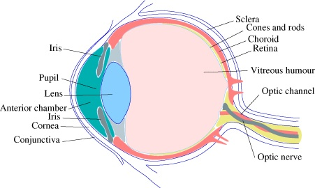

图 A-1. 人眼

图 A-2 展示了视网膜的横截面。其结构是一个非常复杂的敏感神经细胞网络。感知颜色和光线的细胞是*视杆细胞*和*视锥细胞*。这些细胞的主要部分埋藏在视网膜内部。可见光谱内的光线被细胞尾部接收，细胞尾部显示在图 A-2 横截面的最右侧。

每只眼睛中的视杆细胞数量从 1.2 亿到 1.5 亿不等，主要分布在视网膜的外围。视锥细胞数量只有 600 万到 700 万，主要位于视网膜中央的*中心凹*区域。图 A-3 展示了这种不同的分布。它还显示了*盲点*，这是视网膜中视神经从眼睛中出来的地方。

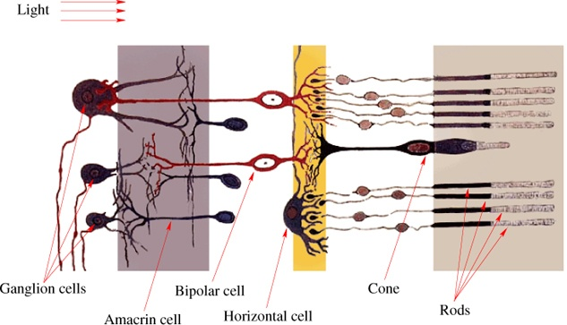

图片来源：维基共享资源

图 A-2. 视网膜的横截面

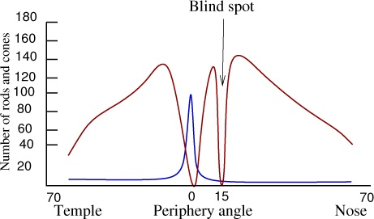

图 A-3. 视杆细胞（深红色）和视锥细胞（蓝色）在视网膜上的分布

你可能没有意识到你视野中存在盲点。尝试这个实验来观察它们的效果：闭上一只眼睛，注视前方的一个固定点。将一个小物体（比如你的食指）放在眼前，保持与睁开的眼睛在同一侧（物体与眼睛之间的距离应在 12 到 20 英寸之间）。然后慢慢地将物体移向你的鼻子。当前方固定点与移动物体之间的角度约为 15°时，物体应该会消失。请注意，你的感知和认知系统通常会让你没有注意到这个盲点——你的大脑能够重建缺失的信息并填补空白。

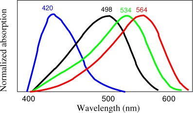

图 A-4. 三类锥体的敏感性

## 颜色感知

杆细胞和锥细胞在另一个非常重要的方面有所不同。杆细胞对亮度非常敏感，但对波长的差异不敏感。另一方面，锥细胞只需要足够的光线就能工作，但它们对波长非常敏感。根据它们所敏感的波长，锥细胞可以分为三类。正如图 A-4 所示，蓝色锥体对大约 420 纳米（nm）波长的光最为敏感，这对应于蓝色。绿色锥体在大约 534 纳米时最为敏感，而红色锥体在大约 564 纳米时最为敏感（这实际上是黄色，而非红色）。此外，蓝色锥体只占总数的 1/50，绿色锥体大约占总数的 2/5，红色锥体大约占总数的 3/5。图 A-4 中的黑色曲线显示了杆细胞的敏感范围。

这种杆细胞和锥细胞的分布有一些有趣的后果：

+   当光线不足时，我们无法区分不同的颜色。例如，想象你正坐在黎明前的花园里。几只猫在四处徘徊，它们看起来都是灰色的。当黎明到来时，猫的颜色慢慢恢复——棕色和橙色——而随着天空变亮，草地也逐渐变得更绿。

+   只有视网膜的中心能够感知颜色。但我们的认知系统会推断我们视野外围的颜色并将其添加进去，因此我们通常不会注意到这一局限性。

+   我们对蓝色敏感的锥体非常少（仅占总数的 1/50），然而这些锥体负责感知相对较广的波长范围。这意味着，观看以紫色或蓝色为主的图像或景观会让眼睛感到更疲劳，特别是当图像包含大量细节时。在包含大量蓝色的场景中，分辨亮度的差异也更加困难。

因此，我们对颜色的感知是由对大脑发送的来自不同波长光的锥体信号的差异所导致的。我们能看到的颜色范围由我们的锥体对不同波长的敏感度所定义。如你稍后将看到的，大多数颜色并非由单一波长定义；这种*单色*颜色可以通过人工设备产生，但自然颜色通常是多种波长的混合。我们只能感知与三种锥体类型之一对应的单色颜色。例如，我们的眼睛无法区分单色黄色与由红光和绿光混合而成的黄色。因为我们没有专门对黄色敏感的锥体，所以来自红色和绿色锥体的信号是相同的，无论黄色是由红光和绿光混合而成，还是由纯黄色光产生。

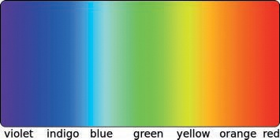

图 A-5. 可见光谱（传统视图）

如果我们考虑传统上表示的可见光谱（见图 A-5")），我们可能会得到这样的印象：它在两侧都有明确的界限，并且包含七种离散的颜色。这种过于简化的观点并不是基于科学的。更准确的示意图见图 A-6。可见光谱是电磁波谱中的一小部分，没有明确的开始和结束。可见光谱并没有真正的靛蓝色，红色区域远大于其他颜色。可见光谱的边界是模糊的，因为紫色逐渐过渡到紫外线，而红色则过渡到红外线。此外，不同物种的可见光谱也有所不同：鸟类和一些昆虫能够看到紫外线。

从太阳射来的光被地球大气层以不同速率吸收，这些速率根据波长的不同而有所变化。可见光谱是电磁波谱中最能穿透地球大气层并到达其表面及其上的物体的部分。但是大气层比红光更多地散射蓝光，这也解释了为什么天空对我们来说是蓝色的（天气允许的情况下）。

## 色盲

我们对颜色的感知依赖于很多因素，包括我们的认知系统。正如我们在图 A-6 中看到的那样，红色几乎覆盖了可见光谱的一半，而红光是可见颜色中波长最长的。但我们的眼睛中对长波长敏感的锥体主要感知黄色。尽管如此，我们通常能区分各种不同的红色以及橙色和黄色。

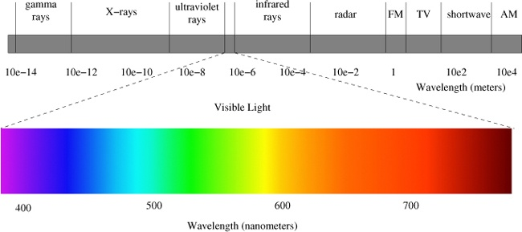

图 A-6. 电磁波谱中的可见光谱

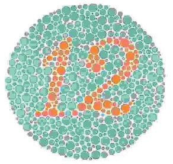

图 A-7. 色盲测试

因此我们可以看到，我们对颜色的感知不仅仅是视网膜细胞发出的信号的接收，而是大脑中发生的复杂解读过程。当这一过程正常运作时，它让我们能够区分颜色，并欣赏不同颜色组合的效果。

最常见的视觉感知异常被称为*色盲*。你可能以前见过色盲测试，比如图 A-7 和图 A-8 中的测试。

人眼通常包含三种类型的视锥细胞。但有时其中一种或多种视锥细胞缺失。（许多动物只有两种视锥细胞。）如果缺失红色视锥细胞，人的眼睛会出现一种名为*达尔顿症*，也叫做*红盲*的障碍。图 A-9 展示了大多数人看到的彩虹颜色，而图 A-10 则展示了红盲患者看到的彩虹。这是最常见的色盲类型，特点是红色显得较为暗淡。

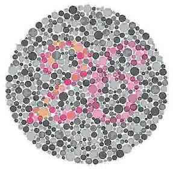

图 A-8. 另一个色盲测试

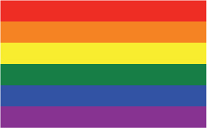

图 A-9. 传统的色彩彩虹

缺失绿色视锥细胞会导致一种名为*绿色盲*（在图 A-11 中展示）的障碍。这种类型的色盲与红盲的发生率相当。缺失蓝色视锥细胞会导致*蓝盲*（在图 A-12 中展示）。蓝盲极为罕见。

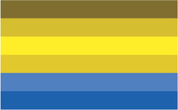

图 A-10. 患有红盲的人眼中的彩虹

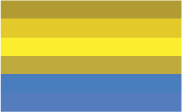

图 A-11. 患有绿色盲的人眼中的彩虹

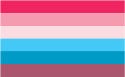

图 A-12. 患有蓝盲的人眼中的彩虹

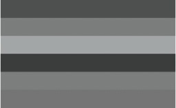

图 A-13. 单色盲视角中的彩虹

异常情况也会发生，当三种类型的视锥细胞都有时，但其中一些是畸形的，导致它们不活跃。由于不活跃，这些畸形的视锥细胞会导致与缺失视锥细胞相同类型的色盲。还有一种非常罕见的病症叫做*单色盲*，或称完全色盲，它发生在所有视锥细胞缺失或不活跃时。图 A-13 展示了一个单色盲患者眼中的彩虹。

注意这些异常情况，因为它们可能会影响图像、书籍和网站的可访问性。例如，完全依赖橙色与绿色对比度的图像，对于患有原色盲或绿盲的人来说是没有意义的。原色盲和绿盲这两种色盲在所有男性中约占 2%，这是一个相当可观的人数。

## 视觉错觉

虽然色盲是影响少数人群的缺陷，但视觉错觉却能作用于大多数人。当我们的感知系统部分失效时，就会发生视觉错觉，这使得我们以一种与现实相矛盾的方式解读事物。视觉错觉因多种原因而有趣：

+   它们提供了帮助我们理解认知过程如何工作的线索。

+   它们激发了许多艺术家创作迷人的画作，例如，M.C. 埃舍尔、萨尔瓦多·达利、朱塞佩·阿尔钦博尔多和维克托·瓦萨雷利。

+   它们既有趣又有创作性，可以通过 GIMP 的帮助来实现。

当我们看到的图像与创作的图像不同时，就会发生*字面上的视觉错觉*。其中一个最好的例子是阿德尔森的棋盘阴影错觉，如图 A-14 所示。标记为 A 的方块看起来比标记为 B 的方块暗得多，但它们实际上是相同的灰色。我们根据第二个方块处于绿色圆柱体阴影中的事实来解释它的颜色。为了让大多数人看到图像的真实情况，唯一的方法是（当然使用 GIMP）创建一个将 A 方块和 B 方块连接起来的平行四边形，并用相同的灰色填充平行四边形（参见图 A-15）。

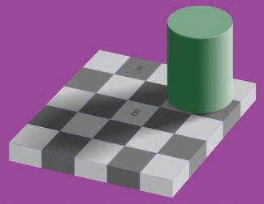

版权：Wikimedia Commons

图 A-14. 阿德尔森的棋盘阴影错觉

图 A-15. 解开错觉

*生理错觉*是由于某种类型的过度刺激引起的，可以是眼睛本身或大脑的过度刺激。例如，图 A-16 展示了闪烁网格错觉。灰色线条的交点处有白色圆点，但如果你注视网格的中心，就会看到远处交点处出现和消失的黑点，这些黑点快速且随机地出现。赫尔曼网格是类似的错觉，但交点处没有白点。

第三种类型的视觉错觉是*认知错觉*，它源于我们对世界的假设所引发的无意识推断。认知错觉可以分为四类。

鲁宾的花瓶，如图 A-17 所示，是一种被称为*模糊错觉*的认知错觉的例子。根据观众对图像主次背景的理解，这个图像可以呈现为花瓶或两个人的面部侧影。立方体的线条画表示是另一种模糊错觉的例子。当你画一个简单的立方体时，很难确定哪个面是离观众最近的，哪个面是最远的。

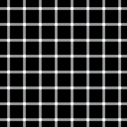

版权：Wikimedia Commons

图 A-16. 闪烁网格错觉

版权：Wikimedia Commons

图 A-17. 一种模糊错觉

咖啡馆墙错觉，如图 A-18 所示，是另一种类型的认知错觉的典型例子：*扭曲错觉*。黑色方块的位置变化产生了水平线看似弯曲的错觉，而不是平行的。为了验证它们实际上是平行的，可以将直尺对准图像的上方，零刻度对准上面一条线，然后沿着这些线移动。你会发现，两条线之间的距离在整个图像中都是相同的。

弗雷泽螺旋，如图 A-19 所示，是另一种扭曲错觉。尽管它看起来像一个螺旋形，实际上这个图像由一组同心圆构成。如果你持怀疑态度，可以用铅笔沿着其中一个圆的轮廓绘制，或将一个圆形物体放置在图像上方。

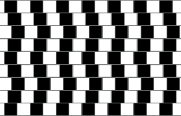

版权：Wikimedia Commons

图 A-18. 咖啡馆墙错觉：一种扭曲错觉

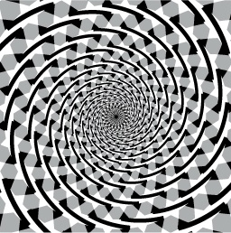

版权：Wikimedia Commons

图 A-19. 弗雷泽螺旋：另一种扭曲错觉

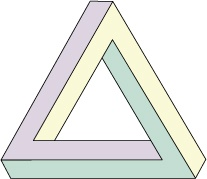

版权：维基共享资源

图 A-20. 佩恩罗斯三角形：悖论幻觉

佩恩罗斯三角形，如图 A-20 所示，是一种被称为*悖论幻觉*的认知幻觉的例子。悖论幻觉看似呈现一个三维实心形状，但它所表示的形状实际上是不可能存在的。M.C. 埃舍尔创作了一些著名的作品，依赖于这一理念，比如图 A-21 所示的不可能楼梯。图 A-22 中的“Blivet”也是悖论幻觉的另一个例子。

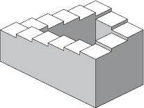

版权：维基共享资源

图 A-21. 不可能的楼梯：另一个悖论幻觉

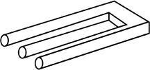

版权：维基共享资源

图 A-22. The blivet: yet another paradox illusion

# A.2 图像表示

现在你已经了解了现实世界中颜色和图像是如何被视觉和认知系统感知的，我们将讨论它们是如何在计算机上表示的。

## 离散化

尽管这似乎违反直觉，但所有图像都是以离散的方式表示的，而不是连续的。这被称为*离散化*。图像由大量非常小、离散的点组成，这些点都非常接近彼此。因为它们如此小且如此靠近，我们无法分辨这些点，因此它们创造了连续图像的错觉。考虑以下图像表示：

+   *视觉图像：* 当图像聚焦在我们眼睛中时，视网膜中的杆状和锥状细胞感知光的波长和强度。尽管这些细胞非常小且紧密排列，但它们是离散的感受器。

    

    图 A-23. 数字图像

+   *数字图像：* 在数码相机中，一张图像（如图 A-23 所示）会聚焦到一个光感受器阵列上。这些光感受器与视网膜非常相似，尽管它们的密度远低于视网膜中央凹处锥体细胞的密度。

+   *一张照片：* 在照相纸上，图像通过银盐晶体表示，这些晶体非常小，但是离散的。事实上，你可以用一只好的放大镜看到传统照片上的颗粒。

+   *一张打印文档：* 在打印文档中，离散化通过碳颗粒（激光打印机）或墨点（喷墨打印机）表示。

+   *计算机屏幕：* 在计算机屏幕上，构成屏幕表面的像素是离散的。您可以在图 A-24 中清楚地看到这一点，该图显示了图 A-23 的极端近距离的一小部分。

颜色也是离散的：

+   *眼睛* 有专门的锥状细胞，每个细胞只感知一种颜色的光。

    

    图 A-24. 放大图像的一部分

+   *数码相机* 有三种类型的光感受器，每种对特定颜色（红色、绿色或蓝色）敏感。

+   *照片纸* 由三层组成，每层分别是基本颜色（红色、绿色和蓝色），每层都是部分透明的。

+   *打印机* 有着彩色点的叠加，有时在具有部分透明度的层中。打印机至少需要三种不同的墨水颜色，但通常有更多，这是我们在图 A-39 中讨论的原因。

+   在*计算机屏幕*上，每个像素实际上由三个亚像素组成，分别是三种基本颜色：红色、绿色和蓝色。

没有图像是真正连续的，尽管许多看起来如此，因此所有的表示都只是对现实的近似，我们的感知能力很大程度上依赖于我们认知系统的能力。

## 数字化

在前一节中，我们讨论了图像被离散表示的五种不同情况。在眼睛和数码相机中，每个接受器产生一个数字来表示接收到的信号强度。（诚然，这在视网膜上并非完全如此，但信号可以被测量和量化。）在照片纸、印刷文件和计算机屏幕上，点（或像素）根据某些信号强度发出光，这反过来可以用一个数字表示。

只需使用一个数字来表示信号强度就足够了，只要我们只处理灰度图像，例如，如果我们只考虑杆状细胞的信号或者如果我们是在黑白打印时。如果引入颜色，我们每个像素需要至少三个值或视网膜中的三种细胞。

计算机上的图像每个像素需要一个数字来表示灰度图像，或者（至少）每个像素需要三个数字来表示彩色图像。为了使像素的表示不占用太多空间，所有表示都使用限定范围内的整数。像素值的范围是[0 到 255]。选择这个范围是因为它完全符合 1 字节内存的存储，这意味着单个彩色像素将占用 3 字节。

所以在灰度图像中，每个像素有 256 个可能的灰度级别。在彩色图像中，每种颜色有 256 个可能的值，因此你有 256 × 256 × 256，或者 16,777,216 种不同的颜色值。但专业摄影师通常更倾向于为每个像素使用 2 个字节，这样会得到值的子范围[0 到 65,536]。回想一下，1 个字节表示 2⁸ × 256 个可能值，所以 2 个字节会导致 2¹⁶或 65,536 个值。是否我们的眼睛能区分如此巨大的不同值范围仍然值得讨论。

虽然大多数图像可以通过 3 个字节（每个基本颜色一个字节）来存储，但像素通常使用 32 位（或 4 个字节），因为这个大小对计算机来说更自然；这是主处理器寄存器的大小（对于大多数机器而言），并且是 2 的幂次方（考虑二进制）。额外的字节可能用于表示其他内容，例如透明度。

现在你知道颜色像素是由三个数字表示的，但这真的能表示所有可见的颜色吗？虽然这个问题实际上非常复杂，但答案是——不幸的是——不能。

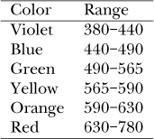

图 A-25. 颜色波长

简单的（或*单色*）颜色通过其波长来表征，且可见光谱中的波长范围有着常见的名称。在图 A-25 中，它们以纳米（nm）为单位给出。请注意，这些范围是任意的近似值且不规则：例如，紫色的范围是 60 nm，黄色是 25 nm，红色则为 150 nm。

此外，我们的视觉感知系统并不是为了区分简单颜色和复杂颜色而设计的。例如，580 nm 的纯光是黄色的。但眼睛无法区分这种纯黄色与通过特定的红绿混合获得的黄色。此外，自然界中的大多数颜色并不是简单的颜色。你在彩虹中找不到粉色、棕色或紫色。而白色、黑色以及所有灰色的色调也是图像中出现的“颜色”，因为我们能够感知它们。

所以大多数真实颜色不是单色的，而且我们的感知系统无法区分单色和恰当混合的颜色。问题在于，使用三个数字表示有限子范围的方式无法表示所有可见的颜色。例如，想象这三个数字是三维空间中的坐标。由于坐标被限制在子范围[0 到 255]内，每个点都会位于一个边长为 256 单位的立方体内部。这个立方体的边和角落有不同的含义，具体取决于使用的模型，我们将在下一节讨论。但立方体外的点是无法表示的。

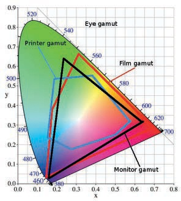

版权：Wikimedia Commons

图 A-26. CIE 色度图

在给定系统中可以表示的完整色域称为*(色彩)色域*。国际照明委员会（CIE）定义了一个可见色彩的模型，如图 A-26 所示。在马蹄形曲线沿线我们可以找到完全饱和的彩虹色，蓝色数字表示对应的波长（单位为纳米）[400-700]。底部的直线是紫色边界。该图的内容是基于正常人类视觉的整个可见色彩集。

材料色彩，例如通过混合有色油漆得到的颜色，具有更多的可能性（更大的色域），因为黑色或白色可以与这些颜色混合。因此，它们需要图中另一个维度，从黑到白的值。

这个图实际上不可能完全准确地表示，特别是在印刷书籍中。（它过于突出绿色，而对黄色的表现不足，白点位于某个中心位置，实际上并不是白色。）但是，色度图可以用来显示设备的色域（如图 A-26 所示）。一些设备的色域比其他设备更大，但所有设备的色域都小于完整的可见色域。最小的色域属于常见的喷墨打印机，它尤其难以表现生动的颜色。黑色三角形对应于阴极射线管（CRT）显示器，而液晶显示设备的色域则非常相似。

## 压缩

了解图像文件的大小很重要，无论图像是存储在内存、磁盘、CD 还是 USB 闪存中。过大的文件会填满小的存储空间或使处理器变慢。但更重要的是，要了解将在屏幕上显示或打印出来的图像的大小，因为图像文件是为显示而创建的。

例如，假设我们有一张 1024 × 768 像素的图像（即，一块相当小的计算机屏幕的大小）。这张图像包含 786,432 个像素。如果图像是灰度图（有时错误地称为单色或黑白图像），其文件大小以字节为单位与像素数相同（大约 768KB）。如果图像是彩色的，则每个像素至少需要 3 个字节，文件大小将大约为 2.3MB。

在 100 像素每英寸分辨率的 LCD 屏幕上，这张图像显示为一个大约 10 × 8 英寸的矩形。但在分辨率为 600 像素每英寸的激光打印机上，图像的大小将只有 1.7 × 1.28 英寸。

表示设备（例如打印机）的定义是基础性的，要打印出比缩略图更大的精美图像，必须生成较大的文件。现代数码相机可以拍摄 1000 万像素或更多的单张图像。使用这些相机拍摄的彩色图像至少为 30MB。这个大小的文件，正常 CD 最多只能存放 25 张照片，而 DVD 最多只能存放不到 150 张。这对于通过电子邮件轻松发送给朋友和家人来说也太大了。

因此，压缩图像是必要的。有两种主要的压缩技术：*无损压缩*，即不丢失数据，图像保持初始状态不变；和*有损压缩*，即发生一定的数据丢失，结果图像的质量低于原始图像。

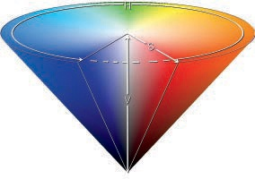

版权归：Wikimedia Commons

图 A-27. 具有连续色彩变化的图像

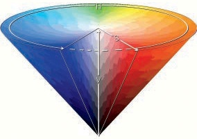

图 A-28. 相同图像减少到 256 种颜色

仅当图像包含大量冗余信息时，无损压缩才会在有效地减小图像大小。这通常发生在图像文件使用*索引表示*时。索引图像中不同颜色的数量是有限的，这些颜色存储在*颜色映射表*中。像素在该颜色映射表中作为索引表示，从而生成具有许多相同像素的图像。索引的优点是无损压缩率非常高，尽管整体图像质量本质上比直接表示的要差。例如，图 A-27 展示了一幅具有连续色彩变化的图像。图 A-28 展示了将其转换为 256 种颜色（最大值）的索引模式后的相同图像。有关索引和颜色映射表的更多信息，请参见第十二章和第二十章。

有许多图像压缩格式可用，但这里我们仅讨论三种：

+   GIF 是一种索引格式，具有所有相关的缺点。它提供无损压缩，但如果将具有连续色彩变化的图像导出为 GIF，索引过程中会丢失信息。GIF 图像也不能包含连续的透明度。该格式最适合用于图表、线条图和简单的动画。

+   JPEG 是一种非索引格式，采用有损压缩技术，用户可以调整压缩率。JPEG 是照片的首选格式，并且大多数数码相机将其作为输出格式。

+   PNG 格式可以用于索引图像和非索引图像。在进行索引时，PNG 具有与 GIF 相同的特性，但压缩率更好，并且能够表现连续透明度。但 PNG 不能表现动画。对于非索引图像，它提供无损压缩，最终图像质量比 JPEG 压缩更高，但压缩率较低。

文件格式会对图像的大小和质量产生重大影响。以下是选择图像格式时的一些通用建议：

+   如果你自己制作了图像，并且图像主要由线条、文本和平面颜色组成，使用索引 PNG 格式。要小心地构建色彩图。

+   如果你制作一个简单的动画，可以将其保存为 GIF 格式。

+   如果图像是照片，在大多数情况下选择 JPEG 格式。但如果需要在照片上添加文字，选择 PNG 格式。不要将质量率调高到 85 以上，因为这样会增加文件大小，却没有明显效果。而且，不要将同一图像多次转换为 JPEG 格式，因为图像的退化是累积的。

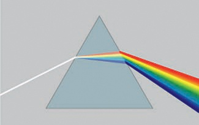

来源：维基共享资源

图 A-29. 通过折射分解光线

# A.3 颜色表示

在自然界中，物体要么是半透明的，要么是反射性的，要么是不透明的，并且它们有着独特的色调。以下是一个简单的颜色解释：当阳光照射到物体时，物体会吸收太阳光谱的一部分，并将其余部分反射回来给观察者。物体不吸收的颜色——即它反射的颜色——就是你所看到的颜色。但并不是我们看到的所有可见光都来自太阳。闪电、火焰和磷光生物都会产生它们自己的光。此外，许多其他自然现象也会导致可见色彩的出现。

## 颜色是如何产生的

颜色可以通过以下几种方式生成：

+   ***通过折射产生的颜色：*** 当光线通过折射材料时，它会以一种依赖于其波长的模式分裂。由于白光是由所有可见波长的光线组合而成，因此它会被分解成一系列颜色的彩虹。你可能见过这种现象，当光线通过一个棱镜时，由于棱镜的非平行面增加了光的折射（参见图 A-29）。但当光线通过一个平行四边形的玻璃块时，玻璃块的两面平行，第一面折射光线，第二面则将光线重新聚焦成白光。

+   ***彩虹：*** 既通过反射又通过折射产生的颜色现象的一个独特案例就是彩虹。太阳光通过大量微小的水滴折射。这些水滴是球形的，它们均匀地分散色彩，如图 A-30 和图 A-31 所示。直接折射会产生主要的彩虹。当光在水滴底部反射后，再次发生间接折射时，就会形成副彩虹。图 A-32 中展示了双彩虹的现象。

    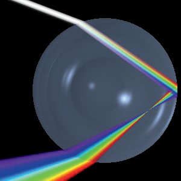

    版权：Wikimedia Commons

    图 A-30. 水滴中的直接光传播

    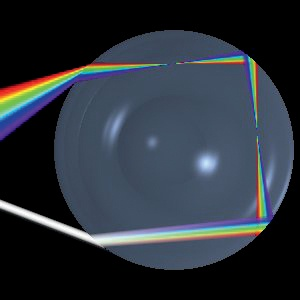

    版权：Wikimedia Commons

    图 A-31. 水滴中的间接光传播

    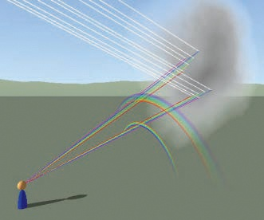

    版权：Wikimedia Commons

    图 A-32. 光线的传播、反射和云滴中的折射

+   ***通过扩散产生的颜色：*** 当光通过一个包含许多微小粒子的空间时，例如大气层，它会发生扩散。扩散的动态取决于粒子的大小以及通过的光波长。有些波长的光会被随机方向扩散和反射，有些会被吸收，而有些则会通过。最常见的颜色扩散现象之一就是蓝天。光在大气层中传播时，大多数较长波长的光（如红色、橙色和黄色）会直接穿透。然而，大部分较短波长的蓝色光会被气体分子吸收。被吸收的蓝光随后会被辐射出来，并在各个方向上散射。散射的光充满了整个天空，使天空呈现蓝色。

+   ***干涉产生的颜色：*** 光线部分被薄的半透明材料的第一面反射，剩余的光透过材料并被材料远端的第二面反射。来自两面的反射光结合在一起，依据材料的厚度（面与面之间的距离），波长要么被放大，要么被取消。产生的现象叫做*干涉*，可以在肥皂泡、珍珠母（参见图 A-33）、油膜覆盖的水洼和其他闪亮的表面上看到。颜色的变化依赖于观察角度，如果材料是有刺的，它可能会产生彩虹色。孔雀尾巴的艳丽色彩（参见图 A-34）是由干涉产生的，蝴蝶翅膀上的色彩也是如此。孔雀羽毛和蝴蝶翅膀都是有刺的表面，因此它们展现了彩虹色。

    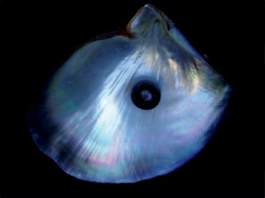

    版权来源：维基共享资源

    图 A-33. 通过贝壳和黑珍珠的干涉产生的颜色

    

    版权来源：维基共享资源

    图 A-34. 通过孔雀尾巴的干涉产生的颜色

    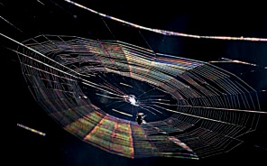

    版权来源：维基共享资源

    图 A-35. 通过蜘蛛网的衍射产生的颜色

+   ***衍射产生的颜色：*** 当光线绕过物体或通过一个非常小的孔或缝隙时，光的路径发生变化，就像水流绕过岩石或从窄小的小溪流入湖泊一样。光通过障碍物时的路径依赖于波长。白光被分解成一系列颜色。这种效果通常较为微妙，但在某些条件下，你可以在蜘蛛网的丝线上看到衍射产生的颜色（参见图 A-35）。

由折射、扩散、干涉或衍射产生的颜色的主要特点是它们是被动的，因此只能从太阳光谱中呈现出*子范围*的颜色。如果单一颜色的光经历这四种过程之一，结果将是相同的颜色。在这个过程中不会产生其他颜色。

当我们人为地创造一个图像来表示我们所见的事物时，我们无法使用这些现象，因为我们不能轻易地生成所需的所有颜色。因此，我们使用色光发射体，比如阴极射线管上的荧光粉，或者只有对特定颜色透明的物体，比如液晶显示器上的液晶。我们还可以使用不透明的材料，如油漆或马赛克瓷砖，它们只反射某些特定颜色。最终，材料的颜色是通过以下三种方式之一来决定的：

+   ***发射色：*** 太阳看起来是白色的，因为它发射所有可见频率的光（还有许多不可见频率的光）。白炽灯泡或荧光灯管的光谱类似于太阳。阴极射线管屏幕上的荧光粉像素在特定波长下发射光。

+   ***反射色：*** 反射出来的波长是唯一可见的，其他的都被材料吸收。材料的颜色取决于它接收到的光：在正常的阳光下，一块粉笔或一张纸看起来是白色的，因为它接收的是白光并反射所有可见波长。但在红光下，它们看起来会是红色的。

+   ***吸收色：*** 对于半透明材料，如水和冰，只有通过材料的波长是可见的——其他波长都被吸收。例如，如果一块海冰比其他波长吸收较少的绿色波长，它看起来就是绿色的。再一次，只有当某一频率的光存在于照射到材料上的光中时，它才是可见的。

我们看到的颜色是在刚才给出的三种例子中通过不同方式创建的。在反射色中，一个反射所有波长的材料是白色的，一个什么都不反射（吸收所有波长）的材料是黑色的。在吸收色中，一个吸收所有波长的材料是不透明的，而一个不吸收任何波长的材料是透明的。蓝色油漆反射蓝色频率并吸收其他频率。蓝色玻璃也吸收除蓝色外的其他频率，但与蓝色油漆不同，给玻璃上色的蓝光会通过玻璃到达我们。这些概念导致了不同的颜色表示模型：加法模型、减法模型和 HSV 模型。

## 加法模型

*加法模型* 不是最直观的，但它是最自然的。它对应于发射色和我们眼睛感知颜色的方式。

我们已经看到，视网膜上有三种类型的视锥细胞，分别对红、绿、蓝光敏感。这些就是加法模型的三种基本颜色。它们也被用于计算机显示屏（包括 CRT 和 LCD 屏）：每个像素包含三个子像素，分别发射红光、绿光或蓝光。

该模型通常被称为*RGB*。在屏幕上，每个子像素的相对光强决定了产生的颜色。如果三个子像素都达到最大强度，就会产生白光。如果它们都达到最小强度，则产生“黑光”（即没有光）。如果它们都处于最小值和最大值之间的某个相等水平，则产生灰光。较低的强度会导致最终颜色变暗。

请注意，尽管太阳发出的白光包含可见光的完整波长范围，但当只有三种波长存在时，我们仍然感知到白色。每当三种锥体类型完全被刺激时，我们就会感知到白色。

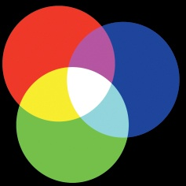

图 A-36. 加法模型

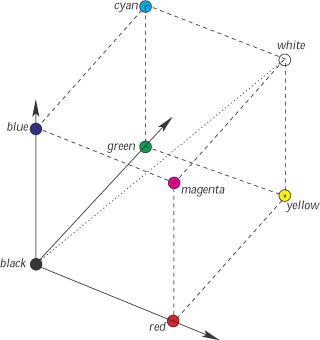

图 A-37. RGB 立方体

如果只有一个基本颜色的子像素发光，我们就看到那个颜色。如果两个不同的子像素发光，我们就会看到*互补色*，如图 A-36 所示。红色和绿色产生*黄色*，红色和蓝色产生*品红*，绿色和蓝色产生*青色*。这三种互补色也以单色的形式存在：它们在太阳光谱中作为单一波长出现。

由于三个基本颜色值处于一个有限的子范围（通常是[0 到 255]），它们在三维空间中定义的点被限制在一个立方体内，如图 A-37 所示。这个立方体的角落标注了基本颜色、二级颜色以及黑色和白色。连接黑色角落（坐标 0,0,0）到白色角落（坐标 255,255,255）的对角线是*灰度对角线*。每个点都与其*互补色*的点相对。

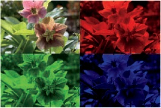

图 A-38. RGB 通道分解

RGB 立方体定义了计算机屏幕上可以表示的所有颜色的色域。这个色域比我们可以感知到的可见色域要小，如图 A-26 所示。

图 A-38 展示了一张分解为三个 RGB*通道*的图像。较亮的区域表示对应通道更为活跃的区域。

RGB 模型并不直观：它需要一个信念的飞跃或一些深入思考，才能接受将红色和绿色相加会产生黄色这一事实。大多数人将颜色视为颜料。当你混合红色和绿色油漆时，你得到的颜色更接近棕色，如果你混合红色、绿色和蓝色三种基本颜色，你得到的颜色会更暗，而不是白色。颜料并不遵循加色模型。

RGB 模型的另一个挑战是匹配特定颜色的困难。例如，我们如何得到粉色玫瑰、纯铜或红木的颜色？答案可能是粉色玫瑰为 248,192,236；铜为 198,113,76；红木为 100,0,0。所有这三种材料看起来都以红色为主，但粉色和铜却需要意外大量的绿色和蓝色。（而红木只需要少量的红色。）显然，一个更直观的模型会让图像创建变得更容易。

图 A-39. 减色模型

## 减色模型

*减色模型*（也称为 *CMY 模型*）用于通过吸收产生颜色，就像颜料一样。它的三个基本颜色是 RGB 模型中的互补颜色：青色、品红色和黄色。每种基本颜色吸收一定波长的光。如果三种颜色都达到最大值，它们会产生黑色。如果它们的值都是零，它们会产生白色。这个模型假设我们是在给白色表面添加颜色。

图 A-39 显示了三种基本颜色及其组合。CMY 模型的互补色是 RGB 模型的基本颜色：青色加品红色是蓝色，青色加黄色是绿色，品红色加黄色是红色。当所有基本颜色的强度都很低时，颜色会变得褪色。

CMY 立方体（见 图 A-40）是 RGB 立方体的互补：角落里是相同的颜色，但坐标值是 RGB 坐标的互补。色域是相同的，因为立方体是相同的。

图 A-41 显示了与 图 A-38 相同的图像，但已分解为其三个 CMY 通道。如前所述，较浅的区域表示更活跃的通道，但在这种情况下，当所有通道都活跃时，某个区域会变暗，这使得通道看起来具有负片效果。

CMY 模型是打印的原生模型。基本颜色的微小点打印在纸上，它们的并排排列产生了减色法的效果。透明墨水也可以在重叠的层次中使用，以产生类似的效果。但使用三种基本颜色生成良好的黑色是困难的，且黑色墨水相对便宜，因此大多数打印机也包括黑色，并使用*CMYK 模型*（*K*代表黑色）。

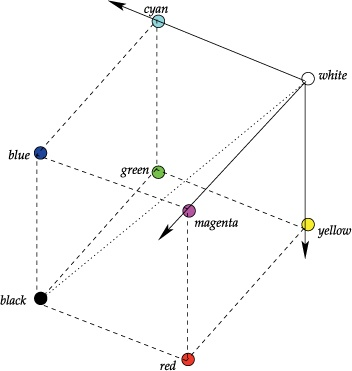

图 A-40. CMY 立方体

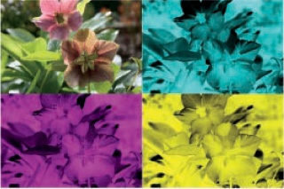

图 A-41. 分解成 CMY 通道

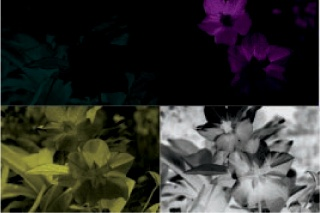

图 A-42. 分解成 CMYK 通道

这四个通道的值可以通过 CMY 值轻松计算得出：*K*是给定像素中三个通道的最小值（最低值），其他通道则用其值减去*K*来替代。有时，打印机需要较低的*K*值，并对其他三个通道进行相应的调整，以避免过于暗淡或湿润的打印。在这些情况下，其他通道的值是通过一种保持颜色尽可能准确的方式来计算的。

图 A-42 展示了与图 A-41 相同的图像，但它被分解成了四个 CMYK 通道。我们看到 CMY 通道比在图 A-41 中要暗得多，这意味着打印这张图像所需的墨水要少得多。

低成本喷墨打印机仅使用 CMYK 模型的四种墨水颜色。随着打印机质量和成本的提高，墨水颜色的数量通常也会增加。中档打印机常常增加浅青色和浅洋红色墨水。高端打印机，主要用于专业摄影，增加了几种灰色和黑色墨水，以增强不饱和颜色。

## HSV 模型

无论是 RGB 模型还是 CMY 模型，都不太直观。使用这些模型时，要确定给定颜色的纯度、强度或色调是困难的，因为每种颜色都是以三维坐标的抽象方式表示的。

事实上，一些研究表明，我们的视觉系统并不仅仅将三种锥体发出的三种信号传递到大脑。*R*、*G* 和 *B* 信号首先被组合成 *R* + *G*、*R* – *G* 和 *B* – (*R* + *G*)。*R* + *G* 信号对应于所谓的 *亮度*。亮度相当于颜料颜色中的数值维度，从黑色到白色。蓝色成分不参与感知色彩的明亮或暗淡，可能是因为视网膜中蓝色锥体的比例非常小。另两个值（*R* – *G* 和 *B* – (*R* + *G*)）代表 *色度*，即颜色的色相。这些概念为 CIE 标准和在 图 A-26 中展示的色度图做出了贡献。

*HSV 模型* 基于这些概念，并设计为一种更直观的方式来表示颜色。在 HSV 和其他两种模型之间需要进行转换，但任何现代计算机都可以轻松处理所需的计算。当你想选择颜色或为项目构建配色方案时，这个模型是最好的选择。CMYK 模型仅在打印时有用，事实上，大多数打印软件工具会在最后一刻进行必要的转换，使用与所用打印机相关的特定信息。RGB 模型是一个非常重要的模型，因为所有图像都内部使用它来表示。总结一下，图像是以 RGB 存储的，HSV 模型提供了一种直观的方式来选择颜色，而打印软件通常会在打印前将图像转换为 CMYK。

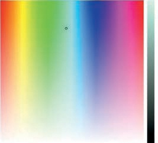

图 A-43. HSV 模型

现在让我们更仔细地看看 HSV 模型，它在 图 A-43 中展示。它包含三个坐标：

+   H 是 *色相*。色相是色轮上的一个值，范围从 0 到 360 度。红色是 0°，随着角度的增加，色相的波长逐渐减小。

    图 A-43 将色轮表示为展开的圆柱体。“角度”从左侧的 0 增加到右侧的 360。大多数显示的颜色是单色的，除了紫色，它出现在红色和紫色之间的过渡处。

+   S 是 *饱和度*。饱和度以百分比表示：完全饱和（纯色）是 100%，白色（无色）是 0%。随着百分比的减少，颜色变得更加褪色。在 图 A-43 中，饱和度通过展开圆柱体的垂直维度表示，从 0（底部）到 100（顶部）。

    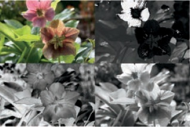

    图 A-44. 分解为 HSV 通道：从左上角可以看到原始图像及其 H、S 和 V 通道。

+   V 是*值*。值也是一个百分比：完全亮度为 100%，黑色（无亮度）为 0%。当百分比降低时，颜色变暗。在图 A-43 中，值是右侧的垂直条，从 0（底部）到 100（顶部）。

图 A-43 中的小圆圈指定了一个精确的颜色（略微去饱和的青色）。值条在顶部显示此色调，并随着向下移动而变暗。

图 A-44 显示了将图像分解为 HSV 模型的三个通道。由于 H 和 S 通道在这里以灰度图像表示，因此它们并不真正具有意义。但 V 通道是图像在灰度中良好的表示。

以图形方式表示 HSV 模型与 RGB 模型之间的关系并不容易。图 A-45 显示了 HSV 圆和其在 RGB 立方体中的向量。

HSV 模型定义的空间被表示为一个圆柱体。但黑色填充了圆柱底部的整个区域。锥形表示法，如图 A-27 所示，通过将黑色表示为圆锥的顶点，将白色表示为顶部圆圈的中心，消除了这种冗余。

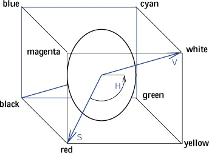

图 A-45. RGB 立方体中的 HSV 模型

# A.4 练习

到目前为止，我们仅展示了理论信息。但是，本附录中的插图是你可以使用像 GIMP 这样的工具所能完成的好例子。我们创建了一些插图是使用矢量图形程序，而不是 GIMP。例如，图 A-1 和图 A-37 就是这种情况。我们还在维基共享资源中找到了其他图像。然而，我们确实使用 GIMP 构建或编辑了几张图像。通过以下练习，你可以开始探索 GIMP 的潜力，尽管你可能在阅读本书的其他章节之前无法完成这些练习。

**练习 A.1.** 我们通过 GIMP 中的图 A-13，以图 A-9 为起点，创建了图 A-10。你会如何做呢？

**练习 A.2.** 我们在 Wikimedia Commons 上找到了 CIE 色度图。你如何使用这张原始图像来制作类似于图 A-26 的图像呢？

**练习 A.3.** 图 A-36 和图 A-39 完全是用 GIMP 创建的。试着重新创建它们。

**练习 A.4.** 使用你自己的照片或图片，尝试重新制作展示图像分解为各个通道的图像，例如图 A-38。
