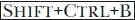

# 附录 D. 常见问题解答

本节回答了一些我们最常遇到的问题。许多信息也可以在本书和 GIMP 文档中找到，但本附录提供了快速参考。

一些常见问题没有被涵盖，因为导致这些问题的原因已经在最新版本的 GIMP 中解决。例如，你再也不会在保存图像时丢失图层、路径、通道、选择、引导线、图层蒙版等，因为你只能以 XCF 格式保存，它会保存所有这些图像组件。即使图像不是索引表示，也不再禁止将图像导出为 GIF 格式，因为转换将自动（且默默地）完成。即使图层没有 Alpha 通道，你现在也可以为其添加图层蒙版。文本换行也变得很容易，因为新的和改进的文本工具提供了固定框选项。

其他常见问题涉及缺失的功能，许多这些功能已经添加到 GIMP 2.8 中（在引言中有提到）。当然，一些用户会发现他们等待的功能尚未添加，他们需要等到 GIMP 3.0 版本。有些常被请求但尚未添加的功能在以下问题的回答中有所涵盖。

# D.1 未来会怎样？

GIMP 开发的下一个主要步骤是全面集成 GEGL，目前的版本仅部分使用 GEGL，而且对普通用户几乎不可见。当 GIMP 完全支持 GEGL 时，将包含以下功能：

+   支持每通道 16 位表示法。

+   非破坏性编辑，允许在不改变原始内容的情况下进行变换（在一些栅格图形应用中称为*调整图层*，在其他应用中称为*基于节点的工作流程*）。

+   直接使用 CMYK 颜色表示法。

正在开发的其他功能包括一个合并变换工具，它将取代现有的五个变换工具（缩放、旋转、剪切、翻转和透视）；一个类似于 IWarp 滤镜的交互式变形工具，并将纳入 GIMP 的核心；以及对先进图形绘图板的更好支持，这将允许用户使用多个触控笔，并为特定的绘图工具进行定制。

# D.2 如何...？

## 如何绘制直线？

GIMP 没有专门的直线绘制工具，但你可以使用任何绘图工具绘制直线。选择绘图工具并设置参数后，点击直线的第一个点，然后按下  键并放置终点。你甚至可以通过按下  并在形状的每个角落点击，绘制多边形。

## 如何绘制圆形？

我们在绘制椭圆和矩形中详细解释了这一点。最简单的解决方法是对圆形选区进行描边，但您也可以创建一个环形选区并填充它，或者将其转换为路径并对其进行描边。

## 如何在文本周围创建轮廓？

最直接的解决方法是从文本中创建一个路径（使用文本图层的图层菜单），然后用绘画工具和任何您想要的选项对这个路径进行描边。

## 如何将图像中的选区保存为文件？

假设您构建了一个复杂的选区并希望将其保存为一个新图像。复制它，然后选择**图像: 编辑 > 作为 > 新图像粘贴**，或按下。然后保存这个新图像。

## 如何将另一个文件中的图像与当前图像合并？

选择**图像: 文件 > 作为图层打开**，或按下。您也可以将图像缩略图从文件管理器或浏览器拖到当前图像上，它将作为新图层添加到其中。

## 如何让小字体看起来像大字体一样漂亮？

通常来说，在光栅图像中使用小字体不是一个好主意。创建一个较大的图像，使用比例合适的字体，然后再将其缩放到适当的大小是更好的选择。无论哪种方式，都要在文本工具选项中勾选抗锯齿复选框，并为提示选择“NONE”以外的任何选项。

## 如何设置键盘快捷键？

您可以通过两种方法设置键盘快捷键。更安全的方法是选择**图像: 编辑 > 键盘快捷键**。然后，您可以选择您想要定义快捷键的命令，并输入快捷键。

另一种方法是打开**图像: 编辑 > 首选项**，选择“界面”页面，并勾选“使用动态键盘快捷键”选项。一旦勾选了该选项，您可以通过选择对应命令的菜单项并输入所需的快捷键来定义新的快捷键。然而，请不要一直勾选此选项，因为不小心更改现有快捷键是很容易的。

## 如何设置 GIMP，使得点击某个图层中的元素时该图层变为活动？

一种方法是选择**图像: 编辑 > 首选项**，选择“工具选项”页面，并勾选选项“将图层或路径设置为活动”。完成此操作后，使用移动工具移动图层时，它会变为活动图层。请注意，以这种方式操作可能会变得有些混乱。

## 如何用透明度填充图层或选区？

首先，您要添加透明度的图层必须具有 Alpha 通道，您可以通过图层菜单或在**图像: 图层 > 透明度**中添加该通道。如果 Alpha 通道存在，剪切或删除选区，或使用擦除工具时，颜色会被透明度替换。例如，如果您使用“按颜色选择”工具，然后剪切选区，所有选中的颜色像素都会被透明度替换。

另一种方法是应用**图像: 颜色 > 颜色到透明**。

## 如何用不同的颜色绘画？

画笔的颜色是唯一一个不在其选项对话框中选择的绘画工具选项。画笔使用前景色，你可以通过点击工具箱左下角的颜色样本来更改前景色，从而打开颜色选择对话框。在这里，你有多种方法来选择新颜色。

## 如何为我的图像添加模糊效果？

如果你想模糊选择区域或图层，打开**图像：滤镜 > 模糊**子菜单，并选择其中一个可用的滤镜。如果你只想模糊图像的一小部分，可以使用模糊/锐化工具 ()。

## 如何沿着矩形的轮廓绘画？

首先使用矩形选择工具 () 来构建矩形的轮廓。然后选择**图像：编辑 > 描边选择**，这允许你选择描边的所有细节。

## 如何移动现有的引导线？

选择移动工具 ()，然后点击并拖动你想要移动的引导线。如果这移动了活动图层，请更改工具切换选项或按下 。

## 如何去除浮动选择？

你可以通过三种方式去除浮动选择：删除它（如果不需要的话）；将其锚定到之前活动的图层或通道；或用它创建一个新图层。所有这些操作都可以在图层菜单中找到，可以通过右键点击图层对话框来访问。你也可以直接通过**图像：图层**菜单或点击图层对话框底部的按钮来访问它们。

## 如何在透明区域绘画？

必须取消勾选锁定 alpha 通道按钮。这个按钮是“锁定”开头的行中从左数起的第二个按钮，位于图层对话框中。

## 如何查看行进的蚂蚁并知道我的选择是否已完成？

确保**图像：视图 > 显示选择**选项已勾选。 切换此可见性。

## 如何为黑白图像添加颜色？

使用**图像：图像 > 模式 > RGB**将图像模式更改为 RGB。

## 如何将我的照片调整为精确的尺寸，比如 5 × 7 厘米？

简短的回答是，这在打印图像时完成，使用你的打印软件，而不是通过 GIMP。

你可以轻松调整屏幕上照片的大小，但这不会改变它在网站上的大小或打印时的大小。

网站上照片的大小取决于它的像素尺寸和用于查看它的屏幕的定义，而后者是无法控制的。举例来说，照片在智能手机、液晶显示器和 CRT 显示器上会有不同的大小。

打印照片的尺寸可以在打印界面中选择。你可以通过更改打印定义来改变打印的尺寸，或者可以改变打印的最终尺寸，这样会改变定义。无论如何，打印尺寸通常与屏幕上的查看尺寸差别很大。

## 我怎么设置前景色为图像中的某个颜色？

最简单的方法是用其中一个绘画工具右键单击图像，这样你点击的颜色就会成为新的前景色。

## 我怎么保持文本在缩小时依然清晰？

只要文本没有被光栅化，它应该在缩放时不会丧失质量，因此在图像完成之前不要将文本图层与底层图层合并。

## 我怎么将图层蒙版复制到另一个图层蒙版上？

就像你处理其他组件一样（或在 GIMP 行话中称为 *可绘制对象*）：激活图层蒙版（通过点击图层对话框中的缩略图），选择它（使用任意选择工具），复制它（），激活目标图层的图层蒙版，粘贴（），然后锚定（）。

## 我怎么查找特定的字体、画笔或图案？

如果列表很长且你知道字体、画笔或图案的名称，按下 （或者有时是 ），然后输入名称的首字母。你还可以使用标签来限制列表的大小，例如，在选择纹理类别中的画笔时。

## 我怎么用除了橡皮擦之外的工具擦除？

假设“擦除”是指用透明度替换。活动图层必须有一个 Alpha 通道（其名称在图层对话框中不会以粗体显示）。选择你的绘画工具、画笔及所有选项，但将工具模式更改为颜色擦除。然后，你将前景色的像素替换为透明度。**图像: 颜色 > 颜色到 Alpha** 会将前景色替换为透明度，覆盖整个图层或选择区域。

## 我怎么用缩放工具放大图像？

缩放工具可以放大当前选择的区域或图层。要放大图像，请应用 **图像: 图像 > 缩放图像**。或者，如果你只想在屏幕上查看更详细的图像，可以选择缩放工具。

## 我怎么找到不小心关闭的对话框？

所有的对话框都可以通过 **图像: 窗口 > 可停靠对话框** 来打开。如果你关闭了一个包含多个对话框的停靠窗口，请选择 **图像: 窗口 > 最近关闭的停靠窗口**。

一些对话框也可以通过快捷键直接访问： 打开工具箱； 打开图层对话框； 打开渐变对话框； 打开画笔对话框； 打开图案对话框。双击工具箱中的工具图标会打开该工具的选项对话框。

## 如何在不改变颜色的情况下反转灰度值？

复制图层。然后反转下方图层的颜色，并将上方（未更改）图层的图层模式设置为颜色。

## 如何使用定义的纵横比进行裁剪？

查看裁剪工具的工具选项。勾选固定框，并在右侧的字段中选择纵横比。然后，在下面的字段中输入一个纵横比，如 4:3 或 5:8。

# D.3 为什么...？

## 为什么有些滤镜名称是灰色的？

大多数滤镜只适用于 RGB 图像。检查**图像：图像 > 模式**的状态，如果需要，可以将其更改为 RGB。有些滤镜有其他要求。例如，**图像：滤镜 > 增强 > NL 滤镜**在当前图层有 Alpha 通道时会变灰。

## 为什么没有任何反应？

如果你在编辑图像时发现操作似乎没有效果，请检查以下几点：

+   是否有浮动选择？如果有，你需要删除浮动选择或者将其放入一个图层中，才能进行其他操作。

+   你想修改的图层是否为活动图层？活动图层在图层对话框中会有所突出显示。

+   选择可能不可见，要么是因为它太小，要么是因为它没有显示。尝试按下切换选择的可见性，或者按下取消任何现有的选择。

+   你的当前图层是否有一个活动的图层蒙版？如果有，你将在图层对话框的图层行中看到这个图层蒙版的缩略图，缩略图框架为白色。点击图层缩略图使图层变为活动图层。

+   你的当前图层是否完全不透明并且处于正常模式？检查其**不透明度**滑块及其在图层对话框中的模式。如果需要，向右移动滑块或更改模式。

+   是否有活动的绘画动态？例如，基本动态将不透明度与压力关联，如果你使用的是鼠标，压力非常小。根据你打算做什么，要么切换到“关闭动态”，要么使用平板的手写笔。

## 为什么当我尝试剪切、粘贴或对选择应用滤镜时什么也不发生？

你可能在更改一个不可见的图层。不可见的图层仍然可以是活动的，这可以通过图层对话框中该图层的高亮显示来指示。你所执行的任何操作都会在活动图层上进行。图层的可见性由图层行左侧的眼睛图标指示。如果眼睛图标没有显示，说明该图层是不可见的。点击图标以恢复图层的可见性。

## 为什么我不能修改我通过保存选择建立的通道？

选择可能仍然处于活动状态。如果是这样，你将无法更改选择范围之外的通道区域。按下  或选择 **图像：选择 > 无** 来使其变为非活动状态。

## 为什么我在将选择保存为通道后无法更改我的图像？

通道现在是活动的，所以你没有活动图层。在图层对话框中，选择你想要更改的图层。

## 为什么当我尝试在图层蒙版上绘画时，我的画笔痕迹会出现在图像上？

因为图层是活动的，而图层蒙版不是。点击图层对话框中的图层蒙版缩略图，确保它被白色框住，这表示它是活动的。

## 为什么在我将文件导出为 100% 质量的 JPEG 格式时，文件大小会增加？

JPEG 的质量实际上不是一个百分比；它仅仅有一个从 0 到 100 的范围。保存时使用大于 85 的质量（GIMP 中的默认值）通常是没有意义的。数码相机通常以更高的质量保存图像，因此将图像保存为 85 可以在不明显损失质量的情况下减小文件大小。

## 为什么我选择的颜色无法绘制？

比如说，如果你选择了深蓝色，但线条是用黑色或白色绘制的，可能是因为你的图像处于索引模式，而该深蓝色不在当前的索引调色板中。通常，你应该在 RGB 模式下工作，并且仅在图像完成后才切换到索引模式。这个规则的主要例外是当你准备像纺织品设计这样的图像时，该图像的颜色集非常有限。
