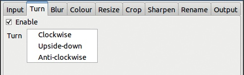
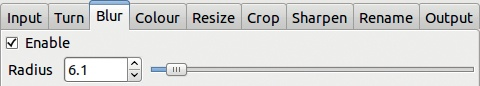
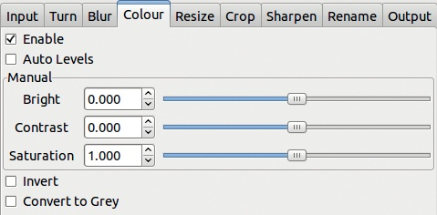
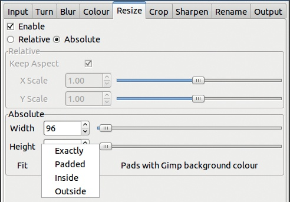
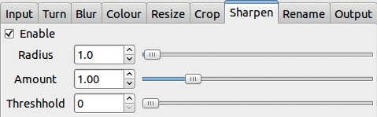
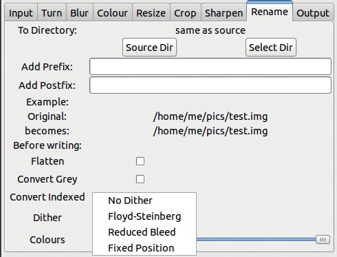
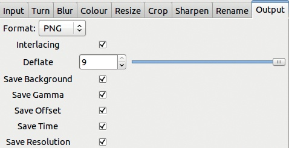
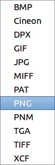

# 附录 F. 批处理

在某些情况下，你可能想要同时编辑多个图像，例如，将它们从一种格式转换为另一种格式、改变它们的大小或应用滤镜。如果你需要对数十张图像执行相同操作，一遍遍地重复这个过程将是乏味且费时的。幸运的是，计算机在自动化重复性工作方面表现出色。记住：如果你在电脑上做的是重复性的工作，那么可能有更好—更快—的方式来完成它！

自动将更改应用于一系列图像，一次接一次，这叫做*批处理*。在这里，我们将讨论三种同时转换多个图像的方法。第一种方法通过命令行完成，只能在相对简单的情况下使用。第二种方法使用插件，但只适用于少量简单操作。最后一种方法使用独立的应用程序。

# F.1 GIMP 批处理模式

命令行用于输入文本命令，允许用户完全访问操作系统的所有功能。许多图形界面实际上是访问简单文本命令的复杂方式。要使用命令行，你需要打开一个终端窗口，在其中输入命令。*终端*是图形界面中的纯文本窗口。输入命令后，按下回车键，你将获得结果或答案。有些命令是交互式的，会提问并显示答案，其他命令则直接执行你请求的操作。

命令行的功能与*shell*（即在 GNU/Linux 中打开终端窗口并输入命令的交互程序）密切相关。shell 接受一种具有多种功能的命令语言。某些 shell 命令可用于将相同的过程应用于多个文件（在我们的例子中是图像文件），其中包括一个可以重复调用另一个命令的命令，适用于文件夹中的所有文件，或者使用带有*通配符*的单一命令应用于文件的子集。通配符是可以代表一个或多个字符的符号。

Mac OS X 用户享受与 GNU/Linux 完全相同的功能，因为 Mac 是基于 Unix 的系统。然而，在 Windows 中，命令语言较为简陋，因此命令行的实用性比 GNU/Linux 或 Mac 上要有限。

当你通过命令行使用 GIMP 时，使用选项和参数。*选项*指定动作或参数，*参数*是应用动作的文件名称。

当在命令行中使用 GIMP 批处理模式时，你需要指定以下选项：`-b` 表示批处理，`-i` 表示在没有用户界面的情况下运行。`-b` 选项需要一个参数，即要执行的命令。完整的调用形式如下：

```
gimp -i -b '*command*' *files*
```

该命令使用 Script-Fu 语言编写，详见 Scheme。如果你想在命令行中逐行编写简短的脚本，可以使用以下格式：

```
gimp -i -b - *files*
*commands*
```

然后在接下来的行中输入脚本。

你也可以定义一个新的 Script-Fu 函数，并从命令行调用它。在这种情况下，`file-glob`插件很有用：它根据指定的编码模式返回与该模式匹配的文件名列表。要查看示例，请参见 *[`www.gimp.org/tutorials/Basic_Batch/`](http://www.gimp.org/tutorials/Basic_Batch/)*。

# F.2 David 的批处理器

从命令行调用 GIMP 并使用 Script-Fu 语言控制它可能会让人感到困难，除非你有一定的编程经验。David 的批处理器（David’s Batch Processor，简称 DBP）为那些不太愿意编写代码的人提供了一个替代方案。对于 Debian 和 Ubuntu GNU/Linux 发行版，David 的批处理器插件已包含在名为`gimp-plugin-registry`的包中。否则，访问 *[`members.ozemail.com.au/~hodsond/dbp.html`](http://members.ozemail.com.au/~hodsond/dbp.html)* 下载插件。安装后，你可以通过 **图像：滤镜 > 批处理 > 批量处理** 访问该插件。其对话框如图 F-1 所示。

这个对话框包含九个标签。第一个标签是选择要处理的文件，接下来的六个标签是指定要应用于这些文件的各种处理操作，第八个标签是用来更改文件名并指定图像的全局变化，第九个标签是用来指定最终格式和其他一些全局参数。


图 F-1. DBP 对话框，输入标签

输入标签（INPUT）相当直观。点击“添加文件”（ADD FILES）会打开文件管理窗口。你可以通过按住  或  在点击文件名时选择多个文件。点击“添加”（ADD）后，所有选定的文件都会被添加到列表中。一旦列表中有文件，你可以选择并删除文件，或清空整个列表。

当文件管理窗口打开时，工具对话框是非活动状态，这对于 GIMP 对话框来说是异常的行为。关闭文件管理窗口后，你可以在工具对话框的标签上进行调整。在每个转换标签上，必须勾选启用框（ENABLE）才能使转换生效。TURN 标签（图 F-2）允许你按 90°的倍数旋转图像。

BLUR 标签（图 F-3）应用指定半径的高斯模糊。



图 F-2. DBP 对话框，旋转标签



图 F-3. DBP 对话框，模糊标签



图 F-4. DBP 对话框，颜色标签

COLOUR 标签 (图 F-4) 以几种方式转换颜色：级别均衡、调整亮度、对比度和饱和度、反转颜色以及转换为灰度。此标签在你想要纠正一系列照片中的系统性颜色失真时非常有用。

RESIZE 标签 (图 F-5) 做的正是其名称所暗示的功能。你可以选择相对调整大小，在这种情况下，滑块通过缩放因子来改变，或者选择绝对调整大小，在这种情况下，你可以选择最终的宽度和高度。图 F-5 中显示的 FIT 下拉菜单允许你选择如何应用新的尺寸：

+   EXACTLY：所选择的尺寸会被应用，无论纵横比如何变化。

+   PADDED：保持纵横比，结果中的空白区域会填充背景颜色。

+   INSIDE：保持纵横比，图像可能小于指定的尺寸。

    

    图 F-5. DBP 对话框，调整大小标签

    

    图 F-6. DBP 对话框，裁剪标签

    

    图 F-7. DBP 对话框，锐化标签

+   OUTSIDE：同样的原理，但图像可能大于指定的尺寸。

CROP 标签 (图 F-6) 是用于裁剪图像的地方。你可以指定裁剪矩形的起点（例如左上角），以及其宽度和高度。

SHARPEN 标签 (图 F-7) 的功能与 **图像：滤镜 > 增强 > 锐化蒙版** 滤镜相同，并且具有相同的参数。请参见 17.3 增强滤镜。

使用 RENAME 标签时要小心 (图 F-8) —— 容易不小心反转文件命名方案。此标签允许你选择新文件的命名方式，但不会覆盖现有文件。尝试覆盖原始文件会被忽略。



图 F-8. DBP 对话框，重命名标签

你可以执行以下操作：

+   选择一个不同于源文件夹的目标文件夹（目录）。

+   在所有文件名之前或之后添加前缀或后缀，以防止替换现有文件，并给文件标记上新特性（如缩略图、灰度、改进等）。

此标签还允许你根据输出格式对图像进行最终转换：

+   将图像合并（合并为一层）。

+   将其转换为灰度模式。

+   将其转换为索引模式，可以选择是否使用抖动，并指定颜色数量。

请注意，你可以同时转换为灰度模式和索引模式。

OUTPUT 标签（图 F-9）主要用于选择输出格式及其参数。可用的输出格式见图 F-10，而图 F-9 展示了 PNG 的参数。对于 BMP、MIFF、PAT、TIFF 和 XCF，不提供参数。

当你选择了所有要执行的操作并设置好所有参数后，点击 TEST 预览第一张图片的结果，或者点击 START 后去喝一杯咖啡，等 GIMP 处理你的图片。



图 F-9. DBP 对话框，输出标签



图 F-10. 可用的输出格式

# F.3 ImageMagick

ImageMagick 是一个自由软件项目（采用类似 Apache 的许可证），支持大约 100 种图像格式及格式转换。ImageMagick 还能够对图像进行许多复杂的处理。欲了解更多细节，请访问其主页 (*[`www.imagemagick.org/`](http://www.imagemagick.org/)*).

## 调用 ImageMagick

ImageMagick 通常是从终端或命令行调用的，但也可以从其他程序中访问其功能。当你使用它处理多个文件时，你会发现 GNU/Linux 的*文件名匹配*功能非常有用。例如，命令

```
convert *.jpg animation.gif
```

将当前文件夹中所有后缀为 `.jpg` 的文件转换为名为 `animation.gif` 的单一 GIF 动画。星号是通配符，可以匹配任意字符或字符串。Windows 的命令语言不支持文件名匹配，但 ImageMagick 添加了对它的支持，所以你可以在 Windows 中使用相同的命令。

ImageMagick 包含 10 个不同的程序，其中最有用的是 `convert`，我们在前面的例子中使用了它。在众多可能的用法中，我们仅描述其中一部分，以便让你初步体验这个强大的应用程序。这些示例使用的是 GNU/Linux shell 表示法，但 Windows 用户可以参考详细页面 *[`www.imagemagick.org/Usage/windows/`](http://www.imagemagick.org/Usage/windows/)*。但这个第一个例子同时提供了两种表示法。

假设我们有一个包含许多照片的文件夹，文件名为`img001`、`img002`，等等，格式为 TIFF，我们希望将它们全部转换为 PNG 格式。输入文件没有文件扩展名，因此我们需要告诉`convert`命令它们的格式是什么。我们可以通过前缀`tiff:`来做到这一点。在 GNU/Linux 中，我们可以这样写：

```
for i in img*
do convert tiff:$i $i.png
done
```

在 Windows 和 DOS shell 中，我们写成这样：

```
FOR %a in (img*) DO ^
  convert tiff:%a %a.jpg
```

插入符号（^）用于将命令继续到下一行。

另一种解决方案是使用`mogrify`命令，它不会检查目标文件是否已经存在，而是会在请求时愉快地覆盖文件。以下命令在 GNU/Linux 和 Windows 中都有效：

```
mogrify -format png tiff:*
```

但是，最好避免使用这个命令，因为不小心删除文件非常容易。

## 生成缩略图

ImageMagick 的一个主要用途是生成缩略图。ImageMagick 使得为整组图像生成统一外观的缩略图变得容易。例如，您可以在网页上使用缩略图，作为链接指向实际的图像。由于缩略图通常是小图像，比如最大 200×200，因此生成它们时使用 GIF 格式，它压缩效果很好。在这个尺寸下，限制为 256 色不是问题。

以下示例从源图像`image.jpg`生成缩略图`thumbnail.gif`：

```
convert -define jpeg:size=500x180
  image.jpg -auto-orient
  -thumbnail 250x90 -unsharp 0x.5
  thumbnail.gif
```

该命令在这里分成了四行写，但实际上您只需在一行内输入。

`-define`选项不是必需的，但如果源图像非常大，它可以加速处理。JPEG 库在加载时必须放大（压缩的）图像，而此选项设置图像放大的大致尺寸。`-auto-orient`选项使用相机提供的 EXIF 信息，并在必要时旋转图像。`-thumbnail`选项设置缩略图的最终尺寸，并可以用来丢弃图像中任何无用的信息，如评论。纵横比保持不变：生成的缩略图高度为 90 像素，宽度为 250 像素或更小。最后，`-unsharp`选项用于锐化图像，因为调整大小总是会导致轻微模糊。

要同时生成多个图像的缩略图，您可以使用`mogrify`命令，但在循环中调用`convert`更安全。生成缩略图的一个挑战是得到像`img0567.jpg.gif`这样的文件名。`mogrify`可以通过其`-format`选项解决这个问题。如果需要使用`convert`，在 GNU/Linux 系统中，您可以使用 shell 的功能来丢弃文件扩展名：

```
for i in *
do convert $i ${i%jpg}gif
done
```

`${i%jpg}gif`表示从文件名中丢弃`jpg`扩展名，并替换为`gif`扩展名，这也告诉 ImageMagick 进行何种转换。

可以在刚才给出的简单示例上做许多其他的添加。请查看 *[`www.imagemagick.org/Usage/thumbnails/`](http://www.imagemagick.org/Usage/thumbnails/)*。

## 标签和转换

ImageMagick 可以用来为图像添加标签：

```
convert image.jpg -background Khaki
  label:'Label' -gravity Center
  -append labeled-image.jpg
```

在这个示例中，添加了一个固定标签，背景为卡其色，位于图像的底部居中位置。如果你想给多张图像加标签，可以使用以下示例（适用于 GNU/Linux shell）：

```
for i in *
do convert $i -background Khaki
   label:"${i%.jpg}" -gravity
   Center -append labeled-$i
done
```

在这里，图像会根据其文件名（去除扩展名）进行标记，且标记后的图像名称会以`labeled-`为前缀。

使用 ImageMagick 执行 GIMP 在大量图像上连续进行的许多转换操作。例如，决定你要执行哪些转换，以及相应的参数值。然后，你可以使用`convert`命令，并配合许多选项和参数，反复重现 GIMP 的转换效果。在第一张图像上进行测试。接着将此命令嵌入到循环中，启动它，然后在电脑处理时喝一杯饮料。

再次强调，ImageMagick 官网是一个宝贵的资源，提供了许多非常复杂的示例。
