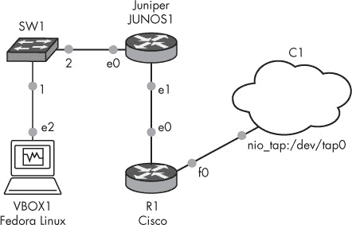
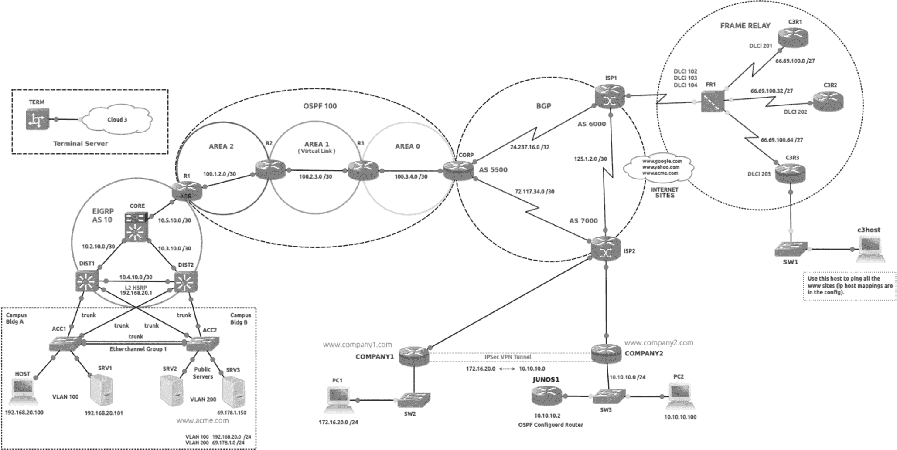

# 第一章. 介绍 GNS3

GNS3 是一个跨平台的图形网络模拟器，支持 Windows、OS X 和 Linux，它是由一些超有才华、工业级的极客们共同努力的成果——例如 Christophe Fillot、Jeremy Grossmann 和 Julien Duponchelle 等人。Fillot 是 MIPS 处理器仿真程序（Dynamips）的创造者，该程序允许你运行 Cisco 的路由器操作系统；Grossmann 是 GNS3 的创造者，他将 Dynamips 与其他开源软件集成，形成了一个易于使用的图形用户界面；Duponchelle 协助 GNS3 的编码工作，他的贡献帮助推动了软件的发展。

GNS3 让你在 PC 上设计和测试虚拟网络，包括（但不限于）Cisco IOS、Juniper、MikroTik、Arista 和 Vyatta 网络，通常被那些需要在学习 Cisco 认证网络工程师（CCNA）和 Cisco 认证网络专家（CCNP）考试时获得 Cisco IOS 路由和交换实际经验的学生使用。但这仅仅是 GNS3 能做的冰山一角。在本章中，我将讨论 GNS3 是什么，以及该软件的优缺点。

# 为什么使用 GNS3？

在虚拟化的奇迹出现之前，网络工程师、管理员和学生必须使用物理硬件搭建实验室，或者租用机架上的时间。这两种选择既昂贵又不方便，而且限制了可用的网络设计。像 RouterSim 和 Boson NetSim 这样的软件模拟程序已经存在很长时间了，但这些有限的应用程序仅仅模拟了 Cisco IOS 的命令。Cisco 教育确实提供了基于 Cisco IOS 在 Unix 上的虚拟化机架租用（IOU），但是它只允许你在特定的预配置网络配置上进行练习，且要求你必须有有效的互联网连接才能访问实验室。Cisco 还提供了一款名为 Virtual Internet Routing Lab (VIRL) 的产品，它与 GNS3 类似，但需要支付年费，限制了你在实验室中使用的对象数量，并且仅支持模拟的 Cisco 操作系统。

另一方面，GNS3 允许你根据需求定制网络实验室，使用 Cisco 和非 Cisco 技术创建无限的项目，向项目中添加无限的对象，并且无论是否有互联网连接，都能随时访问这些项目。通过结合仿真硬件设备（运行真实的网络操作系统，如 Cisco IOS）、模拟操作系统（如 NX-OSv）以及跨多台计算机共享资源的功能，GNS3 为你的设计提供了最大的灵活性。

## 模拟硬件

GNS3 的图形界面允许你创建虚拟化的网络实验室，包含各种路由器、交换机和 PC，但它真正的亮点是与 Cisco IOS 配合使用。与类似的应用程序不同，GNS3 不仅仅是模拟 Cisco IOS 命令或功能。它使用后端的虚拟化程序来模拟运行 Cisco IOS 的硬件。因为只模拟硬件，你实际上是在 PC 上运行一个真实的 IOS 镜像文件。所有的配置命令和输出都来自真实的 IOS，从理论上讲，任何 IOS 版本支持的协议或功能都可以在你的网络设计中使用。这个功能使得 GNS3 与 RouterSim、Boson NetSim 或 VIRL 等程序有所区别，因为这些程序模拟的是整个体验，并且只提供有限的环境、命令和场景供你使用。

## 模拟操作系统

除了模拟硬件，GNS3 还集成了模拟操作系统，并且这些操作系统可以与其他 GNS3 设备完全联网。其中一个例子是 Cisco IOU，我在第九章中有详细介绍。IOU 由一系列 Linux 二进制文件组成，能够模拟 IOS 镜像的功能，并且 GNS3 完全支持它。

除了 Cisco IOS，GNS3 还可以集成 Quick Emulator（QEMU）和 VirtualBox 虚拟机，运行如 Linux、BSD 或 Windows 等操作系统。例如，如果你想练习在 Linux 上安装和配置 Apache Web 服务器，只需将一个运行 Linux 和 Apache 的 VirtualBox 虚拟机（VM）添加到 GNS3 中，然后通过从另一台 VirtualBox 主机进行访问来进行测试。所有这一切都可以在 GNS3 用户环境中完成。如果你想在 Apache 服务器前加一个防火墙，可以使用 Cisco 路由器、适应性安全设备（ASA）防火墙，甚至是基于 Linux 的防火墙，如 Vyatta。

## GNS3 服务器的可扩展性

GNS3 利用了客户端-服务器技术；就像网页浏览器连接到网页服务器以访问和显示网页一样，GNS3 的图形用户界面（GUI）程序连接到 GNS3 服务器，从而启动、停止以及控制 GNS3 设备。这使得你的项目可以扩展，因为它们不再仅限于单台计算机上运行。如果你需要处理大型或复杂的拓扑结构，你还可以将 GNS3 服务器程序运行在与 GNS3 GUI 程序不同的 PC 上。如果你有一台高性能的服务器，拥有大量内存和处理能力，你可以将 GNS3 服务器程序安装在服务器硬件上，但仍然可以从运行在较为普通 PC 上的 GNS3 GUI 程序控制所有设备。

## 虚拟连接

GNS3 的真正魅力在于它能够将你的虚拟设备网络连接在一起，通常使用如互联网协议版本 4（IPv4）和互联网协议版本 6（IPv6）等协议，创建可以在单台计算机上运行的实验室。一些最简单的设计可能只有几个组件，像图 1-1 中展示的项目一样。

图 1-1. 集成 Fedora Linux、Cisco 和 Juniper 路由器的 GNS3 拓扑

图 1-1 中的项目允许 Fedora Linux 主机通过一个交换机、一个 Juniper 路由器、一个 Cisco 路由器，最后一个 GNS3 云节点访问实时互联网。这是一个简单的网络，但你也可以创建由十几个或更多路由器、交换机和 PC 组成的复杂网络，就像图 1-2 中的设计一样。

图 1-2. 复杂的多协议 GNS3 拓扑

图 1-2 中的项目配置了超过 25 个设备，包括冗余交换机块、EtherChannel、L2 热备份路由协议（HSRP）、帧中继、增强型内部网关路由协议（EIGRP）、开放最短路径优先（OSPF）和边界网关协议（BGP），但该项目可以在配置适中的 PC 上运行。为了让你的设备更清晰，你还可以像我在这个示例中做的那样，使用彩色、可缩放的文本注释设计图。如果你有一台笔记本电脑，你甚至可以将项目带到路上，向客户展示、解决设计问题或准备认证考试。CCNA 或 CCNP 考生也可以创建所有必要的训练实验室，学习 Cisco 的考试资料，使用真实的操作系统进行练习，并随时随地学习。

GNS3 具有将实验室设备中的虚拟接口桥接到 PC 中一个或多个物理以太网接口的能力。这使得你可以将虚拟网络连接到实际硬件上，比如路由器、交换机和其他 PC。例如，你可以使用多台 PC 运行两个或更多的 GNS3 网络，并通过以太网交叉电缆或物理交换机将 PC 连接在一起。这样，你就能将所有 PC 中的 GNS3 设备连接起来。（我亲切地称之为 GNS3 *ubernet*！）

# 开源集成

GNS3 通过利用开源技术，如 Dynamips、QEMU 和 VirtualBox，发挥其魔力。它能够像 Cisco IOS 一样轻松地运行 Juniper、Arista 以及许多其他网络操作系统。

## Dynamips 虚拟机监控程序

为了模拟 Cisco 硬件，GNS3 捆绑了 Dynamips，这是由法国的 Christophe Fillot 于 2005 年创建，并由 Flávio J. Saraiva 等人持续更新的一个优秀应用程序。Dynamips 虚拟机监控程序可以模拟 Cisco 1700、2600、3600、3700 和 7200 系列路由器硬件。借助 Dynamips，你可以快速、轻松地在 GNS3 中配置这些路由器模型，并搭配各种模拟的 Cisco 网络 SLOT 和 WAN 接口卡（WIC）。虚拟输入/输出（I/O）卡允许你为设备添加多个以太网接口、交换模块和串口。你甚至可以根据项目需求和 Cisco IOS 版本，为每个设备单独添加或删除内存。

## QEMU 与 VirtualBox

你可以将 QEMU 和 VirtualBox 虚拟机添加到 GNS3 中，并在项目中使用它们。这些设备可以与其他 GNS3 设备连接，形成一个完整的端到端网络。例如，你可以将一个 VirtualBox 主机连接到一系列交换机和路由器，并允许它访问该网络上另一个 VirtualBox 主机上的资源。在这种情况下，你可以配置和测试各种路由协议以及诸如网络地址转换（NAT）、访问控制列表（ACLs）和虚拟专用网络（VPNs）等功能。当然，物理计算机的硬件会对资源造成一定的限制，但现代计算机有很多未被利用的资源，正等待着 GNS3 来发挥其潜力。

# 一些局限性

GNS3 并非没有局限性。Dynamips 的限制使得它不能在生产环境中使用，只能用于教育用途。此外，交换功能的命令集较为简单，除非你将一个或多个物理 Catalyst 交换机集成到 GNS3 项目中。幸运的是，IOU 在一定程度上弥补了这一差距。

## 需要一些组装

所有伟大的事物都有代价，GNS3 也不例外。最显著的一点是，GNS3 需要一个或多个 Cisco IOS 镜像才能在你的虚拟 Dynamips 路由器上运行，而 GNS3 并不提供这些镜像。如果你拥有一台路由器，或者通过 Cisco 连接在线（CCO）账户，你可以将镜像复制过来，前提是你和 Cisco 有合同关系。

## 限制的仿真

Dynamips 无法模拟 Cisco 先进 Catalyst 交换机的应用特定集成电路（ASIC）硬件。这对于有志于成为 CCNA 甚至 CCNP 的学习者来说是一个小小的障碍，但对于那些需要交换机高级功能的有志于成为 Cisco 认证互联网专家（CCIE）的人来说，这无疑是个挑战。不过，GNS3 的多功能性允许你将 GNS3 虚拟实验室与实际的 Catalyst 交换机结合使用，这可以大大降低创建 CCIE 实验室的成本，并且由于大部分实验室是虚拟化的，它可以提供更大的配置灵活性。

当你不需要那些高级功能时，你可以将一个虚拟交换机模块（比如思科的 NM-16ESW）添加到你的虚拟思科路由器上，创建一个简单的三层交换机。这个设备应该能够满足一些基本的交换需求，包括虚拟局域网（VLAN）、802.1Q 中继、生成树协议、EtherChannel，以及使用 EIGRP、OSPF、BGP 和其他协议的多协议路由。最后，思科 IOU 镜像可以用来模拟思科交换机，并且它们提供的命令比 Dynamips 交换机模块更多。

## 受限的网络性能

另一个 GNS3 的限制是网络性能。因为 Dynamips 是一个没有硬件加速的模拟器，所以吞吐量会受到限制，从每秒 1.5Mb 到 800Mb 不等，这取决于你使用的 IOS 和配置。这看起来可能是一个限制，但实际上它是件好事，因为它防止用户将思科硬件虚拟化并投入到生产环境中。试想如果模拟设备能以全速运行：从这里到天涯海角的每个网络爱好者都会在廉价的 PC 上安装虚拟路由器，并在生产网络中使用它们，从而有效地盗取思科的知识产权。如果发生这种情况，思科一定会像砸砖头一样打压 Dynamips 开发者，而 GNS3 也就不会存在了。这个限制对于教育和测试使用 GNS3 几乎没有任何影响。

# 最后的思考

现在我已经讲解了 GNS3 的主要特点，希望你和我一样，迫不及待地想在自己的计算机上使用它了。与类似的应用程序或工具不同，GNS3 让你完全掌控，随心所欲地运用你的想象力，创建、学习和开发符合你需求的复杂网络。此外，你可以不必花费大量金钱购买路由器和交换机，也无需在充满噪音和电力消耗的硬件堆积的房间中工作。

在下一章，我将向你展示如何安装 GNS3。让我们开始吧！
