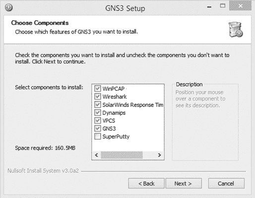
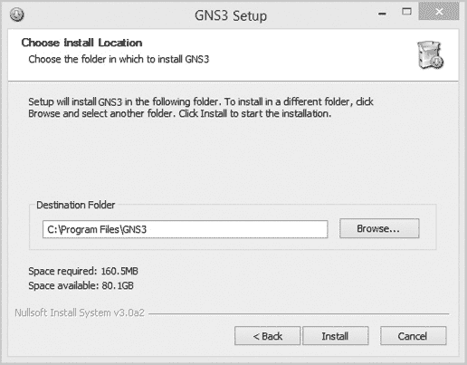
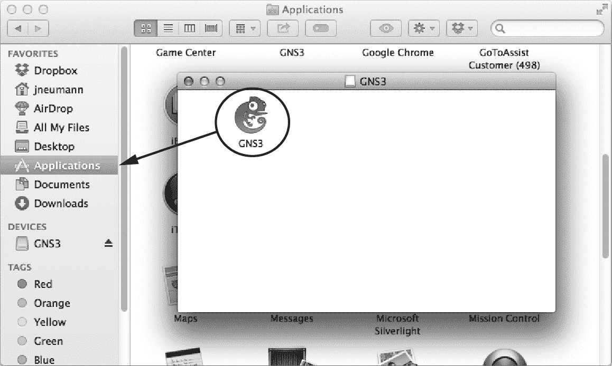
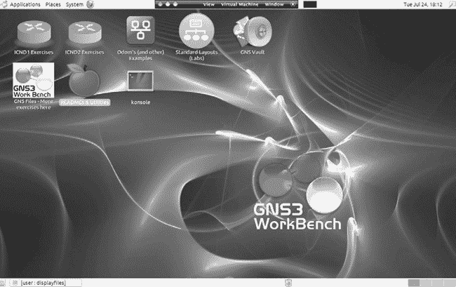
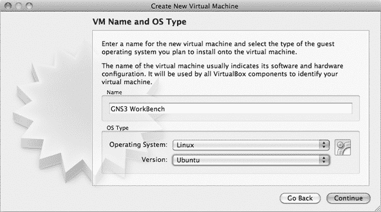
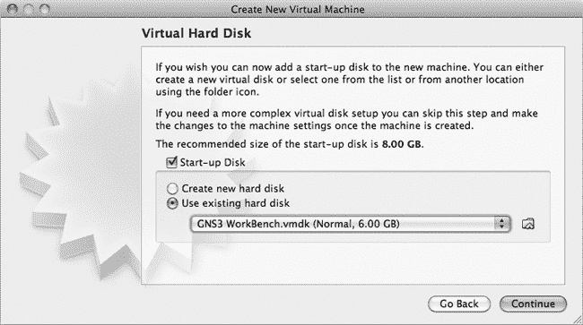

# 第二章：安装基本的 GNS3 系统

告别硬件的世界，迎接 GNS3！这是一种全新的学习网络的方式。在本章中，我将引导你完成在 Microsoft Windows、Mac OS X 和 Ubuntu Linux 上安装基本 GNS3 系统的过程。

基础安装包括 GNS3 应用程序和一些辅助应用程序。在 Windows 和 OS X 上，所有的先决应用程序都包含在 GNS3 安装包中，可以从 GNS3 网站下载（*[`www.gns3.com/`](http://www.gns3.com/)*）。

在 Linux 上安装时，你可以通过特定平台的包管理器下载并安装 GNS3，或者直接从源代码安装。从源代码安装的原则可以应用于几乎任何基于 Unix 的系统，而且这是一种确保你拥有最新软件的好方法。

# 一般要求

运行 GNS3 的要求主要由你所安装的操作系统、你希望在项目中使用的路由器型号和数量，以及你是否将外部程序如 QEMU 或 VirtualBox 集成到设计中来决定。大多数近几年购买的计算机应该能够顺利运行这个基础安装。

也就是说，如果你决定超越仅使用 Cisco 路由器创建项目，且将其他虚拟环境（如 Linux、BSD、ASA、IDS 或 Juniper）融入到 GNS3 设计中，你将希望尽可能获得更多的计算能力。你拥有的内存和处理能力越强，所有的运行效果就越好，因为像 QEMU 和 VirtualBox 这样的程序需要内存来运行其虚拟操作系统，它们会和你本地操作系统争夺 CPU 时间。你还需要更多的磁盘空间来存储虚拟操作系统。

你可以访问 GNS3 网站以验证你操作系统的要求，但对于一个简单的基础安装，以下是一个不错的经验法则：

+   1.5 GHz 处理器

+   4GB 内存

+   250MB 可用磁盘空间

这些是*最低*规格，满足这些要求的系统应该能够运行一个简单的 GNS3 拓扑，使用几个 Cisco 路由器。当然，随着项目变得更大、更复杂，GNS3 将从更强大的系统中受益。

### 注意

*如果安装说明现在看起来令人不知所措，不要担心！跳到 GNS3 Appliances 了解如何下载预构建的 GNS3 设备，直接开始使用。*

# 安装在 Microsoft Windows 上

与其他操作系统相比，在 Windows 上安装 GNS3 轻而易举。Windows 安装包包括几乎所有 GNS3 需要的应用程序，以及一些其他平台上没有的附加功能，而且所有内容安装时几乎不需要用户干预。

Windows 安装程序包括一些额外的有用应用程序，包括用于 Juniper 和 ASA 的 QEMU；流行的网络监控程序 Wireshark；Windows 终端仿真程序 PuTTY；以及 VPCS，一个简单的类似 DOS 的命令模拟器，用于通过 `ping` 和 `traceroute` 命令测试连接。安装程序包含 32 位和 64 位版本的 GNS3，并应自动安装正确的版本。

按照以下步骤在 Windows 上安装 GNS3：

1.  从 GNS3 网站下载 GNS3 一体化安装程序 (*[`www.gns3.com/`](http://www.gns3.com/)*)，然后启动它以开始安装。

1.  在安装向导界面点击 **下一步**，然后在许可协议界面点击 **我同意**。

1.  选择你希望安装程序在开始菜单中放置应用程序快捷方式的文件夹，然后点击 **下一步**。（默认文件夹是 *GNS3*。）

1.  然后，你可以选择要包含在安装中的组件，如 图 2-1 所示。默认选项会安装所有组件，创建一个功能完整的 GNS3 系统，包括 Wireshark、VPCS 和 QEMU。为了节省磁盘空间，或者如果你不需要这些附加功能，可以取消选择这些选项。WinPCAP 是 NIO 以太网云连接所必需的，而 Dynamips 是使用 Cisco 路由器和交换机创建项目所必需的。做出选择后，点击 **下一步**。

    

    图 2-1. 选择要安装的 GNS3 组件

1.  你应该会看到选择安装位置的界面，如 图 2-2 所示。要将 GNS3 安装到其他位置，请在目标文件夹字段中输入新位置，然后点击 **安装**。

1.  继续按照所有提示完成安装。我建议你接受所有默认设置。



图 2-2. 选择目标文件夹位置

完成后，GNS3 应该会在桌面上放置一个图标。

# 在 OS X 上安装

GNS3 仅支持运行 OS X 的基于 Intel 的 Mac。你应该确保在运行 GNS3 之前已经安装了最新版本的 OS X。

要在 OS X 上安装 GNS3，首先从 GNS3 网站下载适当的安装程序 (*[`www.gns3.com/`](http://www.gns3.com/)*)，然后双击安装程序，桌面上将显示一个 DMG 磁盘映像文件。双击该映像文件打开 *GNS3* 文件夹，并将 GNS3 图标拖动到 *应用程序* 文件夹中，如 图 2-3 所示。



图 2-3. 将 GNS3 程序图标拖动到应用程序文件夹

要在当前版本的 OS X 上运行 GNS3，你可能需要右键点击已安装的应用程序图标，并在第一次运行时选择 **打开**。系统会弹出一个对话框，警告你该软件包来自未识别的开发者，并询问你是否确定要打开该应用程序。点击 **打开** 按钮即可绕过 OS X 的 Gatekeeper 功能。从此以后，GNS3 将正常启动，不会再有任何警告。

# 在 Ubuntu Linux 上安装

GNS3 在许多不同的 Linux 发行版上运行良好，但遗憾的是大多数发行版缺乏文档。在本节中，我将揭开谜团，向你展示在基于 Unix 的平台上运行 GNS3 是多么简单。我选择覆盖 Ubuntu，因为它是最常用的发行版之一。

在 Linux 上安装 GNS3 有两种方式。你可以通过软件包管理器安装一个捆绑包，或者从源代码安装。使用捆绑安装很快速且简单，但缺点是你只能使用已经移植到你特定平台的 GNS3 版本，可能不是最新版本。这时候，源代码安装就显得很有用。从源代码安装只需要几个额外的步骤，并且提供了最新版本的 GNS3。尽管我强烈推荐从源代码安装，但我们将在这里介绍两种方法。

## 从软件包安装 GNS3

要使用高级包管理工具安装 GNS3，请打开终端程序并输入以下命令：

```
$ **sudo apt-get install gns3**
```

当系统提示时，输入你的密码。此命令的输出将显示将要安装的软件包列表，并显示安装将占用多少磁盘空间。安装程序会提示你确认是否可以继续。确认后，软件包将被安装，GNS3 准备就绪。

你可以通过终端程序输入 `gns3` 启动应用程序，或者从显示管理器的应用菜单中启动 GNS3。现在你已经准备好配置 GNS3。

## 从源代码安装 GNS3

从源代码安装可以确保你获得 GNS3 的最新版本，并且在我看来，这是在基于 Unix 的系统上安装 GNS3 的最佳方式。不管你使用的是哪个版本的 Linux，你都应该能够根据这些说明将 GNS3 安装并运行在你的系统上。在以下示例中，我将以 Ubuntu Linux 为框架，但请记住，这些说明几乎适用于任何基于 Unix 的发行版。不同发行版之间的主要区别在于所需的依赖项以及如何安装它们。请务必检查 GNS3 网站，以获取最新的依赖项要求。

我曾在 Solaris、FreeBSD、OpenBSD、Ubuntu、Mint、OpenSUSE、Fedora、Fuduntu、Debian、Arch、Gentoo、Kali、Netrunner 和 PCLinuxOS 上安装过 GNS3，因此我相信你也能在你的系统上运行它！

从 GNS3 网站下载并解压安装文件 (*[`www.gns3.com/`](http://www.gns3.com/)*)

### 解压源代码

当你下载 GNS3 的 Linux 版本时，你会得到一个 ZIP 文件，其中包含 Linux 源代码。解压后，你会看到每个 GNS3 使用的程序的独立 ZIP 文件。使用以下命令解压 GNS3 源代码文件，将 `x` 替换为你的文件版本：

```
$ **cd ~/Download**
$ **unzip GNS3-x-source.zip**

dynamips-x.zip
gns3-gui-x.zip
gns3-server-x.zip
vpcs-x.zip
iouyap-x.zip
```

接下来，你将更新 Ubuntu 包管理器。

### 更新包管理器

更新包管理器的索引文件可以确保你安装最新版本的依赖项。在 Ubuntu 上，打开终端并输入：

```
$ **sudo apt-get update**
```

### 安装依赖项

GNS3 的依赖项和软件包名称特定于每个 Linux 发行版，因此你需要下载适合你操作系统的版本。你可能还需要提前查看 GNS3 网站，因为依赖项可能会随时间变化。在 Ubuntu 上，输入以下命令：

```
$ **sudo apt-get install python3-dev**
$ **sudo apt-get install python3-setuptools**
$ **sudo apt-get install python3-pyqt4**
$ **sudo apt-get install python3-ws4py**
$ **sudo apt-get install python3-netifaces**
```

安装完所有 Python 包后，继续安装 Dynamips。

### 安装 Dynamips

在编译 Dynamips 之前，你需要在 Ubuntu 系统上安装一些额外的软件包：

```
$ **sudo apt-get install libpcap-dev**
$ **sudo apt-get install libelf-dev**
$ **sudo apt-get install uuid-dev**
$ **sudo apt-get install cmake**
```

接下来，解压源代码文件，编译并使用以下命令安装 Dynamips。将 `x` 替换为你软件的版本。

```
$ **unzip dynamips-x.zip**
$ **cd dynamips-x**
$ **mkdir build**
$ **cd build**
$ **cmake ..**
$ **make**
$ **sudo make install**
```

完成后，你应该在 */usr/local/bin/* 目录中看到一个名为 *dynamips* 的文件。将程序的所有权更改为 root，并将文件权限设置为可执行。这将允许 Dynamips 设备通过你的 PC 的以太网适配器连接到互联网或实际硬件，如 Cisco 交换机。

```
$ **sudo chown root /usr/local/bin/dynamips**
$ **sudo chmod 4755 /usr/local/bin/dynamips**
```

对于关心安全的用户，有一个替代方案。你可以在不向 Dynamips 提供 root 权限的情况下实现相同的功能。以下方法适用于 Ubuntu，并且应当适用于大多数运行 Linux 内核 2.2 或更高版本的系统。此方法不适用于基于 BSD 的系统。

```
$ **sudo apt-get install libcap2**
$ **sudo setcap cap_net_raw,cap_net_admin+eip /usr/local/bin/dynamips**
```

接下来，你将安装 GNS3 服务器和 GUI 源代码文件。

### 安装 GNS3 服务器和 GUI

GNS3 由两个主要应用程序组成：一个服务器应用程序和一个 GUI 应用程序。服务器应用程序在你的计算机后台运行，普通用户通常看不见它。它负责运行和管理所有辅助应用程序，如 Dynamips、QEMU 和 VirtualBox。GUI 应用程序提供前端用户体验，是你与 GNS3 互动的地方。

```
$ **unzip gns3-server-x.zip**
$ **unzip gns3-gui-x.zip**
```

完成安装后，运行 GNS3 安装脚本以安装每个应用程序。此步骤需要提升的 root 权限，因此请准备好你的 root 密码。首先安装 GNS3 服务器。

```
$ **cd gns3-server-x**
$ **sudo python3 setup.py install**
```

接下来，安装 GNS3 GUI 应用程序。

```
$ **cd gns3-gui-x**
$ **sudo python3 setup.py install**
```

安装完成后，应用程序将被安装到 */usr/local/bin/* 下。

接下来，通过解压 *vpcs* ZIP 文件并运行 `mk.sh` 安装脚本来安装 Virtual PC 模拟器（VPCS）。该软件模拟一个简单的主机 PC，并可用于测试项目中的路由器。

```
$ **unzip vpcs-x.zip**
$ **cd vpcs-x/src**
$ **./mk.sh**
$ **sudo cp vpcs /usr/local/bin**
```

最后一步是针对 Ubuntu 和其他一些 Linux 发行版的特定操作，之所以需要这一步，是因为它们实现了 Gnome 桌面。没有这个命令，程序仍能正常运行，但一些菜单图标在 GNS3 中将无法显示。

```
$ **gconftool-2 --type Boolean --set /desktop/gnome/interface/menus_have_icons True**
```

要启动程序，请输入以下终端命令：

```
$ **gns3**
```

就这样！你现在可以继续配置 GNS3 并创建项目了。

# GNS3 器具

在你的 PC 上安装 GNS3 的另一种选择是使用预配置的*GNS3 器具*。GNS3 器具实际上是一个已经安装了 GNS3 的虚拟机。GNS3 器具非常灵活，因为它们通过像 VirtualBox 这样的应用程序运行。VirtualBox 是免费的，并且可以在大多数操作系统上运行（包括 Windows、OS X、Linux 和 FreeBSD）。

## 一些优缺点

在虚拟环境中运行 GNS3 有几个优点。主要的优点是简便和可移植性。大部分设置工作已经为你完成，你将拥有一个可以从一台 PC 移动到另一台的可移植 GNS3 安装。如果你买了一台新电脑，你可以将这个器具复制到新 PC 上，一切应该像以前一样运行，无论新电脑运行的硬件或操作系统如何。

另一方面，如果你希望来宾操作系统和 GNS3 运行顺畅，特别是当你创建大型或复杂项目时，宿主机器需要具备快速的处理器和大量的 RAM。并且因为你正在模拟来宾操作系统的硬件，项目可能会根据底层硬件的不同，略微影响性能。

## GNS3 工作台

有几种 GNS3 器具可供选择，但我推荐 GNS3 工作台 (*[`rednectar.net/gns3-workbench/`](http://rednectar.net/gns3-workbench/)*)，如图 2-4 所示。开发者做得很好，界面简洁，配置也相当直观。GNS3 工作台基于 Linux 构建，预装了 GNS3、Wireshark 和 VPCS。它还带有一些练习和预配置的实验室，帮助你为 Cisco 的 CCNA 认证考试做准备。许多实验室包含故障排除问题，目标清晰明确。



图 2-4. GNS3 工作台

GNS3 WorkBench 假设用户具备一定的 Linux 基础知识，但有一些 Linux 经验会更有帮助。包含了 Linux shell 脚本，帮助你安装 Cisco IOS，实验室设计仅需几个 IOS 映像即可工作。此外，开发者还包括了来自 GNS3 Vault 的一些练习。GNS3 Vault 网站（*[`www.gns3vault.com/`](http://www.gns3vault.com/)*)专注于 GNS3 的所有相关内容，特别侧重于 Cisco 教育，并为任何准备 Cisco CCNA 或 CCNP 认证的人提供练习。

## 安装 GNS3 WorkBench

GNS3 WorkBench 是免费的，并且仅作为 VMware 虚拟机提供。不过，你可以导入虚拟磁盘映像并使用 VirtualBox 运行该设备。如果你希望使用 VMware 本地运行该设备，请访问他们的网站（*[`www.vmware.com/`](http://www.vmware.com/)*)并确认你的平台是否受到支持。否则，我建议使用 VirtualBox（*[`www.virtualbox.org/`](http://www.virtualbox.org/)*)，因为它支持更多的平台——特别是 Windows、Linux、FreeBSD 和 OS X——并且对所有平台都是免费的。

在开始之前，确保你的工作站有 10GB 的硬盘空间，并且已安装 VirtualBox。要在 VirtualBox 下安装 GNS3 WorkBench，请从 GNS3 网站（*[`www.gns3.com/`](http://www.gns3.com/)*）下载 GNS3 WorkBench 设备，并按照以下步骤操作：

1.  启动 VirtualBox，点击启动屏幕上的**新建**来创建一个新的虚拟机。在向导打开后，点击**继续**开始。

1.  给你的虚拟机命名，选择**Linux**作为操作系统，**Ubuntu**作为版本（如图 2-5 所示），然后点击**继续**。

    

    图 2-5. 为 GNS3 WorkBench 创建新的 Ubuntu Linux 虚拟机

1.  根据需要调整内存设置，然后点击**继续**进入虚拟硬盘对话框。接着，选中**使用现有硬盘**单选按钮，点击黄色文件夹图标，浏览到你保存 GNS3 WorkBench 文件的位置。选择名为*GNS3 WorkBench.vmdk*的文件，确保**启动磁盘**旁边有一个勾选框，然后点击**继续**，如图 2-6 所示。这是虚拟等效于将硬盘从一台 PC 中取出并安装到另一台 PC 中的操作。

    

    图 2-6. 选择与 VirtualBox 一起使用的 VMware 磁盘映像

1.  点击**下一步**和**完成**以完成安装。

1.  最后，启动 GNS3 WorkBench 并安装客户机增强功能。客户机增强功能软件为你的新虚拟机提供硬件驱动程序。点击**设备** ▸ **安装客户机增强功能**，然后按照屏幕上的指示操作。在 FreeBSD 上，客户机增强功能通过*virtualbox-ose-additions*包安装。

### 注意

*如果你的主机 PC 有额外的 RAM，可能需要为 GNS3 WorkBench 分配 2GB RAM（或更多），而不是默认的 1GB。1GB 的 RAM 对于 GNS3 来说是最低要求。增加可用内存将提升性能。*

安装完成后，点击**启动**来启动 Ubuntu。如何配置和使用 GNS3 WorkBench 的说明应该会出现。

# 最后思考

在本章中，你已经学会了 GNS3 可以在几乎任何操作系统上安装，并且你不需要计算机科学博士学位就能完成安装。不过，这并不意味着它能在所有系统上轻松安装。例如，一些 Linux 发行版可能根本没有 GNS3 包（或者可用的包可能过时，无法满足需求），但这就是开源软件的魅力所在：你可以直接从源代码安装。另一个潜在的陷阱是，所有必要的依赖项——或者那些依赖项的正确版本——可能不适用于你的操作系统版本，这将是一个无法解决的问题。在这种情况下，我建议你使用像 GNS3 WorkBench 这样的工具，或者使用 VirtualBox 并安装一个像 Ubuntu 这样完全支持 GNS3 的客户操作系统。

安装 GNS3 后，你已经准备好进入下一章节，在那里你将学习如何配置 GNS3 并创建项目。
