# 第四章：创建和管理项目

现在你已经能够配置并启动一个单一的 IOS 路由器，接下来卷起袖子，我将向你展示如何通过将两个或更多路由器连接在一起来创建一个项目。与使用真实实验室设备相比，在 GNS3 中创建虚拟网络并管理设备轻而易举。用户界面就像是一个主控室，让你只需几次点击便能操控网络设计和设备。本章将向你展示如何使用 GNS3 集中管理你的网络，包括虚拟硬件。

# 项目管理概述

GNS3 的一个强大功能是项目管理。你可以创建无限数量的网络设计，随时保存并使用它们。这意味着你再也不必浪费时间拆解现有的项目来创建一个新项目，而这在使用物理设备时经常发生。

你不仅可以保存多个项目，还可以保存整个项目配置的多个快照。一个*快照*会保留项目的网络布局和所有路由器配置在某一时刻的状态。你可以在任何时候恢复一个快照，将整个项目恢复到快照保存时的状态。

### 注意

*快照对于练习 CCNA 或 CCNP 配置训练非常有用。你可以创建一个实验室，应用基本的路由器配置要求（如网络地址、路由协议等），然后拍摄一个快照。一旦你有了基本设置的快照，你就可以练习将场景目标应用到网络中。如果你想稍后再次练习相同的任务，你可以恢复到基本快照，路由器应该无需额外配置即可使用。*

GNS3 还允许你管理虚拟硬件。就像使用真实的路由器一样，你可以使用思科扩展模块来升级你的虚拟路由器。你可以添加各种功能，比如额外的随机存取存储器（RAM）、以太网接口、串口、异步传输模式（ATM）和光纤传输网络（SONET）的包（POS）端口。

## 术语

在开始之前，让我们先了解一些重要的术语。你需要知道拓扑（topology）和项目（project）之间的区别。一个*拓扑*文件是一个以*.gns3*结尾的文本文件，主要用于描述设备及其之间的连接。一个*项目*是一个用户定义的项目文件夹（例如*MyLab*），存储在*GNS3/projects*文件夹内。一个用户项目文件夹包含一个名为*<project_name>.gns3*的拓扑文件、路由器配置、非易失性随机存取存储器（NVRAM）的内容以及其他保存的信息。换句话说，它代表了整个网络，包括拓扑结构和所有设备的配置。

另一个你应该了解的术语是*节点*。在计算机网络中，节点是指任何连接到网络的设备。在 GNS3 中，节点是指在设备工具栏中找到的任何设备。

要有效管理设备和项目，您需要的不仅仅是词汇；您还需要熟悉 GNS3 的屏幕布局。

## 屏幕布局

让我们看看标准的 GNS3 布局（如图 4-1 所示），并定义该程序使用的一些概念。

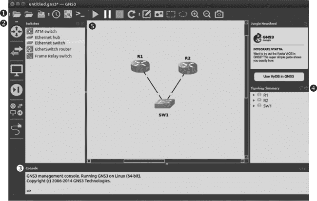

图 4-1. 显示两个路由器和一个交换机的 GNS3 工作区屏幕布局

+   ****➊ GNS3 工具栏**** 一系列图标，便于执行常见任务。

+   ****➋ 设备工具栏**** 用于添加路由器、交换机、终端设备和安全设备，并在设备之间创建链接。要创建拓扑，选择工具栏中的设备类型并将设备从设备窗口拖到工作区。有两种类型的设备：模拟设备和仿真设备。*模拟*设备模拟实际设备的所有特性（如以太网交换机节点），并且不运行操作系统。*仿真*设备仿真实际设备的硬件，并需要操作系统才能运行（如运行 Cisco IOS 的虚拟 Dynamips 路由器）。

+   ****➌ 控制台**** 一个命令行界面，您可以在其中管理设备的各个方面。

+   ****➍ 拓扑概述**** 显示项目中设备的状态。设备旁边的绿色圆圈表示设备已启动，红色圆圈表示设备已停止，黄色圆圈表示设备已暂停。模拟设备（如以太网交换机节点）始终为绿色。要查看给定设备上正在使用的链接，请点击设备名称旁边的三角形。

+   ****➎ 工作区**** 设计网络的区域。将设备从设备工具栏拖到工作区并将它们连接在一起。

现在您知道了 GNS3 主屏幕的样子，让我们更仔细地看看您将在那里找到的选项。

# 使用 GNS3 工具栏

GNS3 工具栏包含几个按功能大致组织的图标组，提供了一种简单的方法来完成任务。第一个组处理项目，第二个组处理链接，第三个组处理设备和快照，第四个组提供了额外的方式来视觉组织项目。

## 第一个工具栏组

工具栏的第一个图标组，如图 4-2 所示，处理影响整个项目的操作。


图 4-2. 第一个工具栏组

从左到右，这些图标如下：

+   ****新建空白项目****。创建一个新的项目文件夹，并允许您选择项目名称。

+   ****打开项目****。打开一个之前保存的项目。要打开项目，选择项目文件夹名称并选择名为 *<project_name>.gns3* 的文件。

+   ****保存项目****。将完整项目保存到 GNS3 的*projects*文件夹中。默认情况下，工作区的 PNG 图像文件将与项目一起保存。

## 第二组工具栏图标

第二组工具栏图标（如图 4-3 所示）中的按钮，允许你创建项目快照、显示或隐藏接口标签，并通过设备的虚拟控制台端口连接到设备。


图 4-3. 第二组工具栏图标

从左到右，这些图标如下：

+   ****快照****。创建设备、链接和 IOS 配置的快照，以记录当时工作区的状态。你可以保存多个快照，并随时恢复到已保存的快照。选项包括创建、删除、恢复和关闭。

+   ****显示接口标签****。显示或隐藏链接使用的接口名称。这些标签是简写形式，并与工作区中的设备一起显示（例如，FastEthernet0/0 的标签会显示为 f0/0）。

+   ****与所有设备建立控制台连接****。为工作区中所有运行的路由器打开控制台连接。

### 注意

*当你与所有设备建立控制台连接时，如果终端不支持标签会话，你的屏幕可能会被打开的控制台窗口弄得很杂乱。在处理大型拓扑时，你可能会发现，通过右键单击设备节点并选择控制台来打开和关闭单一会话会更容易。*

## 第三组工具栏图标

第三组工具栏图标，如图 4-4 所示，主要用于控制设备。


图 4-4. 第三组工具栏图标

从左到右，这四个图标如下：

+   ****启动/恢复所有设备****。启动所有已停止的设备或恢复所有已暂停的设备。

+   ****暂停所有设备****。将所有支持暂停的设备置于暂停状态。

+   ****停止所有设备****。停止所有设备。

+   ****重新加载所有设备****。重新加载所有设备。重新加载前，请确保保存你的路由器配置和项目，否则你可能会丢失配置！

## 第四组工具栏图标

最后一组工具栏图标，如图 4-5 所示，提供了更清晰地展示网络布局的工具。你可以向项目中添加矩形、椭圆等对象，甚至生成工作区的截图。


图 4-5. 第四组工具栏图标

从左到右，最后一组工具栏图标如下：

+   ****添加注释****。在工作区中创建文本注释。双击文本以修改内容，右键单击文本对象以更改样式属性（如字体大小和颜色）。你还可以旋转文本对象，从 0 度到 360 度。

+   ****插入图片****。将图像和徽标添加到你的项目中。GNS3 支持 PNG、JPG、BMP、XPM、PPM 和 TIFF 文件格式。

+   ****绘制矩形****。动态绘制可调整大小的矩形。你可以右键单击矩形对象来更改边框和边框颜色的样式属性。矩形对象可以从 0 度旋转到 360 度。

+   ****绘制椭圆****。动态绘制可调整大小的椭圆。你可以右键单击椭圆对象来更改边框样式和颜色。

+   ****放大****。放大工作区以查看细节。

+   ****缩小****。缩小工作区，查看更大的全局视图。

+   ****截图****。生成工作区的截图。图像可以保存为 PNG、JPG、BMP、XPM、PPM 或 TIFF 文件，默认情况下保存到你的*GNS3/projects*文件夹中。

窗口样式和停靠

GNS3 提供了几种窗口样式可供选择。要更改默认样式，请在 Linux 和 Windows 上选择**编辑** ▸ **首选项**，或在 OS X 上选择**GNS3** ▸ **首选项**。选择**常规**类别，选择**常规**标签页，并使用下拉菜单中的样式选择新的默认样式。点击**应用**和**确定**以激活更改。GNS3 将在程序重启后记住你的选择。

窗口停靠是围绕 GNS3 工作区的窗口。GNS3 默认显示控制台和拓扑摘要停靠窗口。

要查看或隐藏窗口停靠，选择**视图** ▸ **窗口停靠**，然后选择你想显示的停靠窗口；任何名称旁边有勾选标记的停靠窗口将会显示在屏幕上。要调整停靠窗口的大小，点击窗口与工作区连接处的边框并拖动，直到达到所需的大小。

你添加到工作区的对象（如注释、图片和形状）可以分组到不同的图层中。要提升或降低一个对象，右键单击该对象并选择**提升一层**或**降低一层**。此功能允许你在不影响其他图层的情况下操作某一图层中的对象。你可以通过选择**视图** ▸ **显示图层**来显示对象的图层位置，这在进行高级图层操作时非常有用。

通过使用此工具栏添加形状和颜色，你可以将网络组件分为逻辑组。通过文本，你可以添加有关项目配置的注释和提醒。图 4-6 展示了如何通过使用形状、颜色和注释文本信息来更清晰地呈现信息。

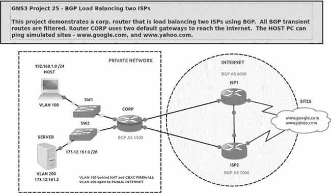

图 4-6。带注释的示例项目

一旦你创建了多个项目，很容易忘记如何配置它们或你的目标是什么。在项目中添加注释（如图 4-6 中的有用注释）是一个简单的方法，可以迅速提醒自己这些信息，尤其是在几周或几个月过去之后。注释很有用——记得使用它们！

# 使用设备工具栏

设备工具栏（如图 4-7 所示）按功能组织设备。点击设备工具栏中的一个图标，可以查看该设备组中的所有设备。


图 4-7. 设备工具栏

要向项目中添加设备节点，请从设备工具栏中点击一个图标，显示已配置的设备列表，然后将设备拖动到工作区。你可以按住 SHIFT 键添加多个相同的设备。设备工具栏中的设备类型从左到右分别如下：

+   ****路由器****。显示所有已配置有效 IOS 镜像文件的 Dynamips 路由器节点，以及 IOU L3 路由器。

+   ****交换机****。显示所有可用的交换机节点，包括以太网交换机、以太网集线器、ATM 交换机、帧中继交换机、EtherSwitch 路由器和 IOU L2 交换机。

+   ****终端设备****。显示所有可用的终端设备，包括 QEMU 客户端、VirtualBox 客户端、主机和云设备。

+   ****安全设备****。显示所有可用的安全设备，包括 ASA 防火墙、IDS/IPS 设备以及你创建的任何自定义节点。

+   ****所有设备****。显示设备工具栏中所有可用的设备。

+   ****添加连接****。当选中此项时，鼠标指针会变成十字准星，表示你可以使用设备的虚拟接口将两个设备连接起来。要连接设备，点击第一个设备并选择一个接口；然后对第二个设备重复该操作，完成连接。

现在点击**所有设备**图标，你应该看到一个窗口，显示 GNS3 中所有已配置的设备。你可以将任何设备拖动到工作区并在项目中使用它们。

# 创建你的第一个项目

现在你已经熟悉了 GNS3 界面，我们来深入探讨一些项目管理细节。我将介绍最简单的操作方法，但请记住，GNS3 通常提供不止一种方法来完成任务。

当你启动 GNS3 时，会出现一个新项目窗口，如图 4-8 所示。在这里，你可以选择打开一个已有项目或创建一个新项目。

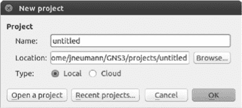

图 4-8. 新项目窗口

要创建一个新项目，将*untitled*替换为你的项目名称，然后点击**确定**。如果你已经在 GNS3 中，选择**文件** ▸ **新建**来创建一个新项目。

创建了新 GNS3 项目后，是时候开始构建拓扑了，从一些 Dynamips 路由器开始。

## 使用路由器

通过从设备工具栏拖动几个路由器到 GNS3 工作区来开始一个项目。如果在添加设备时按住 SHIFT，你应该会看到一个对话框，允许你添加多个相同的设备。尝试通过这种方式添加第一对路由器。如果你在设备工具栏上看不到任何路由器，请参考设置你的第一个 IOS 路由器，学习如何将设备添加到 GNS3 中。

将路由器添加到工作区后，它们应该会自动命名为 R1 和 R2。这些路由器的名称来自于 GNS3 文件 *ios_base_startup-config.txt* 中的命令 `hostname %h`。该文件包含应用于所有路由器的默认 IOS 设置，并在配置路由器时将其分配给设备。要找到 Dynamips 配置文件，请进入**首选项**，从左侧面板选择 **Dynamips**，然后选择 **IOS 路由器**。选择一个已配置的路由器，点击 **编辑** 以显示 Dynamips IOS 路由器配置选项，如图 4-9 所示。

在这里，你可以验证设备的 startup-config 和 private-config 文件的路径。当一个路由器被放置在你的工作区时，startup-config 文件 *ios_base_startup-config.txt* 的内容会应用到路由器的启动配置中，并在路由器启动时加载到路由器的运行配置中。如果你希望创建全球应用于你的路由器的自定义参数（例如，自动启动接口或使用预先分配的用户名和密码），可以使用文本编辑器修改并保存 *ios_base_startup-config.txt* 文件。你可以向该文件应用任何有效的 Cisco IOS 命令，前提是你的 IOS 支持这些命令。当然，你不需要修改 *ios_base_private-config.txt* 文件。该文件由 GNS3 安装，以便你在路由器重启时使用安全外壳（SSH），而不需要在路由器上生成新的加密密钥。

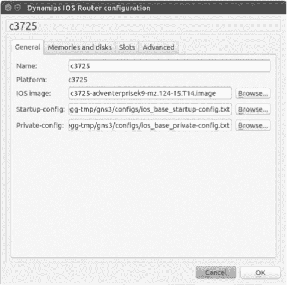

图 4-9. Dynamips IOS 路由器配置对话框

需要注意的是，你所做的更改只会应用于你添加到新项目中的路由器，不能回溯应用于之前保存的项目中的路由器。

### 警告

*在修改你的* ios_base_startup-config.txt *文件之前，你可能需要保存一个备份副本。如果你输入无效的命令，路由器可能会产生错误并发生故障。*

## 在路由器之间创建连接

在你将设备放置在工作区后，你需要在设备之间添加链接，以创建一个完全功能的网络。这相当于在真实网络中布线，只不过你使用的是虚拟电缆而非物理电缆。要为设备添加链接，请点击设备工具栏中的**添加链接**图标。你的光标应变为十字准线，表示你可以选择设备。要创建链接，点击一个设备。你将看到一个下拉菜单，列出可用的接口，如图 4-10 所示。

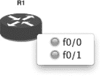

图 4-10. 带有两个 FastEthernet 接口的路由器

接口旁边的红色圆圈表示该接口可用；绿色圆圈表示该接口已被现有链接使用。选择任何可用接口以建立连接，然后选择另一设备上的接口以完成连接。你只能在两种兼容的接口类型之间建立连接。换句话说，就像在物理硬件中一样，你不能将串行电缆插入以太网接口。

在某些情况下，你可能希望中断两个设备之间的链接，以模拟停机、重新配置网络或出于其他原因。要中断两个设备之间的链接，右键点击该链接并选择**删除**，如图 4-11 所示。

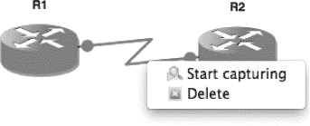

图 4-11. 删除设备之间的链接

要重新建立连接，再次点击**添加链接**图标，并选择相同的设备。

## 配置虚拟硬件

当你在工作区中放置虚拟路由器时，它们具有与配置设备的 IOS 镜像时相同的配置选项。但这并不意味着你的路由器只能使用此配置。像个人电脑一样，思科路由器具有扩展端口，以提供额外的功能，而 GNS3 Dynamips 路由器也提供与其物理版本相同的扩展选项。要修改路由器的硬件配置，右键点击路由器并选择**配置**；然后点击节点名称（例如 R1），如图 4-12 所示。

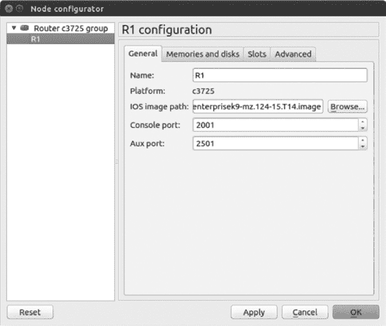

图 4-12. 思科 IOS 路由器节点配置对话框

在节点配置对话框中，您应该看到该型号路由器的可用配置选项。基础型号仅允许您添加简单选项，如 Cisco SLOT、WIC 或 RAM 卡，而更高级的型号则允许您定义一些功能，如机箱类型或在 Cisco 7200 系列路由器中找到的网络处理引擎（NPE）类型。

您可以配置和应用第三章中涉及的相同设备选项（内存和插槽），但您在此处所做的更改将仅应用于项目中选择的设备或设备组，所有其他设备将保持不变。

## 启动、停止和暂停路由器

我已经向您展示了如何通过右键点击路由器并选择启动或停止来启动和停止路由器，但您也可以通过右键点击路由器并选择挂起来来暂停路由器。当您想要模拟故障而不必保存配置、停止路由器并重新启动时，暂停路由器非常有用。事实上，反复停止和重新启动 GNS3 路由器可能会导致某些 IOS 版本的 Dynamips 崩溃，因此我建议改为暂停和恢复操作。

挂起功能在网络收敛测试中表现得尤为突出。您可以快速模拟故障和恢复，测试路由协议，如路由信息协议（RIP）、EIGRP 和 OSPF，以及冗余协议，如 HSRP、虚拟路由器冗余协议（VRRP）和网关负载平衡协议（GLBP）。要模拟故障，请点击**挂起**并监控其他路由器，验证是否已发生故障切换或收敛。

要模拟恢复，右键点击设备并选择**启动**以恢复路由器。由于 Dynamips 的模拟限制，因吞吐量限制，故障切换或收敛可能会比使用实际硬件时稍微慢一些。别担心——这完全是正常的。

当然，即使您可以启动和停止路由器，在登录到控制台之前，您也无法对其进行太多操作。

## 登录路由器

您通过模拟的控制台端口登录到路由器。如果这听起来很熟悉，那是因为这也是您登录到实际 Cisco 设备的方式。在物理硬件上，控制台端口是您插入 Cisco 小蓝色串行控制台电缆的地方。在打开控制台连接之前，请确保路由器已启动；否则，您将无法获得控制台界面。

配置终端设置

无论你使用的是 Windows、OS X 还是 Linux，GNS3 都提供了多种终端类型供你使用。但为什么你会更喜欢某一种终端而不是其他呢？一个原因可能是因为它已经安装在你的系统上。例如，在 Linux 上，你可能使用的是默认安装了 gnome-terminal 的 Gnome 桌面。如果是这种情况，你可能希望修改 GNS3 的终端设置，使用 gnome-terminal。另一个原因是，有些终端程序提供的功能比其他程序更多。例如，你可能希望选择一个允许使用标签页窗口的终端类型，这样你就可以同时打开多个控制台，而不必让多个打开的窗口堆积在屏幕上。

要修改终端设置，请进入**首选项**，点击**常规**，然后点击**控制台应用程序**选项卡，显示如图 4-13 所示的窗口。

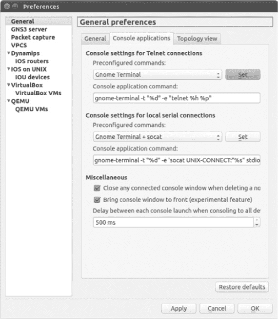

图 4-13. 终端设置

在这里，你可以选择一个预定义的终端类型，并自定义控制台应用程序命令下的命令设置。（查看你的终端应用程序文档，了解你的系统上可用的选项。）完成后，点击**设置**，然后点击**应用**和**确定**。

要同时登录到所有路由器，请点击第二个工具栏组中的**控制台连接到所有设备**图标（见图 4-3）。要登录到单个路由器，请右键点击工作区中的路由器节点，并从菜单中选择**控制台**或**辅助控制台**（见图 4-14）。

要更改路由器控制台或 AUX 端口监听的传输控制协议（TCP）端口号，右键点击工作区中的设备，点击**配置**，然后选择**常规**选项卡。你选择的端口号必须对 GNS3 中的每个设备以及你的 PC 都是唯一的。作为规则，我尽量避免修改端口号，除非必须这样做。GNS3 在管理端口号方面做得相当不错，随便改动可能会导致麻烦。但如果你 PC 上运行的其他 TCP/IP 应用程序恰好与 GNS3 发生冲突，你可能需要进行一些更改，才能登录到路由器。


图 4-14. 选择控制台或辅助控制台以连接到路由器

### 注

*在你的 PC 上使用`netstat`命令来验证哪些 TCP/IP 端口已经在使用。*

一旦你与路由器建立了控制台连接，你应该会看到一个熟悉的 Cisco 控制台窗口。

```
Trying 127.0.0.1...
Connected to 127.0.0.1.
Escape character is '^]'.
Connected to Dynamips VM "R1" (ID 1, type c3725) - Console port
Press ENTER to get the prompt.
ROMMON emulation microcode.

Cisco 1720 (MPC860) processor (revision 0x202) with 55206K/9830K bytes of memory.
Processor board ID FTX0945WOMY (4279256517), with hardware revision 000
M860 processor: part number 0, mask 0
Bridging software.
X.25 software, Version 3.0.0.
1 FastEthernet/IEEE 802.3 interface(s)
32K bytes of non-volatile configuration memory.
4096K bytes of processor board System flash (Read/Write)

SETUP: new interface FastEthernet0 placed in "shutdown" state

Press RETURN to get started!
00:00:02: %LINK-5-CHANGED: Interface FastEthernet0, changed state to administratively down
00:00:03: %LINEPROTO-5-UPDOWN: Line protocol on Interface FastEthernet0, changed state to down
R1#
```

此时，你可以开始使用标准 IOS 命令来配置路由器。一个可能看起来很奇怪的命令是`show flash`命令。通常，这个命令显示保存在闪存中的文件，例如路由器的 IOS 镜像文件和其他来自 Cisco 的默认文件。然而，在 GNS3 中，你会注意到默认情况下这里没有保存任何文件。而且，闪存驱动器可能是*未格式化*的；如果是这种情况，你需要先执行`erase flash:`命令，才能将文件保存到闪存中。否则，你可能会遇到类似下面的错误：

```
%Error opening slot0:router-confg (Bad device info block)
```

### 注意

*如果你使用 NM-16ESW 交换模块，你可能需要在创建 VLAN 之前清除路由器的闪存，否则 VLAN 数据库*（vlan.dat）*将无法保存。*

这一节到目前为止一直在讨论 Dynamips 路由器，但你也可以在 GNS3 项目中使用交换机，接下来我将介绍这一部分内容。

# 以太网交换机节点

以太网交换机节点是一个模拟的虚拟交换机，允许你创建 VLAN 接入端口和中继端口。以太网交换机节点支持接入端口、行业标准的 802.1Q 中继端口和 QinQ 标记。然而，它不支持 Cisco 的专有交换机间链路（ISL）中继协议。

要使用以太网交换机节点，将该节点拖动到工作空间中。你无需启动以太网交换机节点，它们始终可以直接使用。

要配置交换机，右键单击**以太网交换机节点**图标并选择**配置**。在图 4-15 中显示的节点配置窗口中，单击交换机名称（例如 SW1）以修改默认的交换机端口或添加新端口。

默认情况下，有八个接入端口分配给 VLAN 1。要更改某个端口，点击该端口号并根据需要修改设置。完成后，点击**应用**和**确定**。要添加新端口，定义端口设置并点击**添加**按钮；然后点击**应用**。添加端口完成后，点击**确定**以完成设置。

以太网交换机节点的一个替代方案是配置一个带有网络交换模块的 Dynamips 路由器。使用交换模块的优势是它支持更多的功能（例如生成树协议）；缺点是使用网络交换模块会占用更多的 PC 资源。如果你只需要一个简单的交换机功能，我建议你使用以太网交换机节点。如果你需要完整的 IOS 交换功能，可以使用安装了交换模块的路由器，如 EtherSwitch 路由器，或者使用 IOU L2 交换机镜像（在第九章中讨论）。

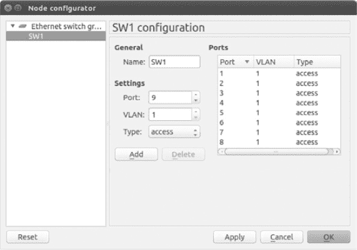

图 4-15. 以太网交换机节点配置器窗口

# 更改符号和组织设备

你可以更改工作区中用于表示设备的符号，并选择设备在设备工具栏中的位置。假设你想更改一台 IOS 路由器的符号。要更改设备的符号，请在 Linux 和 Windows 中选择**编辑** ▸ **首选项**，或者在 OS X 中选择**GNS3** ▸ **首选项**。接下来，找到你想更改的设备，右键点击设备图标，并选择**更改符号**，如图 4-16 所示。

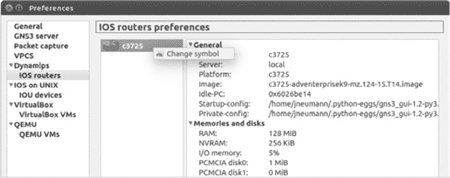

图 4-16. 更改符号

你可以以相同的方式更改 IOU 设备、VirtualBox 虚拟机和 QEMU 虚拟机的符号。符号选择窗口，如图 4-17 所示，应该在你点击**更改符号**后出现。

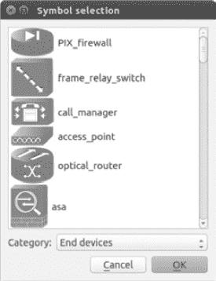

图 4-17. 符号选择和设备类别

要更改设备符号，请在符号选择窗口中向下滚动并选择你想要使用的符号。接着，使用下拉菜单选择一个类别。这是设备将在设备工具栏中放置的类别。类别包括交换机、路由器、终端设备和安全设备。完成后，点击**确定**以完成更改。

# 最终思考

在本章中，你学习了设置 GNS3 网络的基础知识，所以现在是创建一些实验并练习所学内容的好时机。如果你正在为 Cisco 认证考试做准备，那么尽可能多地与 Cisco 设备进行实践是通过考试的唯一方法。（这些考试很难！）

从创建图 4-1 中的网络开始。创建拓扑后，登录到路由器，配置它们的接口，并尝试在它们之间进行 ping 操作。通过使用暂停和恢复功能，或者启动和停止设备，模拟故障和恢复。一旦你探索了一些 IOS 命令和 GNS3 功能后，可以尝试创建一个简单的 CCNA 实验，至少包含三个路由器；网上有很多 CCNA 和 CCNP 的示例实验。

最后需要提醒的一点是：如果你创建了使用多协议路由的大型拓扑，可能会发现你需要增加路由器的协议定时器，以防止接口反复上下跳动。（这种情况很少发生，但偶尔会出现。）这个问题是由 Dynamips 中的延迟效应引起的。串行连接是另一个常见的问题领域；一些路由器镜像在模拟串行端口时可能会不稳定。如果你发现某个路由器的串行端口出现故障，导致路由器崩溃或连接断开，试试更换路由器型号或不同的 IOS 镜像。通常，c36xx、c37xx 和 7200 IOS 镜像在 Dynamips 中最为稳定，应该尽可能使用这些镜像。

在第五章中，你将学习如何使用 Wireshark 捕获网络数据包的基本知识，并通过使用 VPCS、VirtualBox 和 Linux 添加主机来扩展你的网络。
