# 第五章：集成主机和使用 Wireshark

到目前为止，你已经学习了如何使用思科设备创建网络，但 GNS3 还能做更多！它提供了一套强大的网络工具，允许你将外部应用程序集成到 GNS3 项目中。在本章中，你将通过学习如何使用虚拟 PC 模拟器和 VirtualBox 将 PC 主机集成到项目中，来探索这些工具。章节还将介绍如何使用 Wireshark 进行基本的包嗅探。

# 虚拟 PC 模拟器

向项目中添加主机的一种方式是使用 VPCS，这是一款小型应用程序，最多可模拟九台类似 DOS 的计算机。VPCS 主机命令集有限，但非常适合用于测试 GNS3 网络中的端到端连接性。VPCS 占用的 PC 资源非常少，这使得你可以在项目中添加大量主机而不会拖慢计算机速度。

## 安装 VPCS

如果你使用的是 Windows 或 OS X 系统，VPCS 应该已经包含在安装 GNS3 时。如果你使用的是 Linux 系统，VPCS 的源代码应该包含在你的 GNS3 for Linux 下载包中，但需要先编译才能使用。使用以下命令进行编译和安装，*`x`* 替换为你 VPCS 源文件的版本号：

```
$ **unzip vpcs-x.zip**
$ **cd vpcs-x/src**
$ **sh mk.sh**
$ **sudo cp vpcs /usr/local/bin/**
```

要使用 VPCS，首先从设备工具栏中的“终端设备”拖动一个 VPCS 主机节点到工作空间中。在启动 VPCS 主机之前，它必须先连接到你项目中的其他设备。启动 VPCS 主机并打开控制台后，你将看到一个类似于 图 5-1 的窗口。

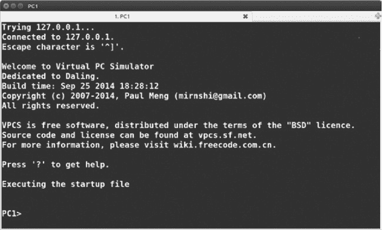

图 5-1. VPCS 控制台

如果你没有看到 VPCS 控制台，或者应用程序显示错误，请检查程序是否位于 Linux 系统中的 */usr/local/bin/* 目录下，并确保在 GNS3 的偏好设置中正确设置了路径。开发者提供的支持和文档非常有限，如果问题持续存在，你可能需要访问 GNS3 论坛 (*[`community.gns3.com/`](http://community.gns3.com/)*) 寻找可能的解决方案。

## VPCS 命令

VPCS 中的命令大多数是自解释的，但这里我会介绍其中几个命令，帮助你入门。要查看支持的命令列表，可以输入问号 `?`。要显示主机的配置，可以输入 `show` 命令。要显示特定命令的参数，可以输入命令名称后跟一个问号。例如，输入 `ping ?` 将显示 `ping` 命令的所有选项。

### 注意

*像思科 IOS 一样，VPCS 支持命令的简写语法。例如，`ping` 命令可以简写为 `p`。你可以简写任何 VPCS 命令，但必须输入足够的字母，使得命令能够与其他以相同字母开头的命令区分开来。*

## VPCS IP 地址配置

启动 VPCS 后，您需要配置主机以便与 GNS3 一起使用。通常，这只需要设置 IP 地址、子网掩码和网关地址。

VPCS 支持 IPv4 和 IPv6 地址。您可以手动配置 IP 地址，或者如果 GNS3 项目中运行了动态主机配置协议（DHCP）服务器，您也可以自动获取 IP 地址。要手动配置 IPv4 地址，您需要输入 *`ip-address mask gateway`*。以下示例将 IPv4 地址设置为 192.168.1.50，子网掩码设置为 255.255.255.0，默认网关设置为 192.168.1.1：

```
PC1> **ip 192.168.1.50 255.255.255.0 192.168.1.1**
```

您可以使用无类域间路由（CIDR）表示法输入相同的 IPv4 地址，代替标准的子网掩码，如下所示：

```
PC1> **ip 192.168.1.50 /24 192.168.1.1**
```

要手动配置 IPv6 地址，请输入`ip`命令后跟有效的 IPv6 地址和掩码。以下示例将 IPv6 地址设置为 2014:12:1a::50，并使用 64 位子网掩码：

```
PC1> **ip 2014:12:1a::50 /64**
```

要使用 DHCP 自动配置主机，请为每个需要地址的主机输入`dhcp`命令，如下所示：

```
PC1> **dhcp**
```

使用`save`命令保存您的 VPCS 设置与 GNS3 项目一起使用。

```
PC1> **save**
.  done
```

设置将保存在 GNS3 项目文件夹中的*GNS3/projects/<project_name>/project-files/vpcs/<vpcs_uuid>*路径下。稍后，当您加载 GNS3 项目时，配置设置将自动应用到主机上。

要测试 VPCS，请创建一个包含 VPCS 主机节点的项目，并将其连接到其他设备，如路由器。为您的 VPCS 主机和其他设备分配 IP 地址，然后使用`ping`或`trace`测试连通性。如果一切正常，您应该会收到类似以下的回复：

```
PC1> **ping 192.168.1.1**
192.168.1.1 icmp_seq=1 ttl=255 time=35.821 ms
```

成功 ping 通设备后，您可以使用`arp`命令检查 ARP 缓存（MAC 地址到 IP 表），如以下所示：

```
PC1> **arp**
cc:00:05:a9:00:00 192.168.1.1 expires in 114 seconds
```

如果 ping 不成功，VPCS 会显示“主机不可达”消息：

```
PC1> **ping 192.168.1.1**
host (192.168.1.1) not reachable
```

您可以通过验证 GNS3 中的路由器接口是否正常工作，并检查所有的 IP 地址和子网掩码是否已正确分配，来排除故障。

另一个原因可能是您计算机的防火墙设置，特别是如果您使用的是 Windows 计算机。通常，在使用 GNS3 时完全禁用防火墙是一个好主意，并可能解决此问题以及其他问题。

# VirtualBox

VPCS 是一个非常适合在 GNS3 中添加简单主机并测试连通性的工具，但有时您需要一个运行真实操作系统的主机，而不是模拟操作系统。这时，VirtualBox 就派上用场了。VirtualBox 可以运行大多数基于 PC 的操作系统，包括 Windows、Linux、FreeBSD 等。它还适用于运行网络操作系统，如 Arista vEOS、Juniper Firefly 和 NX-OSv。

使用 VirtualBox 的好处是它为您提供了运行实际操作系统的主机；但缺点是，这些操作系统可能需要您 PC 的大量资源。如果您只需要测试连通性，那么继续使用 VPCS 就可以，但如果您需要一个提供强大网络实用工具的主机（例如，测试 GNS3 网络的安全性），或者运行其他路由器或交换机操作系统，那么您可能需要使用 VirtualBox。

## 在 Windows 上安装

要在 Windows 上安装 VirtualBox，请从 VirtualBox 网站下载适当的安装程序（* [`www.virtualbox.org/`](http://www.virtualbox.org/)*）。启动安装程序并在看到欢迎屏幕后点击**下一步**，以打开自定义窗口。在此处进行任何所需的自定义设置，并按照屏幕上的说明完成安装。我建议接受默认值，以确保 VirtualBox 与 GNS3 正确运行。

安装完成后，您可以通过使用 Windows 开始菜单或点击 VirtualBox 图标来启动该应用程序。

## 在 OS X 上安装

要在 OS X 上安装 VirtualBox，请从 VirtualBox 网站下载适当的安装程序（* [`www.virtualbox.org/`](http://www.virtualbox.org/)*）并启动它。当 VirtualBox 安装屏幕出现时，双击**VirtualBox.pkg**图标并按照屏幕上的说明进行操作。安装需要提升权限，因此请准备好您的管理员密码。安装包安装完成后，您可以通过双击 VirtualBox 图标从*应用程序*文件夹中启动它。

## 在 Linux 上安装

VirtualBox 支持大多数 Linux 发行版，但请检查您的 Linux 包管理器，以验证它是否在您的特定平台上受支持。在 Ubuntu 和大多数其他基于 Debian 的 Linux 系统上，使用`apt-get`工具更新包管理器并安装 VirtualBox 的最新版本。确保您可以访问互联网，然后在终端窗口中输入以下命令：

```
$ **sudo apt-get update**
$ **sudo apt-get install virtualbox**
```

一旦工具安装完成，您可以通过打开终端窗口并输入`virtualbox`来启动它，或者通过 Linux 窗口管理器启动它。

## 导入设备

VirtualBox 的*设备*是一个预配置的虚拟机，通常运行定制的 Linux 发行版，您可以在 GNS3 项目中使用它。使用真实的操作系统比使用像 VPCS 这样的模拟器提供更多的命令和更大的灵活性。您可以从 GNS3 网站的下载部分下载预配置的 VirtualBox 设备。

在使用之前，必须先将虚拟设备导入到 VirtualBox 中。虚拟设备包的文件名以 *.ova* 结尾，表示 *Open Virtual Appliance*，通常被称为 *OVA* 文件。要导入虚拟设备，启动 VirtualBox，你将看到 VirtualBox 管理器窗口。在 VirtualBox 管理器中，你可以导入或创建新的虚拟机客户操作系统，并管理所有已安装的客户操作系统。导入虚拟设备是添加客户操作系统的快速且简便的方法，因为操作系统的配置和安装工作已经为你完成。

在 GNS3 网站上找到的虚拟设备通常经过优化，能够比标准安装的同一操作系统使用更少的计算机资源。不幸的是，这意味着你的虚拟设备可能没有你所需的所有命令或工具，但你应该能够通过其软件包管理器来更新或安装额外的软件。

在图 5-2 中，你可以看到 VirtualBox 已经配置了一个客户操作系统（Linux Microcore）。

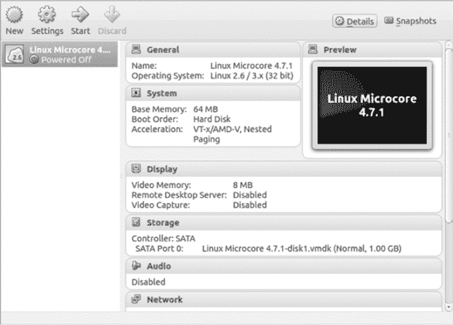

图 5-2. VirtualBox 管理器显示导入的 Linux 客户操作系统

选择客户操作系统时，会显示关于客户操作系统配置的基本信息，例如基础内存和分配给虚拟机的磁盘空间。要修改虚拟机的设置，选中客户操作系统并点击工具栏中的 **Settings**。就像真实的 PC 一样，虚拟 PC 客户操作系统通常在分配更多资源（如内存或额外的 CPU 核心）后运行得更好。

要导入 VirtualBox 客户操作系统，下载一个镜像文件并将其复制到用户目录中的一个文件夹。启动 VirtualBox，选择 **File** ▸ **Import Appliance**，然后点击 **Open Appliance** 并浏览到你保存文件的位置。选择镜像文件并点击 **Continue**，然后点击 **Import** 完成导入过程。要测试你的 VirtualBox 客户操作系统，点击 **Start**，操作系统应当像正常的 PC 一样启动并运行。

测试完新导入的操作系统后，你就可以开始配置 GNS3 的 VirtualBox 偏好设置了。

## VirtualBox 偏好设置

为了管理 VirtualBox 客户操作系统，GNS3 使用 VBoxManage 应用程序。这个程序在你安装 VirtualBox 时会自动安装。在将 VirtualBox 客户操作系统添加到 GNS3 之前，请验证 VBoxManage 的路径。启动 GNS3，选择 **GNS3** ▸ **Preferences**（在 OS X 上）或 **Edit** ▸ **Preferences**（在 Windows 和 Linux 上），然后点击 **VirtualBox**，以打开如图 5-3 所示的窗口。

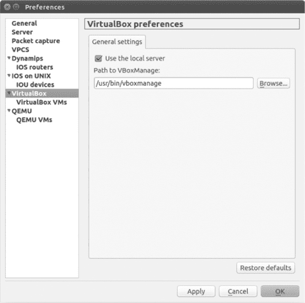

图 5-3. VirtualBox 常规设置标签页

在 Ubuntu Linux 中，常规设置选项卡中的路径应设置为*/usr/bin/vboxmanage*。根据需要调整路径，然后点击**应用**和**确定**。在 Windows 和 OS X 中，VBoxManage 路径通常不需要更改。

取消勾选**使用本地服务器**将允许你在创建 VirtualBox 主机时选择本地或远程 GNS3 服务器。保持勾选框选中，确保 VirtualBox 虚拟机始终在你的 PC 上本地运行。

如果在启动 VirtualBox 主机或打开主机的控制台连接时遇到问题，可能是一个或多个默认控制台端口号已被你 PC 上正在运行的另一个应用程序占用。要解决此问题，尝试关闭该应用程序或禁用 PC 防火墙。另一个可能的原因是你使用的 VirtualBox 虚拟机未配置为接受控制台连接。

## VirtualBox 虚拟机设置

配置（或至少审查）GNS3 中的 VirtualBox 首选项后，你需要设置一个或多个 VirtualBox 主机以供项目使用。首先在左侧面板中选择**VirtualBox 虚拟机**。点击**新建**，从虚拟机列表的下拉菜单中选择你的 VirtualBox 虚拟机，如图 5-4 所示。

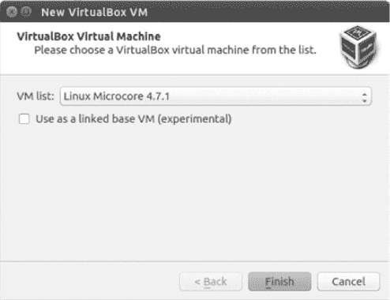

图 5-4. 新建 VirtualBox 虚拟机屏幕

单击**完成**以完成安装。你应该可以看到虚拟机当前分配的设置，如图 5-5 所示。

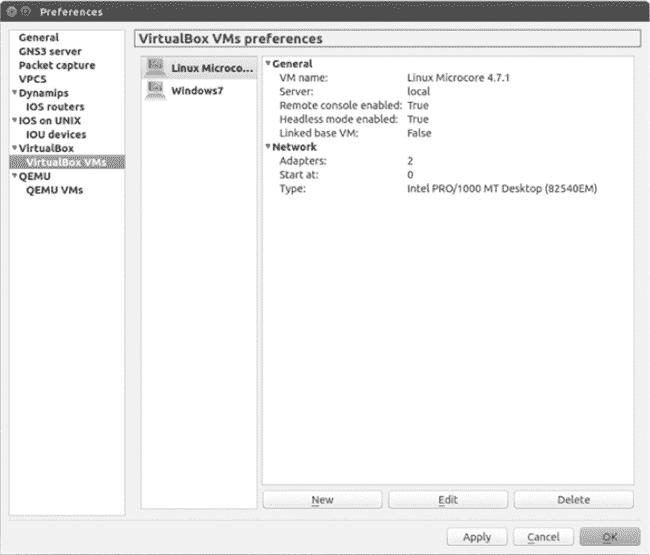

图 5-5. VirtualBox 虚拟机首选项

默认情况下，你的虚拟机设备可以在设备工具栏的“终端设备”下找到。通过右键点击首选项窗口中的虚拟机图标（此示例为 Linux Microcore），你可以为虚拟机分配不同的图标，并选择它将驻留在设备工具栏的位置。这样可以帮助你更好地组织所有的 GNS3 设备。

要修改虚拟机的设置，选择虚拟机并点击**编辑**。在大多数情况下，你需要进入常规设置选项卡，勾选**启用远程控制台**和**以无头模式启动虚拟机**框，如图 5-6 所示。第一个选项允许你从 GNS3 分配的终端应用程序访问运行中的虚拟机控制台；第二个选项会在你在 GNS3 中启动虚拟机时，防止 VirtualBox 打开控制台窗口。

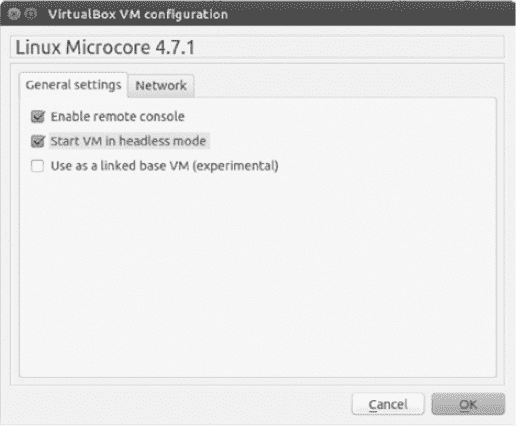

图 5-6. VirtualBox 虚拟机配置的常规设置选项卡

要修改网络设置，请点击**网络**选项卡。你可以更改虚拟机中安装的适配器数量、起始适配器编号（通常是 0 或 1），以及安装在虚拟机中的适配器类型。完成后，点击**应用**和**确定**以保存修改。

配置完虚拟机客户操作系统后，你可以在 GNS3 项目中使用它。

## 在项目中使用 VirtualBox 主机

要将 VirtualBox 主机添加到项目中，从“终端设备”窗口拖动 VirtualBox 主机节点图标到你的 GNS3 工作区。

每个 GNS3 项目中只能使用一次 VirtualBox 主机。如果你希望在一个项目中多次使用特定的 VirtualBox 主机，请启动 VirtualBox 并使用克隆功能创建虚拟机的克隆副本。

然后，启动 GNS3，按照之前概述的步骤在 VirtualBox 偏好设置中配置克隆的主机。下次你将 VirtualBox 主机节点添加到工作区时，克隆的操作系统将可用。

在将 VirtualBox 主机节点添加到工作区后，你可以将其链接到其他 GNS3 设备。

## 将 VirtualBox 主机节点链接到其他设备

要在 VirtualBox 主机节点和其他设备之间添加链接，请点击**添加链接**工具栏图标；然后点击你的 VirtualBox 主机节点并选择要用于该链接的接口。选择另一个设备并选择一个接口以完成连接。

要启动主机，右键点击 VirtualBox 主机节点图标并选择**启动**。通过在 VirtualBox 主机和它连接的设备上配置 IP 地址来测试连接；然后使用`ping`命令验证连通性。

在大多数 Linux 系统中，如 Microcore，你可以使用`ifconfig`和`route`命令手动配置 IP 地址和默认网关。要查看 Linux 中可用的网络接口卡（NIC），请使用不带任何配置选项的`ifconfig`命令。

```
$ **ifconfig**

eth0      Link encap:Ethernet HWaddr 08:00:27:7F:91:0A
          UP BROADCAST MULTICAST MTU:1500 Metric:1
          RX packets:0 errors:0 dropped:0 overruns:0 frame:0
          TX packets:0 errors:0 dropped:0 overruns:0 carrier:0
          collisions:0 txqueuelen:1000
          RX bytes:0 (0.0 B) TX bytes:0 (0.0 B)
          Interrupt:10 Base address:0xd020

eth1      Link encap:Ethernet HWaddr 08:00:27:C5:FC:66
          UP BROADCAST MULTICAST MTU:1500 Metric:1
          RX packets:0 errors:0 dropped:0 overruns:0 frame:0
          TX packets:0 errors:0 dropped:0 overruns:0 carrier:0
          collisions:0 txqueuelen:1000
          RX bytes:0 (0.0 B) TX bytes:0 (0.0 B)
          Interrupt:9 Base address:0xd060
```

### 注意

*并非所有 Linux 系统都使用`ifconfig`或`route`命令来配置 TCP/IP，但大多数系统使用。如果你的发行版中没有这些命令，请查看 Linux 文档，了解如何配置接口。*

如果你使用的是 Windows PC 虚拟机，你可以通过打开“网络和共享中心”并点击**更改适配器设置**来手动配置 IP 地址。右键点击你想配置的适配器，选择**属性**以修改 TCP/IP 设置，如图 5-7 所示。

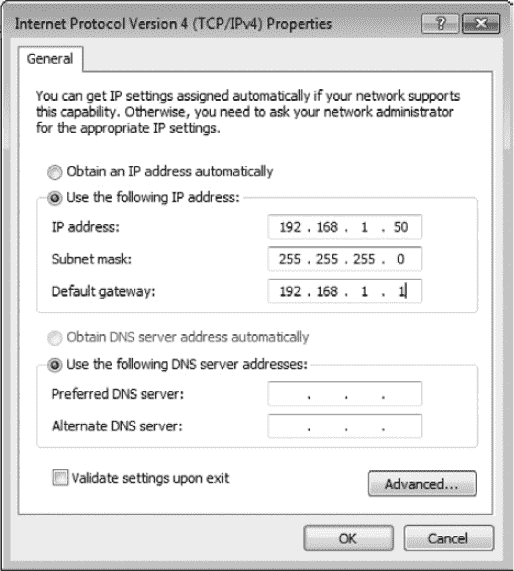

图 5-7. Windows TCP/IP 接口属性

输入你的 IP 地址信息并在完成后点击**确定**。如果你的 GNS3 项目中配置了 DHCP 服务器，你可以留空这些字段，并选择**自动获取 IP 地址**。

## 使用 Linux 虚拟机的简单 VirtualBox 项目

现在，您已将一个 Linux VirtualBox 虚拟机添加到 GNS3 中，让我们创建一个简单的项目，将主机与 Cisco IOS 路由器连接。首先创建一个项目，如 图 5-8 所示。将一个 VirtualBox Linux 主机和一个 Dynamips 路由器拖到工作区，并使用以太网交换机节点将它们连接起来。

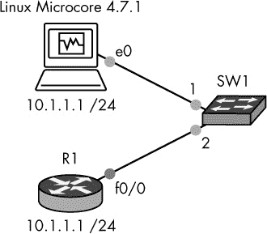

图 5-8. VirtualBox 主机和 Cisco IOS 路由器项目

启动设备并开始配置您的项目，通过为 VirtualBox Linux 主机的接口 eth0 分配 IP 地址。右键点击 Linux Microcore 节点并选择 **控制台** 打开终端。然后，在 Linux 终端中输入以下命令来分配 IP 地址：

```
$ **sudo ifconfig eth0 10.1.1.1 netmask 255.255.255.0 up**
```

接下来，打开 R1 路由器的控制台，为接口 f0/0 分配 IP 地址并启动接口。

```
R1# **configure-terminal**
R1(config)# **interface f0/0**
R1(config-if)# **ip address 10.1.1.2 255.255.255.0**
R1(config-if)# **no shutdown**
R1(config-if)# **exit**
R1(config)# **exit**
R1#
```

最后，通过从 R1 路由器 ping 您 Linux 主机的 IP 地址来测试连通性。

```
R1# **ping 10.1.1.1**

Type escape sequence to abort.
Sending 5, 100-byte ICMP Echos to 10.1.1.1, timeout is 2 seconds:
!!!!!
Success rate is 100 percent (5/5), round-trip min/avg/max = 8/16/32 ms
```

现在让我们来看看如何使用 Wireshark 分析您在 GNS3 网络中的数据包。

# Wireshark

Wireshark 是网络工程师最强大的数据包分析工具之一，而且是免费的！*数据包分析器*，有时也叫做 *数据包嗅探器*，是一款可以捕获 IP 数据包的软件，当数据包在您的网络中传输时，它能够捕捉到。然后，您可以打开数据包并分析其内容。像 Wireshark 这样的数据包嗅探器用于故障排除网络协议、阻止黑客攻击，甚至识别病毒，但初学者往往忽视它们。如果您是一个有抱负的网络工程师，将 GNS3 和 Wireshark 一起使用，是学习网络工作原理和网络协议运作的绝佳方式。

## 在 Windows 上安装

如果您使用 Windows 一体化安装程序安装了 GNS3，则 Wireshark 应该已经安装。如果您使用的是 OS X 或 Linux，则需要手动下载并安装 Wireshark。

## 在 OS X 上安装

在 OS X 上安装 Wireshark 之前，您需要安装 XQuartz，它是一个类似于 Linux 系统中 X.Org 的 OS X 版本 X Window 系统。

从 Mac OS Forge 网站下载适合的 XQuartz 版本 (*[`xquartz.macosforge.org/`](http://xquartz.macosforge.org/)*)。双击安装程序，然后点击 *XQuartz.dmg* 安装包。点击 **继续**，直到您到达欢迎界面，然后点击 **我同意** 和 **安装** 完成安装。

接下来，从开发者网站下载并安装 Wireshark (*[`www.wireshark.org/`](http://www.wireshark.org/)*)。双击下载的文件，然后点击 *wireshark.dmg* 安装包。在欢迎界面点击 **继续，我同意**，然后点击 **安装** 完成安装。

第一次启动 Wireshark 时，OS X 会询问 X Window 程序的位置。在文件窗口中，点击**浏览**，进入*应用程序/实用工具*文件夹，然后选择**XQuartz**。

### 注意

*第一次启动 Wireshark 时，XQuartz 会打开一个 Xterm 窗口，但不会启动 Wireshark。这个奇怪的现象可以通过关闭 XQuartz 并重新启动 Wireshark 来轻松解决。打开 Wireshark 可能需要一些时间，但这是正常现象。当应用程序启动时，您应该看到 Wireshark 的欢迎界面。*

现在 Wireshark 已经安装，我们来看看如何从项目中的设备捕获数据包。

## 在 Linux 上安装

要使用 Ubuntu Linux 上的高级包工具安装最新版本的 Wireshark，打开终端程序并输入以下命令：

```
$ **sudo apt-get update**
$ **sudo apt-get install wireshark**
```

在提示时确认安装，包将会被安装。安装过程完成后，Wireshark 应该可以使用了。

## 在 GNS3 中捕获数据包

要开始捕获数据包，请右键点击两个设备之间的链接并选择**开始捕获**，如图 5-9 所示。（要停止捕获，右键点击相同的链接并选择**停止捕获**。）

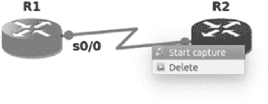

图 5-9。开始捕获数据包。

GNS3 会提示您选择源设备、接口名称以及用于捕获数据的封装类型。您可以在以太网和串行接口上捕获数据。在以太网连接上，您只能选择以太网封装：DLT_EN10MB，但在串行连接上，您可以选择 Cisco HDLC 封装：DLT_C_HDLC、Cisco PPP 封装：DLT_PPP_SERIAL 或帧中继封装：DLT_FRELAY。

要捕获标准的 Cisco 串行数据（高级数据链路控制），选择**HDLC**；要捕获串行点对点协议数据，选择**PPP**；要捕获帧中继数据，选择**FRELAY**。使用下拉菜单进行选择，如图 5-10 所示。

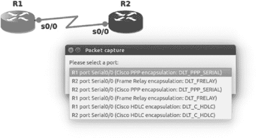

图 5-10。选择串行数据包捕获源

在做出选择并点击**确定**后，GNS3 将打开 Wireshark 并开始捕获数据包，如图 5-11 所示。请注意，Wireshark 窗口被分为三个不同的面板。

+   ****➊ 数据包列表窗格**** 窗口的顶部窗格专门用于显示正在捕获的单个数据包。数据包字段显示在顶部，包括数据包序列号（No.）、时间戳（Time）、源 IP 地址（Source）、目标 IP 地址（Destination）、协议名称（Protocol）、帧长度（Length）和信息字段（Info）。包含不同协议类型的数据包以不同颜色显示，帮助识别它们。

+   ****➋ 数据包详情窗格**** 在从数据包列表中选择一个数据包后，数据包的协议和协议字段的详细信息将显示在中间窗格中。你可以展开或折叠字段，以显示或隐藏它们的详细信息。显示的字段名称是特定于捕获的数据包类型的，会根据不同的数据包类型而变化。

+   ****➌ 数据包字节窗格**** 主窗口的下部窗格以十六进制格式显示原始数据，右侧显示 ASCII 字符。这是数据在网络上传输时的原始样子。Wireshark 允许你以十六进制或二进制格式查看这些信息。

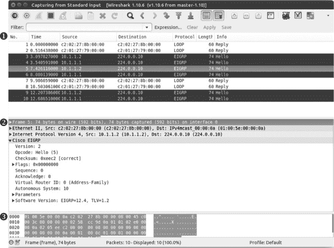

图 5-11. 来自 GNS3 的简单 Wireshark 捕获

如果你在数据包列表中没有看到任何数据包，关闭 Wireshark 并停止捕获。确保你的路由器接口已启用并分配了 IP 地址，然后重新启动捕获并再次启动 Wireshark。

### 注意

*要了解更多关于使用 Wireshark 的内容，我强烈推荐阅读* Practical Packet Analysis, 第二版 *，作者 Chris Sanders（No Starch Press，2011）。你甚至可以成为 Wireshark 认证网络分析师（WCNA）。*

要更改 Wireshark 在 GNS3 中的默认行为，请进入**首选项**并选择**数据包捕获**。为了防止 GNS3 在捕获数据包时自动启动 Wireshark，请取消选中**自动启动数据包捕获应用程序**，如图 5-12 所示。

你可以选择保存数据包捕获并稍后分析。为此，选择下拉菜单中的**Wireshark 传统捕获**（在预配置的数据包捕获读取命令下），然后点击**设置、应用**和**确定**。现在，当 GNS3 捕获数据时，它会自动将捕获的文件保存在项目文件夹中的一个名为*captures*的目录下，如*GNS3/projects/<project_name>/project-files/captures/*。

要查看已保存的数据包捕获，请在 PC 上启动 Wireshark，选择**文件** ▸ **打开**，浏览到*captures*文件夹，选择一个捕获文件。*.pcap* 捕获文件会以参与捕获的 GNS3 设备命名，如*R1_FastEthernet0-0_to_R2_FastEthernet0-0.pcap*。

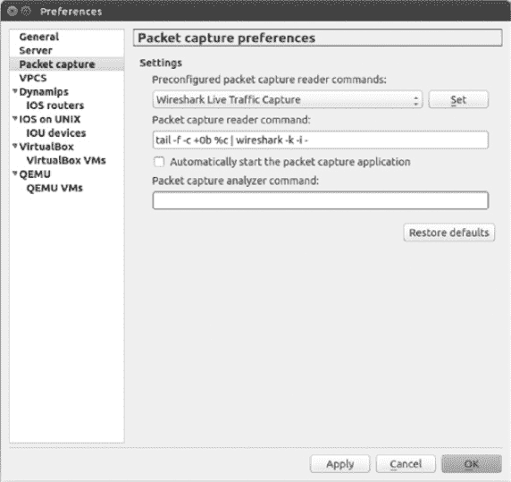

图 5-12. Wireshark 捕获首选项

要了解更多关于 Wireshark 的信息，可以查看在线用户指南 (*[`www.wireshark.org/docs/wsug_html_chunked/`](http://www.wireshark.org/docs/wsug_html_chunked/)*)。它结构清晰，提供了大量关于使用该软件的信息。

# 最后的思考

GNS3 的一个关键特点是其模块化设计及使用其他开源软件扩展项目的能力。通过 VPCS，你可以添加大量简单的 PC 主机，而使用 VirtualBox，你可以运行像 Linux 这样的完整操作系统。这一特性使得 GNS3 具有很强的扩展性，因为任何在 VirtualBox 中运行的网络操作系统都可以被添加到你的 GNS3 项目中。

Wireshark 是最常被低估的工具之一，但它也是最强大的工具之一。通过 Wireshark，你可以深入挖掘，真正看到你网络上发生的事情。无论你是网络新手还是已经获得网络认证，使用 Wireshark 并检查数据包是一个磨练技能、加深对网络协议理解的好方法。

在第六章中，你将学习到 Quick Emulator，另一种开源 PC 模拟器，并用它创建一个特别的 PC 版本的 Juniper Junos 操作系统，名为 Juniper Olive。Juniper Olive 允许你将功能完整的 Juniper 路由器添加到你的 GNS3 项目中。
