# 第六章. Juniper Olive 和 VSRX Firefly

你可以通过几种方式在 GNS3 中安装并运行 Juniper 路由器。在本章中，我将向你展示如何使用 VirtualBox 和快速仿真器（QEMU）来创建 GNS3 可用的 Juniper 设备，并安装 Juniper 的 vSRX Firefly 防火墙。

QEMU 是一个开源的 PC 仿真器，类似于 VirtualBox。它的界面不如 VirtualBox 精致，但有许多强大的功能，并且与 GNS3 完全集成。使用 QEMU，你可以运行许多网络操作系统，包括 Cisco ASA、IDS、IOS-XR、NX-OSv，以及一种特别版本的 Juniper 的 Junos OS，称为 Juniper Olive。在本章中，我只关注 Juniper。

# 在 Windows 和 OS X 上安装 QEMU

如果你在 Windows 或 OS X 上安装了 GNS3，那么 QEMU 应该已经为你安装好了。GNS3 安装程序可能已经安装了两个版本的 QEMU：一个稳定版本，已经在 GNS3 安装过程中自动配置，另一个是包含额外未经过测试功能的更新版本。如果你需要项目完全稳定，我建议只使用预配置的版本。

如果你按照第二章中概述的默认设置安装了 GNS3，那么你应该可以在 32 位和 64 位 Windows 系统下的*C:\Program Files\GNS3\qemu-0.13.0*目录中找到 QEMU 应用程序，但请记住，随着 QEMU 的新版本引入并加入到 GNS3 中，这个目录可能会发生变化。在 OS X 上，你应该可以在*/Applications/GNS3.app/Contents/Resources/qemu/bin/*目录下找到 QEMU。

# 在 Linux 上安装 QEMU

在 Ubuntu 上，QEMU 可以通过包管理器安装或从源代码编译安装。要通过包管理器安装，更新你的包管理器并通过命令行安装 QEMU。

```
$ **sudo apt-get update**
$ **sudo apt-get install qemu**
```

另外，你也可以安装`qemu-system-x86`包。这是一个更小的安装，应该能够运行你想要在 GNS3 中使用的任何操作系统。要安装 x86 架构版本的 QEMU，可以使用以下命令：

```
$ **sudo apt-get install qemu-system-x86**
$ **sudo apt-get install qemu-utils**
```

你可能想要从源代码编译 QEMU，具体取决于你系统上可用的 QEMU 版本。尽管许多 Linux 发行版上有预编译的 QEMU 包，但它们可能不是最新版本，并且可能不包括提供 QEMU 图形用户界面的 GTK 工具包。在这种情况下，你可以通过安装 VNC 查看器程序（如 GNC Viewer）来访问 QEMU 界面。

当你从源代码安装时，你还需要在编译源代码之前安装 QEMU 所需的其他软件包。现在更新你的包管理器并安装这些软件包：

```
$ **sudo apt-get update**
$ **sudo apt-get install flex**
$ **sudo apt-get install bison**
$ **sudo apt-get install zlib1g-dev**
$ **sudo apt-get install libglib2.0-dev**
$ **sudo apt-get install libgtk2.0-dev**
$ **sudo apt-get install libncurses5-dev**
$ **sudo apt-get install libpcap-dev**
$ **sudo apt-get install dh-autoreconf**
```

接下来，从 QEMU 官网（*[`www.qemu-project.org/`](http://www.qemu-project.org/)）下载 QEMU 源代码并解压文件，如下所示：

```
$ **wget http://www.qemu-project.org/download/qemu-2.1.2.tar.bz2**
$ **bunzip2 qemu-2.1.2.tar.bz2**
$ **tar xvf qemu-2.1.2.tar**
```

解压文件后，进入 QEMU 安装目录，并输入`configure`和`make`命令来编译源代码。

```
$ **cd qemu-2.1.2**
$ **./configure**
$ **make**
```

最后，通过使用提升的 root 权限安装编译后的文件来完成安装过程。

```
$ **sudo make install**
```

安装完成后，您应该可以在*/usr/local/bin/*目录下找到 QEMU 二进制文件，QEMU 支持文件应位于*/usr/local/share/qemu/*目录中。

安装了 QEMU 后，您就可以开始在 GNS3 中创建和使用 QEMU 设备了。

# 介绍 Juniper

大多数人都听说过思科（Cisco），但相对较少人听说过 Juniper Networks。像思科一样，Juniper 生产广泛的网络硬件，互联网服务提供商使用其超高吞吐量的设备来高效地为客户路由数十亿个数据包。

所有 Juniper 设备都基于一个共同的 FreeBSD 代码库设计，尽管并非所有 Juniper 设备都运行 FreeBSD 操作系统。相反，它们仅使用 FreeBSD 的内核作为另一个操作系统——Junos OS 的框架。然而，由于 Junos OS 是基于 FreeBSD 设计的，您可以在 PC 上运行一个特别版本的软件，称为 Juniper Olive。

Juniper Olive 是 Junos OS 的一个功能版本。因为它运行在普通 PC 上，而不是实际的 Juniper 机箱，所以它缺乏专有的 ASIC 硬件来实现与真实 Juniper 设备相同的高吞吐量。除此之外，它就是 Junos OS 的真实版本，而不是操作系统的模拟版本。这使得它非常适合用于学习 Juniper Networks 认证助理（JNCIA）认证以及其他入门级认证。

### 注意

*Juniper 还提供了另一款虚拟路由器，叫做 vMX，它可以在裸机 x86 硬件上运行，也可以通过 QEMU、VirtualBox 或 VMware 作为虚拟机运行，允许它集成到 GNS3 中。这就是 Juniper 所称的可扩展“按需付费”解决方案。*

Juniper 伸出橄榄枝

Juniper Olive 据说是 Juniper 公司内部版本的 Junos OS，仅供 Juniper 开发人员使用，不面向公众，但只有 Juniper 公司知道确切情况。如果您联系公司，他们会告诉您这是一个“未支持版本”。Juniper 不会向您提供软件，也不会为您提供任何支持。然而，GNS3 完全支持 Juniper Olive 集成，允许您将 Juniper 路由器添加到 GNS3 项目中。

# 安装 Juniper

有人说过，如果你给一个人一条鱼，你就喂饱他一天；但如果你教会一个人钓鱼，你就喂饱他一辈子。这句谚语在创建 Juniper Olive 时非常适用，所以让我们一起去钓鱼吧！尽管有许多方式可以配置和安装 Olive（包括自动化过程的脚本或可以在互联网上找到的预配置虚拟机），但手动学习可以让你在新版本的 Olive 发布时根据需要调整参数。

在与 GNS3 一起使用时，Juniper Olive 软件通常通过 VirtualBox 或 QEMU 安装。在本节中，您将使用 QEMU，但在创建 Olive 之前，您的系统必须满足以下要求：

+   8GB 可用磁盘空间

+   1024MB 可用内存用于 QEMU/Juniper

+   您的系统上已安装 QEMU

+   FreeBSD-4.11 mini ISO

+   Juniper Olive 软件

让我们来看一下如何创建 Olive 并获取相关软件。

## 流程概述

Juniper Olive 安装软件的工作方式有点像一个常见的寄生虫，以 FreeBSD 为其不知情的宿主。为了创建 Olive，你需要使用 QEMU 或 VirtualBox 安装一份 FreeBSD。接下来，你需要将 Juniper Olive 软件的 gzipped tarball 文件复制到 FreeBSD 虚拟机中。在那里，你将解压包并进行一些小的修改，然后将文件重新打包成 FreeBSD 可安装包。最后，你将安装该包并重启 FreeBSD 系统。

到这里，事情变得有趣了。第一次启动系统时，Juniper Olive 软件将入侵 FreeBSD 宿主系统。它会重新分区 FreeBSD 硬盘，复制新文件到系统，并保留任何它需要的 FreeBSD 文件。完成后，你应该会拥有一个功能正常的 Juniper 路由器。

## 获取 FreeBSD

安装 FreeBSD 需要一个 FreeBSD CD 镜像。可以找到多个适合创建 Juniper Olive 的版本，但我推荐使用迷你 ISO。它包含所有必要的文件，并且下载速度最快。从 FreeBSD 存档中下载 *4.11-RELEASE-i386-miniinst.iso* 文件 (*ftp://ftp-archive.freebsd.org/*)。我推荐使用这个版本的 FreeBSD，而不是更新版本，因为它似乎与几乎所有 Olive 版本兼容。

### 注意

*你可以在 GNS3 网站的下载区找到一个已经安装了 FreeBSD 的 QEMU（和 VirtualBox）镜像* ([`www.gns3.com/`](http://www.gns3.com/)) *，在 QEMU 设备下。*

## 获取 Juniper Olive 软件

接下来，你需要获取 Juniper Olive 软件。该软件可以作为 FreeBSD 可安装包提供，文件名应类似于 *jinstall-12.1R1.9-domestic-olive.tgz*。由于 Juniper Olive 不再由 Juniper 官方支持，因此无法直接从 Juniper 获取该软件。

# 创建 Juniper Olive CD 镜像文件

拥有 Juniper Olive 软件后，你需要一种方法将该软件包复制到 FreeBSD 虚拟机中进行安装。有多种方法可以实现这一点，但最简单的方法是将 ISO 镜像文件挂载到 FreeBSD 虚拟机上，就像挂载常规 CD 一样。在此之前，你需要创建自己的 Olive 软件 ISO 镜像文件。

## 在 Windows 中创建 ISO

要在 Windows 中创建 ISO 镜像文件，首先需要安装 ISO 镜像创建软件。我推荐使用 ISO Recorder (*[`isorecorder.alexfeinman.com/isorecorder.htm`](http://isorecorder.alexfeinman.com/isorecorder.htm)*). 它是免费的，易于安装，而且工作良好。下载该软件并启动安装程序。然后点击 **下一步** 并按照提示完成安装。

安装 ISO Recorder 后，你应该能够创建 Juniper Olive 软件的 ISO 镜像。创建一个文件夹并将你的 gzipped Olive 文件复制到该文件夹中（例如命名为*juniper-olive*）。然后，右键点击该文件夹并选择**创建 ISO 镜像文件**。

如图 6-1 所示，ISO Recorder 创建向导会出现。

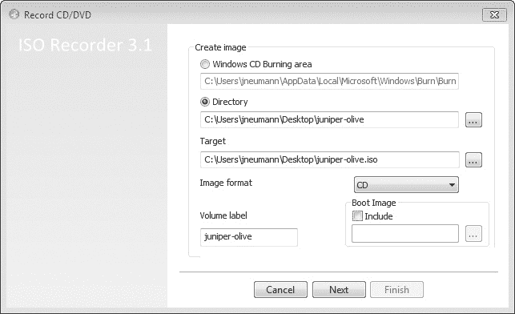

图 6-1. ISO Recorder 创建向导

在创建镜像下，选择**目录**单选按钮，将镜像格式更改为**CD**，点击**下一步**，并按照提示创建 ISO 镜像。在你拥有 Juniper ISO 后，你就可以在 Windows 上安装 Juniper Olive。

## 在 OS X 中创建 ISO 镜像

在运行 OS X 的计算机上，将你的 Juniper 镜像文件复制到一个文件夹中，并使用`hdiutil`创建该文件夹内容的 ISO 镜像。在以下列表中，我使用名为*JUNOS*的文件夹创建了一个名为*juniper-olive.iso*的 ISO 镜像文件：

```
$ **mkdir JUNOS**
$ **cp jinstall-12.1R1.9-domestic.tgz JUNOS**
$ **hdiutil makehybrid -iso -joliet -o juniper-olive.iso JUNOS**
```

现在你已经拥有适合的 Olive 软件 ISO 镜像，你可以准备在 OS X 上安装 Juniper Olive。

## 在 Linux 中创建 ISO

在 Ubuntu Linux 上创建 ISO 镜像与在 OS X 上几乎相同，不同之处在于你使用的是`mkisofs`应用程序。将你的 Juniper 镜像文件复制到一个文件夹中（例如命名为*JUNOS*），然后输入以下命令来创建 ISO：

```
$ **mkdir JUNOS**
$ **cp jinstall-12.1R1.9-domestic.tgz JUNOS**
$ **mkisofs -o juniper-olive.iso JUNOS**
```

现在你已经有了 ISO 镜像，剩下的就是做几个步骤，然后就可以创建 Juniper Olive。

# 使用 QEMU 安装和配置 FreeBSD

创建 Juniper Olive 的第一步是创建一个 FreeBSD 的 QEMU 虚拟机。QEMU 没有图形用户界面，所以你将通过命令行完成所有操作。你将使用`qemu-img`程序创建虚拟磁盘镜像文件，并使用`qemu`程序来安装和测试你的虚拟机。

### 注意

*并非所有 QEMU 安装都相同。在某些安装中，QEMU 应用程序文件可能被命名为* qemu-system-i386 *或* qemu-system-x86_64*，或者你可能同时安装了这两个版本。如果不确定，请检查你的 QEMU 安装目录。*

## 准备你的构建目录

首先创建一个构建目录，然后将 FreeBSD 安装 ISO 和 Juniper Olive ISO 文件复制到该目录，示例如下：

```
$ **mkdir Juniper**
$ **cp 4.11-RELEASE-i386-miniinst.iso Juniper**
$ **cp juniper-olive.iso Juniper**
```

如果你使用的是 Windows，请打开命令提示符窗口并输入以下命令：

```
c: **mkdir Juniper**
c: **copy 4.11-RELEASE-i386-miniinst.iso Juniper**
c: **copy juniper-olive.iso Juniper**
```

现在你的构建目录中的所有准备工作都已完成，可以开始安装系统了。

## 安装一个适用于 Junos 的 FreeBSD 系统

在本节中，你将使用`qemu-img`创建虚拟硬盘，并在该虚拟硬盘上安装 FreeBSD。我将只涵盖为 Olive 准备 FreeBSD 的基本步骤，不会详细讲解 FreeBSD 本身。

### Windows 和 OS X 的初步检查

如果你是 Windows 用户，请在开始之前从“程序和功能”控制面板安装 Telnet 客户端应用程序。

如果你是 OS X 用户，你需要将 QEMU 文件目录添加到 OS X 的搜索路径中。验证 QEMU 文件的安装路径。如果你是手动安装 QEMU，应该在 */opt/local/bin* 或 */usr/local/bin* 中找到 *qemu-img* 文件。如果你使用的是与 GNS3 一起安装的 QEMU，应该在 */Applications/GNS3.app/Contents/Resources/qemu/bin/* 目录下找到该文件。输入以下命令将 QEMU 二进制文件添加到你的 OS X 搜索路径中。开始之前，先备份 `.bash_profile` 文件。

```
$ **cd ~**
$ **cp .bash_profile .bash_profile-backup**
$ **sudo echo 'export PATH=/Applications/GNS3.app/Contents/Resources/qemu/**
**bin:$PATH' >> .bash_profile**
```

输入命令后，关闭并重新打开一个终端窗口以启用新的搜索路径。为了验证路径是否正确，输入以下命令：

```
$ **echo $PATH**
```

上一个命令将显示你的路径配置。如果路径不正确，你可能需要恢复你的 *.bash_profile-backup* 文件并重新尝试。如果路径正确，那么你就可以继续操作了。

### 开始使用

通过在构建目录中创建一个名为 *juniper.img* 的 8GB 虚拟磁盘映像文件来开始安装。这里使用的 *qemu-img* 命令选项适用于所有类 Unix 系统。

```
$ **cd Juniper**
$ **qemu-img create juniper.img 8G**
```

接下来，使用以下命令从 FreeBSD mini ISO 启动 QEMU：

```
$ **qemu-system-i386 -m 512 -hda juniper.img -localtime -cdrom 4.11-RELEASE**
**i386-miniinst.iso**
```

Windows 用户应打开命令提示符窗口，并使用以下命令代替。如果 QEMU 未在你的 Windows 路径中，记得输入 `path` 命令。

```
c: **cd Juniper**
c: **path="c:\program files\GNS3\qemu-0.13.0"**
c: **qemu-img create juniper.img 8G**
c: **qemu-system-i386w -m 512 -hda juniper.img -localtime -cdrom 4.11-RELEASE-**
**i386-miniinst.iso**
```

当 FreeBSD 启动时，内核配置菜单将出现，如图 6-2 所示。

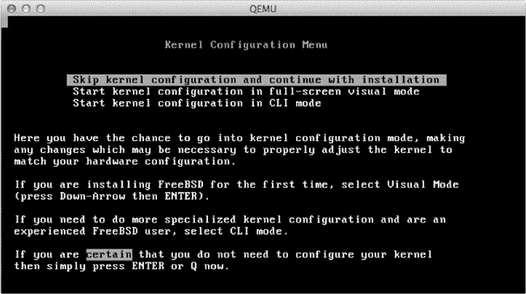

图 6-2. FreeBSD 内核配置菜单

按 ENTER 键跳过内核配置并继续安装。

接下来，FreeBSD sysinstall 主菜单将出现，如图 6-3 所示。

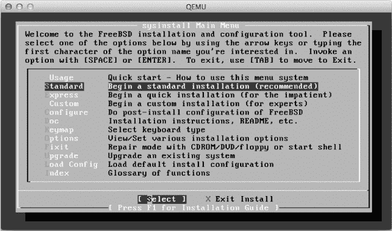

图 6-3. sysinstall 主菜单

使用箭头向下移动，选择 **Standard** 开始标准安装，然后按 ENTER 继续。

### 分区文件系统

下一屏幕，如图 6-4 所示，显示了使用 FDISK 分区编辑器的基本信息。

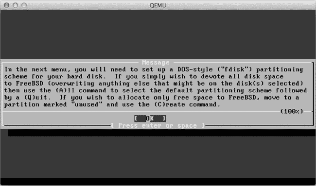

图 6-4. FDISK 分区信息屏幕

阅读说明并按 ENTER 继续进入 FDISK 分区编辑器菜单，如图 6-5 所示。

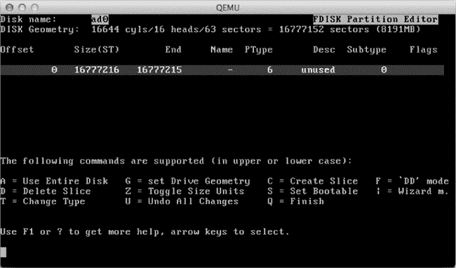

图 6-5. FDISK 分区编辑器菜单

FDISK 分区编辑器允许你选择分配给 FreeBSD 的磁盘空间。选择 **A** 使用整个磁盘，然后选择 **Q** 完成。

接下来应该出现安装引导管理器菜单，如图 6-6 所示。

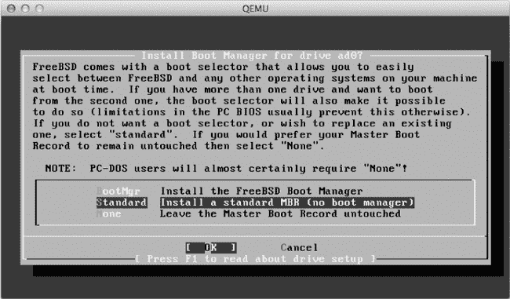

图 6-6. 安装引导管理器菜单

使用箭头键向下移动，选择**Standard**来安装标准的主引导记录（MBR），然后按 ENTER 继续。

然后 FreeBSD 会显示一条关于在你新创建的 FDISK 分区内创建 BSD 分区的消息，如图 6-7 所示。

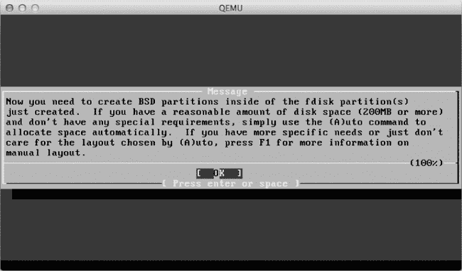

图 6-7. BSD 分区消息

阅读完消息后，按 ENTER 继续进入 FreeBSD 磁盘标签编辑器。

下一步是创建*适用于 Juniper 的分区*。你需要特别注意虚拟硬盘的分区方式，因为 Juniper Olive 包必须能够看到正确的 FreeBSD 分区，否则安装会失败。你还必须按特定顺序创建分区。

要创建你的第一个分区，选择**C**并在提供的字段中输入分区大小，如图 6-8 所示。


图 6-8. 指定分区大小。

我输入了 1024M 以创建一个 1GB 的分区。按 ENTER 接受此值，然后你将看到分区类型选择屏幕，如图 6-9 所示。

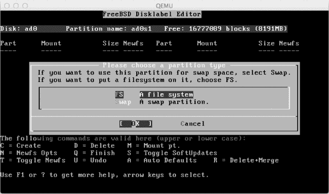

图 6-9. 选择分区类型。

按 ENTER 创建文件系统（FS）分区类型，然后你将看到选择分区挂载点的选项，如图 6-10 所示。

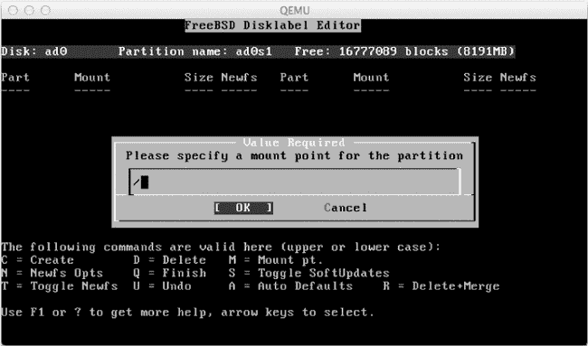

图 6-10. 选择分区的挂载点。

要为根分区创建挂载点，输入正斜杠（**`/`**），然后按 ENTER 完成第一个分区的配置。

使用表 6-1，按照相同的步骤创建完整的文件系统布局。顺序很重要！在创建根分区 (`/`) 后，按照顺序继续往下创建，最后创建 `/var` 分区。当到达交换分区时，确保选择 `swap` 而不是 `FS` 作为分区类型。`/var` 分区是最后一个，所以创建时接受默认的分区块大小。此值使用分区上的剩余空间。记住，如果分区没有按顺序创建，分区名称将与挂载点不匹配，Juniper Olive 将无法正确安装。

表 6-1. Juniper Olive 的 FreeBSD 分区

| 分区 | 挂载点 | 大小 |
| --- | --- | --- |
| ad0s1a | `/` | 1024 MB |
| ad0s1b | `swap` | 1024 MB |
| ad0s1e | `/config` | 1024 MB |
| ad0s1f | `/var` | 剩余空间 |

有很多方法可以在准备安装 Olive 时对 FreeBSD 进行分区，但我发现这种方法在不同版本的 Juniper Olive 中最为可靠。完成后，文件系统应与图 6-11 中的布局完全相同。

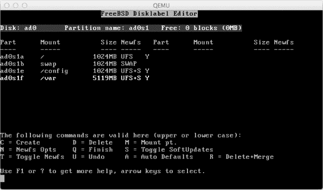

图 6-11. 完全配置的适用于 Juniper Olive 的分区布局

一旦配置好所有分区，选择**Q**完成分区过程，然后选择你的发行版，如图 6-12 所示。

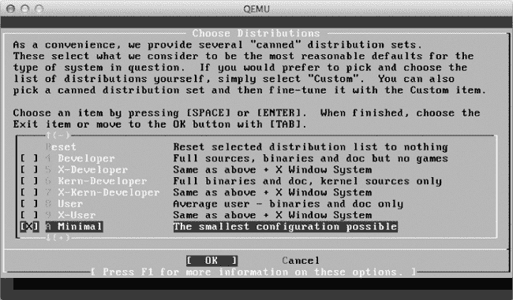

图 6-12. FreeBSD 发行版选择

使用箭头键向下滚动，选择**Minimal**，然后按空格键进行选择。现在按 TAB 键选择**OK**，然后按 ENTER 完成操作。

### 完成 FreeBSD 安装

接下来，选择你的安装介质，如图 6-13 所示。

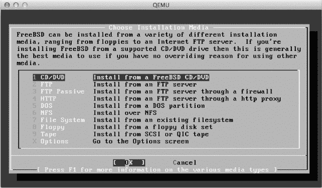

图 6-13. 选择安装介质

按 ENTER 选择**CD/DVD**作为安装介质，安装将开始。完成后，将显示图 6-14 中的消息。

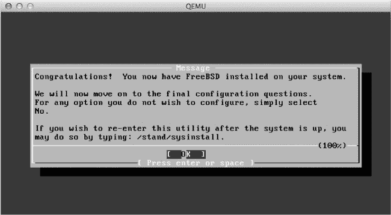

图 6-14. 文件安装完成消息

因为你正在使用 FreeBSD 作为 Junos OS 的主机，所以你不需要关注此屏幕后面的任何 FreeBSD 配置问题。对所有剩余的问题回答“no”，当系统询问是否为 root 账户创建密码时，按 ENTER 键保持空白。回答完所有问题后，允许系统重启，登录为*root*，并使用`halt`命令关闭 FreeBSD。然后关闭窗口并退出 QEMU 程序。

# 在 FreeBSD 中安装 Juniper Olive 包

现在 FreeBSD 安装完成，你可以安装 Juniper Olive 包。

## 启动并运行你的 Olive

使用以下命令通过 QEMU 启动 FreeBSD，以确保你可以挂载之前创建的*juniper-olive.iso* CD 镜像文件。（在 Windows 上，将 `qemu-system-i386` 替换为 `qemu-system-i386w`。）

```
**qemu-system-i386 -m 512 -hda juniper.img -localtime -cdrom juniper-olive.iso**
```

如果 FreeBSD 正常加载，应该会出现登录提示。按照提示以*root*身份登录；你不需要输入密码，只需按 ENTER 键。然后使用 `mount` 命令挂载*juniper-olive.iso* CD 镜像。

```
# mount /cdrom
```

在 `/var` 分区上创建一个名为*olive*的临时目录，并将 Juniper Olive 包解压到该临时目录中。

```
# mkdir /var/tmp/olive
# cd /var/tmp/olive
# tar zxvf /cdrom/jinstall-12.1R1.9-domestic.tgz
```

接下来，修改 Junos OS，以允许你在 QEMU 虚拟机上安装软件。

```
# mkdir temp
# cd temp
# tar zxvf ../pkgtools.tgz
# cp /usr/bin/true bin/checkpic
```

从*pkgtools.tgz*中提取*pkgtools*目录到*olive*目录中的另一个*temp*目录，并用 FreeBSD 的*true*文件替换*checkpic*文件。这将移除 Junos OS 的 checkpic 保护。

修改后，将*temp*目录中的内容重新压缩为名为*pkgtools.tgz*的 tarball，并删除你创建的*temp*目录。

```
# tar zcvf ../pkgtools.tgz *
# cd ..
# rm -rf temp
```

接下来，创建一个新的 Olive 安装包，并将其安装到你的 FreeBSD 系统中。在以下清单中，我将安装包命名为*olive.tgz*：

```
# tar zcvf ../olive.tgz *
# pkg_add -f ../olive.tgz
```

安装 Olive 包后，你应该看到一个错误信息，后面跟着一些警告信息，这些信息告诉你该包将删除任何非 Junos 配置文件，并且你需要重启以加载 Junos OS 软件。

屏幕上显示的其他任何指示可以忽略，因为它们适用于实际的 Juniper 路由器，而不是 PC 上的 Olive 安装。然而，在继续之前，你需要使用 `halt` 命令关闭 FreeBSD 系统并退出 QEMU。

```
# halt
```

安装 Olive 的最后一步是重启系统，并给予安装包足够的时间来完成对 FreeBSD 的接管。在这一点上，你必须为安装程序提供额外的内存，否则安装将失败。虽然 Junos OS 在 512MB 的 RAM 下可以正常运行，但安装程序需要 1024MB 的 RAM 来创建它在安装过程中使用的 RAM 磁盘。

在 Linux 和 OS X 中，用 1024MB 的 RAM 启动 Juniper Olive 来完成安装，具体如下：

```
$ **sudo qemu-system-i386 -m 1024 -hda juniper.img -serial telnet:127.0.0.1:1001,**
**server,nowait,nodelay -localtime**
```

Windows 用户应输入以下命令：

```
c: **qemu-system-i386w -m 1024 -hda juniper.img -serial telnet:127.0.0.1:1001,**
**server,nowait,nodelay -localtime**
```

系统启动后，你可以通过 telnet 连接到本地主机的 1001 端口，来观看 Olive 软件的安装过程。（在 Windows 上，你可能需要先从“程序和功能”控制面板安装 Telnet 客户端程序。）打开第二个 Windows 命令提示符或终端窗口，输入以下命令，查看安装输出显示在控制台上：

```
**telnet localhost 1001**
```

我强烈建议你监控安装过程。这是排查问题的好方法，万一出现问题，你也能知道为什么安装失败。一个常见的问题是没有为虚拟机分配足够的内存；另一个问题是你的分区大小太小或创建不正确。

Juniper Olive 的安装可能需要 15 分钟或更长时间，这取决于你的硬件，因为安装程序需要执行很多任务，例如重新分区你的 FreeBSD 硬盘并提取各种软件包。当一切完成后，系统应该会自动重启，加载 Junos OS，并呈现一个看起来像是 FreeBSD 登录提示符的界面，见 图 6-15。

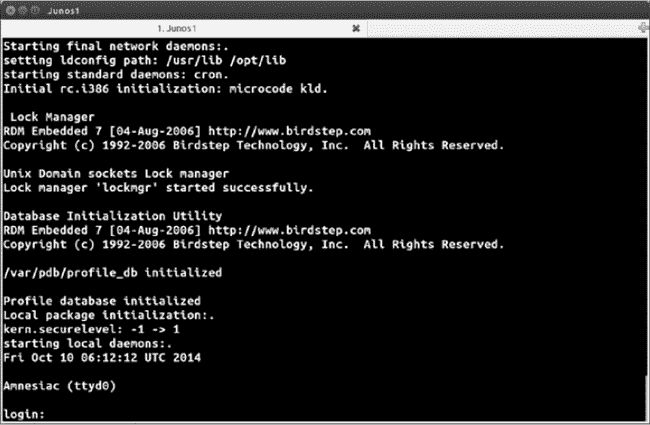

图 6-15. 成功的 Junos OS 启动消息和登录

这个提示符是你登录 Junos OS 的地方。如果你看到之前的消息和登录提示符，那么你的 Juniper 路由器已准备好使用。

## 备份 Juniper Olive

在你创建了一个有效的 Olive 之后，为了安全起见，制作镜像的备份副本。毕竟，谁想再做一遍那些工作呢？我可不想！

首先，正确关闭 Junos OS，以防触发脏文件系统。脏文件系统是指文件未正确关闭时发生的情况。这种情况可能导致文件损坏，甚至可能损坏 Junos 操作系统。如果文件系统被标记为脏，下次启动 Junos OS 时会触发文件系统检查，直到系统检查并重新标记为干净（意味着没有发现错误，或者所有错误已被修复）之前，启动过程可能比平时更长。

要关闭 Junos OS，作为 *root* 用户登录（无需密码），然后输入以下命令：

```
Login: **root**
root@% **cli**
root> **request system halt**
Halt the system ? [yes,no] (no) **yes**
```

在看到操作系统已停止的消息后，可以安全退出 QEMU，如下所示：

```
The operating system has halted.
Please press any key to reboot.
```

要备份你的 Juniper 镜像，请在保存镜像文件的目录中输入以下命令：

```
$ **cp juniper.img backup-juniper.img**
```

Windows 用户可以使用以下命令替代：

```
c: **copy juniper.img backup-juniper.img**
```

现在你已经拥有了 Juniper 路由器，你需要配置 GNS3 以便在项目中使用它。

# 在 GNS3 中配置 Juniper 路由器

要在 GNS3 中配置 Juniper 路由器，选择 **编辑** ▸ **偏好设置**（Windows 和 Linux）或 **GNS3** ▸ **偏好设置**（OS X）。从侧边栏双击 *QEMU*，并选择 **QEMU 虚拟机** 以打开 QEMU 虚拟机偏好设置窗口，如 图 6-16 所示。

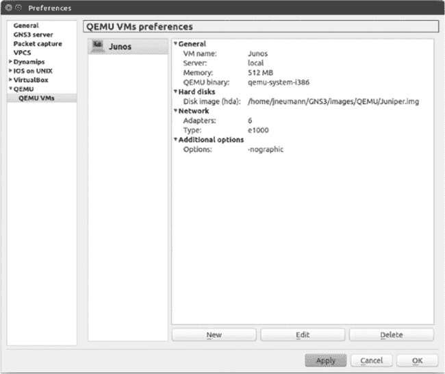

图 6-16. QEMU 虚拟机偏好设置窗口

在这里你可以创建、编辑和删除 QEMU 虚拟机，从而将你的 Juniper 虚拟机引入 GNS3。

## 将 Juniper 虚拟机添加到 GNS3

要将你的 Juniper 虚拟机添加到 GNS3 中，点击 **新建** 来启动新建 QEMU 虚拟机向导。为虚拟机输入一个名称，并保持类型设置为 **默认**。点击 **下一步** 以设置 QEMU 二进制文件和内存选项，如 图 6-17 所示。

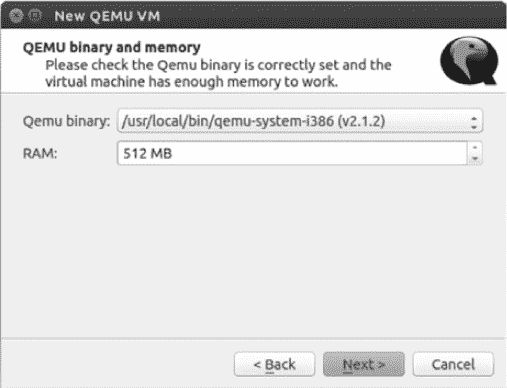

图 6-17. 设置 QEMU 二进制文件和内存

从 QEMU 二进制文件下拉菜单中选择 **qemu-system-i386**。你之所以选择这个 QEMU 程序，是因为 Juniper Olive 在 32 位版本的 FreeBSD 上运行。给你的 Olive 分配 512MB 的内存，然后点击 **下一步**。点击 **浏览** 定位并选择之前创建的 *juniper.img* 文件，然后点击 **完成**。

### 注意

*在 GNS3 中常用的两个 QEMU 二进制应用程序是 `qemu-system-i386` 和 `qemu-system-x86_64`。它们的区别在于，`qemu-system-i386` 是用于模拟 32 位架构的，而 `qemu-system-x86_64` 是用于模拟 64 位架构的。`qemu-system-x86_64` 应用程序理论上应支持 32 位的向后兼容，但它并不与所有 32 位虚拟机兼容（例如 IOS-XRv）。*

## 添加以太网接口

创建虚拟机后，返回并添加更多以太网接口。我推荐使用六个接口。高亮显示你的虚拟机并选择 **编辑**。点击 **网络** 标签页，将接口数量更改为 6。现在选择 **高级设置** 标签页，并在附加设置中输入 **-nographic** 选项，如 图 6-18 所示。

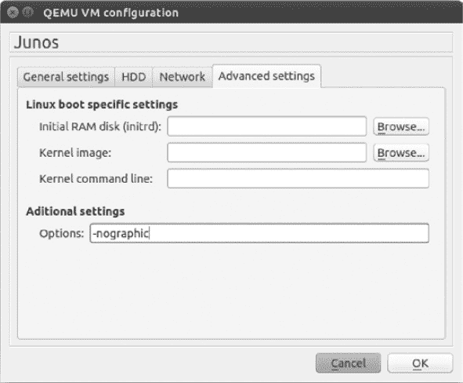

图 6-18. QEMU 高级选项

-nographic 选项可防止在启动 QEMU 虚拟机时显示 QEMU 图形界面。尽管 GUI 在故障排除虚拟机时可能有用，但它更常见的是成为一种干扰，应该禁用。这个选项可以与任何 QEMU 虚拟机一起使用，而不仅仅是 Juniper。完成后，点击 **确定** 关闭窗口，然后点击 **应用** 和 **确定** 以保存所有更改。

# 测试 Juniper 路由器

在创建包含 Juniper 路由器的项目之前，最好先测试 Cisco 路由器与 Juniper 路由器之间的连通性。如果你无法成功 ping 通设备之间的连接，可能是安装过程中出了问题，最好尽早发现，以免花费数小时设计一个无法工作的项目。

从设备工具栏拖动一个 Cisco 路由器节点和一个 Juniper 路由器节点到工作区，并创建从 Cisco 路由器到 Juniper 路由器的 e0 接口的连接，如图 6-19 所示。

启动路由器，并打开 Cisco 路由器的控制台。为与 Juniper 路由器相连的接口（在本例中是 f0/0）分配一个 IP 地址。

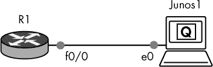

图 6-19. 将 Cisco 路由器连接到 Juniper 路由器

```
R1> **enable**
R1# configure-terminal
R1(config)# interface f0/0
R1(config-if)# ip address 10.10.10.1 255.255.255.0
R1(config-if)# no shutdown
```

现在，打开 Juniper 路由器的控制台，登录并配置一个与 Cisco 路由器相同子网的 IP 地址。

```
  Login: **root**
  root@% **cli**
  root> **edit**
➊ root# set system root-authentication plain-text password
  New password: **olive1**
  Retype new password: **olive1**
  root# set interfaces em0 unit 0 family inet address 10.10.10.2/24
  root# commit
  commit complete
```

出于安全考虑，Junos 操作系统要求你在提交任何其他配置更改之前先设置一个 root 密码➊，因此现在就进行设置。我将密码设置为*olive1*，但你可以输入任何你想要的密码。

### 注释

*在这个例子中，你可以看到 Juniper 的语法与 Cisco 的语法完全不同。如果 Juniper 语法对你来说是新鲜的，可以访问 Juniper 网站*（[`www.juniper.net/`](http://www.juniper.net/)）*，获取有关配置 Juniper 路由器的详细信息。*

配置好两个设备后，ping 一下你的 Cisco 路由器以测试连通性。

```
root# exit
root> **ping 10.10.10.1**
```

如果 ping 测试失败，可能是你的 IP 地址或 QEMU 安装存在问题。如果你是从源代码编译 QEMU，检查你是否安装了一个已知与 Juniper Olive 兼容的版本。如果需要，重新编译并安装 QEMU。如果问题仍然存在，尝试安装或编译另一个版本的 QEMU。

你也可以使用 VirtualBox 创建一个 Olive。过程基本与 QEMU 相同，但你将使用 VirtualBox 的 GUI 工具，而不是命令行。当你创建 VirtualBox 虚拟机时，设置类型为 BSD，版本为 FreeBSD（32 位）。

# 运行 Juniper vSRX Firefly

除了 Junos 操作系统之外，你还可以运行 Juniper 的 SRX 防火墙虚拟版，名为*vSRX Firefly*。如果你在 Juniper 注册，你可以从网站上免费下载 Firefly 的评估版（*[`www.juniper.net/`](http://www.juniper.net/)*）。你需要下载 Firefly VMware Appliance - FOR EVALUATION!包。如你所见，名字中提到它是为 VMware 设计的，但你可以调整它以在 VirtualBox 或 QEMU 上运行。我在这里讲解的是 VirtualBox，所以在开始之前，请确保你的系统上已安装 VirtualBox 程序。

下载 Firefly 软件后，注意它是一个 Open Virtual Appliance（OVA）文件，文件名类似于*junos-vsrx-ver.x-domestic.ova*。OVA 文件是一种特殊的包文件，可以使用`tar`命令解压缩。在 Linux 或 OS X 上提取文件内容，请使用以下命令：

```
$ **tar xvf junos-vsrx-ver.x-domestic.ova**
```

### 注意

*如果您正在使用 Windows，您可以使用 7-zip 应用程序* ([`www.7-zip.org/`](http://www.7-zip.org/)) *来提取文件。*

所有文件提取完成后，您需要将 VMware 虚拟机磁盘文件（扩展名为*.vmdk*的文件）转换为 VirtualBox 可以使用的虚拟磁盘镜像（VDI）文件。要转换文件，请使用 VirtualBox 附带的`vboxmanage`工具。

```
$ **vboxmanage clonehd -format VDI junos-vsrx-ver.x-domestic-disk1.vmdk**
**junos-vsrx-ver.x-domestic-disk1.vdi**
```

转换磁盘镜像后，您可以删除所有 Firefly 文件，除了新的 VDI 镜像文件（本示例中的*junos-vsrx-ver.x-domestic-disk1.vdi*）。这是您将导入到 VirtualBox 中的硬盘镜像文件。

## 使用 VirtualBox 创建 Firefly 虚拟机

您需要在 VirtualBox 中创建一个新的虚拟机，并导入 Firefly 硬盘镜像文件。启动 VirtualBox 并点击**新建**以打开创建虚拟机对话框，如图 6-20 所示。

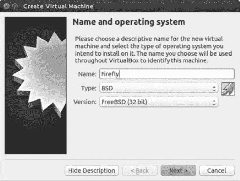

图 6-20. 创建虚拟机对话框

为虚拟机命名（本示例中为*Firefly*），将类型设置为*BSD*，并将版本设置为**FreeBSD（32 位）**。完成后，点击**下一步**以分配内存大小，如图 6-21 所示。

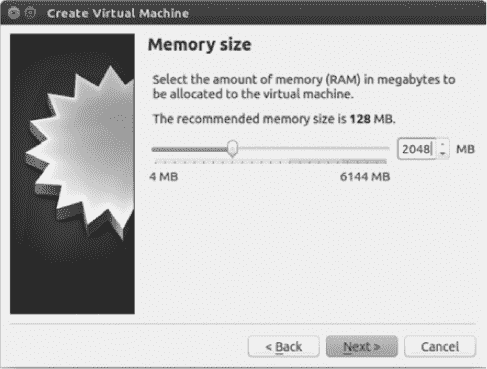

图 6-21. 调整内存大小。

按照 Juniper 的说明设置合适的内存大小。在本示例中，我选择了 2048 MB，因为这是 Juniper 为我的 Firefly 版本推荐的大小。完成后，点击**下一步**，并勾选**使用现有的虚拟硬盘文件**，如图 6-22 所示。

使用浏览图标定位并选择您之前创建的 VDI 镜像文件。完成后，点击**创建**按钮以创建虚拟机。


图 6-22. 选择 Junos vSRX Firefly VDI 硬盘镜像文件。

## 为虚拟机分配更多处理器

创建虚拟机后，您需要增加处理器数量至两个，因为 vSRX Firefly 需要两个处理器才能正常运行。如果您的虚拟机配置只有一个处理器，Firefly 将能够启动并运行，但您将无法查看或配置任何以太网接口。

在 VirtualBox 中选择你的虚拟机名称，进入**设置** ▸ **系统**，并点击**处理器**选项卡，如图 6-23 所示。


图 6-23. 系统下的处理器选项卡

使用滑块工具选择两个处理器，然后点击**确定**。配置好 Firefly 虚拟机后，右键单击虚拟机，在 VirtualBox 中选择**克隆**，以便创建一个副本，在 GNS3 中进行使用。原始虚拟机将保持未使用状态，你将始终拥有一个干净且未配置的虚拟机主机。

创建好 Firefly 虚拟机后，你需要将其添加到 GNS3 中，才能在项目中使用它。

## 将 vSRX Firefly 添加到 GNS3

启动 GNS3，在 Windows 和 Linux 上选择**编辑** ▸ **首选项**，在 OS X 上选择**GNS3** ▸ **首选项**。双击左侧窗格中的**VirtualBox**，然后选择**VirtualBox 虚拟机**以打开 VirtualBox 虚拟机首选项窗口，如图 6-24 所示。

要将 Firefly VirtualBox 虚拟机添加到 GNS3，请点击**新建**，启动新虚拟机向导。从下拉菜单中选择你的 Firefly 虚拟机并点击**完成**。接着，点击**编辑**。


图 6-24. VirtualBox 虚拟机首选项窗口

在“常规设置”选项卡中，勾选**启用远程控制台**和**以无头模式启动虚拟机**。这将允许你使用控制台登录 Firefly。最后，点击**网络**选项卡，将接口数量更改为 6，并将网络类型设置为**Paravirtualized Network（virtio net）**。现在，你可以开始使用 Firefly 创建项目了。

## 创建一个带有区域防火墙的项目

在本节中，你将创建一个使用 vSRX Firefly 作为网络防火墙的简单项目。Firefly 的功能类似于 Cisco 的 ASA 防火墙，但配置方式有所不同。我不会详细讨论，但这个项目应该能帮助你入门。如果你想了解更多关于 Juniper SRX 的内容，可以访问 Juniper 官网，那里有很多详细的文档（* [`www.juniper.net/`](https://www.juniper.net/) *）。

我们从创建 GNS3 项目开始。将 Firefly 设备从“终端设备”工具栏拖到工作区。接着，拖动两个 Cisco 路由器到工作区，并将设备连接在一起。将 R1 的接口 f0/0 连接到 vSRX Firefly 的 e1 接口，将 R2 的接口 f0/0 连接到 vSRX Firefly 的 e0 接口。


图 6-25. vSRX Firefly 项目

路由器 R1 将配置为使用 Firefly 信任区。R1 代表您 LAN 中的受信主机。路由器 R2 将配置为使用 Firefly 的不受信任区。不受信任区代表一个不受信任的网络，如互联网。您将配置 Firefly，以便受信主机（R1）可以通过 vSRX Firefly 防火墙使用 NAT 与不受信主机（R2）进行 ping 测试。

首先为路由器 R1 配置 IP 地址和默认网关。

```
R1(config)# interface f0/0
R1(config-if)# ip address 192.168.1.100 255.255.255.0
R1(config-if)# no shutdown
R1(config-if)# ip route 0.0.0.0 0.0.0.0 192.168.1.1
```

接下来，配置不受信任路由器 R2 的 IP 地址。这里不需要配置网关。

```
R2(config)# interface f0/0
R2(config-if)# ip address 100.1.1.1 255.255.255.0
R2(config-if)# no shutdown
```

配置好路由器 IP 地址后，您可以将注意力转向 Firefly。使用 root 账户登录，以配置 vSRX Firefly 防火墙。由于这是新安装，系统应该不会要求您输入密码。登录后，输入以下命令以创建您的防火墙；首先创建密码并配置网络设置：

```
  root@%**cli**
  root>**edit**
➊ root#**set system root-authentication plain-text-password**
  New password:**firefly1**
  Retype new password:**firefly1**
➋ root#**set interface ge-0/0/0.0 family inet address 100.1.1.2/24**
➌ root#**set interface ge-0/0/1.0 family inet address 192.168.1.1/24**
➍ root#**set routing-options static route 0.0.0.0/0 next-hop 100.1.1.1**
```

就像在 Juniper 路由器上一样，您不能在 SRX 设备上保存任何配置更改，直到您为 root 账户分配了密码，因此首先进入编辑模式并创建 root 密码 ➊。我输入了*firefly1*，但您可以选择任何您喜欢的密码。

接下来，在➋处，您需要在 WAN 接口（ge-0/0/0.0）上设置 IP 地址，在➌处，您需要设置 LAN 接口（ge-0/0/1.0）。最后，在➍处，使用不受信任路由器的 IP 地址（100.1.1.1）设置默认网关地址。

通过定义您的安全区域和安全信任策略来完成配置。

```
➊ root#**set security zones security-zone trust interfaces ge-0/0/1.0**
➋ root#**set security nat source rule-set interface-nat from zone trust**
➌ root#**set security nat source rule-set interface-nat to zone untrust**
➍ root#**set security nat source rule-set interface-nat rule rule1 match**
   **source-address 0.0.0.0/0 destination-address 0.0.0.0/0**
➎ root#**set security nat source rule-set interface-nat rule rule1 then source-nat**
   **interface**
➏ root#**set security policies from-zone trust to-zone untrust policy permit-all**
   **match source-address any destination-address any application any**
➐ root#**set security policies from-zone trust to-zone untrust policy permit-all**
   **then permit**
➑ root#**commit**
```

将您的 LAN 接口分配到`trust`区域 ➊。将接口-nat 源区域设置为`trust` ➋，将接口-nat 目标区域设置为`untrust` ➌，并创建一个匹配任何源和目标 IP 地址（0.0.0.0/0）的规则 ➍。在生产环境中，您可能需要稍微收紧一些，但对于您的 GNS3 实验室来说，这样配置是可以的。现在，在 WAN 接口上配置 NAT 过载 ➎。

### 注意

*vSRX Firefly 的`interface-nat`命令用于实现类似于 Cisco NAT/PAT 过载的功能。*

为完成配置，定义允许在不同区域之间传输的流量类型 ➏。在本例中，您允许所有协议和应用从`trust`区域流向`untrust`区域。最后，创建安全策略 ➐ 并提交更改 ➑，这样就完成了！

通过输入`show security nat source summary`命令来验证您的配置。

```
root>show security nat source summary
Total port number usage for port translation pool: 0
Maximum port number for port translation pool: 33554432
Total pools: 0

Total rules: 1
Rule name     Rule set            From          To           Action
rule1➊       interface-nat➋     trust➌        untrust➍    interface➎
```

这些信息表明`rule1` ➊允许通过 NAT ➋从`trust`区域 ➌到`untrust`区域 ➍的包，且来自`trust`区域的 IP 数据将被过载到不受信任的接口 ➎。默认情况下，接口是 ge-0/0/0.0（您的 WAN 接口）。如果在输入命令后，您的总结与本书中的相符，那么您可以开始测试连接。如果输出看起来不同，那么您可能输入错误，需要回去检查所有配置设置。

登录到路由器 R1 并输入`ping`命令，以测试与路由器 R2 的连接。

```
R1#**ping 100.1.1.1**

Type escape sequence to abort.
Sending 5, 100-byte ICMP Echos to 100.1.1.1, timeout is 2 seconds:
!!!!!
Success rate is 100 percent (5/5), round-trip min/avg/max = 4/10/24 ms
```

如果你的 ping 测试成功，显示为 `!!!!!`，那么你就已经完成了所有正确的操作。如果失败了，你可能需要回去检查你的配置设置。你还应该确保你的 Cisco 路由器配置了正确的 IP 地址和子网掩码，并且以太网接口没有被关闭。

# 最后的思考

在本章中，你了解了 Juniper 和 Juniper Olive，我向你展示了如何使用 QEMU 和 VirtualBox 创建 Juniper Olive。我还介绍了 vSRX Firefly，并为你提供了如何使用 SRX 设备配置基础的基于区域的防火墙的一些见解。

在大多数情况下，使用 QEMU 运行 Juniper 会比使用 VirtualBox 稍慢。然而，QEMU 允许你在不进行克隆的情况下将无限数量的 Juniper 路由器添加到你的项目中，而且 GNS3 会将你的 Juniper 配置与项目一起存储。通常来说，VirtualBox 加载和运行设备的速度要快于 QEMU，但你的配置会保存在 VirtualBox 中每个虚拟机实例中，而不是 GNS3 中。因此，你必须使用 VirtualBox 的克隆功能来创建设备的唯一虚拟机实例。然后，克隆的设备会在你的 GNS3 项目中使用。

Juniper 在企业界的受欢迎程度不及 Cisco，但在更大的环境中，比如校园站点和 ISP 路由交换市场，它依然是一个重要的参与者。如果你将自己的网络职业发展方向定位于这些领域，Juniper 认证可能会让你在其他应聘者中脱颖而出，而 GNS3 是学习 Juniper 路由器和 SRX 设备的绝佳方式！你应该从 JNCIA 认证开始，它是入门级的 Juniper 认证（相当于 Cisco 的 CCNA），并且是更高级别认证的前提条件。Juniper 的培训网站（*[`www.juniper.net/us/en/training/`](http://www.juniper.net/us/en/training/)*) 提供了你所需的所有信息，帮助你开始学习。
