# 第七章 设备节点、实时交换机与互联网

在本章中，我将演示如何将 GNS3 设备节点与思科 IOS 路由器一起使用。GNS3 提供了一个集线器节点和各种交换机节点，包括以太网交换机、EtherSwitch 路由器、ATM 交换机和帧中继交换机。此外，我们还将看看如何使用思科 IOS 路由器创建自己的帧中继交换机。

我们还将探索一个非常强大的功能，称为*云节点*。云节点用于将您的网络扩展到 GNS3 程序之外。使用云节点，您很快就能将 GNS3 项目连接到实时的思科交换机，并通过 GNS3 路由器访问互联网。

# 内置设备节点

内置设备节点*模拟*特定设备类型（如交换机）的功能。它们易于配置，如果您需要节省时间和计算机资源，或者只是想完成某件事而不想了解底层技术的所有细节，它们会非常有用。

如果您创建了一个使用 VLAN 的拓扑，您可以将 GNS3 以太网交换机节点拖到工作区，并使用简单的菜单快速创建 VLAN 或 VLAN 中继。当然，如果您正在为涉及交换的思科考试做准备，您需要知道如何配置实际的思科 IOS 交换机。

# 节点配置器

到目前为止，您已经知道节点配置器可以用来配置单个设备节点的功能，但它也可以用来同时修改多个设备。当您的项目变得更加复杂，使用更多设备时，这个功能可以节省大量时间。

要同时打开多个设备，请用鼠标选择工作区中的这些设备，然后右键点击任何设备并选择**配置**。所选设备将在节点配置器中显示，如图 7-1 所示。

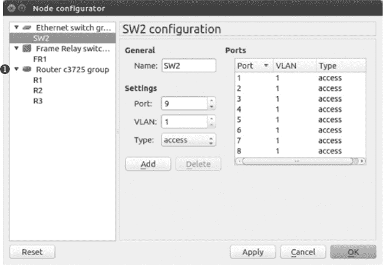

图 7-1. 使用节点配置器修改多个设备

要配置单个设备，从左侧列中选择该设备。配置每个设备并点击**应用**。完成所有设备的配置后，点击**确定**以完成该过程。

要修改多个设备，请按住 SHIFT 键，从左侧列中选择多个设备，然后像配置单个设备一样进行配置。假设您有十台 7200 系列路由器，且您想将相同的网络模块添加到所有 10 台路由器的插槽 0 中。按住 SHIFT 键选择所有路由器，将模块添加到插槽 0，然后点击**应用**和**确定**，以将更改应用到所有 10 台设备。

您还可以通过点击其组名来选择整个路由器组。在前面的图中，您可以通过选择组名*Router c3725 group* ➊同时配置 R1、R2 和 R3。

# 以太网集线器

GNS3 提供了一种以太网集线器（参见图 7-2），这是网络教师用来向学生讲解以太网环路、广播过多和多端口重复的问题的工具。

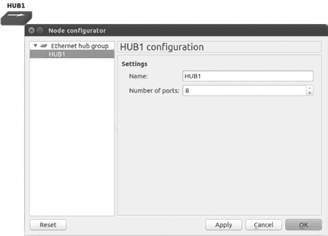

图 7-2. 以太网集线器节点配置器

一般来说，你应该使用 GNS3 交换机，避免在项目中使用集线器。但如果确实需要使用以太网集线器，你可以通过打开节点配置器并从左侧列表中选择集线器，来更改可用的以太网端口数量。默认值是八个端口，如果你需要不同的端口数量，可以在右侧的设置字段中输入该数字。

# EtherSwitch 路由器

GNS3 提供了两种类型的 Dynamips 交换机：以太网交换机节点和 EtherSwitch 路由器。我在第四章中讨论了以太网交换机节点，所以这里只介绍 EtherSwitch 路由器。

*EtherSwitch 路由器* 不是像以太网集线器或以太网交换机节点那样的模拟设备。相反，它是一个运行 Cisco IOS 的 Dynamips 路由器，并配置了一个 16 端口交换机模块（NM-16ESW）。这个交换机模块可以安装在实际的 Cisco 路由器上，并具有相同的功能和限制（详情请参见附录 C）。尽管交换机模块的功能有限，但它非常适合用于 CCNA 和许多 CCNP 的学习。对于更高级的交换功能，你需要将实际的交换机集成到 GNS3 项目中，或者使用 Cisco IOU 交换机。

### 注意

*EtherSwitch 路由器要求你配置一台带 IOS 的 c3745 路由器。*

要向 EtherSwitch 路由器添加额外的交换机端口，请右键单击交换机图标并选择 **配置**，如图 7-3 所示。

EtherSwitch 路由器允许你添加额外的交换机模块。在槽位 2 中添加另一个 NM-16ESW 模块后，交换机端口的数量增加到 32 个。

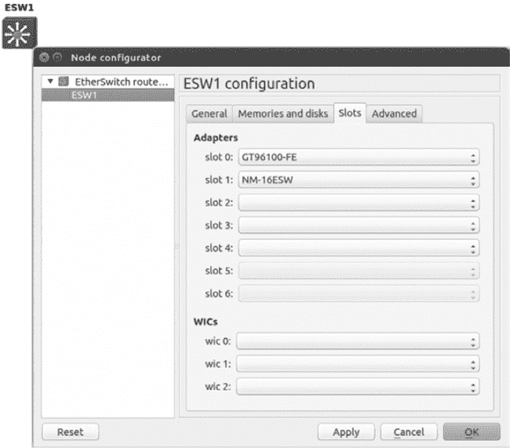

图 7-3. EtherSwitch 路由器节点配置器

# 帧中继交换机

GNS3 提供了一个简单的*帧中继交换机节点*，能够模拟通用帧中继交换机的基本功能。GNS3 帧中继交换机节点的优点是配置非常简单。缺点是它有时可能不稳定。

### 警告

*GNS3 的 Frame Relay 交换机节点仅支持 ANSI LMI 类型，且*Cisco *是 Cisco IOS 上的默认 LMI 类型。你必须在路由器接口上使用命令`frame-relay lmi-type ansi`。否则，你的 Frame Relay 云将无法工作。你可以使用`show frame-relay lmi`命令来验证 LMI 类型（在配置了 Frame Relay 封装后）。*

在 Frame Relay 中，*数据链路连接标识符（DLCI）*用于通过串行端口连接分配帧到*永久虚拟电路（PVC）*。要配置 DLCI 到串行端口的映射，右键点击 Frame Relay 交换机图标并打开节点配置器。使用源字段和目标字段创建映射，并点击**添加**。完成后，点击**应用**和**确定**来完成配置。

图 7-4 中的示例配置稍后将用于创建一个简单的 Frame Relay 网络。在右侧的映射面板中，注意到 FR1 是通过两个串行端口进行配置的。每个串行端口用于将 Frame Relay 交换机连接到 GNS3 项目中的路由器。

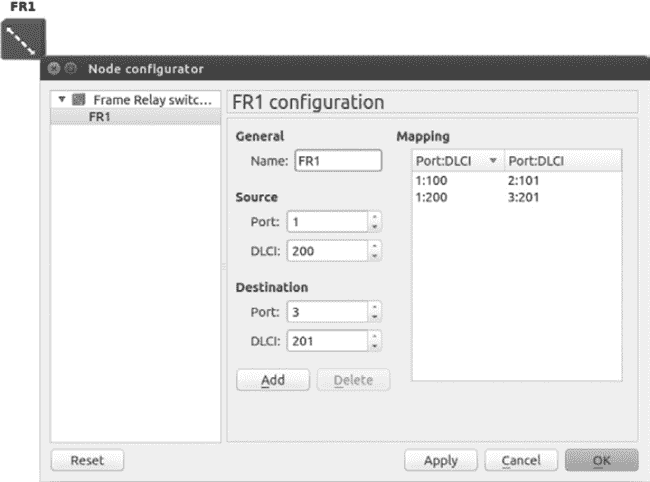

图 7-4. Frame Relay 交换机节点配置器

端口 1 已分配了两个 DLCI 号（100 和 200）。端口 1 上的每个 DLCI 都映射到另一个串行端口上的 DLCI 号，每个映射形成一个 Frame Relay PVC。映射是从左到右读取的，因此在第一行中，端口 1 的 DLCI 100 映射到端口 2 的 DLCI 101，在第二行中，端口 1 的 DLCI 200 映射到端口 3 的 DLCI 201。我们将使用这些映射来配置一个简单的 Frame Relay 网络。

## 简单的 Frame Relay 中心与辐射式配置

配置 Frame Relay 网络有几种方法，而理解 DLCI 到串行端口的映射对于理解和配置它们至关重要。为了更好地理解映射关系，让我们使用之前讨论的 DLCI 到串行端口的映射配置一个简单的网络。我不会讲解太多理论，但会解释足够的内容让你能够开始。

我们将使用图 7-5 中的拓扑来创建我们的示例网络。该网络被划分为两个子网，10.10.10.0 和 10.10.10.32，子网掩码为 255.255.255.224。

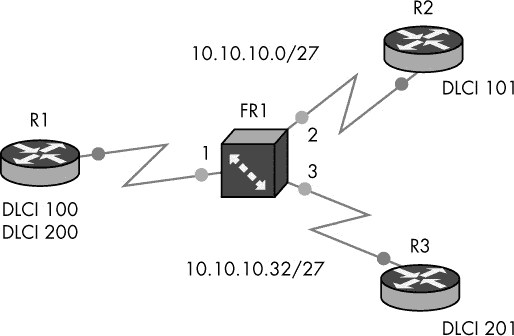

图 7-5. 示例中心与辐射式 Frame Relay 网络

这个简单的网络是帧中继中心-分支拓扑的示例，应该能让你很好地理解 DLCI 映射在帧中继网络中的工作原理。路由器 R2 将位于 10.10.10.0 子网中，路由器 R3 将位于 10.10.10.32 子网中。路由器 R1 是我们的中心-分支拓扑中的中心，它将连接这两个子网，并通过帧中继交换机在它们之间转发数据包。此配置将允许路由器 R2 与路由器 R3 相互 Ping 通。

要创建项目，请在工作区中添加一个帧中继交换机节点，并按我们在 图 7-4 中所做的那样进行设置。添加三台路由器，并为每台路由器配置一个串行接口卡，如 WIC 或 NM-4T。将路由器与 FR1 交换机连接，如图所示。确保 R1 连接到 FR1 的端口 1，R2 连接到端口 2，R3 连接到端口 3。在连接设备并配置 FR1 交换机上的端口:DLCI 映射后，按以下代码配置中心路由器 R1。

```
  R1(config)# interface Serial0/0
➊ R1(config-if)# encapsulation frame-relay
➋ R1(config-if)# frame-relay lmi-type ansi
➌ R1(config-if)# clock rate 64000
  R1(config-if)# no shutdown
  R1(config-if)# no ip address
```

在串行接口上启用帧中继封装 ➊，并将 LMI 类型设置为 ANSI ➋。尽管在 GNS3 中不是必需的，我还是设置了时钟速率 ➌，因为根据你的 IOS，实际的帧中继交换机可能需要这个命令。

接下来，配置点对点接口和 DLCI。

```
➊ R1(config-if)# interface Serial0/0.100 point-to-point
➋ R1(config-subif)# frame-relay interface-dlci 100
➌ R1(config-subif)# ip address 10.10.10.1 255.255.255.224
➍ R1(config-subif)# interface Serial0/0.200 point-to-point
➎ R1(config-subif)# frame-relay interface-dlci 200
➏ R1(config-subif)# ip address 10.10.10.33 255.255.255.224
```

在串行接口 `Serial0/0.100` 上配置点对点子接口 ➊，使用 DLCI 100 ➋ 并为接口分配来自第一个子网的 IP 地址 ➌（10.10.10.0/27）。

通过以相同方式添加第二个点对点子接口 ➍，但使用 DLCI 200 ➎，并为接口分配来自第二个子网的 IP 地址 ➏（10.10.10.32/27）。在这个示例中，我将使用子网中的第一个有效地址，即 10.10.10.33。

### 注意

*使用 DLCI 编号作为子接口编号被认为是 Cisco 最佳实践。`Serial0/0.100` 就是 DLCI 100 的子接口示例。*

以下列表包含配置路由器 R2 所需的所有命令。

```
  R2(config)# interface Serial0/0
➊ R2(config-if)# encapsulation frame-relay
➋ R2(config-if)# frame-relay lmi-type ansi
➌ R2(config-if)# clock rate 64000
  R2(config-if)# no shutdown
  R2(config-if)# no ip address
➍ R2(config-if)# interface Serial0/0.101 point-to-point
➎ R2(config-subif)# frame-relay interface-dlci 101
➏ R2(config-fr-dlci)# ip address 10.10.10.2 255.255.255.224
  R2(config-subif)# exit
➐ R2(config)# ip route 0.0.0.0 0.0.0.0 10.10.10.1
```

要配置 R2，请进入串行接口并启用帧中继封装 ➊，然后将 LMI 类型设置为 ANSI ➋，设置时钟速率 ➌，并启用接口。使用 DLCI 101 ➎ 配置点对点子接口 ➍，并为子接口分配来自第一个子网的 IP 地址 ➏（在此示例中为 10.10.10.0 /27）。最后，使用配置在 R1 路由器接口 DLCI 100 下的 IP 地址 ➐（IP 地址为 10.10.10.1）设置路由器的默认网关。由于 R1 是我们帧中继中心-分支拓扑中的中心，它被用作两个子网的默认网关，以便数据可以在路由器 R2 和 R3 之间路由。

最后，向路由器 R3 添加配置以完成项目。

```
  R3(config)# interface Serial0/0
  R3(config-if)# encapsulation frame-relay
  R3(config-if)# frame-relay lmi-type ansi
  R3(config-if)# clock rate 64000
  R3(config-if)# no shutdown
  R3(config-if)# no ip address
  R3(config-if)# interface Serial0/0.201 point-to-point
➊ R3(config-subif)# frame-relay interface-dlci 201
➋ R3(config-fr-dlci)# ip address 10.10.10.34 255.255.255.224
  R3(config-subif)# exit
➌ R3(config)# ip route 0.0.0.0 0.0.0.0 10.10.10.33
```

路由器 R3 的配置几乎与 R2 相同，但它使用 DLCI 201 ➊和来自第二子网的 IP 地址 ➋。此外，你需要使用在路由器 R1 的接口 DLCI 200 下配置的 IP 地址 ➌（IP 地址 10.10.10.33）设置默认网关。

就这样！现在，所有三个路由器应该都能够相互 ping 通。简而言之，每个路由器将数据帧封装，并在数据帧离开其串行接口时通过 Frame Relay DLCI 编号进行标识。当 Frame Relay 交换机从路由器接收到数据时，数据帧将根据 DLCI 到串口的映射通过交换机转发到其他路由器。由于 R1 被配置为 Frame Relay 集线器，并且了解两个子网，因此它可以通过两个 PVC 在这两个子网之间转发数据。在这个例子中，一个 PVC 由 DLCI 100 映射到 DLCI 101，另一个 PVC 由 DLCI 200 映射到 DLCI 201 组成。

为了验证你的 Frame Relay 电路是否处于活动状态，请在每个路由器上输入命令 `show frame-relay pvc`。

```
R1# show frame-relay pvc

PVC Statistics for interface Serial0/0 (Frame Relay DTE)

             Active      Inactive      Deleted       Static
Local         ➊ 2             0            0            0
Switched        0             0            0            0
Unused          0             0            0            0
```

如果你已经正确设置了一切，你的 PVC 应该显示为`Active` ➊。

## 使用 IOS 创建 Frame Relay 交换机

尽管 Frame Relay 交换机节点非常方便，但有时你可能需要使用 IOS 路由器创建你自己的 Frame Relay 交换机。也许你想使用不同的 LMI 类型（如 Cisco 或 q933a），或者你的学习需要了解实际的 Cisco Frame Relay 交换机的详细信息。无论如何，使用 IOS 交换机的设置相对简单。

以下的列表创建了一个使用 DLCI 映射的 IOS Frame Relay 交换机，这些映射与你之前配置的 GNS3 Frame Relay 交换机节点相同。它乍一看可能令人畏惧，但其实并不是；你只需要理解如何使用 Frame Relay `connect` 命令来配置 DLCI 到串口的映射。

```
➊ FRSW(config)# frame-relay switching
  FRSW(config)# interface Serial0/0
  FRSW(config-if)# description Serial connection to Router R1 (Hub)
  FRSW(config-if)# no shutdown
  FRSW(config-if)# no ip address
➋ FRSW(config-if)# encapsulation frame-relay
➌ FRSW(config-if)# clock rate 64000
➍ FRSW(config-if)# frame-relay lmi-type ansi
➎ FRSW(config-if)# frame-relay intf-type dce
  FRSW(config-if)# interface Serial0/1
  FRSW(config-if)# description Serial connection to Router R2 (Spoke)
  FRSW(config-if)# no shutdown
  FRSW(config-if)# no ip address
  FRSW(config-if)# encapsulation frame-relay
  FRSW(config-if)# clock rate 64000
  FRSW(config-if)# frame-relay lmi-type ansi
  FRSW(config-if)# frame-relay intf-type dce
  FRSW(config-if)# interface Serial0/2
  FRSW(config-if)# description Serial connection to Router R3 (Spoke)
  FRSW(config-if)# no shutdown
  FRSW(config-if)# no ip address
  FRSW(config-if)# encapsulation frame-relay
  FRSW(config-if)# clock rate 64000
  FRSW(config-if)# frame-relay lmi-type ansi
  FRSW(config-if)# frame-relay intf-type dce
  FRSW(config-if)# exit
➏ FRSW(config)# connect PVC1 Serial0/0 100 Serial0/1 101
➐ FRSW(config)# connect PVC2 Serial0/0 200 Serial0/2 201
```

配置 Frame Relay 交换机时，必须先使用 `frame-relay switching` 命令 ➊ 启用 Frame Relay 交换。你还需要在每个串行接口上使用 `encapsulation frame-relay` 命令配置 Frame Relay 封装。然后，使用 `clock rate` 命令 ➌ 设置时钟频率，选择 LMI 类型使用 `frame-relay lmi-type` ➍，并使用 `frame-relay intf-type dce` 命令 ➎ 设置接口类型为 DCE。接口启用后，你就可以定义你的 PVC。

### 注意

*在某些 IOS 版本中，`clock rate` 命令可能需要输入为 `clockrate`。*

DLCI 到端口的映射是通过`connect` *`connection-name interface dlci interface dlci`* 命令进行配置的。此配置中的最后两个命令定义了两个 Frame Relay PVC 之间的连接映射。命令 `connect PVC1 Serial0/0 100 Serial0/1 101` ➏ 定义了 R1 和 R2 之间的 PVC，并用于创建我们的第一个子网。源接口是 Serial0/0，源 DLCI 是 100。通过接口 Serial0/1 和配置在路由器 R2 上的 DLCI 101 完成 PVC。

命令 `connect PVC2 Serial0/0 200 Serial0/2 201` ➐ 使用相同的语法在路由器 R1 和 R3 之间创建第二个 PVC（用于第二个子网）。

创建自己的帧中继交换机就这么简单。在使用 Cisco IOS 配置帧中继交换机时，LMI 类型可以设置为 `cisco`、`ansi` 或 `q933a`，但必须确保所有参与帧中继网络的路由器保持一致。

# ATM 交换机

GNS3 提供了一种简便的方式来配置 *异步传输模式（ATM）* 交换机。ATM 类似于帧中继，它是一个数据链路层协议，用于将物理端口映射到逻辑电路。

要配置 VPI/VCI 到端口的映射，右键点击 ATM 交换机图标并选择 **配置**，如图 7-6 所示。在这里，我使用 ATM1 交换机节点上的两个端口配置了一个简单的虚拟电路。

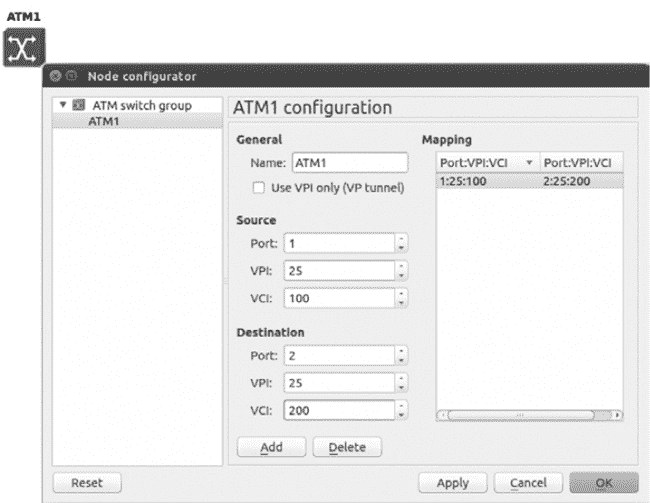

图 7-6. 节点配置器

使用源和目标字段来创建端口映射，然后点击 **添加**。当你完成所有端口映射后，点击 **应用** 和 **确定** 来完成配置。

现在让我们快速演示如何使用 ATM 交换机创建一个简单的点对点 WAN 连接。首先创建图 7-7 所示的拓扑。

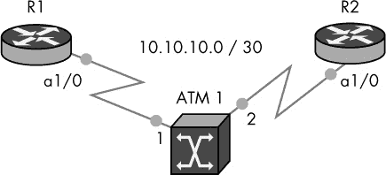

图 7-7. 示例 ATM 网络

将一个 ATM 交换机添加到工作区，并使用来自图 7-6 的信息进行配置。接下来，添加两个路由器，并在每个路由器与交换机之间创建一条链路。你需要使用*7200 系列路由器*，每台路由器都需要配置一个*ATM 端口适配器*（PA-A1），安装在槽位 1。创建从每个路由器的 *a1/0* 到 ATM 交换机的链路，如图 7-7 所示，然后输入以下命令来配置 R1 路由器上的 ATM。

```
R1(config)# interface ATM1/0
R1(config)# no shutdown
R1(config)# interface ATM1/0.100 point-to-point
R1(config-subif)# ip address 10.10.10.1 255.255.255.252
R1(config-subif)# pvc 25/100
R1(config-if-atm-vc)# protocol ip 10.10.10.2 broadcast
R1(config-if-atm-vc)# encapsulation aal5snap
```

接下来，将类似的配置应用于路由器 R2。

```
R2(config)# interface ATM1/0
R2(config)# no shutdown
R2(config)# interface ATM1/0.200 point-to-point
R2(config-subif)# ip address 10.10.10.2 255.255.255.252
R2(config-subif)# pvc 25/200
R2(config-if-atm-vc)# protocol ip 10.10.10.1 broadcast
R2(config-if-atm-vc)# encapsulation aal5snap
```

要验证你的 ATM 电路是否启用，请输入 `show atm pvc` 命令。

```
R1# show atm pvc
```

如果 PVC 状态显示为 `UP`，那么两个路由器现在应该可以互相 ping 通。

# 云节点

云节点是一个高度可配置的设备节点，它并不模拟特定的硬件。而是提供了广泛的*网络输入/输出（NIO）*连接选项，允许 GNS3 虚拟设备与其他程序或实际硬件（如你 PC 的以太网适配器）进行通信。

你通过从 GNS3 设备（如路由器）到云节点创建标准链接来连接到云节点。完成后，任何离开虚拟接口的数据都会通过云节点的 NIO 连接传输到 GNS3 外部的目标，如物理以太网适配器。请记住，GNS3 中显示的吞吐量限制也适用于连接到云模式的虚拟接口，这意味着这些限制会影响你的整体性能。

要配置 NIO 连接（如图 7-8 所示），右键点击云图标并选择 **配置**。

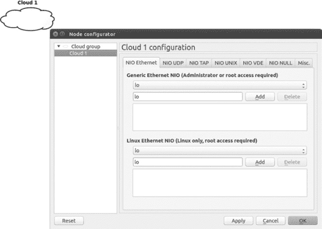

图 7-8。云节点配置器

节点配置器提供六种连接选项：

+   ****NIO 以太网****。创建与计算机中一个或多个物理或逻辑接口的连接。NIO 以太网配置让你可以设置通用的 NIO 和仅限 Linux 的 NIO。

+   ****NIO UDP****。创建一个 UDP 套接字，以便在 GNS3 和其他程序之间建立链接。

+   ****NIO TAP****。创建与虚拟 TAP 接口的连接。TAP 接口通常会桥接到你计算机中的物理接口。

+   ****NIO UNIX****。在 GNS3 和其他应用程序之间创建一个 UNIX 套接字连接。

+   ****NIO VDE****。在 GNS3 和虚拟分布式以太网设备之间创建一个链接。

+   ****NIO NULL****。在 GNS3 和 NULL 设备之间创建一个链接，形成一个虚拟链路。

+   ****其他.**** 允许你重命名一个云节点。

要配置连接，选择 NIO 连接类型，选择你想要的选项，然后点击 **添加**。你可以为每个云节点配置多个连接，这样你可以将多个 GNS3 设备链接在一起，就像你可以在 GNS3 交换机或路由器上使用多个接口一样。

在 Linux 系统中，你可能希望使用通用的 NIO 连接，这可能比特定于 Linux 的 NIO 更可靠。一个原因是特定于 Linux 的 NIO 可能会去除传入的 VLAN 标签。如果你在 Linux 上遇到连接困难，尝试两者，看看哪一个效果更好。

# 将 GNS3 设备连接到物理硬件

将项目连接到物理硬件的能力，是将 GNS3 从一个粗糙的钻石转变为非洲之星的关键。通过使用云节点，你可以与实时的 Cisco 交换机建立干道链接，甚至可以从 GNS3 设备访问互联网。这使 GNS3 拥有几乎无限的网络可能性。将 GNS3 连接到真实设备在某些系统上比在其他系统上更容易，但它应该能在所有主要操作系统上工作。

## Dynamips 权限

在将 GNS3 设备连接到物理以太网适配器之前，你可能需要对 PC 进行一些更改。如果你的 Cloud 节点在 Windows 系统上使用 NIO 以太网配置，你应该通过右键点击 GNS3 图标并选择**以管理员身份运行**来以管理员权限运行 GNS3。为了使此选项永久生效，右键点击 GNS3 图标并选择**属性**，然后选择兼容性选项卡，在**以管理员身份运行此程序**前打勾。

在基于 Unix 的系统上，你需要提升 Dynamips 的权限才能使用 NIO 以太网或 NIO TAP 连接。如果跳过此步骤，你将不得不以 root 账户运行 GNS3。否则，NIO 连接将失败，GNS3 将在控制台窗口显示错误消息。

在 OS X 上设置正确的 Dynamips 权限，请使用以下命令：

```
$ **sudo chown root /Applications/GNS3.app/Contents/Resources/dynamips***
$ **sudo chmod 4755 /Applications/GNS3.app/Contents/Resources/dynamips***
```

在大多数 Linux 发行版上设置权限的方式相同；只需将文件路径替换为你的`dynamips`文件的正确位置，如以下代码所示。如果你使用的是基于 Debian 的 Linux 系统（如 Ubuntu），则应该使用`setcap`命令，因为它更安全。

```
$ **sudo apt-get install libcap2**
$ **sudo setcap cap_net_raw,cap_net_admin+eip /usr/local/bin/dynamips***
```

更改 Dynamips 权限后，你可以作为普通用户运行 GNS3，但 Dynamips 将被视为由 root 账户运行。

## 为桥接准备你的 PC

一些操作系统不允许 GNS3 直接与 PC 的以太网硬件通信，Wi-Fi 适配器通常也无法使用。在这些系统上使用以太网适配器前，可能需要安装额外的软件才能使其工作。

一种常见的解决方案是安装虚拟接口驱动程序，并使用桥接将其与 PC 的物理以太网适配器关联。然后，GNS3 会将网络数据传递给虚拟接口，虚拟接口通过桥接将数据转交给物理以太网接口。在基于 Unix 的系统中，虚拟接口通常通过 TUN/TAP 驱动程序提供。在 Windows 系统中，你将使用一个回环适配器，并将其桥接到物理以太网适配器。

即使 PC 的以太网硬件能够直接与 GNS3 协同工作，以下方法仍然是推荐的，并且是连接 GNS3 到外部网络的可预测方式。

## 在 Windows 上使用回环适配器

在 Windows 中，*回环适配器驱动程序* 提供了一个虚拟网络接口，可以与 PC 中的物理以太网适配器桥接。要在 Windows 中添加回环适配器，打开 **控制面板** ▸ **设备管理器**。右键点击列表中的计算机名称，选择 **添加遗留硬件**。点击 **下一步**，选择 **手动从列表中选择要安装的硬件（高级）**，然后再次点击 **下一步**。从列表中选择 **网络适配器** 并点击 **下一步**。在添加硬件向导中，如 图 7-9 所示，选择 **Microsoft** 作为制造商，然后滚动并选择名为 **Microsoft 回环适配器** 的网络适配器。点击 **下一步** 和 **完成** 完成安装。安装 Microsoft 回环适配器后，必须重启 Windows。

也可以通过在 GNS3 安装目录中运行 `loopback-manager.cmd` 命令来安装 Microsoft 回环适配器。

要在回环适配器和以太网适配器之间创建桥接，请打开 **控制面板** ▸ **网络和共享中心**，选择 **更改适配器设置**。选择这两个适配器，右键点击并弹出菜单，如 图 7-10 所示。选择 **桥接连接**，以在两个适配器之间创建桥接接口。完成后，重启 Windows 以使更改生效。

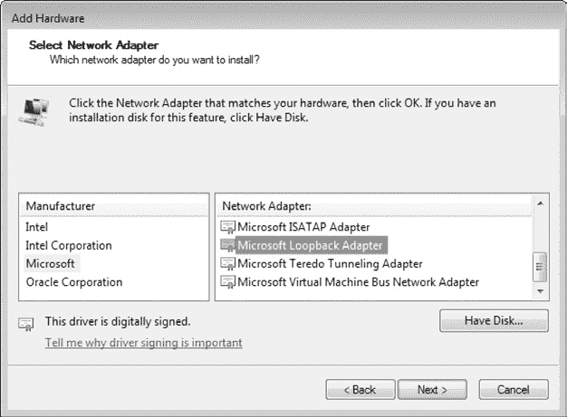

图 7-9. 选择 Microsoft 回环适配器

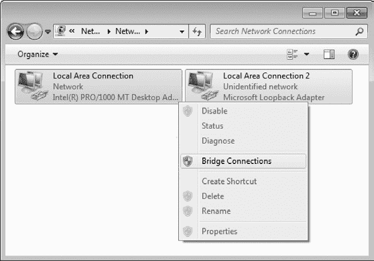

图 7-10. 使用 Microsoft 回环适配器和以太网适配器创建桥接

为了让 GNS3 在 Windows 系统中使用物理以太网适配器，你需要用回环适配器配置一个云节点（参见 将 GNS3 设备连接到物理硬件）。建议你重命名回环适配器，以便在 GNS3 中清晰地识别它。在这个示例中，我建议将 *本地连接 2* 改为 *回环适配器*。

## OS X 上的 TUN/TAP 驱动程序

如果你使用的是 OS X，你需要先安装虚拟接口驱动程序，才能让 GNS3 访问物理以太网接口。要在 OS X 上安装 TUN/TAP 驱动程序，请从 SourceForge (*[`tuntaposx.sourceforge.net/`](http://tuntaposx.sourceforge.net/)*) 下载适用于你 OS X 版本的驱动软件，运行安装程序并按照指示操作。

驱动程序应该安装在 */Library/Extensions* 目录下，并应在你重启系统时自动加载。若要手动加载驱动程序，切换到 */Library/Extensions* 目录并输入以下命令：

```
$ **sudo kextload tap.kext**
```

在启动 GNS3 之前，输入以下命令来设置你的 TAP 接口权限。每次重启你的 Mac 时，你都需要输入该命令。

```
$ **sudo chown $(id -un):$(id -gn) /dev/tap***
```

要激活 TAP 接口并将其与 PC 中的物理以太网端口桥接，你必须在*添加云节点并将路由器连接到使用 */dev/tap0* 配置的 nio_tap 接口后*输入以下命令。如果提前输入这些命令，它们将失败，桥接也无法正常工作。每次加载包含云节点的项目时，你都需要输入这些命令。

```
$ **sudo ifconfig bridge0 create**
$ **sudo ifconfig bridge0 addm en0**
$ **sudo ifconfig bridge0 addm tap0 up**
```

在终端输入命令后，OS X 应该会将 tap0 接口与 Mac 中的物理以太网接口（本例中为 en0）进行桥接。你应该使用 `ifconfig` 命令来验证你 Mac 上以太网接口的名称，然后用该名称替换 en0。

### 注意

*如果你更改了接口的最大传输单元（MTU）大小，在创建桥接时可能会看到“ifconfig: BRDGADD tap0: Invalid argument”错误。在这种情况下，你需要确保物理接口的 MTU 大小与 TAP 接口的 MTU 大小匹配。*

我建议在你的项目中添加一个注释，其中包含这些命令，以便在打开项目时提醒你创建桥接。然后，在打开项目后，你可以复制该注释并将其粘贴到终端窗口中，从而节省时间。别忘了每次打开一个将以太网接口桥接到 TAP 接口的项目时，都要输入这些命令，*否则它不会起作用*。

## Ubuntu Linux 上的 TUN/TAP 驱动程序

在 Linux 上，你应该能够使用云配置器中的 NIO 以太网标签将云节点直接连接到你的以太网接口，但如果你发现 Ubuntu 需要 TUN/TAP 驱动程序，请更新你的包管理器并输入以下命令来安装该软件包。

```
$ **sudo apt-get install uml-utilities**
```

如果你运行的是其他版本的 Linux，可能需要安装不同的软件包，但这个软件包应该适用于大多数基于 Debian 的发行版。

# 连接到实时交换机

GNS3 是一个很棒的软件，但它也有一些限制。例如，NM-16ESW 交换模块并没有包含实际二层或三层交换机的所有高级功能。如果你想进行高级交换操作，你必须使用额外的软件，如 Cisco IOU 或使用物理的 Cisco 交换机。如果你正在创建 CCNA 实验室，那么一个实际的 Cisco 交换机可能就足够了，但如果你创建的是 CCNP 或 CCIE 实验室，你可能需要使用多个实际交换机。通常，目标是让 GNS3 路由器连接到每个外部交换机。这有些棘手，因为大多数 PC 只有一个以太网适配器。幸运的是，GNS3 和 IOS 已经解决了这个问题。你的选择是通过 PC 的单个以太网适配器将 VLANs 传输到交换机，或者在你的 PC 中安装多个以太网适配器。

在本节中，我将介绍两种将 GNS3 设备连接到实际 Cisco 交换机的方法。

+   ****标准 802.1Q 中继****。这种方法使用标准 802.1Q 中继，通过 PC 的以太网适配器，使 GNS3 设备能够与实际的 Cisco 交换机通信。

+   ****断开交换机****。这种方法使用一个特别配置的以太网交换机，称为断开交换机，允许 GNS3 设备通过 PC 的单个以太网适配器连接到多个实际交换机。要创建断开交换机，你必须手头有第二个物理以太网交换机作为断开交换机。

你选择的选项取决于你拥有多少交换机，你的 PC 操作系统，以及你 PC 中已安装了哪些以太网适配器。让我们首先看看 802.1Q 中继是如何工作的，以便连接到 Cisco 交换机。

## 配置标准 802.1Q 中继

在我看来，802.1Q 中继是将实际交换机连接到你的 GNS3 项目的最佳方式。标准 802.1Q 中继的优点是它易于设置，且与将交换机连接到物理网络的方式相同。缺点是你的 PC 操作系统或以太网驱动程序可能不支持它。通常它们会去掉从交换机传入你 PC 的数据包中的 802.1Q 标签。没有正确的标签，GNS3 就无法知道你的数据包属于哪个 VLAN，进而不知道该如何转发数据包，这会导致网络故障。

如果你在网上搜寻，你会发现人们提出了各种各样的创意解决方案来绕过这个问题，但这些解决方案通常是平台特定的，并且因机器而异。

### 注意

*一种防止在 OS X 和 Linux 上去除标签的方法是使用支持 802.1Q 标签和 Jumbo 帧的 USB 以太网适配器。一款表现良好的适配器是 StartTech USB31000SW 适配器，但任何使用 ASIX AX88772A 芯片组的适配器应该都可以使用。*

在这个示例中，你将把一个 EtherSwitch 路由器或以太网交换节点放入工作空间，并使用 802.1Q 干道协议进行配置。接下来，将一个云节点添加到工作空间，并使用 NIO 接口进行配置，然后将其连接到 GNS3 交换机。云节点可以直接连接或通过桥接连接到你的 PC 的以太网适配器（具体取决于操作系统）。然后，将以太网电缆从 PC 的以太网适配器插入到实时 Cisco 交换机的一个端口。你选择的交换机端口也需要配置为 802.1Q 干道。配置完成后，你应该能够通过干道将 GNS3 生成的 VLAN 数据包路由到实时交换机。

在本节中，我们将创建一个简单的项目，将我们的 GNS3 网络通过两个 VLAN（10 和 20）连接到实时 c3550 交换机。首先，创建图 7-11 中显示的拓扑。在配置云节点时，选择你的 PC 的以太网适配器名称，该名称可以在 NIO 以太网标签下找到。

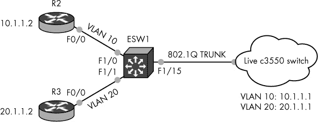

图 7-11. 使用标准 dot1q 干道连接到实时交换机的示例拓扑

要使用*EtherSwitch 路由器*配置 VLAN 和 802.1Q 干道，打开 ESW1 的控制台并输入以下命令：

```
  ESW1# vlan database
➊ ESW1(vlan)# vlan 10
➋ ESW1(vlan)# vlan 20
  ESW1(vlan)# apply
  ESW1(vlan)# exit
  ESW1# configure terminal
  ESW1(config)# int f1/15
➌ ESW1(config-if)# switchport mode trunk
➍ ESW1(config-if)# switchport trunk encapsulation dot1q
  ESW1(config-if)# int f1/0
  ESW1(config-if)# switchport mode access
➎ ESW1(config-if)# switchport access vlan 10
  ESW1(config-if)# int f1/1
  ESW1(config-if)# switchport mode access
➏ ESW1(config-if)# switchport access vlan 20
```

之前的命令在交换机上创建了 VLAN 10 ➊和 VLAN 20 ➋，配置了一个使用 dot1q 协议的干道端口 ➌ 以及将接入端口分配给 VLAN 10 ➎（用于路由器 R2）和 VLAN 20 ➏（用于路由器 R3）。

如果你选择使用以太网交换节点，配置一个端口为 802.1Q 干道，其余端口为 VLAN 接入端口，如图 7-12 所示。


图 7-12. 配置了 dot1q 干道端口的以太网交换节点

端口 1 和端口 2 被配置为接入端口，分别使用 VLAN 10 ➊和 VLAN 20 ➋，端口 3 是 dot1q 干道端口 ➌，连接到云节点。

接下来，登录到实时 Cisco 交换机并创建相同的 VLAN。然后，配置 802.1Q 干道端口，并将其连接到你的 PC 以太网适配器。以下列表是如何使用你在本章中看到的命令来配置 c3550 交换机的示例。

```
c3550# configure-terminal
c3550(config)# ip routing
c3550(config)# interface vlan 10
c3550(config-vlan)# ip address 10.1.1.1
c3550(config-vlan)# interface vlan 20
c3550(config-vlan)# ip address 20.1.1.1
c3550(config-vlan)# exit
c3550(config)# Interface f0/1
c3550(config-if)# switchport trunk encapsulation dot1q
c3550(config-if)# switch port mode trunk
c3550(config-if)# switchport trunk allowed vlan all
c3550(config-if)# speed 100
c3550(config-if)# duplex full
```

为完成项目，配置路由器 R2 和 R3。登录到路由器 R2 并为 VLAN 10 配置 IP 地址和默认网关。

```
R2(config)# interface f0/0
R2(config-if)# description Using VLAN 10
R2(config-if)# ip address 10.1.1.2 255.255.255.0
R2(config-if)# no shutdown
R2(config-if)# exit
R2(config)# ip route 0.0.0.0 0.0.0.0 10.1.1.1
```

现在，登录到路由器 R3 并为 VLAN 20 配置 IP 地址和默认网关。

```
R3(config)# interface f0/0
R3(config-if)# description Using VLAN 20
R3(config-if)# ip address 20.1.1.2 255.255.255.0
R3(config-if)# no shutdown
R3(config-if)# exit
R3(config)# ip route 0.0.0.0 0.0.0.0 20.1.1.1
```

通过从一个 VLAN 到另一个 VLAN 输入`ping`命令，测试 VLAN 通过交换机的路由功能。

```
R3# ping 10.1.1.2
!!!!!
```

项目完成后，你可以使用 CDP 或 Wireshark 等工具进一步验证配置。

## 创建难以捉摸的突破交换机

*突破交换机*是将真实交换机连接到 GNS3 项目的另一种方式，通常使用 Ubuntu Linux 设置。尽管突破交换机在其他系统上也可以工作，但在 Linux 上设置最为简单。如前所述，像 Windows 和 OS X 这样的其他操作系统可能会去除数据包中的 VLAN 信息。因此，如果你计划创建突破交换机，最好在真实硬件上安装 Ubuntu。如果你使用虚拟机，底层的主机操作系统可能会去除 VLAN 标签，导致突破交换机无法正常工作。有时，你可以通过使用 USB 以太网适配器来解决这个问题，比如在配置标准 802.1Q 中继中提到的 StartTech USB31000SW。

这种交换方法至少需要两台真实的 Cisco 交换机；一台是突破交换机，另一台是你在 GNS3 项目中使用的一个或多个实时 Cisco 交换机。突破交换机用于欺骗实时 Cisco 交换机，让它们认为你的每个 GNS3 路由器都通过以太网电缆*直接连接*到实时交换机。实际上，你的 PC 只使用一个以太网适配器将所有 GNS3 路由器连接到实时交换机，这个适配器连接到突破交换机。突破交换机随后配置为*将所有 VLAN 打破*为单独的接口，你可以通过以太网电缆（每个 VLAN 一根）将它们插入到其他实时 Cisco 交换机中。我称这些为*突破电缆*。图 7-13 显示了你的 PC 和交换机的物理布局。

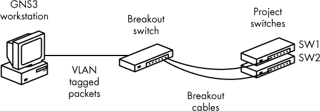

图 7-13. 使用突破交换机和实时 Cisco 交换机的物理布局

下面是它如何工作的飞行视角图。突破 VLAN 配置在你的 Linux 以太网适配器上，使用 `vlan` 包，而在突破交换机上配置一个 802.1Q 中继。在 GNS3 中，你将添加一个或多个云节点，这些节点使用 NIO 以太网接口配置 Linux 突破 VLAN。在 GNS3 项目中，一个路由器连接到每个云节点的 VLAN 接口（每个接口一个路由器）。离开路由器的数据包进入云节点，Linux 给它们标记 VLAN ID，并通过你的 PC 的以太网适配器将它们传递到突破交换机。突破交换机在标准的 802.1Q 中继端口接收这些数据包。从那里，突破交换机使用 VLAN ID 来识别并透明地将数据包传递到一个（或多个）实时 Cisco 交换机。这种方法的巧妙之处在于，每个 GNS3 路由器都有一根单独的以太网电缆，连接到实时 Cisco 交换机的端口，尽管你的 PC 只有一个以太网适配器。

在 Linux 上配置断开开关相对简单。首先，更新您的包管理器并在 Ubuntu 系统上安装 VLAN 支持。

```
$ **sudo apt-get install vlan**
```

现在，使用 `modprobe` 命令启用 `8021q` Linux 模块。

```
$ **sudo modprobe 8021q**
```

接下来，增加以太网接口的 MTU 帧大小，并使用 `vconfig` 命令创建您的断开 VLAN。确保将 *`eth0`* 替换为您的接口名称。

```
➊ $ **sudo ifconfig eth0 mtu 1546**
➋ $ **sudo vconfig add eth0 10**
➌ $ **sudo vconfig add eth0 20**
```

### 注意

*您的以太网适配器必须支持超过标准最大值 1500 字节的帧大小。*

增加的帧大小 ➊ 为额外的 VLAN 标签提供了空间。为您的项目中的每个路由器创建一个断开 VLAN。在前面的列表中，我在我的 Linux PC 的 *`eth0`* 接口上创建了两个断开 VLAN（10 ➋ 和 20 ➌）。

### 注意

*不要将断开 VLAN 与您在 GNS3 项目中创建的 VLAN 混淆。重要的是要理解，断开 VLAN 应仅由 Linux 和断开交换机使用——它们不能在您的 GNS3 项目或实时 Cisco 交换机中使用。*

开始通过增加系统范围的 MTU 大小来配置断开开关。输入命令后，必须重新加载交换机才能使更改生效。

```
Breakout(config)# system mtu 1546
```

交换机重启后，登录并按如下方式配置 802.1Q 中继链路：

```
  Breakout# configure terminal
  Breakout(config)# interface FastEthernet 0/1
➊ Breakout(config-if)# switchport trunk encapsulation dot1q
➋ Breakout(config-if)# switchport mode trunk
➌ Breakout(config-if)# switchport trunk allowed vlan all
```

配置为中继的接口然后通过以太网电缆连接到您的 PC 的物理以太网适配器。如图所示，dot1q 封装 ➊ 配置在中继端口 ➋ 上，并且所有 VLAN ➌ 都允许通过中继。

接下来，进入您计划连接到实时交换机的每个接口，并为每个 VLAN 配置一个断开 VLAN 和一个 dot1q 隧道，如以下列表所示：

```
  Breakout(config)# vlan 10
  Breakout(config-vlan)# vlan 20
  Breakout(config-vlan)# exit
  Breakout(config)# interface FastEthernet 0/2
  Breakout(config-if)# description GNS3 R1 Physical Uplink to Live Switch SW1
➊ Breakout(config-if)# switchport access vlan 10
➋ Breakout(config-if)# switchport mode dot1q-tunnel
➌ Breakout(config-if)# l2protocol-tunnel cdp
  Breakout(config-if)# interface FastEthernet 0/3
  Breakout(config-if)# description GNS3 R2 Physical Uplink to Live Switch SW2
➍ Breakout(config-if)# switchport access vlan 20
  Breakout(config-if)# switchport mode dot1q-tunnel
  Breakout(config-if)# l2protocol-tunnel cdp
```

在这里，我们的断开开关的 FastEthernet 0/2 接口配置为 VLAN 10 ➊，dot1q 隧道 ➋ 和 Cisco 发现协议隧道 ➌。FastEthernet 0/3 配置方式相同，但用于 VLAN 20 ➍。这些接口用于将 GNS3 路由器连接到您的实时 Cisco 交换机。

我们已经知道，Cisco 发现协议（CDP）用于共享和收集与直接连接的 Cisco 设备（通常称为 *邻居*）的信息。然而，我们的实时 Cisco 交换机并未直接连接到 GNS3；它是通过断开开关连接的。在这种情况下，使用 CDP 的唯一方法是通过断开开关隧道协议到实时 Cisco 交换机，使用 `l2protocol-tunnel cdp` 命令。（您也可以隧道 STP 和 VTP。）事情变得复杂的地方是，CDP 隧道并非在所有交换机上都能工作。如果您需要使用 CDP，务必选择完全支持 CDP 隧道的断开交换机。表 7-1 列出了几款常见的 Cisco 交换机及其 CDP 隧道能力。

表 7-1. 常见的 Cisco 交换机及其 CDP 隧道兼容性

| 交换机 | CDP 隧道兼容性 |
| --- | --- |
| Cisco 2950 | CDP 在任何方向都无法工作。该交换机不支持层 2 隧道。 |
| Cisco 3550 | CDP 仅在一个方向上工作。不论 IOS 版本如何，交换机上无法看到邻居。 |
| Cisco 3560 | CDP 仅在一个方向上工作。不论 IOS 版本如何，交换机上无法看到邻居。 |
| Cisco 3750 | 双向 CDP 和完全功能（层 2 和层 3），使用 IP 服务镜像。IP 基础镜像不支持隧道功能。 |
| Cisco 4948 | 双向 CDP 和完全功能（层 2 和层 3），使用最低 IP 服务镜像。 |

Cisco 3750 交换机表现良好，既可以作为分路交换机，也可以用于隧道 CDP，但它不是最便宜的交换机。如果你没有足够的预算购买此型号，你可以选择一个较便宜的型号，应该能够作为分路交换机工作，但你在 GNS3 项目中不会获得完全透明性。

在继续之前，请确保分路交换机的 Fa0/1 端口已连接到你的 PC 的以太网端口，Fa0/2 和 Fa0/3 已连接到你现场项目交换机的以太网端口。检查完这些连接后，启动 GNS3 并使用你之前创建的 Linux VLAN 配置云节点，如图 7-14 所示。

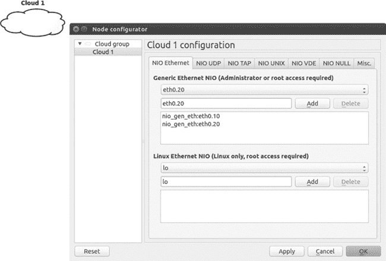

图 7-14. 使用 Linux VLAN 配置云节点

### 注意

*即使你使用的是 Linux，使用通用以太网 NIO 而不是 Linux 以太网 NIO 也很重要。否则，VLAN 标记可能无法正常工作。*

当你完成将分路 VLAN 添加到云节点后，向工作空间添加几个路由器，并为每个路由器创建一个与云节点上分路 VLAN 的连接。在图 7-15 中，路由器 R1（F0/0）通过*nio_gen_eth:eth0.10*连接到云中的 VLAN 10，路由器 R2（F0/0）通过*nio_gen_eth:eth0.20*连接到 VLAN 20。

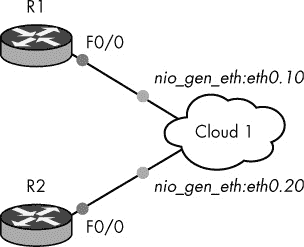

图 7-15. 使用云节点连接到 Linux VLAN 的虚拟路由器

因为分路交换机仅用于将 VLAN 分割到多个物理端口，所以无需进一步配置。在这个示例中，路由器 R1 现在连接到任何插入分路交换机端口 f0/2 的活动交换机，而 R2 应连接到任何插入端口 f0/3 的活动交换机。

### 注意

*如果你使用多个 VLAN 创建大型项目，可能希望每个云节点只分配一个 Linux VLAN 接口，以帮助清晰地展示工作空间中的布局。*

现在你的 GNS3 路由器应该能够与一个或多个实际的 Cisco 交换机进行通信。

## 可选的分路交换机配置

如果你正在运行 Windows 或 OS X，你可能能够使用 GNS3 交换机节点将你的项目连接到突破交换机，如 图 7-16 所示。在此设置中，突破交换机与之前配置的方式相同，但你需要对你的 PC 进行一些调整。以太网交换机节点通过一个 NIO 接口连接到云节点，该接口在 Windows 上配置为回环适配器，在 OS X 上配置为 TAP 接口。虚拟适配器与 PC 的物理以太网适配器桥接。这样，云 1 就可以通过 PC 的以太网适配器连接到突破交换机。

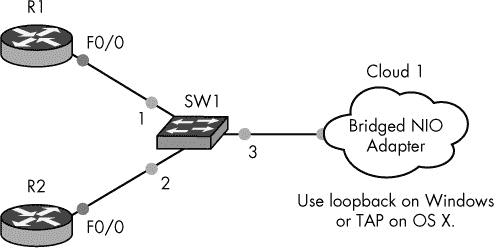

图 7-16. 使用以太网交换机节点配置突破交换机

为了让突破交换机正常工作，你应该增加 PC 物理以太网适配器的 MTU 大小，但并不是所有适配器都支持此功能。

如果你是 OS X 用户，必须增加你物理适配器和虚拟适配器的 MTU 大小。要通过命令行增加 MTU 大小，可以使用以下示例：

```
$ **sudo ifconfig en0 mtu 1546**
$ **sudo ifconfig tap0 mtu 1546**
```

### 注意

*在 OS X 上，使用相同的 MTU 大小配置虚拟适配器和物理适配器，否则桥接创建将失败。*

你可能需要查看以太网适配器的文档，以便在 Windows 上配置你的适配器。然而，在许多适配器上，MTU 设置可以在适配器的高级属性中找到，如 图 7-17 所示。在这个示例中，`Jumbo Packet` 的值被设置为 9014 字节，适用于 Intel PRO/1000 MT 卡。

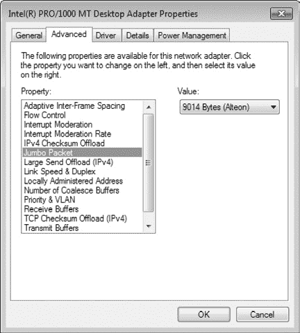

图 7-17. 在 Windows 上设置 Jumbo 包大小

接下来，启动以太网交换机节点的节点配置器，定义 VLAN 和 dot1q 中继端口，如 图 7-18 所示。

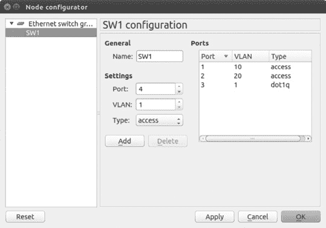

图 7-18. 配置为突破交换机的以太网交换机节点

在此示例中，R1 连接到接入端口 1（VLAN 10），R2 连接到接入端口 2（VLAN 20），端口 3 是连接到突破交换机的 dot1q 中继端口。在 GNS3 中完成所有配置后，你可以登录并按之前描述的方式配置突破交换机的 VLAN 和 dot1q 隧道。

## 在你的 PC 上使用多个适配器

与其使用 802.1Q 中继或分离交换机，您可以为 GNS3 中的每个路由器使用一个物理以太网接口。如果您有一台笔记本电脑，可以使用 USB 集线器并将多个 USB 以太网适配器连接到计算机；如果是台式机，您可以使用 USB 集线器方法或购买多端口以太网卡。图 7-19 显示了设计的物理布局。

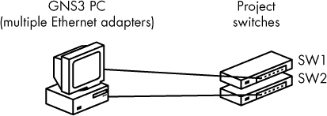

图 7-19. 使用多个适配器的物理布局

将计算机中的每个以太网适配器连接到实时的 Cisco 交换机上的物理端口。登录到每个交换机，并使用 `switchport mode access` 命令配置接入端口。然后，通过输入 `switchport access vlan {vlan number}` 来为端口分配一个唯一的 VLAN 编号，如以下列表所示。

从第一个交换机（c3550_sw1）开始：

```
c3550_sw1(config)# interface f0/1
c3550_sw1(config-if)# description VLAN used for PC Ethernet Adapter 1
c3550_sw1(config-if)# switchport mode access
c3550_sw1(config-if)# switchport access vlan 10
```

接下来，配置第二个交换机（c3550_sw2）：

```
c3550_sw2(config)# interface f0/1
c3550_sw2(config-if)# description VLAN used for PC Ethernet Adapter 2
c3550_sw2(config-if)# switchport mode access
c3550_sw2(config-if)# switchport access vlan 20
```

要将 GNS3 设备连接到交换机，请在工作区中添加一个 Cloud 节点，并为计算机中的每个以太网适配器分配一个 NIO Ethernet 接口。通过每个接口连接一个 GNS3 路由器。

### 注意

*OS X 用户需要为每个适配器创建一个独特的桥接接口，并将每个以太网接口桥接到一个独特的 TAP 接口。OS X 支持最多 16 个 TAP 设备（tap0 到 tap15）。*

在项目中的所有设备配置完成后，您的 GNS3 设备应该能够与实时的 Cisco 交换机通信。交换机上需要进一步配置，以启用 GNS3 路由器之间的路由，这取决于您创建的交换机块设计。

现在让我们来看一下将 GNS3 连接到互联网的步骤。

# 将 GNS3 设备连接到互联网

要将 GNS3 设备连接到互联网，您需要在计算机中使用以太网适配器。如果直接使用无线网络适配器，则不支持，尽管如果将其桥接到回环适配器或 TAP 接口，可能会有一个适配器能工作（但不能完全依赖它）。将 GNS3 设备连接到以太网的方式与连接物理交换机相同：将一个 Cloud 节点添加到项目中，并使用 NIO TAP 或 NIO Ethernet 接口进行配置。

## 配置 Windows

在 Windows 系统上，使用回环适配器和计算机的物理以太网适配器创建一个桥接。然后，在 GNS3 中，使用配置了 NIO Ethernet 的 Cloud 节点并选择回环适配器。因为回环适配器已桥接到物理以太网适配器，您可以通过 Cloud 连接到 GNS3 外部的网络——包括互联网。

在 Windows 8.*x* 上，安装一个回环适配器，但不要将其添加到桥接中。相反，在您的物理接口（以太网或 Wi-Fi）上配置 Internet 连接共享（ICS）。操作方法是，右键点击 **开始** 按钮并选择 **网络连接**。接下来，右键点击您的物理接口并选择 **属性**。选择 **共享** 标签页，然后勾选 **允许其他网络用户通过此计算机的 Internet 连接进行连接** 选项。最后，从家庭网络连接下拉菜单中选择您的回环适配器，并点击 **确定**。

## 配置基于 Unix 的系统

在 Ubuntu Linux 上，使用您的 PC 的以太网接口创建一个 NIO 以太网连接。在 OS X 和一些 Linux 系统上，使用配置了 */dev/tap0* 的 NIO TAP 连接，并将 TAP 接口桥接到 PC 的以太网接口。

## 创建一个简单网络

通过将一个路由器和一个云节点添加到您的工作空间，并将路由器与云之间添加一条连接来创建一个项目。在图 7-20 中，云是使用 Windows 回环适配器配置的，名为 `Local Area Connection 2`。

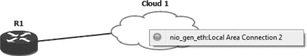

图 7-20. 使用 Windows 回环适配器连接到云

要测试 Internet 连接性，将一根以太网电缆从您的 PC 连接到一个互联网设备，如电缆调制解调器，并在您的 GNS3 路由器上配置一个 IP 地址。如果像我这里一样使用 DHCP 来分配 IP 地址，您可能需要稍等片刻，直到路由器获得 IP 地址后才能测试连接性。

```
R1(config)# ip domain-lookup
R1(config)# ip name-server 8.8.8.8
R1(config)# interface f0/0
R1(config)# no shutdown
R1(config-if)# ip address dhcp

*Mar 1 00:01:08.875: %DHCP-6-ADDRESS_ASSIGN: Interface FastEthernet0/0 assigned
DHCP address 192.168.1.101, mask 255.255.255.0, hostname R1
```

在路由器获取到 IP 地址后，您应该能够 ping 通 Internet 上的主机。试着 ping *[www.gns3.net](http://www.gns3.net)*！您不仅限于使用路由器连接到 Internet；您也可以使用 ASA 设备、Juniper 路由器或任何其他支持 TCP/IP 的设备。

### 注意

*如果您的路由器 R1 后面有其他设备，您需要在 R1 上配置 NAT，才能让它们路由到 Internet。欲了解更多信息，请访问思科网站* ([`www.cisco.com/en/US/tech/tk648/tk361/technologies_tech_note09186a0080094e77.shtml#topic6`](http://www.cisco.com/en/US/tech/tk648/tk361/technologies_tech_note09186a0080094e77.shtml#topic6))。

# 最后的想法

在本章中，我们探讨了如何配置 GNS3 设备节点，并将其集成到您的项目中，使用 Cisco IOS。它们非常容易设置，并且非常适合大型项目，因为它们大大减少了 PC 的负载。与 Dynamips 设备相比，GNS3 设备节点几乎不使用 PC 资源。

将 GNS3 设备连接到实际的 Cisco 交换机是一个比较棘手的操作。如果你选择创建一个标准的 802.1Q 中继链路来连接实际交换机，你可以使用 EtherSwitch 路由器或以太网交换机节点，但你的 PC 操作系统和以太网适配器驱动程序必须都支持 802.1Q 标记。如果没有正确的 VLAN 标签，中继功能将无法正常工作。

如果你有一台额外的 IOS 交换机，你可以创建一个分裂交换机，这是一种非常可靠的方式，可以将多个真实的 Cisco 交换机集成到你的 GNS3 项目中。分裂交换机在 Linux 系统上最为可靠，但也可以在 Windows 和 OS X 上进行配置。

在下一章，我们将介绍一些更高级的功能，包括 Cisco、ASA 以及 IDS/IPS。
