# 第八章。Cisco ASA、IDS/IPS 和 IOS-XRv

你已经看到了一些 GNS3 如何与其他软件和操作系统交互的方法。在本章中，你将深入了解 GNS3 的高级功能，并探索如何通过与额外的 Quick Emulator（QEMU）虚拟设备和软件进行交互来扩展你的项目。

了解像 Cisco 的 ASA、入侵检测系统/入侵防御系统（IDS/IPS）和 IOS-XR 这样的技术，可以拓宽你对 Cisco 和 GNS3 的视野，并在选择网络认证路径时有所帮助。此外，操作虚拟化的 Cisco 产品也很有趣，而这些产品通常是大多数人无法接触到的。学习如何使用一些 Cisco 的基于图形界面的工具也是非常重要的。

我将首先向你展示如何安装 Cisco 配置专业版（CCP）软件，这是一个基于 Web 的配置路由器的替代方法，替代了使用 Cisco 命令行接口的传统方式。接下来，你将学习如何配置和运行 ASA。我还会讨论如何使用 Cisco 的自适应安全设备管理器（ASDM）软件，这与前面提到的 CCP 软件类似，但用于配置 ASA。到本章结束时，你将了解到，耐心不仅是一种美德，更是设置 Cisco IDS/IPS 时的必要条件。最后，我将向你展示如何在 GNS3 中配置和使用 Cisco IOS-XRv 设备。

# Cisco 配置专业版

大多数工程师使用 IOS 命令来配置路由器和交换机，但也有其他方法。CCP 是一种基于 Web 的替代方案，它使用“智能向导”来简化路由器配置，并提供工具帮助你监控和排查网络和 VPN 的故障。简而言之，CCP 允许经验较少的用户让他们的设备快速启动并运行。

## 项目配置

要在 GNS3 中使用 CCP，你需要创建一个简单的项目，使用一台路由器和一台运行 Microsoft Windows 的 VirtualBox 虚拟机，如图 8-1 所示。虽然有其他方法可以实现这一点，但我选择演示这种方法，因为它应该适用于任何运行 GNS3 的 PC（Windows、Linux 和 OS X）。

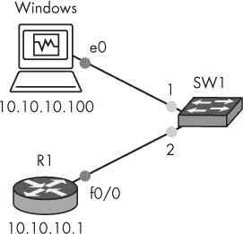

图 8-1。使用路由器和 Windows 主机的 CCP 拓扑

登录到 Windows 计算机并禁用防火墙，以确保 CCP 可以与路由器进行无障碍通信。（这不是强制性的，但可能会避免后续的麻烦。）为 Windows 客户机分配一个与路由器在同一子网中的 IP 地址（在此示例中为 10.10.10.100）。

接下来，在你的路由器上创建一个基本配置。

```
➊ R1(config)# **ip http server**
  R1(config)# **ip http secure-server**
  R1(config)# **ip http authentication local**
➋ R1(config)# **username admin privilege 15 secret cisco**
  R1(config)# **interface f0/0**
➌ R1(config-if)# **ip address 10.10.10.1 255.255.255.0**
  R1(config-if)# **no shutdown**
```

你需要启用路由器的 Web 服务器 ➊，创建一个具有完全 EXEC 模式权限的用户 ➋，并为接口分配一个 IP 地址 ➌。在这个示例中，路由器被分配了 IP 地址 10.10.10.1。

### 注意

*你必须创建一个具有完全 EXEC 模式权限（权限 15）的 Cisco 管理员账户，以便后续使用 CCP 配置路由器时拥有足够的权限。*

配置完路由器后，使用 `ping` 命令测试 Windows 客户机与路由器之间的连接。

```
C:> **ping 10.10.10.1**
```

如果你能成功 ping 通路由器，那么可以安全地继续。如果无法 ping 通路由器，请检查你的 IP 地址和接口设置。

## CCP 安装

CCP 是一个基于 Java 的应用程序，它与 Web 浏览器交互，因此在开始之前，如果你尚未安装 Java，请先下载并安装 Java（* [`www.java.com/`](http://www.java.com/)*）。确保你也安装了最新版本的 Adobe Flash Player（* [`www.adobe.com/`](http://www.adobe.com/)*）。你可以从 Cisco 网站（* [`www.cisco.com/`](http://www.cisco.com/)*）下载 Cisco 配置专业版。

要安装 CCP，登录到你的 Windows 虚拟机并启动安装程序；你应该能看到 CCP 安装向导。点击**下一步**并按照提示完成安装。

## 运行 CCP

通过右键点击程序图标并选择**以管理员身份运行**，启动 Cisco 配置专业版。当程序打开后，系统会要求输入你想要管理的路由器的 IP 地址。你应该能看到 CCP 设备管理器，如图 8-2 所示。

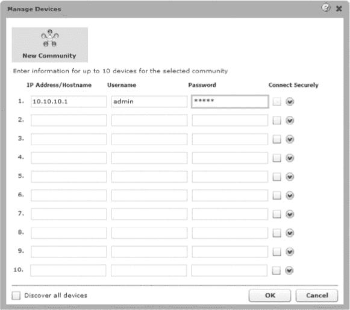

图 8-2. CCP 设备管理器

输入你分配给路由器的 IP 地址（**10.10.10.1**），输入你之前设置的管理员用户名和密码（**admin** 和 **cisco**），然后点击**确定**。登录后，你应该能看到 CCP 管理界面，如图 8-3 所示。

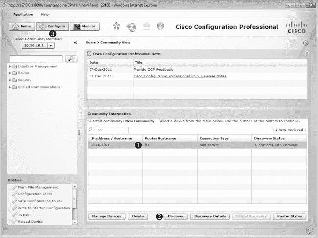

图 8-3. Cisco CCP 管理界面

在你能够管理路由器之前，首先需要通过点击路由器主机名 R1 ➊，然后点击**发现** ➋，以便 CCP 能够发现其特性和功能。发现后，你可以通过点击工具栏中的**配置** ➌ 来设置路由器。使用 CCP 的优点是，它会引导你完成分配 IP 地址、NAT、VPN 和其他 Cisco 功能的过程，而无需你了解任何 IOS 命令。请注意，Cisco 认证考试主要关注 IOS 命令，而不是使用 CCP 配置设备。

# Cisco ASA 防火墙

Cisco 的 ASA 是旧款 PIX 防火墙的改进版本。GNS3 模拟了 Cisco ASA 5520 型号。虽然它不是路由器，但你可能会惊讶地发现，ASA 支持多种路由协议，包括 RIP、EIGRP 和 OSPF，这使得你可以轻松地将其与其他 GNS3 路由设备联网。

## 获取镜像

在你可以在 GNS3 中使用 ASA 虚拟机之前，你需要一个 ASA 操作系统的镜像文件。获取 ASA 操作系统镜像的最快方法是从你已经拥有的 ASA 设备中复制它（即从 ASA 安装光盘或直接从 ASA 设备复制）。从 Cisco ASA 复制文件的方式与从 Cisco 路由器复制文件的方式相同：你可以使用 FTP 或 TFTP。在这个示例中，你将使用 TFTP 服务器。市面上有很多免费的 TFTP 服务器可供选择，所以可以选择一个你喜欢的并安装到你的 PC 上。

在你的网络上运行 TFTP 服务器后，登录到你的物理 ASA，并将 ASA 镜像文件复制到你的 PC 上。在下面的列表中，我的 ASA 镜像文件名为 *asa824-k8.bin*，而我的 TFTP 服务器运行在 IP 地址为 192.168.1.100 的 PC 上：

```
ciscoasa# **copy flash:asa824-k8.bin tftp**
Address or name of remote host []? **192.168.1.100**
```

在你获得 ASA 镜像文件后，你需要对文件进行一些修改，才能在 GNS3 中使用它。

## 为 GNS3 准备 ASA 镜像

Cisco ASA 实际上只是一台小型的 Linux 计算机，像 *asa824-k8.bin* 这样的 ASA 镜像文件包含了一个紧凑型的 Linux 操作系统，专为在 ASA 硬件上运行而设计。

镜像文件包括一个 Linux 内核和为该设备提供支持的软件。要使用 GNS3 运行 ASA 软件，你需要解压 *.bin* 文件，进行一些修改，并将其重新打包成适合 QEMU 的格式。幸运的是，Linux 和 Cisco 社区中有很多聪明人写了图像解包软件，帮你完成这项工作。你可以从 GNS3 网站下载适用于 Windows 的 Cisco 图像解包工具，或者使用像 *repack.v4.sh* 这样的 Linux shell 脚本。无论你选择哪个解包工具，都需要找到适合你的 ASA 软件版本的工具。运行脚本后，你应该得到两个文件：*asa-vmlinuz*（一个 Linux 内核）和 *asa-initrd.gz*（一个 RAM 磁盘文件）。这些就是 QEMU 和 GNS3 使用的文件。

如果你不想修改自己的 ASA 镜像文件，可以通过快速的互联网搜索找到许多现成可用的 ASA 镜像文件。这些镜像文件通常以 *.zip* 文件的形式提供，包含两个文件（*asa-vmlinux* 和 *asa-initrd.gz*）。

## 配置 GNS3 以使用 ASA

在配置 GNS3 中的 ASA 之前，请确认 QEMU 已经在你的 PC 上安装并通过测试。（请参考第六章中针对你操作系统的 QEMU 安装信息。）接下来，启动 GNS3，在 Linux 和 Windows 中选择 **编辑** ▸ **首选项**，或在 OS X 中选择 **GNS3** ▸ **首选项**，然后从左侧面板中选择 **QEMU 虚拟机**，如图 8-4 所示。

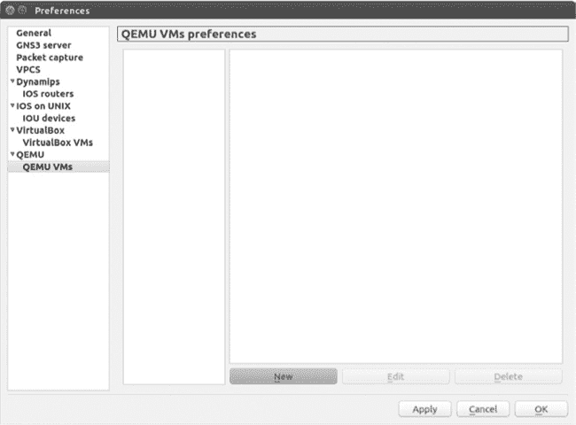

图 8-4. QEMU 虚拟机首选项

要在 GNS3 中创建新的 ASA，请点击**新建**以启动新的 QEMU VM 向导。从类型下拉菜单中选择**ASA 8.4(2)**，如图 8-5")所示。

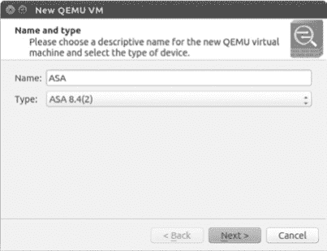

图 8-5. 创建新的 QEMU 虚拟机并将类型设置为 ASA 8.4(2)

默认情况下，您的设备会自动命名为*ASA*，但您可以根据需要重新命名。命名完成后，点击**下一步**继续。

向导应自动定位并选择适合您 PC 的 QEMU 二进制文件，如图 8-6 所示。

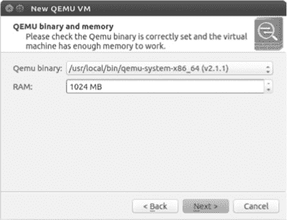

图 8-6. 选择 ASA 虚拟机的 QEMU 二进制文件和内存

如果没有找到 QEMU 二进制文件，请验证您的 PC 上是否正确安装了 QEMU，然后重试。默认的 RAM 值是 1024MB，但这是运行 ASA 镜像所需的最小值。您可以通过在字段中输入新值来增加该值。完成后，点击**下一步**继续向导。

最后的步骤是浏览并选择您的初始 RAM 磁盘和内核镜像，如图 8-7 所示。

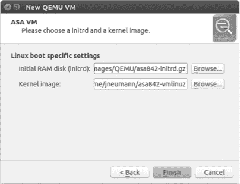

图 8-7. Linux 启动特定设置的 ASA 虚拟机

将初始 RAM 磁盘（initrd）和内核镜像设置为您计算机的正确文件；这些文件通常命名为 *asa842-initrd.gz* 和 *asa842-vmlinuz*。

选择完这两个镜像后，点击**完成**以完成安装。成功添加 ASA 后，ASA 设备应显示在 QEMU VM 偏好设置窗口中，如图 8-8 所示。

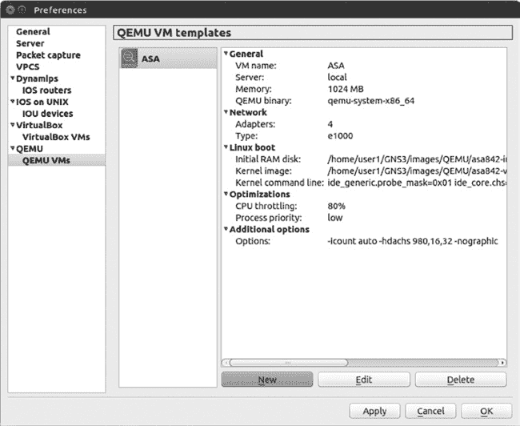

图 8-8. QEMU 虚拟机偏好设置的 ASA 虚拟机

您当前的 ASA 设置应显示在右侧面板中，您需要注意的一项设置是 CPU 限制（位于优化选项下）。

与 Dynamips 设备不同，ASA 没有闲置 PC 选项来控制 CPU 消耗。这意味着 ASA 可能会占用整个 CPU，就像没有设置闲置 PC 值的 Dynamips 路由器一样。为了避免这种情况，GNS3 使用另一个开源应用程序（cpulimit）来调整 QEMU/ASA 实例可以消耗的最大 CPU 量。默认值为 80%，在大多数情况下效果良好。你可以编辑 ASA 设置，增加或减少该值，但要小心；通过降低百分比使用太少的 CPU 可能会导致 ASA 性能不佳并频繁崩溃，而将百分比设置得太高则可能导致整体 PC 性能变慢。

在优化设置中，另一个需要注意的设置是进程优先级。GNS3 中的默认值为低，但可以设置为低、中或高。进程优先级决定了 QEMU/ASA 实例何时获得 CPU 时间。高优先级的进程会在低优先级的进程之前获得 CPU。通常，改变优先级应该对系统几乎没有影响，但为了安全起见，保持设置为低，以防 ASA 可能覆盖重要的系统进程。

在 Windows 和 OS X 上，cpulimit 程序应该已经随着 GNS3 一起安装。在 Ubuntu Linux 上，你需要使用以下命令安装 cpulimit：

```
$ **sudo apt-get install cpulimit**
```

现在你的 ASA 虚拟机不会接管你的系统，让我们登录到一个 ASA 并进行基本配置。

## 在 GNS3 中测试 ASA

从设备工具栏中将 ASA 防火墙节点拖到工作区。你的 ASA 应该位于工具栏的安全设备部分。启动 ASA 并打开 GNS3 控制台连接。在加载过程中，你应该看到标准的 ASA 启动消息，随后是 ASA 命令提示符：

```
ciscoasa>
```

在提示符前出现一些错误消息是完全正常的，但如果 ASA 无法启动或你看到很多错误，请检查设置或尝试使用不同的 ASA 镜像文件。

### 注意

*在 GNS3 中，ASA 在启动过程中挂起或停滞并不罕见，尤其是在较旧的硬件上。如果发生这种情况，停止并重新启动 ASA。可能需要尝试几次才能成功启动。*

为了测试简单的网络连接性，创建一个连接，将你的 ASA 与工作区中的另一个 GNS3 设备连接。接下来，打开 ASA 的控制台连接，并为接口配置一个 IP 地址。

```
ciscoasa> **enable**
ciscoasa# **configure terminal**
ciscoasa(config)# **interface GigabitEthernet0**
ciscoasa(config-if)# **ip address 10.10.10.1 255.255.255.0**
ciscoasa(config-if)# **nameif inside**
ciscoasa(config-if)# **no shutdown**
```

配置完接口后，使用`ping`命令测试从你的 ASA 到项目中其他设备的连接。

### 警告

*即使启用了 CPU 限制，ASA 设备仍然是处理器密集型的，因此你可能希望在项目中谨慎使用它们，特别是当你使用低端 PC 时。*

在验证你的 ASA 设备正常运行后，你可以开始将其添加到项目中。这对学习如何配置 ASA 或准备思科认证考试很有帮助。

# ASDM 安装

Cisco 的 ASDM 类似于在 Cisco 配置专业工具中介绍的 CCP 软件，因此许多细节是相同的。像 CCP 一样，ASDM 提供了一个基于 Java 的图形化网页界面。CCP 和 ASDM 的主要区别在于，ASDM 仅用于配置 Cisco ASA 设备，而不用于配置其他 Cisco 设备。

在安装 ASDM 软件之前，创建一个类似于图 8-9 中的项目。你将使用 Windows 虚拟机来安装和运行 ASDM 应用程序，然后启动 ASDM 并用它来查看 ASA 设备。


图 8-9. ASDM 拓扑，包含 ASA 防火墙和 Windows 虚拟机

获取 ASDM 软件有两种方法：从真实 ASA 的闪存中复制，或者在线查找。在获得 ASDM 软件后，需要将其存储在虚拟 ASA 的闪存驱动器上；然后通过网页浏览器在 Windows 虚拟机 PC 上安装它。我推荐使用 Mozilla Firefox，因为我发现它比 Internet Explorer 更能顺畅运行 ASDM。（只要确保禁用任何弹出窗口拦截器和防火墙，并安装最新版本的 Java。）你还需要 FTP 或 TFTP 服务器软件，将 ASDM 软件从 GNS3 Windows 虚拟机复制到 ASA 设备。

在获得 ASDM 镜像后，需要在 ASA 设备上进行一些准备工作，以便将 ASDM 镜像复制过来。请在 ASA 上输入以下命令：

```
  ciscoasa(config)# **interface gigabitEthernet0**
➊ ciscoasa(config-if)# **ip address 10.10.10.1 255.255.255.0**
  ciscoasa(config-if)# **nameif inside**
  ciscoasa(config-if)# **no shutdown**
  ciscoasa(config-if)# **exit**
➋ ciscoasa(config)# **username admin password cisco privilege 15**
➌ ciscoasa(config)# **http server enable**
  ciscoasa(config)# **http 10.10.10.0 255.255.255.0 inside**
```

就像设置 CCP 时一样，首先为内部接口分配一个 IP 地址➊。然后，创建一个本地用户账户➋，并启用 HTTP 服务器➌。

在 ASA 配置完成且你已将 ASDM 软件放到 FTP 或 TFTP 服务器上后，将软件从 Windows 虚拟机复制到 ASA 的闪存内存中。

```
ciscoasa# **copy tftp flash**
Source filename []? **asdm-641.bin**
Address or name of remote host []? **10.10.10.100**
Destination filename [asdm-641.bin] <enter>
Accessing tftp://10.10.10.100/asdm-641.bin !!!!!!!!!!!
```

本例通过 TFTP 将一个名为*asdm-641.bin*的文件从我的 GNS3 Windows 虚拟机复制到我的 ASA 设备。

复制 ASDM 文件后，你需要在 Windows 虚拟机上安装该软件。启动你的网页浏览器，并打开到 ASA 的 IP 地址的 HTTPS 连接。你应该会看到一个类似于图 8-10 的屏幕。

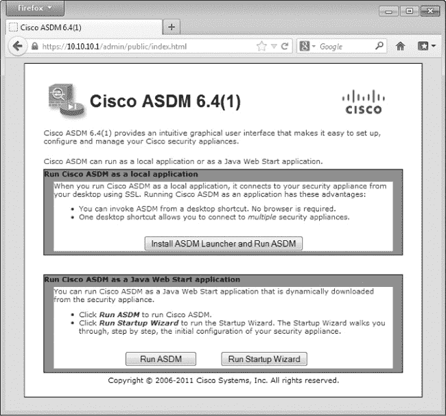

图 8-10. Cisco ASDM 安装屏幕

由于你将使用 Java Web Start 选项，请点击**运行 ASDM**。你的 PC 应该会下载 Java 软件，并向你展示一些安全警告，你可以安全地点击跳过，直到看到 Cisco ASDM-IDM 启动器，如图 8-11 所示。

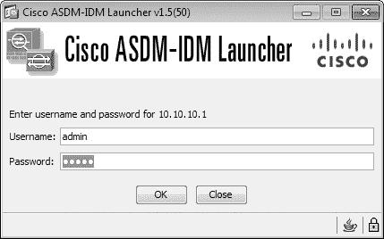

图 8-11. Windows ASDM-IDM 启动器

输入你的 ASA 用户名和密码（**admin** 和 **cisco**），然后选择 **OK** 以登录到 ASA。成功登录后，你可以从 ASDM 设备仪表盘开始配置系统，见图 8-12。

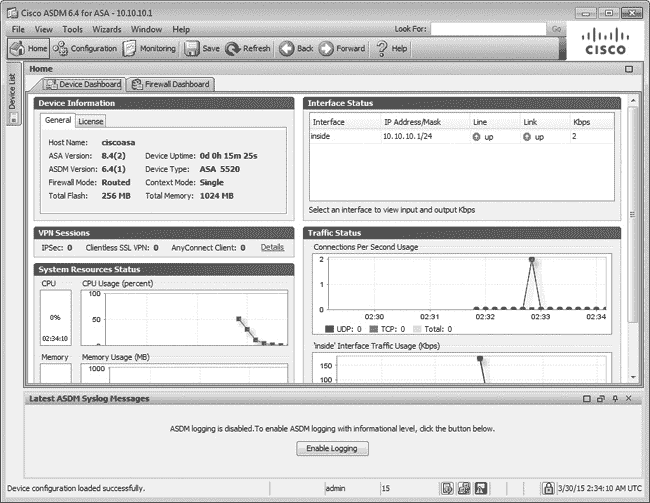

图 8-12. ASDM 设备仪表盘

ASDM 设备仪表盘包含了几个向导，提供了创建常见网络和虚拟私人网络（VPN）配置的引导设置。它还提供了许多实时统计数据，帮助你监控网络性能。虽然在 GNS3 中不一定有用，但这些信息对于维持现实中的健康网络可能非常宝贵。

# Cisco IDS/IPS

Cisco IDS/IPS 可以识别并阻止网络上的恶意活动。在现实中，IDS/IPS 可以是一个独立的 Cisco 设备，也可以是你插入 ASA 或集成服务路由器的模块。

在 GNS3 中创建 IDS/IPS 虚拟机相比于大多数任务来说确实比较麻烦，因此在开始之前，你可能需要腾出几个小时。

## 获取 IDS/IPS 镜像

与 PIX 和 ASA 一样，IDS/IPS 运行在特殊的 Linux 软件上。如果你拥有物理 IDS/IPS 设备，那么应该会随设备附带一个包含软件的升级/恢复 CD。

要使用 QEMU 虚拟机安装 IDS/IPS，你需要一个 CD 的 ISO 镜像文件。你可以使用你的 CD 创建自己的 ISO 镜像文件，或者在网上找到一个。在这个示例中，我使用了一个名为 *IPS-K9-cd-1.1-a-6.0-6-E3.iso* 的 IOS 镜像文件。其他版本的软件可能也可以正常工作，但这个版本已经证明在创建兼容 GNS3 的 IDS/IPS 时效果良好。

## 创建一个适用于 QEMU 的 IDS/IPS 系统

IDS/IPS 软件通过 QEMU 运行，因此在开始之前，请确保你已经在 PC 上安装了 QEMU，并且已在 GNS3 中测试过它。然后，为你的 IDS/IPS 创建一个构建目录，并将 ISO 文件复制到该目录。这里就是你将创建 IDS/IPS 虚拟机的地方。

要在 QEMU 虚拟机上安装 IDS/IPS 软件，你需要创建两个 QEMU 虚拟硬盘镜像文件。打开终端窗口并输入以下命令来创建镜像：

```
$ **qemu-img create ipsdisk1.img 512M**
$ **qemu-img create ipsdisk2.img 4000M**
```

### 注意

*在 Windows 和 OS X 上，你可能需要设置系统路径，以包含 QEMU 安装的位置。请参考 在 Windows 和 OS X 上安装 QEMU 获取详细信息。*

既然你已经创建了虚拟磁盘，输入以下命令以从 ISO 镜像文件启动你的虚拟机：

```
$ **qemu-system-i386 -hda ipsdisk1.img -hdb ipsdisk2.img -m 1024 -cdrom IPS-K9**
**-cd-1.1-a-6.0-6-E3.iso -boot d**
```

在 Windows 系统中，将此命令中的 `qemu-system-i386` 替换为 `qemu-system-i386w`。系统启动后，你应该看到一个类似于 图 8-13 的画面。

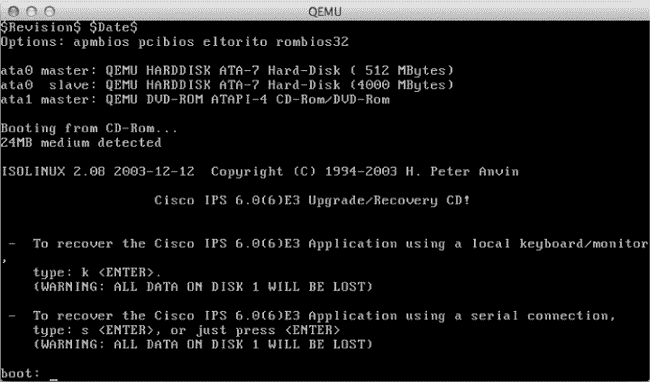

图 8-13. IDS/IPS 安装屏幕

在 `boot:` 提示符下，输入 **`k`** 执行完整系统恢复。在恢复过程中，你的 QEMU 虚拟机会从 ISO 镜像启动 Linux，安装 GRUB 引导加载器，并安装 IDS/IPS 软件。当安装完成并复制文件后，虚拟机会自动重启，并显示一个 “FATAL” 启动错误信息，如图 8-14 所示。

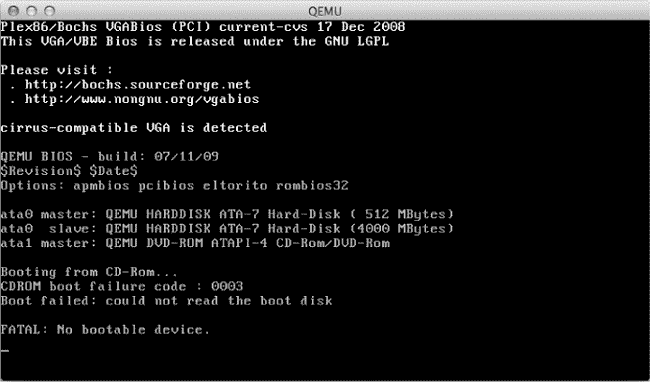

图 8-14. 致命错误：没有可启动设备

不用担心，这个错误是完全正常并且预期的。退出 QEMU 并输入以下命令再次启动 IDS/IPS：

```
$ **qemu-system-i386 -name IPS4215 -hda ipsdisk1.img -hdb ipsdisk2.img -m**
**1024 -smbios type=1,product=IDS-4215 -net nic,vlan=1,model=e1000 -net**
**nic,vlan=2,model=e1000**
```

IDS/IPS 虚拟机会启动进入 Linux GRUB 启动菜单。在启动菜单中，输入 **`e`** 来编辑条目。使用箭头键向下移动，突出显示 `kernel` 条目，再次输入 **`e`** 来编辑该条目。

使用回退箭头键定位并将 **`init=/loadrc`** 修改为 **`init=1`**。按下 ENTER 接受更改，然后按 **`b`** 从修改后的 GRUB 菜单启动。系统应该现在能够启动，绕过 IDS/IPS 启动，进入 Linux 控制台。从控制台命令行，你将使用 vi 编辑器修改一些 IDS/IPS 配置文件。

### 注意

*你必须使用 vi 编辑器来修改文件，因为没有安装其他编辑器。如果你不熟悉 vi，最好在继续之前复习一下它。只需在线搜索 `man vi` 或在命令行输入 `man vi` 查看手册页。*

在你熟悉了 vi 编辑命令之后，就可以继续进行下一步了。

## 劫持硬件

首先，你需要通过欺骗 IDS/IPS 软件，让它认为你的 QEMU 虚拟机是一个真实的 Cisco IDS-4215 Appliance Sensor。为了欺骗软件，你需要修改两个文件：*ids_functions* 和 *interface.conf*。修改这些文件相当繁琐，最小的错误都会导致你无法创建一个正常工作的 IDS/IPS 设备。

从 shell 提示符开始，输入以下命令：

```
-sh-2.05b# **/loadrc**
-sh-2.05b# **cd /etc/init.d**
-sh-2.05b# **./rc.init**
```

这将挂载 IDS/IPS 使用的 Linux 文件系统并初始化系统。接下来，使用 vi 打开 *ids_functions* 文件。

```
-sh-2.05b# **vi ids_functions**
```

打开文件后，输入命令 `/845` 让 vi 定位到以下条目：

```
elif [[ `isCPU 845` -eq $TRUE && $NUM_OF_PROCS -eq 1 ]]; then
        MODEL=$IDS4215
        HTLBLOW=8
        MEM_PAGES=${HTLBLOW}
        DEFAULT_MGT_OS="fe0_0"
        DEFAULT_MGT_CIDS="FastEthernet0/0"
```

接下来，编辑 `elif` 语句和 `DEFAULT_MGT` 语句，使其如下所示：

```
elif [[ **1 -eq 1** ]]; then
        MODEL=$IDS4215
        HTLBLOW=8
        MEM_PAGES=${HTLBLOW}
        DEFAULT_MGT_OS=**"ma0_0"**
        DEFAULT_MGTCIDS=**"Management0/0"**
```

当你完成编辑并确定已经做出正确修改时，保存文件并退出 vi 编辑器。

接下来，你需要编辑 *interface.conf* 文件。

```
-sh-2.05b# **cd /usr/cids/idsRoot/etc**
-sh-2.05b# **vi interface.conf**
```

使用箭头键向下移动到以 `####### IDS-4215 ########` 开头的部分，修改每个接口条目，从 `[models/IDS-4215/interfaces/1]` 开始，到 `[models/IDS-4215/interfaces/6]` 结束。每个条目必须完全与以下六个条目一致：

```
[models/IDS-4215/interfaces/1]
**name-template=Management0/0**
**port-number=0**
**pci-path=3.0**
vendor-id=0x8086
**device-id=0x100e**
type=fe
mgmt-capable=yes
net-dev-only=yes
**tcp-reset-capable=yes**

[models/IDS-4215/interfaces/2]
**name-template=FastEthernet0/0**
**port-number=1**
**pci-path=4.0**
vendor-id=0x8086
**device-id=0x100e**
type=fe
sensing-capable=yes
tcp-reset-capable=yes

[models/IDS-4215/interfaces/3]
**name-template=FastEthernet0/1**
**port-number=2**
**pci-path=5.0**
vendor-id=0x8086
**device-id=0x100e**
type=fe
sensing-capable=yes
tcp-reset-capable=yes

[models/IDS-4215/interfaces/4]
 **name-template=FastEthernet0/2**
 **port-number=3**
 **pci-path=6.0**
 vendor-id=0x8086
 **device-id=0x100e**
 type=fe
 sensing-capable=yes
 tcp-reset-capable=yes

[models/IDS-4215/interfaces/5]
 **name-template=FastEthernet0/3**
 **port-number=4**
 **pci-path=7.0**
 vendor-id=0x8086
 **device-id=0x100e**
 type=fe
 sensing-capable=yes
 tcp-reset-capable=yes

[models/IDS-4215/interfaces/6]
 **name-template=FastEthernet0/4**
 **port-number=5**
 **pci-path=8.0**
 vendor-id=0x8086
 **device-id=0x100e**
 type=fe
 sensing-capable=yes
 tcp-reset-capable=yes
```

在你编辑完接口之后，滚动浏览条目并确认每个接口是否配置正确。如果你确定一切正确，保存文件并退出 vi。使用`reboot`命令重启 IDS/IPS 虚拟机。

```
-sh-2.05b# **reboot**
```

系统应该会启动，配置一些内容，并自动重启。在自动重启后，当你看到 GRUB 引导管理器时，立即退出 QEMU，参见图 8-15。如果你未能退出并且在没有使用正确选项的情况下重新启动 QEMU，安装将失败，你将不得不从头开始。

退出 QEMU 后，使用以下命令选项重新启动你的 IDS/IPS 虚拟机：

```
$ **qemu-system-i386 -name IPS4215 -hda ipsdisk1.img -hdb ipsdisk2.img -m**
**1024 -smbios type=1,product=IDS-4215 -net nic,vlan=1,model=e1000 -net**
**nic,vlan=2,model=e1000**
```

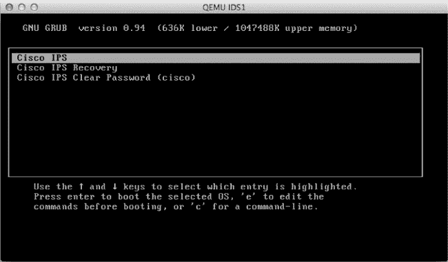

图 8-15. GRUB 引导管理器屏幕

你的 IDS/IPS 现在应该已经启动，进入登录提示界面，如图 8-16 所示。

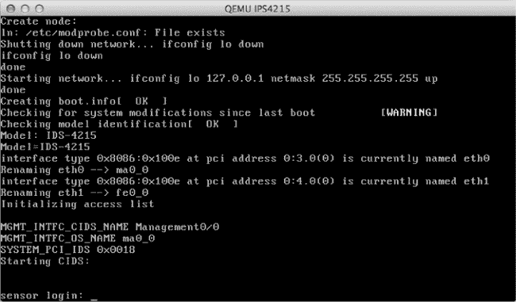

图 8-16. IDS/IPS 登录提示

你快完成了！通过输入默认用户名**`cisco`**和密码**`cisco`**登录系统，你应该会被引导重置密码。如果 IDS/IPS 设置中的任何部分出现问题，你可能会看到“检测到不受支持的硬件”的消息，如图 8-17 所示。

此时，你可以继续使用 IDS/IPS 虚拟机，或者从头开始。我建议你重新开始并创建一个新的 IDS/IPS，直到你能够无错误地登录。如果继续操作，IDS/IPS 系统可能会产生进一步的错误并无法正常工作。

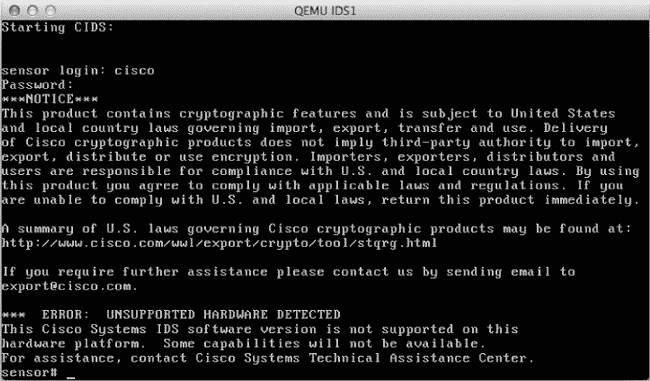

图 8-17. “检测到不受支持的硬件”错误

当你能够无错误地登录时，你就可以继续了。

## 测试 IDS/IPS（或耐心是一种美德）

第一次登录到 IDS/IPS 虚拟机时，你需要等待大约 20 分钟左右，系统将重建其正则表达式缓存表。这是正常现象，即使是实际的 IDS/IPS 设备也是如此，你不应打断它。你可以使用`iplog-status`命令定期检查进度。

```
sensor# **iplog-status**
```

如果状态消息显示“错误：getIpLogList：分析引擎正在忙于重建正则表达式表。这可能需要一些时间。”，那么系统仍在工作中，切勿中断它。重建完成后，你应该看到“No IP logs available”。

当重建完成后，输入**`reset`**命令关闭并重启虚拟机。不幸的是，目前没有优雅的方式来关闭系统。为了避免文件损坏，当重启进入 GRUB 启动菜单时，应该退出 QEMU。

## 配置 GNS3 用于 IDS/IPS

将 IDS/IPS 添加到 GNS3 的方式类似于添加 ASA。要添加 IDS/IPS 设备，启动 GNS3，在 Linux 和 Windows 中选择**编辑** ▸ **首选项**，或在 OS X 中选择**GNS3** ▸ **首选项**，然后从侧边栏选择**QEMU 虚拟机**，如图 8-18 所示。


图 8-18. IDS 首选项

要在 GNS3 中创建一个新的 IDS/IPS，点击**新建**启动新 QEMU 虚拟机向导。从类型下拉菜单中选择**IDS**，如图 8-19 所示。

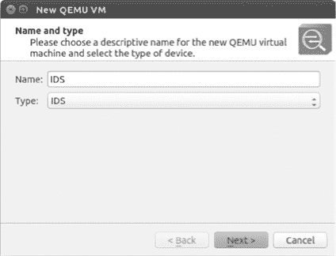

图 8-19. 在新 QEMU 虚拟机向导中选择 IDS

默认情况下，设备会自动命名为*IDS*。点击**下一步**继续。GNS3 应该会自动定位并选择适合你电脑的 QEMU 二进制文件，如图 8-20 所示。

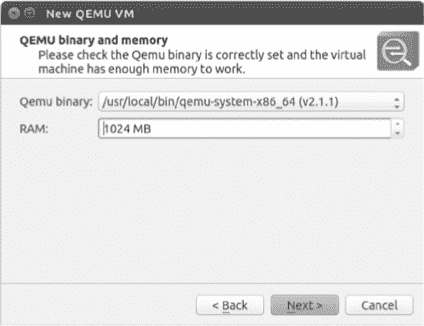

图 8-20. QEMU 二进制文件和内存界面

将内存设置为**1024 MB**或更大，然后点击**下一步**进入磁盘映像（hda）选择界面，如图 8-21 所示。

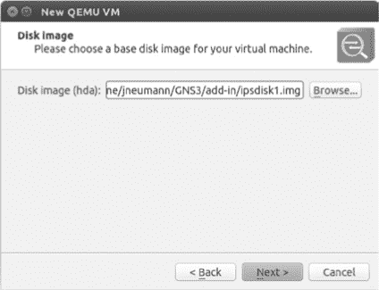

图 8-21. 选择磁盘映像

浏览并选择在构建 QEMU 就绪 IDS 系统时创建的名为*ipsdisk1.img*的文件。点击**下一步**进入磁盘映像（hdb）选择界面，并选择*ipsdisk2.img*。点击**完成**以完成安装。现在你可以开始测试你的 IDS。

## 验证 GNS3 中的 IDS/IPS

要验证你的 IDS/IPS 是否正常工作，将一个 IDS/IPS 节点拖入工作区并启动设备。GNS3 在设备完全启动之前无法打开 IDS/IPS 设备的控制台连接。这意味着在登录提示出现之前，你将看不到任何 IDS/IPS 消息。登录提示出现后，你应该能够登录并配置 IDS/IPS。为了防止文件损坏，在关闭设备时使用`reset`命令。

在确认你的 IDS/IPS 正常工作后，你应该备份 QEMU 磁盘映像文件。如果你的 IDS/IPS 设备出现问题，备份文件可以节省你大量的工作时间。

# Cisco IOS-XRv

Cisco 提供了一种名为 IOS-XRv 的 32 位虚拟机版本。IOS-XRv 的特点是，它不是像 IOU 或 NX-OSv 那样的模拟器，而是一个“受限版”的 IOS-XR，只包含一个路由处理器（RP）。网络吞吐量限制为 2Mbps，并且有一个硬编码的 AAA 用户，用户名为*cisco*，密码为*cisco*，这使得它无法在生产环境中使用，除非你想要一个缓慢且不安全的网络。尽管有这些限制，操作系统仍包含管理功能、路由和转发能力。

该软件设计为使用 VMware ESXi 或 QEMU 运行，因此在 GNS3 中使用非常方便。如果你有一个 Cisco CCO 帐户，你应该能够从 Cisco 文件交换下载该软件。

## 配置 GNS3 以支持 IOS-XRv

Cisco IOS-XRv 文件有两种镜像格式；第一种是 OVA 文件，第二种是虚拟机磁盘（VMDK）文件。OVA 镜像（以.*ova*结尾）适用于 VMware ESXi；VMDK 文件（以.*vmdk*结尾）已经准备好用于 QEMU，并且是你将在 GNS3 中使用的文件。在这个例子中，我将使用一个名为*iosxrv-k9-demo-5.2.2.vmdk*的镜像文件。

将 IOS-XRv 设备添加到 GNS3 非常简单。你只需启动新的 QEMU 虚拟机向导并按照提示操作；然后编辑设备，做一个小修改以增加适配器数量。要添加 IOS-XRv 设备，在 Linux 和 Windows 上选择**编辑** ▸ **首选项**，在 OS X 上选择**GNS3** ▸ **首选项**，然后从左侧面板选择**QEMU 虚拟机**。点击**新建**开始配置，并打开图 8-22 中的对话框。

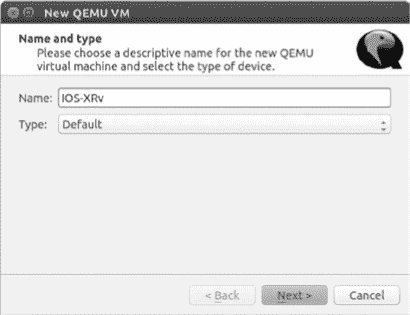

图 8-22. 新的 QEMU 虚拟机向导

将类型设置为**默认**并为您的设备输入名称；我输入的是**IOS-XRv**。完成后，点击**下一步**以继续进行 QEMU 二进制文件和内存设置，如图 8-23 所示。

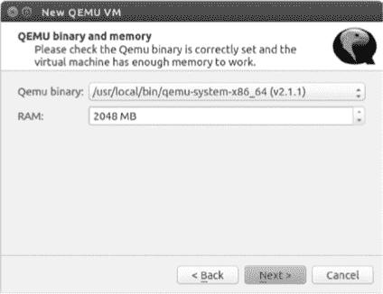

图 8-23. 配置 64 位系统上的 IOS-XRv

IOS-XRv 可以使用 32 位或 64 位 QEMU 硬件仿真运行。由于我在 PC 上运行的是 64 位操作系统，所以我选择使用 64 位 QEMU 二进制文件，名为*qemu-system-x86_64*（如图 8-23 所示），并将 RAM 设置为**2048 MB**，这是推荐的内存大小。然而，如果你运行的是 32 位操作系统，例如 Windows，你需要将 RAM 设置为小于 2048MB。这是因为 32 位 QEMU 程序无法为 IOS-XRv 虚拟机分配这么多内存。在这种情况下，你应该输入**1920 MB**并使用下拉菜单选择名为*qemu-system-i386w.exe*的 QEMU 二进制文件，如图 8-24 所示。

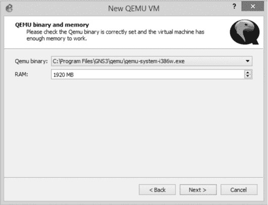

图 8-24. 配置 IOS-XRv 以支持 32 位 Windows 系统

配置完 QEMU 二进制文件和 RAM 后，点击**下一步**进入图 8-25 所示的磁盘镜像选择界面。

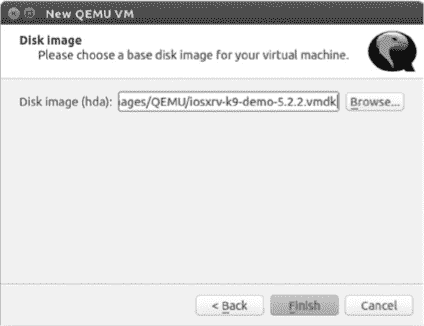

图 8-25. 选择磁盘镜像

点击**浏览**按钮以定位并选择你的 IOS-XRv *.vmdk*镜像文件。我选择了一个名为*iosxrv-k9-demo-5.2.2.vmdk*的磁盘镜像文件。

选择完镜像后，点击**完成**以关闭向导。接下来，选择你刚创建的 IOS-XRv 设备并点击**编辑**。选择**网络**标签，增加适配器数量至**4**。点击**确定**关闭窗口，然后点击**应用**和**确定**以提交更改。你可以根据需要设置适配器数量，但四个适配器对于大多数 GNS3 项目来说应该是足够的。

## 创建一个简单的 IOS-XR 项目

Cisco IOS-XR 非常像 IOS，但它并不是 IOS。在本节中，你将使用一个 Dynamips 路由器和一个 IOS-XRv 设备配置一个简单的项目，如图 8-26 所示。

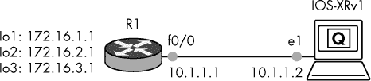

图 8-26. 一个简单的 IOS-XRv 项目

你将使用 EIGRP 从路由器 R1 广告三个网络到 IOS-XRv1 设备。最后，你将使用一些 IOS-XR 命令验证路由。这只是对 IOS-XR 的一个基础介绍。如果你想真正学习 IOS-XR，你需要深入研究 Cisco 的文档。

### 配置路由器

首先配置路由器 R1。为与 IOS-XRv1 相连的以太网接口配置一个 IP 地址。

```
R1# **configure terminal**
R1(config)# **interface f0/0**
R1(config-if)# **ip address 10.1.1.1 255.255.255.0**
R1(config-if)# **no shutdown**
```

接下来，配置路由器 R1 环回接口上的三个 IP 地址。

```
R1(config-if)# **interface loopback1**
R1(config-if)# **ip address 172.16.1.1 255.255.255.0**
R1(config-if)# **interface loopback2**
R1(config-if)# **ip address 172.16.2.1 255.255.255.0**
R1(config-if)# **interface loopback3**
R1(config-if)# **ip address 172.16.3.1 255.255.255.0**
R1(config-if)# **exit**
```

这些地址将通过 EIGRP 广告到你的 IOS-XRv1 设备。最后，配置 EIGRP 并广告所有网络。

```
R1(config)# **router eigrp 10**
R1(config-router)# **no auto-summary**
R1(config-router)# **network 10.0.0.0**
R1(config-router)# **network 172.16.0.0**
```

配置完路由器 R1 后，配置 IOS-XR 设备。

### 配置 IOS-XR 设备

登录到 IOS-XRv1，并创建一个与在路由器 R1 上创建的配置类似的配置。你将配置一个 IP 地址，并启用 EIGRP，以便 IOS-XRv1 和路由器 R1 可以交换路由信息。

```
➊ RP/0/0/CPU0:ios#
  RP/0/0/CPU0:ios# **configure terminal**
  RP/0/0/CPU0:ios(config)# **interface GigabitEthernet 0/0/0/0**
➋ RP/0/0/CPU0:ios(config-if)# **ipv4 address 10.1.1.2/24**
  RP/0/0/CPU0:ios(config-if)# **no shutdown**
  RP/0/0/CPU0:ios(config)# **router eigrp 10**
➌ RP/0/0/CPU0:ios(config-eigrp)# **address-family ipv4**
➍ RP/0/0/CPU0:ios(config-eigrp-af)# **interface GigabitEthernet 0/0/0/0**
➎ RP/0/0/CPU0:ios(config-eigrp-af)# **commit**
```

IOS 与 IOS-XR 之间的第一个显著区别是命令提示符。IOS-XRv1 的命令提示符 ➊ 表示你的上下文是第一个路由处理器（RP/0/0/CPU0）。由于这是 IOS-XRv 的演示版本，因此它仅限于这个单一的路由处理器。

接下来，当在以太网接口上配置 IP 地址时，必须指定你使用的 IP 地址的类型（IPv4 或 IPv6），并且子网掩码以 CIDR 表示法（/24）表示 ➋。类似地，在配置 EIGRP 路由进程时，也需要指定 IPv4 或 IPv6 ➌。最后，通过将已配置 IP 的接口放入 EIGRP 路由进程中来广播网络 ➍。完成后，确保提交你的更改 ➎。

一旦你配置完所有内容，输入`show eigrp neighbors`命令，你应该会看到以下输出：

```
RP/0/0/CPU0:ios# **show eigrp neighbors**
IPv4-EIGRP Neighbors for AS(10) VRF default

H   Address                 Interface      Hold Uptime   SRTT   RTO  Q   Seq
                                           (sec)         (ms)        Cnt Num
0   ➊10.1.1.1            ➋Gi0/0/0/0      13 00:28:09   19    200   0   3
```

在正确的配置下，EIGRP 邻居关系将与 IP 地址为 10.1.1.1 的路由器 R1 建立邻接 ➊，并来自接口 Gi0/0/0/0 ➋。

现在，使用`show route`命令验证所有 172.16.0.0 网络是否已经从路由器 R1 广播到 IOS-XRv1。

```
RP/0/0/CPU0:ios# **show route**
--*snip*--

C    10.1.1.0/24 is directly connected, 02:58:51, GigabitEthernet0/0/0/0
L    10.1.1.2/32 is directly connected, 02:58:51, GigabitEthernet0/0/0/0
D   ➊172.16.1.0/24 [90/2570240] via 10.1.1.1, 00:43:21, GigabitEthernet0/0/0/0
D   ➊172.16.2.0/24 [90/2570240] via 10.1.1.1, 00:43:21, GigabitEthernet0/0/0/0
D   ➊172.16.3.0/24 [90/2570240] via 10.1.1.1, 00:43:21, GigabitEthernet0/0/0/0
```

所有的 172.16.0.0 网络已经成功添加到 IOS-XR 路由表中 ➊。你可以通过 ping 其中一个地址来测试连接性。

```
  RP/0/0/CPU0:ios# **ping 172.16.1.1**
  Thu Oct 16 03:20:27.508 UTC
  Type escape sequence to abort.
  Sending 5, 100-byte ICMP Echos to 172.16.1.1, timeout is 2 seconds:
  !!!!!
➊ Success rate is 100 percent (5/5), round-trip min/avg/max = 9/19/49 ms
```

在这里，ping 测试是 100%成功的 ➊。现在，保存配置。

```
RP/0/0/CPU0:ios# **copy running-config nvram:**
Thu Oct 16 03:22:39.679 UTC
Destination file name (control-c to abort): [/running-config]? <enter>
Building configuration.
24 lines built in 1 second
[OK]
```

到目前为止，应该很明显，IOS-XR 与传统的 IOS 有些不同，但也有相似之处。IOS-XRv 是一个可靠的平台，并且在 GNS3 中玩起来非常有趣。或许有一天，思科会将 IOS-XR 的一个版本从它们的运营商级路由器移植到更小型的商业路由器上。如果那样的话，在 GNS3 中练习 IOS-XRv 将有助于为此做准备。

# 最后的思考

使用 GNS3，你可以迅速掌握配置和安装 ASA 防火墙的技能。我从事思科设备工作已有十多年，我了解到 ASAs 非常稳定，并且非常适合小型网络安装。对于任何从事小型企业网络工作的人来说，了解如何配置 ASA 是必不可少的。它们是少数几个价格合理、功能丰富且易于安装的非企业级思科产品之一。

使用 ASDM，你可以快速配置 ASA，允许远程用户通过 IPSec VPN 连接到他们的企业网络。许多跨平台的 VPN 客户端都兼容思科的 ASA 和路由器；OS X 内置了思科 VPN 客户端。在 Windows 上，你需要安装思科 VPN 客户端或思科 AnyConnect 软件。在 Linux 上，你可以使用 Virtual Private Network Connection（VPNC），它工作得非常好。我每天在 Linux 上使用 VPNC 访问全国各地的 VPN。

在下一章中，你将学习 Cisco IOU，并了解如何将 IOU 设备集成到 GNS3 项目中。这是一个令人兴奋的新进展，拓宽了 GNS3 的未来。
