# 第九章。Cisco IOS 在 UNIX 和 NX-OSv 上

在这一章中，我将讨论将 Cisco IOU 设备与 GNS3 安装和集成的策略。你还将学习如何使用 VirtualBox 和 NX-OSv 安装和运行 Cisco 的下一代交换操作系统（NX-OS）。

# Cisco IOU

Cisco IOU 是近年来在 Cisco 教育社区中发生的最酷的事情之一。IOU 的功能类似于 Dynamips，但使用的资源要少得多。像 Dynamips 一样，IOU 允许你在 GNS3 项目中添加路由器和交换机。不同于 Dynamips，IOU 镜像模拟的是 IOS 技术系列的特性，而不是特定 Cisco 模型的硬件组件。每个 IOU 镜像文件都是一个独立的二进制应用程序，运行着一个设备实例。现在有为路由、交换、IP 语音（VoIP）和 Pagent（用于生成 IP 流量）设计的镜像。IOU 不需要一个虚拟化管理程序来模拟 Cisco 硬件，这使得 IOU 设备比 Dynamips 设备更少占用内存和 CPU。显而易见的优势是，你可以在配置较为普通的 PC 上创建更大的拓扑结构。

2010 年，Cisco 将 IOU 集成到 Cisco Learning Network 中，为 CCNA 和 CCNP 学生提供在线虚拟实验室。这些实验室价格低廉且设计精良。如果你对 Cisco 学习实验室感兴趣，应该去看看 Cisco Learning Center (*[`learningnetwork.cisco.com/`](http://learningnetwork.cisco.com/)*).

正如名字所示，IOS on Unix 仅在基于 Unix 的系统上运行。有时被称为 IOS on Linux (IOL)，它是在 Solaris Unix 和 Linux 上开发的。

## IOU 对 GNS3 的意义

在 Cisco 宣布其将不再使用行业标准硬件，转而采用专有的集成服务路由器（ISR）硬件后，GNS3 社区开始担心 Dynamips 和 GNS3 是否迎来了终结。由于无法获得新专有硬件的技术规格，因此无法创建一个新虚拟化管理程序来运行最新的 IOS 软件。最终，旧的 Dynamips 设备将停止接收 IOS 更新并变得过时。

Cisco 实际上为 GNS3 使用的 7200 系列路由器保持着最新的 IOS，但所有其他 GNS3 路由器的 IOS 版本都停留在 12.4(15)T，这限制了学习现代技术（如 VoIP）。这就是为什么 IOU 如此令人兴奋的原因。它通过让你将更新的 IOS 技术集成到 GNS3 项目中，为 GNS3 注入了新的活力——这真是太酷了！

## 交换、交换、更多交换！

将 IOU 集成到 GNS3 中的最佳原因之一是，你可以使用 Cisco 的许多高级交换功能，这些功能在 Dynamips 中的 NM-16ESW 模块中是没有的（请参见附录 C）。这些功能使得 GNS3 能够提升其性能，成为一个适用于更高级认证（如 CCIE）的全方位培训工具。

使用 IOU 后，你不再需要购买物理交换机并创建分割交换机，或者使用像 ISL 桥接这种奇怪的小技巧来访问真实的交换机。通过使用 GNS3 的 EtherSwitch 路由器，现在你可以从 Dynamips 交换机创建一个常规的 802.1Q 干道链路到运行在 PC 上的 IOU 交换机块。IOU 交换机稳定、运行迅速，并且与物理交换机不同，IOU 交换机是完全便携的，这意味着它们可以作为你的 GNS3 项目的一部分随你携带在笔记本电脑上。

## IOU 镜像

IOU 镜像是围绕 IOS 特性设计的，它们的文件名通常能揭示它们包含哪些特性，就像 IOS 镜像的文件名一样。例如，我们来拆解一个名为*I86BI_LINUXL2-UPK9-M-15.0*的 IOU 交换机文件名。

+   ****I86BI****. 表示这是一个 Intel 32 位二进制镜像。

+   ****LINUX****. 表示它运行在 Linux 上。

+   ****L2****. 表示这是一个 L2/L3 交换机。

+   ****UPK9****. 表示镜像包含高级加密特性，如 3DES/AES。

+   ****M****. 表示这是一个主干 IOS。

+   ****15.0****. 指定该镜像基于的 IOS 版本。

使用这些信息，你应该能够查看几乎任何 IOU 文件名，快速判断它包含哪些特性。

## 安装 IOU 前需要了解的事项

默认情况下，标准的 GNS3 安装不允许你运行 IOU 设备。IOU 设备是 Linux 二进制文件，因此只能在 Linux 操作系统上运行。通常，这些镜像是 32 位二进制文件，但在适当的库文件支持下，你可以轻松地在 64 位 Linux 系统上运行它们。如果你在 Windows 或 OS X 上运行 GNS3，你需要安装像 VirtualBox 这样的虚拟化程序，并通过 Linux 虚拟机运行 IOU 设备。幸运的是，GNS3 提供了一个 IOU 虚拟机，你可以从 GNS3 网站下载。这个 GNS3 IOU 虚拟机已经准备好运行 IOU 镜像，提供了一个简单的方式让你上传镜像，并且不需要你了解如何使用 Linux 命令。

在 Linux 上运行 GNS3 的好处是，安装和配置 IOU 更加直接，所有的配置应该能顺利运行，无需额外设置。缺点是，你需要了解一些 Linux 知识，但在我看来，这是一个小代价。当你在 Windows 或 OS X 上运行 GNS3 时，必须配置它与 Linux 虚拟机通过 TCP/IP 通信，这可能很麻烦。如果你的工作站或 IOU 虚拟机的 IP 地址发生变化（这种情况经常发生），你需要重新配置 GNS3 以使用新的 IP 地址。而且，每次升级 GNS3 时，你还必须升级运行在 IOU 虚拟机上的 GNS3 服务器软件。版本号必须一致，否则 IOU 将无法运行。当你在 Linux 上同时运行 GNS3 和 IOU 时，这些步骤是多余的。

# 在 Linux PC 上设置 IOU

在 Linux PC 上运行 GNS3 和 IOU 有一些明显的优势。最大的优势是你不需要使用 IOU 虚拟机，因为在 Linux 上 IOU 镜像文件可以原生运行。这意味着你不必浪费宝贵的资源，如 CPU 周期和内存，这些资源通常会被 IOU 虚拟机占用。另一个优势是你可以使用 Wireshark 来捕获和监控两个 IOU 设备之间的数据包，而在使用 IOU 虚拟机时无法做到这一点。这是因为在启动 Wireshark 捕获时生成的 .*pcap* 捕获文件保存在 IOU 虚拟机中，而不是本地保存，因此 Wireshark 无法访问该文件。

如果你在 Linux 上运行 GNS3，请按照本节中的说明进行操作，启动 IOU。如果你使用的是其他操作系统，请跳至 在 Windows 和 OS X 上使用 GNS3 IOU 虚拟机。

## 安装 IOU

当你运行 IOU 镜像时，镜像会查找文件 *libcrypto.so.4*，没有它无法运行。虽然系统中可能已经安装了 libcrypto 库文件，但你应该安装 *libssl1.0.0*，因为此版本已被证明与 IOU 镜像兼容且稳定。接下来，从 *libcrypto.so.1.0.0* 创建一个符号链接（sym-link）到 *libcrypto.so.4*；符号链接是 Linux 系统中与 Windows 快捷方式相当的概念。如果你使用的是 32 位版本的 Ubuntu，可以使用以下命令安装 libcrypto：

```
$ **sudo apt-get install libssl1.0.0**
$ **sudo ln -s /lib/i386-linux-gnu/libcrypto.so.1.0.0 /lib/libcrypto.so.4**
```

在运行 64 位 Ubuntu 系统时，你需要先安装 32 位 libssl 包，才能配置 libcrypto 并运行 32 位 IOU 镜像。如果你使用的是 32 位 Ubuntu 系统，可以跳过以下命令。

```
$ **sudo apt-get install libssl1.0.0:i386**
$ **sudo ln -s /lib/i386-linux-gnu/libcrypto.so.1.0.0 /lib/i386-linux-gnu/**
**libcrypto.so.4**
```

如果你不是在运行 Ubuntu，那么你可能需要做一些研究来配置系统中的 libcrypto，因为并非所有的 Linux 系统使用相同的库文件和版本，甚至可能将文件存储在与 Ubuntu 不同的目录中。关键是 libcrypto 文件必须链接到 *libcrypto.so.4*。

配置完 *libcrypto.so.4* 后，将一个或多个 IOU 镜像文件复制到你的 Ubuntu 系统。你必须先将 IOU 文件设置为可执行文件，才能运行；方法如下：

```
$ **sudo chmod 555 I86BI_LINUXL2-UPK9-M-15.0.bin**
```

接下来，安装 GNS3 iouyap 应用程序所需的依赖项。此程序负责在 IOU 和其他 GNS3 设备（如 Dynamips 路由器）之间建立通信。首先安装 bison 和 flex，这两个软件包是 iouyap 编译之前所必需的。

```
$ **sudo apt-get install bison**
$ **sudo apt-get install flex**
```

现在，使用以下命令安装并编译 iniparser 程序：

```
$ **sudo apt-get install git**
$ **git clone http://github.com/ndevilla/iniparser.git**
$ **cd iniparser**
$ **make**
$ **sudo cp libiniparser.* /usr/lib/**
$ **sudo cp src/iniparser.h /usr/local/include**
$ **sudo cp src/dictionary.h /usr/local/include**
```

一个包含 iouyap 的 ZIP 文件应该已经包含在你的 GNS3 for Linux 下载中。解压 *iouyap-<x>.zip*，将 *<x>* 替换为你拥有的版本，并使用以下命令编译该程序：

```
$ **cd iouyap-x**
$ **sudo make**
$ **sudo make install**
```

如有必要，将编译后的应用程序复制到 */usr/local/bin* 目录。

```
$ **sudo copy iouyap /usr/local/bin**
```

现在所有应用程序都已安装完毕，你需要进行一些配置。

## 创建许可证文件

在运行 IOU 之前，你必须创建一个包含你 PC 主机名和有效许可证密钥的许可证文件。许可证密钥是从你的 Linux 主机名生成的，因此请确保你对 PC 的主机名感到满意。如果你更改了主机名，则需要输入新的许可证密钥。

一旦你获得了许可证密钥，使用文本编辑器创建许可证文件。我通常将文件命名为.*iourc*，但任何名称都可以。以下是一个例子，展示了使用许可证密钥 1234567812345678 的名为 Ubuntu 的 PC 的许可证文件。主机名是区分大小写的，所以在许可证文件中输入时要小心。

```
[license]
Ubuntu = 1234567812345678
```

如果你不确定你的 Linux 主机名是什么，可以从终端使用`hostname`命令显示主机名。

## 配置 GNS3

接下来，在“IOS on UNIX 偏好设置”中设置 iouyap 应用程序和 IOU 许可证文件的路径。iouyap 应用程序用于将 Dynamips 和其他 GNS3 设备与 IOU 设备连接起来，这样你所有的设备就可以无缝地联网。选择**编辑** ▸ **偏好设置**，然后从左侧菜单中选择**IOS on UNIX**，如图 9-1 所示。


图 9-1. IOS on UNIX 偏好设置，常规设置选项卡

在“常规设置”选项卡中，在“IOURC 路径”中设置你的许可证文件的路径和名称。这指的是你之前创建的 IOU 许可证文件。另外，在“iouyap 路径”中设置你的*iouyap*文件的文件路径，通常为`/usr/local/bin/iouyap`。接下来，转到“服务器设置”选项卡，如图 9-2 所示。

选择**始终使用本地服务器（仅限 Linux）**复选框，以便 IOU 使用本地 PC 进行 GNS3 和 IOU 集成。然后，转到“高级设置”选项卡，如图 9-3 所示。

每个 IOU 设备都会在定义的范围内分配一个唯一的控制台端口号。除非这些值与 PC 上运行的其他基于 IP 的应用程序发生冲突，否则不要更改这些值；UDP 隧道端口范围也是如此。UDP 端口用于设置 IOU 与其他 GNS3 设备之间的网络通信。

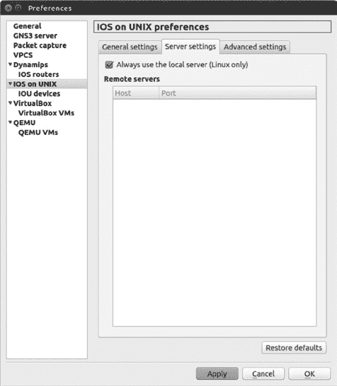

图 9-2. IOS on UNIX 偏好设置，服务器设置选项卡

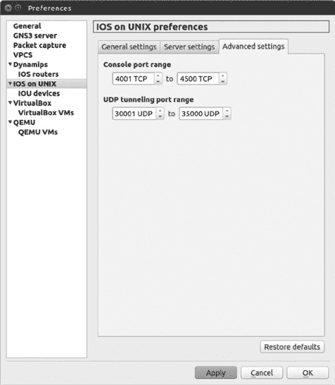

图 9-3. IOS on UNIX 偏好设置，高级设置选项卡

最后，在“偏好设置”窗口的左侧菜单中展开**IOS on UNIX**，以显示 IOU 设备部分，如图 9-4 所示。在这里，您可以将一个或多个 IOU 镜像文件添加到 GNS3 中。

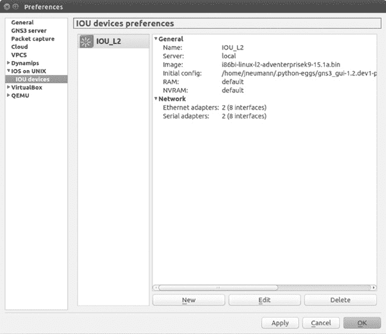

图 9-4. 将 IOU 镜像添加到 GNS3

要将 IOU 镜像文件添加到 GNS3，请点击**新建**按钮以启动新建 IOU 设备向导，如图 9-5 所示。

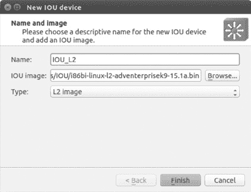

图 9-5. 新建 IOU 设备向导

为您的新设备输入名称（例如本示例中的*IOU_L2*）；然后点击**浏览**按钮定位并选择您的 IOU 镜像文件。完成后，点击**完成**以结束向导。添加后，您的 IOU 镜像文件应复制到 GNS3 用户目录下的*GNS3/images/IOU*文件夹中。

要配置 IOU 设备，请从设备工具栏将 IOU 设备图标拖到工作区中。右键单击设备并选择**配置**，打开节点配置器（如图 9-6 所示）。

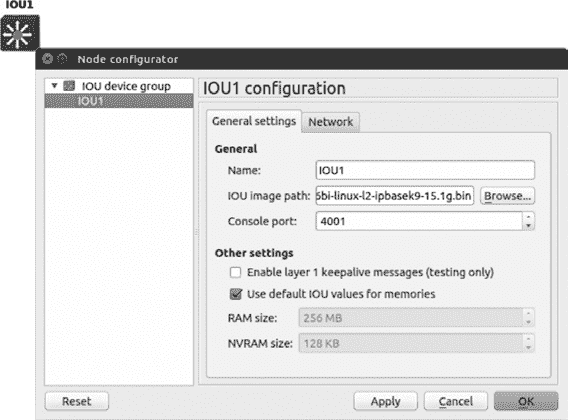

图 9-6. IOU 节点配置器

“常规设置”选项卡上的选项允许您重命名设备并更改 IOU 镜像文件、控制台端口号、默认 RAM 和 NVRAM 值。

您可以通过调整“网络”选项卡上的值来更改安装的以太网和串行适配器数量。默认情况下，每个适配器有两个，但它们提供四个接口，每个 IOU 设备总共提供八个以太网接口和八个串行接口，这对于大多数项目来说已经足够了。不过，您可以根据需要轻松调整数量。以太网和串行适配器的总数不能超过 16 个，每个 IOU 设备的接口总数为 64 个。

一个 IOU 设备可以与任何其他 GNS3 设备连接，就像您连接标准的 Dynamips 路由器或交换机一样。您甚至可以*热连接*它们到设备上，这意味着设备启动后，连接可以在设备之间形成。

要导出 IOU 配置，请从 IOU 控制台输入**`copy running-config unix:initial -config.cfg`**，然后右键单击工作区中的 IOU 设备并选择**导出配置**。接下来，系统会提示您输入文件名和保存位置，文件将保存到该位置。您也可以选择**导入配置**来导入配置。

如果您希望在 Windows 或 OS X 中运行 IOU，请阅读下一节。如果不是，您可以跳过并查看 NX-OSv。

# 在 Windows 和 OS X 上使用 GNS3 IOU 虚拟机

正如我在安装 IOU 前需要了解的事项中提到的，Windows 和 OS X 系统只能通过使用 Linux 虚拟机来运行 IOU。如果你还没有这样做，下载并安装 VirtualBox（*[`www.virtualbox.org/`](https://www.virtualbox.org/)*）。接受默认安装设置应该能提供运行 IOU 虚拟机所需的一切。

安装 VirtualBox 后，访问 GNS3 网站（*[`www.gns3.com/`](http://www.gns3.com/)*），下载名为 *GNS3 IOU VM.ova* 的 OVA 文件。这是一个已预配置好所有运行 IOU 所需工具的 Linux 虚拟机，但它不包含任何 IOU 镜像文件。相反，它提供了一个基于网页的工具，允许你轻松地将镜像文件上传到设备中，但在使用之前，你需要将该设备导入到 VirtualBox 中。

## 将 GNS3 IOU 虚拟机导入到 VirtualBox

首先启动 VirtualBox 应用程序。应用程序加载后，选择 **文件** ▸ **导入设备**。你应该会看到导入虚拟设备的对话框，如图 9-7 所示。

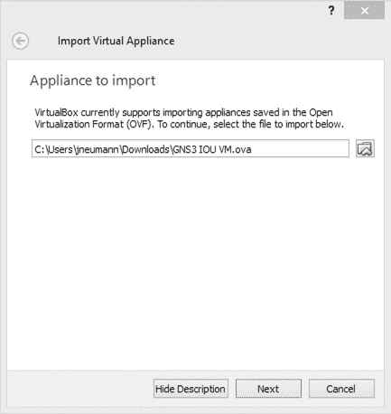

图 9-7. 选择虚拟设备

使用浏览图标找到并选择 *GNS3 IOU VM.ova* 文件。在图 9-7 中，我的虚拟机位于我的 *下载* 目录，路径为 *C:\Users\jneumann\Downloads*。选择文件后，点击 **下一步** 并验证设备设置。它们应与图 9-8 类似。

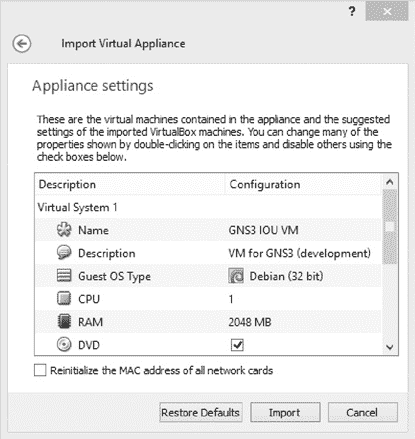

图 9-8. 虚拟设备设置

你应该可以接受建议的设备设置。注意，默认的内存设置为 2048MB。如果你只在项目中使用少数几个 IOU 设备，我发现可以将内存减少到 1024MB。这将减少你的 PC 使用的总内存，并且如果你的资源紧张，可能会帮助 GNS3 性能更好。如果不确定的话，就接受默认设置，点击 **导入** 完成导入。你随时可以稍后修改这些设置。

导入虚拟机后，点击 **设置**，然后点击 **网络** 进入网络面板，如图 9-9 所示。

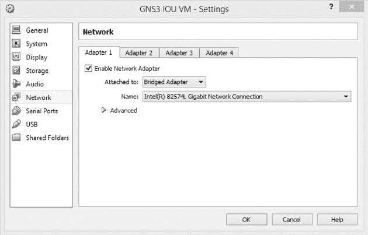

图 9-9. 将网络适配器桥接到你的 PC

在“Adapter 1”选项卡中，选择**启用网络适配器**选项。然后，在“附加到”字段旁边选择**桥接适配器**。完成后，点击**确定**。这将你的虚拟机以太网适配器桥接到你的 PC，并允许它访问互联网，以便在需要时安装额外的软件包。

## 上传 IOU 镜像文件

现在你已经导入了 GNS3 IOU 虚拟机，你应该能够启动虚拟机并上传你的 IOU 镜像文件。要启动虚拟机，选择**GNS3 IOU VM**，如图 9-10 所示，并点击**启动**。

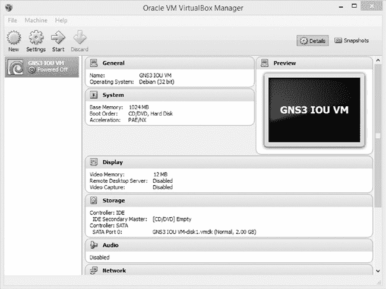

图 9-10. 选择并启动你的 GNS3 IOU 虚拟机。

虚拟机启动时，可能需要一两分钟，因为它正在启动一个完整功能的 Linux 操作系统。虚拟机启动并运行后，屏幕上应显示类似以下的控制台信息：

```
Welcome to GNS3 IOU appliance
Use 172.16.231.204 to configure a remote server in GNS3 Preferences
Use your browser with http://172.16.231.204:8000/upload to upload IOS images

gns3-iouvm login:
```

请注意，屏幕会提示你使用 PC 的网页浏览器将 IOU 镜像文件上传到设备。为了让此过程正常工作，你的 PC 和 GNS3 IOU 虚拟机必须分别从本地网络中获得 IP 地址。在此示例中，我的虚拟机的 IP 地址是 172.16.231.204。

### 注意

*有时 IOU 虚拟机可能不会显示 IP 地址。如果出现这种情况，请使用用户名* root *和密码* cisco *登录虚拟机。然后输入* `ifconfig eth0` *来显示虚拟机以太网接口的 IP 地址。*

要上传 IOU 镜像文件，打开网页浏览器并浏览到该 IP 地址，按照指示使用端口 8000。在输入 URL（在本例中是*[`172.16.231.204:8000/upload`](http://172.16.231.204:8000/upload)）后，您应看到一个类似于图 9-11 的网页。

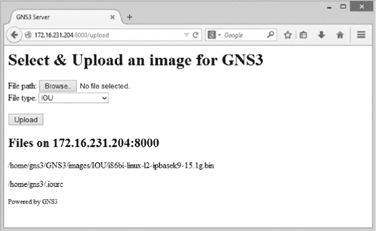

图 9-11. 选择并上传你的 IOU 镜像文件。

使用**浏览...**按钮从 PC 中选择一个 IOU 镜像文件。选择后，点击**上传**完成过程。对于每个你想与 GNS3 一起使用的镜像和 IOU 许可证文件，重复此步骤。镜像存储在 IOU 虚拟机的*/home/gns3/GNS3/images*目录下，并且路径会在网页上显示以供参考。在你配置 GNS3 中的 IOU 镜像时，你需要这些信息，因此现在最好复制并保存完整路径和文件名。这样，之后就不需要重新输入了。

## 配置 GNS3 以使用 IOU

现在 IOU 已经准备好，你只需要准备 GNS3。首先，在你的 PC 上创建一个纯文本许可证文件，使用主机名*gns3-iouvm*，如下所示的例子。将 1234567812345678 替换为你的许可证号码。

```
[license]
gns3-iouvm = 1234567812345678
```

IOU 许可证文件常用的名称是.*iourc*，但你可以使用任何对你有意义的名称（例如，你可以将其命名为*iou-license.txt*），并且许可证文件可以存储在系统中的任何位置。

创建好许可证文件后，你就可以配置 GNS3 的 IOU 偏好设置了。启动 GNS3，在 Windows 上选择**编辑** ▸ **偏好设置**，或在 OS X 上选择**GNS3** ▸ **偏好设置**，然后选择**GNS3 服务器**，如图 9-12 所示。


图 9-12。GNS3 服务器偏好设置，远程服务器标签

选择“远程服务器”标签。在“主机”➊下输入你的 GNS3 IOU 虚拟机的 IP 地址，点击**添加**，然后点击**应用**。在这个例子中，我的 GNS3 IOU 虚拟机的 IP 地址是 172.16.231.204。

接下来，告诉 GNS3 在哪里找到 IOU 许可证文件。从左侧窗格中点击**IOS 在 UNIX 上**，然后选择常规设置标签，如图 9-13 所示。

点击“浏览...”按钮，位于“IOURC 路径”字段的右侧，找到你的许可证文件。选择该文件，然后点击**添加**和**应用**。在这个例子中，我的许可证文件路径是*C:\Users\jneumann\GNS3\iourc_license.txt*。

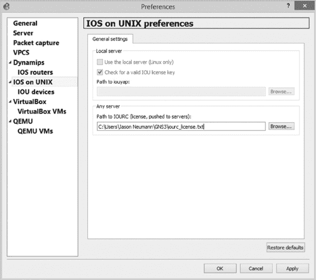

图 9-13。IOS 在 UNIX 上的偏好设置，常规设置标签

接下来，在左侧窗格中展开**IOS 在 UNIX 上**，以显示 IOU 设备，如图 9-14 所示。

最后的配置步骤是添加 IOU 镜像文件的路径。选择**IOS 设备**偏好设置，点击**新建**以启动向导。在“服务器类型”下，确保选中了**远程**，然后点击**下一步**。会弹出选择镜像文件路径的消息，点击**确定**，你应该会看到新的 IOU 设备窗口，如图 9-15 所示。

为你的 IOU 设备输入一个名称（例如*IOU_L2*），然后输入 IOU 镜像文件路径。由于 IOU 镜像文件安装在 Linux 虚拟机中，你需要输入镜像文件的“Linux 路径名”。该路径是*/home/gns3/GNS3/images/<image_name>*。在这个例子中，我输入的是*/home/gns3/GNS3/images/i86bi-linux-l2-adventerprisek9-15.1a.bin*。你可以在用来上传镜像文件的 IOU 网页上找到此信息（参考图 9-11）。务必正确输入路径和文件名，否则 IOU 将无法正常工作。我建议直接从 IOU 虚拟机网页复制并粘贴信息，以避免混淆。

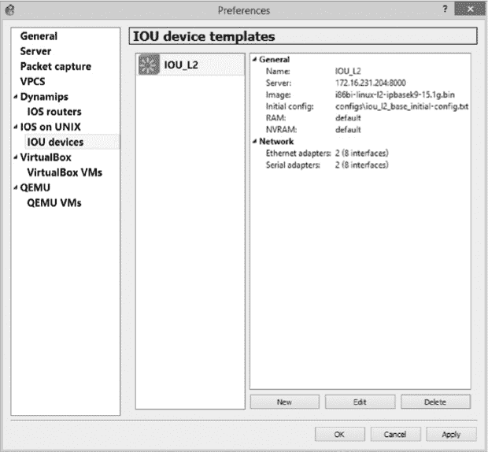

图 9-14. IOU 设备首选项

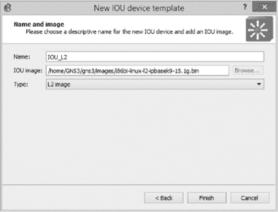

图 9-15. 新的 IOU 设备窗口

完成后，点击**完成**以关闭向导，然后点击**应用**和**确定**完成配置。一旦添加了 IOU 镜像，你就可以在项目中开始使用 IOU 设备了。

如果你将 GNS3 升级到新版本，你还需要将 GNS3 IOU 虚拟机上的服务器升级到相同的版本，否则它将无法正常工作。要升级服务器，请登录到 GNS3 IOU 虚拟机并输入以下命令，将*`version`*替换为你所使用的 GNS3 版本：

```
Login: **root**
Password: **cisco**
# **pip3 install gns3-server==*version***
```

## IOU 操作

现在让我们创建一个简单的项目，使 IOU 交换机能够在两个 VLAN 之间路由 TCP/IP 流量。首先创建如图 9-16 所示的项目。

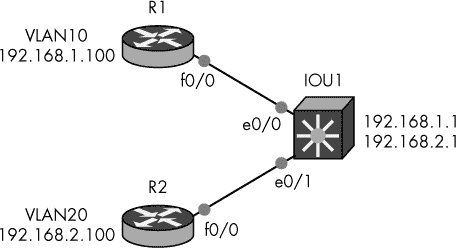

图 9-16. 使用 IOU 交换机进行 VLAN 路由

在这个项目中，你将配置一个具有两个 VLAN（VLAN 10 和 VLAN 20）的 IOU L2 交换机。然后，你将路由器 R1 分配给 VLAN 10，路由器 R2 分配给 VLAN 20。在这个实验中，IOU 交换机将路由数据包在这两个 VLAN 之间，以便 R1 和 R2 能够互相 ping 通。首先按以下步骤配置 IOU1 交换机：

```
  IOU1# **configure terminal**
➊ IOU1(config)# **ip routing**
➋ IOU1(config)# **vlan 10**
  IOU1(config-vlan)# **vlan 20**
➌ IOU1(config-vlan)# **interface vlan 10**
➍ IOU1(config-if)# **ip address 192.168.1.1 255.255.255.0**
➎ IOU1(config-if)# **no shutdown**
  IOU1(config-if)# **interface vlan 20**
  IOU1(config-if)# **ip address 192.168.2.1 255.255.255.0**
  IOU1(config-if)# **no shutdown**
➏ IOU1(config)# **interface Ethernet 0/0**
➐ IOU1(config-if)# **switchport mode access**
➑ IOU1(config-if)# **switchport access vlan 10**
  IOU1(config-if)# **no shutdown**
  IOU1(config-if)# **interface Ethernet 0/1**
  IOU1(config-if)# **switchport mode access**
  IOU1(config-if)# **switchport access vlan 20**
  IOU1(config-if)# **no shutdown**
```

启用 IP 路由 ➊，然后使用`vlan`命令 ➋创建两个 VLAN（10 和 20）。接下来，为每个 VLAN 创建一个交换虚拟接口（SVI） ➌并为每个 SVI 分配一个 IP 地址 ➍。使用`no shutdown`命令 ➎启用接口。现在，转到与 R1 和 R2 连接的物理接口 ➏，将它们设置为接入端口 ➐，并将它们分配到适当的 VLAN ➑。

接下来，为路由器 R1 配置一个 IP 地址。

```
R1(config)# **interface f0/0**
R1(config-if)# **ip address 192.168.1.100 255.255.255.0**
R1(config-if)# **no shutdown**
R1(config-if)# **ip route 0.0.0.0 0.0.0.0 192.168.1.1**
```

在为 R1 的 F0/0 接口分配 IP 地址后，将默认网关地址设置为 192.168.1.1，这样路由器就会使用 IOU1 作为其网关。最后，按照类似的方式配置 R2。

```
R2(config)# **interface f0/0**
R2(config-if)# **ip address 192.168.2.100 255.255.255.0**
R2(config-if)# **no shutdown**
R2(config-if)# **ip route 0.0.0.0 0.0.0.0 192.168.2.1**
```

配置项目后，你可以使用`ping`命令测试 VLAN 路由。路由器 R1 应该能够通过 IOU1 交换机 ping 通路由器 R2，如下所示：

```
R1# **ping 192.168.2.100**

Type escape sequence to abort.
Sending 5, 100-byte ICMP Echos to 192.168.1.100, timeout is 2 seconds:
!!!!!
Success rate is 100 percent (5/5), round-trip min/avg/max = 16/24/32 ms
```

以上就是让 IOU 设备与 GNS3 一起运行的全部步骤。现在，让我们来看看 Cisco 的最新操作系统，NX-OS。

# NX-OSv

Cisco NX-OS 运行在一种称为 Nexus 的数据中心级交换机上。尽管与 IOS 相似，NX-OS 并非 IOS，且使用不同的配置命令集。NX-OSv，有时也称为 Titanium，是一个 Linux 虚拟机，运行 NX-OS 模拟器，使用虚拟化软件，如 VirtualBox。NX-OSv 并不是一个完整的操作系统模拟，它缺少很多功能。它仅提供足够的功能和命令，让你感受 NX-OS 的工作方式，并且可以与 GNS3 设备联网。在获取 NX-OSv 镜像后，建议做一个备份，并保存在安全的地方，以防你的工作副本被损坏。

在你的 GNS3 目录下创建一个 NX-OSv 的目录，并将 NX-OSv 镜像文件复制到该目录中。你应该会有一个名为*N7K.vmdk*的文件。根据你使用的 NX-OSv 版本，文件名可能会有所不同。将镜像文件放置好后，接下来就可以在 VirtualBox 中配置 NX-OSv 了。

## 将 NX-OSv 导入 VirtualBox

NX-OSv 通常以一个虚拟机硬盘文件（.*vmdk*文件）的形式准备好运行，你可以使用 VMware、VirtualBox 或 QEMU 来运行它。VirtualBox 是免费的，并且即使在旧款处理器（如 Core 2 Duo）上也能可靠地运行 NX-OSv，所以我在这里将重点介绍 VirtualBox。配置过程包括将硬盘镜像文件导入到一个自定义的 Linux 虚拟机中，并调整几个设置。如果你的 PC 上还没有安装 VirtualBox，请立即下载并安装。

启动 VirtualBox，点击**New**创建一个新的虚拟机。你应该会看到创建虚拟机向导，如图 9-17 所示。

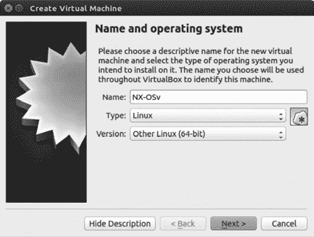

图 9-17. 创建虚拟机向导，名称和操作系统窗口

为设备输入名称，将类型设置为**Linux**，版本设置为**Other Linux (64-bit)**，然后点击**Next**继续。接下来你应该看到内存大小窗口，如图 9-18 所示。

调整内存大小时，可以使用滑块或在提供的字段中输入数值。NX-OSv 在 2048MB 内存下运行最佳。完成后，点击**Next**配置硬盘设置，如图 9-19 所示。

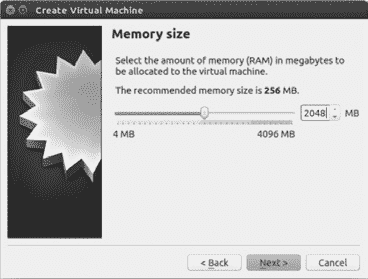

图 9-18. 创建虚拟机向导，内存大小窗口

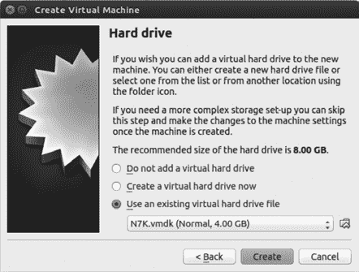

图 9-19. 创建虚拟机向导，硬盘窗口

要将 NX-OS 虚拟硬盘附加到虚拟机，请选择**使用现有虚拟硬盘文件**，点击浏览图标以定位你的 NX-OSv .*vmdk* 文件。选择该文件并点击**创建**以完成虚拟机的创建。

## 配置 GNS3 以支持 NX-OSv

启动 GNS3 并将 NX-OSv 虚拟机添加到虚拟机库中。选择**编辑** ▸ **首选项**，展开**VirtualBox**以显示 VirtualBox 虚拟机，如图 9-20 所示。在这里，你可以将 VirtualBox 虚拟机添加到 GNS3，这是使用 NX-OSv 之前的最后一步。

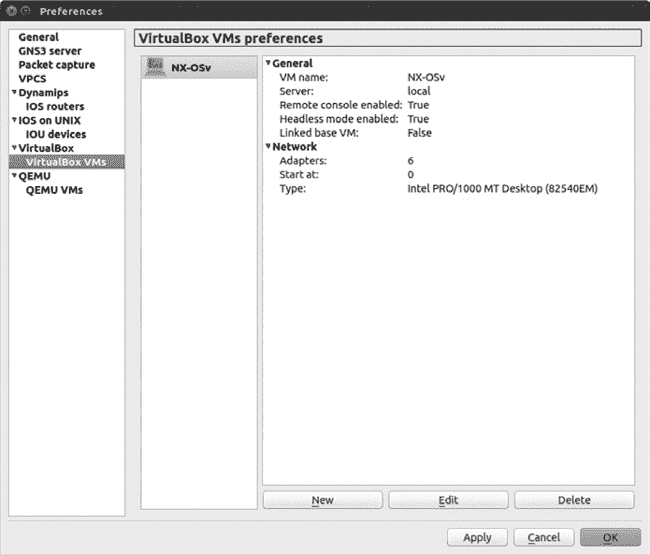

图 9-20. 将 NX-OSv VirtualBox 虚拟机添加到 GNS3

点击**新建**以启动 VirtualBox 向导，从虚拟机名称下拉菜单中选择你的 NX-OSv 虚拟机，然后点击**完成**。现在点击**编辑**并进入常规设置标签页。勾选**启用远程控制台**和**在无头模式下启动虚拟机**框，并点击**应用**。在网络标签页下，将接口数量从 1 更改为 6，然后点击**应用**以关闭窗口。接着点击**应用**和**确定**以完成安装。要在项目中使用 NX-OSv 虚拟机，将你的 NX-OSv 虚拟机从终端设备工具栏拖到工作区。

## NX-OSv 实战

现在你已经将 NX-OSv 设备添加到 GNS3，让我们在一个项目中使用它。创建一个包含一个 NX-OSv 设备和一个 IOS 路由器的拓扑，如图 9-21 所示。该项目将使用 Cisco EIGRP 从 R1 向 NX-OSv 广播所有 172.16.0.0 网络。

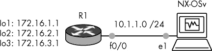

图 9-21. 使用 NX-OSv 的简单拓扑

在你创建了项目后，启动所有设备并打开到 NX-OSv 的控制台连接。运行在 PC 上的 NX-OS 启动时间较长，且在显示 `SCSI disk detected` 消息时，通常会暂停约一分钟，如图 9-22 所示。这是正常现象，因此请耐心等待其启动。

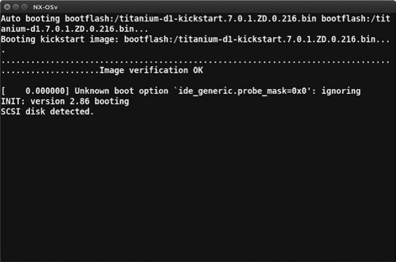

图 9-22. 启动 NX-OSv

如果你没有看到启动信息，可能是配置有误。请返回并检查 VirtualBox 和 GNS3 中的所有设置。如果问题仍然存在，可能是你的*N7K.vmdk*镜像文件出了问题。

系统启动后，你应该会看到一个登录提示，像下面这样：

```
User Access verification
vNX-OS-01 login:
```

默认的登录名和密码应该是 `admin` 和 `admin`。使用这些凭据登录到 NX-OSv。此时可以输入一些命令。我会从 `show run`、`show version` 和 `show interface brief` 开始，但你也可以尝试任何你熟悉的 IOS 命令。某些命令在 NX-OS 上是相同的，其他则不同。你可以使用问号 (`?`) 来显示完整的命令列表。

现在你已经了解了 NX-OSv 的一些基本内容，你可以开始配置你的项目了。首先，你需要配置路由器 R1。打开路由器 R1 的控制台，输入以下命令以配置项目所需的所有 IP 地址：

```
R1# **configure terminal**
R1(config)# **interface f0/0**
R1(config-if)# **no shutdown**
R1(config-if)# **ip address 10.1.1.1 255.255.255.0**
R1(config-if)# **interface loopback1**
R1(config-if)# **ip address 172.16.1.1 255.255.255.0**
R1(config-if)# **interface loopback2**
R1(config-if)# **ip address 172.16.2.1 255.255.255.0**
R1(config-if)# **interface loopback3**
R1(config-if)# **ip address 172.16.3.1 255.255.255.0**
```

接下来，启用 EIGRP 并广播所有的 IP 网络。

```
R1(config-if)# **router eigrp 10**
R1(config-router)# **no auto-summary**
R1(config-router)# **network 10.0.0.0**
R1(config-router)# **network 172.16.0.0**
```

现在登录到 NX-OSv，并配置一个与 R1 接口 f0/0 在同一子网的 IP 地址。

```
vNX-OS-01# **configure terminal**
vNX-OS-01(config)# **interface ethernet 2/1**
vNX-OS-01(config-if)# **ip address 10.1.1.2/24**
vNX-OS-01(config-if)# **no shutdown**
```

你首先应该注意到的是，NX-OS 只接受使用 CIDR 表示法的 IP 地址，因此在这里，子网掩码输入的是 `/24` 而不是常见的 `255.255.255.0`。现在使用 `ping` 命令测试从 NX-OSv 到路由器 R1 的连通性，并退出到配置模式。

```
vNX-OS-01(config-if)# **do ping 10.1.1.1**
PING 192.168.1.1 (110.1.1.1): 56 data bytes
64 bytes from 10.1.1.1: icmp_seq=0 ttl=254 time=19.494 ms
64 bytes from 10.1.1.1: icmp_seq=1 ttl=254 time=7.849 ms
64 bytes from 10.1.1.1: icmp_seq=2 ttl=254 time=7.511 ms
64 bytes from 10.1.1.1: icmp_seq=3 ttl=254 time=20.637 ms
64 bytes from 10.1.1.1: icmp_seq=4 ttl=254 time=8.524 ms

--- 10.1.1.1 ping statistics ---
5 packets transmitted, 5 packets received, 0.00% packet loss
round-trip min/avg/max = 7.511/12.803/20.637 ms
vNX-OS-01(config-if)# **exit**
```

现在让我们配置 NX-OSv，使其能够与路由器 R1 交换 EIGRP 广播的路由。请注意，除非你有功能许可证，否则 NX-OS 只允许运行 EIGRP，且仅有 120 天的宽限期。输入 `license grace-period` 命令以开始宽限期。

```
vNX-OS-01(config)# **license grace-period**
vNX-OS-01(config)# **feature eigrp**
vNX-OS-01(config)# **router eigrp 10**
vNX-OS-01(config)# **network 10.0.0.0/8**
vNX-OS-01(config)# **exit**
```

你可以使用 `show ip route` 命令验证 R1 的路由是否被广播到 NX-OSv。

```
vNX-OS-01# **show ip route**
IP Route Table for VRF "default"
'*' denotes best ucast next-hop
'**' denotes best mcast next-hop
'[x/y]' denotes [preference/metric]
'%<string>' in via output denotes VRF <string>

10.1.1.0/24, ubest/mbest: 1/0, attached
    *via 10.1.1.2, Eth2/1, [0/0], 00:49:54, direct
10.1.1.2/32, ubest/mbest: 1/0, attached
    *via 10.1.1.2, Eth2/1, [0/0], 00:49:54, local
172.16.1.0/24, ubest/mbest: 1/0
    *via 10.1.1.1, Eth2/1, [90/130816], 00:32:04, eigrp-10, internal
172.16.2.0/24, ubest/mbest: 1/0
    *via 10.1.1.1, Eth2/1, [90/130816], 00:32:04, eigrp-10, internal
172.16.3.0/24, ubest/mbest: 1/0
    *via 10.1.1.1, Eth2/1, [90/130816], 00:32:04, eigrp-10, internal
```

在前面的行中，注意到此命令的输出与 IOS 不同，但所有相关信息都在。举例来说，所有 172.16.0.0 的路由已经通过 EIGRP 从 R1 广播到 NX-OSv，因此你应该能够 ping 通这些地址。现在试试看。

```
NX-OSv-01# **ping 172.16.2.1**
PING 172.16.2.1 (172.16.2.1): 56 data bytes
64 bytes from 172.16.2.1: icmp_seq=0 ttl=254 time=20 ms
64 bytes from 172.16.2.1: icmp_seq=1 ttl=254 time=10 ms
64 bytes from 172.16.2.1: icmp_seq=2 ttl=254 time=20 ms
64 bytes from 172.16.2.1: icmp_seq=3 ttl=254 time=10 ms
64 bytes from 172.16.2.1: icmp_seq=4 ttl=254 time=20 ms

--- 172.16.2.1 ping statistics ---
5 packets transmitted, 5 packets received, 0.00% packet loss
round-trip min/avg/max = 10/16/20 ms
```

最后，保存你的配置。该命令与 IOS 中的命令相同，但它提供不同的输出。

```
vNX-OS-01# **copy running-config startup-config**
[########################################] 100%
Copy complete.
vNX-OS-01#
```

现在你已经创建了一个简单的项目，可以开始自行实验 NX-OSv。记住，一些功能肯定会缺失。例如，在我的版本中，L2 交换机功能完全不可用，只有 L3 路由功能可用。另一个需要注意的是 Tab 补全功能；它只在某些命令上有效，所以不要因为 NX-OSv 在命令行中没有提供 Tab 补全就认为某个命令不工作。

尽管存在这些限制，我仍然觉得将 NX-OS 设备添加到我的项目中很有趣，我相信你也会。要了解更多关于 Cisco Nexus 和 NX-OS 的信息，请访问 *[`www.cisco.com/en/US/products/ps9402/index.html`](http://www.cisco.com/en/US/products/ps9402/index.html)*。

# 最后的思考

在本章中，你探索了 Unix 上的 IOS，并学习了如何利用 IOU 向 GNS3 添加几乎完整的交换功能，而无需使用物理交换机。虽然 CCNA 认证不要求使用 IOU 交换功能，但对于 CCNP 和 CCIE 认证来说，IOU 交换非常有用。

接下来，你安装了 NX-OSv，这是一个模拟运行 NX-OS 的 Cisco Nexus 交换机的虚拟机。NX-OSv 可以通过 OSPF 和 EIGRP 等协议与 GNS3 设备进行联网，虽然玩起来很有趣，但它缺乏你在真实 Nexus 交换机上会发现的许多功能。

在下一章中，我将向你展示一些使用 GNS3 可以做的有趣事情，比如创建一个模拟访问服务器来管理你的路由器。
