# 第十章：雨天可以做的有趣事情

现在你已经了解了 GNS3 最常用的功能，接下来我们将探索一些你可以在 GNS3 项目中进行的有趣操作。首先，你将创建一个模拟的思科接入服务器，它像真实的思科设备一样运行。

接下来，我将向你展示如何将 GNS3 项目从一个操作系统迁移到另一个操作系统，以及如何将你的 GNS3 虚拟路由器配置从 GNS3 复制到真实的思科路由器。最后，你将学习如何利用多台 PC 共享项目的资源负载，创建一些技术性实验室，并模拟一些真实的网络场景。

# 从接入服务器管理设备

一个*接入服务器*允许你通过一个中央控制台管理所有网络设备，这样你就可以同时登录到多个设备控制台，并轻松地在它们之间切换。这是管理大型思科网络设备的高效方法，只需稍加努力，你就可以创建一个完全功能的虚拟思科接入服务器（有时称为*终端*或*通信服务器*）来管理你的 GNS3 设备。我发现使用虚拟接入服务器是管理和配置 GNS3 设备的快速方法，同时你也可以通过它学习真实接入服务器的命令和按键操作。

一个 GNS3 虚拟接入服务器由两个组件组成。第一个是配置了虚拟接口的 Cloud 节点；在 Windows 中，你将使用回环适配器驱动程序，在 Linux 中，你将使用 TAP 适配器。第二个是作为管理控制台的思科 Dynamips 路由器。虚拟接入服务器的配置根据你的操作系统略有不同。我将介绍 Windows 和 Ubuntu Linux，但这些概念同样适用于其他 Linux 操作系统。不幸的是，在撰写时，OS X 尚不支持。

## 安装虚拟接口

无论你使用 Windows 还是 Linux，你都需要安装一个虚拟网络适配器并为其分配一个 IP 地址。在 Windows 上，你需要安装一个回环适配器驱动程序，而在类似 Linux 的 Unix 系统上，你需要安装一个 TAP 驱动程序。如果你是 Linux 用户，可以跳到在 Linux 中配置 TAP 适配器。

### 在 Windows 中配置回环适配器

如果你还没有安装，请安装 Microsoft 回环适配器驱动程序。（参见在 Windows 上使用回环适配器。）安装完适配器后，为其分配一个 IP 地址。你选择的 IP 地址和子网掩码必须与 PC 上已配置的任何网络适配器的地址不同，并且与计划在 GNS3 网络拓扑中使用的任何 IP 地址不同。

要配置适配器，打开 Windows **控制面板**，然后选择 **网络和共享中心**。接下来，选择 **更改适配器设置**，以显示可用适配器列表，如图 10-1 所示。

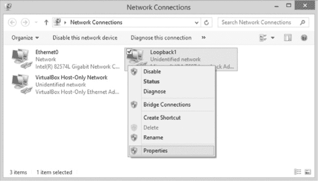

图 10-1. 选择属性以配置 Microsoft 回环适配器驱动程序

右键单击 Microsoft 回环适配器驱动程序，选择 **属性**。在属性窗口中，选择 *Internet Protocol Version 4 (TCP/IPv4)*，然后点击 **属性** 按钮，显示 IP 地址设置，如图 10-2 所示。

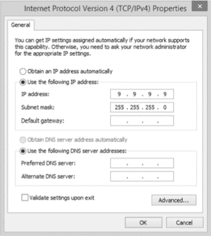

图 10-2. 配置带有 IP 地址的回环适配器驱动程序

选择 **使用以下 IP 地址**，并输入一个唯一的 IP 地址和子网掩码。我选择了 9.9.9.9 和 255.255.255.0，但任何地址和掩码都可以，只要它们与电脑中任何以太网适配器分配的地址以及你计划在 GNS3 网络拓扑中使用的任何地址不同。无需包括默认网关地址或提供任何 DNS 服务器，因为访问服务器不会使用它们。完成后，点击 **确定** 完成配置。现在关闭所有打开的窗口并启动 GNS3。如果你是 Linux 用户，请继续阅读；否则，你可以跳转到 准备 GNS3 服务器。

### 在 Linux 中配置 TAP 适配器

在 Ubuntu Linux 上，你将使用虚拟 TAP 适配器作为访问服务器。打开终端，输入以下命令安装驱动程序：

```
$ **sudo apt-get install uml-utilities**
```

要启用 tap0，请输入以下命令，将 *`jneumann`* 替换为你的 Linux 用户名：

```
$ **sudo tunctl -u *jneumann* -t tap0**
```

接下来，给 tap0 接口分配一个唯一的 IP 地址。你选择的 IP 地址和子网掩码必须与 PC 上配置的任何网络适配器以及你计划在 GNS3 网络拓扑中使用的任何 IP 地址不同。

```
$ **sudo ifconfig tap0 9.9.9.9 netmask 255.255.255.0 up**
```

为确保 tap0 接口在重启后保持其 IP 地址并可用，你需要更改 Linux 网络设置。

在文本编辑器（如 pico 或 vi）中打开 */etc/networks/* 下的 *interfaces* 文件。你需要管理员权限才能更改该文件，因此请以 *root* 身份登录，或使用 `sudo` 命令运行编辑器，如 `sudo pico interfaces`。然后，将以下内容附加到文件末尾：

```
**auto tap0**
**iface tap0 inet static**
        **pre-up tunctl -t tap0**
        **up ifconfig tap0 up**
        **down ifconfig tap0 down**
        **address 9.9.9.9**
        **netmask 255.255.255.0**
```

在这些命令到位后，保存 *interfaces* 文件，关闭并重启。当 Ubuntu 重启时，TAP 驱动程序应该会自动加载，接口 tap0 应该可以使用。

### 警告

*编辑* /etc/networks/interfaces *文件时请小心。输入错误的内容可能导致 Ubuntu 无法正常启动。*

输入 `ifconfig` 命令以验证 tap0 设置：

```
  $ ifconfig
  --*snip*--
➊ tap0    Link encap:Ethernet HWaddr 16:81:25:c1:cc:8c
➋         inet addr:9.9.9.9 Bcast:9.9.9.9.255 Mask:255.255.255.0
           UP BROADCAST MULTICAST MTU:1500 Metric:1
           RX packets:0 errors:0 dropped:0 overruns:0 frame:0
           TX packets:0 errors:0 dropped:0 overruns:0 carrier:0
           collisions:0 txqueuelen:500
           RX bytes:0 (0.0 B) TX bytes:0 (0.0 B)
```

`ifconfig` 的输出应该显示 tap0 适配器已启用 ➊ 并配置了 IP 地址 ➋。安装并配置虚拟适配器后，你需要设置 GNS3 服务器。

## 准备 GNS3 服务器

在 Windows 上以管理员身份运行 GNS3。首先将 GNS3 服务器绑定到虚拟接口的 IP 地址，否则访问服务器将无法正常工作。点击 **编辑** ▸ **首选项**，然后从左侧栏目中选择 **GNS3 服务器**。选择 **主机绑定** 下拉菜单，然后选择分配给虚拟接口的 IP 地址，如 图 10-3 所示。

在 图 10-3 中，IP 地址为 9.9.9.9 ➊。点击 **应用** 和 **确定**，GNS3 服务器应该会以新的主机绑定重新启动。

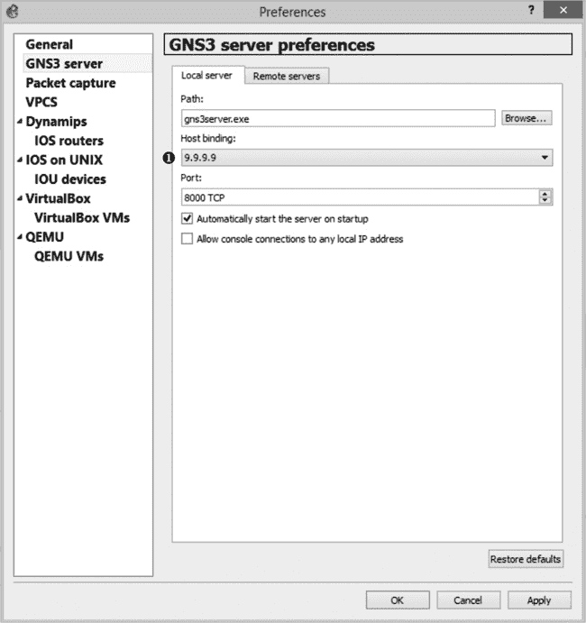

图 10-3. 修改 GNS3 服务器主机绑定

## 在 GNS3 中创建虚拟访问服务器

在 GNS3 服务器绑定到虚拟适配器的 IP 地址后，你可以创建虚拟访问服务器。访问服务器是通过两个设备创建的：一个 Cloud 节点和一个 Dynamips IOS 路由器。

### 配置 Cloud 节点

通过向工作区添加 Cloud 节点开始一个项目。右键点击 Cloud 节点并选择 **配置**。如果你在 Windows 上运行，选择 **NIO Ethernet** 标签页（如 图 10-4 中所示）。

点击“通用以太网 NIO”下拉菜单，选择你的 Microsoft 环回适配器驱动程序（本示例中为 **Loopback1**）；然后点击 **添加，应用** 和 **确定** 完成配置。

如果你在 Ubuntu Linux 上运行 GNS3，请使用 tap0 配置 Cloud 节点。选择 **NIO TAP** 标签页，而不是 NIO Ethernet，然后在 TAP 接口字段中输入 **tap0**，如 图 10-5 所示。

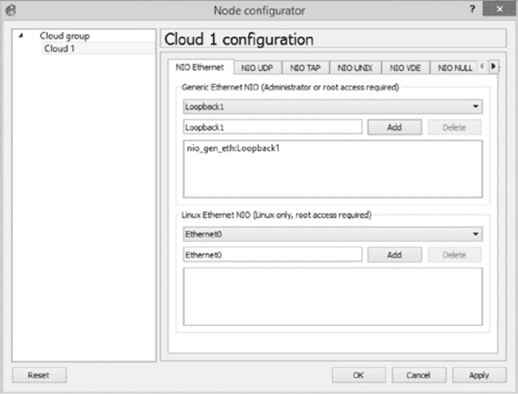

图 10-4. 在 Windows 中配置带有环回适配器驱动程序的 Cloud 节点

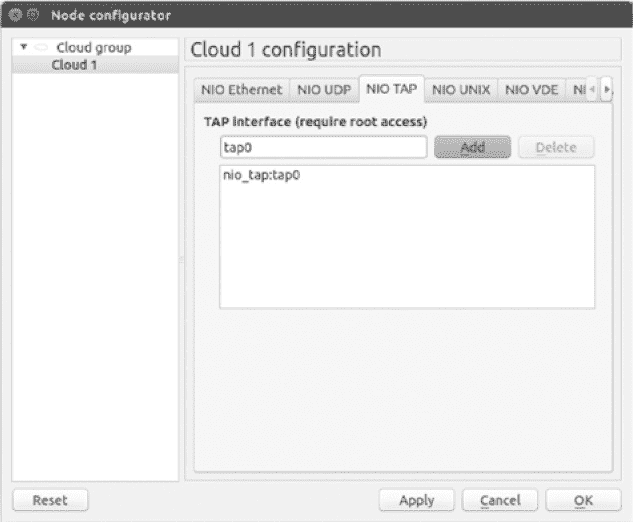

图 10-5. 在 Ubuntu Linux 上配置 NIO TAP 和 tap0

配置完成后，点击 **添加，应用**，然后点击 **确定** 完成云节点的配置。

### 配置接入服务器路由器

配置云节点后，向工作空间添加一个 Dynamips 路由器，并从该路由器创建一条到云节点的连接。这两台设备共同组成虚拟接入服务器，如图 10-6 所示。它们不会与 GNS3 项目中的其他设备相连接。

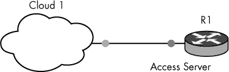

图 10-6. 虚拟接入服务器

在将虚拟接入服务器组件连接在一起后，向工作空间添加更多路由器，以创建一个简单的三路由器网络，如图 10-7 所示。这就是将通过虚拟接入服务器进行管理的网络拓扑。

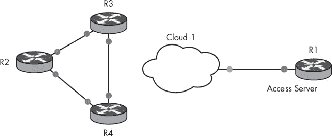

图 10-7. 配置了虚拟 Cisco 接入服务器的网络

图 10-7 显示，你已经使用路由器 R1 和云节点（Cloud 1）创建了一个虚拟接入服务器，并且创建了由三个路由器组成的网络拓扑，这些路由器分别命名为 R2、R3 和 R4。

现在，你已经创建了接入服务器和 GNS3 网络拓扑，你可以配置接入服务器路由器。为路由器 R1 分配一个与 PC 虚拟适配器同一网络的 IP 地址，并测试从 R1 到虚拟适配器接口的连通性。例如，如果你为虚拟适配器分配了 IP 地址 9.9.9.9 255.255.255.0，像我一样，你可以为接入服务器路由器 R1 分配该网络范围内的任何 IP 地址。我使用的是 IP 地址 9.9.9.8 和子网掩码 255.255.255.0。

要配置 f0/0 接口的地址，请打开与路由器 R1 的控制台连接，并输入以下命令：

```
R1>**enable**
R1#**configure terminal**
R1(config)#**interface f0/0**
R1(config-if)#**ip address 9.9.9.8 255.255.255.0**
R1(config-if)#**no shutdown**
R1(config-if)#**exit**
R1(config)#**exit**
R1#**ping 9.9.9.9**
Type escape sequence to abort.
Sending 5, 100-byte ICMP Echos to 9.9.9.9, timeout is 2 seconds:
!!!!!
Success rate is 100 percent (5/5), round-trip min/avg/max = 1/1/4 ms
```

在此配置中，路由器 R1 的 f0/0 接口与云节点连接，并配置为 IP 地址 9.9.9.8 255.255.255.0。使用 `ping` 命令测试 R1 与虚拟接口之间的连接。如果 ping 测试成功，则可以继续操作。如果 ping 测试不成功，请验证所有接口是否启用，并且虚拟接口（回环接口或 TAP）是否配置了正确的 IP 地址和子网掩码。

## 配置 Cisco IP 主机名表

在虚拟接入服务器（R1）上配置 IP 地址后，您就可以开始配置 IP 主机名表格，使用从接入服务器将要管理的设备收集的信息。在本项目中，设备是路由器 R2、R3 和 R4。使用 Cisco IOS 命令，您将使用虚拟接口的 IP 地址（9.9.9.9）和 GNS3 分配给您网络拓扑中路由器的控制台端口号来创建 IP 主机名表格。Cisco 的 IP 主机名表格与 Unix 的 hosts 文件类似，不同的是，您还需要在表格中包含端口号。您将为每个您想要管理的拓扑设备创建一个条目。

首先，找出接入服务器将要管理的路由器的控制台端口号。在本项目中，您只关心路由器 R2、R3 和 R4 的控制台端口号。您可以通过将鼠标悬停在设备上，快速找到任何设备的控制台端口号，如图 10-8 所示。

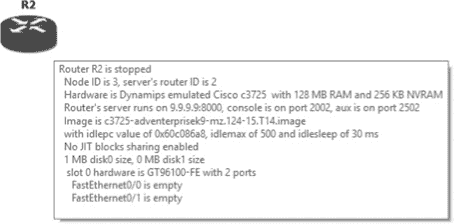

图 10-8. 显示设备信息

路由器 R2 的控制台在端口 2002。由于控制台端口号会随着设备的添加按顺序分配，因此路由器 R2、R3 和 R4 应该分别被分配到 2002、2003 和 2004 端口。如果不确定，可以将鼠标悬停在每个设备图标上验证信息。

### 注意

*如果同时添加多个路由器，而不是逐个添加，控制台端口号可能不会按顺序分配。*

要创建 IP 主机名表格，请打开路由器 R1（接入服务器）的控制台并输入以下命令：

```
R1#**configure terminal**
R1(config)#**ip host R2 2002 9.9.9.9**
R1(config)#**ip host R3 2003 9.9.9.9**
R1(config)#**ip host R4 2004 9.9.9.9**
R1(config)#**exit**
R1#
```

请注意，主机端口号与您想要管理的三台路由器的唯一控制台端口号相对应，但 IP 地址始终是相同的；它是分配给虚拟适配器的 IP 地址（9.9.9.9）。这是因为当虚拟接入服务器打开到其中一台实验室路由器的控制台时，GNS3 使用虚拟适配器的 IP 地址通过 telnet 会话从接入服务器连接到路由器。然后，它连接到您分配的单独控制台端口号。例如，当接入服务器打开到路由器 R2 的控制台连接时，GNS3 通过端口号 2002 使用 IP 地址 9.9.9.9 进行 telnet 连接。这与实际的 Cisco 接入服务器工作原理相似。

现在，使用`show hosts`命令验证在您的虚拟接入服务器上配置了哪些主机。

```
R1>**show hosts**
Default domain is not set
Name/address lookup uses static mappings

Codes: UN - unknown, EX - expired, OK - OK, ?? - revalidate
       temp - temporary, perm - permanent
       NA - Not Applicable None - Not defined

Host➊                      Port➋ Flags      Age Type  Address(es)➌
R2                         2002  (perm, OK)  0   IP    9.9.9.9
R3                         2003  (perm, OK)  0   IP    9.9.9.9
R4                         2004  (perm, OK)  1   IP    9.9.9.9
```

此命令显示接入服务器上为每个主机配置的主机名➊、端口号➋和 IP 地址➌。

虚拟接入服务器的限制

虚拟接入服务器可以管理的设备是有限制的。由于 GNS3 服务器绑定到虚拟适配器，并在您的 PC 上“本地”运行，因此虚拟接入服务器只能管理本地设备。

在 Windows PC 上，你不能管理 VirtualBox 虚拟机，包括 IOU，但可以管理 QEMU 设备，如 Junos。在 Ubuntu Linux 上，你可以管理所有设备，包括 Dynamips、IOU、QEMU 和 VirtualBox，只要它们在你的 Linux PC 上本地运行。

若要了解更多关于配置和使用真实 Cisco 访问服务器的信息，请访问 Cisco 官网（*[`www.cisco.com/`](http://www.cisco.com/)）并搜索*配置通讯服务器*。目前，你应该已经知道了尝试虚拟访问服务器所需的一切。

## 看到虚拟访问服务器的实际操作

在你完全配置好访问服务器并启动了项目中的路由器后，你应该能够使用访问服务器管理这些路由器。你可以打开多个路由器的控制台连接，并轻松切换它们。

### 打开控制台

首先，打开与 R1 的控制台连接。右键点击路由器 R1 并选择**控制台**。接着，输入你想管理的主机名并按

```
R1>**R2**
Translating "R2"
Trying R2 (9.9.9.9➊, 2002➋)... Open
Connected to Dynamips VM "R2" (ID 1, type c3600) - Console port
Press ENTER to get the prompt.

R2>➌
```

在这个示例中，我通过在访问服务器命令行输入**`R2`**来打开与路由器 R2 的会话。输出显示，通过 IP 地址 9.9.9.9 ➊和端口号 2002 ➋建立了会话，并且提示符➌已经更改为正在管理的路由器（在这个示例中是 R2）。会话打开后，你可以像从 GNS3 直接打开控制台一样配置路由器。

配置完路由器后，返回访问服务器控制台；只需按 SHIFT-CTRL-6，然后按**X**键。（Cisco 将这种操作组合称为*逃逸序列*。）返回到访问服务器控制台后，输入项目中另一个路由器的名称以打开其控制台。现在尝试输入**`R3`**，并按照你需要的方式配置路由器。当你完成后，再次使用逃逸序列返回到访问服务器。

即使你当前已登录到访问服务器控制台，另外两个路由器的会话仍然保持打开状态。要显示已打开会话及其对应的连接编号，请输入`show sessions`命令。

```
R1>**show sessions**
Conn Host                     Address          Byte  Idle  Conn Name
     1 R2                      9.9.9.9           0     0    R2
 ➊*  2 R3                     9.9.9.9           0     0    R3
```

你应该能看到两个活动连接（1 和 2）。连接 2 旁边的星号➊表示路由器 R3 是最后一个使用的会话。要返回到上一个会话，按 ENTER 键。要返回到其他会话，输入连接编号并按 ENTER 键；例如，你可以输入`1`返回到路由器 R2。

### 关闭控制台

当你准备断开一个开放连接时，输入`disconnect`命令后跟连接编号；然后按 ENTER 确认关闭会话。

```
R1>**disconnect 2**
Closing connection to R3 [confirm]
R1>
```

在这个示例中，我已经断开了与路由器 R3（连接 2）的会话。断开会话后，你需要再次输入主机名才能重新连接到设备。

### 设置连接超时

您可能希望调整路由器和访问服务器上的超时设置（通过控制台`exec-timeout`参数），以确保在空闲时（例如您不再配置路由器时）不会自动注销。默认值为十分钟，但可以设置为更高、更低，或设置为无限。

以下命令将控制台超时设置为零分钟零秒（无限）：

```
R1>**enable**
R1#**configure terminal**
R1(config)#**line console 0**
R1(config-line)#**exec-timeout 0 0**
```

GNS3 的默认*startup-config*文件应该已经为您完成了这个操作，但需要注意，从安全角度看，在生产环境中，永不让路由器超时是一个不好的做法。然而，在 GNS3 等实验环境中，这样做非常方便。

# 将配置部署到真实硬件

GNS3 的一个好处是，它允许您创建和测试网络配置，这些配置可以稍后用于真实的设备。您只需在 GNS3 中导出路由器配置并将其加载到真实的 Cisco IOS 路由器上。

## 将 GNS3 配置导出到 Cisco 路由器

在 GNS3 中彻底测试路由器配置后，您可以准备将其导出并加载到真实的 Cisco 路由器上。您可以导出项目中所有路由器的配置，或者只导出单个设备的配置。在导出 GNS3 IOS 路由器配置之前，请登录到该路由器并将其*running-config*文件保存到*startup-config*文件中。保存的*startup-config*将是 GNS3 导出的配置。

```
R1#**copy running-config startup-config**
```

如果您的项目中有任何 IOU 设备，您还需要复制它们的*running-config*文件。只需登录到设备并输入以下命令以创建 IOU 配置的文本文件：

```
IOU#**copy running-config unix:initial-config.cfg**
```

在保存了*running-config*文件后，您可以通过选择**文件** ▸ **导入/导出设备配置**同时导出所有设备的配置。GNS3 随后会显示图 10-9 中的对话框。

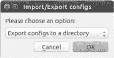

图 10-9. 配置文件的导入/导出工具

从下拉菜单中选择**导出配置到目录**，点击**确定**，浏览到您想要保存配置文件的位置，点击**打开**以保存配置文件。导出的配置文件将以工作区内设备的名称命名，例如 *R1_startup-config.cfg* 和 *IOU1_initial-config.cfg*。对于每个 IOS 设备，您还会看到一个*私有配置*文件，该文件仅由 GNS3 使用，包含 SSH 加密密钥。您无需将其上传到真实的 Cisco 路由器。这种导出方法是一个全有或全无的过程，它会导出项目中所有设备的配置。要导出单个设备的配置，请保存配置，右键点击项目中的设备，选择**导出配置**。保存的文件将使用设备名称命名。

## 将 Cisco 路由器配置导入到 GNS3

现在，让我们看看如何将实时的 Cisco 路由器配置导入到 GNS3 中。首先，登录到你的真实 Cisco 路由器，并使用 FTP 或 TFTP 将其配置保存到 PC 上。使用文本编辑器清理任何接口名称不一致的情况。接下来，将导出的文件名后缀改为`.cfg`，确保 GNS3 能够识别该文件。如果你还没做过，请保存你的 GNS3 项目并停止 GNS3 路由器，该路由器是导入的目标。最后，右键点击 GNS3 路由器，选择**导入配置**。浏览到保存*.cfg*文件的目录，并选择该文件导入到路由器中。重新启动 GNS3 路由器时，它应该会加载并运行你从实时 Cisco 路由器复制过来的 IOS 配置。

### 注意

*在将配置文件在真实路由器和 GNS3 之间来回迁移时，你可能需要进行一些 IOS 配置清理。例如，你的 GNS3 路由器可能有一个名为*FastEthernet 0/0*的接口，而你的真实 Cisco 路由器则有一个名为*FastEthernet 0*的接口。在这种情况下，使用文本编辑器修改文件，然后再将其导入到 GNS3 中。*

# 在平台之间复制 GNS3 项目

总有一天，你可能希望将项目迁移到使用不同操作系统的 PC 上。如果你的 GNS3 项目仅包含 Dynamips IOS 路由器和交换机，你可以在不同的平台之间（如 Windows 和 Linux）轻松复制它们。但如果项目中包含其他设备类型，如 IOU、QEMU 或 VirtualBox，过程可能会变得复杂。无论如何，在平台之间迁移项目，通常只是将一个或多个项目从旧的 GNS3 项目文件夹复制到新 PC 上的项目文件夹而已。

## 仅使用 IOS 的项目

如果你的项目仅由 Dynamips 路由器组成，则几乎不需要额外配置，只要目标计算机拥有兼容的镜像文件。如果目标 PC 配置了不同的 IOS 镜像文件，或者镜像文件存储在不同的目录中，GNS3 应该会提示你用已配置在目标计算机上的镜像文件替换原始镜像文件，如图 10-10 所示。

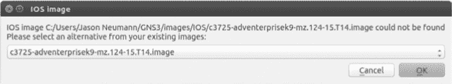

图 10-10. 替换 IOS 镜像文件

在这个例子中，你将一个项目从 Windows PC 迁移到 Linux 主机。即使在图 10-10 中 Linux 主机已配置了*c3725-adventerprisek9-mz-124-15.T14.image*文件，GNS3 仍然无法找到它，因为 Windows 存储 IOS 镜像文件的路径与 Linux 不同。

在这种情况下，GNS3 应显示已配置的 IOS 镜像列表，并允许您选择其中一个。使用下拉菜单选择镜像并点击**OK**。选择镜像后，GNS3 应更新目标 PC 上项目文件中的路径信息。为了使更改永久生效，您必须保存您的项目。所有原始的 IOS 配置应保持不变，您的项目应按照预期运行。如果没有，重新开始并尝试使用不同的镜像文件。

## 含有 IOU 设备的项目

复制包含 IOU 设备的项目可能会稍显复杂。最简单的方法是在目标 PC 上重新创建 IOU 设备，然后上传原始 IOU 配置。在将项目复制到新平台之前，请按照以下步骤操作：

1.  登录到项目中的每个 IOU 设备，将运行配置复制到*unix:initial-config.cfg*文件。右键点击 IOU 设备，选择**导出配置**以保存配置。确保在复制项目时将导出的配置文件复制到新系统中。

1.  在目标 PC 上打开项目，并解决任何 IOS 镜像文件替换问题（参考图 10-10）。

1.  在目标 PC 上，从您的项目中删除 IOU 设备，添加一个新设备，并使用与原始项目相同的接口将 IOU 设备连接到其他项目设备。

要导入配置，请执行以下步骤：

1.  右键点击目标 PC 上的 IOU 设备，并点击**导入配置**。

1.  浏览到保存 IOU 配置的目录并选择文件。对项目中的每个 IOU 设备执行此操作。

1.  当您完成后，启动新项目中的所有设备，并验证一切是否按预期工作。登录到每个 IOU 设备并检查其配置。如果一切正常，保存您的更新项目。

最后，让我们来看看如何转移使用 VirtualBox 的项目。

## 含有 VirtualBox 设备的项目

如果您在原始项目中使用了 VirtualBox 设备，您需要将其导出为 OVA 文件。启动 VirtualBox，选择**文件** ▸ **导出设备**来保存设备文件。准备好 OVA 文件后，按照以下步骤操作：

1.  将 OVA 文件复制到新 PC，启动 VirtualBox，并选择**文件** ▸ **导入设备**来导入该文件。

1.  启动 GNS3 并在偏好设置中添加 VirtualBox 虚拟机，如在导入设备中讨论的那样。

1.  将设备添加到您的 GNS3 项目中，并将其与其他设备连接，选择在原始项目中使用的相同接口。

当您在新 PC 上启动项目时，您的 VirtualBox 设备应具有与旧 PC 上相同的配置。

# 探索 GNS3 控制台

GNS3 管理控制台提供了一个命令行界面，您可以用它来控制项目设备。该管理控制台基于最初为 Dynamips 编写的 Dynagen 控制台，已经进行了适配和更新。我不会在这里介绍控制台的每个方面，但我会展示一些您可以用它做的更有用的操作。

默认情况下，启动 GNS3 时管理控制台应该是可见的。如果没有，选择 **视图** ▸ **停靠** ▸ **控制台** 来显示控制台窗口。

从管理提示符（`=>`）输入 `help` 或问号（`?`）以查看命令列表。如以下列出所示，您可以通过 CLI 执行熟悉的任务，例如启动和停止设备：

```
=> **?**

Documented commands (type help <topic>):
========================================
console  debug  help  reload  show  start  stop  suspend  version
```

要显示特定命令的详细信息和语法，请输入 `help` 后跟命令名称，如下所示：

```
=> **help show**
   Show detail information about every device in current lab:
    show device

    Show detail information about a device:
    show device <device_name>

    Show the whole topology:
    show run

    Show topology info of a device:
    show run <device_name>
```

`show` 命令提供了许多不同的选项，用于显示关于虚拟机监控程序、设备和配置的信息。例如，`show run` 命令显示项目配置文件的全部内容。

两个对于测试网络非常有用的命令是 `suspend` 和 `start`。这两个命令可以一起用于模拟路由器故障和恢复。另一个有用的命令是 `debug` 命令。当项目运行不正常时，它可以提供有用的信息。

# 使用多台 PC 创建项目

您可以使用多台 PC 运行设备，从而将资源负载分布到多台计算机上。共享资源使您可以使用一台 PC 设计项目，同时将设备本身运行在一台或多台其他 PC 上。这意味着您可以使用低端工作站（例如旧笔记本）创建和管理您的 GNS3 项目，而实际运行设备则在高端服务器上。如果您使用多台服务器，您可以构建一个 GNS3 超级实验室！

在本节中，我将向您展示如何在基本的客户端/服务器设置中共享资源，并介绍创建超级实验室的策略。在开始配置客户端/服务器（或多服务器）负载共享之前，请禁用所有 PC 上的防火墙，让我们开始吧。

## 一个 Dynamips 客户端/服务器设置

在这种场景下，您在一台计算机上操作 GNS3，而另一台计算机上运行 GNS3 服务器。如果您在 OS X 或 Windows 上运行 GNS3，这可能听起来很熟悉，因为这就是 IOU 虚拟机的工作方式。IOU 虚拟机运行在虚拟计算机上，而不是单独的 PC 上，但概念是相同的。

### 准备您的工作站

在这个示例中，我将使用 Windows 作为客户端 PC，使用 Ubuntu Linux 作为服务器 PC。首先，在两台工作站上安装 GNS3。一台工作站将作为客户端，配置和管理项目，另一台作为服务器。服务器仅运行 Dynamips 路由器，它应该拥有更好的硬件，因为它将承担大部分工作。服务器的处理能力和内存越强大，设备的性能就会越好。

在每台计算机上启动 GNS3 并配置一个 IOS 镜像文件。这让你可以同时运行本地和远程的 Dynamips 路由器，并使用客户端 PC 通过 GNS3 将它们联网。在配置服务器 PC 上的 GNS3 时，务必记录下你的 IOS 镜像文件的路径和文件名。在我的 Ubuntu 服务器上，镜像文件路径是*/home/jneumann/GNS3/images/IOS/c3725-adventerprisek9-mz.124-15.T14.image*。你需要这些信息来配置客户端 PC 上的远程 Dynamips 路由器。

接下来，找到每台 GNS3 PC 的 IP 地址。在这个例子中，我的客户端 PC 配置了 IP 地址 172.16.231.202，我的服务器 PC 配置了 IP 地址 172.16.231.205。配置好 GNS3 并记录下 IP 地址和镜像路径信息后，你就可以开始了。

### 运行 gns3server

你必须从`gns3server`程序的安装目录运行它。登录到远程服务器 PC，并在 Linux 和 OS X 上打开终端窗口，或者在 Windows 上打开命令提示符。在 Windows 上，进入*C:\Program Files\GNS3*目录，在 OS X 上，进入*/Applications/GNS3.app/Contents/Resources/Server/Contents/MacOS*目录。

启动服务器程序时，必须指定你的服务器 PC 的 IP 地址和服务器将监听的端口号；输入命令`gns3server --host` *`server-ip`* `--port` *`port-number`*。如果你不知道服务器 PC 的 IP 地址，可以懒一点，使用 0.0.0.0，`gns3server`会监听所有配置的接口。在下面的示例中，我已经在 Ubuntu Linux 上从*/usr/local/bin/*目录启动了`gns3server`程序。

```
$ **gns3server –-host 172.16.231.205 -–port 8000**
2015-06-06 18:32:45 INFO main.py:145 GNS3 server version x.x
2015-06-06 18:32:45 INFO main.py:147 Copyright (c) 2007-2015 GNS3 Technologies
Inc.
2015-06-06 18:32:45 INFO main.py:150 Config file /home/jneumann/.config/GNS3/
gns3_server.conf loaded
2015-06-06 18:32:45 INFO main.py:163 Running with Python 3.4.2 and has PID 3436
2015-06-06 18:32:45 INFO main.py:72 Current locale is en_US.UTF-8
2015-06-06 18:32:45 WARNING project.py:397 Purge old temporary project f3b11fb8
-82ed-42c1-b66a-226198ce6189
2015-06-06 18:32:45 INFO server.py:214 ➊ Starting server on 172.16.231.205:8000
```

启动服务器后，你应该看到类似的输出，如果一切顺利，服务器将会在 172.16.231.205:8000 ➊上启动，并显示在输出的最后一行。这表示服务器程序正在使用 IP 地址 172.16.231.205 和端口号 8000 进行监听。

### 注意

*如果你想让 GNS3 服务器监听其他端口号，比如 8001，你可以输入`gns3server --host 172.16.231.205 --port 8001`。要查看服务器选项的完整列表，可以在命令行输入`gns3server -–help`。*

### 配置客户端

这就是配置服务器的全部内容，接下来你可以将注意力转向 GNS3 客户端，在这个例子中是 Windows PC。在 GNS3 中，选择**编辑** ▸ **首选项**，然后选择**GNS3 服务器**，如图 10-11 所示。

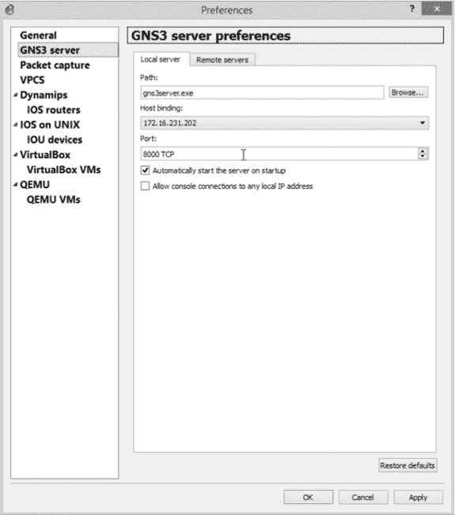

图 10-11. 设置主机绑定为以太网适配器的 IP 地址

点击**主机绑定**下拉菜单，并选择你的以太网接口的 IP 地址。在这台 PC 上，地址是 172.16.231.202。点击**应用**以完成配置。

接下来，将远程 GNS3 服务器的 IP 地址添加到客户端的远程服务器列表中。点击 **远程服务器** 标签，如 图 10-12 所示。

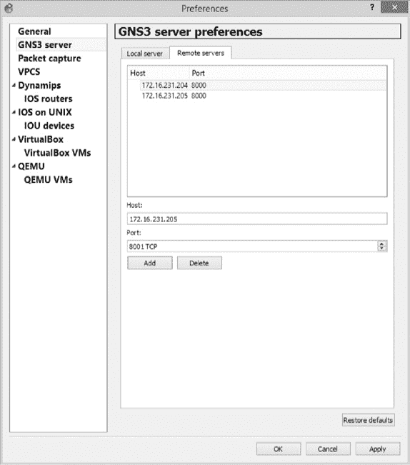

图 10-12. 配置客户端主机上的远程服务器 IP

在“Host”字段中，输入远程 GNS3 服务器的 IP 地址。在这个例子中，IP 地址是 172.16.231.205。默认的端口号应为 8000，但如果你在远程 PC 上选择了其他端口号，可以进行更改。添加远程服务器后，点击 **应用** 保存设置。

接下来，从侧边菜单中选择 **Dynamips**，并点击 **常规设置** 标签，如 图 10-13 所示。

取消勾选 **使用本地服务器** 设置，然后点击 **应用**。这确保你在配置 Dynamips 路由器时可以选择远程服务器。接下来，点击 **IOS 路由器**，如 图 10-14 所示。

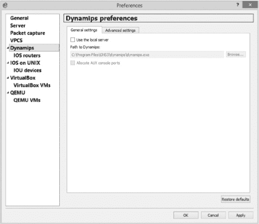

图 10-13. Dynamips 服务器设置

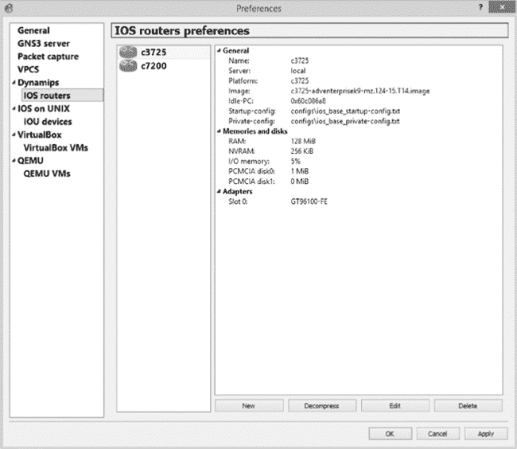

图 10-14. 配置远程 Dynamips 路由器

点击 **新建** 将远程 IOS 路由器添加到客户端 PC，如 图 10-15 所示。


图 10-15. 选择远程服务器类型

在“服务器类型”下，选择 **远程**，并取消勾选 **在所有可用的远程服务器之间负载均衡**。点击 **在服务器上运行** 下拉菜单，从列表中选择远程服务器的 IP 地址，然后点击 **下一步** 继续。输入你从远程服务器记录的路径和 IOS 镜像名称，如 图 10-16 所示。

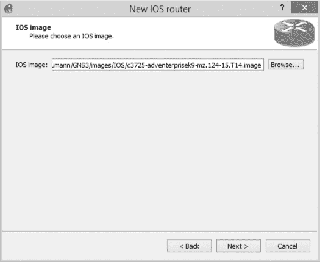

图 10-16. 输入远程 IOS 镜像路径

输入路径和文件名后，点击 **下一步** 继续。在“名称”字段中输入路由器名称，如 图 10-17 所示。

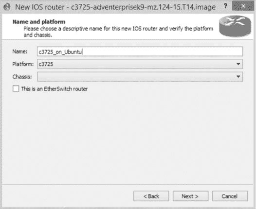

图 10-17. 命名你的路由器

我已将我的路由器命名为 *c3725_on_Ubuntu*，这样可以在设备工具栏中轻松识别路由器，并且从名称上可以知道它配置为运行在远程服务器上。

此时，您可以像配置本地 Dynamips 路由器一样点击其余选项。记得在提示时输入 Idle-PC 值，如果还没有计算，可以自行计算。请记住，Idle-PC 值是按每个镜像计算的，因此在使用相同 IOS 镜像文件的任何 PC 上都可以使用相同的值。

当您完成添加路由器时，它应显示在设备工具栏中的路由器部分，如图 10-18 所示。

这个示例中有两台 c3725 路由器，一台是安装在 Windows PC 上的本地路由器，另一台是安装在远程 Ubuntu 服务器上的路由器。当您创建一个项目时，您可以在同一个项目中使用这两台路由器，从而减少客户端 PC 上的 CPU 和内存消耗。

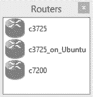

图 10-18. 设备工具栏中的路由器部分

现在您已经知道如何使用多台 PC 设置 GNS3，可以利用这一能力创建大型的 GNS3 项目。

在远程服务器上运行 QEMU

除了在远程服务器上运行 IOU 和 IOS 路由器外，您还可以在远程服务器上运行 QEMU。只需确保在开始之前已经在服务器 PC 上安装了 QEMU。设置远程 QEMU 设备的过程几乎与其他远程设备相同。然而，在新建 QEMU 虚拟机向导中，您需要选择虚拟机的 QEMU 二进制文件，如图 10-19 所示。

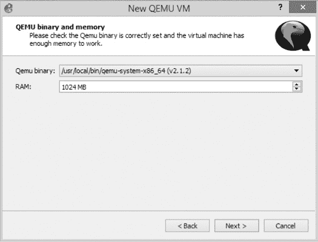

图 10-19. 配置 QEMU 二进制文件

GNS3 应该查询远程服务器以获取已安装的 QEMU 二进制文件列表，您创建的虚拟机应使用您选择的二进制文件在远程服务器上运行。使用下拉菜单选择虚拟机的二进制文件，通常是 *qemu-system-i386* 或 *qemu-system-x86_64*。调整 RAM 大小并点击 **下一步**。像配置本地设备一样配置剩余选项。

## 创建 GNS3 超大实验室

GNS3 强调可扩展性，您可以使用它创建非常大的项目，包含数十个交换机和路由器。创建超大实验室（uberlab）的最佳方法之一是使用多个 GNS3 服务器。但是，如果您有一台非常快速的计算机和几台性能较差的计算机怎么办呢？在这种情况下，您可能希望在一台计算机上运行更多的设备，而在其他计算机上运行较少的设备。例如，您可以在高端服务器上运行大多数路由器，在性能较低的机器上运行较少的设备。

超级实验室不必仅限于本地局域网中的计算机。如果你在一个通过 VPN 连接的多个站点的公司网络中使用 GNS3，你可以使用客户端/服务器模型，从市区甚至全国各地运行各种虚拟化管理程序！你需要做的就是在远程计算机上启动 `gns3server` 应用程序（通过 VPN），并使用远程 PC 的 IP 地址配置本地客户端。这和常规的客户端/服务器设置的唯一不同是，数据包将通过 VPN 发送到远程服务器。

# 趣味与盈利的极客实验室

你已经探索了在 GNS3 中配置各种项目所需的工具，但你应该如何利用这份新获得的知识呢？你可以为认证做准备，或者只是玩得开心！在本节中，我会讨论这两者。许多这些项目面向的是高级用户，但你可以随意修改它们，创建更适合你技能水平的项目和挑战。

## 准备 Cisco 考试

GNS3 是一个惊人的教育和认证工具，它拥有一切你需要的资源来获得 Juniper 或 Cisco 的认证，从入门级的 JNCIA 或 CCNA 一直到 Cisco 认证的皇冠上的明珠，CCIE。

对于 CCNA 或 CCNP 等入门级考试，可以通过在线搜索找到各种网络示例。你甚至可以使用 CBT Nuggets 或 Bryant Advantage 的视频与 GNS3 配合使用。它们的视频是一个很好的起点，GNS3 是一个很棒的工具，用来实验他们介绍的概念。如果你在为 CCIE 考试做准备，你可能想使用像 INE 工作簿这样的资料（*[`www.ine.com/`](http://www.ine.com/)*）。他们已经证明自己是 CCIE 实验室准备领域的领导者。

## 保护你的网络

如今，几乎每个人都将机密信息存储在某种网络服务器上，因此，拥有一个安全的网络基础设施不仅是一个好主意，它还是防止重大财务损失、避免不必要的诉讼以及避免与你公司错误和疏漏（E&O）保险承保方发生纠纷的一种方法。

在本节中，我概述了一些安全相关的挑战，这些挑战既有趣又具有教育意义，并且可以防止数据盗窃或丢失。

### “破解我的机架”挑战

和朋友们一起举办一个安全竞赛吧！每个挑战者在他们的 PC 上创建一个 GNS3 项目，并尽可能为他们的设备应用安全措施。挑战是让每个用户攻破其他用户的安全防护。在每个用户创建好自己网络后，他们可以在朋友的 PC 上安装一个 VirtualBox 虚拟机，并使用他们想要的任何系统破解工具。当挑战者们完成自己网络的创建后，他们交换电脑并开始计时。现在，皇家大战开始了！使用你的 VirtualBox 虚拟机来攻破另一个挑战者的 GNS3 网络。

### 创建 Cisco VPN

使用 Cisco 路由器和 ASA 设备创建一个站点到站点的 VPN 或多站点 VPN。尝试配置一个具有 VPN 故障转移的多宿 Cisco 路由器。在这种情况下，你的 WAN 边缘路由器可能有两个或更多接口，使用 BGP 模拟与互联网服务提供商的 WAN 链路。总有一天你可能需要一个自己的，或者客户可能需要一个。学会在 GNS3 中做这件事，比在客户的时间里摸索要好得多！

## 实践真实世界场景

以下项目思路旨在让你开始考虑 GNS3 沙盒外的实际情况。作为一名网络管理员或工程师，你需要理解多宿网络、交换机块设计和多服务器集成等方面的工作原理，仅举几例。在 GNS3 中设计、运行和排除这些类型的网络故障是为现实世界做好准备的好方法。

### Cisco 交换机块设计

理解交换机是管理网络的重要部分。虽然 GNS3 的 EtherSwitch 路由器和 IOU 具有有限的功能，但它们在配置和测试使用 HSRP、VRRP 和 GLBP 等协议的冗余交换机块时非常有用。试着创建一个完全冗余的 Cisco 校园模型交换机块，并提供互联网访问。

### 多宿网络

虽然许多小企业通过单个静态 IP 地址连接到互联网，但更大的公司需要更多的静态 IP 和 BGP 链接来维持其在互联网中的存在。使用几个 GNS3 路由器和 BGP，你可以模拟一个连接到多个互联网服务提供商的多宿网络。向你的虚拟 ISP 添加额外的路由器，模拟类似* [`www.google.com/`](http://www.google.com/) *或* [`www.gns3.com/`](http://www.gns3.com/) *这样的站点。然后从你的多宿网络 ping 这些虚拟站点。

### 多厂商集成

使用 Cisco、Juniper、Arista、Linux 或任何其他你能想到的可路由设备创建一个项目。使用 RIP、OSPF、BGP 等开放标准配置这些设备，或者使用路由重分发将来自一个厂商设备的路由翻译到另一个厂商设备上。目的是尽可能多地了解多厂商集成。

### 使用所有设备，包括“厨房水槽”

这个项目涉及*所有内容*！很简单：构建你能想象的最大、最强大的项目。尽可能多地使用远程 PC，并运行 GNS3 提供的所有内容：Cisco 路由器、交换机、ASA、防火墙、IDS/IPS、Juniper、Firefly、Vyatta、Arista，任何你能想到的设备。应用每种路由和交换协议，并使用`ping`或`traceroute`测试端到端的连通性。确保至少设置一个 ATM 交换机，一个帧中继云和一两个 VPN。

### 需要多少个路由器才能炸掉一个灯泡？

这里有一个有趣的方式可以赢得炫耀的权利。挑战朋友，看谁的 PC 在 GNS3 中能运行更多的路由器。通过正确的 Idle-PC 值，你可能会发现你可以在 Dynamips 崩溃或 GNS3 开始变得太慢以至于无法使用之前，运行超过 100 个路由器。一个技巧是将 GNS3 运行在 Linux 上，因为 Dynamips 在 Linux 上的扩展性似乎比在 Windows 或 OS X 上更好。

### 路由器失控

这个“画蛇添足”的挑战是和朋友一起玩的一种方式。每个挑战者都可以使用尽可能多的路由器来构建一个复杂的网络，越多越好！然后配置这些网络并彻底测试。等到两个挑战者都确信他们的网络运行正常后，他们交换计算机，通过更改几个配置设置来破坏对方的网络（就像往药膏里放只苍蝇一样）。

一次“休息”可能是简单地关闭一个接口，或者复杂到过滤 BGP 路由。这完全取决于个人的技能和他们网络的复杂性。一旦网络被破坏，竞争者们再次交换计算机，每个人都尽力首先分析并修复他们原本的网络。

# 最后思考

虚拟的 Cisco 接入服务器需要一些配置工作，但一旦设置完成，它是管理设备的简便方式。如果你有一个只用几个路由器的小项目，可能不需要它。但如果你需要管理几十台设备，它很快就会成为一个不可或缺的工具。

GNS3 可以在多个 PC 操作系统上运行，但你并不局限于你当前使用的那个系统。项目在不同系统之间移动相对简单，所以不要害怕尝试新东西。GNS3 是在 Linux 上设计的，并且移植到 Windows 和 OS X，所以它在 Linux 上运行得很好，通常比在 Windows 上运行时占用更少的资源。

如果你没有最新的 PC 硬件，你可以将虚拟化管理程序跨多个 PC 进行负载均衡，创建比单台 PC 更流畅的大型项目。这也是重新利用家里或办公室里闲置旧 PC 的好方法。

但关于 GNS3 最重要的一点是，它好玩，因为你可以创建那些原本可能无法实现的网络。所以发挥创造力，享受乐趣吧！
