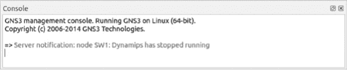
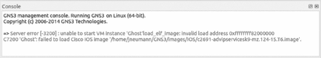
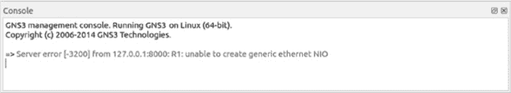
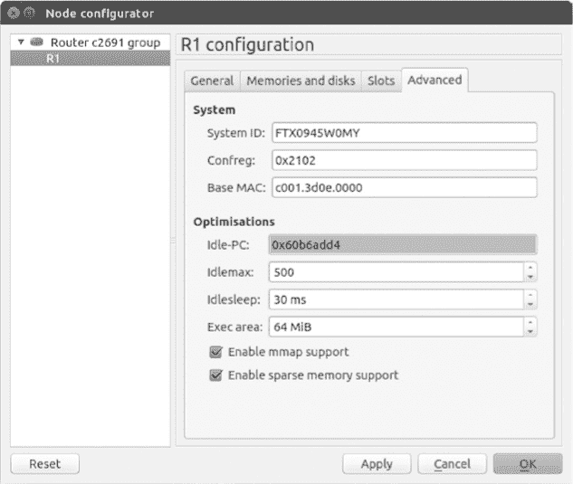
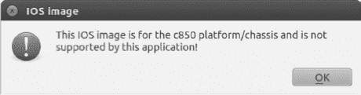
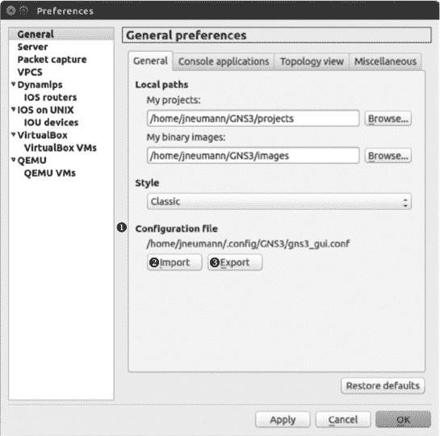

# 附录 A. 救命！我摔倒了，爬不起来

GNS3 是一个复杂的程序，像所有复杂的程序一样，它偶尔会出现意料之外的行为。我已经在本书中包含了故障排除的技巧，因此在本附录中我不会提供太多的修复信息。相反，我将为你提供解决问题的基本策略，并且我会介绍一些常见问题及其可能的解决方案。

# 确定问题

GNS3 的问题大致可以分为两类。

+   ****突发问题****。发生在之前正常运行的项目中的问题。

+   ****功能性问题****。在实现新功能时发生的问题。

突发问题是无缘无故发生的。你的项目可能已经运行了几周，一切正常，但突然间无法打开，或者打开后设备无法启动。功能性问题通常发生在创建新项目或在现有项目中实现新功能时。两种问题类型都可能令人沮丧，如果你使用 GNS3 一段时间，你很可能会遇到至少一种问题。

# 突发问题

当一个项目运行良好，却突然出现问题时，通常表明某些东西发生了变化。可能是你的 PC 发生了变化，GNS3 本身发生了变化，或者项目本身发生了变化。就 GNS3 而言，可能是你无意中更改了某个设置，或者更改了如 Dynamips、QEMU 或 VirtualBox 等辅助应用程序。也可能是你升级到了一个有问题的 GNS3 版本。每当发布新版本的 GNS3 时，在升级生产环境之前，最好先在备用 PC 或虚拟机上进行测试。本节提供了一些帮助解决突发问题的技巧。

## 停止 Dynamips 崩溃

不稳定的 Dynamips 程序可能导致设备连接丢失。在这种情况下，你可能会看到 GNS3 控制台错误信息，指示 Dynamips 已停止运行，如图 A-1 所示。



图 A-1. 与 Dynamips 的通信失败

该消息可能表明你正在运行与 Dynamips 冲突的软件，或者你正在使用不稳定的 Dynamips 版本，或者你的 PC 没有足够的可用资源，如内存或 CPU 周期。尝试关闭所有非必要的应用程序，重启你的 PC，禁用所有的防病毒/反垃圾邮件软件，并关闭防火墙。如果 Dynamips 仍然崩溃，可能需要重新安装或从备份中恢复 Dynamips 或 GNS3。

## 当 IOS 镜像无法加载时

路由器内存是导致 Dynamips 路由器出现故障的常见问题。当路由器无法启动时，请检查您所使用的 IOS 镜像的 Cisco RAM 要求——您可能分配了过多或不足的内存。要验证要求，请访问 Cisco 功能导航器网站；浏览到*[`tools.cisco.com/ITDIT/CFN/jsp/index.jsp`](http://tools.cisco.com/ITDIT/CFN/jsp/index.jsp)*。在这里，您可以使用“按软件搜索”功能输入 IOS 的详细信息，导航器将提供相应的要求。

如果 IOS 路由器的 RAM 设置过低，路由器可能无法启动，或者启动时崩溃，GNS3 控制台窗口可能会显示错误消息，如图 A-2 所示。



图 A-2。加载 Cisco IOS 镜像错误消息失败

在这种情况下，您应该重新配置路由器并为其分配更多内存。右键单击路由器并选择**配置**，以启动 GNS3 节点配置器。从左侧窗格中选择路由器名称，然后点击**内存和磁盘**标签页以显示 RAM 设置。

如果您增加内存后路由器仍然无法启动，可能是 IOS 镜像文件损坏，您应该尝试使用其他版本的文件。

当您遇到损坏的 IOS 镜像文件时，可能不会在 GNS3 控制台窗口中显示任何错误消息。相反，路由器控制台可能没有响应，或者显示可能提供问题线索的信息，如图 A-3 所示。


图 A-3。IOS 镜像加载失败

控制台输出显示 IOS 正以惊人的速度抛出异常错误。这可能表明 IOS 镜像文件已损坏，或者在 GNS3 中配置不正确。请使用 Cisco 功能导航器验证并修正镜像设置，必要时更换镜像文件。

## 解决 IOS 内存错误

向 Dynamips 路由器添加过多内存可能会导致路由器无法正常启动。例如，c7200 与 NPE-400 处理的最大 RAM 为 512MB。如果您添加更多内存，比如 1024MB，您可能会在 GNS3 控制台窗口中看到错误消息，或者在路由器控制台中显示如下信息：

```
Cisco IOS Software, 7200 Software (C7200-ADVENTERPRISEK9-M), Version 15.2(4)
S2, RELEASE SOFTWARE (fc1)
Technical Support: http://www.cisco.com/techsupport
Copyright (c) 1986-2012 by Cisco Systems, Inc.
Compiled Tue 11-Dec-12 13:32 by prod_rel_team

!!! WARNING - VM is not running, will be unresponsive (status=1) !!!
```

路由器控制台消息 `!!! WARNING - VM is not running, will be unresponsive (status=1) !!!` 清楚地表明该路由器在启动时发生崩溃。在这种情况下，停止设备并检查其配置。这里指示的问题是设备分配的内存过多。要解决此问题，请减少分配给设备的内存量，或者用不同版本的 IOS 镜像文件替换原有镜像文件。

即使路由器看起来运行正常，在配置 IOS 时你可能仍会遇到错误。以下是一个有趣的情况，尽管路由器内存不足但仍成功启动，但在配置过程中显示错误信息：

```
R1(config-if)#**ip nat inside**
% NBAR ERROR: parsing stopped
% NBAR Error : Activation failed due to insufficient dynamic memory
% NBAR Error: Stile could not add protocol node
%NAT: Error activating CNBAR on the interface Vlan1
R1(config-if)#
*Mar 1 00:00:57.127: %LINEPROTO-5-UPDOWN: Line protocol on Interface NVI0,
changed state to up
*Mar 1 00:00:57.251: %SYS-2-MALLOCFAIL: Memory allocation of 10260 bytes
failed from 0x62915CD4, alignment 0
Pool: Processor Free: 18968 Cause: Memory fragmentation
Alternate Pool: None Free: 0 Cause: No Alternate pool
 -Process= "Exec", ipl= 0, pid= 195, -Traceback= 0x6148BFF8 0x60016604
0x6001C564 0x6001CBBC 0x636756E4 0x62915CDC 0x628F468C 0x628F88C4 0x628F5968
0x628F87A0 0x628F5968 0x628F8344 0x628F5968 0x628F5B2C 0x62928FBC 0x62933A20
R1(config-if)#
*Mar 1 00:00:57.275: %NBAR-2-NOMEMORY: No memory available for StILE lmalloc,
-Traceback= 0x6148BFF8 0x62915CF8 0x628F468C 0x628F88C4 0x628F5968 0x628F87A0
0x628F5968 0x628F8344 0x628F5968 0x628F5B2C 0x62928FBC 0x62933A20 0x62920BD0
0x6293DF70 0x6293E2F0 0x61C77C70
R1(config-if)#
```

在这个例子中，路由器 R1 一直运行良好，直到我尝试配置网络地址转换。由于这台路由器内存不足，Cisco IOS 立即显示内存分配错误信息。在 GNS3 中为路由器分配更多内存应能解决该问题。

## 解决 NIO 错误

当你尝试使用 Cloud 节点将 GNS3 设备连接到 PC 的物理以太网适配器时，通常会发生 NIO 错误。如果你在连接设备之间或连接到 Cloud 节点时遇到问题，或者收到类似于 图 A-4 中显示的 NIO 错误信息，那么你可能有权限问题。



图 A-4. 无法创建通用以太网 NIO 错误信息

在这种情况下，你可能需要为自己分配更高的权限。如果你在 Windows 上运行 GNS3，可以使用管理员账户启动 GNS3：右键点击 GNS3 图标，选择 **以管理员身份运行**。如果你使用的是 OS X，可能需要为 */dev/tap* 或 */dev/bpf* 设备文件分配所有权权限，如以下示例所示：

```
$ **sudo chown $(id -un):$(id -gn) /dev/bpf***
$ **sudo chown $(id -un):$(id -gn) /dev/tap***
```

这些命令将把当前登录用户的用户 ID 分配给设备文件，从而允许你的用户账户在运行 GNS3 时使用这些文件。你需要在每次重启 Mac 时设置这些权限，因为 OS X 会在启动时重置所有设备文件的权限。

为了确保较高的安全性，使用`setcap`命令提升 *dynamips* 文件的能力。在 Ubuntu 上，你可能需要在输入`setcap`命令之前安装 libcap2。

```
$ **sudo apt-get install libcap2**
$ **sudo setcap cap_net_raw,cap_net_admin+eip /usr/local/bin/dynamips**
```

Linux 安全性考虑

如果你正在使用 Linux，可能需要以提升的权限运行 Dynamips。为此，根据你的 Linux 发行版，有两种方法可以选择。

你可以使用 Linux 的`chown`和`chmod`命令，或者使用`setcap`命令。这两种方法都能解决权限问题，但`chmod`/`chown`方法较不安全，因为它赋予 Dynamips 应用程序以完整的 root 权限。如果恶意代码进入 Dynamips，你的整个 Linux 安全性可能会受到威胁。Linux 的`setcap`命令允许你为文件赋予类似 root 的能力，而不需要真正给予文件 root 权限。这能在不牺牲 Linux 安全性的前提下，赋予 Dynamips 所需的权限。因此，这是解决 GNS3 NIO 错误的首选方法。

不幸的是，`setcap`并不适用于所有 Linux 平台，但它在 Ubuntu 和大多数基于 Debian 的系统中是受支持的。

如果你无法使用`setcap`命令，可以改用`chown`和`chmod`命令来提升 Dynamips 的根权限。

```
$ **sudo chown root /usr/local/bin/dynamips**
$ **sudo chmod 4755 /usr/local/bin/dynamips**
```

如果你无法将 IOU 设备连接到 Linux 上的物理适配器或虚拟 TAP 适配器，可以尝试将`setcap`命令应用于 iouyap 应用程序。这是因为 iouyap 是 GNS3 软件，它将 IOU 设备与其他 GNS3 设备以及虚拟和物理接口桥接。在这里，你为 iouyap 授予了和 Dynamips 相同的提升权限：

```
$ **sudo setcap cap_net_raw,cap_net_admin+eip /usr/local/bin/iouyap**
```

另一个可能的 NIO 问题是你为连接 GNS3 到物理以太网适配器选择的方法。这在 Windows PC 上尤其常见。如果你使用的是 Windows 7，尝试连接 GNS3 到互联网时，使用物理以太网适配器和回环适配器创建一个桥接（详细信息见将 GNS3 设备连接到互联网）。如果你使用的是 Windows 8，直接将 Cloud 节点连接到物理以太网适配器或使用 Internet 连接共享，可能会得到更好的结果。

## 纠正控制台问题

控制台问题可能会导致控制台无法打开，打开后立即关闭，或者在配置设备时反应迟钝或无响应。控制台连接不正常的原因有很多。最常见的问题是由于 GNS3 中的设置不正确，比如 QEMU 设备设置或 VirtualBox 设置，但也可能是设备镜像的问题，例如损坏的 IOU 或 ASA 镜像文件。

当控制台无法打开时，首先检查 GNS3 控制台应用程序的偏好设置。打开**首选项**，在左侧窗格中选择**常规**，点击**控制台应用程序**标签，确保在预配置的终端命令下列出的终端类型与您的操作系统终端程序匹配。如果不匹配，请使用下拉菜单选择正确的终端；然后点击**设置、应用**，再点击**确定**保存配置。

如果你发现打开控制台后立即断开连接，可能是防火墙阻止了控制台应用与 GNS3 设备之间的网络连接。如果设备是 QEMU 设备，问题通常与 QEMU 虚拟机本身或其配置相关。首先，确认你已经为 QEMU 虚拟机分配了正确的内存。你可以访问 GNS3 Jungle 论坛或第三方供应商网站，验证该设备的内存要求。如果内存分配正确且问题依旧，检查 QEMU 虚拟机设备的属性。进入 **首选项**，从左侧面板中选择 **QEMU 虚拟机**。从列表中选择你的 QEMU 设备，点击 **编辑**，然后点击 **高级设置** 标签。确保“附加设置”中的选项正确。如果不正确，请修正并重试。

类似地，你可以通过检查虚拟机的设置来排查 VirtualBox 虚拟机的问题。进入 **首选项**，然后从左侧面板中选择 **VirtualBox 虚拟机**。从列表中选择你的 VirtualBox 设备，点击 **编辑**，然后点击 **常规设置** 标签。确保启用了远程控制台并正确配置了虚拟机的“无头模式”启动选项。

如果你在启动 Dynamips 路由器时，控制台反应迟缓，可能是因为路由器未被分配最佳的 Idle-PC 值。选择不当的 Idle-PC 值对 CPU 的影响可能和没有设置值一样严重。要验证或设置 Idle-PC 值，右键点击路由器，选择 **配置** 打开节点配置器，然后在 **高级** 标签中检查 Idle-PC 值。如果路由器已经被分配了 Idle-PC 值，并且设备消耗大量 CPU，那么你可能需要重新计算该值。（参见设置手动 Idle-PC 值。）

如果你更改了任何 Dynamips 的高级优化设置（例如 Idlemax 或 Idlesleep），控制台也可能变得迟缓。Idlemax 和 Idlesleep 是与 Idle-PC 值一起使用的；Idlemax 决定在执行路由器代码中的空闲循环时，多少时间进行一次睡眠，而 Idlesleep 值则决定每次睡眠的时长。你可以通过点击 **重置** 按钮来尝试将它们恢复到默认值，如图 A-5 所示。

GNS3 开发团队已确定，Idlemax 和 Idlesleep 的默认值对大多数用户来说是最佳的，但通过如节省资源中所述的方法，你可能能够稍微提升一些 CPU 性能。



图 A-5. 高级路由器配置

如果控制台反应迟缓是因为你使用的是 IOU 设备，并且正在使用 IOU 虚拟机（Windows 和 OS X 必需），可以尝试在 VirtualBox 中为 IOU 虚拟机分配更多内存。

# 功能问题

功能问题通常出现在你尝试实现 GNS3 的某个新功能时，并且通常是由某种用户错误导致的。GNS3 拥有许多功能和选项，项目可能会迅速变得复杂，尤其是在使用多台 PC 或将 QEMU 和 VirtualBox 虚拟机添加到项目中时。功能问题也可能出现在设备配置中。

## 配置问题

如果你在项目中遇到网络路由问题，可能是你在配置设备的网络操作系统时犯了错误；毕竟，GNS3 是一个学习工具，你会在过程中犯错误。在配置使用 Arista、IOS 和 Junos OS 等操作系统的功能时，容易犯一些会导致网络瘫痪的错误。检查设备的配置，确保没有将错误的子网掩码分配给 IP 地址，或者忘记启用接口。避免这类问题的一种方法是像配置实际网络一样配置你的 GNS3 项目设备。从少量设备开始，配置并测试它们，然后逐步增加并测试设备，直到创建一个完全功能的项目。

## 使用不支持的 IOS 镜像

总之，不要尝试使用不支持的镜像。Dynamips 支持有限数量的 Cisco 路由器（完整列表请见附录 B）。如果在尝试安装镜像文件时看到不支持的镜像错误，如图 A-6 所示，那是因为该镜像文件不被 GNS3 支持。



图 A-6. 不支持的 IOS 镜像错误

在图 A-6 中，我尝试使用来自 Cisco c850 路由器平台的镜像文件，但该平台不被 GNS3 支持。出现此错误消息时，唯一的选择是丢弃该文件并用一个 GNS3 支持的文件替换它。

# 核心解决方案

如果在尝试了到目前为止讨论的操作后，仍然遇到 GNS3 问题，你可以采取“核选项”作为最后的手段，清除 GNS3 设置文件。一旦清除该文件，你将失去所有 GNS3 设置，并需要重新配置 GNS3，仿佛它是一个全新安装的系统。

### 注意

*清除 GNS3 设置文件不应影响你保存的任何项目，也不应影响这些项目中的 VirtualBox 或 QEMU 设备。*

在开始之前，请备份现有的配置文件。这样，如果需要恢复旧设置，你可以选择返回到原来的配置。进入**偏好设置**并选择**常规**偏好；然后，在新窗口中选择**常规**选项卡，如图 A-7 所示。

GNS3 设置文件显示在配置文件 ➊ 下。要备份该文件，请点击**导出** ➌ 按钮。选择一个名称和保存位置。记下原文件的位置（在此示例中为 */home/jneumann/.config/GNS3/gns3_gui.conf*），导出完成后，关闭 GNS3 并删除或重命名此原始文件。现在，当你重新打开 GNS3 时，所有偏好设置将被清除，就像你第一次安装它一样。如果你决定清除文件是一个错误，可以使用**导入** ➋ 恢复原始 GNS3 设置文件。



图 A-7. 导出并清除 GNS3 配置文件

### 注意

*在少数情况下，GNS3 设置文件可能会损坏。请随时保持 GNS3 设置文件的当前备份，以便在需要时能够恢复到一个可用版本。*

# 硬件负载过重

当 GNS3 运行缓慢且设备崩溃时，这可能是你让 PC 处理器负担过重，连接了过多设备的迹象；这肯定会导致控制台响应变慢，甚至可能导致 Dynamips 崩溃。如果是这种情况，可以考虑精简项目、升级 PC，或使用多台 PC 与 GNS3 配合使用。为了在不让 CPU 过载的情况下创建大型项目，一个很好的方法是将超管程序分摊到多台 PC 上，正如使用多台 PC 创建项目中所描述的那样。

# 解决端口号冲突

在某些时候，电脑上的其他软件可能会与 GNS3 冲突。通常在该软件使用了 GNS3 所需的端口号时会发生这种情况。如果使用的端口号与 GNS3 服务器应用程序相同，GNS3 会加载，但服务器应该选择另一个端口号。

当这种情况发生时，使用`netstat`命令调查问题，这个命令应该在 Windows 和 Unix 系统（如 Linux 和 OS X）上都能找到。

```
$ **netstat -an|more**

Active Internet connections (servers and established)
Proto Recv-Q Send-Q Local Address           Foreign Address         State
tcp        0      0 127.0.1.1:53            0.0.0.0:*               LISTEN
tcp        0      0 127.0.0.1:631           0.0.0.0:*               LISTEN
tcp        0      0 0.0.0.0:8000            0.0.0.0:*               LISTEN
tcp        0      0 127.0.0.1:39191         127.0.0.1:800➊         TIME WAIT
tcp6       0      0 ::1:631                 :::*                    LISTEN
tcp6       1      0 ::1:53974               ::1:631                 CLOSE WAIT
udp        0      0 0.0.0.0:59759           0.0.0.0:*
udp        0      0 0.0.0.0:39309           0.0.0.0:*
udp        0      0 127.0.1.1:53            0.0.0.0:*
udp        0      0 0.0.0.0:68              0.0.0.0:*
udp        0      0 0.0.0.0:631             0.0.0.0:*
udp        0      0 0.0.0.0:5353            0.0.0.0:*
udp6       0      0 :::57463                :::*
udp6       0      0 :::45876                :::*
udp6       0      0 :::5353                 :::*
```

TCP 端口号 8000 ➊ 是 GNS3 服务器程序的默认端口号，但`netstat` 输出显示另一个应用程序正在使用该端口。为了解决这个问题，请找到占用该端口的应用程序并关闭它，或更改 GNS3 使用的默认端口号。要更改端口号，请进入**偏好设置** ▸ **服务器** ▸ **本地服务器端口**，并将端口号设置为其他数字，比如 8001。

# ASA 故障排除

在 GNS3 中安装 ASA 时，确保在安装向导中从 **类型** 下拉菜单中选择 **ASA 8.4(2)**。然后，GNS3 向导应自动填写所需字段并提供正确的信息。

如果你的 ASA 配置正确，但它锁死或运行不良，可能是 ASA 导致了高 CPU 使用率，进而影响了你的 PC 整体性能。你可以通过调整 ASA 的 CPU 限制百分比，显著降低 CPU 使用率。进入 **首选项**，选择你的 ASA，点击 **编辑**，并启用 **CPU 限速**。不过要小心，因为限制 ASA CPU 使用率过多也可能导致 ASA 无响应。为了达到最佳效果，尝试调整设置，直到找到一个能够减少 CPU 使用率而不影响性能的平衡点。

# 节省资源

总体来说，GNS3 在处理几乎任何规模的项目时表现不错，只要你拥有适当的硬件资源。但是，项目越大，你越有可能遇到问题。避免这些问题的最佳方法是在创建项目时采取简化的方式，并避免在设计中增加不必要的复杂性。

## 仔细选择设备

在 GNS3 中，始终选择使用最少内存和 CPU 的设备。例如，如果你能使用只需 128MB 的 c3700 路由器，而不是需要 512MB 内存的 c7200 路由器，就应避免使用 c7200。当使用 Dynamips 设备时，请为项目中的所有路由器选择相同的设备型号；GNS3 这样可以在它们之间共享资源。使用多个不同的路由器型号可能会导致资源消耗过多，性能下降。你还可以使用仿真设备，比如使用以太网交换机节点而不是 EtherSwitch 路由器，以节省内存和处理器。

## 优化 Idle-PC 值

为了减少系统资源的使用，微调你的 Idle-PC 值。当你运行少量 IOS 设备时，当前的值可能已经足够，但较大的项目将从更优化的值中受益。

为了找到最适合你的值，首先将计算机置于大部分空闲状态：重启计算机并关闭所有程序，包括防病毒软件。如果你使用的是 Windows，尽量关闭系统托盘中的所有应用程序。当你准备好时，将路由器添加到工作区，启动它，右击路由器，选择 **Idle-PC** 开始计算 Idle-PC 值。在此过程中，仔细监控每次应用新值后的 CPU 使用情况，并记录所有值。寻找使用最少资源的那个值，并在找到它后应用到设备上。

# 备份你的项目

备份你的 GNS3 项目非常重要，特别是当它们变得越来越复杂且需要更多时间来创建时。没有人愿意丢失自己花费几个小时完成的工作！你可以备份整个 GNS3 文件夹、备份你的项目文件夹，或备份单个项目文件夹。

定期备份整个 GNS3 文件夹是确保你始终拥有所有项目和镜像的最新副本的最佳方法，但这可能会占用大量时间，并且可能需要相当多的磁盘空间。

如果你时间或资源有限，至少从项目文件夹中备份单独的项目。确保你仍然有整个 GNS3 文件夹的备份副本，然后在需要时通过将单个项目复制到备份中来更新完整的 GNS3 备份。这种方法的缺点是，它依赖于你每次更新备份时都记得复制新项目或更新的项目，你可能会忘记备份一个重要的项目。从经验中我知道，当你发现自己刚丢失了为一个复杂项目投入的所有工作时，这种失落感会让人非常清醒。

我建议制定一个完整的备份策略，并在创建每个项目时进行备份。你可以分阶段创建大型项目，逐步测试每个组件，确保每个组件正常工作后再进行备份。然后，重复此过程，直到项目完全配置好，网络功能正常。在创建复杂项目时，使用 GNS3 快照也很有帮助：如果出现错误，只需通过恢复快照来恢复到正常工作状态（参考 使用 GNS3 工具栏）。但是，无论你选择哪种备份策略，存储备份项目文件最简单的方法是将整个项目文件夹复制到一个大容量 USB 闪存驱动器或外部硬盘中。

# 欢迎来到丛林

当问题对你来说太难解决时，不要害怕寻求帮助。GNS3 网站 (*[`www.gns3.com/`](http://www.gns3.com/)*) 提供了大量信息，并且有一个专门的论坛，叫做 *GNS3 丛林*。在这里，你可以报告问题，提问，或者帮助其他用户解答问题。要访问 GNS3 丛林，进入 GNS3 网站并选择 **社区**。

在发帖提问之前，请先在网站上搜索，看看你的问题是否已经有人问过并得到解答。GNS3 丛林有一个非常活跃的成员群体，因此问题通常会迅速得到回应。如果你发帖提问后没有得到及时回答，请不要重复发帖或回复自己的帖子以提高其排名。多次发相同的问题只会让试图帮助的人更加困惑。通常，如果问题没有得到回答，是因为目前在论坛上没有人知道答案。请耐心等待，最终会有人回复。

在提问时，我建议提供以下信息：

+   GNS3 版本

+   操作系统的名称和版本

+   平台特性（32 位或 64 位，处理器，内存）

+   问题的清晰描述

+   错误信息的截图（如果适用）

+   偏好设置的截图（如果适用）

+   拓扑结构（如果适用）

+   设备配置（如适用）

详细的信息能帮助其他 GNS3 用户更快地确定你的问题并提供解决方案。

# 最后思考

尽管 GNS3 通常运行良好，但问题偶尔还是会出现。在本附录中，你查看了一些常见问题和基本的故障排除策略来解决这些问题。

你了解到，防火墙、杀毒软件以及偶尔基于 TCP/IP 的应用程序会对 GNS3 造成严重影响。如果有疑问，在启动 GNS3 之前，请禁用防火墙、禁用杀毒软件，并关闭所有不必要的程序。

你还学到，修复损坏项目的最快方法通常是从备份中恢复项目。你应该始终保持整个 GNS3 文件夹和 GNS3 设置文件的最新备份副本。从备份恢复数据是灾后快速恢复和启动的最可靠方式。
