# 附录 B. 与 GNS3 兼容的 Cisco 硬件

本附录列出了 Dynamips 和 GNS3 支持的 Cisco 硬件。Dynamips 仅模拟使用 MIPS 架构的 Cisco 路由器，并不支持所有 Cisco 型号。在支持的路由器列表之后，你会看到一份推荐的 IOS 镜像文件列表，GNS3 可以自动应用正确的 Idle-PC 值，而无需执行 Idle-PC 计算。

# 支持的 Cisco 硬件

在 GNS3 中，你可以模拟五种不同系列的 Cisco 路由器（1700、2600、3600、3700 和 7200），支持的功能各不相同。

表 B-1. 1700 系列路由器

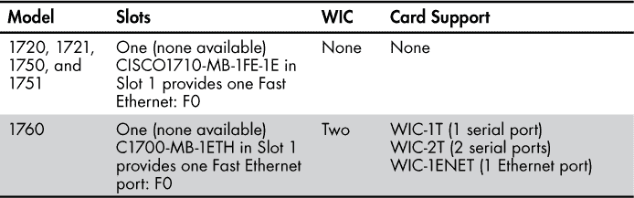

表 B-2. 2600 系列路由器

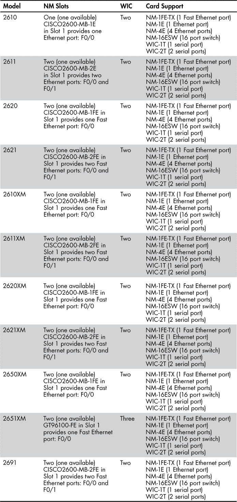

表 B-3. 3600 系列路由器

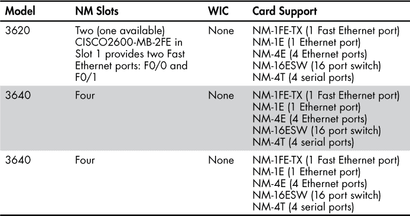

表 B-4. 3700 系列路由器

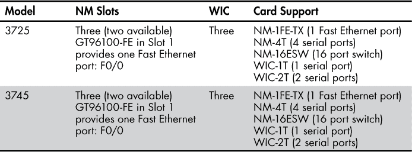

表 B-5. 7200 系列路由器

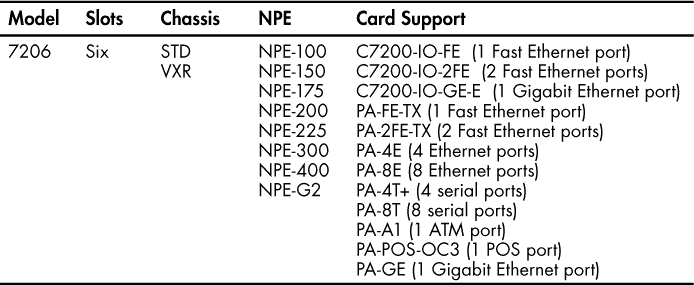

# IOS 兼容性

以下路由器不再收到 Cisco 的 IOS 更新。这里列出的 IOS 文件名是 GNS3 推荐的版本，尽管旧版本应该也能正常工作。

表 B-6. c1700 系列路由器

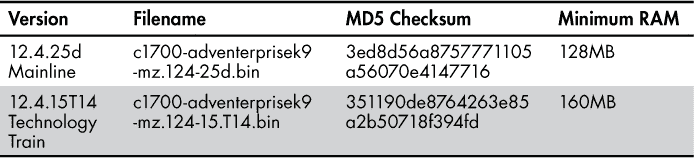

表 B-7. c2600 系列路由器

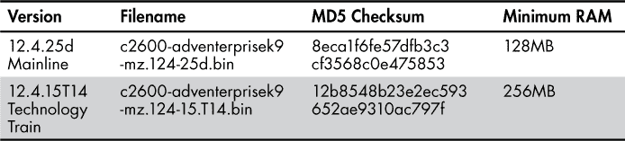

表 B-8. c2691 系列路由器

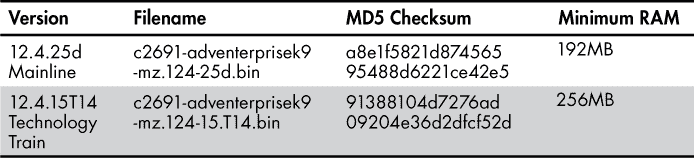

表 B-9. c3620 系列路由器

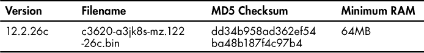

表 B-10. c3640 系列路由器

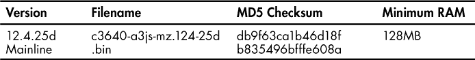

表 B-11. c3660 系列路由器

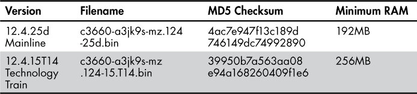

表 B-12. c3725 系列路由器

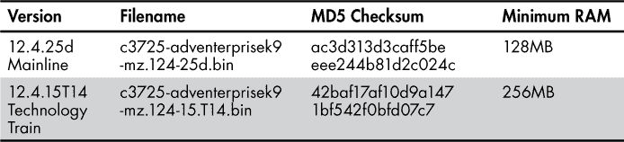

表 B-13. c3745 系列路由器

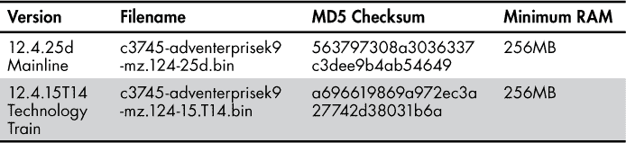

Cisco c7200 系列路由器继续接收 Cisco 的 IOS 更新，并支持版本 15.*x* 的 IOS。

表 B-14. c7200 系列路由器

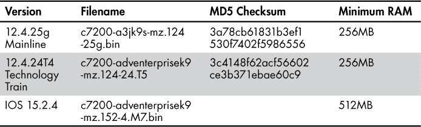
