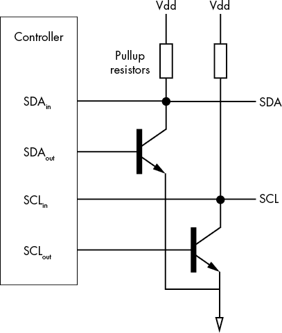
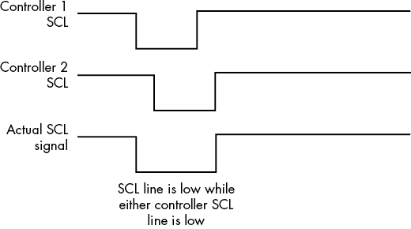
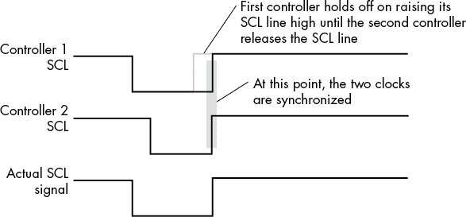

# 第一章：I²C 低级硬件

I²C 总线是一个全球标准，用于在印刷电路板（PCB）上的集成电路（IC）之间以及系统内多个 PCB 之间的通信。根据 NXP 半导体公司的说法，I²C 被超过 50 家不同制造商生产的 1,000 多种不同的 IC 所使用。毫无疑问，I²C 是现有的较为流行的 IC 数据通信方案之一（串行外设接口 [SPI] 是另一种）。

随着 Arduino 和 Raspberry Pi 等支持 I²C 的爱好者级单板计算机（SBC）的推出，I²C 总线的流行度不断增加。今天，成千上万的程序员已经学习了 I²C 总线的基础知识，因为他们想将某个设备与 Arduino 或 Pi 系统连接起来。由于大量的开源库代码，用户可以在不完全理解其低级信号协议的情况下使用和编程 I²C 总线上的设备。然而，要真正充分利用使用 I²C 外设的设计，你需要理解这些协议，包括硬件和软件。 本章介绍了 I²C 的低级硬件方面，在学习信号协议之前，你需要了解这些内容。

## 1.1 I²C 概述

在 I²C 总线等总线出现之前，计算机系统的不同组件使用传统的 CPU 风格总线进行通信。这些总线通常使用 8 到 32 条数据线以及一些地址信号。将一个 8 位并行 I/O 设备连接到 CPU 需要相当大的 PCB 空间来容纳所有信号线路。当然，增加额外的 I/O 会相应地增加信号、空间和噪声。除了空间，这些线路还增加了系统工程师在设计中需要处理的噪声量。

I²C 总线的发明是为了解决这些问题。有了 I²C 总线，一对信号线（PCB 路径）就可以将各种不同的 I/O 外设连接到 CPU。这减少了成本，并且在构建复杂（嵌入式）计算机系统时消除了许多问题（更多信息请参见文本框“ I²C 总线的优势”）。

I²C 设备分为两类：控制器设备（以前称为主设备）和外设设备（以前称为从设备）。*控制器设备*，顾名思义，控制着控制器和外设设备之间的通信。*外设设备*则不会主动发起任何通信，而是依赖控制器来管理通信过程。

I²C 协议是一种同步串行通信，使用两条信号线：*SCL*，代表“串行时钟”，和*SDA*，代表“串行数据”。控制器驱动时钟线。当外设向控制器发送数据时，它将数据位放置在数据线上；当外设接收数据时，控制器将串行数据位放置到数据线上。除了一个特殊情况——时钟拉伸，稍后会在本章讨论——外设永远不会控制时钟线。

一个典型的系统有一个控制器和一个或多个外设设备。每个外设设备在给定的 I²C 总线上都有一个唯一的地址，控制器通过该地址区分同一总线上的多个外设。从理论上讲，单个 I²C 总线支持最多 127 个甚至 1,024 个不同的外设设备，尽管实际情况会将外设设备的数量限制在更小的范围内。

尽管一个典型的系统只有一个控制器，但 I²C 总线支持同一总线上有多个控制器。这允许多个控制器共享一组公共外设设备。给定的系统还可以支持多个 I²C 总线，因此具有相同地址的外设设备，不能在同一 I²C 总线上一起使用，仍然可以在给定的系统中部署。

控制器与外设之间的关系是 I²C 协议的基础。虽然理论上，一个单一的集成电路可以既作为控制器也作为外设，并且在给定的系统中在这两种功能之间切换，但这种情况较为罕见；通常，设备要么作为外设，要么作为控制器在系统中运行。

## 1.2 开漏（开集电极）逻辑和四线模式

I²C 总线的一个最基本的电气特性是它基于开漏（或开集电极）逻辑系统。也就是说，连接到 I²C 总线的设备不会*驱动*信号线的高电平或低电平；相反，它只能通过开漏（FET）连接将这些信号线拉低。连接 I²C 总线信号线到电源的上拉电阻默认将总线的两条信号线 SDA 和 SCL 拉高。这种设计允许多个控制器和外设控制数据线和时钟线，而不会遇到多个输出引脚连接到同一信号线时的问题。

要在其中一条信号线上放置逻辑 1，设备将其开漏（或如果使用双极性设备，则为开集电极）设置为高阻抗状态。这样，上拉电阻会将默认的逻辑 1 放置到信号线上。要在其中一条信号线上放置逻辑 0，设备激活其开漏设备，将信号线拉到地面。

大多数 I²C 设备提供开漏信号以连接到 I²C 总线，因此你不需要额外的硬件来连接这些设备到总线。然而，也可以通过将任意逻辑设备通过双极性晶体管（开集电极）、JFET、MOSFET 或其他开漏设备连接到 I²C 总线，来控制 I²C 总线的电气访问。以下小节提供了这个例子的说明。

SDA 和 SCL 线路根据定义在控制器设备上是双向的，并且在外围设备上通常也是双向的。某些单板计算机或 CPU 可能不支持能够在双向模式下工作的数字 I/O 引脚——也就是说，它们只能被编程为输入引脚或输出引脚。为了解决这个问题，一些系统设计师实现了 I²C 的*四线模式*。在四线模式下，I²C 总线仍然有两条线路，但控制器使用两条线路实现每个信号：两条输出引脚和两条输入引脚。图 1-1 展示了这个四线控制器连接。

图 1-1：四线控制器连接

为了防止电气冲突（将两个输出连接在一起），输出引脚驱动晶体管的基极（FET 或 MOSFET 的栅极），集电极（漏极）连接到相应的总线线路。然后，控制器 CPU 可以同时使用输入引脚读取总线线路上的数据，同时使用输出引脚写入数据，从而避免电气冲突，并且无需支持双向 I/O 引脚。

## 1.3 I²C 信号电平

当 I²C 在 1980 年代初期设计时，5 V 逻辑是主流的设计技术，因此原始的 I²C 假设使用 5 V 逻辑信号。然而，由于 I²C 总线基于开漏连接，高电压电平完全由系统设计时上拉电阻连接的电源决定。随着计算机系统开始使用 3.3 V 甚至低至 1.8 V，系统设计师开始将这些上拉电阻连接到 5 V 以外的电源。

从 I²C 总线的角度来看，只要控制器和外围设备能够处理并正确地工作于总线上出现的电压电平，任何电压*应该*都能正常工作。然而，实际上，一些电压可能会导致问题。为此，最近的 I²C 标准规定，总线上的电压必须至少为 2 V（因此 1.8 V 逻辑无法工作）。它们还规定，逻辑高电平定义为高于电源电压的 70%，而逻辑低电平定义为低于电源电压的 30%。如今，通用的 I²C 设备几乎总是期望使用 5 V 或 3.3 V 逻辑。

### 1.3.1 电平转换

如果你想在同一条总线上混合使用 3.3V 和 5V 的 I²C 设备，会发生什么情况？将 3.3V 信号发送到 5V 设备可能不会损坏它，但设备可能无法将 3.3V 识别为逻辑 1，因为标准要求在 5V 系统中，逻辑 1 等于 3.5V（5V 的 70%是 3.5V）。将 5V 信号发送到 3.3V 设备则更为严重；通常情况下，这会损坏设备。显然，你应该尽一切可能避免这种情况。

当在同一个 I²C 总线上混合使用 3.3V 和 5V（或其他不同电压范围）设备时，必须使用*电压转换*或*电平转换*，将总线上的实际电压转换为与设备兼容的电压。NXP 半导体公司提供了一份技术说明，描述了如何使用离散 MOSFET 进行此操作（参见本章结尾的“更多信息”）。另一种解决方案是购买现成的商用部件，如 Adafruit 的四通道 I²C 安全双向电平转换器（BSS138）。Adafruit BSS138 设备提供了一个桥接器，用于连接运行在 3.3V 和 5V 的两个 I²C 总线——或者，如果需要更大的电压范围，它的工作电压范围为 1.8V 至 10V。正如我写这段文字时所说，这些 Adafruit 设备的价格大约是每个 4 美元（美国），并支持两个独立的 I²C 总线电平转换器（I²C 总线需要两个电平转换器，一个用于 SDA 线，另一个用于 SCL 线）。

第三种选择是使用 TCA9548A I²C 多路复用器进行电平转换。这个集成电路将 I²C 总线分成八个分别控制的 I²C 总线。每个独立的总线可以连接到独立的电源（例如，3.3V 或 5V）并配备独立的上拉电阻。因此，你可以将 3.3V 设备放在一条总线上，将 5V 设备放在另一条总线上。传入的总线（从 CPU 到 TCA9548A）可以是任何电压。更多信息请参见第十二章。

## 1.4 选择上拉电阻的大小

选择 SDA 和 SCL 上拉电阻的大小需要一些思考。虽然我不会深入讲解这个选择背后的复杂数学原理，但请记住，上拉电阻的大小应该在 1 kΩ到大约 20 kΩ之间，具体取决于电源电压和总线电容。总线电容越大（特别是当 I²C 总线较长时），电阻应该越小。最小值通常由电源电压决定。对于 3.3V 系统，如果需要，可以将电阻值设置为略低于 1 kΩ。对于 5V 系统，1.5 kΩ大概是你应该选择的最低值。

通常，大多数系统开始时会使用 4.7 kΩ的上拉电阻，并在必要时逐步降低。请注意，如果你使用的是常见的 COTS 零件，例如 Adafruit、SparkFun 或 Seeed Studio 的扩展板，这些板子上通常已经安装了上拉电阻。如果你将两个或更多此类设备连接到系统中，必须通过并联电阻计算来计算最终的电阻值（1/*R* = 1/*R*[1] + 1/*R*[2] + . . . + 1/*R*[*n*]）。这意味着如果你安装了两块板子，每块板子上有 4.7 kΩ的上拉电阻，你实际上在这两条线路上有 2.35 kΩ的上拉电阻。如果你在同一总线上添加过多这样的板子，可能会导致上拉电阻值低于建议的最小电阻值。

## 1.5 总线电容和上拉电阻值

I²C 总线的速度（在下一节中我会进一步讨论）主要由上拉电阻的值（*R*[*p*]）和总线电容的值（*C*[*p*]）决定。虽然系统设计师可以直接控制上拉电阻的值，但总线电容主要取决于两件事：连接到总线的设备的输入电容和总线本身的长度。总线长度增加时，电容也会增加，尽管电阻的增加非常小，通常可以忽略不计。那么，这两个参数为什么会影响总线速度呢？

根据电子学原理，你知道电阻和电容的乘积是时间。具体来说，1 Ω × 1 法拉 = 1 秒。当设备拉低某条总线线路或释放总线线路，以便上拉电阻将信号拉高时，总线电容和电阻会影响信号上升或下降所需的时间。如果这个时间超过一定值，I²C 总线将无法以其最大额定速度运行。

I²C 标准将总线电容限制为 400 pF（*皮法*，每个皮法是法拉的十亿分之一）。I²C 总线上的典型上拉电阻值在 1 kΩ到 10 kΩ之间。这会产生 0.4 μsec（*微秒*）到 4 μsec 的上升时间。如果 I²C 总线以 100 kHz 的频率工作（即 10 μsec 周期），使用 10 kΩ的上拉电阻（4 μsec 上升时间）可能无法正常工作。解决方案是减少电容或电阻。

减少总线电容的主要方法是尽量缩短总线的长度。较长的总线线路会显著增加总线电容。你还可以通过减少总线上 I²C 设备的数量来降低总线电容。如果必须在总线上连接固定数量的设备，可以通过使用两个独立的总线来减少每条总线上的设备数量。

当然，减少上升时间的另一个解决方案是减小上拉电阻的值。例如，使用 4.7 kΩ电阻而不是 10 kΩ电阻可以将上升时间减少大约一半。

### 1.5.1 如果总线电容过高怎么办？

降低总线电容可能是一个困难的过程。缩短 I²C 总线长度是主要的方法。如果 I²C 信号通过导线传输，你还可以使用更好的电缆，或者减少总线上的设备数量（例如，将一半设备移到第二条 I²C 总线上）。

如果这些解决方案不可行或不足以解决问题，可以降低总线速度。如果当前速度为 400 kHz，可以降低到 100 kHz；如果已经是 100 kHz，可以降低到 50 kHz，以此类推。如果这仍然无法解决问题，可能需要进行重大电路重设计。此时，另一个可以考虑的解决方案是像 SparkFun QwiicBus Kit 这样的差分总线驱动器：[`www.sparkfun.com/products/17250`](https://www.sparkfun.com/products/17250)。

## 1.6 I²C 总线速度

如前所述，I²C 总线有两条信号线：串行数据线和串行时钟线。控制器通过 SDA 线与外设之间传输数据。SCL 线控制着串行数据传输的速度。SCL 线上的信号频率决定了数据在控制器和外设之间的传输速度。I²C 总线标准定义了以下数据传输速率：

+   *标准模式*：100 kHz 的 SCL 频率，在设备之间以 100 kbit/sec 的速度传输数据。

+   *快速模式*：400 kHz 的 SCL 频率，在控制器和外设之间以 400 kbit/sec 的速度传输数据。

+   *快速模式加*：1 MHz 的 SCL 频率，在控制器和外设之间以 1 Mbit/sec 的速度传输数据。

+   *高速模式*：最高支持 3.4 MHz 的 SCL 频率，在控制器和外设之间以最高 3.4 Mbit/sec 的速度传输数据。

+   *超高速模式*：5 MHz 的 SCL 频率，但数据传输仅为单向。

实际上，I²C 总线频率的上限主要由总线上拉电阻的总线电容决定。然而，通常没有频率的下限。实际上，许多外设会使用*时钟拉伸*（参见本章后面的第 1.9 节“时钟拉伸”）来冻结数据传输，以便外设有时间处理来自控制器的数据，这有效地降低了时钟速度和平均数据传输速度。此外，控制器设备不要求在 SCL 线上输出 100 kHz 信号（或其他频率）。如果需要，SCL 频率可以设置为 50 kHz 或任何低于常规时钟速度的频率。

SCL 信号*不是*一个自由运行的时钟。当控制器将一个比特移到 SDA 线上时，I²C 控制器显式地切换该线。当控制器不在 SDA 线上发送或接收数据时，控制器会将 SCL 线保持为高电平。因此，I²C 总线频率就是数据传输过程中的 SCL 频率。

I²C 总线速度的主要限制可能是你必须以总线上最慢设备的速度运行总线。如果总线上有一个 100 kbit/sec 的外设，你必须以 100 kHz 的速度运行总线，即使与同一总线上的 400 kbit/sec（或更快）外设通信也是如此。因为大多数 I²C 兼容的集成电路是 100 或 400 kbit/sec 的设备，所以除了一些非常特殊的硬件特定情况外，系统很少将 I²C 总线运行超过 400 kHz。通常，如果你想运行超过 400 kHz，你会切换到 SPI 总线。

## 1.7 多控制器 I²C 总线时钟同步

I²C 总线可选地支持多个控制器在同一总线上运行，这被称为*多控制器* *配置*。在这种情况下，两个控制器的 SCL 时钟频率必须匹配，并且它们必须都支持多控制器操作。然而，仅仅在相同频率下运行并不足以满足多控制器环境的要求；它们的时钟也必须同步。两个控制器是相对于彼此异步运行的。也就是说，如果总线当前没有被任何控制器使用，两个控制器可能都会决定同时使用总线。然而，两个控制器几乎不可能在完全相同的时刻决定激活它们的 SCL 线。I²C 协议要求两个控制器的时钟信号大致在同一时刻上升和下降，以保持适当的时序。为此，I²C 协议引入了一种时钟同步操作，延迟其中一个信号的开始，使得它们在同步操作后大致同时上升和下降。

时钟同步依赖于一种开漏总线的特性，称为*有线与操作*，它通过无需额外硬件的方式模拟逻辑与电路。逻辑与（两输入）函数仅在两个输入都为真时才产生正确的结果。如果任意一个或两个输入为假，逻辑与函数则产生错误的结果。如果考虑将两个开漏设备连接到 SCL 线，那么结果就相当于一个逻辑与电路。如果两个设备都被编程为 1，使它们的输出处于高阻抗状态，那么 SCL 线上的上拉电阻将把总线拉高。如果任意一个或两个设备被编程为使开漏输出处于激活状态，则将 SCL 线拉至 Gnd，从而使 SCL 线为 0。

时钟同步利用总线的有线与功能来同步两个控制器之间的时钟，这些控制器竞争使用总线。第一个将 SCL 线拉低的控制器开始计数它的低电平周期，大约是一个半时钟周期。稍后（仍在低电平周期内），第二个控制器将 SCL 线拉低。当第一个控制器到达其低电平周期的结束时，它释放 SCL 线。然而，由于第二个控制器仍然拉低 SCL 线，它保持低电平。稍后，当第二个控制器释放 SCL 线时，它将变为高电平，因为两个控制器都已释放 SCL 线，如 图 1-2 所示。

图 1-2：多个控制器驱动低 SCL

第一个控制器应该注意到 SCL 线没有变为高电平，并将延迟计数一个半时钟周期（此时 SCL 为高电平，其 *高电平周期*），直到它注意到 SCL 线确实已经变为高电平，如 图 1-3 所示。然后，两个控制器都开始计数高电平周期，SCL 线为高电平。第一个计数完一个半时钟周期的控制器将把 SCL 线拉低；第二个控制器应紧随其后。

图 1-3：多个控制器进行 SCL 时钟同步

到此为止，时钟应该已大致同步，其中低 SCL 周期为两个控制器中最长的，而高 SCL 周期为两个控制器中最短的。两个控制器的时钟周期将相似，但不会完全相同。

## 1.8 多控制器 I²C 总线仲裁

虽然时钟同步是允许多控制器访问 I²C 总线的必要条件，但它不是充分条件。即使两个控制器的时钟已经同步，它们也可能同时将不同的数据写入 SDA 线；这样会破坏总线上的数据，并导致不可靠的结果。*仲裁*是两个（或更多）控制器决定谁可以实际控制总线的过程。

在控制器获取 I²C 总线使用权限之前，它首先会检查总线是否已经被占用。它通过观察 SDA 和 SCL 线超过一个半时钟周期，并验证在此期间两个信号是否保持高电平来实现。如果是这样，它会发出一个 I²C 总线 *启动序列*（见第二章），并开始传输数据。

当然，在这个序列之后并不能保证总线真的空闲，因为第二个控制器可能几乎在同一时间启动了相同的过程。因此，两个控制器在总线上放置的数据可能会发生冲突。为了检测这个问题，I²C 总线仲裁系统利用了总线的线性与（wired-AND）操作。如果两个设备都向 SDA 线写入 1，或者两个设备都向 SDA 写入 0，这条线将正确反映两个控制器写入的数据。然而，如果一个控制器写入 0，而另一个写入 1，那么写入 0 的控制器将“赢得战争”——即 SDA 线将被拉低。为了处理总线仲裁，两个控制器始终查看它们写入 SDA 线的数据，以确认其包含的是它们所写入的内容。如果一个控制器向总线写入一个值，然后读取回一个不同的值，那么两个控制器就失去了仲裁，必须停止控制总线。

请注意，在控制器检查 SDA 线上的数据时，它们还会观察 SCL 线上的信息，以便在仲裁总线时同步时钟。

## 1.9 时钟拉伸

时钟信号始终由 I²C 总线上的控制器设备生成。控制器期望外设在控制器在 SCL 线上发出的时钟频率下正常运行。如果外设无法在该频率下操作，则必须重新编程控制器，以便以较低的时钟频率与外设通信。

正如你在下一章中将看到的，I²C 总线上的数据通信由一串 8 位字节组成，这些字节传输到外设，外设通过使用*确认位*来确认每个字节。当外设将确认位传回控制器时，外设可以选择将时钟线保持为不活动状态，持续一个任意的时间段。如前几个章节所述，这就是所谓的*时钟拉伸*（参见 1.6 节和 1.1 节，分别为“I²C 总线速度”和“I²C 概述”）。它有效地暂停了控制器的操作，直到外设处理完接收到的数据（即时钟拉伸为 I²C 时钟添加了等待状态）。

与仲裁和时钟同步一样，时钟拉伸利用了 I²C 总线的线性与操作。如果外设在控制器将 SCL 线设为高时将其拉低，那么 SCL 线将保持低电平。控制器会监视这种行为，并暂停数据和时钟输出，直到外设释放 SCL 线。

时钟拉伸是 I²C 协议的一个可选功能，这意味着控制器不必支持该功能。显然，如果外设使用时钟拉伸，则该设备将与不支持此功能的控制器不兼容。

## 1.10 交叉干扰

I²C 通信中可能遇到的另一个问题是串扰。如果你将 SDA 和 SCL 线并行布置，尤其是在较长距离下，一条线上的信号变化可能会影响另一条线。最常见的问题是 SCL 线影响 SDA 线。为减少串扰问题，简单的解决方案是在 PCB 上的 SCL 和 SDA 线之间加一条接地走线。同样，在排线电缆中，在 SDA 和 SCL 导线之间加一条接地线——或者更好的是，一条电源线和一条接地线——可以减少串扰发生的可能性。

尽管 SCL 和 SDA 线之间的串扰是 I²C 总线上最常见的串扰问题，但请记住，其他信号也可能在这两条信号线上引入噪声。在布置 PCB 时，尽量将其他高频或高电流的线路远离 SDA 和 SCL 走线。遵循良好的 PCB 设计规则真的会有所帮助。同样，当运行 I²C 信号或排线（或其他布线）时，在 SDA 和 SCL 信号之间交错布置接地线可以减少系统中的噪声。

解决串扰问题的一种方法是使用差分线驱动器在 I²C 上。SparkFun 提供了 QwiicBus 套件来解决串扰和其他由于总线长度导致的问题。详见“更多信息”。

## 1.11 小结

在本章中，你了解了 I²C 总线解决了早期嵌入式系统设计人员在为设计添加 I/O 时遇到的几个问题。双线（串行数据和时钟）接口减少了 PCB 的尺寸、噪声和设计难度。I²C 总线具有以下规格：

+   开漏（开集电极）总线信号，允许多个控制器在单条数据线上进行双向通信

+   100 kHz、400 kHz、1 MHz、3.4 MHz 和 5 MHz 总线速度

+   2 V 到 5 V 工作（通过上拉电阻）

+   总线仲裁和时钟拉伸以解决时序问题

+   可连接到任何 I²C 总线的各种 I²C 外设 IC
