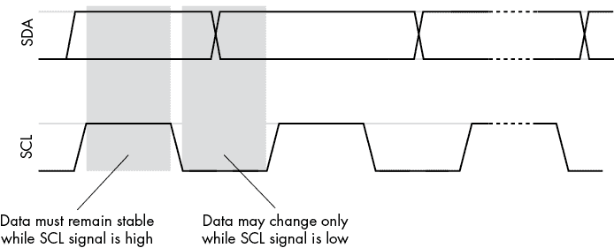
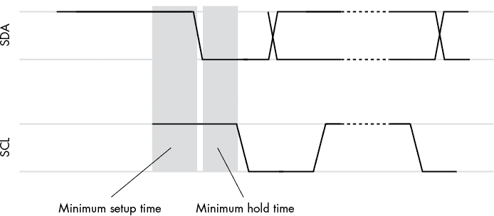
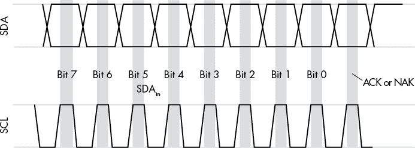
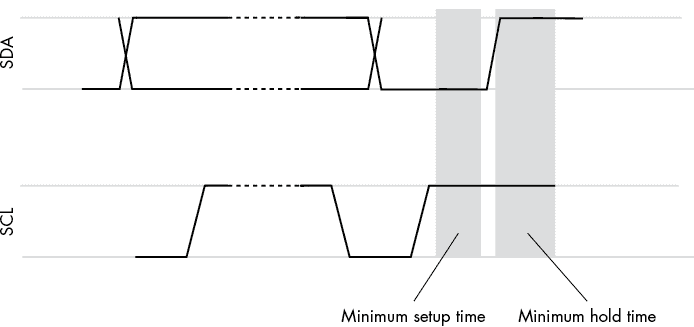
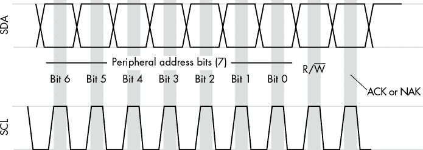
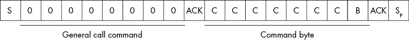
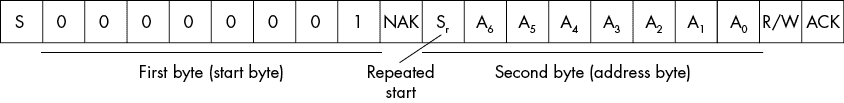
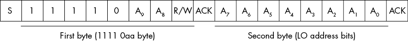

# 第二章：I²C 协议

I²C 总线的定义不仅仅是总线上出现的电气电平。同样重要的是定义出现在这两条线上的信号。本章讨论了与 I²C 总线相关的数据协议——即数据传输发生的速度，设备如何强制控制器等待，控制器如何执行以下操作：

+   向设备发送和接收位

+   指定设备的地址

+   指定数据方向

+   指定数据传输的结束

总线上出现的位的顺序和定义，以及它们如何在总线上被时钟控制，由 I²C *协议* 决定。本章描述了该协议，并讨论了一些有用的主题，如重置 I²C 总线和检测总线上的外设。

## 2.1 I²C 总线上的数据

I²C 总线通过 SDA 线串行传输数据，时钟由 SCL 信号控制（见图 2-1）。当 SCL 线为高电平（1）时，SDA 线上的数据必须保持稳定（0 或 1）；数据只能在 SCL 线为低电平时（见图 2-1）发生变化。

图 2-1：I²C 总线上的串行数据传输

I²C 总线上的数据传输由一个起始信号开始，随后是一个或多个字节的数据，最后以停止信号结束。在数据传输之间，SDA 和 SCL 线处于非激活状态（即两个信号都被拉高）。如前一章所述，如果 SCL 线保持高电平超过半个时钟周期，表示总线当前未使用。

起始条件是控制器将 SDA 线拉低，而 SCL 线已经保持高电平一段时间（见图 2-2）。如前所述（见图 2-1），SDA 线在时钟线高电平时通常必须保持稳定。这是为了让 I²C 总线上的设备能够检测到起始（以及稍后将看到的停止）条件。

通常，SCL 必须在 SDA 线变低并发送起始条件之前保持高电平，持续时间在四分之一和半个时钟周期之间。具体而言，这个起始设置时间是以下之一：

+   对于标准模式（10-微秒时钟周期）：4.7 微秒

+   对于快速模式（2.5-微秒时钟周期）：0.6 微秒

+   对于快速增强模式（1-微秒时钟周期）：0.26 微秒

一旦数据线变低，表示起始条件，控制器可以将 SCL 线拉低，开始在以下启动保持时间后进行数据时钟传输：

+   对于标准模式：4.0 微秒

+   对于快速模式：0.6 微秒

+   对于快速增强模式：0.26 微秒

图 2-2：I²C 总线上的起始条件

一个字节的传输包括 8 个数据位和一个确认位（见图 2-3）。8 位数据字节从 SDA 线上最重要的位（MSB）开始传输，最不重要的位（LSB）在八个时钟周期后传输。字节数据后紧跟一个确认位。如果接收设备确认数据，该位始终为 0；如果发生传输错误，该位为 1（NAK，或负确认）。

图 2-3：I²C 总线上的字节传输

请注意，数据总线上的数据可能由控制器或外设放置。在写操作中，控制器负责将数据放置到 SDA 线上；在读操作中，外设负责将数据放置到 SDA 线上。对于确认，角色是反转的：在读取时，控制器将 SDA 线拉低以确认从外设读取的数据；而在写入时，外设将 SDA 线拉低以确认写操作。如果由于某种原因传输失败，接收数据的设备将不会拉低 SDA 线进行确认。这样，SDA 线保持高电平（即 NAK）。下一节，“I²C 地址与读写控制”，将讨论控制器如何指定是否进行读写操作。

停止条件包括在保持 SCL 线为高电平的同时，将 SDA 线从低电平拉升到高电平（请记住，数据在时钟线为高电平时通常必须保持稳定）。这通常包括在数据传输结束时，将 SDA 线在 SCL 线最后的上升沿之前拉低，然后再将 SDA 线拉高，如图 2-4 所示。与启动条件类似，SCL 线必须在转换 SDA 线从低到高之前保持高电平一段时间（即*停止条件的设置时间*）。这些设置时间与启动条件相同，具体如下：

+   对于标准模式：4.7 微秒

+   对于快速模式：0.6 微秒

+   对于快速增强模式：0.26 微秒

一旦控制器生成停止条件，I²C 总线将空闲，经过适当的启动设置时间后，控制器可以重新占用并使用总线。

图 2-4：I²C 停止条件（S[p]）

停止条件并不是在每个字节之后都发生的。相反，停止条件标志着一串字节传输在 I²C 总线上完成。具体而言，一次单一（原子）传输包括一个启动条件，随后是一个或多个字节传输（每个字节都有其对应的确认或负确认位），最后是停止条件。这种传输被认为是原子的，因为驱动传输的控制器在整个传输过程中对 I²C 总线具有完全控制权；在此期间，其他控制器不能占用 I²C 总线。

## 2.2 I²C 地址与读写控制

启动条件后，第一个出现在 I²C 总线上的字节是特殊的。该字节包含了 I²C 设备地址和读/写状态。图 2-5 显示了外设地址和 R/W（读/写）字节的格式（W 上的下划线表示写信号为低有效 [0]）。

图 2-5：启动条件后的第一个字节（外设地址和 R/W 位）

该字节的高 7 位包含了该传输的目标外设地址。由于是 7 位，你最多可以在这个外设地址字节中指定 128 个外设地址（不过请参见本章后面的 2.5 节，“特殊地址”，了解有关 I²C 总线上的 10 位地址的信息）。该字节的 LO 位包含一个 R/W 标志。此位为 0 时，表示写操作；为 1 时，表示读操作。

R/W 位决定了在外设地址字节之后所有字节的数据传输方向。如果该位为 0（写操作），则控制器将在随后的字节中通过 SDA 线提供所有数据；如果该位为 1（读操作），则外设将在传输过程中通过 SDA 线放置数据。无论数据方向如何，控制器仍然负责驱动 SCL 线（不过请参见本章后面的 2.4 节，“时钟延伸”）。

通常，本书会将 I²C 地址表示为 7 位二进制或十六进制值（使用 C 表示法，0x*nn* 或 0b*nnnnnnn*）。完整的地址和 R/W 字节通常会以 8 位十六进制形式表示。

## 2.3 重复启动条件

在一些特殊情况下，控制器可能需要向某个特定外设写入数据，然后立即从该外设读取数据，这一过程必须是原子操作，且写操作与读操作之间不能允许其他控制器访问该外设。由于数据方向是由启动条件后的第一个字节中的 LO 位指定的，因此控制器必须发送另一个启动条件来改变方向。然而，如果控制器在发送另一个启动条件之前通过发出停止条件来完成当前传输，这将给其他控制器提供在第二次传输前抢占总线的机会。这意味着控制器需要通过不发送停止条件来保住总线。此操作通过重复启动条件来实现。

*重复启动条件*，顾名思义，是在没有中间停止条件的情况下（SDA 从高到低，SCL 保持高电平）第二次发起的启动条件。在直到出现停止条件之前（等待控制器在 I²C 总线上等待的条件），当前控制器拥有总线。因此，控制器可以在数据传输期间使用一系列重复启动来反转数据传输方向，甚至与多个外围设备进行通信，而无需放弃 I²C 总线。当原子操作完成时，控制器可以通过发出停止条件来释放总线。

在多控制器环境中，控制器应当注意避免垄断 I²C 总线。对于不需要原子性操作的任务，控制器应当在传输之间使用停止条件，以便不同的控制器能够公平地访问总线。

## 2.4 时钟拉伸

如前一章所述，时钟拉伸是一种技术，允许外围设备在处理数据时迫使控制器等待。例如，一个简单的外围设备轮询 SDA 和 SCL 线并手动处理传入数据，在每个字节之后可能需要一点时间。在此期间，控制器可能会传输更多的数据，而这些数据可能会在外围设备忙于处理时丢失。为了解决这个问题，外围设备可以使用时钟拉伸强制控制器暂停，直到外围设备的 CPU 处理完传入的数据。这有效地为数据传输增加了*等待状态*。

外围设备可以通过拉低 SCL 线来拉伸时钟。从技术角度讲，这可以在任何时候发生。然而，在从控制器向外围设备传输数据时，外围设备通常会在确认位后，SCL 线处于低电平时拉低 SCL 线，因为这是外围设备接收完整字节并需要处理数据的时刻。从外围设备向控制器传输数据时，如果外围设备需要额外时间来生成下一个要传输的字节，那么在完成字节传输后，外围设备拉低 SCL 线也是一个合适的时机。

请注意，时钟拉伸是 I²C 标准中的可选功能。事实上，大多数外围设备不支持时钟拉伸，因为它们可以以与控制器发送数据一样快的速度处理数据传输。虽然应该是比较少见的情况，但在某些情况下，控制器可能不支持时钟拉伸，例如当使用简单的微控制器设备构建一个多功能 I²C 控制器时，这个控制器必须处理许多不同的任务，从而导致性能问题。有关如何处理这种情况的详细信息，请参见本章末尾的“更多信息”。

## 2.5 特殊地址

使用 7 位地址时，你可能会以为 I²C 总线最多支持 128 个设备。实际上并非如此，原因有二。首先，I²C 标准为特殊用途保留了两组 8 个地址（0 到 7 和 120 到 127）。其次，I²C 使用其中一些保留地址来支持最多 10 位长度的扩展地址。理论上，这允许在总线上增加 1,024 个设备。

表 2-1 列出了当前为 I²C 总线定义的特殊地址。这些地址中出现的“无关位”(*xx*)可以是 0b00、0b01、0b10 或 0b11。大多数情况下，程序会为这些位提供 0b00。

表 2-1：特殊 I²C 地址

| **地址位** | **读/写** | **描述** |
| --- | --- | --- |
| 0000-000 | 0 | 通用呼叫地址 |
| 0000-000 | 1 | 启动字节 |
| 0000-001 | x^(*) | CBUS 地址 |
| 0000-010 | x | 为不同的总线格式保留 |
| 0000-011 | x | 预留以备未来使用 |
| 0000-1xx | x | 高速模式控制器代码 |
| 1111-0aa | 读/写 | 10 位外设寻址（关于 aa 位的讨论，请参见本章后面的第 2.5.6 节，“10 位外设寻址”） |
| 1111-1xx | 1 | 设备 ID |
| ^(*)x = “无关”并且可以是 0 或 1 |

以下小节将更详细地描述通用呼叫地址（包括硬件通用呼叫）、启动字节、CBUS、高速控制器模式、10 位寻址和设备 ID 特殊地址。还有几个地址预留用于未来设备扩展。现有的控制器不应使用这些地址，直到其使用在 I²C 标准中被定义。

### 2.5.1 通用呼叫地址

*通用呼叫地址*（0x00，读/写 = 0）是一个特殊的广播地址，可以寻址总线上的所有设备。读/写位始终为 0（写），因为你不能同时从所有设备读取数据，否则它们的返回值会互相干扰。

通用呼叫操作通常由至少两个字节组成：通用呼叫地址（0x00），后跟命令字节（参见 图 2-6）。通常，系统使用此命令通过单一的总线命令初始化所有响应通用呼叫操作的外设。

图 2-6：通用呼叫命令格式

当 B 位为 0 时，I²C 协议当前定义了以下命令（`ccccccc` 位）：

1.  `ccccccc` = 0b0000011：重置并设置外设可编程地址。

1.  `ccccccc` = 0b0000010：设置外设可编程地址，但不重置。

1.  `ccccccc` = 0b0000000：非法命令代码，不允许作为第二个字节。

*外围可编程地址*是一个可以通过外围设备上的硬件引脚设置的地址。许多设备在集成电路（IC）封装上包含引脚，可以指定多个不同的 I²C 地址，以便设备响应。这允许设计师例如将多个相同的 IC 连接到 I²C 总线上，并通过设置这些引脚的高电平或低电平来让它们响应不同的地址。例如，MCP4725 DAC 包含一个引脚，允许你通过将引脚连接到 Vcc 或 Gnd 来选择两个不同的 I²C 地址之一。通用调用命令 0x00/0x07（`ccccccc` = 0b0000011，`B` = 0）和 0x00/0x05（`ccccccc` = 0b0000010，`B` = 0）指示这些芯片从引脚加载地址（0x00/0x06 命令也指示外围设备重置自身）。

大多数外围 IC 会在上电时设置其编程地址，且该地址在此之后不会发生变化，因此大多数外围设备会忽略此命令，或仅对（0x00，0x06）命令执行复位操作。

请注意，外围设备不必支持通用调用命令——也就是说，其实现是可选的。如果设备不支持通用调用命令，它必须忽略此命令。

由于 I²C SDA 线的开漏特性，如果任何设备响应了通用调用地址和命令字节，控制器将看到一个 ACK 响应。只有当没有设备响应通用调用命令时，控制器才会看到 NAK 响应。

除（0x00，0x00）、（0x00，0x04）和（0x00，0x06）外的命令保留用于未来使用，设备必须忽略它们。然而，如果你正在为自定义系统创建自定义外围设备，你可以创建自己的通用调用命令。你甚至可以在命令字节后面传递附加数据，广播给所有响应该命令的设备。只需记住，I²C 协议的未来修订可能会与你的定义冲突。另外，请记住，你只能使用广播（通用调用）命令写入数据。

### 2.5.2 硬件通用调用

硬件通用调用是通用调用的一种特殊形式，支持点对点通信。如果图 2-6 中的`B`位为 1，则该 2 字节序列是*硬件通用调用*。`ccccccc`位指定了控制器的地址，控制器将该地址广播给所有设备，后面可以跟随 0 个或多个字节的附加数据。总线上的其他设备可以读取这些数据并进行相应的解释。通常，硬件通用调用是一个控制器设备与另一个控制器设备之间通信并传递数据块的方式。然而，为了使此方案有效，接收数据的第二个控制器设备必须在硬件通用调用中查找第一个控制器的地址。

商用设备中不会找到支持硬件总线调用的设备。通常，系统中彼此通信的定制编程控制器会使用这些消息。

老实说，与其设计这种协议到您的系统中，您可能更好地使用 CANBUS 或其他点对点网络方案在系统中的控制器之间传输数据。正如您可能预期的那样，很少有设备利用 I²C 协议中的此功能。大多数设备忽略硬件总线调用。

### 2.5.3 起始字节

起始字节（adrs = 0, R/W = 1）是在快速控制器和响应较慢的外设之间介入 I²C 通信的软件机制。一些低成本的外设设备偶尔只轮询 SDA 线，以查看是否存在起始条件。如果外设在实际起始条件到达时正忙于其他事务，则可能会错过其预期接收的消息。起始字节是序列 0x01（即地址为 0 且 R/W 位为高）。这些七个 0 位将在使用 100 kHz 时钟时分布在 70 微秒内，应足以让外设检测到 SDA 线已变低。

起始字节后总是跟随重复的起始条件和实际的外设地址字节（参见图 2-7）。请注意，起始字节永远不会被确认 —— 在起始字节后的第九位始终会跟随一个 NAK。同时请注意，起始字节与总线调用功能（参见图 2-6）共享相同的地址。区别在于 R/W 位；起始字节序列的 R/W 位置始终为 1，而总线调用操作在该位置为 0。

图 2-7：起始字节序列

如果外设设备速度较慢并且需要起始字节前缀，则控制器必须在与外设通信之前显式传输起始字节。同样地，如果外设设备速度较慢，则其软件必须识别起始序列的尾端，并准备好从总线上读取后续地址。

请注意，并非所有外设集成电路都支持起始字节。这意味着如果在 I²C 总线上发送起始字节来与响应较慢的设备通信，总线上的其他设备可能会误解此信号。如果要在 I²C 协议中使用此功能，请确保总线上的所有设备都能正确响应（至少忽略起始字节）。

### 2.5.4 CBUS 和保留地址

CBUS（adrs = 1, R/W = x [不重要]）是 I²C 总线的一个旧的、废弃的变种。CBUS 地址最初用于在 I²C 总线上激活 CBUS 设备。然而，现在不再使用此地址用于此目的，现代控制器不应将此地址放置在总线上。

### 2.5.5 高速模式控制器代码

高速模式控制器代码（地址 = 4 至 7，读/写 = x）是 I²C 协议用于在高速模式和较慢模式（标准、快速、快速+）之间切换的特殊地址。由于在 I²C 总线上实际使用高速模式的设备非常少，本书主要忽略了高速和超高速模式。有关高速控制器模式的更多信息，请参考 I²C 总线规范和用户手册（见“更多信息”）。

### 2.5.6 10 位外设寻址

对许多人来说，I²C 总线上的 7 位寻址方案，支持最多 112 个设备，似乎有限制。从多个角度来看，这实际上远远足够。然而，I²C 总线确实定义了一个特殊扩展，允许在总线上使用 10 位地址，从而在单个总线上增加最多 1,024 个地址（地址 = 0x78 至 0x7B）。

当特殊地址 0b1111000 (0x78)、0b1111001 (0x79)、0b1111010 (0x7A) 或 0b1111011 (0x7B) 作为启动条件后的第一个字节出现时，表示这是一个 2 字节地址序列的开始。该地址的低两个比特将成为结果的最重要（高位）2 位。随后会有第二个字节，包含地址的剩余（低位）8 位。有关详细信息，请参见图 2-8。

图 2-8：10 位地址格式

外设设备从以 0b11110*aa* 开头的两个字节构造 10 位地址。随后第三个字节开始的传输与使用 7 位地址的 I²C 传输相同，遵循第一个字节。

尽管拥有 10 位地址方案看起来合情合理，但在现实中几乎没有用。首先，很少有市售外设设备支持 10 位地址。理论上，你可以创建一个自定义外设设备来寻找 10 位地址。然而，这几乎没什么意义，因为在系统中找到一个未使用的 7 位地址并使用它可能同样容易。这样可以节省传输额外地址信息所需的额外 100 微秒（在 100 kHz 下），而 I²C 传输本身已经足够慢。

另一个问题是，112 个独特地址已经远远足够 I²C 总线使用。由于总线电容的限制，在同一物理总线上连接这么多设备几乎是不可能的。更不用说再添加 1,024 个设备了，这远远超出了总线的电气能力。

10 位地址的唯一优点是，它扩大了外设设计师在总线上放置多个相同设备的能力，从而减少了与其他设备发生地址冲突的可能性。例如，你可能希望将四个数模转换器放置在 I²C 总线上，但这样做可能会与其他你想使用的芯片发生地址冲突。使用 10 位地址可以给你更多的空间来分配外设的地址。然而，由于几乎没有外设 IC 支持扩展地址，这种方法并不实用。

请注意，如果你确实希望在设计中包括多个相同的 IC，并且可能发生地址冲突，另有一种解决方案：I²C 多路复用器。有关更多信息，请参见第十二章。

### 2.5.7 设备 ID

设备 ID 是另一个非常好的概念，但不幸的是，大部分设备并不支持该功能。其概念是让控制器传输“设备总线 ID”（0xF8，即地址 0x7C 加 R/W = 0），后面跟着外设地址。然后控制器进行重启，传输 0xF9（0x7C 加 R/W = 1），并从外设设备读取 3 字节数据：12 位指定制造商（由 NXP 半导体公司指定的值）、9 位指定部件号（由制造商分配），以及 3 位指定芯片（IC）版本。

从理论上讲，这将是一个很好的功能，可以用于识别总线上的设备。实际上，由于很少有芯片支持该功能，因此它几乎是一个没用的功能。然而，如果某个特定部件支持该功能，获取芯片版本信息还是有用的，因为它可能帮助你为该芯片的不同版本的 bug 编写工作绕过程序。

关于设备 ID 命令的更多信息，请参阅“更多信息”中的 I²C 总线规范和用户手册。

## 2.6 复位 I²C 总线

由于应用软件、设备驱动程序、固件或硬件中的错误，一些外设芯片可能会“锁死”并进入一个未知的，即非法的状态。有时，这意味着你失去了该芯片的功能，直到它被复位。更糟糕的是，有时该芯片会停机，同时拉低 SDA 或 SCL 线，导致从那时起 I²C 总线无法使用。在这种情况下，你将需要复位设备。

当然，你可以使用通用调用命令向系统中的所有设备发送复位命令。然而，这种方法存在一些问题：

+   并非所有设备都能响应通用调用/复位命令。

+   通用调用/复位命令会复位*每一个*正在监听该命令的设备。你可能不希望这样做，因为你需要重新初始化总线上的所有设备。

+   如果设备本身发生故障，可能无法响应通过 I²C 总线发送的软件命令。尤其是当它拉低 SDA 或 SCL 线时，命令将无法到达。

重置 I²C 总线需要硬件解决方案。一些设备支持 IC 上的*复位引脚*。通常，将该引脚拉低会重置设备并将其初始化为上电状态。一旦设备达到该状态，可能还需要进一步初始化，但这总比重置整个系统来恢复芯片要好。将设备的复位引脚连接到主 CPU 上可用的*通用输入输出(GPIO)* 引脚，可以在程序控制下通过编程方式重置设备。

当然，你可以将一条复位线连接到所有提供复位引脚的设备。但是，这会遇到与通用调用/复位命令相同的问题——你需要重置所有设备，并且必须重新初始化它们，才能修复单个 IC 的问题。

硬件复位方法的最大问题是，并非每个 I²C 外设都有复位引脚。对于没有复位引脚的设备，另一种解决方案是暂时切断 IC 的电源一段时间，然后重新恢复电源。这肯定会将芯片重置为上电状态。你可以使用一些晶体管来实现这一点。另一种解决方案是像 SparkFun Qwiic Power Switch（[`www.sparkfun.com/products/16740`](https://www.sparkfun.com/products/16740)）这样的现成设备。这是一个 I²C 外设，允许你开关其他 I²C 设备的电源，无论是为了重置还是低功耗待机操作。

## 2.7 在总线上检测 I²C 外设

程序员常常希望确定某个外设是否存在于 I²C 总线上的某个地址。理论上，设备 ID 操作（参见本章前面的 2.5.7 节“设备 ID”）可以提供这一功能。控制器可以在总线上发送设备 ID 特殊地址（0xF8），然后跟随设备地址进行检查。如果响应是 NAK，则该地址没有设备；如果返回 ID 响应，则控制器知道该地址有设备存在，并且 ID 信息准确地指定了设备。

使用设备 ID 方法的唯一问题是，外设支持设备 ID 命令是可选的。如果外设不支持设备 ID 命令，它只是不会响应请求。因此，尽管外设实际存在，但设备 ID 命令会表明它不存在。由于大量 I²C 外设 IC 不支持设备 ID 命令，这并不是检测这些外设的实用方法。

一个常见的解决方案是发送一个启动条件，一个带有高 R/W 位的地址字节（即读取操作），然后立即发送停止条件，而不等待外设返回任何数据。外设将确认地址字节。然而，停止条件将阻止外设实际将数据传回控制器。控制器可以检查 ACK 或 NAK 并使用该响应来确定指定地址处是否有外设存在。这不会告诉控制器哪个外设存在，但至少会给出“有设备”或“没有设备”的响应。这就是许多工具（如 Linux 的 `i2cdetect` 工具）工作的方式。

采用这种检测方法会遇到几个阻碍性问题。一个问题是，根据标准，SMBus 外设（SMBus 是 I²C 总线的一个变种；参见第五章第 5.1 节“SMBus”）可以将 R/W 位作为数据元素。例如，R/W 位可以根据你是读取地址还是写入地址，打开或关闭某些外部设备。如果你向这样的外设发送一个读取命令，并立即跟随一个停止条件，它可能会改变该设备的状态。如果设备之前是关闭的，发送读取命令可能会将状态改为开启（假设外设直接将 R/W 位的值复制到状态中，其中 1 = 开启 = R，0 = 关闭 = W）。显然，使用读取命令来检测设备的存在是不可取的，因为检测过程也可能改变设备的状态。

解决这个问题的一种方法是同时使用设备 ID 和“带立即停止条件的读取”命令。SMBus 标准要求所有设备都支持设备 ID 命令。如果你*首先*发出设备 ID 命令，并且存在 SMBus 设备，它会以适当的标识信息进行响应。如果从设备 ID 收到 NAK，则表示该地址没有 SMBus 设备，你可以尝试读取操作，看是否收到响应。如果仍然收到 NAK，你可以假设该地址没有设备。

当然，这假设只有那些将 R/W 位作为数据的设备才会支持设备 ID 命令。我见过唯一将 R/W 位作为数据使用的地方是 SMBus 文档，所以这个假设可能是安全的。当然，如果你自己创建外设并使用 R/W 位作为数据，你应该支持设备 ID 命令，以便检测软件能绕过这个问题。

将读取命令放到总线上并检查响应的另一个问题是，*只写*设备可能不会响应读取命令。Linux 的 `i2cdetect` 工具通过对某些地址进行读取、对其他地址进行写入，并提供命令行选项以强制执行特定类型的检测算法来解决这个问题。有关该技术的更多信息，请查看 `i2cdetect` 应用程序的源代码（有关 `i2cdetect` 的更多详细信息，请参阅“更多信息”）。

关键是，没有*完美*的方法来检测 I²C 总线上的外设设备。某些方案可能无法检测到已连接的设备；而其他方案则可能改变已连接设备的状态。最终，最好的检测方法是设计：了解系统中安装了哪些设备，并针对这些设备进行有意的编程。

## 2.8 创建自定义设备

对于大多数实际应用，你可能能找到一个与 I²C 总线接口并完全符合需求的集成电路。然而，也有可能你的应用过于专业，以至于没有任何现成的外设能够满足。幸运的是，你不必仅仅依赖现成的零件：你还可以自己创建 I²C 外设设备。有几种方法可以做到这一点，本书将介绍其中的几种。例如，下一章将讨论如何完全通过软件实现 I²C 控制器和外设设备。后续章节将讨论如何利用各种 SBC 上的 I²C 硬件来创建这些设备。你的创意是唯一的限制。

## 2.9 章节总结

本章讨论了 I²C 总线数据的格式——I²C 协议。这包括对 I²C 总线上的数据、I²C 地址和读写控制的描述，以及启动和结束 I²C 传输的特殊模式（启动和停止条件）。本章还描述了一种小优化：重复启动条件，并介绍了如何通过时钟拉伸在 I²C 传输中引入等待状态。

I²C 总线支持通过特殊地址实现多个功能，包括通用调用地址、硬件通用调用、启动字节、高速控制、10 位外设寻址和设备 ID。有关详细信息，请参阅本章中的相关部分。

本章最后讨论了如何重置 I²C 总线并检测 I²C 总线上的外设设备，同时简要讨论了如何创建自定义 I²C 外设。

下一章使用本章的信息，描述如何通过软件实现 I²C 协议。该章中的代码还提供了 I²C 协议的另一种视角，帮助那些倾向于查看正式（代码）描述的人更好地理解该协议。
