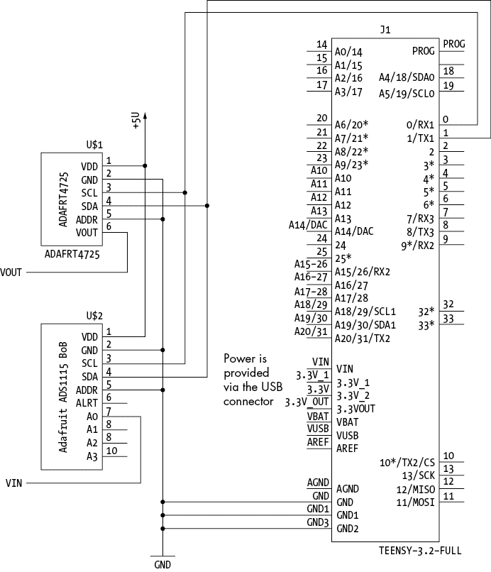
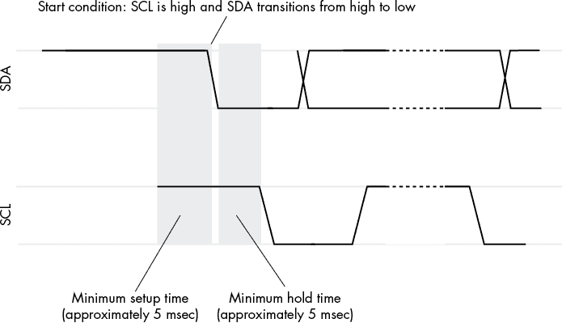
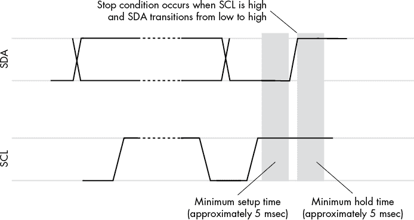

# 第三章：I²C 总线的软件实现


尽管广泛使用的大多数 I²C 功能是作为外围集成电路（IC）或 SBC 上的 CPU 的一部分提供的，但有时你可能需要为不提供 I²C 支持的硬件开发固件。在这种情况下，你将需要在软件中实现 I²C 协议。

本章展示了如何仅使用标准微控制器（MCU）上的 GPIO 引脚实现控制器和外围设备。我将以 Teensy 3.2 为例，尽管相同的原理适用于几乎任何具有至少两个可编程 I/O 引脚的设备。如果你想将这段代码用于其他 MCU，可能需要稍作调整和优化，特别是在性能较低、内存较少的 MCU 上，比如 Teensy 3.2。第十七章（在线阅读：[`bookofi2c.randallhyde.com`](https://bookofi2c.randallhyde.com)）提供了这样的优化示例。

本章并未提供一个即插即用的、现成可用的基于软件的 I²C 库。几乎任何你将在需要 I²C 的环境中使用的 MCU 都提供硬件支持——Teensy 3.2 本身提供了两个独立的硬件 I²C 总线。也就是说，软件实现使硬件发生的具体情况更加清晰，因此你将从学习这段代码中受益。

## 3.1 在 Teensy 3.2 上的软件 I²C 实现

Teensy 3.2 是一款 32 位 ARM（Cortex M4）处理器，运行频率为 72 MHz，尽管通常会超频到 96 MHz。它具有 256KB 的闪存用于存储代码，64KB 的 RAM 用于存储数据，2,048KB 的 EEPROM 用于非易失性存储，并且提供大量 I/O 接口，包括三个 UART、两个 I²C 总线和一个 SPI 总线，所有这些都集成在一块小型的——呃，*teensy*，大约 1.4 英寸 x 0.7 英寸——PCB 上。Teensy 配有自己的 3.3V 稳压器，因此处理器以 3.3V 运行，但所有 I/O 引脚均支持 5V 容忍。通常，你通过 Arduino IDE 编程 Teensy，大多数 Arduino 代码都能在 Teensy 3.2 上运行。

在 Teensy 3.2 上实现 I²C 的软件主要是一个教育性练习：由于 Teensy 3.2 支持两个硬件 I²C 接口，因此没有太多理由运行基于软件的 I²C 系统。Teensy 非常强大，可以用 C/C++编写 I²C 模块，而无需频繁使用硬件特定的代码。本章中的大部分代码是标准 Arduino 代码，这比为低功耗 MCU 优化的 I²C 代码更容易接近和理解。

以下小节描述了 Teensy 上基于软件的 I²C 系统的两种变体：控制器实现和外围设备实现。对于那些有兴趣了解基于硬件的 I²C 实现的读者，请参阅第六章和第十一章第 11.1 节《Teensy 4.*x*控制器编程》。

### 3.1.1 Teensy 3.2 的软件 I²C 控制器

列表 3-1 中的代码实现了一个基于软件的 I²C 控制器，它通过使用 Arduino 库调用，在 Teensy 3.2 上运行。我将在列出各个代码段之间的文本中讨论每个函数及其代码段。

这段代码仅用于演示如何在软件中实现 I²C 控制器，因此不要将其视为用于生产的 I²C 库模块。它旨在以具体和正式的方式阐明 I²C 协议，仅用于教育目的。

作为测试示例，本程序从 Adafruit ADS1115 I²C ADC 模块的输入 A0 读取一个值，将二进制输入转换为与 MCP4725 对应的范围，然后将结果写入 SparkFun MCP4725 DAC 模块（请参阅 图 3-1 中的接线图）。



图 3-1：基于 Teensy 控制器的电路示例

输入电压范围为 0 V 到 4.1 V 时，应在 DAC 输出端产生相似的电压。此示例程序测试了使用基于软件的 I²C 控制器软件对 I²C 外设的读取和写入。

`MCP4725_ADDR` 和 `ADS1115_ADDR` 符号指定了这些模块的地址。DAC 地址应为 0x60 或 0x61，具体取决于 SparkFun 板上的地址跳线（图 3-1 中的原理图将 ADDR 引脚接地，从而选择地址 0x60）。请注意，尽管 列表 3-1 中的代码写入了 SparkFun 板，你也可以写入 Adafruit MCP4725 扩展板。在这种情况下，DAC 地址为 0x62 或 0x63，具体取决于扩展板上的地址设置。ADS1115 地址为 0x48、0x49、0x4A 或 0x4B，具体取决于扩展板上的地址引脚跳线设置；图 3-1 中的原理图假设你将 ADDR 引脚接地使用地址 0x48。有关更多详细信息，请参阅 Adafruit 文档（在本章末尾的“更多信息”部分）。

以下代码片段开始于 列表 3-1，在本节中继续，并穿插有注释和说明。你可以在 [`bookofi2c.randallhyde.com`](https://bookofi2c.randallhyde.com) 找到完整的代码文件 *Listing3-1.ino*。

```
// Listing3-1.ino
//
// Software-based I2C controller device for
// the Teensy 3.2.
//
// Copyright 2020, Randall Hyde.
// All rights reserved.
// Released under Creative Commons 4.0.

#include <arduino.h>

// I2C address of the SparkFun MCP4725 I2C-based
// digital-to-analog converter.

#define MCP4725_ADDR 0x60
#define ADS1115_ADDR 0x48

// Pins on the Teensy 3.2 to use for the
// software SCL and SDA lines:

❶ #define SCL 0
#define SDA 1

// digitalWriteFast is a Teensy-specific function. Change
// to digitalWrite for standard Arduino.

❷ #define pinWrite digitalWriteFast 
```

`SCL` 和 `SDA` 符号定义了用于 I²C 时钟和数据线的 Arduino 基础引脚号 ❶。引脚 0 和 1 是任意选择的。任何可用的数字 I/O 引脚都可以正常使用。

`pinWrite` 符号映射到 Arduino 兼容的 `digitalWrite()` 函数 ❷。在正常情况下，这将是 `digitalWrite()` 函数本身。然而，Teensy 库有一个特殊的函数 `digitalWriteFast()`，它与 Arduino `digitalWrite()` 函数兼容调用，但通过将 `pinWrite()` 映射到 Teensy 函数，运行速度大约是原来的三倍。如果你打算在不同的 MCU 上运行此代码，请将定义更改为 `digitalWrite()`。

I²C 的 SDA 和 SCL 引脚是 *双向* 的；也就是说，控制器必须能够从这两条引脚读取数据，同时也能向它们写入数据。一般来说，Arduino 的 GPIO 引脚要么是输入，要么是输出，但不能同时兼具两者功能。为了模拟双向 I/O，Teensy 3.2 基于软件的 I²C 模块利用了 Arduino 兼容 GPIO 引脚可以在输入和输出之间动态切换的特性。在大多数情况下，控制器总是知道信号线何时需要为输入或输出，因此它可以即时切换引脚模式，以适应 I²C 总线的需求。

```
// Listing3-1.ino (cont.): 
//
// Pin set functions.
//
// setSCL-
//
// Sets the SCL pin high (1) by changing the pin mode to
// input and relying on the I2C bus pullup resistor to
// put a 1 on the bus.

❶ void setSCL( void )
{
    pinMode( SCL, INPUT );
}

// clrSCL-
// 
// Sets the SCL pin low by changing the pin mode to output and
// writing a 0 to the pin. This will pull down the SCL line.

❷ void clrSCL( void )
{
    pinMode( SCL, OUTPUT );
    pinWrite( SCL, 0 );
}

// setSDA, clrSDA-
// 
// Same as setSCL and clrSCL except they set/clr the SDA line.

❸ void setSDA( void )
{
    pinMode( SDA, INPUT );
}

❹ void clrSDA( void )
{
    pinMode( SDA, OUTPUT );
    pinWrite( SDA, 0 );
}
```

`setSCL()` ❶、`clrSCL()` ❷、`setSDA()` ❸ 和 `clrSDA()` ❹ 函数负责在 SCL 和 SDA 引脚上写入 0 或 1。向任一引脚写入 1 的过程是将相应的引脚切换为输入模式。这会将引脚置于高阻抗状态（开集电极或三态），而不会在引脚上输出实际信号。引脚上的上拉电阻随后将引脚拉高（1）。向任一引脚写入 0 的过程是将引脚模式更改为输出模式，然后将 0 写入该引脚。这会将引脚拉低，即使在有上拉电阻的情况下也是如此。

当你没有主动向 SCL 和 SDA 引脚写入 0 时，保持这些引脚的高电平是非常重要的。这不仅是软件的要求，也是 I²C 总线的一般要求——记住，其他设备可能正在试图将这些引脚拉低。

```
// Listing3-1.ino (cont.): 
//
// Reading the SCL and SDA pins.
//
// readSCL-
// 
// Reads SCL pin until it gets the same value twice in
// a row. This is done to filter noise.

❶ inline byte readSCL( void )
{
    byte first;
    byte second;
    do
    {
        first = digitalRead( SCL );
        second = digitalRead( SCL );
    }while( first != second );

    return first;
}

❷ // readSDA-
// 
// Reads SDA pin until it gets the same value twice in
// a row. This is done to filter noise.

inline byte readSDA( void )
{
    byte first;
    byte second;
    do
    {
        first = digitalRead( SDA );
        second = digitalRead( SDA );
 ❸ }while( first != second );
    return first;
}
```

`readSCL()` 函数❶读取当前 SCL 引脚上的数据。`readSDA()` 函数❷读取当前 SDA 引脚上的数据。I²C 标准要求对输入进行滤波，以去除持续时间小于或等于 50 纳秒（ns）的任何毛刺❸。通常，这通过主动滤波器（硬件）设计来实现。虽然可以将这样的硬件附加到微控制器的引脚上，但此软件实现的 I²C 包通过在软件中进行毛刺滤波来实现，方法是将所有输入读取两次，并且仅在连续两次读取相同值时返回。在大多数微处理器上，这将滤除长度明显大于 50 纳秒的毛刺。然而，由于该软件实现仅处理标准速度 I²C 操作（100 kHz），所以任何小于一微秒的信号都可能被视为噪声。

这些函数在读取之前并不会将引脚切换为输入模式。大多数情况下，这些函数会连续被调用几次，因此让调用者设置引脚模式比每次调用时让这些函数设置模式更高效。此外，有些代码调用这些函数来验证信号线在设置为 0 后是否已实际达到最终状态（处理由于总线电容等造成的延迟）。

```
// Listing3-1.ino (cont.): 
//
// Setting the start condition on the SCL and SDA lines.
//
// setStartCond-
//
// First checks to see if the bus is being used, which requires
// a full 10 usec. If the bus is being used by some other bus
// controller, this function returns false.
//
// If the bus is not being used, this function issues a start
// condition for 5 usec (SDA = 0, SCL = 1) and then raises SDL
// in preparation for an address byte transmission. If it
// successfully sends a start condition, this code returns true.
//
// Postcondition:
//     SDA and SCL will both be low if this function is 
//     successful. They will be unaffected if this function 
//     returns false.

❶ int setStartCond( void )
{
    byte bothPins;

    pinMode( SDA, INPUT ); // Going to be reading pins
    pinMode( SCL, INPUT );
    bothPins = readSDA() && readSCL();

  ❷ delayMicroseconds(1);
    bothPins &= readSDA() && readSCL();
    delayMicroseconds(1);
    bothPins &= readSDA() && readSCL();
    delayMicroseconds(1);
    bothPins &= readSDA() && readSCL();
    delayMicroseconds(1);
    bothPins &= readSDA() && readSCL();
    delayMicroseconds(1);
    bothPins &= readSDA() && readSCL();
    delayMicroseconds(1);
    bothPins &= readSDA() && readSCL();
    delayMicroseconds(1);
    bothPins &= readSDA() && readSCL();
    delayMicroseconds(1);
    bothPins &= readSDA() && readSCL();
    delayMicroseconds(1);
 bothPins &= readSDA() && readSCL();
    if( bothPins )
    {
        // Both pins have remained high for around 10 usec
        // (one I2C clock period at 100 kHz). Chances
        // are, the bus isn't currently being used.
        // Go ahead and signal the start condition
        // by setting SDA = 0.

      ❸ clrSDA();
        delayMicroseconds( 4 );
        clrSCL();
        return 1; // In theory, this code has the bus

    }
    return 0;     // Bus is busy

}
```

`setStartCond()` ❶ 函数允许调用者控制 I²C 总线。该函数处理两个主要任务：确保总线当前未被使用，然后如果总线可用，它会在总线上发送启动信号以占用总线。

为了检查总线是否已被使用，`setStartCond()` ❷ 函数每微秒检查一次 SCL 和 SDA 线，持续 10 微秒。如果在这 10 微秒内，任一线路为低（或变为低），则表示总线正在使用中，此函数返回失败（`0`）。如果两条线在此期间始终为高，说明总线空闲，代码可以占用总线进行使用。

为了获取总线，代码在总线上设置启动条件 ❸。该启动条件以两条线高电平持续 5 微秒（半个时钟周期）开始，接着 SDA 线从高电平转为低电平，然后 SDA 为低电平，SCL 为高电平，持续半个时钟周期（见 图 3-2）。



图 3-2：启动条件

如果 `setStartCond()` 函数成功地在总线上设置了启动条件，它会返回 `1` 作为函数结果。当此函数返回给调用者时，调用者会检查返回结果，以确定是否可以开始使用 I²C 总线，或者是否需要等待并尝试再次获取总线。

```
// Listing3-1.ino (cont.): 
//
// Outputting a stop condition on the SCL and SDA lines.
//
// setStopCond-
//
// Generates an end-of-transmission stop sequence.
//
// Precondition: 
//     SCL must be low when this is called.
// Postcondition: 
//     SCL and SDA will be high.

❶ void setStopCond( void )
{
    clrSDA();               // Initialize for stop condition
    delayMicroseconds( 1 ); // Give SDA time to go high
    setSCL();
    while( !readSCL() )
    {
        // Clock stretching-
        //
        // Wait while the peripheral is holding the clock
        // line low.
    }
    delayMicroseconds( 4 ); // SCL = 1, SDA = 0 for 5 usec
    setSDA();               // Signal stop condition
}
```

当软件完成数据传输或接收，并准备放弃 I²C 总线时，它必须在总线上设置停止条件，如 `setStopCond()` 代码 ❶ 所示。

图 3-3 显示了在 I²C 总线上出现的停止条件。`setStopCode()` 函数将 SCL 线拉高（同时 SDA 线为低），然后 5 微秒后再次拉高 SCL 线。



图 3-3：I²C 停止条件

以下代码演示了如何检测并等待停止条件。

```
// Listing3-1.ino (cont.): 
//
// Waiting for the stop condition to occur.
//
// waitForStop-
//
// If the bus is busy when this controller
// tries to use the I2C bus, this code
// must wait until a stop condition occurs
// before trying to use the bus again.
//
// Stop condition is:
//     SCL is high.
//     SDA goes from low to high.

void waitForStop( void )
{
    setSCL();   // Just make sure these are high;
    setSDA();   // they already should be

    do
    {

        while( !(readSCL() && !readSDA()) )
        {
                // Wait until the SCL line is high
                // and the SDA line is low
        }

        // Stop condition might have begun. Wait
        // for the data line to go high while
 // the SCL line remains high:

        while( !readSDA() && readSCL() )
        {
                // Wait for data line to go high
        }

        // Is the SCL line still high?
        // If not, you are just getting
        // some data and the code needs to 
        // repeat until SCL is high again.

    }while( !readSCL() );
}
```

如果其他控制器已经在使用 I²C 总线，软件必须等待直到该控制器完成总线操作。这发生在该控制器在总线上放置停止条件时。`waitForStop()` 函数监视总线，并等待停止条件出现（SCL 为高，SDA 从低转为高）。

```
// Listing3-1.ino (cont.): 
//
// Transmitting a single bit on the I2C bus.
//
// sdaOut-
//
// bit: 
//     Bit to transmit.
//     Transmits a single bit over the SDA/SCL lines.
//
// Returns:
//     1: If successful.
//     0: If arbitration failure or other error.
//
// Note: 
//     Caller is responsible for setting SCL and SDA
//     high if there is an arbitration fault.

int sdaOut( byte bit )
{
    bit = !!bit;    // Force 0/1

    // Take SCL low so you can write to the
    // data line. Wait until SCL is actually
    // low before proceeding:

  ❶ clrSCL();
    while( readSCL() );

    // Set the SDA line appropriately:

  ❷ if( bit )
    {
 setSDA();
    }
    else
    {
        clrSDA();
    }

    // Wait for 1/2 of the I2C clock period
    // while SCL is low:

  ❸ delayMicroseconds( 3 );

    // Check to see if the value put on
    // the SDA line can be read back. The code
    // needed to delay before this call in order 
    // to allow signal time to rise on the
    // SDA line.

  ❹ if( readSDA() != bit )
    {
        // If the bit just written does not
        // match the bit just read, then
        // the code must have written a 1 and
        // some other controller has written
        // a 0 to the SDA line. In this
        // case, the controller loses the 
        // arbitration test.

        return 0;
    }

    // Raise the SCL line to indicate to the
    // peripheral that the data is valid:

  ❺ setSCL();

    // Must hold SCL line high for 5 usec:

    delayMicroseconds( 4 );

    // Clock stretching or synchronization
    // is handled here. Wait for the SCL
    // line to go high (it can be held
    // low by the peripheral or by another
    // controller):

  ❻ while( !readSCL() )
    {
        // Wait for SCL to go high
    }

    // Return success

    return 1;
}
```

`sdaOut()` 函数向 I²C 总线写入单个比特。向 I²C 总线写入比特的过程包括以下步骤：

1.  将 SCL 线设置为低并验证其是否为低 ❶。除了启动和停止条件外，SDA 线只能在 SCL 线为低时发生变化。

1.  将位设置到 SDA 线 ❷。

1.  等待大约半个时钟周期 ❸。

1.  验证 SDA 线上的数据是否与刚刚写入的数据匹配（即验证总线争用没有发生）。如果数据不匹配，则失败（返回 0）❹。

1.  将 SCL 线设置为高 ❺。

1.  等待 SCL 线变高（时钟延展和同步）❻。

总线争用发生在两个控制器同时尝试访问总线时。如果此代码将 1 写入 SDA 线并读取回 0，表示另一个控制器正在写入 0，从而发生总线争用。I²C 仲裁规则是“谁写 0，谁赢”。如果此代码返回失败给调用者，必须停止传输，并在下一个停止条件到来时重新启动传输。

```
// Listing3-1.ino (cont.):
//
// Transmitting a byte on the I2C bus.
//
// xmitByte-
//
// Transmits a byte across the I2C bus.
//
// Returns:
//     1: If ACK received after the transmission.
//     0: If NAK received after the transmission or 
//        if there was bus contention (and this code
//        has to give up the bus).
//
// Precondition:  
//     SCL must be low.
//
// Postcondition:
//     If arbitration failure, SDA and SCL will 
//     both be high (to avoid conflicts with some 
//     other controller).
//
// If successful:
//     SCL will be low.

int xmitByte( byte xmit )
{
  ❶ int result = sdaOut( xmit & 0x80 ); // MSB first!
    if( result )
 result = sdaOut( xmit & 0x40 ); // Bit 6
    if( result )
        result = sdaOut( xmit & 0x20 ); // Bit 5
    if( result )
        result = sdaOut( xmit & 0x10 ); // Bit 4
    if( result )
        result = sdaOut( xmit & 0x8 );  // Bit 3
    if( result )
        result = sdaOut( xmit & 0x4 );  // Bit 2
    if( result )
        result = sdaOut( xmit & 0x2 );  // Bit 1
    if( result )
        result = sdaOut( xmit & 0x1 );  // Bit 0

    if( result )
    {
        // And now the code must wait for 
        // the acknowledge bit:

      ❷ clrSCL();
        delayMicroseconds( 1 );
        pinMode( SDA, INPUT );  // It's an input
        delayMicroseconds( 3 ); // 1/2 clock cycle

        // Raise the clock line and wait for it
        // to go high, which also handles clock
        // stretching and synchronization.

        setSCL();               // Raise clock line
        while( !readSCL() );

        // Note that the clock line is high, so
        // this code can read the SDA bit (acknowledge).

        delayMicroseconds( 3 ); // Data valid for 5 usec
        result = readSDA();

      ❸ clrSCL();               // Exit with SCL = 0
        while( readSCL() );
        return !result;
    }

    // If there is an arbitration failure,
    // then try to transmit a 1 bit while the
    // other controller transmits a 0 bit.
    // The 0 bit always wins, so this function 
    // sets SDA and SCL to 1 to avoid creating 
    // other problems for the other controller.

    setSCL();
    setSDA();
    return 0;   // Arbitration failure
}
```

`xmitByte()` 函数通过 I²C 总线传输一个完整的字节。显然，此函数调用 `sdaOut()` 八次来传输这 8 位 ❶。根据 I²C 标准，此代码按从 MSB 到 LSB 的顺序发送比特。如果任何一次调用 `sdaOut()` 返回失败，此函数也将返回失败。

字节传输结束时，代码将 SDA 线设为高电平，并在 SCL 线上发出额外的脉冲 ❷。在 SCL 为高电平时，代码读取 SDA 线。这会获取外设的确认位（0），或者如果没有确认，则为默认的 NAK（1）。如果传输得到正确确认，函数返回 `true`，否则返回 `false`。

在读取确认位后，代码将 SCL 设为低电平并持续读取该线，等待其实际变为低电平 ❸。

```
// Listing3-1.ino (cont.): 
// 
// Transmitting a sequence of bytes on the I2C bus.
//
// xmitBytes-
//
// Transmit a block of bytes (in write mode)
// via the I2C bus. adrs is the I2C device
// address. bytes is the array of bytes
// to transmit (after the address byte).
// cnt is the number of bytes to transmit
// from the bytes array. addStop is true
// if this function is to add a stop condition
// at the end of the transmission.
//
// Note that, including the address byte,
// this function actually transmits cnt + 1
// bytes over the bus.

int xmitBytes
(
    byte adrs,
    byte bytes[],
    int cnt,
    int addStop
)
{
    int result;

    // Send the start condition.

    result = setStartCond();
    if( result )
    {
        // If bus was not in use, transmit
        // the address byte:

        result = xmitByte( adrs << 1 );
        if( result )
        {
            // If there wasn't bus contention,
            // ship out the bytes (as long as
 // bus contention does not occur):

            for( int i=0; i < cnt; ++i )
            {
                result = xmitByte( bytes[i] );
                if( !result ) break;
            }
        }
        // If the transmission was correct to this
        // point, transmit the stop condition.
        // Note: if addStop() is false, don't send a 
        // stop condition after this transmission
        // because a repeated start is about
        // to happen.

        if( result && addStop )
        {
            setStopCond();
        }
    }
    return result;
}
```

`xmitBytes()` 函数处理完整的 I²C 写入传输。调用者传递给它外设的 I²C 地址、一个字节数组（以及一个计数），以及一个特殊的“停止”标志，函数会发送适当的起始条件和地址字节，并写入所有数据字节。如果 `addStop` 标志为 `true`，则该函数还会在传输结束时附加一个停止条件。如果 `addStop` 为 `false`，则该函数在没有停止条件的情况下传输数据——可能是因为你希望保持 I²C 总线并在稍后发出重复的起始条件。

此函数根据传输的成功或失败返回 `true` 或 `false`。如果此函数返回 `false`，可能是总线已被占用或发生了总线争用，并且该代码未能赢得仲裁。无论原因是什么，如果此函数返回 `false`，调用者必须稍后重试传输。

```
// Listing3-1.ino (cont.): 
//
// Receiving a single bit on the I2C bus.
//
// sdaIn-
//
// Retrieves a single bit from the SDA line.

byte sdaIn( void )
{

    // Take SCL low before writing to the
    // data line. Wait until SCL is actually
    // low before proceeding:

    clrSCL();
 while( readSCL() );

    // Wait for 1/2 clock period for 
    // the peripheral to put the data
    // on the SDA line:

    delayMicroseconds( 4 );

    // Bring the clock line high.

    setSCL();

    // Wait until it actually goes high
    // (stretching or syncing might be
    // happening here).

    while( !readSCL() );

    // Wait for 1/2 of the I2C clock period
    // while SCL is high:

    delayMicroseconds( 3 );

    // Read the data from the SDA line:

    byte input = readSDA();

    // Hold SCL line high for the
    // remainder of this 1/2
    // clock period:

    delayMicroseconds( 2 );

    // Return result.

    return input;
}
```

`sdaIn()` 函数从 I²C 总线读取单个位。此函数类似于 `sdaOut()`，不同之处在于它是从 SDA 读取数据，而不是写入数据。此外，读取时无需检查仲裁失败，尽管该函数仍然处理时钟拉伸和同步。虽然数据来自外设，但仍由控制器负责驱动 SCL 线上的时钟信号。

```
// Listing3-1.ino (cont.):
//
// Receiving a byte on the I2C bus.
//
// rcvByte-
//
// Receives a byte from the I2C bus.
//
// Precondition:  
//    SCL must be low.
// Postcondition: 
//    SCL will be low.

byte rcvByte( void )
{
    setSDA();           // Before reading inputs
    byte result = sdaIn()  7;
    result |= sdaIn() << 6;
    result |= sdaIn() << 5;
    result |= sdaIn() << 4;
    result |= sdaIn() << 3;
    result |= sdaIn() << 2;
    result |= sdaIn() << 1;
    result |= sdaIn();

    // Generate the ACK bit:

    clrSCL();
    while( readSCL() ); // Wait until it's low
    delayMicroseconds( 2 );
    clrSDA();
    delayMicroseconds( 2 );
    setSCL();
    while( !readSCL() )
    {
        // Wait until SCL goes high (could be
        // waiting for stretching or syncing).
    }
    delayMicroseconds( 4 );

    // Leave SCL low for the next byte
    // or the beginning of the stop
    // condition:

    clrSCL();
    return result;

}
```

`rcvByte()` 函数通过调用 `sdaIn()` 函数八次从 I²C 总线读取一个 8 位字节。在函数读取完这 8 位之后，控制器需要在 SDA 线上放置 ACK 信号（即 0），以告知外设所有操作顺利完成。此函数返回读取的字节作为函数结果。

```
// Listing3-1.ino (cont.): 
//
// Receiving a sequence of bytes on the I2C bus.

int rcvBytes( byte adrs, byte bytes[], int cnt, int addStop )
{
 int result;

    // Send the start condition.

    result = setStartCond();
    if( result )
    {
        // If bus was not in use, transmit
        // the address byte:

        result = xmitByte( (adrs << 1) | 1 );
        if( result )
        {
            // Read the specified number of
            // bytes from the bus:

            for( int i=0; i < cnt; ++i )
            {
                bytes[i] = rcvByte();
            }
        }

        // If no errors at this point, transmit
        // the stop condition.
        // Note: if addStop is false, don't send
        // a stop condition after this transmission
        // because a repeated start is about
        // to happen.

        if( result && addStop )
        {
            setStopCond();
        }
    }
    return result;
}
```

`rcvBytes()` 函数是 `xmitBytes()` 函数的输入模拟。它获取 I²C 总线，传输一个启动条件；发送带有高 R/W 位的地址字节；然后从外围设备接收指定数量的字节。可选地，接收字节后，此函数会传输一个停止条件。

直到目前为止，*Listing3-1.ino* 的代码是实现基于软件的 I²C 控制器所需的完整例程。*Listing3-1.ino* 的其余部分包含了常规的 Arduino 初始化（`setup`）和主 `loop` 函数。

```
// Listing3-1.ino (cont.): 
//
// Arduino setup() function for Listing3-1.ino.
//
// Standard Arduino initialization code:

void setup( void )
{
    pinMode( SCL, INPUT ); // Begin with SCL/SDA = 1
    pinMode( SDA, INPUT );

    Serial.begin( 9600 );
    delay( 1000 );
    Serial.println( "teensyTest" );
}
```

`setup()` 函数将 SCL 和 SDA 引脚设置为输入，以便它们保持在高电平状态，避免与其他控制器产生干扰。

```
// Listing3-1.ino (cont.): 
//
// Arduino main loop() function for Listing3-1.ino.
//
// Arduino main loop:

void loop( void )
{
    static  int     result;
    static  word    adcValue;
    static  byte    bytes[16];

    // Read a 12-bit value from
    // an Adafruit ADS1115 breakout
    // board. The following configuration
    // is for:
    //
    // * AIN[0]
    // * 0-4.096 V operation
    // * 1600 samples/second
    // * Disabled comparator

    adcValue    = 0;
    bytes[0]    = 1;        // Point at config reg
    bytes[1]    = 0xc2;     // MSB of config
    bytes[2]    = 0x03;     // LSB of config

    // adcValue = ADS1115.readADC_SingleEnded( 0 );
    // Serial.print( "ADC: ");
    // Serial.println( adcValue, 16 );

    result  = xmitBytes( ADS1115_ADDR, bytes, 3, true );
    if( result )
    {
    // Point at the conversion register. Note that
    // this is a repeated start condition command
    // but ends with a stop condition.

        bytes[0] = 0;
        result = xmitBytes( ADS1115_ADDR, bytes, 1, true );

        // Read the ADC value from the ADS1115.

 if( result )
        {
            // This really should go into a loop
            // testing bit 16 of the config (status)
            // register, but this is easier:

            delay( 1 );

            result = rcvBytes( ADS1115_ADDR, bytes, 2, true );
            if( result )
            {
                adcValue = (bytes[0] << 8) | bytes[1];
            }
        }
    }

    // Start by writing 64 (0x40) to
    // the DAC register (command byte
    // which states that the next two
    // bytes go into the DAC register).

    bytes[0] = 64;

    // The next two bytes to write are the
    // 12 bits of the DAC value. The HO
    // 4 bits are put in the first byte
    // and the LO 8 bits appear in the
    // second byte.

    float volts = (((float) adcValue) * 4.096 / 32768.0 );
    Serial.print( "Volts: " ); Serial.print( volts, 3 );
    adcValue    = (word) (volts * 65536.0/5);
    bytes[1]    = (adcValue >> 8) & 0xff;
    bytes[2]    = (adcValue & 0xf0);

    // Transmit the data to the DAC IC:

    if( !xmitBytes( MCP4725_ADDR, bytes, 3, true ) )
    {
        // If there was an arbitration failure,
        // wait for a start condition to come along.

        waitForStop();
    }
    Serial.println();
    delay( 100 );

}
```

主 `loop()` 函数从 ADS1115 模拟到数字转换器（ADC）读取数据，翻译输入，并将数据写入 MCP4725 数字到模拟转换器（DAC）。尽管转换不是完美的，但这有效地将 ADC 上 A0 的输入电压复制到 DAC 上的模拟输出。

如前所述，这段代码只是一个示例，用来演示如何在软件中实现 I²C 控制器，因此并不真正打算用于实际应用。一方面，它是使用标准函数编写的，而不是类和方法，这使得它更容易理解，但使用起来更困难。它也可能无法直接移植到其他 MCU；尽管我主要使用标准 Arduino 调用编写了这段代码，但我通过逻辑分析仪运行了它，并手动调节所有延迟，以在 96 MHz 的 Teensy 3.2 上产生合理的时序。我怀疑在其他更快或更慢的 MCU 上，时序值可能会有所不同。

这段代码的另一个问题是，它使用一对 I/O 引脚作为 SDA 和 SCL 线。在引脚上不断改变数据方向以使其双向是软件 I²C 实现中的标准做法。虽然这种方法在单控制器环境中以及与不实现太多可选功能的外围设备配合使用时可能效果很好，但我不确定它在多控制器环境中能否完美工作。不幸的是，可能存在的竞争条件——基于程序执行时序的可能错误计算——很难创建（用于测试）。

### 3.1.2 基于软件的 Teensy 3.2 I²C 外围设备

上一节提供了 I²C 控制器设备的软实现。本节提供了该实现的配套部分：一个软件控制的 I²C 外围设备。本节中的代码将 Teensy 3.2 转换为具有以下特性的 I²C 外围设备：

+   它保存任何写入的数据字节值。

+   当控制器从中读取一个字节时，它返回最后写入的值，如果没有先前写入的字节，则返回 0。

实际上，这段代码将 Teensy 转变为一个 1 字节的 I²C 存储单元。虽然这是一个简单的 I²C 外设，但它完全展示了你开发自己基于软件的 I²C 外设所需的一切。

在许多方面，外设的软件更容易编写。外设无需担心总线争用、时钟同步等问题。另一方面，外设需要响应几个控制器不必担心的可选消息。

以下代码忽略了所有保留的地址值。对于通用调用地址复位功能，可能合理将存储的内存值设置为 0（尽管如果你想的话，可以轻松地将 0 写入该外设）。你也可以为这个外设创建一个设备 ID；我将这个任务留给你。

列表 3-2 提供了这个简单外设的源代码。

```
// Listing3-2.ino
// 
// Software-based I2C peripheral device for
// the Teensy 3.2.
//
// Copyright 2020, Randall Hyde.
// All rights reserved.
// Released under Creative Commons 4.0.

#include <arduino.h>

// Pins on the Teensy 3.2 to use for the
// software SCL and SDA lines:

#define SCL 0
#define SDA 1

// PeriphAddress is the address of this PeripheralAddress.

#define PeriphAddress (0x50)
#define PeripheralAddress ((PeriphAddress) << 1)

// digitalWriteFast is a Teensy-specific function. Change
// to digitalWrite for standard Arduino.
// Likewise, digitalReadFast changes to digitalRead for
// standard Arduino.

#define pinWrite digitalWriteFast
#define pinRead  digitalReadFast
```

至于控制器代码，两个标识符 `SCL` 和 `SDA` 定义了 Teensy 3.2 上将用于 SCL 和 SDA 线的引脚编号。`PeriphAddress` 定义指定了该外设响应的 I²C 地址。为了完成定义，`pinRead` 和 `pinWrite` 扩展为 Teensy 特定的（快速）版本的 Arduino `digitalRead()` 和 `digitalWrite()` 函数。

```
// Listing3-2.ino (cont):  
// 
// Pin control functions.
//
// setSCL-
// 
// Sets the SCL pin high (1) by changing the pin mode
// to input and relying on the I2C bus pullup resistor
// to put a 1 on the bus.

❶ void setSCL( void )
{
    pinMode( SCL, INPUT );
}

// clrSCL-
//
// Sets the SCL pin low. Changes the pin mode to output and
// writes a 0 to the pin to pull down the SCL line. Used
// mainly for clock stretching.

❷ void clrSCL( void )
{
    pinMode( SCL, OUTPUT );
    pinWrite( SCL, 0 );
}

// setSDA, clrSDA-
//
// Same as setSCL and clrSCL except they set or clr the SDA line.

❸ void setSDA( void )
{
    pinMode( SDA, INPUT );
}

❹ void clrSDA( void )
{
    pinMode( SDA, OUTPUT );
    pinWrite( SDA, 0 );
}

❺ // readSCL-
//
// Reads SCL pin until it gets the same value twice in
// a row. This is done to filter noise.

inline byte readSCL( void )
{
    byte first;
    byte second;
    do
    {
        first = pinRead( SCL );
        second = pinRead( SCL );
    }while( first != second );
    return first;
}

❻ // readSDA-
//
// Reads SDA pin until it gets the same value twice in
// a row. This is done to filter noise.

inline byte readSDA( void )
{
    byte first;
    byte second;
    do
    {
 first = pinRead( SDA );
        second = pinRead( SDA );
    }while( first != second );
    return first;
}
```

`setSCL()` ❶、`clrSCL()` ❷、`setSDA()` ❸ 和 `clrSDA()` ❹ 函数直接从控制器代码复制过来；它们设置或清除 SCL 和 SDA 线。同样，`readSCL()` ❺ 和 `readSDA()` ❻ 函数（同样来自控制器代码）读取 SDA 和 SCL 线上的当前值。更多细节请参考 *Listing3-1.ino* 中以 `Pin set functions` 和 `Reading the SCL and SDA pins` 注释开头的部分。

```
// Listing3-2.ino (cont.): 
//
// Transmitting a single bit on the I2C bus.
//
// sdaOut-
//
//     bit: Bit to transmit.
//     Transmits a single bit over the SDA/SCL lines.
//
// Returns:
//     1: If successful.
//     0: If arbitration failure or other error.

void sdaOut( byte bit )
{
    unsigned long time;

    bit = !!bit;    // Force 0/1

    // Wait until SCL is low.
    // It's okay to change SDA
    // when SCL is low:

  ❶ while( readSCL() );

    // Set the SDA line appropriately.

  ❷ if( bit )
    {
        setSDA();
    }
    else
    {
        clrSDA();
    }

    // Wait for the SCL line to go high and
    // then back to low. After that, release
    // the SDA line by setting it to 1.

  ❸ while( !readSCL() );

 time = micros() + 15;
    while( readSCL() )
    {
        // If stuck in this loop for
        // more than 15 usec, then bail.
        // Need a timeout so it doesn't
        // hold SDA low for an extended
        // period of time.

      ❹ if( micros() > time ) break;
    }

    // Release the SDA line by setting it high.

    setSDA();
}
```

`sdaOut()` 函数在响应 SCL 时钟过渡时，将一个作为参数传递的单个位放置到 SDA 线上。与控制器代码不同，外设代码不控制 SCL 线。相反，控制器必须脉冲时钟线。

1.  `sdaOut()` 函数必须等待时钟线变低 ❶。

1.  然后，它可以将数据写入 SDA 线 ❷。

1.  最后，它等待 SCL 线变高然后再变低，之后返回 ❸。

注意，这段代码在等待 SCL 线变高时有一个超时机制。如果由于某种原因，控制器没有将 SCL 线重新拉高，这段代码将在大约 15 微秒后跳出等待循环，而不是一直挂起 ❹。

```
// Listing3-2.ino (cont.): 
//
// Transmitting a byte on the I2C bus.
//
// xmitByte-
//
// Transmits a whole byte by call sdaOut
// eight times.

void xmitByte( byte xmit )
{
    unsigned long time;

  ❶ sdaOut( xmit & 0x80 );
    sdaOut( xmit & 0x40 );
    sdaOut( xmit & 0x20 );
    sdaOut( xmit & 0x10 );
    sdaOut( xmit & 0x8 );
    sdaOut( xmit & 0x4 );
    sdaOut( xmit & 0x2 );
    sdaOut( xmit & 0x1 );

 // The controller will generate the ACK
    // bit. This code will ignore it.
    // However, it does have to wait for
    // the clock pulse (low->high->low)
    // to come along.

  ❷ while( readSCL() ); // Wait for low clock

    time = micros()+25;
    while( !readSCL() )
    {
        // Wait until SCL goes high (could be
        // waiting for stretching or syncing).
        // Bail if there is a timeout, though.

      ❸ if( micros() > time ) break;
    }

    // Okay, SCL is (probably) high; wait for it
    // to go low again:

    while( readSCL() );
}
```

`xmitByte()` 函数通过调用 `sdaOut()` 八次在 SDA 线上发送一个 8 位字节 ❶。这段代码还会消耗第九位的时钟周期——确认位 ❷——尽管它忽略了该位的状态，因为一些控制器不会将 ACK 位放到 SDA 线上。这段代码也有一个超时机制 ❸，以防在等待确认位时 SCL 线始终未变高。

```
// Listing3-2.ino (cont.): 
//
// Receiving a single bit on the I2C bus.
//
// sdaIn-
//
// Retrieves a single bit from the SDA line.
// Note: no timeout on the loops because this
// code doesn't mess with the SDA line.

byte sdaIn( void )
{
    byte input;

  ❶ while( readSCL() );

    // Wait until the SCL line is high.
    // That is when data will be valid
    // on the SDA line:

  ❷ while( !readSCL() );

 // Wait for a small amount of time for the
    // controller's data to be stabilized
    // on the SDA line:

  ❸ delayMicroseconds( 1 );

    // Read the data from the SDA line:

    input = readSDA();

    // Return result:

    return input;
}
```

`sdaIn()` 函数用于读取 SDA 线路上的一个比特。它首先等待 SCL 线路变为低电平 ❶，如果它已经是低电平则不做处理。然后它等待 SCL 线路变为高电平（读取周期的开始），因为只有在时钟线为高电平时，SDA 数据才是有效的 ❷。一旦时钟线变为高电平，该函数会延迟一个微秒，以便给数据时间稳定，然后从 SDA 线路读取数据 ❸。

```
// Listing3-2.ino (cont.): 
//
// Receiving a byte on the I2C bus.
//
// rcvByte-
//
// Receives a byte from the I2C bus.

byte rcvByte( void )
{
    unsigned long time;

    pinMode( SDA, INPUT );

    // Read 8 bits from the SDA line:

  ❶ byte result7 = sdaIn() << 7;
    byte result6 = sdaIn() << 6;
    byte result5 = sdaIn() << 5;
    byte result4 = sdaIn() << 4;
    byte result3 = sdaIn() << 3;
    byte result2 = sdaIn() << 2;
    byte result1 = sdaIn() << 1;
    byte result0 = sdaIn();
    byte result = result7
        |   result6
        |   result5
        |   result4
        |   result3
        |   result2
        |   result1
        |   result0;

 // Generate the ACK bit.
    // Wait for the SCL line to go low,
    // pull SDA low, then wait for the
    // SCL line to go high and low:

    while( readSCL() );

  ❷ clrSDA();
    time = micros()+25;
    while( !readSCL() )
    {

    // Wait until SCL goes high (could be
    // waiting for stretching or syncing).
    // Bail if there is a timeout, though.

        if( micros() > time ) break;
    }

    // Okay, SCL is (probably) high; wait for it to go
    // low again and then release the SDA line:

    while( readSCL() );
    setSDA(); // Set SDA high (releases SDA)

    return result;
}
```

`rcvByte()` 函数调用 `sdaIn()` 函数八次，以从 I²C 总线读取一个字节 ❶。在这 8 位数据 ❷ 结束时，函数必须将 SDA 线路拉低以确认数据：即 ACK 位。该函数在 SCL 线路为低电平时将 SDA 线路拉低，并在 SCL 线路为高电平时释放 SDA 线路，同时执行常规的超时检查，以防控制器将 SCL 线路保持高电平过长时间。

```
// Listing3-2.ino (cont.): 
//
// Waiting for a start condition, while allowing other work.
//
// waitForStart-
//
// Wait until a start condition arrives.
// The peripheral address byte will follow.
//
// Start condition is:
//
//    SCL is high.
//    SDA goes from high to low.
//
// An address byte immediately follows the
// start condition. Read it. Return
// one of the following values:
//
// Negative:
//           Address does not match or
//           start condition yet to be
//           received.
//        0: Address match, R/W = 0 (W)
//        1: Address match, R/W = 1 (R)
//
// This function is a state machine that
// rapidly returns. It has the following
// states:
//
// -1: Waiting for SCL and SDA to both
//     be high.
// -2: SCL and SDA are both high, waiting
//     for SDA to go low.

int waitForStart( void )
{
    static int  state = -1;
    byte        sdaVal;
    byte        sclVal;

    switch( state )
    {
        case -1:

            // Wait until the SCL line is high and the
            // SDA line is high.

            if( readSCL() && readSDA() )
            {
                state = -2;
            }
            return state;

        case -2:

            // Start condition may have begun. Wait
            // for the data line to go low while
            // the SCL line remains high:

            sdaVal = readSDA();
            sclVal = readSCL();
            if( !sdaVal && sclVal )
            {
                break;
            }

            // If code sees anything other than
            // SCL = 1 and SDA = 1 at this point,
            // it has to reset the state machine
            // to -1.

            if( !( sclVal && sdaVal ) )
            {
 state = -1;
            }
            return state;

        // Just a fail-safe case:

        default:
            state = -1;
            return state;

    }   // Switch

    // Reset the state machine for the next invocation:

    state = -1;

    // Okay, there is a start condition.
    // Read the address byte.

    byte address = rcvByte();
    if( (address & 0xFE) == PeripheralAddress )
    {
        return address & 1;
    }
    return -1;  // Not our address
}
```

`waitForStart()` 函数实际上并不会等待开始条件的发生。相反，它是一个状态机，在每次调用时，根据 SDA 和 SCL 线路的状态在各个状态之间切换。该函数返回 0、1 或某个负数。

返回 0 表示地址匹配并进行写操作。返回值 1 表示地址匹配并进行读操作。负值返回则表示尚未出现感兴趣的内容，调用者应在不久的将来再次调用此函数，足够快以捕捉到即将到来的开始条件。

`waitForStart()` 函数被这样编写——而不是直到开始条件和有效地址出现后才返回——是因为这样可以让 CPU 在等待开始条件的同时执行其他工作。

```
// Listing3-2.ino (cont.): 
//
// Standard Arduino setup() function.
//
// Standard Arduino initialization code:

void setup( void )
{
    pinMode( SCL, INPUT ); // Begin with SCL/SDA = 1
    pinMode( SDA, INPUT );

    Serial.begin( 9600 );
 delay( 1000 );
    Serial.println( "teensy Peripheral Test" );
}
```

标准的 Arduino `setup()` 函数仅初始化 SDA 和 SCL 线路为输入，将这两条线路置为 1，以确保此外设不会干扰总线上正在进行的任何其他活动。此特定代码还会将一条调试信息打印到 `Serial` 输出。

```
// Listing3-2.ino (cont.): 
//
// Standard Arduino loop() function.
//
// Arduino main loop:

void loop( void )
{
    static byte memory = 0; // Holds I2C memory byte

    // Wait for a start condition to arrive.
    // If not a start condition yet, just
    // keep looping.
    //
    // Assumption: Arduino code outside this
    // loop takes less than about 5 usec
    // to execute. If that is not the case,
    // then waitForStart() should be called
    // in a hard loop to continuously poll
    // for a start condition.

    int gotStart = waitForStart();

  ❶ if( gotStart == 0 )         // Write request
    {
        // On write operation, read the next byte
        // coming from the I2C bus and store it
        // into the memory location.

        memory = rcvByte();

        Serial.print( "Memory=" );
        Serial.println( memory, 16 );
    }
  ❷ else if( gotStart == 1 )    // Read request
    {
        // On a read request, transmit the
        // value in memory across the I2C bus.

        xmitByte( memory );
        Serial.print( "Transmitted " );
        Serial.println( memory );

    }
 ❸ // else: not of interest to us.

}
```

Arduino 的循环函数是外设程序的主体。它调用 `waitForStart()` 函数并检查返回值。它处理以下三种情况：

1.  0：发生写入操作（控制器向外设写数据）。在这种情况下，代码从 I²C 总线读取下一个字节，并将其存储到内存位置 ❶。

1.  1：发生读取操作（控制器正在读取外设）。在这种情况下，代码将内存变量的值写入 I²C 总线，作为控制器时钟输出下一个字节 ❷。

1.  负值：在这种情况下，主循环不做任何事情；它只是返回给调用者，调用者在完成一些内部记录工作后会再次调用 `loop()` 函数 ❸。

清单 3-3 是我用来测试出现在清单 3-2 中的软件基础 I²C 外设代码的一个简短的 Teensy 3.2/Arduino 程序。

```
// Listing3-3.ino
//
// Software-based I2C test program.

#include <Wire.h>
#define LED 13

void setup( void )
{
    Serial.begin( 9600 );
    delay( 1000 );
    Serial.println( "test.ino" );
    Wire.begin();
    pinMode( LED, OUTPUT );
}

void loop( void )
{
    static byte value = 0;

    digitalWrite( LED, 0 );
    Serial.print( "Writing: " );
    Serial.print( value, 16 );
    Wire.beginTransmission( 0x50 );
    Wire.write( value );
    Wire.endTransmission();
    delay( 250 );

    digitalWrite( LED, 1 );
    Wire.requestFrom( 0x50, 1 );
    while( Wire.available() )
 {
        byte data = Wire.read();
        Serial.print( ", read=" );
        Serial.print( data, 16 );
        Serial.print( ", value=" );
        Serial.print( value, 16 );
    }
    Serial.println();
    ++value;
    delay( 250 );
}
```

Listing 3-3 中的代码可以在 Teensy 3.2 或几乎任何 Arduino 兼容系统上运行。它反复写入一个值到外设，然后读取该值。关于该示例程序如何工作的更多细节，请参见第八章。

### 3.1.3 关于 Teensy 3.2 软件 I^(*2*)C 代码的最终评论

前两节中的软件是手动调优的，专为 Teensy 3.2 设计。它可能不适用于不同的系统，也很可能不适用于显著更快或更慢的系统。如果你想在其他 MCU 上使用这段代码，你可能需要稍作调整和优化，特别是在性能较低、内存较小的 MCU 上，像 Teensy 3.2 这样的平台。为了提供一个优化示例，第十七章（在线阅读：[`bookofi2c.randallhyde.com`](https://bookofi2c.randallhyde.com)）描述了如何使用仅 8 MHz 运行的 ATtiny84 CPU 实现一个控制器和外设。

Teensy 软件实现的 I²C 总线存在一些问题。首先，这段代码在时间上相对较脆弱。它使用软件延迟循环来测量 I²C 时钟周期。中断和其他可能暂停延迟代码执行的活动可能会导致计时不准确，从而导致操作不当。尽管有一些超时检查用于各种循环，但现实项目需要更多这样的检查，以防止代码在总线上有异常控制器或外设时挂起。虽然本章避免了过多的超时检查，因为那样会使代码显得杂乱且更难理解，但如果你打算将这段代码作为实际项目的基础，你应该解决这个缺陷。

## 3.2 基本的 ATtiny84 和 ATtiny85 硬件

到目前为止给出的示例代码运行在高性能的 Teensy 微控制器上。虽然这段代码作为教育工具非常有用，但实际上，你通常不需要在如此强大的处理器上实现 I²C 协议——这些处理器通常会内置 I²C 硬件。基于软件的 I²C 包更多地出现在低端 CPU 上，比如 ATtiny84。

ATtiny84 是典型的 8 位 AVR 微控制器，类似于低端 Arduino 板上使用的那些微控制器。这些微控制器通常从供应商（如 SparkFun：[`www.sparkfun.com/products/11232`](https://www.sparkfun.com/products/11232)）购买，价格不到 3 美元（美国），你也可以在 Amazon 或 eBay 上以更低价格（大约 25 个一批）找到它们。它们具有以下特性：

+   8KB 闪存

+   512 字节 EEPROM

+   512 字节的 RAM

+   使用内部时钟运行 12 MHz，使用外部晶振可达 20 MHz

+   一个 8 位计数器和一个 16 位计数器

+   10 位 ADC

+   内置模拟比较器

+   12 个 I/O 引脚（14 引脚双列直插式 [DIP] 封装）

+   在 12 MHz 下近 12 MIPS 操作（1 MIPS/MHz）

这款 CPU 非常适合处理 100 kHz 的 I²C 操作，前提是非 I²C 活动的计算负荷不是特别高。

ATtiny85 微控制器是一个类似的设备，采用 8 引脚 DIP 封装，并具有六个 GPIO 引脚。它内置的外设较少（由于封装限制），定时器是 8 位的，但除此之外，它的功能和 ATtiny84 相同。大多数不使用额外 ATtiny84 特性的源代码都能在这两款 MCU 上运行。

你可以在第十七章的在线版本中找到完整的 SparkFun Atto84 设备代码，该代码被编程为 I²C 控制器。该代码与本章中的 Teensy 代码不完全相同，但许多部分是相似的；为了避免本章内容重复，代码被放置在在线章节中。

### 3.2.1 Atto84 基于软件的 I²C 外设

不幸的是，Atto84 的性能稍显不足，无法在软件中可靠地支持 I²C 外设模式。我花了好几天尝试这个，作出了以下妥协：

+   移除 SDA 和 SCL 输入线路上的滤波器

+   移除循环中的超时检查

+   将大多数操作 I/O 端口位的函数内联（包括读取位、等待时钟线高电平或低电平，以及许多其他函数）

+   为了处理时间关键的代码，转向 AVR 汇编语言

最终，Atto84 偶尔能够支持外设模式，但并不稳定。Atto84 可以作为控制器，因为它控制时钟频率；如果半个时钟周期被拉伸到 5.5 微秒、6.0 微秒，甚至 7.1 微秒，任何正常的外设都能很好地处理。然而，作为外设，Atto84 必须能够始终跟上 100 kHz 时钟（5 微秒的半个时钟周期），即使使用直线汇编语言代码并做出前面提到的所有妥协，也不足以完成这项工作。Atto84 有时还是会错过在 SDA 线上发送 ACK 位。当然，一旦你从循环中移除了所有超时检查，代码在错过一个比特后就会失去同步，从那时起事情就会变得非常糟糕。

这并不是说你不能使用 Atto84（或通用的 ATtiny84）作为 I²C 外设。通用 ATtiny84 可以通过外部晶体以最高 20 MHz 运行，这可能足够快来工作。更重要的是，ATtiny84 内建硬件（USI）提供了 I²C 操作的硬件支持。这个话题将在第十六章中进一步探讨。

## 3.3 章节总结

本章提供了一个在 Teensy 3.2 微控制器上运行的软件实现 I²C 协议，作为一个教育工具。它首先描述了一个小型硬件设置，使用了 Teensy 3.2、Adafruit ADS1115 ADC 扩展板和 SparkFun MCP4725 DAC 扩展板。基本硬件介绍后，展示了 I²C 控制器和 I²C 外设的软件实现。最后，简要回顾了在 ATtiny84 微控制器上实现基于软件的 I²C 协议时遇到的问题。

仔细研究 I²C 协议的软件实现将有助于加深你对其底层细节的理解。当你开始使用逻辑分析仪和协议分析仪调试 I²C 信号时，这些信息尤为重要。下一章将深入探讨这一主题，讨论 I²C 调试工具。
