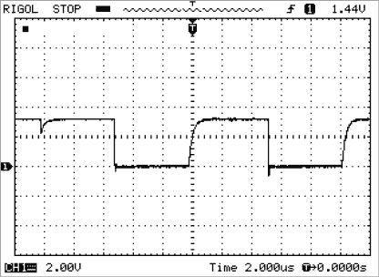
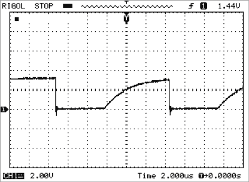
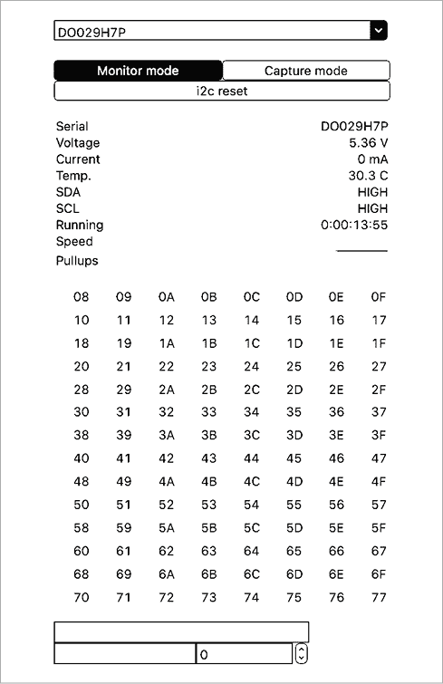
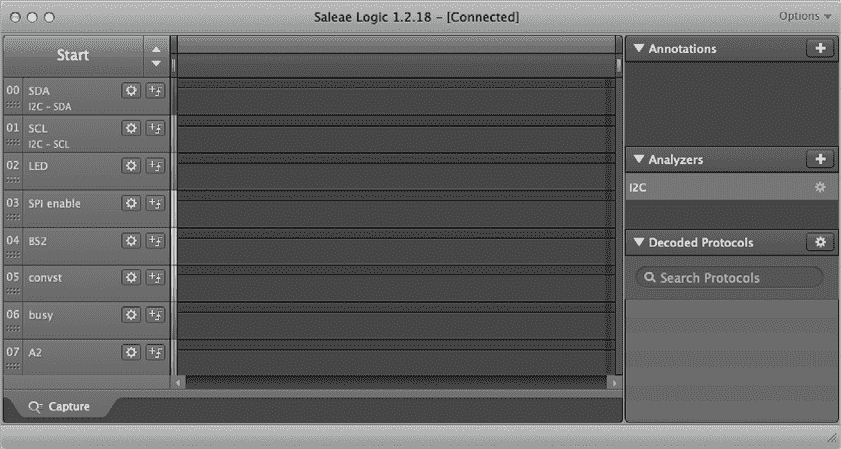
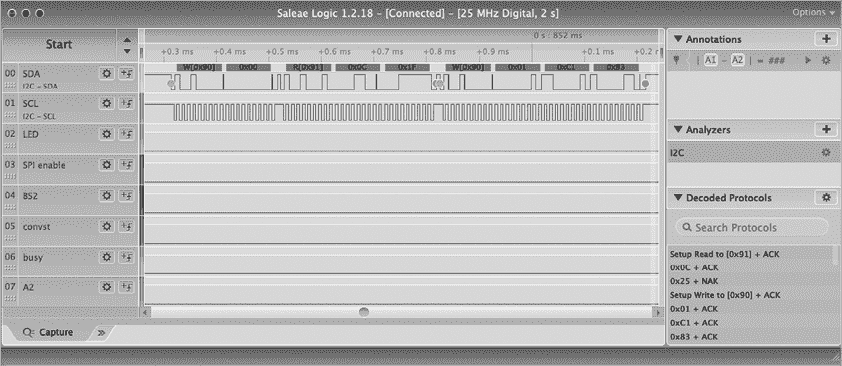
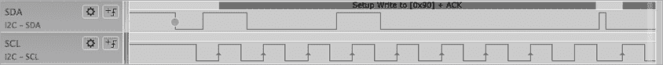
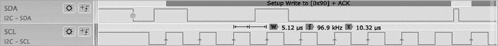

# 第四章：I²C 传输分析与调试工具


在设计 I²C 硬件和编写与 I²C 硬件配合使用的软件时，你通常会发现，基于软件的调试器和 `printf` 语句不足以快速定位硬件和软件中的问题。如果你打算定期编程 I²C 设备，你会希望投资一些合适的硬件工具，以减少调试和测试的工作量。

本章讨论了其中几种工具，包括万用表、示波器、逻辑分析仪、总线监视器和协议分析仪。尽管这些工具需要花费一定的金钱，但使用它们能够减少调试代码时的时间消耗。

## 4.1 通用硬件测试与调试工具

如果你在处理硬件设备（通用硬件，而不仅仅是 I²C）时，有几个工具你应该在工具箱中准备好：

+   数字万用表（DMM）

+   示波器

+   5V、3.3V 和可调电源（至少 0V 到 10V）

DMM 在检查 I²C 设备上的电源引脚以及其他直流信号时非常有用。大多数 DMM 在测量电压变化的引脚上的信号时毫无价值，例如 SDA 和 SCL 线，因为 DMM 会对电压进行相对较长时间的平均处理，如果信号不稳定，这将导致测量结果不准确。

DMM 还可以用来测量 I²C 线上的上拉电阻。理论上，你应该能通过读取颜色代码或 SMT 电阻代码来计算总线上的电阻。然而，如果多个上拉电阻分布在系统各处，电阻可能比你预期的要小。快速测量 Vcc 与 SDA 或 SCL 线之间的电阻可能会很有用。

一些 DMM 内置了电容表，但这些功能通常不足以测量总线电容。除非你有一台*非常昂贵*的 DMM，否则不要尝试进行这种测量。电容通常太低，普通的万用表无法测量。另一方面，有些电容表能够处理低电容，并且能给你一个关于系统总线电容如何的估计，价格也从 $100 起。幸运的是，你可以使用示波器观察信号，并确定是否存在过多的总线电容，因此电容表并不是必需的。如果你没有电容表，也无法为其他原因证明购买的必要性，那就不值得购买一个。

从理论上讲，示波器并非调试 I²C 信号时绝对必要的工具，但它仍然是一个有用的设备，可以快速判断信号是否处于活动状态以及这些信号的电压水平。如前所述，拥有示波器的一个有用理由是它可以让你监控 I²C 总线上信号的模拟状态。你可以很容易地判断电压水平是否合理——即，不是过高——以及是否出现了巨大的电压下降。示波器还可以帮助你确定总线电容是否已经失控，通过显示 SCL 和 SDA 信号的上升时间。如果这些信号的上升时间过长，总线上的设备可能无法将这些信号识别为逻辑 1。例如，图 4-1 展示了一个合理系统中的 SCL 线。此图像来源于一个 100kHz 的系统，其中 Teensy 3.2 作为控制器，Adafruit ADS1115 作为外设。它们通过一个“无线”面包板（该面包板以电容高而著称）连接在一起。



图 4-1：示波器显示 SCL 线图像

图 4-2 展示了一个非常糟糕的时钟信号版本，具有非常慢的上升时间。在这个特定的例子中，我在 SCL 和 Gnd 线路之间连接了一个 470pF 的电容，以模拟过度的总线电容。如你所见，信号遭受了严重的衰减。当信号已经上升到足够高以被识别为高电平时，已经过去了大约 2 微秒。这并没有给在 SDA 线上放置比特的设备留出太多的时间来完成它的工作。使用示波器可以最容易地发现这些类型的问题，所以示波器确实是一个很有用的工具。



图 4-2：示波器显示高总线电容下的 SCL 线图像

一台“体面”的示波器，足够用于调试 I²C 信号，可能会花费你大约 300 到 600 美元。当然，一台品牌良好的示波器价格可能会达到几千美元。然而，这类设备对于观察 I²C 总线信号来说，可能有些过于奢侈。除非你有其他项目需要这种设备的速度和功能，或者你真的想让朋友们印象深刻，否则你完全可以选择一台“高级爱好者”级别的设备。

一些非常便宜的设备（价格低于 100 美元到大约 200 美元）使用低端 LCD 显示屏或通过连接电脑来工作。它们可能适合预算极为紧张的人，但如果你经常使用它，你最终还是会买一台真正的示波器。正如人们常说的：“一次购买，一次哭泣。”

## 4.2 逻辑分析仪

毫无疑问，处理 I²C 硬件和软件时，你最需要获得的工具就是逻辑分析仪。像示波器一样，逻辑分析仪也有各种形状和尺寸，功能列表差异巨大，价格从不到 30 美元到几千美元不等。

在低端市场上，有两种有趣的设备，尽管它们价格低廉，但实际上相当有用：I²C 驱动器和总线海盗。这两种设备可能更准确地称为*总线监控器*或*总线驱动器*，而不是逻辑分析仪。虽然它们具有一些实际逻辑分析仪的功能，但与这些（开放硬件或开放软件）项目相关的软件支持，远不如真正的逻辑分析仪。

在 $300 到 $500 的价格范围内，事情开始变得更有趣。Total Phase 提供几种不同的 I²C 和 SPI 调试模块。这些设备可以连接到 PC（Windows、Linux 或 macOS），并且运行在这些机器上的软件允许你捕获并操作 I²C 数据。（请参阅本章结尾的“更多信息”部分，了解 Total Phase 和其他调试模块的链接。）

另一种有趣的设备来自模拟设备公司（这家集成电路制造商生产多种 I²C 集成电路），它是 ADALM2000 活动学习模块。这款设备是为学生实验室设计的，支持多种测量和控制选项，其中包括 I²C 监控。

如果你真的想花钱，可以考虑 Corelis 的 BusPro-I，它是一个专业级的 I²C 总线分析仪，价格大约为 $1,700。Corelis 还有一个更高级的版本（无疑价格更高），可以模拟 I²C 控制器和外设设备。

到目前为止，我描述的设备主要是为 I²C 和 SPI 测量而设计的工具。从某种程度上说，这些设备是所谓逻辑分析仪的简化版。*逻辑分析仪*类似于示波器，因为它会随着时间的推移进行一系列读数，并显示这些读数的状态（通常是在某种 LCD 显示器上，这个显示器可能内置于逻辑分析仪中，也可能是在与逻辑分析仪连接的 PC 上）。不过，示波器和逻辑分析仪之间还是有一些主要区别的：

+   逻辑分析仪本质上是*数字*设备，而示波器则是*模拟*设备。

+   逻辑分析仪通常会存储数据并在事后显示，而示波器则更倾向于实时显示。

+   逻辑分析仪通常根据某种协议（例如 I²C 协议）解释它们记录的数字信息，而示波器则倾向于显示原始的模拟数据。

+   逻辑分析仪倾向于同时捕获多个数据位（通常是 4 到 16 个通道），而示波器一般限制为 1 到 4 个通道。

这些差异并非绝对；例如，一些存储示波器也可以存储数据，而某些逻辑分析仪可以实时显示它们的数据和分析结果。甚至有可能将逻辑分析仪和示波器集成到同一个设备中。例如，Siglent SDS1104X-E 是一款 100 MHz 示波器，带有 4 通道逻辑分析仪，而 Owon MSO8102T 和 Rigol MSO1104Z-S 则提供 16 个通道以及示波器功能。

当然，如果你是在花别人的钱，你可以从 Tektronix、Keysight Technologies、NCI Logic Analyzers、National Instruments 以及其他高端专业仪器公司购买一些非常精密的逻辑分析仪。然而，如果你不需要千兆赫采样率、多个输入通道和一个华丽的名字，或者如果你需要自己支付这个设备的费用，那么你可能需要考虑一些低端的设备。

在 100 美元到 1000 美元的范围内，有许多 USB 接口、可以连接到 PC 的不错的逻辑分析仪；详情请见“更多信息”。

最终，当你寻找逻辑分析仪时，你会想问以下问题：

+   它是否支持你感兴趣的协议（暂时是 I²C，但你可能还会用它来调试 SPI、CAN 和其他总线协议）？

+   软件是否高质量，并且它是否能在你的开发机器上运行？

+   它的文档是否完备？

+   是否有持续的支持（例如，软件更新）？

我拥有一台 Saleae Logic 8，并且可以证明它是一款高质量的设备，且有很好的支持。并不是说我列出的其他设备也不好（我不知道，我从未使用过它们），或者某些未列出的设备也能为你带来良好的体验。然而，Saleae 的设备在工程界得到了很好的评价。或许唯一的抱怨是它们有点贵（400 美元到 1000 美元），但这就是高质量硬件和软件的价格。

本章的其余部分将集中讨论前面提到的三种设备：I²C 驱动器、Bus Pirate 和 Saleae Logic 8。

## 4.3 I²C 驱动器

I²C 驱动器是一个小型板子，带有一个小格式的彩色 LCD 显示屏。它有三组 I²C 探针从板子上引出；我不确定为什么有不止一组探针，因为这些连接器都有相同的信号并且是连在一起的。它有一个 micro-USB 端口，可以连接到 Linux、Mac 或 Windows PC。

当设备启动时，它会在小型 LCD 显示屏上显示任何 I²C 活动。虽然这看起来很漂亮，但实际上并不十分有用：I²C 的数据传输相较于其他协议可能较慢，但仍然比你在实时显示器上看到的要快得多。

实际功能在于运行在 USB 电缆另一端 PC 上的软件。开发 I²C 驱动程序的 Excamera Labs 提供了一些 Python 代码来支持 I²C 驱动程序。该软件很简陋，功能基础，但也算是 30 美元能期待的水平。

主要的 Python 软件提供了类似命令行的接口（在 Python 内）。你可以通过手动调用 Python 函数来执行各种操作。例如，如果你想进行总线扫描，以查看哪些外围设备在总线上响应，可以在 Python `>` 提示符下输入命令 `i2c.scan()`。调用 `i2c.scan()` 函数后，会显示类似以下内容：

```
-- -- -- -- -- -- -- -- 
-- -- -- -- -- -- -- -- 
-- -- -- -- -- -- -- -- 
-- -- -- -- -- -- -- -- 
-- -- -- -- -- -- -- -- 
-- -- -- -- -- -- -- -- 
-- -- -- -- -- -- -- -- 
-- -- -- -- -- -- -- -- 
48 -- -- -- -- -- -- -- 
-- -- -- -- -- -- -- -- 
-- -- -- -- -- -- -- -- 
-- -- -- -- -- -- -- -- 
-- -- -- -- -- -- -- -- 
-- -- -- -- -- -- -- -- 
[72]
```

其中，`--` 表示设备在特定的 I²C 地址没有响应，而十六进制数字值（这里唯一对应响应设备地址的是 48）。在此案例中，我有一个配置为地址 0x48 的 Adafruit ADS1115 ADC 分离板，安装在 I²C 总线上。

I²C 驱动程序的 Python 软件提供了许多额外的命令，你可以在自己编写的 Python 代码中执行或调用。调用 `help(i2cdriver)` 会显示 Python 应用程序编程接口（API）。一些可以直接执行的有用命令包括：

1.  `setspeed(speed)` 参数为 100 或 400（分别对应 100 kHz 或 400 kHz）

1.  `setpullups(bitmask)` 参数是一个 6 位值，指定 I²C 驱动程序上三个 I²C 连接器（每个 SCL 和 SDA 各 2 位）的上拉电阻值。

1.  `reset()` 发送总线重置（通用调用地址）

1.  `scan()` 扫描总线并显示响应的地址

1.  `monitor(flag)` 如果 `flag` 为真（非零），则开启监视模式；如果 `flag` 为假（0），则关闭监视模式。

1.  `getstatus()` 显示状态信息

还有一些命令用于启动 I²C 总线事务、向总线写入数据、从总线读取数据以及发送停止命令。然而，这些操作通常是在 Python 程序中进行的。

I²C 驱动程序软件还有一个 GUI 应用程序，可以打开 图 4-3 所示的窗口。点击 **监视模式** 按钮以激活 I²C 驱动程序内置 LCD 的监视模式。再次点击按钮可以关闭监视模式。当不在监视模式时，选择一个地址（如果该地址有设备连接），并使用窗口底部的编辑框读取或写入该设备的数据。



图 4-3：Mac 上的 I²C 驱动程序 GUI 显示

当 I²C 总线有活动时，点击 **捕获模式** 按钮，将 I²C 数据重定向到逗号分隔值 (*.csv*) 文件中。以下是该文件中数据的一个小样本：

```
START,WRITE,72,ACK
BYTE,WRITE,0,ACK
STOP,,,
START,READ,72,ACK
BYTE,READ,12,ACK
BYTE,READ,23,NACK
STOP,,,
START,WRITE,72,ACK
BYTE,WRITE,1,ACK
BYTE,WRITE,193,ACK
BYTE,WRITE,131,ACK
STOP,,,
START,WRITE,72,ACK
BYTE,WRITE,0,ACK
STOP,,,
START,READ,72,ACK
BYTE,READ,12,ACK
BYTE,READ,43,NACK
STOP,,,
START,WRITE,72,ACK
BYTE,WRITE,1,ACK
BYTE,WRITE,193,ACK
BYTE,WRITE,131,ACK
STOP,,,
```

当 I²C 驱动程序在总线上捕获数据时，我让一块 Teensy 3.2 与 Adafruit ADS1115 分离板进行通信。可惜的是，该程序显示的所有数字都是十进制格式，而不是更有用的十六进制格式。值 72[10] 是 0x48——即 ADS1115 的地址。

编写一些软件来解析这些行并以更合适的方式显示数据其实很容易。不幸的是，这个显示中缺少了时序信息。然而，它是开源软件，因此如果你希望不同的输出，可以随意进去修改。

I²C Driver 捕获模式最有趣的用途之一是生成测试结果数据。你可以使用你的 I²C 软件对控制器或外设运行一些测试，捕获输出，然后将输出与已知数据进行比较，或者将输出通过过滤程序检查其正确性。这种生成测试结果的方式是半自动化复杂测试过程的有用工具。

因为 I²C Driver 还允许你读写 I²C 外设的数据，所以它也对检查你创建的外设的操作非常有用。你可以手动向设备写入字节，读取设备的响应，并验证结果是否符合预期。

尽管 I²C Driver 并不是 I²C 调试工具的终极之选，但它仍然是一个有趣的工具。此外，它提供了一个 USB 接口到 I²C 总线，你可以从 PC 进行编程；详情请参见他们的网站（链接见《更多信息》）。不到$30，将这个设备放入你的工具箱中是一个明智的选择。

## 4.4 Bus Pirate

Bus Pirate 是另一个开源硬件、价格低于$30 的设备，你可以用来分析 I²C 总线上的信号。而 I²C Driver 基本上是一个 USB 转 I²C 设备，附带显示屏，Bus Pirate 实际上是一个小型微控制器（PIC），被编程用于读取和写入各种数字 I/O 引脚。通过位编程软件，它慢慢地模拟 I²C 协议。由于它是开源硬件和软件、成本低且已有很长时间，Bus Pirate 吸引了大量希望进行低成本硬件黑客、分析或测试的用户。

Bus Pirate 与本章提到的大多数设备不同，因为它实际上并没有任何与 PC 相关的软件。Bus Pirate 看起来像一个串行设备（USB 转串行），所以你需要使用串行终端仿真程序来操作 Bus Pirate。你在终端中输入命令，Bus Pirate 会做出相应的反馈。在操作中，这与 I²C 驱动程序的命令行模式类似。

大多数 Bus Pirate 命令是单字符输入。你需要知道的最重要的命令是`?`命令。这是帮助命令，它会在终端上显示所有命令的列表。

默认情况下，Bus Pirate 以特殊的*Hi-Z*（高阻抗）模式启动，这基本上关闭了所有输出，以防止对 Bus Pirate 或连接到 Bus Pirate 的任何设备造成损坏。你可以通过按**M**切换到新的模式。这将显示一个菜单，供你选择新的操作模式（例如 I²C 模式）。如果你选择 I²C，它会要求你输入总线频率。

一旦 Bus Pirate 进入 I²C 模式，你可以向总线写入数据、从总线读取数据，或监控总线上的数据（类似于 I²C 驱动程序）。更多详细信息请参见 Bus Pirate 文档（链接见“更多信息”部分）。

## 4.5 Saleae 逻辑分析仪

尽管 I²C 驱动程序和 Bus Pirate 是用于某些类型 I²C 监控、测试和调试的有用设备，但它们并不是真正的逻辑分析仪。它们在实时监控和显示 I²C 信息方面并不出色。此外，尽管这两种设备可以监控—并在某种程度上捕捉—总线上的数据，但它们几乎在时间分析方面毫无用处，例如，验证每个比特是否在特定时间内发生。这正是一个真正的逻辑分析仪的强项。

Saleae Logic 8、Logic 8 Pro 和 Logic 16 Pro 设备是功能齐全的逻辑分析仪，提供 8 或 16 个通道。Logic 8 设备的采样率为每秒 1 亿次采样（Msps），而 Logic 8 Pro 或 Logic 16 Pro 的采样率为 500 Msps。通常，你希望逻辑分析仪的速度是你需要捕捉的最快信号的 5 到 10 倍，因此 Logic 8（100 Msps）足以处理 10 MHz 到 20 MHz 范围内的信号。这肯定覆盖了所有 I²C 的频率。

设备本身提供 8 或 16 个探针，供你连接到电路。对于标准的 I²C 测量，你实际上只需要连接其中两个探针，以及一根接地线。额外的通道很有用，因为它们可以让你在 I²C 传输过程中检查系统中其他引脚的状态。例如，如果你正在向 GPIO 扩展器发送数据，可以将一些探针连接到输入或输出引脚，以查看在 I²C 传输前、传输中和传输后的电平变化。

在 PC 上运行的 Logic 软件看起来像 图 4-4 中所示（macOS 版本）。屏幕的左侧定义了信号，你可以指定这里显示的名称。屏幕的中间部分显示时序和协议信息，右侧部分让你选择要解码的协议。



图 4-4：在 macOS 上运行的 Logic 软件

点击窗口左侧的 **Start** 按钮开始捕获操作。你可以指定捕获的数据量；我个人的设置是捕获两秒钟的数据。图 4-5 显示了典型的数据捕获情况。像本章中的其他内容一样，逻辑分析仪正在捕获 Teensy 3.2 和 ADS1115 之间的通信。



图 4-5：Logic 软件时序显示

Logic 已编程以分析 I²C 数据流。因此，它显示总线上的地址字节、读写命令以及每个数据字节。尽管在这幅黑白图像中不清楚，但显示屏也会用绿色和红色的点标记数据波形的开始和停止条件。

我将这个时序图缩小了，这样你就可以看到完整的 I²C 传输。不过，Logic 允许你扩大或缩小时序图，以便你调整详细程度。图 4-6 展示了从图 4-5 中扩展的第一个（地址）字节传输。



图 4-6：Logic 中的时序扩展

Logic 中的另一个不错的功能是，你可以将光标移动到某个时序信号的某一部分，并获得时序信息。图 4-7 显示了当我将光标移动到 SCL 时钟脉冲上时发生的情况。Logic 通过显示脉冲宽度和频率（5.12 µsec 和 96.9 kHz）做出了响应。在前一章编写基于软件的 I²C 控制器和外设实现时，我大量使用了这个功能。这就是我如何微调延迟，以使软件 I²C 仿真运行接近 100 kHz。



图 4-7：从 Logic 中提取时序信息

Logic 还允许你在时序图中设置光标，从而可以测量任意两点之间的时间，而不仅仅是某个信号脉冲的宽度。例如，当测量整个传输的时间，而不是单个传输位的时间时，这个功能非常有用。

售价不到 400 美元，最便宜的 Saleae 单元并不是超级便宜，但如果你要调试大量 I²C 代码和硬件，拥有这样一个设备是一个明智的投资。

## 4.6 关于 I²C 监视器和逻辑分析仪的最终评论

因为这是*《I²C 之书》*^(*2*)*，本章对分析仪的讨论集中在其用于调试和分析 I²C 信号上。事实上，本章中的大多数设备还支持几种其他协议，包括 SPI、CANBUS、MIDI、DMX、1-Wire 以及几乎所有你能想象到的典型协议。（I²C 驱动程序是这个例外，它仅支持 I²C 监控。）因此，购买像 Saleae Logic 8 这样的设备实际上是一个不错的投资，因为你不仅可以用它来测试和调试 I²C 信号，还可以用于测试和调试各种硬件。

## 4.7 本章总结

编写与 I²C 设备配合使用的软件不可避免地需要测试和调试这些软件。这种工作使用硬件测试和调试工具会更容易完成。本章讨论了几种可以用于此目的的设备，包括示波器、逻辑分析仪和总线嗅探器。还介绍了几种市面上可用的选项，包括 I²C 驱动程序、总线海盗和 Salae Logic 分析仪。并提到了各种组合示波器和逻辑分析仪选项，最后指出，这些设备不仅对调试 I²C 设备有用，还适用于其他协议，这使得它们具有更广泛的适用性。
