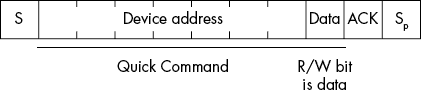
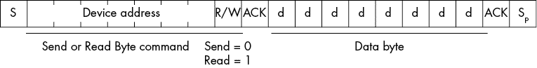
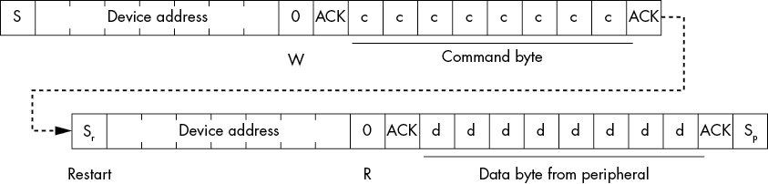
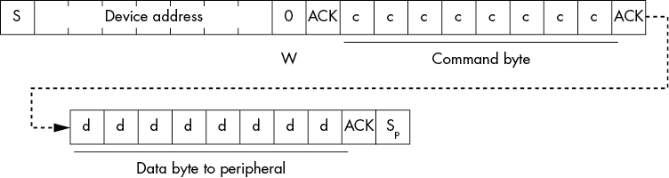
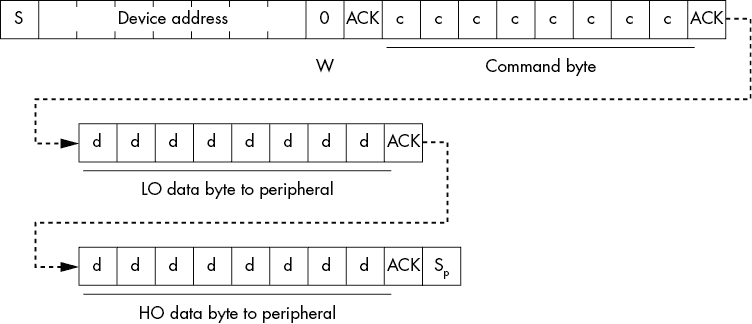
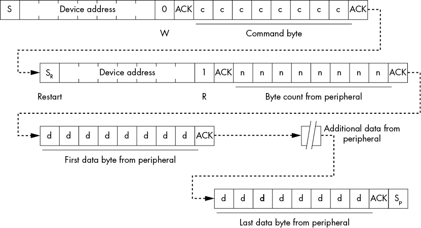
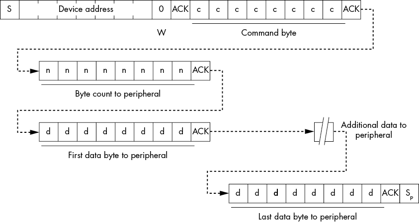

# 第五章：I²C 变种

本章简要介绍了几种 I²C 总线的变种，包括系统管理总线（SMBus）、VESA DDC 和 E-DDC、ACCESS.bus 和两线接口。这些变种大多数是在 I²C 总线的物理两线接口之上应用协议，定义了流经总线的消息和其他数据。

详细讲解这些协议扩展通常超出了本书的范围。然而，本章提供了这些协议（以及其他特定总线变种）概述，并说明了你可以在哪里找到更多关于这些变种的信息。我们首先讨论 SMBus 协议，因为它广泛应用于计算机系统，值得深入讨论。

## 5.1 SMBus

*SMBus* 最初由英特尔和杜拉塞尔共同开发，旨在管理计算机系统中的电池电力。SMBus v1.0 和 v1.1 处理低功耗设备，如电池电力管理系统，而 SMBus v2.0 则将高功耗设备添加到规范中。

可能看起来不需要专门为 I²C 总线的 SMBus 实现单独设立一节内容，因为支持 SMBus 的外设很少，而且大多数嵌入式软件设计师不会花太多时间在电池管理上，SMBus 的主要用途就是电池管理。然而，Linux 的 I²C 支持，包括树莓派，提供了基于 SMBus 协议的 API 函数。仅仅因为这一点，这一稍多于简要的 SMBus 介绍是值得的。此外，在所有 I²C 扩展和变种中，SMBus 绝对是最常见的。

大多数支持 SMBus 协议的外设 IC，如果忽略本章中的信息，按照数据手册编程，它们的行为与标准 I²C 外设相同。许多设备虽然不支持完整的协议，但仍然支持 SMBus 协议的某些方面。例如，MCP23017 GPIO 扩展器的许多命令序列遵循本章中的 SMBus 协议（见第十三章）。因此，即使某些外设并未完全支持 SMBus 规范，理解 SMBus 也有助于你处理许多外设。

### 5.1.1 SMBus 与标准 I²C 的区别

虽然 SMBus 基于 I²C 总线，但它对 I²C 信号提出了一些额外的要求：

+   时钟——SMBCLK，即 SMBus 对 SCL 的命名——必须在 10 kHz 到 100 kHz 之间。特别需要注意的是，SMBus 不支持任意的时钟拉伸（低于 10 kHz）。SMBus 规范的后续版本还支持 400 kHz 和 1 MHz 的信号。

+   SMBus v3.0 支持的信号电压范围是 1.8 V 到 5 V。此外，SMBus 明确指出，逻辑 0 小于 0.8 V，逻辑 1 大于 1.35 V。

+   SMBus 规范规定了 35 毫秒的时钟低电平超时（大约 15 Hz，假设占空比为 50%）。而 I²C 标准没有此类超时要求。

+   SMBus 为总线信号规定了上升时间和下降时间；I²C 标准没有提供这样的规格（除了总线电容，它会影响上升时间和下降时间）。

+   NAK 行为在 I²C 和 SMBus 之间有所不同。

+   SMBus 设备必须始终确认在 I²C 总线上接收到它们的地址；标准 I²C 协议不要求这样做（例如，如果设备正在忙于执行其他操作）。

+   SMBus 支持总线上三种类型的设备：控制器、外设，以及一种特殊版本的控制器，称为 *主机*。

+   所有 SMBus 设备必须具有与之关联的唯一 ID。

+   SMBus v2.0 引入了动态分配设备地址的概念。

+   SMBus 支持可选的硬件信号 SMBAlert 和 SMBSuspend，这些信号可以生成中断或挂起操作以实现低功耗操作。

SMBus 还为诸如原型设备等目的保留了某些设备地址，远远超过 I²C 总线为特殊用途保留的地址数量。SMBus 还支持动态指定的设备地址，允许设备在操作过程中选择其地址。

除了硬件差异之外，SMBus 规范还指出了几项协议变更，包括用于传输数据块、总线特定命令和设备枚举的功能。SMBus 规范提供了更多的细节（更多信息请参见本章末尾的“更多信息”链接）。

### 5.1.2 SMBus 电气规格

如前所述，SMBus 的 SMBCLK 信号必须在 10 kHz 至最大总线速度（100 kHz、400 kHz 或 1 MHz）之间工作。实际上，大多数现代 SMBus 实现运行在 50 kHz 或更快的速度。NXP 的文档（见“更多信息”中的 SMBus 快速入门指南）指出，系统不得因外设设备的时钟拉伸而将时钟频率降低至最小速度。此外，SMBus 设备必须在加电后的 500 毫秒内准备好工作。

SMBus 的电气规格优于标准 I²C 总线。它将时钟或数据线上的逻辑 0 定义为 0.8 V 或更低，将逻辑 1 定义为 1.35 V 或更高。

### 5.1.3 SMBus 保留地址

SMBus 保留了 I²C 保留地址之上的几个地址（见第二章 2.5 节，“特殊地址”）。除了这些地址外，SMBus 还保留了 7 位地址 0x08 用于 SMBus 主机设备，0x0C 用于 SMBus 警报响应，以及 0x61 用于 SMBus 设备默认地址。SMBus 规范还为特定用途保留了某些设备地址，如表 5-1 所示。

表 5-1：保留的 SMBus 设备地址

| 地址位 | 描述 |
| --- | --- |
| 0001-000 | SMBus 主机 |
| 0001-001 | 智能电池充电器 |
| 0001-010 | 智能电池选择器或智能电池系统管理器 |
| 地址位 | 描述 |
| 0001-011 | 智能电池 |
| 0001-100 | SMBus 警报响应 |
| 0101-000 | ACCESS.bus 主机 |
| 0101-100 | 最初为 LCD 对比度控制器保留（可能在 SMBus 的未来版本中重新分配） |
| 0101-101 | 最初为 CCFL 背光控制器保留（可能在 SMBus 的未来版本中重新分配） |
| 0110-111 | ACCESS.bus 默认地址 |
| 1000-0xx | 最初为 PCMCIA 插座控制器保留（可能在 SMBus 的未来版本中重新分配） |
| 1000-100 | 最初为 VGA 图形控制器保留（可能在 SMBus 的未来版本中重新分配） |
| 1001-0xx | 无限制地址 |
| 1100-001 | SMBus 设备默认地址 |

请参阅 SMBus 文档查看此列表是否有任何新增项。SMBus 标准的后续版本可能会将设备地址添加到此列表中。

### 5.1.4 SMBus 协议命令

标准 I²C 总线协议只定义了地址字节和 R/W 位格式。它没有定义总线上出现的任何进一步数据。相比之下，SMBus 协议定义了几种不同的命令格式，包括快速命令、发送字节、接收字节、写字节、写字、读字节、读字、处理调用、块读取和块写入。

SMBus 设备不必实现所有 SMBus 协议命令—只需要实现与特定设备相关的命令。如果设备支持快速命令，它可能只支持该命令。类似地，如果设备支持读字节命令和发送字节命令，它可能只支持这两个命令。其余的 SMBus 协议命令包括一个额外的*命令字节*；该字节可以指定要使用的特定命令协议。以下子节定义了每种命令类型。

#### 5.1.4.1 SMBus 快速命令

SMBus 快速命令是内建于地址字节的 R/W 位中的简单 1 位命令（参见图 5-1）。快速命令将一个单个位传输到外设，外设可以基于这一位的二进制数据来开启或关闭设备，或执行其他操作。

图 5-1：快速命令格式

快速命令中除了地址字节外，不会向设备发送额外的数据。

#### 5.1.4.2 SMBus 发送字节和读字节命令

SMBus 发送字节和读字节命令在地址字节后包含 1 字节数据。地址字节的 R/W 位指定特定的命令（读或写；参见图 5-2）。

图 5-2：发送或读取字节命令格式

在发送字节命令中，主机/控制器设备将第二个字节传输到外设；在读字节命令中，外设将数据放置在 SMBDAT（SDA）线上供主机/控制器设备读取。

#### 5.1.4.3 SMBus 读字节和读字命令

SMBus 读取字节命令允许你从外设设备中读取单个字节的数据，但无法指定你正在读取的字节数据。这个命令对于返回单个字节值的简单设备很有用，比如读取一组 8 位数字 I/O 引脚。另一方面，SMBus 读取字节和读取字命令包括一个特殊的命令字节，允许你指定参数信息，从而选择你想要读取的特定字节。这可能是一个寄存器或内存地址，或者其他选择或控制信息。读取字节命令的序列见图 5-3。

图 5-3：读取字节命令格式

读取字命令的序列见图 5-4。

图 5-4：读取字命令格式

由于控制器必须首先将命令字节写入外设设备，读取字节和读取字命令以写操作开始（地址字节的第 0 位为 0）。接着，序列必须包含一个重启操作，之后是第二个地址字节，其中第 0 位为 1（表示读取）。然后，控制器从外设设备中读取下一个字节或字（取决于命令）。

并非所有设备都支持读取字节和读取字命令。外设设备的设计决定了控制器是否可以读取单个字节、一个字，或两者都可以。如果设备支持使用此命令读取字节和字，那么控制器必须以某种方式指定是否要从设备中读取字节或字，通常是通过命令字节中的某个位来实现。

#### 5.1.4.4 SMBus 写字节和写字命令

SMBus 写字节和写字命令也包括一个命令字节，允许你指定参数信息，从而选择你想要写入外设的特定字节或字。这可能是一个寄存器或内存地址，或者其他选择或控制信息。写字节命令的序列见图 5-5。

图 5-5：写入字节命令格式

写入字命令的序列见图 5-6。

图 5-6：写入字命令格式

因为控制器严格地向外设设备写入数据，所以这些序列中不需要重启命令和额外的地址读/写字节。至于读取字节和读取字命令，设备的设计决定了是否支持写字节、写字或两者都支持。如果设备支持字节和字的写操作，那么控制器必须以某种方式在命令字节中指定写入的大小。

#### 5.1.4.5 SMBus 块读取命令

尽管大多数 SMBus 事务涉及读取或写入单个字节或字，但少数设备支持更大的数据传输。SMBus 块读命令处理数据块的读取。与读字节和读字命令一样，控制器会先传输一个地址字节（LO 位为 0，表示写操作），接着是一个命令字节。然后，控制器会发送一个重复启动操作，后跟一个地址字节，LO 位为 1（表示读取）。外围设备响应并发送一个字节，包含字节计数值，接着发送相应数量的数据字节，如图 5-7 所示。

外围设备通过字节计数值来指定它返回多少字节。理论上，控制器可以通过在命令字节字段中提供字节计数来指定它想要读取的字节数。然而，外围设备的设计决定了由谁来指定返回的字节数；这个值可能是固定的，也可能是编程的值。

图 5-7：块读序列

#### 5.1.4.6 SMBus 块写命令

当然，SMBus 提供了一个与块读命令互补的块写命令。这个命令比块读命令更简单，因为在发送命令字节后，不需要反转数据方向。图 5-8 提供了写操作的顺序。

图 5-8：块写序列

因为不需要重新发送设备地址并改变 R/W 位，这个序列比块读命令操作更短（也更高效）。

## 5.2 VESA DDC 和 E-DDC

VESA DDC（过时）和 E-DDC（现代）接口允许主机（计算机）系统与显示器（VESA 设备）之间进行通信。DDC/E-DDC（以下简称 E-DDC）是一种基于 I²C 总线的两线通信总线。E-DDC 协议允许主机系统获取显示器信息、设置显示参数（如亮度），并执行其他操作。

与 VESA E-DDC 兼容的显示器在 I²C 总线上看起来像 I²C 外围设备。特别是，兼容设备可以响应（8 位）地址 0xA0、0xA1、0xA4 或 0xA5，以及地址为 0x60 的命令寄存器。主机（计算机）通过这些地址与显示器交换信息。大部分情况下，这些信息是显示器的标识和参数信息。

VESA 仅在 VGA、HDMI 和 DVI 接口中指定了 I²C 信号。DisplayPort 接口使用不同的机制来在主机计算机和显示设备之间传输数据。有关更多详细信息，请参阅 VESA E-DDC 规范（“更多信息”中的链接）。

## 5.3 ACCESS.bus

ACCESS.bus 系统是早期在 USB 出现之前尝试将低速外围设备如键盘和鼠标连接到计算机系统上的一种方式。其目的是支持热插拔设备，可以在不关闭系统的情况下连接和移除设备，不同于当时的 AT 和 PS-2 键盘。ACCESS.bus 基于 I²C 总线，支持最多 125 个设备。

随着 USB 大约一年后到来，ACCESS.bus 的兴趣迅速减少，尽管它成为了 VESA DDC 通信系统的基础（以及已经废弃的 Apple Desktop Bus）。

## 5.4 两线接口和两线串行接口

*两线接口（TWI）*和*两线串行接口（TWSI）*是不同厂商用来避免与 I²C 的商标和合规性问题而采用的名称。当设备不完全支持完整的 I²C 标准时，一些厂商会使用 TWI—例如，如果设备不支持 START 字节时。有些人也会在总线不支持多个控制器、时钟拉伸或其他 I²C 功能时使用这个术语。一般来说，如果你看到这个术语，通常可以假设设备不完全支持 I²C 标准，尽管如果你不依赖尖端功能，它在你的应用中可能仍然能正常工作。

## 5.5 小结

本章简要介绍了 I²C 总线的各种协议扩展，包括 SMBus、VESA（DDC 和 E-DDC）、ACCESS.bus 和 TWI。其中，SMBus 和 VESA 总线今天仍然被广泛使用。SMBus 主要用于系统电源管理，而 VESA 变体则用于控制视频显示。

SMBus 协议之所以重要，是因为 Linux 的 I²C 支持基于它。因此，本章花费了大量时间讨论了几种 SMBus 命令，包括快速命令、发送和读取字节命令、读取字节和读取字命令、写入字节和写入字命令，以及块读取和块写入命令。

除非你处理的是这些高级协议所支持的特定设备类别，否则你不太可能需要对这些协议有更深入的了解。尽管如此，理解它们的核心仍然是基于久负盛名的 I²C 总线这一点非常重要。
