# 第六章：常见单板计算机上的 I²C

一些常见的单板计算机至少提供一个 I²C 端口，用于与 I²C 外设接口。虽然一些低端开发板可能使用软件实现（或类似硬件实现，如 ATtiny84 的实现），但 I²C 支持几乎在大多数爱好者级和专业级单板计算机上都是普遍存在的。本章简要介绍了许多常见单板计算机上的 I²C 实现。

本章列出的单板计算机远非详尽无遗，主要关注的是使用较广、成本较低的单板计算机。我并不打算提供这些单板计算机上 I²C 接口的低级细节，而是提供一个支持 I²C 通信的各种板子的概述。我会提供各个网页的链接（参见本章末尾的“更多信息”），对于那些有兴趣进一步了解的读者，能帮助他们深入了解这些板子。

当然，许多支持 I²C 接口的新单板计算机将在本书出版后出现。在线章节（可在[`bookofi2c.randallhyde.com`](https://bookofi2c.randallhyde.com)访问）将包括不断更新的关于许多新单板计算机的信息，这些计算机未出现在本章中。

## 6.1 Arduino 家族

Arduino 家族是连接 I²C 设备时比较流行的选择之一。每当有人用尽 Arduino 板上的有限 I/O 端口（模拟或数字）或想要连接没有简单数字或模拟接口的设备（例如热电偶或小型显示器）时，I²C 接口常常提供了解决方案。

Arduino 并不是一块单独的计算机板。的确，大多数人提到*Arduino*时，可能是指 Arduino Uno Rev3 单板计算机。然而，存在多种不同的 Arduino 开发板，其中许多板子有不同类型的 I²C 接口。

首先，Arduino^®是 Arduino 的注册商标。然而，Arduino 设计是开源且开放硬件的，因此市场上有许多不同的单板计算机，它们或多或少兼容 Arduino 系统。本书的态度是，任何你能通过 Arduino IDE 和 Arduino 库进行编程的单板计算机都可以视为 Arduino，或者更准确地说，*Arduino 兼容*。例如，因为你通常通过 Arduino IDE 对其编程，本书认为第三章中使用的 SparkFun ATTO84 开发板（参见第三章的 3.2 节，“基础 ATtiny84 和 ATtiny85 硬件”）是 Arduino 兼容的，即使它缺乏许多常见 Arduino 兼容设备的特性，包括完全支持的硬件 I²C 接口。

由于有大量的与 Arduino 兼容的开发板，讨论“Arduino 上的 I²C 端口”作为标准连接有些困难。Arduino 类设备上的 I²C 端口可能在以下几个方面有所不同：

+   有些端口是 3.3 V，有些是 5 V。

+   不同的 Arduino 类设备可能有零个、一个、两个或更多的硬件 I²C 端口。

+   一些设备可能不支持基于硬件的外设模式。

+   一些设备可能不支持同一 I²C 总线上的多个控制器。

+   一些设备可能不支持其他 I²C 总线功能，例如时钟拉伸。

关键在于，你必须仔细查看你特定“Arduino”板的文档，以确定它支持哪些 I²C 功能（如果它支持 I²C）。

即使是来自 Arduino，你也可以选择各种不同型号的 Arduino。以下小节将介绍一些流行的型号及其对 I²C 的支持。

### 6.1.1 Arduino Uno Rev3 和 Leonardo

Uno Rev3 是经典的 Arduino 单元。它具有 16-MHz 的 8 位 ATmega328P，具有以下特点：

+   5-V 操作

+   标准 Arduino 引脚排列和扩展总线（用于扩展板）

+   单一 I²C 接口（5 V）

+   32-KB Flash ROM 用于程序存储

+   2-KB RAM

+   1-KB EEPROM（非易失性存储）

图 6-1 显示了 Arduino 总线上的 I²C 线路位置。

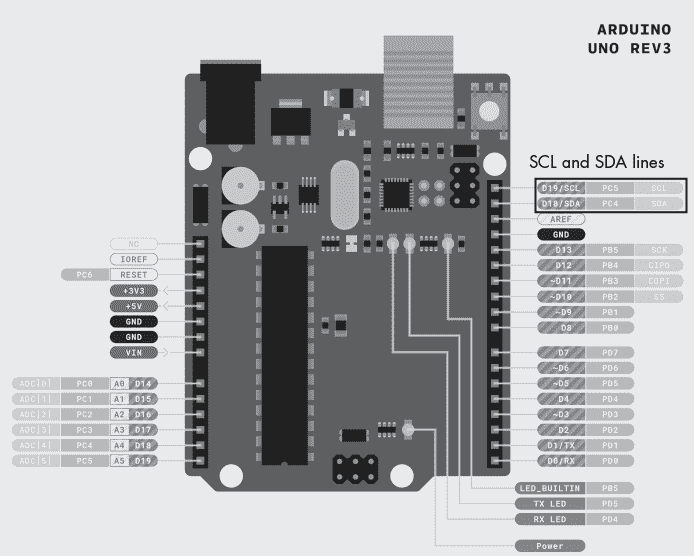

图 6-1：Arduino Uno Rev3（和 Leonardo）引脚排列

Arduino Leonardo 使用（大部分）与 Arduino Uno Rev3 相同的 CPU 和引脚排列。主要区别在于 Leonardo 是第一个内置 USB 端口的 Arduino，可以编程为键盘或其他 USB 设备；它还具有 2.5-KB RAM 的 ATmega32u4。当然，Uno Rev3（与原始 Uno 相比）也有内置 USB，因此 Leonardo 相对于 Uno Rev3 的优势较小（尽管 Leonardo 有更多的模拟 I/O 引脚）。有关更多信息，请参见“更多信息”部分。

请注意，本章中出现的 Arduino 引脚排列图来自 Arduino 官网 ([`www.arduino.cc`](https://www.arduino.cc))。这些图片受到 Creative Commons 4.0 许可协议的保护（可以免费使用，但需要注明出处）。更多法律信息请参见 [`www.arduino.cc/en/Main/FAQ`](https://www.arduino.cc/en/Main/FAQ) 和 [`www.arduino.cc/en/Trademark/HomePage`](https://www.arduino.cc/en/Trademark/HomePage)。

### 6.1.2 Arduino Nano

Arduino Nano 使用与 Arduino Uno Rev3 相同的 CPU，这意味着它们的技术规格是相同的，但 Arduino Nano 被封装成更小的体积，适用于空间有限的应用。图 6-2 显示了 Nano 的引脚排列。

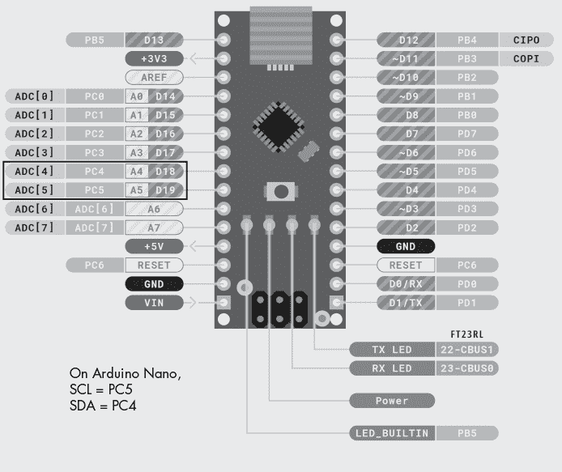

图 6-2：Arduino Nano 引脚排列

Arduino Nano 使用 A4 和 A5 引脚分别作为 SDA 和 SCL 线路；这些是许多 Arduino 单元的 I²C 标准引脚。

### 6.1.3 Arduino Micro

Arduino Micro 是另一款小型 Arduino 单元。它的 CPU 稍微比 Nano 强大一些：

+   16 MHz 的 ATmega32U4 CPU

+   32-KB Flash 用于程序存储

+   2.5-KB RAM

+   1-KB EEPROM

图 6-3 显示了 Arduino Micro 的引脚排列。

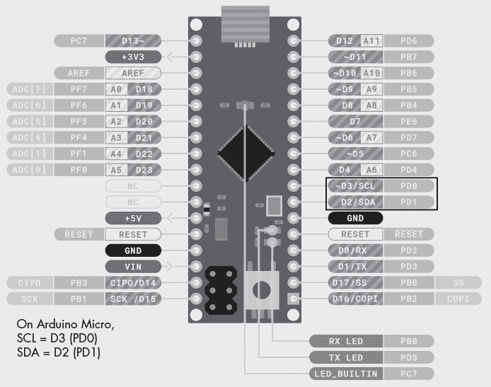

图 6-3：Arduino Micro 引脚排列

I²C 总线出现在 D2 (SDA) 和 D3 (SCL) 引脚上。

### 6.1.4 Arduino Nano Every

Arduino Nano Every 是 Nano（和 Micro）的更强大版本，同时仍然采用紧凑的外形。Arduino Nano Every 具有以下特点：

+   20 MHz 的 ATMega4809

+   5 V 工作

+   48 KB 闪存存储

+   6 KB RAM

+   256 字节 EEPROM

图 6-4 显示了 Arduino Nano Every 的引脚图。

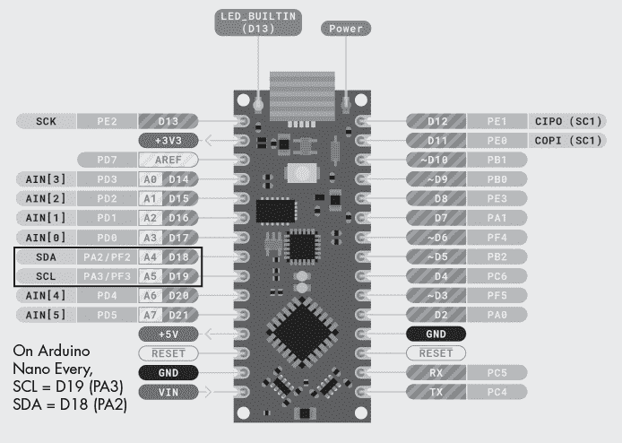

图 6-4：Arduino Nano Every 引脚图

Nano Every 支持在 D18 (PA2) 和 D19 (PA3) 引脚上的单个 I²C 端口。

### 6.1.5 Arduino Mega 2560 Rev3

Arduino Mega 2560 Rev3（或简称“Arduino Mega”）是常见的 Arduino 板中体积最大的。它具有以下特点：

+   5 V 工作

+   16 MHz 运行的 8 位 CPU

+   Mega 扩展板功能（这基本上是标准 Arduino 扩展板连接的向上兼容变种）

+   单一 I²C 接口（5 V）

+   256 KB 闪存 ROM 用于程序存储

+   8 KB RAM

+   4 KB EEPROM（非易失性存储）

由于 I/O 引脚数量众多，Arduino Mega 板与 Uno 布局有所不同。然而，大多数标准 Uno 扩展板可以安装在 Mega 板上对应的连接器上（参见 图 6-5）。

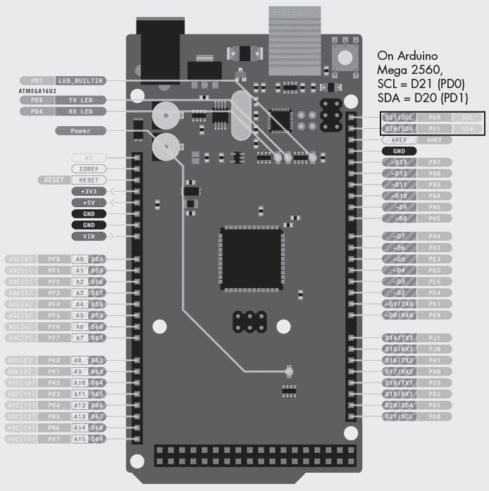

图 6-5：Arduino Mega 2560 Rev3 引脚图

Arduino Uno Rev3 向上兼容 Arduino Mega 2560 Rev3 的总线。因此，I²C 引脚与 Uno Rev3 上的物理位置相同；但是，请注意，电气上这些信号出现在 D20 和 D21 信号上，而不是 Rev3 上的 D18 和 D19 信号。

### 6.1.6 Arduino Zero

Arduino Zero 是一款高性能的 32 位板，基于 ARM Cortex M0+。它有 256 KB 的闪存用于程序存储，32 KB 的 RAM（没有 EEPROM）。在电气上，Arduino Zero 与其 8 位兄弟之间有一个巨大区别：Zero 上的所有引脚都是 3.3 V，包括其 I²C 引脚。请参见 图 6-6 了解 Arduino Zero 引脚图。

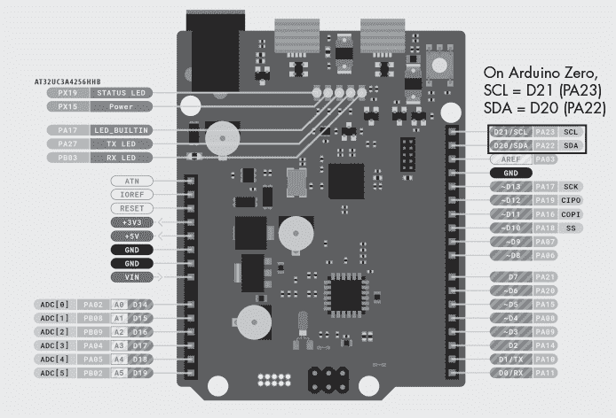

图 6-6：Arduino Zero 引脚图

板上的引脚布局与 Arduino Uno 物理兼容。然而，请记住，它们在*电气*上并不兼容，因为它们是 3.3 V 逻辑。

### 6.1.7 Arduino Due

Arduino Due 是目前性能最强的官方 Arduino 板。它具有以下特点：

+   基于 Atmel SAM3X8E ARM Cortex M3 的 84 MHz 32 位 CPU

+   512 KB 闪存内存用于程序存储

+   96 KB RAM

+   大量 I/O 引脚（可与 Mega 2560 相媲美）

+   3.3 V 工作

图 6-7 提供了引脚图。

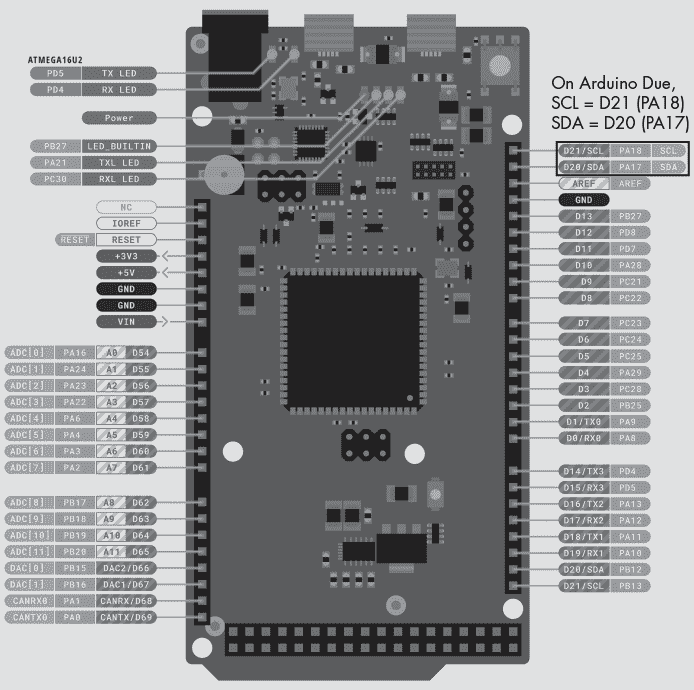

图 6-7：Arduino Due 引脚图

Arduino Due 基本上是 Arduino Mega 2560 的 32 位版本（但使用 3.3 V 引脚）。它去除了四个 ADC 输入并用 DAC 和 CANBUS 端口替代。

### 6.1.8 其他 Arduino 品牌单板计算机

本节已经涵盖了 Arduino 提供的主要单板计算机（SBC）。然而，本章忽略了几款专为物联网（IoT）设计的额外板子，而且 Arduino 不断推出新产品。访问其官网 [`www.arduino.cc`](https://www.arduino.cc) 以查看最新产品。

## 6.2 Adafruit 单板计算机

Adafruit 提供许多具有 I²C 功能并与 Arduino 兼容的单板计算机。或许这份名单上的第一款是 Adafruit Metro 328 ([`www.adafruit.com/product/50`](https://www.adafruit.com/product/50))，它是 Arduino Uno 的克隆，并做了一些改进。Adafruit 还提供几款小型的、与 Arduino IDE 兼容的板子。以下是本章编写时 Adafruit 提供的一些单板计算机。你可以通过提供的链接找到每款产品的技术信息：

+   Adafruit Metro Mini 328: 一个“口香糖”大小的 Metro 328 版本：[`www.adafruit.com/product/2590`](https://www.adafruit.com/product/2590)

+   Adafruit METRO M0 Express: Metro 328 的 32 位版本：[`www.adafruit.com/product/3505`](https://www.adafruit.com/product/3505)

+   Adafruit Metro M4 Express AirLift 和 Metro M4 Feat: 32 位版本（AirLift 内建 Wi-Fi）和高速度（120 MHz），支持硬件浮点运算：[`www.adafruit.com/product/4000`](https://www.adafruit.com/product/4000) 和 [`www.adafruit.com/product/3382`](https://www.adafruit.com/product/3382)

+   Adafruit Grand Central M4 Express: 类似于 Arduino Due，配备高性能的 32 位 CPU 和大量的 I/O 引脚：[`www.adafruit.com/product/4064`](https://www.adafruit.com/product/4064)

+   Arduino Pro Mini 328: 另一款小型设备（3.3-V 和 5-V 版本）：[`www.adafruit.com/product/2378`](https://www.adafruit.com/product/2378)

+   Adafruit FLORA、GEMMA M0 和 Circuit Playground（或 Circuit Playground Express）迷你型可穿戴电子平台设备：

    +   Circuit Playground Express: [`www.adafruit.com/product/3333`](https://www.adafruit.com/product/3333)

    +   Circuit Playground Classic: [`www.adafruit.com/product/3000`](https://www.adafruit.com/product/3000)

    +   Flora: [`www.adafruit.com/product/659`](https://www.adafruit.com/product/659)

    +   Gemma v2: [`www.adafruit.com/product/1222`](https://www.adafruit.com/product/1222)

    +   Gemma M0: [`www.adafruit.com/product/3501`](https://www.adafruit.com/product/3501)

+   Adafruit Trinket M0: 一款非常小巧的 32 位单板计算机：[`www.adafruit.com/product/3500`](https://www.adafruit.com/product/3500)

+   Adafruit ItsyBitsy M0 Express 和 ItsyBitsy 32u4: Trinket 的现代版本，具有大量的 I/O 引脚：[`www.adafruit.com/product/3727`](https://www.adafruit.com/product/3727) 和 [`www.adafruit.com/product/3677`](https://www.adafruit.com/product/3677)

+   Adafruit Bluefruit LE Micro: 一款内建蓝牙的迷你单板计算机：[`www.adafruit.com/product/2661`](https://www.adafruit.com/product/2661)

由于可用板子的种类繁多，本章未包括每个板子的引脚图。有关信息，请查看 Adafruit 网站。

除了这些单板计算机（SBC），Adafruit 还提供了大量的 Adafruit Feather SBC。有关 Feather 总线的更多信息，请参阅第七章 7.1.2 节，“Feather 总线上的 I²C”。

Adafruit 不断开发支持 I²C 总线的新单板计算机，特别是基于 Feather 的设备。几乎所有 Adafruit 的单板计算机都在硬件上完全支持 I²C。当你阅读本书时，Adafruit 可能已经推出了许多其他未在此列出的板子，毫无疑问，在我从 Adafruit 网站上搜寻信息时可能遗漏了一些。请访问[`www.adafruit.com/category/17`](https://www.adafruit.com/category/17)查看 Adafruit 可能开发的任何新款 Arduino IDE 兼容单板。

## 6.3 SparkFun 单板计算机

SparkFun 是 Adafruit 的“弟弟”。这两家公司都服务于电子和软件爱好者以及创客，提供各种各样的单板计算机（SBC）和可以插入这些 SBC 的模块。虽然 Adafruit 以其 Feather 模块而闻名，SparkFun 则因基于 I²C 技术的 Qwiic（“快速”）总线的创建而著名。SparkFun 提供了多种支持 I²C 的单板计算机，通常使用 Qwiic 连接器。以下是其一些最新的产品：

+   SparkFun RedBoard：SparkFun 版本的 Arduino Uno：[`www.sparkfun.com/products/13975`](https://www.sparkfun.com/products/13975) 和 [`www.sparkfun.com/products/15123`](https://www.sparkfun.com/products/15123)

+   SparkFun Qwiic Pro Micro，USB-C：小型 Arduino 兼容模块：[`www.sparkfun.com/products/15795`](https://www.sparkfun.com/products/15795)

+   SparkFun RedBoard Turbo：RedBoard 的 32 位 Cortex M0+（ARM）变种：[`www.sparkfun.com/products/14812`](https://www.sparkfun.com/products/14812)

+   SparkFun Pro nRF52840 Mini：一款具有蓝牙功能的小型开发板：[`www.sparkfun.com/products/15025`](https://www.sparkfun.com/products/15025)

+   SparkFun Thing Plus，ESP32 WROOM：一款基于 ESP-32 的模块，支持蓝牙和 Wi-Fi：[`www.sparkfun.com/products/15663`](https://www.sparkfun.com/products/15663)

+   SparkFun RedBoard Artemis Nano：一款小型、高性能的单板计算机，配备四个板载 I²C 端口：[`www.sparkfun.com/products/15443`](https://www.sparkfun.com/products/15443)

+   SparkFun RedBoard Artemis：一款高性能的 32 位 CPU，最多支持六个独立的 I²C 总线，采用 Arduino Uno 外形： [`www.sparkfun.com/products/15444`](https://www.sparkfun.com/products/15444)

+   SparkFun RedBoard Artemis ATP：Artemis 的超大尺寸版本，最多支持六个 I²C 总线：[`www.sparkfun.com/products/15442`](https://www.sparkfun.com/products/15442)

+   SparkFun Thing Plus，Artemis：一种在 Feather 尺寸下的 Artemis 模块（请参见第七章第 7.1.2 节“Feather 总线上的 I²C”），支持两个 I²C 总线：[`www.sparkfun.com/products/15574`](https://www.sparkfun.com/products/15574)

+   SparkFun Thing Plus，SAMD51：基于 Cortex M4（ARM）高性能模块，具有非常小的占地面积：[`www.sparkfun.com/products/14713`](https://www.sparkfun.com/products/14713)

+   FreeSoC2 开发板：基于 Freescale Cortex M3（ARM）的开发板：[`www.sparkfun.com/products/13714`](https://www.sparkfun.com/products/13714)

+   SparkFun RED-V RedBoard：基于 RISC-V 的 Arduino Uno 形式的开发板。请注意，该开发板无法使用 Arduino IDE 进行编程（至少在本文撰写时是如此）：[`www.sparkfun.com/products/15594`](https://www.sparkfun.com/products/15594)

+   SparkFun RED-V Thing Plus：RED-V 的小型版本：[`www.sparkfun.com/products/15799`](https://www.sparkfun.com/products/15799)

+   SparkFun Edge 开发板，Apollo3 Blue：基于 Cortex M4 的边缘计算（AI）开发模块：[`www.sparkfun.com/products/15170`](https://www.sparkfun.com/products/15170)

+   Alchitry Au FPGA 开发板：根本不是一块单板*计算机*。这是一个支持 I²C 的现场可编程门阵列（FPGA）模块。提供两个版本：Alchitry Au（黄金版）[`www.sparkfun.com/products/16527`](https://www.sparkfun.com/products/16527) 和 Alchitry Cu（铜版）[`www.sparkfun.com/products/16526`](https://www.sparkfun.com/products/16526)。

由于可用开发板种类繁多，本章将不包括每块开发板的引脚图。有关这些信息，请参见 SparkFun 网站。更多关于本书中 Qwiic 总线的信息，请参阅第七章第 7.2 节“SparkFun Qwiic 总线上的 I²C”。

和往常一样，你可以预期自本章撰写以来，此清单已经扩展。请访问 SparkFun 网站（[`www.sparkfun.com`](https://www.sparkfun.com)）查看当前可用的产品。

## 6.4 Teensy 系列

PJRC 的 Teensy 系列是一套受欢迎的微控制器开发板，你可以使用 Arduino IDE 和 PJRC 提供的库进行编程。Teensy 系列受到设计师的喜爱，他们希望使用非常小的（敢说是*微小*的）MCU 模块来编程高性能的嵌入式系统。

在本文撰写时，PJRC 正在销售八种不同的 SBC 模块：

+   Teensy 2.0：基于 8 位 CPU（即将被弃用）。提供一个 I²C 端口。

+   Teensy++ 2.0：Teensy 2.0 的扩展（I/O）版本（也即将被弃用）。提供一个 I²C 端口。

+   Teensy LC：Teensy 的低成本 32 位版本，仅支持 3.3 V。提供两个 I²C 端口。

+   Teensy 3.2：基于 32 位 Cortex M4（ARM）CPU，主频为 72 MHz（可超频至 96 MHz），支持 3.3 V 和 5 V 容错引脚。大小约为两张邮票的尺寸。提供两个 I²C 端口。

+   Teensy 3.5：一款 32 位的 Cortex M4 CPU，运行频率为 120 MHz，支持 3.3V 且具有 5V 耐受引脚。尺寸约为一大块口香糖的大小。提供三个 I²C 端口。

+   Teensy 3.6：一款 32 位的 Cortex M4 CPU，运行频率为 180 MHz，仅支持 3.3V（没有 5V 耐受引脚）。尺寸约为一大块口香糖的大小。提供四个 I²C 端口。

+   Teensy 4.0：一款 32 位的 Cortex M7（ARM）CPU，运行频率为 600 MHz（可超频至 1 GHz），仅支持 3.3V。尺寸约为两个邮票的大小。提供三个 I²C 端口。

+   Teensy 4.1：一款 32 位的 Cortex M7（ARM）CPU，运行频率为 600 MHz（可超频至 1 GHz），仅支持 3.3V。Teensy 4.0 的扩展 I/O 版本，支持以太网和 SD 卡。尺寸约为一大块口香糖的大小。提供三个 I²C 端口。

所有 Teensy 的 I²C 接口都由硬件控制。通过 Teensy 特定的库代码，你可以以 400 MHz 的速度操作这些 I²C 接口。了解这些单板计算机，请访问[`www.pjrc.com/store/index.xhtml`](https://www.pjrc.com/store/index.xhtml)。

## 6.5 其他兼容 Arduino 的单板计算机

由于 Arduino 的设计是开源和开放硬件，许多不同的公司生产兼容 Arduino 的板子。如果你足够仔细，可以在线找到一些不到 10 美元的中国仿制品。一个值得关注的供应商是 Seeed Studio，他们在我写这段话时，正在线上广告出售低于 8 美元的 Arduino 兼容板子([`www.seeedstudio.com/Seeeduino-V4-2-p-2517.xhtml`](https://www.seeedstudio.com/Seeeduino-V4-2-p-2517.xhtml))。Seeed Studio 还推广了 Grove 互联总线（见第七章“Seeed Studio Grove 总线上的 I²C”，第 7.4 节），它拥有一个庞大的传感器和其他设备生态系统，这些设备可以与 Grove 兼容的板子连接。

如果你对其他兼容 Arduino 的板子感兴趣，可以查看以下 Wikipedia 页面，列出了 Arduino 和兼容设备：[`en.wikipedia.org/wiki/List_of_Arduino_boards_and_compatible_systems`](https://en.wikipedia.org/wiki/List_of_Arduino_boards_and_compatible_systems)。

许多不同的板子都兼容 Arduino IDE，涵盖了各种不同的性能级别、内存能力和 I/O 能力。几乎所有兼容 Arduino 的板子至少都包含一个硬件 I²C 接口，因为 I²C 是扩展 Arduino 设备 I/O 能力的最常见方式之一。

## 6.6 树莓派

在 Arduino 单板计算机之后，树莓派可能是最常用的单板计算机，用于通过 I²C 与现实世界的设备进行接口。图 6-8 展示了树莓派 GPIO 连接器上的引脚，其中*硬件*I²C 引脚的位置。我强调“硬件”，因为树莓派还支持软件控制的 I²C 端口（稍后会详细介绍）。

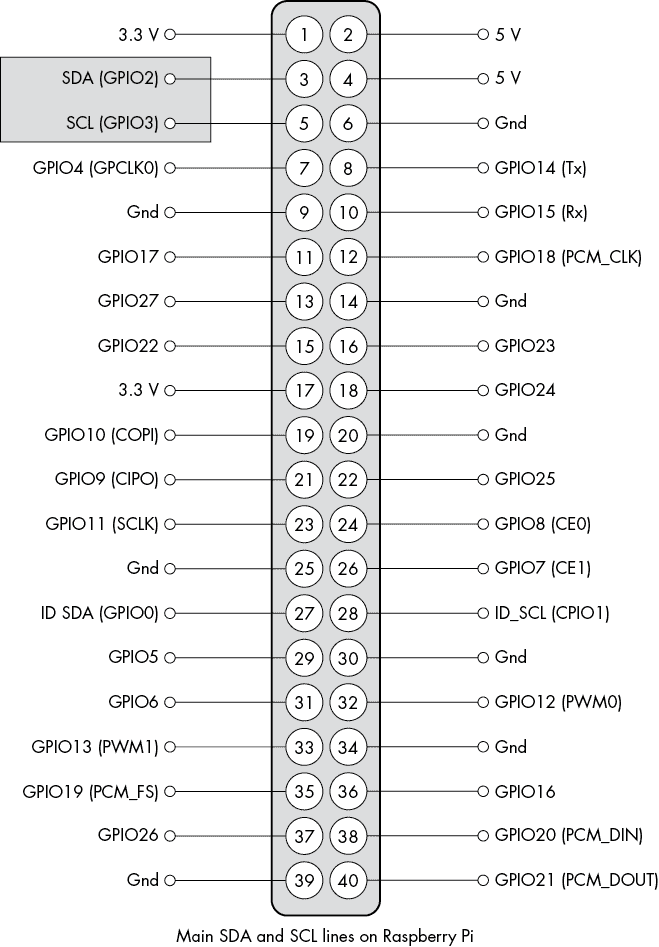

图 6-8：树莓派的 GPIO 引脚图（40 引脚连接器）。此图像由树莓派基金会版权所有。根据 Creative Commons 4.0 许可协议，允许在此处使用。

树莓派是一个 3.3V 设备。因此，必须仅将 3.3V 的 I²C 设备连接到树莓派的 GPIO 接口。连接 5V 设备可能会损坏树莓派。如果需要使用 5V 设备，务必使用电平转换器，例如 TXB0104 双向电平转换器（[`www.adafruit.com/product/1875`](https://www.adafruit.com/product/1875)）。

树莓派 I²C 接口存在一些已知问题。特别是，它不支持（至少在写作时）硬件时钟拉伸，因此无法连接通过拉伸时钟添加等待状态的设备。不过，可以指定较低的时钟频率；在某些情况下，这会解决问题。也可以使用基于软件的 I²C 系统（使用一对 GPIO 引脚作为 SDA 和 SCL）。基于软件的解决方案支持时钟拉伸。有关如何在树莓派上设置软件 I²C 端口的详细信息，请参见 [`github.com/fivdi/i2c-bus/blob/master/doc/raspberry-pi-software-i2c.md`](https://github.com/fivdi/i2c-bus/blob/master/doc/raspberry-pi-software-i2c.md)。有关树莓派 4 上时钟拉伸的信息，请参见 [`forums.raspberrypi.com/viewtopic.php?t=302381`](https://forums.raspberrypi.com/viewtopic.php?t=302381)。

## 6.7 树莓派 Pico

2021 年，树莓派团队推出了他们自己的嵌入式微控制器 RP2040，并随之发布了一个小型单板计算机——树莓派 Pico。该设备旨在与 Arduino 板在小型实时嵌入式应用中竞争。RP2040 具备以下特性：

+   双核 Arm Cortex M0+，运行频率为 133 MHz

+   264KB 的片上 RAM

+   通过专用 QSPI 总线支持最多 16MB 的外部闪存（Pico 板提供 2MB 的闪存 ROM）

+   DMA 控制器

+   插值器和整数分频器外设

+   30 个 GPIO 引脚，其中 4 个可以用作模拟输入

+   两个 UART、两个 SPI 控制器和两个 I²C 控制器

+   16 个 PWM 通道

+   一个 USB 1.1 控制器和 PHY，支持主机和设备模式

+   八个树莓派可编程 I/O (PIO) 状态机

+   支持 UF2 的 USB 大容量存储启动模式，支持拖放编程

+   写作时价格仅为 4 美元

树莓派 Pico 支持两个独立的 I²C 端口，可以将其分配给设备上的任何一对数字 I/O 引脚（参见 图 6-9）。树莓派 Pico 是一个 3.3V 设备，这意味着只能将 3.3V 的 I²C 设备连接到 Pico 的 I²C 引脚。连接 5V 设备可能会损坏树莓派 Pico。如果需要使用 5V 设备，请使用电平转换器。

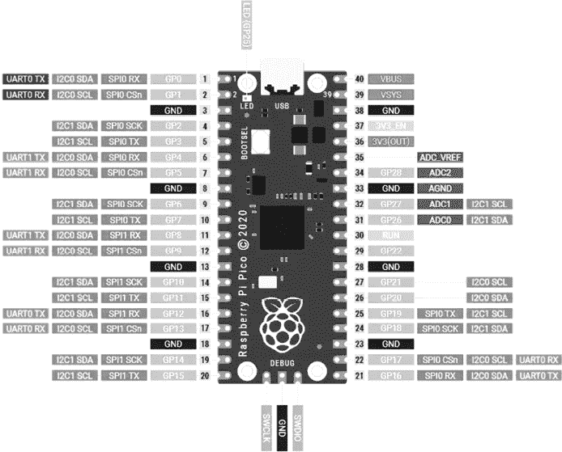

图 6-9：树莓派 Pico 上的 GPIO 引脚分配（40 引脚排头）。此图像由树莓派基金会版权所有，依据 Creative Commons 4.0 许可在此使用。

虽然树莓派 Pico 不是速度最快的小型开发板（Teensy 4.*x*可能在更流行的低成本开发板中荣登此榜首），但它以 133 MHz 的主频，依然不算慢。而且，与大多数 Arduino 级别的 SBC 不同，Pico 实际上在板上有两个 CPU 核心，你可以使用 Pico SDK（C/C++）或 Micro Python 进行编程。在写作时，一些富有创新精神的人已经破解了 Arduino IDE 来编程 Pico。不久后，Arduino 官方提供了支持（[`www.tomshardware.com/news/raspberry-pi-pico-arduino-official`](https://www.tomshardware.com/news/raspberry-pi-pico-arduino-official)）。  

## 6.8 BeagleBone Black  

BeagleBone Black 是一个低成本、开源且开放硬件的树莓派替代品。从技术上讲，它提供了三个独立的 I²C 接口，尽管在标准（默认）配置中，只有一对线路（I2C2）可用。SCL 和 SDA 线路分别出现在 BeagleBone Black 的 P9 连接器上的 19 和 20 号引脚（见图 6-10）。  

与树莓派不同，BeagleBone Black 似乎能够很好地支持时钟延伸。I²C 接口可以在 100 kHz 或 400 kHz 下运行。  

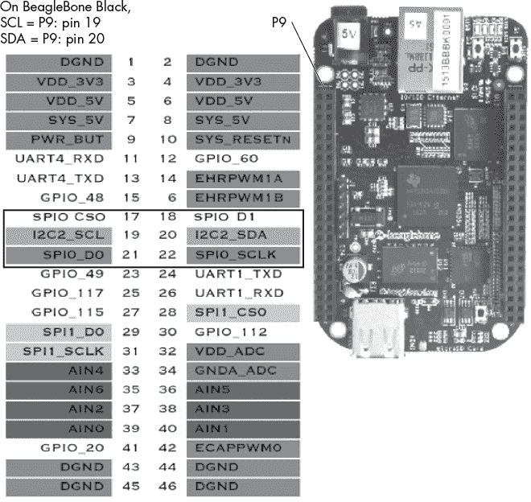  

图 6-10：BeagleBone Black 的 P9 引脚分布  

## 6.9 PINE A64 和 ROCKPro64  

PINE A64 和 ROCKPro64 SBC 的推出旨在打造一个非常低成本、64 位的、类似树莓派的系统。原版 Pine A64 售价为 15 美元。ROCKPro64 是一个高端单板计算机，配备了板载 EMMC（闪存）存储、六个计算核心、USB-C/3.0 接口、PCI-e 插槽等更多功能。两个开发板都包括一个 40 针连接器，与树莓派的 GPIO 连接器兼容，包括 I²C 接口。

如需了解更多关于 PINE64 产品的信息，请访问[`www.pine64.org`](https://www.pine64.org)。  

## 6.10 Onion Omega  

Onion Omega 系列由一些非常小巧、低成本的 SBC 组成，运行 Linux 变种。Onion Omega2+配备了 MT7688 SoC，集成了 580 MHz 的 MIPS CPU、Wi-Fi 和 10/100 Mbps 以太网接口。它包括 128MB 的 DDR2 DRAM 内存和 32MB 的板载闪存存储——并且支持 I²C。一个典型的 Onion Omega2+模块售价低于 15 美元，但购买系统中的其他模块可能会提高价格，具体取决于你添加的功能。  

尽管 Onion Omega2+模块非常小巧（大约 1 英寸 × 1.7 英寸，或 2.5 厘米 × 4.4 厘米），实际的系统尺寸稍大一些，因为 Onion 系统由一系列可堆叠的模块组成。例如，为了方便访问 I²C 引脚，你可能需要使用 Onion Dock 模块（虽然这是可选的，因为 Omega Onion2+模块本身也有一些适合面包板使用的 I²C 引脚，你可以直接将其连接到电路中）。Omega2 的引脚分布如图 6-11 所示。  

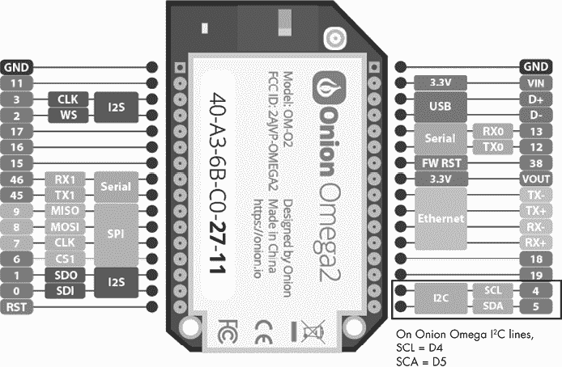  

图 6-11：Onion Omega2+引脚分布  

你可以在[`onion.io/omega2`](https://onion.io/omega2)找到更多关于 Onion 产品的信息。SparkFun 销售 Onion Omega 系列产品；你可以访问其网站[`www.sparkfun.com/search/results?term=onion`](https://www.sparkfun.com/search/results?term=onion)。

## 6.11 STM32 单板计算机系列

STMicroelectronics 生产了一系列用于其 ARM 微控制器的开发板。这些单板计算机提供了不同的评估环境，适用于不同速度和 I/O 量的 CPU。许多开发板可以使用 Arduino IDE 进行编程，尽管 STMicroelectronics 还提供了适用于更专业用途的开发软件，以及运行在各种 STM32 板上的 MBED 实时操作系统。

尽管 STMicroelectronics 的开发板列表过长，无法在此列出，但以下部分提供了本书中使用的几款开发板的详细信息。

### 6.11.1 STM32F767/Nucleo-144

STM32F767/Nucleo-144 基于 216 MHz 的 ARM Cortex M7 处理器。它配备了 2MB 的闪存、512KB 的 RAM、USB 和以太网接口以及其他 I/O 接口。它提供了一组与 Arduino Uno V3 兼容的接头（但仅支持 3.3 V）。

因为 STM32F767/Nucleo-144 提供了一套（3.3 V）连接，这些连接大多与 Arduino Uno 兼容，所以你可以在常见的位置找到 I²C 引脚，这些引脚分别是设备上的 PB8（SCL）和 PB9（SDA）（也对应 Arduino 的 A4 和 A5 引脚）。有关该开发板的更多信息，请访问[`www.st.com/en/evaluation-tools/nucleo-f767zi.xhtml`](https://www.st.com/en/evaluation-tools/nucleo-f767zi.xhtml)。

### 6.11.2 STM32F746G-Disco

STM32F746G-Disco（如发现套件，而非迪斯科音乐）是另一款 216 MHz、M7 处理器的设备，具有与 Arduino 兼容的引脚布局（但仍仅支持 3.3 V），配备了彩色 LCD 显示屏、以太网、USB、音频、摄像头接口及其他 I/O 接口。由于它包含与 Arduino 兼容的扩展板连接器，你可以在常见的位置找到 I²C 引脚。有关该模块的更多信息，请访问 STMicroelectronics 官方网站[`www.st.com/en/evaluation-tools/32f746gdiscovery.xhtml`](https://www.st.com/en/evaluation-tools/32f746gdiscovery.xhtml)。

### 6.11.3 STM32 开发板一览

STMicroelectronics 生产了多种不同 I/O 数量和类型的评估板。如果你对这些开发板感兴趣，可以访问产品评估网站[`www.st.com/en/evaluation-tools/mcu-mpu-eval-tools.xhtml#products`](https://www.st.com/en/evaluation-tools/mcu-mpu-eval-tools.xhtml#products)。

## 6.12 NetBurner MOD54415

本章介绍的大多数单板计算机（SBC）可能都可以归类为爱好者、探索型或评估型设备。尽管很多真实世界的专业系统使用这些板卡，但专业嵌入式工程师可能会质疑这些单板计算机的资质。就个人而言，我避免进行关于“专业”与“爱好者”之间的宗教或精英主义辩论。如果一个板卡能够完成任务，那就足够成为使用它的理由。然而，除了 Arduino 和 Raspberry Pi 单板计算机，还有更广阔的世界，而我不提到至少一个在真实世界中常用的、用于专业嵌入式应用的严肃单板计算机，就有失公允。

其中一个板卡是 NetBurner MOD54415 单板计算机，这是一款基于 250 MHz Coldfire CPU 并运行µC/OS 实时操作系统的小型板卡（NetBurner 还有 MODM7AE70，这是一个运行在 300 MHz 的 Cortex M7 变种）。良好的 TCP/IP 协议栈和 RTOS 的使用使得 NetBurner 产品区别于许多爱好者级别的产品。我将在本书后面提供多个使用 MOD54415 的编程示例。

欲了解更多关于 NetBurner 产品的信息，请参见[`www.netburner.com`](https://www.netburner.com)。

## 6.13 个人计算机上的 I²C

尽管大多数 PC（Windows、macOS 和 Linux）出于内部原因（例如，电源管理的 SMBus 和显示器上的 VESA E-DDC）支持 I²C 通信，但很少有用户程序能够访问这些 I²C 控制器。即使有，也不容易将 I²C 外设连接到这些总线。假如你的 PC 有一个 I²C 端口，可以直接与 I²C 外设接口，岂不是很方便？

好吧，有几种方法可以实现这一点。当然，你可以使用 Arduino 或其他单板计算机（SBC）作为协处理器，通过 PC 来处理 I²C 通信。不过，这样做会涉及很多工作。另一种方法是使用 Bus Pirate 或 I²C 驱动器设备（请参见第 4.3 节《I²C 驱动器》和第 4.4 节《Bus Pirate》）。这些设备允许你通过各种命令（使用 Bus Pirate 的终端窗口或 I²C 驱动器的应用程序）从 PC 向 I²C 总线发送命令。虽然使用这些设备可以让你从 PC 应用程序控制 I²C，但它并不非常方便。

幸运的是，FTDI（[`www.ftdichip.com`](https://www.ftdichip.com)）创造了一款集成电路，能够为你完成大部分工作。Adafruit 的团队基于这款芯片制作了一个小型板卡，让你可以通过 PC 的 USB 端口控制 I²C。这个设备就是 Adafruit FT232H Breakout——通用 USB 到 GPIO、SPI、I²C——USB C & Stemma QT/Qwiic（[`www.adafruit.com/product/2264`](https://www.adafruit.com/product/2264)）。顾名思义，它将 USB 连接到 I²C 总线、SPI 总线或通用 GPIO 引脚。结合 FTDI 提供的一些库，你可以轻松地通过 PC 应用程序直接控制 I²C 外设。

除了 FT232H Breakout，Adafruit 还销售一款小型板子——Adafruit MCP2221A Breakout – 通用 USB 到 GPIO ADC I2C – Stemma QT/Qwiic ([`www.adafruit.com/product/4471`](https://www.adafruit.com/product/4471))，它同样能够通过 USB 驱动 I²C 总线。虽然它提供的 GPIO 引脚数量不如 FT232H Breakout，但价格大约只有其一半。它还包括一个 Qwiic 连接器（在 Adafruit 术语中称为*Stemma QT*），便于与 Qwiic 兼容设备连接。

## 6.14 章节总结

本章提供了关于多种支持 I²C 通信的业余爱好者级和专业级 SBC 的通用概述，并简要提及了使用传统 PC 的控制器 I²C 设备。其列出的 SBC 并不完全。如果你想了解更多本章讨论的产品，请查看与每个项目相关的网页链接。若要深入了解本章未涉及的众多 SBC，请参见接下来的“更多信息”部分。
