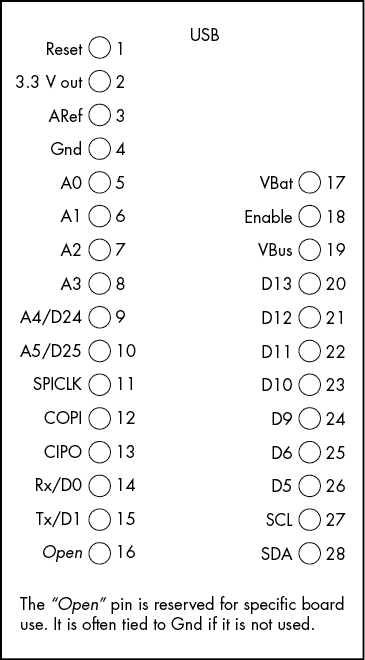
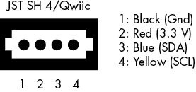
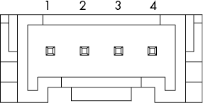

# 第七章：I²C 在厂商总线上的应用

本章介绍了三种流行的厂商总线，它们支持 I²C 信号：Adafruit Feather 总线、SparkFun Qwiic 总线（Adafruit 称其为 Stemma QT）和 Seeed Studio Grove 总线。数百种外设设备可以连接到这些总线，因此，如果你想在系统中使用大量现有外设，了解这些总线是至关重要的。你也很可能在现有系统中遇到这些总线。

要连接一对 I²C 设备，您只需要三根线：SCL、SDA 和 Gnd。像 Adafruit、Seeed Studio 和 SparkFun 这样的公司销售各种 I²C 扩展板，这些扩展板通过带有这三种信号的引脚连接到系统。

不幸的是，扩展板设计师往往将 IC 的信号引出到板上的任意插针。即使是同一制造商的两个扩展板，也可能将 SCL 和 SDA 信号引出到不同的引脚组。这使得交换不同的扩展板变得困难。一些公司曾尝试使用一致的互连方案来组织这些信号，以及接地和电源线。不幸的是，这些系统并未得到广泛采用，因此你无法使用相同的连接器将来自不同厂商的模块混合使用。

在某些方面，Arduino、Raspberry Pi 和 BeagleBone 的 GPIO 接口为将 I²C 设备连接到嵌入式系统提供了事实上的标准。通常可以看到 *扩展板*（Arduino 附加板）、*帽子*（Raspberry Pi 附加板）和 *外壳*（BeagleBone 附加板）将 I²C 外设连接到这些计算机系统。然而，这些附加板体积较大，成本相对较高。若要在这些平台上构建 I²C 外设是浪费空间和资金的，因为实际连接通常只需要四根线（SDA、SCL、Gnd 和电源）。

因此，厂商创建了 Feather、Qwiic、Grove 和其他总线，将 I²C 信号以及有时的其他信号，整合到更紧凑的外形中。这些总线为 I²C 设备提供了一个明确定义的机械连接器，允许您轻松连接外设和控制器，通常只需通过插入一根电缆连接这两个设备，无需焊接。许多控制器和外设设备支持这些总线，使得用它们原型化系统变得更加容易。

## 7.1 Adafruit Feather 总线

Adafruit 开发了 Feather 总线，以满足行业对具有更小外形尺寸的、*与 CPU 和外设无关*的平台的需求，这个平台可以与任何组合的适当 CPU 和外设配对。随着 Arduino 设备的流行，一些设计师希望能够拥有可以轻松适应小空间，甚至作为服装的一部分的更小型设备。标准的 Arduino Uno 和 Mega 2560 板对于这个目的来说过于庞大。为了解决这个问题，Arduino 公司开发了 Arduino Micro 和 Nano 设备。同样，第三方也开发了像 Adafruit Trinket 系列这样的设备。然而，所有这些新设备都使用了不同的信号引脚布局。因此，类似于 Arduino Uno 的扩展板的充满活力的生态系统并没有发展起来。这使得设计能够轻松更换不同 CPU、外设、电池组和其他设备的产品变得困难，就像标准的 Arduino Uno 平台一样。

Feather 总线通过在 28 个针脚（一个插头上 16 个针脚，另一个插头上 12 个针脚）上使用一组固定信号，定义了任意 CPU 与任意外设设备之间的标准化物理连接，解决了这个问题。由于信号线在 Feather 总线上处于固定位置，Adafruit 和许多其他供应商能够创建一整套附加板，这些板可以在支持 Feather 总线的各种 SBC 上使用。

Feather 总线在需要紧凑、低功耗设计的服装设计师和其他系统工程师中变得非常流行。尽管它包含了许多超出 I²C 的信号，但它的小巧外形使得即使只连接 I²C 线、电源和 Gnd，它也是一个合理的平台。许多供应商已经生产了 Feather 总线组件，创造了一个庞大的 Feather 生态系统。

Feather 总线支持两种基本组件类型：Feathers 和 FeatherWings。*Feather* 是一个小型 SBC，提供各种模拟、数字信号和其他信号，包括 I²C。不同的 Feather 实现包括 8 位和 32 位 CPU，具有广泛的性能、内存和功耗特点，使得系统设计师能够选择最适合当前任务的 CPU 或其他 Feather 特性，同时仍然可以将各种 Feather 外设连接到该 SBC。

*FeatherWing* 是一种附加板，类似于 Arduino 扩展板、Pi HAT 或 BeagleBone Cape，用于连接外设到控制器。虽然通常只连接一个 FeatherWing 到一个 Feather，但也可以通过堆叠 FeatherWings 或使用 FeatherWing 扩展板，将多个 FeatherWings 连接到一个 Feather（SBC）。这使得你可以例如，将 OLED 显示屏和以太网 FeatherWings 连接到同一个 Feather。

某些 FeatherWing 板可能不会使用总线上的所有 I/O 引脚；实际上，许多 FeatherWings 仅使用总线上的 I²C 和 Gnd 引脚，并且不会连接到其他引脚。许多 FeatherWings 也根本不使用 I²C 信号——它们可能只使用一些数字或模拟引脚，或者可能使用 Feather 总线上的 SPI 引脚。本书仅讨论那些使用总线 I²C 引脚的 FeatherWings。

Adafruit 提供了 Feathers 和 FeatherWings 的正式规格；有关更多细节，请参见 Adafruit 特性总线规范（在本章末尾的“更多信息”部分提供了链接）。Feather 的基本规格如下：

+   标准的 Feathers 和 Wings 尺寸为 0.9 英寸 × 2.0 英寸，每个角落都有 0.1 英寸的孔。Feather 的长度可能会有所不同，但宽度应始终保持 2.0 英寸。

+   一个 16 引脚的插针条位于底部，居中，距离左侧边缘 1.0 英寸。

+   一个 12 引脚的插针条位于顶部，距离左侧 1.2 英寸。

+   两个插针条之间的间距必须保持 0.8 英寸，以确保与 FeatherWings 的兼容性。

+   所有的 Feathers 和 FeatherWings 都使用 3.3V 逻辑电平来处理所有数字输入和输出。模拟输入可能有所不同，但通常也是 3.3V。

SparkFun 将其兼容 Feather 的板子称为 *Thing Plus* 板。Particle 也有一套兼容 Feather 的板子，称为 *Photon*。详情请参阅他们的网站（在“更多信息”部分提供了链接）。

### 7.1.1 Feather 总线引脚定义

图 7-1 显示了典型的 Feather 总线引脚布局。我之所以说“典型”，是因为引脚分配并不是绝对的，并非所有 Feather 都支持 Feather 总线上所有的引脚类型。例如，并非所有设备都支持六个模拟输入。每当某个特定的 CPU 不支持某种特定的引脚类型时，该 Feather 会尝试将其他适当的 CPU 功能映射到该引脚上。例如，如果某个 CPU 不支持六个模拟输入，它的 Feather 可能会用一个数字 I/O 引脚来代替。

图 7-1：典型的 Feather 总线引脚布局

在 图 7-1 中，我为 16 引脚和 12 引脚的插针标注了引脚编号。然而，这并不是标准的 Feather 总线功能。Feather 的引脚通常是根据其功能来识别的，而不是按引脚编号。

通常，Feather 总线上的引脚可以根据 CPU 的特性集承担其他功能。例如，大多数 Arduino 类的 CPU 允许在不需要模拟输入功能的情况下将模拟引脚重新定义为数字 I/O 引脚，因此许多 Feather 支持在 A0 到 A5 引脚上的数字 I/O。同样，一些 CPU 提供数字到模拟输出的功能。根据惯例，大多数具有此功能的 Feather 会尝试将 DAC 输出映射到 A0 引脚，因此需要此功能的各种 FeatherWings 可以在公共引脚上找到它。

A0 到 A5 引脚的标记并不一定对应于 Arduino 的模拟引脚编号。例如，Adafruit Feather 32u4 Basic 映射了在表 7-1 中显示的 Arduino 模拟引脚。

表 7-1：Arduino 与 Feather 引脚映射

| **Arduino 引脚** | **Feather 引脚** |
| --- | --- |
| ADC 7 | A0 |
| ADC 6 | A1 |
| ADC 5 | A2 |
| ADC 4 | A3 |
| ADC 1 | A4 |
| ADC 0 | A5 |

Feather 通常保持与 Arduino 数字引脚相同的编号，因为 I²C 和 SPI FeatherWings 常常使用这些引脚作为中断输入和芯片选择信号。例如，D10 是 SPI 总线的常用芯片选择信号。

### 7.1.2 Feather 总线上的 I²C

本书的主题是 I²C 总线，而非 Feather 总线。尽管许多 Feather 总线引脚对想使用 I²C FeatherWing 的人可能会很有用——例如，提供复位引脚或中断输入——但本书中的主要关注点是 SCL（在图 7-1 中为第 27 引脚）和 SDA（第 28 引脚）引脚。因为 SDA 和 SCL 引脚*始终*连接到 Feather 总线上的相同引脚，所以任何基于 I²C 的 FeatherWing 外设都可以自动工作。

由于 Feather 总线是一个 3.3V 专用总线，SDA 和 SCL 引脚有拉高电阻连接到 3.3V 电源。如果 FeatherWings 在这些引脚上施加 5V 电压，可能会损坏底层的 Feather CPU。

Feather 通常会提供自己的拉高电阻，大多数 FeatherWings 也是如此。如果你将多个 FeatherWings 连接到单个 Feather，每个 FeatherWing 都有自己的拉高电阻，则累计的拉高电阻可能会降低到一个较低的值，从而干扰 I²C 总线的正常工作。那些提供自有 I²C 拉高电阻的 FeatherWings 通常会提供可以切断的焊接跳线，以便从引脚中移除电阻（或者，至少在文档中会描述应该移除哪些电阻）。有关更多详细信息，请查阅你的 FeatherWing 文档。

### 7.1.3 多控制器操作

Feather 总线假设有一个单独的 Feather（控制器）控制一个或多个 FeatherWings（外设）。Feather 总线一般不支持多控制器操作。你或许能将一个独立的控制器设备接入 SDA 和 SCL 引脚，但 Feather 的 CPU 可能不支持这种操作。通常，你应该假设 Feather 总线是单控制器操作。当然，多个外设是完全可以的。

### 7.1.4 Feathers 和 FeatherWings

Adafruit 和其他几家制造商生产了种类繁多的 Feather CPU 模块和更为广泛的 FeatherWings 外设。尽管每个 Feather 模块都支持 I²C，但并非所有的 FeatherWings 都使用 I²C：有些使用 SPI 总线，有些则仅使用 Feather 总线上的数字和模拟引脚。表 7-2 列出了多个供应商提供的许多 Feather 模块。

表 7-2：常见的 Feather 模块

| **名称** | **制造商** | **描述** | **链接** |
| --- | --- | --- | --- |
| nRF52840 Express | Adafruit | 带 Cortex M4 CPU 的蓝牙 LE | [`www.adafruit.com/product/4062`](https://www.adafruit.com/product/4062) |
| 32u4 Bluefruit LE | Adafruit | 带 ATmega32u4 CPU 的蓝牙 LE | [`www.adafruit.com/product/2829`](https://www.adafruit.com/product/2829) |
| M0 Bluefruit LE | Adafruit | 带 Cortex M0 CPU 的蓝牙 LE | [`www.adafruit.com/product/2995`](https://www.adafruit.com/product/2995) |
| M0 WiFi | Adafruit | 带 Cortex M0+ CPU 的 WiFi | [`www.adafruit.com/product/3010`](https://www.adafruit.com/product/3010) |
| HUZZAH32ESP32 | Adafruit | 带有 ESP 32 CPU 的 WiFi 和蓝牙 | [`www.adafruit.com/product/3405`](https://www.adafruit.com/product/3405) |
| Feather 32u4 RFM95 | Adafruit | LoRa 无线电和 ATmega32u4 CPU | [`www.adafruit.com/product/3078`](https://www.adafruit.com/product/3078) |
| M0 RFM69HCW 数据包无线电 | Adafruit | 数据包无线电收发器和 Cortex M0 CPU | [`www.adafruit.com/product/3176`](https://www.adafruit.com/product/3176) |
| STM32F405 Express | Adafruit | 高性能 Cortex M4 CPU | [`www.adafruit.com/product/4382`](https://www.adafruit.com/product/4382) |
| WICED WiFi | Adafruit | 带 Cortex M3 CPU 的 WiFi | [`www.adafruit.com/product/3056`](https://www.adafruit.com/product/3056) |
| Teensy 3.x Feather 适配器 | Adafruit | 将 Teensy 3.2 连接到 Feather 总线 | [`www.adafruit.com/product/3200`](https://www.adafruit.com/product/3200) |
| Thing Plus SAMD51 | SparkFun | Cortex M4 CPU | [`www.sparkfun.com/products/14713`](https://www.sparkfun.com/products/14713) |
| Thing Plus Artemis | SparkFun | Artemis 模块（Cortex M4F，用于机器学习） | [`www.sparkfun.com/products/15574`](https://www.sparkfun.com/products/15574) |
| Thing Plus ESP32 WROOM | SparkFun | 带 ESP32 模块的 WiFi | [`www.sparkfun.com/products/15663`](https://www.sparkfun.com/products/15663) |
| RED-V Thing Plus | SparkFun | RISC-V CPU | [`www.sparkfun.com/products/15799`](https://www.sparkfun.com/products/15799) |
| Particle Boron LTE | Particle | 蜂窝调制解调器和 nRF52840 SoC（Cortex M4）CPU | [`www.adafruit.com/product/3998`](https://www.adafruit.com/product/3998) |
| Particle Argon | Particle | 带有 nRF52840 和 ESP32 处理器的 WiFi 和蓝牙 | [`docs.particle.io/argon`](https://docs.particle.io/argon) |

表 7-3 列出了通过 I²C 总线接口的部分 FeatherWings 模块。

表 7-3：基于 I²C 的 FeatherWing 模块示例

| **名称** | **制造商** | **描述** | **链接** |
| --- | --- | --- | --- |
| 128×64 OLED | Adafruit | 用于 Feather 的小型 OLED 显示屏 | [`www.adafruit.com/product/4650`](https://www.adafruit.com/product/4650) |
| RTC 加 SD 扩展板 | Adafruit | 基于 I²C 的实时钟和基于 SPI 的 SD 卡接口 | [`www.adafruit.com/product/2922`](https://www.adafruit.com/product/2922) |
| DS3231 精密 RTC | Adafruit | 高精度实时时钟 | [`www.adafruit.com/product/3028`](https://www.adafruit.com/product/3028) |
| 8 通道 PWM 或伺服 | Adafruit | 八通道电机（伺服）控制器 | [`www.adafruit.com/product/2928`](https://www.adafruit.com/product/2928) |
| 4 位 7 段 LED 矩阵显示 | Adafruit | 七段显示驱动器 | [`www.adafruit.com/product/3088`](https://www.adafruit.com/product/3088) |
| AMG8833 红外热成像相机 | Adafruit | 红外热成像相机 | [`www.adafruit.com/product/3622`](https://www.adafruit.com/product/3622) |
| 14 段字母数字 LED | Adafruit | 14 段显示驱动器 | [`www.adafruit.com/product/3089`](https://www.adafruit.com/product/3089) |
| 8×16 LED 矩阵 | Adafruit | 8×16 LED 矩阵驱动器 | [`www.adafruit.com/product/3090`](https://www.adafruit.com/product/3090) |
| Joy FeatherWing | Adafruit | 摇杆和游戏按钮适配器 | [`www.adafruit.com/product/3632`](https://www.adafruit.com/product/3632) |
| LSM6DSOX 加上 LIS3MDL FeatherWing 精密 9-DoF IMU | Adafruit | 九自由度传感器 | [`www.adafruit.com/product/4565`](https://www.adafruit.com/product/4565) |
| ADXL343 加上 ADT7410 传感器 | Adafruit | 运动与温度传感 | [`www.adafruit.com/product/4147`](https://www.adafruit.com/product/4147) |
| Qwiic Shield for Thing Plus | SparkFun | 从 Feather 总线中分离的 Qwiic 接口 | [`www.sparkfun.com/products/16790`](https://www.sparkfun.com/products/16790) |

请参阅“更多信息”部分，获取 Adafruit Feather 模块、SparkFun 模块和销售 Feathers（SBCs）以及 FeatherWing（外设）板的供应商的完整且最新的链接列表。

## 7.2 SparkFun Qwiic 总线上的 I²C

与 Feather 总线不同，SparkFun Qwiic 总线严格来说是一个 I²C 总线。Qwiic 的理念是创建一个标准的插头和插座，用于连接 I²C 设备。与 Adafruit Feather 总线一样，Qwiic 接口因其广泛的兼容性而变得非常流行，许多兼容产品都采用了 Qwiic 总线，包括外设和 CPU 模块。

Qwiic 接口是四针 JST SH 接口，针脚非常小（1 毫米间距）。这些连接器具有在 表 7-4 中给出的标准引脚布局。

表 7-4：Qwiic 接口引脚图

| **引脚** | **功能** |
| --- | --- |
| 1 | Gnd |
| 2 | Vcc |
| 3 | SDA |
| 4 | SCL |

图 7-2 显示了连接器布局。

图 7-2：Qwiic 接口引脚图

Qwiic 总线仅支持 3.3 V。将 5 V 设备连接到 Qwiic 总线上可能会损坏设备、总线上的其他设备或总线上的控制器。

虽然 Qwiic 总线理论上可以支持多个控制器，但与 Feather 总线一样，物理约束阻止了这一点。例如，控制器通常负责在 Qwiic 总线上提供 3.3V。如果两个不同的控制器分别为总线提供不同的 3.3V 值，这可能会导致一些问题。理论上，你可以从多个控制器切换 3.3V，并使用独立的 3.3V 电源或允许单个控制器提供电压。但实际上，你可能会遇到问题。

Adafruit 也制造了几种连接到 Qwiic 总线的控制器和外围设备。虽然它有一些“纯”Qwiic 设备，但大多数模块使用 STEMMA/QT 名称而不是 Qwiic。STEMMA/QT 与 Qwiic 向上兼容，主要区别在于它支持 5V 设备和 3.3V 设备。STEMMA/QT 外围设备在每个板上都包含电平转换电路，使它们可以正常工作于 3.3V 或 5V 信号线上。理论上，这是一个很好的想法，允许在总线上同时使用 5V 和 3.3V 部件。但实际上，几乎所有的 Qwiic 总线外围设备和控制器今天都是 3.3V，因此这种扩展似乎是多余的。

与 Feather 总线类似，许多不同的制造商已经创建了与 Qwiic 总线兼容的产品：SparkFun 有数十块板，Adafruit 制造了几块，Smart Prototyping 制造了很多（如 Zio；在“更多信息”中提供了链接），其他许多公司也是如此。请参阅下一节“Qwiic 总线外围设备”，了解可用的 Qwiic 兼容产品的小样本。

## 7.3 Qwiic 总线外围设备

在撰写本文时，SparkFun 已经创建了超过 150 种不同的 Qwiic 兼容模块（SBC 和外围设备）。许多其他供应商也生产 Qwiic 兼容板。表 7-5 提供了可以购买的 Qwiic 外围设备的小样本。

表 7-5：Qwiic 外围设备

| **名称** | **制造商** | **描述** | **链接** |
| --- | --- | --- | --- |
| Zio Qwiic MUX | 智能原型 | 八通道 I²C 多路复用器 | [`www.smart-prototyping.com/Zio-Qwiic-Mux.xhtml`](https://www.smart-prototyping.com/Zio-Qwiic-Mux.xhtml) |
| Zio OLED 显示器 | 智能原型 | 128×32 OLED 显示屏 | [`www.smart-prototyping.com/Zio-OLED-Display-0-91-in-128-32-Qwiic.xhtml`](https://www.smart-prototyping.com/Zio-OLED-Display-0-91-in-128-32-Qwiic.xhtml) |
| Zio 16 舵机控制器 | 智能原型 | 16 通道舵机控制器 | [`www.smart-prototyping.com/Zio-16-Servo-Controller.xhtml`](https://www.smart-prototyping.com/Zio-16-Servo-Controller.xhtml) |
| Zio Qwiic IO 扩展器 | 智能原型 | 16 通道 GPIO 扩展器 | [`www.smart-prototyping.com/Zio-Qwiic-IO-Expander.xhtml`](https://www.smart-prototyping.com/Zio-Qwiic-IO-Expander.xhtml) |
| Zio 4 DC Motor Controller | Smart Prototyping | 双通道双向电机控制 | [`www.smart-prototyping.com/Zio-4-DC-Motor-Controller.xhtml`](https://www.smart-prototyping.com/Zio-4-DC-Motor-Controller.xhtml) |
| Zio TOF Distance Sensor RFD77402 | Smart Prototyping | 飞行时间距离测量（10 cm 至 200 cm） | [`www.smart-prototyping.com/Zio-TOF-Distance-Sensor-RFD77402.xhtml`](https://www.smart-prototyping.com/Zio-TOF-Distance-Sensor-RFD77402.xhtml) |
| Zio 9DoF IMU BNO055 | Smart Prototyping | 九自由度位置测量 | [`www.smart-prototyping.com/Zio-9DOF-IMU-BNO055.xhtml`](https://www.smart-prototyping.com/Zio-9DOF-IMU-BNO055.xhtml) |
| 9DoF Sensor Stick | SparkFun | 九自由度位置测量 | [`www.sparkfun.com/products/13944`](https://www.sparkfun.com/products/13944) |
| 6 Degrees of Freedom Breakout LSM6DS3 | SparkFun | 六自由度位置测量 | [`www.sparkfun.com/products/13339`](https://www.sparkfun.com/products/13339) |
| Atmospheric Sensor Breakout BME280 | SparkFun | 大气压力、湿度和温度传感器 | [`www.sparkfun.com/products/13676`](https://www.sparkfun.com/products/13676) |
| I²C DAC Breakout | SparkFun | 12 位数字到模拟转换器 | [`www.sparkfun.com/products/12918`](https://www.sparkfun.com/products/12918) |
| 16 Output I/O Expander Breakout SX1509 | SparkFun | 16 通道 GPIO 扩展器 | [`www.sparkfun.com/products/13601`](https://www.sparkfun.com/products/13601) |
| GPS Breakout XA1110 | SparkFun | 全球定位系统模块 | [`www.sparkfun.com/products/14414`](https://www.sparkfun.com/products/14414) |
| RFID Qwiic Reader | SparkFun | 射频识别标签读取器 | [`www.sparkfun.com/products/15191`](https://www.sparkfun.com/products/15191) |
| Qwiic Thermocouple Amplifier MCP9600 | SparkFun | 使用热电偶读取温度 | [`www.sparkfun.com/products/16295`](https://www.sparkfun.com/products/16295) |
| Qwiic Quad Solid State Relay Kit | SparkFun | 四通道高电流/高电压固态继电器 | [`www.sparkfun.com/products/16833`](https://www.sparkfun.com/products/16833) |
| Qwiic Twist RGB Rotary Encoder Breakout | SparkFun | 带 RGB LED 的旋转编码器 | [`www.sparkfun.com/products/15083`](https://www.sparkfun.com/products/15083) |
| BH1750 Light Sensor | Adafruit | 环境光传感器 | [`www.adafruit.com/product/4681`](https://www.adafruit.com/product/4681) |
| LPS25 Pressure Sensor | Adafruit | 大气压力传感器 | [`www.adafruit.com/product/4530`](https://www.adafruit.com/product/4530) |
| PCF8591 Quad 8-bit ADC plus 8-bit DAC | Adafruit | 四通道 8 位 ADC 和单通道 8 位 DAC | [`www.adafruit.com/product/4648`](https://www.adafruit.com/product/4648) |
| DS3502 I²C 数字 10K 电位器扩展板 | Adafruit | 10 kΩ 数字电位器 | [`www.adafruit.com/product/4286`](https://www.adafruit.com/product/4286) |
| MCP4728 四通道 DAC 带 EEPROM | Adafruit | 四通道 12 位 DAC | [`www.adafruit.com/product/4470`](https://www.adafruit.com/product/4470) |
| PMSA003I 空气质量扩展板 | Adafruit | 空气质量监测器 | [`www.adafruit.com/product/4632`](https://www.adafruit.com/product/4632) |

请参阅“更多信息”部分，获取有关 Zio 设备、SparkFun 设备和 Adafruit STEMMA/QT 设备的链接。

## 7.4 Seeed Studio Grove 总线上的 I²C

Grove 总线由 Seeed Studio 于 2010 年创建，是最早尝试标准化业余爱好者互连系统之一。它使用专有的四针锁定连接器，针距为 2 毫米，尽管强行将 JST PH 四针母连接器插入 Grove 插座也不难。

Grove 系统就像是有人花费精力创建了一个定制连接器，然后试图将该连接器用于尽可能多的不同用途。Grove 使用一个单一的连接器来承载 3.3V 和 5V 版本的数字信号、模拟信号、I²C 信号和 UART 信号。这意味着，若将设备插入具有不同信号或电压的连接器中，就很容易损坏设备。你必须小心确保连接的设备兼容，因为该连接器没有提供任何保护或信号类型的指示。

图 7-3 显示了 Grove 接口的针脚布局。

图 7-3: Grove 接口

本书将不会考虑 Grove 连接系统的 UART、数字或模拟功能；表 7-6 仅列出了每个 Grove 针脚可能的不同功能，目的是展示 I²C 信号与 Grove 系统中其他功能共享相同的针脚。请注意，不同的设备可能对 Vcc 针脚的电压（即 3.3V 或 5V）有不同的要求。

表 7-6: Grove 接口针脚功能

| **针脚** | **I²C 功能** | **UART 功能** | **数字功能** | **模拟功能** |
| --- | --- | --- | --- | --- |
| 1 | SCL | Rx | D*n* | A*n* |
| 2 | SDA | Tx | D*n+1* | A*n+1* |
| 3 | Vcc | Vcc | Vcc | Vcc |
| 4 | Gnd | Gnd | Gnd | Gnd |

尽管少数制造商已将 Grove 插座安装在他们的 CPU 板上，但 Seeed Studio 似乎是 Grove 模块的主要（如果不是唯一的）制造商。Seeed Studio Wiki 提供了 Grove 互连系统的规格和该公司目前生产的 Grove 产品列表（“更多信息”中提供链接）。

## 7.5 本章总结

本章讨论了支持 I²C 总线的三种常见厂商定义总线：Adafruit Feather 总线、SparkFun Qwiic 总线和 Seeed Studio 的 Grove 连接。

Adafruit Feather 总线可能是三者中最受欢迎的，按照 Feathers（CPU 板）和 Featherwings（外设板）的数量来看。SparkFun Qwiic 总线也非常受欢迎。两者的主要区别在于，Qwiic 总线仅支持 I²C（加电源），而 Feather 总线则包含了其他信号。Qwiic 连接系统在将小型设备连接或断开到面包板系统时更加方便。

Grove 连接系统类似于 Qwiic，因为它也是一个四线系统。不同版本的 Grove 连接器支持 I²C、SPI、串口、模拟和数字信号，但在使用 Grove 总线时，你必须小心不要混淆信号类型。

这些供应商总线的主要优势在于它们提供的*生态系统*支持。多个不同的制造商提供小型板卡，这些板卡可以连接到这些总线上，使得在你组装的系统中增加功能变得更加容易。
