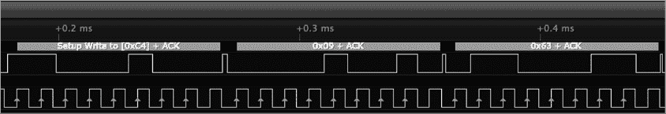
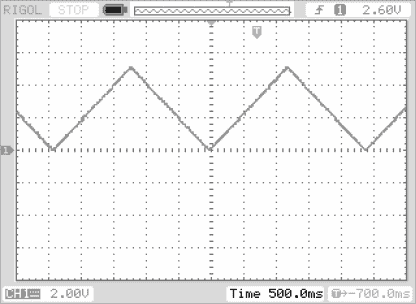
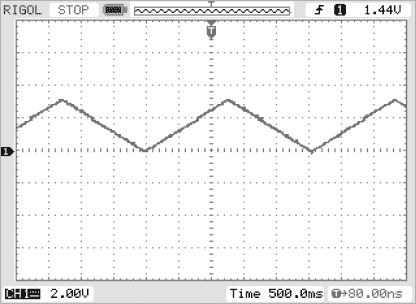
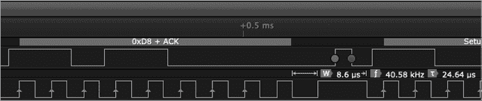

# 第八章：Arduino I²C 编程


本章的 I²C 编程将从讨论 Arduino 平台开始，因为可以说为 Arduino 编写的 I²C 代码行数可能超过了其他任何平台。

本章涵盖以下内容：

+   基础 I²C 编程介绍

+   讨论 Arduino 库和 IDE 使用的 Wire 编程模型

+   Arduino I²C 读写操作

+   访问多个 I²C 端口的不同 Arduino 设备

本书倾向于以 Arduino *草图*（程序）为基础来举例，所以在接下来的章节中，深入理解 Arduino I²C 编程将对你大有帮助。

## 8.1 基础 I²C 编程

在第二章中，你学习了 I²C 传输开始于输出起始条件，接着是地址-读写字节，接下来是零个或多个数据字节，最后以停止条件结束。控制器将这些数据字节放到 I²C 总线上，可能是通过位运算或某些硬件寄存器实现的。

这次传输中唯一对所有 I²C 设备通用的部分是起始条件、第一次地址字节和停止条件。控制器在地址字节后直到遇到停止条件之前传输的任何字节都是特定于响应该地址字节的外设的。

MCP4725 支持几种基于你在地址字节后立即传输的数据的命令格式。本书中的编程示例将只使用其中一种命令：*快速模式写入命令*。该命令在 I²C 总线上需要 3 个字节，如 表 8-1 所示。

表 8-1: 快速模式写入命令

| **第一个字节** | **第二个字节** | **第三个字节** |
| --- | --- | --- |
| 地址 | 高位 DAC 值 | 低位 DAC 值 |
| `aaaa aaax` | `0000 hhhh` | `llll llll` |

在表 8-1 中，`aaaa aaa`位是 MCP4725 的地址。这些地址位是`1100cba`，其中`c`和`b`是硬编码到 IC 中的，而`a`来自芯片上的地址线。它对应于地址 0x60 至 0x67。（请记住，I²C 协议将这些地址位左移一位，并期望 R/W 位在第 0 位。因此，地址字节实际上会包含值 0xC0 到 0xCF，具体取决于 IC 的地址和 R/W 线的状态。）`hhhh llll llll`位是要写入数字到模拟转换电路的 12 位数据。第二个字节的高 4 位必须为零（它们指定快速模式写入命令和关机模式）。假设芯片使用 5V 电源，3 字节序列*0xC0, 0x00, 0x00*（来自表 8-1 的 3 个字节）将把 12 位值 0x000 写入地址 0x60 的 DAC，这将使 DAC 的输出端出现 0V。写入 3 字节序列*0xC0, 0x08, 0x00*将把 2.5V 输出到输出引脚。写入 3 字节序列*0xC0, 0x0F, 0xFF*将把 5V 输出到模拟输出引脚。通常，0x000 到 0xFFF 之间的值（线性）映射到 DAC 模拟输出端的 0V 到 5V 之间的电压。您只需要通过某种方式将这 3 个字节放置到 I²C 总线上。

而 DAC 使用第二个字节的高 4 位来指定命令（0b0000 是快速模式写入命令），DAC 的读取命令更简单。地址字节中的 R/W 位就是 MCP4725 确定如何响应的全部内容。它通过返回 5 个字节来响应：第一个是一些状态信息（在第十五章中我会详细讨论 MCP4725 之前，您可以忽略它），第二个字节包含写入 DAC 的最后一个值的高 8 位，第三个字节包含写入的最后一个值的低 4 位（第 4 至第 7 位），而第 0 至第 3 位不包含任何有效数据。第四和第五个字节包含一些状态信息和芯片内 EEPROM 中存储的 14 位（有关 EEPROM 的更多信息，请参见第十五章）。

您如何将字节放置到 I²C 总线上以及如何从 I²C 总线上读取数据，完全取决于您使用的系统、库函数和操作系统（如果有的话）。本章讨论了 Arduino 上的 I²C，因此我们将考虑如何使用 Arduino 库代码在 I²C 总线上读取和写入数据。

## 8.2 基本的 Wire 编程

负责 I²C 通信的 Arduino 库是 Wire 库。I²C 通信功能并未内置于 Arduino 语言中（Arduino 语言实际上只是 C++，并附带了一些默认的包含文件）。相反，您需要通过在程序源文件的开头附近包含以下语句来启用 Arduino 的 I²C 库代码：

```
#include <Wire.h>
```

请注意，在某些操作系统（尤其是 Linux）中，*Wire.h*必须以大写的*W*开头。

*Wire.h*头文件创建了一个名为`Wire`的单例类对象，你可以使用它来访问类的函数。你不需要在程序中声明这个对象；头文件会自动为你完成这项工作。接下来的章节将介绍各种可用的`Wire`函数。

### 8.2.1 Wire 实用函数

`Wire.begin()`函数初始化 Arduino 的 Wire（I²C）库。在执行 Wire 库中的任何其他函数之前，必须先调用此函数。通常约定是在 Arduino 的`setup()`函数中调用此函数。

如果不带参数，`Wire.begin()`将初始化库，使其作为 I²C 总线上的控制器设备工作。如果你指定一个 7 位整数作为参数，则会初始化库，使其作为 I²C 总线上的外设设备工作。

`Wire.setClock()`函数允许你更改 I²C 时钟频率，并通过整数参数传递。此调用是可选的；默认时钟频率为 100 kHz。大多数 Arduino 板支持 100,000 或 400,000 作为参数。一些高性能板可能支持 3,400,000（高速模式）。还有一些支持 10,000（SMBus 上的低速模式）。

请记住，I²C 总线上的所有外设和 CPU 必须能够支持你选择的时钟频率。也就是说，你必须设置一个不快于总线上最慢外设的时钟频率。

### 8.2.2 Wire 读操作

`Wire.requestFrom()`函数用于从 I²C 外设设备读取数据。`Wire.requestFrom()`函数调用有两种形式：

```
Wire.requestFrom( `address`, `size` )
Wire.requestFrom( `address`, `size`, `stopCond` )
```

在这些调用中，`address`是 7 位外设地址，`size`是要从设备读取的字节数， 可选的`stopCond`参数指定是否在接收到字节后发出停止条件（如果为 true）。如果为 false，则函数会发送重启条件。如果没有提供可选的`stopCode`参数，函数将使用默认值`true`（在接收到数据后发出停止条件）。

一旦控制器接收到外设的数据，应用程序可以使用`Wire.read()`和`Wire.available()`函数读取这些数据。`Wire.available()`函数返回内部接收缓冲区中剩余的字节数，而`Wire.read()`函数从缓冲区读取一个字节。通常，你会使用这两个函数，通过以下类似的循环来读取内部缓冲区中的所有数据：

```
while( Wire.available() )
{ 
    char c = Wire.read(); // Read byte from buffer

    // Do something with the byte just read.
}
```

无法保证外设在调用`Wire.requestFrom()`函数时实际上会传输请求的字节数——外设可能返回*更少*的数据。因此，始终使用`Wire.available()`函数来准确判断内部缓冲区中的数据量；不要自动假设它是你请求的数量。

外设决定返回给控制器的实际数据量。在几乎所有情况下，数据量是固定的，并在外设的数据手册中指定（或由外设设计确定）。理论上，外设也可以返回可变数量的数据。如何获取这些数据由外设的设计决定，超出了本章的讨论范围。

要从外设设备读取数据，控制器必须向该外设传输外设地址和 R/W 位（该位等于 1）。`Wire.requestFrom()`函数处理此操作。之后，外设将传输其数据字节。Arduino 控制器将接收这些字节并将其缓冲，以便稍后读取。然而，请注意，完整的读取操作是在执行`Wire.requestFrom()`函数时进行的。

### 8.2.3 I²C 写操作

控制器可以使用`Wire.beginTransmission()`、`Wire.endTransmission()`和`Wire.write()`函数向外设写入数据。`beginTransmission()`和`endTransmission()`函数将一系列写操作括起来。

`Wire.beginTransmission()`函数具有以下形式：

```
Wire.beginTransmission(address)
```

其中，`address`是 7 位外设地址。此函数调用构建数据传输的第一个字节，包括地址和清晰的 R/W 位。

`Wire.write()`函数有三种形式：

```
Wire.write( `value` ) 
Wire.write( `string` ) 
Wire.write( `data`, `length` )
```

第一种形式将一个字节附加到内部缓冲区，以便传输到外设。第二种形式将字符串中的所有字符（不包括零终止字节）添加到内部缓冲区，以便传输到外设。第三种形式将字节数组中的一些字节复制到内部缓冲区（第二个参数指定要复制的字节数）。

`Wire.endTransmission()`函数从内部缓冲区获取地址字节和数据字节，并通过 I²C 总线进行传输。此函数调用有两种形式：

```
Wire.endTransmission()
Wire.endTransmission( stopCond )
```

第一种形式传输内部缓冲区中的数据，并在传输后发送停止条件。第二种形式使用单个布尔值参数来决定在传输数据后是否发送停止条件（如果`stopCond`为`false`，则下一个读写操作将从重启开始）。

请记住，实际的数据传输直到执行`Wire.endTransmission()`函数调用时才会发生。其他调用只是将数据积累到内部缓冲区，以便稍后传输。

### 8.2.4 外设总线函数

到目前为止，Arduino 函数假设 Arduino 充当 I²C 总线控制器设备。你也可以编程让 Arduino 充当外设设备。Arduino 库提供了两个函数用于此目的：

```
Wire.onReceive( inHandler )
Wire.onRequest( outHandler )
```

在第一个函数中，`inHandler`是指向具有以下原型的函数的指针：`void inHandler( int numBytes )`。在第二个函数中，`outHandler`是指向具有以下原型的函数的指针：`void outHandler()`。

每当（外部）控制器设备请求数据时，Arduino 系统将调用`outHandler`。然后，`outHandler`函数将使用`Wire.beginTransmission()`、`Wire.endTransmission()`和`Wire.write()`函数将外设的数据传输回（外部）控制器。`inHandler`函数将使用`Wire.begin()`、`Wire.available()`和`Wire.read()`函数从控制器设备检索数据。

## 8.3 Arduino I²C 写入示例

清单 8-1 中的程序演示了如何使用 I²C 总线与 SparkFun MCP4725 DAC 扩展板进行通信。该程序为 Teensy 3.2 编写并进行了测试，尽管它也应适用于任何兼容的 Arduino 设备（只是时序略有不同）。

该程序通过不断地将 DAC 输出从 0x0 增至 0xfff（12 位），然后再从 0xfff 减至 0x0，生成连续的三角波。正如你所看到的，当在我的设置上运行时，该程序生成的三角波周期略小于 2.4 秒（大约 0.42 Hz）（你的结果可能会有所不同）。该频率由将 8,189 个 12 位数值写入 DAC 所需的时间决定。由于每次传输需要 3 个字节（地址、HO 字节和命令、LO 字节），再加上起始和停止条件的时序，在 100 kHz 下，每传输一个值需要大约 35 个比特时间（每个比特时间为 10 微秒）。

```
// Listing8-1.ino
//
// A simple program that demonstrates I2C
// programming on the Arduino platform.

#include <Wire.h>

// I2C address of the SparkFun MCP4725 I2C-based
// digital-to-analog converter.

#define MCP4725_ADDR 0x60

void setup( void )
{
    Serial.begin( 9600 );
    delay( 1000 );
    Serial.println( "Test writing MCP4725 DAC" );
    Wire.begin(); // Initialize I2C library
}

void loop( void )
{
    // Send the rising edge of a triangle wave:

    for( int16_t dacOut = 0; dacOut < 0xfff; ++dacOut )
    {
        // Transmit the address byte (and a zero R/W bit):

      ❶ Wire.beginTransmission( MCP4725_ADDR );

        // Transmit the 12-bit DAC value (HO 4 bits
        // first, LO 8 bits second) along with a 4-bit
        // Fast Mode Write command (00 in the HO 2 bits
        // of the first byte):

      ❷ Wire.write( (dacOut >> 8) & 0xf );
        Wire.write( dacOut & 0xff );

        // Send the stop condition onto the I2C bus:

      ❸ Wire.endTransmission( true );

        // Uncomment this delay to slow things down
        // so it can be observed on a multimeter:
        // delay( 5 );
    }

    // Send the falling edge of the triangle wave:

    for( int16_t dacOut = 0xffe; dacOut > 0; --dacOut )
    {
        // See comments in previous loop.

        Wire.beginTransmission( MCP4725_ADDR );   
        Wire.write( (dacOut >> 8) & 0xf );
        Wire.write( dacOut & 0xff );      
        Wire.endTransmission( true );     

        // Uncomment this delay to slow things down
        // so it can be observed on a multimeter:
        // delay( 5 );
    }
}
```

`Wire.beginTransmission()`初始化 Wire 库以开始接收数据，并准备在 I²C 总线上进行（后续的）传输❶。`Wire.write()`函数将数据复制到用于稍后传输的内部`Wire`缓冲区❷。之后，`Wire.endTransmission()`指示设备实际上开始将内部`Wire`缓冲区中的数据传输到 I²C 总线上❸。

图 8-1 显示了程序在执行清单 8-1 时，在 I²C 总线上出现的一个 DAC 3 字节传输（该传输是将 0x963 写入 DAC）。



图 8-1：三角波传输过程中的 I²C 输出示例

如你在图 8-2 中出现的示波器输出中所看到的，三角波的一个完整周期（一个上升沿和一个下降沿）大约需要 2.4 秒。使用逻辑分析仪，我能够确定每个 3 字节传输所需的时间略小于 300 微秒，这大致与你在图 8-2 的示波器输出中看到的情况相符。需要注意的是，传输之间的时序并不恒定，每次传输之间的时间差会有几个微秒的波动。这意味着 300 微秒并不是 3 字节传输的固定时间。

这个软件基于 100 kHz 总线速度能够产生的最大频率大约为 0.4 Hz。为了产生更高的频率值，您需要将 I²C 总线运行在更高的时钟频率（例如 400 kHz），或者减少每单位时间写入 DAC 的值的数量（例如，您可以通过将循环计数器增量设置为 2 而不是 1 来将频率加倍）。



图 8-2：来自 MCP4725 的三角波输出

清单 8-1 中的代码在每次 DAC 传输后都会释放 I²C 总线。如果总线上有其他控制器与不同的外设进行通信，这将进一步降低三角波的最大时钟频率（更不用说，如果输出序列中有很多暂停，可能会对三角波产生一些失真）。理论上，您可以通过在传输期间拒绝释放 I²C 总线来防止这种失真；然而，考虑到这里所需的传输数量，要生成无失真的三角波，唯一合理的解决方案是确保 MCP4725 是 I²C 总线上唯一的设备。

## 8.4 Arduino I²C 读取示例

从根本上说，DAC 是一个（模拟）仅输出的设备。您将一个值写入 DAC 寄存器，并且模拟电压会神奇地出现在模拟输出引脚上。从 DAC 读取没有太大意义。话虽如此，MCP4725 芯片确实支持 I²C 读取操作。一个读取命令会返回 5 个字节。

要从 MCP4725 读取值，只需将设备的地址放置到 I²C 总线上，并将 R/W 线拉高。MCP4725 会响应并返回 5 个字节：第一个字节为状态信息，接下来的两个字节是最后写入的 DAC 值，最后一对字节是 EEPROM 值。EEPROM 存储一个默认值，用于在设备上电时初始化模拟输出引脚，在写入任何数字值到芯片之前。更多详细信息请参见第十五章。

清单 8-2 中的程序演示了一个 I²C 读取操作。

```
// Listing8-2.ino
//
// This is a simple program that demonstrates 
// I2C programming on the Arduino platform.
//
// This program reads the last written DAC value
// and EEPROM settings from the MDP4725\. It was
// written and tested on a Teensy 3.2, and it also
// runs on an Arduino Uno.

#include <Wire.h>

// I2C address of the SparkFun MCP4725 I2C-based
// digital-to-analog converter.

#define MCP4725_ADDR 0x60

#define bytesToRead (5)
void setup( void )
{
    int     i = 0;
    int     DACvalue;
    int     EEPROMvalue;
    byte    input[bytesToRead];

    Serial.begin( 9600 );
    delay( 1000 );
    Serial.println( "Test reading MCP4725 DAC" );
 Wire.begin();  // Initialize I2C library

    Wire.requestFrom( MCP4725_ADDR, bytesToRead );
    while( Wire.available() )
    {
        if( i < bytesToRead )
        {
            input[ i++ ] = Wire.read();
        }
    }

    // Status byte is the first one received:

    Serial.print( "Status: " );
    Serial.println( input[0], 16 );

    // The previously written DAC value is in the
    // HO 12 bits of the next two bytes:

    DACvalue = (input[1] << 4) | ((input[2] & 0xff)  4);
    Serial.print( "Previous DAC value: " );
    Serial.println( DACvalue, 16 );

    // The last two bytes contain EEPROM data:

    EEPROMvalue = (input[3] << 8) | input[4];
    Serial.print( "EEPROM value: " );
    Serial.println( EEPROMvalue, 16 );

    while( 1 ); // Stop
}

void loop( void )
{
    // Never executes.
}
```

以下是来自清单 8-2 程序的输出。请注意，输出仅对我特定的设置有效。其他 MCP4725 板可能有不同的 EEPROM 值。此外，先前的 DAC 值输出是特定于我特定系统上最后一次写入的（这可能是清单 8-1 中的最后一次输出，当时我在上一个程序运行时上传了清单 8-2 中的程序）。

```
Test reading MCP4725 DAC
Status: C0
Previous DAC value: 9B
EEPROM value: 800
```

在这个输出中唯一有趣的事情是，我已编程 MCP4725 的 EEPROM，在上电时将输出引脚初始化为 2.5V（在 5V 电源下的中间值）。

### 8.5 Arduino I²C 外设示例

前两节从控制器设备的角度描述了读写操作。本节描述了如何创建一个作为 I²C 外设设备的 Arduino 系统。特别是，列表 8-3 中的源代码使用 Teensy 3.2 模块模拟 MCP4725 DAC 设备。Teensy 3.2 具有一个板载 12 位 DAC，连接到 A14 引脚。写入 0x000 到 0xfff 之间的值会在该引脚产生 0V 到+3.3V 之间的电压。列表 8-3 中的代码将`rcvISR`（和 ISR）与数据接收中断相关联。当数据到达时，系统会自动调用此例程，并传递 I²C 总线上接收到的字节数。

`rcvISR`中断服务例程（ISR）从控制器接收传输到外设的字节，构建这些字节的 12 位 DAC 输出值，然后将这 12 位写入 DAC 输出（使用 Arduino 的`analogWrite()`函数）。输出完成后，代码等待下一个传输的发生。就像一个调试和测试功能，这个程序每 10 秒钟将一个字符串写入`Serial`输出，以便你可以验证程序是否仍在运行。

```
// Listing8-3.ino
//
// This program demonstrates using an
// Arduino as an I2C peripheral.
//
// This code runs on a Teensy 3.2
// module. A14 on the Teensy 3.2 is
// a true 12-bit, 3.3-V DAC. This program
// turns the Teensy 3.2 into a simple
// version of the MCP4725 DAC. It reads
// inputs from the I2C line (corresponding
// to an MCP4725 fast write operation)
// and writes the 12-bit data to the
// Teensy 3.2's hardware DAC on pin A14.

#include <Wire.h>

// I2C address of the SparkFun MCP4725 I2C-based
// digital-to-analog converter.

#define MCP4725_ADDR 0x60

// Interrupt handler that the system
// automatically calls when data arrives
// on the I2C lines.

void rcvISR( int numBytes )
{
    byte LObyte;
    byte HObyte;
    word DACvalue;

 // Expecting 2 bytes to come
    // from the controller device.

    if( numBytes == 2 && Wire.available() )
    {
        HObyte = Wire.read();
        if( Wire.available() )
        {
            LObyte = Wire.read();

            DACvalue = ((HObyte << 8) | LObyte) & 0xfff;
            analogWrite( A14, DACvalue );
        }
    }
}

// Usual Arduino initialization function:

void setup( void )
{
    Serial.begin( 9600 );
    delay( 1000 );
    Serial.println( "I2C peripheral test" );

    // Initialize the Wire library to treat this
    // code as an I2C peripheral at address 0x60
    // (the SparkFun MCP4725 breakout board):

    Wire.begin( MCP4725_ADDR );

    // Set up the Teensy 3.2 DAC to have
    // 12-bit resolution:

    analogWriteResolution(12);

    // Define the I2C interrupt handler
    // for dealing with incoming I2C
    // packets:

    Wire.onReceive( rcvISR );
}

void loop( void )
{
   Serial.println( "MCP4725 emulator, waiting for data" );
   delay( 10000 ); // Delay 10 seconds
}
```

我将两个 Teensy 3.2 设备的 SCL、SDA 和 Gnd 引脚连接在一起（使用 Teensy 和 Arduino 也可以）。在其中一个单元上，我编写了类似于列表 8-1 中找到的 DAC 输出代码。在另一个单元上，我编写了列表 8-3 中的代码。我将示波器连接到运行外设代码（列表 8-3）的 Teensy 的 A14 引脚上。输出如图 8-3 所示。请注意，三角波的峰值在 0.0V 和 3.3V 之间（而不是图 8-2 中的 0V 和 5V），因为 Teensy 是一个 3.3V 设备。



图 8-3：Teensy 3.2 A14 引脚的三角波输出

图 8-4 显示了发生时钟拉伸时输出的一个小片段。



图 8-4：拉伸的时钟信号降低了三角波的频率。

如图 8-4 所示，时钟在字节传输后被拉伸到 8.4 微秒。

## 8.6 多 I²C 端口编程

标准的 Arduino 库假设板子上只有一个 I`2`C 总线（基于 Arduino Uno 的硬件）。许多 Arduino 兼容板提供多个 I²C 总线。这使你可以将 I²C 设备分布在多个总线上，从而让它们运行得更快，或者可能在不使用 I²C 总线多路复用器的情况下，连接两个具有相同地址的设备。

标准 Arduino 库不支持多个 I²C 总线；然而，支持多个 I²C 总线的设备通常会提供一些特殊的库代码，让您能够访问系统中的额外 I²C 总线。对于多个设备实例的 Arduino 约定，是在设备名称后加上数字后缀以指定特定的设备。在 I²C 总线的情况下，这些设备名称分别是 `Wire`（表示第一个或 0 号端口）、`Wire1`、`Wire2` 等等。

例如，要向第二个 I²C 端口写入一系列字节，您可以使用如下代码：

```
Wire1.beginTransmission( 0x60 );   
Wire1.write( (dacOut << 8) & 0xf );
Wire1.write( dacOut & 0xff );      
Wire1.endTransmission( true ); 
```

实现这一机制的方法是硬件和系统特定的。请查阅您特定单板计算机（SBC）的文档，了解如何实现此功能。

## 8.7 本章总结

Arduino 库提供了 `Wire` 对象来支持 I²C 总线事务。本章描述了 Arduino 库中可用的基本 `Wire` 函数，包括初始化 I²C 库、选择 I²C 时钟频率、发起从 I²C 外设读取、读取存放在内部缓冲区中的外设数据、初始化用于传输到外设的缓冲区等功能。

本章还包含了使用 SparkFun MCP4725 进行 I`2`C 通信的多个实际示例。
