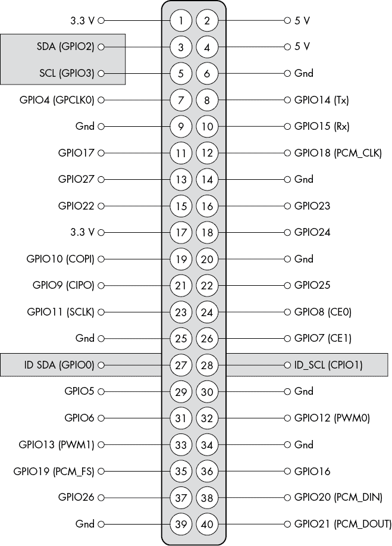
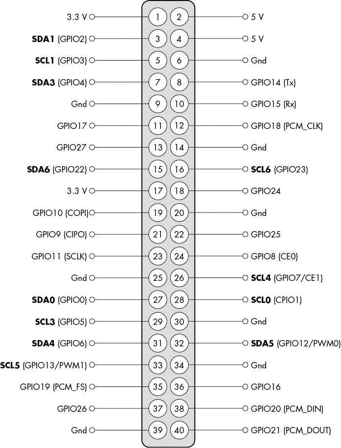
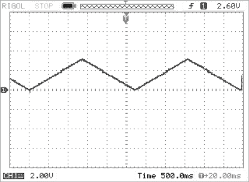
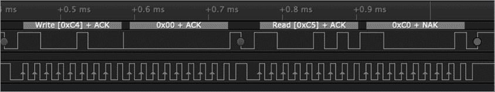

# 第九章：树莓派（和 Linux）I²C 编程


在 Arduino 之后，树莓派在 I²C 总线的使用上可能排第二。在某些方面，I²C 总线对树莓派硬件黑客来说甚至比对 Arduino 用户更重要，因为树莓派并不提供模拟到数字转换器。树莓派用户最常通过 I²C 总线为系统增加这类功能。

本章讨论了以下内容：

+   树莓派 GPIO 头上的 I²C 总线

+   如何在树莓派上启用 I²C 总线（默认情况下，它是禁用的）

+   如何设置 I²C 总线的速度，这对某些慢速外设可能是必要的，因为树莓派不支持时钟拉伸

+   如何在树莓派上使用 I²C 工具包

+   在树莓派上编程 I²C 设备

+   其他基于 Linux 的系统上的 I²C

+   在树莓派上通过位带操作实现的 I²C，以克服一些 Pi 的限制

尽管本章特别讨论树莓派单板计算机，Pi OS 实际上只是 Linux 操作系统的一个变种，因此本章中的许多信息也适用于通用的 Linux 系统以及树莓派。

## 9.1 树莓派通用输入输出头上的 I²C 总线引脚

树莓派一直支持至少一条 I²C 总线在 GPIO 连接器上。3 号和 5 号引脚（GPIO 2 和 GPIO 3）分别提供 SDA 和 SCL 线路。这些引脚在原始的 26 针 GPIO 头上就有。

在树莓派 B+推出后，GPIO 头扩展至 40 个引脚，并增加了第二条硬件 I²C 总线。第二条 I²C 总线（位于 40 针头的 27 号和 28 号引脚；见图 9-1）最初用于连接 Pi HAT 上的 EEPROM 设备——Pi HAT 是指“硬件附加在顶部”的树莓派附加板。I²C EEPROM 设备提供了板卡的标识信息，以便操作系统能够识别它，并以“即插即用”的方式加载适当的设备驱动程序。

第二条 I²C 线路最初是为 EEPROM、摄像头和 DSI 显示器使用而设计的。启用这些线路可能会导致显示器、摄像头和 HAT 单元出现故障，因此大多数程序员和系统设计师都会保持这些线路不变。然而，如果你不使用这些设备，你可以将 I²C 总线用于 27 号和 28 号引脚，按自己的需求使用。

从技术上讲，HDMI 连接器上还有第三条 I²C 总线（用于支持 VESA E-DDC 的 5V 变种）。理论上，经过一些工作，你可以使用它。然而，本书不会讨论该总线的使用，因为它实际上是为视频显示子系统使用而设计的。



图 9-1：树莓派总线上的主 I²C 和备用（HAT EEPROM）I²C 引脚

随着树莓派 4 的推出，可用的 I²C 总线数量再次增加。图 9-2 显示了树莓派 4 上 40 针 GPIO 连接器的引脚分配。



图 9-2：树莓派 4 GPIO 引脚分配图

图 9-2 显示了 Raspberry Pi 4 上的六个 I²C 总线：

1.  i2c-0 SDA0 和 SCL0 位于第 27 和 28 引脚

1.  i2c-1 SDA1 和 SCL1 位于第 3 和 5 引脚

1.  i2c-3 SDA3 和 SCL3 位于第 7 和 29 引脚

1.  i2c-4 SDA4 和 SCL4 位于第 31 和 26 引脚

1.  i2c-5 SDA5 和 SCL5 位于第 32 和 33 引脚

1.  i2c-6 SDA6 和 SCL6 位于第 15 和 16 引脚（与 i2c-0 共用这些引脚）

请注意，Raspberry Pi 上的 i2c-1 总线提供了拉升电阻至 +3.3 V。其他 I²C 端口则没有提供。因此，如果你启用除了 i2c-1 以外的任何 I²C 总线，你需要为该总线添加拉升电阻，以确保它能够正常工作。

## 9.2 手动激活 I²C 总线

默认情况下，Raspberry Pi OS 不会启用 GPIO 连接器上的任何 I²C 总线——这些引脚默认定义为 GPIO 引脚。你可以使用 raspi-config 应用程序来激活 I²C 总线。该应用程序会自动编辑适当的系统文件以激活 I²C 总线。如果你想手动进行这些更改，必须编辑 Raspberry Pi 上的几个文件，以启用相应的 I²C 总线。

如果你想激活 i2c-1，你需要以超级用户身份编辑 */boot/config.txt* 文本文件。在该文件中，你通常会找到以下这一行：

```
#dtparam=i2c_arm=on
```

该语句开头的`#`将整行变为注释，使得该语句对系统不可见，I²C 总线也被禁用。要激活 I²C 总线，只需删除该行开头的`#`字符。

`i2c_arm`标签告诉你，这个特定的 I²C 端口属于 ARM 处理器（Raspberry Pi 的 CPU）。第二个 I²C 端口（第 27 和 28 引脚，实际上是 Linux 的 i2c-0 端口）属于视频控制器芯片。你可以使用以下语句激活该 I²C 总线：

```
dtparam=i2c_vc=on
```

然而，Raspberry Pi 的文档非常明确指出，i2c-0 是为 HAT EEPROM 预留的，不应将其用于其他目的（请参见 [`github.com/raspberrypi/hats/blob/master/designguide.md`](https://github.com/raspberrypi/hats/blob/master/designguide.md)）。滥用这一建议需自行承担风险。

如果你编辑了*/boot/config.txt*中的`dtparam=i2c_arm=on`语句并重新启动，你会发现 I²C 总线仍然不可用。这是因为 Raspberry Pi OS 使用可加载的内核模块（LKM）来处理 I²C 相关的操作。此时，系统尚未加载相应的模块。要加载这些模块，请执行以下两条命令：

```
modprobe i2c-bcm2708 #Note:use i2c-bcm2835 on Pi zero W, 3, and 4
modprobe i2c-dev
```

当然，如果你一直使用 I²C，每次启动系统时手动加载这些模块会变得很麻烦。如果你以超级用户身份编辑*/etc/modules*文件，并将以下两行添加到该文件中，系统将在启动时自动加载这些模块：

```
i2c-bcm2708
i2c-dev
```

如果你有一个 Raspberry Pi 4 系统，你可以通过将以下一行或多行添加到*/boot/config.txt*文本文件中，启用额外的 I²C 总线：

```
dtoverlay=i2c1,pins_2_3
dtoverlay=i2c3,pins_4_5
dtoverlay=i2c4,pins_6_7
dtoverlay=i2c5,pins_12_13
dtoverlay=i2c6,pins_22_23
```

`pins``_xx_yy` 参数引用的引脚编号是 GPIO 引脚编号，而不是 Pi 40 引脚连接器上的物理引脚编号。表 9-1 列出了 GPIO 引脚编号和物理引脚编号之间的对应关系。更多信息，请参见 [`www.raspberrypi.com/documentation/computers/os.xhtml#gpio-and-the-40-pin-header`](https://www.raspberrypi.com/documentation/computers/os.xhtml#gpio-and-the-40-pin-header) 。

表 9-1：GPIO 引脚与物理引脚编号对应关系

| **GPIO 引脚编号** | **连接器引脚编号** |
| --- | --- |
| GPIO 2 | 板 pin 3 |
| GPIO 3 | 板 pin 5 |
| GPIO 4 | 板 pin 7 |
| GPIO 5 | 板 pin 29 |
| GPIO 6 | 板 pin 31 |
| GPIO 7 | 板 pin 26 |
| GPIO 12 | 板 pin 32 |
| GPIO 13 | 板 pin 33 |
| GPIO 22 | 板 pin 15 |
| GPIO 23 | 板 pin 16 |

最后，请确保在 *config.txt* 中存在以下行：

```
enable_uart= 1
```

理论上，在树莓派上启用 UART（串行端口）不应该影响 Pi 上的 I²C。但实际上（至少在 Pi 3 上），如果您不包括此行，系统将以约 65 kHz 而不是名义上的 100 kHz 运行 SCL 线。

## 9.3 改变 I²C 时钟频率

默认情况下，树莓派将 I²C 时钟频率设置为 100 kHz。要更改主 I²C 总线（i2c-1）的速度，请在 */boot/config.txt* 中使用以下语句：

```
`dtparam=i2c_arm_baudrate=``xxxxxx`
```

其中 `xxxxxx` 代表您想要使用的时钟频率（例如 `100000`）。通常，您会将此语句直接放置在文件中 `dtparam=i2c_arm=on` 之后。

树莓派 OS 将选择一个小于或等于您指定值的可用时钟频率。

在树莓派 4 上，您可以使用以下语句设置 i2c-3、-4、-5 和 -6 的时钟频率：

```
dtoverlay=i2c3,pins_4_5
dtparam=baudrate=`xxxxxx` #sets clock frequency for i2c-3
dtoverlay=i2c4,pins_6_7
dtparam=baudrate=`xxxxxx` #sets clock frequency for i2c-4
dtoverlay=i2c5,pins_12_13
dtparam=baudrate=`xxxxxx` #sets clock frequency for i2c-5
dtoverlay=i2c6,pins_22_23
dtparam=baudrate=`xxxxxx` #sets clock frequency for i2c-6
```

再次提醒，Pi OS 将选择一个小于或等于您指定的实际值的时钟频率。

## 9.4 I²C 时钟拉伸问题及解决方案

截至撰写本文时，树莓派上的 I²C 协议已经存在已久的问题：Pi 不支持时钟拉伸。这个问题似乎与硬件有关；它存在已久（跨多种不同的树莓派型号），如果这是软件问题，我们期望早就修复了。关键问题在于，如果您有一个依赖于通过时钟拉伸添加等待状态的 I²C 设备，在标准 Pi I²C 设置上，该设备可能无法正常工作。

这个问题有两个解决方案。第一个是一个大的变通办法：使用上一节中的技术减少 SCL 时钟频率，希望将时钟速度降低到足以使外设处理 I²C 数据的程度。例如，Adafruit 建议将 I²C 时钟频率（*config.txt* 表示中的波特率）设置为 10 kHz。理想情况下，这么慢的速度可以给您的外设足够的时间来处理 I²C 数据。

降低时钟频率是不令人满意的，主要有两个原因。首先，没有保证新的、更慢的时钟频率能够为任意外设提供足够的时间来完成工作。其次，这种技术会减慢所有位传输，包括那些不使用时钟拉伸的外设，以及所有在使用时钟拉伸的设备上不需要时钟拉伸的位。总之，这种方法不能保证成功，而且效率非常低。

第二种解决方案是使用*位编程*（软件）I²C 传输。软件 I²C 处理可以正确地处理位拉伸。确实，位编程比硬件实现慢得多且效率低，但可能也不会比降低硬件 SCL 频率更慢。

要使用（任意）GPIO 引脚设置软件控制的 I²C 总线，请在你的*/boot/config.txt*文件中添加以下语句：

```
dtoverlay=i2c-gpio,bus=`x`,i2c_gpio_sda=`y`,i2c_gpio_scl=`z`
```

其中`x`表示总线号，`y`和`z`表示 Raspberry Pi GPIO 连接器上的 GPIO 引脚。这将创建一个使用名称`i2c-``x`的 I²C 设备，且该设备在指定的 GPIO 引脚上运行（这些是 GPIO 引脚的编号，而不是 Pi GPIO 连接器上的物理引脚编号）。

如果没有`i2c_gpio_sda`参数，系统将使用 GPIO 23 作为默认（连接器上的物理引脚 16）。如果没有`i2c_gpio_scl`参数，系统将使用 GPIO 24（物理引脚 18）作为默认。如果没有`bus`参数，系统将动态分配设备号，因此你确实应该显式提供`bus`参数。

请注意，i2c-gpio 设备可以使用任何任意 GPIO 引脚；你不必指定与 I²C 硬件相关联的引脚。这意味着通过使用基于软件的 I²C 设备，你实际上可以增加系统中支持的 I²C 总线数量（尽管说实话，如果你需要额外的 I²C 总线，I²C 多路复用器可能是一个更好的解决方案）。

通常情况下，我建议将所有依赖时钟拉伸的 I²C 设备放在 i2c-gpio 设备上，并将所有其他 I²C 设备放在基于硬件的 I²C 总线上，以提高系统效率。

## 9.5 Raspberry Pi OS（Linux）I²C 工具

在 Raspberry Pi 上，有几个 I²C 特定的工具非常有用。除了这些，还有一些常规的 Linux 和 Raspberry Pi 命令，在使用 I²C 设备时也很有用。

首先，为了确定 I²C 设备驱动程序是否能正常工作，请输入以下 Linux 命令：

```
**ls /dev/i2c***
```

此命令列出了当前可以访问的所有 Linux I²C 设备。例如，在我的 Raspberry Pi 4 上，得到以下输出：

```
/dev/i2c-1 /dev/i2c-6
```

这告诉我 I²C 接口 1（i2c-1，在引脚 3 和 5 上）和 I²C 接口 6（i2c-6，在引脚 15 和 16 上）目前处于活动状态。在尝试运行使用 I²C 信号的应用程序之前，你应该先运行此命令以验证 I²C 总线是否正常工作。

我将在本节中讨论的剩余四个工具属于 i2c-tools 包。最初，Raspberry Pi OS 并未默认包含这些工具，但后来的 Pi OS 版本似乎包含了它们。如果你的系统中没有这些工具，你必须使用以下命令下载它们：

```
**sudo apt-get install i2c-tools libi2c-dev** 
```

这会在你的系统上安装四个程序，`i2cdetect`、`i2cdump`、`i2cget`和`i2cset`。`i2cdump`工具主要用于查看 I²C EEPROM 设备的内容。在这里我们不再讨论这个应用程序；有关此代码的更多信息，请参阅 Linux 手册页。

`i2cget`和`i2cset`程序允许你从某些 I²C 设备读取字节或字，或向某些 I²C 设备写入字节或字。由于它们的操作方式，它们在本章中对我们来说的价值有限。这两个应用程序假设它们首先向 I²C 地址写入寄存器编号，然后写入附加数据（对于`i2cset`）或写入寄存器编号后读取指定寄存器的数据（对于`i2cget`）。这种方式适用于像 MCP23017 GPIO 扩展 IC 这样的 I²C 设备，但不适用于像我们本章示例中的 MCP4725 DAC 这样的设备。

要运行`i2cget`应用程序，请输入以下内容（大括号中的项是可选的）：

```
**i2cget {-y}** `i2cbus` `device_address` **{**`register` **{**`mode`**}}**
**i2cget -y** `i2cbus device_address register mode`
```

其中，`i2cbus`是活动 I²C 总线的编号（例如，*1*表示*i2c-1*），`device_address`是要读取的设备的 7 位 I²C 地址，`register`是 8 位寄存器编号（指定设备上的特定寄存器），`mode`是字母`b`、`w`或`c`之一（分别对应字节、字或读写字节）。如果`register`操作数存在，该命令将在总线上放置 I²C 地址并将`register`值写入 I²C 地址。在如 MCP23017 之类的设备上，这会设置 IC 内部的寄存器以供读取。下一步是读取操作，系统将从 IC 中读取指定的寄存器值。以 MCP4725 为例，由于你不能通过首先向 IC 写入字节来选择寄存器，因此在使用此命令时，你不应指定`register`参数。这样做会向 MCP4725 写入值，并影响模拟输出。

不幸的是，`i2cget`应用程序与 MCP4725 不太兼容。MCP4725 在读取芯片时会返回 5 字节的数据。`i2cget`命令最多只能读取 2 个字节。由于没有真正的方法使用此命令读取所有 MCP4725 数据，因此我们将在第十三章中忽略该命令。

`i2cset`命令是`i2cget`程序的输出版本。它具有以下语法：

```
**i2cset {-y}** `i2cbus` `device_address` `data_address` **{**`value`} **{**`mode`**}**
```

其中`i2cbus`和`device_address`的含义与`i2cget`命令中的相同。`data_address`参数实际上与`i2cget`命令中的`register`操作数相同：它是一个字节值，在地址字节放到总线上之后立即写入 IC，假设这是选择 IC 上的某个寄存器。

再次强调，由于该程序期望能够写入寄存器（`data_address`），它与 MCP4725 DAC 存在一些不兼容性。然而，通过一些技巧，实际上可以使其与 DAC 一起工作。MCP4725 期望一个 3 字节的传输（用于快速模式写入命令）。第一个字节当然是地址和读写位，第二个字节是 12 位 DAC 值的高 4 位，第三个字节是 DAC 值的低 8 位。事实证明，`i2cset`命令可以通过以下语法强制输出此数据：

```
i2cset -y `i2cbus` `device_address` `HOByte` `LOByte`
```

其中`HOByte`是 DAC 输出值的高 4 位，`LOByte`是 DAC 值的低 8 位。

在 i2c-tools 软件包中的四个实用程序中，`i2cdetect`程序无疑是最有用的。顾名思义，该程序用于检测 I²C 总线上的 I²C 设备。该程序有三种主要形式，下面的段落将对其进行描述。

```
**i2cdetect -l**
```

第一种形式扫描系统中所有可用的 I²C 总线并显示它们。请注意，命令行选项是`l`（字母 L，表示*列出*），而不是`1`（数字 1）。此命令类似于使用`ls /dev/i2c*`来识别可用的 I²C 总线。在启用了 I²C 的 Raspberry Pi 3 上执行此命令时，我得到以下输出：

```
i2c-1 i2c bcm2835 (i2c@7e804000) I2C adapter
```

`i2cdetect`命令的第二种形式输出关于指定 I²C 总线的状态和能力信息：

```
**i2cdetect -F** `bus`
```

下面是 Raspberry Pi 上`i2c-1`的示例输出：

```
Functionalities implemented by /dev/i2c-1:
I2C                              yes
SMBus Quick Command              yes
SMBus Send Byte                  yes
SMBus Receive Byte               yes
SMBus Write Byte                 yes
SMBus Read Byte                  yes
SMBus Write Word                 yes
SMBus Read Word                  yes
SMBus Process Call               yes
SMBus Block Write                yes
SMBus Block Read                 no
SMBus Block Process Call         no
SMBus PEC                        yes
I2C Block Write                  yes
I2C Block Read                   yes
```

有关这些 Linux 内核级功能的描述，请访问[`www.kernel.org/doc/html/latest/i2c/functionality.xhtml`](https://www.kernel.org/doc/html/latest/i2c/functionality.xhtml)。

`i2cdetect`命令的第三种形式扫描总线，寻找有效的 I²C 设备，并（如果可能）报告它们的存在：

```
**i2cdetect {-y} {-a} {-q|-r}** `bus` **{**`first last`**}**
```

其中`bus`是 I²C 总线规格（可以是一个整数，如`1`，也可以是总线名称，如`i2c-1`）。可选的`first`和`last`参数是设备地址（`first` < `last`），用于限制`i2cdetect`扫描的 I²C 总线地址范围。

通常，使用以下命令，或者传入不同的总线值作为参数：

```
**i2cdetect 1**
```

输入命令后，您将看到一个警告提示，说明此命令可能会干扰总线上的 I²C 设备。了解这一点后，系统会要求您确认是否希望该命令探测总线。

如果您希望在运行`i2cdetect`时跳过此提示（例如，在 shell 脚本中运行时），可以添加`-y`选项，告诉程序“自动回答是”：

```
**i2cdetect -y 1**
     0  1  2  3  4  5  6  7  8  9  a  b  c  d  e  f
00:          -- 04 -- -- -- -- -- -- -- -- -- -- -- 
10: -- -- -- -- -- -- -- -- -- -- -- -- -- -- -- -- 
20: -- -- -- -- -- -- -- -- -- -- -- -- -- -- -- -- 
30: -- -- -- -- -- -- -- -- -- -- -- -- -- -- -- -- 
40: -- -- -- -- -- -- -- -- -- -- -- -- -- -- -- -- 
50: -- -- -- -- -- -- -- -- -- -- -- -- -- -- -- -- 
60: -- -- 62 -- -- -- -- -- -- -- -- -- -- -- -- -- 
70: -- -- -- -- -- -- -- --
```

这个矩阵显示了有效的 I²C 地址以及`i2cdetect`是否在该地址找到设备。`--`条目表示`i2cdetect`认为该地址上没有设备，而矩阵中的十六进制数字表示该地址上存在设备。在这个例子中，`i2cdetect`在地址 0x04（可能是 Broadcom I²C 硬件，因为该地址保留给高速控制器）和地址 0x62（我当前连接到总线的 Adafruit MCP4725 设备）找到了两个设备。

如果矩阵中的某个条目显示`UU`，说明该地址上安装了一个设备，但该设备当前正在被内核使用，例如，当你将实时时钟（RTC）连接到系统，以便在系统启动时自动设置日期和时间时，通常会发生这种情况。

如第二章所述，I²C 总线没有提供标准化的设备检测机制。特别是，SMBus 设备可能会在没有数据载荷的情况下简单地尝试读取或写入设备时产生不良反应。因此，`i2cdetect`程序可能仅通过探测就会改变 I²C 设备在总线上的状态，这也是为什么在传输数据之前，`i2cdetect`要求你确认是否真的要扫描总线的原因。

因为`i2cdetect`可能会干扰总线上某些类型的外设，它提供了一个选项来限制扫描的地址范围。例如，如果你知道安装了一个 MCP4725 DAC，但不知道它连接到哪个地址，可以使用以下命令来搜索 DAC：

```
**i2cdetect -y 1 0x60 0x67**
```

`0x60`和`0x67`参数限制了程序的扫描范围（我们知道 MCP4725 的地址必须在 0x60 到 0x67 范围内，因为它的硬件设计决定了这个范围）。

`-q`（快速写入）和`-r`（快速读取）参数是高级选项，使用这些选项可能会损坏 EEPROM 或导致系统挂起。请参阅`i2cdetect`手册页面了解详细信息，并在使用这些选项之前认真考虑你的操作。

## 9.6 读取和写入 I²C 数据

一旦你安装并初始化了 I²C 驱动程序，I²C 总线上的数据传输和接收就相对简单了。像大多数设备一样，树莓派操作系统（Linux）将 I²C 总线视为文件。你像打开文件一样打开设备驱动程序，然后使用 Linux 的`read()`和`write()`函数读取和写入数据。

首先，调用 Linux 的`open()`函数获取与 I²C 总线关联的文件句柄：

```
`handle` = open( `busName`, O_RDWR );
```

其中，`handle`是整数（文件描述符）类型，`busName`是一个包含你要使用的 I²C 总线设备名称的字符串。总线名称是你在`/boot/config.txt`文件中定义的*/dev/i2c**名称。例如，标准的 I²C 总线是*/dev/i2c-1*。

`open()`函数在出错时返回负数，成功时返回非负的文件句柄值。保存文件句柄值，以便稍后可以读取和写入数据。

在访问 I²C 总线之前，必须使用 Linux 的`ioctl()`（I/O 控制）函数设置要访问的外设设备的地址，方法如下：

```
`result` = ioctl( `handle`, I2C_SLAVE, `i2cAddr` );
```

其中`result`是一个整数变量，用于存储错误的返回结果，`handle`是`open()`函数调用返回的句柄，`i2cAddr`是要访问的外设的 7 位地址。

你可以在同一个文件句柄上多次调用`ioctl()`，以便在同一 I²C 总线上访问不同的外设。树莓派操作系统将继续使用相同的外设地址进行所有读写操作，直到你显式更改它。

要从 I²C 外设读取数据，可以使用 Linux 的`read()`函数，语法如下：

```
`result` = read( `handle`, `buffer`, `bufferSize` );
```

其中`result`是一个整数变量，用于存储函数返回结果（如果发生错误则为负值，如果读取字节数为非负值，则为读取的字节数），`handle`是`open()`函数返回的 I²C 总线句柄，`buffer`是一个字节数组，用于接收数据，`bufferSize`是要读取的字节数。如果一切正常，函数将返回`bufferSize`作为结果。

要将数据写入外设，使用`write`函数：

```
`result` = write( `handle`, `buffer`, `bufferSize` );
```

参数与`read()`相同，不同之处在于缓冲区存储要写入的数据（而不是存储读取数据的位置）。

清单 9-1 中的程序演示了如何使用`open()`、`read()`、`write()`和`ioctl()`函数在 I²C 总线上读取和写入数据。与前一章一样，这个程序在 MCP4725 DAC 输出端口上发出三角波。

```
// Listing9-1.cpp

// Demonstrates reading from and
// writing to an MCP4725 DAC.

#include <unistd.h>        
#include <fcntl.h>         
#include <sys/ioctl.h>     
#include <linux/i2c-dev.h> 

#include <stdio.h>
#include <string.h>
#include <errno.h>

#define ever ;;

❶ #define i2cDevname      "/dev/i2c-1"
//#define i2cAddr (0x60) // Adafruit MCP4725 address
#define i2cAddr (0x62)   // SparkFun MCP4725 address

int main()
{
    #define bufferSize (5)

    static unsigned char buffer[bufferSize + 1];

    // Open the I2C interface (i2c-1):

 ❷ int fd_i2c = open( i2cDevname, O_RDWR );

    if( fd_i2c < 0 )
    {
        printf
        ( 
            "Error opening %s, terminating\n", 
            i2cDevname 
        );
        return -1;
    }

    // Assign the device address of the MCP4725 to
    // the open handle:

  ❸ int result = ioctl( fd_i2c, I2C_SLAVE, i2cAddr );
    if( result < 0 )
    {
        printf
        ( 
            "Error attaching MCP4725: %d, %s\n", 
            result, 
            strerror( result ) 
        );
        return result;
    }

    // Just for fun, read the 5 data bytes from the
    // MCP4725.

  ❹ result=read( fd_i2c , buffer, bufferSize );
    if( result < 0 )
    {
        printf
        ( 
            "Error reading from %s, terminating: %s\n", 
            i2cDevname, 
            strerror( errno )
        );
 return -1;
    }

    printf( "Data from DAC:\n" );
    for ( int i = 0; i < bufferSize; i++ )
    {
        printf( "0x%02x ", (int) buffer[i] );
    }
    printf( "\n" );

    // Continuously send a triangle wave to the 
    // MCP4725 until the user hits CTRL-C:

    for(ever)
    {
        // Output the rising edge:

        for( int i=0; i < 4095; ++i )
        {
            buffer[0] = (i >> 8) & 0xf; // HO 4 bits is first
            buffer[1] = i & 0xff;       // LO byte is second

            // Write the two bytes to the DAC:

          ❺ result = write( fd_i2c, buffer, 2 );
        }

        // Output the falling edge:

        for( int i=4095; i > 1; --i )
        {
            buffer[0] = (i >> 8) & 0xf; // HO 4 bits is first
            buffer[1] = i & 0xff;       // LO byte is second

            // Write the two bytes to the DAC:

            result = write( fd_i2c, buffer, 2 );
        }
    }

    return 0;
}
```

在清单 9-1 中，树莓派 I²C 主端口的 Linux 文件名是`"/dev/i2c-1"` ❶。要写入树莓派 I²C 端口，像打开文件一样打开它 ❷。要读取或写入特定的 I²C 地址，必须首先发出带有`I2C_SLAVE`参数和要使用的 I²C 地址的`ioctl()`调用。从那时起（直到另一个`ioctl()`调用更改地址为止），对 I²C 总线的读写将使用此地址 ❸。要从 I²C 总线读取数据，只需调用`read()`函数，指定先前`open()`调用返回的 I²C 端口的文件句柄 ❹。要将数据写入 I²C 总线，调用`write()`函数并指定 I²C 文件句柄 ❺。

图 9-3 显示了示波器上的 DAC 输出。



图 9-3：树莓派 3 的三角波输出

输出只有 3.3 V（而不是 5 V），因为树莓派是 3.3 V 的设备（我在 3.3 V 下运行 MCP4725，尽管你可以在 5 V 下运行它，只要 SCL 和 SDA 线是 3.3 V）。

## 9.7 高级 I²C 内核调用

尽管使用`open()`、`read()`、`write()`和`ioctl()`对于简单的 I²C 总线事务来说相当有效，但`ioctl()`函数的不同形式提供了更多高级操作，称为*内核函数调用*。

内核函数调用通过 Linux `ioctl()` API 函数进行。你将一些参数封装在一个数据结构中，并附带一个函数标识符，然后调用 `ioctl()`。`ioctl()` 函数解码其参数，并将参数传递给指定的函数。该函数返回适当的函数结果（通过 `ioctl()` 返回值和你传递给 `ioctl()` 的参数列表）。考虑以下 `i2c_smbus_access()` 函数，它为各种 Linux SMBus（I²C）函数调用设置参数：

```
#include <linux/i2c.h>

static inline __s32 i2c_smbus_access
(
    int file, 
    char read_write, 
    __u8 command,
    int size, 
    union i2c_smbus_data *data
){
    struct i2c_smbus_ioctl_data args;

    args.read_write = read_write;
 args.command = command;
    args.size = size;
    args.data = data;
    return ioctl( file,I2C_SMBUS,&args );
}
```

这个函数将其参数复制到一个本地数据结构（`args`）中，然后将它们与 `I2C_SMBUS` 参数一起传递给 `ioctl()` 函数，告诉 `ioctl()` 调用其中一个 SMBus 函数；`args.command` 参数指定要调用的特定函数。大多数 `I2C_SMBUS` 函数使用相同的参数列表：`args` 结构中的 `read_write`、`size` 和 `data` 字段。

请注意，`i2c_smbus_access()` 实际上并不是一个特定的 SMBus 函数。它是一个将参数封装并传递给 `ioctl()` 的函数，一个 *分发函数*：一个单一的入口点（在本例中是操作系统），将控制（分发）传递给多个不同的函数之一。一个特定的 SMBus 函数示例是 `i2c_smbus_read_byte()`：

```
static inline __s32 i2c_smbus_read_byte( int file )
{
    union i2c_smbus_data data;
    if
    ( 
        i2c_smbus_access
        (
            file,
            I2C_SMBUS_READ,
            0,
            I2C_SMBUS_BYTE,
            &data
        )
    ){
        return -1;
    }
    return 0x0FF & data.byte;
}
```

该函数使用 `i2c_smbus_access()` 来封装参数并实际调用 `ioctl()`。

以下子章节描述了通过 `ioctl()` 分发器可以使用的 SMBus 函数。虽然其中一些函数非常特定于 SMBus，但许多函数对于普通的 I²C 操作非常有用。

### 9.7.1 i2c-dev 函数

*linux/i2c-dev.h* 头文件定义了以下的 SMBus 函数。前面章节中输入的 `apt-get install libi2c-dev` 命令会安装这个头文件，从而让你在应用程序中使用此库。你不需要在代码中链接特定的库来使用这些函数，因为 `i2c-dev` 函数作为内核（或可加载模块）的一部分安装，并通过 `ioctl()` API 调用来访问这些函数。要访问这些函数，请在 C/C++ 应用程序的开头包含以下语句：

```
**extern "C" { // Required for CPP compilation**
 **#include <linux/i2c-dev.h>**
 **#include <i2c/smbus.h>**
 **#include <sys/ioctl.h>**
**}**
```

头文件本身包含了以下章节描述的函数定义。它们都是 *static inline* 函数，因此编译器会直接在你调用的地方（作为宏）展开它们。

通过自身的包含文件，此头文件定义了表 9-2 中显示的类型。

表 9-2：整数类型

| **类型** | **含义** |
| --- | --- |
| __u8 | 无符号 8 位整数 |
| __u16 | 无符号 16 位整数 |
| __u32 | 无符号 32 位整数 |
| __s8 | 有符号 8 位整数 |
| __s16 | 有符号 16 位整数 |
| __s32 | 有符号 32 位整数 |

你必须传递以下函数一个指定 I²C 总线的文件句柄。你可以通过`open()`函数获取文件句柄（见本章 9.6 节，“读取和写入 I²C 数据”）。你不需要传递设备地址给这些函数。相反，你需要通过`ioctl()`调用指定要使用的设备地址，例如，`ioctl(``handle``, I2C_SLAVE, `i2cAddr`)`。一旦为特定 I²C 总线（通过`handle`指定）设置了设备地址，该地址将保持有效，直到你明确通过另一个`ioctl()`调用更改它。

以下函数如果发生错误都会返回`-1`。`write()`函数成功时返回`0`。`read()`函数会返回从总线读取的值（当读取单个值时），或者在读取字节块时返回读取的字节数。

### 9.7.2 i2c_smbus_write_quick 函数

`i2c_smbus_write_quick()`函数向 I²C 设备写入单一的位值：

```
__s32 i2c_smbus_write_quick( int file, __u8 value );
```

在这个函数中，`file`是由 open 函数返回的文件句柄（通常指定 I²C 设备，例如 i2c-1），而`value`是要写入指定 I²C 总线的位值（0 或 1）。

这个函数将一个单一的位写入 I²C 总线。数据负载被封装在总线上传输的地址字节的 R/W 位中。这个函数传输起始条件、地址字节（数据负载在 R/W 位中）以及停止条件。在这个操作中不会传输数据字节。

### 9.7.3 i2c_smbus_read_byte 函数

`i2c_smbus_read_byte()`函数从 I²C 总线读取一个字节。以下是该函数的原型：

```
__s32 i2c_smbus_read_byte( int file );
```

该函数从通过文件句柄传递的 I²C 设备中返回一个字节（设备地址此前已通过`ioctl()`调用设置）。该函数首先向设备传输起始条件和地址字节。然后，它从设备读取响应字节。最后，传输停止条件。

不要使用这个函数从 I²C 设备读取字节序列——例如，从 MCP4725 读取所有状态信息。由于它将地址和值包围在起始和停止条件之间，你可能会发现读取到的数据序列的第一个字节会被重复读取两次。清单 9-2 中的程序演示了这个问题。

```
// Listing9-2.cpp
//
// Demonstration of two consecutive 
// i2c_smbus_read_byte calls.
//
// gcc Listing9-2.c -li2c

#include <unistd.h>             // Needed for I2C port
#include <fcntl.h>              // Needed for I2C port
extern "C"                      // Needed for C++ compiler
{
    #include <linux/i2c-dev.h>  // Needed for I2C port
    #include <i2c/smbus.h>
}
#include <sys/ioctl.h>
#include <stdio.h>

#define i2cDevname      "/dev/i2c-1"
#define i2cAddr (0x62)      // Adafruit MCP4725 address
//#define i2cAddr (0x60)    // SparkFun MCP4725 address

int main()
{
    unsigned char buffer[2];
 int file;

    file = open( i2cDevname, O_RDWR );
    ioctl( file, I2C_SLAVE, i2cAddr );
    buffer[0] = i2c_smbus_read_byte( file );
    buffer[1] = i2c_smbus_read_byte( file );
    printf( "Buffer[0,1]=%02x, %02x\n", buffer[0], buffer[1] );
    return 0;

}
```

当连接到地址为 0x60 的 SparkFun MCP4725 时，清单 9-2 中的程序输出如下：

```
Buffer[0,1]=c0, c0
```

程序只是读取了状态信息字节两次。当从非 SMBus 设备（如 MCP4725）读取数据时，使用标准的 I²C 读取操作；将此函数保留给实际的 SMBus 设备使用。

### 9.7.4 i2c_smbus_write_byte()函数

`i2c_smbus_write_byte()`函数向 I²C 设备写入单个字节：

```
__s32 i2c_smbus_write_byte( int `file`, __u8 `value` );
```

`file`参数是指定总线（设备）的句柄，`value`是要在总线上传输的字节。此函数传输起始条件、地址字节、数据字节，最后是停止条件。

与`i2c_smbus_read_byte()`函数一样，不要使用此函数向 I²C 设备写入字节序列（例如，将 DAC 值写入 MCP4725）。由于它在地址和数据值之间加上起始和停止条件，你可能最终只会连续两次写入数据序列的第一个字节。

### 9.7.5 `i2c_smbus_read_byte_data()`函数

`i2c_smbus_read_byte_data()`函数将一个寄存器号写入 I²C 设备，然后读取一个数据字节（假设来自写操作指定的寄存器）。其原型为：

```
__s32 i2c_smbus_read_byte_data( int `file`, __u8 `command` );
```

其中，`file`是指定 I²C 设备的文件句柄，`command`是写入设备的寄存器号或命令字节，然后再进行读取操作。

此函数传输起始条件，地址字节（R/W 位设置为 0，即写操作），然后是`command`字节。接着，它发送一个（重新）起始条件，随后发送另一个地址字节（这次 R/W 位设置为 1，即读操作）。外设响应并传输一个数据字节，然后控制器在总线上发送停止条件。Listing 9-3 中的程序演示了这个调用。

```
// Listing9-3.cpp
//
// Demonstration of i2c_smbus_read_byte_data call.
//
// gcc listing-9-3.c -li2c

#include <unistd.h>
#include <fcntl.h>
extern "C"                     // Needed for C++ compiler
{
    #include <linux/i2c-dev.h> // Needed for I2C port
    #include <i2c/smbus.h>
}
#include <sys/ioctl.h>
#include <stdio.h>

#define i2cDevname      "/dev/i2c-1"
#define i2cAddr (0x62)         // Adafruit MCP4725 address
//#define i2cAddr (0x60)       // SparkFun MCP4725 address

int main()
{
    unsigned char result;
    int file;

    file = open( i2cDevname, O_RDWR );
    ioctl( file, I2C_SLAVE, i2cAddr );
    result = i2c_smbus_read_byte_data( file, 0 );
    printf( "Result=%02x\n", result );
    return 0;
}
```

图 9-4 显示了运行 Listing 9-3 程序时逻辑分析仪的输出。从该图中可以看出，`i2c_smbus_read_byte_data()`函数调用发出了两个 I²C 操作：一个写操作（写入字节 0，这是调用中的命令参数）和一个读操作，最终从 DAC 读取 0xC0（状态字节）。你看不见这一点，因为图 9-4 是黑白的，但在两个传输之间有一个重启条件：一个没有停止条件的起始条件（命令之间的点）。



图 9-4：运行 Listing 9-3 程序时逻辑分析仪的输出

通常，你不会在 MCP4725 DAC 设备上使用此函数。写入单个字节会清除输出值的高 4 位（不会影响低字节）。当然，读取单个字节也没什么意义，除非你只对 MCP4725 的状态字节感兴趣。

通常，你会使用此函数与更复杂的设备进行通信，这些设备需要在读取设备中的字节之前先写入命令或寄存器字节，这是与 SMBus 设备常见的操作顺序。例如，MCP23017 GPIO 扩展器 IC 就是这样工作的。

此函数调用与写一个字节后再读一个字节的调用之间的主要区别在于，后者在写入第一个字节后会发出停止条件。这个停止条件会重置设备（如 MCP23017）的状态机逻辑，可能会导致它将第二次写入当作独立操作处理，从而使总线容易受到其他控制器发送数据的干扰。

### 9.7.6 `i2c_smbus_write_byte_data()` 函数

`i2c_smbus_write_byte_data()` 函数将一个字节写入以指定 I²C 设备寄存器，然后将第二个字节写入该寄存器。其原型如下：

```
static inline __s32 i2c_smbus_write_byte_data
(
    int file, 
    __u8 command,
    __u8 value
);
```

与 `i2c_smbus_read_byte_data()` 函数一样，此调用主要用于与像 MCP23017 GPIO 扩展器这样的设备进行通信，这些设备要求在传输数据字节之前立即传输寄存器号。

### 9.7.7 `i2c_smbus_read_word_data()` 函数

`i2c_smbus_read_word_data()` 函数将一个寄存器号写入 I²C 设备，然后从设备读取一对字节（假定来自指定寄存器）。其原型如下：

```
__s32 i2c_smbus_read_word_data( int file, __u8 command );
```

这个函数类似于 `i2c_smbus_read_byte_data()`，不同之处在于它在将 `command` 字节写入 I²C 总线后，读取 2 个字节（一个字）。

当此函数执行时，以下 I²C 总线事务将发生：

1.  发送一个启动条件。

1.  带有 R/W 位为 0 的地址字节被发送。

1.  发送 `command` 字节。

1.  发送一个（重新）启动条件。

1.  带有 R/W 位为 1 的地址字节被发送。

1.  从外设设备读取 2 个字节。

1.  发送停止条件。

这个函数按小端字节顺序读取字节；也就是说，它从总线读取的第一个字节是 LO 字节，第二个字节是 HO 字节，这通常与数据实际到达的顺序相反。例如，在使用此函数读取 MCP4725 DAC 时，返回的字是状态字节位于 LO 8 位，接下来读取的字节（恰好是上次写入的 DAC 值的 HO 8 位）在 HO 字节中。在使用此函数时，请注意这个问题。

### 9.7.8 `i2c_smbus_write_word_data()` 函数

`i2c_smbus_write_word_data()` 函数将 3 个字节写入 I²C 设备：第一个字节指定寄存器号，接下来的 2 个字节是写入该寄存器的字值。其原型如下：

```
i2c_smbus_write_word_data( int file, __u8 command,__u16 value )
```

这个函数类似于`i2c_smbus_write_byte_data()`，不同之处在于它在将 `command` 字节写入 I²C 总线后，写入 2 个字节（一个字）。请注意，这个函数按小端字节顺序写入字节。在使用这个函数时，请注意这个问题。

当此函数执行时，以下 I²C 总线事务将发生：

1.  发送一个启动条件。

1.  带有 R/W 位为 0 的地址字节被发送。

1.  发送命令字节。

1.  值的 LO 字节被发送。

1.  值的 HO 字节被发送。

1.  发送停止条件。

请注意，与读取字函数不同，此函数仅发送一个地址字节，不需要重新启动条件。该函数仅在地址字节后写入 3 个字节（一个命令字节和 2 个数据字节）。第一个字节很可能是寄存器或命令字节，后面跟着 2 个数据字节。

### 9.7.9 i2c_smbus_read_block_data()函数

`i2c_smbus_read_block_data()`函数从指定设备读取一块数据，并将该数据放入`values`数组中。该函数首先将寄存器号或命令字节写入设备，然后设备返回数据。其原型如下：

```
static inline __s32 i2c_smbus_read_block_data
(
    int file, 
    __u8 command,
    __u8 *values
} 
```

此命令对于某些特定的 I²C 设备非常有用。总线事务如下：

1.  发送启动条件。

1.  带有 R/W 位为 0 的地址字节被发送。

1.  `command`字节被发送。

1.  发送（重新）启动条件。

1.  带有 R/W 位为 1 的地址字节被发送。

1.  系统读取一个计数字节（*n*），然后从设备读取*n*个字节（具体读取多少字节由设备决定）。

1.  发送停止条件。

要从 I²C 总线读取任意字节块，无需命令或寄存器字节，只需使用 Linux 的`read`函数。

### 9.7.10 i2c_smbus_write_block_data()函数

`i2c_smbus_write_block_data()`函数将一块数据写入指定设备。该函数首先将寄存器号或命令字节写入设备，然后是数据。其原型如下：

```
static inline __s32 i2c_smbus_write_block_data
(
    int file, 
    __u8 command,
    __u8 length, 
    const __u8 *values
) 
```

该函数将一个`command`字节写入设备，然后写入由值数组指定的`length`字节。总线事务如下：

1.  在总线上放置启动条件。

1.  带有 R/W 位设置为 0 的地址字节被写入总线。

1.  `command`字节被写入总线。

1.  从`values`中写入`length`字节到总线。

1.  在总线上放置停止条件。

在`command`字节后没有写入额外的地址字节。实际上，这个函数大致相当于将`command`字节放入`values`数组的开头，并调用 Linux 的`write`函数，写入字节数为`length+1`。

### 9.7.11 杂项函数

还有一些其他杂项（仅限 SMBus）较少使用的函数，我在这里不会记录。有关这些函数的更多信息，请查看 Linux 内核 I²C 文档：[`www.kernel.org/doc/Documentation/i2c/smbus-protocol`](https://www.kernel.org/doc/Documentation/i2c/smbus-protocol)。

## 9.8 I²C 操作的重入问题

请记住，Linux（树莓派操作系统）是一个多任务操作系统。因此，两个不同的线程或进程完全有可能同时尝试访问 I²C 总线。Linux 会自动序列化对 I²C/SMBus 设备驱动程序的访问。因此，如果某个线程当前在 Linux 内核中执行 I²C 代码，而另一个线程尝试调用某些 I²C 内核代码，Linux 系统将会阻塞第二个任务，直到第一个线程退出`ioctl()`调用。从这个意义上讲，你不必担心重入性或类似的问题。

也就是说，两个不同的线程不能同时与同一个设备通信，但两个不同的线程可以与 I²C 总线上的两个独立设备通信。因此，Linux 允许两个线程，甚至是同一个线程，多次打开同一个总线。这意味着，例如，两个不同的线程可以同时打开 i2c-1 总线，并且它们都可以向同一个 MCP4725 数模转换器写入数据。当然，如果两个线程独立地向 DAC 写数据，那么 DAC 的输出就会变得非常混乱。不幸的是，Linux 无法为你解决这个问题。当编写多个线程或程序时，你必须小心，以防它们可能同时访问同一 I²C 设备。

## 9.9 Linux 下的多控制器操作

据我所知，树莓派操作系统（以及 Linux 系统）不支持同一 I²C 总线上的多个控制器。Linux 是一个单控制器、多外设的 I²C 接口。

我怀疑树莓派硬件不支持多个控制器，考虑到前面提到的树莓派 I²C 控制器硬件问题，该控制器无法正确处理时钟延展，而且时钟同步和仲裁需要执行相同类型的操作。当然，这个问题仅适用于树莓派；其他 Linux 系统可能能够很好地支持同一总线上多个控制器。

## 9.10 其他 Linux 系统

本章主要集中在树莓派上，但实际上，本章中唯一真正与树莓派相关的话题是激活 I²C 总线。本章讨论的大多数功能和工具对于 Linux 而言都是通用的。以下小节描述了一些支持 I²C 的其他常见 Linux 系统，用于一般接口目的。

### 9.10.1 PINE A64 和 ROCKPro64

ROCKPro64 是一款 64 位 ARM 单板计算机，它的外观和行为与树莓派非常相似。尽管它是一款出色的小板（以及它的更小型号 PINE A64），PINE64 的团队依赖第三方提供 Linux 操作系统的移植版本。提供了多个版本，这使得很难找到一篇合适的教程来启用该单板的 I²C 线路。以下是我找到的一些参考资料（这两篇资料都描述了在 ROCKPro64 单板上的 I²C 编程），如果你正在使用这些设备，可能会对你有所帮助：

+   [`forum.armbian.com/topic/8792-i2c-and-i2s-on-rock64`](https://forum.armbian.com/topic/8792-i2c-and-i2s-on-rock64)

+   [`synfare.com/599N105E/hwdocs/rock64/index.xhtml`](http://synfare.com/599N105E/hwdocs/rock64/index.xhtml)

### 9.10.2 BeagleBone Black

BeagleBone Black 是树莓派的一个开源替代品。由于该设备是为硬件黑客设计的，因此它自带 i2c-tools 套件并预激活了 I²C 总线，这并不令人惊讶。

在 BeagleBone Black 上，i2c-2 总线（P9 连接器的 19 和 20 引脚；参见第六章的图 6-10）通常可供外部使用。使用 `"/dev/i2c-2"` 作为文件名来打开总线，以访问 BeagleBone Black 上的总线。

### 9.10.3 Onion Omega2+

Onion Omega2+ 是一款小型的基于 Linux 的模块，旨在用于物联网操作。这个小模块自带 I²C 通信，并且可以直接运行。

Onion 提供了一个 I²C 库，您可以链接它来访问 I²C 设备。请查看 Onion 的 I²C 文档：[`docs.onion.io/omega2-docs`](https://docs.onion.io/omega2-docs)。

## 9.11 使用树莓派作为 I²C 外设设备

尽管标准的树莓派硬件和设备驱动程序不支持将 Pi 用作 I²C 外设设备，但可以通过位波控制技术来实现。pigpio 免费软件库（[`abyz.me.uk/rpi/pigpio`](https://abyz.me.uk/rpi/pigpio)）提供了一个 API，用于处理树莓派上的 GPIO 引脚。该库提供了一个基于软件的 I²C 接口，支持控制器模式和外设模式。

pigpio 库也支持位波控制器操作。使用软件控制的 I²C 驱动程序提供了硬件 I²C 系统无法实现的附加功能，包括以下内容：

+   最低波特率为 50

+   重复启动

+   时钟拉伸

+   I²C 可通过任意一对空闲 GPIO 引脚使用

请参见 [`abyz.me.uk/rpi/pigpio/cif.xhtml#bbI2COpen`](https://abyz.me.uk/rpi/pigpio/cif.xhtml#bbI2COpen) 获取关于 pigpio 库中位波 I²C 函数的更多信息。

最后，pigpio 还提供了现有 `ioctl()` 函数的外观（外观设计模式）。请参见 [`abyz.me.uk/rpi/pigpio/cif.xhtml#i2cOpen`](https://abyz.me.uk/rpi/pigpio/cif.xhtml#i2cOpen) 获取这些函数的列表。

## 9.12 章节总结

本章讨论了在树莓派上进行 I²C 编程，首先介绍了树莓派 40 引脚 GPIO 头上的 I²C 引脚。内容展示了如何在树莓派上启用 I²C 总线并调整 SCL 时钟频率，接着讨论了树莓派 I²C 的一些问题，例如其不支持时钟拉伸。你还学习了如何使用各种通用的 Linux 工具来探测 I²C 总线并访问某些类型的 I²C 外设。然而，本章的重点是通过 Linux 在 I²C 总线上进行读写数据，包括各种高级内核调用。与 Arduino 和其他简单系统不同，Linux 是一个完整的多任务/多处理操作系统。为了应对这种系统中的问题，本章简要讨论了重入性问题，以及当多个线程或进程同时访问同一个 I²C 总线时，如何规避这些问题。

虽然本章主要聚焦于树莓派，但树莓派是一个通用的 Linux 系统，本章中大部分与硬件无关的内容同样适用于其他基于 Linux 的系统。因此，本章还概述了在 PINE A64 或 ROCKPro64、BeagleBone Black 和 Onion Omega2+上的 I²C 编程。最后，你学习了如何使用 pigpio 库将树莓派用作 I²C 外设设备，以及如何使用同一库进行通用的位操作 I²C 支持。
