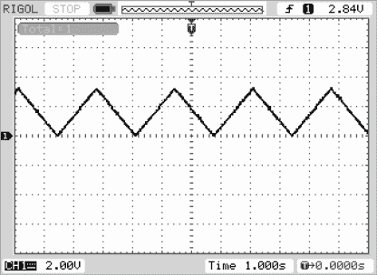
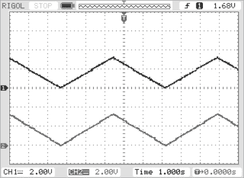
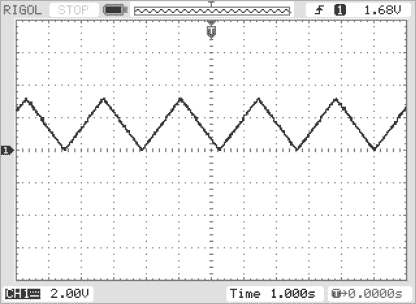
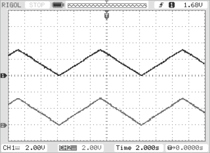
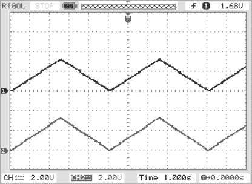
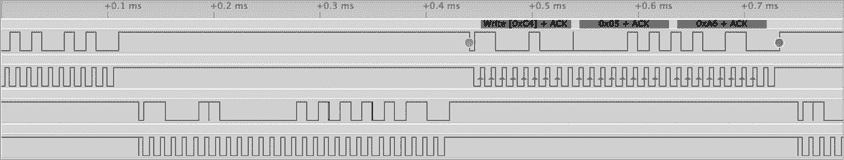

# 第十章：I²C 在实时操作系统中的编程


I²C 传输较慢，通常为 100 kHz。在像 Arduino 这样的系统中，你的代码必须等待每次传输或接收完成才能进行其他工作，这会大幅度降低应用程序的性能。在等待过程中，CPU 只是在执行一个繁忙等待循环（也叫*自旋循环*），浪费了 CPU 周期。在本章中，你将学习如何使用实时操作系统（RTOS）来有效利用这些 CPU 周期。

本章介绍了几种不同的 RTOS——µC/OS、FreeRTOS、Teensy Threads 和 Mbed——你可以在典型的 SBC 上运行这些 RTOS，并提供了每个 RTOS 使用 I²C 的示例程序。有些 RTOS，如 Mbed，提供完整的 I²C 支持。而像 FreeRTOS 和 Teensy Threads 这样的 RTOS 是简单的调度器，你必须提供自己的兼容 I²C 库代码。RTOS 的选择通常由你使用的 SBC 决定，因为如果你选择了某个 SBC，你只能运行已经移植到该板的 RTOS。相反，如果你想使用某个 RTOS，你必须选择一个已经为其移植的 SBC——除非你愿意自己进行移植，而这通常是一个非常繁琐的工作。

本章首先介绍一些基本的 RTOS 概念，然后介绍几个 RTOS，以及一些代表性的单板计算机（SBC），供本节所描述的 RTOS 使用。这并不是说我为给定的 RTOS 选择的 SBC 是唯一的（甚至是最好的）SBC——这些只是我在写这本书时所能使用的组件。对于大多数 RTOS，设计你自己的系统时，你通常会有更多平台可供选择。

## 10.1 实时操作系统基础

RTOS 的目的是在保证的时间内处理异步事件，例如 I²C 传输的完成。当然，另一种做法是通过*轮询*——CPU 简单地在自旋循环中等待，测试事件是否发生，直到事件发生后立即处理它。虽然轮询有一些优点（特别是它可以提供对事件的最快响应时间），但也有一个巨大的缺点：CPU 被困在自旋循环中，无法执行其他任务。

本书通常使用*任务*一词来表示某个通用的执行单元，该单元与其他执行单元并行（伪）执行。线程和进程是任务类型的例子，我将很快讨论这些内容。

RTOS 允许其他任务在 CPU 等待某些事件发生时进行工作。要使这一点可行，需要一些硬件支持；特别是，外部事件必须能够在 CPU 上生成中断信号。正如其名称所示，*中断信号* 会导致 CPU 暂停当前执行的任务，并将控制转移到一个特殊的 ISR 来处理该事件。对于某些设备，ISR 完全处理该事件，暂停的任务会恢复控制。然而，对于大多数 RTOS 和 ISR，ISR 只是设置一个标志，标记事件已发生，然后 RTOS 会在未来某个时刻调度原始代码（该代码原本在等待 I²C 事务或其他任务完成）的执行。

以 I²C 写操作为例，调用写函数将会配置 I²C 硬件，开始在 I²C 总线上传输数据。然后，执行写数据的任务将会 *挂起*，以允许其他任务进行一些工作。当 I²C 传输完成后，I²C 硬件将生成一个中断，ISR 会发出一个特殊的系统调用，通知 RTOS 唤醒之前挂起的写数据到 I²C 总线的任务。

RTOS 将 I²C 写任务从挂起队列移到就绪队列。然而，这并不保证 I²C 写任务会立即开始执行（这取决于 RTOS 的调度策略）。控制可能会回到中断发生时刚被挂起的任务。

在未来的某个时刻，RTOS 会决定允许 I²C 写入任务继续执行。然后它会将任务从就绪队列中移除并开始执行，暂停当前正在执行的任务。此时，I²C 写入任务可以继续完成它需要做的工作，比如写入额外的数据、读取数据，或者简单地返回到请求 I²C 写操作的应用程序。

### 10.1.1 进程与线程

操作系统理论定义了多个任务级别，包括进程和线程。如前所述，本书将使用通用术语 *任务* 来描述进程和线程。

*线程* 是一个执行单元，它与其他并发执行的线程共享地址空间。因为线程共享内存（地址空间），一个线程可以修改另一个线程读取的内存。这为线程间通信提供了一种简便的方式，但它也带来了一些问题，正如你将在下一节看到的那样。

*进程*是一个执行单元，具有自己的地址空间，并且不会与其他进程共享该内存。进程间的通信比线程间通信稍微复杂一些，因为通常需要使用文件或其他操作系统定义的数据结构来进行通信。然而，由于进程无法覆盖彼此的内存空间，因此它们相互干扰的机会较少。

一个应用程序可以由一个或多个进程组成。每个进程将包含一个或多个线程。最简单的应用程序由单个进程执行单个线程组成。稍微复杂一点的应用程序是执行一个具有多个执行线程的单个进程的应用程序。再往上是具有多个进程的应用程序，每个进程都有一个或多个执行线程。

可视化多个进程和线程最简单的方式是将每个进程和线程视为编程语言中的程序或函数。每个独立的进程或线程对应一个唯一的函数，执行该进程或线程的代码。虽然这是一个简单的模型，但实际上，不同的进程和线程共享相同代码是很常见的。例如，两个执行线程可能在内存中运行相同的函数，也许传递不同的参数来允许它们执行不同的操作。

### 10.1.2 多线程与多任务

实时操作系统（RTOS）的主要功能是允许多个线程并发执行。一些微控制器包括多个 CPU（*多核 CPU*），这意味着两个或更多任务确实可以在不同的 CPU 上同时运行。然而，大多数嵌入式微控制器仅限于单个 CPU（核心），因此任何时刻只能执行一个任务。为了模拟多任务（也称为*多线程*），RTOS 会快速切换任务，给人一种多个任务同时执行的错觉。

大多数现代实时操作系统（RTOS）使用抢占机制来暂停一个任务，然后允许另一个任务执行。每个 RTOS 都有自己的策略来决定如何抢占正在运行的任务。有些 RTOS 为每个任务分配一个固定的运行时间，并在定时器到期时切换任务。这个时间段称为*时间片*或*时间量子*；在任务之间切换的过程称为*时间复用*。其他 RTOS 为不同的任务分配优先级，允许优先级较高的任务在没有阻碍的情况下运行，直到它们被暂停或更高优先级的任务准备好运行。许多 RTOS 使用这些策略的组合。例如，如果两个任务具有相同的优先级并准备好运行，它们使用时间切片在彼此之间切换，而低优先级任务则保持暂停状态，直到这两个任务都暂停自己。

在纯优先级调度系统中，如果某个高优先级任务始终在运行，低优先级任务可能永远无法运行。这可能会导致*饥饿现象*，意味着某个任务永远不会执行。许多 RTOS 会在一段时间后临时提升低优先级任务的优先级，以确保它偶尔能获得一些处理时间。

RTOS 的调度策略决定了它如何选择下一个运行的任务。例如，如果 RTOS 为任务分配相同的优先级并给每个任务分配相等大小的时间片，那么调度策略决定了当一个任务完成其时间片（或由于其他原因挂起）时，CPU 如何选择下一个任务来运行。一种明显的解决方案是*轮询调度*策略，其中 RTOS 维护一个准备运行任务的队列，在任务切换时从队列前端挑选任务；它会将新挂起的任务放到队列的末尾。大多数时候，这能确保公平地分配 CPU 资源给每个准备运行的任务。但也有一些特殊情况，这个方案并不完全公平。例如，如果某个任务比其他任务更频繁地挂起，那么即便它在运行时占用的 CPU 时间很少，它也必须重新等待整个队列。然而，作为一种快速且简单的解决方案，轮询调度效果很好。

有时应用程序可以控制调度优先级的各个方面，但更多情况下，应用程序必须接受操作系统提供的调度策略。调整 RTOS 策略超出了本书的范围，但若想了解更多，请参见本章结尾的“更多信息”或你所使用的 RTOS 手册。幸运的是，I²C 活动通常非常缓慢（至少在 100 kHz 下运行时如此），因此调度调整通常不会对基于 I²C 的应用程序的性能产生太大影响。

### 10.1.3 重入性

在多线程环境中编程 I²C 设备时，也许最大的难题是*重入性*，它发生在两个不同的线程尝试同时执行相同代码时。I²C 设备是一个单一的共享系统资源。如果由两个不同线程调用的某个函数试图与 I²C 设备通信，第二个线程重入该函数时将尝试与同一个设备并行通信。如果一个线程开始向设备写入 2 字节或 3 字节的数据序列，并在传输第一个字节后被中断，那么从设备的角度来看，第二个线程发送的第一个字节看起来像是第一个线程发送的第二个字节。如果两个线程共享同一个 I²C 设备，两个线程需要非常小心地同步，以确保正确操作。

即使两个线程不访问相同的设备，两个不同的线程也不能在同一总线上同时与两个不同的设备通信。再一次，不同的线程必须同步使用相同的 I²C 总线。从某些方面来看，这类似于有两个控制器共享总线；然而，并没有协议来处理冲突——各个线程必须自己处理争用问题。

### 10.1.4 同步

同步通常通过互斥锁（mutual exclusion primitives）、临界区、信号量、事件和其他操作系统同步原语来处理。这些操作的基本思想是只允许一个线程在某一段代码中访问，防止多个线程同时进入。在典型的 RTOS 中，线程会请求对某个临界区的独占访问。如果 RTOS 批准了该请求，其他线程的后续请求将被阻塞，直到原始线程释放临界区。这个机制确保一次只有一个线程可以进入临界区，从而消除了重入问题。

当一个线程在等待其他线程释放临界区时，等待的线程会被挂起（阻塞），并且在等待临界区释放的过程中不会消耗任何 CPU 周期。在 I²C 传输的情况下，这种阻塞可能会持续相当长的时间；持有临界区的线程可能正在 I²C 总线上传输和接收几个字节（通常每个字节需要 100 微秒到 1000 微秒，如果发生时钟拉伸，时间会更长）。好消息是，被阻塞的线程不会干扰当前在 I²C 总线上进行的传输。

### 10.1.5 安全关键系统

某些 RTOS，如 µC/OS 或 FreeRTOS，已经*获得安全认证*，意味着它们经过严格的质量保证测试。这是一个重要的优势，因为如果你在开发医疗设备、核仪器或汽车应用时，行业监管机构可能会要求你使用安全认证的操作系统，或者提供适当的文档和测试，证明你选择的系统是合适的，才会允许你部署系统。例如，我在为核反应堆开发仪器时使用过 µC/OS（运行在 NetBurner 上）。

当然，如果你不是在开发任务关键型应用，你可能不需要一个安全认证的 RTOS。显然，选择的操作系统非常依赖于具体的应用，但需要注意的是，质量保证问题可能会限制你选择实时操作系统的范围。

## 10.2 实时操作系统 I²C 编程

本章主要讨论四种 RTOS：µC/OS、FreeRTOS、Teensy Threads（其实不算真正的 RTOS，只是一个多线程包）和 Mbed。

FreeRTOS 和 Teensy Threads 其实只是线程调度包，提供基本的多任务和线程同步功能。它们不提供任何其他库代码，例如 I²C 通信功能；你需要自己提供这些代码。特别是，你需要负责同步对共享资源（如 I²C 总线）的访问。

第二种 RTOS，µC/OS 和 Mbed，是功能齐全的 RTOS，提供了许多活动的库支持，例如 I²C 通信。这些更复杂的 RTOS 提供了对它们所使用资源的同步访问。

以下小节将简要讨论这些 RTOS 的每个特点。在适用的情况下，还会描述如何保护对共享资源（如 I²C 总线）的访问。

### 10.2.1 µC/OS

本章中，我将使用由 NetBurner, Inc. 提供的 NBRTOS 变体，它运行在 NetBurner MOD54415 SBC 上。NBRTOS 是 µC/OS I 的一个变体，包含了几个额外的库来支持 MOD54415，其中包括一些 I²C 库。

原始的 µC/OS I RTOS 是一个完全基于优先级的 RTOS，有 64 个不同的优先级等级。它有一个严格的限制，即每个任务（µC/OS 中对线程的称呼）必须运行在不同的优先级上，因此在使用轮转/时间复用调度时，你不能有两个任务在相同优先级下运行。µC/OS 的后续版本，如 µC/OS III，引入了更多的优先级等级（最多 256 个），并允许多个任务在相同优先级下运行，使用时间复用切换任务。然而，由于 NBRTOS 使用的是 µC/OS I 的版本，本书将坚持使用基于优先级的调度方式。书中的大多数其他 RTOS 使用的是时间切片（时间复用）而不是基于优先级的方案，因此 µC/OS 在这方面显得有些不同。

MOD54415 SBC 支持最多四个不同的 I²C 端口。一个名为 `MultiChannel_I2C` 的特殊库，在多线程环境中为这四个通道提供支持。这个库提供了几个不同的 I²C 函数，虽然本章只会使用其中的两个函数，`MultiChannel_I2CInit()` 和 `MultiChannel_I2CSendBuf()`，来演示如何向 MCP4725 DAC 写数据：

```
void MultiChannel_I2CInit
(
    int     moduleNum = DEFAULT_I2C_MODULE,
    uint8_t slave_Addr = 0x08,
    uint8_t freqdiv = 0x3C 
);

uint8_t MultiChannel_I2CSendBuf
(
 int      moduleNum,
    uint8_t  addr,
    puint8_t buf,
    int      num,
    bool     stop = true 
);
```

第一个函数 `MultiChannel_I2CInit()` 初始化你将使用的 I²C 端口。这个端口通常是一个小整数，范围从 0 到 3（对应 i2c-0 到 i2c-3 端口）。第二个参数指定了该端口的外设地址；如果你使用的是外设模式，则需要指定这个地址。如果你使用的是控制器模式，可以忽略这个参数（默认值 `0x08` 就可以）。最后一个参数指定了 I²C 总线的频率除数。`0x3C` 的默认值适用于 100 kHz 的操作；如果你想在其他时钟频率下运行，可以参考 NetBurner 的文档。

第二个函数`MultiChannel_I2CSendBuf()`将数据写入 I²C 总线。第一个参数是 I²C 端口号（例如，`0`表示 i2c-0），第二个参数是设备的 I²C 地址，第三个参数是一个包含要写入数据的字节数组，第四个参数指定要写入的字节数，最后一个参数指定在传输后是否向 I²C 总线写入停止条件（默认值为`true`，即发送停止条件）。

````The NetBurner library provides a fair number of other functions you can use to manipulate the I²C bus. For more detail, see the NetBurner documentation linked in “For More Information.”    The program in Listing 10-1 is the usual triangle wave DAC output sample program. Other than a few µC/OS peculiarities (outside the scope of this book), this program is equivalent to the demonstration program from other chapters.    ``` // Listing 10-1 (main.cpp)  //  // DAC output example for µC/OS.    #include "predef.h"  #include <stdio.h>  #include <startnet.h>  #include <autoupdate.h>  #include <multichanneli2c.h>    #define ever ;;    #define I2C_CHANNEL 0      // Going to use I2C0 on NetBurner  #define mcp4725     0x60   // DAC I2C address  extern "C"   {      void UserMain( void * pd );  }    // DACout-  //  // Draws one cycle of a triangle waveform on  // the MCP4725 I2C DAC device (for example,   // Adafruit MCP4725 breakout board).  //  // Argument: I2C address for the DAC. For  // Adafruit MCP4725 breakout boards, this  // is either 0x62 or 0x63\. For SparkFun  // boards, this is either 0x60 or 0x61.    void DACout( int adrs )  {      uint8_t buf[2];            // Send the rising edge of a triangle wave:        for( uint16_t dacOut = 0; dacOut < 0xfff; ++dacOut )      {          // Note: MCP4725 requires that you write          // the HO byte first and the LO byte second!                    buf[0] = (dacOut << 8) & 0xff;          buf[1] = dacOut & 0xff;                    // Transmit the data from the buffer:                  ❶ MultiChannel_I2CSendBuf          (              I2C_CHANNEL,              adrs,      // Device address              buf,       // Data to write              2,         // 2 bytes to write              true       // Send stop condition          );      }        // Send the falling edge of the triangle wave.        for( uint16_t dacOut = 0xffe; dacOut > 0; --dacOut )      {          // HO then LO byte:                    buf[0] = (dacOut << 8) & 0xff;          buf[1] = dacOut & 0xff;          MultiChannel_I2CSendBuf          (              I2C_CHANNEL,              adrs,       // Device address              buf,        // Data to write              2,          // 2 bytes to write              true        // Send stop condition          );      }  }    void UserMain( void * pd )   {       int cntr = 0;        // Standard NetBurner initialization stuff:            InitializeStack();      EnableAutoUpdate(); // Allow Ethernet update of code        // Initialize I2C0 on the NetBurner MOD54415:      ❷ MultiChannel_I2CInit( I2C_CHANNEL );      for( ever )       {          // Print status information to the serial console          // every now and then to show that something is          // happening:                            iprintf( "main loop, cntr=%d\n", cntr++ );                    // Draw one cycle of the triangle waveform          // on the DAC:                            DACout( mcp4725 ); // MCP4725 output                } // endfor  } // UserMain ```    The `MultiChannel_I2CInit()` ❷ and `MultiChannel_I2CSendBuf()`❶ functions are the µC/OS I²C initialization and I²C output routines.    Figure 10-1 shows the oscilloscope output from the program in Listing 10-1. Note that the frequency is much closer to the Arduino example (see Figure 8-2 in Chapter 8) than the Raspberry Pi example (see Figure 9-3 in Chapter 9). The slower frequency in the Pi example is, undoubtedly, due to all the extra work happening under the multitasking Pi OS (Linux).      Figure 10-1: Oscilloscope output from Listing 10-1      Since µC/OS supports multitasking, you might wonder, why not write some code to generate two separate triangle waves concurrently? Of course, two tasks cannot access the same I²C device concurrently, but you might reason that you could fix that issue by putting two different DACs on the I²C bus. One task could write to the first DAC, and the second task could write to the second DAC.    Unfortunately, under a pure priority-based system such as µC/OS, this won’t work out well. The higher-priority task always runs, and the lower-priority task never gets a chance to execute (unless you put in code to explicitly suspend the higher-priority task).    Listing 10-2 provides the source code to the version of the code that demonstrates one way to do this.    ``` // Listing 10-2 (main.cpp)  //  // Multi-threaded I2C demonstration #2.  // This program writes to two separate  // MCP4725 devices on the same I2C bus  // using separate threads for each of the  // DACs, with a semaphore to protect  // writes to the I2C port.     #include "predef.h"  #include <stdio.h>  #include <startnet.h>  #include <autoupdate.h>  #include <pins.h>  #include <multichanneli2c.h>    #define ever ;;    #define I2C_CHANNEL0 0          // Going to use I2C0     #define dac1 0x62               // MCP4725 #1 address  #define dac2 0x63               // MCP4725 #2 address    extern "C"   {      void UserMain(void * pd);  }    // Stack for DACthread:    #define DACthread_STK_SIZE (4096)  static  DWORD   DACthread_stack[ DACthread_STK_SIZE ]                           __attribute__((aligned(4)));    // Critical section protecting console I/O:    OS_CRIT ioCS;    ❶ OS_SEM  threadSem;  OS_SEM  mainSem;    // DACout-  //  // Draws one cycle of a triangle waveform on  // the MCP4725 I2C DAC device (e.g., Adafruit  // MCP4725 breakout board).  //  // Argument: I2C address for the DAC. For  // Adafruit MCP4725 breakout boards, this  // is either 0x62 or 0x63\. For SparkFun  // boards, this is either 0x60 or 0x61.    void DACout( int adrs, OS_SEM *enter, OS_SEM *leave )  {      uint8_t buf[2];            // Send the rising edge of a triangle wave:        for( uint16_t dacOut = 0; dacOut < 0xfff; ++dacOut )      {          // Note: MCP4725 requires that you write          // the HO byte first and the LO byte second!                    buf[0] = (dacOut << 8) & 0xff;          buf[1] = dacOut & 0xff;                    // Transmit the data from the buffer:                  ❷ OSSemPend( enter, 0 );  // Protect call              ❸ MultiChannel_I2CSendBuf              (                  I2C_CHANNEL0,                  adrs,           // Device address                  buf,            // Data to write                  2,              // 2 bytes to write                  true            // Send stop condition              );                    ❹ OSSemPost( leave );     // Enable other thread      }        // Send the falling edge of the triangle wave.        for( uint16_t dacOut = 0xffe; dacOut > 0; --dacOut )      {          // HO then LO byte:                    buf[0] = (dacOut << 8) & 0xff;          buf[1] = dacOut & 0xff;          OSSemPend( enter, 0 );   // Protect call                MultiChannel_I2CSendBuf   (                  I2C_CHANNEL0,                  adrs,           // Device address                  buf,            // Data to write                  2,              // 2 bytes to write                  true            // Send stop condition              );                        OSSemPost( leave );     // Enable other thread      }  }    void DACthread( void *parm )  {      int cntr = 0;            for( ever )       {          // Print a message each time the thread          // completes one cycle of the triangle          // wave. Note that iprintf must be          // protected by a critical section.                    OSCritEnter( &ioCS, 0 );                             iprintf( "thread loop, cntr=%d\n", cntr++ );                        OSCritLeave( &ioCS );                    // Draw one cycle of the triangle waveform          // on the DAC at address 0x63:            DACout( dac2, &threadSem, &mainSem );                         } // endfor  }    void UserMain( void * pd )   {       int cntr = 0;        // Standard NetBurner initialization stuff:            InitializeStack();      EnableAutoUpdate(); // Allow Ethernet update of code        // Initialize the critical sections used to protect       // console I/O and the I2C output.            OSCritInit( &ioCS );      OSSemInit( &threadSem, 1 );      OSSemInit( &mainSem, 0 );     // Initialize I2C0 pins on the NetBurner MOD54415:            MultiChannel_I2CInit( I2C_CHANNEL0 );            // Start a thread running that will write to the      // DAC at address 0x63\. Give the thread a higher      // priority than that of the main thread.      //      // The parameters are the following:      //      //  1\. Address of function to invoke as the      //     new thread ("task" in NBRTOS terminology).      //      //  2\. Parameter to pass to the thread.        //      //  3\. Address of the first byte beyond the      //     stack space allocated for the thread.      //      //  4\. Address of the start of the task.      //      //  5\. Thread priority (lower number is      //     higher priority).          ❺ OSTaskCreate      (          DACthread,           NULL,          (void*)&DACthread_stack[DACthread_STK_SIZE],          (void *)DACthread_stack,           MAIN_PRIO + 1      );            for( ever )       {          // Print a message each time the main thread          // completes one cycle of the triangle          // wave. Note that iprintf must be          // protected by a critical section.                       OSCritEnter( &ioCS, 0 );                             iprintf( "main loop, cntr=%d\n", cntr++ );                        OSCritLeave( &ioCS );                    // Draw one cycle of the triangle waveform          // on the DAC at address 0x62:                            DACout( dac1, &mainSem, &threadSem );      } // endfor  } // UserMain ```    Unfortunately, you cannot use µC/OS critical section variables (`OS_CRIT`) to protect access to the I²C bus. As noted earlier, because µC/OS is strictly a priority-based system, the lower-priority thread will not get a chance to run unless some system call explicitly blocks the main thread. To overcome this problem, the code in Listing 10-2 uses semaphores.    Semaphores are similar to critical sections insofar as you can use them to protect a section of code. They differ from critical sections in that they have a counter associated with them. When you enter a critical section (a µC/OS `OSSemPend()` call), the system first checks to see if this counter is 0\. If so, the code blocks; if not, the code decrements the counter and enters the critical section. Note that if you initialize a semaphore with 1, it behaves like a critical section variable.    µC/OS semaphores use three main functions: `OSSemInit()`, `OSSemPend()`, and `OSSemPost()`. In addition to initializing internal data structures, the `OSSemInit()` function allows you to initialize the counter with the integer; for managing critical sections, the initial value is usually 0 or 1\. As already noted, the `OSSemPend()` function checks the counter for 0 (and blocks if 0) and decrements the counter if it is nonzero, as well as allowing entry into the critical section. `OSSemPost()` increments the counter associated with the semaphore. This means you would normally use `OSSemPend()` to enter a critical section and `OSSemPost()` to leave a critical section.    The trick in Listing 10-2 is to use two semaphores, `mainSem` and `threadSem`, to protect access to the DACs by multiple tasks ❶. Whenever one of these semaphores contains 1, the associated task can execute; when the semaphore is 0, the task will block. The trick is to make sure that the two threads alternate setting the semaphores to 0 or 1 to allow execution to “ping-pong” between the two tasks.    If you look at the `DACout()` function in Listing 10-2, you’ll see that a task enters its critical section by executing `OSSemPend()` on the semaphore associated with that task ❷. To exit the critical section, the code executes the `OSSemPost()` function on the semaphore associated with the other thread ❹. This might seem incorrect, but let’s consider this sequence step-by-step:    1.  Assume the `mainSem` (enter parameter) counter is 1 and the `threadSem` (leave parameter) is 0. 2.  Upon executing `OSSemPend( enter, 0 );`, the system decrements the counter to 0 and enters the critical section (because the counter wasn’t already 0). Note that because the `UserMain()` task has a higher priority than the `DACthread()` task, the `UserMain()` task continues execution (and the `DACthread()` task is currently blocked). 3.  The `UserMain()` task writes data to the I²C bus ❸. 4.  The `UserMain()` task executes `OSSemPend()` on the `threadSem` semaphore (`leave` parameter) ❹. This increments the counter associated with `threadSem`; note that the `mainSem` counter is still 0. 5.  The `UserMain()` task continues execution, which in this case means repeating the loop and re-executing the `OSSemPend()` function at ❸. Because the counter is now 0, the task blocks. 6.  Once `UserMain()` blocks, the `DACthread()` task begins execution and eventually winds up in `DACout()` executing the `OSSemPend()` call. Because the `OSSemPost( leave );` call in the `UserMain()` task incremented the `threadSem` counter, the counter now contains 1 so the `DACthread()` task can enter its critical section. 7.  The `DACthread()` task calls `DACout()` to write a value to the DAC. 8.  The `DACthread()` task exits its critical section by calling `OSSemPost()` but passing the `mainSem` semaphore variable. This increments the `mainSem` counter; note that the `threadSem` counter is still 0. 9.  Because the `UserMain()` thread has the highest priority, it immediately takes over, and this process repeats itself.    Note that both tasks in Listing 10-2 call the `DACout()` function to actually write the data to the DAC (the DAC address and the two semaphores are passed as arguments). The calls to `DACout()` swap the two semaphore arguments so that `UserMain()` passes `mainSem` as the first semaphore argument, whereas `DACthread()` passes `threadSem` as the first semaphore argument.    Figure 10-2 shows the oscilloscope output for the program in Listing 10-2.      Figure 10-2: Oscilloscope output from Listing 10-2      As you can see, both tasks are producing proper triangle waves. The frequency of the triangle waves in Figure 10-2 is about half that of Figure 10-1 (note the time scale for the oscilloscope in the two figures). The reason for this discrepancy is that the frequency is completely determined by the speed at which the program transmits data to the MCP4725\. In Listing 10-2, twice as much data is transmitted by sending roughly the same data to both MCP4725 devices, so the frequency is cut roughly in half.    ### 10.2.2 FreeRTOS I²C Programming    FreeRTOS is, in its developer’s words, “the market leading, de facto standard, and cross platform RTOS kernel.” You’ll likely encounter this popular open source kernel if you work with many different RTOSs.    To use FreeRTOS, you’ll need a port of the OS to your particular device (or you’ll have to port it yourself). In this chapter I’m going to use the Teensy 4.0 port created by Julian Desvignes running under the PlatformIO IDE ([`platformio.org/lib/show/6737/FreeRTOS-Teensy4`](https://platformio.org/lib/show/6737/FreeRTOS-Teensy4)). The PlatformIO, FreeRTOS, and Teensy4 port uses the Arduino library and Teensyduino support to run FreeRTOS code in an Arduino environment. This makes it possible to create multithreaded applications while using Arduino-style programming.    Because FreeRTOS is just a scheduler that provides basic task switching functionality along with synchronization primitives, you’ll have to provide your own I²C library code. Fortunately, such code is easy to find from the Arduino libraries and elsewhere. However, the Arduino libraries are not reentrant, so you have to ensure that only one task is calling a particular library function (or family of functions) using mutexes, critical sections, semaphores, or other synchronization operations. See [`www.freertos.org/a00113.xhtml`](https://www.freertos.org/a00113.xhtml) for more details on FreeRTOS synchronization primitives.    Listing 10-3 presents the usual triangle wave output demo under FreeRTOS that creates two tasks; one of the tasks will blink the Teensy’s LED, and the other will output the triangle wave data to the MCP4725 DAC device:    ``` // Listing 10-3 (main.cpp)  //   // Simple demonstration of I2C programming  // under FreeRTOS running on a Teensy 4.0.    #include <FreeRTOS_TEENSY4.h>  #include <Wire.h>    #define ever ;;    // The LED is attached to pin 13 on the Teensy 4.0.    const uint8_t LED_PIN = 13;    // Thread1-  //  // This task blinks the Teensy 4.0's LED  // every second (1/2 second on, 1/2 second off).    static void Thread1( void* arg )  {      for( ever )      {            // Turn LED on:     digitalWrite( LED_PIN, HIGH );            // Delay 1/2 second:            vTaskDelay( (500 * configTICK_RATE_HZ) / 1000 );            // Turn LED off:            digitalWrite( LED_PIN, LOW );            // Delay 1/2 second:            vTaskDelay( (500 * configTICK_RATE_HZ) / 1000 );      }  }    // Thread2-  //  // This task outputs a triangle wave  // to the MCP4725 device at address 0x62  // (i.e., an Adafruit MCP4725 breakout board).    static void Thread2( void* arg )  {    for( ever )      {          for( uint16_t dacOut = 0; dacOut < 0xfff; ++dacOut )          {              // Transmit the address byte (and a zero R/W bit):                Wire.beginTransmission( 0x62 );                // Transmit the 12-bit DAC value (HO 4 bits first,              // LO 8 bits second) along with a 4-bit              // "fast write" command (0000 in the HO 4 bits              // of the first byte):                Wire.write( (dacOut << 8) & 0xf );              Wire.write( dacOut & 0xff );                // Send the stop condition onto the I2C bus:                Wire.endTransmission( true );          }   // for            // Send the falling edge of the triangle wave:            for( uint16_t dacOut = 0xffe; dacOut > 0; --dacOut )          {              // See comments in previous loop.                Wire.beginTransmission( 0x62 );              Wire.write( (dacOut << 8) & 0xf );              Wire.write( dacOut & 0xff );   Wire.endTransmission( true );          }   // for      }       // forever  } // Thread2    // In FreeRTOS for the Teensy 4.0, the  // Arduino "setup" function is really the  // equivalent of the main program.    void setup()  {      portBASE_TYPE s1, s2;        pinMode( LED_PIN, OUTPUT ); // LED is output      Wire.begin();               // Initialize I2C library        // Create task at priority two      // Arguments:      //      //  1\.  Address of function to serve as task code.      //  2\.  A descriptive name for the task (can be NULL).      //  3\.  Stack depth for the task.      //  4\.  Parameter to pass to task.      //  5\.  Task priority.      //  6\.  Task handle returned here (ignored if NULL).        s1 =    xTaskCreate              (                  Thread1,                  NULL,                  configMINIMAL_STACK_SIZE,                  NULL,                  2,                  NULL              );        // Create task at priority one      // (see comments above concerning parms).        s2 =    xTaskCreate              (                  Thread2,                  NULL,                  configMINIMAL_STACK_SIZE,                  NULL,                  1,                  NULL              );        if ( s1 == pdPASS && s2 == pdPASS )   {            // Start scheduler:            vTaskStartScheduler();      }        // Drop down here if there was      // insufficient RAM to create      // the tasks or if there was      // any other problem in their      // creation.        for( ever );  }    // WARNING: idle loop has a very small stack  // (configMINIMAL_STACK_SIZE), so  // loop must never block.    void loop()  {      // Not used.  } ```    The actual I²C code was taken straight out of Listing 8-1 (Arduino code), which is not reentrant code. The key thing to note is that the tasks do not call common library code. `Thread1()` calls only the Arduino `digitalWrite()` function, and `Thread2()` calls only the `Wire` class functions. Had this example tried to write to I²C devices from two separate tasks (even devices on separate I²C buses), it would have required mutexes to ensure that only one task at a time could actually execute those function calls. Here’s an example:    ``` SemaphoreHandle_t xSemaphore = NULL;      .      .      .  xSemaphore = xSemaphoreCreateMutex();      .      .      .  if( xSemaphoreTake( xSemaphore, portMAX_DELAY ) == pdTRUE )  {            // Own the critical section.         .         .  // In critical section, access I2C device here.         .     xSemaphoreGive( xSemaphore );  }  ```    Figure 10-3 shows the oscilloscope output from the program in the FreeRTOS demonstration program.      Figure 10-3: Oscilloscope output from Listing 10-3      Because this program is writing only one stream of data to the MCP4725, the frequency is back up to about 0.5 Hz (again, this is limited by the 100-kHz data transmission speed).    ### 10.2.3 Teensy Threads I²C Programming    There are thread scheduling packages written for many low-end SBCs that you can grab off the Internet and use in simple applications. In this section, I’ll demonstrate how to use one such package: the Teensy Threading Library, created by Fernando Trias. This section also uses the Teensy 4.0 I²C library by Richard Gemmell. (See “For More Information” for the links.) It supports the Teensy 3.*x* and 4.*x* CPU modules from PJRC and it has the ability to create multiple threads—up to eight, by default, though this can be changed—along with some simple synchronization primitives and various thread utilities. Because the Teensy Threads package uses the term *threads*, I will use that specific term in this section rather than *tasks*.    The Teensy Threading Library is an Arduino library that assumes code is being developed in the Arduino programming model; as such, when you work with Teensy Threads, use the standard Arduino (or Teensy-specific) I²C programming libraries to communicate with I²C devices. Remember that Arduino code is not reentrant and must be protected when called from various threads. The example in this section will avoid calling the same function in different threads so that synchronization is not required.    The program in Listing 10-4 demonstrates multithreading using the Teensy Threading Library. It creates three additional threads (plus the main thread that continues execution). One thread blinks the LED every second, two threads transmit triangle waves to MCP 4725 DAC devices (on separate I²C buses), and the main thread writes “loop” to the serial output every two seconds.    ``` // Listing 10-4 (Listing10-4.ino)  //  // Simple demonstration of I2C programming  // using Teensy Threads running on a Teensy 4.0.    #include <TeensyThreads.h>  #include <i2c_driver_wire.h>    #define ever ;;    #define dac1 0x62  #define dac2 0x60    // The LED is attached to pin 13 on the Teensy 4.0.    const uint8_t LED_PIN = 13;    // Thread1-  //  // This thread blinks the Teensy 4.0's LED  // every second (1/2 second on, 1/2 second off).    ❶ static void Thread1( int arg )  {      for( ever )      {            // Turn LED on:            digitalWrite( LED_PIN, HIGH );            // Delay 1/2 second:            delay( 500 );            // Turn LED off:            digitalWrite( LED_PIN, LOW );            // Delay 1/2 second:            delay( 500 );      }  }    // Thread2-  //  // This thread outputs a triangle wave  // to the MCP4725 device at address 0x62 on  // I2C bus zero (SDA0/SCL0 on Teensy 4.0)  // (i.e., an Adafruit MCP4725 breakout board).    ❷ static void Thread2( int arg )  {      for( ever )      {          for( uint16_t dacOut = 0; dacOut < 0xfff; ++dacOut )          {              // Transmit the adrs byte (and a 0 R/W bit):                Wire.beginTransmission( dac1 );                // Transmit the 12-bit value (HO 4 bits first,              // LO 8 bits second) along with a 4-bit              // "fast write" command (0000 in the HO 4 bits              // of the first byte):                Wire.write( (dacOut << 8) & 0xf );              Wire.write( dacOut & 0xff );                // Send the stop condition onto the I2C bus:                Wire.endTransmission( true );          }   // for            // Send the falling edge of the triangle wave:            for( uint16_t dacOut = 0xffe; dacOut > 0; --dacOut )          {              // See comments in previous loop.                Wire.beginTransmission( dac1 );              Wire.write( (dacOut << 8) & 0xf );              Wire.write( dacOut & 0xff );              Wire.endTransmission( true );          }   // for      }       // forever  } // Thread2    // Thread3-  //  // This thread outputs a triangle wave  // to the MCP4725 device at address dac2 on  // I2C bus one (SDA1/SCL1 on Teensy 4.0)  // (i.e., an Adafruit MCP4725 breakout board).    ❸ static void Thread3( int arg )  {      for( ever )      {          for( uint16_t dacOut = 0; dacOut < 0xfff; ++dacOut )          {              // Transmit the adrs byte (and a 0 R/W bit):                Wire1.beginTransmission( dac2 );                // Transmit the 12-bit DAC value (HO 4 bits               // first, LO 8 bits second) along with a    // 4-bit "fast write" command (0000 in the HO               // 4 bits of the first byte):                Wire1.write( (dacOut << 8) & 0xf );              Wire1.write( dacOut & 0xff );                // Send the stop condition onto the I2C bus:                Wire1.endTransmission( true );          }   // for            // Send the falling edge of the triangle wave:            for( uint16_t dacOut = 0xffe; dacOut > 0; --dacOut )          {              // See comments in previous loop.                Wire1.beginTransmission( dac2 );              Wire1.write( (dacOut << 8) & 0xf );              Wire1.write( dacOut & 0xff );              Wire1.endTransmission( true );          }   // for      }       // forever  } // Thread3    // In TeensyThreads for the Teensy 4.0, the  // Arduino "setup" function is really the  // equivalent of the main program.    void setup()  {        Serial.begin( 9600 );      pinMode( LED_PIN, OUTPUT ); // LED is output      Wire.begin();               // Initialize I2C port 0      Wire1.begin();              // Initialize I2C port 1        // Create thread      // Arguments:      //      //  1\.  Address of function to serve as thread code.      //  2\.  Optional argument passed to thread function.      //  3\.  Stack size (default is 1024).      //  4\.  Stack address (default is on heap).      ❹ int id1 = threads.addThread( Thread1,  0 );      if ( id1 == -1 )      {            Serial.println( "Thread 1 creation failed" );          for( ever );      }        // Create task at priority one      // (see comments above concerning parms).   ❺ int id2 = threads.addThread( Thread2, 0 );      if ( id2 == -1 )      {            Serial.println( "Thread 2 creation failed" );          for( ever );      }        // Create task at priority three      // (see comments above concerning parms).  	    ❻ int id3 = threads.addThread( Thread3, 0 );      if ( id3 == -1 )      {            Serial.println( "Thread 3 creation failed" );          for( ever );      }  }    // The loop function is, essentially, a fourth thread  // of execution.    ❼ void loop()  {      Serial.println( "loop" );      delay( 2000 );  } ```    The `Thread1()` function executes for the first thread, blinking the LED on the Teensy ❶. The `Thread2()` function writes a triangle wave to the DAC at address `dac1` (0x62) connected to the Teensy’s I²C port 0 ❷. The `Thread3()` function writes a triangle wave to the DAC at address `dac2` (0x60) connected to the Teensy’s I²C port 1 ❸. Note that because the two DACs are on different I²C ports, the code does not need to synchronize access to the devices.    The `setup()` function starts the three threads by calling `threads.addThread()` ❹, ❺, and ❻ and passing in the addresses of the three thread functions. The `loop()` function effectively becomes a fourth thread ❼.    Because the `i2c_driver_wire` library allocates separate memory objects for `wire` (SDA0 and SCL0) and `wire1` (SDA1 and SCL1), calls through these two separate objects do not interfere with one another when called from different threads. Were two different threads to call `wire` simultaneously, the code would have needed to protect the calls using the Teensy Threads `lock()` and `unlock()` functions:    ``` Threads::Mutex wire_lock;      .      .      .     wire_lock.lock();     Wire.beginTransmission( 0x62 );            Wire.write( (dacOut << 8) & 0xf );            Wire.write( dacOut & 0xff );            Wire.endTransmission( true );       wire_lock.unlock(); ```    Figure 10-4 shows the oscilloscope output for the program in Listing 10-4. The time base has changed for this display (two seconds per major division rather than one).      Figure 10-4: Oscilloscope output from Listing 10-4      As you can see, the frequency here is much slower than in previous examples (note the time scale on the oscilloscope). This is likely due to the interaction between the synchronous I²C library calls and the Teensy Threads package, a typical issue when you bolt on a threading library to a nonthreading package (like Arduino) versus running a true RTOS.    ### 10.2.4 Mbed I^(*2*)C Programming    Mbed is an RTOS developed by ARM Limited for use on ARM CPUs. It is marketed as an IoT development system, though it is certainly useful for normal embedded applications. Unlike many RTOSs, which tend to be very generic, Mbed fully supports features found on typical ARM MCUs, including I²C and other peripherals. The Mbed RTOS provides a rich set of I²C functions you can use in your applications. The library is thread safe, so you don’t have to worry about protecting calls across various threads (of course, your applications must synchronize access to specific devices on the I²C bus).    ARM also provides the Mbed Studio IDE that runs under Linux, macOS, or Windows (see “For More Information” for the link). Mbed Studio allows you to edit, compile, run, and debug your applications on any Mbed-enabled SBC.    Listing 10-5 provides the standard MCP4725 triangle wave output program running under Mbed. This program has two threads: the main thread and a second thread that it starts. Each thread produces a triangle wave output on separate MCP4725 devices. This particular program runs on an STMicroelectronics Nucleo-F767ZI board ([`www.st.com/en/evaluation-tools/nucleo-f767zi.xhtml`](https://www.st.com/en/evaluation-tools/nucleo-f767zi.xhtml)) that I found on Amazon for around $35; you can also use the NUCLEO-WB55RG available from SparkFun for around $40 ([`www.sparkfun.com/products/17943`](https://www.sparkfun.com/products/17943)). Of the several I²C ports this board supports, I used ports one and two for the program in Listing 10-5.    ``` // Listing10-5.cpp  //  // Mbed RTOS I2C programming example.  //  // This program writes triangle wave  // data to two MCP4725 DAC devices at  // addresses 0x62 and 0x63 on I2C ports  // one and two on a Nucleo-F767ZI board.  // Or ports one and three on a  // Nucleo-WB55RG board.    #include "PinNames.h"  #include "mbed.h"  #include "mbed_wait_api.h"    #define ever ;;  #define mcp4725a (0x62 << 1)  #define mcp4725b (0x63 << 1)    // Thread1-  //  // Writes a triangle wave to the  // MCP4726 at address 0x62 on  // I2C port 1.    ❶ void Thread1( void )  {      int  cntr = 0;      char data[2];      I2C i2c1( I2C_SDA, I2C_SCL );            // Set bus frequency to 100 kHz      // (this is actually the default,      // this call appears here for      // testing purposes).            i2c1.frequency( 100000 );        // Create a continuous triangle      // wave output:            for( ever )   {          // Create the rising edge of the          // triangle wave:                    for( int tri=0; tri < 4095; ++tri )          {              // Note: MCP4725 requires that you              // transmit the HO byte first, followed              // by the LO byte of the 16-bit              // DAC value (HO 4 bits are zeros).                            data[0] = (char) (tri >> 8) & 0xff;              data[1] = (char) (tri & 0xff);              i2c1.write ( mcp4725a, data, 2, false );          }                    // Create the falling edge of the          // triangle wave:                            for( int tri=4094; tri > 0; --tri )          {              data[0] = (char) (tri >> 8) & 0xff;              data[1] = (char) (tri & 0xff);              i2c1.write ( mcp4725a, data, 2, false );          }      }  }    // Application main program and main thread.  // This starts Thread1 and then emits the  // triangle wave on the second MCP4725:    int main()   {      int  cntr = 0;      char data[2];      Thread thread1;        // Nucleo-F767ZI: PB_11, PB_10      // Nucleo-WB55RG: A1, A0        I2C i2c2( PB_11, PB_10 );        i2c2.frequency( 100000 );           // Start the thread:            thread1.start( Thread1 );            // Emit the second triangle wave to      // the MCP4725 at address 0x63 on      // I2C bus two:            for( ever )   {        ❷ // See comments in Thread1.                    for( int tri=0; tri < 4095; ++tri )          {              data[0] = (char) (tri >> 8) & 0xff;              data[1] = (char) (tri & 0xff);              i2c2.write ( mcp4725b, data, 2, false );          }                  for( int tri=4094; tri > 0; --tri )          {              data[0] = (char) (tri >> 8) & 0xff;              data[1] = (char) (tri & 0xff);              i2c2.write ( mcp4725b, data, 2, false );          }      }      } ```    The code for the first thread writes a triangle wave to the DAC on I²C bus 1 ❶. It sets the I²C clock frequency to 100 kHz and then writes out 4,000 increasing DAC values followed by 4K decreasing DAC values. The code for the second thread (the main program ❷) writes a triangle wave to the DAC on I²C bus 2 using the same algorithm as employed by `Thread1()`.    Once again, the sample program in Listing 10-5 avoids synchronization issues by writing to DAC devices on two separate buses. The triangle wave outputs on the oscilloscope appear in Figure 10-5.      Figure 10-5: Triangle wave output from Listing 10-5      If you look closely at Figure 10-5, you’ll notice that the frequency is about half of what you normally get for this application. Though two separate ports should be able to operate independently, these two ports alternate outputting data to the DACs, as shown by the logic analyzer output in Figure 10-6. The top two traces are from port one; the bottom two traces are from port two.      Figure 10-6: Logic analyzer output from the program in Listing 10-5      I can’t say for sure whether the two ports operating at half speed is because of a limitation of the hardware (or the particular I²C device driver for the hardware port) or the fact that Mbed’s thread-safe code doesn’t allow concurrent I²C transmissions. Whatever the case, the result is that it’s only about half the bandwidth on each bus that you’d expect, and you probably could have gotten the same performance by putting both devices on the same I²C bus.    ## 10.3 Other Real-Time Operating System I²C Programming    Several RTOSs beyond those discussed in this chapter support I²C devices. Due to limited space in this chapter and the lack of development systems on my part, I won’t include example code for these operating systems, but they still deserve mention.    1.  QNX One of the older microcomputer RTOSs. Pronounced “cue-nix,” it was originally named Qunix; although it changed its name to avoid trademark infringement, it started out as a “Unix-like” microkernel operating system running on the original IBM PC (an 8088 CPU). It then quickly morphed into an RTOS supporting embedded systems and became very popular in that field. 2.  QNX was originally developed by Quantum Software Systems (QSS), who changed the company’s name to QNX Software Systems. QNX Software Systems was bought out by BlackBerry, and QNX became the basis for BlackBerry’s tablet and phone offerings after the rise of the Apple iPad. Though the BlackBerry phones and tablets eventually died out, QNX prospered as an OS specifically targeted at automotive and safety-based applications. 3.  QNX provides I²C communications “baked into” the OS. You can read about the I²C API at the QNX website at [`www.qnx.com/developers/docs/6.5.0_sp1/index.jsp?topic=%2Fcom.qnx.doc.neutrino_technotes%2Fi2c_framework.xhtml`](http://www.qnx.com/developers/docs/6.5.0_sp1/index.jsp?topic=%2Fcom.qnx.doc.neutrino_technotes%2Fi2c_framework.xhtml) (or just search for “QNX I²C Programming”). 4.  VxWorks Another early RTOS that appeared in the late 1980s from Wind River Associates. It was based on an earlier operating system, VRTX, which was created by Mentor Graphics (see [`en.wikipedia.org/wiki/VxWorks`](https://en.wikipedia.org/wiki/VxWorks) for more history). VxWorks has been very popular in hardcore embedded systems requiring safety, including aerospace, medical, and nuclear applications. If QNX is best known for automotive applications, VxWorks is best known for aerospace applications. 5.  As you can imagine, VxWorks is not a low-cost or open source system hobbyists often use. It does, however, have a no-cost license available for noncommercial or hobbyist use (see [`labs.windriver.com/vxworks-sdk`](https://labs.windriver.com/vxworks-sdk)) that runs on Raspberry Pi and other SBCs. Like QNX, VxWorks includes built-in support for I²C device programming. For more information on the VxWorks I²C library, see [`docs.windriver.com/bundle/vxworks_7_application_core_os_sr0630-enus/page/VXBUS/vxbI2cLib.xhtml`](https://docs.windriver.com/bundle/vxworks_7_application_core_os_sr0630-enus/page/VXBUS/vxbI2cLib.xhtml). 6.  eCos The embedded configurable operating system (eCos) was originally developed by Cygnus (of Windows and Unix shell fame) and was later bought out by Red Hat. Eventually, Red Hat abandoned eCos, releasing it as open source, and some of the original developers created eCos Pro as a commercial product. For a couple of years now, they’ve been promising to deliver a version that runs on Raspberry Pi systems. However, as I’m writing this, that version is yet to appear. 7.  For more about eCos’s built-in support for I²C programming, see [`ecos.sourceware.org/docs-latest/ref/i2c-porting.xhtml`](https://ecos.sourceware.org/docs-latest/ref/i2c-porting.xhtml). You can find additional eCos information at [`doc.ecoscentric.com/user-guide`](https://doc.ecoscentric.com/user-guide). 8.  ChibiOS/RT A small-footprint, open source, real-time operating system. Although ChibiOS has been ported to a wide range of microcontrollers (see [`en.wikipedia.org/wiki/ChibiOS/RT`](https://en.wikipedia.org/wiki/ChibiOS/RT)), perhaps its biggest claim to fame is that it has been successfully ported to the Raspberry Pi, providing an honest-to-goodness RTOS for the Pi (see [`www.stevebate.net/chibios-rpi/GettingStarted.xhtml`](https://www.stevebate.net/chibios-rpi/GettingStarted.xhtml)). 9.  See [`chibios.sourceforge.net/docs3/hal/group___i2_c.xhtml`](http://chibios.sourceforge.net/docs3/hal/group___i2_c.xhtml) for more details on ChibiOS’s I²C capabilities.    ## 10.4 Chapter Summary    This chapter introduced I²C programming under multithreaded, real-time operating systems. It began with a gentle introduction to RTOSs and then provided some simple I²C examples using four different RTOSs: µC/OS, FreeRTOS, Teensy Threads, and Mbed. Finally, it concluded by briefly discussing four other RTOSs you might find in the real world.````*
