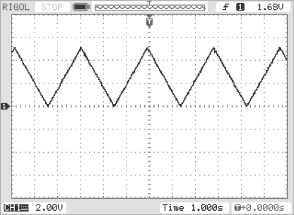
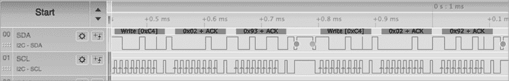

# 第十一章：裸金属 I²C 控制器编程


到目前为止，本书中的大多数示例程序依赖于一些第三方库代码与 SBC 上的 I²C 硬件接口。在硬件层面，I²C 通信通常包括读取和写入微控制器上依赖于硬件的寄存器。有一个隐藏这些底层细节的库代码非常方便，但如果你负责编写这个库代码——或者如果你需要更好的性能或库没有提供的功能——你就必须学会自己编写底层 I²C 操作。

几乎每个真实世界中的 MCU 在处理底层 I²C 编程时都有不同的做法，即使它们共享一些常见的外设硬件。幸运的是，I²C 协议并不是*那么*复杂，因此基本的编程思路适用于任何底层硬件。如果你学会了如何编程几种不同的 MCU，那么这些概念应该能帮助你弄清楚如何处理其他 MCU。在本章中，我将描述如何在寄存器（硬件）级别上编程两个 MCU 之间的 I²C 通信。特别地，本章将探讨在 Teensy 4.*x* 的 NXP i.MX RT1062 MCU 和 ATtiny84 MCU 上进行 I²C 编程。

本章中的编程示例使用了 Teensy 4.*x* 模块和 SparkFun Atto84。Teensy 4.0 和 4.1 模块共享相同的 MCU IC，因此它们的底层 I²C 编程是相同的；SparkFun Atto84 基于 ATtiny84 MCU。所有这些设备都价格低廉且常见，并且被许多创客和爱好者使用。

## 11.1 Teensy 4.*x* 控制器编程

本章的第一个示例将是使用由 Richard Gemmell 主要编写、Paul Stoffregen（PJRC）参与的驱动程序，在 Teensy 4.*x* 模块上进行 I²C 控制器编程。讨论从描述 Teensy 支持 I²C 通信的硬件寄存器开始，然后是你需要的代码（基于 Gemmell 的驱动程序），通过这些代码，你可以编程这些寄存器，实现类似 Arduino 的 I²C 通信功能。

关于此驱动程序的更多信息以及下载 Gemmell 的代码，请访问他的 GitHub 页面 [`github.com/Richard-Gemmell/teensy4_i2c`](https://github.com/Richard-Gemmell/teensy4_i2c)。Gemmell 的包包含了控制器和外设代码，但我将仅关注控制器部分。请参阅在线章节（特别是 [`bookofi2c.randallhyde.com`](https://bookofi2c.randallhyde.com) 上的第十八章），获取有关将 Teensy 4.*x* 编程为 I²C 外设设备的相关讨论。

当你在 MCU 上与底层硬件打交道时，MCU 的参考手册成为了一个不可或缺的资源。请参阅本章末尾的“更多信息”部分，获取链接，访问 PJRC（Teensy）网站上的 NXP i.MX RT1060 MCU（包括 i.MX RT1062）的参考手册。手册中的第四十七章描述了 I²C 接口。

### 11.1.1 i.MX RT1062 I²C 寄存器

Teensy 4.0 和 4.1 模块使用 NXP i.MX RT1062 MCU，配备 ARM Cortex M7 核心。ARM Cortex M7 核心是 CPU，而 i.MX RT1062 是包含 CPU 及所有相关外设的 MCU。

要理解 Teensy 4.*x* 的 I²C 代码，你需要了解一些 i.MX RT1062 寄存器，首先从 I²C 控制寄存器集开始。Gemmell 的代码使用的 *imx_rt1060.h* 文件包含以下声明（注释为我加的）：

```
typedef struct
{
    const uint32_t VERID;
    const uint32_t PARAM;           // The "M" prefix stands
    const uint32_t unused1;         // for "Master" in the
    const uint32_t unused2;         // following names:
    volatile uint32_t MCR;          // 010 Control Reg
    volatile uint32_t MSR;          // 014 Status Reg
    volatile uint32_t MIER;         // 018 Int Enable Reg
    volatile uint32_t MDER;         // 01C DMA Enable Reg
    volatile uint32_t MCFGR0;       // 020 Config Reg 0
    volatile uint32_t MCFGR1;       // 024 Config Reg 1
    volatile uint32_t MCFGR2;       // 028 Config Reg 2
    volatile uint32_t MCFGR3;       // 02C Config Reg 3
    volatile uint32_t unused3[4];
    volatile uint32_t MDMR;         // 040 Data Match Reg
    volatile uint32_t unused4;
    volatile uint32_t MCCR0;        // 048 Clock Config Reg 0
    volatile uint32_t unused5;
    volatile uint32_t MCCR1;        // 050 Clock Config Reg 1
    volatile uint32_t unused6;
    volatile uint32_t MFCR;         // 058 FIFO Control Reg
    volatile uint32_t MFSR;         // 05C FIFO Status Reg
    volatile uint32_t MTDR;         // 060 Transmit Data Reg
    volatile uint32_t unused7[3];
    volatile uint32_t MRDR;         // 070 Receive Data Reg
    volatile uint32_t unused8[39];

                                    // The "S" prefix stands
                                    // for "Slave" in the
                                    // following names:
    volatile uint32_t SCR;          // 110 Control Reg
    volatile uint32_t SSR;          // 114 Status Reg
    volatile uint32_t SIER;         // 118 Int Enable Reg
    volatile uint32_t SDER;         // 11C DMA Enable Reg
 volatile uint32_t unused9;
    volatile uint32_t SCFGR1;       // 124 Config Reg 1
    volatile uint32_t SCFGR2;       // 128 Config Reg 2
    volatile uint32_t unused10[5];
    volatile uint32_t SAMR;         // 140 Address Match Reg
    volatile uint32_t unused11[3];
    volatile uint32_t SASR;         // 150 Address Status Reg
    volatile uint32_t STAR;         // 154 Transmit Ack Reg
    volatile uint32_t unused13[2];
    volatile uint32_t STDR;         // 160 Transmit Data Reg
    volatile uint32_t unused14[3];
    volatile uint32_t SRDR;         // 170 Receive Data Reg
} IMXRT_LPI2C_Registers;

// LPI2C2 is not connected to any
// pins on the Teensy 4.*x*.

#define LPI2C1      (*(IMXRT_LPI2C_Registers *)0x403F0000)
#define LPI2C2      (*(IMXRT_LPI2C_Registers *)0x403F4000)  
#define LPI2C3      (*(IMXRT_LPI2C_Registers *)0x403F8000)
#define LPI2C4      (*(IMXRT_LPI2C_Registers *)0x403FC000)
```

该列表末尾的 `#define` 语句定义了将该结构映射到内存中不同地址的符号。具体来说，`LPI2C1` 对应与 Teensy 4 的（SDA0, SCL0）引脚相关的寄存器，`LPI2C3` 对应（SDA1, SCL1）引脚，`LPI2C4` 对应（SCL2, SDA2）引脚（请注意，Teensy 4.*x* 只有三个 I²C 端口）。你可以在 NXP 手册的第 47.4 节中了解这些引脚定义。

尽管本书并不详细描述所有这些寄存器的用途，但描述其中的几个寄存器对于理解接下来的代码是非常有价值的。有关所有其他寄存器的更多详细信息，请参见 NXP 手册的第四十七章。

由于 i.MX RT1062 是一个 32 位的 CPU，因此所有寄存器都是 32 位宽。与 CPU 寄存器不同，ARM 核心将其地址编码到指令操作码中，而外设寄存器对处理器来说是内存位置——也就是说，`LPI2C1` 到 `LPI2C4`。由于 ARM 支持字节、半字（16 位）和字（32 位）内存访问，因此你可以访问这些外设寄存器中的单个字节或半字（当然，也可以访问整个 32 位寄存器）。

1.  主控制寄存器（MCR）MCR 是一个由六个标志（位）组成的集合，这些标志分布在寄存器的低 10 位中。写入这些标志可以启用（1）或禁用（0）I²C 功能。表 11-1 描述了这些标志。

表 11-1：MCR 字段

| **位** | **描述** |
| --- | --- |
| 0 | MEN（主设备启用）：启用或禁用特定 I²C 端口的控制器功能。设置为 1 时将 I²C 端口用作控制器。 |
| 1 | RST（软件重置）：该位为 1 时重置 I²C 控制器。该位为 0 时允许正常操作。 |
| 2 | DOZEN（低功耗模式启用）：该位为 1 时启用低功耗待机模式操作。该位为 0 时禁用控制器进入待机模式（以便正常操作）。 |
| 3 | DBGEN（调试启用）：该位为 1 时启用控制器的调试模式操作。该位为 0 时，I²C 端口处于正常操作模式。 |
| 8 | RTF（重置传输 FIFO [先进先出]）：将 1 写入该位会重置传输 FIFO；将 0 写入则没有效果。此位是只写的，读取时总是返回 0。 |
| 9 | RRF（重置接收 FIFO）：将 1 写入该位会重置接收 FIFO（写入 0 不做任何操作）。此位是只写的，读取时总是返回 0。 |

1.  主状态寄存器（MSR） 主状态寄存器（MSR）是一组位，用于指定 I²C 端口的当前状态。表 11-2 列出了此寄存器中的各个字段。

表 11-2：MSR 字段

| **位** | **描述** |
| --- | --- |
| 0 | TDF（传输数据标志）：每当传输 FIFO 中的字节数小于或等于 *TxWater*（传输低水位标志）时设置。^(*) TxWater 在 MFCR 中设置。此标志（及其对应的中断）用于通知系统传输 FIFO 需要更多数据。有关设置 TxWater 值的信息，请参见本章后面的表 11-6。 |
| 1 | RDF（接收数据标志）：每当接收 FIFO 中的字节数大于 *RxWater*（接收高水位标志）时设置。RxWater 在 MFCR 中设置。此标志（及其对应的中断）用于通知系统需要从接收 FIFO 中移除数据。有关设置 RxWater 值的信息，请参见表 11-6。 |
| 8 | EPF（结束包标志）：当控制器生成 *重复* 起始条件或停止条件时设置（不会在第一次起始条件时设置）。向此位写入 1 会清除此标志。 |
| 9 | SDF（停止检测标志）：当控制器生成停止条件时设置。向此位写入 1 会清除此标志。 |
| 10 | NDF（NAK 检测标志）：当控制器在传输地址或数据时检测到 NAK 时设置。当此位为 1 时，系统不会生成起始条件，直到清除此标志。如果预期在地址传输后会出现 NAK，则如果没有生成 NAK，硬件会设置此标志。向此位写入 1 会清除此标志。 |
| 11 | ALF（仲裁丢失标志）：如果控制器在 I²C 总线上的仲裁中失败，则会设置此标志。一旦设置，系统将在此标志清除之前不会启动新的起始条件。向此位写入 1 会清除此标志。 |
| 12 | FEF（FIFO 错误标志）：如果控制器检测到在没有起始或重复起始条件的情况下试图传输或接收数据，则会设置此标志。向此位写入 1 会清除此标志。 |
| 13 | PLTF（引脚低超时标志）：如果控制器检测到 SDA 或 SCL 引脚被拉低，则设置此标志。向此位写入 1 会清除此标志，尽管只要低电平条件存在，它无法被清除。 |
| 14 | DMF（数据匹配标志）：当控制器检测到接收到的数据与 MATCH0 或 MATCH1 的值（在 MCFGR1 中指定）匹配时设置。向此位写入 1 会清除此标志。 |
| 24 | MBF（主设备忙碌标志）：当控制器忙碌时设置。 |
| 25 | BBF（总线忙碌标志）：当 I²C 总线忙碌时设置。 |
| ^(*)水位线是缓冲区中的某个点，在此点上会发生某些事件（例如设置 TDF 或 RDF）。 |

1.  主中断使能寄存器 (MIER) MIER 允许你为特定端口启用或禁用各种 I²C 中断。这是一个位域，其中 1 表示中断已启用，0 表示该中断已禁用。表 11-3 列出了该寄存器中的字段。

表 11-3: MIER 字段

| **位** | **描述** |
| --- | --- |
| 0 | TDIE: 传输数据中断使能 |
| 1 | RDIE: 接收数据中断使能 |
| 8 | EPIE: 数据包结束中断使能 |
| 9 | SDIE: 停止检测中断使能 |
| 10 | NDIE: 检测到 NAK 中断使能 |
| 11 | ALIE: 仲裁丢失中断使能 |
| 12 | FEIE: FIFO 错误中断使能 |
| 13 | PLTIE: 引脚低超时中断使能 |
| 14 | DMIE: 数据匹配中断使能 |

1.  主配置寄存器 1 (MCFGR1) Teensy I²C 代码仅使用 MCFGR1 的低 3 位。这 3 位存储时钟预分频器值，将系统时钟除以 2^(*n+1*)，其中 *n* 是 MCFGR1 中传递的 3 位数字。有关其他位的信息，请参阅 NXP 文档。

1.  主配置寄存器 2 (MCFGR2) MCFGR2 包含 I²C 总线的空闲超时和毛刺滤波常数。表 11-4 描述了 MCFGR2 字段。

表 11-4: MCFGR2 字段

| **位** | **描述** |
| --- | --- |
| 0 到 11 | 总线空闲超时周期，单位为时钟周期。该字段为 0 时，禁用总线空闲检查。 |
| 16 到 19 | SCL 毛刺滤波器。该字段为 0 时，禁用滤波器。否则，长度小于或等于该时钟周期数的脉冲将在 SCL 线上被忽略。 |
| 24 到 27 | SDA 毛刺滤波器。该字段为 0 时，禁用滤波器。否则，长度小于或等于该时钟周期数的脉冲将在 SDA 线上被忽略。 |

1.  主配置寄存器 3 (MCFGR3) MCFGR3 存储引脚低超时值。位 8 到 19 存储引脚低超时常数（以时钟周期为单位，乘以 256）。将 0 写入这些位将禁用此功能。MCFGR3 中的所有其他位必须为 0。

1.  主时钟配置寄存器 0 (MCCR0) 和 1 (MCCR1) MCCR0 和 MCCR1 指定与 I²C 信号线相关的各种参数。表 11-5 列出了该寄存器中的字段。MCCR1 与 MCCR0 相同，但用于 I²C 高速模式下的操作。

表 11-5: MCCR0 和 MCCR1 字段

| **位** | **描述** |
| --- | --- |
| 0 到 5 | CLKLO: 硬件将 SCL 时钟拉低的最小周期数（减去 1）。 |
| 8 到 13 | CLKHI: 硬件将 SCL 时钟拉高的最小周期数（减去 1）。 |
| 16 到 21 | SETHOLD: 控制器用作起始条件保持时间的最小周期数（减去 1）。它还用作重复起始条件的设定和保持时间，以及停止条件的设定时间。 |
| 24 到 29 | DATAVD：数据有效延迟。用于 SDA 数据保持时间的最小周期数（减去 1）。必须小于 CLKLO。 |

1.  主 FIFO 控制寄存器（MFCR）MFCR 允许你设置 TxWater 和 RxWater 水印。每个水印都是 2 位字段，允许你将水印设置为 0 到 3（FIFO 每个包含 4 个字）。字段位置请参见表 11-6。

表 11-6：MFCR 字段

| **位** | **描述** |
| --- | --- |
| 0 到 1 | TxWater |
| 16 到 17 | RxWater |

1.  主 FIFO 状态寄存器（MFSR）MFSR 保存传输和接收 FIFO 中当前的字数。字段如表 11-7 所示。虽然这些字段与 3 位相关，但 FIFO 仅存储四个字。

表 11-7：MFSR 字段

| **位** | **描述** |
| --- | --- |
| 0 到 2 | 传输缓冲区中的字数 |
| 16 到 18 | 接收缓冲区中的字数 |

1.  主传输数据寄存器（MTDR）MTDR 接受命令和数据字节，用于控制将数据写入 I²C 总线。它有两个字段，如表 11-8 所示。

表 11-8：MTDR 字段

| **位** | **字段** |
| --- | --- |
| 0 到 7 | 数据 |
| 8 到 10 | 命令 |

1.  向低 8 位写入任何数据，无论是通过字节写入还是通过 16 位（或 32 位）写入到该寄存器，都将把数据字节插入到传输 FIFO 的末尾并递增 FIFO 指针——前提是 FIFO 未满。另请注意，向低 8 位写入 8 位数据时，将会零扩展写入操作，并将 0b000 写入命令位。

1.  命令字段是一个 3 位的命令代码（见表 11-9）。写入 8 到 15 位的一个字节即可执行命令。

表 11-9：MTDR 命令值

| **命令位** | **命令** |
| --- | --- |
| 0b000 | 传输数据（位于 0 到 7 位）。 |
| 0b001 | 接收数据。位 0 到 7 指定要接收的字节数（加 1）。 |
| 0b010 | 发送停止条件。 |
| 0b011 | 接收并丢弃字节。位 0 到 7 指定要接收的字节数（加 1）。 |
| 0b100 | 生成（重复）启动条件并传输 0 到 7 位中的地址。 |
| 0b101 | 生成（重复）启动条件并在 0 到 7 位中传输地址。此传输预期返回 NAK。 |
| 0b110 | 生成（重复）启动条件并在高速度模式下传输 0 到 7 位中的地址。 |
| 0b111 | 生成（重复）启动条件并在高速度模式下传输 0 到 7 位中的地址。此传输预期返回 NAK。 |

1.  一般来说，作为单字节写入（到 8 到 15 位）的唯一命令是发送停止条件。所有其他命令都与数据相关。

1.  请注意，FIFO 存储的是命令和数据。因此，硬件将它执行的特定命令与从传输 FIFO 拉取的项目关联起来。

1.  主接收数据寄存器（MRDR）接收到的 I²C 硬件数据会被添加到接收 FIFO 中。读取 MRDR 会从 FIFO 中检索下一个可用的字节（在位 0 到 7 之间）。如果 FIFO 为空，则 MRDR 的第 14 位会被设置。注意，您还可以通过读取 MFSR 中的第 16 到 18 位来检查 FIFO 中是否有可用数据。

### 11.1.2 Teensy 4.*x* Wire 代码

以下部分描述了 Gemmell 的 Teensy 4 代码中与 Arduino I²C 函数直接相关的操作。由于您可以通过下载 Gemmell 的库并将其包含在 Teensyduino IDE 中来轻松测试他的代码，我在本节中不提供常规的 DAC 输出演示程序，并运行清单 8-1 中的 Arduino 示例（别忘了将 `#include <Wire.h>` 替换为 `#include <i2c_driver_wire.h>`）。结果应该几乎相同，只是由于 Gemmell 的代码运行在比我用来生成清单 8-1 中示波器输出的 Teensy 3.2 更快的处理器上，可能会有轻微的时间差异。

Gemmell 的库提供了以下 Arduino I²C 函数的即插即用代码：

+   `Wire.begin()`

+   `Wire.beginTransmission()`

+   `Wire.endTransmission()`

+   `Wire.write()`

+   `Wire.requestFrom()`

+   `Wire.read()`

下一部分将描述这些函数的实现。

当你学习 Gemmell 的代码时，最好的方法是从 Arduino Wire 对象开始，采用自上而下的方式查看。*i2c_driver_wire.cpp* 文件声明了以下三个对象：

```
I2CDriverWire Wire( Master, Slave );
I2CDriverWire Wire1( Master1, Slave1 );
I2CDriverWire Wire2( Master2, Slave2 );
```

`Wire` 对象对应于标准的 Arduino I²C Wire 设备，控制 Teensy 的 SDA 和 SCL 线路上的 I²C 通信。`Wire2` 和 `Wire3` 对象是原始 Arduino I²C 库的扩展，支持 Teensy 的 (SDA1, SCL1) 和 (SDA2, SCL2) 线路上的通信。

`Wire` 对象支持主设备和从设备。（再次声明，我在本节中使用过时的术语 *master* 和 *slave*，仅为与 ARM 文档和 Gemmell 的代码保持一致。）在本章中，我将专注于主设备部分。

#### 11.1.2.1 `begin()` 函数

`begin()` 函数替代了标准 Arduino 的 `Wire.begin()` 函数。它负责在调用其他 I²C 函数之前初始化 I²C 硬件和软件。它会为 I²C 通信初始化适当的 Teensy 引脚，重置任何现有的 I²C 初始化，设置 I²C 时钟频率，设置中断向量，并根据需要初始化 iMXRT 1062 寄存器。

`Wire`、`Wire1` 和 `Wire2` 对象声明（在 *i2c_driver_wire.cpp* 文件中）分配了存储空间，但几乎没有做其他事情。在 Arduino 编程范式中，对象的初始化不会发生在构造函数中；相反，初始化是在调用 `I2CDriverWire::begin()` 函数时进行的。

```
void I2CDriverWire::begin() 
{
    end();
    master.begin( master_frequency );
}
```

`begin()`函数通过调用`end()`函数停止当前的任何活动，然后将任务推给`I2CMaster`类构造函数（`master_frequency`参数是默认的 I²C 速度 100 kHz）。`I2CMaster`类只是一个抽象基类，被`IMX_RT1060_I2CMaster`类重写，提供实际的代码。

这是重写的`begin()`函数：

```
void IMX_RT1060_I2CMaster::begin( uint32_t frequency ) 
{
    // Make sure master mode is disabled before configuring it:

    stop( port, config.irq );

    // Set up pins and master clock:

    initialise_common( config, pad_control_config );

    // Configure and Enable Master Mode.
    // Set FIFO watermarks. Determines when the RDF and TDF 
    // interrupts happen:

    port->MFCR = LPI2C_MFCR_RXWATER( 0 ) | LPI2C_MFCR_TXWATER( 0 );
    set_clock( frequency );

    // Set up interrupt service routine:

    attachInterruptVector( config.irq, isr );

    // Enable all the interrupts you use:

    port->MIER = 
            LPI2C_MIER_RDIE | LPI2C_MIER_SDIE | 
            LPI2C_MIER_NDIE | LPI2C_MIER_ALIE | 
            LPI2C_MIER_FEIE | LPI2C_MIER_PLTIE;

    NVIC_ENABLE_IRQ( config.irq );
}
```

在讨论该函数中的各个语句之前，请注意标识符`port`是指向此函数操作的 I²C 端口的寄存器集的类变量；`config`也是包含端口配置的类变量。

在上述代码中`begin()`函数中调用`stop()`函数会关闭 I²C 端口上的任何活动，在此代码初始化系统之前执行，例如如果程序员调用了两次`begin()`函数。以下是`stop()`函数的代码：

```
static void stop( IMXRT_LPI2C_Registers* port, IRQ_NUMBER_t irq )
{
    // Halt and reset Master Mode if it's running:

  ❶ port->MCR = (LPI2C_MCR_RST | LPI2C_MCR_RRF | LPI2C_MCR_RTF);
    port->MCR = 0;

    // Halt and reset Slave Mode if it's running:

  ❷ port->SCR = (LPI2C_SCR_RST | LPI2C_SCR_RRF | LPI2C_SCR_RTF);
 port->SCR = 0;

    // Disable interrupts:

  ❸ NVIC_DISABLE_IRQ( irq );
    attachInterruptVector( irq, nullptr );
}
```

使用`port->MCR`❶写入 MCR 执行以下操作：

+   `LPI2C_MCR_RST`执行控制器的软件复位。

+   `LPI2C_MCR_RRF`用于重置接收 FIFO 内存缓冲区。

+   `LPI2C_MCR_RTF`用于重置发送 FIFO。

通过向`port->SCR`存储写入 SCR 完成了从设备（从设备）模式下的相同操作。最后，`stop`函数❶关闭并断开任何中断（和中断服务程序）。

在`begin`函数中调用`initialise_common()`函数初始化控制器（主控制器）和外围设备（从设备）的共同硬件。以下是该函数的代码：

```
static void initialise_common
(
  ❶ IMX_RT1060_I2CBase::Config hardware,
    uint32_t pad_control_config
){
    // Set LPI2C Clock to 24 MHz. This is required by 
    // slaves as well as masters:

  ❷ CCM_CSCDR2 = (CCM_CSCDR2 & ~CCM_CSCDR2_LPI2C_CLK_PODF( 63 )) | 
                    CCM_CSCDR2_LPI2C_CLK_SEL;

  ❸ hardware.clock_gate_register |= hardware.clock_gate_mask;

    // Set up SDA and SCL pins and registers:

  ❹ initialise_pin( hardware.sda_pin, pad_control_config );
    initialise_pin( hardware.scl_pin, pad_control_config );
}
```

`IMX_RT1060_I2CBase::Config`❶是*imx_rt1060_i2c_driver.h*文件中的结构体（请参阅下一个框以获取其格式）。它定义了 Teensy 引脚和其他信息。`CCM_CSCDR2`❷是 MCU 上的硬件定义，CCM 串行时钟分频器寄存器 2。对此硬件寄存器的赋值设置了生成 I²C 时钟所需的内部时钟分频器。`PODF`字段是时钟分频器，`CCM_CSCDR2_LPI2C_CLK_SEL`常数指定 I²C 时钟来源于系统振荡器。

对`hardware.clock_gate_register`❸的赋值通过变量覆盖了 MCU 内存映射中的 CCM 时钟门控寄存器，实现了向 CCM 时钟门控寄存器的神奇写入数据。最后，该函数中最后两个赋值语句❹根据端口的不同初始化了适当的 SDA 和 SCL 线，以便它们用于 I²C 通信，而不是例如数字 I/O 线。

`begin()`函数中的`port->MFCR`赋值定义了中断的发生时机。这个特定语句设置了当发送 FIFO 完全为空或接收 FIFO 至少包含一个字时发生中断。在 Arduino 环境中，0（空 FIFO）可能是一个不错的值。在多线程环境中，通过将传输值设置为 1 或其他非零值，可以在 I²C 总线上获得更好的吞吐量，以保持 FIFO 非空，只要有数据要传输。

调用 `set_clock()` 将 I²C 总线设置为此代码的参数传递的频率。参数应为 100,000、400,000 或 1,000,000。在调用 `begin()` 函数之前，必须调用 `set_clock()`。以下是 `set_clock()` 函数的代码：

```
// Supports 100-kHz, 400-kHz, and 1-MHz modes.

void IMX_RT1060_I2CMaster::set_clock( uint32_t frequency )
{
    if( frequency < 400000 )
    {
        // Use Standard Mode (up to 100 kHz).

        port->MCCR0 = LPI2C_MCCR0_CLKHI( 55 ) | 
                        LPI2C_MCCR0_CLKLO( 59 ) |
                        LPI2C_MCCR0_DATAVD( 25 ) | 
                        LPI2C_MCCR0_SETHOLD( 40 );

        port->MCFGR1 = LPI2C_MCFGR1_PRESCALE( 1 );

        port->MCFGR2 = LPI2C_MCFGR2_FILTSDA( 5 ) |
                        LPI2C_MCFGR2_FILTSCL( 5 ) |
                        LPI2C_MCFGR2_BUSIDLE
                        (
                            2 * (59 + 40 + 2)
                        );

        port->MCFGR3 = 
            LPI2C_MCFGR3_PINLOW
            (
                CLOCK_STRETCH_TIMEOUT * 12 / 256 + 1
            );

    } 
    else if( frequency < 10000000 )
    {
        // Use Fast Mode - up to 400 kHz.

      ❶ port->MCCR0 = LPI2C_MCCR0_CLKHI( 26 ) | 
                        LPI2C_MCCR0_CLKLO( 28 ) |
                        LPI2C_MCCR0_DATAVD( 12 ) | 
                        LPI2C_MCCR0_SETHOLD( 18 );

      ❷ port->MCFGR1 = LPI2C_MCFGR1_PRESCALE( 0 );
      ❸ port->MCFGR2 = LPI2C_MCFGR2_FILTSDA( 2 ) | 
                        LPI2C_MCFGR2_FILTSCL( 2 ) |
                        LPI2C_MCFGR2_BUSIDLE
                        (
                            2 * (28 + 18 + 2)
                        );

        port->MCFGR3 = 
            LPI2C_MCFGR3_PINLOW
            (
                CLOCK_STRETCH_TIMEOUT * 24 / 256 + 1
            );
    } 
 else 
    {
        // Use Fast Mode Plus (up to 1 MHz).

        port->MCCR0 = LPI2C_MCCR0_CLKHI(9) | 
                        LPI2C_MCCR0_CLKLO(10) |
                        LPI2C_MCCR0_DATAVD(4) | 
                        LPI2C_MCCR0_SETHOLD(7);

        port->MCFGR1 = LPI2C_MCFGR1_PRESCALE(0);
        port->MCFGR2 = LPI2C_MCFGR2_FILTSDA(1) | 
                        LPI2C_MCFGR2_FILTSCL(1) |
                        LPI2C_MCFGR2_BUSIDLE
                        (
                            2 * (10 + 7 + 2)
                        ); 

        port->MCFGR3 = 
            LPI2C_MCFGR3_PINLOW
            (
                CLOCK_STRETCH_TIMEOUT * 24 / 256 + 1
            );
    }
  ❹ port->MCCR1 = port->MCCR0;
}
```

`MCCR0` ❶ 包含多个位字段，在分配后由宏填充。`CLKLO` 字段指定系统在 I²C 总线上使用低时钟信号的最小时钟周期数。`CLKHI` 字段类似，但指定时钟必须保持高电平的时间（此值必须小于 `CLKLO`）。`DATAVD` 字段指定数据在 SDA 线上必须保持有效的时间。`SETHOLD` 字段指定启动或停止条件的时间。

`MCFGR1` ❷ 控制多个字段（详见 NXP 文档）。此处设置的主要值是时钟除数。对于 100 kHz，除数为 2；对于其他频率，除数为 1。

`MCFGR2` 寄存器 ❸ 确定：

+   用于 SDA 抖动滤波的周期数（`LPI2C_MCFGR2_FILTSDA`）

+   用于 SCL 抖动滤波的周期数（`LPI2C_MCFGR2_FILTSCL`）

+   用于确定总线何时变为空闲的周期数（`LPI2C_MCFGR2_BUSIDLE`）

`MCCR1` 寄存器 ❹ 包含 I²C 高速模式的时钟配置。关于速度以外的内容，请参阅前面几段关于 `MCCR0` 的讨论以获取更多细节，因为除了速度外，其行为类似于 `MCCR1`。

````After setting the clock frequency, the `begin()` function attaches an ISR and enables interrupts. In theory, a nonthreaded system such as Arduino won’t benefit as much from an interrupt-driven I²C device driver; all I²C calls are synchronous, so you still have to enter a busy-waiting loop until the transmission or reception is complete. Nevertheless, using interrupts can be useful if you’re using the Teensy Threading Library, and an interrupt-driven system combined with the FIFOs can improve transmission and reception latency.    Each object gets its own instance of an ISR, which handles errors, nonempty receive FIFOs (meaning data has arrived), and empty transmission FIFOs (meaning you can send more data). Here’s the source code for the ISR (cleaned up for publication):    ``` void IMX_RT1060_I2CMaster::_interrupt_service_routine()   {      uint32_t msr = port->MSR;        // Check for the following errors (prioritized      // in this order):      //      //  NDF-  NAK detection flag.      //  ALF-  Arbitration lost flag.      //  FEF-  FIFO error flag.      //  PLTF- Pin low timeout flag.      ❶ if       (          msr &               (                  LPI2C_MSR_NDF |                   LPI2C_MSR_ALF |                   LPI2C_MSR_FEF |                   LPI2C_MSR_PLTF              )      ){            // If you got a NAK, determine who caused          // the NAK:            if( msr & LPI2C_MSR_NDF )           {              port->MSR = LPI2C_MSR_NDF; // Clear the error              if( state == State::starting )              {                  _error = I2CError::address_nak;              }               else               {                  _error = I2CError::data_nak;              }          }            // If you got an arbitration lost error, that          // takes precedence over NDF:            if( msr & LPI2C_MSR_ALF )           {              port->MSR = LPI2C_MSR_ALF; // Clear the error              _error = I2CError::arbitration_lost;          }   // FIFO empty error takes precedence over          // earlier errors:            if( msr & LPI2C_MSR_FEF )           {              port->MSR = LPI2C_MSR_FEF; // Clear error              if( !has_error() )               {                  _error = I2CError::master_fifo_error;              }                            // else FEF was triggered by another error.               // Ignore it (and keep previous error status).          }            // If pin low timeout, clear error and set          // error return value.            if( msr & LPI2C_MSR_PLTF )           {              port->MSR = LPI2C_MSR_PLTF; // Clear error              _error = I2CError::master_pin_low_timeout;          }            // On any of the above errors, put this in the          // stopping state if it's not already there.                    if( state != State::stopping )           {              state = State::stopping;              abort_transaction_async();          }          // else already trying to end the transaction.      }        // The following are "normal" conditions (not errors).      //      // Check for the "Stop Detected" flag, indicating end      // of transmission has been received.      ❷ if( msr & LPI2C_MSR_SDF )       {          // You don't want to handle TDF if you can avoid it,          // so disable that interrupt.                    port->MIER &= ~LPI2C_MIER_TDIE;           state = State::stopped;          port->MSR = LPI2C_MSR_SDF; // Clear stop detected      }        // Check the received data flag. This bit gets set      // whenever the number of bytes in the FIFO exceeds      // the "high water" mark. Because this code sets      // the HWM to 0, you get an interrupt whenever   // any byte comes along.      ❸ if( msr & LPI2C_MSR_RDF )       {          if( ignore_tdf )          {              // Copy the byte out of the receive              // register into the memory buffer:                if( buff.not_started_reading() )               {                  error = I2CError::ok;                  state = State::transferring;              }              if( state == State::transferring )               {                  buff.write( port->MRDR );              }               else               {                  // Reset the receive FIFO if                  // not expecting data.                    port->MCR |= LPI2C_MCR_RRF;              }              if( buff.finished_reading() )               {                  if( tx_fifo_count() == 1 )                   {                      state = State::stopping;                  }                   else                   {                      state = State::transfer_complete;                  }                                    // Avoids triggering PLTF if                   // you didn't send a STOP.                                    port->MCR &= ~LPI2C_MCR_MEN; // Master disable                                }          }           else           {              // This is a write transaction.               // Code shouldn't have gotten a read.                            state = State::stopping;              abort_transaction_async();          }      }        // Handle writing data to the I2C bus here.   // Is data available (and code is not ignoring it)?      ❹ if( !ignore_tdf && (msr & LPI2C_MSR_TDF) )       {          if( buff.not_started_writing() )           {              _error = I2CError::ok;              state = State::transferring;          }          if( state == State::transferring )           {              // Fill the transmit buffer (FIFO).                            uint32_t fifo_space =                   NUM_FIFOS - tx_fifo_count();                                while              (                       buff.has_data_available()                   &&  fifo_space > 0               ){                  port->MTDR =                       LPI2C_MTDR_CMD_TRANSMIT | buff.read();                  fifo_space--;              }                // If writing is done, disable transmission              // interrupts and clean up.                if              (                       buff.finished_writing()                   &&  tx_fifo_count() == 0               ){                  port->MIER &= ~LPI2C_MIER_TDIE;                  if ( stop_on_completion )                  {                      state = State::stopping;                      port->MTDR = LPI2C_MTDR_CMD_STOP;                  }                   else                   {                      state = State::transfer_complete;                  }                                    // Avoids triggering PLTF if                   // you didn't send a STOP.                                    port->MCR &= ~LPI2C_MCR_MEN;                  }          }          // else ignore it. This flag is frequently           // set in read transfers.      }  } ```    The ISR begins by checking for possible errors ❶ and sets an appropriate error condition based on the type of error, if an error condition exists. If no error exists ❷, then the ISR checks to see if a stop condition has been detected and sets the appropriate stop flag if so. Next, the ISR checks to see if any data has been received ❸, in which case it adds the data to the receive buffer. It then checks to see if it is transmitting any data to the I²C bus ❹, in which case it removes data from the transmit buffer to transmit, cleaning up and terminating the transmission if there is no data left to send in the buffer.    #### 11.1.2.2 The beginTransmission() and endTransmission() Functions    In Arduino I²C programming, the `beginTransmission()` function marks the beginning of a sequence to be transmitted across the I²C bus, while the `endTransmission()` function marks the end of a write operation. These two functions bracket a sequence of write commands (described in the next section). The write commands simply place data in a buffer (initialized by the `beginTransmission()` call), and then the `endTransmission()` function transmits the data in the buffer across the I²C bus.    The `beginTransmission()` function accepts a single argument, which is the I²C device address. Here’s its code:    ``` void I2CDriverWire::beginTransmission( int address )   {      write_address = (uint8_t)address;      tx_next_byte_to_write = 0;  } ```    This function doesn’t accomplish much. It saves the device address into a local (object) field for later use, initializes (to 0) a queue index for storing data to transmit, and then returns. Most of the real work happens in other functions.    Here’s the code for the `endTransmission()` function:    ``` uint8_t I2CDriverWire::endTransmission( int stop )   {      master.write_async      (          write_address,           tx_buffer,           tx_next_byte_to_write,           stop      );      finish();      return toWireResult( master.error() );  } ```    The single parameter is a Boolean flag indicating whether the function transmits a stop condition after it completes transmitting the data in the buffer.    The `write_async()` function within `endTransmission()`, as its name suggests, asynchronously writes the data in the buffer (`tx_buffer`) across the I²C bus. Because it is asynchronous, this function returns before the transmission is complete. Here’s the `write_async()` code:    ``` void IMX_RT1060_I2CMaster::write_async  (      uint8_t address,       uint8_t* buffer,       size_t num_bytes,       bool send_stop  ){    ❶ if( !start( address, MASTER_WRITE )) return;        if( num_bytes == 0 )      {          // The caller is probably probing           // addresses to find slaves.          // Don't try to transmit anything.                    ignore_tdf = true;        ❷ port->MTDR = LPI2C_MTDR_CMD_STOP;          return;      }      ❸ buff.initialise( buffer, num_bytes );      stop_on_completion = send_stop;      port->MIER |= LPI2C_MIER_TDIE;  } ```    The `start()` function call ❶ within `write_async()` puts an I²C start condition on the bus. It returns true if the operation was successful. If it fails, `write_async()` simply returns. If it succeeds, but there are no bytes to send, the `write_async()` function writes the appropriate bit to the MTDR to stop the whole transmission ❷. If `start()` succeeds and there is data to transmit, then `write_async()` initializes a transmission buffer ❸ and enables the transmit data interrupt enable bit.    Here’s the code for the `start()` function within `write_async()`:    ``` bool IMX_RT1060_I2CMaster::start  (      uint8_t address,       uint32_t direction  ){    {    ❶ if( !finished() )       {          // Code hasn't completed the previous transaction yet.            abort_transaction_async();            _error = I2CError::master_not_ready;   state = State::idle;          return false;      }        // Start a new transaction.          ❷ ignore_tdf = direction;      _error = I2CError::ok;      state = State::starting;        // Make sure the FIFOs are empty before you start.            if( tx_fifo_count() > 0 || rx_fifo_count() > 0 )       {          // This should never happen.            error = I2CError::master_fifos_not_empty;          abort_transaction_async();          return false;      }        // Clear status flags.            clear_all_msr_flags();        // Send a START to the slave at ″address.″          ❸ port->MCR |= LPI2C_MCR_MEN;      uint8_t i2c_address = (address & 0x7F) << 1;      port->MTDR =           LPI2C_MTDR_CMD_START | i2c_address | direction;        return true;  } ```    If the system is not finished with a previous transmission ❶, this function will terminate the previous transmission and set the state to idle. Then the `start()` function initializes a new I²C bus transaction ❷ by clearing all FIFOs and status flags. Finally, this function places a start condition on the I²C bus ❸. If this code is successful, it initializes the `state` field with `State::starting`.    The `endTransmission()` function is synchronous and does not return to the caller until the transmission is complete. To match those semantics, this version of the function calls the `finish()` function, which waits until the transmission is complete.    The `finish()` function is a simple little class method:    ``` void finish()   {      elapsedMillis timeout;      while( timeout < timeout_millis )      {          if( master.finished() )           {              return;          }      }  } ```    This function is a short extension of the `master.finished()` function that adds a timeout capability, which looks like this:    ``` inline bool IMX_RT1060_I2CMaster::finished()   {      return state >= State::idle;  } ```    The `state` field is initialized in the call to `start()` within `write_async()` and then set by the ISR. If the state is `transfer_complete` or `stopped`, then the ISR is done transferring data. Otherwise, the ISR is still reading or writing data, and the `endTransmission()` function will wait until the ISR has completed transferring data after the write operation begins.    At the end of `endTransmission()`, the function calls `toWireResult()` to translate the error status bitmap returned by `master.error()` into an Arduino-compatible error code, and the function returns that value to the caller.    #### 11.1.2.3 The write Functions    Between the `beginTransmission()` and `endTransmission()` calls, Arduino code calls the `write()` function to append data to the transmission buffer. There are two variants of the `write()` function: one that writes a single byte and one that writes a buffer.    Here’s the source code for the two `write()` functions:    ``` size_t I2CDriverWire::write( uint8_t data )   {      if( tx_next_byte_to_write < tx_buffer_length )       {          tx_buffer[tx_next_byte_to_write++] = data;          return 1;      }      return 0;  }    size_t I2CDriverWire::write( const uint8_t* data, size_t length )   {      size_t avail = tx_buffer_length - tx_next_byte_to_write;      if( avail >= length )       {          uint8_t* dest = tx_buffer + tx_next_byte_to_write;          memcpy( dest, data, length );          tx_next_byte_to_write += length;          return length;      }      return 0;  } ```    The maximum buffer length (defined in the `I2CDriverWire` class) is 32 bytes. If an application attempts to transmit more than 32 bytes in a single I²C transmission, this code will ignore all bytes beyond the size of the buffer.    #### 11.1.2.4 The requestFrom(), read(), and available() Functions    Reading bytes from the I²C bus is slightly less complex than writing data. There are three functions associated with reading: `requestFrom()`, `read()`, and `available()`. The `requestFrom()` function reads the data from a peripheral device and buffers the data up in memory, while the `read()` function retrieves bytes from the buffer and `available()` returns the number of bytes in the buffer.    Here’s the source code for the `requestFrom()` function:    ``` uint8_t I2CDriverWire::requestFrom  (      int address,       int quantity,    int stop  ){      rx_bytes_available = 0;      rx_next_byte_to_read = 0;      master.read_async      (          (uint8_t)address,           rxBuffer,           min( (size_t)quantity, rx_buffer_length ),          stop      );      finish();      rx_bytes_available = master.get_bytes_transferred();      return rx_bytes_available;  } ```    The first two statements in this function initialize the buffer index and count. The call to `master.read_async()` starts the actual read operation (it primes the system and notifies the ISR to start accepting data). As its name suggests, `master.read_async()` returns immediately, before the actual data is read. As with the `endTransmission()` function, `requestFrom()` calls the `finish()` function to wait until all the data has arrived from the peripheral device. Finally, `requestFrom()` returns the actual number of bytes read from the peripheral.    Here’s the source code to the `read_async()` class function (which is called from `requestFrom()`):    ``` void IMX_RT1060_I2CMaster::read_async  (      uint8_t  address,       uint8_t* buffer,       size_t   num_bytes,       bool     send_stop  ){   ❶ if( num_bytes > MAX_MASTER_READ_LENGTH )      {          error = I2CError::invalid_request;          return;      }      ❷ if( !start( address, MASTER_READ ))      {          return;      }    ❸ if( num_bytes == 0 )      {          // The caller is probably probing addresses           // to find slaves. Don't try to read anything.                  ❹ port->MTDR = LPI2C_MTDR_CMD_STOP;          return;      }        buff.initialise( buffer, num_bytes );   port->MTDR = LPI2C_MTDR_CMD_RECEIVE | (num_bytes - 1);        if( send_stop )       {          port->MTDR = LPI2C_MTDR_CMD_STOP;      }  } ```    The `read_async()` function begins with a quick validity check ❶ of the requested length. If the caller requested too many bytes (more than 32, the size of the internal buffer), the function returns an error.    Next, `read_async()` sends a start condition on the bus, along with the peripheral address and read command ❷. If that transmission is successful, the function checks to see if the caller is requesting 1 or more bytes to read ❸. If the caller specified 0 bytes, the function is done. Reading 0 bytes is a common way application code probes an address to see if there is a device present; `read_async()` will acknowledge the address byte transmission if it’s there. If no device is present at the address, a NAK happens. The `read_async()` function transmits a stop condition ❹ if the caller specified a read of 0 bytes.    If the caller wants to read 1 or more bytes, `read_async()` calls the buffer initialization function to initialize the buffer associated with the calling `IMX_RT1060_I2CMaster` object. Then `read_async()` writes the receive command to the MTDR along with the number of bytes (minus 1) to receive. This particular write (32 bits) inserts the command into an on-chip command FIFO and increments the FIFO pointer. At this point, the on-chip hardware will begin processing this receive data request independently of code execution.    After writing the receive command to the MTDR, `read_async()` checks whether the caller wants to send a stop condition after receiving the data. If the caller does want to send a stop, `read_async()` writes a stop command to the MTDR register (placing it in the command FIFO to execute once the read command finishes).    Once the `read_async()` function returns, the MCU hardware takes over and handles the receive requests. The hardware notifies the software via interrupts as data arrives, and the ISR checks to see if the read request is complete, updating the class’s `state` object as appropriate. The call to finish in the `requestFrom()` function returns once the read completes or a timeout occurs. Of course, this call to `finish()` completes the `requestFrom()` operation.    The `read()` function is straightforward: it just returns a byte from the buffer filled by a call to the `requestFrom()` function (or –1 if no data is available). Here’s its source code:    ``` int I2CDriverWire::read()   {      if( rx_next_byte_to_read < rx_bytes_available )           {          return rxBuffer[rx_next_byte_to_read++];      }      return no_more_bytes;  } ```    Finally, the `available()` function is simple—it just returns the number of bytes available in the read buffer as the function result.    #### 11.1.2.5 Beyond the Arduino Library    Gemmell’s code was specifically written to support Teensyduino programming using the Arduino (“Wiring”) programming paradigm. *Wiring programming* consists of some initialization code (the `setup()` procedure) followed by a main loop (the `loop()` function) that executes repeatedly. Wiring was designed to mimic the typical programming paradigm used for most noninterrupt-driven, non-RTOS embedded systems. Most MCUs that support hardware I²C communication will also support RTOS environments by using interrupts, hardware FIFOs, and DMA. Indeed, Gemmell’s code uses the NXP i.MX RT1062 MCU’s interrupt and FIFO capabilities but returns to the Wiring paradigm via the `finish()` function (which effectively stops the program’s execution until the data transfer is complete).    If you’re running your code under some environment other than Arduino, especially a multithreaded environment, you can dramatically improve the performance of the system by replacing the `finish()` function with a wait-on-event–type API call. Such a call would suspend the thread until the ISR signals it and tells it that the transmission or reception is complete. Rather than burning CPU cycles in a busy-waiting loop, the thread would simply stop, and those CPU cycles would be available for other threads to use. Modifying Gemmell’s code to support this would be easy: you’d simply replace the call to finish with an appropriate wait API call and modify the ISR to signal that thread when the I²C operation is complete.    One issue with this current implementation is that an interrupt consumes CPU cycles every time a character is received or whenever the transmit FIFO empties and the system needs to add more characters in the output FIFO. Using DMA, you could spare the CPU from having to do this work. In a DMA-driven system, the application programs the CPU’s DMA registers with an address and a count. Whenever an I²C transmission needs more data or whenever an I²C reception receives data, the DMA controller accesses memory without intervention of the CPU, saving all the work associated with an interrupt (saving machine state) and processing the interrupt. Although Gemmell’s code does not use DMA, the i.MX RT1062 supports this for I²C. For multithreaded RTOSs, this can make I²C operations even more efficient. See the NXP documentation in “For More Information” for more details.    ## 11.2 ATtiny Controller Programming    This section describes how to use the UART on an ATtiny84 MCU to create an I²C controller device. Chapter 3 originally described a software-based I²C controller on the ATtiny84; I moved that discussion to the online chapters because the code was largely redundant with respect to the Teensy code appearing in Chapter 3\. See Chapter 17 online at [`bookofi2c.randallhyde.com`](https://bookofi2c.randallhyde.com) for the software-based controller. This chapter describes a more efficient implementation using the universal serial interface hardware on the ATtiny84.    The code in this section is based on Adafruit’s open source TinyWireM package, which is based on the Atmel AVR310 application note and was originally written by BroHogan and jkl (the names given in the source code). For the original code, visit [`github.com/adafruit/TinyWireM`](https://github.com/adafruit/TinyWireM).    The ATtiny84 MCU—the MCU used on the Atto84 board from SparkFun—includes a hardware shift register known as the Universal Serial Interface (USI). You can employ the USI for any arbitrary shifting applications, including I²C, SPI, USB, or generic serial communication. Because the shifting is done in hardware, it is much more efficient than the bit-banging approach used in a software implementation of I²C. However, USI has a few limitations:    *   It can be used for only one interface at a time, so it’s a bit difficult to use if you need to control multiple serial buses concurrently (I²C and SPI, for example). *   It provides no glitch filtering or slew rate limiting, which I²C requires, so it can be a little noisier than hardware implementations. *   Clock generation (that is, SCL) must be done in software. *   It provides no buffering, so software must continuously monitor the shift register to retrieve data (or transmit new data) when the shift register is full or empty.    Generally, ATtiny84 MCUs are employed in low-cost, single-activity applications where they perform a single task, like transmitting or receiving data on the I²C bus. In these cases, their limitations aren’t much of a problem.    The ATtiny84 has a few registers associated with the USI that you’ll use for I²C communication: USDR, USISR, and USICR. USDR is the USI 8-bit data register (output data is written here and input data is read from here).    USISR is the USI status register, which contains information about the USI shift register’s state. See Table 11-10 for a description of these bits.      Table 11-10: USISR Bit Definitions       | **Bit** | **Description** | | --- | --- | | 0 to 3 | USICNT: 4-bit counter for the shift register. | | 4 | USIDC: Data collision flag. Set to 1 when the data being transmitted to SDA does not match the value actually on the pin. Use this flag to detect lost arbitration. | | 5 | USIPF: Stop condition flag. Set when a stop condition occurs. | | 6 | USIOIF: Counter overflow interrupt flag. Indicates that the 4-bit counter has overflowed. Must write a 1 to this bit position to clear this flag. If the overflow interrupt is enabled, an interrupt occurs on overflow. | | 7 | USISIF: Start condition interrupt flag. Set (and an appropriate interrupt generated, if enabled) when a start condition is found on the I²C bus. Writing a 1 to this bit position clears this flag. |    USICR is the USI control register. Bits written to this port affect the operation of the USI. See Table 11-11 for a description of these bits.      Table 11-11: USICR Bit Definitions       | **Bit** | **Description** | | --- | --- | | 0 | USITC: Toggle clock pin. Writing a 1 to this bit position toggles the clock pin. | | 1 | USICLK: Strobe clock. Writing a 1 to this bit increments the counter and shifts data in the shift register, but only if USICS0 and USICS1 are 0\. If USICS1 is 1, then setting this bit to 1 will select the USITC as the clock (this is the state the software uses). See Table 11-12 for a description of this bit. | | 2 to 3 | USICS0, USICS1: Clock select. See Table 11-12 for a description of these bits. | | 4 to 5 | USIWM1, USIWM0: Wire mode. These bits control the SDA and SCL operation mode. For normal I²C operation, USIWM0 is 0 and USIWM1 is 1\. Table 11-13 lists the meanings of these two bits. | | 6 | Counter overflow interrupt enable. | | 7 | Start condition interrupt enable. |    Table 11-12 lists the clock source settings for bits 1 to 3 in the USICR register.      Table 11-12: USICR Clock Source Settings       | **USICS1** | **USICS0** | **USICLK** | **Clock source** | 4**-bit counter clock source** | | --- | --- | --- | --- | --- | | 0 | 0 | 0 | No clock | No clock | | 0 | 0 | 1 | Software clock strobe (USICLK) | Software clock strobe (USICLK) | | 0 | 1 | X | Timer/Counter0 Compare Match | Timer/Counter0 Compare Match | | 1 | 0 | 0 | External, positive edge | External, both edges | | 1 | 0 | 1 | External, positive edge | Software clock strobe (USITC) | | 1 | 1 | 0 | External, negative edge | External, both edges | | 1 | 1 | 1 | External, negative edge | Software clock strobe (USITC) |    Bits 4 and 5 in the USICR specify the mode of the USI pins on the ATtiny84\. Table 11-13 specifies the various options for these bits.      Table 11-13: Pin Mode Settings       | **USIWM1** | **USIWM0** | **Description** | | --- | --- | --- | | 0 | 0 | Normal I/O pins (not connected to serial shift register). | | 0 | 1 | Three-wire mode. Uses DO, DI, and USCK pins. This is for SPI bus operation. | | 1 | 0 | Two-wire mode. Uses SDA (DI) and SCL (USCK) pins. This is the setting the software in this chapter uses for I²C operation. | | 1 | 1 | Two-wire mode. Uses SDA and SCL pins. Same as two-wire mode above, but the SCL line is held low when a counter overflow occurs and until the Counter Overflow Flag (USIOIF) is cleared. |    In addition to the three USI ports, I²C communication uses the ATtiny84’s PORT A parallel port, on which the SDA and SCL lines appear (SCL on bit 4, SDA on bit 6). Three memory locations are associated with PORT A:    *   PORTA: Output bits are written to this address. *   PINA: Input bits are read from this port. *   DDRA: I/O direction for PORTA is set here.    Because the I²C SDA and SCL lines are bidirectional, the code is constantly setting the data direction bits in the DDRA register.    ### 11.2.1 The Atto84 Triangle Wave Demonstration Program    The Atto84 triangle wave output program in Listing 11-1 provides the source code for the triangle wave output program for the Atto84, using the low-level ATtiny84 registers.    The first section of Listing 11-1 contains various constant declarations used throughout the code. In particular, it contains port address definitions, timing constants, and various bit patterns the code uses to initialize various registers:    ``` // Listing11-1.ino  //  // Sample triangle wave output  // on an Atto84 board from SparkFun  // utilizing the ATtiny84 USI.                                                                         #include "Arduino.h"  #include <inttypes.h>  #include <avr/interrupt.h>  #include <avr/io.h>  #include <util/delay.h>    // From avr/io.h:  //  // PORTA output pins:  //  // PORTA   SFR_IO8(0x02)  // PORTA7  7  // PORTA6  6  // PORTA5  5  // PORTA4  4  // PORTA3  3  // PORTA2  2  // PORTA1  1  // PORTA0  0  //  // USI Control Register:  //  // USICR   SFR_MEM8(0xB8)  // USITC   0    Toggle clock port pin.  // USICLK  1    1 for software clk strobe.  // USICS0  2    0 for clk source select 0.  // USICS1  3    1 for clk source select 1.  // USIWM0  4    1 for I2C mode.  // USIWM1  5    0 for I2C mode.  // USIOIE  6    Cntr overflow int enable.  // USISIE  7    Start cond int enable.  //  // USI Status Register:  //  // USISR   SFR_MEM8(0xB9)  // USICNT0 0    4-bit counter value.  // USICNT1 1    4-bit counter value.  // USICNT2 2    4-bit counter value.  // USICNT3 3    4-bit Counter value.  // USIDC   4    Data output collision.  // USIPF   5    Stop condition flag.  // USIOIF  6    Cntr overflow int flag.  // USISIF  7    Start condition int flag.  //   // #define USIDR    SFR_MEM8(0xBA)  //  // DAC address:    #define DAC_ADRS 0x60 // 0x60 for SparkFun, 0x62 for Adafruit    // PORT A input pins:  //  // #define PINA     SFR_IO8(0x19)  Port A input pins:    #define DDR_USI         DDRA    // Data direction for port A  #define PORT_USI        PORTA   // Output pins on port A  #define PIN_USI         PINA    // Input pins on port A  #define PORT_USI_SDA    PORTA6  // Bit 6 on port A  #define PORT_USI_SCL    PORTA4  // Bit 4 on port A  #define PIN_USI_SDA     PINA6   // Bit 6 on port (pin) A  #define PIN_USI_SCL     PINA4   // Bit 4 on port (pin) A    #define TRUE (1)  #define FALSE (0)    // Time constants to pass to  // delay_us for clock delays:     #define T2_I2C          5 // >4.7 us  #define T4_I2C          4 // >4.0 us    #define I2C_READ_BIT    0  #define I2C_ADR_BITS    1   #define I2C_NAK_BIT     0     #define USI_I2C_NO_ACK_ON_ADDRESS   0x01  #define USI_I2C_NO_ACK_ON_DATA      0x02     static  unsigned char const USISR_8bit =          (1 << USISIF)       |   (1 << USIOIF)       |   (1 << USIPF)       |   (1 << USIDC)      // Clear flags       |   (0x0 << USICNT0); // Shift 8 bits            unsigned char const USISR_1bit =          (1 << USISIF)       |   (1 << USIOIF)      |   (1 << USIPF)       |   (1 << USIDC)      // Clear flags      |   (0xE << USICNT0); // Shift 1 bit              union USI_I2C_state   {    uint8_t allBits;    struct     {      uint8_t addressMode : 1;               uint8_t cntlrWriteDataMode : 1;       uint8_t memReadMode : 1;               uint8_t unused : 5;    };  } USI_I2C_state; ```    Next, the `USI_Initialize()` function, as its name suggests, is responsible for initializing the USI. See the comments in the following code for the particular initializations this function provides:    ``` // Listing11-1.ino (cont.)  //  // USI_Initialize-  //  // Initializes the USI on the Atto84.    void USI_Initialize(void)  {      // Enable pullup on SDA:          PORT_USI |= (1 << PIN_USI_SDA);          // Enable pullup on SCL:        PORT_USI |= (1 << PIN_USI_SCL);         // Enable SCL as output:            DDR_USI |= (1 << PIN_USI_SCL);             // Enable SDA as output:            DDR_USI |= (1 << PIN_USI_SDA);         // Preload data register with "bus released" data.            USIDR = 0xFF;             USICR = // Disable all interrupts              (0 << USISIE)           |   (0 << USIOIE)           |   (1 << USIWM1)           |   (0 << USIWM0)                         // Set USI in two-wire mode.                        |   (1 << USICS1)           |   (0 << USICS0)                         // Software strobe as counter clock source.                        |   (1 << USICLK)           |   (0 << USITC);                      USISR =               (1 << USISIF) // Clear flags          |   (1 << USIOIF)           |   (1 << USIPF)           |   (1 << USIDC)                         // Reset counter.                        |   (0x0 << USICNT0);             } // USI_Initialize  ```    The `USI_I2C_Cntlr_Start()` and `USI_I2C_Cntlr_Stop()` functions put the start and stop conditions on the USI. In both functions, the code manually pulls the SCL and SDA lines low, as appropriate, with software-based timing to match the I²C specifications:    ``` // Listing11-1.ino (cont.)  //  // USI_I2C_Cntlr_Start-  //  // Function for generating an I2C start condition.    void USI_I2C_Cntlr_Start( void )   {      // Release SCL to ensure that (repeated) start       // can be performed:        PORT_USI |= (1 << PIN_USI_SCL);        // Verify that (wait until) SCL becomes high:        while( !(PORT_USI & (1 << PIN_USI_SCL)) );        // Delay for 1/2 bit time before generating      // the start condition:            _delay_us( T2_I2C );        // Generate start condition. The SCL line has      // been high for 1/2 bit time, pulling SDA      // low generates the start:            PORT_USI &= ~(1 << PIN_USI_SDA); // Force SDA low            // Leave SDA low for at least 4 us:            _delay_us( T4_I2C );            // Okay, clean up after yourself. Start has      // been generated, so release SDA and pull      // SCL low (start of first bit's clock period):            PORT_USI &= ~(1 << PIN_USI_SCL);      PORT_USI |= (1 << PIN_USI_SDA);        return;  }    // USI_I2C_Cntlr_Stop-  //  // Function for generating an I2C stop condition.   // Used to release the I2C bus.  // Returns true if it was successful.    void USI_I2C_Cntlr_Stop( void )   {      // Stop condition consists of changing SDA from      // low to high while the SCL line is high:            PORT_USI &= ~(1 << PIN_USI_SDA); // Pull SDA low      PORT_USI |= (1 << PIN_USI_SCL);  // Release SCL            // Wait until the SCL line registers a high on      // the SCL input pin:            while( !(PIN_USI & (1 << PIN_USI_SCL)) );        // Minimum setup time is 4 us:            delay_us( T4_I2C );            // Okay, raise the SDA line to signal the      // stop condition:            PORT_USI |= (1 << PIN_USI_SDA); // Release SDA            // Minimum hold time is around 5 us:             delay_us( T2_I2C );        return TRUE;  }  ```    The `USI_I2C_Xcvr()` function is responsible for transmitting and receiving data via the USI:    ``` // Listing11-1.ino (cont.)  //  // USI_I2C_Xcvr-  //  // Transmits and receives data.    uint8_t USI_I2C_Xcvr  (      uint8_t *msg,      uint8_t msgSize  ){      uint8_t *savedMsg;      uint8_t savedMsgSize;        // Caller must clear before calling this function       // so that memReadMode can be specified:            USI_I2C_state.allBits = 0;        // Clear state bits      USI_I2C_state.addressMode = TRUE; // True for first byte                  // Determine if this is a read (1) or write (0) operation      // by looking at the LO bit of the first byte (the address   // byte) in the message.          ❶ if      (          !(                  *msg                 // The LSB in the address                &   (1 << I2C_READ_BIT)  // byte determines if it           )                            // is a cntlr Read or Write      )                                // operation      {          USI_I2C_state.cntlrWriteDataMode = TRUE;      }        // Save buffer pointer for later:            savedMsg = msg;      savedMsgSize = msgSize;                     // Send a start condition.          ❷ USI_I2C_Cntlr_Start();         // Write address and Read/Write data:          do       {          // If cntlrWrite cycle (or initial address transmission):                  ❸ if          (                  USI_I2C_state.addressMode               ||  USI_I2C_state.cntlrWriteDataMode          ){              // Write a byte.              // Pull SCL low.                            PORT_USI &= ~(1 << PIN_USI_SCL);                            // Set up data.                            USIDR = *(msg++);                                                    // Send 8 bits on bus.                            USI_I2C_Cntlr_Transfer( USISR_8bit );                   // Clock and verify (N)ACK from peripheral.  	                          // Enable SDA as input:                            DDR_USI &= ~(1 << PIN_USI_SDA);                             // If you get a NAK, not an ACK,              // return an error code:                 if(                      USI_I2C_Cntlr_Transfer( USISR_1bit )                   &   (1 << I2C_NAK_BIT)              ){                                if( USI_I2C_state.addressMode )                  {                      return USI_I2C_NO_ACK_ON_ADDRESS;                  }                  return USI_I2C_NO_ACK_ON_DATA;              }                if              (                      (!USI_I2C_state.addressMode)                   &&  USI_I2C_state.memReadMode                )              {                  // Memory start address has been written.                  //                  // Start at peripheral address again:                                    msg = savedMsg;                                    // Set the Read Bit on peripheral address                  // (the first byte of the buffer):                                                       *(msg) |= (TRUE << I2C_READ_BIT);                                                     // Now set up for the Read cycle:                                    USI_I2C_state.addressMode = TRUE;                                     // Set byte count correctly:                                    msgSize = savedMsgSize;                                               // Note that the length should be peripheral                    // adrs byte + number of bytes to read + 1                  // (gets decremented below).                                    USI_I2C_Cntlr_Start();                                }               else               {                  // Only perform address transmission once:                                    USI_I2C_state.addressMode = FALSE;               }          }                    else    // cntlrRead cycle           {   // Enable SDA as input:                          ❹ DDR_USI &= ~(1 << PIN_USI_SDA);                 // Read a data byte:                *(msg++) = USI_I2C_Cntlr_Transfer( USISR_8bit );                // Prepare to generate ACK (or NAK               // in case of End Of Transmission).                if( msgSize == 1 )              {                  // If transmission of last byte was performed,                  // load NAK to confirm End Of Transmission:                                    USIDR = 0xFF;               }               else               {                  // Load ACK.                   // Set data register bit 7 (output for SDA) low:                                    USIDR = 0x00;               }                            // Generate ACK/NAK:                            USI_I2C_Cntlr_Transfer( USISR_1bit );                }      }while( --msgSize ); // Until all data sent/received      // Usually a stop condition is sent here, but caller    // needs to choose whether or not to send it.    //    // Transmission is successfully completed.        return( 0 );  } ```    This code begins by determining if this is a read or write operation and setting the mode appropriately ❶. Then the code puts a start condition on the bus ❷. If this is a write operation or if the code is writing the peripheral address and R/W bit to the bus, the code transmits the appropriate byte via the USI ❸. If this is a read operation, the code switches SDA to become an input pin and reads the appropriate data from the USI ❹.    Next, the `USI_I2C_Cntlr_Transfer()` function is the generic function for reading or writing an array of bytes on the USI:    ``` // Listing11-1.ino (cont.)  //  // USI_I2C_Cntlr_Transfer-  //  // Core function for shifting data in and out from the USI.  // Data to be sent has to be placed into the USIDR before  // calling this function. Data read will be returned   // by the function.  //  // Status:     //     Data to write to the USISR.  //     In this code, this will be   //     USISR_8bit (for data transfers)  //     or USISR_1bit (for ACKs and NAKs).  //                // Returns the data read from the device.    uint8_t USI_I2C_Cntlr_Transfer( uint8_t status )   {      USISR = status;        // Set USISR to status                                uint8_t control =      // Prepare clocking              (0 << USISIE)  // Interrupts disabled          |   (0 << USIOIE)          |   (1 << USIWM1)  // Set USI in two-wire mode          |   (0 << USIWM0)           |   (1 << USICS1)           |   (0 << USICS0)           |   (1 << USICLK)  // Software clock as source          |   (1 << USITC);  // Toggle Clock Port            do       {          // Wait for roughly 1/2 bit time (4.7-5 us):                    _delay_us( T2_I2C );                    // Toggle clock and generate positive SCL edge:                     USICR = control;                    // Wait for SCL to go high:                    while( !(PIN_USI & (1 << PIN_USI_SCL)) );                    // Leave SCL high for at least 4 us:                    _delay_us( T4_I2C );                    // Toggle clock to generate negative SCL edge:                    USICR = control;                    }while( !(USISR & (1 << USIOIF)) ); // Transfer complete?        // Wait for 1/2 bit time so the clock is low for   // a full bit time:            _delay_us( T2_I2C );            uint8_t data = USIDR;          // Read out data      USIDR = 0xFF;                  // Release SDA            // Switch the SDA back to an output pin:            DDR_USI |= (1 << PIN_USI_SDA);         return data; // Return the data read from the USIDR  } ```    The `I2C_rw()` function is responsible for reading or writing an array of bytes on the USI and transmitting a stop condition at the completion of the transmission or reception:    ``` // Listing11-1.ino (cont.)  //  // I2C_rw-  //  // Read or write a sequence of bytes from or to the I2C port.  // LO bit of buf[0] is 0 for write, 1 for read.    uint8_t I2C_rw( uint8_t *buf, size_t len, uint8_t stop )  {      bool xferOK = false;      uint8_t errorCode = USI_I2C_Xcvr( buf, len );             // If there wasn't an error, see if code is      // supposed to send a stop bit and transmit      // it if you are:               if( errorCode == 0 )      {          if( stop )           {              USI_I2C_Cntlr_Stop();          }          return 0;      // No error      }      return errorCode;  // There was an error  } ```    The “main program” (Arduino `loop()` function) is the code that actually transmits a triangle wave to the (Adafruit or SparkFun) DAC:    ``` // Listing11-1.ino (cont.)  //  // Usual Arduino initialization function.    void setup( void )  {      // Initialize the Atto84 I2C port:            USI_Initialize();  }    // Arduino main loop function:    void loop( void )  {        uint8_t writeBuf[3];            // Transmit the rising edge of the triangle wave:            for( uint16_t dac=0; dac<4096; ++dac )      {          // MCP4725 DAC at address DAC_ADRS (bits 1 to 7).          // Create a write operation:                    writeBuf[0] = (DAC_ADRS << 1) | 0; // Write to DAC          writeBuf[1] = (dac >> 8) & 0xff;   // HO byte          writeBuf[2] = dac & 0xff;          // LO byte          I2C_rw( writeBuf, 3, TRUE );      }            // Transmit the falling edge:            for( uint16_t dac=4095; dac>0; --dac )      {          // MCP4725 DAC at address DAC_ADRS (bits 1 to 7).          // Create a write operation:                    writeBuf[0] = (DAC_ADRS << 1) | 0; // Write to DAC_ADRS           writeBuf[1] = (dac >> 8) & 0xff;   // HO byte          writeBuf[2] = dac & 0xff;          // LO byte          I2C_rw( writeBuf, 3, TRUE );      }  } ```    The code in Listing 11-1 is relatively efficient, taking approximately 370 µsec per DAC transmission (3 bytes, about 120 µsec per byte). As the expected speed is about 100 µsec per byte (10 bits at 100 kHz), this is actually better than most of the other examples throughout this book, largely because of the streamlined code used to transmit the data. (Most of the other example programs execute considerable extra code between transmissions due to libraries, multitasking, and so on slowing them down.)    Figure 11-1 provides the oscilloscope output for the program in Listing 11-1.      Figure 11-1: Atto84 I²C triangle wave output      Figure 11-2 shows the logic analyzer output for this program. As you can see, there is very little delay between bytes written in a single message and only a short delay between values (3 bytes) written to the MCP4725 DAC (at address 0x62).      Figure 11-2: Logic analyzer output from Atto84 triangle wave output program      The program in Listing 11-1 is very straightforward; it just uses polling for everything (a typical Arduino paradigm). If you needed to do more than output a triangle wave from the Atto84, you would probably want to take advantage of the USI interrupts to allow other work to happen while waiting for I²C transmissions to take place. I’ll demonstrate that ATtiny84 capability when describing bare-metal peripheral programming on the Atto84 later in this book (see section 16.1, “The ATtiny as an I[2]C Peripheral,” in Chapter 16).    ## 11.3 Chapter Summary    This chapter discussed I²C bus controller programming at the hardware level. Because each MCU provides a different mechanism for I²C communication, no general explanation will work with any MCU. Therefore, this chapter presents a couple of specific examples. In particular, it discusses two separate MCUs (the i.MXRT 1602 MCU used by the Teensy 4.*x*) and the ATtiny84 MCU. Each MCU section begins with a discussion of the appropriate MCU registers needed to control the bus, followed by some sample code to program those registers.    The section on the Teensy 4.*x* used an existing library from Richard Gemmell and Paul Stoffregen as the example code. This library is a drop-in replacement for the standard Arduino Wire library. The section on the ATtiny84 used code based on Adafruit’s open source TinyWireM library. Both examples provided the basics for transmitting and receiving data on the I²C bus.````
