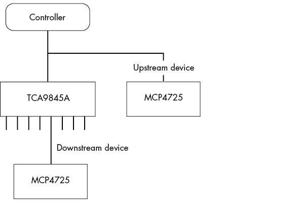
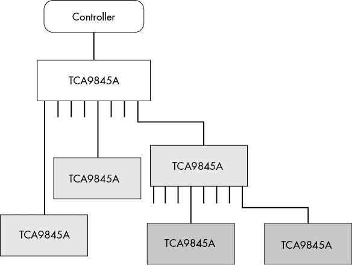
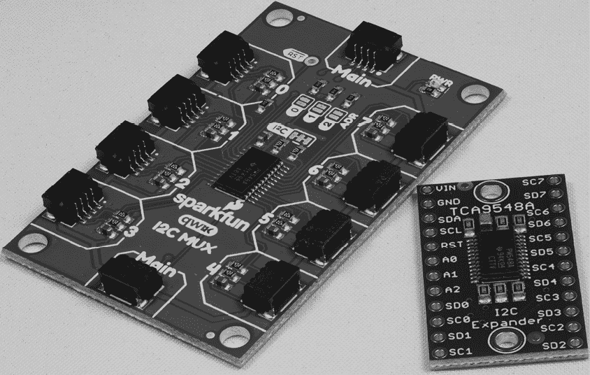

# 第十二章：TCA9548A I²C 总线扩展器

I²C 总线的 112 个非保留外设地址对于几乎任何系统来说都足够用了；你会在将如此多设备接入总线之前就达到总线电容限制。然而，由于设备往往将地址硬编码到硬件中，因此同一 I²C 总线上只能出现有限数量的相同设备。此外，由于存在数百或数千个 I²C 外设，常常会在不同 I²C 设备之间发生地址冲突。10 位地址方案的创建旨在缓解这个问题，但很少有设备和控制器利用这个特性。如果你想将两个具有相同地址的设备接入 I²C 总线，你将需要使用 I²C 总线扩展器。

I²C *总线扩展器*，也称为 *总线多路复用器* 或 *总线开关*，允许你将单个 I²C 总线切换到两个、四个或八个独立的 I²C 总线。简而言之，你可以编程一个多路复用器，将输入的 I²C 线对切换到 IC 支持的某个线对集合。常见的 I²C 多路复用器 IC 包括：

+   TCA9543A：将一个 I²C 总线切换为两个独立的总线

+   TCA9545A：将一个 I²C 总线切换为四个独立的总线

+   TCA9548A：将一个 I²C 总线切换为八个独立的总线

本章重点介绍 TCA9548A IC，因为它支持最多数量的总线。Adafruit 和 SparkFun 都提供适用于该芯片的分 breakout 板，本章也将讨论这些。

## 12.1 TCA9548A I²C 多路复用器

TCA9548A 可能是爱好者中最受欢迎的 I²C 多路复用器，因为有多个厂商为其提供 breakout 板。因此，本章的剩余部分将讨论这一特定设备（TCA9543A 和 TCA9545A 设备提供 TCA9548A 功能的子集，因此学习后者将帮助你了解大部分与这些其他设备相关的内容）。接下来的子章节将描述如何连接设备、编程寄存器集以及编程 TCA9548A。

TCA9548A 芯片上包含九对（SDA, SCL）引脚。数据手册中将来自控制器设备的主线（SDA, SCL）命名为主线，并将其他八对分别命名为（SD0, SC0）、（SD1, SC1）、...、（SD7, SC7）。

### 12.1.1 上游设备与下游设备

与 TCA9548A 在同一 I²C 总线上的设备被称为*上游设备*，因为它们位于任何已切换的 I²C 总线之前，处于主 I²C 总线上。这些已切换的总线是 TCA9548A 之后的*下游设备*。上游设备直接响应来自控制器设备的地址，且多路复用器不进行任何切换（或掩码）。因此，如果上游设备与下游设备共享相同的地址，当 TCA9548A 切换到连接下游设备的总线时，这两个设备将发生地址冲突。

TCA9548A 是一个 I²C 总线上的设备，这意味着它可以与其他设备共享相同的物理 SDA 和 SCL 线（见图 12-1）。我将把主线称为 *上游* 对，而剩余的八组线称为 *下游* 对。

每一组下游（SDA, SCL）对形成自己的 I²C 总线，可以独立于其他七组下游对进行操作。通过将上游线切换到某个下游对（在程序控制下），使用 TCA9548A 的系统可以将单个 I²C 总线扩展为八个。

图 12-1：上游和下游设备

### 12.1.2 TCA9548A 选择寄存器

TCA9548A 从软件角度来看是 I²C 设备中比较简单的一个。该设备有一个 8 位的读写寄存器，该寄存器出现在其 I²C 地址上。向设备写入数据选择要使用的输出总线；从设备读取则读取最后写入的数据（设备上电时寄存器中写入 0）。

TCA9548A 上的寄存器是一个位图，用于选择哪些下游对连接到上游总线。在位位置 0 中写入 1 会将上游（SDA, SCL）线连接到（SD0, SC0），在位位置 1 中写入 1 会将（SDA, SCL）连接到（SD1, SC1），以此类推。在位位置 7 中写入 1 会将（SDA, SCL）连接到（SD7, SC7）。

虽然可以在 TCA9548A 寄存器的不同位置写入多个 1 位，但通常不建议这么做，因为如果同时访问两个不同的设备，可能会在 I²C 总线上产生冲突。写入多个 1 位到寄存器的一个原因是向所有下游总线上的设备发送一般呼叫命令。然而，大多数时候，你应该确保只向寄存器写入单个 1 位。请注意，将所有 0 写入寄存器是合理的：这样做会关闭所有下游对，此时控制器只能与位于 TCA9548A 上游的设备通信（即在主 SDA 和 SCL 线上）。

### 12.1.3 TCA9548A 地址和复位线

TCA9548A 可以响应范围在 0x70 到 0x77 的 I²C 地址。该芯片有三条地址线（A0、A1 和 A2），可以将其连接到 Gnd 或 Vcc 来选择地址（TCA9548A 使用 A0、A1 和 A2 作为地址的低 3 位）。本章一般假设 TCA9548A 配置为地址 0x70，除非另有说明。要写入板载寄存器，只需在 I²C 总线上的 TCA9548A 地址写入一个字节。

除了三条地址线和主（上游）SDA 和 SCL 线外，TCA9548A 还有一个重要的输入：复位。短时间拉低复位线将复位设备（向内部寄存器写入 0）。数据手册声称，你可以使用此线从总线故障条件中恢复。通常，你会将此复位线连接到 CPU 的数字 I/O 引脚，或者简单地将其拉高（通常通过 10kΩ 的上拉电阻）。

### 12.1.4 TCA9548A 电源、上拉电阻和电平转换

TCA9548A 可以在 1.65 V 到 5.0 V 的电压范围内工作，因此它可以与 1.8 V、2.5 V、3.3 V 或 5 V 逻辑兼容。所有引脚都可以容忍 5 V 电压，无论电源电压如何，这意味着你可以将 TCA9548A 用作 I²C 电平转换器。

由于 I²C 总线是开漏的，SDA 和 SCL 线上实际的电压取决于上游和下游信号的上拉电阻连接。如果你有一个 3.3 V 系统，那么 SDA 和 SCL（上游）可能会被上拉到 3.3 V。为了安全起见，你可能会将 TCA8845A 也运行在 3.3 V 下。然而，你可以切换到下游通道（例如，SD3 和 SC3），并将其连接到一个 5 V 设备，通过在该下游总线上的 5 V 上拉电阻来实现。TCA9548A 上的 SD3 和 SC3 引脚将能够正常处理 5 V 信号，而不会将此电压传递到运行在 3.3 V 的控制器设备上。

相反，如果你的控制器运行在 5 V，并且你为 TCA9548A 提供 5 V 电源，你可以通过简单地在该通道的线路上使用上拉电阻将下游通道连接到 3.3 V 系统。

### 12.1.5 降低总线负载和总线速度

除了作为电平转换器外，TCA9548A 还可以减少（电容性）I²C 总线的负载。假设你有 12 个设备在 I²C 总线上，并且负载迫使你以 100 kHz 的速度而不是 400 kHz 的速度运行。你可以使用 TCA9548A 将这 12 个设备分布到 8 或 9 个总线上，包括原始上游总线，从而减少电容负载。即使没有地址冲突，TCA9548A 在这种情况下也是有用的。

顺便说一下，TCA9548A 可以在正常（100 kHz）或快速（400 kHz）速度下工作。它不能在快速模式加（1 MHz）或更高速度下工作。

### 12.1.6 总线之间的切换

正如我之前提到的，通过在 TCA9548A 寄存器中向对应的比特位置写入 1（并将所有其他比特位置写为 0），你可以激活一个下游总线。如果你有三个下游设备（SD0, SC0）、（SD1, SC1）和（SD2, SC2），并且你想将数据发送到这些设备中的每一个，可以使用以下过程：

1.  写入 0x01（0b0000_0001）到地址 0x70 的 TCA9548A。

1.  通过简单地像处理上游设备一样向 SDA 和 SCL 写入数据，将数据写入（SD0, SC0）上的设备。

1.  写入 0x02（0b0000_0010）到 TCA9548A 以激活（SD1, SC1）。

1.  写入第二个设备（SD1, SC1），就像它是一个上游设备一样进行处理。

1.  写入 0x04（0b0000_0100）到 TCA9548A 以激活（SD2, SC2）。

1.  写入第三个设备（SD2, SC2），就像它是一个上游设备一样进行处理。

1.  （可选）写入 0x0 到 TCA9548A 以禁用所有下游总线。

    如前所述，任何 I²C 地址上的上游设备不应出现在下游总线上。那样会在上游和下游总线的设备之间产生冲突。

### 12.1.7 级联 TCA9548A 多路复用器

因为 TCA9548A 有三个地址线，你可以将最多八个 TCA9548A 设备连接到同一个 I²C 总线上。这样，你就可以通过控制器上的一对 SDA 和 SCL 线访问大约 64 个独立的 I²C 总线；即 112 × 64 = 7,168 个独立地址。如果这还不够，你可以级联多路复用器。每一级下游都需要一个唯一的地址，在同一级别内（也就是说，所有连接到同一个 TCA9548A 输出端的 TCA9548A 设备可以使用相同的地址）。例如，在图 12-2 中，最上面的 TCA9548A 可以使用地址 0x70，浅灰色的 TCA9548A 可以使用地址 0x71，深灰色的 TCA9548A 则都可以使用地址 0x72。

要写入连接到图 12-2 中最右侧 TCA9548A 的设备（假设从左到右的通道编号为 0 到 7），你需要首先向地址 0x70（直接连接到控制器的 TCA9548A）写入 0x80（0b1000_0000）。然后，你需要向地址 0x71（对应最右侧浅灰色 TCA9548A）写入 0x80，最后通过向地址 0x72 写入总线设置来选择你想要的右侧深灰色 TCA9548A 总线。

在实际操作中，以这种方式级联 TCA9548A 设备可能会产生各种定时和负载问题，所以我不推荐这么做。唯一值得级联多路复用器的理由是你需要超过八个总线，而在上游总线的 0x70 到 0x77 范围内只有一个空闲地址。

图 12-2：级联 TCA9548A 多路复用器

由于 TCA9548A 是表面贴装设备（SMD），它有点难以接入典型的面包板或原型电路。幸运的是，Adafruit、SparkFun 和其他制造商提供了可以方便使用这些设备的分线板。接下来的章节将描述这些分线板。

## 12.2 Adafruit TCA9548A I²C 扩展器

Adafruit TCA9548A I²C 扩展器是一个传统的分线板，包含一个单独的 TCA9548A，其引脚被带出并排布在 0.1 英寸的中心间距（请参见图 12-3 中的较小分线板）。它还提供了一个旁路电容；为 SDA、SCL 和复位引脚提供上拉电阻；以及三个下拉电阻，将 A0、A1 和 A2 拉到地，从而使设备的默认地址为 0x70。PCB 背面有焊接跳线，可以切断 SDA 和 SCL 的上拉电阻（以防你在上游总线上已经有了上拉电阻），并且可以设置地址。

Adafruit 的拓展板没有在下游总线上放置上拉电阻。许多拓展板（如 Adafruit 和 SparkFun 的板）都包含上拉电阻，因此在 TCA9548A I²C 扩展器上不需要额外的上拉电阻。更重要的是，如果你想将此板用作电平转换器，你需要能够控制上拉电阻连接的电压。然而，别忘了，如果你将某些 I²C 集成电路直接连接到下游总线，你必须自己添加上拉电阻。

图 12-3：SparkFun I²C Mux 和 Adafruit TCA9548A I²C 扩展器

## 12.3 SparkFun I²C Mux

SparkFun 的 I²C Mux 设备（参见图 12-3）对于使用 Qwiic 设备的人非常方便：它接受一个上游 Qwiic 连接器，如果你想连接其他上游设备，它会将信号通过板子路由，然后通过 Qwiic 连接器提供八个下游总线。

SparkFun 实现和 Adafruit TCA9548A I²C 扩展器之间有一些主要区别。首先，由于它基于 Qwiic，SparkFun 扩展器基本上是一个 3.3V 设备（尽管请参见下一个注释）。SparkFun 板为下游和上游总线提供 3.3V 的上拉电阻；你可以通过切断某些线路去除上游的上拉电阻，但下游总线上的上拉电阻没有这个选项。

SparkFun 和 Adafruit 板的第二个主要区别是尺寸。由于 SparkFun 板包括 10 个 Qwiic 连接器（2 个用于上游总线，8 个用于下游总线），因此该板比 Adafruit 设备大得多（参见图 12-3）。

除了这些问题，SparkFun 和 Adafruit 板的功能完全相同。就个人而言，如果我使用 Qwiic 系统部件，我会选择 SparkFun 板；否则，我可能会使用 Adafruit 板。

## 12.4 本章总结

本章讨论了三种不同的 I²C 多路复用器：TCA9543A、TCA9545A 和 TCA9548A。这些集成电路允许你将单个 I²C 总线扩展为两个、四个或八个独立的总线。本章讨论了如何将设备连接到多路复用器（上游和下游），如何编程多路复用器，以及如何将多路复用器连接到 I²C 总线。还介绍了如何将 TCA9548A 用作电平转换器，并评论了设备的工作频率。本章通过描述如何级联设备以支持超过八个额外的 I²C 总线，结束了 TCA9548A 的通用讨论。

最后，本章介绍了由 Adafruit 和 SparkFun 制造的两个拓展板。Adafruit 的 I²C 扩展板是一个传统的拓展板，将 TCA9548A 芯片的引脚引出到小型 PCB 上的 0.1 英寸间距引脚。SparkFun 的 I²C Mux 提供了八个 Qwiic 连接器（而非引脚）用于扩展总线。
