# 第十三章：MCP23017 和 MCP23008 GPIO 扩展器


大多数 SBC（单板计算机）和 MCU（微控制单元）提供从三个到数十个的数字 I/O 引脚。有时候，你可能需要比标准配置更多的数字 I/O 引脚。即使是那些提供几十个引脚的 MCU，其中大部分也是多功能的。如果你将它们用作其它功能，可能会发现剩余的数字 I/O 引脚不够用。这时，GPIO 扩展器就显得非常有用。

尽管市场上有许多不同的集成电路（IC）可用于通过 I²C 总线扩展 GPIO，MCP23008 和 MCP23017（统称为 MCP230*xx*）是非常受欢迎的；它们有 DIP（插脚式）封装，并且有大量的库代码可供使用。MCP23008 支持 8 个 GPIO 引脚，而 MCP23017 支持 16 个，但这两个 IC 的其他功能完全相同。

本章描述了 MCP23017 和 MCP23008 设备，它们的电气连接以及如何编程它们。它还描述了内部设备寄存器（以及如何使用它们），并提供了一些示例程序来演示这些 IC 的操作。

## 13.1 MCP23017 和 MCP23008 引脚排列

MCP23017 的引脚排列如 图 13-1 所示。

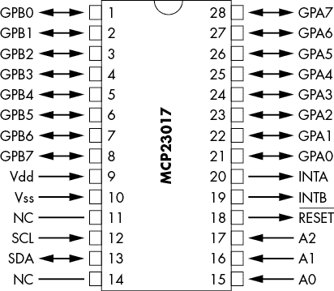

图 13-1：MCP23017 引脚排列

MCP23008 的引脚排列如 图 13-2 所示。

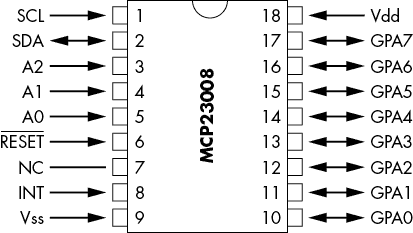

图 13-2：MCP23008 引脚排列

表 13-1 显示了每个设备的引脚含义。

表 13-1：MCP230*xx* 引脚功能

| **引脚** | **MCP23008** | **MCP23017** |
| --- | --- | --- |
| 1 | SCL（I²C 时钟） | GPIO 0，端口 B |
| 2 | SDA（I²C 数据） | GPIO 1，端口 B |
| 3 | A2（地址选择） | GPIO 2，端口 B |
| 4 | A1（地址选择） | GPIO 3，端口 B |
| 5 | A0（地址选择） | GPIO 4，端口 B |
| 6 | Reset（低电平有效） | GPIO 5，端口 B |
| 7 | NC（无连接） | GPIO 6，端口 B |
| 8 | INT（输入中断） | GPIO 7，端口 B |
| 9 | Vss（地） | Vdd（1.8 V，3.3 V 或 5 V） |
| 10 | GPIO 0 | Vss（地） |
| 11 | GPIO 1 | NC（无连接） |
| 12 | GPIO 2 | SCL（I²C 时钟） |
| 13 | GPIO 3 | SDA（I²C 数据） |
| 14 | GPIO 4 | NC（无连接） |
| 15 | GPIO 5 | A0（地址选择） |
| 16 | GPIO 6 | A1（地址选择） |
| 17 | GPIO 7 | A2（地址选择） |
| 18 | Vdd (1.8 V, 3.3 V 或 5 V) | Reset（低电平有效） |
| 19 | n/a | INTB（端口 B 中断） |
| 20 | n/a | INTA（端口 A 中断） |
| 21 | n/a | GPIO 0，端口 A |
| 22 | n/a | GPIO 1，端口 A |
| 23 | n/a | GPIO 2，端口 A |
| 24 | n/a | GPIO 3，端口 A |
| 25 | n/a | GPIO 4，端口 A |
| 26 | n/a | GPIO 5，端口 A |
| 27 | n/a | GPIO 6，端口 A |
| 28 | n/a | GPIO 7，端口 A |

Vdd 引脚是供电（正电压）引脚。MCP230*xx* 可以在多个不同的逻辑电平下工作，范围从 1.8 V 到 5.5 V（通常为 1.8 V、3.3 V 或 5.0 V）。Vss 引脚是接地引脚。

SCL 和 SDA 是 I²C 总线引脚。像往常一样，这些是开漏引脚。总线电压（通过 I²C 上拉电阻保持）应接近 Vdd。请注意，MCP230*xx* IC 能够在 100 kHz、400 kHz 甚至高达 1.7 MHz 的速度下工作。

GPIO*x* 引脚提供通用 I/O 扩展。MCP23008 有 8 个扩展 I/O 引脚，而 MCP23017 有 16 个（分别命名为*端口 A*和*端口 B*，每个端口有 8 个引脚）。当作为输入工作时，这些引脚可接受高达 Vdd 的电压。作为输出引脚工作时，它们在输出端产生 Vdd。

A0、A1 和 A2 引脚指定设备地址的低 3 位。这些引脚应连接到 Vdd 或 Vss 以设置设备地址。MCP230*xx* IC 支持在 I²C 总线上最多连接八个不同的设备（通过 A0、A1 和 A2 作为低地址位选择）。请注意，高 4 位地址总是 0b0100，因此完整的设备地址范围在 0x20 到 0x27 之间（当移入输出字节时，地址范围为 0x40 到 0x4E）。

重置信号是一个有效低信号，用于复位设备。该引脚在低电平时，将所有引脚配置为输入，并将设备配置为*安全模式*（最不可能导致硬件问题）。请注意，MCP230*xx*设备在施加电源时会自动复位，因此除非电路在操作过程中绝对需要能够复位 MCP230*xx*，否则通常会发现该引脚连接到 Vdd。

MCP23008 的 INT 引脚以及 MCP23017 的 INTA 和 INTB 引脚用于发出中断信号。*中断*是一个异步信号，提醒 CPU 采取某些操作（通常是暂停当前执行流并运行一个特殊的中断服务程序来处理事件）。你可以编程使 INT、INTA 和 INTB 引脚在 MCP230*xx*发生变化时脉冲或设置为某个电平，这对于当系统不能频繁轮询输入引脚时，检测输入变化非常有用。

## 13.2 MCP230*xx* 寄存器

MCP230*xx* IC 是功能丰富的设备。不幸的是，这些功能的实现带来了成本：编程复杂性。为了编程这些 IC，你需要读取和写入各种寄存器。MCP23008 有 11 个内部寄存器（参见表 13-2）。

表 13-2：MCP23008 寄存器

| **寄存器编号** | **名称** | **功能** |
| --- | --- | --- |
| 0 | IODIR | I/O 数据方向寄存器 |
| 1 | IPOL | 输入极性 |
| 2 | GPINTEN | GPIO 中断使能寄存器 |
| 3 | DEFVAL | 默认比较值（用于中断） |
| 4 | INTCON | 中断控制寄存器 |
| 5 | IOCON | I/O 配置寄存器 |
| 6 | GPPU | GPIO 上拉寄存器 |
| 7 | INTF | 中断标志寄存器 |
| 8 | INTCAP | 中断捕捉寄存器 |
| 9 | GPIO | GPIO I/O 端口寄存器 |
| 10 (0xA) | OLAT | 输出锁存寄存器 |

MCP23017 有 22 个内部寄存器（参见表 13-3）。

表 13-3：MCP23017 寄存器

| **寄存器编号，** **BANK = 0** | **备用寄存器编号，** **BANK = 1** | **名称** | **功能** |
| --- | --- | --- | --- |
| 0 | 0 | IODIRA | Port A I/O 数据方向寄存器 |
| 1 | 16 (0x10) | IODIRB | Port B I/O 数据方向寄存器 |
| 2 | 1 | IPOLA | Port A 输入极性 |
| 3 | 17 (0x11) | IPOLB | Port B 输入极性 |
| 4 | 2 | GPINTENA | Port A GPIO 中断使能寄存器 |
| 5 | 18 (0x12) | GPINTENB | Port B GPIO 中断使能寄存器 |
| 6 | 3 | DEFVALA | Port A 默认比较值（用于中断） |
| 7 | 19 (0x13) | DEFVALB | Port B 默认比较值（用于中断） |
| 8 | 4 | INTCONA | Port A 中断控制寄存器 |
| 9 | 20 (0x14) | INTCONB | Port B 中断控制寄存器 |
| 10 (0xA) | 5 | IOCON | I/O 配置寄存器（只有单一的 IOCON） |
| 11 (0xB) | 21 (0x15) | IOCON | I/O 配置寄存器（与寄存器 10/5 相同） |
| 12 (0xC) | 6 | GPPUA | Port A GPIO 上拉寄存器 |
| 13 (0xD) | 22 (0x16) | GPPUB | Port B GPIO 上拉寄存器 |
| 14 (0xE) | 7 | INTFA | Port A 中断标志寄存器 |
| 15 (0xF) | 23 (0x17) | INTFB | Port B 中断标志寄存器 |
| 16 (0x10) | 8 | INTCAPA | Port A 中断捕获寄存器 |
| 17 (0x11) | 24 (0x18) | INTCAPB | Port B 中断捕获寄存器 |
| 18 (0x12) | 9 | GPIOA | Port A GPIO |
| 19 (0x13) | 25 (0x19) | GPIOB | Port B GPIO |
| 20 (0x14) | 10 (0xA) | OLATA | Port A 输出锁存寄存器 |
| 21 (0x15) | 26 (0x1A) | OLATB | Port B 输出锁存寄存器 |

MCP23017 支持两组寄存器编号，标准和备用（或“特殊”）。寄存器编号由 IOCON（控制）寄存器中的第 7 位选择。如果该位为 0（上电/复位状态），则 MCP23017 使用标准寄存器编号。如果第 7 位为 1，则 MCP23017 使用备用寄存器编号，这将两个端口分开成两个独立的寄存器库（0 到 0xA 为端口 A，0x10 到 0x1A 为端口 B）。

### 13.2.1 访问 MCP230*xx* 寄存器

由于 MCP230*xx* 设备具有多个寄存器，向这些设备写入和读取数据比像 MCP4725 这样的简单设备更为复杂。写入单个字节到寄存器的（典型）协议如下：

1.  在 I²C 总线上发送启动条件。

1.  发送 I²C 地址字节（值范围为 0x40 到 0x46）。这始终是一个写操作，因此地址字节的 LO 位将始终为 0。

1.  将寄存器地址写入 I²C 总线。

1.  将寄存器数据（写入 MCP230*xx* 寄存器）放置在 I²C 总线上。

1.  在总线上发送停止条件以终止传输。

读取单个字节的寄存器（典型）协议如下：

1.  在 I²C 总线上发送启动条件。

1.  发送 I²C 地址字节（值范围为 0x40 到 0x46）。这始终是一个写操作，因此地址字节的 LO 位将始终为 0。

1.  将寄存器地址写入 I²C 总线。

1.  在 I²C 总线上发送（重新）启动条件。

1.  发送 I²C 地址字节（值范围为 0x41 到 0x47）。这是一个读取操作，因此地址字节的 LO 位将为 1。

1.  从 I²C 总线读取寄存器数据。

1.  在总线上加上停止条件以终止传输。

本章讨论了该协议的其他形式，用于块读写；请参阅本章后面的第 13.2.6 节，“顺序寄存器操作”。

### 13.2.2 MCP230*xx* 初始化

在上电时，MCP230*xx* 设备进入以下状态：

+   IOCON 位 7 被设置为 0，以选择 MCP23017 的标准寄存器编号。

+   所有 GPIO 引脚都被编程为输入（请参阅第 13.2.3 节，“编程数据方向”）。

+   所有上拉电阻已关闭（请参阅第 13.2.4 节，“编程输入上拉电阻”）。

+   所有中断均已禁用（请参阅第 13.5.5 节，“启用 MCP230*xx* 的中断”）。

+   在 MCP23017 上，端口 A 和 B 的中断将独立处理（如果启用）。

+   MCP230*xx* 被编程为顺序寄存器操作（请参阅第 13.2.6 节，“顺序寄存器操作”）。

+   启用 SDA 跃变速率控制（请参阅第 13.2.7 节，“跃变速率控制”）。

+   INTx 引脚是活动输出（非开漏；请参阅第 13.2.8 节，“读取 MCP230*xx* 上的通用输入/输出引脚”）。

+   中断输出引脚为低有效（发生中断时为低电平信号；请参阅第 13.5.5 节，“启用 MCP230*xx* 的中断”）。

IOCON 寄存器（I/O 配置）处理大部分初始化操作。表 13-4 列出了 IOCON 中的位及其功能。

表 13-4：IOCON 寄存器功能

| **位** | **上电或复位时的默认值** | **名称** | **功能** |
| --- | --- | --- | --- |
| 7 | 0 | BANK | 仅限 MCP23017。选择标准寄存器编号（BANK = 0）或备用寄存器编号（BANK = 1）。 |
| 6 | 0 | MIRROR | 仅限 MCP23017。INTA/B 镜像功能。如果 MIRROR = 0，则 INTA 和 INTB 引脚独立工作。如果 MIRROR = 1，则这两个引脚内部连接在一起。有关更多信息，请参阅第 13.5.2 节中的“INT*x* 引脚极性”。 |
| 5 | 0 | SEQOP | 如果 SEQOP = 1，则连续的数据读/写操作读取和写入相同的寄存器编号。如果 SEQOP = 0，则每次操作后寄存器编号递增（主要适用于 MCP23017）。 |
| 4 | 0 | DISSLW | SDA 引脚的跃变速率控制。如果 DISSLW = 0，则启用跃变速率控制。如果 DISSLW = 1，则禁用跃变速率控制。 |
| 3 | 0 | N/A | 仅供 SPI 版本的 MCP23S*xx* GPIO 扩展器使用。 |
| 2 | 0 | ODR | 开漏控制。如果 ODR = 1，则 INT*x* 引脚为开漏输出。如果 ODR = 0，则 INT*x* 引脚为活动逻辑输出。有关更多信息，请参阅第 13.5.5 节，“启用 MCP230*xx* 的中断”。 |
| 1 | 0 | INTPOL | 设置 INT 引脚的极性。如果 INTPOL = 0，则 INT*x* 引脚为低电平有效。如果 INTPOL = 1，则 INT*x* 引脚为高电平有效。仅当 ODR = 0 时，此位设置极性。有关更多信息，请参阅第 13.5.4 节，“开漏 INT*x* 输出”。 |
| 0 | 0 | N/A | 未使用。 |

如果你决定将 MCP230*xx* 初始化为非默认值，你需要将适当的值写入 IOCON 寄存器。此操作应在程序开始执行后立即进行。虽然在执行过程中更改配置是可能的，但这种情况较为少见；大多数情况下，你只需配置一次 MCP230*xx*，然后就不会再更改该寄存器。

要编程 IOCON 寄存器，你需要向 I²C 总线写入 3 个字节（参见图 13-3）：

1.  在 I²C 总线上放置启动条件。

1.  写入设备地址（0x40 到 0x46），并将 LO 位设置为 0（写操作）。

1.  将 IOCON 寄存器号 0x0A（或者如果使用备用寄存器号则为 0x05）写入总线。

1.  将新的 IOCON 寄存器值写入 I²C 总线。

1.  在 I²C 总线上放置停止条件。

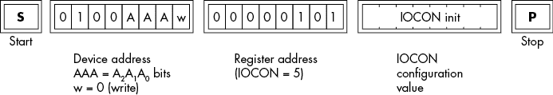

图 13-3：IOC 初始化示例序列

上电或复位操作后，寄存器地址默认采用标准寄存器号。如果你打算使用备用寄存器号，你必须将 IOCON 寄存器的位 7 设置为 1，写入地址 0x0A，这是上电/复位后的 IOCON 地址。之后，所有对 IOCON 的写操作必须发生在寄存器号 0x05。

请注意，如果外部硬件能够复位 MCP230*xx*，那么 IOCON 寄存器将切换回地址 0x0A。如果软件没有意识到复位操作已发生，可能会造成问题。因此，保持 MCP230*xx* 在标准寄存器号模式下是一种较好的选择。

### 13.2.3 编程数据方向

MCP230*xx* 的 GPIO 引脚可以单独编程为输入或输出。*数据方向寄存器（DDRs）* 控制每个引脚的输入或输出状态。MCP23008 具有一个（8 位）IODIR（寄存器 0），而 MCP23017 有两个（IODIRA 是寄存器 0，IODIRB 是寄存器 1 或 16）。

IODIR*x* 寄存器中的每个位位置控制相应 GPIO 引脚的 I/O 状态。也就是说，IODIRA 中的位 0（MCP23008 上的 IODIR）控制 GPA0，位 1 控制 GPA1，以此类推。同样，IODIRB 中的位 0 控制 GPB0，位 1 控制 GPB1，以此类推。某个位位置上的 1 将该引脚配置为输入；该位位置上的 0 将该引脚配置为输出。

当 MCP230*xx* 上电或复位引脚被拉低时，IC 会将所有 GPIO 引脚配置为输入（即，它会将 IODIR*x* 寄存器初始化为全 1 位）。这是最安全的初始配置，因为它可以防止将 GPIO 引脚配置为输出，如果该引脚连接到带有活动信号的线路，可能会导致电气冲突。

由于 MCP230*xx* 的 IODIR 灵活性，你可以将任意位编程为输入或输出。实际上，最方便的做法（至少在 MCP23017 上）是将每个 8 位的组配置为所有输入或所有输出。这样可以更方便地编程 MCP230*xx* 芯片。当然，如果你的硬件设计要求在单一端口上混合使用输入和输出方向，那也是完全可以接受的；代价是稍微复杂一些的编程要求。

要将数据方向值发送到 MCP230*xx* 芯片，传输图 13-4 中显示的序列。

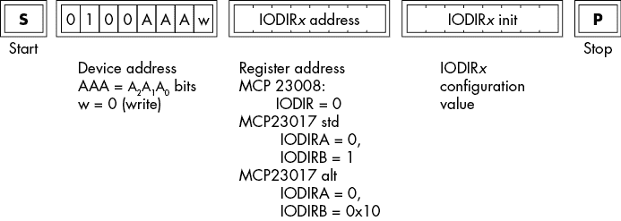

图 13-4：IODIR*x* 初始化序列

出现在图 13-4 中的序列的第三个字节是数据方向初始化值。

### 13.2.4 编程输入上拉电阻

MCP230*xx* 的输入引脚通常连接到*干接点输入*：开关、继电器触点或其他连接两个不同信号线的设备。典型的干接点可能是一个按钮、DIP 开关或其他单极单掷开关（SPST）或继电器。

通常，干接点会将 MCP230*xx* 上的输入引脚连接到地。当接点闭合时，输入被短接到地，导致对应的 GPIO*x* 寄存器中的位显示 0 输入值。当接点打开时，输入信号*浮空*，这通常是不好的；电子设备可能将浮空输入解读为逻辑 0 或 1。为了避免浮空输入，设计人员通常会在输入引脚上加上拉电阻。当干接点处于开路位置时，这会将电压引脚拉至上拉电阻连接的电压（通常是 Vdd）。当干接点闭合时，这会将输入引脚短接到地，从而提供逻辑 0 输入。

上拉电阻唯一的问题是，你需要在印刷电路板或原型板上为其腾出空间，并花费时间和精力进行安装。为方便起见，MCP230*xx* 部件提供了*可编程上拉电阻*，允许你通过编程启用或禁用输入引脚上的上拉电阻。GPPU*x* 寄存器提供了这一功能。将 GPPU*x* 位编程为 1（并将相同的位在 IODIR*x* 中编程为 1）会将一个 100-kΩ 上拉电阻连接到该引脚。相反，编程为 0 会断开上拉电阻。

你应该只在连接到干接点输入的 GPIO 引脚上编程上拉电阻。如果一个逻辑电平信号连接到一个 GPIO 引脚，编程该引脚的上拉电阻可能会损坏 MCP230*xx* 或连接另一端的逻辑设备。即使它不损坏电子元件，它也可能干扰输入信号。

要在 MCP230*xx* 芯片上设置上拉值，传输图 13-5 中显示的序列。

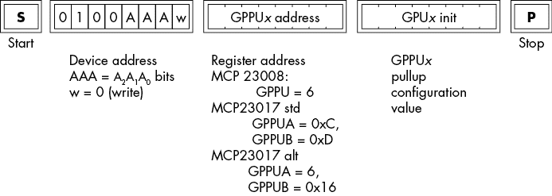

图 13-5：GPPU*x* 上拉初始化

在图 13-5 中出现的序列中的最后一个字节是上拉初始化的位图值。

### 13.2.5 编程输入极性

如果你仔细阅读，可能会注意到，在上一节中使用上拉电阻读取干触点开关时，当开关关闭（按下）时输入为 0，当开关打开（释放）时输入为 1。这种逻辑，*低电平有效逻辑*，与你在软件中可能期望的相反。直觉上，你可能会认为按下（关闭）开关时应获得逻辑 1，而释放（打开）开关时应获得逻辑 0——也就是，你期望的是*高电平有效逻辑*。虽然从 GPIO 引脚读取信号后反转它非常简单，但 MCP230*xx*设备提供了一个特殊的*极性寄存器*，允许你选择高电平有效或低电平有效逻辑信号。

MCP23008 的 IPOL 寄存器以及 MCP23017 的 IPOLA 和 IPOLB 寄存器让你控制输入引脚的极性。如果 IPOL*x*中的某个位为 0，则 GPIO*x*寄存器中的相应位将反映输入引脚的当前状态。如果 IPOL*x*中的某个位为 1，则 GPIO*x*中的相应位将反映输入引脚的反向状态。

如果一个实际的输入是低电平有效，但你希望将其读取为高电平有效，只需将 IPOL*x*中的相应位编程为 1，这样在读取时就会反转信号。例如，反转干触点使其变为高电平有效输入，从而使其逻辑与逻辑电平输入信号匹配。

要设置 MCP230*xx* ICs 上的输入引脚极性，传输图 13-6 中所示的序列。

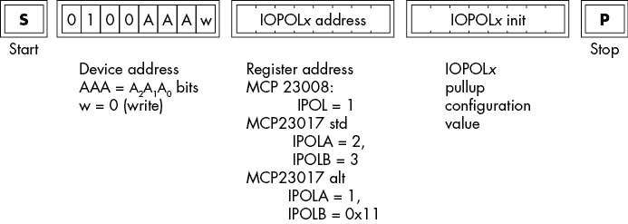

图 13-6：IPOL*x*输入引脚极性序列

在图 13-6 中出现的序列中的第三个字节是极性初始化值。

### 13.2.6 顺序寄存器操作

在 MCP230*xx*上读取或写入寄存器值至少需要三次 1 字节的 I²C 总线传输：一个 I²C 地址字节，一个寄存器号，以及与寄存器的数据传输。由于 I²C 传输相对较慢（特别是在 100 kHz 下操作时），MCP230*xx*提供了一个特殊的*顺序寄存器访问模式*，以减少 I²C 总线事务的数量。IOCON 中的 SEQOP 位（位 5）控制此模式。如果 SEQOP 为 0，则 MCP230*xx*会在每次 I²C 总线的数据传输和接收后自动递增寄存器号。如果 SEQOP 为 1，则 MCP230*xx*会禁用自动增量模式。

当自动增量模式处于激活状态时，控制器设备可以在传输一对 I²C 地址字节和寄存器字节后，读取或写入多个数据字节。只要控制器设备没有在总线上设置停止条件，SCL 上的连续时钟脉冲将继续读取或写入 MCP230*xx*上的连续寄存器。

这种自动递增特性在 MCP23017 的标准模式（非分组模式）下尤其有用。在标准模式下，端口 A 和端口 B 寄存器出现在连续的位置。这使得你能够连续地从两个端口读取和写入寄存器，作为一个 16 位操作。例如，如果你希望同时初始化 IODIRA 和 IODIRB，你可以使用以下序列（假设 SEQOP 为 0，这是上电/复位条件）：

1.  在 I²C 总线上放置启动条件。

1.  向 I²C 总线写入地址（0x40 至 0x46），LO 位为 0（用于写入）。

1.  向 I²C 总线写入 0（IODIRA 寄存器地址）。

1.  向 I²C 总线写入 IODIRA 的数据方向位。

1.  向 I²C 总线写入 IODIRB 的数据方向位。

1.  在 I²C 总线上放置停止条件。

在这段顺序的第 4 步和第 5 步之间，MCP23017 会自动递增寄存器号，从而使第 5 步将数据方向位写入寄存器 1（IODIRB），如 图 13-7 所示。

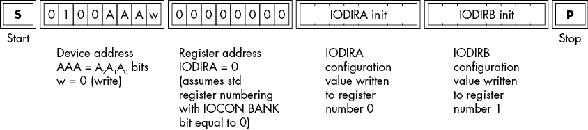

图 13-7：自动递增寄存器号

这个序列仅需要向 I²C 总线写入 4 个字节。这比使用独立事务分别写入 IODIRA 和 IODIRB 寄存器所需的 6 个字节少了 2 个字节。

使用自动递增模式时，你并不限于只写入两个值。例如，你可以一次性写入方向和极性初始化值：

1.  在 I²C 总线上放置启动条件。

1.  向 I²C 总线写入地址（0x40 至 0x46），LO 位为 0（用于写入）。

1.  向 I²C 总线写入 0（IODIRA 寄存器地址）。

1.  向 I²C 总线写入 IODIRA 的数据方向位。

1.  向 I²C 总线写入 IODIRB 的数据方向位。

1.  向 I²C 总线写入 IPOLA 的极性位。

1.  向 I²C 总线写入 IPOLB 的极性位。

1.  在 I²C 总线上放置停止条件。

理论上，你也可以在这个序列中写入中断初始化值，尽管很少使用所有的中断初始化特性，所以并非总能顺利进行顺序写入。遗憾的是，拉高寄存器在常见的初始化列表中并不会顺序出现，因此你最终不得不独立地写入它们的地址和寄存器值。

当然，在典型的应用中，你不太可能每次都写初始化的代码，所以单次初始化所带来的节省不会太大。然而，通常会从 MCP23017 读取所有 16 位输入数据，或者写入所有 16 位输出数据。自动递增模式对这些操作非常有用，因为它们在常见应用中频繁发生。

然而，寄存器自动递增模式并非总是有用的。也许你想快速写入 GPIO、GPIOA 或 GPIOB 寄存器，将某些波形输出到输出引脚，这时你：

1.  在总线上放置启动条件。

1.  向总线写入 I²C 地址，且 LO（读取）位等于 1。

1.  向总线写入寄存器号（例如，GPIOA 的值为 12/0xC）。

1.  向总线写入一个字节。

1.  对每个不同的值，重复步骤 4，以便写入输出引脚。

1.  在总线上放置停止条件。

此代码需要将 SEQOP 设置为 1，以禁用在步骤 4 后自动递增寄存器编号。

你需要决定在代码中开启还是关闭自动递增功能更为合适。如果你经常在两种模式之间切换，那么在非自动递增模式下操作可能会更高效。

### 13.2.7 跃变率控制

IOCON 寄存器的第 4 位（DISSLW）控制 I²C SDA 跃变率。当启用时（0），跃变率控制减少 SDA 线从低到高或从高到低的上升或下降速度（参见 图 13-8）。默认情况下，此位为 0，减少信号的上升和下降时间。

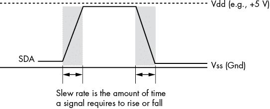

图 13-8：跃变率

降低跃变率可以减少 SDA 线上的噪声（由*振铃*引起，振铃是信号在变化后暂时上下跳动的现象）。然而，在更高的速度下，降低跃变率可能会引入错误。通常，在 100 kHz 时启用跃变率控制，而在 1 MHz 时禁用。在 400 kHz 时，根据信号噪声的情况决定是否启用或禁用跃变率控制，这需要使用示波器进行验证。由于 MCP230*xx* 设备默认启用跃变率控制，因此只有在系统存在噪声问题时，才应关闭它。

### *13.2.8* 读取 MCP230*xx* 上的通用输入/输出引脚

读取 MCP230*xx* 的 GPIO*x* 寄存器是最常见的软件操作之一。读取这些寄存器会返回 GPA*x* 和 GPB*x* 引脚的当前状态。如果这些引脚被配置为输出，那么读取 GPIO*x* 寄存器将返回最后写入的值（或默认重置状态）到输出引脚，也就是这些引脚的当前状态。

从 GPIO*x* 寄存器读取数据需要两次 I²C 总线事务。首先，写入 GPIO*x* 寄存器地址；其次，读取寄存器值：

1.  在 I²C 总线上放置启动条件。

1.  将设备地址和 LO 位 0（写入操作）写入 I²C 总线。

1.  写入 GPIO、GPIOA 或 GPIOB 寄存器地址（在 MCP23008 上，GPIO = 9；在 MCP23017 上，GPIOA = 9 或 0x12，GPIOB = 0x19 或 0x13）。

1.  在 I²C 总线上放置（重复的）启动条件。

1.  将设备地址和 LO 位 1（读取操作）写入 I²C 总线。

1.  从 I²C 总线读取 GPIO 位。

1.  （在 MCP23017 上可选）从 I²C 总线读取第二组 GPIO 位（GPIOB）（参见 图 13-9）。

1.  在总线上放置停止条件。

第 7 步假设 IOCON 中的 SEQOP 位为 0，且步骤 3 中写入的寄存器地址为 GPIOA（在标准模式下地址为 0x12）。

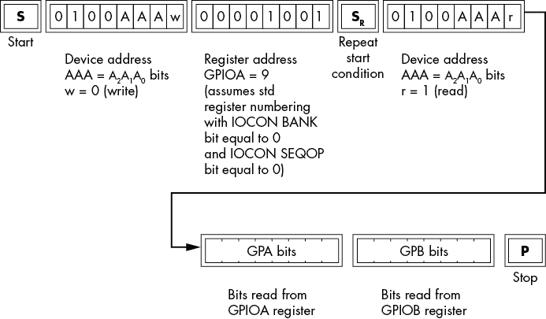

图 13-9：GPIO 顺序读取操作

请注意，如果 IOCON 中的 SEQOP 已被设置为 1（没有自动递增的寄存器地址），那么你可以反复读取 GPIO*x* 位。

## *13.3* 写入 MCP230*xx* 的通用输入/输出引脚

有两种方法可以将数据写入 MCP230*xx* 的输出引脚：将数据写入 GPIO*x* 寄存器或将数据写入 OLAT*x* 寄存器。写入任何一个寄存器集合都会将输出数据放置到输出引脚上。

对于输出目的，写入 GPIO*x* 和 OLAT*x* 寄存器之间没有实际区别。内部上，MCP230*xx* 将写入 GPIO*x* 转换为写入 OLAT*x*。当你从这些寄存器读取时，它们有所不同。从 GPIO*x* 读取时，当然是读取 GPA*n* 和 GPB*n* 输入引脚的当前状态。从 OLAT*x* 读取时，会返回最后写入 OLAT*x*（或 GPIO*x*）寄存器的值。如果任何引脚被编程为输入，这将产生不同的结果。

写入 OLAT*x*（或 GPIO*x*）寄存器的复杂度略低于从 GPIO*x* 寄存器读取的复杂度。以下是步骤：

1.  在 I²C 总线上放置一个起始条件。

1.  写入带有 LO 位 0（写入操作）的设备地址。

1.  写入 OLAT、OLATA 或 OLATB 寄存器地址（MCP23008 上 OLAT = 0xA，OLATA = 0xA 或 0x14，OLATB = 0x1A 或 0x15 在 MCP23017 上）。

1.  将 OLAT 位写入 I²C 总线。

1.  将第二组 OLAT 位（OLATB）写入 I²C 总线（见图 13-10）。在 MCP23017 上这是可选的（仅当 SEQOP = 0 时）。

1.  在总线上放置一个停止条件。

这个过程比读取更简单，因为你不需要重复开始条件，也不需要将第二个设备地址写入总线。

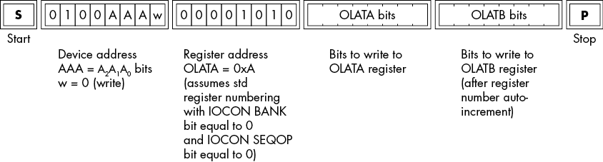

图 13-10：GPIO（OLAT）16 位顺序写入操作

请注意，MCP230*xx* IC 上的输出引脚无法驱动太多电流。每个引脚最多可以源或吸收 25 毫安——勉强足够点亮一个 LED。整个封装的最大电流限制为 150 毫安，这意味着你不能连接 16 个 LED 并以每个 25 毫安的电流运行它们。为了处理更多的电流，你需要将一个晶体管或其他电流放大器连接到输出引脚。ULN2308 达林顿阵列——在一个 18 引脚封装中的 8 个达林顿放大器，每个能够吸收 500 毫安——是一个非常适合此目的的设备。

## 13.4 演示 MCP23017 的输入/输出

到现在为止，你已经学到了足够的知识，能够实际编程 MCP230*xx* 设备以轮询（非中断）模式运行。本节中的示例 Arduino 程序将一些输出数据写入 MCP23017 的端口 B，并从同一设备的端口 A 读取这些数据。这个程序在功能上相对简单，但它展示了编程该设备所需的大部分内容。

程序使用了图 13-11 中所示的电路。MCP23017 的 SDA 和 SCL 线路接到 Arduino Uno Rev3（或其他兼容 Arduino 的设备）上的相应引脚。引脚 A0、A1 和 A2 接地，因此 7 位设备地址将是 0x20。复位引脚接到 +5 V 或 +3.3 V，具体取决于你运行的是 3.3 V 还是 5.0 V 系统。端口 A 引脚接到反向的端口 B 引脚。最后，如果你的 SBC 没有在 SDA 和 SCL 线路上提供适当的上拉电阻，你需要在这两条线路与 Vdd（+5 V 或 +3.3 V）之间放置一对 4.7-kΩ 电阻。

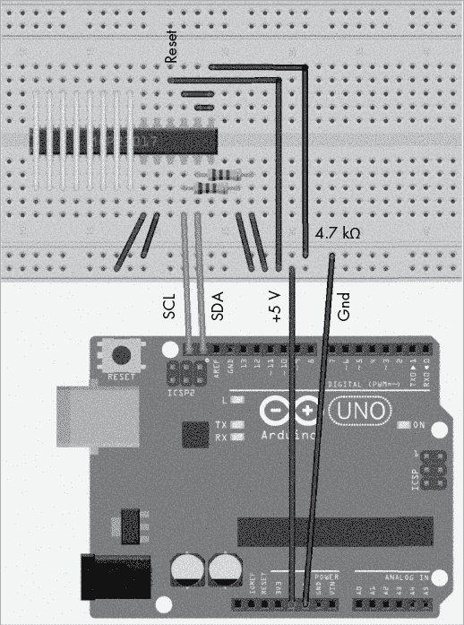

图 13-11：程序的简单接线示例，见列表 13-1

请注意在图 13-11 中，GPB0 连接到 GPA7，GPB1 连接到 GPA6，依此类推，GPB7 连接到 GPA0。所以，当作为输入读取时，输出位会反转。这是为了简化接线；位反转可以通过软件修正。

该程序未使用中断，因此可以将 INTA 和 INTB 引脚悬空。另外，别忘了将 Vdd（引脚 9）和 Vss（引脚 10）引脚分别连接到 +5 V（或 +3.3 V）和接地。

```
// Listing13-1.ino
//
// A simple program that demonstrates
// MCP23017 programming.
//
// This program writes a value to port B, reads
// a value from port A, and verifies that the
// value sent to port B was properly read on port A.

#include <Wire.h>
#define mcp23017    (0x20)
 // MCP23017 registers:

#define IODIRA (0)
#define IOCON  (0x0A)
#define GPPUA  (0x0C)
#define GPIOA  (0x12)
#define OLATB  (0x15)

void setup( void )
{

    Serial.begin( 9600 );
    delay( 1000 );
    Serial.println( "Test reading and writing MCP23017" );

    Wire.begin(); // Initialize I2C library

    // Initialize the MCP23017:
    //
    // - Sequential port A/B registers (BANK = 0)
    // - Don't mirror INT pins (MIRROR = 0)
    // - Autoincrement register numbers (SEQOP = 0)
    // - Slew rate control on (DISSLW = 0)
    // - ODR in open-drain mode (ODR = 1)
    // - Interrupt polarity is active low (INTP = 0)

    #define initIOCON (4)   // ODR = 1

    Wire.beginTransmission( mcp23017 );
    Wire.write( IOCON );
    Wire.write( initIOCON );
    Wire.endTransmission(); // Sends stop condition

    // Set port A to input, port B to output,
    // and polarity noninverting.

    Wire.beginTransmission( mcp23017 );
    Wire.write( IODIRA );
    Wire.write( 0xff );     // Port A = inputs
    Wire.write( 0 );        // Port B = outputs
    Wire.write( 0 );        // Port A noninverting
    Wire.endTransmission(); // Sends stop condition

    // Disable pullup resistors on port A.

    Wire.beginTransmission( mcp23017 );
    Wire.write( GPPUA );
    Wire.write( 0 );        // Port A = no pullups
    Wire.endTransmission(); // Sends stop condition

}

void loop( void )
{
    static byte outputValue   = 0;
    static byte expectedValue = 0;

    ++outputValue;

    // You simplified the wiring and connected
    // GPB0 to GPA7, GPB1 to GPA6, ..., GPB7 to GPA0.
    // So you need to reverse the bits in the
    // expected value.

    expectedValue =   ((outputValue & 0x01) << 7)
                    | ((outputValue & 0x02) << 5)
                    | ((outputValue & 0x04) << 3)
                    | ((outputValue & 0x08) << 1)
                    | ((outputValue & 0x10) >> 1)
                    | ((outputValue & 0x20) >> 3)
                    | ((outputValue & 0x40) >> 5)
                    | ((outputValue & 0x80) >> 7);

    // Write the byte to the output (port B).

    Wire.beginTransmission( mcp23017 );
    Wire.write( OLATB );
    Wire.write( outputValue );
    Wire.endTransmission(); // Sends stop condition

    // Read a byte from the input (port A).

    Wire.beginTransmission( mcp23017 );
    Wire.write( GPIOA );                // Send register address
    Wire.endTransmission( false );      // No stop condition

    Wire.requestFrom( mcp23017, 1 );    // Read from portA
    while( !Wire.available() ){}        // Wait for byte

    byte b = Wire.read();               // Get input byte

    if( b != expectedValue)
    {
        Serial.print
        ( 
            "Error writing and reading MCP23017, value=0x" 
        );
        Serial.print( b, 16 );
        Serial.print( ", output 0x" );
        Serial.print( outputValue, 16 );
        Serial.print( ", expected 0x" );
        Serial.println( expectedValue, 16 );
    }
    else
{
        static uint32_t count = 0;

        if( ++count & 0x3f )
 Serial.print( "." );
        else
            Serial.println( "." );
    }
}
```

`setup()` 函数根据此示例程序的需要初始化 MCP23017 设备。最重要的是，它将端口 A 引脚初始化为输入，端口 B 引脚初始化为输出。它还禁用了端口 A 输入引脚的上拉电阻，因为端口 B 直接连接到端口 A，且端口 B 的引脚提供 TTL（5 V）信号。

`loop()` 函数简单地将一系列字节值写入端口 B，从端口 A 读取一个字节值，并验证读取的值是否与写入的值（由于接线原因，进行位反转）相等。如果两个值不匹配，该函数会向串口输出错误信息。

## 13.5 MCP230*xx* 上的中断

大多数使用 MCP230*xx* 的 Arduino 编程人员并不使用这些设备上的中断功能。通常轮询设备，查看是否有输入位发生变化，比创建中断服务例程（ISR）并编程中断要少做些工作。如果你编程的系统能够在不影响其他活动性能的情况下以足够高的频率轮询 MCP230*xx*，那么轮询是一种合理的方法。然而，如果实时性问题使得轮询不可行，那么 MCP230*xx* 上的中断功能可以是一个救命稻草。

### 13.5.1 MCP230*xx* 上的中断操作

清单 13-1 中的程序持续进行数据的读写。因为这个程序既负责写入数据（到端口 B），也负责读取数据（从端口 A），所以应用程序始终知道何时端口 A 上的数据将可用（具体来说，数据会在 `loop()` 函数将数据写入端口 B 后立即可用）。在大多数实际系统中，输入数据通常来自一些外部硬件，`loop()` 函数本身无法知道端口 A 上何时有新数据到达。一种解决方案是让 `loop()` 函数持续读取端口 A，并将读取的值与之前的读取值进行比较。当两个值不同时，函数可以假设外部硬件已经传输了新值，并适当处理它。这种方案称为 *轮询*。

轮询的一个问题是，即使外部硬件没有传输新值，它仍然会消耗 CPU 时间（用于读取和比较端口 B 的值）。在轮询过程中，CPU 不能用于其他操作。更好的解决方案是让外部硬件通知 CPU 新数据可用；此通知将中断当前 CPU 的活动，使其能够简短地处理已更改的数据，然后在处理完新数据后恢复中断的操作。问题是，如何让外部硬件在将新数据应用到端口 B 时中断 CPU？

你可以编程 MCP230*xx* 设备，在 MCP23008 的 INT 引脚或 MCP23017 的 INTA 或 INTB 引脚上产生信号，表示状态变化发生。当发生状态变化时，称为 *变化中断（IOC）*，并有两种可编程的情况来表示：

+   引脚状态发生变化（从低到高或从高到低）。

+   当与 DEFVAL 寄存器中的相应位进行比较时，某个引脚会发生状态变化。

INT*x* 引脚反映当前的中断状态。通常，你会将 INT*x* 引脚连接到单板计算机（SBC）上的中断输入引脚。不同的 SBC 支持不同引脚上的中断。当然，如果你使用的是不同的 SBC 或不同的实时操作系统（RTOS），你需要查看 SBC 或 RTOS 的文档，以确定哪些引脚适合用作中断输入。本节假设你使用的是 Arduino 库；如果使用不同的系统，请参阅你所使用的 SBC 或 RTOS 文档。

### 13.5.2 中断服务例程

当中断导致 CPU 停止当前程序执行时，它会将控制权转移到一个特殊的功能：ISR。ISR 会快速处理必要的硬件事件，然后将控制权返回给系统，系统会恢复原来的中断代码。为了支持应用程序中的 ISR，你需要解决一些问题。答案会根据系统有所不同；以下部分将提供 Arduino 系统的解答。

**电子信号是如何以及在哪里输入到系统中的？**

1.  在大多数系统中，包括 Arduino 中，中断是输入到特定 CPU 或系统引脚的数字逻辑信号。在 Arduino 上，选定的数字 I/O 引脚可以作为中断输入。（有关 Arduino 品牌引脚选择的更多信息，请参见“更多信息”。）例如，Arduino Uno Rev3 支持在数字 I/O 引脚 2 和 3 上触发中断，而 Teensy 3.1 支持在任何数字 I/O 引脚上触发中断。并非所有 Arduino 设备都支持引脚 2 作为中断引脚；使用其他设备时请检查文档。

**中断输入信号的类型是什么？**

1.  因为数字 I/O 信号可以是低（0）或高（1），你可能会认为中断只会在这两种情况下发生。实际上，大多数 Arduino 系统会在以下情况之一下触发中断：

    +   中断引脚上的低电平到高电平的过渡

    +   引脚上的低电平到高电平的过渡

    +   中断引脚上的任何变化（低电平到高电平或高电平到低电平）

    +   中断引脚上的低电平信号

        一些但不是所有的 Arduino 设备也可以在中断引脚为高电平时触发中断。

**如何指定 ISR 函数？**

1.  Arduino 系统使用 `attachInterrupt()` 函数将特定的数字 I/O 引脚与中断关联。调用的形式如下：

    ```
    attachInterrupt( digitalPinToInterrupt( `pin` ), `ISR`, `mode` );
    ```

    在此调用中，`pin` 是数字 I/O 引脚编号，`ISR` 是一个没有参数的空函数的名称，用作中断服务程序，`mode` 是以下标识符之一：

    1.  `LOW` 每当引脚为低电平时触发中断

    1.  `CHANGE` 每当引脚的值发生变化时触发中断

    1.  `RISING` 当引脚从低电平变为高电平时触发

    1.  `FALLING` 当引脚从高电平变为低电平时触发

    1.  `HIGH` 每当引脚为高电平时触发中断

    只有一些兼容 Arduino 的板子支持 `HIGH`，因此请查看您板子的文档，确认它是否支持主动高电平中断信号（例如，Uno Rev3 不支持 `HIGH`）。

    若要在其他系统上使用中断，请参阅您的库、操作系统或单板计算机（SBC）的文档。

**ISR 函数的限制是什么？**

1.  大多数操作系统对 ISR 施加限制。通常，您应该假设以下几点：

    +   ISR 修改的任何全局变量应声明为 `volatile`。

    +   ISR 函数应该简短，执行时间应尽可能短。

    +   许多系统不允许中断嵌套（即，不允许一个中断信号中断正在执行的 ISR）。

    +   许多系统限制在 ISR 中可以调用的库函数类型。

    请参考您特定操作系统的参考手册，以获取有关中断服务程序的更多信息。

    例如，Arduino 库对 ISR 有一些额外的限制。特别是，不能在 ISR 中使用 `delay()` 或 `millis()` 函数。有关更多信息，请参见“更多信息”中的 Arduino 中断文档链接。

**INT*x* 引脚极性**

1.  当 MCP230*xx* 检测到会引发中断的引脚变化时，它会将 INT*x* 引脚设置为高或低。IOCON 寄存器中的 INTPOL 位（第 1 位）决定中断的极性。如果 INTPOL 为 1，则中断信号为高电平有效——即中断发生时，INT*x* 引脚会变为高电平。如果 INTPOL 为 0，则中断信号为低电平有效，中断发生时，INT*x* 引脚会变为低电平。

    你可以通过使用 Arduino 的 `attachInterrupt()` `mode` 参数或设置 MCP230*xx* 上的中断极性来选择合适的中断极性。然而，重要的是要确保通过 `mode` 指定的极性与通过 INTPOL 位指定的极性匹配。常见的约定是使用低电平触发中断，并将 `mode` 参数的值设置为 `LOW` 或 `FALLING`。

### 13.5.3 中断引脚镜像（仅限 MCP23017）

MCP23017 提供两个独立的中断引脚，一个用于端口 A（INTA 引脚），一个用于端口 B（INTB 引脚）。如果端口 A 和端口 B 都能产生中断，这样可以快速确定中断来源，但需要 CPU 上有两个独立的中断引脚。如果你只想使用一个引脚作为 CPU 的中断线，并愿意使用一些软件来区分端口 A 和端口 B 的中断，你可以将 MCP23017 编程为将 INTA 和 INTB 引脚连接在一起，这样无论哪个端口发生中断，都会将信号发送到 INTA 和 INTB 引脚。

通过在 IOCON 寄存器中将 MIRROR 位（第 6 位）编程为 1 来实现这一点。相反，若将 MIRROR 位编程为 0（默认条件），则会将所有端口 A 的中断路由到 INTA，所有端口 B 的中断路由到 INTB。

### 13.5.4 开漏式 INT*x* 输出

IOCON 寄存器的第 2 位（ODR）控制 INT*x* 引脚的开漏接口。如果此位被编程为 1，则启用开漏输出；如果编程为 0（默认值），则启用 INT*x* 引脚的活跃逻辑输出。

开漏形式允许你将多个 MCP230*xx* 设备的 INT 引脚连接在一起。此模式需要在输出线上加上上拉电阻。在开漏模式下，中断信号会将 INT*x* 引脚拉低，这通常表示控制器上发生了中断。控制器必须轮询各个 MCP230*xx* 设备，以确定中断的来源。

活跃逻辑输出模式将逻辑信号直接输出到 INT*x* 引脚。在此模式下，INT*x* 引脚必须专门连接到控制器设备上的中断；你不能将中断引脚连接在一起，因为那样会产生电气故障。当你只有一个 MCP230*xx* 设备时，或需要为每个 MCP230*xx* 提供单独的中断（这样你就不必轮询设备来确定中断源）时，这种模式是最佳选择。

活动逻辑模式是默认的中断模式，这是 MCP230*xx* 设备中的设计缺陷。如果将多个设备的 INT*x* 引脚连接在一起，并且忘记将 ODR 位设置为开漏模式，可能会造成电气冲突，从而损坏 MCP230*xx* 部件。故事的教训是：始终正确编程 IOCON 中的 ODR 位！许多设计师会在 INT*x* 引脚上连接一个晶体管（如 2N7000 MOSFET），以强制设置为开漏（开集电极）模式，并在活动逻辑模式下编程 ODR 以驱动晶体管。这可以避免由于编程错误导致 MCP230*xx* 损坏的可能性。

### 13.5.5 在 MCP230*xx* 上启用中断

默认情况下，MCP230*xx* 部件不会生成任何中断；你必须显式启用中断，才能使 INT*x* 引脚变为活动状态。你可以通过 MCP23008 的 GPINTEN 和 MCP23017 的 GPINTENA 和 GPINTENB 寄存器来实现这一点。

MCP230*xx* 设备允许你按引脚逐个启用或禁用中断。每个 GPINTEN*x* 寄存器中的位都对应一个 GPIO 引脚：GPINTENA 对应 GPIOA 引脚，GPINTENB 对应 MCP23017 的 GPIOB 引脚。如果 GPINTEN*x* 中的某个位为 0，那么该特定 I/O 引脚的中断被禁用。如果该位为 1，那么启用该位的中断，并根据 INTCON 和 DEFVAL 寄存器中的位设置生成中断。

如果为某个特定的 I/O 引脚启用了中断，那么 INTCON 和 DEFVAL 寄存器允许你编程使 MCP230*xx* 在引脚变化或特定电平时生成中断。如果某个特定的 INTCON 位为 0，那么 MCP230*xx* 会在输入位变化时生成中断（也就是说，它会在从低到高或从高到低的转换时生成中断）。在这种情况下，MCP230*xx* 会忽略 DEFVAL 中相应的位。如果某个特定的 INTCON 位为 1，那么 MCP230*xx* 会在输入位与 DEFVAL 中相应位的值不同时时生成中断。这使得你可以创建电平感应中断。如果 DEFVAL 中相应的位为 0，那么 MCP230*xx* 会在输入引脚为高时生成中断；如果 DEFVAL 中的位为 1，那么 MCP230*xx* 会在输入引脚为低时生成中断。请注意，如果 INTCON 中相应的位为 0，或者 GPINTEN*x* 中该位为 0，系统会忽略 DEFVAL 中的该位。

尽管在复杂系统中可以在程序执行过程中修改 GPINTEN*x*、INTCON*x* 和 DEFVAL*x* 寄存器，但通常你只在程序开始执行时初始化这些寄存器一次。为了防止竞争条件，应按照以下顺序初始化中断：

1.  初始化 DEFVAL*x* 寄存器（如果需要）。

1.  初始化 INTCON*x* 寄存器（如果需要）。

1.  读取 GPIO 引脚以清除任何现有的中断。

1.  初始化 GPINTEN*x* 寄存器（如果需要）。

1.  使用 `attachInterrupt()` 将 ISR 附加到特定引脚。

这样的顺序有助于防止由于输入引脚上的预先存在的条件或初始化过程中发生的条件变化而引起的无意中断。这个特定的顺序适用于 Arduino 系统，但其他系统也有类似的处理方式。

### 13.5.6 测试和清除中断

MCP230*xx* 上的 INT*x* 引脚仅表示在一个（或两个）端口上发生了中断。当系统调用 ISR 时，你无法得知是哪个引脚——如果多个引脚同时变化——导致了中断。为了确定中断的确切来源，你需要读取 MCP23008 的 INTF 或 MCP23017 的 INTFA 或 INTFB 寄存器。

INTF*x* 寄存器中的位表示哪个引脚导致了中断。当 ISR 开始执行时，它应该读取 INTF*x* 寄存器，其中某个位为 1 表示中断是由指定输入位的变化引起的。然后，ISR 可以读取相应的 GPIO 引脚，以确定中断发生时该引脚的状态。例如，如果启用了对任何变化的中断，读取 GPIO 引脚将告诉你是引脚的上升沿还是下降沿触发了中断。

理论上，CPU 会在中断引脚状态变化后几乎立即调用 ISR。实际上，ISR 的调用可能会在中断条件发生后略微延迟；例如，某些高优先级的代码（ISR）可能在禁用中断时执行。在这种情况下，ISR 只有在当前的高优先级代码重新启用中断后才会被调用。在此期间，I/O 引脚的状态可能发生变化。因此，到 ISR 读取输入引脚信号时，输入数据可能已经改变，ISR 读取到的数据可能是错误的（这是一种常见的竞争条件）。为了防止这种情况发生，MCP230*xx* 在中断发生时会“捕获”引脚的状态。MCP230*xx* 将此引脚快照存储在 MCP23008 的 INTCAP 或 MCP23017 的 INTCAPA 和 INTCAPB 寄存器中。因此，ISR 实际上应该读取适当的 INTCAP*x* 寄存器的内容，以确定导致中断的引脚状态。

通过读取 GPIO 数据（GPIO*x* 或 INTCAP*x* 端口），ISR 解冻了 INTCAP*x*。这为捕获下一个中断引脚设置做好准备。你应该在 ISR 中首先读取 INTCAP*x* 寄存器，因为如果有另一个中断等待发生且你首先读取 GPIO*x* 端口，可能会丢失捕获的信息。通常，在 ISR 中并不需要读取 GPIO*x* 寄存器——INTCAP*x* 寄存器通常提供所有所需的信息。

配置为“中断-按变化触发”（在 INTCON*x*寄存器中）的引脚，会在读取对应的 INTCAP*x*寄存器后，改变导致下一个中断的状态。例如，如果中断是因为引脚从高电平变为低电平发生的，那么新的中断条件（从低电平到高电平）在你通过读取 GPIO*x*或 INTCAP*x*清除中断之前不会激活。如果引脚实际上从高电平变为低电平，再从低电平变回高电平，然后再变回低电平，那么 MCP230*xx*只会在系统没有在这些电平变化之间清除中断时，发出一次中断信号。

配置为“中断-按电平触发”的引脚——即配置为根据 DEFVAL*x*寄存器中出现的值触发中断的引脚——只要该电平条件存在于输入引脚上，就会持续生成中断信号。读取或写入 GPIO*x*或 INTCAP*x*寄存器并不会重置该中断状态，直到中断条件不再存在。

## 13.6 一个示例的中断驱动 MCP230*xx*

读取旋转编码器是一种常见的方式，用来展示在 MCP230*xx*设备上的中断编程。实际上，如果旋转编码器旋转得非常快，而 CPU 又经常忙于执行其他任务，比如显示读取的编码器值，那么很容易发生数据丢失。使用 ISR（中断服务例程）快速捕捉编码器数据并将其提供给主线程处理，可以消除数据丢失。本节提供了一些简单的库代码，演示了如何读取并显示带有红绿 LED 的 SparkFun 旋转编码器的数据（[`www.sparkfun.com/products/15140`](https://www.sparkfun.com/products/15140)）。

SparkFun 旋转编码器外接板（[`www.sparkfun.com/products/11722`](https://www.sparkfun.com/products/11722)）使得将该设备轻松地接入电路面包板，如图 13-12 所示。


图 13-12：SparkFun 旋转编码器外接板

SparkFun 旋转编码器有两个数字 I/O 引脚，标记为 A 和 B，用于指定旋转变化（见图 13-13）。你需要通过一个 10kΩ电阻将这些引脚接到+5 V，并将标记为 C 的引脚接到地（Gnd）。(如果你将旋转编码器连接到 MCP230*xx*设备，你可以使用内置的可编程上拉电阻替代 10kΩ电阻。) 当你旋转编码器轴时，它会选择性地将 A 和 B 引脚连接到 C 引脚，即接到地（Gnd）。图 13-13 中标记为 1、2、3 和 4 的引脚分别连接到红色和绿色 LED、一个按钮开关和这些引脚的公共端。

将 A 和 B 引脚连接到单板计算机（SBC）上的输入引脚，允许你读取这两个引脚的状态（高电平或低电平）。通过观察这两个引脚的状态变化，你可以判断旋转轴的旋转方向，以及旋转速度（如果你在计时变化的话）。


图 13-13：SparkFun 红/绿旋转编码器

如果以固定速度顺时针旋转轴（CW），你将会在引脚 A 和 B 上看到图 13-14 中的波形。


图 13-14：旋转轴顺时针旋转时的旋转编码器输出

图 13-14 中的输出被称为*正交输出*，其中两个相位相反的信号决定旋转方向，生成类似于表 13-5 中所示的二进制输出，随着时间的推移变化。

表 13-5：顺时针旋转编码器输出

| 输出 A | 0 | 0 | 1 | 1 | 0 | 0 | 1 | 依此类推 |
| --- | --- | --- | --- | --- | --- | --- | --- | --- |
| 输出 B | 1 | 0 | 0 | 1 | 1 | 0 | 0 | 依此类推 |

如果将输入对视为一个 2 位二进制值，顺时针旋转编码器会产生重复的二进制序列 01 00 10 11 01 00 10 11 . . . 随时间变化。这是一个 2 位*灰码*的示例，一种二进制计数序列，其中任何两个连续值之间不会改变超过一位（详见“更多信息”）。灰码在处理多位机械输入时非常有用，因为它比常规二进制代码更能抗干扰。

如果以固定速度逆时针旋转轴（CCW），你将会在引脚 A 和 B 上看到图 13-15 中的波形。


图 13-15：旋转轴逆时针旋转时的旋转编码器输出

这也会产生类似于表 13-6 中所示的输出，随着时间的推移变化。

表 13-6：逆时针旋转编码器输出

| 输出 A | 0 | 0 | 1 | 1 | 0 | 0 | 1 | 1 | 0 | 依此类推 |
| --- | --- | --- | --- | --- | --- | --- | --- | --- | --- | --- |
| 输出 B | 0 | 1 | 1 | 0 | 0 | 1 | 1 | 0 | 0 | 依此类推 |

灰码输出为二进制序列：00 01 11 10 00 01 . . .

另一种解读 A 和 B 输入的方法是使用 A 的变化来指示编码器轴的旋转，然后读取 B 输入来确定旋转方向：

+   在 A 引脚上从高到低的跳变且 B 引脚低时，表示逆时针旋转。

+   在 A 引脚上从低到高的跳变且 B 引脚高时，也表示逆时针旋转。

+   在 A 引脚上从高到低的跳变且 B 引脚高时，表示顺时针旋转。

+   在 A 引脚上从低到高的跳变且 B 引脚低时，也表示顺时针旋转。

MCP23008 GPIO 扩展器允许您将最多四个 SparkFun 发光红/绿旋转编码器连接到系统。然而，本节中使用的编码器只将一个旋转编码器连接到 MCP23008 的 GP0 和 GP1 引脚。具体来说，编码器的 A 引脚连接到 GP1，B 引脚通过可选的去抖电路连接到 GP0。如果您还想控制编码器上的红绿 LED，您可以在 MCP23008 的引脚上添加一些电阻，以将其配置为输出，并与旋转编码器上的 2 和 3 引脚连接。您还需要将标有 1 的引脚连接到地。电阻值通常应在 470 Ω 到 1 kΩ 之间。您可以通过将这些输出引脚编程为逻辑 1 或 0 来打开或关闭红绿 LED；同时编程两个引脚将产生黄色输出。本节中的示例忽略了 LED 输出，但如果您希望控制 LED，可以轻松添加代码。

旋转编码器的 A 和 B 引脚是干触点。为了从这些引脚读取逻辑信号，通常需要在电路中添加上拉电阻（接 +5 V 或 +3.3 V，根据需要选择）。但不必显式添加这些电阻，软件将启用 GP0 和 GP1 引脚使用 MCP23008 可编程引脚的上拉电阻。

列表 13-2 中的程序使用 A 引脚的变化来触发中断。ISR 将读取 GP1（A）和 GP0（B）上的 A 和 B 引脚值，并根据这些引脚的前后读取值来递增或递减全局计数器。主程序（即 ISR 之外的代码）使用这个全局变量的值来确定自应用程序开始执行以来，编码器已顺时针或逆时针旋转了多少“点击”。

对于 列表 13-2 中的程序，MCP23008 的 SCL 和 SDA 引脚（引脚 1 和 2）连接到 Teensy 3.2 的 SDA0 和 SCL0 引脚（引脚 D18 和 D19）。INT 引脚（引脚 8）连接到 Teensy 的 D2 引脚。RESET（引脚 6）和 Vdd（引脚 18）引脚连接到 +3.3 V。地址引脚和 Vss（引脚 3、4、5 和 9）连接到地。最后，GP1 连接到旋转编码器的 A 引脚，GP0 连接到旋转编码器的 B 引脚（旋转编码器的 C 引脚连接到地）。

列表 13-2 程序将 MCP23008 配置为每当 GPA1 引脚发生变化时生成一个中断（低电平有效）。当 ISR 读取 INTCAP 寄存器时，GP1 将反映 A 引脚在上升或下降沿转换后的值。因此，如果 ISR 读取 INTCAP 的 LO 2 位为 0，则表示发生了下降沿（GP1 为 0），且 B 为 0。这表示逆时针旋转。同样，如果 INTCAP 的 LO 2 位为 3（0b11），则表示发生了上升沿，且 B 为 1，这也表示顺时针旋转。

在顺时针旋转时，如果 ISR 在 INTCAP 的低 2 位读取到 1，这表示 A 引脚有下降沿，而 B 引脚为 1。如果 ISR 在 INTCAP 的低 2 位读取到 2（0b10），这表示 A 引脚有上升沿而 B 引脚为低（同样是顺时针旋转）。

中断服务程序（ISR）只需在顺时针（CW）或逆时针（CCW）旋转时分别增减一个全局变量（`rotaryPosn`）。主程序检查这个全局变量，并在其值发生变化时显示该值。

```
// Listing13-2.ino
//
// Demonstrate reading a rotary encoder
// using an MCP23008 with interrupts.
//
// Assumptions:
//
// - MCP23008 INT line connected to
//   digital I/O line 2.
//
// - SparkFun illuminated R/G rotary
//   encoder output A connected to
//   GP1 on MCP23008.
//
// - SparkFun illuminated R/G rotary
//   encoder output B connected to
//   GP0 on MCP23008.
//
// - MCP23008 wired to use address
//   0x20 (A0, A1, A2 = 0, 0 0).

#include <Wire.h>

#define led         (13)
#define mcp23008    (0x20)

#define IODIR       (0)
#define IOPOL       (1)
#define GPINTEN     (2)
#define DEFVAL      (3)
#define INTCON      (4)
#define IOCON       (5)
#define GPPU        (6)
#define INTF        (7)
#define INTCAP      (8)
#define GPIO        (9)
#define OLAT        (10)

// The following variable tracks
// rotations on the rotary encoder.
// This variable is negative if there
// have been more clockwise rotations
// than counterclockwise (likewise,
// it's positive if there have been
// more counterclockwise rotations).

volatile int rotaryPosn = 0;

// Write a value to an MCP23008 register:

❶ void writeReg( int reg, int val )
{
    Wire.beginTransmission( mcp23008 );
    Wire.write( reg );
    Wire.write( val );
    Wire.endTransmission();
}

// Read a value from an MCP23008 register:

❷ int readReg( int reg )
{
    Wire.beginTransmission( mcp23008 );
    Wire.write( reg );
    Wire.endTransmission( false );
    Wire.requestFrom( mcp23008, 1 );
    return Wire.read();
}

// Reset the MCP23008 to a known state:

❸ void mcpReset( void )
{
    // I2C General Call is not mentioned in
    // the manual so do this the hard way.

    // INTF   is read only.
    // INTCAP is read only.

    // Disable interrupts
    // and clear any pending.

    writeReg( GPINTEN, 0 );
    readReg( INTCAP );

    // Set remaining registers
    // to POR/RST values.

    writeReg( IODIR,   0xFF );
    writeReg( IOPOL,   0 );
    writeReg( GPINTEN, 0 );
    writeReg( DEFVAL,  0 );
    writeReg( INTCON,  0 );
    writeReg( IOCON,   0 );
    writeReg( GPPU,    0 );
    writeReg( GPIO,    0 );
    writeReg( OLAT,    0 );
}

// Interrupt service routine that gets
// called whenever the INT pin on the
// MCP23008 goes from high to low.
// This function needs to be *fast*.
// That means minimizing the number
// of I2C transactions.

❹ void ISRFunc( void )

{
    // Read the INTCAP register.
    // This reads the GPIO pins at
    // the time of the interrupt and
    // also clears the interrupt flags.
    //
    // Note: A rotary encoder input in GPA1,
    // B rotary encoder input in GPA0.

    int cur = readReg( INTCAP ) & 0x3;

    // You have CCW rotation if:
    //
    //      A:0->1 && B==1  (cur=3)
    // or   A:1->0 && B==0  (cur=0)

    if( cur == 0 || cur == 3 )
    {
        ++rotaryPosn;
    }
    else if( cur == 1 || cur == 2 )
    {
        --rotaryPosn;   // CW rotation
    }
    // else illegal reading . . .
}

// Usual Arduino initialization code:

❺ void setup( void )
{
    Serial.begin( 9600 );
    delay( 1000 );
    Serial.println( "Rotary Encoder test" );

    pinMode( 0, INPUT_PULLUP );
    pinMode( 1, INPUT_PULLUP );
    pinMode( 2, INPUT );
    pinMode( led, OUTPUT );
    digitalWrite( led, 0 );

    Wire.begin();

    // Reset the MCP23008 to a known state.

    mcpReset();

    // Initialize the MCP23008 (this is the default
 // state, so just defensive coding). Note that
    // SEQOP = 0 is autoincrementing registers and
    // INTPOL = 0 yields active low interrupts.

    writeReg( IOCON, 0 );

    // Set data direction to input and
    // turn pullups on for GPA0/GPA1.
    // Set polarity to inverting for GPA0/GPA1.

    writeReg( IODIR, 0xff );
    writeReg( IOPOL, 3 );
    writeReg( GPPU, 3 );

    // Initialize MCP23008 interrupts.

    writeReg( INTCON, 0 );      // GPA1 int on change
    writeReg( GPINTEN, 0x2 );   // Enable GPA1 interrupt

    attachInterrupt( digitalPinToInterrupt(2), ISRFunc, FALLING );
    interrupts();               // Ensure CPU interrupts enabled
}

// Main Arduino loop:

❻ void loop( void )
{
    static int lastRP = 0;

    if( rotaryPosn != lastRP )
    {
        Serial.print( "Posn=" ); Serial.println( rotaryPosn );
        lastRP = rotaryPosn;
    }
}
```

示例 13-2 包含了两个函数，`writeReg()` ❶ 和 `readReg()` ❷，用于向 MCP23008 寄存器写入和读取数据。这些函数通过传输适当的 I²C 字节来完成此操作。`mcpReset()` ❸函数将 MCP23008 初始化为上电复位状态，这在代码在不关闭 MCP23008 电源的情况下重新运行时非常有用。代码还包含了一个中断服务例程`ISRFunc()` ❹，以及常见的 Arduino `setup()` 5 和 `loop()` 6 函数。

当 GP1 引脚发生变化时（因为轴已旋转），会触发中断，导致系统调用`ISRFunc()`函数。该函数判断轴是顺时针还是逆时针旋转，并相应地调整`rotaryPosn`变量的值。

以下是程序在示例 13-2 中的一些输出示例，这些输出是通过来回旋转编码器旋钮获得的。

```
Posn=0
Posn=-1
Posn=-2
Posn=-3
Posn=-4
Posn=-5
Posn=-6
Posn=-7
Posn=-8
Posn=-7
Posn=-6
Posn=-5
Posn=-4
Posn=-3
Posn=-2
Posn=-1
Posn=0
Posn=1
Posn=2
Posn=3
Posn=4
```

从输出结果可以看出，轴在短时间内逆时针旋转，导致输出值减少，随后又顺时针旋转一段时间，导致输出值增加。

## 13.7 MCP230**xx*库代码*

*由于复杂性，许多程序员更倾向于调用现有的库代码，而不是直接编写硬件操作代码。Arduino 提供了一个 MCP230*xx*库包来帮助你完成这项工作。详情请参见“更多信息”中的相关库链接。*

如果你更倾向于在树莓派上编程 MCP230*xx*，Adafruit 也已将其库移植到了 Pi 上；详情请参见“更多信息”。同样，这些链接也描述了如何为 Mbed 找到 MCP23008 库。快速的网络搜索会找到多个适用于 MCP23017 的 Mbed 库示例（大多是 Adafruit 库的改编版）。你还可以轻松搜索到遍布互联网的 MCP230*xx*代码示例，适用于各种 CPU、操作系统和编程语言。

## 13.8 I²C 性能

尽管数字 I/O 功能，例如读取按钮，不需要极高的性能，但许多此类活动确实需要快速处理，以正确读取或写入高频数字信号。不幸的是，高性能操作与 I²C 总线连接往往是相互排斥的。由于有时通过 MCP230*xx* 设备读取或写入数字数据需要进行三到四次总线事务，这可能导致单次 I/O 操作在 100 kHz 时需要 400 微秒到 500 微秒，得到 2 kHz 的采样率。这对于某些操作来说可能太慢了。

幸运的是，MCP230*xx* 设备可以在 400 kHz、1.7 MHz 以及 100 kHz 下运行。在 400 kHz 时，你可以实现至少 8 kHz 的采样率，通过仔细编写代码，10 kHz 到 20 kHz 也不是不可能。如果你愿意以 1 MHz 或更高的频率操作总线，你甚至可以将采样率提高到大约 100 kHz，这对于大多数应用是合适的。如果你需要更高的性能，可能需要使用 I²C 总线以外的其他方式，比如 MCP230*xx* 的 SPI 版本。

## 13.9 MCP23S*xx* 部件

在查找关于 MCP23008 和 MCP23017 部件的信息时，你可能会遇到对 MCP23S08 和 MCP23S17 设备的引用。这些 GPIO 扩展器与 MCP230*xx* 部件几乎相同，唯一的区别是它们是为在 SPI 总线上使用而非 I²C 总线上使用设计的。大部分为 MCP23S*xx* 部件编写的代码，在 MCP230*xx* 设备上也能正常工作，只需要最少的修改：基本上，你只需要将代码中的 SPI 库函数替换为 I²C 库函数，以便读写设备的数据。

由于 SPI 总线的工作频率高于 I²C 总线，SPI 变体可以以更高的采样频率读取输入数据。欲了解更多信息，请参阅 MCP23*xxx* 文档（该文档涵盖了 SPI 和 I²C 部件）。相关链接见“更多信息”部分。

## 13.10 本章总结

本章介绍了 MCP23017 和 MCP23008 GPIO 扩展 IC。内容涵盖了芯片上的寄存器，包括数据寄存器、数据方向寄存器、上拉寄存器和极性寄存器。它描述了如何通过 MCP230*xx* 的引脚读取和写入数字数据。本章还讨论了使用 MCP230*xx* 设备的中断驱动 I/O，提供了一个简短的示例程序，使用 ISR 读取 SparkFun 旋转编码器，以帮助避免错过编码器的任何脉冲。最后，本章结束时讨论了为 MCP230*xx* 提供的开源软件库的使用。
