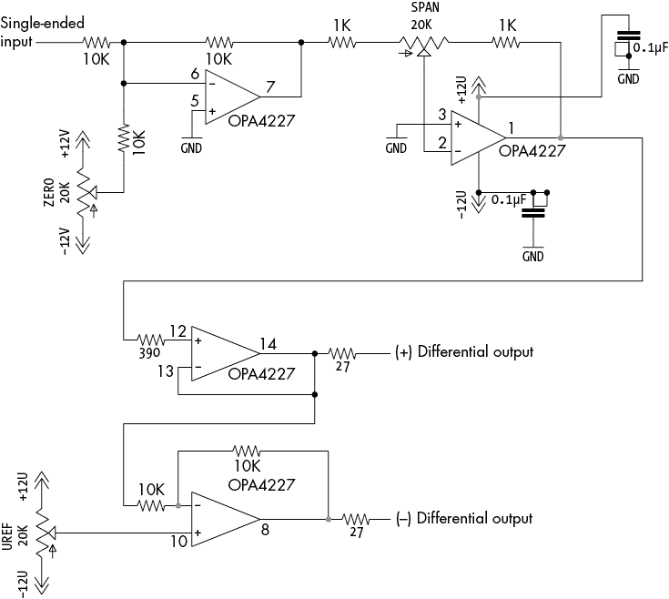
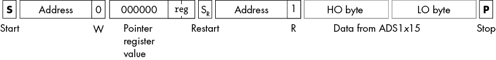
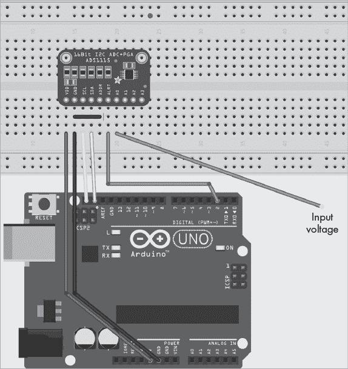
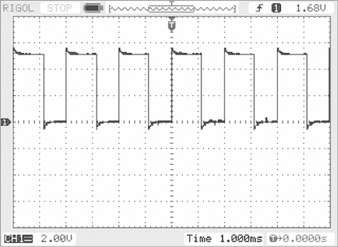
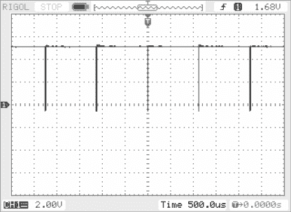

# 第十四章：ADS1015 和 ADS1115 模拟到数字转换器


尽管数字 I/O 可能是嵌入式计算机系统中最常见的输入/输出形式，但模拟输入也很流行。将现实世界中的模拟信号（通常是 0 V 到 3.3 V 或 5 V 范围内的电压）转换为数字形式，使应用程序能够使用现实世界的连续测量，而不是来自数字输入设备的简单开/关信号。要进行这种转换，你需要一个 ADC。

市面上有许多种类型的 ADC。绝大多数将输入电压转换为 *n* 位数字，尽管一些将其他物理量转换为数字形式。大多数现实世界中的传感器输出的是电压，而不是直接输出数字。因此，你需要使用 ADC 将电压值转换为数字值。因此，要读取常见的传感器输出，ADC 是你工具箱中的一个关键部件。

本章讨论了两款流行的 ADC：ADS1015 和 ADS1115。这两款设备将 0.0 V 到某个上限（如 4.095 V）之间的电压转换为数字形式：ADS1015 产生 12 位结果，而 ADS1115 产生 16 位结果。ADS1015 更快，支持每秒 3,300 次采样，而 ADS1115 为每秒 860 次采样（这是一个经典的速度与位数之间的权衡）。虽然其他 I²C ADC 也有，但 ADS1*x*15 系列设备很受欢迎，因为 Adafruit 创建了一对支持这两个 IC 的扩展板。最初的 Adafruit 设计是开源硬件，随着时间的推移，低成本的这些板的克隆版在亚马逊等地方出现。这些设备容易与任何具有 I²C 总线的系统进行接口。例如，Adafruit 提供了适用于 Arduino 和 Raspberry Pi 系统的库代码，尽管将这些设备与任何 RTOS 或系统接口也是足够容易的。然而，本书的目的是教你如何直接编程 I²C 外设，因此下一节将提供有关 ADS1*x*15 所需的背景信息，以便你能够编程。

## 14.1 模拟到数字转换器规格

ADC 有几个重要的规格，影响其使用。表 14-1 列出了其中一些常见的规格。

表 14-1：典型的 ADC 特性

| **特性** | **单位** | **描述** |
| --- | --- | --- |
| 分辨率 | 位 | 转换后产生的整数值的大小 |
| 通道 | 整数 | 设备上可用的独立转换器数量 |
| 极性 | 单极性或双极性 | 确定一个 ADC 是否支持负电压（双极性或差分）^(*)，或仅支持非负电压（单极性） |
| 范围 | 伏特 | ADC 输入支持的电压范围 |
| 输入类型 | 差分或单端 | 指定输入是差分的还是单端的（共地） |
| 采样频率 | Hz | ADC 每秒能够读取的次数（也称为*每秒样本数*或*sps*） |
| ^(*)ADS1*x*15 设备不接受实际的负电压；它们接受的是差分输入，其中两个正电压输入之间的差异为负值。请参阅本章后面 14.1.5 节“差分模式与单端模式”的差分输入讨论。 |

以下小节将描述这些项目，并讨论实际的 ADC1*x*15 规格。

### 14.1.1 模拟到数字转换器分辨率

ADC 的分辨率是 ADC 为一次转换产生的位数。低端 ADC 具有 8 位或 10 位分辨率（典型的 Arduino 类 SBC 的模拟引脚通常为 10 位），而中档 ADC 通常具有 12 位、14 位或 16 位分辨率。高端 ADC 支持 20 位或 24 位分辨率。对于差分输入，ADS1015 设备提供 12 位分辨率，而 ADC1115 提供 16 位分辨率。对于这两种设备的单端应用，您会失去一位（有关差分模式与单端模式的更多详细信息，请参阅 14.1.5 节“差分模式与单端模式”）。

分辨率决定了 ADC 能够检测到的两个电压之间的最小差异。例如，在全尺度模式下，ADS1015 和 ADS1115 ADC 支持 0 V 到 4.095 V 范围内的电压。设备的分辨率将这个范围除以最大值。12 位分辨率将输入范围划分为 4,096 个步进，因此理论上，ADS1015 能够分辨出 0.001 V 的差异。ADS1115 作为 16 位转换器，将输入范围分成 65,536 个步进，理论上能够分辨出 0.0000625 V 的差异——明显更好。单端输入分别具有 11 位和 15 位分辨率，产生 0.002 V 和 0.000125 V 的步进。

一般来说，在 ADC 分辨率方面，更高的分辨率更好。分辨率越高，读数越准确。然而，额外的分辨率是有代价的：在其他条件相同的情况下，高分辨率的 ADC 通常比低分辨率的 ADC 更贵且更慢。使用高分辨率的 ADC 也并不保证能够获得更精确的读数。系统噪声和其他效应可能使额外的分辨率在实际应用中变得毫无意义。对于大多数典型的 SBC 应用来说，12 位分辨率已经足够。0.0001 V 的噪声往往会完全掩盖 16 位 ADC 可能产生的小读数。

### 14.1.2 模拟到数字转换器通道数

许多 ADC 设备提供多个模拟输入。这允许您将多个模拟源连接到单个 ADC 设备，从而减少部件的数量和成本。例如，ADS1015 和 ADS1115 设备提供四个输入通道。ADS1013、ADS1113、ADS1014 和 ADS1114 设备提供较少的输入。

拥有多个输入通道并不意味着设备板上有多个 ADC。相反，大多数多通道 ADC 具有一个模拟多路复用器，这是一种在每次将单一输入连接到 ADC 时切换输入的开关。这是一个重要的区别：如果你有多个 ADC，它们可以同时并行地将输入从模拟转换为数字，但多路复用器在输入之间切换，每次只允许进行一次转换。ADS1015 和 ADS1115 使用内部多路复用器为单个 ADC 提供信号，因此它们必须依次进行每个通道的模拟到数字转换。

### 14.1.3 模拟到数字转换器极性

ADC 可以是单极性或双极性。*单极性* ADC 只能将非负电压转换为数字形式。这通常出现在常见的单板计算机 (SBC) 上；例如，Arduino 类 SBC 通常将 0 V 到 3.3 V 或 5 V 范围内的电压转换为数字形式。单极性 ADC 无法处理负电压——实际上，负输入电压可能会损坏设备。双极性 ADC 可以处理正负输入电压。

*双极性* ADC 通常可以编程为双极性或单极性工作模式。将双极性设备设置为单极性工作模式的原因是分辨率。能够处理正负电压会消耗一部分分辨率。例如，如果你将 16 位 ADC 设置为双极性模式，你将获得 15 位的负电压范围和 15 位的正电压范围。如果只输入正电压，你会失去一些分辨率。然而，如果你将设备编程为单极性模式，你将获得完整的 16 位分辨率，从而能够解析更小的正电压。

ADS1*x*15 设备不是传统的双极性 ADC。引脚输入电压必须始终相对于地面为正。有关 ADS1*x*15 如何处理负输入的详细信息，请参见 14.1.5 节，“差分模式与单端模式”。

### 14.1.4 模拟到数字转换器范围

*ADC 范围* 是 ADC 可以处理的最小和最大电压范围。例如，典型的 Arduino 类 ADC 可以处理 0 V 到 3.3 V 或 0 V 到 5 V 的范围。其他常见的 ADC 可以处理 3.3 V、4.095 V、5 V 或 10 V 的范围。

一个给定的 ADC 可能有两种不同的范围规格。一种是 ADC 产生不同读数的电压跨度——例如，0 V 到 5 V。另一种范围是输入端可以接受的最大电压，而不会损坏设备，这对于一个典型的支持正常范围 0 V 到 5 V 的 ADC 来说，可能是 –0.5 V 到 5.5 V。通常来说，当讨论 ADC 的范围时，我指的是产生不同读数的输入范围。超出这个范围但仍在最大允许范围内的电压倾向于将其读数限制在最小值或最大值。

单极性设备几乎总是有一个从 0 V 到某个最大电压 *n* V 的范围。双极性设备通常有一个 ±*n* V 的范围（*n* 通常是某个值，例如 3.3 V、5 V 或 10 V）。

ADS1015 和 ADS1115 在单端模式下为单极性，在差分模式下为双极性（关于差分与单端操作的讨论请参见下一节）。它们具有可编程增益阶段，将范围限制为±5 V（实际上是 6.144 V，但引脚限制为 5 V 输入）、±4.095 V、±2.047 V、±1.023 V、±0.511 V 或±0.255 V，适用于差分/双极模式。对于单端/单极模式，将范围缩小一半，最低电压为 0 V。

### 14.1.5 差分模式与单端模式

ADC 通常在两种模式之一下工作：差分模式或单端模式。单端输入更容易布线，结构简单，并且与几乎所有电压源兼容。差分输入可能需要特殊的差分驱动电压源，因此使用起来更为复杂。

在*单端模式*下，ADC 具有一个带有公共接地的单一输入（如果 ADC 支持多个输入通道，则所有通道共用接地）。大多数 Arduino 类的模拟输入都属于这一类别，转换测量的是 A*n*模拟输入引脚与所有模拟输入共用的模拟接地引脚之间的电压。

在*差分模式*下，ADC 转换接受两个输入，通常标记为+和–，并计算这些输入电压之间的差值。然后，它将该差值转换为数字形式。差分输入通常来自*差分线路驱动器*，这些驱动器通常将单端电压的一半输出到+输出，将其负一半输出到–输出。测量+线和–线之间的电压可以得到原始输入电压。

使用差分输入的主要优点是它们能够减少系统引入的噪声。系统中的电压尖峰（噪声）通常会叠加到输入信号线上，比如 ADC 的输入。在单端输入中，这种噪声尖峰可能会导致输入电压的暂时升高或降低，从而导致 ADC 读取的瞬时偏差。该噪声尖峰会在一组差分输入上产生相同的暂时电压变化。然而，这种尖峰对两个差分输入的增加或减少大致相同。当差分输入计算两个输入之间的差值时，任何加到或从两个差分输入中减去的值都会在转换中被消除，因为加到+线上的值与加到–线上的值相匹配。这意味着差分输入比单端输入噪声小得多，因此在使用高分辨率（16 位或更高）ADC 时，应该尽可能使用差分输入。

差分输入存在两个问题。首先，大多数支持差分输入的多通道 ADC 使用一个通道作为正输入，另一个通道作为负输出。因此，使用差分输入会将可用的 ADC 通道数量减少一半。差分输入还需要额外的费用和复杂性来使用专用的差分驱动电路，将标准电压（单端输入）转换为差分形式。

ADS1*x*15 设备可以编程以单端模式或差分模式运行。差分模式为每个差分输入使用两个输入通道，因此每个设备有两个差分输入（而不是四个单端输入通道）。尽管如此，如果你使用的是具有 16 位精度的 ADS1115，最好将其设置为差分模式，以充分利用额外的精度，避免在读取时产生低位噪声。

ADS1*x*15 设备不允许输入引脚上有负电压，这会影响它们的差分性能。如果你的差分线路驱动器将单端输入电压转换为正负电压对，那么负电压可能会损坏 ADS1*x*15。相反，假设你使用的是 0 V 到 4.095 V 的范围，当你希望得到零读数时，必须设计一个差分驱动电路，在两个引脚上输出 2.047 V。它将正引脚驱动到高于 2.047 V，负引脚低于 2.047 V 以获取正读数；对于负读数，则将正引脚驱动到低于 2.047 V，负引脚高于 2.047 V。当一个引脚为 0 V 另一个引脚为 4.095 V 时，ADS1*x*15 会产生最大（正或负）读数。如果你使用的是 ADS1*x*15 上的其他电压范围，则在此描述中将最大电压的一半替换为 2.047 V，最大电压替换为 4.095 V。

还需注意，0 V 到 4.095 V 的范围只产生 15 位结果（0 V 到 32,767 V）。尽管 ADS1115 仅允许正电压输入，它仍然是一个双极性设备，并生成 16 位有符号整数转换（–32,768 到 +32,767）。当负输入的电压高于正输入时，ADS1115 会产生负输出。例如，如果正输入为 0 V，负输入为 4.095 V，则 ADS1115 产生 –32,768 的转换结果。

### 14.1.6 采样频率

模数转换不是一个瞬时过程。一些 ADC 相对较慢，而其他一些则要快得多（同时也更昂贵）。不同的 ADC 还具有不同的*采样频率*，即每秒钟读取的次数。

ADC 的采样频率直接影响其适用性。ADS1*x*15 设备并不特别快。ADS1115 的最大采样率为每秒 860 次（sps）；而 ADS1015 稍微更快，最大为 3,300 次每秒。著名的 *奈奎斯特定理* 说明，为了生成合理的数字波形，必须至少以模拟信号的最高频率的两倍进行采样。这意味着 ADS1115 可以对最多 430 Hz 的波形进行数字化，而 ADS1015 可以捕捉到 1,650 Hz 的波形。这些设备绝对无法用于捕捉数字音频，因为数字音频需要至少 40 kHz 的采样率来捕捉 20 Hz 到 20,000 Hz 之间的频率。然而，ADS1*x*15 设备非常适合捕捉变化缓慢的信号，例如来自人工控制的电位计、热电偶、热阻温度探测器（RTD）、电源测量、光传感电路等信号。

在某些方面，ADS1*x*115 的较慢采样速度并不是一个主要问题——I²C 总线数据传输本身限制了转换的速度。然而，这些较慢的转换速度也会影响整体应用性能，特别是在使用 Arduino 单线程代码时。

### 14.1.7 杂项 ADS1*x*15 特性

ADS1*x*15 设备具有以下独特的内建功能：

1.  I²C 总线速度 ADS1*x*15 设备完全支持标准速度模式（100 kHz）、快速模式（400 kHz）和高速模式（最高 3.4 MHz）。

1.  通用调用支持 ADS1*x*15 设备支持 I²C 通用调用复位命令，其中第一个字节为 00h，第二个字节为 06h。

1.  可编程增益放大器 ADS1*x*15 设备配备可编程增益放大器（PGA），可以将增益设置为六个不同的级别之一。增益通过配置寄存器中的 3 位来选择，具体值见第 14.3.2.3 节 “可编程增益放大器控制位”中的表 14-5。有关如何编程配置寄存器增益设置的信息，请参阅第 14.3 节 “ADS1*x*15 模数转换器寄存器”。

1.  可编程比较器 ADS1*x*15 设备提供两个 16 位比较器寄存器，这些寄存器会自动将当前转换值与低阈值和高阈值进行比较。当激活时，IC 会在转换值低于低阈值或高于高阈值时触发 ALRT 引脚（“窗口模式”），或者当转换值超过高阈值时触发（“传统模式”）。

1.  连续（单次）模式 ADS1*x*15 设备可以被编程为不断执行 ADC 转换，或者以 *单次模式* 运行，仅在接收到 I²C 总线上的命令时执行一次转换。

## 14.2 模拟信号调理

ADC 的输入范围通常与实际世界中获得的信号不同。0 V 到 5 V 的范围很常见，既作为 ADC 的输入，也作为现实世界中的单一电压。然而，ADC 范围和输入信号往往不匹配。以 ADS1*x*15 系列 ADC 为例，在其全分辨率模式下，它们仅支持 0 V 到 4.095 V 的输入范围，这在实际生活中很少见。

工业设备输出的最常见电压范围可能是 0 V 到 5 V、±5 V、0 V 到 10 V 或±10 V。虽然一些 ADC，如 LTC1859 系列，支持这些范围，但你通常需要将你已有的信号转换为 ADC 可以接受的信号。这——以及将电流转换为电压等其他活动——被称为*模拟调理*（或*信号调理*）。

图 14-1 显示了一个运算放大器电路的原理图，提供两个功能：信号放大或减小，以及从单端输入到差分输出的转换。图的上半部分（运放连接在 1、2、3 引脚以及 5、6、7 引脚）是一个放大电路，将±10 V 范围内的电压转换为±10 V 范围内的其他电压。两个电位器，ZERO 和 SPAN，分别控制放大器的偏移和增益。ZERO（偏移）电位器为输入添加一个-10 V 到+10 V 范围的电压，而 SPAN（增益）电位器将增益调整为大约 0.05 到 20 之间，输出限制在±10 V 范围内。



图 14-1：ADS1*x*115 的放大器和差分驱动器

电路的下半部分将来自放大阶段的输出转换为差分信号。这个差分驱动器中的上部运算放大器是一个增益为 1 的非反相放大器，简单地将其输入电压作为+差分输出输出。这个电路中的下部运算放大器是一个反相放大器，增益也是 1（0 dB）。如果 VREF 电位器设置为 0 V（中间位置），该放大器将反转输入。因此，该电路将产生来自上半部分电路的正输出作为+输出，来自上半部分电路的负输出作为-输出。总体而言，这个电路的增益是二倍（6 dB），因为+和-输出之间的差值实际上是上半部分电路输出的两倍。通过减少上半部分放大电路中的增益来校正这一点。

关于图 14-1 电路中元件质量的评论是有必要的，因为将低成本的元件放入该电路可能会产生不理想的结果。

首先，如果你关心长期稳定性和漂移问题，你应该使用仪器级的 OPA4227 或 OPA2227 运算放大器。这些虽然不便宜，但非常好。如果你不介意定期重新校准电路，你可以使用更便宜的（常见的）LM324 运算放大器。

在此电路中使用高精度、低温系数电阻还有助于确保长期稳定性和无漂移。特别是，10 千欧和 1 千欧电阻应为 0.1%、15 PPM/C 的电阻，我在批量购买时发现它们的价格不到 0.50 美元每个（截至本文撰写时）。20 千欧电位器应为 10%和 50 PPM/C 或更低；这些电位器价格不便宜，通常每个 15 到 20 美元。如果你不介意定期重新校准电路，你可以使用便宜的电阻和电位器—如果需要节省开支，使用低温系数电位器会更安全。

此电路中的两个 1 千欧电阻是可选的。它们的作用是防止当 SPAN 电位器接近一个端点时增益出现异常。像 4.7 千欧这样较大的电阻值将使增益调整更加平滑，但代价是增益范围较小。如果选择不同的电阻，请确保它们是低温系数（PPM/C）电阻。由于电位器的存在，精度并不是特别重要，但通常合理价格的低温系数电阻的精度为 0.1%。

电路中的 27 欧电阻也是可选的，它们仅用于防止在运算放大器输出端短路时造成完全失效。如果决定安装这些电阻，请使用 1%的金属膜电阻。390 欧电阻也可以使用 1%的金属膜电阻；它对电路的影响并不大。

最后，如果你使用的是 ADC 的单端输入，可以去掉电路的下半部分，并将 OPA4227 的 1 号引脚输出直接连接到 ADC。当然，考虑到成本问题，如果这样做，你可能需要用 OPA2227 双运算放大器替换 OPA4277 四运算放大器。

在使用此电路之前，你需要进行校准。以下步骤描述了针对 ADS1*x*15 ADC 设备的校准过程。如果使用不同的 ADC，你需要通过改变电路输出电压来修改此过程。*在校准过程中请勿将此电路连接到 ADS1*x*15。* 否则可能会损坏 ADC。

1.  尝试将所有电位器大致放在中间位置。位置不必非常准确，但你希望电位器的刮刀远离端子两端。

1.  在单端输入端施加 0 V 电压，并为电路提供电源（±12 V）。

1.  测量 OPA4277 的 7 号引脚上的电压，并调整 ZERO 电位器，直到输出尽可能接近零。

1.  现在，测量 OPA4277 的 1 号引脚上的电压，然后再次调整 ZERO 电位器，直到输出电压尽可能接近零。

1.  将输入电压调节至你打算允许的最大电压（例如 5 V）。

1.  测量 OPA4277 的 1 号引脚上的电压，调整 SPAN 电位器，直到输出尽可能接近 4.095 V。假设你将使用已编程为接受 0 V 到 4.095 V 的 ADS1*x*15。如果使用不同的 ADC 或已编程为不同范围的 ADS1*x*15，请相应调整此数值。

1.  重复步骤 4 到 6，直到你不再需要调整 ZERO 或 SPAN 电位器。调整其中一个可能会影响另一个，因此重复此过程可以精细调整标定。

此时，你已经完成了放大器阶段的标定。如果你不使用差分输出，你已经完成了标定；可以将 OPA4277 的第 1 引脚接到 ADC 输入。如果你使用差分输出，则还需要进一步调整。接下来的步骤将扭曲放大阶段的标定；这没关系，因为步骤 1 到 7 中的标定只是为了验证电路在标定差分驱动器之前正常工作。

1.  测量 OPA4277 第 10 引脚的电压，并调整 VREF 电位器，使电压尽可能接近零。

1.  对单端输入施加 0 V，并测量+差分输出与地之间的电压。此时你应该看到 0 V。否则，使用 ZERO 电位器调整偏移量。

1.  在仍然施加 0 V 到单端输入的情况下，测量–差分输出与地之间的电压。此时应为 0 V。否则，使用 VREF 电位器调整偏移量。

1.  将单端输入的电压更改为你预期的最大值（比如 5 V），并测量+差分输出与地之间的电压。此时你应该看到 4.095 V。否则，使用 SPAN 电位器调整增益。

1.  重复步骤 2 到 4，直到不再需要进一步调整。理想情况下，在第 11 步的–差分输出上，你应该看到–4.095 V 或非常接近的值。如果有较大的偏差（例如，超过 0.01 V），差分驱动电路中的 10 kΩ电阻可能存在问题。

此时，当前的标定存在几个问题：首先，它输出负电压，而你不能将负电压应用到 ADS1*x*15 输入；其次，增益偏离了两倍。接下来的步骤可以解决这些问题。

1.  将单端输入的电压设置为最大电压（例如，5 V）。测量+和–差分输出端子之间的电压；它应该约为 8.191 V。使用 SPAN 电位器减少增益，直到输出电压为 4.095 V。

1.  将单端输入的电压设置为 0 V。测量+差分输出和地之间的电压。调整 ZERO 电位器，直到其读数为+2.047 V。

1.  将单端输入的电压设置为最大预期电压（例如，5 V）。测量+差分输出和地之间的电压。调整 SPAN 电位器，直到电压为+4.095 V。

1.  重复步骤 2 和 3，直到不再需要进一步调整。

1.  对单端输入施加最大电压。测量–差分输出和地之间的电压；它应该接近 0 V。调整 VREF 电位器，直到它尽可能接近 0 V。

1.  重复步骤 2 到 5，直到不再需要进一步调整。

此时您的电路应该校准，以便与在差分模式下运行的 ADS1*x*15 设备一起使用。您应该能够输入 ±5 到单端输入，并使用适当的软件从设备读取 -32768 到 +32767。

## 14.3 ADS1*x*15 模数转换器寄存器

ADS1*x*15 设备有五个内部寄存器：8 位指针寄存器（仅写），16 位转换寄存器（仅读），16 位配置寄存器（读/写），16 位低阈值寄存器和 16 位高阈值寄存器。

指针寄存器的低 2 位选择其他四个寄存器之一（00：转换，01：配置，10：低阈值，11：高阈值）。指针寄存器值的高 6 位应始终为 0。在启动条件和 LO 位等于 0 的地址字节后，始终进行指针寄存器选择（写操作）。地址传输后的下一个字节是指针寄存器值（参见 图 14-2）。


图 14-2：指针寄存器值跟随写命令

当写入配置或阈值寄存器时，请按照 图 14-2 中的顺序，使用 2 字节值写入由 `reg` 位指定的寄存器。16 位值的高字节跟随指针寄存器值，低字节通常在结束停止条件后跟随。详细信息请参见 图 14-3。


图 14-3：向 16 位寄存器写入值

从 16 位寄存器读取比写入寄存器稍复杂，因为它需要发送 2 个地址字节——一个带有写命令和指针寄存器值的，另一个带有读命令的（中间有重新启动条件）。图 14-4 显示从寄存器读取 16 位所需的序列。请注意，系统必须在寄存器指针值和第二个地址之间发送重新启动条件，并且第二个地址的 LO 位设置为 1，表示读操作。



图 14-4：读取 16 位寄存器

序列的最后 2 个字节包含从 ADC 读取的 16 位值。这包括高字节后跟随的低字节。

### 14.3.1 转换寄存器

转换寄存器（寄存器指针值为 0）是一个只读寄存器，保存最后一次模数转换的值。这是一个范围为 -32768 到 +32767 的二进制补码有符号整数。在 ADS1015 设备上（仅为 12 位 ADC），该寄存器的低 4 位始终包含 0，意味着实际范围是 -32760 到 +32759。

在连续模式下，ADS1*x*15 自动将此寄存器填充为其进行的最后一次转换。在单次模式下，ADS1*x*15 将最后请求的转换放入此寄存器。有关启动转换的信息，请参见本章后面的 14.3.2.5 节“操作状态位”。

### 14.3.2 配置寄存器

执行模拟到数字转换所需的大部分操作都在配置寄存器中进行（寄存器指针值为 1）。表 14-2 列出了配置寄存器中 16 位的含义。

表 14-2：配置寄存器位

| **位** | **读取操作** | **写入操作** |
| --- | --- | --- |

| 0 | 读取比较器队列状态 | 00：在 1 次转换后触发 ALRT；01：在 2 次转换后触发 ALRT |

10: 在 4 次转换后触发 ALRT

11: 禁用比较器 |

| 1 |  |  |
| --- | --- | --- |
| 2 | 读取 ALRT 闩锁设置 | 0：非闩锁 ALRT；1：闩锁 ALRT |
| 3 | 读取 ALRT 引脚极性 | 0：ALRT 为低电平有效；1：ALRT 为高电平有效 |
| 4 | 读取比较器模式 | 写入模式。0：传统模式；1：窗口模式 |
| 5 | 读取转换速率 | 设置转换速率（详见下文） |
| 6 |  |  |
| 7 |  |  |
| 8 | 读取设备模式 | 设置设备模式。1：单次触发；0：连续模式 |
| 9 | 读取 PGA 设置 | 设置 PGA 值 |
| 10 |  |  |
| 11 |  |  |
| 12 | 读取多路复用选择 | 写入多路复用选择 |
| 13 |  |  |
| 14 | 读取输入控制 | 设置输入控制。0：差分输入；1：单端输入 |
| 15 | 0：设备正在进行转换；1：设备已准备好 | 写入 1 到该位置将开始从关机模式进行转换 |

以下小节将更详细地介绍这些寄存器配置位。

#### 14.3.2.1 比较器控制位

配置寄存器中的位 0 到 4 控制 ADS1*x*15 上比较器的操作。这些位控制比较器是否处于激活状态，并控制 ALRT 引脚的极性和闩锁，以及比较器的类型。

位 0 和 1 启用和禁用比较器，并控制警报逻辑。如果这些位为 0b11（上电/复位时的默认状态），则比较器电路被禁用。如果比较器控制位为 0b00、0b01 或 0b10，则比较器会启用，并在转换值超出阈值寄存器范围时触发 ALRT 引脚，分别对应一次、两次或四次读取。增加触发 ALRT 之前的读取次数有助于过滤掉噪声尖峰。

配置寄存器中的位 2 控制 ALRT 引脚的闩锁模式。在默认状态（0）下，ADS1*x*15 仅在最后一次转换超出阈值范围时触发 ALRT 引脚。如果转换值回落到低于下阈值范围，则 IC 会取消触发 ALRT 引脚。在闩锁模式下，一旦转换值超出阈值范围（指定次数的转换），ALRT 引脚将被锁存为触发状态。要清除锁存，必须读取转换寄存器。

配置寄存器中的位 3 控制 ALRT 引脚的极性。该位为 0 时（上电/复位时的默认值）设置为低电平有效信号；该位为 1 时设置为高电平有效信号。

位 4 设置传统或窗口（范围）比较器模式。在传统模式下，ADS1*x*15 将最后一次转换值与高阈值寄存器进行比较（具有滞后效应，当输入低于低阈值时，会解除 ALRT 引脚的激活）。在窗口（范围）模式下，它将最后一次转换值与低高阈值寄存器进行比较，如果转换超出该范围，则会生成 ALRT 信号。

除了比较器控制位外，您还可以使用低阈值和高阈值寄存器控制比较器。有关这些寄存器的更多细节，尤其是关于如何定义 ALRT 引脚为警报或就绪功能，请参见 14.3.4 节，“低阈值和高阈值寄存器”中的讨论。

#### 14.3.2.2 设备模式配置位和转换速率

配置寄存器的第 8 位指定 ADS1*x*15 是否在“单次”转换模式（1，默认开机/复位时）或连续转换模式（0）下工作。在单次模式下，ADC 仅在接收到通过 I²C 总线传送的命令时执行转换（向配置寄存器的第 15 位写入 1）。在连续模式下，当当前转换完成时，ADC 将开始新的转换。位 5 至 7 决定采样频率。ADS1015 的采样频率出现在表 14-3 中。

表 14-3：ADS1015 采样频率

| **配置位 5–7** | **采样频率** |
| --- | --- |
| 000 | 128 sps |
| 001 | 250 sps |
| 010 | 490 sps |
| 011 | 920 sps |
| 100 | 1600 sps |
| 101 | 2400 sps |
| 110 | 3300 sps |
| 111 | 3300 sps |

ADS1115 的采样频率出现在表 14-4 中。请注意，两个 IC 的采样频率不同。

表 14-4：ADS1115 采样频率

| **配置位 5–7** | **采样频率** |
| --- | --- |
| 000 | 8 sps |
| 001 | 16 sps |
| 010 | 32 sps |
| 011 | 64 sps |
| 100 | 128 sps |
| 101 | 250 sps |
| 110 | 475 sps |
| 111 | 860 sps |

如果 ALRT 引脚被配置为“就绪”信号，则 ADS1*x*15 在连续模式下每次转换后都会脉冲 ALRT（或 RDY）引脚。在单次模式下，如果 COMP_POL 位被设置为 0，则 ADS1*x*15 将在转换完成后激活 ALRT/RDY 引脚。有关如何设置 ALRT 引脚作为警报或就绪信号的更多信息，请参见本章后面的 14.3.3 节，“低阈值和高阈值寄存器”。

#### 14.3.2.3 可编程增益放大器控制位

配置寄存器的第 9 至 11 位指定要应用于输入模拟信号的增益。表 14-5 列出了可能的增益值和电压范围。

表 14-5：可编程增益放大器

| **配置设置** | **增益** | **输入电压范围** |
| --- | --- | --- |
| 000 | 2/3 | ±6.144 V |
| 001 | 1 | ±4.095 V |
| 010 | 2 | ±2.047 V |
| 011 | 4 | ±1.023 V |
| 100 | 8 | ±0.511 V |
| 101, 110, 111 | 16 | ±0.255 V |

在任何情况下，表 14-5 中的电压范围都不能超过 Vdd。这意味着，如果选择配置值 0b000，输入电压仍然限制在 5 V（假设 Vdd 为 5 V），即使范围是 0 V 到 6.144 V。在此模式下，从转换寄存器中读取的最大值约为 26,666，而不是 32,767。

此外，输入引脚上的电压不得低于 0 V。负值仅在差分模式下有效，当+输入小于–输入时；两个输入都必须相对于接地为正。

请记住，在查看表 14-5 时，电压范围还会受到 Vdd 的限制，无论 PGA 的设置如何。例如，如果你以 3.3 V 运行 ADS1*x*15，并且已将 PGA 编程为 0b001（±4.095 V），则最大电压输入仍然是 3.3 V。这意味着读取值将在–26399 到+26399 的范围内，而不是通常的–32768 到+32767。

你最常见的 PGA 编程通常只进行一次（我最常用的是 0b001，±4.095 V 范围）。然而，如果你在操作过程中动态修改 PGA，例如，为每个输入通道使用不同的增益设置，这可能会影响比较器电路的操作。所有输入通道共享相同的模数转换器电路。如果你为一个通道设置比较器阈值，然后将输入多路复用器切换到具有不同增益的其他通道，比较器将在两个通道上以不同的电压触发。故事的教训是，在使用比较器电路时，最好为所有活动输入通道使用相同的增益设置。

#### 14.3.2.4 多路复用器控制位

配置寄存器中的位 12 和 13 选择输入，位 14 控制差分模式或单端模式。如果位 14 为 0（上电/复位时默认值），ADC 将在差分模式下工作。如果位 14 为 1，ADC 将在单端模式下工作。

位 12 到位 13 选择一个合适的输入，或者一对输入，如表 14-6 所示。

表 14-6：输入多路复用器选择

| **配置** **位 12 和 13** | **如果位 14 为 0（差分模式）** | **如果位 14 为 1（单端模式）** |
| --- | --- | --- |
|  | **+ 端子** | **– 端子** | **+ 端子（–端子为接地）** |
| 00 | A0 | A1 | A0 |
| 01 | A0 | A3 | A1 |
| 10 | A1 | A3 | A2 |
| 11 | A2 | A3 | A3 |

在差分模式下，特殊的 0b01 和 0b10 设置允许你使用最多三个差分输入，前提是这三个输入（A0、A1 和 A2）共享相同的–端。这种情况通常不会发生，因此差分输入通常会使用 0b00 或 0b11 作为位 12 和 13 的值。在单端模式下（位 14=1），位 12 和 13 选择四个单端输入通道中的一个。

#### 14.3.2.5 操作状态位

在读取配置寄存器时，位 0 到位 14 反映的是最后写入这些位的值。然而，位 15 在读取和写入操作时有不同的功能。

读取配置寄存器会返回位 15 的当前*准备就绪*状态。如果该位返回 1，表示 ADS1*x*15 当前没有进行转换，因此可以开始新的转换。如果位 15 返回 0，表示 ADS1*x*15 正在进行转换，此时无法开始新的转换。一旦你在单次转换模式下开始了转换，可以通过测试此位来确定转换何时完成。在连续模式下，你不需要关心这一点，因为转换寄存器中保存的是最后一次转换的值。

要在单次转换模式下开始转换，请将 1 写入转换寄存器的位 15。请记住，写入配置寄存器时，还必须重新写入其他 15 个位的配置。你通常会设置一个 16 位值来定义转换的进行方式，并将位 15 设置为 1（以开始转换）。如果不希望开始新的转换，只需将位 15 设置为 0。

请注意，只有在单次转换模式下，才能将位 15 设置为 1，这种模式也被称为*关机*模式。如果 ADS1*x*15 当前在连续模式下工作，必须先通过将位 8 写入 1 将其切换到单次转换模式。然后，你可以通过将位 15 写入 1 来编程启动新的转换。

### 14.3.3 低阈值和高阈值寄存器

ADS1*x*15 设备提供两个 16 位的阈值寄存器，低阈值（指针寄存器值为 0b10）和高阈值（0b11）。ADS1115 允许你将完整的 16 位写入这些寄存器。由于 ADS1015 ADC 是 12 位设备，因此你应始终将这些寄存器的低 4 个位写为 0。

当作为传统的比较器工作时，ADS1*x*15 会将转换寄存器的值与高阈值寄存器中的值进行比较，如果转换值大于高阈值，它会激活 ALRT 引脚。ADS1*x*15 使用低阈值寄存器来确定何时去激活 ALRT 信号。当输入转换值低于低阈值的值时，ADS1*x*15 会去激活 ALRT。

在窗口比较器模式（范围模式）下，ADS1*x*15 会在转换值低于低阈值寄存器值或高于高阈值值时激活 ALRT 引脚。如果你希望在转换值介于两个阈值之间时激活该引脚，可以简单地使用配置寄存器的位 3 反转 ALRT 引脚。

在非锁存模式（见本章前面部分 14.3.2.1 节，“比较器控制位”）下，ADS1*x*15 会根据转换值是否超出范围自动激活和去激活 ALRT 引脚。在锁存模式下，一旦 IC 激活 ALRT 引脚，该引脚会保持激活状态，直到软件读取转换寄存器——也就是说，假设此时转换值已经回到范围内。

阈值寄存器提供了一个额外的隐藏功能：控制 ALRT 引脚。如果高阈值寄存器的 HO 位为 1 且低阈值寄存器的 HO 位为 0，则 ADS1*x*15 会在 ALRT 引脚上输出就绪状态（配置寄存器的第 15 位）（在此配置中应称其为 RDY）。由于阈值寄存器中的值是二进制补码有符号整数，这种特定情况意味着高阈值寄存器中的值小于低阈值寄存器中的值。这通常是一个非法组合；除这种特殊情况外，高阈值的值必须始终大于低阈值寄存器中的值。

这部分讨论了 ADS1*x*15 集成电路的内部架构。然而，要对其进行编程，你需要一些实际的硬件，可以将其接入包含控制 CPU 的电路中。由于其体积较小，通常不会直接将 ADS1*x*15 接到面包板上。下一部分将介绍解决此问题的方法。

## 14.4 Adafruit ADS1*x*15 分 breakout 板

ADS1*x*15 IC 是微型表面贴装器件，除了最有经验的电子技术员或电路组装公司，几乎没有人能够使用。Adafruit 通过将 IC 放置在一个小型 PCB 上，即一个带有 0.1 英寸引脚头的“分 breakout 板”，解决了这一问题，使得将该 IC 作为其他电路的一部分变得更加容易。

图 14-5 显示了 Adafruit ADS1115 分 breakout 板。值得一提的是，ADS1015 板与 ADS1115 板完全相同，唯一的区别是丝印和板上实际放置的 IC。

ADS1015 和 ADS1115 具有相同的引脚布局，包括 10 个孔，通常在这些孔中焊接一个 1×10 的引脚头，如表 14-7 所描述。


图 14-5：Adafruit ADS1115 分 breakout 板

表 14-7：Adafruit ADS1*x*15 引脚布局

| **引脚（名称）** | **功能** |
| --- | --- |
| Vdd | 电源 (2 V 至 5 V) |
| Gnd | 数字和模拟接地 |
| SCL | I²C 时钟线 |
| SDA | I²C 数据线 |
| ADDR | 地址选择线 |
| ALRT | 警报（比较器超出范围）或转换完成 |
| A0 | 模拟输入通道 0 (+ 差分输入 0) |
| A1 | 模拟输入通道 1 (– 差分输入 0) |
| A2 | 模拟输入通道 2 (+ 差分输入 1) |
| A3 | 模拟输入通道 3 (– 差分输入 1) |

Vdd、Gnd、SCL 和 SDA 引脚具有常见连接。然而，请记住，尽管电源可以在 2 V 到 5 V 范围内，模拟输入引脚的电压永远不能超过 Vdd。如果你使用 3.3 V 为 ADS1*x*15 提供电源，模拟输入将被限制在 3.3 V 以内。

Adafruit ADS1*x*15 分 breakout 板在 SCL 和 SDA 线路上包括了 10-kΩ 的上拉电阻（连接到 Vdd）。虽然不需要自己添加上拉电阻很方便，但如果将大量此类设备（带有自己上拉电阻）连接到同一个 I²C 总线，串联电阻可能会成为问题。如果是这种情况，你需要将 SMD 芯片电阻从 breakout 板上拆除。

ADDR 引脚是一个输入引脚，ADS1*x*15 使用它来选择四个不同的 I²C 地址之一。将 ADDR 连接到 Gnd、Vdd、SDA 或 SCL 可根据 表 14-8 中所示的方式指定 I²C 地址——这是一种特别巧妙的方式，通过单个地址引脚获得四个独立的地址。

表 14-8：ADS1*x*15 地址选择

| **ADDR 连接到** | **I²C 地址** |
| --- | --- |
| Gnd | 0x48 |
| Vdd | 0x49 |
| SDA | 0x4A |
| SCL | 0x4B |

现在返回查看 表 14-7；ALRT 引脚在 ADS1*x*15 上有两个用途：当与内置比较器一起使用时，它可以在转换结果超出某个可编程范围时发出信号。这个引脚还可以用来指示转换完成——例如，生成一个中断，这样 CPU 就不必不断轮询设备来查看转换是否完成。ALRT 引脚是一个开漏输出引脚。Adafruit ADS1*x*15 breakout 板自动在此线路上包含一个上拉电阻，因此你可以将 ALRT 引脚视为标准逻辑输出。

A0、A1、A2 和 A3 是单端输入引脚（另一个信号连接到 Gnd）。在差分模式 0b000（配置寄存器位 12 到 14 为 0b000）下，A0 和 A1 分别对应通道零的正输入和负输入，而 A2 和 A3 分别对应通道 1 的正输入和负输入。在差分模式 0b001、0b010 和 0b011（配置寄存器位 12 到 14）下，使用（A0，A3）、（A1，A3）和（A2，A3）作为三组差分输入，其中 A3 为公共（–）差分信号。

## 14.5 ADS1*x*15 编程示例

基本的 ADS1*x*15 编程包括将适当的配置值写入配置寄存器（包括在单次模式中“启动转换”位），等待转换完成，然后从转换寄存器中读取转换后的值。在典型的系统中，这就是使用 ADS1*x*15 的全部内容。

作为测试，将 Adafruit ADS1115 breakout 板连接到 Arduino，如 图 14-6 所示。你也可以使用 ADS1015，如果你更喜欢的话；该代码可以与这两种设备兼容，并且我将在本节后面提供两种设备的示例输出。请注意，ADDR 线已连接到 Gnd；这将 I²C 地址设置为 0x48。Vdd 连接到 Arduino 的 +5V。该示例程序将仅读取 A0 输入，因此请将适当的电压源连接到 A0 引脚（0 V 至 4.095 V）。为了快速测试，我只是将 A0 连接到地和 3.3V 电源。



图 14-6：将 ADS1115 扩展板连接到 Arduino

列表 14-1 中的程序演示了读取输入通道 A0 并在 Arduino 串口监视器窗口中显示结果。

```
// Listing14-1.ino
//
// A simple program that demonstrates
// ADS1115 programming.
//
// This program constantly reads the A0
// ADC channel and displays its values.

#include <Wire.h>
#define ads1115 (0x48) // Connect ADDR to Gnd

// ADS1x15 registers:

#define conversion  (0)
#define config      (1)
#define lowThresh   (2)
#define highThresh  (3)

// Usual Arduino initialization code:

void setup( void )
{
    Serial.begin( 9600 );
    delay( 1000 );
    Serial.println( "Test reading ADS1115" );
    Wire.begin(); // Initialize I2C library

    adsReset();
}

// adsReset-
//
// Reset the ADS1x115 to a known state:

void adsReset()
{
    // Use the I2C General Call with a reset command:

    Wire.beginTransmission( 0 );
    Wire.write( 6 );
    Wire.endTransmission();
}

// adsWrite-
//
// Writes a 16-bit value to one
// of the ADS1x115 registers:

void adsWrite( int adrs, int reg, int value )
{
    Wire.beginTransmission( adrs );
    Wire.write( reg );              // Pointer register value

    // Split the output value into 2 bytes
    // and write them to the ADS1x15\. Note that
    // this is written immediately after the
    // pointer register byte.

    Wire.write( (value << 8) & 0xff );
    Wire.write( value & 0xff );
    Wire.endTransmission();
}

// adsRead-
//
// Reads a (signed) 16-bit value from one
// of the ADS1x15 registers.

int adsRead( int adrs, int reg )
{
    unsigned char LOByte;
    unsigned char HOByte;

 Wire.beginTransmission( adrs );
    Wire.write( reg );              // Pointer register value
    Wire.endTransmission( false );  // No stop condition

    // Must send a new start condition and address
    // byte with the LO bit set to 1 in order to
    // the 2 bytes (Wire.requestFrom does this).

    Wire.requestFrom( adrs, 2 );   // Read two bytes from
    HOByte = Wire.read();          // the conversion register
    LOByte = Wire.read();          

    // Convert the 2 bytes read from the conversion
    // register to a signed integer and return.

    return (int) ((short) (HOByte << 8) | LOByte);
}

// wait4Ready-
//
// Polls bit 15 of the configuration register ("ready" bit)
// until it contains a 1 (conversion complete).

void wait4Ready( void )
{
  ❶ while( (adsRead( ads1115, config ) & 0x8000) == 0 )
    {
        // Wait for conversion to complete.
    }
}

// Arduino main loop.

void loop( void )
{
    uint16_t startConv;

    // Create value to write to the configuration
    // register that will start a conversion on
    // single-ended input A0:

    startConv =
          ❷ (1) << 15       // Start conversion
      ❸ |   (0b100) << 12   // A0, single-ended
      ❹ |   (0b001) << 9    // PGA = 4.095 V
      ❺ |   (1) << 8        // One-shot mode
      ❻ |   (0b111) << 5    // 860 sps (ADS1115), 3300 (ADS1015)
        |   (0) << 4        // Comparator mode (not used)
        |   (0) << 3        // Comparator polarity (not used)
        |   (0) << 2        // Non-latching (not used)
      ❼ |   (0b11);         // Comparator disabled

    // First, wait until any existing conversion completes:

    wait4Ready();

 // Start a conversion:

  ❽ adsWrite( ads1115, config, startConv );

    // Wait for it to complete:

  ❾ wait4Ready();

    // Read the ADC value:

    int16_t adcValue = adsRead( ads1115, conversion );

    // Display result:

    Serial.print( "ADC: " );
    Serial.println( adcValue );
}
```

为了测试目的，最简单的代码将配置寄存器设置如下：

+   程序将第 0 至 4 位设置为 0b00011（禁用比较器）❼

+   程序将第 5 至 7 位设置为 0b111（860 sps，尽管这个值无关紧要）❻

+   程序将第 8 位设置为 1（单次模式）❺

+   程序将第 9 至 11 位设置为 0b001（PGA = 4.095 V 范围）❹

+   程序将第 12 至 14 位设置为 0b100（单端模式，选择 A0）❸

+   程序将第 15 位设置为 1（开始转换）❷

将此值（0xC3E3）写入配置寄存器❽后，ADS1115 将开始将 A0 上的电压转换为数字形式。软件必须等待大约 1.2 毫秒，直到此转换完成，然后从转换寄存器中读取结果。当然，1.2 毫秒的延迟完全不合适；等待转换完成的正确方法是测试配置寄存器的第 15 位（操作状态位），直到它变为 1（❶和❾）。

执行列表 14-1 中的代码时，将 A0 线连接到地应该产生如下输出：

```
ADC: -2
ADC: 3
ADC: -1
ADC: -2
ADC: -1
ADC: 1
ADC: -1
ADC: 0
ADC: 0
ADC: 0
ADC: -1
ADC: -1
ADC: 1
ADC: -2
ADC: 0
ADC: -1
ADC: 0
ADC: -1
```

你可以看到在 16 位转换过程中存在的微小噪声（记住，每个整数单位代表 0.0000625 V）。这个特定的序列确实非常干净，范围从–2 到+3，方差只有大约 0.00003 V，这是因为 A0 直接连接到电源引脚所造成的伪影。

这个软件在 Adafruit ADS1015 12 位 ADC 扩展板上也能正常工作。下面是该板的一些输出：

```
ADC: 0
ADC: 0
ADC: 0
ADC: 0
ADC: 0
ADC: 0
ADC: -16
ADC: 0
ADC: 0
ADC: 16
ADC: 0
ADC: 0
ADC: 0
```

尽管错误看起来比 ADS1*x*15 大得多，但实际上是更好的。回想本章前面提到的“转换寄存器”，转换寄存器的低 4 位始终为 0，而 12 位的转换结果出现在第 4 至第 15 位，所以你在前面的输出中看到的只是偶尔出现的 1 位错误。这是使用 12 位而非 16 位 ADC 的一个优势：噪声更小。

## 14.6 提升轮询性能

列表 14-1 中的程序轮询配置寄存器的第 15 位，直到它变为 1，表示转换完成，ADS1*x*15 已经准备好进行另一次转换。这看起来可能不算什么大事，但请记住，读取配置寄存器需要五次 I²C 总线事务：两次设置指针寄存器的值，三次读取实际的转换寄存器。在 100 kHz 的速率下，这可能需要超过 500 µsec——几乎是转换时间的一半！

当然，你可以通过提高 ADS1*x*15 的时钟频率来减少轮询带来的时间损失，但并非所有单板计算机（SBC）或 CPU 都支持这一点；正如你在本书中看到的，有些甚至无法达到完整的 100 kHz 频率。幸运的是，如果你的 SBC 有空余的输入引脚，就有一个更快的解决方案：将 ALRT 引脚编程为 RDY 引脚，并通过读取该引脚来测试转换是否完成。

要将 ALRT 引脚编程为 RDY，引脚设置方法是：将低阈值寄存器的第 15 位写为 0，高阈值寄存器的第 15 位写为 1，关闭比较器锁存（将配置寄存器的第 2 位写为 0），将 ALRT 极性设置为 0（配置寄存器的第 3 位），并启用比较器。这将允许在 ALRT 引脚上读取 RDY 状态。你可能注意到，图 14-6 中的 ALRT 引脚已经接入了 Arduino 的 D2 数字 I/O 引脚。列表 14-1 中的程序忽略了 D2 引脚，而列表 14-2 中的程序将使用这个连接来测试转换何时完成。

列表 14-2 中的程序仅是对列表 14-1 中程序的一个小修改。因此，我不会重新打印列表 14-1 中的重复部分，而是仅突出显示代码中新加入的部分。我从文件开头的常规`#define`语句开始：

```
// Listing14-2.ino
//
// A simple program that demonstrates
// ADS1115 programming.
//
// This program constantly reads the A0
// ADC channel and displays its values.
// It reads the ALRT/RDY pin to determine
// when the conversion is complete (connect
// ALRT to D2 on Arduino).

  #include <Wire.h>
  #define ads1115 (0x48) // Connect ADDR to Gnd
❶ #define rdy (2)        // RDY is on pin 2
```

这一部分的主要新增内容是对`rdy`引脚的定义 ❶。

接下来，我转向`wait4Ready()`函数，它是从列表 14-1 中的代码重写的：

```
// Listing14-2.ino (cont.)
//
// wait4Ready-
//
// Polls digital I/O pin 2 to see
// if the conversion is complete.

void wait4Ready( void )
{
  ❷ while( digitalRead( rdy ) != 0 )
    {
        // Wait for conversion to complete.
    }
}
```

这个`wait4Ready()`函数从数字输入引脚 D2 ❷读取就绪状态，而不是读取配置寄存器（那样会比较慢）并测试该寄存器的第 15 位。

接下来我们转向`setup()`函数：

```
// Listing14-2.ino (cont.)

void setup( void )
{
    Serial.begin( 9600 );
    delay( 1000 );
    Serial.println( "Test reading ADS1115" );
    Wire.begin(); // Initialize I2C library
    pinMode( 2, INPUT );

    // Write a 1 to the HO bit of the
    // high threshold register and a 0
    // to the HO bit of the low threshold
    // register to program the ALRT pin
    // to behave as the RDY pin.

    adsReset();
    adsWrite( ads1115, config, 0x43E0 );
  ❸ adsWrite( ads1115, lowThresh, 0x0 );
  ❹ adsWrite( ads1115, highThresh, 0x8000 );
}
```

`setup()`函数需要初始化阈值寄存器，使得低阈值寄存器的 HO 位 ❸为 0，高阈值寄存器的 HO 位 ❹为 1。此代码还会激活比较器电路，以便将就绪状态传递到 ADS1*x*15 上的 ALRT 引脚。

最后的更改是写入配置的代码部分，位于主循环中：

```
// Listing14-2.ino (cont.)

void loop( void )
{
    uint16_t startConv;

    // Create value to write to the configuration
    // register that will start a conversion on
    // single-ended input A0:

    startConv =
            (1) << 15       // Start conversion
        |   (0b100) << 12   // A0, single-ended
        |   (0b001) << 9    // PGA = 4.095 V
        |   (1) << 8        // One-shot mode
        |   (0b111) << 5    // 860 sps
        |   (0) << 4        // Comparator mode (not used)
        |   (0) << 3        // Comparator polarity (used)
        |   (0) << 2        // Non-latching (not used)
      ❺ |   (0b00);         // Comparator enabled
```

虽然列表 14-1 中的代码在每次循环时都会禁用比较器，但列表 14-2 中的代码需要保持比较器开启 ❺。

对列表 14-1 所做的这些更改显著提高了输出速度。图 14-7 显示了 ALRT 引脚（输入到数字 I/O D2 引脚）的输出。当该信号为高时，ADC 正在忙于转换。当信号为低时，ADC 准备好进行下一次转换。如图 14-7 所示，在使用 Teensy 3.2 时，转换时间略长于 1 毫秒（记住，ADS1115 在此测量中，大约能够实现 860 采样每秒）。示波器追踪的低部分是发送转换命令到 ADS1115 以及向 Arduino 串口终端输出数据所花费的时间。



图 14-7：来自列表 14-2 的示波器输出

请记住，我是在 96 MHz 的 Teensy 3.2 上运行了生成图 14-7 中输出的代码，而不是 16 MHz 的 Arduino Uno Rev3。在 Arduino 上，周期的底部部分可能稍微宽一些。

使用 RDY 引脚并不是唯一提高 A/D 转换性能的方法。下一节将介绍另一种加速采样率的方法。

## 14.7 使用连续扫描提高性能

在图 14-7 中，执行时间的一半多一点被花费在进行模拟到数字转换（即，当 ALRT [RDY]引脚为高电平时）。在两次转换之间，主 Arduino `loop`函数中有三项活动：写入配置寄存器以启动转换、从 ADS1115 读取转换值，以及将结果打印到 Arduino 串口终端。将结果写入串口终端不是一个特别快的过程，但写入配置寄存器和读取转换寄存器需要进行九次 I²C 总线事务——大约在 100 kHz 总线上需要 900 µsec。

对读取转换寄存器的性能无法进行任何改进——这是从 ADS1115 获取数据的唯一方法。然而，你可以通过将 ADS1115 置于连续转换模式，节省每次循环中写入配置寄存器的开销（大约 400 µsec）。在这种模式下，CPU 可以随时请求来自 ADS1115 的数据，而无需检查转换是否完成；ADS1115 会始终返回上一次转换的值，并会在每次新的转换发生时自动更新该值。列表 14-3 提供了将 ADS1115 置于连续转换模式的代码。再次声明，我不会重新打印任何与前两个列表共享的代码。

```
// Listing14-3.ino
//
// A simple program that demonstrates
// ADS1115 programming.
//
// This program constantly reads the A0
// ADC channel and displays its values 
// using continuous conversion mode.
// It reads the ALRT/RDY pin to determine
// when a new conversion occurs (so it can
// output data to the Serial terminal).
//
// adsReset-
//
// Reset the ADS1x115 to a known state:

void adsReset()
{
    // Use the I2C General Call with a reset command:

    Wire.beginTransmission( 0 );
    Wire.write( 6 );
    Wire.endTransmission();
}

// wait4Conversion-
//
// Polls digital I/O pin 2 to see if the
// conversion is complete.

void wait4Conversion( void )
{
    // Wait for the falling edge that
    // indicates a conversion has occurred.

  ❶ while( digitalRead( rdy ) == 0 )
    {
        // Wait for conversion to complete.
    }

    // Wait for the rising edge so that
    // the next loop doesn't mistakenly
    // think a new conversion occurred.

  ❷ while( digitalRead( rdy ) == 1 )
    {
        // Wait for conversion to complete.
    }
}
```

列表 14-3 中的`wait4Conversion()`函数替代了前两个列表中的`wait4Ready()`函数。该函数会等待直到 RDY 线（数字输入 D2）变低❶，表示转换已完成。ADS1115 会将 RDY 线拉低约 10 µsec，之后会自动恢复为高电平。这段时间足够 Arduino（或者像我使用的 Teensy）检测到转换已完成。然而，代码还需要等待该线路恢复为高电平❷，以确保`loop`函数不会在信号仍然为低电平时重复执行，从而误认为另一次转换已完成。

```
// Listing14-3.ino (cont.)
//
// Usual Arduino initialization code.

void setup( void )
{

    Serial.begin( 9600 );
 delay( 1000 );
    Serial.println( "Test reading ADS1115" );
    Wire.begin(); // Initialize I2C library
    pinMode( 2, INPUT );

    // Write a 1 to the HO bit of the
    // high threshold register and a 0
    // to the HO bit of the low threshold
    // register to program the ALRT pin
    // to behave as the RDY pin. Also
    // put a 0 in bit 8 to turn on the
    // continuous conversion mode.

    adsReset();
  ❸ adsWrite( ads1115, config, 0x42E0 );
    adsWrite( ads1115, lowThresh, 0x0 );
    adsWrite( ads1115, highThresh, 0x8000 );
}
```

与之前示例中设置函数的唯一实质性修改是它将配置寄存器的第 8 位编程为 0❸，使设备进入连续转换模式：

```
// Listing14-3.ino (cont.)
//
// Arduino main loop.

void loop( void )
{

    // Wait for a conversion to complete:

  ❹ wait4Conversion();

    // Read the ADC value:

    int16_t adcValue = adsRead( ads1115, conversion );

    // Display result:

    Serial.print( "ADC: " );
    Serial.println( adcValue );
}
```

在`loop()`函数中，写入配置寄存器的代码已经消失。由于 ADS1115 处于连续模式，因此不再需要通过写入配置寄存器来启动新的转换。`wait4Conversion()`函数❹非常快速（因为它只涉及数字 I/O，没有 I²C 事务）。这使得唯一会减慢主循环的操作就是读取转换寄存器。

图 14-8 显示了程序在列表 14-3 中的示波器输出。首先要注意的是，时间刻度是前一个图表的一半（500 µsec 而不是 1 msec）。每个脉冲的周期略大于 1.2 msec（而在图 14-7 中约为 2 msec），意味着这段代码运行速度几乎是之前列表中代码的两倍。



图 14-8：示波器输出 列表 14-3

使用连续模式加速应用程序的唯一缺点是只能从一个 ADC 通道读取数据（忽略了单次/关机模式的省电特性）。要更改多路复用器通道，必须写入配置寄存器，这会消耗掉最初通过去掉此调用所节省的所有时间。

## 14.8 中断与 ADS1*x*15

理论上，ALRT（RDY）引脚可以连接到 Arduino 的中断输入—例如，D2 是 Arduino Uno Rev3 上的一个中断引脚。每当发生中断（由于转换完成或比较超出范围信号），中断服务程序可以读取数据或处理比较故障，并将这些信息传递给主程序。

然而，实际上，在 Arduino 代码中使用中断充其量是值得怀疑的。I²C 通信必须在 ISR 中进行，这非常慢，而中断服务程序需要非常快。也许在高速度模式下的 I²C 时钟会有效，你得测试一下看看。

另一方面，如果你使用的是支持良好中断的多线程 RTOS（也就是带有中断驱动的 I²C 库），那么中断变得非常实用。中断服务程序（ISR）会在转换完成时通知一个线程，而该线程则可以与 ADS1115 通信，在 I²C 传输（和转换）进行时会被阻塞。与轮询相比，这样的做法会消耗极少的 CPU 时间，并且允许其他线程运行，几乎不影响性能。

## 14.9 去噪

在实际应用中—与本章中我使用的简单测试电路不同，在那些电路中我将模拟输入直接接到电源引脚—在读取模拟信号时，噪声可能是一个大问题。噪声的来源包括环境、电子电路以及模拟传感器本身。幸运的是，你可以通过一些简单的软件技术来数字滤波掉一部分噪声。

其中最常见的技术之一是进行多次读取——比如三次到九次——并取这些值的中位数。这种方法选择一堆读取值中的中间值，优点是可以消除异常值。一个稍微高效一些的技术是进行多次读取并计算这些值的算术平均值。通常，这比计算中位数更快，但缺点是会把异常值纳入平均值中。

然而，无论是中位数还是平均值，都是基于固定的一组值，而模拟读取往往是连续流动的。因此，最合适的解决方案是创建一个*窗口平均值*。为此，维护一个包含最后*n*个读取值的列表，其中*n*是窗口大小，并基于这些值计算平均值。每次有新的 ADC 读取时，你将其加入窗口列表，并丢弃列表中最旧的读取值。

在相对嘈杂的环境中，我通常同时使用*两种*技术来过滤噪声。我保留来自 ADC 的最后七次或九次读取，并计算这些值的中位数。然后，我保留最后 4 到 20 个中位数值（具体数量取决于应用），并计算这些值的算术平均值。例如，如果我正在计算 9 个值的中位数和 10 个值的算术平均数，那么我实际上是在任何给定时刻平均 90 个 ADC 读取值。在下一节中，我将描述如何做到这一点。

使用平均化来过滤噪声的代价是，你的结果只能慢慢地反映出模拟读取中的任何突变。例如，如果输入电压突然从 0V 跳变到 5V，可能需要几百次读取，直到你的平均值稳定为 5V。

### 14.9.1 计算均值和中位数

计算算术平均值相对简单：只需将所有值相加并除以值的数量。选择一个窗口大小为 2 的幂次方可以提高性能，因为除以*n*（通常是一个较慢的操作）变成了简单的右移操作。通常，窗口大小足够小，以至于对窗口中的所有元素求和不会有什么问题；然而，如果你有大量的项目，通过减去窗口中最旧的元素，然后加上最新的读取，你可以节省少量时间。

计算中位数的通用算法是对数据进行排序，并选择中间的元素（如果元素数量为偶数，则取中间两个元素的平均值）。quickselect 算法表现得更好（参见[`en.wikipedia.org/wiki/Quickselect`](https://en.wikipedia.org/wiki/Quickselect)）。然而，对于非常小的窗口（比如三、七或九个元素），蛮力方法可能是最有效的。例如，计算三个元素的中位数的常见方法是使用如下代码：

```
int medianOfThree( int a, int b, int c )
{
    if( (a > b) != (a > c) ) 
        return a;
    else if( (b > a) != (b > c) )
        return b;
    else
        return c;
}
```

像这样的代码常用于为快速排序算法创建一个枢轴元素；有关详细信息，请参见“更多信息”。

这是一个通用函数，用于计算任意大小数组的中值（不仅仅是三个元素），并且在某些数组大小下运行更快。你通常会在给定的应用程序中使用固定窗口大小。只需从此函数中提取适当的代码，即可获得适用于特定窗口大小的算法。

```
#include <string.h>

#define ever ;;
#define breakif(exp) if (exp) break

// Find the median element of an int16_t array.
//
// This Quickselect routine is based on the algorithm 
// described in "Numerical recipes in C," Second Edition,
// Cambridge University Press, 1992, Section 8.5, 
// ISBN 0-521-43108-5.
//
// This code was originally written by Nicolas Devillard - 1998
// Public domain.
//
// Code was modified to use macros (straight-line code) for
// arrays with 9 or fewer elements (an optimization).

#define ELEM_SORT(a,b) { if((a)>(b)) ELEM_SWAP( (a), (b) ); }
#define ELEM_SWAP(a,b) { register int16_t t=(a);(a)=(b);(b)=t; }
#define ainReadings_c 32  // Maximum number of readings

int16_t quick_select(int16_t array[ainReadings_c], int n) 
{
    int low;
    int high;
    int median;
    int middle;
    int ll;
    int hh;

 // Make temporary copy here because you will modify array.

    int16_t arr[ainReadings_c]; 

    // Macros to handle special cases as fast as possible.

    switch( n )
    {
        case 1:
            return array[0];

        case 2:

            // If just two elements, return their 
            // arithmetic mean:

            return (array[0] + array[1]) / 2;

        case 3:
            arr[0] = array[0];
            arr[1] = array[1];
            arr[2] = array[2];

            ELEM_SORT( arr[0], arr[1] ); 
            ELEM_SORT( arr[1], arr[2] ); 
            ELEM_SORT( arr[0], arr[1] );
            return(arr[1]) ;

        case 4:
            arr[0] = array[0];
            arr[1] = array[1];
            arr[2] = array[2];
            arr[3] = array[3];

            ELEM_SORT( arr[0], arr[1] );
            ELEM_SORT( arr[2], arr[3] ); 
            ELEM_SORT( arr[0], arr[2] );
            ELEM_SORT( arr[1], arr[3] );

            // arr[1] and arr[3] may be out of order, 
            // but it doesn't matter.

            // Return the mean of the upper and lower medians:

            return( (arr[1] + arr[2]) / 2 );

        case 5:
            arr[0] = array[0];
            arr[1] = array[1];
            arr[2] = array[2];
            arr[3] = array[3];
            arr[4] = array[4];

            ELEM_SORT( arr[0], arr[1] );
            ELEM_SORT( arr[3], arr[4] ); 
 ELEM_SORT( arr[0], arr[3] );
            ELEM_SORT( arr[1], arr[4] );
            ELEM_SORT( arr[1], arr[2] ); 
            ELEM_SORT( arr[2], arr[3] );
            ELEM_SORT( arr[1], arr[2] );
            return( arr[2] );

        case 6:
            arr[0] = array[0];
            arr[1] = array[1];
            arr[2] = array[2];
            arr[3] = array[3];
            arr[4] = array[4];
            arr[5] = array[5];

            ELEM_SORT( arr[1], arr[2] ); 
            ELEM_SORT( arr[3], arr[4] );
            ELEM_SORT( arr[0], arr[1] ); 
            ELEM_SORT( arr[2], arr[3] ); 
            ELEM_SORT( arr[4], arr[5] );
            ELEM_SORT( arr[1], arr[2] ); 
            ELEM_SORT( arr[3], arr[4] );
            ELEM_SORT( arr[0], arr[1] ); 
            ELEM_SORT( arr[2], arr[3] ); 
            ELEM_SORT( arr[4], arr[5] );
            ELEM_SORT( arr[1], arr[2] ); 
            ELEM_SORT( arr[3], arr[4] );

            // ELEM_SORT( arr[2], arr[3] ) results in lower
            // median in  arr[2] and upper median in  arr[3].
            // "Median" of an even number of elements is the 
            // mean of the two middle elements in this code.

            return (  arr[2] +  arr[3] ) / 2;

        case 7:
            arr[0] = array[0];
            arr[1] = array[1];
            arr[2] = array[2];
            arr[3] = array[3];
            arr[4] = array[4];
            arr[5] = array[5];
            arr[6] = array[6];

            ELEM_SORT( arr[0], arr[5] ); 
            ELEM_SORT( arr[0], arr[3] ); 
            ELEM_SORT( arr[1], arr[6] );
            ELEM_SORT( arr[2], arr[4] ); 
            ELEM_SORT( arr[0], arr[1] ); 
            ELEM_SORT( arr[3], arr[5] );
            ELEM_SORT( arr[2], arr[6] ); 
            ELEM_SORT( arr[2], arr[3] ); 
            ELEM_SORT( arr[3], arr[6] );
            ELEM_SORT( arr[4], arr[5] ); 
 ELEM_SORT( arr[1], arr[4] ); 
            ELEM_SORT( arr[1], arr[3] );
            ELEM_SORT( arr[3], arr[4] ); 
            return ( arr[3] );

        case 8:
            arr[0] = array[0];
            arr[1] = array[1];
            arr[2] = array[2];
            arr[3] = array[3];
            arr[4] = array[4];
            arr[5] = array[5];
            arr[6] = array[6];
            arr[7] = array[7];

            // No convenient macro to get the median
            // of eight elements, so resorted to an
            // ugly insertion sort here:

            ELEM_SORT( arr[0], arr[1] ); 
            ELEM_SORT( arr[6], arr[7] ); 
            ELEM_SORT( arr[1], arr[2] );
            ELEM_SORT( arr[5], arr[6] ); 
            ELEM_SORT( arr[2], arr[3] ); 
            ELEM_SORT( arr[4], arr[5] );
            ELEM_SORT( arr[3], arr[4] ); 
            ELEM_SORT( arr[4], arr[5] ); 
            ELEM_SORT( arr[2], arr[3] );
            ELEM_SORT( arr[5], arr[6] ); 
            ELEM_SORT( arr[1], arr[2] ); 
            ELEM_SORT( arr[6], arr[7] );
            ELEM_SORT( arr[0], arr[1] ); 
            ELEM_SORT( arr[1], arr[2] ); 
            ELEM_SORT( arr[5], arr[6] );
            ELEM_SORT( arr[2], arr[3] ); 
            ELEM_SORT( arr[4], arr[5] ); 
            ELEM_SORT( arr[3], arr[4] );
            ELEM_SORT( arr[4], arr[5] ); 
            ELEM_SORT( arr[2], arr[3] ); 
            ELEM_SORT( arr[5], arr[6] ); 
            ELEM_SORT( arr[1], arr[2] ); 
            ELEM_SORT( arr[2], arr[3] ); 
            ELEM_SORT( arr[4], arr[5] ); 
            ELEM_SORT( arr[3], arr[4] ); 
            ELEM_SORT( arr[2], arr[3] ); 
            return( (arr[3] + arr[4]) / 2);

        case 9:
            arr[0] = array[0];
            arr[1] = array[1];
            arr[2] = array[2];
            arr[3] = array[3];
            arr[4] = array[4];
            arr[5] = array[5];
 arr[6] = array[6];
            arr[7] = array[7];
            arr[8] = array[8];

            ELEM_SORT( arr[1], arr[2] ); 
            ELEM_SORT( arr[4], arr[5] ); 
            ELEM_SORT( arr[7], arr[8] );
            ELEM_SORT( arr[0], arr[1] ); 
            ELEM_SORT( arr[3], arr[4] ); 
            ELEM_SORT( arr[6], arr[7] );
            ELEM_SORT( arr[1], arr[2] ); 
            ELEM_SORT( arr[4], arr[5] ); 
            ELEM_SORT( arr[7], arr[8] );
            ELEM_SORT( arr[0], arr[3] ); 
            ELEM_SORT( arr[5], arr[8] ); 
            ELEM_SORT( arr[4], arr[7] );
            ELEM_SORT( arr[3], arr[6] ); 
            ELEM_SORT( arr[1], arr[4] ); 
            ELEM_SORT( arr[2], arr[5] );
            ELEM_SORT( arr[4], arr[7] ); 
            ELEM_SORT( arr[4], arr[2] ); 
            ELEM_SORT( arr[6], arr[4] );
            ELEM_SORT( arr[4], arr[2] ); 
            return( arr[4]) ;

        // Handle the general case (not one of the above) here:

        default:

            // The quick_select algorithm modifies the array.
            // Therefore, you need to make a copy of it prior 
            // to use.

            memcpy( arr, array, n*sizeof( int16_t ) );
            low = 0; 
            high = n-1; 
            median = (low + high) / 2;
            for( ever )
            {
                if (high <= low)     // One element only
                {
                    return arr[median];
                } // endif

                if (high == low + 1) // Two elements only
                {
                    return (arr[low] + arr[high]) / 2;
                } // endif

                // Find median of low, middle, and high items;
                // swap into position (low).

                middle = (low + high) / 2;
                if (arr[middle] > arr[high])
 {
                    ELEM_SWAP(arr[middle], arr[high]);
                } // endif
                if (arr[low] > arr[high])
                {
                    ELEM_SWAP(arr[low], arr[high])
                } // endif
                if (arr[middle] > arr[low])
                {
                    ELEM_SWAP(arr[middle], arr[low]);
                } // endif

                // Swap low item (now in position middle) 
                // into position (low+1).

                ELEM_SWAP(arr[middle], arr[low+1]) ;

                // Nibble from each end towards middle, 
                // swapping items when stuck.

                ll = low + 1;
                hh = high;
                for( ever )
                {
                    do ll++; while (arr[low] > arr[ll]);
                    do hh--; while (arr[hh]  > arr[low]);

                    breakif (hh < ll);

                    ELEM_SWAP(arr[ll], arr[hh]);
                } // endfor

                // Swap middle item (in position low) back 
                // into correct position.

                ELEM_SWAP(arr[low], arr[hh]);

                // Reset active partition.

                if (hh <= median)
                {
                    low = ll;
                } // endif
                if (hh >= median)
                high = hh - 1;

            } // endfor
    } // end switch
} // quick_select

#undef ELEM_SWAP
```

插入已排序列表的时间复杂度为 O(lg *n*)，其中 *n* 是列表中元素的数量。如果你保持一个包含最后 *n* 次读取结果的已排序列表，你可以更高效地计算中值（尽管移除最旧的元素可能有点棘手）。然而，这是一本关于 I²C 编程的书，而不是算法开发书，因此我将把进一步的优化留给有兴趣的读者。

## 14.10 章节总结

本章介绍了 ADS1015 和 ADS1115 模拟到数字转换器的编程和使用。首先讨论了通用 ADC 的规格和特点，并特地提到了 ADS1*x*15 设备的一些特殊功能，为本章讨论提供了适当的背景。

由于大多数 ADC 具有有限的电压输入范围，因此你通常需要添加额外的模拟电路来*调理*现实世界的信号，即将输入信号转换为适合 ADC 的信号。由于 ADS1*x*15 IC 的输入范围被限制在 0 V 到 4.095 V（在全范围模式下）的（有点）不寻常的范围内，本章提供了一个运算放大器电路，它将 ±10 V 范围内的电压转换为 ADS1*x*15 IC 可接受的范围。

在讨论了模拟信号调理后，本章深入讲解了 ADS1*x*15 设备上存在的寄存器，以及如何通过 I²C 总线编程它们。章节描述了寄存器中的各种位以及如何初始化和使用 ADS1*x*15。

由于 ADS1*x*15 部件是表面贴装设备，它们在典型的原型面包板上接线有些困难。因此，本章简要介绍了 Adafruit 为 ADS1015 和 ADS1115 集成电路提供的 breakout 板。Adafruit 还很贴心地为 Arduino 和 Raspberry Pi 系统提供了示例库代码，本章提供了相关链接。

虽然你可以使用 Adafruit 库通过 ADS1*x*15 设备读取模拟数据，但本章的目标是教你如何直接编程控制 ADS1*x*15 部件。因此，本章还提供了直接编程控制芯片并获取模拟数据的示例程序。还讨论了如何提高（相对较慢的）ADC 部件的性能，并简要介绍了如何与 ADS1*x*15 一起使用中断。

本章最后指出，ADC 输入通常会有一些噪声。然后介绍了一种滤波算法（使用算术平均值和中值平均值）来产生更干净的输入。
