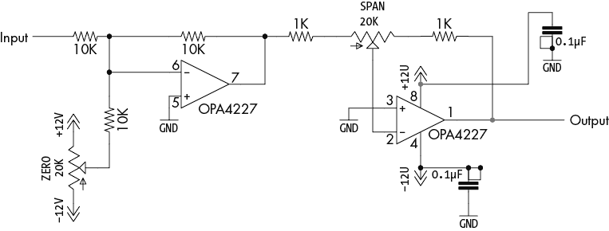
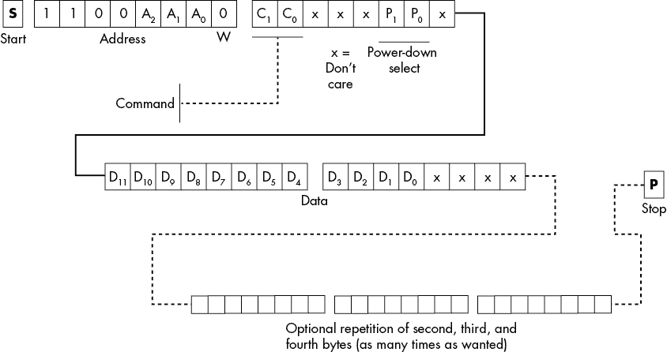
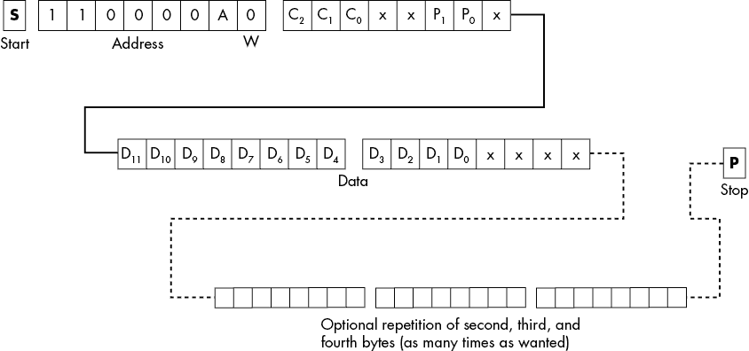
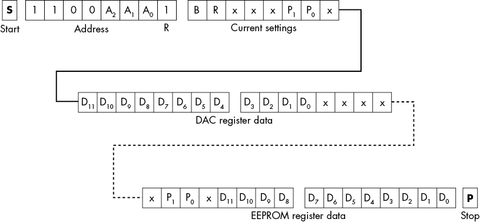

# 第十五章：MCP4725 数字到模拟转换器

第十四章介绍了一个 ADC，ADS1*x*15。本章描述了相反的功能：DAC。虽然 DAC 在系统中的出现频率比 ADC 低，但理解如何编程 DAC 仍然至关重要。本章描述了本书中所有软件示例中使用的 MCP4725 DAC，并补充了此前编码示例中未涉及的几个细节。

MCP4725 DAC 是一种常见的设备，Adafruit 和 SparkFun 都生产其扩展板。它是一个单一的 12 位转换器，将 0 到 4095 范围内的整数转换为 0 V 到 Vdd 之间的电压，Vdd 是 DAC 的电源引脚。

该 DAC 工作在 2.7 V 至 5.5 V 的电源范围内。这意味着其输出电压也将在该范围内。使用 3.3 V 电源时，这对应于每个单位 0.81 mV；使用 5 V 电源时，这对应于每个单位 1.22 mV。

如果你需要生成其他电压范围，可以将该 DAC 的输出信号输入到一个运算放大器电路中，正如图 15-1 所示。该电路将 DAC 的输出转换为范围在±10 V 之间的任意电压（可调）。

由于本书的大部分内容都使用了 MCP4725 作为示例代码，因此我将省略在此提供新示例的冗余内容。可以查看第八章中的清单 8-2 或 8-3，以回顾之前的一些示例。

## 15.1 MCP4275 概述

MCP4725 支持单一地址引脚，允许你选择两个地址中的一个。在内部，MCP4725 实际上支持 3 个地址位；然而，其中两个地址位在制造过程中是硬编码的。你可以订购最多四个不同的部件，基本地址分别为 0x60、0x62、0x64 或 0x66。MCP4725 上的地址引脚可以进一步区分地址 0x60 和 0x61，0x62 和 0x63，0x64 和 0x65，以及 0x66 和 0x67。

MCP4725 包括一个板载 14 位 EEPROM，它在上电/复位时加载电源关闭模式和初始输出设置。这允许你在启动时将 DAC 输出强制为特定电压。为了理解为何默认值不应该是 0 V，想象你正在驱动一个如图 15-1（从图 14-1 复制）的运算放大器电路，经过校准后能够基于输入 0 V 到 5 V 产生从−10 V 到+10 V 的输出。这意味着 DAC 需要输出+2.5 V，以便在运算放大器电路的输出端产生 0 V，这将是适当的上电复位电压。当然，EEPROM 的另一个用途是允许系统在启动时恢复 DAC 电压到上次断电时的值——例如，它可以在启动时禁用 DAC 输出。

MCP4725 能够在标准速度（100 kHz）、快速速度（400 kHz）或高速（最高可达 3.4 MHz）下运行。如果你的 CPU 或 SBC 支持高速操作，这将允许你以接近 200 kHz 的速度更新波形。

MCP4725 易于编程，这也是本书在大多数通用示例中使用它的原因。它有三种基本的命令格式：

+   一个具有三个总线事务的快速写入命令（可扩展）

+   一个具有四个总线事务的写入命令（可扩展）

+   一个具有六个总线事务的读取命令

图 15-1：提供跨度（增益）和零点（偏移）功能的运算放大器电路

写入命令通常以起始条件和 I²C 地址字节开始，LO 位包含 0。地址字节之后的字节包含命令，HO 的 2 或 3 位（见图 15-2）。

图 15-2：写入命令的前两个字节

表 15-1 列出了 MCP4725 响应的命令。

表 15-1：MCP4725 命令

| **C[2] C[1] C[0]** | **命令** |
| --- | --- |
| 00x^(*) | 快速写入命令 |
| 010 | 写入 DAC 寄存器 |
| 011 | 写入 DAC 和 EEPROM |
| 1xx | 预留用于未来使用 |
| ^(*)x/xx = 无关 |

如果表 15-1 中的 C[2]和 C[1]都为 0（即快速写入命令），则 C[0]用作其中一个关机位。我将在下一节中进一步解释。

只有一个读取命令。发送一个地址字节，其中 LO 位为 1，即可调用读取命令（请参见本章后面 15.5 节“读取命令”）。

## 15.2 快速写入命令

由于向 DAC 寄存器写入值是 MCP4725 上最常见的操作，因此该 IC 支持一个命令，使您能够使用最少的三个 I²C 总线事务来写入新的 DAC 值（见图 15-3）。事务的第二个字节包含三条信息：命令（0b00）在 HO 的 2 位，电源关机选择码在第 4 和第 5 位（请参见本章后面 15.4 节“关机模式”），以及 12 位 DAC 值的 HO 4 位。第三个字节包含 DAC 值的 LO 8 位。

如图 15-3 所示，DAC 值是一个无符号的 12 位二进制数。0xFFF 产生 DAC 的最大电压（Vdd），而 0x000 产生 0 V。

图 15-3：快速写入命令格式

如图 15-3 所示，您可以使用快速写入命令向 DAC 寄存器发送一系列命令。您可以在前三个事务和停止条件之间指定任意数量的 16 位值对（尽管许多库限制了每次可以写入到 I²C 总线的字节数；例如，Arduino 库将此限制为大约 32 个字节）。这使得您能够通过每次电压变化写入两个字而不是三个字，从而创建更快的波形，尽管当您不得不发送新的起始条件和新的地址字节时，可能会偶尔出现短暂的波动。

## 15.3 写入命令

标准的 MCP4725 写入命令有两种形式：写入 DAC 寄存器（Fast Write 命令的长格式，C[2]C[1]C[0] = 0b010）和写入 DAC 寄存器与 EEPROM（C[2]C[1]C[0] = 0b011）。这种形式需要至少 4 字节来执行其功能，比 Fast Write 命令多 1 字节（参见图 15-4）。

图 15-4：写入命令格式

大多数情况下，你不会使用标准的写入命令将数据写入 DAC 寄存器，因为使用 Fast Write 命令总是更快。唯一支持使用该命令写入 DAC 数据的理由是数据格式不同：它方便地将数据放置在 2 字节的高 12 位中，这与 12 位的 ADS1015 ADC 兼容。例如，然而，考虑到 I²C 总线事务的额外成本，最好将数据移动到 Fast Write 操作的正确位置。

这个命令的主要原因（可以说是唯一的理由）是你可以用它来编程 MCP4725 的 EEPROM 数据。这使你能够设置系统上电/复位时的电压。EEPROM 保存 12 位数据加上 2 个关机模式位。

请注意，编程 EEPROM 大约需要 50 毫秒。在此期间，MCP4725 会忽略任何新的写入命令。你可以通过轮询状态寄存器中的忙碌位来确定 EEPROM 写操作何时完成（见第 15.5 节，“读取命令”）。

EEPROM 的寿命大约是 100 万次写入周期。虽然这通常超过了普通设计师的需求，但频繁写入 EEPROM 会导致其损耗。一般来说，只有在显式初始化时或系统关机时才写入 EEPROM。如果你选择后者，DAC 在电源恢复时将以上次的输出电压启动。

## 15.4 关机模式

P[1] 和 P[0] 位允许你将 MCP4725 设置为特殊的关机模式或正常模式。表 15-2 显示了这些位的功能。

表 15-2：关机位

| **P[1]P[0]** | **DAC 输出** | **下拉电阻** |
| --- | --- | --- |
| 00 | 已启用 | 无 |
| 01 | 关闭 | 1 kΩ |
| 10 | 关闭 | 100 kΩ |
| 11 | 关闭 | 500 kΩ |

在正常操作过程中，当你期望 DAC 输出电压时，应该将这 2 位设置为 0b00。如果不使用 DAC 输出，则可以将这些位设置为 0b01、0b10 或 0b11；在这三种情况下，都会断开 DAC 输出与 IC 和分立板上的 V[out] 引脚连接。这些关机值还会将一个下拉电阻连接到 V[out] 引脚，以便输出 0 V，而不是漂浮，这通常会产生噪声。使用的下拉电阻值取决于跟随 DAC 的电路。通常，电阻越小，抗噪声能力越强，但较低的电阻也可能会造成阻抗问题。正确的选择取决于你的电路设计。

顾名思义，断电模式旨在减少在低功耗环境下的电力消耗。如果你不担心功耗，可以将设备保持在正常模式。

## 15.5 读取命令

数模转换器（DAC）本质上是一个只输出的设备，因此读取 DAC 并不常见。你会在以下四种情况下从 MCP4725 读取数据：

+   确定你（或其他线程）最后一次写入 DAC 寄存器的值。

+   确定最后一次写入 MCP4725 EEPROM 的值。

+   确定 MCP4725 何时完成其上电/复位周期，以便开始向其发送写入命令。

+   读取忙碌位的状态，以确定 MCP4725 何时完成向 EEPROM 写入数据。

如图 15-5 所示，读取命令以通常的启动条件开始，并且地址字节的低位（LO bit）包含 1。在控制器将此命令放置到总线上之后，MCP4725 将以 5 字节的数据序列响应。第一个字节是一个状态字节，描述系统状态和断电设置。接下来的 2 个字节包含当前的 DAC 寄存器数据（出现在这 2 个字节的高 12 位）。最后 2 个字节包含 EEPROM 数据（断电位和上电/复位后的 DAC 寄存器值）。可以看到，DAC 寄存器数据出现在接收到的第二、第三字节和第四、第五字节的不同位置。

图 15-5：读取命令格式

设置字节的高位（HO bit）是 RDY（BUSY）位。这个位在 MCP4725 正在忙于向 EEPROM 写入数据时为 0。当此位为低时，DAC 不会接受写入命令。在向 EEPROM 写入数据之后，你应该持续循环，测试此位，直到它返回 1。

当前设置字节的第 6 位是上电复位位。在系统忙于复位时，无论是上电还是通过总线调用复位功能，该位将为 0。在复位操作期间不要执行任何写入命令。

当前设置字节的第 1 位和第 2 位提供当前的断电设置。这与 EEPROM 寄存器数据字节中的同 2 位不同，后者指定在上电/复位操作期间，断电位将被初始化为何值。

## 15.6 本章总结

本章描述了 MCP4725 数模转换器的使用。当然，到现在你应该已经非常熟悉它，因为它已成为本书中大多数例子的 I²C 外设。

本章首先填补了书中例子中未涉及的 MCP4725 的细节。它提供了设备的概述，然后描述了快速写入和标准写入命令，以及如何向板载 EEPROM 写入数据。接着，讨论了断电模式。最后，本章讨论了读取命令，用于读取芯片上 EEPROM 的内容、当前 DAC 设置，并测试 DAC 忙碌位。
