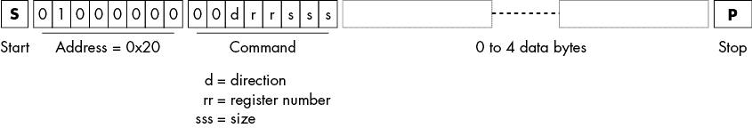
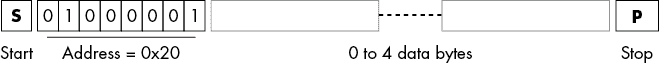

# 第十六章：裸机外设编程


第十一章描述了如何在寄存器级别编程 I²C 控制器设备。本章提供了与此信息互补的内容，展示了如何在机器寄存器级别将 MCU 编程为 I²C 外设，允许你创建自己的 I²C 外设。为此，本章探索了一个相当全面的编程示例，运行在 ATtiny84 MCU 上，一个 SparkFun Atto84 开发板上。

在像 ATtiny84 这样简单且速度较慢的 MCU 上创建基于软件（位级控制）的 I²C 外设几乎是不可能的（请参见第三章，该章节已放弃这一任务）。幸运的是，ATtiny84 提供了硬件支持，使得本章所涉及的外设编程成为可能，履行了第三章中承诺提供 ATtiny84 支持 I²C 外设的承诺。

## 16.1 ATtiny 作为 I²C 外设

ATtiny84——事实上，Atmel ATtiny 系列的大部分成员——提供了几种硬件支持，显著减少了处理 I²C 总线事务时软件的负担。首先也是最重要的支持是*通用串行接口（**USI**）*，一个通用的移位寄存器，能够处理最多 8 位数据，直到溢出（尽管它可以编程为处理更少的位）。在 ATtiny84 上，你可以使用 USI 端口实现 I²C、SPI、串行、USB 和其他类型的通信（因此它名字中的 *Universal* 代表了这一点）。

你可以通过编程 USI 接收来自外部引脚的数据，并将这些串行数据作为 8 位字节（串行转并行模式）提供，或者使用 USI 接收 8 位数据值并将其串行输出到某个引脚。通过将 USI 的输入和输出连接到 SDA 引脚，你可以启用 USI 从 I²C 总线接收数据或将数据传输到 I²C 总线。你还可以选择 USI 的时钟源，使用内部定时器或外部引脚。这对于 I²C 操作非常有用——如果你选择外部选项并使用 SCL 引脚作为时钟源，你可以将数据与 SCL 时钟信号同步地移入 USI。

除了 USI，ATtiny84 还提供了一个起始条件检测器和一个移位寄存器溢出中断，允许你快速处理一些在 8 MHz CPU 的软件中难以管理的 I²C 条件。

USI 和其他支持硬件并不是真正的 I²C 接口；事实上，Atmel 通常将其称为双线接口，因为它们并不完全支持 I²C 标准。例如，USI 不支持故障滤波或速率控制。你还必须接受其他妥协（例如需要在软件中进行大量工作），因为 USI 并不是专门为 I²C 通信设计的。它是一个多面手，但不是专家。

本章中的信息来源于两个主要来源。第一个是 Atmel AVR312 应用说明《将 USI 模块用作 I²C 从设备》，该说明描述了如何使用 USI 实现 I²C 通信。第二个也是最大的来源是 TinyWire 库（请参阅本章末尾的“更多信息”）。该网站列出了许多贡献者，包括 BroHogan、Don Blake、Jochen Toppe 和 Suovula；完整的详细信息请查看源代码。

本章不会重复讨论第十一章中出现的 ATtiny84 MCU 寄存器。有关寄存器和 USI 的详细信息，请参考第十一章第 11.2 节《ATtiny 控制器编程》。

## 16.2 介绍内存外围设备

使用像 ATtiny84 这样的通用微控制器，你可以创建各种不同的外围设备。例如，凭借其板载的数字 I/O 和模拟输入引脚，你可以轻松地使用该设备构建一个小型端口扩展器或 ADC。或者，你还可以创建更复杂的设备，如 NeoPixel 驱动程序（参见“更多信息”）或其他任何你能够连接到 Atto84 的设备（减去两个引脚，用于 SDA 和 SCL 线）。

本章将向你展示如何创建一个简单的 4 字节内存外围设备，虽然这个设备在实际应用中可能没什么用处。然而，使用这个几乎是微不足道的设备有一些优势：

+   因为它简单，所以容易理解。你不会浪费时间去弄明白设备如何工作，除了预定的挑战：学习如何创建一个 I²C 外围设备。

+   它减少了你需要阅读的代码量（以及你需要支付的本书页数）。

+   它提供了一个框架，用于创建更复杂的设备：你可以轻松去除不必要的内存设备代码，并插入你自己实际设备的代码。

这个内存设备支持四个内存位置。你可以通过单次操作读取和写入这些位置中的任意数量。你还可以指定数组的起始偏移量；如果你指定的长度超出了数组的末尾，索引会自动回绕到数组的开头。

I²C 写入命令采用图 16-1 所示的形式。



图 16-1：外围设备写入命令

写入命令实际上有两个目的：正如它的名字所暗示的那样，它允许你将数据写入四个内存位置（寄存器）。它还允许你指定内存地址（寄存器号），后续的读取命令将从该地址获取数据，并且可以指定要获取的数据量。

读取命令采用图 16-2 所示的形式。



图 16-2：外围设备读取命令

请注意，在 I²C 写事务中，命令字节紧跟在 I²C 地址字节后面。低 3 位（sss）指定数据传输长度，必须在 0 到 4 的范围内；更大的值会被限制为 4。第 3 位和第 4 位（rr）指定寄存器数组的起始偏移量（寄存器号）。第 5 位（d）指定数据方向：0 表示 rrsss 位应用于紧随命令字节之后的数据，这些数据将写入寄存器，而 1 则告诉外设忽略任何进一步的数据（直到出现停止条件），并将 rrsss 位用于下一个 I²C 读取操作。

考虑以下 I²C 总线序列：

```
40 04 01 02 03 04
40 24
41 `ww xx yy zz`
```

第一行的第一个字节是一个 I²C 写操作，针对地址为 0x20（内存外设）的设备。命令字节指定 d = 0（内存写），rr = 0，sss = 4。此操作将 4 个字节（1、2、3 和 4）写入内存位置 0 到 3。

第二行也是一个 I²C 写操作。命令字节指定 d = 1（内存读取），rr = 0，sss = 4。当 d 位为 0 时，命令字节后没有数据负载。这个写操作看起来像是指定一个内存读取操作，虽然这可能有些奇怪；实际上，它只是为数据读取准备外设的读取参数寄存器。

本例中的第三行是一个 I²C 读取操作（地址字节的 LO 位为 1）。当控制器将该地址字节放到总线上时，外设通过返回 4 个字节（由第二行的写命令指定的字节数）作出响应。在此案例中，`ww`、`xx`、`yy` 和 `zz` 实际上将是 01、02、03 和 04，因为第一行的命令已将这些值写入寄存器。

这个内存外设具有一些额外的语义，但你现在应该理解代码中发生的核心内容。对于更具体的问题，如地址环绕、多次读操作等，我将引导你查看源代码。

## 16.3 内存外设软件架构

内存外设软件有四个主要组件：

+   初始化代码

+   中断服务例程

+   从 ISRs 到主程序的回调

+   主循环

程序被分为两个部分：一个主文件，包含 Arduino 的`setup()`和`loop()`函数，以及回调函数；另一个文件包含处理 I²C 操作的库代码——具体来说，是中断服务例程（ISRs）和实用函数（接下来的段落将简要描述这些）。

`setup()`函数调用 ISR 库初始化函数，并设置指向回调函数的指针地址。主 Arduino 循环为空（当没有中断处理时，CPU 只是空闲旋转），因为所有工作都由 ISRs 处理。在更复杂的外设设计中，你可能会在主循环中处理后台活动。

这个程序中有三个回调函数，ISRs 会在三种情况中调用它们：

+   在响应 I²C 读取请求之前，从外设传输任何数据到控制器

+   在响应 I²C 读取请求之后，从外设传输数据到控制器时，期望从控制器接收到 ACK 或 NAK

+   在收到来自控制器的数据后，以响应 I²C 写入请求

这些回调函数通常负责提供要发送到控制器的数据（用于 I²C 读取操作），或处理来自控制器的数据（用于 I²C 写入操作）。

系统中的两个主要中断服务例程处理两个事件：启动条件的存在和 I²C 总线上数据字节事务（接收或传输）的完成。由于这些事件发生频率较低，且不会占用过多处理器时间，因此 I²C 事务不会像位操作法那样淹没 CPU（有关位操作法，请参见第三章）。

### 16.3.1 主文件

本节将讲解*attiny84_Periph.ino*，这是内存外设设备的主程序。由于此源文件的大小和复杂性，我将其拆分成若干部分并分别描述每一部分。

第一部分涵盖了你在典型的 C 或 C++程序中常见的注释和`#include`语句：

```
// attiny84_Periph.ino
//
// Implements a simple I2C peripheral
// running on a SparkFun Atto84 (ATtiny84).
//
// I2C protocol for this device:
//
// For I2C write operations:
//
//  |adrs+W| cmd | optional Data |
//
//  cmd:
//      00drrsss
//
// where d is 0 for write operation and 1 for read,
// rr specifies a "register number" (which is an index
// into "i2c_regs" array below), and sss is a size (0-4).
//
// For write operations (d = 0) then, there will be sss
// additional bytes (max 4) following the cmd byte.
// These bytes will be written to i2c_regs starting
// at offset rr (wrapping around to the beginning
// of the array if sss+rr >= 4).
//
// For read operations (d = 1), any additional data beyond
// the cmd byte is ignored (up to the stop condition).
//
// For I2C read operations:
//
//  |adrs+R| Data |
//
// where "Data" is the number of bytes specified by the
// last I2C write operation with d = 1 (number of bytes will
// be sss). Data transferred is from i2c_regs starting at
// location rr (from the last write operation).
//
// Consecutive I2C read operations, without intervening
// writes, will read the same locations from the registers.

#define I2C_PERIPH_ADDRESS 0x20 // The 7-bit address

#define __AVR_ATtiny84__
extern "C" {
  #include <inttypes.h>
  #include "usiI2CPeriph.h"
  #include <avr/interrupt.h>
  }

#include "Arduino.h"
```

接下来，内存外设程序将 4 个字节存储到`i2c_regs`变量中：

```
// attiny84_Periph.ino (cont.)
//
// 4-byte R/W register area
// for this sample program:

volatile uint8_t i2c_regs[4] =
{
    0xDE,
    0xAD,
    0xBE,
    0xEF,
};

// Tracks the current register pointer position
// for read and write operations.
//
// *_position holds the index into i2c_regs
// where I2C reads and writes will begin.
//
// *size holds the number of bytes for
// the read/write operation.

volatile byte reg_position;    // For writes
volatile byte size;            // For writes

volatile size_t read_position; // For reads
volatile size_t read_size;     // For reads

const byte reg_size = sizeof( i2c_regs );

// Command byte bits:

#define cmdSizeMask (0b000111)
#define cmdRegMask  (0b011000)
#define cmdDirMask  (0b100000)
```

该程序部分还包含全局变量，用于跟踪最后一个命令字节中的 rr 和 sss 值。这里有两组这些变量——一组用于内存读取操作（d = 1），另一组用于内存写入操作（d = 0）。此部分还包括一些用于命令位掩码的定义。

下一节开始回调例程。中断服务例程在完成向控制器传输一个字节以响应 I²C 读取命令后，会调用`requestHandledEvent()`函数：

```
// attiny84_Periph.ino (cont.)
//
// requestHandledEvent-
//
// Called after data has been shipped
// to the controller.

void requestHandledEvent()
{
}
```

此时，代码期望从控制器接收到一个 ACK 或 NAK。通常，这个函数会处理清理工作（如清除缓冲区、关闭电子信号等）。然而，由于内存外设无需清理，因此此函数简单地返回。对于这个项目，技术上你可以跳过初始化该函数的指针，因为库的默认条件是无操作；我加入它只是为了让你知道它在系统中的存在。

接下来是`requestEvent()`回调函数。当收到 I²C 读取命令时，中断服务例程会调用此函数，实际传输任何数据到控制器之前。

```
// attiny84_Periph.ino (cont.)
//
// requestEvent-
//
// Called before data has been shipped
// to the controller.

void requestEvent()
{
        for( size_t i=0; i < read_size; ++i )
        {
            size_t index = (read_position+i) %  reg_size;
            usiI2CTransmitByte( i2c_regs[index] );
        }
}
```

理论上，你可以使用此函数初始化输出流，向控制器发送 ISRs 将传输的数据，但这段代码使用`usiI2CTransmitByte()`来实现这个目的。与 Arduino 的`Wire.write()`函数类似，`requestEvent()`并不实际传输数据；该函数只是将数据附加到一个内部缓冲区中。ISRs 将在稍后处理实际的数据传输。在这段源代码中，这个缓冲区的最大长度为 16 个字节。如果你试图将超过 16 个字节的数据插入缓冲区，代码会阻塞，直到空间可用。对于内存外设，`requestEvent()`仅获取由`read_size`变量指定的字节数（由前一个写操作中的命令字节的 sss 字段填写），并从`read_position`全局变量（来自 rr 字段）指定的偏移量开始。

接下来，回调函数`receiveEvent()`处理在 I²C 写操作期间从控制器接收的数据流。

```
// attiny84_Periph.ino (cont.)
//
// receiveEvent-
//
// Called when data has been received
// from the controller.
//
// Parse the received data and set up the
// position and size variables as needed.
// If optional data arrives, store it into
// the i2c_regs array.
//
// rcvCnt parameter specifies the
// number of bytes received.

void receiveEvent( uint8_t rcvCnt )
{
    byte cmd;

    // Punt if controller sent too
    // much data...

    if( rcvCnt > I2C_RX_BUFFER_SIZE )
    {
        return;
    }

    // ...or too little:

    if( rcvCnt > 0 )
    {
        cmd             = usiI2CReceiveByte();
        size            = cmd & cmdSizeMask;

        // cmdSizeMask is 3 bits, but
        // the maximum size is 4.
        // Enforce that here:

        if( size > 4 )
        {
            size = 4;
        }
        reg_position    = cmd & cmdRegMask;
        reg_position  >>= 3;

        // Determine if the controller is
        // specifying a read operation or a
        // write operation. This is not the
 // R/W bit in the address byte (you
        // got here on an I2C write). The
        // direction bit specifies whether
        // whether you can expect an I2C
        // read operation after this command
        // to read the specified data.

        if( cmd & cmdDirMask )
        {
             // A read command, just set up
             // the count and pointer values
             // for any upcoming reads.

            read_size = size;
            read_position = reg_position;
        }
        else // A write command
        {
            // Copy any additional data the
            // controller sends you to the
            // i2c_regs array. Note that
            // this code ignores any bytes
            // beyond the fourth one the
            // controller sends.

            byte maxXfer = 4;
            while( --rcvCnt && maxXfer-- )
            {
                i2c_regs[reg_position] = usiI2CReceiveByte();
                reg_position++;
                if( reg_position >= reg_size )
                {
                    reg_position = 0;
                }
            }
        }
    }
}
```

`receiveEvent()`函数负责从命令字节中提取位，解析命令，并处理命令字节之后出现的任何额外数据（即，将数据写入`i2c_regs`数组）。

接下来，`setup()`函数调用 ISR 库代码的初始化函数`usiI2CPeripheralInit()`，该函数完成大部分实际工作，然后设置回调函数的地址。

```
// attiny84_Periph.ino (cont.)
//
// Usual Arduino initialization code
// even for an I2C peripheral application.

void setup()
{

    // Initialize the peripheral code:

    usiI2CPeripheralInit( I2C_PERIPH_ADDRESS );

    // Set up callbacks to local functions:

    usi_onReceiverPtr = receiveEvent;
    usi_onRequestPtr = requestEvent;
    usi_afterRequestPtr = requestHandledEvent;
}
```

`setup()`函数还必须初始化回调函数的指针。由于 ISR 执行所有实际工作，主 Arduino 循环是空的：

```
// attiny84_Periph.ino (cont.)
//
// The main loop does nothing but spin its
// wheels. All the work in this sample
// program is done inside the ISRs and
// callback functions. If this peripheral
// were a little more complex, background
// activities could be taken care of here.

void loop()
{
    // Do nothing.
}
```

如果这个外设设备稍微复杂一些，`main()`函数可以在等待 I²C 命令到达时处理一些后台任务。

### 16.3.2 中断服务例程库

本节将讨论*usiI2CPeriph.c*，这是 ISR 模块的源代码。它是由 Donald Blake 编写的原始 AVR 双线外设代码的修改版，并由 Jochen Toppe 进行了修改。我进一步修改了它，以适应*attiny84_Periph.ino*中的示例应用。

和上一节一样，我将逐行描述这段代码。由于这段代码实现了 Atmel 的 AVR312 应用笔记中描述的架构，因此有一份应用笔记作为参考在阅读这段代码时会很有帮助（见“更多信息”）。

像往常一样，源文件的第一部分包含简介注释、头文件包含以及一些重要的定义和宏：

```
// usiI2CPeriph.c
//
// USI I2C Peripheral driver.
// 
// Created by Donald R. Blake, donblake at worldnet.att.net.
// Adapted by Jochen Toppe, jochen.toppe at jtoee.com.
// Further modifications by Randall Hyde for "The Book of I2C."
// 
// ----------------------------------------------------------
// 
// Created from Atmel source files for Application Note 
// AVR312: Using the USI Module as an I2C peripheral.

#include <avr/io.h>
#include <avr/interrupt.h>

#include "usiI2CPeriph.h"

#define breakif(x) if(x) break

// Device dependent defines:

#define DDR_USI             DDRA
#define PORT_USI            PORTA
#define PIN_USI             PINA
#define PORT_USI_SDA        PORTA6
#define PORT_USI_SCL        PORTA4
#define PIN_USI_SDA         PINA6
#define PIN_USI_SCL         PINA4
#define USI_START_COND_INT  USISIF
#define USI_START_VECTOR    USI_START_vect
#define USI_OVERFLOW_VECTOR USI_OVF_vect

// These macros make the stop condition detection code 
// more readable.

#define USI_PINS_SCL_SDA            \
    (                               \
            ( 1 << PIN_USI_SDA )    \
        |   ( 1 << PIN_USI_SCL )    \
    )

#define USI_PINS_SDA     ( 1 << PIN_USI_SDA )
#define USI_PINS_SCL     ( 1 << PIN_USI_SCL )
```

`DDRA`、`PORTA`、`PORTA6`、`PINA6`、`PINA4`、`USISIF`、`USI_START_vect`和`USI_OVF_vect`定义出现在*avr/io.h*头文件中。

`USI 溢出`ISR（来自 AVR312，在此代码中为`ISR( USI_OVERFLOW_VECTOR )`）实现了一个状态机，符合 AVR312 的描述。`ISRstate_t`类型定义为此函数实现的每个状态提供有意义的名称。请参阅代码注释，了解每个状态的描述：

```
// usiI2CPeriph.c (cont.)
//
/***********************************************************

                     typedef's

************************************************************/

// ISRstate_t are the different states possible for
// the ISR state machine that handles incoming
// bytes from the controller.

typedef enum
{
    // Address byte has just arrived:

    USI_PERIPH_CHECK_ADDRESS                = 0x00,

    // Peripheral is transmitting bytes to
    // the controller (I2C read transaction).

    USI_PERIPH_SEND_DATA                    = 0x01,

    // Receive an ACK from controller after sending
    // a byte to it.

    USI_PERIPH_REQUEST_REPLY_FROM_SEND_DATA = 0x02,

    // Deals with ACK or NAK received from
    // controller after sending a byte
    // to the controller (I2C read).

    USI_PERIPH_CHECK_REPLY_FROM_SEND_DATA   = 0x03,

    // Handle data coming to the peripheral
    // (I2C write operation).

    USI_PERIPH_REQUEST_DATA                 = 0x04,
    USI_PERIPH_GET_DATA_AND_SEND_ACK        = 0x05
} ISRstate_t;
```

接下来是一些全局变量（仅限于当前源文件）：

```
// usiI2CPeriph.c (cont.)
//
/***********************************************************

                    local variables

************************************************************/

// periphAddress holds the 7-bit I2C address.

static uint8_t              periphAddress;
static uint8_t              sleep_enable_bit;
static uint8_t              in_transaction;
static volatile ISRstate_t  ISRstate;

static uint8_t          rxBuf[I2C_RX_BUFFER_SIZE];
static volatile uint8_t rxHead;
static volatile uint8_t rxTail;
static volatile uint8_t rxCount;

static uint8_t          txBuf[I2C_TX_BUFFER_SIZE];
static volatile uint8_t txHead;
static volatile uint8_t txTail;
static volatile uint8_t txCount;
```

这些变量的使用方式如下：

1.  `periphAddress` 保存外设设备的 I²C 地址（例如，内存外设设备的地址为 0x20）

1.  `sleep_enable_bit` 保存 MCUCR 寄存器中 SE 位的状态，因为该位会在 ISR 中修改 MCUCR 时被覆盖

1.  `in_transaction` 一个布尔变量，用于跟踪你是否正在进行 I²C 事务（即，在进入和退出溢出 ISR 时，还没有看到停止条件）

1.  `ISRstate` 保存当前状态值（`ISRstate_t`），用于溢出 ISR 状态机

1.  `rx*` 变量 接收缓冲区变量

1.  `tx*` 变量 传输缓冲区变量

1.  `usi_onRequestPtr` 指向回调函数的指针，溢出 ISR 在接收到地址字节后但在返回数据给控制器设备之前会调用此函数

1.  `usi_onReceiverPtr` 指向回调函数的指针，溢出 ISR 在接收到地址字节后但在读取控制器设备通过 I²C 写操作发送的其他数据之前会调用此函数

1.  `usi_afterRequestPtr` 指向回调函数的指针，溢出 ISR 在处理完从控制器接收的所有字节之后会调用此函数，适用于 I²C 读取操作

还有三个函数指针出现在全局声明中：`usi_afterRequestPtr`、`usi_onRequestPtr` 和 `usi_onReceiverPtr`。除了这些变量外，本节定义了两个空函数，通过这些函数初始化回调指针。预初始化这些函数指针可以避免代码检查这些指针是否为 NULL。

```
// usiI2CPeriph.c (cont.)
//
// Dummy functions so you don’t have to check if
// usi_afterRequestPtr or usi_onReceiverPtr are NULL.

static void dummy1( void ){}
static void dummy2( uint8_t d ){}

void    (*usi_afterRequestPtr)( void )    = dummy1;
void    (*usi_onRequestPtr)( void )       = dummy1;
void    (*usi_onReceiverPtr)( uint8_t )   = dummy2;
```

接下来是一些仅限于当前源文件的实用支持函数。

```
// usiI2CPeriph.c (cont.)
//
/***********************************************************

                    Local functions

************************************************************/

// Flushes the I2C buffers.

static void flushI2CBuffers( void )
{
  rxTail = 0;
  rxHead = 0;
  rxCount = 0;
  txTail = 0;
  txHead = 0;
  txCount = 0;
} // End flushI2CBuffers
```

`startSetConditionMode()` 函数初始化 ATtiny84 的中断系统，禁用 USI 溢出中断并启用起始条件中断。例如，当一个 I²C 事务完成后，外设正在等待另一个起始条件时，就会发生这种情况。一旦代码初始化了这些中断，它就可以做其他事情（目前仅在空循环函数中旋转），直到下一个起始条件到来。

```
// usiI2CPeriph.c (cont.)
//
// startSetConditionMode-
//
// This initializes the interrupt system so that
// the code waits for the arrival of a start
// condition (and generates an interrupt when
// one arrives).

static void setStartConditionMode( void )
{
    USICR =
            // Enable Start Condition Interrupt.

            ( 1 << USISIE )

            // Disable Overflow Interrupt.

        |   ( 0 << USIOIE )

            // Set USI in two-wire mode.

        |   ( 1 << USIWM1 ) 

 // No USI Counter overflow hold.

        |   ( 0 << USIWM0 )

            // Shift Register Clock Source = external, 
            // positive edge.

        |   ( 1 << USICS1 )
        |   ( 0 << USICS0 ) 

            // 4-Bit Counter Source = external, 
            // both edges.

        |   ( 0 << USICLK )

            // No toggle clock-port pin.

        |   ( 0 << USITC );

    // Clear all interrupt flags, except Start Cond.

    USISR =
            ( 0 << USI_START_COND_INT )
        |   ( 1 << USIOIF )
        |   ( 1 << USIPF )
        |   ( 1 << USIDC )
        |   ( 0x0 << USICNT0 );
}
```

请参见第十一章中的第 11.2 节，“ATtiny 控制器编程”，以了解代码中出现的 USICR 和 USISR 寄存器的说明。

程序的下一个部分引入了主应用程序可以调用的公共函数，从主 ISR 初始化函数开始。此函数将 SDA 和 SCL 引脚设置为输出，设置为高电平（静态状态），并将系统设置为等待起始条件中断。

```
// usiI2CPeriph.c (cont.)
//
/***********************************************************

                    Public functions

************************************************************/

// Initialize USI for I2C peripheral mode.

void usiI2CPeripheralInit( uint8_t ownAddress )
{
    // Initialize the TX and RX buffers to empty.

    flushI2CBuffers( );
 periphAddress = ownAddress;

    // In two-wire (I2C) mode (USIWM1, USIWM0 = 1X),
    // the peripheral USI will pull SCL low when a 
    // start condition is detected or a counter 
    // overflow (only for USIWM1, USIWM0 = 11). This
    // inserts a wait state. SCL is released by the 
    // ISRs (USI_START_vect and USI_OVERFLOW_vect).
    // 
    // Set SCL and SDA as output.

    DDR_USI |= ( 1 << PORT_USI_SCL ) | ( 1 << PORT_USI_SDA );

    // Set SCL high.

    PORT_USI |= ( 1 << PORT_USI_SCL );

    // Set SDA high.

    PORT_USI |= ( 1 << PORT_USI_SDA );

    // Set SDA as input.

    DDR_USI &= ~( 1 << PORT_USI_SDA );

    USICR =
            // Enable Start Condition Interrupt.

            ( 1 << USISIE )

            // Disable Overflow Interrupt.

       |    ( 0 << USIOIE )

            // Set USI in two-wire mode.

       |    ( 1 << USIWM1 ) 

            // No USI Counter overflow hold.

       |    ( 0 << USIWM0 )

           // Shift Register Clock Source = external, 
           // positive edge.
           // 4-Bit Counter Source = external, both edges.

        |   ( 1 << USICS1 ) 
        |   ( 0 << USICS0 )
        |   ( 0 << USICLK )

           // No toggle clock-port pin.

       |    ( 0 << USITC );
 // Clear all interrupt flags and reset overflow counter.

    USISR = 
            ( 1 << USI_START_COND_INT ) 
        |   ( 1 << USIOIF ) 
        |   ( 1 << USIPF )
        |   ( 1 << USIDC );

    // The in_transaction variable remembers if the 
    // usiI2CPeriph driver is in the middle of
    // an I2C transaction. Initialize it to 0.

    in_transaction = 0;

} // end usiI2CPeripheralInit
```

接下来是一些用于测试传输和接收缓冲区中是否有数据的各种函数，以及向这些缓冲区插入数据和从中提取数据的函数：

```
// usiI2CPeriph.c (cont.)
//
// usiI2CDataInTransmitBuffer-
//
// Return 0 (false) if the transmit buffer is empty, true
// (nonzero) if data is available in the transmit buffer.

bool usiI2CDataInTransmitBuffer( void )
{
    return txCount; // Actual count is nonzero
                    // if data available :)
} // End usiI2CDataInTransmitBuffer

// usiI2CTransmitByte-
//
// Adds a byte to the transmission buffer, 
// wait for bytes to be transmitted 
// if buffer is full.
//
// Race condition warning: As this function
// modifies txCount, it should be called only
// from the USI_OVERFLOW_VECTOR ISR or code
// called from it. Otherwise, there could
// be problems with the updates of the global
// txBuf, txHead, and txCount variables (which
// are unprotected).
//
// In particular, it is safe to call this
// function from whomever usi_afterRequestPtr,
// usi_onRequestPtr, or usi_onReceiverPtr
// point at, but you must not call this
// code from the main Arduino loop or
// setup function.

void usiI2CTransmitByte( uint8_t data )
{

    // Wait for free space in buffer.

    while( txCount == I2C_TX_BUFFER_SIZE ) ;

    // Store data in buffer.

    txBuf[txHead] = data;
    txHead = ( txHead + 1 ) & I2C_TX_BUFFER_MASK;
    txCount++;

}   // End usiI2CTransmitByte

// usiI2CReceiveByte-
// 
// Return a byte from the receive 
// buffer, wait if buffer is empty. 
// As above, call this only from the
// USI_OVERFLOW_VECTOR ISR or code
// called by it.

uint8_t usiI2CReceiveByte( void )
{
    uint8_t rtn_byte;

    // Wait for Rx data.

    while( !rxCount ); 

    rtn_byte = rxBuf[rxTail];

    // Calculate buffer index.

    rxTail = ( rxTail + 1 ) & I2C_RX_BUFFER_MASK;
    rxCount--;

    // Return data from the buffer.

    return rtn_byte;

}   // End usiI2CReceiveByte

// usiI2CAmountDataInReceiveBuffer-
//
// Returns the number of bytes in the
// receive buffer.

uint8_t usiI2CAmountDataInReceiveBuffer( void )
{
    return rxCount;
}
```

接下来是处理 I²C 总线上起始条件到达的 ISR。ATtiny84 内部的特殊硬件检测到起始条件的存在并触发中断，从而调用以下代码：

```
// usiI2CPeriph.c (cont.)
//
/********************************************************

                USI Start Condition ISR

*********************************************************/

// USI_START_VECTOR interrupt service routine.
//
// This ISR gets invoked whenever a start condition
// appears on the I2C bus (assuming the USISIE/start
// condition interrupt is enabled in USICR).
//
// The global variable "in_transaction" is nonzero if
// this is a repeated start condition (that is, haven’t
// seen a stop condition since the last start).

ISR( USI_START_VECTOR )
{
    uint8_t usi_pins;

    // Notes about ISR. The compiler in the Arduino IDE handles 
    // some of the basic ISR plumbing (unless the "ISR_NAKED" 
    // attribute is applied):
    //
    //   * The AVR processor resets the SREG.I bit 
    //     when jumping into an ISR.
    //   * The compiler automatically adds code to save SREG.
    //   * < user’s ISR code goes here >
    //   * The compiler automatically adds code to restore SREG.
    //   * The compiler automatically uses the RETI instruction 
    //     to return from the ISR.
    //
    //     The RETI instruction enables interrupts after the 
    //     return from ISR.
    //
    // cli() call is not necessary. Processor disables 
    // interrupts when calling to an ISR.
    //
    // No need to save the SREG. The compiler does this 
    // automatically when using the ISR construct without 
    // modifying attributes.

  ❶ if( !in_transaction )
    {
        // Remember the sleep enable bit when entering the ISR.

        sleep_enable_bit = MCUCR & ( 1 << SE );

 // Clear the sleep enable bit to prevent the CPU from 
        // entering sleep mode while executing this ISR.

        MCUCR &= ~( 1 << SE );
    }

    // Set default starting conditions for new I2C packet.

  ❷ ISRstate = USI_PERIPH_CHECK_ADDRESS;

    // Program SDA pin as input.

    DDR_USI &= ~( 1 << PORT_USI_SDA );

    // The start condition is that the controller pulls SDA low
    // (while SCL is high).
    //
    // Wait for SCL to go low to ensure the start condition 
    // has completed (the start detector will hold SCL low);
    // if a stop condition arises, then leave the interrupt to 
    // prevent waiting forever. Don’t use USISR to test for 
    // stop condition as in Application Note AVR312, because
    // the stop condition flag is going to be set from the last
    // I2C sequence.

  ❸ while
    (
            ( usi_pins = PIN_USI & USI_PINS_SCL_SDA ) 
        ==  USI_PINS_SCL 
    ){
        // While SCL is high and SDA is low.
     }

    // If SDA line was low at SCL edge, then start 
    // condition occurred.

  ❹ if( !( usi_pins & USI_PINS_SDA ) )
    {
        // A stop condition did not occur.

        // Execute callback if this is a repeated start.

        if( in_transaction )
        {
            if( usiI2CAmountDataInReceiveBuffer() )
            {
                usi_onReceiverPtr
                (
                    usiI2CAmountDataInReceiveBuffer()
                );
            }
        }

        // Now that you’ve seen a start condition,
 // you need to dynamically enable the
        // overflow interrupt that tells you when
        // you’ve received a byte of data.

     ❺ USICR =
                // Keep start condition interrupt  
                // enabled to detect RESTART.

                ( 1 << USISIE )

                // Enable overflow interrupt.

            |   ( 1 << USIOIE )

                // Set USI in two-wire mode, hold SCL
                // low on USI Counter overflow.

            |   ( 1 << USIWM1 ) 
            |   ( 1 << USIWM0 ) 

                // Shift register clock source = external, 
                // positive edge.

            |   ( 1 << USICS1 )
            |   ( 0 << USICS0 ) 

                // 4-Bit Counter Source = external, both edges.

            |   ( 0 << USICLK )

                // No toggle clock-port pin.

            |   ( 0 << USITC );

        // Remember that the USI is in a valid I2C transaction.

        in_transaction = 1;

    }
    else // SDA was high
    {
         // A stop condition did occur; reset
         // the interrupts to look for a new
         // start condition.

      ❻ USICR =
                // Enable start condition interrupt.

                ( 1 << USISIE )

                // Disable overflow interrupt.

            |   ( 0 << USIOIE )

 // Set USI in two-wire mode.

            |   ( 1 << USIWM1 ) 

                // No USI counter overflow hold.

            |   ( 0 << USIWM0 )

                // Shift register clock source = external, 
                // positive edge.

            |   ( 1 << USICS1 )
            |   ( 0 << USICS0 )

                // 4-Bit counter source = external, 
                // both edges.

            |   ( 0 << USICLK )

                // No toggle clock-port pin.

            |   ( 0 << USITC );

        // No longer in valid I2C transaction.

        in_transaction = 0;

        // Restore the sleep enable bit.

        MCUCR |= sleep_enable_bit;

    }  // end if

    USISR =
            // Clear interrupt flags - resetting the Start 
            // Condition Flag will release SCL.

            ( 1 << USI_START_COND_INT ) 
        |   ( 1 << USIOIF )
        |   ( 1 << USIPF ) 
        |   ( 1 << USIDC )

            // Set USI to sample 8 bits (count 16
            // external SCL pin toggles).

        |   ( 0x0 << USICNT0);

} // End ISR( USI_START_VECTOR )
```

`USI_START_VECTOR` 中断服务程序首先关闭睡眠模式❶。这可以防止 CPU 在处理来自 I²C 引脚的字节时进入睡眠状态。接下来，ISR 设置状态，以便在开始条件之后立即处理地址字节❷。

`while` 循环会等待直到 SCL 线变低（即开始条件结束）❸，然后代码检查这是否为一个实际的开始条件（SDA 线为低电平）或停止条件（SDA 线为高电平）。如果是开始条件，ISR 会检查这是否为重新启动条件，意味着从上一个开始条件以来没有出现停止条件❹。一旦 ISR 正确识别到开始（或重新启动）条件，它会启用溢出中断，以便在 USI 接收到下一个完整字节时触发❺。如果到达了停止条件，代码会重置中断，以便寻找新的开始条件❻。

USI 溢出中断服务程序处理从 USI 到达的字节：

```
// usiI2CPeriph.c (cont.)
//
// USI Overflow ISR-
//
// Invoked when the shift register is full (programmable
// size, usually 1 or 8 bits). Because the byte coming
// in could be any part of an I2C transmission, this ISR
// uses a state machine to track the incoming bytes. This
// ISR handles controller reads and writes (peripheral
// writes and reads).
//
// Note that this ISR is disabled when waiting for a
// start condition to arrive (incoming bytes at that
// point are intended for a different device).

ISR( USI_OVERFLOW_VECTOR )
{
  uint8_t finished;
  uint8_t usi_pins;

  // This ISR is only ever entered because the 
  // ISR(USI_START_VECTOR) interrupt routine ran 
  // first. That routine saved the sleep mode and 
  // disabled sleep.
  //
  // ISRstate is the state machine variable for
  // the overflow.

  // Most of the time this routine exits, it has set up the 
  // USI to shift in/out bits and is expected to have re-entered 
  // because of the USI overflow interrupt. Track whether or
  // not the transaction is completely finished.

  finished = 0;
```

因为每个字节可能有不同的含义，溢出 ISR 使用状态机（以及 `ISRstate` 变量）来跟踪字节的到达。开始条件之后到达的第一个字节是地址读写字节。LO 位（R/W）决定状态机是处理内存读取操作（R/W = 1，状态 = `USI_PERIPH_SEND_DATA`）还是内存写入操作（R/W = 0，状态 = `USI_PERIPH_REQUEST_DATA`）。

以下代码是实际状态机的开始，由 `ISRstate` 变量控制：

```
// usiI2CPeriph.c (cont.)

  switch ( ISRstate )
  {

    // Address mode: 
    // Check address and send ACK (and next 
    // USI_PERIPH_SEND_DATA) if OK, else reset USI.

    case USI_PERIPH_CHECK_ADDRESS:
        if( 
                ( USIDR == 0 ) 
            ||  (( USIDR >> 1 ) == periphAddress ) 
        ){
            if( USIDR & 0x01 ) // Controller read request?
            {
                ISRstate = USI_PERIPH_SEND_DATA;
                usi_onRequestPtr();

            }
            else    // Must be controller write operation
            {
                ISRstate = USI_PERIPH_REQUEST_DATA;
            }       // end if

            // Acknowledge the start frame.
            // Sets up the USI to pull SDA low
            // and clock 1 bit (two edges).

            USIDR = 0; // Prepare ACK, acknowledge is a single 0 

            // Set SDA data direction as output.

            DDR_USI |= ( 1 << PORT_USI_SDA );

            // Clear all interrupt flags, except start cond.

            USISR = 
                    ( 0 << USI_START_COND_INT ) 
                |   ( 1 << USIOIF ) 
                |   ( 1 << USIPF )
                |   ( 1 << USIDC )
                |   ( 0x0E << USICNT0 ); // Shift 1 bit
        }
        else    // I2C transaction for some other device
        {
            setStartConditionMode();
            finished = 1;
        }
        break;
```

这段代码中出现的第一个状态是 `USI_PERIPH_CHECK_ADDRESS`，它对应于开始条件的到来。该状态检查传入的 I²C 地址字节和 R/W 位。如果地址不匹配，代码会关闭溢出中断使能，因为代码会忽略所有传入的字节，直到新的开始条件出现；当前的总线事务是为其他设备准备的。然而，如果地址匹配，代码则会根据 R/W 位改变状态。一个状态处理额外的传入字节（I²C 写操作），另一个状态处理传出的字节（I²C 读操作）。

接下来，`USI_PERIPH_CHECK_REPLY_FROM_SEND_DATA` 状态会验证外设在向控制器传输一个字节后，控制器是否发送了 ACK 或 NAK（一个 I²C 读取操作）。

```
// usiI2CPeriph.c (cont.)
//
// USI_PERIPH_CHECK_REPLY_FROM_SEND_DATA-
//
// State that executes when you’ve received
// an ACK or a NAK from the controller after
// sending it a byte.
// Check reply and go to USI_PERIPH_SEND_DATA
// if OK, else reset USI.

case USI_PERIPH_CHECK_REPLY_FROM_SEND_DATA:

    // Execute request callback after each byte’s
    // ACK or NAK has arrived.

    usi_afterRequestPtr();

    if( USIDR )
    {
    // If NAK, the controller does not want more data.

        setStartConditionMode();
        finished = 1;
    break;
    }

    // From here you just drop straight 
    // into USI_PERIPH_SEND_DATA if the
    // controller sent an ACK.
```

如果收到 NAK，你的数据传输就结束了；如果收到 ACK，程序继续传输更多数据。如果这段代码接收到来自控制器的 ACK，它通常会将状态设置为 `USI_PERIPH_SEND_DATA`。然而，这段代码只是直接进入该状态，并立即将下一个字节传输给控制器，而不改变状态（无论如何，它最终会被重新设置为 `USI_PERIPH_CHECK_REPLY_FROM_SEND_DATA`）。

接下来，`USI_PERIPH_SEND_DATA` 状态会在响应读取操作时向控制器发送一个字节的数据。传输完字节后，它还会将状态设置为 `USI_PERIPH_REQUEST_REPLY_FROM_SEND_DATA`，以处理控制器的 ACK 或 NAK。

```
// usiI2CPeriph.c (cont.)
//
// Controller read operation (peripheral write operation).
//
// Copy data from buffer to USIDR and set USI to shift byte
// next USI_PERIPH_REQUEST_REPLY_FROM_SEND_DATA.

case USI_PERIPH_SEND_DATA:

    // Get data from buffer.

    if( txCount )
    {
        USIDR = txBuf[ txTail ];
        txTail = ( txTail + 1 ) & I2C_TX_BUFFER_MASK;
        txCount--;

        ISRstate = 
            USI_PERIPH_REQUEST_REPLY_FROM_SEND_DATA;

        DDR_USI |=  ( 1 << PORT_USI_SDA );

        // Clear all interrupt flags, except start cond.

        USISR    =  
            ( 0 << USI_START_COND_INT ) 
            |   ( 1 << USIOIF ) 
            |   ( 1 << USIPF ) 
            |   ( 1 << USIDC) 
            |   ( 0x0 << USICNT0 ); // Shift 8 bits
    }
    else
    {
        // The buffer is empty.

        // Read an ACK:
        //
        // This might be necessary sometimes. See 
        // http://www.avrfreaks.net/index.php?name=
        // PNphpBB2&file=viewtopic&p=805227#805227.

        DDR_USI &= ~( 1 << PORT_USI_SDA );
        USIDR = 0; // Must ship out a 0 bit for ACK

        USISR =     
                // Clear all interrupt flags, 
                // except start cond.

                ( 0 << USI_START_COND_INT ) 
            |   ( 1 << USIOIF )
            |   ( 1 << USIPF )
 |   ( 1 << USIDC )

                // Set USI ctr to shift 1 bit.

            |   ( 0x0E << USICNT0 );     

        setStartConditionMode();
    } // end if
    break;
```

接下来，`USI_PERIPH_REQUEST_REPLY_FROM_SEND_DATA` 状态将 USI 设置为等待单个位的到来，无论是 ACK 还是 NAK。此状态还会将状态变量更改为 `USI_PERIPH_CHECK_REPLY_FROM_SEND_DATA`，在 ACK 或 NAK 到达时处理它。

```
// usiI2CPeriph.c (cont.)
//
// This state sets up the state machine
// to accept an ACK from the controller
// device after sending a byte to the
// controller (an I2C read operation).
// 
// Set USI to sample reply from controller
// next USI_PERIPH_CHECK_REPLY_FROM_SEND_DATA.

case USI_PERIPH_REQUEST_REPLY_FROM_SEND_DATA:

    ISRstate = 
        USI_PERIPH_CHECK_REPLY_FROM_SEND_DATA;

    // Read an ACK:

    DDR_USI &= ~( 1 << PORT_USI_SDA );
    USIDR = 0; // Must ship out a zero bit for ACK
    USISR =     
            // Clear all interrupt flags, 
            // except Start Cond.

            ( 0 << USI_START_COND_INT ) 
        |   ( 1 << USIOIF )
        |   ( 1 << USIPF )
        |   ( 1 << USIDC )

            // Set USI ctr to shift 1 bit.

        |   ( 0x0E << USICNT0 );     

    break;
```

接下来，`USI_PERIPH_REQUEST_DATA` 状态会设置系统以期望从控制器接收到一个字节（即一个 I²C 写操作）。该状态在地址字节或从控制器读取任意字节后设置（即控制器传输的字节流中的某个字节）。这段代码会延迟直到 SCL 线变高，然后查找是否存在停止条件。如果没有停止条件，系统会将状态设置为 `USI_PERIPH_GET_DATA_AND_SEND_ACK`，并等待下一个字节的到来：

```
// usiI2CPeriph.c (cont.)
//
// Controller-send / peripheral-receive- 
//
// Set USI to sample data from controller, 
// next: USI_PERIPH_GET_DATA_AND_SEND_ACK.

case USI_PERIPH_REQUEST_DATA:

    ISRstate = USI_PERIPH_GET_DATA_AND_SEND_ACK;

    // Set USI to read data.
    //
    // Set SDA as input.

    DDR_USI &= ~( 1 << PORT_USI_SDA );

    // Clear all interrupt flags, except start cond.

    USISR    =
        ( 0 << USI_START_COND_INT ) 
    |   ( 1 << USIOIF ) 
    |   ( 1 << USIPF )
    |   ( 1 << USIDC )
    |   ( 0x0 << USICNT0 ); // Read 8 bits

    // With the code above, the USI has been set to catch the 
    // next byte if the controller sends one. While that′s
    // going on, look for a stop condition here when the
    // SDA line goes high after the SCL line.
    //
    // Wait until SCL goes high.

    while
    ( 
        !(
                ( usi_pins = PIN_USI & USI_PINS_SCL_SDA ) 
            &   USI_PINS_SCL 
        )
    );

    // If SDA line was high at SCL edge, 
    // then not a stop condition.

    breakif( usi_pins & USI_PINS_SDA );
    while
    ( 
            ( usi_pins = PIN_USI & USI_PINS_SCL_SDA ) 
        ==  USI_PINS_SCL
 ){
        // Wait until SCL goes low or SDA goes high.
    };

    // If both SCL and SDA are high, then stop 
    // condition occurred.

    if( usi_pins == USI_PINS_SCL_SDA )
    {
        if( usiI2CAmountDataInReceiveBuffer() )
        {
            usi_onReceiverPtr
            ( 
                usiI2CAmountDataInReceiveBuffer() 
            );
        }
        setStartConditionMode();
        finished = 1;
    }

    break;
```

如果已经从控制器接收到了一个字节，接下来的状态将从 USI 中取出该字节并将其添加到接收缓冲区。该代码还会向控制器发送一个 ACK 以响应接收到的字节：

```
// usiI2CPeriph.c (cont.)
//
// This state sends an ACK to the
// controller after receiving a byte
// from the controller (I2C write).
//
// Copy data from USIDR and send ACK
// next USI_PERIPH_REQUEST_DATA.

case USI_PERIPH_GET_DATA_AND_SEND_ACK:

    // Put data into buffer and
    // check buffer size.

    if( rxCount < I2C_RX_BUFFER_SIZE )
    {
        rxBuf[rxHead] = USIDR;
        rxHead = ( rxHead + 1 ) & I2C_RX_BUFFER_MASK;
        rxCount++;
    } 
    else 
    {
        // Overrun, drop data.
    }

    // Next: USI_PERIPH_REQUEST_DATA
    // (keep accepting bytes from
    // the controller until a stop
 // condition happens).

    ISRstate = USI_PERIPH_REQUEST_DATA;

    // Send acknowledge.

    USIDR = 0; // Prepare ACK, acknowledge is a single 0 

    // Set SDA data direction as output.

    DDR_USI |= ( 1 << PORT_USI_SDA );

    // Clear all interrupt flags, except start cond.

    USISR = 
            ( 0 << USI_START_COND_INT ) 
        |   ( 1 << USIOIF ) 
        |   ( 1 << USIPF )
        |   ( 1 << USIDC )
        |   ( 0x0E << USICNT0 ); // Shift 1 bit

    break;

  }     // End switch

  if(finished)
  {
        // No longer in valid I2C transaction.

        in_transaction = 0;

        // Restore the sleep enable bit.
        // This allows sleep but does
        // not cause sleep; must execute
        // the "sleep" instruction to 
        // actually put MCU in sleep mode.

        MCUCR |= sleep_enable_bit;
  }
} // End ISR( USI_OVERFLOW_VECTOR )
```

这部分代码处理 ATtiny84 上的 I²C 外设。除了 *attiny84_Periph.ino* 和 *usiI2CPeriph.c* 中的代码外，完整的内存外设软件还有一个小的头文件 (*usiI2CPeriph.h*)。由于该头文件只是重复了这两个列表中的信息，我不会在这里再现它。请参见在线源文件以获取完整的源代码。

修改 *attiny84_Periph.ino* 中的代码以在 Atto84 设备上实现你想要的任何外设应该是非常直接的（当然，前提是它足够强大来完成这个任务）。例如，你可以将其编程为 ADC——仅支持 10 位，因为 Atto84 内建的 ADC 是 10 位 ADC——或者作为一个小型 GPIO 扩展器。如果再做一点工作，你可以用它来创建一个 I²C NeoPixel 控制器。你的想象力仅受 ATtiny84 能力的限制。

### 16.3.3 一个示例控制器应用

如果你编译 *attiny84_Periph.ino* 和 *usiI2CPeriph.c* 代码，并将其编程到 SparkFun Atto84 SBC 上，那么该代码在上电后会愉快地开始执行……然后什么也不做（至少是看不见的）。因为 Atto84 变成了一个 I²C 外设，所以你必须将其连接到一个已编程为与 Atto84 通信的 I²C 控制器设备。Listing 16-1 是一个简单的 Arduino 程序，可以用来操作该内存外设。

```
// Listing16-1.ino
//
// A very simple Arduino application
// that exercises the Atto84 memory
// peripheral device.

#include <Wire.h>
#define periph (0x20) // Peripheral address

// Usual Arduino initialization code.

void setup( void )
{

    Serial.begin( 9600 );
    delay( 1000 );
    Serial.println( "Test reading ATTO84" );
    Wire.begin();    // Initialize I2C library

    // Initialize the four registers on the
    // memory device with 0x12, 0x34, 0x56,
    // and 0x78.

    Wire.beginTransmission( periph );

    // cmd byte; d=0 (W), rr=00, sss=100 (4)

    Wire.write( 0b000100 );

    // Register initialization data.

    Wire.write( 0x12 );
    Wire.write( 0x34 );
    Wire.write( 0x56 );
    Wire.write( 0x78 );
    Wire.endTransmission();
}

// Arduino main loop.

void loop( void )
{
    static int value =0;

    // Send a command to the
    // memory peripheral to set
    // the read address and length:
    //
    // d = 1 (R), rr = 00, sss = 100 (4)

    Wire.beginTransmission( periph );
    Wire.write( 0b100100 );
    Wire.endTransmission();

    delayMicroseconds( 25 );

    // Read the 4 bytes from
    // the memory peripheral and
    // display them in the
    // Arduino Serial window.

    Wire.requestFrom( periph, 4 );
    uint8_t b = Wire.read();
    Serial.print( b, 16 );
    b=Wire.read();
    Serial.print( b, 16 );
    b=Wire.read();
    Serial.print( " " );
    Serial.print( b, 16 );
    b=Wire.read();
    Serial.println( b, 16 );

    delay( 25 );
 }
```

如果你在一个兼容 Arduino 的系统上运行这个程序，并将其 SDA 和 SCL 线路连接到前面章节中的 Atto84，那么该程序将测试该 Atto84 I²C 外设的内存功能。

## 16.4 章节总结

本章介绍了如何将 SparkFun Atto84（ATtiny84）编程为 I²C 外设。首先简要讨论了 ATtiny84 通用串行接口，它用于在硬件中实现 I²C 通信。接着描述了作为 I²C 外设实现的一个简单设备：I²C 存储器设备。本章的核心内容是 I²C 存储器外设在 Atto84 上的实际实现。最后，本章以一个简单的 I²C 控制器应用程序作为结尾，适用于与 Arduino 兼容的系统，用于操作存储器外设。
