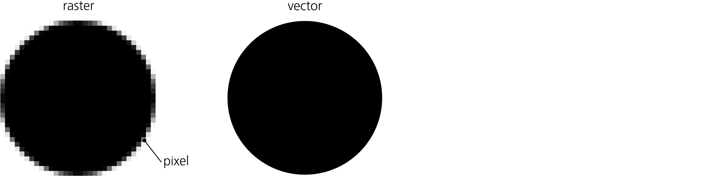
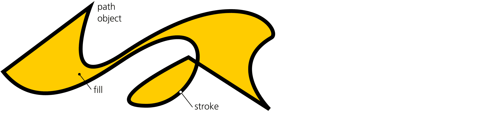

# 第一章：Inkscape 与世界

也许这是你第一次接触矢量图形。也许你之前使用过矢量图形，现在好奇它还能为你做些什么。或者你在尝试过其他矢量编辑应用后，考虑使用 Inkscape，想了解它与其他软件的区别。不论是哪种情况，你可能会发现一些背景信息很有启发性。什么是 SVG？什么是 Inkscape？它来自哪里，未来将走向何方？你可以用它做什么？Inkscape 在计算机图形学的世界中处于什么位置？本章将为这些问题提供最新的答案。

## 1.1 什么是矢量图形，为什么它重要

Inkscape 是一个*矢量图形编辑器*。这意味着什么？

目前大多数存储和处理的图像都是*栅格*图像，也叫*位图*。栅格图像是一种原始的表示方式——只是一个由小矩形区域构成的网格，这些小区域叫做*像素*。对于每个像素，存储的信息只有其颜色，有时还包括其透明度。

例如，如果你有一张位图图像，里面有一个黑色圆形，背景是白色（参见图 1-1，左），实际上图像中并没有*黑色圆形*这样的元素。只有当*你*查看图像时，你才会（或者不会）认为它是一个黑色圆形。计算机对图像的了解仅限于它的一些像素是黑色的，有些是白色的（有的可能是介于黑白之间的灰色）。

图 1-1：位图或栅格形式的圆形（左）与矢量形式的圆形（右）

因此，计算机对于这种图像可以做的事情非常有限，除非有人工指导。它可以将所有白色像素变成蓝色，但不能轻易地移动圆形，因为它并没有*看到*它是一个独立的对象。即使对于人类来说，这个任务也可能很困难，任何使用过 GIMP 或 Photoshop 的人都会证明这一点；你将不得不使用一些不可靠的工具来“选择”圆形——如果圆形的边缘是*抗锯齿*的（即，圆形边缘的一些像素是黑色和白色之间的中间值），这种操作尤其困难，如图 1-1 所示。

所有这些与*矢量图形*不同（参见图 1-1，右）。在矢量格式中，实际的圆形及其属性作为*对象*存储。这意味着它与其他任何对象都是分开的，因此你可以随意处理它。使用这样的图像时，你的计算机可以自动做许多智能操作——例如，它可以删除所有圆形，给所有红色对象涂上绿色，或者将所有黑色圆形的大小缩放到原来的两倍。

不再烦恼像素选择——随时选择任何对象，并按需编辑。这就是 Inkscape 的工作方式，也是它与像 Photoshop 这样的栅格编辑器的主要区别。

让我们来看一下矢量方法的最显著优点：

矢量图像是可缩放的。

*可扩展性*意味着你可以在任何分辨率下查看或导出你的绘图，永远不会看到任何锯齿状、像素化或不必要的模糊。无论大小，所有内容都保持完美清晰。这通常被认为是向量图形的主要优势；在我看来，其他优势同样重要。

向量图像可以随时编辑。

无论你的绘图多么复杂，你都可以随时选择其中的任何对象进行编辑。可以将其想象成一个 Photoshop 文件，其中每一笔画都自动被放置在自己独立的图层上。此外，在位图编辑器中，你最终需要“合并”图像，将所有独立的图层合并起来。相反，向量绘图没有必要——事实上也不可能——将其“合并”（除非导出为位图格式）。

向量图像易于创建和阅读。

向量对象更符合人类视觉感知。当我们看一个场景时，我们倾向于将其在脑海中分割成不同的对象——这正是向量图绘制的方式。这使得向量图形成为一个非常自然的工作媒介。而且，由于许多向量格式（包括 SVG）是基于文本的，因此很容易*手动编写*一个简单的向量图（即使没有任何图形编辑器）或编写脚本来生成或修改这样的图形。

向量图像简洁明了。

由于不需要存储关于每个像素的信息，向量图像通常比对应的位图图像占用更少的字节进行存储和传输。一个很好的副作用是，Inkscape 具有无限的撤销历史，因为每个撤销步骤作为向量时占用的内存远少于作为位图时的内存。

向量图像是无限的。

位图总是具有固定的像素大小——例如，468 x 60 像素。在未压缩的位图中，双倍增加尺寸会使文件大小增加四倍，因为即使额外的像素为空，它们也需要存储。向量图像则不同。向量图像几乎是*无边界的*，通过将对象移动一英寸或一英里来扩展它，在文件大小或计算机内存方面不会产生任何成本。类似地，向量文档在*深度*方面几乎是无限的：你可以随意放大，创建任何数量的微观尺寸对象在任何给定的空间中。（当然，实际上，画布大小和缩放级别是有限制的，但这些限制远远超出了位图编辑器的范围。）

向量图像可以进行动画处理。

由于在向量绘图中，物体是分开存储的，所以可以通过移动或变换它们，改变它们的颜色等等来进行动画处理。自然，一些向量格式，如 SVG 或 Flash，内置了动画功能。Inkscape 目前尚不支持动画 SVG，但在未来版本中可能会有所更改。

向量图像可以是互动的。

你不仅可以动画化对象，还可以让它们具有交互性。一个绘图可以根据用户的操作改变其对象的属性——这使得复杂的用户界面成为可能，比如按钮、链接、拖放等。当然，Inkscape 在这一领域目前的功能有限，但你可以手动编辑在 Inkscape 中创建的 SVG 文件，添加交互性，然后可以在 SVG 查看器中播放。

矢量对象是可重用的。

从一个绘图中选取一个对象，变换或重新设计它而不会失去任何质量，然后再将它插入到另一个绘图中，这是非常容易的。

如果你喜欢数字音乐，你可能会通过将矢量图形类比为 MIDI 声音文件，将光栅图形类比为 WAV 声音录制，来更好地理解矢量/光栅的区别。程序员可能会认为，矢量是图像的“源代码”，而光栅是其“编译后的二进制文件”。

当然，事情不可能总是没有缺点。以下是矢量图形相较于光栅图的两个主要缺点：

格式本质上是有限的。

一种矢量图像格式（就像有许多不同的光栅格式一样）总是将你限制在一定范围内的对象及其属性。格式的新版本发明并引入新的功能，但这只是突显了完美是无法达到的这一事实。矢量格式永远处于“建设中”。

许多图像很难，甚至不可能在矢量形式中精确复制。例如，需要复杂纹理的图像，如人类皮肤、头发或木材，本质上对矢量不友好。矢量世界传统上由精确的形状、平坦的颜色和光滑的渐变组成；如果你想要的是自然纹理，比如噪声、刮痕或污垢，那么在典型的矢量编辑器中渲染这些将会非常困难。

尽管 SVG 的透明度、渐变和滤镜功能使得你可以在 Inkscape 中创建令人惊叹的逼真矢量图像（参见插图 1 中的图）。此外，作为一种更高层次的抽象，任何矢量绘图都可以将光栅图像作为一种特殊类型的对象。这意味着，你总是可以将一张照片插入到 Inkscape 绘图中，并将其与任何矢量对象结合。

矢量格式转换是不可靠的。

出于同样的原因，将图像从一种矢量格式转换为另一种格式从来都不是简单的事情。这些格式的对象类型和功能集总是有所不同，有时差异并不显而易见；格式的不同版本让问题变得更加复杂。例如，SVG 支持模糊效果（17.1），而 PDF 不支持；另一方面，PDF 支持渐变网格（1.5.5），这是 SVG 目前所没有的特性（尽管 Inkscape 在实验性基础上支持它，10.7）。这使得任何形式的矢量转换都变得不那么确定。在最理想的情况下，目标格式无法直接表示的对象将被近似表示——例如，将 SVG 导出为 PDF 时，模糊对象可能会被嵌入的光栅图像替代。在最坏的情况下，格式转换会直接生成一个或多或少破损的图像。

这是 Inkscape 的矢量格式 SVG 如此重要的原因之一。它是一个公认的国际标准，具有丰富且定义明确的功能，因此可以作为矢量图形的共同语言（尽管 Adobe 的 PDF 在这一角色中仍然更为常见）。我们将在本章稍后详细讨论 SVG。

那么，矢量图形中到底存储了什么呢？除了刚刚提到的嵌入的光栅对象外，最常见的矢量对象类型是路径。*路径*只是一个命令序列，例如“画一条直线到某个点”和“画一条平滑的曲线通过若干个点”。这样的命令序列可以有任意多条，这意味着路径可以以任意精度近似任何几何形状或现实世界中的形状。路径可以具有*填充*（在路径所围成的区域内填充颜色）和*描边*（在路径本身上描绘颜色），以及定义路径外观的许多其他属性（图 1-2）。

图 1-2：一个路径对象可以表示任何形状。

还有其他几种对象类型（如文本对象、克隆和组）以及许多其他对象属性（如字体大小、可见性和模糊效果）。许多属性可以应用于所有类型的对象，而其他一些则特定于某些对象类型。一个图形只是各种类型对象的集合；你可以将这些对象放置在你需要的位置，甚至可以将它们放在彼此之上，并且可以使它们部分或完全透明，以便下面的内容能够透过显示。彩色插图中的图 1 展示了一个复杂的 Inkscape 图形示例，该图形大量使用了透明度、渐变和模糊效果来实现逼真感（如果你想全面查看它，可以从 Inkscape 的示例文件夹中加载）。

## 1.2 你能用 Inkscape 做什么？

很多。

方案、图表、示意图。计划和草图。科学插图和数据图表。图标、符号、标志和徽章。纹章、旗帜、交通标志。漫画、卡通、动漫角色、页面布局。土地地图——无论是现实的还是虚构的。各种类型的排版。横幅、传单、海报。网页图形。（广告也是。）书籍封面、贺卡、标题和小插图。儿童涂鸦和惊人的照片现实主义艺术。幻想艺术、粉丝艺术、游戏艺术，以及各种风格和类型的艺术。

本书的目标之一是展示矢量编辑工具在许多任务中的应用范围远超通常所认为的。事实上，与其试图列出所有 Inkscape 适用的用途，不如描述它*不*适合的情况。让我们试着勾画出 Inkscape 的应用边界。

+   许多与照片或其他*现有的光栅图形*相关的任务，例如颜色校正、修饰、格式或大小转换，最好在光栅编辑器中完成，如 GIMP 或 Photoshop。在矢量图像的所有局限性中，这一点是最明显的，因为它区分了两种常见的对比图形工具：矢量图和光栅图。需要注意的是，一些与光栅相关的任务——例如添加标注或标记、在位图背景上绘制形状、遮罩(18.3)，甚至简单的修饰(18.4)——仍然可以在 Inkscape 中很自然地完成。

+   使用*自然媒介工具*进行绘画——那些模拟油画、粉彩、水彩等的工具——最好在专门的光栅工具中完成，如 Krita、Corel Painter、MyPaint 或 ArtRage。更一般而言，这适用于任何艺术形式，其中*颜色表面纹理*是最重要的。尽管如此，如果你更注重形状和颜色，而不是纹理，或者你的艺术看起来只需要平面颜色、渐变和模糊，Inkscape 是“简单绘画”(第十四章)的最佳工具之一。

+   生成*文字丰富的多页文档*，尤其是带有复杂功能的文档，如脚注、索引或目录，通常属于页面布局软件的范畴（如 Scribus 或 Adobe InDesign）或批量格式化工具（如 TEX 或 Apache FOP）。然而，Inkscape 在图形丰富的单页文档中表现得非常好，例如海报或传单。你甚至可以通过将每一页存储为单独的文档或图层来使用它进行一些多页设计（它尚不支持在一个文档内有多个页面）。此外，Inkscape 不支持 CMYK 颜色分离或专色，这限制了它在印刷工作中的实用性。

+   虽然 Inkscape 的 3D Box 工具（11.3）可以用于简单的*三维草图和场景*，但它更适合传统 2D 艺术家使用，帮助他们描绘 3D 对象，而不是为创建 3D 世界的 3D 艺术家设计的工具。换句话说，如果你只需要一幅简单的 3D 场景图，Inkscape 能够帮你获得一个外观精美且几何上正确的结果。然而，如果你需要从不同角度呈现同一场景，或是制作 3D 动画，还是使用真正的 3D 软件（如 Blender、Maya 或 SketchUp 等）更为合适。

+   你可以在 Inkscape 中做一些简单的*CAD*（计算机辅助设计；这个术语通常适用于工程图纸）工作。Inkscape 提供了精确绘制和变换对象的方式，以及大量的对齐、分布和吸附功能。然而，Inkscape 不支持像参数化建模这样的功能，也没有 CAD 元素库（如螺丝或管道），这些都是专业 CAD 工作所必需的。虽然你可以尝试从其他地方借用这些元素，但在大多数情况下，使用专业工具（如 QCAD 或 AutoCAD）仍然是更好的选择。

+   Inkscape 有一个专用的连接器工具，可以用来绘制相当复杂的*图表和流程图*，并自动路由连接器。然而，这个工具有一定的局限性；如果你需要创建许多标准化的图表，可以考虑使用专业工具，如 Visio 或 Dia。

+   一些人成功地使用 Inkscape 进行*演示文稿*。凭借其便捷的对象操作和众多的视觉效果，Inkscape 在你需要制作演示文稿时确实是一个有吸引力的选择。你可以创建并重复使用带有标题和占位符文本的页面模板（3.2）。Inkscape 甚至包括一个独立的 SVG 查看器（Inkview），支持全屏模式和空格键进行“下一页”命令，这通常是展示保存为独立 SVG 文档的演示文稿所需要的全部功能。虽然 PowerPoint 或 OpenOffice.org Impress 等办公演示应用程序仍然有其优势，但一旦你习惯了 Inkscape 的图形功能，这些程序会显得比较笨拙。有些人使用 Inkscape 绘制图形，再用演示文稿应用程序添加文本和制作实际演示文稿。还有一些有用的插件，如 InkSlides（将多层 SVG 转换为多页 PDF）或 JessyInk（将多层 SVG 转换为可在 Firefox 或其他支持 SVG 的浏览器中查看的脚本演示文稿）。

+   Inkscape 的路径效果（13.3）和扩展（第十九章）可以生成许多有趣的图形效果，如林登迈尔系统、随机树、螺旋曲线或条形码。新扩展也很容易编程。然而，如果你需要的是一些复杂的*算法艺术*，例如分形图形，建议使用专业软件，并将结果导入 Inkscape 中。

+   Inkscape 目前尚不支持 SVG *动画*，也无法在 SVG 文档中运行*脚本*（尽管你仍然可以在 Inkscape 中查看和编辑文档的脚本）。因此，虽然你可以用它绘制动画帧、角色和 UI 原型，但你仍需要其他应用程序将这些元素组合成一个可工作的动画或互动应用程序。

这些领域目前虽然还存在模糊不清（并且仍在变化），但它们是矢量图形领域的前沿。一切*在*这些边界内的内容，都是现代矢量编辑器如 Inkscape 的合法领域。需要注意的是，这些限制中的一部分本身就是矢量图形所固有的；而其他一些则只是当前 Inkscape 的局限，可能在未来版本中得到克服。

有趣的是，很多人徘徊在图形领域的外围，却对矢量的核心领域视而不见。因此，他们常常为使用自己喜爱的专业工具来完成错误的通用任务而感到沮丧。比如，Microsoft Office 用户每当需要制作任何类型的图片或布局时都会在 PowerPoint 中挣扎，或者新手在论坛中抱怨在 GIMP 中绘制简单几何形状是多么困难。这些都是矢量盲目的典型例子；不要成为这种疾病的牺牲品！

矢量领域也是许多项目路线图的起点。无论我开始的是哪种项目，以及最终会使用什么软件，我的第一步通常是打开 Inkscape 并开始快速草拟。只有当我遇到上面提到的某些限制时，才会转向更专业的应用程序来完成我的项目。越来越多的时候，我发现自己实际上不需要离开 Inkscape 就能完成我开始的工作。Inkscape 的世界不断扩展。

## 1.3 Inkscape 艺术来源

没有用户社区，工具就是死的，而没有他们可以研究和重用的作品，用户社区也就不存在。如果每次都得从空白页面开始项目，或者根本没有人可以分享你的作品，Inkscape 使用起来就不会那么有趣了。

寻找 SVG 艺术的两个主要原因是*学习*和*重用*。重用很简单；这正是“剪贴画”这一概念的核心所在。你不必从头开始绘制所有内容，而是将其他人创作的元素与自己的作品结合起来（当然前提是这些元素的许可允许这么做）。

在重用他人艺术作品时，只要 Inkscape 能读取源格式，格式本身并不是太重要（附录 B）。你不仅可以使用 SVG，还可以使用 PDF 和 AI 文件作为你设计中的矢量图像来源。PostScript 和 EPS（封装 PostScript）支持较少；你还可以导入 CDR（CorelDRAW）文件。

此外，任何东西都不会阻止你将位图文件导入 Inkscape，并将其用于设计中，或者利用 Inkscape 多功能的位图追踪器（18.5.2）将其转换为矢量路径。

即使你不需要剪贴画，学习也是下载你觉得有趣的 SVG 源文件的一个好理由。与位图不同，矢量图像包含了很多关于它如何创建的信息，而在 Inkscape 中你可以详细查看这些信息。可见区域与对象之间的对应关系、这些对象的类型、它们的属性、分组和层级结构——这些方面在你学习 Inkscape 或 SVG 技术时非常具有指导意义。

与大多数其他矢量工具相比，Inkscape 的文件在网上更容易找到。这并不令人惊讶，因为它的原生格式 SVG 是人类可读的，并且天然适合网页使用（大多数现代浏览器直接支持它）。此外，作为开源软件，Inkscape 推广共享文化，这种文化也延伸到内容方面。网上已经有大量的 SVG 素材（例如，可以在[`images.google.com/`](https://images.google.com/)上搜索*filetype:svg face*)——比起 AI 或 CDR，SVG 的数量要多得多（但仍然远远少于 PDF）。

除了在网上搜索 SVG 内容，你还可以尝试以下资源：

+   [FreeSVG.org](http://FreeSVG.org)和[`www.openclipart.org/`](http://www.openclipart.org/)是两个社区网站，提供大量公共领域的 SVG 格式剪贴画。

+   Wikimedia Commons（[`commons.wikimedia.org/`](http://commons.wikimedia.org/)）包含了成千上万种各种各样的 SVG 图像，其中大多数是用 Inkscape 创建的。

+   官方 Inkscape 论坛（[`inkscape.org/forums/`](https://inkscape.org/forums/)）是 Inkscape 用户互相帮助、分享和讨论创作的地方。DeviantArt、Flickr、Reddit 和其他社交媒体上也有 Inkscape 的相关小组。

+   最后，你并不局限于 SVG——Inkscape 是一个通用的矢量编辑器。只需在线搜索“矢量剪贴画”，你就能找到大量的免费和商业资源；大多数剪贴画将以 EPS、AI 或 PDF 格式提供，而 Inkscape 可以很好地使用这些格式。

## 1.4 SVG 的简短历史

Inkscape 使用 SVG 作为保存矢量文件的格式。什么是 SVG？

SVG（可缩放矢量图形）标准诞生于 1990 年代末 XML 革命的高峰时期。在那个时候，当简单而无限表达力的 XML 吸引了人们时，大家希望为*一切*创建 XML 词汇；矢量图形自然成为一个候选项。1998 年，W3C 成立了一个工作组，W3C 是负责 HTML、CSS、XML 等最常用网页标准的国际联盟。它们的第一次成果——SVG 1.0——于 2001 年发布；最新的官方版本是 1.1，发布于 2003 年。

然而，从那时起，SVG 的发展进展放缓。直到多年后，所有主要浏览器和图形应用程序才开始支持 SVG。经过长期开发的 1.2 版本最终被放弃，转而支持 2.0；截至本文撰写时，SVG 2.0 仍处于草案标准阶段。另一方面，SVG 已经超过了大多数专有竞争者（如 Adobe 的 Flash 或 Microsoft 的 XAML 和 Silverlight），并且已经稳固地成为互联网的默认矢量格式，并开始进入传统设计和出版领域。归根结底，开放性确实具有一定的价值！

源自矢量格式的漫长而复杂的历史，SVG 从一开始就努力做到正确的方式。受 PostScript 和 PDF 启发（1.5.1.1），它的设计旨在摆脱这些格式的限制。SVG 原生支持透明度、渐变、文本的 Unicode 编码以及许多其他在 21 世纪被视为理所当然的便利功能。它还添加了独特的滤镜效果（第十七章），这些效果本质上是栅格操作（如模糊），可以应用于对象而不失去矢量可编辑性和分辨率独立性。

就像曾经无处不在的 Flash 一样，SVG 也包含了相当全面的动画功能。仍在开发中的 2.0 版本添加了更多新功能，如自动换行（流式文本）、矢量效果、WOFF 字体等。

所有现代浏览器都在某种程度上（通常是足够的程度）支持 SVG。这意味着你可以像加载 JPG 或 HTML 文件一样将几乎任何 Inkscape SVG 文件加载到浏览器中，浏览器会准确显示它在 Inkscape 中的样子。

SVG 是一个庞大而复杂的标准，大多数现有软件仅提供有限的支持，Inkscape 也不例外。最显著的是，它无法进行 SVG 动画或脚本编写。还有一些较小的 SVG 特性也缺失；例如，对资源的引用（如渐变或符号）仅在同一文档内有效。Inkscape 项目的目标之一是最终支持所有 SVG 特性。

当你保存一个 Inkscape 文档时，你可以选择两种 SVG 格式：*纯 SVG* 和 *Inkscape SVG*。纯 SVG 就是纯粹的 SVG 1.1 代码，仅此而已。然而，Inkscape SVG 会在 Inkscape 的私有命名空间中添加相当多的元素和属性。

不必害怕 Inkscape 的 SVG！它是完全有效且符合标准的 SVG；这些额外的元素和属性的目的是提供 Inkscape 特有的关于 SVG 对象的元数据*关于*这些 SVG 对象，而不是添加一些 Inkscape 自有的不兼容对象。Inkscape 扩展可能会影响你在 Inkscape 中编辑对象时它们的*行为*，但从不影响文档的*渲染*。不过，参考 15.2.2 中的遗留例外。因此，Inkscape SVG 和普通 SVG 版本的同一文件在任何兼容的 SVG 渲染器中看起来完全一样。使用普通 SVG 的唯一理由可能是为了减少文件大小或生成更适合 SVG 专家手动编辑的文档。

Inkscape 还可以将文件保存为*压缩 SVG*（包括普通的和 Inkscape 版本）。压缩文件的扩展名为 *.svgz*；与 SVG 不同，它们不可读，但占用的磁盘空间要小得多。大多数程序都会像读取 SVG 文件一样轻松读取 SVGZ 文件。

## 1.5 Inkscape 与它的竞争者

当然，Inkscape 远不是唯一的选择。曾经和现在仍然存在着数十款矢量编辑器：有商业的，也有开源的，有针对不同平台的，有通用的，也有专业化的，活跃的和已停止开发的。有一些是值得在这里提到的。

在本书的第一版（2009 年）时，Inkscape 所面临的所有严重竞争者都是商业性的（且通常价格不菲）桌面应用程序，适用于 Windows 和 Mac。现在，在线编辑器带来了重要的新竞争，其中一些是部分或完全免费的（1.5.4）；像我们生活中的几乎所有其他事情一样，矢量编辑也已经进入了在线和云端。（此外，这些新加入的工具通常并不强调它们是*矢量*编辑器，尽管它们本质上就是；它们只是“普通”的图形和设计工具。）然而，Inkscape 强大的原始功能、广泛的生态系统、零成本以及跨平台的可用性，依然使它保持着显著的竞争优势。

### 1.5.1 Adobe Illustrator

Adobe Illustrator 在这个列表中毫无疑问占据了第一的位置。虽然它已有些年头，但一直在不断发展，是一款功能强大、特性丰富的应用程序，通常被认为是该领域的领军者，也是矢量图形的事实标准。即使你不使用 Illustrator，你也很可能会遇到它的功能和版本介绍，其他程序与它的对比，当然，还有以 AI 创建的各种格式的矢量文件（包括 SVG）。

毫无疑问，Illustrator 的影响力很大程度上来源于它那位更为知名的“表亲”——Adobe Photoshop。作为同一创意套件的一部分，Photoshop 和 Illustrator 共享许多用户界面特征，并且经过优化，能够更好地协同工作。然而，与 Photoshop 相比，Illustrator 在其领域的地位幸运地并非垄断性。即使没有 Inkscape，它依然面临着非常强劲的竞争，尽管 AI 的影响力稳步增长。

Illustrator 起源于 1980 年代末，拥有悠久而曲折的历史。它并非一直都是矢量图形领域的主导者。许多功能最初是在竞争软件中开创的，有些甚至是在多年后才被重新实现到 AI 中。然而，如今它已经变得如此庞大——每个版本都在不断增长，尤其是当你考虑到 Adobe 的其他 Creative Suite 以及整个第三方 AI 插件行业时——因此任何概括都充满风险。对很多人来说，Illustrator 是多种多样的。

但我认为我可以冒险做出这样的概括：无论其功能如何，很少有人会称赞 Illustrator 的用户界面是可用性的典范。批评者（显然大多是竞争软件的用户）指出，界面杂乱无章，浮动对话框成群，工具过多且功能过于狭窄，无法在画布上直接编辑对象属性，以及缺乏上下文信息。竞争编辑器也常声称在速度上超过 AI。

#### 1.5.1.1 Adobe 的矢量格式

与 Illustrator 以及 Adobe 相关的矢量格式在现代数字世界中发挥着至关重要的作用。即使你不打算在 Inkscape 中使用除 SVG 外的任何格式，了解 PostScript 和 PDF 的概念、它们之间的关系以及它们的功能也是非常有用的。

Adobe 在 1984 年的第一个重要成就，就是创造了所有矢量图形格式的祖先：*PostScript*。PostScript 被设计为一种发送数据到打印机的标准，它恰好在 1980 年代，由于个人电脑和激光打印机的普及，参与了“桌面出版革命”的关键时刻。

PostScript 是一种相当不寻常的格式，因为它不仅仅是一个数据格式，而是一个完整的*编程语言*。PostScript 文件实际上是一个程序，打印机或计算机必须运行它才能获得图像。例如，它可能包含一条指令来打印一行文本，例如 "I must not disrupt the class"，并且有一个循环会重复打印这一行一百次。不幸的是，这也意味着由于程序中的错误或某人的恶意意图，PostScript 程序可能会无限运行，耗尽系统资源。

从积极的一面来看，PostScript 的解释器占用的内存很少，因此可以嵌入到当时的硬件中。因此，它很快在打印机制造商中流行开来，并成为发送文件进行打印的事实标准。

它还被用作第一版 Adobe Illustrator 原生文件格式的基础，该版本大约在那个时候问世。尽管随着每个版本的发布，AI 文件格式发生了许多变化，但长时间内其基础始终保持不变：AI 文件只是遵循某些约定并使用 Adobe 的 PS 函数库的 PostScript 文件。

对于 Illustrator 用户来说，不幸的是，PostScript 作为一个高度优化的打印机语言的优先级，与其成为通用矢量图形媒介的目标并不容易平衡。例如，PostScript 的 Level 2（1991 年）增加了设备无关的 CMYK 颜色，但直到 Level 3（1997 年），基本的渐变才得以直接实现。（直到 PS 3，想要在 PostScript 中创建渐变的应用程序必须通过叠加许多狭窄的逐渐变化的色条来“伪造”渐变。）即使是最新版本的 PostScript，也没有足够的演进来原生支持透明度。

这无疑是早期版本的 Illustrator 很难快速获得用户需求的新特性（而竞争对手的矢量编辑器已经提供这些特性）原因之一。直到今天，Illustrator 的用户界面仍然保留着基于 PostScript 功能集构建的痕迹，其他所有功能似乎都是事后添加的。

然而，PostScript 最大的问题并非其功能限制。随着时间的推移，作为编程语言的特点变得愈加沉重。曾经（在 1980 年代末）是一种巧妙的黑客技术，现在却越来越显得繁琐且危险。由于任何 PostScript 文件都是一个程序，你根本无法知道该文件究竟会显示什么，除非 *运行* 这个程序。这意味着你需要一个完整的 PostScript 解释器才能进行最简单的 PostScript 文件处理；你甚至无法直接将两个 PostScript 文件合并为一个文档并获得可预测的结果。

Adobe 试图通过对 PostScript 文件施加各种限制来纠正这一问题。其中一个限制就是 *封装 PostScript (EPS)* 格式。EPS 文件只是一个可以可靠地插入到其他文档中的单页 PostScript 文档。然而，显然这还远远不够。

所以在 1993 年，Adobe 采取了更为激烈的措施。它推出了 *便携文档格式 (PDF)*，尽管基于 PostScript，但抛弃了作为编程语言的概念。最初，PDF 只是简化的 PS，以声明式的方式重写，并增加了压缩和一些顶层的文档管理功能。后来，Adobe 将 PDF 发展得远远超出了 PostScript 所能提供的功能；例如，PDF 版本 1.4（2001 年）中就加入了透明度功能。

尽管 PDF 的既定目标是互联网文档交换，但它的普及度逐渐提高，最终在印刷和设计领域也占据了一席之地。PDF 是开放格式、由 ISO 标准化且任何人都可以实施的事实也帮助了它的传播。到现在为止，PDF 已在大多数商业应用中取代了 PostScript，包括印刷领域。

对我们讨论更为重要的是，从 9.0 版（2000 年）开始，Adobe Illustrator 将其原生的 AI 文件格式从基于 PostScript 转为基于 PDF 的格式。这意味着任何在现代版本的 Adobe Illustrator 中保存的 AI 文件，实际上都是 PDF 格式，可以被任何支持 PDF 的软件查看和导入。Inkscape 的 AI 导入器实际上与其 PDF 导入器是一样的。

总结来说，在目前的情况下，如果可以使用 PDF，使用 PostScript 或 EPS 就没有意义了。Inkscape 可以导入 PS 和 EPS 文件，但需要先将它们转换为 PDF，这要求你的系统中安装免费的跨平台软件包 Ghostscript (B.4)。从 Inkscape 导出 PDF 格式的结果比导出 PostScript 格式的效果更好。

### 1.5.2 CorelDRAW

Illustrator 的最大竞争对手之一是 CorelDRAW。像 Illustrator 一样，它是一个大型的、功能齐全的应用程序，并且是一个图形应用套件的一部分。然而，它们的相似之处到此为止。

CorelDRAW 一直以来将自己定位为“为我们这些普通人”设计的矢量编辑器。它的价格低于 Illustrator 或 Freehand（早期 1990 年代 Illustrator 的主要竞争者，现已被 Adobe 收购并停产），CorelDRAW 强调易用性，并且在 1990 年代大大拓展了矢量编辑工具的用户群体。在一些国家和社区中，它曾经比 Illustrator 更受欢迎，直到现在依然如此。

CorelDRAW 首创了一些有价值的 UI 概念，这些概念被传承到许多其他应用程序中，包括 Inkscape。例如，首次出现在 CorelDRAW 中的单一选择工具，可以进行各种选择和变换（点击选择、移动和缩放，再点击一次可以进行旋转和倾斜）；而 Illustrator 和 Freehand 则分别有“选择”、“缩放”和“旋转”工具。

它还引入了将形状（如矩形或椭圆）作为独立对象类型的概念，路径编辑工具在这些形状上的表现不同于在普通路径上的表现。长期以来，Illustrator 没有形状的概念；它有一个工具来*绘制*矩形，但任何新绘制的矩形都会变成一个矩形路径，没有矩形特定的可编辑属性。

### 1.5.3 Xara

Xara（其当前版本名为 Xara Designer Pro）一直是矢量编辑器竞争中的一个小角色，但它具有重要的历史意义。它是第一个具有完整屏幕抗锯齿、画布上的渐变编辑与方便的控制手柄、便捷的透明度支持、以及根据当前工具提供上下文相关控制面板的矢量编辑器。此外，Xara 一直以来都非常快速，这在 1990 年代和 2000 年代的硬件环境中尤其重要。

总体来说，Xara 遵循了 CorelDRAW 的 UI 范式，但在此基础上进行了很大的改进。长期以来，Xara 维持着一个相当庞大且非常忠实的用户群体。难怪 Inkscape 借鉴了 Xara 的许多想法和方法。然而，随着时间的推移，Xara 的创新逐渐消退，而其竞争对手则逐步迎头赶上；到 2000 年代中期，大多数人认为 Xara 只是一个“不错的小应用”——非常稳固和易用，但稍显过时。

2005 年，Xara 有限公司将其矢量图形编辑器发布为开源并移植到 Linux，名为 Xara LX。这样做的原因之一是 Inkscape 的快速发展——尽管 Inkscape 比 Xara 年轻，但它已经拥有一些独特的功能。另一方面，Inkscape 的开发者一直将 Xara 视为其榜样，Xara 凭借一致的界面设计和出色的可用性成为了 Inkscape 的模范。显然，Xara 希望借助开源人才来振兴其产品。

然而，在最初的一段时间后，Xara LX 未能吸引到开源开发者的重大关注，主要是因为 Xara 有限公司拒绝开源其一项关键代码——渲染器。现在，Xara LX 已经到了 0.7 版本，仍然可以使用，但其开发已经停滞。

### 1.5.4 在线编辑器 [1.1]

一类自本书第一版以来已经成熟的矢量编辑器是在线矢量编辑器——这些编辑器在你的浏览器中运行，不需要在计算机上安装任何软件。这类在线工具自然在性能和功能上受限，相比桌面应用程序有所欠缺。与此同时，许多用户甚至不需要那么强大的功能：他们只需要一个快速的草图、草案或模型，比如一张照片加上一些文字和简单的形状。对于这些用户来说，在线编辑器的便利性非常有吸引力。

尤其是在这种在线编辑器属于提供打印或其他设计服务的公司时，情况尤为如此。每当你希望客户提交他们的设计时，给他们提供一个即便是原始的在线编辑器也比强迫他们使用一款复杂的软件要好得多——大多数情况下，他们对这种软件几乎没有需求（即便这个软件是免费的，比如 Inkscape）。那些觉得在线编辑器功能受限的用户，仍然可以通过将复杂的离线设计上传为位图来使用它们。

最具能力的在线编辑器之一是 Canva。它确实提供打印服务，但你也可以将你在 Canva 上制作的设计下载为位图或 PDF 文件（但不能是 SVG 文件），然后随意使用。Canva 的吸引力不在于其编辑器本身（虽然它足够用），而在于其在线社区以及它提供的丰富字体、图形和可重用模板。另一个不错的在线编辑器（支持 SVG 导出）是 Gravit；它和 Canva 一样，都提供免费的基础版在线编辑器，但对具有附加功能的高级版收费。

在开源方面，一些项目提供了可嵌入的矢量编辑器库，你可以将其添加到你的网站上。两个著名的项目是 SVG-Edit 和 Fabric.js，它们都原生支持 SVG。使用这样的库需要扎实的 JavaScript 编程技能，但在自己的网站上拥有一个不错的简单图形编辑器，可能值得为此付出的努力。

### 1.5.5 . . . 和 Inkscape

与商业竞争对手相比，Inkscape 在几个方面仍然得分较低，如渲染性能和对先进打印技术的支持。另一方面，Inkscape 拥有一些在其领域几乎独一无二的创新编辑功能，例如克隆拼接器（16.6）、3D 立方体工具（11.3）、路径效果（第十二章）以及 Tweak 工具的部分功能（8.9）。

Inkscape 中某些功能尚未实现的最明显原因是它们在 SVG 中缺失。例如，Inkscape 实现了 SVG 的线性和椭圆渐变（10.1），甚至还有渐变网格（10.7）——但它缺少其他类型的渐变，例如 Xara 支持的圆锥渐变。多页文档也是如此：目前 SVG 标准中并未提供此功能（虽然你可以通过图层在某种程度上模拟页面）。

另一方面，SVG 的限制仅影响 Inkscape 能够处理的对象或属性类型。在处理这些对象以及将它们组合成更高级别对象的方式上，Inkscape 完全可以自由创新——并且它很好地利用了这种自由。

在界面和可用性方面，Inkscape 通常被认为容易学习和使用。Inkscape 的用户界面与 Xara 相当，实际上非常相似。有些功能在这两个程序中做得更加便捷，但这两个程序都拥有一个不干扰、简洁的界面，并提供了很多易于访问的强大功能。

作为一个真正的开源应用，Inkscape 的代码大多由极客编写，而极客的兴趣和优先事项通常与商业开发者不同。首先，极客讨厌简化的界面，喜欢强大的控制和无限的调整。他们尤其欣赏丰富的键盘控制，而 Inkscape 拥有前所未有的键盘快捷键，涵盖了大部分模式、工具、命令和功能（3.4）。

与功能或可用性同样重要的是应用程序的稳定性和速度。Inkscape 的发布版本偶尔可能会崩溃或冻结（请经常保存！），但通常情况下，其稳定性对大多数用户来说不是问题。速度曾经是旧版本程序的主要抱怨——但最近，随着多线程渲染器的引入，Inkscape 的显示速度已经大大提高。

## 1.6 开源应用的生命周期

从关于 Inkscape 竞争的讨论中可以看出，对于一个严肃的矢量编辑器来说，成为一个开源应用是相当不寻常的。是什么让 Inkscape 在其他开源尝试（且失败的尝试众多）中脱颖而出呢？让我们简要回顾一下 Inkscape 的历史。

Inkscape 的故事几乎与 SVG 的故事几乎同时开始，尽管那时的第一段代码还没有被称为 Inkscape。它叫做*Gill*，是由一个人，Raph Levien，在 1999 年初为 W3C 讨论中的新矢量格式开发的一个简单查看器和编辑器。这是一个典型的单人项目，最终也命运多舛——它的作者很快就失去了兴趣。

但是，Gill 代码是开源的，另一位开发者接手了这个项目的开发。Lauris Kaplinski 将项目重命名为*Sodipodi*，并为其设定了一个更为雄心勃勃的目标：开发一个真正的矢量编辑器，具备这个类别的大部分功能，用户界面主要模仿 CorelDRAW，但也受到了知名开源位图编辑器 GIMP 的影响。

Sodipodi 的第一次发布是 Lauris 单独完成的，吸引的关注不多。然而到了 2002 年，越来越多的人开始发现 Sodipodi，其他开发者的补丁也开始涌入。然而 Lauris 依然是唯一的维护者；他决定哪些补丁会被采纳，以及何时发布新版本。除了他之外，很少有人有权限提交项目代码。

Lauris 在 Sodipodi 上做了大量工作；直到今天，Inkscape 的大量代码仍然保留着他的版权。然而，随着时间的推移，他独裁的项目管理方式逐渐成为障碍。长时间忽视补丁以及在开发方向上发生的分歧，带来了不健康的局面。

2003 年 10 月，事情达到了一个转折点。一群不满的开发者，在与 Lauris 无法达成共识后，宣布了一个分支。他们拿到了最新的 Sodipodi 代码库，添加了他们的补丁，并为这个新项目取了个酷名字：Inkscape。（如果你在想为什么可以合法地拿别人的版权代码进行修改和重命名，阅读你手中 Inkscape 副本中的通用公共许可证（文件 *COPYING*）即可。）短暂的一段时间内，Inkscape 和 Sodipodi 是并行开发的，但母项目很快就进入了休眠状态，无法跟上其充满活力的后继者。

与 Sodipodi 相比，Inkscape 项目非常开放。没有一个人拥有决定事物做法的至高无上的权利。要获得完全的开发者权限，包括直接提交代码到代码库的权限，你只需要提交两个成功的补丁。尤其是在 Inkscape 的早期，几乎没有进行任何讨论；如果某人对程序的某个方面表现出积极兴趣，其他人通常会认为那个人知道自己在做什么，并不会干涉。

随着时间的推移，许多指导原则逐渐浮现，现在如果某个贡献与开发者对事物运作方式的看法相悖，它被拒绝的情况并不罕见。然而，仍然没有一个顶级的权威人物；一切都由讨论和共识决定。这意味着任何对说服他人充满热情且能高效编程的人，仍然有很大的机会影响项目的整体方向。

在这个项目的指导原则中，有一个简单的规则：*倾听用户的声音*。这听起来是常识，但令人惊讶的是，许多软件项目，无论是商业项目还是开源项目，实际上都没有遵循这一点。在 Inkscape 中，这一点尤其有帮助，因为许多开发者本身就是该程序的活跃用户。此外，在早期，Inkscape 必须争取 Sodipodi 的用户支持才能生存下来——但在 Sodipodi 停止成为竞争对手之后，重视用户反馈的传统仍然得以延续（尽管 Inkscape 并不缺乏其他竞争对手）。

项目的另一个规则是 *先补丁，后讨论*。也就是说，如果你有一个想法并且能编写代码，别试图说服别人来实现它；自己动手做，看看其他人在程序中实际使用后给出的反馈。如果效果不错，其他开发者会帮你把它完善。（如果不好，你只需撤回即可。）

"先补丁"规则的一个结果是开发版本必须始终可用；任何回退都要尽早发现并修复。一群热心的用户每天都会下载最新的代码并进行测试，远在正式版本发布之前。开发者鼓励这种持续的测试，并通过每天为所有主要平台提供新的编译二进制文件来便利这一过程。结果是项目稳步增长——如今它被广泛认为是最重要的开源项目之一，并且在其软件领域中是一个强有力的竞争者。
