# 第二章：Inkscape 入门指南

如果你之前没有使用过 Inkscape，也几乎没有使用过其他矢量编辑器的经验，那么这一章适合你。这是你迈入新世界的第一步。如果你已经尝试过在 Inkscape 中工作，并且觉得自己可以独立重建本章的最终示例（图 2-26），那么可以直接跳到下一章。

## 2.1 安装 Inkscape

在安装 Inkscape 之前，首先要问自己一个问题，那就是你想要一个*稳定版本*还是*开发版本*。稳定版本已经正式发布，并且有版本号与之对应。称一个版本为稳定版本并不意味着它完美无缺、永远不会崩溃；它只是意味着这个版本已经经过了相当的测试，文档也更为完整，并且是大多数人使用的版本。实际上，除了稳定性，运行稳定版本的最大优势是其他用户也在使用这个版本，因此其他 Inkscape 用户更有可能帮助你。

总体而言，我建议你从稳定版本开始，但如果你发现自己喜欢 Inkscape，并希望支持它的开发，或者你需要使用自上次发布以来新增的功能，可以考虑升级到开发版本（访问下一个版本的发布说明，网址为 [`wiki.inkscape.org/`](http://wiki.inkscape.org/)，查看正在开发的功能）。

使用*开发版本*有其独特的优势。首先，这些版本拥有所有最新和最好的功能，与稳定版本相比，这些新特性可能具有重要意义（尤其是当稳定版本已经发布了几个月时）。这些新功能通常包括修复稳定版本中的重要漏洞。此外，通过运行开发版本，你也在帮助开发社区发现并解决新的 bug。自然，活跃的开发者更倾向于使用开发版本，因此你更有可能直接从开发者那里获得及时的帮助。

那么稳定性如何呢？确实，开发版本通常会有更多的 bug，并且崩溃的频率也较高。然而，如果你遇到了让你抓狂的新 bug——而且这个 bug 没有得到及时修复——你可以随时回到最新的稳定版本，避免这个 bug。（无论使用哪个版本，都记得常常保存文件！）

在 Inkscape 网站上（[`inkscape.org/`](https://inkscape.org/)），从菜单中选择**下载**，并选择当前的（稳定）版本或最新的开发版本。然后，选择适合你操作系统的版本。

Windows

你可以选择 *.exe* 或 *.msi* 格式的安装程序。对于 *.exe*，只需运行它；对于 *.msi*，右键点击并选择**安装**。然后按照提示选择语言、文件夹以及其他选项。最后，你会在桌面和开始菜单中看到一个可点击的 Inkscape 图标。你也可以从 Windows 应用商店下载 Inkscape。

Linux

这里有几个选项。如果你只需要一个稳定版本，大多数 Linux 发行版已经包含了一个；只需在你的软件安装应用程序中选择它（例如，在 Ubuntu 上，启动 Ubuntu 软件中心或直接从命令行运行 `apt-get install inkscape`）。

但是，这个版本可能比较旧。如果你想要更新的稳定版本或最新的开发版本，Inkscape.org 提供了许多可下载的软件包，可以与 Linux 软件包管理器一起使用。

macOS

对于 Mac，你将下载一个磁盘映像 (*.dmg*) 文件。你也可以通过 MacPorts 安装 Inkscape。

新的开发版本会相当定期地发布，通常是每天。但是，如果你想要绝对最新的 Inkscape，你可以从 GitLab 获取最新的 Inkscape 代码并编译它（通常在 Linux 上设置开发比在 Windows 或 Mac 上更容易）。这需要高于平均水平的计算机知识，因此我们在此不作讨论。

## 2.2 Inkscape 的“Hello, World!”

学习一门新的编程语言通常从“Hello, World!”示例开始。这是一个最小但真实且可工作的程序，它只是在某个地方输出字符串“Hello, World!”，然后退出。我现在将向你展示一个最小但真实的 Inkscape 编辑会话，其中包括启动程序、创建一些对象、编辑它们以及保存结果。

启动 Inkscape 与启动任何其他程序没有什么不同。根据你的操作系统和个人偏好，你可以单击图标，从菜单中选择它，或者在命令行中键入 `inkscape`。

首次运行时，Inkscape 首先显示一个有用的欢迎对话框（图 2-1）。它的第一个选项卡“快速设置”允许你调整程序的外观和行为：UI 和图标的主题（所有主题都包含一个深色变体）、活动的键盘快捷键集以及画布的外观。在此对话框的“开始绘图”选项卡上，你可以选择最近编辑的文档（如果有）或新的文档模板之一，这些模板分为“打印”、“屏幕”、“视频”、“社交”和“其他”(3.2)。同样在此选项卡上，你可以取消选中“每次都显示此对话框”以避免将来看到该对话框。

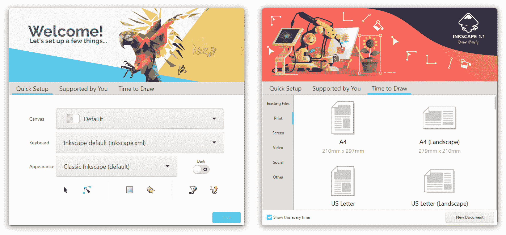

图 2-1：Inkscape 欢迎你。

在关闭欢迎对话框（通过选择文档或按 Esc 键）后，Inkscape 会打开其主编辑窗口。图 2-2 显示了默认的 Inkscape 界面。

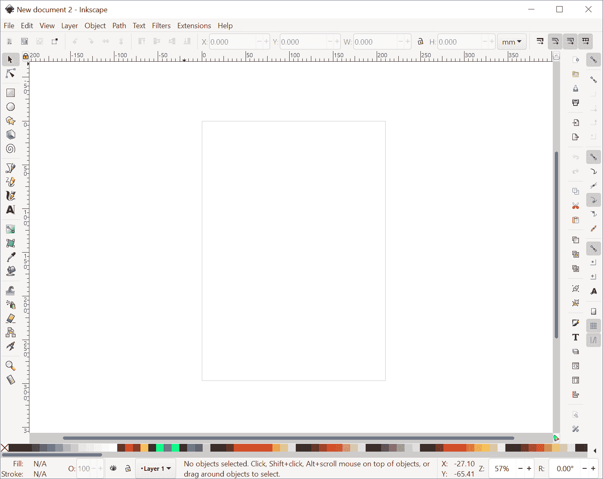

图 2-2：Inkscape 的第一印象

Inkscape 的窗口在中间显示一个白色的工作区域，称为*画布*，并在边缘显示许多工具和控件。画布包含 Inkscape 为你创建的新的空文档，因此你无需选择“文件 ▶ 新建”。你可以立即开始处理它。

在左侧的图标列中，点击带有蓝色方块的图标。这是矩形工具，可以让你创建和编辑矩形。现在，点击画布上的任何位置并拖动（如果使用平板，点击并拖动）。一个蓝色矩形将出现；当你松开鼠标时，矩形将作为文档中的新*对象*创建（图 2-3）。

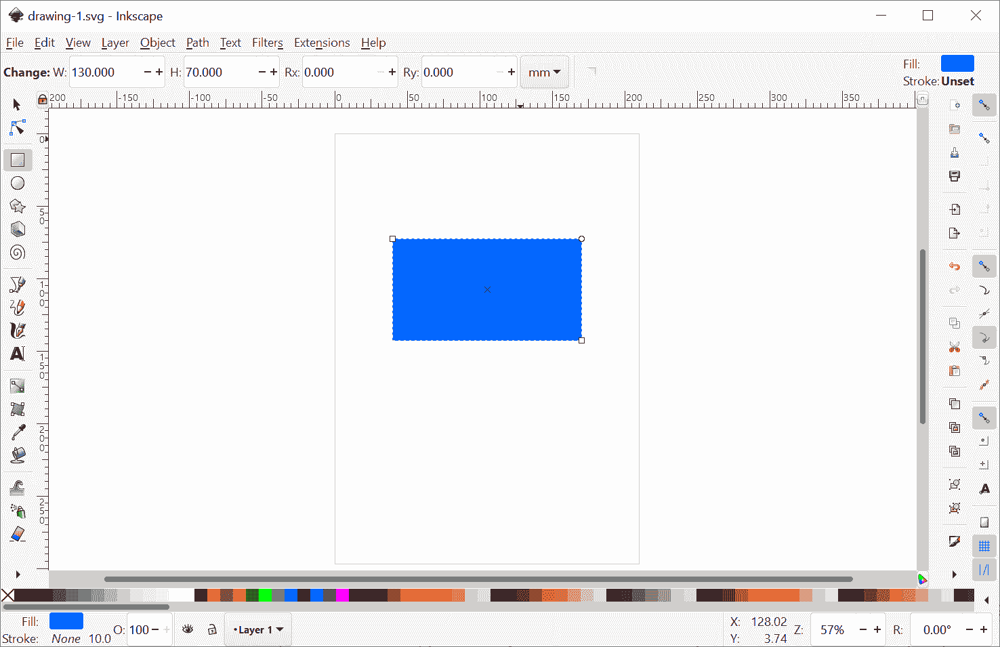

图 2-3：我们创建了一个矩形。

现在，点击左侧的**A**按钮，这将切换到文本工具。点击（但不要拖动）矩形内部。你会看到一个文本光标在你点击的位置闪烁。输入`**Hello, World!**`。你刚刚创建了一个文本对象，它是文档中的第二个对象（图 2-4）。

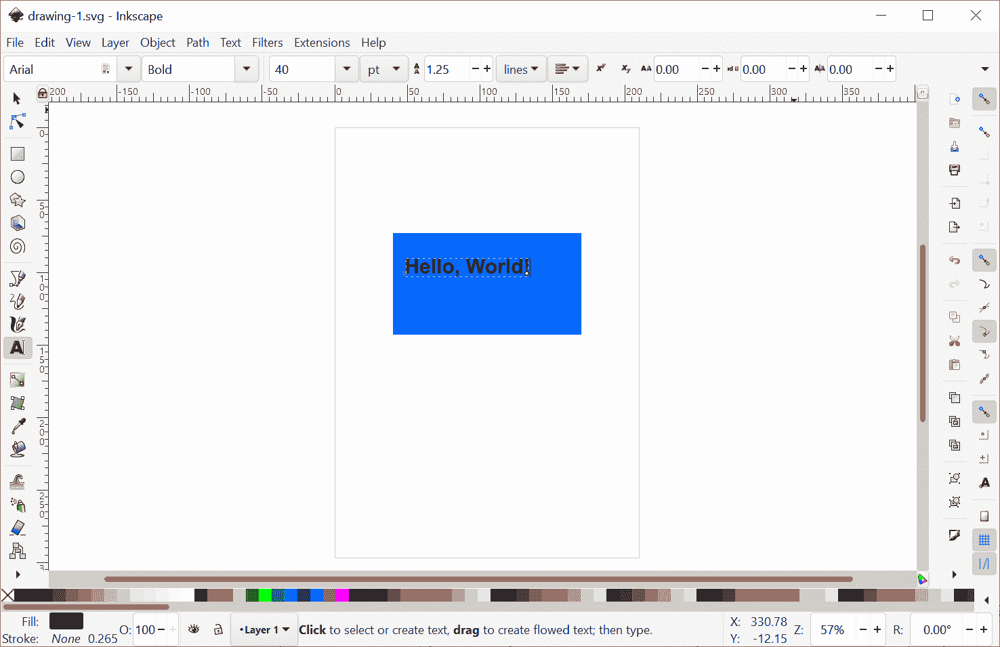

图 2-4：我们添加了一些文本。

现在，你可能对对象的大小、位置或颜色有了更清晰的想法。轻松解决！在左侧工具栏中，点击最上面的按钮（一个箭头）。这是选择工具。现在你可以通过鼠标拖动将任何对象移动到画布上的任何位置。要改变对象的颜色，只需从窗口底部的调色板中拖动该颜色，并将其放到对象上。

足够的调整。文档看起来完美。唯一的问题是它还没有保存到文件。只需选择**文件 ▶ 保存**，导航到你选择的文件夹，并输入文件名。就这样。你刚刚创建了一个包含图形和文本的新 SVG 文档。恭喜！

## 2.3 界面概览

让我们更仔细地看一下 Inkscape 的界面（图 2-5）。

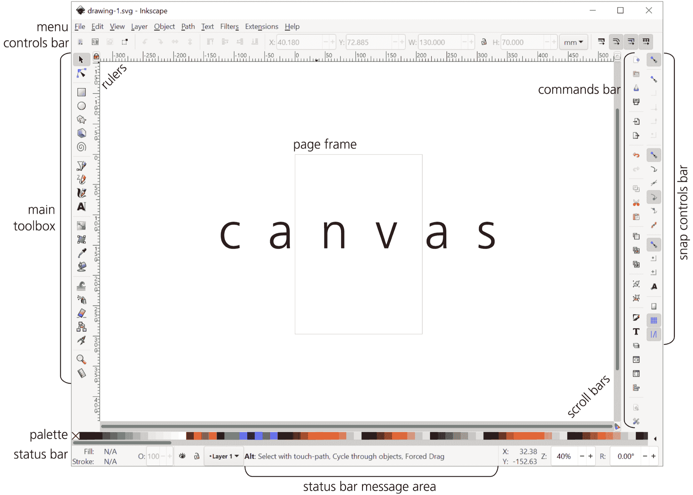

图 2-5：Inkscape 界面的元素

通常最好最大化 Inkscape 的窗口。如果你需要更多的工作空间，可以按 F11 切换到全屏模式。

窗口的大部分区域被*画布*占据，四周被标尺（上方和左侧）和滚动条（底部和右侧）包围。在画布上，你可以看到一个矩形页面（默认 A4 纸大小）带有阴影。这个*页面框架*定义了文档的边缘。然而，Inkscape 允许你在画布上和画布外的任何地方自由绘制——页面框架并不是限制，只是一个提示。只有在将文件导出为某些矢量格式时，或在外部查看器中查看 SVG 文件时，这个框架才有意义；在这两种情况下，你将只能看到与页面矩形重叠的对象。如果你不关心它，可以隐藏页面框架。

你看到的画布部分远远不代表画布的全部。事实上，画布非常大，几乎是无限的。你可以通过缩小或在任何方向上滚动来查看更多内容，如下一节所示。在 Inkscape 中，你永远不会没有空间！（事实上，你甚至可能会迷失在这片广阔的画布中；如果想返回页面框架，随时按下 5 键即可。）

画布左侧是*主工具箱*（垂直）。此工具箱上的按钮可以激活各种 Inkscape 工具。每个工具都有其特定的用途、功能、控制、键盘快捷键、鼠标光标及其他相关内容。有些工具用于创建新对象，有些用于以不同方式编辑对象，其他工具则帮助你在文档中导航。本章中我们将简要介绍一些工具，并在接下来的章节中详细探讨它们。

画布上方是一个水平工具栏，称为*工具控制栏*（或简略为*控制栏*）。顾名思义，它包含了当前选择的工具的各种选项和控制。点击左侧的一些工具按钮，观察控制栏的内容发生变化。

Inkscape 窗口顶部是一个标准菜单栏：文件、编辑、视图等。整个书中，我们会多次提到这些菜单中的命令和子菜单（例如，编辑 ▶ 克隆 ▶ 解除克隆）。要搜索菜单，按下 ? 键以打开*命令面板*。开始输入以过滤所有当前可用命令的列表，或者按下搜索框中的上箭头以访问你的命令历史记录（图 2-6）。

图 2-6：菜单和命令面板（在你按下 ? 后）

在右侧，有两个垂直工具栏。*命令栏*是一个常见的工具栏类型，你可以在许多程序中找到它。它有用于执行保存、打开、撤销等操作的按钮。另一个工具栏，位于更右侧，是对齐控制栏，在这里你可以查看并切换多种对齐选项（7.3）。

在画布下方，有一个*颜色调色板*；它可以通过自己的滚动条进行水平滚动。在更下方，有一个*状态栏*，里面包含许多组件，我们稍后会详细探讨。现在，请注意状态栏中的*消息区域*，它始终显示与你当前操作相关的消息。请留意这些消息，它们可能会为你节省大量时间并避免挫折！

最后，Inkscape 有一组*对话框*，每个对话框专门用于特定任务。你可以将对话框放在浮动窗口中，或放在画布左右两侧的两个静态*停靠区*（最初为空）中（图 2-7）。

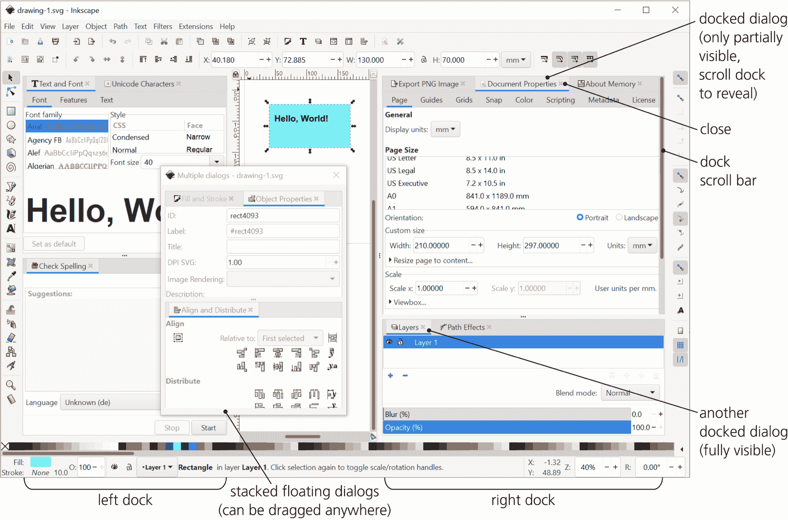

图 2-7：多个对话框在静态停靠区和浮动窗口中的显示

在每个窗口或停靠区内，窗口可以作为标签叠加显示，或者垂直堆叠。只需拖动每个对话框的标题标签，将其放置到所需的位置（一个绿色框架会出现，指示你可以放置对话框的位置）。要将对话框从停靠区移到独立的静态窗口中，右键点击它的标题并选择**移动标签到新窗口**，或者将其拖离 Inkscape 窗口。Inkscape 会记住并恢复每个对话框上次可见时的位置和大小。

若要显示或隐藏界面中的任何元素（菜单、画布和停靠窗口除外），可以使用**查看 ▶ 显示/隐藏**子菜单中的命令。对于对话框，无论是停靠还是浮动，都可以方便地按 F12 键来隐藏或重新显示所有当前活动的对话框。

## 2.4 平移和缩放

在一个无限的矢量画布上，能够移动画布以及缩放以便获得更便捷的视图的工具非常重要。Inkscape 提供了多种平移（滚动）和缩放方式——足以满足各种需求。

当然，画布的滚动条也可以正常工作以滚动画布——但它们并不是特别方便，所以我通常通过按 Ctrl-B 将它们隐藏。相反，我最常用的是*中键拖动*。按下鼠标中键并在画布上任何位置拖动，可以向任何方向平移画布。中键拖动在任何工具或模式下都能工作。

然而，我的右手经常在键盘上，而不是在鼠标上。在这种情况下，滚动画布最简单的方法是按 Ctrl+方向键。例如，如果按住 Ctrl-↑，画布会开始向下滚动（也就是说，你的视图开始向上移动），一开始较慢，但会逐渐加速。当你熟练掌握后，这种操作感觉非常自然。

放大和缩小也很容易。使用键盘，只需按加号 + 或减号 – 键即可放大或缩小（与大多数其他程序不同，这里只需要按普通的加号和减号键，无论是主键盘还是数字键盘；不需要按 Ctrl 或 Shift）。使用鼠标，中键单击可以放大，按住 Shift 再中键单击则可以缩小。或者，切换到缩放工具，使用常规的左键单击进行放大，Shift+左键单击进行缩小，或者按住左键拖动进行矩形区域的缩放。

欲了解更多的缩放和平移信息和技巧，请跳转到 3.10。

## 2.5 创建对象

现在你可以在画布上自由导航了，让我们更详细地看一下用于创建对象的工具。

在主工具箱中，首先看到的创建对象的工具是矩形工具。这个工具和接下来的四个工具——椭圆、星形、3D 盒子和螺旋——统称为*形状工具*，它们所创建的对象被称为*形状*（图 2-8）。

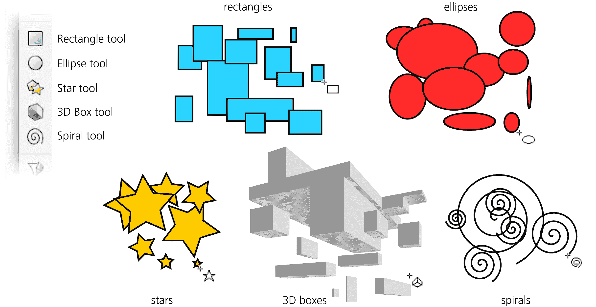

图 2-8：玩转形状工具

*形状*是一个几何对象，你不仅可以移动、缩放或旋转它（就像处理其他任何对象一样），还可以根据其类型以特定的方式进行编辑。例如，对于矩形，你可以让它的角变圆；对于椭圆，你可以将其转换为一个线段（如饼状图形）或椭圆弧；对于一个 3D 盒子，你可以在它自己的 3D 空间内移动和调整大小。我们将在第十一章讨论形状；现在，选择任何形状工具并开始在画布上绘制。每次鼠标拖动，从按下到松开左键，都会创建一个新的形状。

工具箱下方是*钢笔*和*铅笔*工具（图 2-9）。这两种工具都可以创建任意路径，但它们的方式不同。铅笔工具的工作方式就像真正的铅笔——你在画布上绘制，它留下痕迹。（请注意，这个痕迹并不完全准确；与实际的鼠标轨迹相比，它稍微有些平滑。）

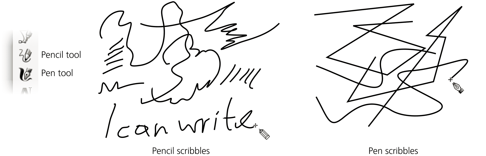

图 2-9：使用铅笔和钢笔工具

钢笔工具更为复杂；它假设你了解路径是由通过线性或曲线段连接的节点组成的。现在，只需在不同的点点击几次（这会在点击点之间创建线性段），然后点击并拖动几次，最后按 Enter 完成路径。铅笔工具和钢笔工具默认创建的路径是细黑线条，没有填充颜色。我们将在第十四章中讨论这些工具。

接下来的两个工具，*书法钢笔*和*油漆桶*，也会创建路径，但与铅笔和钢笔不同，它们默认创建的路径是填充的，没有边框（图 2-10）。

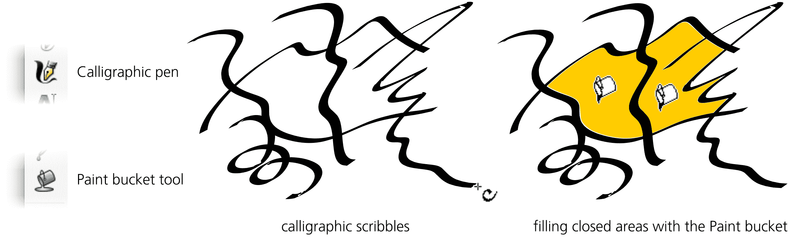

图 2-10：使用书法钢笔和油漆桶工具

书法钢笔是 Inkscape 中最通用的工具之一；它的许多选项和参数不仅能模拟书法钢笔（它的最初用途），还可以模拟各种画笔和许多其他绘图工具及行为（其中一些在现实世界中没有对应物）。这是那些使用 Inkscape 来*简单绘画*的人的主要工具（第十四章）。

油漆桶工具对于漫画家或插画师来说也是一个很大的帮助。正如你所期待的，它可以填充任何封闭区域，创建一个填充的矢量路径。练习时，可以用书法钢笔画出几个笔画围绕一个封闭区域，然后点击内部使用油漆桶工具。（如果点击的是一个未封闭的区域，工具将无法填充并会在状态栏中提示。）

我们最后要看看的是*文本*工具，它创建和编辑文本对象（图 2-11）。创建一个新的文本对象就像在任何地方点击并开始输入一样简单。或者，你可以点击并拖动，这样你就创建了一个矩形的*流动文本*对象，当你输入文本直到右边缘时，它会自动换行。

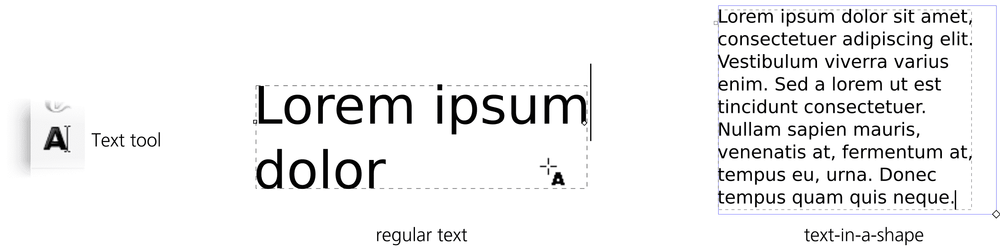

图 2-11：使用文本工具

编辑现有文本对象同样简单——用文本工具点击它以定位光标，并使用常见的文本编辑快捷键（方向键、Home、End、Delete、Enter 新行等）。文本工具是第十五章的主题。

现在，如果你需要在 SVG 文档中插入一个光栅对象，比如照片，怎么办？无需工具，使用**文件**菜单中的**导入**命令。只需选择任何光栅图像文件（JPG、PNG、GIF 和 TIFF 都可以），它将被插入到你的文档中。然而，它仍然是光栅格式；有关将其转换为矢量对象的方法，请参见 18.7。

## 2.6 选择

如你所见，在你创建一个新对象（例如，使用矩形工具或书法笔）后，该对象周围会出现一个虚线框。这个框表示该对象是*选中的*。

选择是 Inkscape 中的一个基本概念。几乎所有的工具、命令、对话框和快捷键都作用于当前选中的对象。各种信息显示，如状态栏，始终描述当前选中的对象。快速、精确地选择所需的对象，以及弄清楚当前选中的是什么对象，是在 Inkscape 中高效工作的关键。

允许你选择对象的主要工具被恰当地称为*选择器*（图 2-12）。它也是工具箱中的第一个（最上面）工具，因为选择是如此重要。你不仅可以通过点击按钮切换到这个工具，还可以按 F1、S 或空格键。你真的不可能错过这个工具！

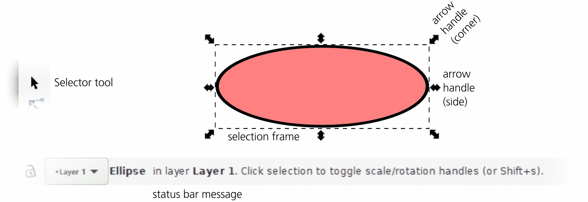

图 2-12：选择器工具和一个已选择的对象

使用选择器进行基本选择非常简单（就像 Inkscape 中的任何其他基础操作一样）。你只需点击任何对象，哇，那个对象就被选中了。现在试试看。观察状态栏消息如何立即更新，告诉你你选择的是什么：矩形、路径、椭圆、文本对象等等。

任何时候都可以选择多个对象，如图 2-13 所示。通常，当你已经选择了某个对象时，点击另一个对象会取消选择第一个对象。然而，如果你按住 Shift 键并点击一个未选择的对象，它会*添加*到已选择的对象列表中。（如果你按住 Shift 键并点击一个已选择的对象，它会*移除*该对象的选择。）注意状态栏上显示的新选择信息。还要注意每个被选择的对象都有自己独立的虚线框。

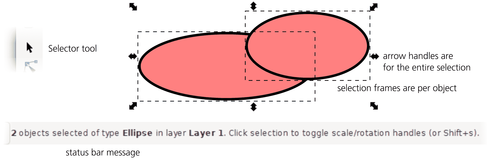

图 2-13：多个对象被选中

想一次选择 1,000 个对象吗？不需要 Shift 键点击 1,000 次。使用选择器，只需*拖动*（按住鼠标按钮并移动鼠标而不松开按钮）穿过你想选择的所有对象。你会看到一个跟随鼠标的矩形*橡皮筋*。当你松开鼠标时，所有完全在橡皮筋内的对象将被选中，如图 2-14 所示。

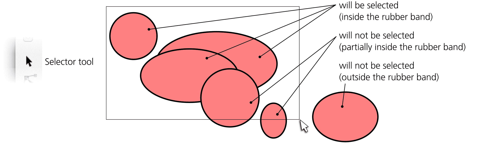

图 2-14：使用橡皮筋选择多个对象

你也可以使用键盘快捷键来选择。Tab 键的通用含义是“转到下一个”——因此在 Inkscape 中，按 Tab 键会选择下一个对象（按 z-order 排序，4.4，除非你更改它，否则这与对象创建顺序相同），而按 Shift-Tab 则选择上一个对象。熟悉的 Ctrl-A 在许多程序中表示*全选*，在这里也同样有效。

需要不同的选择？按下 Escape 键，或点击空白画布上的任何地方（不是在对象上）取消选择任何已选中的内容。

这只是 Inkscape 提供的所有选择方法和技巧的一小部分，但足以帮助你入门。接下来我们将实际操作改变所选内容。

## 2.7 变换

选择工具的另一个功能，除了选择对象外，就是*变换*它们。

变换是一个总括性的术语，包括*移动*、*缩放*（调整大小）、*旋转*和*倾斜*。其中前两种，特别是移动，在矢量图形工作中非常常见，因为几乎不可能在一开始就精确地将对象放置在正确的位置和大小。你会发现自己经常需要移动对象，因此，学会如何快速且精确地完成这项操作非常重要。

使用选择工具*移动*选区非常简单——只需用鼠标拖动任何已选中的对象。如果选中了多个对象，拖动其中任何一个都能一起移动它们。

一个非常常见的操作是*复制*对象，即创建选区的精确副本。按下 Ctrl-D 即可；一个副本会被创建，并精确地放置在原始选区上（因此，原始选区看起来并没有发生变化）。只需用选择工具将副本拖动到你想放置的位置。你也可以使用传统的复制粘贴方法来复制对象（Ctrl-C，Ctrl-V）。

其他类型的变换稍微复杂一些。每当你选中某个对象时，选区周围会出现八个箭头标记（图 2-15）。拖动这些箭头标记会进行*缩放*操作。这就是你如何让选区变大或变小、更高或更宽，等等。四个角落的箭头可以任意方向移动，自由调整选中对象的大小；四个中心的箭头只能在一个方向上缩放（上下中心标记垂直移动；左右中心标记水平移动）。

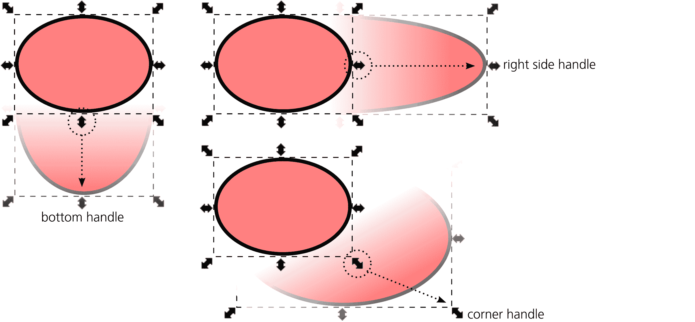

图 2-15：缩放对象

对于剩下的两种变换模式，*旋转*和*倾斜*，点击已选中的对象的任何地方（或者按下 Shift-S）。箭头标记发生变化——现在你的选择处于*旋转模式*，而不是之前使用的*缩放模式*（图 2-16）。

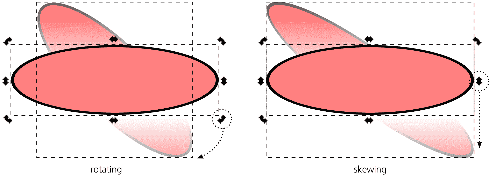

图 2-16：旋转和倾斜对象

现在，拖动四个角上的箭头会围绕其中心旋转选择区域，而四个中心箭头则会扭曲选择区域。此外，在旋转模式下，你仍然可以通过拖动来移动选择区域。要返回缩放模式，点击选择区域或再次按 Shift-S。下次你选择这些或其他对象时，它们会首先进入缩放模式。

如果你更喜欢通过键盘控制 Inkscape，你可能不会惊讶地发现，四个箭头键分别可以将选择区域在相应的方向上移动。更不明显的是，左右尖括号（<和>）分别缩小和放大选择区域，而方括号（[和]）则分别让选择区域逆时针和顺时针旋转。没有快捷键可以扭曲对象。

这应该能让你开始使用选择工具进行对象的基本变换。再次强调，接下来我们还会讨论更多的技巧、快捷键和经验法则，但现在，这应该能给你提供一个关于 Inkscape 工作原理的大致感觉。

## 2.8 样式设置

在 Inkscape 中，任何对象都有样式。*样式*是一个复杂的概念，包含许多独立的属性，从填充颜色到描边宽度，再到完全改变对象外观的复杂 SVG 滤镜。这里介绍一些最简单、最常见的更改对象样式的技巧。

首先，你现在应该已经猜到，像所有 Inkscape 中的其他操作一样，改变样式的操作也适用于*当前选择的对象*。也就是说，在你改变某个对象的样式之前，必须先选择这个对象。

一旦你选择了想要设置样式的对象，最简单的做法就是点击画布底部的颜色调色板。你点击的颜色将成为所有选定对象的新的填充颜色（图 2-17）。即使一个对象根本没有填充（比如用铅笔工具创建的路径），它也会被填充上这种颜色。（注意，你可以滚动调色板到右侧，查看更多屏幕上无法显示的颜色。）

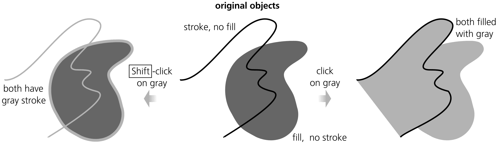

图 2-17：从颜色调色板设置填充或描边

你也可以像改变填充颜色一样，轻松改变选定对象的描边颜色——只需按住 Shift 键点击颜色即可。同样，如果某些对象之前没有描边，它们现在也会有描边。

接下来，看看 Inkscape 窗口左下角的复杂控件，位于状态栏的左端。这个控件（如图 2-18 所示）称为*选定样式指示器*；顾名思义，它指示选择对象的样式（或者说，它指示最重要的样式属性，实际上一个对象的样式比这个指示器显示的要复杂得多）。你可以通过它查看选定对象的填充和描边颜色。

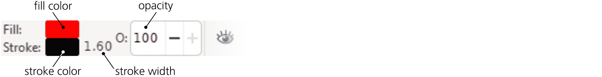

图 2-18：选定的样式指示器

此指示器还允许你更改其显示的样式属性。一项非常常见的操作是*移除*选定对象的填充或描边。只需中键单击**填充**（顶部）或**描边**（底部）样本即可完成此操作，或者右键单击相应的样本并从弹出菜单中选择**移除**。请注意，没有填充和描边的对象是完全不可见的——你无法看到它，也无法点击它进行选择（尽管你可以围绕它拖动选框来选择它）。

除了填充和描边颜色外，一个重要的样式属性是*不透明度*。想象一下彩绘玻璃，它有自己的颜色，但仍然能够透过其后面的物体；这就是在 Inkscape 中不透明度小于 100% 的对象的行为。（显然，不透明度为 0% 会使对象不可见。）要改变不透明度，使用所选样式指示器中的**O:** 控制。试着选择一个位于其他对象上方的对象并输入一个不同的不透明度值；注意对象如何变得半透明（图 2-19）。

图 2-19：改变不透明度

如果你只是想让两个对象具有相同的样式，那么很容易实现。选择第一个对象并按 Ctrl-C；这会将该对象复制到剪贴板上。然后选择另一个对象（或多个对象），按 Shift-Ctrl-V 将剪贴板对象的*样式*粘贴到它们上。 这是使多个对象看起来相同的最简单方法。

## 2.9 保存与导出

假设你在 Inkscape 中创建了一些内容，并希望与他人分享。最佳的做法是什么？

*保存*文档为 SVG 格式的操作按预期工作。只需按 Ctrl-S 或从菜单中选择**文件 ▶ 保存**，导航到文件夹，输入文件名，然后点击**保存**。

就共享而言，SVG 格式完全不是一个坏选择；例如，如前所述，你可以在任何现代浏览器中查看其矢量效果。然而，出于各种原因，SVG 在某些情况下可能不是一个可行的选择。在这种情况下，你需要将文档*导出*为其他格式。再次打开**保存**对话框。注意下拉列表中显示的*Inkscape SVG (*.svg)*；看看还有哪些可用格式。实际上，很多！列出了超过 20 种不同的矢量格式。

不过，别太激动。几个格式其实只是 Inkscape SVG 格式的变体（比如普通 SVG 或压缩 SVG）。其他格式在某些方面受限，要么是因为目标格式本身相较于 SVG 有限制，要么是因为 Inkscape 为该格式的导出器尚未完全开发，或者两者都有。这些导出格式是可用的，但只有在你了解其限制并在设计文档时考虑到这些限制的情况下才能使用。

除了 SVG 格式外，也许最安全的导出格式是 PDF（附录 B）。它仍然无法完全保留某些 SVG 特性（例如默认会被栅格化的滤镜），但对于大多数 Inkscape 文档来说，它应该是完全足够的。PDF 格式的最大优势，除了它是矢量格式外，还在于它比仅限于标准 Adobe Acrobat 的软件支持范围要广得多。

如你所见，保存对话框仅列出了用于导出的矢量格式。那么，如何导出为栅格格式呢？这是通过一个名为导出 PNG 图像的不同对话框来完成的（18.6.1）。顾名思义，Inkscape 只能导出 PNG 格式的栅格图像。不过，在大多数情况下，这不是问题；PNG 是一种普遍支持的格式（可以在所有浏览器中查看），支持完整的 RGB 色彩和渐变（透明度）效果，是一种非常适合呈现任何矢量艺术作品的多用途格式。如果你真的需要 JPG、GIF 或 TIFF 格式，可以使用许多专门的工具将你的 PNG 图像转换为其他格式。

通过按 Shift-Ctrl-E 或选择**文件 ▶ 导出 PNG 图像** (图 18-22) 打开对话框。在对话框顶部，有四个按钮用于选择*要*导出的内容。如果你绘制的图像遵循了页面框架的布局，并且该框架很好地围绕了你的艺术作品，那么选择**页面**。否则，选择**绘图**，让导出区域覆盖绘图中的所有对象，无论它们的位置如何。你还可以仅导出当前选择的部分，或者指定一个自定义的导出区域。

然后，设置所需的栅格图像像素大小或分辨率（这两个值显然是相关的：增加一个会增加另一个，反之亦然）。最后，输入导出文件名（或使用**另存为**选择位置和文件名），然后点击**导出**。（导出后，对话框保持打开状态，方便你反复使用；这种工作流程在 18.6.1 中有详细讨论。）

完成了！拿着你保存或导出的文件，发出去吧。

## 2.10 最后的示例

让我们将目前所学的内容应用到一个稍微复杂一点的插图上：一个傻乎乎的、*南方公园*风格的男孩脸。 当然，这并不算什么挑战，但它应该对消化你所学的新知识有所帮助。

首先，运行一个新的 Inkscape 实例，或者如果你已经在运行 Inkscape，可以按 Ctrl-N 创建一个新的空白文档。

选择椭圆工具并绘制一个椭圆（图 2-20）。那将是男孩的头部。滚动底部的调色板，选择一个合适的身体颜色，点击它来为椭圆赋予颜色。（你可以尝试几种颜色，直到找到最佳的。）如果椭圆上有边框，右键点击状态栏左下角的**描边**色板来移除它。

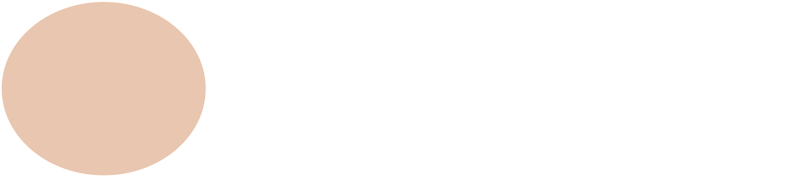

图 2-20：一个椭圆

在头部椭圆的顶部画一个较小的椭圆。发生了什么——它是不是看不见了？！不是的。椭圆（像大多数其他工具一样）会记住你为头部指定的颜色，并将相同的颜色用于新椭圆，因此它看起来像是与较大的头部椭圆合并在背景中了（尽管你仍然能看到它的选择框和控制点）。将调色板滚动回左侧，点击白色色板，你就可以看到较小的椭圆了（图 2-21）。

图 2-21：两个椭圆

这个较小的椭圆应该是男孩眼睛的白色部分。它可能不是你想要的眼睛大小，并且位置也有点怪。切换到选择工具，将小椭圆拖到大致想要的位置。然后拖动角落的箭头标记，使其大小接近合适的大小（图 2-22）。

图 2-22：定位第二个椭圆

现在你需要为眼睛的瞳孔再画一个椭圆。不过，我们这次不回去使用椭圆工具，而是采用复制的方式。在仍然选中的白色椭圆上，按 Ctrl-D。虽然没有明显的变化，但你现在有了两个椭圆，新的椭圆已被选中。点击黑色色板，然后拖动箭头标记使瞳孔变小，并将其放到合适的位置，如图 2-23 所示。

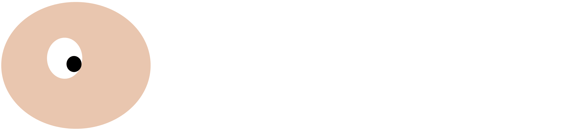

图 2-23：头部和一个眼睛

眼睛已经完成——但你需要两个相同的眼睛（图 2-24）。让我们复制刚才创建的整个眼睛。眼睛由两个独立的对象组成，因此在复制之前你需要选中它们。为此，我们可以通过拖动一个橡皮带围绕眼睛（确保从空白处开始拖动，而不是从头部椭圆开始；否则头部也会被拖动，这不是你想要的！），或者直接点击瞳孔，然后按住 Shift 键点击白色部分。按 Ctrl-D 然后将第二只眼睛向旁边拖动（当其中一个对象被拖动时，两个对象都会移动）。

图 2-24：头部和两个眼睛

现在，为了完成绘图，选择书法笔工具，画出鼻子、嘴巴、耳朵和一些头发（图 2-25）。如果路径出现了错误的颜色，点击调色板上的黑色；之后，所有新的书法路径也会变为黑色。如果画笔太宽或太细，可以在画布上方的工具控制条中调整**宽度**值。如果出错了，按 Ctrl-Z 撤销。

图 2-25：欢迎来到这个世界！

图片已经准备好，但我们还没有完成它所提供的所有可能性。到目前为止，你所做的与在栅格编辑器中完成的工作一样简单。但我们是在使用矢量—所以让我们利用矢量的特定优势来玩转结果。使用选择器，选择两个眼睛的白眼部分，并缩放它们的大小。或者移动瞳孔的位置。又或者缩放、旋转和移动嘴巴。这些操作可以创造出多种面部表情。现在，让我们选择、复制并拖动整个图形，展示几个并排的例子，如图 2-26 所示。

图 2-26: 生活及其多面性

保存或导出结果。就这样！
