# 第三章：设置和移动

在前几章的介绍之后，本章将正式让你开始认真使用 Inkscape。从这里开始，我将深入探讨实际的主题，细致入微，不留任何遗漏。我无法知道你会发现哪些功能或技巧最有用——这取决于你的工作性质和个人喜好。因此，本书尝试涵盖 *Inkscape* 所有的功能。

在这一简短的章节中，我们还不会创建或编辑任何对象。相反，我们将准备工作区，讨论一些有用的自定义设置，并学习通过缩放和平移浏览文档的技巧。

## 3.1 首选项

Inkscape 是一款极其可配置的软件。在本书中，我将提到各种你可以更改的 Inkscape *首选项*，以调整程序的功能，并更好地适应你偏好的工作方式。在开始使用 Inkscape 进行任何重要操作之前，让我们先来看看所有这些不同的首选项是如何设置和存储的。

所有 Inkscape 用户首选项都属于两个主要类别之一。

### 3.1.1 Inkscape 首选项

*Inkscape 首选项*（通常称为 *全局首选项* 或简称 *首选项*）控制程序中不依赖于你正在编辑的特定文档的那些方面。这些包括各种工具和快捷键的默认行为、各种对象类型的处理细节、显示和颜色管理选项等。

大多数选项可以在首选项对话框中编辑（按 Shift-Ctrl-P 或选择 **编辑 ▶ 首选项**）。然而，有些首选项是通过命令或快捷键设置的；例如，当你按 Ctrl-B 隐藏或显示滚动条时（或从“视图 ▶ 显示/隐藏”子菜单选择相应命令），该设置也会作为全局首选项记住。

在本书中，我将在相关内容中讨论具体的全局选项，并引用首选项对话框相应页面。页面树位于对话框的左侧面板；其上方有一个搜索框，你可以在其中输入关键词以搜索对话框的全部内容。对话框中的每个选项都有描述；如果你需要帮助，只需将鼠标悬停在选项上，查看浮动工具提示（图 3-1）。

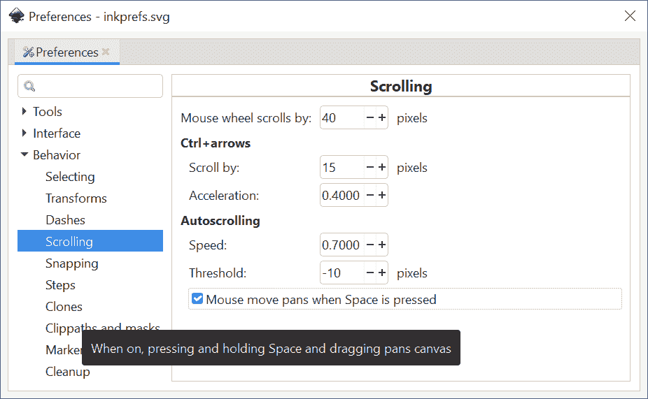

图 3-1：首选项对话框中“滚动”页面的浮动工具提示解释了其中一个选项。

请注意，首选项对话框没有“保存”或“应用”按钮。大多数更改会立即生效。少数更改需要重新启动 Inkscape，相关说明会在选项的描述中提到。所有全局首选项在退出程序时会自动保存。

存储全局首选项的文件称为 preferences.xml；你可以在首选项对话框的系统页面中查看（并更改）其位置。

一些很少使用的选项没有图形界面；设置它们的唯一方法是手动编辑 preferences.xml 文件。这是一个简单且基本自解释的 XML 文件格式。你可能需要更改一个具有特定 ID 的元素的特定命名属性，例如 `printing`。然后，你可以在文本编辑器中打开该文件，搜索字符串 `id="printing"`，并编辑该元素中特定属性的值，例如，将 `attribute="old"` 替换为 `attribute="new"`（注意，属性值总是用引号括起来）。

### 3.1.2 文档属性

*文档属性*，与全局偏好设置不同，适用于单个文档。此类别包括画布的大小和方向、默认测量单位、各种对齐选项、对齐网格和辅助线的状态等。这些选项大多数在文档属性对话框中设置（见 图 3-2）。


图 3-2：文档属性对话框的页面标签

文档属性会自动作为所设置的 Inkscape SVG 文档的一部分保存。例如，如果你在某个文档中更改了对齐模式，Inkscape 会记住下次加载该文档时的设置，但其他文档不会受到影响。要更改新创建文档的文档属性，可以编辑用于创建这些文档的文档模板，正如你将在下一节中看到的那样。

## 3.2 文档模板

当你运行 Inkscape 时，它会自动为你创建一个新文档。Inkscape 的窗口不能在没有加载文档的情况下存在，因此如果你没有提供现有文档加载，它将为你创建一个新文档。

每当你需要从正在编辑其他文档的窗口中创建一个空白文档时，只需按 Ctrl-N 或使用 **文件 ▶ 新建**。这将基于 *默认模板* 创建一个文档。然而，Inkscape 还有许多其他模板，你可以通过进入文件 ▶ 从模板创建来使用它们。只需从左侧的模板列表中选择一个模板，必要时设置其参数（如大小），然后点击 **从模板创建**（见 图 3-3）。

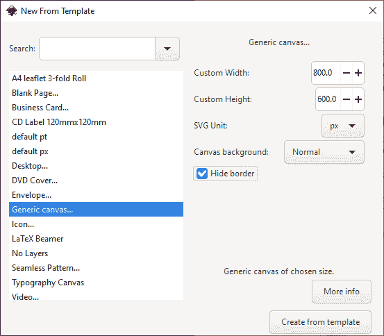

图 3-3：从模板创建对话框

Inkscape 随附了标准纸张大小、标准图标和网页横幅尺寸、桌面尺寸（用于壁纸）、CD/DVD 封面、名片等模板集合。模板不必为空——它可以包含任何可能有用的对象或文档设置。例如，看看无缝图案模板，其中包含详细的说明（左上方）和一个测试平铺区域（右侧），用于中间的无缝图案方块，如 图 3-4 所示。

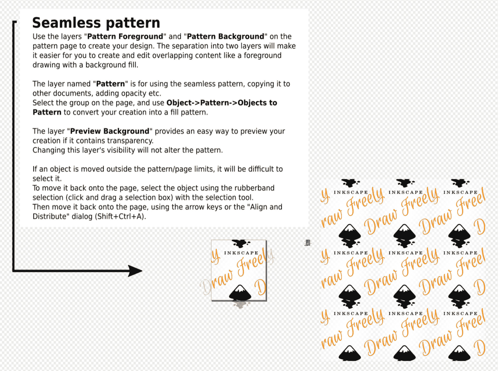

图 3-4：无缝图案文档模板。在中间创建你的图案（替换示例内容），并观察它在右侧进行平铺。

在最简单的情况下（没有参数的模板），模板只是一个普通的 Inkscape SVG 文档；当创建新文档时，Inkscape 只需复制一个这样的模板。你可以将自己的模板添加到列表中；任何比默认空白画布更适合起步的文档都可以转化为模板。为此，只需将文档复制或保存到用户模板文件夹，你可以通过点击“打开”按钮并进入“首选项”中的“系统”页面来打开该文件夹。你甚至可以覆盖标准模板，只要你为自定义模板使用相同的名称；特别地，如果你将模板保存为 default.svg，它将被用于你运行 Inkscape 或按下 Ctrl-N 时创建的所有新文档。

## 3.3 输入设备设置

你不能真正使用像 Inkscape 这样的图形编辑器而不使用某种指点设备。可能*无法*使用的是任何用手指进行指点的设备，如触摸屏或笔记本触摸板——人类的手指对于精确的图形工作来说太钝了。普通的计算机鼠标完全可以使用，大多数人都用鼠标完成各种 Inkscape 工作。

然而，如果你打算使用 Inkscape 进行艺术绘图（第十四章），你可能想要购买一个压感图形板，比如 Wacom、HUION 或 XP-Pen 生产的设备。使用它，你可以更自然地进行指点和绘图，同时还能创建依赖于压力的变宽笔画——就像常规钢笔或铅笔的线条深浅取决于你施加的压力一样。

Inkscape 有一个对压感设备进行设置的对话框（编辑 ▶ 输入设备）。本书的第一版建议，为了使压感功能正常工作，应该将该对话框中的每个可用设备切换到“屏幕模式”。然而，在现代的 Inkscape 中，我发现我完全不需要在这个对话框中更改任何设置：压感平板设备直接就能工作。

## 3.4 键盘设置

Inkscape 在键盘快捷键方面非常丰富。其所有键盘和鼠标快捷键的完整列表包含了近七百个条目。

通常，键盘快捷键不需要任何设置——它们直接可以使用。然而，有时你可能想要更改一些快捷键或添加新的快捷键，也许是因为你习惯了其他程序的键盘布局，或者仅仅是因为现有的快捷键没有充分覆盖你的工作习惯。

Inkscape 大多数（但不是全部）键盘快捷键都可以更改。你还可以为菜单中看到的任何命令分配快捷键，包括扩展菜单中的任何扩展（第十九章）。

要查看或编辑 Inkscape 的键盘快捷方式，进入**首选项**对话框（3.1），**界面 ▶ 键盘**（图 3-5）。在这里，你可以重新定义任何菜单命令或操作的快捷方式，以及（在修改器选项卡中）最常见的鼠标操作（画布平移、选择、移动和变换）的键盘修饰符。你无法（目前）配置的快捷方式包括那些仅限于单个工具或模式的快捷方式。

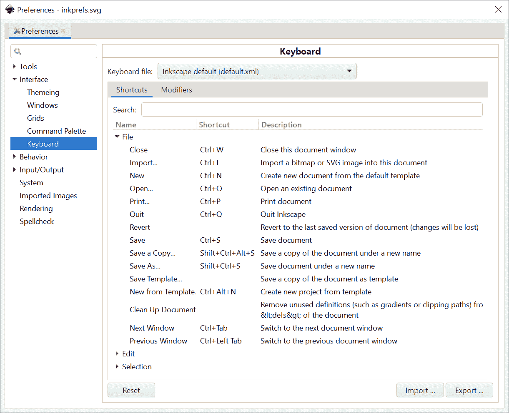

图 3-5：查看和编辑 Inkscape 的键盘快捷方式

在进行任何手动调整之前，先查看顶部可用快捷方式文件的列表。Inkscape 提供了所有主要竞争对手（Adobe Illustrator、CorelDRAW、Xara Xtreme、Macromedia Freehand）的键盘布局仿真，以及一些次要矢量编辑器（Zoner Draw、ACD Systems Canvas）的仿真。还有一个标准布局的变种，将最常用的命令放置在键盘的左半部分，这样你就可以避免将右手从鼠标或平板上移开。也许这些仿真布局中的某一个比 Inkscape 的默认布局更适合你，这样你就无需逐个编辑快捷方式了。

替代布局可能不像主布局那样完整或更新。开发者欢迎任何帮助，改进这些替代布局或添加新的布局。

列表中的快捷方式按菜单分组，其中包含相应的命令；你可以使用顶部的搜索框来筛选你感兴趣的命令。要编辑或分配快捷方式给某个命令，请点击中间列；一旦它变为“新加速器...” （加速器是快捷方式的专业术语），只需按下你想要的键盘组合，它就会分配给这个命令。如果出现冲突（快捷方式已分配给其他命令），Inkscape 会警告你。如果搞错了，使用**重置**按钮。

## 3.5 页面设置

文档属性对话框的第一个选项卡叫做页面（见图 3-2），其中包含一些你将频繁更改的常规设置，我们现在来看看这些设置。（其他选项卡控制网格、参考线和吸附模式；我将在第七章中描述它们。）

### 3.5.1 默认单位

文档的默认测量单位——例如 px（SVG 像素；见 A.6）或 mm（毫米）——将影响你在所有显示或可以指定长度或坐标的地方。例如，选择工具的 X、Y、W 和 H 控件会显示以文档默认单位测量的值，尽管你可以通过右侧的单位下拉框来更改它（见图 6-10）。类似地，状态栏提示（例如，当使用钢笔工具绘制路径时，14.1.1）会以默认单位指示距离。

### 3.5.2 页面大小

标准文档尺寸列表是非常直观的；在相同区域内，你可以指定自定义尺寸和方向（纵向或横向）。Inkscape 的画布几乎没有限制（1.1），所以你可以在其上任何位置进行绘图，无论是在页面内还是页面外；然而，大多数标准的 SVG 查看器只会显示页面上的内容，忽略页面边界之外的任何内容。

因此，如果你打算以 SVG 格式发布或分享你的作品，你可以将页面外的画布用作剪贴板或工作区——但最终将完成的作品放置在页面上。打印或导出为大多数矢量格式时，也会忽略页面外的所有内容。然而，位图导出（18.6）则更加灵活；无论对象位于何处，你都可以导出页面矩形、实际绘图（所有对象）或仅选定的对象。

如果你在绘图时没有太多关注页面边界，但现在希望你的绘图精确地适应页面边界，一个方便的方式是在文档属性对话框中点击**调整页面以适应内容...**（点击展开该区域）。点击此按钮会让页面边框精确地框住所选对象，或者（如果没有选择）框住整个绘图；你还可以指定四个边距中的任何一个。

在调整页面大小时，你的绘图中的对象会相对于顶部和左侧固定，而右侧和底部则会移动。

然而，在其他情况下，你可能根本不关心页面的大小。例如，你可能在一个 SVG 文件中处理一组图标或徽标，并且不打算分享这个 SVG 文件，而是将每个图标导出为单独的位图文件。在这种情况下，页面的矩形只是一个干扰。文档属性对话框右下角的页面边框控制可以让你更改该矩形的颜色和阴影，或者完全隐藏它。你还可以将边框放置在绘图的顶部，这样它将始终显示在可能遮挡页面边缘的任何对象之上。

### 3.5.3 背景

你还可以更改文档的背景颜色和背景不透明度（默认是完全透明的白色）。只需点击颜色样本（左下角），并使用弹出的颜色选择菜单，如图 3-6 所示。

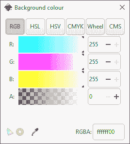

图 3-6：选择页面背景颜色和不透明度

改变白色背景的不透明度在屏幕上没有明显效果，但它会影响导出的 PNG 文件——只有当你的 SVG 文档中有透明背景时，它们才会有透明背景。你还可以在文档属性中启用棋盘背景选项，以便更容易管理透明对象。

## 3.6 实例、文档和视图

你在屏幕上看到的 Inkscape 窗口（如图 2-2 中的窗口）并不等同于 Inkscape 本身。正在运行的程序副本——一个 *实例*——可能有多个文档打开，每个文档在其自己的编辑窗口中。此外，你可以将相同的文档加载到多个窗口中，以查看同一图形的不同视图。对一个窗口中某个文档所做的任何更改会立即在所有加载该文档的窗口中反映出来（在同一实例内）。

如果你从任何已存在文档的窗口开始，并使用文件 ▶ 打开命令（Ctrl-O），你将打开一个新窗口，显示不同的文档（但仍在同一个实例内）。然而，如果你从一个新建且未更改的文档窗口开始（即仅是一个空白画布），它将被打开的文档替换，而不会打开新窗口。

或者，你可以从命令行启动 Inkscape，并列出所有你希望打开的文档的文件名（C.3）：

```
$ inkscape portrait.svg ../path/to/document.svg another.svg
```

如果你想在已打开的文档上再打开一个新窗口以查看其他视图，可以使用 **视图 ▶ 复制窗口** 命令。这样，你将拥有两个窗口，它们展示同一个文档的两个视图，但每个窗口都有独立的缩放级别、活动工具和选择状态。对一个窗口中的文档所做的任何更改会立即在另一个窗口中显示。

要在同一个 Inkscape 实例中的所有窗口之间切换（无论它们是否显示相同或不同的文档），按 Ctrl-Tab（前进）或 Shift-Ctrl-Tab（后退）。

例如，在一个窗口中你可以在较小的细节上进行精细缩放工作，同时在另一个窗口中查看整个文档的缩小版，如图 3-7 所示。

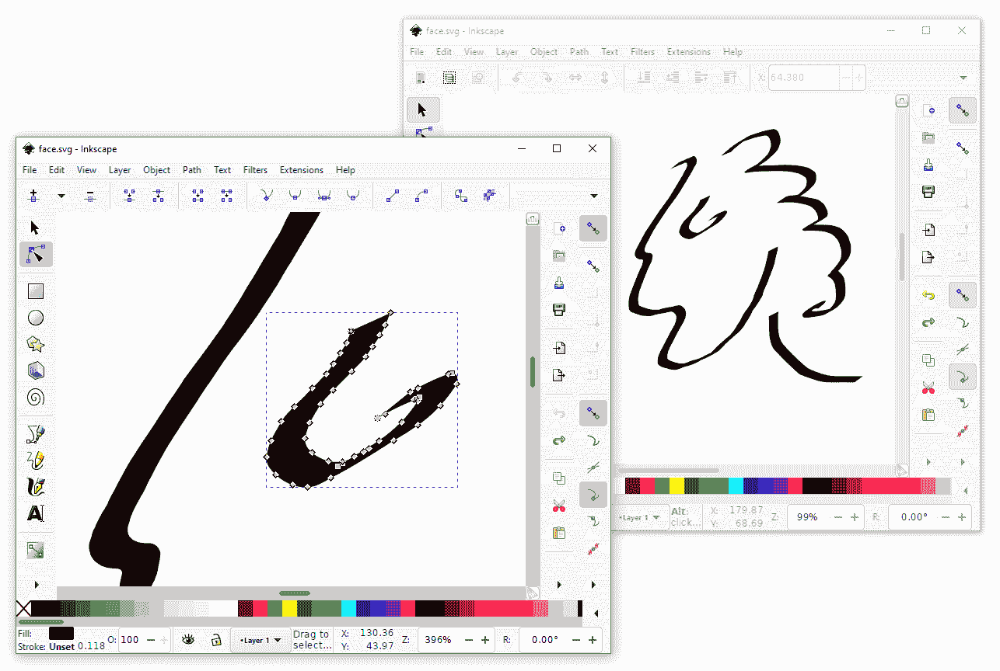

图 3-7：使用多个窗口查看同一文档

## 3.7 文档窗口

Inkscape 窗口的主要组件（图 2-5）从上到下分别是：菜单、控制栏（当你切换工具时其内容会变化）、左侧的主工具箱和右侧的对话框停靠栏，它们之间是文档画布，底部是调色板和状态栏。默认情况下，画布区域有标尺（上侧和左侧）和滚动条（底部和右侧）。

通过在“视图”菜单的显示/隐藏子菜单中使用命令，你可以隐藏 Inkscape 窗口中的所有部分，除了菜单和画布本身，如图 3-8 所示。

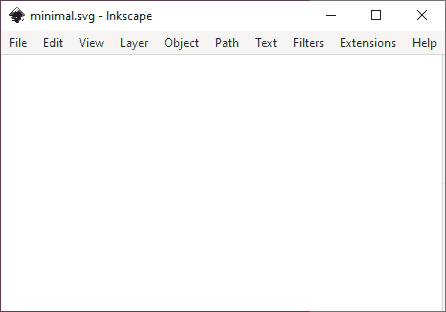

图 3-8：一个最小化的 Inkscape 窗口

只保留你需要的部分；隐藏得越多，你的绘图空间就越大。我通常会隐藏命令栏、标尺和滚动条。大多数时候，我还会隐藏调色板，除非我计划使用 Inkscape 进行颜色密集型任务（例如给卡通上色）。所有这些选项都会被记住，并在下次启动 Inkscape 时恢复。

要将 Inkscape 窗口切换到全屏模式，按 F11 或使用**视图 ▶ 全屏**。在该模式下，界面元素的显示集合可能完全不同。例如，你可以在常规模式下显示工具栏和工具控制，进行所有编辑，但在全屏模式下隐藏它们，以便以最少的干扰查看你的艺术作品。

### 3.7.1 窗口几何

*窗口几何*这个词指的是一个非常简单的概念：Inkscape 窗口的大小和它在屏幕上的位置。为了尽可能提供帮助，Inkscape 会记住每个文档窗口的大小和位置，并将这些值保存在文档中。因此，当你下次加载该文档时，窗口将以文档上次保存时的大小和位置打开。

在大多数情况下，这是有帮助的。然而，有时这反而成了一种烦恼——例如，如果你从某个分辨率不同的用户那里获得了 Inkscape SVG 文件，窗口可能会出现在你屏幕上一个奇怪的位置。要禁用此行为，在**首选项**对话框中选择**界面 ▶ 窗口**页面，然后更改**保存窗口几何**选项，如图 3-9 所示。

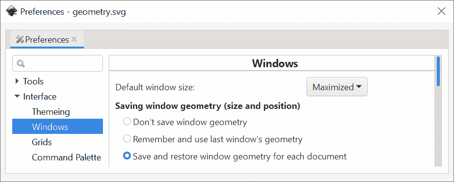

图 3-9：保存窗口几何选项

第一个选项禁用保存和读取窗口几何。第二个选项使窗口几何成为全局设置，而不是每个文档的设置，因此每当你改变任何 Inkscape 窗口的大小或位置时，这些几何值将应用于所有随后打开的窗口。最后一个选项——每文档窗口几何——是默认选项。

除了窗口几何外，当前的缩放级别和视图区域始终与文档一起保存，因此下次重新加载文档时，你将看到相同的位置和缩放比例。

## 3.8 对话框

Inkscape 的用户界面包含多个可移动面板，称为*对话框*，每个面板都有特定的功能。虽然 Inkscape 努力通过工具和快捷键使大多数编辑操作能够直接在画布上进行，但对话框仍然存在，并且使用频率相当高（图 3-10）。

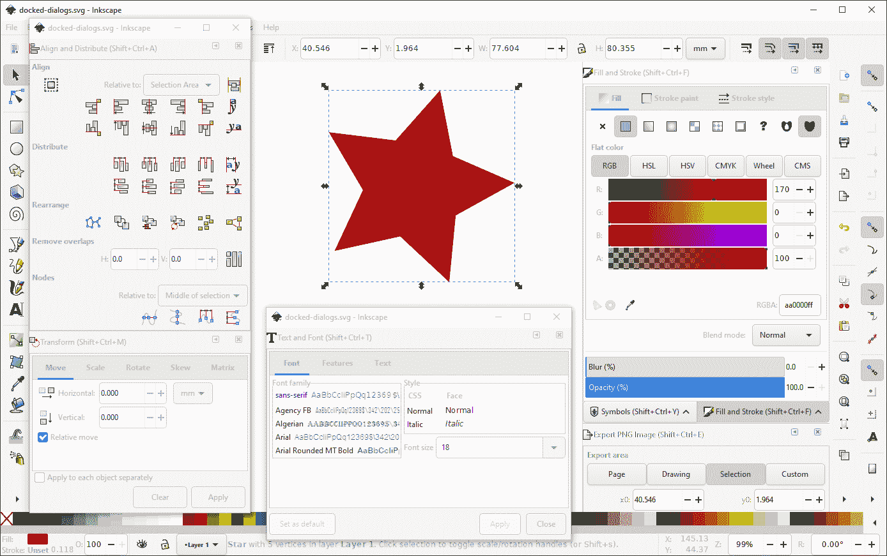

图 3-10：浮动和停靠的对话框

对于每个对话框，通常有一个菜单命令和一个以 Ctrl 和 Shift 开头的快捷键（例如，Shift-Ctrl-F 打开填充和描边对话框）。新打开的对话框会获得键盘焦点，因此你不仅可以使用鼠标与之交互，还可以使用 Tab 键进行导航，使用 Ctrl-Page Up 和 Ctrl-Page Down 切换标签，输入字段值等。

要关闭对话框，请点击右上角的“X”按钮，或者如果对话框处于键盘焦点状态，按 Ctrl-W。若要在不关闭对话框的情况下将键盘焦点移回画布，点击画布或按 Escape 键。如果一个对话框已经打开，选择其命令或再次调用快捷键并不会关闭它，而是将键盘焦点转移到该对话框。

可停靠的对话框可以被*停靠*——放置到编辑窗口右侧的停靠区，或者可以*浮动*在一个独立的小窗口中。（不可停靠的对话框，如首选项，始终在独立窗口中。）只需将任何对话框拖动到停靠区或从停靠区拖出；两个或更多对话框甚至可以一起停靠到一个浮动停靠区中。关闭时，每个对话框会记住其状态（停靠或浮动）和位置，下一次打开时会恢复。

在图 3-10 中，一个浮动窗口包含两个对话框，另一个包含一个对话框，而编辑窗口中的主停靠区包含三个对话框。

如果你不喜欢停靠面板，可以进入**首选项**的**窗口**页面，将**对话框行为**选项从**可停靠**更改为**浮动**。这将禁用停靠面板，并使所有对话框以浮动状态打开。

## 3.9 主题与图标

并非每个人都喜欢 Inkscape 的默认外观——这并不令人惊讶，因为它的用户通常对美学非常敏感，并且在程序中花费大量时间。幸运的是，Inkscape 在这方面相当灵活。

在首选项的界面▶主题页面上，你可以选择几个预安装的*主题*，这些主题会影响 Inkscape UI 中所有元素的外观。也许最实用的主题是 HighContrast（提高标签对比度，增强可读性）和 HighContrastInverse（相同但为白底黑字而非黑底白字）主题（图 3-11）。

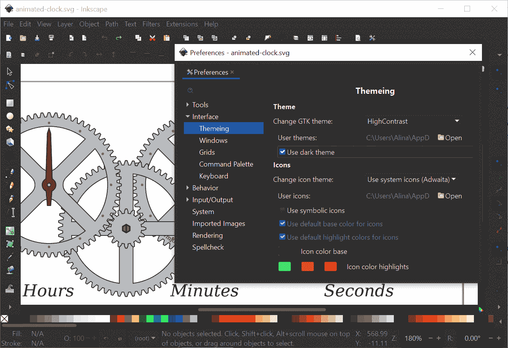

图 3-11：Inkscape 使用 HighContrastInverse 主题并带有多色图标

在同一页面上，你可以选择替代的图标集，并且控制各种工具栏中的图标大小。不幸的是，无法以同样的方式更改 UI 标签的字体大小。你可以向程序中添加新的主题和图标集；可以上网查看是否有你想尝试的。

## 3.10 基本缩放

*缩放*（放大或缩小）会暂时放大或缩小你的绘图视图，以便你检查细节（放大时）或查看整体（缩小时）。缩放不会改变绘图本身，只会改变你对它的视图。

向量图形的（几乎）无限可伸缩性使得缩放成为向量工作中最常见的操作之一。Inkscape 提供了*多种*不同的缩放方式，这并不令人惊讶。

首先，当前的缩放级别始终显示在状态栏右端的 Z:可编辑字段中（画布下方），如图 3-12 所示。你可以随时点击它，输入所需的缩放级别，然后按 Enter 键。


图 3-12：状态栏中的缩放指示器

使用键盘缩放的最简单方法是分别按加号键和减号键（+ 和 -）。小键盘上的键（在大多数台式计算机的键盘最右端）与主键盘上的键（在字母键上方）一样有效。更重要的是，等号（=），通常位于与加号键相同的物理键上，也可以用于放大，而下划线（_），通常位于与减号键相同的键上，可以用于缩小；换句话说，你永远不需要按 Shift 键来访问缩放键。

使用加号和减号键的缩放方法适用于所有工具和模式，除了在编辑文本时。在文本中，主键盘上的加号和减号键会插入相应的字符，但小键盘上的加号和减号键仍然可以用于缩放。

通常你的手已经放在鼠标或平板笔上，因此伸手去按键盘会不太方便。通过鼠标缩放的最简单方法是使用中键（在大多数鼠标上，这其实不是一个按钮，而是一个可以点击和滚动的滚轮）。你点击的位置在缩放后会保持相对位置，因此通过点击某个小物体，你可以直接放大到该物体——这与加号/减号键的不同之处在于，加号/减号键会以可见区域的中心进行缩放。要缩小，请在按住 Shift 键的同时中键点击。

此外，使用滚轮鼠标时，你可以通过向上滚动来放大，向下滚动来缩小。默认情况下，你需要按住 Ctrl 键来进行缩放，因为没有修饰键的滚轮会滚动文档，就像大多数其他程序一样。然而，实际上有一个选项可以让你在不使用修饰键的情况下直接进行缩放，而需要按住 Ctrl 键时才能滚动；你可以在首选项对话框的滚动页面中设置这一选项。

你可以调整加号/减号键、中键点击和单次滚轮点击所执行的缩放量。这个值可以在首选项对话框的行为 ▶ 步骤页面中设置。默认值是 141%，也就是 100 乘以根号 2，这样两次连续的放大操作会把你放大 200%。

## 3.11 缩放工具

在缩放工具（工具栏左侧的放大镜图标）中提供了更多的缩放方法。在我的工作中，我实际上从不切换到这个工具，因为它的所有命令和模式都可以通过各种快捷键在*任何*工具中使用。尽管如此，我们还是来看看缩放工具，以了解 Inkscape 的缩放功能。

正如你所预期的，简单的鼠标点击在 Zoom 工具中是放大，而按住 Shift 键点击则是缩小。然而，有时你已经知道想要放大的区域，并且不想经过所有的中间缩放级别来达到目标缩放。在这种情况下，只需使用该工具拖动，围绕该区域创建一个矩形的橡皮筋——当你释放鼠标时，Inkscape 会直接放大到该区域，正如图 3-13 所示。

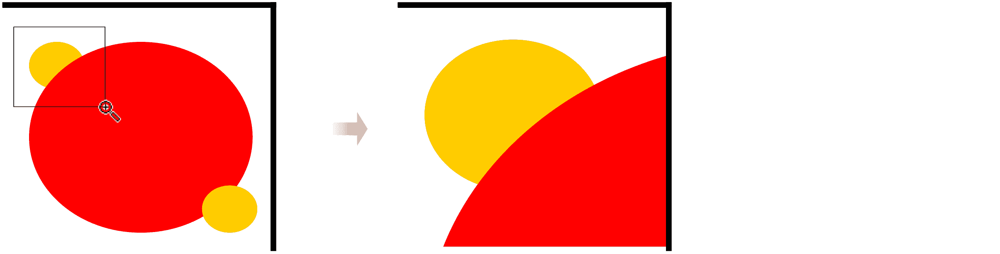

图 3-13：使用缩放工具缩放到某个区域

你也可以在不切换到缩放工具的情况下使用缩放到某个区域的小技巧。在任何工具或模式下，按住 Shift 拖动中键鼠标，开始一个相同的缩放区域橡皮筋，松开鼠标按钮后即可缩放到该区域。

让我们来看一下缩放工具的控制栏，如图 3-14 所示。


图 3-14：缩放工具控制栏上的命令按钮

前两个按钮的功能与加号/减号键相同。接下来是三个预设的缩放按钮：100%（也可以通过 1 键），200%（2 键），和 50%。然后是非常实用的“缩放以适应选择”按钮（也可以通过 3 键）；它会缩放并滚动视图，使当前选择完全适应窗口。接下来的三个按钮分别用于整个绘图（4 键）、页面（5 键）和页面宽度（6 键）。你还可以通过按住 Q 键暂时缩放到选择区域；松开 Q 键将返回到上一个缩放（如果没有选择区域，Q 键则会暂时缩放到页面）。

也许最有趣的是缩放控制栏上的最后两个按钮。如上所述，缩放不会改变文档——因此你不能使用撤销命令来撤销它。然而，还有另一种“撤销缩放”的方法。

每次改变缩放级别时，Inkscape 会记住之前的缩放级别以及你所查看的画布区域。缩放控制栏上的“上一个缩放”和“下一个缩放”按钮允许你在缩放历史中前后跳转。例如，如果你在查看整个图纸后缩放到一个小区域进行编辑，然后又想查看整个图纸，你就不需要反复按减号键了。相反，只需按下反引号键（`），你将立即返回到上一个缩放和视图。按住 Shift 键并再次按下`键，则会重新缩放回相同的小区域。缩放历史是无限的——它会保存从编辑会话开始以来的所有缩放记录。

除了缩放工具栏和快捷键外，所有相同的命令也可以在“视图”菜单的缩放子菜单中找到。

## 3.12 平移

当你在 Inkscape 中*平移*文档时，你改变的是窗口内可见区域的位置，而不改变缩放级别。它基本上与*滚动*相同，不同之处在于滚动假设是单一轴（比如上下滚动），而平移可以朝任何方向进行。缩放后，平移是使用矢量编辑器时最常见的操作。

Inkscape 文档窗口有传统的滚动条，可以水平和垂直滚动以到达画布上的任何位置。然而，滚动条比较笨重，所以我通常更喜欢其他平移方法，并关闭滚动条（Ctrl-B），以腾出更多的画布空间。

你可以使用键盘和鼠标来平移画布。使用键盘时，按住 Ctrl 键并使用箭头键可以在四个方向上滚动画布。比听起来更方便的是，如果按住 Ctrl 键和箭头键，画布移动会*加速*。这意味着你可以通过按下一个键来微调画布位置，或者如果按住不放，则能迅速地将画布移开。键盘滚动的速度（每次按键的距离）以及加速度系数可以在首选项对话框的行为 ▶ 滚动页面中设置。

使用鼠标，最简单的平移画布方法是按住中键拖动画布。再次提醒，这在任何工具或模式下都适用。Inkscape 没有专门的“手”工具来平移画布。你也可以用鼠标滚轮垂直滚动，按住 Shift 键再滚动滚轮可以水平滚动。

Inkscape 尽可能使平移自动化。例如，当你使用选择工具拖动选中的对象并将其推到屏幕边缘时，画布会自动滚动以腾出空间。此外，当你使用 Tab 键选择新的对象或路径节点时，Inkscape 会滚动画布以使该对象或节点可见。

## 3.13 画布方向

如果你曾经看过专业艺术家（画家、漫画家、插画家）工作时，你可能注意到他们如何自由地操作他们的媒体。他们不断倾斜、旋转，甚至翻转他们的作品，以便更好地查看作品以及进行更自然的笔触。你也可以在 Inkscape 中轻松做到这一点。

只需按住 Ctrl-Shift 并使用鼠标滚轮，就可以围绕光标点旋转画布，每次旋转 15 度（要更改此值，请前往**首选项**中的**行为 ▶ 步长**）。为了更精确的控制，可以使用状态栏右端的**R:** 数值控件，如图 3-15 所示。

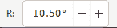

图 3-15：状态栏中的旋转指示器

在视图 ▶ 画布方向中，你还可以水平或垂直翻转（镜像）画布；要去除任何旋转（但不包括翻转）并返回默认视图，请使用同一子菜单中的**重置旋转**。旋转不会影响文档的 SVG 代码，也不会被保存；它仅仅是为了工作空间的方便。

## 3.14 渲染模式

默认情况下，Inkscape 力求将每个文档渲染得尽可能符合 SVG 标准。然而，有时候你需要*编辑*文档，而不仅仅是查看它，这时完全渲染可能会成为一种障碍。这时，你可以切换到 *轮廓* 视图模式（通过菜单选择视图 ▶ 显示模式 ▶ 轮廓）。在轮廓模式下，没有填充、透明、颜色、渐变、模糊或任何其他滤镜。所有对象都以细线轮廓显示，宽度（1 屏幕像素）不受缩放影响，如图 3-16 所示。


图 3-16：正常视图模式（左）和大纲视图模式（右）中的一些对象

切换到大纲模式的明显原因是为了加速复杂渲染文档的工作。并且在大纲模式下，更容易找到并访问不可见的对象（那些完全透明或隐藏在其他对象下的对象）。在这种模式下，一切都可以看见，你可以通过点击其大纲来选择任何对象。

大纲模式中不同颜色的大纲用于区分对象类型。常规路径和形状使用黑色大纲，位图对象（第十八章）显示为红色大纲矩形，带有两条对角线，裁剪路径（18.3 节）是绿色的，遮罩（18.3 节）是蓝色的。文本对象是唯一没有大纲的对象，它们显示为黑色填充。你也可以强制位图图像即使在大纲模式下也能渲染；相应的选项在首选项对话框的导入图像页面中。

大纲模式非常有用，以至于 Inkscape 提供了两种额外的使用方式。你可以通过选择菜单中的查看 ▶ 拆分模式 ▶ X 射线模式或按 Alt-6 来启用*X 射线*模式，而无需将整个文档切换为大纲模式。在此模式下，只有鼠标光标周围的圆形区域会以大纲方式呈现，其余部分则按常规显示（图 3-17）。这样，你可以逐步检查复杂图形的结构，而不会失去完成作品的上下文。或者，你可以启用*拆分视图*模式（查看 ▶ 拆分模式 ▶ 拆分或 Ctrl-6），在这种模式下，绘图被分为左右两部分，带有可拖动的垂直分隔符，左侧显示正常渲染，右侧显示大纲。

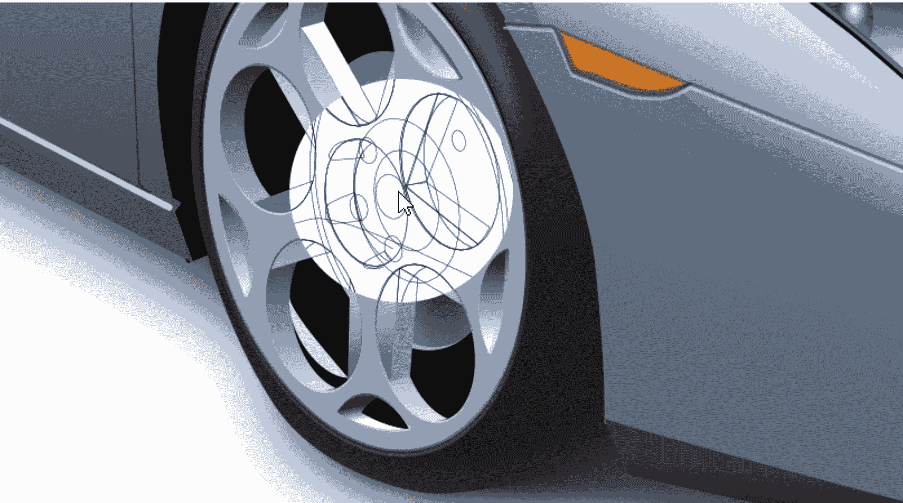

图 3-17：X 射线模式：查看复杂插图内部

*大纲覆盖*显示模式（查看 ▶ 显示模式 ▶ 大纲覆盖）与大纲模式相同，但它在背景中增加了一个淡化的不可点击渲染文档。你仍然可以使用大纲来选择对象，但此模式可以更好地展示这些大纲在正常视图中的对应关系。

另一种加速渲染的方法是通过查看 ▶ 显示模式 ▶ 无滤镜模式访问的*无滤镜*模式。大多数绘图中渲染最慢的元素是滤镜，例如模糊效果（第十七章）。禁用它们后，这种模式可能会显著加速渲染，而不会使绘图变得不可辨认。另一种渲染模式是*可见线条*模式（查看 ▶ 显示模式 ▶ 可见线条），它与正常渲染的唯一区别是，它永远不会让描边（2.8 节）变得不可见，即使你缩放得再远，这在技术图纸中可能会很有用。

使用 Ctrl-5 在所有渲染模式（正常模式、无滤镜、大纲、可见线条、大纲覆盖）之间循环切换。

### 3.14.1 颜色渲染

万一你需要，Inkscape 提供了一种将文档渲染为灰度的方式；你可以从菜单中选择**视图 ▶ 色彩显示模式**，或者按 Alt-5 来切换。

此外，Inkscape 可以在屏幕上模拟某些输出设备的颜色，通常是打印机。这被称为颜色管理视图（来自视图菜单）。此模式的详细设置可以在“首选项”对话框的输入/输出 ▶ 色彩管理页面（校对部分）中进行配置。基本上，你需要的是你想要模拟的设备的*ICC 配置文件*，然后你可以指示 Inkscape 使用该配置文件；详情请参见 18.8。
