# 第四章：对象

对象是 Inkscape 图形的核心内容。本书的大部分内容都将专门讲解各种类型的对象、它们的属性，以及操作它们的技巧。然而，不论类型如何，所有 Inkscape 对象有很多共同点。

本章和接下来的两章将详细讲解对象的基本概念和通用的对象操作。

## 4.1 对象属性

对象只是画布上的某个东西——你绘图的一部分。当然，它并不总是那么简单；看似一个独立的对象可能是其他对象的一部分，或者是多个对象的组合。识别单独的对象需要经验和努力。

Inkscape 有多个对话框用于操作对象的属性，但只有一个足够通用，可以称之为“对象属性”（可以通过按 Shift-Ctrl-O、右键点击对象菜单，或通过对象菜单访问）。选择单个对象（见第五章）来查看其属性，如图 4-1 所示。

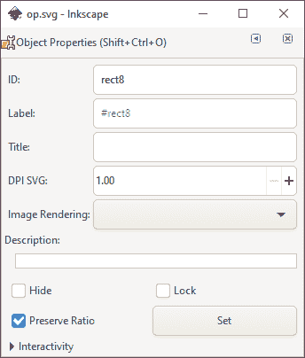

图 4-1：对象属性对话框

对象的*标识符*（ID 字段）是文档 SVG 源文件中对应元素的 `id` 属性（见附录 A）。它的值在文档中始终是唯一的；Inkscape 会自动为所有对象提供唯一的 ID，但你可以在确保唯一性的前提下更改该值。

为对象分配有意义的名称是组织复杂图形的一个有效方法。然而，ID 并不是最好的方式；根据 XML 规则，元素 ID 中只能使用非常有限的字符集——不能包含空格，只能使用拉丁字母、数字、连字符、下划线和点。对于更适合人类使用的替代方法，可以使用对象的标签（它对应于 SVG 中的 `inkscape:label` 扩展属性）。标签的长度可以任意，字符可以随意使用，并且不需要唯一。

隐藏和锁定复选框控制选定对象的锁定和隐藏状态。一个*锁定*的对象是可见的，但大多数选择方法无法选中它，因此无法更改它。一个*隐藏*的对象既不可见*也*无法选择。

我不推荐隐藏或锁定单个对象。你可能会陷入一种困境，需要选择一个对象来解锁或取消隐藏它——但你无法选择，因为它已被隐藏或锁定。针对这种情况，对象菜单中包含两个命令“全部显示”和“解锁全部”，可以将当前图层中的所有对象显示出来并使其可选择。

操作包含你想隐藏或锁定的对象的图层要方便得多。通过图层隐藏和锁定不仅更快捷（一次影响多个对象），而且更容易——即使图层被锁定或隐藏，你依然可以随时访问任何图层（通过图层对话框，见 4.9.4）来更改其状态。

## 4.2 坐标和单位

每当一个对象出现在画布上时，你可以在熟悉的矩形坐标系中测量其位置和大小，横轴为 X 轴，纵轴为 Y 轴。

在 Inkscape 中，坐标原点始终位于页面框架的一个角落（2.3）。早期版本的 Inkscape 将坐标原点放置在页面的左下角，Y 值向上增加。然而，SVG 标准将原点放置在左上角，Y 值向下增加（X 值始终向右增加），最近 Inkscape 也将这一设置作为默认选项放在了其 UI 中。你仍然可以在偏好设置的界面页面中切换回旧的（实际上更自然的）左下角原点（3.1）；只需记住，这只会影响 UI——当你编辑文档的 SVG 代码时（例如，在 Inkscape 的 XML 编辑器中，4.10），所有坐标都假定原点在左上角。

画布区域边缘的标尺是测量坐标的一种方式（如果它们被隐藏，按 Ctrl-R 显示它们）。当你将鼠标移动到画布上时，标尺上的小三角形标记会显示当前位置。此外，鼠标指针的 X 和 Y 坐标始终显示在状态栏的右端，紧接着放大区域标记 Z（图 4-2）。

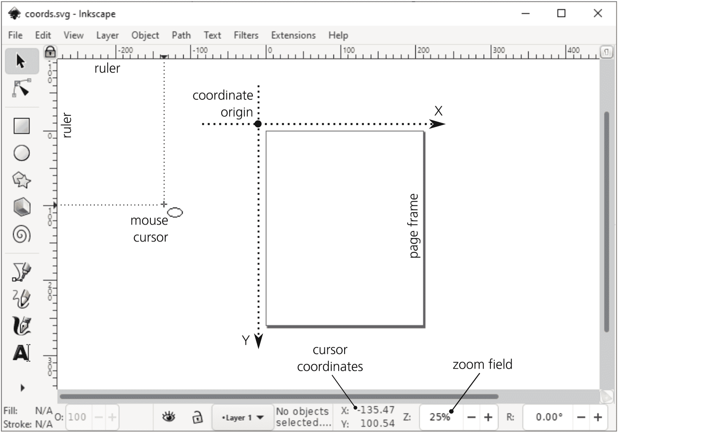

图 4-2：Inkscape 的坐标系统

标尺使用的测量单位与在文档属性对话框中设置的文档单位相同（3.5）。要检查，悬停鼠标光标在标尺上，直到浮动工具提示出现。

## 4.3 边界框

让我们创建一个对象——例如，使用椭圆工具绘制一个椭圆。你会看到，初始选中的对象被一个虚线矩形框住（图 4-3）。这个矩形是对象的*边界框*的可视化表示——它是完全包围该对象的最小矩形。边界框始终是直立的——也就是说，它的边与坐标轴平行；如果你旋转对象，它的边界框可能会或不会改变大小，但它不会与对象一起旋转。（切换到选择工具，通过按方括号键 [ 和 ] 来旋转椭圆。）

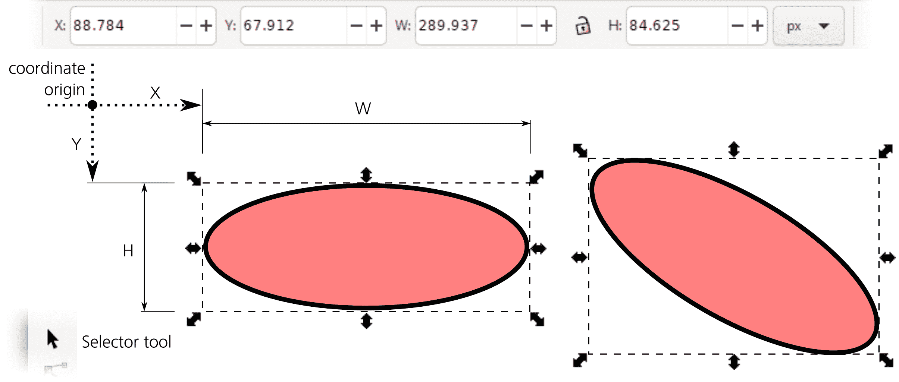

图 4-3：对象的边界框始终是直立的。

选中对象的边界框的坐标和尺寸（宽度、高度）会通过选择工具控制条中的四个可编辑字段显示。X 和 Y 显示框的左上角坐标（或者根据坐标原点偏好，可能是左下角，4.2）；W 和 H 显示边界框的宽度和高度。如果选择了多个对象，这些值反映的是整个选择的边界框。你可以通过右侧的下拉菜单更改这些字段的度量单位；默认情况下，它设置为文档单位（3.5.1）。

当然，你可以点击这些字段中的任意一个并输入一个新值，这会让选中的对象（X 和 Y）移动，或（对于 W 和 H）缩放。如果你希望宽度的变化导致高度按比例变化，或者反之（保持纵横比），请点击 W 和 H 之间的锁定按钮，将它们锁定在一起。

在 Inkscape 中，对象的边界框可以是*可视*（这是默认设置）或 *几何*。要在这两者之间切换，请前往 **偏好设置** 对话框中的 **工具** 页面。可视边界框包括对象的*所有可见部分*——最显著的是其整个描边（9.1），但也包括标记（9.5）和滤镜边距（17.5.4）。几何边界框仅框住对象路径的*几何轮廓*。

几何边界框与对象在大纲模式下的外观紧密对应（3.14）；例如，一个带描边的对象的外缘会*超出*几何边界框。通常，进行技术绘图的用户更倾向使用几何边界框，而其他用户则更喜欢使用可视选项。图 4-3 显示了可视边界框：注意它如何完全包围椭圆的黑色描边。

## 4.4 Z 顺序

*Z 顺序*指的是对象在彼此之上绘制的顺序。Z 顺序顶部的对象如果不透明，可能会遮挡下面的对象。术语 *z-order* 暗示了一个第三坐标轴 Z，想象它是垂直于绘图的 X/Y 平面朝向观众延伸的。Z 顺序中更高的对象因此“更靠近”观众。

你创建的新对象总是被放置在当前图层的 Z 顺序的最顶部（如果你没有创建其他图层，这将是整个文档的 Z 顺序的顶部）。例如，如果你绘制多个椭圆，每个新的椭圆都会画在前一个椭圆的上面，如图 4-4 所示。

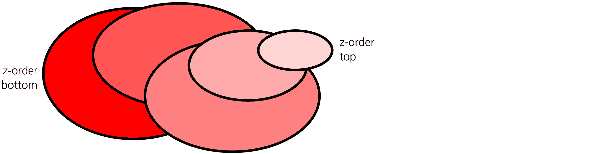

图 4-4：Z 顺序

选择、变换或样式更改操作永远不会改变对象的 z 顺序。这意味着你可以移动、缩放或绘制对象，而它仍然保持在自己的“层次”上——前提是你已经选中了该对象。（在 5.9 中，你将学习如何选择那些位于 z 顺序底部且无法直接点击选择的对象。）

然而，通常你需要重新排列图形中的对象堆栈。Inkscape 有四个基本命令用于在 z 顺序中上下移动对象：两个绝对命令和两个相对命令。它们经常使用，因此你可以通过选择器控制条上的按钮、对象菜单，或简单的键盘快捷键来访问它们。

绝对命令如下：

提升到顶部（Home）

将选定的对象提升到对象图层的最顶部。

降到最底部（结束）

将选定的对象降到对象图层的最底部。

相对命令如下：

提升（Page Up）

将选定对象上移一步（经过另一个对象）。

降低（Page Down）

将选定的对象下移一步（经过另一个对象）。

图 4-5 展示了这些命令如何作用于选中的椭圆，该椭圆位于矩形堆栈的中间。

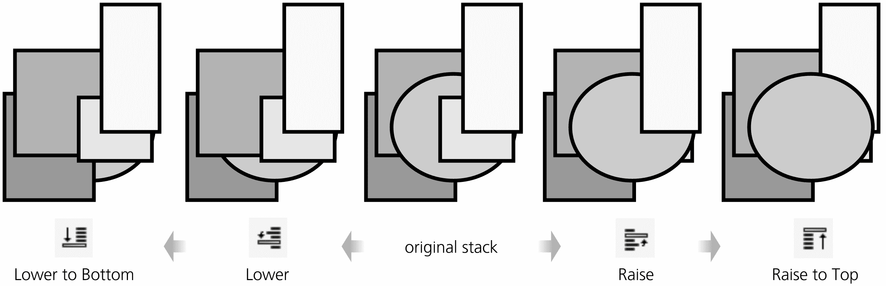

图 4-5：改变 z 顺序

请注意，相对 z 顺序命令仅考虑那些*重叠*选定区域的对象（更准确地说，是那些其边界框与选定区域的边界框重叠的对象）。如果你的选定对象与其他任何对象没有重叠，"提升"和"降低"命令将会将选定区域直接移至图层的顶部或底部，依情况而定。

另一点需要记住的是，所有 z 顺序命令仅在*图层内*起作用。如果文档中有多个图层，这些图层形成各自的 z 顺序，且较低图层中的对象永远不可能位于较高图层中的对象上方。若要重新排列图层的 z 顺序，请使用 4.9.2 中描述的图层命令。

可能会同时选中不同图层或组中的对象。在这种情况下，z 顺序命令仅作用于每个选定对象所在的*其所在的*图层或组。例如，"提升到顶部"命令可能会改变一个选定对象的 z 顺序，但如果该对象本身已经是该图层中的最上层对象，其他对象将不会受到影响。

如果你需要更改大量对象的 z 顺序，可以尝试扩展菜单中的扩展 ▶ 排列 ▶ 重堆叠扩展。它可以根据选定对象的位置或当前 z 顺序，重新排列任何数量的选定对象，如图 4-6 所示。

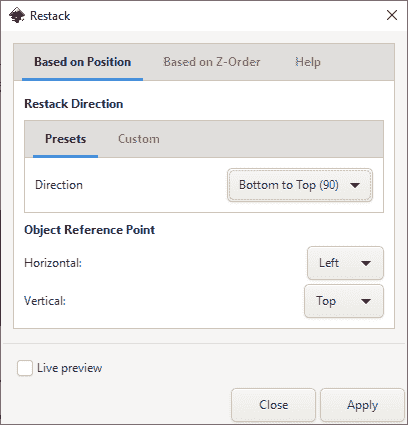

图 4-6：使用重堆叠扩展管理 z 顺序

例如，你可以将对象排序成一个 z 顺序阶梯，从左到右排列——这样，任何两个选定对象中，位于右侧的那个对象会在 z 顺序中排得更高（见图 4-7）。

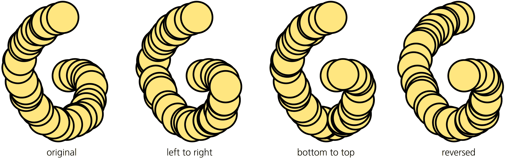

图 4-7：堆叠操作；原始的磁盘散布（左）是使用喷洒工具（4.7）制作的。

扩展命令的对话框让你选择阶梯的方向（四个主要方向，从选区中心的放射状内外，甚至是自定义角度），还可以指定参考点——每个选中对象的哪个点将用于比较位置（可以是任何角落、边中点或中心）。最后，你还可以反转选中对象的当前 z 顺序或随机化它。

## 4.5 复制、剪切、粘贴

Inkscape 支持传统的 *剪贴板操作*：复制、剪切和粘贴。

*复制*（Ctrl-C）将所选对象或对象的副本保存在程序的剪贴板中；*剪切*（Ctrl-X）与复制相同，但对象会被删除。最后，*粘贴*（Ctrl-V）将剪贴板的内容放回文档中（但仍保留在剪贴板中，因此可以多次粘贴相同的对象）。

粘贴命令有两种变体。常规的粘贴（Ctrl-V）将对象放置在当前鼠标光标所在的画布位置。这对于将对象移动到文档的完全不同位置非常方便；只需从原位置剪切，滚动和/或缩放到目标位置，将鼠标悬停在所需位置，然后按 Ctrl-V。你甚至可以通过移动鼠标并反复按 Ctrl-V 来“涂抹”对象的副本。

然而，有时你想将对象粘贴到与复制位置完全相同的地方。这就是粘贴到当前位置（Ctrl-Alt-V）命令的作用。例如，你可以用它将一个对象从一个图层移动到另一个图层，而不改变其在画布上的位置：复制它，切换到目标图层，然后粘贴到当前位置。

当没有任何选中对象时，粘贴的对象始终会放置在当前图层的 z 顺序顶部。然而，如果在粘贴时有任何选中的对象，新粘贴的对象将放置在选中对象中的最上方。你可以在首选项 ▶ 行为 ▶ 选择中禁用此行为：粘贴到选中对象上方，而不是图层顶部。

## 4.6 复制和印章

有时，人们使用复制和粘贴作为获取一个或多个对象副本的方法。在 Inkscape 中，你不需要这种变通方法；有一个方便的复制命令（Ctrl-D），它会创建所选对象的副本，并将其放置在画布的相同位置。这相当于先复制然后粘贴到当前位置，唯一不同的是复制不会改变剪贴板的内容。

所有粘贴和复制命令，和任何其他创建新对象的方法一样，都将新对象放置在当前图层的 z 顺序顶部。

创建对象副本的另一种方法是*戳印*。每当你在选择工具中通过拖动鼠标来变换选择（移动、缩放、旋转或倾斜）（见 2.7），你可以按空格键在不打断交互式变换的情况下留下选择的副本。例如，如果你抓住并拖动一个椭圆，接着按住空格键并继续拖动，正在移动的对象会在画布上留下副本的轨迹。戳印在节点工具中也有效，当你拖动一个节点选择时（12.5.7）。

目前为止讨论的所有对象复制方法都会创建与原始对象没有任何联系的新独立对象。如果你想要一个*链接副本*，它继承原始对象的一些属性，并自动更新，请阅读第十六章中的克隆内容。

## 4.7 喷涂工具 [1.1]

如果说复制/粘贴、重复、戳印还不够，Inkscape 还有一个专门的工具用于向画布中填充对象：喷涂工具（图 4-8）。

图 4-8：喷涂工具会用对象为空你的绘图喷涂。

它的基本操作很简单：选择一个或多个现有对象，然后在画布上拖动来喷涂它们的副本。这颠覆了传统的矢量编辑范式，后者通常让你处理单个对象；喷涂工具，以及通常与之搭配使用的调整工具（6.10），使你可以以*大规模*对象的方式进行思考——比如粒子云、树林、星系、鱼群。

喷涂工具的一些控制与书法笔（14.2）类似。首先，设置你将要绘制的圆形区域的宽度，使用相对的与缩放无关的单位；最大宽度为 100，表示大约是屏幕高度的一半的区域。然后，你可以调整拖动时喷出的副本数量（把它当作绘画的*速度*）。

接下来，你可以改变应用于副本的随机旋转和缩放的程度——从零（相同大小的副本，方向相同）到 100（自由旋转和缩放，大小可达原始对象的两倍）。在绘画区域内，你可以调整散布和聚焦的程度，从零（集中在区域中心）到 100（均匀分布在整个区域）。Inkscape 支持压力感应输入设备，例如 Wacom 平板电脑（3.3），这个工具允许你通过施加压力来调整绘画区域的大小、绘画速度或副本的缩放——或者这些因素的任意组合。

在控制栏的左端，模式切换按钮控制喷涂工具创建的内容：普通副本（默认）、克隆（第十六章）或单一路径的子路径（12.1.1）。在这里，副本是可以独立于原始对象进行更改的对象，而克隆会自动更新以反映原始对象的样式和形状，并且不能单独编辑（除非通过变换）。子路径模式创建一个单一路径对象（12.1），其中重叠的对象会像路径联合操作（12.2）一样合并在一起。第四个模式按钮启用一个喷涂特定的橡皮擦：在此模式下，该工具会选择性地删除其涂画区域内之前喷涂的对象副本或克隆，但不影响其他对象。

### 4.7.1 通过喷涂进行追踪

在喷涂工具控制栏的右端，有一些小部件用于设置另一种喷涂方式：追踪背景。在追踪时，Inkscape 不再盲目地喷出对象副本，而是查看鼠标指针下的内容。它会采样喷涂区域中现有图形的颜色和透明度，并利用这些值修改喷涂方式。（此功能仅在喷涂副本或克隆时可用，而不适用于子路径。）

通常，虽然并非总是如此，你喷涂的已有对象将是位图——例如，一张照片。通过追踪，你可以以一种引人注目的艺术方式，使用任何类型的对象作为“画笔”重新绘制，或者至少覆盖原图。这类似于我稍后将讨论的其他几个 Inkscape 功能，如书法笔追踪（16.6.6）和“创建平铺克隆”对话框中的“追踪”标签（16.6）。

该区域中的前两个切换按钮，分别是眼睛开启和眼睛关闭按钮，让你控制喷涂位置。按下眼睛开启按钮时，喷涂的对象可以出现在不透明的对象上；按下眼睛关闭按钮时，喷涂的对象可以出现在透明对象、位图的透明区域或空白画布上。默认情况下，这两个按钮都被按下——也就是说，你可以在任何地方进行喷涂。

接下来是两个无重叠按钮。普通的*无重叠选项*（类似于 7.5.2 中的去群聚功能）确保喷涂的对象之间不接触，从而使结果看起来更加整洁。按下此按钮后，你还可以指定对象之间的距离；也允许使用负值，这意味着你可以控制部分重叠。

另一个不重叠的按钮会关注鼠标指针下的颜色：它只允许在相同背景色的区域内重叠。通过这种方式，你可以将对象堆叠在单色的单元格内，但避免越过单元格边界，如图 4-9 所示。

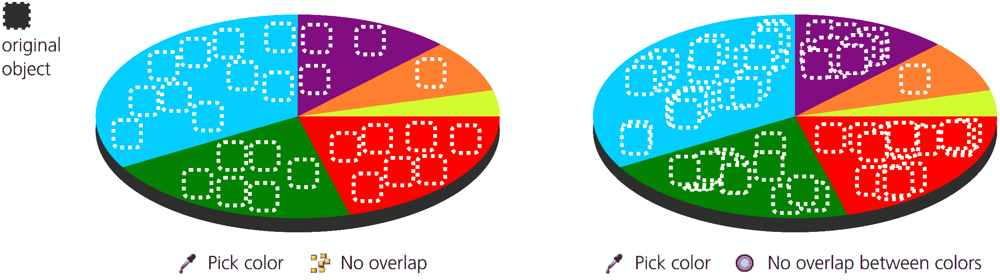

图 4-9：使用带有颜色追踪和不重叠选项的喷洒工具

最后，如果你按下带有吸管图标的按钮，你将启用*拾色器*模式，在该模式下，Inkscape 会从鼠标指针的位置获取颜色和透明度。工具栏上的其他按钮会影响拾取的方式以及如何处理拾取到的值。具体来说，你可以将颜色分配给对象的填充色（这就是图 4-9 所示的效果）和/或描边色；你可以反转拾取到的颜色；还可以从鼠标指针的精确位置拾取颜色（而不是从工具的绘画区域中取平均色）。

请记住，你始终可以使用工具的橡皮擦模式修剪或缩小喷洒物，而不需要完全撤销它们。此外，功能强大的 Tweak 工具是喷洒艺术家工具箱中不可或缺的一部分。通过它，你可以轻松地推动、摇摆、抖动、放大或缩小、旋转或复制喷洒对象（6.10），以及通过改变它们的颜色、透明度或模糊度来修饰它们（8.9）。

## 4.8 组

*分组*是一种将多个独立对象组合成单个对象的方法。这是一个容易逆转的操作：被组合成组的对象可以取消分组并重新独立出来。此外，Inkscape 的许多工具会忽略分组，直接操作单独的对象，无论它们是否已经分组。选择工具默认会将整个组选中——但即使是在选择工具中，也有方法可以选择组内的单个对象而无需取消分组（5.10）。

要将一些对象分组，只需选择它们并选择**对象 ▶ 分组**（Ctrl-G）。组本身也可以像任何其他对象一样被分组。你甚至可以将单个对象进行分组——例如，选择一个矩形并按 Ctrl-G。现在你有了一个包含单个矩形的组。这样的组在某些情况下可能非常有用，比如对一个裁剪的对象进行模糊处理（见 18.3）。

当选中单个组时，状态栏会显示该组内包含的成员对象数目——例如，背景层中的 3 个对象的组。

### 4.8.1 取消分组

要取消分组，选择该组并选择**对象 ▶ 取消分组**（Ctrl-U 或 Ctrl-Shift-G）。该组将不再存在，但其所有原成员会被释放，并且保持在画布上的位置——对象的坐标和层次顺序都会得到保留。

你可以选择任意数量的组，并一次性取消分组。此外，你还可以选择任意数量的不同对象，其中*一些*是组，并按 Ctrl-U：组将被取消分组，所有非组对象将保持不变。

Ungroup（取消分组）命令仅移除最顶层的分组。例如，如果你有一个包含两个其他组的组，按下 Ctrl-U 将释放这两个组——它们仍然被选中，但没有被取消分组。你需要再次按 Ctrl-U 才能取消分组。要取消复杂绘图中所有组的分组，只需选择所有对象并不断按 Ctrl-U，直到状态栏显示“选择中没有可以取消分组的组”。

最后，如果你有很多层次的分组，手动取消分组听起来不太有趣，可以尝试**扩展 ▶ 排列 ▶ 深度取消分组**扩展。它会将你的文档取消分组，直到原子粒子级别——或者，如果你愿意，也可以精确控制取消分组的层数，以及要保留多少层（从底部开始计数）。

### 4.8.2 分组的用途

有几个好的理由来对对象进行分组：

+   首先，分组提供了一种简单的*选择对象集合*的方式。使用选择工具，点击组中的任何对象，整个组都会被选中。从这个角度看，组就像是一个“保存的选择”。选择之后，你可以像对待多个独立选择的对象一样，轻松地移动、缩放或涂色该组。

+   其次，分组是*组织复杂艺术作品*的一种自然方式。当你的绘图中有成千上万个对象时，整理哪些属于一起是非常困难的。组织这种复杂文档的一种方式是通过图层，本章稍后会讨论。但通常，图层过于麻烦——例如，如果你只想确保肖像中的鼻子和眼睛不会彼此相对地意外移动，最简单的方法就是将它们分组在一起。

+   最后，有时分组可以实现一些单独操作无法达到的效果。其中一个效果是*组透明度*（更多关于透明度的内容，请参见 8.3）。

当你对一个组应用透明度时，它会作为一个整体变得透明，*整体效果*可能与对单个对象应用相同透明度有所不同，如图 4-10 所示。

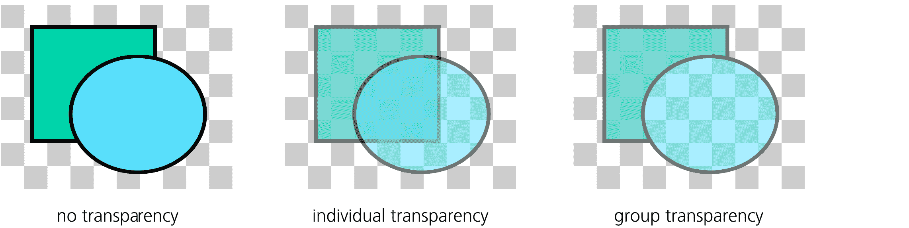

图 4-10：组透明度

在左侧，两个独立的对象完全不透明（零透明度）。中间部分，它们作为独立对象变得 50%透明；注意，矩形的角落透过椭圆可见。右侧，原本不透明的对象被分组，然后该组被设置为 50%透明；此时，棋盘背景透过了对象，但矩形的重叠区域仍被椭圆遮挡，看不见。

### 4.8.3 组与 Z 轴顺序

一个重要的记住的是，作为对象的组在文档的 z 轴顺序中有自己独立的位置，组内所有成员共享该 z 轴位置。

这意味着如果对象 A 在 B 之上，B 在 C 之上，你无法将 A 和 C 分组而不改变 z 轴顺序。如果你试图这么做，C 将跳到 B 之上，A 和 C 的组合将位于 B 对象的顶部。

在这种情况下，取消分组不会恢复原始的 z 轴顺序。如果你取消分组“A 和 C”组，你将得到三个独立的对象，但它们现在的顺序是 A、C、B（从上到下）。 （当然，如果你在分组后立即按 Ctrl-Z 撤销，分组和 z 轴顺序的变化都会被恢复。）

出于同样的原因，你不能将不同图层的对象分组。图层和组都是文档 XML 树的分支，你不能让一个分支（组）从多个父分支（图层）生长。如果你尝试将不同图层或不同组中的对象分组，Inkscape 会发出警告（在状态栏中显示信息），并且不会执行任何操作。

## 4.9 图层

Inkscape 中的图层正如名称所示：“文档中的层级”或“楼层”，这些层级堆叠在一起，并包含其他对象。每个图层都有一个名称。图层很容易隐藏（使其不可见）、锁定（防止修改）或重新排列。

每个对象属于一个且仅属于一个图层。要找出该对象属于哪个图层，只需选择该对象并查看状态栏。它会显示类似“矩形在图层 Layer 1 中”的信息；这里，Layer 1 是图层的名称。当然，你可以选择来自不同图层的对象，在这种情况下，状态栏会显示，例如，2 个对象在 2 个图层中。

文档中的一个图层始终是*当前*图层。你创建、粘贴或导入的所有新对象都将添加到当前图层。为了使复杂图形中的图层更易于操作，Inkscape 的当前图层会*跟随选择*。也就是说，如果你在图层 A 中并选择了图层 B 中的一些对象（例如，点击它），图层 B 就会成为新的当前图层。相反，如果你更改了当前图层，选择的对象会被取消选择。

Inkscape 会在保存文档时记住当前图层，并在以后加载文档时恢复它。一个新的文档模板（见 3.2）通常包含一个名为 Layer 1 的初始图层；当你加载模板时，它是当前图层——因此，如果你没有创建任何新图层，所有的对象都会被放入 Layer 1。

和单个对象一样，图层也可以被锁定或隐藏。在一个*锁定*的图层中，对象是可见的，但无法选择。在一个*隐藏*的图层中，对象既不可见也无法选择。你不能将新对象添加到一个已隐藏或已锁定的图层中。

通常，当你想简化复杂的艺术作品以专注于其中某些部分时，可以隐藏图层。隐藏复杂图层可以显著加快屏幕重绘速度，从而使工作更加舒适。锁定图层在你希望某些背景对象可见但不可选择时非常有用——通常是为了便于通过点击或拖动周围的对象来选择前景对象。

### 4.9.1 图层层级

在更高级的层面上，Inkscape 中的图层与组密切相关。事实上，图层只是 Inkscape 以特殊方式处理的一种组。

就像组可以包含其他组作为成员一样，图层也可以包含进一步的*sublayers*。这对于组织复杂的艺术作品非常有用。你可能会有一个层次结构的树，而不是一个平面的图层列表，其中相关的图层按共同的父节点进行分组。你可以通过提升/降低或隐藏/锁定整个树的分支来管理文档，而不是逐个管理单独的图层。

更好的是，你可以*进入一个组*。这意味着告诉 Inkscape 临时将一个组视为子图层，并使该子图层成为当前图层。要做到这一点，只需选择该组并双击它，或按 Ctrl-Enter，或右键点击它并从弹出菜单中选择**进入组**。

这个技巧结合了组的优点（组容易选择、移动、变换、样式化、查看边界框等）与图层的优点（图层定义了一个你可以舒适工作的上下文——例如，通过向其中添加新对象）。特别是，移动某个对象*到*现有组中的最简单方法是剪切该对象（Ctrl-X），进入该组，并将对象粘贴到那里（Ctrl-V，或如果你想保持位置，则按 Ctrl-Alt-V）。

要离开一个子图层——无论它是真正的子图层还是你进入的一个组——按 Ctrl-Backspace，或双击一个空白画布区域，或右键点击任何位置并从弹出菜单中选择**返回父级**。

### 4.9.2 图层菜单

最重要的图层命令都集中在“图层”菜单中：

+   **添加图层**命令会创建一个新图层并要求你为其命名（图 4-11）。你还可以选择将其放置在当前图层的上方（默认）、下方或作为子图层放置在当前图层内部。图层名称不必唯一，可以使用任意字符。在 SVG 源代码中，图层的名称存储在`inkscape:label`属性中。

    图 4-11：创建新图层

+   “重命名图层”、“复制当前图层”和“删除当前图层”命令会按照它们的功能执行。复制一个图层会复制其中的所有对象。同样地（小心！），删除图层会删除其中所有的对象。

+   这两个 Switch 命令只是将当前图层切换到其上方或下方的图层。这些命令仅定义了其他操作的上下文；它们不会更改文档中的任何内容，因此不能撤销（只有实际更改文档的命令才能撤销）。

+   接下来的两个命令，将选择移动到上层（Shift-Page Up）和将选择移动到下层（Shift-Page Down），将当前选择移动到当前图层的上层或下层。（如果当前图层上方或下方没有图层，这些命令不会执行，并会在状态栏中提示。）通过跨越图层边界，这些命令与常规的 z-order 变更命令（如提升或降低，4.4）互为补充，这些命令仅在同一图层内工作。

    要将一个对象从一个图层移动到任何其他图层，不一定是相邻的，剪切该对象（Ctrl-X），切换到目标图层，然后粘贴到该位置（Ctrl-Alt-V）。如果需要从一个组中提取对象，请在组内选择它（5.10），然后使用**对象 ▶ 从组中弹出所选对象**。

+   四个 z-order 命令——提升图层（Shift-Ctrl-Page Up）、降低图层（Shift-Ctrl-Page Down）、图层置顶（Shift-Ctrl-Home）和图层置底（Shift-Ctrl-End）——等同于对象的 z-order 命令（4.4），只是它们作用于当前图层，通过将其（及其所有对象和子图层）在同级图层中上下移动。如你所见，这些命令的键盘快捷键与对象 z-order 命令相同，只是加了 Shift-Ctrl。

+   最后，Layers... 命令（Shift-Ctrl-L）打开图层对话框（4.9.4）。

### 4.9.3 当前图层指示器

Inkscape 有两个主要的 UI 控件用于处理图层：状态栏中的基本当前图层指示器和功能更强大的图层对话框。

*当前图层指示器*显示当前图层的名称，并通过左侧的两个切换按钮指示该图层是否被隐藏（眼睛按钮）和/或锁定（锁定按钮），如图 4-12 所示。

图 4-12：状态栏中的当前图层指示器

它是一个交互式控件，不仅仅是一个显示器；你可以切换按钮并使用所有图层的弹出菜单来更改当前图层（图 4-13）。

图 4-13：文档中所有图层的弹出菜单

在图层列表中，当前图层用粗体和项目符号标记。锁定的图层名称周围有方括号（例如，[background]）。隐藏图层的名称为灰色。临时图层（例如，您进入的组，5.10）使用斜体显示其名称。

### 4.9.4 图层对话框

当前图层指示器非常实用，因为它始终处于活动状态且占用的屏幕空间很小。不过，这仅适用于图层结构小而简单的情况。在更复杂的文档中，它会迅速变得笨重。这时，你需要使用图层对话框（Shift-Ctrl-L），如图 4-14 所示。

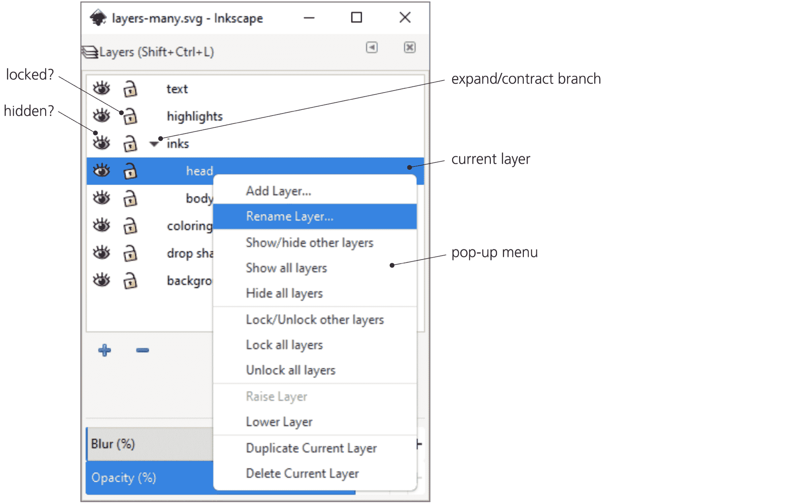

图 4-14：图层对话框

在图层列表中，你可以通过点击三角形标记来展开或折叠图层内子图层的分支。此外，你还可以通过点击图层名称左侧的相应图标来锁定或解锁、隐藏或显示任何图层，而不必使其成为当前图层。

在图层列表下方，六个按钮依次对应以下命令：创建新图层（你需要提供一个名称）、删除当前图层、将当前图层移至顶部、上移当前图层、下移当前图层、将当前图层移至底部。要重命名图层，只需点击图层列表中的名称并输入新名称，然后按 Enter 键。

右键点击图层名称以打开弹出菜单。除了添加、重命名、升降、复制图层等常见命令外，它还包含一些命令，允许你隐藏/显示以及锁定/解锁所有图层或所有图层（除了你点击的图层）。

在对话框的底部，有一个可以应用于当前整个图层的混合模式列表（17.2）。再往下，有两个滑块控制器，可以设置当前整个图层的不透明度或模糊级别。这些控制会影响该图层中的所有对象（关于组的不透明度，请参见 4.8.2）。

### 4.9.5 对象对话框

与 Adobe Illustrator 不同，Inkscape 的图层对话框不显示图层内的单个对象。还有另一个对话框，名为“对象”（Object ▶ Objects），它列出了图层层次结构中的所有单个对象（图 4-15）。

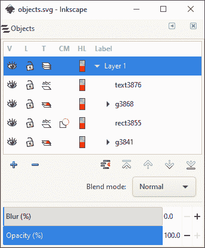

图 4-15：对象对话框

在许多方面，这个对话框与图层对话框相似。你可以添加或删除图层，重新排列它们，或为任何图层或单个对象设置混合模式（17.2）、模糊和不透明度级别。你可以切换任何对象的可见（V 列）和锁定（L）状态，还可以将组转换为图层，或将图层转换为组（点击 T 列中的图标）。该对话框还标记了被剪切或蒙版的对象（CM），并让你选择该对象（如果是路径的话）在节点工具中的路径高亮颜色（HL）（12.5.1）。

## 4.10 XML 编辑器

XML 编辑器是 Inkscape 与其他矢量编辑器的一个重要区别。这里可以看到文档的完整原始源代码，所有内容都清晰可见且未经过任何隐藏或（误）解读。简而言之，如果某些内容没有显示在 XML 编辑器中，那它就不在你的文档里。

如果你正在学习 SVG 或者仅仅对文档中某些对象或属性背后的内容感兴趣，那么 XML 编辑器是你最合适的工具。在这里，你可以对文档做任何操作。甚至可以说，XML 编辑器是程序中唯一必要的部分，其他部分都只是可选的便捷功能！

XML 编辑器与 Inkscape 其他部分完全同步。你在 XML 树中做的任何更改会立即反映在画布上，而你使用其他工具做的任何更改也会立即显示为 XML 编辑器中的元素或属性变化。

XML 编辑器有两个主要面板，分别是文档树和所选节点的属性面板（图 4-16）。你可以通过右下角的切换按钮水平或垂直排列这些面板。你还可以通过左下角的显示属性开关来隐藏属性面板。

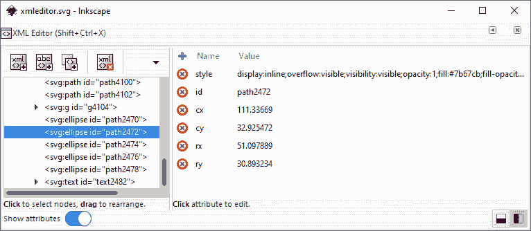

图 4-16：XML 编辑器

### 4.10.1 树面板

这个面板展示了你正在编辑的文档的整个树结构。树中的每个节点（列表中的每一行）要么是 XML 元素，要么是文本节点。在 SVG 中，文本节点仅用于存储文本对象的文本内容；所有其他对象都是元素节点。例如，`svg:rect` 是矩形，`svg:g` 是一个组或图层（这里，`svg` 是命名空间前缀；见 A.2）。一个节点可能具有的所有属性，这个面板只显示 `id` 属性（它是唯一的，因此是区分相同类型节点的自然方式）。

列表中的并非每个元素都是可见的 Inkscape 对象。有些元素代表的是你在画布上看不到的东西（例如元数据）。有关各种 SVG 和 Inkscape 元素的更多信息，请参见 附录 A。

在文档树中，你可以通过点击任意元素来选择它。这个列表选择与 Inkscape 中的常规对象选择是同步的。如果选中的节点对应于一个可见对象，则该对象会在画布上被选中；反之，当你在画布上选择一个对象时，XML 树面板会滚动到相应的节点并高亮显示。这是访问一些通常无法访问的元素的一种方式，例如被锁定或隐藏的元素（4.1）。

在树面板上方，有一个小工具栏，包含用于通用 XML 操作的按钮：创建新元素或文本节点、复制或删除所选节点。最后四个按钮用于在树中移动所选节点（及其子节点）。你可以通过左右箭头按钮将节点水平移动，改变其嵌套级别（左箭头按钮将节点从父节点的子节点变为其兄弟节点；右箭头按钮将节点转换为其前一个兄弟节点的子节点），或者使用上下箭头将节点在其兄弟节点之间移动。你还可以通过拖动节点在树内重新排列它们。

### 4.10.2 属性面板

此窗格列出了所选元素节点的属性。（如果你选择了一个文本节点，该窗格允许你像编辑名为“content”的属性一样编辑节点的文本。）每个属性都有一个名称和一个值，列在表格的两列中。在 XML 中，属性的顺序不重要。

要编辑属性的值，只需点击它并直接编辑（图 4-17）。如果现有的值太长，无法显示在一行内，会弹出一个便捷的小窗口，您可以在其中编辑自动换行的值。（这通常适用于`style`属性；不过，更多方便的编辑对象样式属性的方法，请参见 8.1）。按下 Enter 键接受更改。

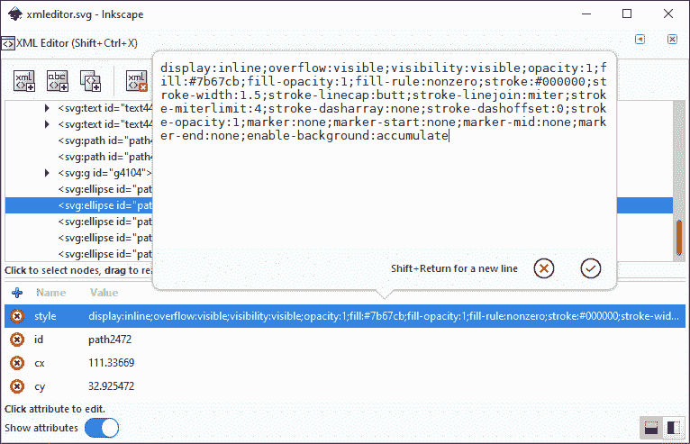

图 4-17：在 XML 编辑器中编辑`style`属性

要删除一个属性，请点击左列中的红色“x”按钮。要添加一个新属性，请使用该列顶部的蓝色加号按钮。
