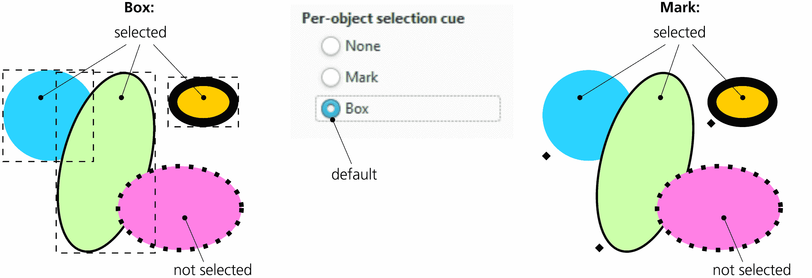
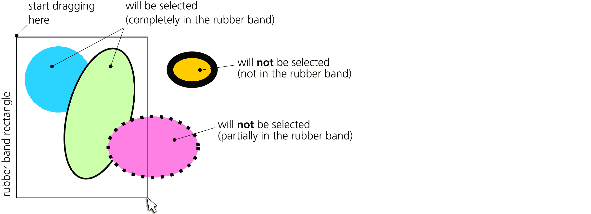
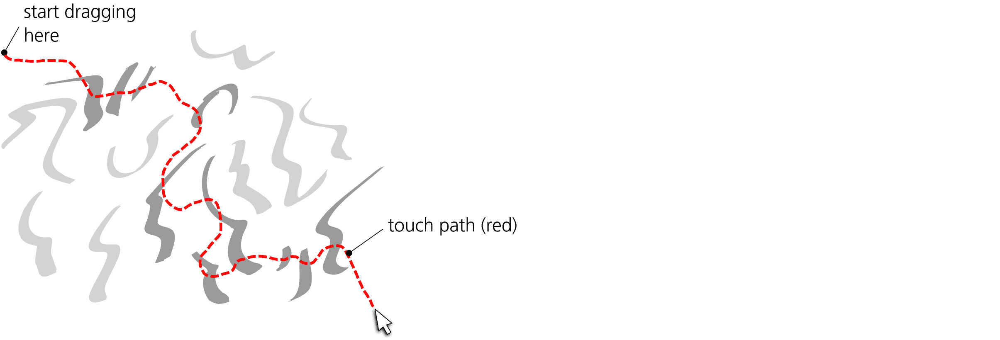
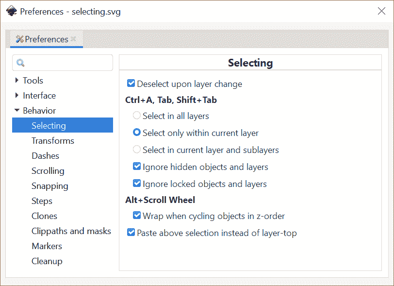
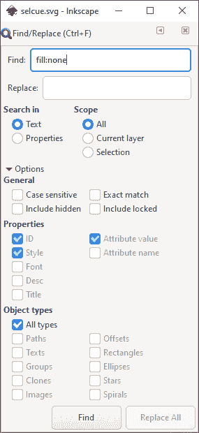

# 第五章：选择

在 Inkscape 中，你几乎无法在不先选择某个对象或对象的情况下进行任何有用的操作。在所有 Inkscape 操作中，选择操作拥有最多的方式、工具、对话框和快捷键。你需要了解其中的大部分，以便高效工作——至少了解其中的一些，以便能够在 Inkscape 中进行任何操作。

单独地，选择或取消选择对象不会以任何方式改变文档。因此，本章中描述的所有技术都不是可以撤销的操作，也不要求保存文档。

## 5.1 选择提示

如你所知，Inkscape 的选择实际上是一个对象列表，其中可以包含任何内容——从没有对象（空选择，未选择任何东西）到文档中的所有对象。选择是局部的，适用于编辑窗口；如果你打开第二个窗口并显示同一文档（3.6），该窗口将拥有自己的独立选择对象列表。被选择的对象可以位于画布的任何位置，任何图层或组中；多个被选择的对象不必是同一父对象的子对象。你*不能*做的唯一事情是同时选择一个对象及其祖先（5.10）。

在画布上，每个被选择的对象都会通过选择提示进行标记。默认情况下，这个提示是围绕对象的虚线框，显示该对象的边界框（4.3）。这个框使用对比色绘制在所有对象之上，因此在任何背景上都能看到。

你可以切换到不同的选择提示：在每个对象的边界框的左下角有一个小的菱形标记，如图 5-1 所示。要更改选择提示的类型或完全关闭它，转到**工具 ▶ 选择器**子页面，在**首选项**对话框中进行设置。

图 5-1：两种可能的选择提示类型

此外，你还可以控制哪些工具显示选择提示，哪些不显示。为此，查找“显示选择提示”复选框，该复选框位于每个工具页面的**首选项**对话框中。默认情况下，每个工具都会显示选择提示，除了测量工具、橡皮擦工具、调整工具、书法工具和油漆桶工具——即那些选择提示不太有用或可能造成干扰的工具。（当然，无论选择提示是否显示，选择本身依然存在——无论如何切换工具，选择都保持不变。）

## 5.2 选择与状态栏

在你选择或取消选择对象时，程序会发生很多事情。Inkscape 会立即将所有注意力集中到新的选择上。它重新绘制选择提示，必要时滚动画布以显示所选对象（3.12），并更新界面上的各种显示和指示器。

Inkscape 状态栏是获取提示信息的最重要来源之一，它会显示尽可能多的关于选择的相关信息。对于一个单一的选择对象，它会告诉你对象的类型，列出某些类型的附加属性（例如路径的节点数量、文本对象的字体家族和大小），显示该对象所在的图层名称，并提供一些有用的建议，如图 5-2 所示。

图 5-2：状态栏：选择的单个对象

对于多个选择的对象，Inkscape 会告诉你选择了多少个对象，并列出它们的类型（见图 5-3）。

图 5-3：状态栏：选择的多个对象

如果选择了多个图层中的对象，Inkscape 会显示对象的数量、所在的图层以及对象的类型（见图 5-4）。

图 5-4：状态栏：在多个图层中选择的多种类型的多个对象

状态栏消息区域左侧是当前图层指示器（见 4.9.3）。由于所选对象可能位于不同的图层，此控件与选择内容并不直接关联。然而，当你单击选择一个对象时，Inkscape 假定你现在想在该对象所在的图层中工作——因此，它会将该图层设为当前图层，指示器也会反映这一点。

状态栏更左侧是*选中样式指示器*，它始终反映当前选择的样式（如果选中了多种样式的对象，它会显示这些样式的平均值，或者如果样式无法平均，它会显示“不同”）。我在 8.2 中详细讨论了这个重要控件。

## 5.3 子选择

一些工具允许更精细的选择方式，从而对选定对象的某一部分进行操作，而不是整个对象。这个选定对象的部分有时被称为*子选择*。

一个例子是文本工具。你可以选择整个文本对象，但也可以通过按住 Shift 和使用箭头键，或通过鼠标拖动，在该对象内部选择*文本片段*，就像在文本编辑器中一样（见 15.1.1）。这个选中的文本部分就是文本子选择。

另一个例子是渐变工具。一个渐变可以包含多个停止点（见 10.5），而该工具可以一次选择一个或多个停止点。渐变停止点自然只对所选对象可见——因此，如果你选择了一个停止点，你就在常规对象选择中创建了一个子选择。

当你更改子选择时，Inkscape 中有些行为与更改选择时相同。特别地，状态栏中的选定样式指示器（图 8-2）显示子选择的样式——也就是说，显示的是选定文本片段的样式，而不是整个文本，或者是选定渐变停止的样式，而不是整个对象。此外，任何样式设置命令（如点击调色板上的颜色，或通过按 Shift-Ctrl-V 粘贴样式）都会应用到子选择上（如果存在的话）。换句话说，子选择允许你处理对象的部分内容，几乎就像它们是独立的对象一样。

## 5.4 通过点击选择：选择器

你可能已经知道，工具栏中最上面的工具是选择器，使用该工具点击一个对象将选择该对象。当然，选择器工具不仅仅如此，让我们更详细地看一下这个简单的操作。

首先，请注意，点击一个对象会*取消选择*任何先前的选择。此外，使用选择器工具，你不仅可以选择对象，还可以*拖动*选定的对象到任何方向。结合这两个功能，可以轻松自如地移动对象——几乎无需考虑“选择”这个过程。你看到一个对象，点击并将它拖到你想要的位置。点击选择它，取消选择其他任何对象，然后拖动它。

有时候，这种行为可能会令人烦恼。特别是如果你使用的是带笔的平板电脑而不是鼠标，你可能会发现，当你只是想通过点击选择一个对象时，容易不小心将其推移。为了减少这个问题，进入**首选项**对话框的**输入/输出 ▶ 输入设备**页面，调整**点击/拖动阈值**值。这是允许鼠标“滑动”的范围，默认值为 4 像素；如果你点击并拖动一个对象的距离少于这个像素值，那么你的操作仍然被视为点击，且对象不会移动。如果你经常在点击时不小心移动了对象而不是选择它，增加这个值；相反，如果你发现当你想真正移动对象时，对象总是恼人的“卡住”，可以减少这个值。

然而，在你点击任何东西之前，你需要确保自己点击的是正确的位置，并且你的点击不会浪费。Inkscape 试图提供帮助：当你鼠标指针悬停在一个可点击区域上时，它会通过在鼠标指针上附加一个带箭头的十字图标来提示你，而不是在空白画布上显示一个普通的箭头。

玩一玩这个改变鼠标指针的功能。你会发现，没有填充的对象无法通过点击其中选择，完全透明的对象根本无法通过点击选择（尽管你可以使用橡皮带选择它们，正如你将在下一节中看到的那样）。在轮廓模式（3.14）下，你只能通过点击对象的轮廓来选择它。

如你所想，这种改变光标的方式在复杂图形中并不太有用，因为整个画布通常都被对象覆盖。然而，如果你将背景对象分离到一个图层并锁定该图层（4.9），这些对象现在变得不可选择，将不再改变光标——所以你可以通过将鼠标移到前景对象上来重新感知它们。

此外，你会注意到每个可点击的对象周围都有一个不可见的区域，宽度为几个像素。点击这个区域仍然会选择对象。这对于选择小对象非常方便，否则这些小对象几乎不可能准确点击。缺点是，这也解释了为什么有时候即使底部的对象稍微突出于顶部对象，也很难选择堆叠中的底部对象。

如果你不喜欢这个可点击区域的大小，你可以在首选项对话框的输入/输出 ▶ 输入设备页面中进行更改。这是抓取灵敏度值，默认值为 8 个屏幕像素。请注意，这个值和点击/拖动阈值都以屏幕像素为单位，这意味着它们不依赖于缩放；当然，当你放大时，进行小范围移动和选择小对象会更加容易。

## 5.5 通过点击选择：其他工具

Inkscape 用户界面的一项原则是一致性。除非有特别的原因，否则所有工具和模式都力求表现一致。这意味着许多工具，像选择器一样，都可以通过点击来选择对象。

通过点击选择适用于以下工具：节点工具（12.5）、所有形状工具（第十一章）、文本工具（第十五章）、连接器工具（1.2）、渐变工具（10.1）和网格工具（10.7）。不能通过点击选择的工具之所以不同，是因为这些工具的单击保留用于该工具的其他功能。

与选择器不同，这些工具即使在对象被分组的情况下，也会直接选择单独的对象（换句话说，在这些工具中，简单的点击相当于在选择器中按 Ctrl+点击，5.10）。这是有道理的；所有这些工具都是针对不同类型的单独对象工作的，所以在大多数情况下，选择一个组并不是你真正想做的事情。例如，如果你用节点工具选择一个组，你将无法对其进行任何有用的操作——一个组没有路径节点可以编辑。这就是为什么该工具始终直接选择你点击的*路径*，无论它是否被分组。

此外，不像选择器，其他工具在可选择的对象上不会改变光标。唯一的例外是文本工具，当它悬停在可编辑文本对象上时，会切换为文本插入光标（15.1）。

## 5.6 添加到选择中

一个选择可以包含多个对象。如果你已经选择了一些对象，然后想选择其他对象，你能在不重新开始选择的情况下做到吗？

要*添加*另一个对象到当前选择中，按 Shift 键并点击它。相反，如果你按住 Shift 键点击一个已选择的对象，它将*从选择中移除*。这个快捷键作为切换工作，反转你按 Shift 键点击的对象的选择状态。

## 5.7 使用橡皮筋选择

在选择器中，选择多个对象的另一种方式是通过*拖动*它们。想象一个矩形框住了你想选择的所有对象，然后从矩形的一个角拖动到对角线的另一个角。（拖动的具体方向——例如从左上角到右下角或从右上角到左下角——并不重要。）这个矩形框（如图 5-5 所示），在你拖动时可见，称为*橡皮筋*或*选框*。

图 5-5：使用橡皮筋（鼠标拖动）选择多个对象

使用橡皮筋选择并*不是切换*；一旦你开始一个新的橡皮筋选择，任何先前的选择都会被取消。这就是为什么逻辑上，单击空白区域（而不是对象）会取消任何选择——它实际上是一个零大小的橡皮筋，取消了旧选择而没有创建新的选择。

橡皮筋会选择所有可见且未锁定图层中完全被包含的对象——换句话说，跨越整个文档的 z 层次堆栈，而不仅仅是当前图层。（因此，使用橡皮筋选择不会改变当前图层，即使它导致选择了一个不同图层中的单个对象。）此外，橡皮筋会选择那些你无法通过点击选择的对象——比如那些被其他对象覆盖的、没有填充和描边的对象，以及完全透明的对象（透明度为零）。然而，隐藏或锁定的对象（4.1）仍然不能被选择。

简而言之，如果一个对象的边界框完全在橡皮筋矩形框内，并且该对象是可以选择的，它*将*被选中。

很容易假设，就像点击一样，按住 Shift 键拖动橡皮筋会给你一种切换的行为。然而，情况并非完全如此。使用选择工具按住 Shift 键拖动与普通拖动相似，只是它*总是*会创建一个橡皮筋，即使你从一个对象开始，而不是从空白画布开始，*然后*将（而不是切换）包含的对象添加到选择中。如果不按 Shift 键，从一个（可选择的）对象拖动将选择并移动该对象，但按住 Shift 键并拖动*强制*创建橡皮筋——这使得它在复杂的图形中更加有用，因为在这些图形中空白画布可能很难找到。

## 5.8 触摸选择

触摸选择是橡皮筋选择的亲戚。在选择工具中，如果没有先前的选择，按住 Alt 从空白画布拖动。你会看到鼠标光标留下的红色轨迹——*触摸路径*。松开鼠标按钮后，所有被（而非包含在）该轨迹“触摸到”的对象将被选中（图 5-6）。

图 5-6：使用触摸选择（Alt-拖动）。松开鼠标后将被选中的对象用深灰色标记。

这意味着你可以字面上“涂抹”你想选择的对象，这在你需要选择的对象靠得很近但它们的边界框太大（或与其他对象交织在一起）无法使用橡皮筋时非常方便。

与橡皮筋选择不同，触摸选择不会选择完全透明的对象或被其他对象遮挡的对象——也就是说，你无法真正“触摸到”的对象。事实上，触摸选择的行为完全像沿着触摸路径进行的一系列 Shift-点击，每个被触摸的对象都会收到一次这样的点击。

如果已有选择，按住 Alt 拖动具有不同的功能：它会移动选择，不论你将其拖动到哪里（6.1）。如果你已经选择了某些对象并希望用触摸选择来*添加*它们呢？使用 Shift-Alt 拖动：就像 Shift 强制使用橡皮筋一样，即使你从一个对象开始，触摸选择也会强制使用触摸路径，即使你有先前的选择。然后被触摸到的对象将被*添加*到选择中。

如果你进行触摸选择以便随后删除它们，橡皮擦工具的删除模式（14.4）会同时执行两项功能：拖动覆盖对象，松开鼠标后它们将被删除。在橡皮擦工具中，你不需要按住 Alt。

## 5.9 从下方选择对象

在复杂图形中选择对象时，一个常见问题是某些对象会遮挡其他对象。即使顶部对象部分透明且你能看到下面的另一个对象，单纯点击它仍然会选择顶部对象。

如果底部对象的边界框小于顶部对象的边界框，你可以按住 Shift 拖动一个橡皮筋围绕较小的底部对象，这样它将被选中而不会选中顶部对象。然而，这并非总是可行的。

### 5.9.1 Alt-点击

要选择那些不在 z 轴顺序顶部的对象，使用 Alt-点击，它会*选择当前选中对象下方*的对象。这意味着 Alt-点击的结果取决于当前的选择；如果没有任何选择，或者你在当前选择外部 Alt-点击，结果就和你普通点击一样。

然而，如果您点击一个已选中的对象，并且它下方还有其他对象，Alt+点击将取消选中已选中的对象，并选择紧接在其下方的对象。下一个 Alt+点击将选择更深层次的对象，依此类推。当您到达点击点处的最底层对象时，下一个 Alt+点击将重新选择最顶部的对象。

假设您有三个堆叠的对象，从底部到顶部分别编号为 1、2、3。未选中任何对象时，Alt+点击会选择最顶部的对象，即 3。下一个 Alt+点击选择 2，再然后是 1，再然后是 3，依此类推。

Shift+Alt+点击与 Alt+点击的区别，就像 Shift+点击与普通点击的区别一样：它会添加或移除选择，而不会完全取消选择。因此，在我们的 1、2、3 对象堆叠中，第一次 Shift+Alt+点击选择 3；再一次 Shift+Alt+点击后，您将选择 2 和 3；再点击一次，最底部的对象也会被添加到选择中。因此，经过三次 Shift+Alt+点击后，您将选中 1、2 和 3。之后的 Shift+Alt+点击将切换 3 的选中状态，同时保持 1 和 2 被选中。

### 5.9.2 Alt+滚动 [1.1]

如果您的鼠标有滚轮，还有一种选择对象的方式，即在对象下方进行选择。按住 Alt 键的同时旋转滚轮，可以逐一选择鼠标光标下堆叠中的对象，每次一个对象。向前旋转时从堆叠的顶部到底部；向后旋转时则从底部到顶部。因此，在前一节中的 1-2-3 堆叠示例中，向前滚动 Alt+滚轮会按顺序选择对象 3、2、1、3、2，依此类推；向后滚动则会选择 1、2、3、1、2，依此类推。

为了使操作更加直观，Inkscape 在您进行 Alt+滚动时，会暂时调整堆叠中所有对象的不透明度，覆盖它们可能具有的任何自然不透明度（图 5-7）。一旦开始旋转，堆叠中的所有对象都会变得半透明，唯一不变的是新选中的对象，它会变为完全不透明。这样，您可以一眼看到自己在堆叠中的位置，以及需要滚动多少才能找到所需的对象。

图 5-7：使用 Alt+滚轮（向前旋转）从对象堆叠中选择一个

如果在 Alt+滚动时按住 Shift，Inkscape 将不会取消选中上次滚动时所选的对象。这样，您可以通过按住 Shift+Alt 并将滚轮滚动到底部或顶部，轻松选择光标下方整个堆叠的对象。与 Shift+Alt+点击相比，这种方式更加方便，因为到达底部后，不需要反复切换顶部对象。

Alt+点击和 Alt+滚动之间的另一个区别是，后者忽略分组，始终选择单个对象，无论它们是否已分组。要通过点击实现相同的效果，您需要同时按下 Ctrl 键，正如下一节所示。

## 5.10 分组选择

分组在你希望将一组对象作为一个整体处理时非常有用：只需点击组中的任何一个对象（使用选择工具），整个组就会被选中。然而，很多时候你想选择并编辑组内的一个对象，而不需要取消分组。为此，只需 Ctrl 点击组内的一个对象。

Ctrl 点击会忽略*任何*分组，无论分组嵌套了多少层。例如，如果对象 A 是组 B 的成员，而组 B 又是顶级组 C 的成员，那么 Ctrl 点击 A 将选择 A，穿透这两层分组。无法通过 Ctrl 点击来选择组 B——它总是会选择最低层的非分组对象。

选择位于组 C 内的组 B 的唯一方法是通过*进入*组 C（参见 4.9.1）。进入 C 后，它将变成一个临时层。在该层内，你可以通过简单点击来选择 B。

你可以将 Ctrl 点击与 Alt 组合使用（选择下方）。从逻辑上讲，Ctrl-Alt 点击的效果与 Alt 点击相同，只是它忽略了任何分组，并像浏览 z 轴顺序堆栈中的对象一样进行选择，就好像它们都是未分组的。（至于 Alt 滚动，它已经忽略了分组，所以加上 Ctrl 没有任何效果。）

类似地，你可以将 Ctrl 点击与 Shift 组合，来添加一个对象到选择中，或从选择中移除它。最后，你可以 Shift-Ctrl-Alt 点击，这意味着“将 z 轴顺序堆栈中此点的最上方未选中对象添加到选择中，忽略分组；如果此点的所有对象都已被选中，则取消选择最上方的一个。”

使用各种修饰键点击进行选择的唯一限制是，你不能同时选择一个对象和包含该对象的组。因此，举例来说，如果你 Ctrl 点击一个组中的对象，然后 Shift 点击（没有 Ctrl！）同一组的另一个对象，尝试将该组添加到选择中，组会被选中，但第一个已选对象会被取消选择。不能同时选择一个组和组内的对象，这样会导致各种悖论，因此 Inkscape 尽力防止这种情况发生。

## 5.11 使用键盘快捷键进行选择

通常，选择是鼠标或笔的任务——因为在大多数情况下，选择是通过指示屏幕上的一些点或区域来完成的。然而，你也可以使用键盘快捷键进行两种非常常见的选择操作：选择*下一个*或*上一个对象*（Tab 或 Shift-Tab）以及选择*所有对象*（Ctrl-A）。

在这里，*下一个*和*上一个*实际上指的是文档中对象的 z 轴顺序（参见 4.4）。当你按下 Tab 键时，你会选择当前所选对象在 z 轴顺序中*上方*的对象（如果选择了多个对象，则选择最上方的那个对象）。相应地，Shift-Tab 会选择当前（最底部）所选对象*下方*的对象。

如果没有选择任何内容，Tab 键会选择当前层中的最底部对象，而 Shift-Tab 会选择最顶部的对象。由于对象通常会被添加到当前层的 z-order 顶部，因此在没有先前选择的情况下按 Shift-Tab 是一个方便的快捷方式，用于选择最近添加的（绘制、粘贴、导入的）对象。

您可以在首选项对话框的**行为 ▶ 选择**页面上更改此行为的某些方面（图 5-8）。

图 5-8：首选项对话框中的选择页面

+   默认情况下，这些键仅限于当前层（可能是您进入的某个组，4.9.1）。也就是说，当您通过按 Tab 键到达层的最顶端对象时，再按 Tab 键会将您带回同一层的最底部对象；按 Ctrl-A 只会选择当前层中的所有对象。首选项对话框描述这种行为为仅在当前层内选择。**在当前层及子层内选择**选项与此相同，不同之处在于它会进入当前层的子层（4.9.1），而**在所有层内选择**则允许 Tab 或 Shift-Tab 跨越层的边界，Ctrl-A 会选择整个文档中的所有对象。无论首选项如何，按 Ctrl-Alt-A 也是选择所有层中所有对象的另一种方法。

+   您可以取消选中“忽略隐藏对象和层”和“忽略锁定对象和层”两个复选框，以允许快捷键选择那些被隐藏或锁定的对象。如果您还选择了**在所有层内选择**，则可以进入隐藏或锁定的层内（4.9）。

## 5.12 通过属性选择 [1.1]

**编辑 ▶ 选择相同**菜单中的多个命令让您可以选择文档中与当前选中对象相同的所有对象——根据某些参数进行匹配。选择标准包括相同的填充颜色、相同的描边颜色、填充和描边颜色、描边样式（包括颜色、宽度、虚线模式，第九章）或对象类型（矩形、文本、组等）。

## 5.13 通过搜索选择

在复杂文档中通常才需要搜索对象——但当您确实需要时，您会很高兴 Inkscape 能做到这一点。本章关于选择的内容是讨论搜索的最佳场所，因为本质上它是选择对象的另一种方式。尽管 Inkscape 的查找/替换对话框不仅可以进行替换（即修改），还可以进行查找，但您仍然需要先进行查找（即选择），然后才能进行替换。

要打开查找/替换对话框（图 5-9），请按 Ctrl-F 或在菜单中选择**编辑 ▶ 查找/替换**。

图 5-9：查找/替换对话框

要进行搜索，请在**查找**字段中输入查询内容，勾选选项，然后点击**查找**。

选择文本选项仅适用于文本对象（第十五章），通过搜索它们的文本内容。否则，你可以在所有种类的对象的属性（详见下文）中进行搜索。

默认搜索包括整个文档；你可以将其限制为当前图层或选择范围。后者选项对于多阶段搜索非常有用——例如，如果你想查找同时包含“day”和“night”的文本对象，首先搜索“day”，然后在选择范围内搜索“night”。

搜索可以是区分大小写的（默认关闭），或者要求完全匹配（默认情况下，部分匹配也会被选中，比如当你搜索“select”时，包含“selected”的文本对象也会被选中）。

你可以选择将搜索应用于隐藏和/或锁定的对象（单独选择或通过位于隐藏/锁定图层中的对象）。

你可以搜索所有对象的 ID 属性（4.1），每个 SVG 元素的 ID 都是唯一的（尽管它们通常没有很大的意义，除非你自己编辑它们）。

你还可以在对象的样式中进行搜索。由于这是一个简单的文本字段，要使用此功能，你需要至少对样式在 SVG 中的编码有一定了解（参见 A.8）。如果不确定，你可以随时检查对象在 XML 编辑器中的`style`属性（4.10）。以下是一些示例：

查找所有填充为红色的对象

这是可能的，但仅限于一种特定的红色。你需要知道如何将该颜色转换为 RRGGBB 形式。将鼠标悬停在所选样式指示器中的调色板颜色上（8.5），会在工具提示中显示该颜色的 RRGGBB。例如，如果你要搜索亮红色填充（`#ff0000`），在对象的样式字符串中，该颜色前面会有属性名称`fill`，两者通过冒号分隔。所以你的搜索字符串将是`fill:#ff0000`。

查找所有没有描边或填充的对象

搜索`stroke:none`或`fill:none`。

查找所有完全透明的对象

搜索`opacity:0;`（注意末尾的分号分隔符；没有它的话，也会找到所有*部分*透明的对象——例如那些在样式中有`opacity:0.5;`的对象）。

另外，你可以通过文本对象所使用的字体名称进行搜索（即使它通常也在`style`属性中）。

更一般地说，你可以在任何属性的值或名称中搜索字符串。例如，所有通过选择导出为位图的对象都具有属性`inkscape:export-filename`，它存储位图导出文件的文件名。因此，搜索该属性将选中所有曾经导出的对象（之后你可以例如再次导出它们，参见 18.6）。

最后，你可以将搜索限制为特定的对象类型：取消选择默认的**所有类型**，然后选择你感兴趣的类型。

## 5.14 跟随链接

如你在接下来的章节中将看到的，Inkscape 中的对象可以通过多种方式相互链接。你通常需要跟随这些链接，找到与你当前选择的对象相连的对象。Inkscape 提供了一个通用的键盘快捷键 Shift-D。根据所选对象的类型，按 Shift-D 会选择：

+   克隆的原始对象（16.4），如果克隆被选中。

+   选定的文本路径对象所附加的路径（15.2.4）。

+   选定的链接偏移对象所附加的路径（12.4）。

某些文档对象可能存储在 `defs` 中（参见 A.4），在这种情况下，你可以从文档中引用它们，但它们在画布上不可见。如果你的屏幕上显示的克隆、文本路径或链接偏移引用了 `defs` 中的对象，按 Shift-D 将会失败，并在状态栏显示错误信息。

## 5.15 取消选择与反向选择

在几乎任何工具、上下文或模式下，按下 Escape 键将取消当前的选择。如果你有子选择，通常按一次 Escape 会取消子选择，再按一次 Escape 会取消常规选择。

另一种取消选择的方法是点击空白画布（或下方没有任何内容的锁定对象）。然而，这只在选择器工具和那些单击即可选择对象的工具中有效（5.5）。在复杂的图形中，访问空白画布可能比较困难，此时 Escape 键无疑是最方便的取消选择方法。

此外，默认情况下，当你切换当前图层时，Inkscape 会取消选择（参见 4.9）。你可以在首选项对话框的行为 ▶ 选择页面中禁用此功能。

有时，识别出你*不*想选择的对象会更容易。Inkscape 使得这变得简单——只需选择你不需要的对象，然后点击 **编辑 ▶ 反向选择**。已选择的对象将取消选择，未选择的对象（在当前图层内）将被选中。

## 5.16 选择杂项

当你撤销一个操作时，通常（但不总是）会取消当前选择；是否取消选择取决于你正在撤销的操作类型。类似的问题是，扩展操作后（参见 第十九章）选择经常丢失。此外，如果扩展打开了配置对话框，并且你勾选了实时预览框，在该对话框打开时，你无法更改选择（或在画布上执行任何其他操作）。

Inkscape 强大的命令行界面有一个用于选择对象的特殊参数 `--select`（C.6）。要使用它，你需要知道要选择的对象的 ID。这使得完全自动化的 Inkscape 编辑会话成为可能，单个命令可以加载文档，选择一些对象，对其执行一些操作，保存文档并退出——整个过程无需任何用户交互。
