# 第六章：变换

在 Inkscape（以及 SVG）中，*变换*有一个非常狭窄的含义。它并不指任何物体的变化，而仅指四种对整个对象产生相同作用的简单操作：*移动*、*缩放*、*旋转*和*倾斜*。其他的任何操作都不被视为变换。

从隐喻的角度看，变换对象就像在不重新粉刷墙壁或打开橱柜的情况下，移动你家中的家具。

对于数学爱好者来说，这个术语实际上是“仿射变换”的缩写，其中*仿射*意味着这样的变换保持直线、平行线和线段的长度比，但可能不会保持大小或角度。

## 6.1 选择工具：移动

在选择对象之后，变换它们是选择工具的第二个最重要的功能。在所有变换方式中，移动是最简单的：只需抓住一个对象（如果它还没有被选中，点击它就能选中；只要在对象的可点击区域内就能起作用）然后拖动。

这种*自由拖动*既简单又富有创意。你很可能会在工作初期进行大量的这种操作，当时你可能正在移动物体来建立整体的构图。

然而，在后期阶段，你更可能使用*约束拖动*。最常见的约束模式是按住 Ctrl 键进行水平或垂直拖动（见图 6-1）。如果在拖动时按住 Ctrl，Inkscape 会创建两条看不见的“轨道”，一条水平轨道和一条垂直轨道，它们在拖动开始的点相交。选中的对象只能沿着这些轨道移动，根据哪条轨道更近，物体会在两条轨道间跳跃。

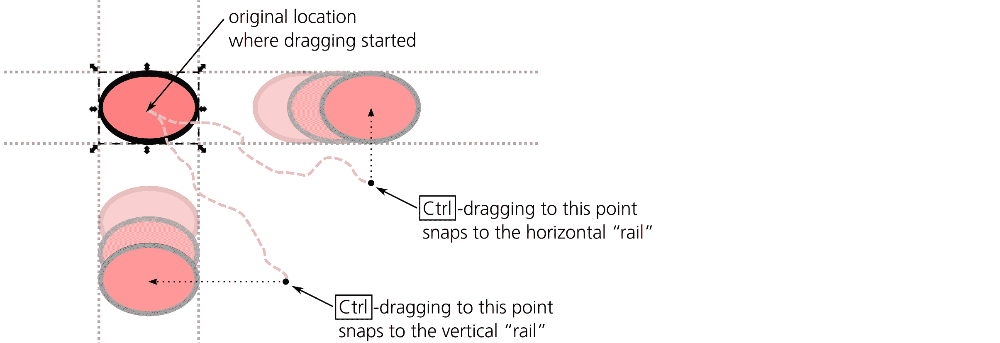

图 6-1：使用 Ctrl 进行约束拖动

使用 Ctrl 在许多其他情况下也具有相同的约束作用。（在这一点上，Inkscape 与 Adobe 应用程序不同，后者通常使用 Shift 来实现类似的功能。）通过吸附功能，可以使用更多的约束方式，吸附功能将在下一章讨论。

如你在上一章看到的，选择你需要的对象可能很困难；你可能需要使用 Alt 点击（选择下方）和 Ctrl 点击（选择组内的对象）来选择所需对象。现在，如果你想拖动这些选中的对象，可能会遇到另一个问题：任何拖动都以点击开始，而这个点击可能会轻易破坏你精心构建的选择，选择到其他东西，比如恰好位于你对象上方的物体或包含组。

通常，解决此问题最简单的方法是使用箭头键移动选择，而不是通过拖动鼠标（见 6.5）。如果你绝对需要使用鼠标拖动，可以在按住 Alt 键时开始拖动。这将强制当前选择在不无意选择其他对象的情况下被拖动。你甚至可以从任何位置开始 Alt 拖动移动选择——而不是从选择本身，而是从空白画布或任何其他对象开始。

你可能会想知道，Alt 拖动与 Alt 点击如何兼容——Alt 点击*确实*通过“选择下方”改变选择。然而，与常规的点击选择不同，“选择下方”发生的时机是在你点击鼠标按钮后*释放*它时。如果在点击和释放之间，你没有将鼠标移动超过点击/拖动阈值（5.4，默认是 4 个屏幕像素），这被视为一次点击，并且执行“选择下方”。否则，当前选择会被移动。

最后，按住 Shift 键移动时可以暂时抑制吸附功能（见 7.3）。当你通常使用吸附功能但不想禁用它，只需要精确放置某个物体时，这个功能非常方便。

## 6.2 选择器：缩放

我们接下来的主题是*缩放*选择——使其变大或变小。缩放不同于缩放视图；当你缩放视图时，你只是在更近或更远的地方查看你的绘图，而不会改变它。缩放意味着实际上改变对象的大小；这是一个可以撤销的操作。

要缩放你的选择，选择器工具会显示八个控制柄，四个在角落，四个在选择框的边缘，如图 6-2 所示。拖动侧边控制柄会在一个方向上缩放选择（水平或垂直）；拖动角部控制柄会在两个方向上缩放。

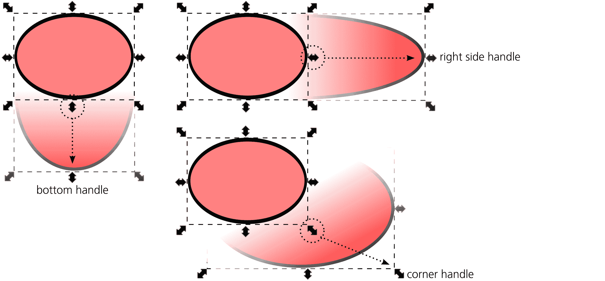

图 6-2：使用选择器工具进行缩放

默认情况下，角部控制柄可以在任何方向自由移动。这意味着所选对象的宽度和高度之间的比例（也叫做*纵横比*）可能*不会*被保持。你可以拉伸或压缩选择，或者可以使它变得更高*并*更窄，或更低*并*更宽，只需一次拖动。侧边控制柄也不会保持纵横比，因为它们只在一个维度上缩放。

锁定纵横比的最简单方法是按住 Ctrl 键进行缩放。这样，无论是角部控制柄还是侧边控制柄，缩放都会保持比例。另一种方法是通过画布上方选择器控制栏中的锁定切换按钮来实现，如图 6-3 所示，它位于 W 和 H 可编辑字段之间。

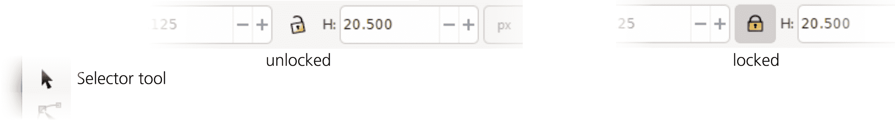

图 6-3：选择器控制栏中的纵横比锁定

当这个锁定被启用（按下时），角部控制柄总是按比例缩放。然而，侧边控制柄不受锁定影响，仍然只在一个维度上缩放。

通常，缩放是以这样的方式工作的：选区的对侧（侧边手柄）或对角（角部手柄）的边界框保持固定。然而，有时你希望选区的中心保持固定，从而使其从中心对称缩放。这正是 Shift 键的作用。为了让这一点更为明显，转换的固定点总是由一个十字标记表示，如图 6-4 所示。

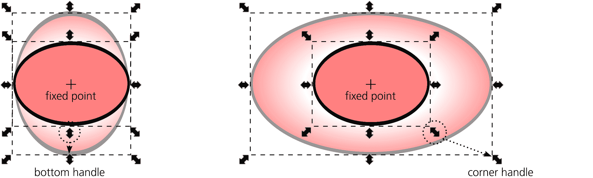

图 6-4：使用 Shift 围绕选区中心进行缩放

你可以将 Shift 缩放与 Ctrl 结合使用，进行比率约束的中心对称缩放。不限于中心或角落，你可以将缩放的固定点放置在任何位置，正如你在 6.4 中将看到的那样。

剩下的修饰键 Alt，在缩放时也有作用。它让你可以按整数倍数缩放选区：放大到原始大小的 2、3、4 倍，或缩小到原始大小的 ½、⅓、¾ 倍（可以是一个或两个维度）。你可以将 Alt 与 Ctrl 结合使用，以锁定纵横比，和/或与 Shift 结合使用，使其围绕选区中心缩放。

## 6.3 选择工具：旋转与扭曲

*如何旋转对象？* 这个问题在 Inkscape 用户的论坛和邮件列表中是一个出奇常见的问题。诀窍是将选择工具切换到*旋转模式*，方法是对选区进行*第二次点击*。（这必须是一个*明确*的第二次点击，而不是双击。）第三次点击将选择工具切换回缩放模式，第四次则返回旋转模式，如图 6-5 所示。

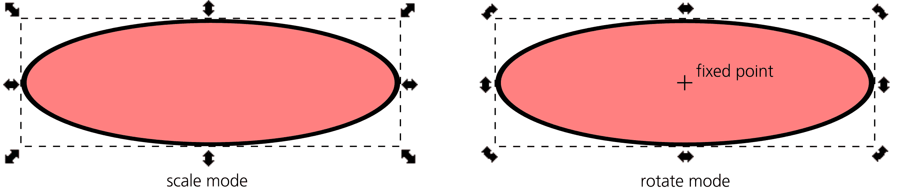

图 6-5：选择工具的缩放与旋转模式

第二次点击有一个问题。就像移动一样，有时可能无法在不选择其他对象的情况下点击选区（例如，如果选中的对象处于组内或其他对象下方）。此时，你可以直接按 Shift-S 切换到旋转模式或返回。

一旦进入旋转模式，旋转选区就像拖动角部手柄一样简单。拖动侧边手柄会扭曲选区。

旋转时，按住 Ctrl 键会将旋转角度限制为固定的角度步长，默认情况下为每 15 度（图 6-6）。

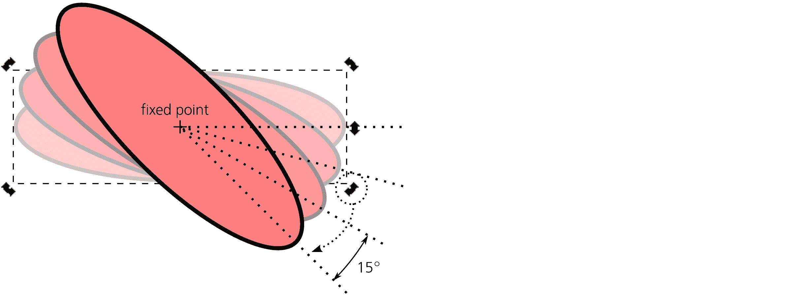

图 6-6：按住 Ctrl 键时的旋转操作

你可以在首选项对话框中的行为 ▶ 步骤页面更改这个角度步长。在“旋转对齐每个”下拉菜单中，你可以选择从 0.5 度到 90 度的值（所有这些值都是 360 的约数），或者选择 None 来取消约束。

按住 Ctrl 键进行扭曲时会保持相同的角度步长，如图 6-7 所示。

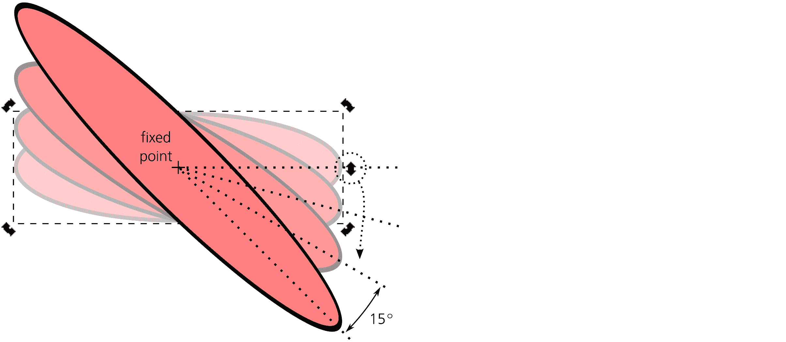

图 6-7：按住 Ctrl 键时的扭曲操作

Shift-旋转会临时将旋转的固定点移至对角线上的另一个角落。例如，Shift-旋转右上角手柄会使左下角成为固定点。

## 6.4 固定点

一旦你将选择工具切换到旋转模式，你会看到选定对象的中心位置出现一个十字标记。这是旋转的*固定点*。这个点作为每个对象的永久属性之一被记住——移动它是一个不可撤销的操作，所有对象的固定点会与文档一起保存。缩放、旋转和倾斜都是围绕这个点进行的，不仅是使用选择工具，其他大多数方法（如在“转换”对话框中或使用键盘快捷键进行转换）也适用。

默认情况下，固定点位于对象边界框的几何中心。使用选择工具，你可以将其自由拖动到任何位置（无论是对象内部还是外部）。拖动时，固定点会自动吸附到对象边界框的边缘、几何中心（即原始位置）以及通过几何中心的水平和垂直轴上。这使得将固定点重新吸附回原位置或边界框的角落变得容易。按住 Shift 键拖动以抑制吸附；按住 Ctrl 键拖动以限制其在水平/垂直轴上的移动。

如果你移动对象（通过任何方式，不仅仅是通过选择工具拖动），其固定点会随之移动，因此它始终保持与对象的相对位置一致。无法使用键盘移动对象的固定点——你只能用鼠标拖动它。

当选择多个对象时，整个选择区域也有一个固定点。当然，默认情况下，它位于边界框的几何中心。但是，如果你最后选中的对象（如果是通过 Shift+点击逐个添加的）或在 z 轴顺序中位于*最上层*的对象（如果是通过框选或 Ctrl+A 选择的）曾经将固定点从默认位置移动过，那么整个选择区域的固定点就会与该对象相同。

如果选中了多个对象，拖动选择的固定点，这个操作会应用到*所有*选定对象——每个对象都会拥有这个新的固定点位置。例如，如果你画了一个有多个辐条的轮子，你可以选择所有辐条，只需一次性将固定点移动到轮子的中心。之后，即使你只选择一个辐条，它也会方便地围绕轮子的中心进行旋转。

此外，当你复制或克隆（16.1）对象时，固定点会被继承。例如，你可以画一根辐条，将其固定点移动到轮子的中心，然后继续复制（或克隆）该辐条，并使用任何方法（拖动选择工具的角点、键盘快捷键或“转换”对话框）旋转每一个副本。新的辐条会牢牢地保持在轮子内部，如图 6-8 所示。

图 6-8：使用固定点确保辐条属于轮子

## 6.5 使用键盘快捷键进行变换

通过拖动物体或其控制点在画布上变换物体既简单又直观，但并不非常精确（即使使用各种受限模式时也是如此），有时甚至会显得有些笨拙。许多长期使用 Inkscape 的用户更喜欢通过键盘快捷键来进行大多数变换操作。

用于变换物体的键盘快捷键很容易记住，并且通常能让你的工作变得更加轻松。学习这些快捷键的另一个原因是，正如你在本书的后续章节中所看到的，它们在许多其他工具和场景中也被一致地使用，以执行类似的功能——例如，在节点工具中变换节点，在文本工具中变换字符，或在渐变工具中变换渐变手柄。

### 6.5.1 移动

←、→、↑ 和 ↓ 箭头键用于移动选择区域。移动的距离取决于修饰键。

+   没有修饰键时，箭头键将选择区域移动 2 像素（2 SVG 像素单位，而不是屏幕像素，A.6）。你可以在“首选项”对话框的“行为 ▶ 步骤”页面中更改此默认值。

+   按住 Alt 键时，箭头键移动选择区域 1 屏幕像素（不是 SVG 像素）。这意味着实际的距离将取决于缩放级别——你可以在放大时进行更细微的移动，或者在缩小时进行更粗的移动。这是最有用的快捷键之一，因为它的精准性和适应性：通过按住 Alt 键，你可以将选择区域移动到当前缩放下仍然可以察觉的最小距离。

+   按住 Shift 键时，箭头键移动选择区域的距离是没有 Shift 时的 10 倍。所以简单的 Shift + 箭头键移动 20 像素（默认情况下），Shift + Alt + 箭头键则移动当前缩放下的 10 屏幕像素。

键盘移动命令的简便性和可预测性使它们在许多不同的场景中都非常有用。例如，有时我需要对被大型前景物体遮挡的物体进行操作。按住 Alt 键点击“选择下方”是可行的，但不太方便；将前景物体移动到新图层并隐藏该图层也是一个不错的选择，但相当繁琐。在这种情况下，我通常选择前景物体并通过几个→或 Shift-→的按键将其移开（向右）。完成后，我会再次选择它并通过相同数量的反方向按键将其移回原位。（在这种情况下不要使用 Alt 箭头，因为你在将物体移回时可能处于不同的缩放级别，这会影响距离。）这种“先移开再移回”的技巧在分析复杂构图时也很有用，特别是当我试图弄清楚图形的哪些部分对应哪些物体时。

### 6.5.2 缩放

< 和 > 键（尖括号）分别用于缩小和放大选择区域。键盘缩放始终保持宽高比，并且围绕物体的边界框的几何中心进行（而不是围绕其可移动的固定点）。再次提醒，缩放的量取决于修饰键。

+   没有修饰符时，< 和 > 键会按比例缩放，使得边界框的较大维度增加 2 px（2 个 SVG 像素单位，而不是屏幕像素）。例如，如果对象的宽度大于高度，则其宽度会增加 2 px（边界框的左右边缘分别向相反方向移动 1 px），而高度则按比例较小地增加。你可以在首选项对话框的“行为 ▶ 步骤”页面中更改默认的 2 px 值。

+   按住 Alt 键时，< 和 > 键会按比例缩放，使得边界框的较大维度增加 2 个屏幕像素（不是 SVG 像素）。边界框的边缘会沿相反方向各移动 1 个屏幕像素。和 Alt-箭头一样，这意味着实际的缩放程度取决于缩放级别；你在放大时可以进行更精细的缩放，放大时则更粗略。

+   Shift 对 < 和 > 键没有影响。这是因为在某些键盘上，你需要按 Shift 键才能输入这些字符。顺便说一下，,（逗号）和.（句点）分别作为 < 和 > 键使用，因为在许多键盘上它们物理上是相同的键。

+   按住 Ctrl 键时，< 和 > 键会按两倍的比例缩放——也就是说，它们会让选择变小或变大各一倍。当你需要大比例缩放某物时，这非常方便；例如，先按几次 Ctrl-> 将尺寸调到接近所需的范围，然后再通过按住 Alt 或不使用修饰符的 Ctrl 键精确调整。

### 6.5.3 旋转与翻转

[ 和 ] 键（方括号）分别会让选择逆时针和顺时针旋转。旋转是围绕选择器的旋转模式中可见的固定点进行的；除非你已移动它，否则它是对象边界框的几何中心。同样，旋转的角度取决于修饰符。

+   没有修饰符时，[ 和 ] 键旋转 15 度。这与使用 Ctrl 键进行的鼠标旋转角度步长相同。你可以在首选项对话框的“旋转快照”下拉菜单中更改它。

+   按住 Alt 键时，[ 和 ] 键会旋转一个角度，使得选择的边界框角点移动 1 个屏幕像素。这意味着实际的旋转角度取决于缩放级别，你在放大时可以进行更精细的旋转，放大时则更粗略。

+   Shift 对 [ 和 ] 键没有影响，原因与其对 < 和 > 键没有影响相同。

+   按住 Ctrl 键时，[ 和 ] 键会旋转 90 度（即一个完整圆周的四分之一）。

此外，一些常见的变换操作可以通过键盘快捷键和选择器工具控制栏上的按钮同时访问（图 6-9）：

+   将选择旋转 90 度，分别是逆时针和顺时针（也可以通过 Ctrl-[ 和 Ctrl-] 快捷键访问）。

+   水平和垂直翻转（镜像）选择（也可以通过 H 和 V 快捷键访问）。

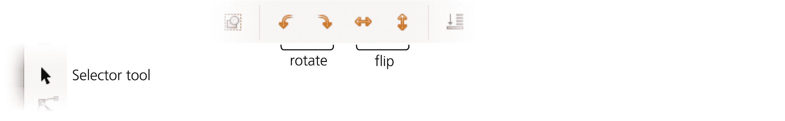

图 6-9：选择器工具的控制栏：变换按钮

要使两个对象交换位置，可以使用 *双重翻转* 技巧。首先，选择两个对象并将其整体翻转。然后，依次选择每个对象并单独翻转它们来恢复位置。为了使交换是二维的，只需执行两次此操作，一次进行水平翻转（H），然后进行垂直翻转（V）。

艺术家有时使用翻转来检查作品。长时间查看自己的作品很容易变得对错误视而不见——只是因为你看得太久了。这个时候，水平或垂直翻转整个绘图会给你带来新的视角，使许多形状、平衡或构图上的问题变得非常明显。你也可以使用画布旋转（3.13）来达到同样的效果。

## 6.6 使用数字进行变换：X、Y、W 和 H

有时，鼠标或键盘的变换方法可能无法满足需求，因为你可能希望将对象移动特定的距离或到达特定的位置，或旋转一个特定的角度。Inkscape 允许你指定精确的数值来进行变换。

一种方法是通过选择工具的控制栏，如 图 6-10 所示。

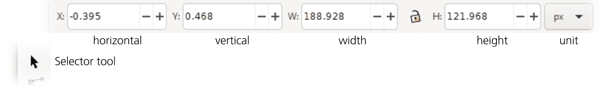

图 6-10: 选择工具的控制栏：X、Y、W 和 H 字段

这里，X 和 Y 值表示选择框的位置，W 和 H 值表示其宽度和高度。当你选择或取消选择对象，或移动或缩放选择框时，这些值会自动更新；你也可以直接输入任何值来相应地移动或缩放选择框。

输入数值后，按 Enter 键激活，或者按 Tab 键激活并跳转到下一个字段。要从键盘跳转到第一个字段，按 Alt-X；如果不进行编辑并退出该字段，按 Escape。

在可编辑字段的右侧，有一个下拉菜单用于选择数值所表示的单位。支持的单位包括 in（英寸）、pt（点，1 个点等于 1/72 英寸）、mm（毫米）和 cm（厘米）。默认单位是 px（SVG 像素，A.6，现在是 1/96 英寸，但在 Inkscape 0.92 版本之前为 1/90 英寸）。

最有用的单位之一是 %（百分比）。它让你可以按对象当前大小的百分比来缩放对象，而不是按绝对大小。例如，要将选择框放大 1.5 倍，将单位切换为 **%**，然后在 **W** 和 **H** 字段中输入`**150**`（或者，如果你点击它们之间的锁定按钮，则只输入其中一个字段）。

## 6.7 变换对话框

数值变换对象的最强大工具是变换对话框（Shift-Ctrl-M）。它为我们讨论过的四种变换类型（移动、缩放、旋转和倾斜）提供了单独的标签，并且还有一个用于完整变换矩阵的标签。通常，你选择其中一个标签，输入所需的值，然后点击 **应用**。

让我们依次查看这些标签。

### 6.7.1 移动标签

我们将从“移动”选项卡开始，如图 6-11 所示。

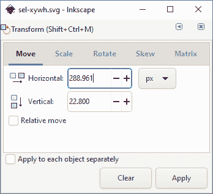

图 6-11：变换对话框中的移动选项卡

与选择器控制栏中的 X 和 Y 值不同，选择器控制栏始终显示选择区域的绝对坐标，在“移动”选项卡中，您可以查看并指定绝对坐标或相对位移。默认情况下，相对移动复选框是选中的，因此水平和垂直字段显示为零，您在其中输入的任何数字都会将选择区域*按*该数值移动（例如，`**3**` 和 `**0**` 的值会将选择区域水平移动 3 个单位）。

现在，取消选中**相对移动**复选框。您将看到字段现在显示选择区域的当前坐标——与选择器控制栏中的 X 和 Y 字段相同。单位下拉菜单也类似。

#### 6.7.1.1 调整间距的移动

如果选择了多个物体，并且启用了“对每个物体分别应用”和“相对移动”复选框，则每个物体将相对于其相邻物体（对于 X 是左边最近的物体，对于 Y 是下方最近的物体）进行移动，而不是相对于它自身的前一个位置。这使得“拉开”或“压紧”物体集合成为可能。

例如，如果您需要水平排列一排物体，选中它们并在选中两个复选框的情况下，将它们水平移动 5 px。最左边的物体会向右移动 5 px，下一个物体会向右移动 10 px，以此类推，直到最右边的物体被移动 5*n* px，其中*n*是所选物体的数量。因此，相邻物体之间的间隔将增加 5 px，整排物体会像调整字间距那样被拉开（15.4.5）。将这些物体向–5 px 移动，则相反，它们会紧凑地挤在一起，最左边的物体向左移动 5 px，下一个物体向左移动 10 px，以此类推。对于垂直移动，效果相同，只是从最靠近顶部的物体开始（即 Y 坐标最小的物体）。

### 6.7.2 缩放选项卡

接下来，我们将查看“缩放”选项卡，如图 6-12 所示。

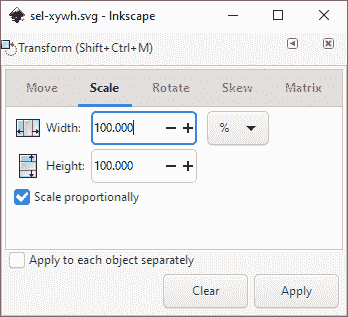

图 6-12：变换对话框中的缩放选项卡

在这里，默认单位是百分比（%），这允许您按给定的比例缩放选择区域（例如，200%表示将其放大两倍，50%表示将其缩小一半）。单位下拉菜单还包含您可能需要的所有绝对单位（切换到它们会将显示的值从 100%变为所选单位下的选择区域的宽度和高度）。缩放比例复选框类似于选择器控制栏上的锁定按钮。

到目前为止，本选项卡所能做的事情通过选择器工具的 W 和 H 控件也可以实现。然而，"单独应用于每个对象"复选框是该对话框独有的功能。它会对每个选定的对象应用相同的缩放，围绕其自身的固定点进行缩放（参见 6.4），而不是围绕选择区域的中心进行整体缩放。对于百分比单位，这意味着按相同的比例缩放每个选中的对象；对于其他所有单位，则会使所有选中的对象获得相同的指定宽度和高度。

与移动选项卡（和选择器控制）不同，当你通过其他方式（例如拖动控制柄）变换选择内容，或者仅选择不同的对象时，缩放选项卡上的值不会自动更新：你输入的数值保持不变。如果你希望将相同的尺寸应用于多个不同的对象，这非常方便，但有时也可能会成为问题——你可能会误以为显示的绝对单位值是当前选择对象的值，实际上并非如此。要将值重置为当前选择的 100%，请点击**清除**按钮。

### 6.7.3 旋转选项卡

接下来我们将介绍旋转选项卡，如图 6-13 所示。

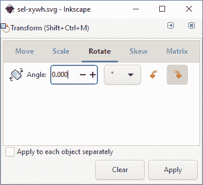

图 6-13：变换对话框的旋转选项卡

旋转选项卡包含一个可编辑字段，用于设置旋转角度。正值表示逆时针旋转；负值表示顺时针旋转。默认单位是度（360 度为一整圈），但你可以将其切换为弧度（2 × π = 6.283 弧度为一整圈）。"单独应用于每个对象"复选框按预期工作：它不是围绕选择的固定点旋转整个选择区域（参见 6.4），而是围绕每个对象的固定点单独旋转每个对象。

### 6.7.4 扭曲选项卡

接下来是扭曲选项卡，如图 6-14 所示。

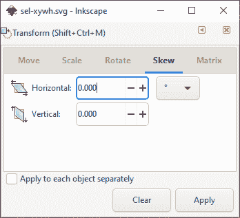

图 6-14：变换对话框的扭曲选项卡

扭曲选项卡包含两个可编辑字段，用于水平和垂直扭曲，基本上是沿着自身偏移边框四条边中的一条，使相邻的垂直边或水平边倾斜。"单独应用于每个对象"复选框的工作原理与缩放和旋转相同，围绕每个对象的固定点进行扭曲。

单位下拉菜单包含绝对长度单位、百分比和角度单位（度和弧度）。它们的工作方式如下：

绝对单位

使用绝对单位时，水平值指定选择区域顶部边缘的绝对位移，向左（正值）或向右（负值）；垂直值指定左边缘的位移，向上（正值）或向下（负值）。

百分比

使用%单位时，位移量按边界框的相邻垂直边的给定百分比计算。换句话说，这个百分比等于*倾斜角度的正切*。例如，将一个直立矩形垂直倾斜 100%会导致其原本水平的边变成 45 度倾斜。

角度单位

这允许你直接设置倾斜角度——即与正在移动的边相邻的边的角度。例如，将一个对象垂直倾斜 45 度，与将其倾斜 100%或对象宽度的绝对值是一样的。倾斜 90 度不起作用，因为那会导致一个无限大小的对象。

### 6.7.5 矩阵标签

最后，我们将看看矩阵标签，如图 6-15 所示。

图 6-15：转换对话框的矩阵标签

该标签允许你编辑对象的*变换矩阵*，该矩阵存储在其`transform`属性中（A.7）。变换矩阵的代数详细解释超出了本书的范围；对于实际目的，了解两个最右边的值（标记为 E 和 F）代表对象的位移（即它从原点移动的距离），而另外四个值则共同编码了它的缩放、旋转和倾斜即可。

默认情况下，编辑当前矩阵的复选框未勾选，标签显示一个*单位矩阵*，其中 A 和 D 为 1，所有其他值为 0。如果你更改任何值并点击应用，这个矩阵将与对象当前的矩阵*后乘*——即，在其当前变换的基础上应用于选中的对象。如果你勾选编辑当前矩阵复选框，标签将显示并让你直接编辑所选对象的当前矩阵。（如果选中了多个对象，则显示的是第一个或最底部选中的对象的矩阵。）

你可以通过以下方法重置对象的`transform`属性，而无需进入 XML 编辑器。勾选**编辑当前矩阵**，点击**清除**（这将值重置为单位矩阵），然后点击**应用**。

## 6.8 粘贴大小

为对象分配特定大小的快速方法是不使用任何对话框，而是通过*粘贴*该大小。首先，复制（Ctrl-C）一个你想要分配给其他对象的对象的大小。然后，使用**编辑**菜单中的**粘贴大小**子菜单命令。

此子菜单的命令执行各种组合的粘贴：

+   只粘贴宽度（高度不变）、只粘贴高度（宽度不变）或大小（宽度和高度都粘贴）。

+   将大小粘贴到整个选择中或每个选定的对象单独粘贴（类似于转换对话框中的“分别应用到每个对象”复选框）。

例如，如果你导入了多个位图图像，并想从中创建一个缩略图画廊，你可以通过绘制一个所需的缩略图大小的矩形，将其复制到剪贴板，选择所有图像，然后选择 编辑 ▶ 粘贴大小 ▶ 分别粘贴大小 来统一它们的尺寸。

## 6.9 测量工具 [1.1]

要通过数字进行转换，首先你需要知道这些数字是什么——你需要*测量*。如你所见，所选对象会不断自我测量，报告它们的坐标和尺寸。但 Inkscape 也有一个多功能的测量工具（M，左侧工具栏上的标尺图标），它可以满足你更多的测量需求，超乎你的想象。

### 6.9.1 悬停

你首先会注意到的一点是，即使在点击任何东西之前，工具就会显示你*悬停*在其上的任何对象的基本信息。这意味着你无需选择对象就可以查看它的大小或 X/Y 坐标——只需切换到测量工具，移动鼠标并从屏幕上读取。

就像在选择器中一样，工具默认将组视为对象，报告有关组的信息。如果你需要查找组内的对象，只需按住 Ctrl 键（同样无需点击，只需 Ctrl 悬停）。对于路径（第十二章）和形状（第十一章），该工具还会报告路径的长度，如图 6-16 所示。

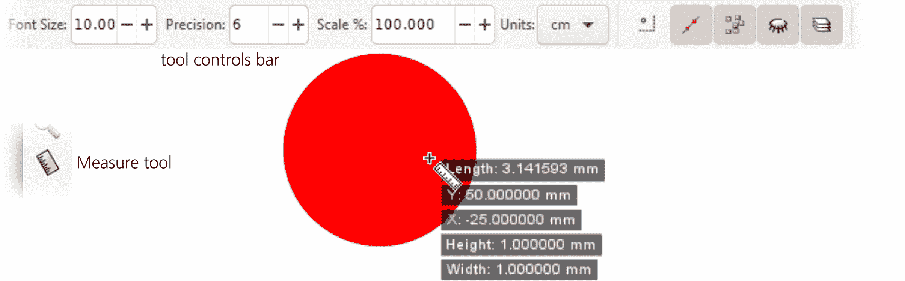

图 6-16：使用测量工具：直径为 1 的圆的长度等于π。

工具控制栏上的前几个控件让你调整叠加显示的各个方面：字体大小（不依赖于缩放）、数字的精度（小数位数）、测量单位和比例（默认 100%），允许你查看所有值按某个系数缩放后的数值。在图 6-16 中，我将精度提高到 6，以获取更多位数的π。

### 6.9.2 拖动

想象一下一个弹簧测量带：你将它钩住某个点，然后拉伸到另一个点，再读取它们之间的距离。这正是你在测量工具中点击并拖动时所做的。除了*长度*，它还显示了测量带（蓝线）与水平线（红线）之间的*角度*（红色弧线），如图 6-17 所示。

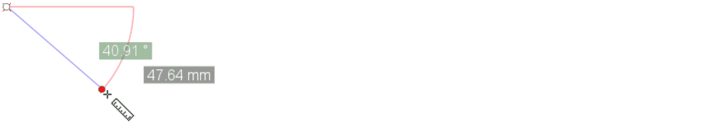

图 6-17：测量两点之间的距离和角度

当你松开鼠标时，刚刚拉出的测量带会固定在画布上；它的两端变成了两个圆形标记，你可以自由地（或者在按住 Ctrl 键的情况下受限地）拖动它们，并看到数字不断更新。如果你想为其中一个控制点设置精确的坐标，可以按住 Shift 键点击它，并在弹出的定位对话框中输入坐标。你还可以通过控制栏上的“反向测量”按钮交换测量线的起点和终点。

当你切换到其他工具时，整个测量覆盖层会消失——但当你重新切换回测量工具时，它会重新弹出。点击并拖动到其他地方，用新的测量替换旧的测量；我发现没有办法“收回卷尺”——也就是仅仅移除已有的测量。

### 6.9.3 测量和约束角度

测量线与水平线之间的角度很容易获得；测量两条线之间的任意角度（如果两条线都不是水平的）也是可能的，但稍微有点复杂。如果你有两条线，想测量它们之间的角度，可以从它们的交点开始，沿着其中一条线拖动。然后，按下并释放 Ctrl（不松开鼠标）；这会将角度测量的基准重置为当前方向。接着，拖动到第二条线并读取角度。

按住 Ctrl 拖动，如预期的那样，会将测量线的角度限制为角度步长（可以在**行为 ▶ 步长**中更改设置）。然而，由于按住 Ctrl*拖动时*会重置角度测量的基准，你需要在开始拖动之前按住 Ctrl，如果你想进行角度限制（例如，严格水平或垂直测量）。

### 6.9.4 测量线段

测量工具可以做一些你用卷尺很难做到的事：在同一条线上的多个距离进行测量。如果你让测量线穿过任何物体，你会发现每个交点将线段分开，工具会报告每个线段的长度。

例如，如果你用垂直测量线穿过大写字母*B*，你将得到多达六个独立的读数：三个水平笔画的宽度，它们之间的间隙，以及字母的整体高度，如图 6-18 所示。（底部还报告了测量线的总长度，但你不需要关注这个，因为只要它穿过你想要测量的部分，起始和结束点可以任意选择。）

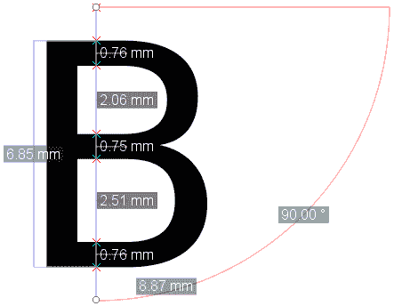

图 6-18：测量字形的笔画和间隙：红色 X 标记为交点；每个线段显示其长度。

这对于你的测量线穿过的任何不同物体也有效：工具会报告它遇到的每个物体的线段长度，包括它们的宽度以及物体内部和物体之间的间隙。当测量穿过描边的路径或形状时，工具只报告与路径中心线的交点，而不是描边的可见边缘。

你可以在绘图的某个战略轴线上创建一个测量线，并在继续工作时将其保留在那里（它不会在其他工具中显示，因此不会妨碍操作）。随时切换到测量工具，读取穿过该轴线的已移动或新创建物体的最新数值。

在其控制条上，工具有多个选项来设置交点的处理方式，如图 6-19 所示。

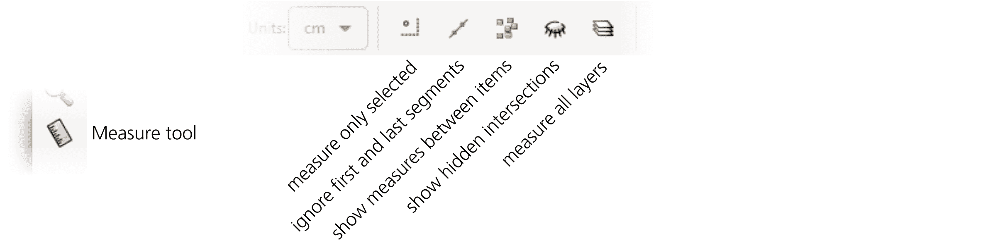

图 6-19：测量工具：交点选项

+   你可能希望通过仅报告*选定对象*的交点和长度来减少杂乱，而不是报告所有对象（默认设置）。

+   默认情况下，工具不会显示*第一段和最后一段*的长度，因为它们依赖于测量线端点的位置，这些位置可能有些随意；你可以更改这一点。

+   第三个按钮控制是否报告对象之间和对象内部的长度；默认情况下，它是开启的，但如果你关闭它，你将只看到测量线上的第一个和最后一个交点，以及它们之间的长度。

+   第四个按钮控制工具是否标记*隐藏的交点*。这里的“隐藏”并不是指隐藏的对象（4.1），而是指那些被其他对象遮挡（它们交叉测量线的位置）的交点。默认情况下，隐藏的交点是显示的，但你可以将其隐藏以减少杂乱。

+   最后，第五个选项允许你将交点和测量限制在当前图层；默认情况下，工具会查看所有可见图层中的对象。

### 6.9.5 幻影测量

每当你拖动开始新的测量时，旧的测量会消失。如果你希望同时显示两个或更多的测量值怎么办？只需通过点击控制栏上的相机按钮（即“拍摄快照”）将当前测量转换为*幻影*，这样就可以了。

幻影测量几乎像正常的测量一样工作，唯一的区别是你无法拖动其端点，并且它以统一的灰色显示，而不是红色/蓝色。不幸的是，与当前“实时”测量不同，幻影测量在切换到另一个工具再返回时不会保留，这使得它们在实际工作中不太有用。

### 6.9.6 创建测量对象

测量工具创建的构造——包括当前的测量值和任何幻影——都不是文档的一部分。它仅仅是一个信息叠加层。但是，如果你想要一个真正的、有形的对象来显示测量值，测量工具也能做到这一点。

然而，在深入了解对象之前，先让我们看看测量工具还可以为你创建的*参考线*。参考线（7.1）也不完全是实物，因为它们不会被打印，也不会在 Inkscape 之外的 SVG 查看器中显示；然而，它们比测量工具的构造物更“真实”，因为它们在任何工具中都可见（尽管你可以隐藏它们），并且随着文档的保存/恢复而保存。当你在控制栏上按下“转为参考线”按钮时，当前的测量会生成一系列参考线——一条是测量线本身，两个水平/垂直的交叉线表示起点/终点，以及每个交点的斜线，正如图 6-20 所示。

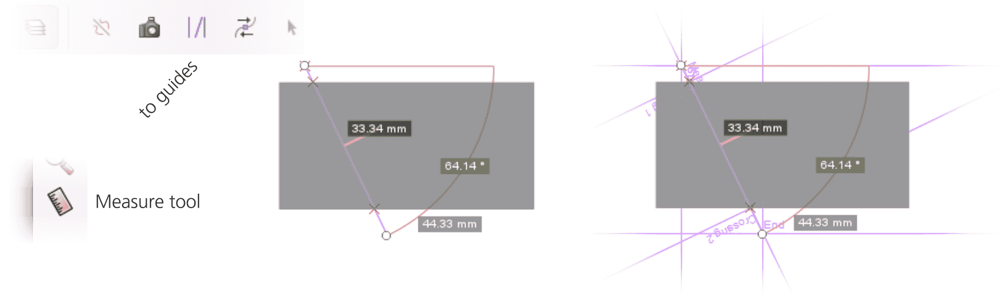

图 6-20：测量工具可以生成参考线。

测量工具的引导线是紫色的（与默认的蓝色常规引导线不同），并且有清晰的标签。尽管如此，如果你将多个测量值转换为引导线，你的画布可能会显得相当混乱，成堆的引导线会无限延伸到各个方向。许多情况下，如果你想将测量结果保留为永久记录，最好将所有内容转换为对象。这就是控制栏上的下一个按钮“转换为对象”所做的工作（图 6-21）。

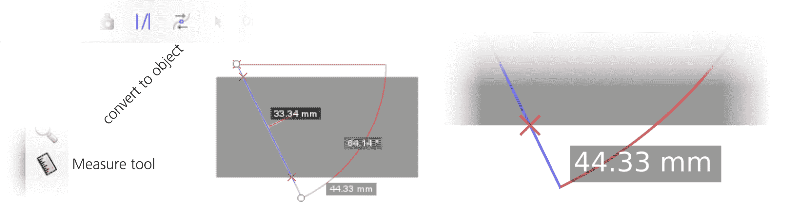

图 6-21：测量工具也可以生成对象！

起初，这个新创建的对象和测量叠加效果几乎无法区分：它忠实地复制了所有的线条、交叉标记和半透明标签。然而，它确实是一个对象——你可以将其拖动、放大、取消分组、删除其组内的对象等等。

下一个按钮，标记尺寸，提供了另一种创建对象的方法。它并不试图模仿测量工具的叠加效果，而是创建一个简单的、纯黑色的尺寸标记，带有箭头以及给出长度的文本对象（图 6-22）。这只适用于测量的整体长度，忽略任何交点或角度。你唯一可以调整的参数是此对象将放置的测量线与该对象之间的距离（控制栏上的偏移量，始终以 px 为单位）。

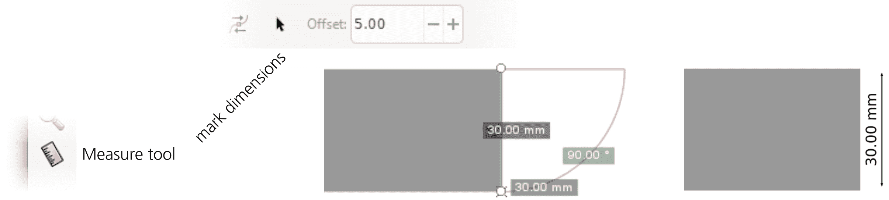

图 6-22：测量工具可以生成尺寸标记。

## 6.10 使用调整工具进行变换

调整工具（W 或 Shift-F2）是一种多功能的工具，它不仅将同样的“软刷”比喻应用于变换对象，还适用于样式编辑（8.9）和路径编辑（12.6）。该工具有多种*模式*；在本章中，我描述了那些涉及变换、复制和删除对象的模式。使用这些模式，你可以*通过散布绘制*——扫动、摇摆或雕刻对象场域，如喷雾工具喷射物（4.7）或克隆拼接（16.6），以创作复杂和自然主义的图像。

调整工具的所有模式都具有一些共同特征。在所有模式中，你都使用一个圆形的软边刷子（在光标下方看到的橙色圆圈），由控制栏上的宽度和力度参数控制，并且可以选择性地受笔压影响（如果你使用压力敏感的绘图板）。你通过这个刷子在选定的对象上“涂抹”，对其进行操作。

画笔的*宽度*从 1 到 100 不等，但这些并不是绝对单位；在任何缩放级别下，1 表示非常小的画笔，而 100 则表示一个大约等于屏幕大小的画笔。工具会以一个围绕鼠标光标的圆形画笔轮廓显示当前画笔宽度。要更改宽度，可以使用工具栏上的**宽度**控制，或使用←（变窄）和→（变宽）键。画笔是柔和的；其作用在中心达到峰值，并且沿边缘平滑递减，呈现钟形轮廓。

类似地，*力度*的范围从 1（非常弱——你需要多次刷动物体才能看到明显效果）到 100（非常强——画笔的第一次刷动就能施加最大效果）。要改变力度，可以使用工具栏控制或按↓（减弱）和↑（增强）键。

为了了解 Tweak 工具的工作原理，在测试绘图中创建一些小物体——例如，使用喷涂工具（4.7）或通过手动复制（Ctrl-D）或克隆（Alt-D）物体并拖动副本。现在，选择所有你创建的物体，切换到 Tweak 工具，调整**宽度**，使圆形覆盖多个物体，设置**力度**为适中的 20，启用其中一种模式（如下面所述），然后开始在物体上拖动。图 6-23 显示了将会发生的情况。

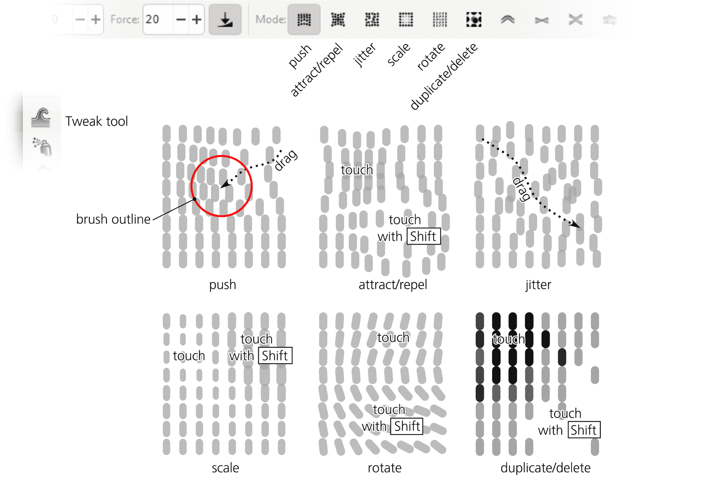

图 6-23：使用 Tweak 工具的模式变换半透明物体网格

移动模式

将选中的物体在你拖动画笔的方向上移动。这与简单地拖动这些物体不同——除非你在拖动它们：你的画笔会轻柔地“扫过”它所经过的物体。请注意，Tweak 工具仅影响选中的物体（尽管它没有显示选择提示）；通常最好将你常常调整的物体放在一个单独的图层上，这样你可以将该图层设为当前图层，并通过 Ctrl-A 选择它们。

吸引/排斥物体模式

将选中的物体在画笔下吸引向光标（默认），或按住 Shift 键将其排斥远离光标。通过这种方式，你可以“拉近”（使密集）或“推远”（使稀疏）散布中物体的不同区域。

移动抖动模式

将选中的物体在画笔下按随机方向和随机距离移动。按压得越用力（使用压力敏感笔）且**力度**越大，抖动越强烈。这是一个“打乱”你的构图的方式，适用于那些变得过于均匀的地方。

缩放模式

将选中的物体在画笔下缩小（默认）或放大（按住 Shift 键）。通过这种方式，你可以在散布中引入平滑的尺度不均匀性——使图像中的某些部分物体变大，其他部分物体变小。

旋转模式

将选中的对象在画笔下顺时针旋转（默认）或逆时针旋转（按住 Shift 键）。这样可以给你的散射效果引入旋转的不均匀性——例如，将你的散射纹理“弯曲”以匹配图像不同部分的主导方向。

复制/删除模式

随机地在画笔下复制一些选中的对象（默认）或删除其中的一些（按住 Shift 键）。一个对象被复制或删除的概率总是取决于力度和笔压。这完成了“散射绘图”工具集，提供了在必要时加厚或减少散射的方式。

与常规的复制命令（4.5）一样，使用 Tweak 工具复制时，复制品会直接放置在原始对象上，因此在复制后使用抖动模式将它们分散开来是个好主意。由工具创建的复制品会自动加入到选择中，如果原始对象已经被选中。

## 6.11 变换影响的内容

现在你可以使用各种方法来变换对象，让我们来看看具体变换了哪些内容。实际上，Inkscape 可以选择性地变换或不变换对象的某些特定部分或特征。这是通过选择器控制栏右端的四个切换按钮来控制的，如图 6-24 所示。

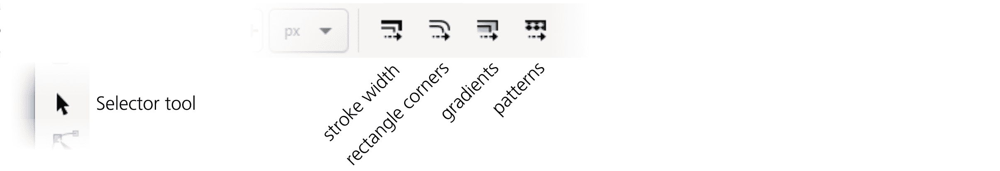

图 6-24：选择器工具的控制栏：变换选项的切换按钮

笔画宽度

这个选项仅适用于缩放，对移动、旋转或倾斜没有影响。当启用时，任何带有笔画的缩放对象（8.2）会按照相同比例缩放笔画宽度。例如，如果你将一个 2 像素宽的笔画对象缩放为当前大小的两倍，且该按钮已启用，那么缩放后的对象将有 4 像素宽的笔画。如果按钮关闭，则笔画宽度将保持为 2 像素不变。

当你在不保持纵横比的情况下缩放对象时，如果此按钮开启，笔画将按照垂直和水平方向缩放比例的乘积的平方根进行缩放。（我知道！）换句话说，笔画的缩放比例将是水平和垂直缩放比例的*几何平均数*。例如，如果你将一个对象的宽度水平缩放为原来的两倍，但高度不变，那么笔画的宽度将增加 1.415 倍（即 2 的平方根）。

保持笔画宽度不变缩放更常用。举例来说，在计划或草图中，通常希望所有对象的笔画宽度保持固定，不受缩放影响，因此你会关闭这个按钮。只有在你将笔画作为纯粹的视觉元素使用时（例如在手绘图中使用类似画笔的笔画），开启此选项才有意义。

圆角矩形边角

此选项仅适用于缩放操作，对移动、旋转或倾斜没有影响。它控制是否在缩放矩形时缩放其圆角（11.2.2）。当启用时，矩形会整体缩放，就像将其转换为路径一样；这可能导致圆角变大、变小或变得不圆。当禁用时，Inkscape 会准确保留原始的圆角形状。禁用此选项在某些情况下很有用，例如在流程图中，你希望所有的框都具有相同的圆角，不管它们的大小如何。

渐变

该按钮控制是否将变换应用于对象填充或笔画中的渐变（10.1）。由于渐变（更准确地说，渐变停止点的位置）可以被移动、旋转、倾斜以及缩放，因此该按钮适用于所有类型的变换。当启用时，渐变停止点与带有渐变的对象一起整体变换。当禁用时，渐变会固定在画布上（位置、方向或缩放不变），而对象则会被变换。

例如，在此按钮关闭时，可以将对象*移出*其自身的渐变，或将其放大，以便更多的渐变区域变得可见。这在渐变的位置与绘图中的其他对象协调时非常有用，而对象本身只是渐变的一个“窗口”，并且你想在不接触渐变本身的情况下移动或调整该窗口的边缘。

图案

该按钮与“影响渐变”按钮类似，只不过它作用于图案（10.8），而不是渐变。

对于路径，另一种“不影响”笔画宽度、渐变或图案（无论这些选择器选项如何）的方法是通过在节点工具中选择所有节点并转换节点选择来实现（12.5.7.3）。
