# 第七章：吸附与排列

作为前一章节关于变换的续集，让我们来看一下 Inkscape 如何不仅允许你自由变换对象，还能快速、精确地完成这一操作，并且在某种程度上，做到自动化。两种主要方法是吸附和排列。

*吸附*是指使某些点、线或路径像磁铁一样工作，这样当你将某个对象移动到这些磁性吸引点附近时，移动的对象会“吸附”到精确的目标位置。*排列*则是以规律的方式移动大量对象，使它们对齐、分布、散开，或按你想要的方式排列成网格。

## 7.1 参考线

对齐对象的最简单方法是创建一个参考线（指导线）。*参考线*是在画布上可见的、无限长的直线，你可以用它们来对齐和吸附对象。参考线不是对象：它们不能被选中、不会打印，也不会出现在位图导出中。虽然它们会与文档一起保存，但它们不是 SVG 标准的一部分，并且在除了 Inkscape 之外的 SVG 查看器中不可见。它们只是 Inkscape 专用的帮助工具，用于组织你的艺术作品。

例如，参考线可以将你的布局部分分开，帮助你可视化不同区域或单元格的边界。参考线可以是中心线，帮助你围绕它对称地绘制。或者你可以用参考线来验证对象是否真正对齐，还是仅仅看起来对齐。

要手动创建一个参考线，必须使画布的标尺可见；如果标尺被隐藏，可以通过 Ctrl-R 显示它们。点击标尺上的任意位置，按住鼠标不放，将光标拖到画布上。一个新的参考线会出现，你可以在想要的位置松开鼠标来放置它。自然地，从水平标尺拖动会创建*水平参考线*，从垂直标尺拖动会创建*垂直参考线*；更有趣的是，从标尺的两端拖动会创建*对角线参考线*，默认倾斜 45 度，如图 7-1 所示。

图 7-1：通过拖动标尺来创建参考线

移动参考线非常简单。使用选择工具或节点工具，将光标悬停在参考线上；注意它会变成红色，这意味着它现在可以被抓取。点击并拖动参考线，将其移动到你想要的位置。要删除参考线，只需将其拖回标尺并放到标尺上，或者在参考线变红时悬停并按 Delete 键。

要切换文档中所有参考线的可见性，按下 | 键（这是垂直管道字符，通常与 \ 键在同一键上，但需要按 Shift）。此键会隐藏参考线，但不会删除任何东西；如果你再次按下 | 键（或尝试创建新的参考线），所有隐藏的参考线会重新显示。此键控制参考线的可见性以及吸附到参考线的功能（因此不会吸附到不可见的参考线）；如果你希望禁用吸附功能而不隐藏参考线，可以使用 % 键（全局吸附切换，7.3）。

### 7.1.1 指南锚点

每个指南都有一个特殊的点，称为*锚点*，它看起来像一个小圆圈。指南的标签（如果有）会显示在其锚点旁边。这也是您可以通过 Shift+拖动手动*旋转*指南的轴心。

通常，锚点是您在创建或移动指南时最后释放鼠标的点。它也是您在指南对话框中查看和编辑的 X/Y 坐标（见下一节）。要沿着指南滑动锚点而不移动指南，请按住 Ctrl 键拖动它。

当您对齐到指南时，指南的锚点会产生磁性作用。也就是说，当您靠近锚点时，您不仅会对齐到指南，还会精确地对齐到其锚点。

### 7.1.2 指南对话框

如同在 Inkscape 中常见的那样，除了手动拖动指南，您还可以使用数字精确指定指南的位置和角度。这可以通过指南对话框完成（见图 7-2），通过双击任何指南进入该对话框。

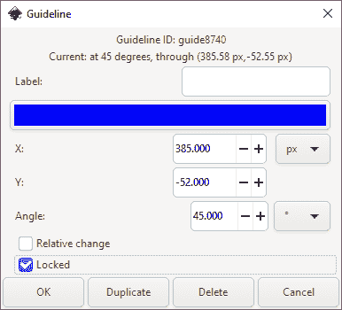

图 7-2：指南对话框

+   Label 是任何标识此指南的文本字符串。它将显示在指南旁边，靠近锚点。

+   在 Label 下方，一个颜色样本显示并允许您更改（点击它会弹出颜色选择器）指南的颜色（但出于某种原因，不能更改透明度）。

+   对于水平指南，Angle 为 0，Y 决定指南的高度。

+   对于垂直指南，Angle 为 90 度，而 X 决定指南的水平位置。

+   对于斜向指南，Angle 设置倾斜角度（默认是 45 度），而 X 和 Y 值共同决定穿过该指南的锚点位置。

+   "Relative change"复选框将对话框中的所有可编辑字段归零；现在，您输入的任何值将*加*到当前值上，而不是替换它们。

+   如果您锁定了该指南，它将不会响应鼠标悬停，您也不会不小心将其拖动（并且不会阻止您选择其附近的对象）。您仍然可以双击该指南通过此对话框解锁，尽管您可能需要在空白画布上操作，以避免不小心双击某个对象。

+   OK 接受您的更改；Duplicate 和 Delete 按钮的功能如其名称所示（复制的指南最初会放置在原始指南的顶部）；Cancel 关闭对话框而不做更改。

请注意，指南对话框是*模态的*，这意味着它在显示时会锁定 Inkscape 的其他部分。

### 7.1.3 指南的文档属性

文档属性对话框的 Guides 标签（Shift-Ctrl-D）包含一些影响所有指南的通用选项，如图 7-3 所示。这些选项出现在这里，而不是在全局首选项对话框中，因为它们被认为是文档本地设置并与文档一起保存，因此不同的文档可以有不同的指南设置。

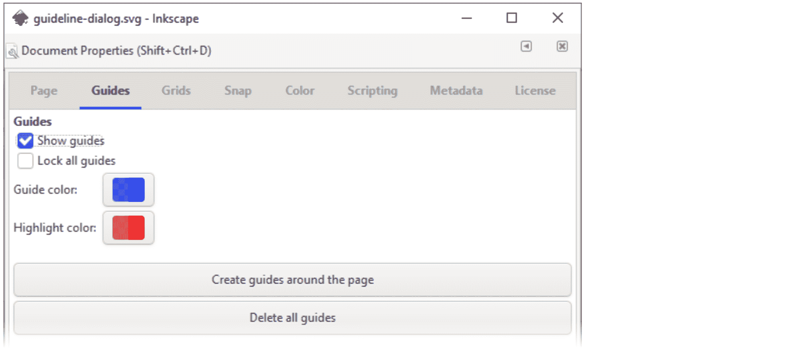

图 7-3：文档属性对话框中的指南设置

+   显示辅助线复选框与|键的功能相同：它切换文档中所有辅助线的可见性（和吸附性），而不删除它们。

+   锁定所有辅助线会使所有辅助线不再响应鼠标悬停或拖动，这样你在设置好所有需要的辅助线后，工作会变得更加轻松。注意：新创建的辅助线仍然不会被锁定（虽然你可以通过返回此对话框并关闭再打开锁定所有辅助线来重新锁定它们）；你单独锁定的辅助线（7.1.2）也会在你取消选中此复选框时被解锁。

+   创建页面周围的辅助线按钮将在画布的四个边生成四条辅助线，方便你对齐或吸附到页面框架。

+   删除所有辅助线按钮将在你的文档中有过多辅助线时派上用场，帮助你重新开始（但又不想丢失内容）。

+   你可以改变辅助线在常规状态下的颜色和透明度（默认是半透明的蓝色）以及鼠标悬停时的颜色（默认是半透明的红色）。点击颜色样本将打开一个小的颜色选择对话框（图 7-4）。A 滑块设置*透明度*（alpha）。你在这里设置的颜色只会影响那些没有设置自己颜色的辅助线（7.1.2），以及在更改颜色后你创建的新辅助线。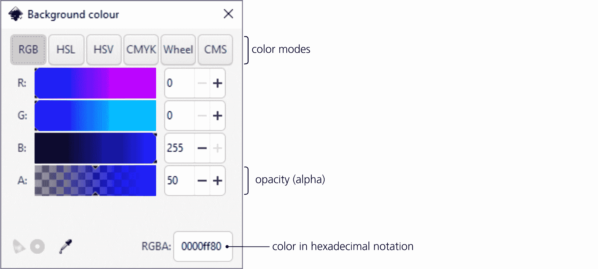

    图 7-4：颜色选择对话框

### 7.1.4 从对象创建辅助线

你已经看到过度量标尺（6.9.6）和页面框架被转换为辅助线，但你也可以将任何对象转换为辅助线。只需选择一个或多个对象，然后从菜单中选择**对象 ▶ 对象转为辅助线**，或按 Shift-G。

图 7-5 展示了该命令如何作用于不同类型的对象：

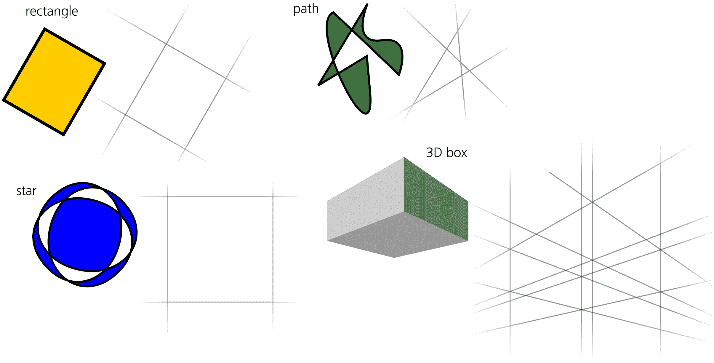

图 7-5：将各种对象转换为辅助线

+   对于路径或矩形，它会用一个重合的辅助线替换每一段直线路径或矩形边。这样，将矩形转换为辅助线会创建一个由两对平行辅助线勾勒出的矩形区域。若要快速创建通过两个指定点的倾斜辅助线，请切换到钢笔工具（14.1.1），点击一个点，双击另一个（以确定直线路径），然后将此路径转换为辅助线。

+   对于 3D 框（11.3），框的所有 12 条边都会转换为辅助线。

+   对于其他情况，对象边界框的四条边将转换为两条垂直辅助线和两条水平辅助线。

## 7.2 网格

可以将*网格*视为辅助线概念的进一步发展：它是覆盖整个画布的规则辅助线图案。网格通常用于吸附、对齐、均匀分布物体、绘制像素网格或轴测绘图（第二十四章）。

Inkscape 支持两种类型的网格：*矩形*网格和*轴测*网格（图 7-6）。一个文档可以显示多个网格，它们可以在类型和/或间距上有所不同。要在文档中创建新网格，请转到 **文档属性** 对话框中的 **网格** 选项卡，选择所需的网格类型，然后点击 **新建**。新网格将在文档中高亮显示。

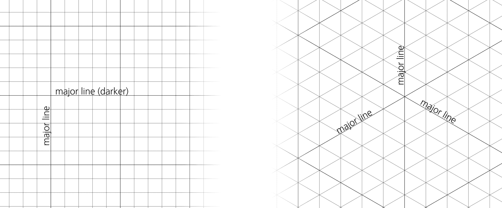

图 7-6：矩形网格和轴测网格

如您所见，矩形网格由两组垂直的引导线组成，而轴测网格则有三组，一组垂直，另外两组呈角度（默认角度为 30 度和 -30 度）。矩形网格是最常见的类型；轴测网格通常用于绘制没有消失点的伪 3D 场景。

您会注意到，Inkscape 在缩放时会保持网格线的视觉密度在一定范围内。当您缩小时，网格线会变得更密集——但随后，Inkscape 会通过只显示每第十条网格线来简化网格。随着缩放级别的进一步增大，网格线的简化会一遍遍发生，从而保持合理的网格显示。反过来，当您放大时，Inkscape 会逐步显示更多网格线，以便均匀填充您的屏幕。

新的网格线仅会在*所有*网格线都可见的缩放级别停止显示；默认的矩形网格间距为 1 像素。就像尺子上厘米标记比毫米标记大一样，Inkscape 会让每第五条线（称为*主线*）比其他线稍微深一些（*次线*）；在较高的缩放级别下，您可以看到这一点。

要隐藏文档中的所有网格，请按下 # 键；再次按下 # 键会显示所有隐藏的网格。此键控制网格的可见性和吸附到网格的功能，因此您永远不会吸附到一个不可见的网格；如果您只想禁用吸附而不隐藏网格，可以使用 % 键（全局吸附切换，7.3）。

### 7.2.1 网格选项

您可以在文档属性对话框中更改文档网格的某些设置。创建网格后，您将在对话框的底部看到新的网格属性面板，如图 7-7 所示。

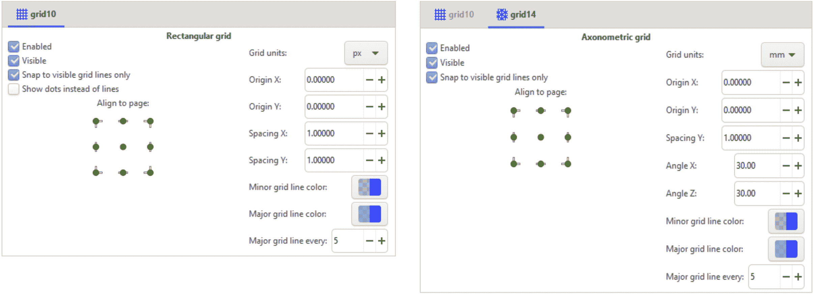

图 7-7：矩形网格（左）和轴测网格（右）的网格属性

您可以在同一个文档中创建多个网格，默认情况下，所有网格会同时显示——但您可以单独启用或禁用它们。在对话框中，每个网格都会有一个独立的标签。

以下是您可以更改的网格设置：

+   启用或禁用网格（基本上就是开启或关闭吸附到网格），并切换网格是否可见。禁用网格会隐藏它，但隐藏并不意味着禁用——因此，如果您愿意，可以设置吸附到不可见网格。另外，您可以仅允许吸附到可见网格线，忽略由于缩放级别而隐藏的网格线。仅对于矩形网格，您可以切换为将网格交点显示为点而不是线。

+   网格原点设置允许你整体移动网格。你可以数值设置原点 X 和原点 Y，或者使用左侧的九个对齐到页面按钮之一，将原点移动到页面的某个角落、中边或中心。

+   间距设置定义了线条的密度（记住，如果你将网格做得太密，Inkscape 在你没有足够放大时也不会显示所有线条）。对于矩形网格，有两个间距值，X（水平）和 Y（垂直）。对于轴测网格，只有一个间距值——沿 Y 轴交点之间的距离；垂直线之间的间隔完全由这个距离和轴测角度决定。所有这些值通常都与单位选择器（下拉列表）一起使用。

+   角度仅适用于轴测网格。这些是两组对角线的角度。默认情况下，两者都是 30 度（X 角度是从水平线逆时针测量，Z 角度是顺时针测量），但它们的范围可以从 0 度（完全没有垂直引导线）到 90 度（小心，你的画布将完全被垂直引导线覆盖！），并且它们不必彼此相等。

    如果你已经在文档中添加了轴测网格，那么新的对角引导线（7.1）将会以与网格相同的角度创建。

+   你可以为主网格线和次网格线分别设置颜色。默认情况下，它们都是蓝色的，但次网格线的透明度较低（因此不太明显）。

+   你可以调整主网格线的频率；默认情况下，每第五条网格线是主网格线。

你不能“将网格转换为对象”，但是如果你需要真实对象的网格（与 Inkscape 的辅助网格不同，其他 SVG 软件也会显示这些），可以尝试克隆平铺工具（16.6）或**扩展 ▶ 渲染 ▶ 网格**（19.2）。

## 7.3 吸附

现在你已经了解了所有关于引导线和网格的内容，让我们来看看引导线和网格最常用于什么：吸附。

吸附的理念很简单：Inkscape 会尽力将物体放置在你*希望*它们出现的位置，而不是你用那不太稳定的鼠标或平板笔实际移动它们的位置。一旦你将一个*可吸附对象*（可以吸附的物体）移动到足够接近一个活动的*吸附目标*，它就会跳到正确的位置。吸附本质上是交互式的；它只有在你用鼠标拖动某个物体时才会发生（但例如，当你用键盘的箭头键移动物体或使用对齐和分布对话框时，吸附不会发生）。

可吸附对象可以是整个物体，也可以是物体内部的各种节点或点（路径节点、渐变控制点、固定点等等）。除了引导线和网格外，吸附目标可以是其他物体及其部件（也就是说，如果你允许的话，物体可以吸附到物体上）。吸附是一个大话题——但其实不复杂：一旦你掌握了基本概念，其他的只是记住众多模式和开关。

吸附在你需要的时候非常有用——但诚然，在不需要的时候非常令人讨厌。如果吸附干扰了你的工作，只需记住有一个*主吸附切换*按钮——%键——它可以启用或禁用整个程序中的所有吸附功能。（这里有个助记法：把`%`字符想象成两个节点，正准备吸附到一个倾斜的引导线。）与|（引导线切换）和#（网格切换）不同，这个键开启或关闭吸附行为，但并不隐藏或显示任何内容。而且，在选择工具和大多数其他工具中，按住 Shift 键拖动对象或节点时，会暂时禁用吸附。

### 7.3.1 吸附控制条

大部分吸附控制功能都集中在*吸附控制条*中，默认情况下垂直显示在 Inkscape 窗口的最右边（图 7-8）。使用**视图 ▶ 显示/隐藏 ▶ 吸附控制条**来开启或关闭它。

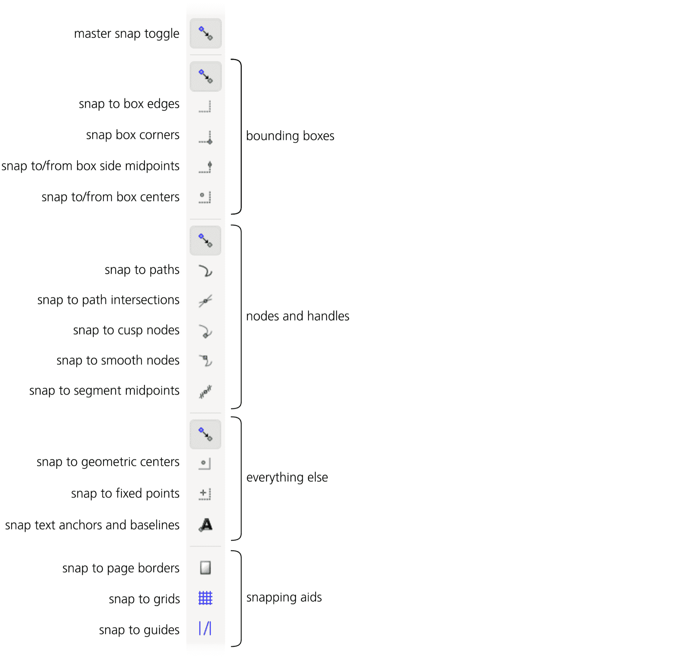

图 7-8：吸附控制条

吸附条最上方的按钮是主吸附切换按钮；当它关闭时，吸附条上的所有其他按钮都会被禁用。

吸附的对象和吸附目标被分为三类，分别对应吸附控制条的三个主要部分（底部的第四部分控制一般的吸附辅助功能，如网格和引导线）。每个部分的顶部都有一个主切换按钮；这些子切换按钮看起来与最上方的主吸附切换按钮完全一样，这一点可能会让人感到有些困惑（即使它在某种程度上是统一的）。(Inkscape 真的能从才华横溢的图标设计师那里获益！) 这三类是：

+   选择工具中的边界框及其元素（4.3）。

+   路径、路径节点和路径节点句柄（12.5.1）。

+   其他所有内容：渐变句柄（10.1），引导锚点（7.1.1），变换固定点（6.4），文本锚点和基线（第十五章）。

有时，一个组的成员可以吸附到另一个组的成员，但一般来说，它们倾向于在自己的组内吸附。特别地，节点和句柄从不吸附到边界框（尽管它们可以吸附到路径上）。

吸附条底部的最后一部分控制所有三个组的主要吸附目标：页面边缘（2.3），网格（7.2）和引导线（7.1）。这些按钮仅影响吸附；与|和#键不同，它们不会隐藏网格或引导线。

在吸附条按钮的图标中，*蓝色*用于表示*可吸附对象*（即能够吸附的对象，通常是点），而*绿色*则表示*吸附目标*（即吸附的目标，通常是线条或点）。如果同一种实体既是吸附目标又是可吸附对象，它的按钮图标会使用绿色。（唯一例外的是网格和引导线图标，它们是吸附目标，但通常使用蓝色。）

让我们来看一下三种类型的可吸附对象和吸附目标。

#### 7.3.1.1 边界框吸附

如果您只需要对齐整个对象，而不关心节点或其他特殊点，请使用边界框吸附，如图 7-9 所示。

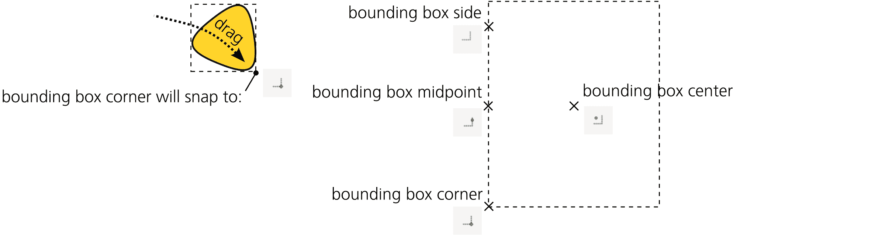

图 7-9：边界框吸附选项

本组中的第一个按钮（图 7-8）是本地主开关。禁用它会禁用整个组，这样您就不再需要担心吸附到边界框或从边界框吸附。

接下来，按钮按顺序控制：

+   吸附目标：*边界框的边*。启用后，所有对象（无论是否选中）的边界框边缘将作为吸附指南。

+   吸附目标和可吸附对象：*边界框的角*。启用后，拖动选择工具中的任何对象时，选择框的角将吸附。图 7-10 显示了启用这两个按钮并将一个椭圆拖近另一个椭圆时发生的情况。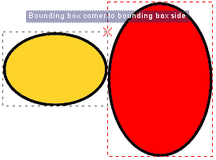

    图 7-10：将边界框角吸附到边界框边

    当吸附发生时，Inkscape 会在吸附点闪烁一个十字标记，并提供一个有用的提示。如果您吸附到的边界框是未选中对象的边界框，它还会暂时显示为一个红色虚线框。

+   吸附目标和可吸附对象：*边界框边缘的中点*（每个框四个）。可以将其视为吸附对象的中心轴线；对于围绕该轴对称的对象来说，这最为合理。

+   吸附目标和可吸附对象：*边界框的中心*。启用此选项后，您可以轻松将中心对称的对象吸附到对称的布局中。

当您同时有一条线和该线上的一个点作为吸附目标（例如边界框的边和其中点）时，当您接近该点时，点目标会覆盖。否则，您将吸附到该线的最近点（并轻松沿其滑动）。

#### 7.3.1.2 路径和节点吸附

第二组按钮（图 7-8）控制路径节点的吸附（12.1），如您在节点工具中编辑时所示，和梯度/图案句柄的吸附（10.1，10.8），这些句柄可以在梯度工具和其他工具中进行编辑。

图 7-11：路径和节点吸附选项

再次说明，本组中的第一个按钮作为整个组的本地主开关；当它关闭时，本组中的所有其他按钮将变为灰色。

接下来，按钮按顺序控制：

+   吸附目标：*路径*。您可以在绘图中的任何路径上吸附和滑动一个节点（路径不需要被选中），但除非激活以下按钮之一，否则您不会吸附到路径上的点。

+   吸附目标：*路径交点*。两个路径交叉的点，或单一路径与自身交叉的点。

+   吸附目标和可吸附对象：*尖角节点*（12.5.5），如路径上的角。

+   吸附目标和可吸附对象：*平滑节点*（12.5.5），如椭圆上的象限点。

+   吸附目标：*直线段的中点*。

#### 7.3.1.3 “其他所有”吸附

吸附控制栏的第三部分（图 7-8）包括所有其他未被其他类别覆盖的内容。请注意，尽管工具提示中说如此，渐变节点的吸附实际上是在前面的节点吸附部分（7.3.1.2）中控制的；您不能吸附*到*渐变节点，如图 7-12 所示。

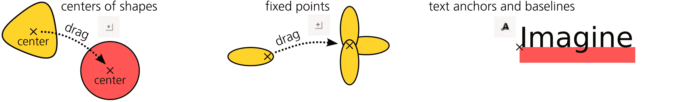

图 7-12： “其他所有”吸附选项

在这一节中，第一个按钮是本地主开关。接下来，按钮按顺序控制：

+   可吸附对象：*对象的中心*。只有对称形状，如星形/多边形（11.5）和椭圆（11.4），才有定义的中心；在一般情况下，这个中心与边界框的中心不同。

+   可吸附对象：*变换的固定点*（6.4）。

+   可吸附对象：*文本对象的锚点*（15.4.4）。

### 7.3.2 吸附偏好设置

在文档属性对话框的吸附选项卡（图 7-13）中，您可以调整吸附距离——即必须接近吸附目标的距离，才能触发吸附。您可以为吸附到对象（包括边界框、路径和节点）、网格和参考线分别设置这些距离（按文档存储）。

对于网格，默认设置是始终吸附——也就是说，任何距离下都会发生吸附（对于网格来说，吸附距离不可能超过网格间距）。如果您缩小了视图且一些网格线被隐藏（7.2），吸附只会发生在可见的网格线上。

对于对象和参考线，吸附默认在距离为 20 屏幕像素或更近时触发。使用屏幕像素单位可以确保吸附效果独立于缩放；如果您希望将可吸附对象移动到接近吸附目标的位置，但避免吸附，可以在更高的缩放级别下进行操作。

您还可以控制是否将路径吸附包括裁剪路径和遮罩（18.3），如图 7-13 所示。

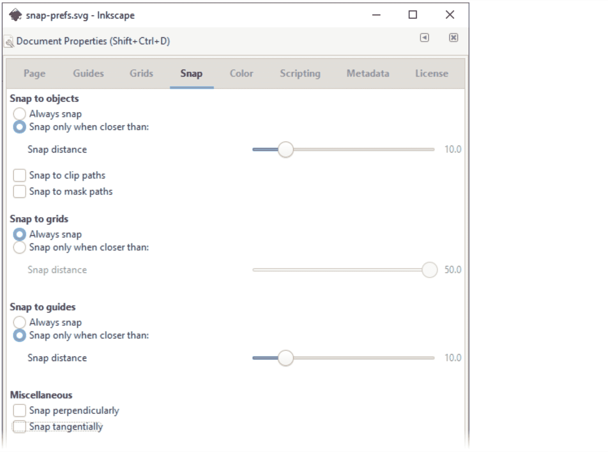

图 7-13：文档属性中的吸附选项

全局偏好设置对话框（3.1.1）也有一个行为▶吸附页面，如图 7-14 所示。

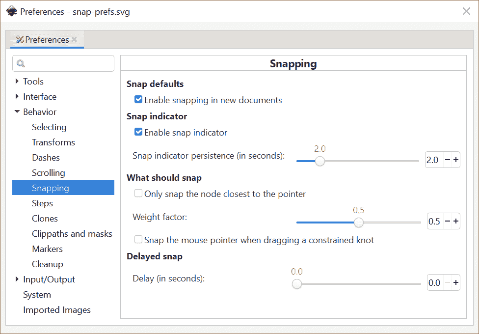

图 7-14：偏好设置中的吸附选项

+   吸附指示器（默认开启）是一个十字标记和文本标签，会在画布上闪烁，告诉您刚才吸附到了什么（图 7-10）。它们会在每次吸附发生时弹出，并在吸附指示器持续时间延迟后消失，您可以调整此延迟（默认情况下为 2 秒）。

+   “仅吸附最接近指针的节点”告诉 Inkscape 忽略你可能正在拖动的所有其他节点，除了与鼠标指针最接近的那个。例如，如果你打算吸附矩形的一个角，只需抓住矩形的那个角进行拖动——此时，其他三个角不会妨碍你。这减少了在复杂文档中可能非常分散注意力的“吸附噪音”。如果启用此选项（默认情况下是关闭的），Inkscape 会在你拖动时，在最接近可吸附节点的位置显示一个圆形标记。

+   权重因子是另一个参数，用来控制当多个拖动点距离目标足够近时，Inkscape 会选择哪个点进行吸附。如果设置为 0，Inkscape 会吸附距离目标最近的点，而忽略鼠标指针的位置。设置为 1 时，与上面描述的“仅吸附最接近指针的节点”选项相同：现在，在所有“想”要吸附的节点中，吸附会发生在距离指针最近的节点上（这可能与距离目标最近的节点不同）。0 和 1 之间的值可以让你平衡这两种吸附策略。

+   延迟是指在你的鼠标指针停止后，Inkscape 等待的时间（秒数），然后进行吸附。增加此值会使吸附更“迟疑”——如果你的文档很复杂并且启用了多个吸附模式，使得所有对象都想吸附到其他对象，这可能会是一个好方法。在这种情况下，增加延迟并减少吸附距离可以使你的工作更轻松。

## 7.4 对齐

对齐与吸附一样，是将对象放置到精确位置的方式。与吸附不同的是，它不是交互式的：你只需选择对象，选择一个命令，所有对象会一次性移到目标位置。对齐命令被收集在强大的“对齐和分布”对话框中（Shift-Ctrl-A 或从菜单选择“对象 ▶ 对齐和分布”）。

现在我们先来看看对话框中的对齐部分（图 7-15）。

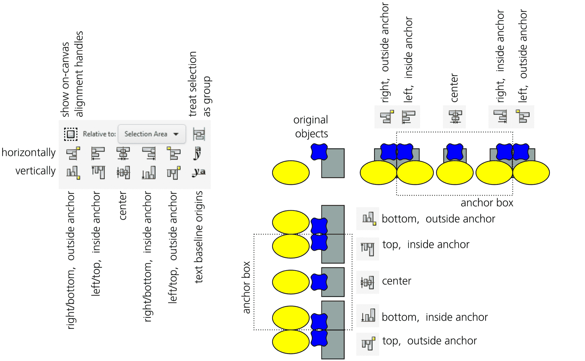

图 7-15：对齐对象

要理解对齐对话框中的多个按钮，请观察以下内容：

+   顶排按钮通过水平移动对齐对象；底排按钮则通过垂直移动对齐对象。

+   所有对齐按钮都是相对于*锚定框*来移动对象的；使用“相对”列表来确定这个锚定框是什么。默认情况下，适用于大多数情况的是“选择区域”——即所有选定对象的组合边界框。你也可以选择其中一个被选中对象的边界框（第一个或最后一个被选中的，或者最大或最小的那个），以及整个页面或整个绘图的边界框。

    例如，如果你有一组小对象并且想将它们对齐到一个大背景对象的顶部，选择所有对象并在“相对”列表中选择**最大对象**。

+   在这组按钮的中间，两排中的两个按钮将所选对象的中心对齐到锚框的水平中心（顶部行）和垂直中心（底部行）。围绕这两个按钮的是四个按钮，它们将对象压到锚框*内部*的边缘。这六个按钮可能是整个对话框中最常用的。剩下的四个按钮，分别位于左侧和右侧，对齐对象到锚框的边缘，但*在外部*。

+   右端的两个按钮——带有字母的按钮——仅适用于*文本对象*。每个文本对象都有一个*基线原点*（见 15.4.4），这些按钮通过这些点对所选文本对象进行对齐。如果你将文本对象作为普通对象通过其边界框进行对齐，那么带有和不带有*下行部分*（例如字母 *y* 的底部笔画）以及*上行部分*（例如字母 *d* 的竖直部分）的字符将无法保持在同一行，如图 7-16 所示。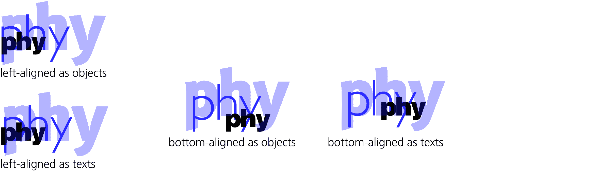

    图 7-16：对齐文本对象

### 7.4.1 通过手柄对齐

默认情况下，在选择工具中对选择项进行第二次点击（或者，按下 Shift-S）会将屏幕上的手柄从缩放模式切换到旋转模式，再切换回来（见 6.3）。如果对齐是你经常使用的功能，你会喜欢可以启用一个*第三*模式——*对齐模式*，该模式包含在点击或 Shift-S 循环中，如果你在对齐和分布对话框中切换启用画布内对齐手柄按钮（位于“相对”下拉菜单的左侧）。

确保启用画布内对齐手柄按钮已开启，选择一些对象，然后点击选择项两次（不要双击）或按两次 Shift-S。第一次点击/按键切换到旋转模式，第二次切换到具有独特手柄的对齐模式。现在，要将所有选中的对象相对于选区的边界框对齐，只需点击或 Shift+点击九个手柄中的一个。图 7-17 展示了这一操作的效果。

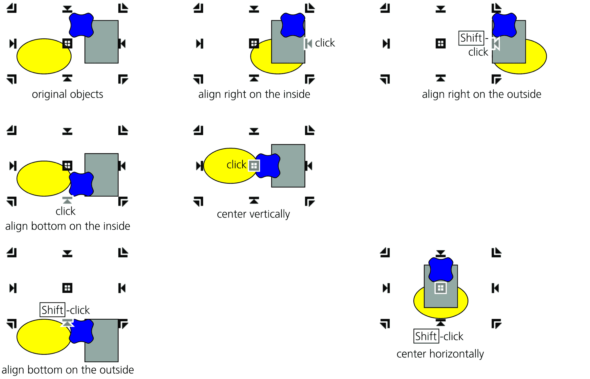

图 7-17：通过画布上的手柄对齐对象（双击选择项以获取对齐手柄）

## 7.5 分布

*分布*所选对象时，会将它们移动，使得如果按照某种方式测量它们之间的间隔，则这些间隔变得相等。相同的对齐和分布对话框中有八个对象分布按钮和两个文本分布按钮，它们在测量这些间隔的方式上有所不同。与对齐按钮一样，这些按钮的一半（顶部行）用于水平移动，另一半（底部行）用于垂直移动（见图 7-18）。

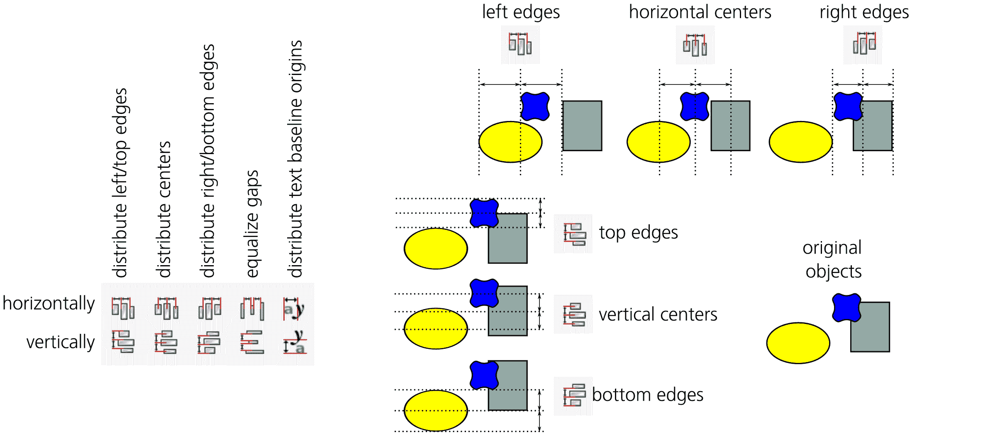

图 7-18：分布对象

在对齐部分的居中按钮下方，分布部分有两个按钮用于*分布中心*。这些按钮通过使所选对象的中心（更精确地说，是它们的边界框中心）在水平方向或垂直方向上保持相等的距离，从而移动对象。

这两个按钮的右侧和左侧，另外四个按钮执行相同的等间距分布，但作用于边界框的左右、上下两侧。

右侧再有两个按钮，它们不均衡距离相同名称的边界框边缘，而是使它们之间的*间隙*相等。例如，在水平间隙均衡化中，从一个对象的右边缘到下一个对象的左边缘的距离将变得相同。当对象宽度不同的时候，这可能比均匀分布它们的中心更加符合视觉效果。图 7-19 展示了分布对象中心和均衡间隙之间的区别。

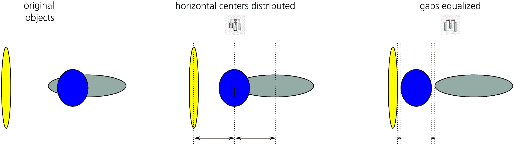

图 7-19：分布对象中心与均衡它们之间的间隙

最后，最右侧的两个按钮分布所选文本对象的基线原点。

与对齐按钮不同，分布按钮始终使用所选对象的边界框作为锚框（也就是说，相对选择不会影响对话框中的分布部分）。换句话说，分布始终保持选择的边界框不变，因为它从不移动最左边和最右边（水平）或最上边和最下边（垂直）的对象，只移动它们之间的对象。（这一点的后果是，分布仅适用于选择三个或更多对象。）

所以，如果在分布后发现对象过于密集或稀疏，只需选择分布边缘的一个对象并将其向内移动（使其更密集）或向外移动（使其更稀疏）。然后，重新选择所有对象，再次进行分布。

请注意，选择的对象可能会重叠，无论是在分布之前还是之后。即使在均匀间隔时，对象的边缘也可能会重叠；这种重叠被视为*负间隙*，当点击按钮时，它们仍然会相互均等。换句话说，当空间不足时，相邻的对象会按相同的量重叠。

当你使用节点工具时（12.5），对齐和分布对话框显示四个按钮，允许你在水平方向或垂直方向对所选路径节点进行对齐或分布（图 7-20）。

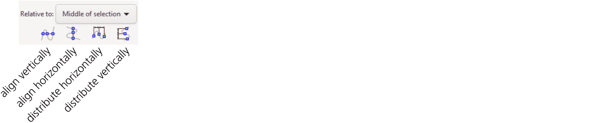

图 7-20：对齐和分布路径节点（在节点工具中）

### 7.5.1 交换位置 [1.1]

到目前为止描述的所有基本对齐和分布命令有一个共同点：它们只在一个维度上工作——要么是水平方向，要么是垂直方向。然而，相同的对齐和分布对话框中还有一些更有趣的命令，可以在两个维度上同时移动对象。

一个常见的操作是*交换位置*。对于两个对象，这将把对象 A 的中心移到 B 的中心所在的位置，反之亦然；对于多个对象，这将把 A 移到 B 的位置，B 移到 C 的位置，以此类推，直到 Z 跳到 A 原本的位置。

该对话框有三个按钮来实现这一简单概念的变体（图 7-21）。它们在两个选中对象时的功能完全相同，但在选中两个以上对象时，它们决定 A、B、...、Z 顺序的方式不同。

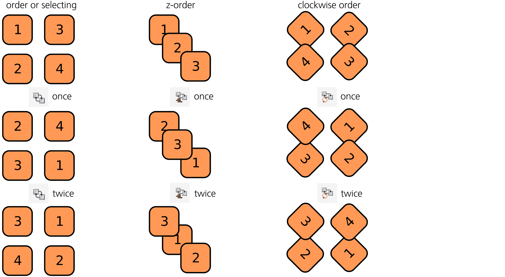

图 7-21: 交换多个选中对象的位置

选择顺序

A 是最后选中的对象；Z 是第一个选中的对象。

Z-order（4.4）

A 是最上面的对象；Z 是最下面的对象。请注意，这个命令交换位置时不会影响 z-order；如果你想在不改变位置的情况下反转对象的 z-order，请使用 Restack 扩展（见图 4-6）。

顺时针顺序

Inkscape 按照从选择中心看过去并顺时针排列的顺序对选中的对象进行编号。可以把你的对象想象成时钟上的数字。点击这个按钮将使 12 移动到 1 的位置，1 移动到 2 的位置，依此类推，直到 11 移动到 12 的位置。

### 7.5.2 随机化与去聚集

*随机化*仅仅是将每个选中的对象移动到选择框内的一个随机位置。每次点击按钮都会产生一个新的随机位置——你可以重复这个操作，直到找到你喜欢的随机化效果，如图 7-22 所示。

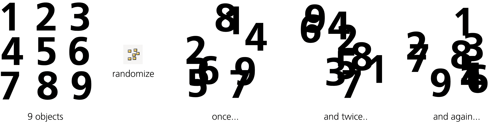

图 7-22: 随机化对象位置

*去聚集*类似于均匀化间距，但它同时在两个维度上工作，试图使所有相邻对象对之间的最近距离均衡化。对于大量对象，这个操作效果最好，如图 7-23 所示。

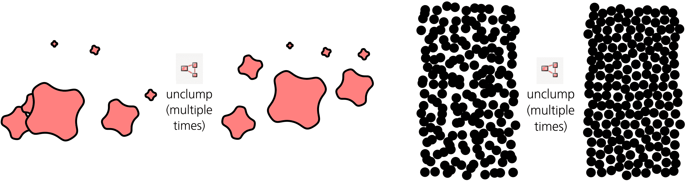

图 7-23: 去聚集对象

去聚集是一个迭代操作，因此你可能需要重复使用它，直到对结果满意。它不会完全替代当前的排列，而是通过小步改善它，使每个对象朝着一个与其相邻对象等距的位置移动（这些相邻对象也会移动）。这一过程最明显的结果是减少了*聚集*——即对象过于密集的地方。

在大多数情况下，迭代去聚集会收敛——也就是说，它减少了对象分布的视觉不均匀性，使得每一次去聚集的效果逐渐减小。某一时刻，再次尝试去聚集已经去聚集的对象群时，反而会让它们缓慢地以随机方向分散和迁移，而不会改善均匀性。

去除聚集的对象会产生一种同时看起来既随机又人工的纹理。这类似于一个人在被要求用随机点填充空间时的效果。这种纹理的例子包括圆点图案（10.8.4）和点刻印，其中阴影是通过平滑地（没有聚集）变化散布点的密度来创建的。

### 7.5.3 移除重叠

与去聚集不同，*移除重叠*是一种确定性操作。它会以每个选定对象所需的最小距离移动对象，以确保所有对象不再重叠——通常第一次尝试就会成功（我说“通常”是因为一般来说，这不是一个简单的操作，有时可能会失败）。当然，移动的量取决于初始排列，但在大多数情况下，即使它可能进行了大幅度的重新排列以释放对象，操作后的对象布局仍会与原始布局相似。

对于此命令，你还可以设置添加到对象边界框的水平和垂直间距（单位为`px`），如图 7-24 所示。

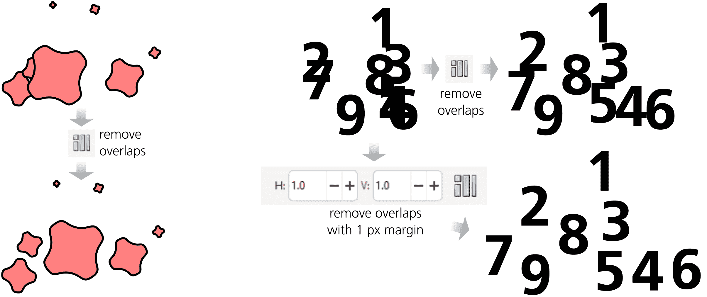

图 7-24：移除对象间的重叠

注意，未与任何其他选定对象重叠的对象没有移动。

另一个对话框中的按钮，连接器网络布局，应该能够将用连接器工具（14.5）制作的图表重新排列得更加整齐。理论上，这应该会移动连接的对象，从而最小化连接线的长度和/或交点；但实际上，这个命令的效果看起来与普通的移除重叠一样。

### 7.5.4 排列对象

即使在对齐和分布对话框中有这么多选项，你可能仍然会有一些未填充的对象排列需求。排列对话框（可以从“对象”菜单中访问）可以满足其中两个需求：它将把你的对象排列成二维表格或圆形，提供丰富的间距和对齐选项（正如你从 Inkscape 中预期的那样）。

这个对话框对于你已经拥有的*不同*对象最为有用，比如你想要排列成画廊的导入位图。如果你只需要排列一个*相同*对象的模式、表格或网格（或者仅在大小或样式上有所不同的对象），请查看克隆瓷砖工具（16.6）。

#### 7.5.4.1 网格排列

对话框的矩形网格标签页（图 7-25）会根据选定对象的数量计算出最紧凑的表格行数和列数（使行数尽可能接近列数）。如果你更改其中的任何一个数字，另一个数字会重新计算。例如，如果选中了 29 个对象，系统会建议 5 行 6 列；如果你增加行数，行数和列数会减少——你将得到 6 行 5 列、8 行 4 列、10 行 3 列，等等。

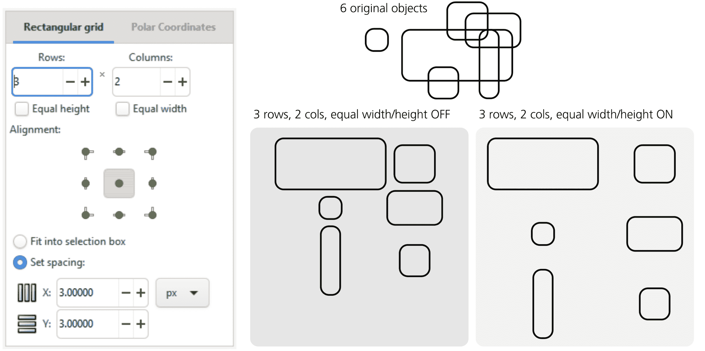

图 7-25：使用“排列”对话框创建对象网格

接下来，两个复选框控制是否所有行和所有列将具有相等的高度和宽度。启用“等高”时，整个网格中的所有行将与*所有对象*中最高的对象一样高（加上间距，见下文）。如果禁用，则每一行的高度仅与*该行*中最高的对象一样高（加上间距）。请注意，即使禁用“等宽”和间距为零，如果列中最宽的对象恰好不在相邻的单元格中，你的对象在网格中也不一定会相触。

在下方，一组按钮选择每个对象的哪个点对齐到网格中。这是你控制对象在行列中的对齐方式；默认情况下，它们在两个维度上都居中。

剩下的控件定义了网格的大小。启用“适配选择框”选项可以确保排列后的宽度和高度与点击“排列”之前的选择区域完全一致。换句话说，创建网格后，Inkscape 会设置行列之间的间距，以确保选择区域的总体尺寸不发生变化（即使这会导致重叠）。例如，如果你想让网格更稀疏，撤销排列，拖动其中一个对象远离其他对象，重新选择所有对象，启用**适配选择框**，然后再点击**排列**。或者，你可以通过输入所需的值并选择单位来显式设置行列的间距。

网格排列的最大问题是每个对象的行/列位置有些不可预测。即使你的对象已经大致排列成一个表格，你只是想将它们对齐，使用这个对话框可能会让一些对象重新排布到明显错误的位置。如果你试图通过交换几个对象的位置来修正这个问题，可以尝试在“对齐与分布”对话框中使用对象交换命令。

#### 7.5.4.2 在圆形中排列

“排列”对话框的另一个标签“极坐标”让你将多个对象排列到一个圆形或椭圆形的环上，彼此之间的角度距离相等。例如，选择六个对象时，你将得到一个六边形，如图 7-26 所示。

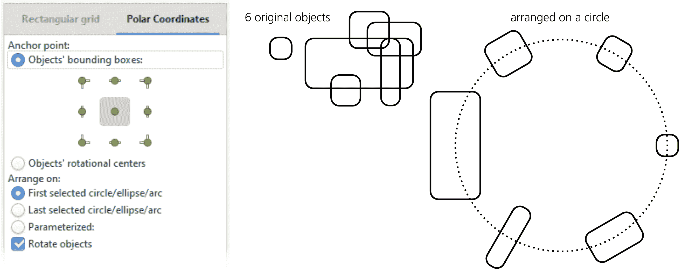

图 7-26：使用“排列”对话框创建对象网格

你可以选择每个对象的哪个点与圆形对齐；默认情况下，它是中心，但你可以切换到边界框的任意一个角或中点，也可以使用每个对象的旋转中心（即固定点，6.4）。至于你要排列的圆形，它可以是选择中的实际圆形、椭圆或弧形（11.4），或者你可以切换到“参数化”并通过坐标指定排列指南。最后的选项选择对象在放置到其位置时是否旋转（默认情况下），或者不旋转地移动。
