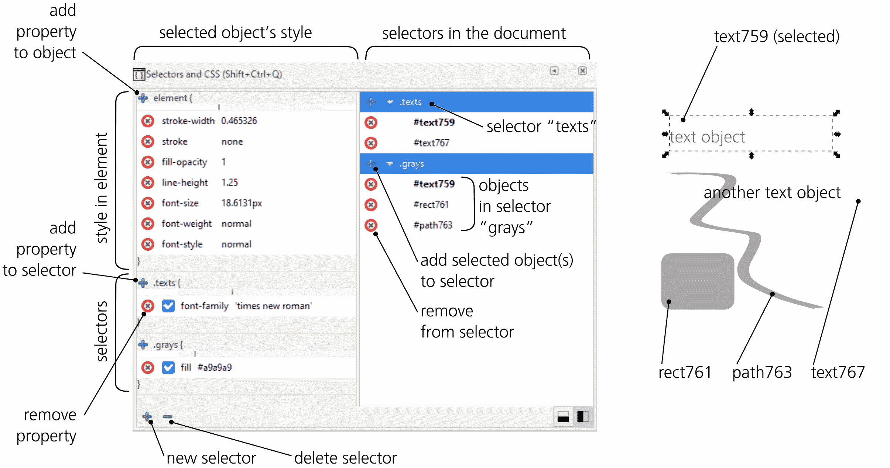
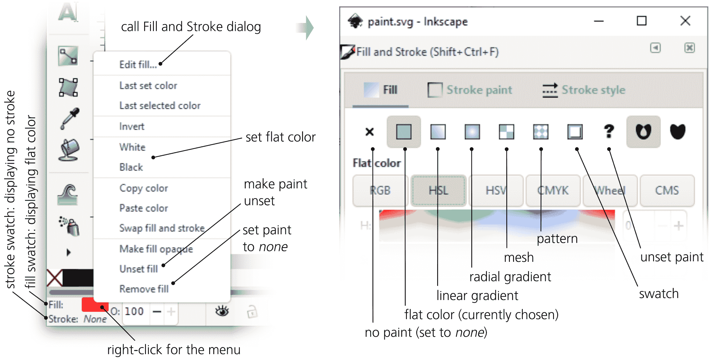
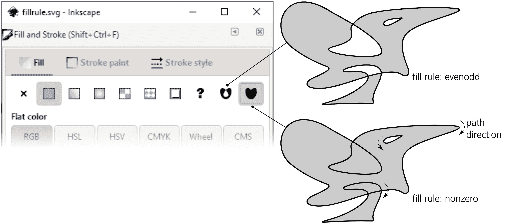
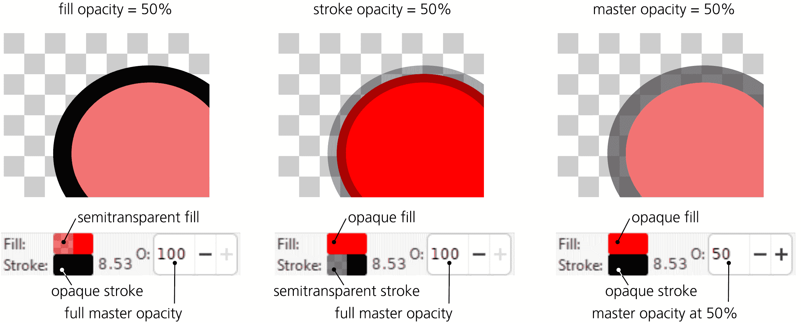
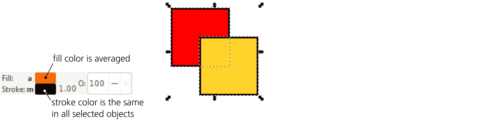
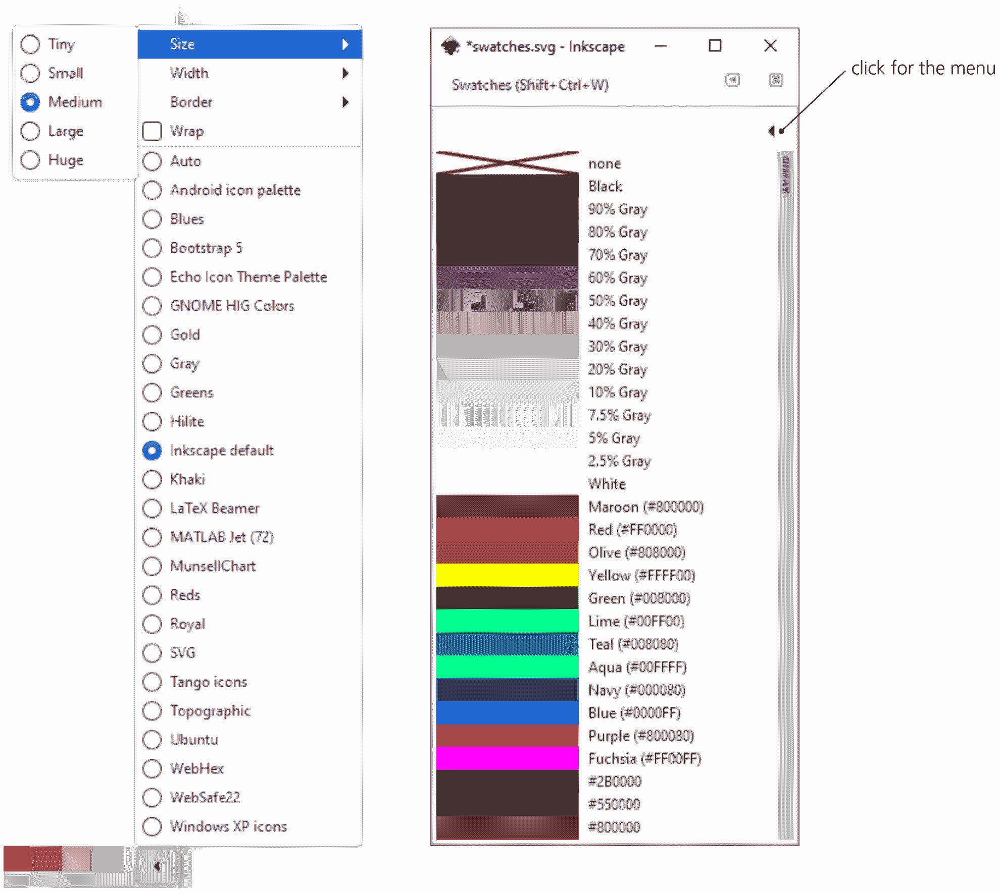
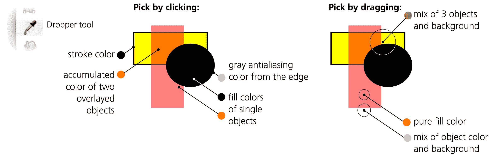
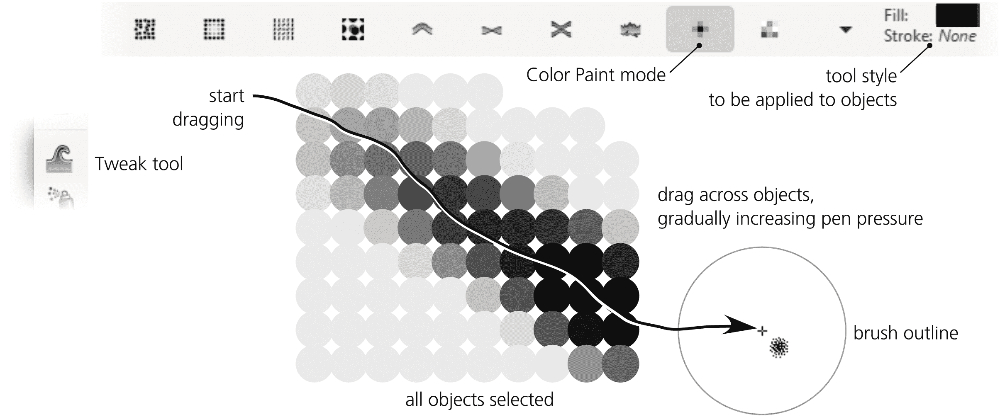
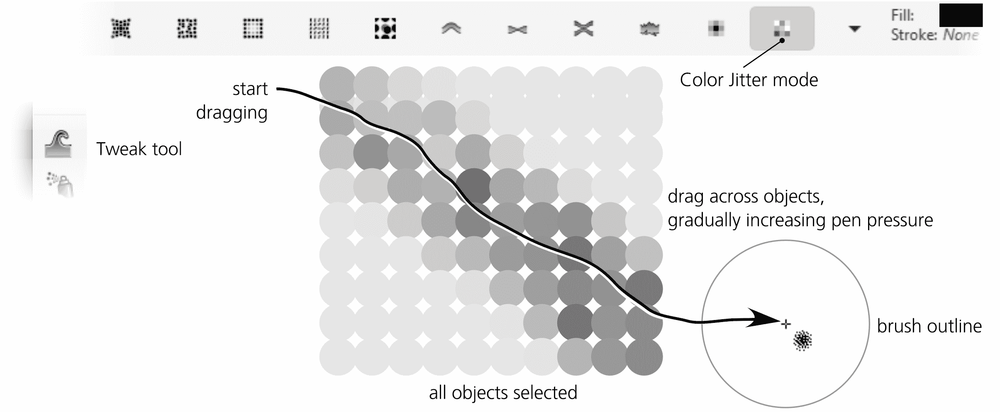

# 第八章：样式：颜色和不透明度

现在你已经了解了如何选择和变换对象，接下来我们将开始一个新话题，这将贯穿接下来的几个章节：样式。一个 Inkscape 文档中对象的外观是由该对象的*样式*决定的，样式由多个*属性*组成。要使用 Inkscape，你需要熟悉至少一些样式属性以及用于编辑它们的工具。

在本章中，我将介绍最基本的样式属性，包括常见的*填充*类型（用于填充和描边）和*不透明度*。之后，第九章将介绍描边样式，第十章讨论渐变、网格和模式，第十五章将描述文本样式属性。滤镜效果，如模糊，也属于对象的样式；我将在第十七章中讨论这些内容。

在所有其他命令之前，值得了解一个与样式相关的命令，即编辑▶粘贴样式（Shift-Ctrl-V）。它会将你最后复制到剪贴板上的对象的完整样式应用于所有选中的对象。你常常希望某些对象在样式上大体相同，但又不完全一样。将相同的样式粘贴到所有对象上，然后再更改需要不同的属性，这要比逐个对象调整要简单得多。另外，你已经学会了如何通过样式属性来搜索对象（5.13），以及如何选择与选定对象样式相同的对象（5.12）。

## 8.1 样式属性和选择器 [1.1]

Inkscape 有许多对话框、命令和工具，处理对象的样式；你可能已经在使用其中的一些。但是，在查看任何特定样式属性或工具之前，我们先谈谈样式是如何在 SVG 中编码的。如果你对技术细节不感兴趣，可以跳过这一节。

对象样式在文档的 SVG 代码中是如何记录的，并没有被 SVG 标准定义；为此，SVG 重用了另一个标准，称为*Cascading Style Sheets (CSS)*。如果你曾做过任何 HTML 编码，那么你可能已经熟悉 CSS，因为 HTML 也使用 CSS。（SVG 只使用 CSS 的一个子集；有关详情，请参考[`w3.org/TR/SVG`](http://w3.org/TR/SVG)以及附录 A。）

在 CSS 中，样式是一个由命名的*属性*组成的集合。每个属性都有自己可以接受的值的规则。如果你曾浏览过 Inkscape 的 XML 编辑器中的对象（4.10），你可能会注意到大多数对象上都有`style`属性，它看起来像是由分号分隔的`name:value`对的列表。每一对这样的键值对定义了一个属性。例如，`fill`指定填充颜色（8.2），`stroke-width`用于描边路径，或者`font-family`用于文本对象。

如果你想在 CSS 属性层面编辑样式，XML 编辑器并不太方便。用于编辑样式的专用工具是选择器和 CSS 对话框（Ctrl-Shift-Q），如图 8-1 所示。在这里，你不仅可以编辑对象的属性，还可以创建*选择器*——适用于多个对象的样式，使你能够一次性更新所有对象。



图 8-1：选择器和 CSS 对话框，显示选中对象的样式以及文档中定义的选择器

对话框的前半部分（你可以将对话框的两个区域垂直或并排排列）处理选中对象的样式。即使你不使用任何高级功能，你也可以方便地编辑选中对象样式的所有属性。Inkscape 会提示你可用的属性名称，并验证你输入的值。列表顶部的 + 按钮添加新属性；属性旁边红色圆圈中的 x 删除该属性。

魔法开始于你点击对话框左下角的 + 按钮。这将创建一个新的*选择器*，并提示你为其命名。你可以将选择器视为类似于 CSS 类：它是一个元素集合和应用于这些元素的样式。最初，只有选中的对象在选择器中，且该选择器没有自己的样式属性。要将更多对象添加到选择器中，选择它们并点击你想应用的选择器旁边的 + 按钮。

一个对象可以属于多个选择器；例如，在图 8-1 中，`text759`（每个对象通过其`id`属性进行标识，4.1）包含在`texts`和`grays`选择器中。顺便说一下，当你点击对话框中的选择器名称时，其对应的对象会在画布上被选中——即使你不使用选择器样式，这个对话框也能帮助你“存储”复杂的选择。

要向选择器添加样式属性，选择其中的任何对象，并点击对话框顶部（或左侧）与对象样式相关的选择器名称旁边的另一个 + 按钮。你在此处提供的任何值将应用于该选择器中的所有对象，覆盖它们在各自样式中可能具有的相同属性值。在图 8-1 中，`texts`选择器具有属性`font-family: 'times new roman'`，而`grays`选择器包含`fill: #a9a9a9`（灰色）。被选中的对象`text759`同时包含在这两个选择器中，因而它既有灰色填充，又使用了 Times New Roman 字体。

## 8.2 涂料

如你所知，对象可以有*填充*和*描边*，它们分别应用某种类型的*涂料*。可以说，一个对象被一种涂料填充，另一种涂料描边。涂料可以有几种不同的类型。

无（无涂料）

填充设置为`none`的对象只有描边，而描边设置为`none`的对象只有填充。如果填充和描边都设置为`none`，该对象完全不可见（并且无法通过点击选择，5.4），就像其透明度为零一样。

纯色

这是最常见的绘制类型：纯色。稍后在本章中，你将看到多种查看和更改填充和描边颜色的方法。

渐变、渐变网格或图案

填充和描边都可以具有各种类型的平滑颜色渐变、渐变网格或重复模式。这些复杂的绘制类型是另一个章节的内容（第十章）。

颜色样本

颜色样本是你可以分配给多个对象的平面颜色（作为填充或描边），这样当你编辑它时，所有使用该颜色样本的对象都会更新。颜色样本属于其创建的文档，并与文档一起保存。颜色样本是在填充和描边对话框中创建和编辑的，但它们也会列出并可以从自动调色板中应用（8.5.1）。这个功能使用起来仍然有些笨拙；另外，在 SVG 中，颜色样本被编码为一个假渐变，这不太自然。如果你需要可重复使用的样式，建议使用 CSS 选择器（8.1）。

未设置

这意味着填充或描边*未指定*，因此可能会*继承*自对象的祖先（在文档的 XML 树中位于其上方的对象）；这与`none`（仅强制不可见）不同。如果一个对象的祖先没有自己的描边或填充（通常对于组或图层来说是这样），则未设置填充或描边的对象将采用 SVG 默认值：不可见的描边和实心黑色填充。未设置在克隆（第十六章）中很有用，因为它允许你创建与原始对象不同的克隆。

用于编辑对象样式的主要工具是填充和描边对话框（Shift-Ctrl-F），它的填充和描边面板上有许多按钮，分别对应不同的绘制类型。按下的按钮表示当前选中对象的绘制类型；如果选中了多个具有不同绘制类型的对象，则没有按钮被按下，且对话框会显示“多个样式”。

另一个重要的控制是状态栏中的*选中样式指示器*（2.8）。它始终显示在屏幕上，允许你快速查看选定对象的绘制类型，并通过右键菜单更改：右键点击*顶部*的填充样本以更改*填充*颜色，右键点击*底部*的描边样本以更改*描边*颜色（图 8-2）。



图 8-2：选定描边指示器（左）和填充与描边对话框（右）中的绘制类型

一个仅适用于填充而不适用于描边的重要属性是*填充规则*。它可以取两个值。`evenodd`表示*任何*自交或内部子路径（12.1.1）会在路径的填充中创建孔洞。`nonzero`表示大多数孔洞会被填充；更精确地说，如果内层子路径与外层子路径方向相同，孔洞将被填充，否则它将是一个未填充的孔洞。

要更改填充规则属性，可以使用**填充和描边**对话框中的两个切换按钮，如图 8-3 所示。



图 8-3：在填充和描边对话框中更改填充规则

并非所有对象类型都能或应该具有填充和描边：

位图

位图对象（第十八章）不能具有填充或描边。然而，你可以将位图转换为一个由该位图填充的矩形路径作为图案（只需按下 Alt-I），然后可以为其应用描边。

组

你通常不需要单独为一个组设置填充或描边，因为组内的对象通常会有自己的绘制方式，并会忽略其父组上设置的内容。事实上，如果你尝试在 Inkscape 中为一个组设置填充或描边，它会在组上设置这些属性，但*同时*也会递归地将它们赋给该组的所有成员。只有显式*取消设置*了组成员的填充或描边，它们才会被忽略；然而，它们仍然会从祖先继承新的填充或描边。

克隆

如果你尝试为克隆对象（第十六章）设置填充或描边，除非该克隆的原始对象的填充或描边被*取消设置*，否则不会产生可见效果。

## 8.3 不透明度

在填充或描边绘制的基础上，一个对象还可以有*不透明度*，你可以在状态栏的 O: 字段中或通过填充和描边对话框中的不透明度滑块进行编辑。与滤镜（第十七章）类似，不透明度适用于整个对象，填充和描边没有区别。

事实上，在 SVG 中，一个对象可以有三种不透明度：*主不透明度*（在大多数 UI 界面以及本书中通常称为*不透明度*），*填充不透明度*，和*描边不透明度*（图 8-4）。后两种不透明度仅适用于填充或描边，而 Inkscape 允许你查看并修改它们，但一般不鼓励使用它们，而是倾向于使用主不透明度。实际中，需要填充透明而描边不透明，或反之的情况并不常见；在大多数情况下，使用主不透明度更加自然且易于操作。



图 8-4：填充不透明度、描边不透明度和主不透明度

降低描边不透明度的一个后果是，你可以看到对象填充的边缘，通常被其自身的描边所遮挡。根据 SVG 规则，描边通常绘制在填充上方（在对象自己的内部 z 顺序中；但请参阅 9.6），填充被描边的中线所限制，因此，在半透明描边的情况下，你将看到三个不同的边界：描边的外边界、描边的中线（填充从此开始）以及描边与填充重叠的内边界。

主不透明度与描边不透明度不同，它没有这种问题——它适用于整个对象，而不会暴露任何杂乱的边缘。同样，当应用于一个组时，它使整个组变得透明，这可能与为组内每个单独对象分配相同不透明度的效果不同（图 4-10）。

此外，与填充或描边不透明度不同，主不透明度适用于没有自己填充或描边的对象，例如位图和大多数克隆。

## 8.4 颜色模型

样式的最重要构建块是*颜色*。讨论颜色如何在计算机上表示可以轻松填满一本书；Inkscape 可能不是最强大的颜色程序，但在这个领域，它仍然相当丰富和复杂。

在处理颜色时，第一步是选择*颜色模型*。Inkscape 支持几种流行的颜色模型，它们以不同方式表示相同的颜色。

### 8.4.1 RGB

在最常见的颜色模型*RGB*中，每种颜色都被表示为红色、绿色和蓝色成分或*通道*的混合。这种模型几乎被所有计算机显示器实现（显示器通常由这三种颜色的小型光源组成），也是 SVG 以及大多数其他计算机图形格式中使用的主要颜色模型。

根据你使用的软件，RGB 颜色中每个通道的值可以是 0 到 1 之间的分数值（例如 0.5），也可以是 0 到 255 之间的整数（例如 127）。这两种系统是等价的；例如，R = 0，G = 0.5，B = 1.0 的颜色与 R = 0，G = 127，B = 255 的颜色是相同的。Inkscape 通常使用 0-255 的整数格式，我在本书中也倾向于使用这种格式；然而，在 Inkscape 的某些界面部分，你会看到整数格式和分数格式之间的选择。

在 RGB 模型中，通道的值越高，颜色就越亮；值越低，颜色越暗。因此，RGB 0/0/0 是纯黑色，RGB 255/255/255 是纯白色。任何 RGB 颜色，其中所有通道的值相等，都是一种灰色；使通道值不等会增加颜色的饱和度，通道值不等的差距越大，饱和度越高。因此，像纯红色（RGB 255/0/0）或纯黄色（RGB 255/255/0）这样的颜色具有最大的饱和度。

填充和描边对话框允许您使用数字输入字段或在带有渐变颜色槽的滑块中移动来编辑 RGB 颜色（请参见颜色插图中的图 2）。请注意，随着您移动滑块，槽的颜色会发生变化；每个槽显示当其他滑块保持不动时，您通过在该槽内移动滑块可以获得的颜色。底部的第四个滑块标记为 A（alpha），表示填充或描边的不透明度（因此严格来说，它不属于颜色的一部分）。

RGB 颜色通常以`RRGGBB`格式表示，其中每个分量由两位十六进制数字（基数为 16，而不是常规的基数 10）表示。十六进制数字可以使用数字`0`至`9`以及字母`A`至`F`。每个通道的最大整数值——十进制的`255`——在十六进制中为`FF`。例如，`000000`是黑色，`FFFFFF`是白色，`660000`是深红色。这种表示颜色的形式在 Inkscape 文档的 SVG 源代码中使用，也在许多其他软件和语言中使用（如 HTML）。例如，当您从选定样式指示器的填充或描边样本的右键菜单中选择复制颜色时（见图 8-2），颜色的`RRGGBB`表示将被复制到剪贴板。您还可以在填充和描边对话框的 RGBA 字段中查看和编辑`RRGGBBAA`表示（在原有的基础上增加了两个数字，表示填充/描边的不透明度）。

如果选择了多个具有不同填充或描边颜色的对象，填充和描边对话框以及选定样式指示器将显示*平均颜色*。如果更改该平均颜色，它将被重新分配给所有选定的对象，从而有效地将这些对象可能具有的任何颜色差异“压平”，如图 8-5 所示。



图 8-5：选定样式指示器中的平均颜色

### 8.4.2 CMYK 与 CMS

与 RGB 类似，在*CMYK*模型中，颜色是通过混合颜色通道获得的。然而，CMYK 并不只有三个，而是有四个通道：*青色*、*品红*、*黄色*和*黑色*（参见颜色插图中的图 3）。这种颜色模型最适用于印刷输出，因为许多专业打印机和印刷机使用 CMYK。然而，即使在指定 CMYK 颜色时，写入 SVG 的仍然是其 RGB 近似值，从 CMYK 转换为 RGB 并反向转换通常会引入失真，因为并非所有 CMYK 颜色都能精确地在 RGB 中表示，反之亦然。

填充和描边对话框的 CMS（颜色管理系统）选项卡允许您在*校准空间*中编辑颜色，该空间可能包括真正的校准 CMYK（而不是 CMYK 选项卡的近似值）或 Adobe RGB。此操作需要您在输入/输出▶颜色管理的首选项中设置颜色管理（18.8）。

### 8.4.3 HSL 与 HSV

RGB 和 CMYK 都不是非常直观的，它们代表的是计算机和打印机处理颜色的方式，而不是艺术家使用颜色的方式。Inkscape 提供了一种更自然的颜色模型：*HSL（色相、饱和度、亮度）*。与 RGB 和 CMYK 不同，HSL 的各个通道并不是混合在一起的单独颜色；相反，它们是定义颜色的*属性*，这些属性共同定义了颜色，毫不含糊。

*色相*通道是最大饱和度的彩虹色，从红色开始，经过黄色、绿色、蓝色、紫色，再回到红色。*饱和度*通道将颜色从最大色彩度、经过灰暗和单调，到纯灰色——在相同亮度级别下进行定位。最后，*亮度*通道从黑色到给定颜色，再到白色；这意味着任何最大亮度的颜色都是白色，任何零亮度的颜色都是黑色，无论色相和饱和度如何。

一旦你习惯了 HSL 颜色模型，它会变得非常直观。当你觉得某个颜色不太对时，你可能会认为它需要变得更亮或更少饱和——而不是认为它需要更多的红色或绿色。在 Inkscape 中，许多与颜色相关的工具更倾向于使用 HSL 来选择和改变颜色。

在填充和描边对话框中，有两个选项卡允许您在 HSL 模型中编辑颜色（见色彩插图中的图 4）。第一个选项卡（HSL）使用传统的线性滑块。另一个选项卡（Wheel）为 H 通道提供了一个圆形环（因此它有更好的分辨率：如果展开，它会比适合窗口的线性滑块更长），并且有一个三角形来表示饱和度和亮度通道。旋转色相环上的标记也会旋转三角形，使得它的最大饱和度尖端始终指向环上的当前色相。

Inkscape 还支持一种类似的颜色模型，叫做*HSV（色相、饱和度、明度）*。其他程序可能称之为 HSB（色相、饱和度、亮度）。它与 HSL 的唯一区别在于，HSV 中的明度组件仅在黑色和给定颜色（例如红色）之间变化。要在 HSV 中获得纯白色，您需要将明度设置为最大值*并且*饱和度设置为零。而在 HSL 中，亮度组件从黑色一直变化到给定颜色，再到白色，因此它在亮度和暗度方面是对称的。

## 8.5 调色板

给选定对象的填充或描边赋色的最简单方法是点击*调色板*中的一个色板，通常位于编辑窗口底部，状态栏上方（见色彩插图中的图 5）。单击可为选定对象分配填充颜色；Shift+单击则分配描边颜色。调色板最左侧的按钮*移除*填充或（按 Shift 键时）描边。

除了点击之外，你还可以将颜色从调色板拖放到对象上。这是更改对象的少数几种方式之一：当你将颜色拖放到对象上时，只有该对象会改变，即使它没有被选中，甚至如果其他对象被选中。拖放也适用于更改描边颜色：只需将颜色色板精确地拖到路径或形状的轮廓上。

Inkscape 自带许多默认调色板。在调色板的右端，有一个带三角标记的按钮；点击它可打开一个菜单，列出可用的调色板——例如网页安全调色板、Ubuntu 和 Windows 用于其 UI 的调色板，以及各种单色调色板（绿色、金色等）。

在同一菜单中，你可以选择色板的标准*大小*、*宽度*（窄色板较难点击，但可以通过使整个调色板适应屏幕宽度，去掉调色板的滚动条），以及启用色板的*环绕*（这样可以让调色板变得更高，但也去除了滚动条）。此外，如果你喜欢，你可以开启调色板色板周围的边框。

除了始终停靠的水平调色板，Inkscape 还具有色板对话框（Shift-Ctrl-W），如图 8-6 所示。



图 8-6：调色板菜单（左）和色板对话框（右），以列表格式显示颜色及其名称

它拥有所有相同的调色板和大小选项，唯一不同的是它增加了一个列表选项，在其中列出所有颜色及其名称。作为一个对话框，它可以浮动在你需要的位置，或者停靠在右侧并压缩成一个窄的垂直条。

### 8.5.1 编辑调色板

每个 Inkscape 调色板都是一个简单格式的文本文件，你可以进行编辑。如果你创建了一个新的调色板并希望 Inkscape 使用它，请进入**首选项**，**系统**页面，点击**用户调色板**旁边的**打开**按钮。这将打开一个文件夹，你可以将调色板文件放入其中；下次启动时，Inkscape 会将其添加到调色板列表中。

Inkscape 的调色板格式与 GIMP 的位图编辑器格式相同，因此你可以将 GIMP 发行版中的任何调色板放入该文件夹中，以便在 Inkscape 中使用它们。以下是默认调色板文件 inkscape.gpl 的开头；颜色成分（R，G，B）采用 0–255 格式：

```
GIMP Palette
Name: Inkscape default
Columns: 3
# generated by PaletteGen.py 0   0   0  Black 26  26  26  90% Gray 51  51  51  80% Gray 77  77  77  70% Gray
...
```

预定义调色板列表中的“自动”选项允许你创建一个与当前文档一起保存的自定义调色板。要添加或编辑“自动”调色板中的颜色，你需要在填充和描边对话框（8.2）中创建一个色板。

## 8.6 选定样式指示器：绘制命令

除了各种绘制样式外，选定样式指示器的右键菜单（图 8-2）还有一些处理绘制的有用命令。请注意，填充色板（上方）和描边色板（下方）是不同的，尽管它们的上下文菜单类似；请确保右键点击你想要更改的部分。

编辑填充/描边...

选择此项，以及简单地点击填充或描边色板，会打开填充和描边对话框。

最后设置的颜色

这将最后*设置*的颜色分配给所选项的相应绘制颜色（即填充或描边）。例如，如果你刚刚为某个对象涂上了特定的蓝色，并且现在想要*所有*对象都有这个填充颜色，选择所有对象并通过填充色板的右键菜单调用此命令。

最后选择的颜色

这会将所选对象的相应颜色（即填充或描边）赋给在最近一次选择更改之前*选定*的对象。例如，选择一个你喜欢的填充颜色的对象，然后选择另一个对象，使用此命令在其填充色板上应用相同的颜色。

反转

这将通过颜色的（RGB）反转替换平面颜色的填充——例如，白色变为黑色，黄色变为蓝色。

白色和黑色

这些命令只是将那些颜色分配给绘制颜色。

复制颜色和粘贴颜色

这些命令允许你通过系统剪贴板交换对象的颜色。例如，你可以复制一个对象的描边颜色并将其分配给另一个对象的填充，或者将颜色（作为`#RRGGBB`字符串）粘贴到任何其他需要它的程序中。

交换填充和描边

此命令交换选定对象的填充和描边颜色。例如，如果选定的对象没有描边且填充为蓝色，应用此命令后，它将具有蓝色描边并且没有填充。当你使用铅笔工具（14.1.2）和书法笔工具（14.2）进行绘图时，并希望结果使用相同的颜色，尽管铅笔工具创建的是没有填充的描边路径，而书法笔创建的是没有描边的填充路径时，这个命令非常有用。

取消填充/描边

使填充或描边*未设置*（8.2）。这与删除它不同。

删除填充/描边

将填充或描边设置为`无`（8.2）。此命令有一个快捷方式：中键点击填充或描边色板，将相应的颜色设置为`无`；如果颜色已经被移除，中键点击会创建默认的填充或描边（通常为黑色）。因此，要删除选定对象上的描边，按住 Shift 键点击调色板上的“无填充”色板，或者中键点击选定样式指示器的底部。

使填充/描边不透明

从颜色中移除任何填充不透明度或描边不透明度（8.3）。主不透明度（由色板右侧的“O”控制显示）保持不变。

## 8.7 选定样式指示器：颜色手势

除了其他功能外，所选样式指示器具有一种方便且独特的方法来快速调整颜色：*颜色手势*。只需抓住填充或描边颜色色板，并将其拖到画布上，可以使用或不使用修饰键，如下所述。

色彩手势在 HSL 色彩空间中有效（8.4.3）。拖动时没有任何键盘修饰符会调整色调通道，按住 Shift 键拖动会调整饱和度，按住 Ctrl 键拖动会调整亮度。

可以将其想象为“旋转”色板：通过拖动它，你拉出一个不可见的把手，并用它将色板从原始方向旋转开来，假设原始方向为东北方向的 45 度。当你点击并拖动色板时，可以想象有一条线——一个*不变轴线*——从你点击的点斜向延伸到窗口的绘图区域。通过拖动*低于*或*右侧*的区域，你会*降低*相应的色彩通道，直到窗口底部的最小值；而通过拖动*高于*或*左侧*的区域，你会*增加*它，直到窗口左边缘的最大值。如果你将鼠标悬停在不变轴线上，色彩不会变化（请参见色彩插图中的图 6）。状态栏会报告你正在调整的通道、该通道的原始值、新值以及差异。

色彩手势的角度特性意味着调整精度非常容易。当你靠近色板拖动时，任何小的移动都会导致色彩发生较大变化。如果需要更精细的调整，只需将鼠标拖得更远，朝着 Inkscape 窗口的中心或右上角移动，这样相同的动作将导致颜色变化较小。

在拖动时，你可以切换通道——也就是说，如果你想调整所有三个通道，就不需要一遍又一遍地从色板开始拖动。你可以通过按住和松开 Ctrl 键和 Shift 键，在一次拖动中完成所有调整。当你在拖动过程中更改键盘修饰符时，新通道的零变化轴线会临时上移，通过当前鼠标位置；这样，如果你从原始的 45 度线切换修饰符时，就不会突然发生颜色变化。

Alt 键修饰符特别：按住 Alt 键拖动表示“什么都不做”。这允许你在不松开鼠标的情况下将鼠标移动到一个更方便的位置，以便在松开 Alt 后继续调整色彩。与其他修饰符一样，松开 Alt 会暂时重新定义不变轴线，使其通过松开 Alt 的位置。例如，假设你通过按住 Ctrl 键拖动色板朝窗口底部的方向来使颜色变暗。如果你接下来需要降低饱和度，但由于没有更多空间无法按住 Shift 键继续拖动，这时只需在不松开鼠标的情况下按住 Alt 键将其向上拖动到一个合适的位置，然后按住 Shift 键向下拖动进行调整。你还可以*从*色板开始按住 Alt 键拖动，以避免色彩变化，直到达到一个更方便的调整位置。

例如，选择一个绿色矩形，首先将其通过拖动填充颜色板并略微偏离 45 度线来调整为绿色蓝色。然后，在按住鼠标不放的情况下，按住 Ctrl 键并稍微向右拖动，以使颜色变暗；接下来，按住 Shift 键，松开 Ctrl 键，并调整饱和度。在拖动过程中，你可以根据需要反复按住和释放 Ctrl 键和 Shift 键；当你对颜色调整满意时，松开鼠标以确认更改。

除了细微调整之外，以下是一些常见颜色更改的快捷手势：

+   按住 Ctrl 键并拖动颜色板向右和向下，可以将所有选定对象涂成黑色。

+   按住 Ctrl 键并拖动颜色板向上和向左，可以将所有选定对象涂成白色。

+   按住 Shift 键并拖动颜色板向右和向下，可以使选定对象的颜色去饱和（将其变为灰色）。

+   按住 Shift 键并拖动颜色板向上和向左，可以最大化选定对象颜色的饱和度。

当选择多个不同颜色的对象或渐变停止点时，选定样式指示器显示它们的*平均*颜色。如果你通过手势调整该颜色，所更改的颜色将被应用于所有选定的对象或停止点，从而消除了它们之间的任何颜色差异。这使得该功能的效果不如预期；如果你希望调整许多不同颜色的对象并保留它们之间的相对差异，建议使用调整工具的颜色模式（8.9）、颜色调整扩展（8.10.1）或颜色滤镜（8.10.2）。

## 8.8 吸管工具

吸管工具允许你直接从图形的任何位置或区域拾取颜色（并且可以选择性地调整不透明度），并将其应用于选定的对象（或者选定的渐变控制点，10.4.2）。使用此工具，你可以将自己的绘图用作调色板，轻松重复使用你已经为其他内容创建的颜色。当你需要将矢量对象与导入的位图进行合并和混合时，这个工具也是必不可少的。

这个工具的重要特性在于，当拾取颜色时，它不关心你点击的是哪个*对象*；它只是直接取所点击的*像素*的颜色（基于渲染后的屏幕图像）。这意味着你可以轻松地从位图、半透明对象堆叠、模糊边缘（17.1）或渐变中间选择颜色。该工具看到的正是你看到的内容；如果某个对象太小，当前缩放级别下无法渲染出来，那么你也无法通过吸管工具拾取到它的颜色。此外，如果你点击一个黑色对象在白色背景上的边缘，你可能会得到一个反锯齿像素的中灰色（见图 1-1）。

### 8.8.1 取样

当你切换到吸管工具（F7 或 D）时，状态栏开始报告光标下方的颜色。因此，如果你想知道某个区域的颜色，你甚至不需要点击——只需将鼠标悬停在该区域上并查看状态栏。同时，任何时候你都可以按 Ctrl-C 将光标下方的颜色复制到剪贴板（以`RRGGBBAA`的十六进制字符串形式）；然后你可以将其粘贴到例如填充和描边对话框的 RGBA 字段中，或者粘贴到任何外部程序中。

### 8.8.2 分配

你可以通过点击或拖动将颜色分配给选中的对象（或渐变控制点）。点击时，你只是取下鼠标光标下方的屏幕像素颜色。拖动时，你会在开始拖动的地方创建一个圆形区域，当你释放鼠标时，工具会*平均*该圆圈内所有像素的颜色，如图 8-7 所示。



图 8-7：使用吸管工具

使用平均值采样尤其适用于从位图中采样颜色。例如，如果你需要创建一个与照片中面部颊部融合的矢量对象，单独选择颊部的像素可能不会有效：由于照片纹理的不均匀，选中的颜色可能太浅或太暗。然而，如果你对覆盖面部大部分的圆形区域进行颜色平均，结果将更为逼真。

默认情况下，吸管工具将颜色分配给选中对象的填充颜色。当你按住 Shift 键点击或 Shift 拖动时，它会改为更改对象的描边。

### 8.8.3 不透明度

通过使用吸管工具控制栏上的两个切换按钮，你可以改变它如何处理透明度（图 8-8）。不透明度：选择按钮控制是否选择光标下方的不透明度，而分配按钮控制是否将该选中的不透明度值分配给选中对象。（当选择按钮关闭时，分配按钮会被禁用。）


图 8-8：吸管工具的切换按钮

假设你有一个鲜红色（`FF0000`）的对象，其不透明度为 50%，这使得它看起来是浅红色。现在，假设你选择了另一个对象并尝试从红色对象中选取颜色。会发生什么呢？

不透明度：选择按钮关闭

该工具将选择浅红色（`FF8080`）并且没有不透明度。换句话说，不透明度已经“乘”进了颜色中。状态栏将在光标下报告 FF8080，这就是选中对象将获得的颜色——而选中对象的透明度（如果有的话）将不会改变。只有在这种情况下，页面背景的可见颜色将被混合进来。

不透明度：选择按钮开启

该工具将选择实际的鲜红色（`FF0000`）和 50%的不透明度*分别*处理。状态栏将在光标下显示 FF0000 alpha 0.5。现在，当你点击时，结果取决于另一个按钮，即 Assign。

如果“分配”开启，则颜色（`FF0000`）和不透明度（50%）将分配给选定对象的填充或（按住 Shift 时）描边。请注意，不透明度将成为选定对象的填充或描边的不透明度，而不是它们的主不透明度（8.3）。

如果“分配”关闭，则会将亮红色（`FF0000`）分配给选定对象的填充或描边，而所选的不透明度将被丢弃，并且分配 100%的不透明度。例如，如果你选择一个具有半透明填充的对象，并在启用选择且关闭“分配”时点击该对象*本身*，则对象的填充将失去其不透明度，但颜色保持不变。

## 8.9 颜色调整

你已经在变换章节中看到了一些 Tweak 工具的功能（6.10）。现在，让我们看看它的两种改变对象颜色的模式，*颜色涂绘*和*颜色抖动*。这两种模式既可以用于平面颜色涂绘，也可以用于渐变（10.6）。参阅 6.10 回顾工具的宽度和力度参数的工作方式。

### 8.9.1 颜色涂绘

颜色涂绘模式用于在*画笔下*将颜色应用于选定的对象，如图 8-9 所示。所使用的颜色——更准确地说是*样式*，因为它包括填充和描边——可以在工具控制栏右侧的样式样本中看到（位于画布上方）。要更改已应用的样式，只需在此 Tweak 工具模式下，点击调色板（或使用任何其他样式编辑命令，例如填充和描边对话框）。

工具样式中的填充将应用于被涂绘对象的填充，而描边将应用于描边。如果工具的样式没有填充或描边，它不会相应地影响填充或描边。例如，如果你想给对象的填充上色为蓝色，但保持它们的描边不变，只需将工具的样式填充设置为蓝色（只需在调色板上点击蓝色），然后将描边设置为`none`（中键点击状态栏中的**描边**样本）。



图 8-9：使用 Tweak 工具的颜色涂绘模式

该模式实际上是在对象上进行涂绘，*逐渐*将其颜色转向目标颜色。例如，如果你不断使用黄色填充在蓝色填充的对象上涂绘，该对象首先会变成绿色蓝色，然后变为绿色，再变为黄绿色；最终，它将变成你正在涂绘的黄色。

按住 Shift 键涂绘*会反转*你正在应用的颜色（例如，当你用黄色涂绘时，Shift 会逐渐应用蓝色）。

此渐变过渡的速度取决于力值，以及如果你使用的是压力感应平板，则还取决于笔压力。另外，由于画笔是“软”的，画笔外围接触到的对象受影响较小，而画笔中心接触到的对象受影响较大。

### 8.9.2 颜色抖动

颜色抖动模式，不是应用特定的颜色，而是 *抖动*—随机化—它接触到的物体的颜色。操作的力度决定了随机化的程度—也就是颜色偏离其原始值的程度，如图 8-10 所示。



图 8-10：使用 Tweak 工具的颜色抖动模式

### 8.9.3 频道

在 Tweak 工具的控制栏中，模式按钮的右侧，有四个频道切换按钮：H、S、L 和 O。这是你用来打开或关闭工具对物体的色调、饱和度、明度和不透明度作用的地方。

例如，如果你想提高绘图某一部分的饱和度而不改变任何色调，可以选择一种最大饱和度的颜色（如纯红色），然后关闭除 S 之外的所有频道按钮。或者，你可以替换色调而不影响饱和度或明度（仅开启 H），或在不改变色调和饱和度的情况下使所有颜色变亮/变暗（仅开启 L）。启用 O 会将工具样式中的主不透明度应用到物体的不透明度（但不包括填充或描边不透明度）。

### 8.9.4 使用说明

颜色绘制类似于栅格编辑器（如 GIMP 或 Photoshop）中的软刷。即使该工具作为刷子工作，它仍然将颜色应用于矢量物体，而矢量物体通常会按其正常行为表现。例如，如果你想改变绘图中一个面部的色调，而如果绘图中的一只手与面部属于同一个路径物体，那么即使这只手离你正在绘制的点很远，它的色调也会发生变化。尽管存在这种限制，颜色绘制仍然允许你快速而直观地进行调整，这在传统矢量工具中可能会很麻烦。

含有散布的小独立物体的绘图尤其适合使用 Tweak 工具进行颜色绘制。示例包括：

+   使用书法笔（见 14.2）进行的自由手绘图形，由许多独立的笔画组成。

+   使用喷涂工具（见 4.7）制作的物体喷涂。

+   使用克隆平铺工具（见 16.6）制作的图案。你需要取消原始物体的填充和/或描边，并使用“创建平铺克隆”对话框的颜色标签为克隆分配初始颜色—这将使它们可以通过 Tweak 工具进行绘制，而不需要取消链接。

+   导入的矢量艺术图形包含许多小瓦片，例如 3D 转矢量转换，其中平滑形状通过多边形或从 Adobe Illustrator 的 AI 文件导入的渐变网格来近似（见 B.5），这些网格在 Inkscape 中呈现为小多边形的格子。尽管 Inkscape 现在有自己的网格工具（见 10.7），但它无法将 AI 网格导入为网格—不过，在导入的瓦片上进行颜色绘制，有时几乎可以和编辑网格一样好。

+   转换为路径的文本，其中每个字母都是单独的路径（见 15.5）。

调整颜色也适用于仅有少量物体甚至单个物体的构图。与所有其他颜色选择方法不同，使用 Tweak 工具进行绘制实现了*颜色混合*的比喻，对于艺术家而言，这可能比 RGB 滑块甚至 HSL 色轮更自然。

例如，从一个纯蓝色的矩形开始。切换到颜色绘制模式，从调色板中选择几种不同的颜色，然后用最小的力和最小的笔压轻轻地涂抹。添加一点绿色、一点棕色、一点黄色，等等——直到你得到所需的准确混合色调。同样，你也可以通过添加白色或黑色来使任何物体变得更白或更黑。

你还可以使用颜色调整来加深、提亮、饱和、去饱和、添加色调或对整个绘图进行颜色抖动。只需选择所有图层（Ctrl-Alt-A），缩小视图，扩展画笔以覆盖整个绘图，并应用一些颜色调整（最小力度），这样就能影响所有可见物体。

## 8.10 颜色扩展和滤镜

你已经看过了多个 Inkscape 的样式设置命令和工具，每个都有自己的方法和功能。当然，每个命令也有其缺点。特别是，填充和描边对话框以及选定的样式指示器无法编辑多种不同的颜色，而不会将它们统一。另一方面，虽然 Tweak 工具可以独立调整多种颜色，但它实际上需要你在画布上绘画，因此可能会较慢且不够精确。

### 8.10.1 颜色扩展

扩展菜单中的颜色子菜单提供了一组扩展功能，允许你一次调整所有选择中的颜色。这些命令影响填充和描边颜色，包括渐变停靠点的颜色，但不包括位图或图案。它们包括：

+   一整套*HSL 调整*（将色调、饱和度或亮度增加或减少 5%）。

+   更亮或更暗（将亮度上下调整 10%）。

+   降饱和度（将 HSL 饱和度设置为零）。

+   灰度模式（均衡三个 RGB 通道；结果与去饱和度相似，但不同于去饱和）。

+   黑白模式，带可调阈值；大于阈值的颜色变为白色，其他的变为黑色。

+   负色（例如，将黑色转换为白色，将黄色转换为蓝色，依此类推）。

+   用于移除或交换红色、绿色和蓝色通道的命令。

+   替换颜色，用另一个指定的颜色替换任何颜色。

+   自定义命令，允许你提供自己的公式来修改颜色通道，必要时使用其他通道的值。

### 8.10.2 颜色滤镜

操作对象颜色的更好方法是使用 SVG 滤镜效果（第十七章），特别是从“滤镜 ▶ 颜色”子菜单中选择的预设滤镜。与扩展相比，SVG 滤镜是非破坏性的（对象的原始颜色得以保留，且通过删除效果即可轻松恢复），并且适用于所有内容，包括位图和图案。Inkscape 中的滤镜也可以交互：许多滤镜有可调参数，如果你在滤镜对话框中启用“实时预览”复选框，你可以在应用之前实时查看画布上的结果，进行实验。

在 Inkscape 的早期版本中，滤镜的渲染速度较慢——但现在已经不再如此，尤其是对于相对简单的颜色滤镜。你可以创建自己的颜色滤镜（使用颜色矩阵原语，第十七章），但这样做并不适合胆小者；幸运的是，Inkscape 有许多现成的预设滤镜，可以满足大多数需求——也许本书无法涵盖每一个滤镜。尽管如此，这里列出了“滤镜 ▶ 颜色”中的一些最常用的滤镜：

+   色彩偏移（Color Shift）将所有色调按给定量旋转；你还可以增加或减少饱和度。

+   上色（Colorize）以透过彩色玻璃的方式显示你的绘图；你可以在对话框中使用颜色选择器选择颜色。

+   双色调（Duochrome）将你的绘图重新绘制为两种色调——例如，用蓝色阴影和黄色光线；你可以选择这两种颜色。

+   提取通道（Extract Channel）可以让你抑制除一个通道外的所有颜色通道（R、G、B 或 C、M、Y）；提取的通道可以转换为 alpha 通道。

+   淡化为黑或白（Fade to Black or White）允许你通过可调的方式将你的绘图与黑色或白色背景自然融合。

+   灰度（Grayscale）转换为灰度；与扩展不同，你可以交互式地调整每个通道（R、G、B 和 L）在结果中参与的程度。

+   亮度对比度（Lightness-Contrast）按照你预期的方式工作。

+   反转（Invert）允许你有选择性地反转某些通道。

+   柔和色彩（Soft Colors）在颜色边界周围创建柔和的光晕；这个滤镜不可交互，但你可以在滤镜编辑器中调整光晕的颜色（默认是黄绿色）（17.5）。
