# 第九章：样式：描边和标记

尽管在艺术绘图中不常见，但描边路径——轮廓、框架、箭头、连接线等——在技术绘图中非常常见，例如平面图或流程图。大部分 SVG 样式属性控制着描边的外观，因此它值得单独成章讨论。

尽管 SVG 中的描边功能非常丰富，并可以用于多种目的，但你可能会遇到一些不被支持或仅能通过变通方法实现的功能。特别是，SVG 描边总是具有*恒定宽度*（它不能沿路径变宽或变窄）；要模拟可变宽度的描边，可以使用书法笔（14.2）或路径效果（第十三章）。此外，虽然描边可以有虚线模式（9.4）和附加到其节点的标记（9.5），但你不能用画笔或重复模式描绘路径，这种模式会跟随描边的弯曲——不过，同样的功能可以通过路径效果（13.3.2）实现。你始终可以使用标准的 SVG 矩形图案（10.8.1）来精确绘制描边，就像填充一样，但在这种情况下，图案只是叠加上去——它不会被扭曲以跟随描边的轨迹。

## 9.1 描边宽度

描边最重要的属性是其*宽度*。像 Inkscape 中的任何其他长度一样，宽度可以用多种不同的单位进行测量。目前，在用户界面中有两个地方可以查看和更改选中对象的描边宽度：状态栏中的所选样式指示器（窗口左下角，描边色板的右端）和填充与描边对话框的描边样式标签（图 9-1）。

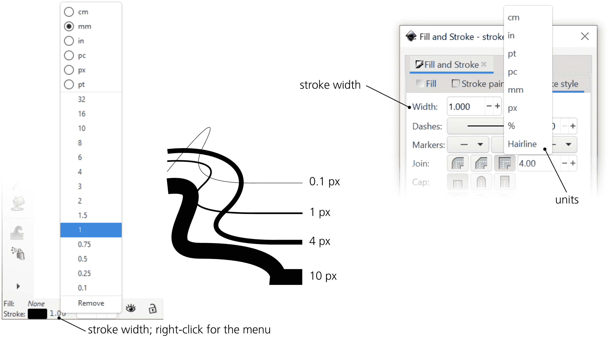

图 9-1：所选样式指示器右键菜单中的描边宽度（左）和填充与描边对话框（右）

在所选样式指示器中，你可以通过直接右键点击描边色板旁边的数字，并从弹出菜单中选择一个值来更改描边宽度。在同一菜单中，你还可以选择描边宽度的单位；默认单位是`px`（SVG 像素）。

类似于使用颜色手势编辑填充或描边颜色（8.7），你也可以通过将描边宽度值拖动到画布上，来交互式地更改选区的描边宽度。沿 45 度无变化轴（从你开始拖动的点出发）向上和向左拖动，会使选中对象的描边变宽（最多达到原始宽度的 50 倍）；向下和向右拖动会使其变窄（最小为零）。例如，如果你从 1 px 的描边开始，向上和向左拖动会变成 50 px，而向右和向下拖动则会将其缩小到零。通过这种方式，你可以非常快速地调整描边宽度，而无需打开任何对话框或菜单。

在填充和描边对话框中，有一个常规的可编辑字段，你可以输入任何值，以及一个单位选择器。

当你在单位下拉菜单中选择发丝选项作为宽度值时，宽度值本身会被禁用。所选对象的描边将始终看起来像是常规的 1 像素宽度，*无论缩放如何*。对象本身会像往常一样进行缩放，但其描边永远不会变得更薄或更厚。

大纲模式 (3.14) 将文档中的*所有*对象显示为好像它们有一条发丝宽的描边，无论缩放如何，该描边始终保持 1 像素宽。可见发丝模式 (3.14) 允许你放大描边，但不能缩小，因此无论你如何缩小，描边始终*至少*为一个屏幕像素宽。然而，与填充和描边对话框中的发丝设置不同，这些模式只是 Inkscape 特定的编辑便利功能，不会影响文档的 SVG 代码。

### 9.1.1 多个对象中的描边宽度

当选择包含多个具有不同描边的对象时，所选样式指示器会*平均*这些对象中所有具有描边的对象的描边宽度。例如，如果两个所选对象中一个有 3 像素的描边，另一个有 1 像素的描边，则指示器会显示 2（工具提示会显示这是一个平均值）。

现在，如果你通过右键菜单或拖动设置任何宽度，相同的宽度将分配给所有最初有描边的所选对象。例如，如果其中一个对象有 3 像素的描边，而另一个没有描边，则它会显示 3 作为描边宽度，并在描边涂料选框中显示不同，但你设置的任何新宽度将*仅*分配给最初有 3 像素描边的对象。

填充和描边对话框表现不同。当在选择中检测到不同的描边宽度时，描边宽度单位会切换到百分比单位（%），并且显示值为 100%。例如，如果你将其更改为 200% 并按回车键，选择中的每个描边宽度将变为原来的两倍宽。所有原本不同的描边宽度将继续保持不同，显示值会再次变为 100%。

在同一个对话框中，你同样可以将单位选择器从百分比（%）切换为任何绝对单位，并为任意数量的所选对象分配相同的描边宽度。另一方面，即使只选择了一个对象，你仍然可以切换到百分比单位，并指定新宽度作为原始宽度的百分比。

## 9.2 连接

描边始终跟随路径，而路径可以有尖锐的转折点，称为*尖点*。通常，尖点是两个路径段在一个角度处连接的节点 (12.5.5)，但你不需要节点就能创建尖点：即使在贝塞尔曲线的中间，也能创建一个尖锐的尖点（见 图 12-6，左下角）。

描边在角尖处的表现由两个样式属性决定：*连接类型*和*锐角限制*，可以在填充和描边对话框的描边样式选项卡上进行编辑，如图 9-2 所示。三种可能的连接类型，通过三个切换按钮表示，分别是圆形连接、斜切连接和锐角连接（默认）。

圆形连接

这模拟了用完全圆形的笔描绘连接的效果。外部形状是一个平滑的圆弧，其中心位于角尖处的路径中心线。这种选项最适用于主要是曲线的路径，偶尔的角尖如果不圆化可能会显得不协调。

斜切连接

这种连接基本上与锐角连接相同（见下文），但将锐角限制设置为 0\。这意味着对于*任何*角度，角落都会被*斜切*——一条垂直于角尖二等分线的直线。

锐角连接

在这种连接类型中，它的外观取决于角尖角度的尖锐程度。对于那些角度不是太尖锐的情况，描边在角尖处的外轮廓将由两条直线段延续，这两条直线段在连接的两侧与描边切线相切，直到这些直线交叉。因此，连接处被装饰上一个尖锐的峰值，称为*锐角*，随着连接处角度的减小，锐角变得越来越长和尖锐，可能会超出角尖节点的位置。

然而，这会导致一个问题。锐角可以多长？显然，当连接处的角度变为零时（这是完全合法的），锐角将会是*无限*长的。为了防止这种情况，锐角限制控制设置了锐角的*最大长度*，单位为描边宽度。例如，默认的锐角限制为 4，当锐角短于 4 个描边宽度时，它仍然保持尖锐，但一旦你减少角度使得锐角长于这个长度，它将在距离连接 4 个描边宽度的地方被切割——*斜切*。

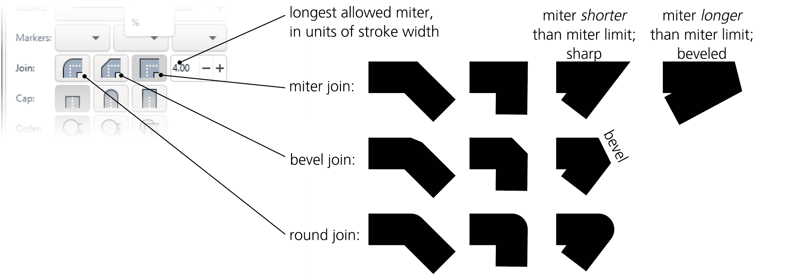

图 9-2：填充和描边对话框中的描边连接控制

在描边文本对象中，描边连接设置的艺术效果可能是最明显的，正如图 9-3 所示。

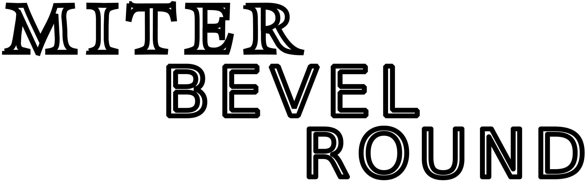

图 9-3：描边文本的连接设置效果

## 9.3 端点

开放路径需要知道如何绘制描边的端点。在这里，也有三个选项，类似于三种连接类型：描边端点可以是*平头*、*圆形*或*方形*（图 9-4）。

平头端点

粗暴地在路径的末端节点处，垂直于描边方向切断描边。

圆形端点

添加一个半圆形的突起，平滑地圆化描边的末端。

方形端点

向描边末端添加一个半方形的突起。

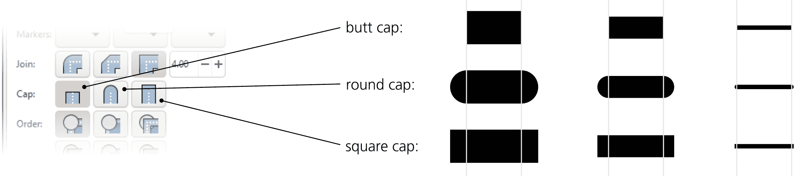

图 9-4：填充和描边对话框中的描边端点选项

圆形和方形端点都会使一个开放路径的长度增加其整个宽度，并在每个端点处添加一个半描边宽度的端点。只有使用平头端点（本质上意味着没有端点），路径的长度才正好等于其端节点之间的距离。

连接和端点选项的效果仅在描边足够宽或者放大时可见；对于仅渲染为两到三个屏幕像素的描边，它们几乎不会产生视觉差异（除非是长的斜接）。

## 9.4 虚线模式

描边不需要从路径的起点到终点连续。如果你使用 SVG，可以通过常规的虚线模式，以任意长度的间隔分隔虚线，来描绘路径。如果你知道相应的 CSS 语法，你甚至可以为自己的使用创建新的虚线模式（使用**选择器和 CSS**对话框，16.3）。否则，请选择填充和描边对话框提供的许多预定义模式之一，如图 9-5 所示。

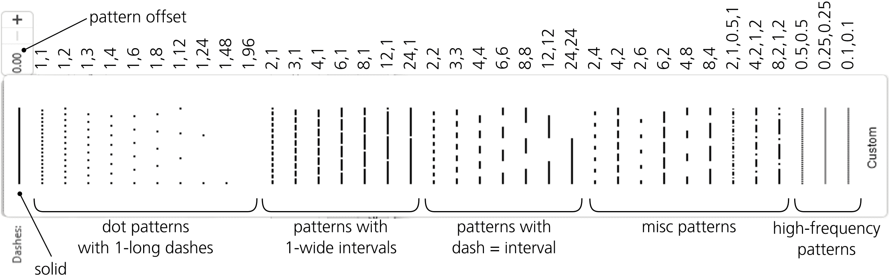

图 9-5：填充和描边对话框中的虚线模式

所有虚线模式都以描边宽度为基准定义，这意味着当你调节描边的宽度时，模式会按比例放大或缩小。按照从最常见到最独特的顺序，预定义的模式包括：

+   由点组成的虚线模式（即描边段的长度等于描边宽度），间隔为 1、2、3、4、6 等，直到 48 描边宽度。

+   具有长虚线（1、2、3，依此类推，直到 24 描边宽度）和单一描边宽度间隔的模式。

+   具有相等的虚线和间隔长度的模式，范围从 2 到 24 描边宽度。

+   具有不同虚线和间隔宽度的模式：2 和 4，4 和 2，2 和 6，6 和 2，2 和 8，8 和 2。

+   先是长虚线，后是短虚线的模式。

+   虚线和间隔长度相等，且短于描边宽度，从 0.5 到 0.1 描边宽度（例如，一个“方形”路径，其长宽相等，将有五个 0.1,0.1 的重复模式）。

+   与你预期的相反，**自定义**选项并不允许你以一种直观的方式编辑模式——它只是一个看似随机的模式，你仍然只能在 CSS 编辑器中进行编辑。

虚线模式选择器旁边的“模式偏移”字段允许你通过给定的距离（仍然以描边宽度为单位）*偏移*所选模式。例如，如果你使用一个由两个虚线和两个间隔组成的模式，但希望路径从一个间隔开始，可以将其偏移 2。

请注意，笔画端点（9.3）也会影响破折号。如果你设置路径使用圆形或方形端点，它们将被添加到每个破折号的两端。因此，每个破折号的长度将比使用默认的平头端点时长一个完整的笔画宽度。例如，1,1 的破折号模式在使用圆形端点时会失去所有间隔；相邻破折号的圆形端点，每个长 0.5 个笔画宽度，现在会相互接触，如图 9-6 所示。

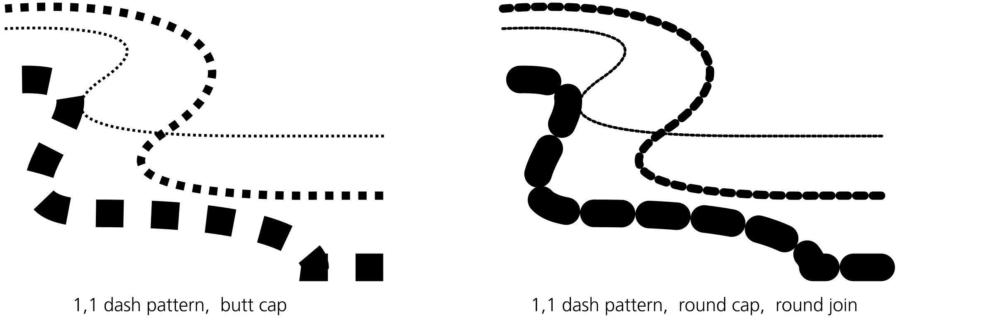

图 9-6：笔画端点对破折号的影响

因此，要创建一个沿路径排列的圆点图案，你需要使用具有*零长度*破折号和圆形端点的破折号模式。Inkscape 在填充和笔画对话框中没有列出这种模式，所以你需要手动创建它。首先，为你的路径分配一个具有所需*间隔长度*的图案，然后在选择器和 CSS 对话框中编辑路径的 `stroke-dasharray` 属性，将其*破折号长度*（第一个值）设置为 0。当然，如果没有圆形或方形端点，这样的图案将使路径完全不可见（这也是它没有包含在标准图案中的原因——记住默认的端点设置是平头端点）。

使用间隔非常宽的点模式（如 1,48）的一种有趣用途是快速创建随机散布的点。使用钢笔工具（14.1.2）绘制一个类似螺旋的涂鸦，并为其分配一个 1,48 的破折号模式，将其变成一团看似不相连的点，如图 9-7 所示。

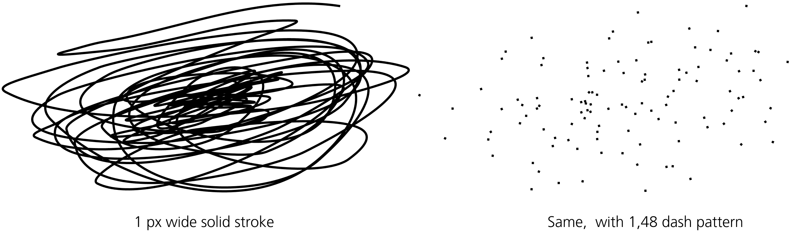

图 9-7：使用间隔较大的破折号数组模拟随机散布的点

此外，破折号模式的规律性与螺旋形相得益彰——螺旋也是一种规则的形状，但由逐渐变长的弯曲组成（11.6）。等距破折号与逐渐变化的路径的相互作用可以产生迷人的图案（图 9-8）。

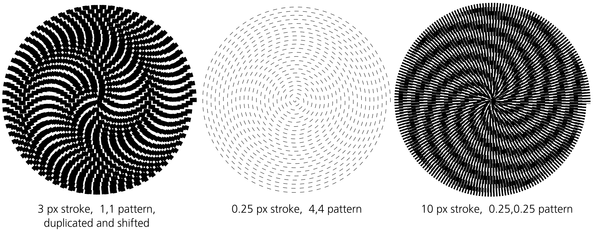

图 9-8：破折号螺旋是一种艺术形式。

## 9.5 标记

*标记* 是附加到路径上的任意对象（或甚至是对象组），并显示为该路径在（某些）节点处的组成部分（12.1）。标记最常见的用途是用于在图表和流程图中创建箭头。

一条路径可以有三种不同类型的标记：起始节点、中间（中）节点和结束节点。每个标记的副本都被放置在节点处，并旋转以跟随该节点处路径的方向。标记的大小与笔画宽度成比例；只需将笔画调整得更窄或更宽，即可缩放路径上的所有标记。

填充和笔画对话框中的笔画样式标签包含三个下拉列表，你可以在其中选择选定路径的起始、中间和结束标记（图 9-9）。

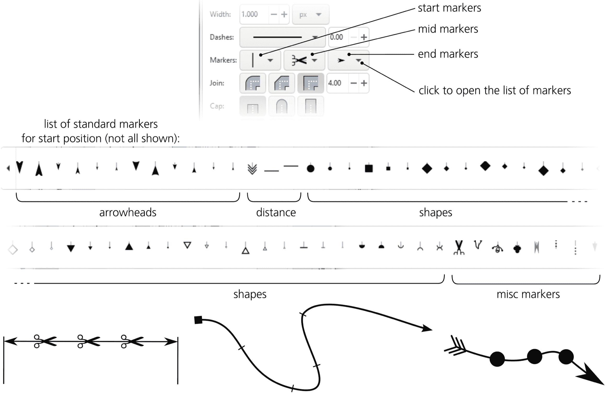

图 9-9：为路径选择标记

这三组列表显示了相同的标记（换句话说，你可以在任何位置使用任何标记），但预览缩略图将它们应用于水平直线路径的起点、中点和终点，因此你可以大致了解标记在实际路径上的外观。

让我们来看一下 Inkscape 的默认标记列表中包含了哪些标记。

箭头

箭头有两种类型：一种是像飞镖一样的，背面有两条直线；另一种是三角形的，箭头背面有一个凹形的圆弧。每种箭头都有三种*尺寸*：大、中、小（这些不是绝对尺寸，而是相对于描边宽度的相对尺寸）。此外，每种尺寸还有两种*方向*：起始和结束。

例如，如果你希望箭头指向路径的*外部*，请在起点选择一个起始方向的箭头标记，在终点选择一个结束方向的箭头标记。如果弄错了，箭头将指向路径的*内部*。或者，你可以选择相同的结束方向箭头标记，用于路径的所有三个位置（起点、中点和终点），这样路径上的所有箭头都会指向路径的终点。如有需要，可以使用**路径 ▶ 反转**菜单项来反转路径（详细信息请参见 12.1.1）。

箭尾

箭尾标记仅提供一个尺寸（与大号箭头匹配）和一个方向（作为结束标记很有意义，即指向路径的起点）。

距离测量标记

距离测量标记只是箭头标记，在箭头尖端添加了垂直的直线。它们有两个方向，一个是起始标记，另一个是结束标记。

几何形状

有一组几何形状标记：圆点、方形、菱形（旋转 45 度的方形）、等边三角形、直线停止符号、填充和空心半圆标记。大多数都有实心和空心变体。与箭头一样，这些标记也有三种尺寸（大、中、小）；有些标记还具有起点和终点方向（尽管对于对称标记，如菱形，方向仅在标记相对于其节点的位置上有所不同）。三角形标记的起点和终点变体可以作为另一种箭头形状使用。

杂项标记

有几个花哨的标记，特别是剪刀标记（将其分配给中间标记以创建典型的“断开线”）和“无限线”省略号结尾。

如果文档中已经使用了一些自定义标记，这些标记将添加到下拉标记菜单的顶部，与下面的默认 Inkscape 标记分开。要从路径中移除标记，请选择列表中最上面的空行。

### 9.5.1 中间标记和节点

起始和结束标记比较简单，因为它们在路径上的位置永远不会令人意外（尽管有时它们的方向可能会令人意外，如果结束节点有一个非常短的贝塞尔控制柄，对曲线形状影响不大，但可能会导致该节点的标记朝一个意想不到的方向旋转）。中间标记则更有趣：它们位于路径的中间节点(12.1)，这些节点的位置可能不是你需要或预期的。

一个简单的使用案例是由直线段组成的路径（没有贝塞尔曲线）。在这样的路径上，拐角处将显示中间标记。使用没有起始或结束变体的标记，它们在节点周围对称地定位——例如，点或方形标记(Figure 9-10)。

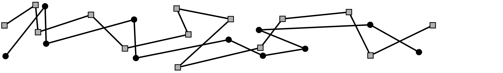

图 9-10：路径连接处的中间标记

你可能希望像虚线模式那样均匀地填充路径中的中间标记，虚线模式会沿路径定期重复。这对于直线路径来说很容易，只需根据需要添加或移除任何数量的中间节点而不改变直线形状。然而，在更复杂的路径中，某些节点可能是为了保持路径的形状而必需的，而你无法在不扭曲形状的情况下沿路径移动这些节点。你也不能选择*不*在这些节点上应用标记：在 SVG 中，中间标记适用于所有中间节点，无一例外。因此，可能无法在路径上完美地均匀分布标记；然而，期望的标记间隔越短，路径越简单，这种不均匀性就越不明显。

如何在不改变路径形状的情况下添加节点？可以通过在路径上双击或按住 Ctrl-Alt 键点击路径的任意位置来使用节点工具(12.5.3)添加一个新节点。然而，为了使节点分布均匀，另一个快捷键更为实用：按 Insert 键将在选定节点之间的每个段落中间创建一个新节点（并将新节点添加到节点选择中，因此你可以通过反复按 Insert 键来不断添加节点）。

例如，选择一个由两个节点组成的路径并按 Insert 键，会在中间添加一个新节点。现在，你有三个已选择的节点，两个节点之间有两个段，因此再次按 Insert 键会添加两个新节点；再按一次 Insert 键，会添加四个新节点，依此类推。在这种简单的情况下，所有节点将始终均匀分布。然而，如果路径中已经有一些中间节点，选择所有节点并反复按 Insert 键时，将会在最初节点较多的区域添加更多的节点，如 Figure 9-11 所示。

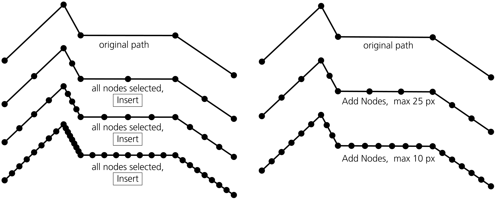

图 9-11：通过反复按 Insert 键添加中间节点（左）和使用 Add Nodes 扩展（右）

创建均匀分布节点的更好方法是使用扩展功能“扩展”▶“修改路径”▶“添加节点”扩展（13.4.2.1）。在这个扩展中，你可以指定最大段长度（以`px`为单位）或所需的精确段数，算法将添加节点（不会移动或删除任何现有节点）以满足这些约束，从而生成均匀的节点间距。

在节点工具中删除单个节点的方法是按住 Ctrl-Alt 并点击该节点，或者选择该节点并按 Delete 键（12.5.3）。删除多个非关键节点（那些仅仅是为了标记而添加的，不影响路径形状的节点）的好方法是使用“简化”命令（12.3）。当然，“简化”命令并不能真正*知道*哪些节点是必需的，哪些不是；它会尝试猜测——通常效果还不错，尽管可能会出现不需要的节点和轻微的形状扭曲。

### 9.5.2 上色标记

通常情况下，图表和流程图中的连接线是黑色的，因此 Inkscape 提供的默认标记是纯黑色或黑色带白色填充。然而，如果你有蓝色或红色的连接线，通常你也希望该线上的箭头头部是蓝色或红色的。这正是 Inkscape 默认的做法：当将标记分配到路径时，它会重新上色以匹配路径的描边颜色。当你更改带有标记路径的描边颜色时，标记也会被更新。

这种颜色匹配并不是 SVG 中的标准行为——这只是 Inkscape 为了方便用户所做的处理。在幕后，每当你更改描边颜色时，Inkscape 会创建每个已分配标记的副本，使用新的颜色重新绘制它，并重新将其分配回路径。这就是为什么你会在“填充与描边”面板的顶部看到不同颜色的标记副本（正如你所记得的，它会将文档的自定义标记列在标准标记之前）。好消息是，如果你不喜欢这种行为，你可以在“首选项”▶“行为”▶“标记”中禁用它，具体如图 9-12 所示。

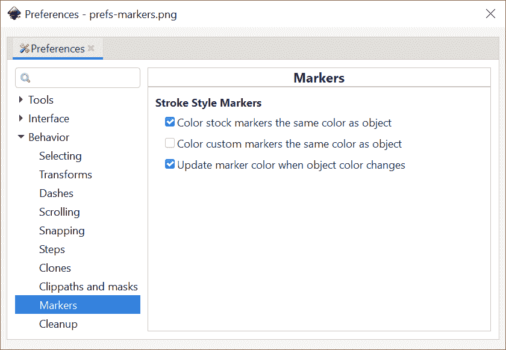

图 9-12：标记行为偏好设置

禁用自动标记上色的一个原因是，如果你只想将路径用作标记的隐形串线——换句话说，你希望看到标记但隐藏描边本身。为此，首先将标记分配到有描边的路径上，然后移除描边（例如，通过在所选样式指示器中中键点击描边样本，8.6）。如果你将“对象颜色变化时更新标记颜色”设置为关闭，这将满足你的需求：在隐形路径上显示标记。

当标记和其描边有不同颜色时，还需要考虑的是渲染顺序（9.6）。默认情况下，描边先被绘制，因此如果它与标记的颜色不同，只有当标记是透明的时，描边才会从标记下方显示出来。

[1.1]

标记的自动着色是 Inkscape 最近的一个创新；在该功能推出之前，唯一的实现方法是通过扩展功能 ▶ 修改路径 ▶ 颜色标记。这个扩展仍然可用，并且有时很有用，因为它提供了一些额外的选项。使用它，你不仅可以为标记上色使其与对象匹配，还可以交换填充和描边颜色，选择性地包含透明度，或者为填充和描边提供你自己的颜色。（如果你希望为标记做更复杂的涂装，请参阅下一节，了解如何将标记转换为常规可编辑对象并再转回。）

### 9.5.3 创建新标记

标记不必是一个用纯色填充的单一对象。它可以由任意数量的对象组成，这些对象可以是分组的或未分组的，具有任意的填充、透明度甚至模糊属性——换句话说，Inkscape 能绘制的任何内容都可以作为路径上的标记。将这种复杂的标记应用到有很多附加节点的路径上（9.5.1）可以产生惊人的组合效果。让我们看看如何从任意对象创建标记。

通常，这只需要选择对象或对象们，然后从对象菜单中选择“对象转为标记”。所选对象将消失，但在“填充与描边”对话框的“描边样式”标签中，你会看到新的标记出现在标记列表的顶部（就在默认标记之前）。你可能需要关闭并重新打开“填充与描边”对话框，以刷新标记列表。

在创建新标记时，Inkscape 假设原始对象的方向应该是水平的，并且沿从左到右的路径排列。例如，如果你有一个新的箭头头部，想将其用作结束标记，在将其转换为标记之前，请确保它水平指向右侧。

类似于标准标记，用户创建的标记会随着描边宽度的变化而缩放。它的初始大小（你将对象转变为标记时的大小）将与 1 像素的描边宽度相对应。

每个标记都有一个 *锚点*——这个点将被放置到该标记附着的节点上。当你创建一个新的标记时，Inkscape 会使用所选对象（第一个对象）的变换固定点（6.4）作为锚点（图 9-13）。默认情况下，固定点位于对象边界框的中心（4.3），这意味着新创建的标记将围绕其节点居中。如果你将固定点移动到对象的一个角落，新标记将通过该角与节点接触。

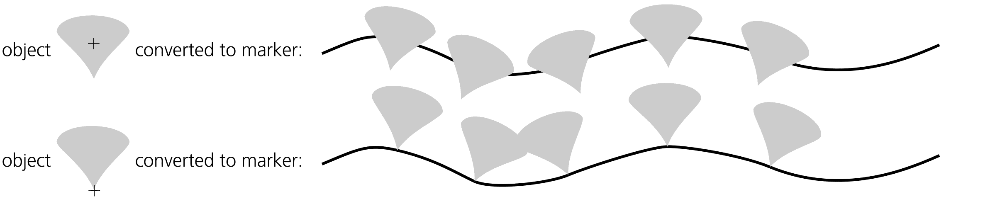

图 9-13：从选定对象创建新标记

你能做到相反的操作，将路径标记转换为对象（例如，编辑它并重新制作成标记）吗？可以，尽管这涉及销毁应用标记的路径（因此你可能希望首先复制路径）。使用路径▶描边到路径命令。它将描边转换为填充路径（12.1.3），但如果原始路径有标记，它还会将转换后的路径与表示以前标记的对象分组。取消分组，选择一个以前的标记，将其旋转到默认方向，并根据需要进行编辑。

### 9.5.4 高级标记

SVG 标记有一些其他有用的选项，这些选项目前在 Inkscape 的用户界面中不可用。要更改这些选项，你需要同时使用选择器和 CSS 对话框（16.3）以及 Inkscape 的 XML 编辑器（4.10）。打开它们。选择一个带有标记的对象，在选择器和 CSS 中找到你感兴趣的标记属性（`marker-start`，`marker-mid`，或`marker-end`），然后点击该行右侧的绿色箭头。这将使 XML 编辑器滚动到你对象所使用的`svg:marker`元素。以下是你可以通过该元素的属性更改的内容：

+   默认情况下，标记会旋转以使其与路径方向对齐。如果你希望标记始终保持相同的方向，无论路径在该点的走向如何，请移除`orient="auto"`属性。

+   如果你不希望标记在描边宽度变化时进行缩放，请添加属性`markerUnits`，值为`userSpaceOnUse`。

## 9.6 渲染顺序 [1.1]

如你所见，一个单一的实心对象——不是一个组——仍然可以有最多三个不同的组件：它的填充、描边和标记。唯一未解决的问题是这些固有组件的渲染顺序。由于不能像处理组中的单独对象那样简单地重新排列它们，SVG 通过它自己的样式属性来控制这一点。这个属性可以在“填充与描边”面板的描边样式选项卡中编辑（图 9-14），它可以拥有六个值，代表三种组件（从下到上的所有可能顺序）的所有排列：

+   填充，描边，标记（默认值）

+   描边，填充，标记

+   填充，标记，描边

+   标记，填充，描边

+   描边，标记，填充

+   标记，描边，填充

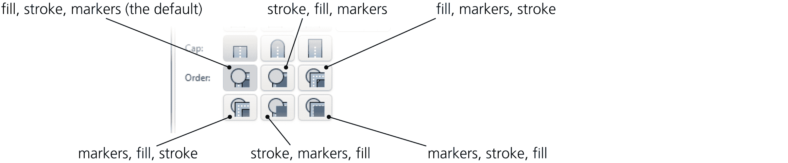

图 9-14：填充与描边面板中的描边样式选项卡上的渲染顺序按钮

每当填充位于描边之上时，它会升至描边所围绕的路径线。因此，如果填充是不透明的（8.3），将填充置于描边之上，视觉效果几乎和描边宽度减半时一样。
